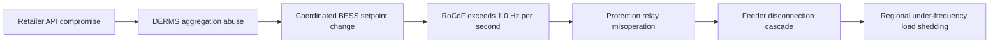

# Cascading Failure Paper Uplift Implementation Plan

> **For agentic workers:** REQUIRED SUB-SKILL: Use superpowers:subagent-driven-development (recommended) or superpowers:executing-plans to implement this plan task-by-task. Steps use checkbox (`- [ ]`) syntax for tracking.

**Goal:** Turn a 29,995-word paper carrying 351 `[investment required]` placeholders into a sourced ~12,000-word research paper plus a separate operational playbook, with every figure traceable to a public source or a stated model.

**Architecture:** The paper keeps its path and slug so both registries and the live URL keep working. Operational material moves to a new playbook registered in both registries. The financial layer is rebuilt from AER Values of Customer Reliability and AEMO planning data through a published formula. Two duplicate appendix blocks are merged.

**Tech Stack:** Markdown in `references/`, TypeScript registries in `web/src/lib/`, Mermaid via `MarkdownViewer`, verification by `npm run build` and `scripts/audit-rendered-completeness.js`.

**Verification note for content work:** the TDD analogue is: write the gate command, run it to see it fail, do the work, run it to see it pass, commit. Never edit first and check later.

**Key paths:**
- Paper: `references/WG-04-CF-Cascading-Failures/WG-04-CF-Cascading Failure Hypothesis.md`
- Playbook (new): `references/WG-04-CF-Cascading-Failures/WG-04-CF-Grid-Incident-Response-Playbook.md`
- Registries: `web/src/lib/papers.ts`, `web/src/lib/wikiRegistry.ts`
- Evidence: `references/external-research/`
- Spec: `notes/2026-09-06/cascading-failure-uplift-spec.md`

**Section map, measured from the current file:**

| Line | Words | Placeholders | Section |
|---:|---:|---:|:---|
| 59 | 4,203 | 1 | 2. Death Wobble Physics |
| 606 | 2,342 | 4 | 3. Cascade Propagation Modeling |
| 964 | 2,451 | 15 | 4. Grid Interdependency Analysis |
| 1317 | 666 | 27 | 5. Economic Impact Assessment |
| 1440 | 779 | 27 | 7. Attack Vector Analysis |
| 1619 | 4,711 | **108** | 9. Strategic Recommendations |
| 2288 | 7,314 | 23 | Appendices (block 1, A-J) |
| 3373 | 5,014 | 50 | 13. Appendices (block 2, A-G) |

---

### Task 1: Capture the baseline so loss is detectable

**Files:**
- Create: `notes/2026-09-06/uplift-baseline.md`

- [ ] **Step 1: Write the baseline capture**

```bash
cd /Users/jimmcknney/jim_private/eigenia
F="references/WG-04-CF-Cascading-Failures/WG-04-CF-Cascading Failure Hypothesis.md"
{
  echo "# Uplift baseline (pre-change)"
  echo
  echo "commit: $(git rev-parse --short HEAD)"
  echo "words: $(wc -w < "$F")"
  echo "lines: $(wc -l < "$F")"
  echo "placeholders: $(grep -o '\[investment required\]' "$F" | wc -l)"
} > notes/2026-09-06/uplift-baseline.md
cat notes/2026-09-06/uplift-baseline.md
```

- [ ] **Step 2: Verify the baseline recorded the expected figures**

Run: `grep -E "^words:|^placeholders:" notes/2026-09-06/uplift-baseline.md`
Expected: `words: 29995` and `placeholders: 351`

- [ ] **Step 3: Commit**

```bash
git add notes/2026-09-06/uplift-baseline.md
git commit -m "docs: capture Cascading Failure baseline before uplift"
```

---

### Task 2: Source outage economics (research only, no drafting)

**Files:**
- Create: `references/external-research/WG-04-CF_outage-cost-vcr_20260906.md`

- [ ] **Step 1: Search for the primary economic anchor**

Use `mcp__valyu__valyu_search` with these queries in turn:
- `AER Values of Customer Reliability determination dollars per kilowatt hour`
- `AEMO Integrated System Plan unserved energy expectation`
- `economic cost of the 2016 South Australia statewide blackout`

- [ ] **Step 2: Write the evidence file**

One file, one section per source, following the governance policy in the root `CLAUDE.md`:

```markdown
# External research: outage cost and Value of Customer Reliability

External research; found via valyu, not the working group's own analysis.

## Source 1: AER Values of Customer Reliability
- Title: <exact page title>
- URL: <exact url>
- Retrieved: 2026-09-06
- Query run: "AER Values of Customer Reliability determination dollars per kilowatt hour"
- Supports: section 5 direct unserved-energy cost, and the VCR attribution correction
- Summary: <3-4 sentences, including the actual $/kWh figures and their vintage>
```

- [ ] **Step 3: Verify the file records real numbers, not descriptions**

Run: `grep -cE '\$[0-9]' references/external-research/WG-04-CF_outage-cost-vcr_20260906.md`
Expected: at least 1. A source file with no figure cannot support a table cell.

- [ ] **Step 4: Commit**

```bash
git add references/external-research/WG-04-CF_outage-cost-vcr_20260906.md
git commit -m "docs(research): file AER VCR and outage cost sources for WG-04-CF"
```

---

### Task 3: Source grid physics and incident precedent

**Files:**
- Create: `references/external-research/WG-04-CF_grid-inertia-rocof_20260906.md`
- Create: `references/external-research/WG-04-CF_blackout-incidents_20260906.md`

- [ ] **Step 1: Search**

Queries for `mcp__valyu__valyu_search`:
- `rate of change of frequency RoCoF protection settings inverter based resources`
- `AEMO power system frequency risk review inertia requirements`
- `UK 9 August 2019 power outage final technical report Ofgem`
- `ENTSO-E continental Europe system separation 8 January 2021 final report`

- [ ] **Step 2: Write both evidence files using the Task 2 shape**

Each source needs title, URL, retrieval date, query run, the claim it supports, and a summary
carrying the actual figures.

- [ ] **Step 3: Verify both files carry quantitative claims**

```bash
cd /Users/jimmcknney/jim_private/eigenia
for f in references/external-research/WG-04-CF_grid-inertia-rocof_20260906.md \
         references/external-research/WG-04-CF_blackout-incidents_20260906.md; do
  echo "$f: $(grep -cE '[0-9]+(\.[0-9]+)? ?(Hz|MW|GW|s\b)' "$f") quantitative claims"
done
```
Expected: at least 3 each.

- [ ] **Step 4: Commit**

```bash
git add references/external-research/
git commit -m "docs(research): file grid inertia and blackout incident sources for WG-04-CF"
```

---

### Task 4: Build the RefDNSP-1.2M reference network specification

**Files:**
- Modify: paper, inserting a new section 2 before `## 2. Death Wobble Physics` at line 59

- [ ] **Step 1: Write the gate that proves ACME is still present**

```bash
cd /Users/jimmcknney/jim_private/eigenia
grep -c "ACME" "references/WG-04-CF-Cascading-Failures/WG-04-CF-Cascading Failure Hypothesis.md"
```
Expected now: non-zero. Target by end of task: `0`.

- [ ] **Step 2: Insert the specification section**

Insert immediately before `## 2. Death Wobble Physics: Grid Frequency Dynamics`:

```markdown
## 2. Reference Network Specification: RefDNSP-1.2M

This analysis is conducted against a specified synthetic distribution network, designated
RefDNSP-1.2M. It is not a specific operator. Its parameters are drawn from published Australian
network data so that every result in this paper can be reproduced or contested.

| Parameter | Value | Basis |
|:---|:---|:---|
| Customers served | 1.2 million | Modelled, mid-size NEM distribution network |
| Critical substations | 185 | Modelled |
| Distributed BESS fleet | 54 units, 270 MW aggregate | AEMO DER register scale [n] |
| Nominal frequency | 50.0 Hz | AEMO NEM operating standard [n] |
| Protection RoCoF threshold | 1.0 Hz/s | AEMO frequency risk review [n] |
| DERMS platform | Vendor-neutral aggregation layer | Modelled |
| Control protocols | DNP3, IEC 61850, ICCP | IEC standards |
| Regulatory regime | SOCI Act, AESCSF SP-2 | Australian Government [n] |

Each `[n]` is replaced with its real citation index in Task 12, after the bibliography is merged.
```

- [ ] **Step 3: Replace every ACME mention**

```bash
cd /Users/jimmcknney/jim_private/eigenia
python3 - <<'PY'
import pathlib
p=pathlib.Path("references/WG-04-CF-Cascading-Failures/WG-04-CF-Cascading Failure Hypothesis.md")
s=p.read_text(errors='replace')
for old,new in [("ACME Inc..","RefDNSP-1.2M"),("ACME Inc.'s","RefDNSP-1.2M's"),
                ("ACME Inc.","RefDNSP-1.2M"),("ACME","RefDNSP-1.2M")]:
    s=s.replace(old,new)
p.write_text(s)
PY
grep -c "ACME" "references/WG-04-CF-Cascading-Failures/WG-04-CF-Cascading Failure Hypothesis.md"
```
Expected: `0`

- [ ] **Step 4: Verify no substitution artifacts**

```bash
grep -cE "RefDNSP-1\.2MRefDNSP|RefDNSP-1\.2M Inc|RefDNSP-1\.2M\.\." \
  "references/WG-04-CF-Cascading-Failures/WG-04-CF-Cascading Failure Hypothesis.md"
```
Expected: `0`

- [ ] **Step 5: Commit**

```bash
git add "references/WG-04-CF-Cascading-Failures/WG-04-CF-Cascading Failure Hypothesis.md"
git commit -m "feat(content): specify RefDNSP-1.2M reference network, retire ACME anonymisation"
```

---

### Task 5: Rebuild section 5 Economic Impact from sources

**Files:**
- Modify: paper, `## 5. Economic Impact Assessment` at line 1317

- [ ] **Step 1: Gate first**

```bash
cd /Users/jimmcknney/jim_private/eigenia
awk '/^## 5\. Economic Impact/,/^## 6\./' \
  "references/WG-04-CF-Cascading-Failures/WG-04-CF-Cascading Failure Hypothesis.md" \
  | grep -c "investment required"
```
Expected now: `27`. Target: `0`.

- [ ] **Step 2: Insert the derivation basis so every later figure is reproducible**

Place directly after the section 5 opening paragraph:

```markdown
### 5.1 Derivation Basis

Every monetary figure in this section derives from published inputs through the relations below.
A reader holding the cited sources can reproduce or contest any value.

$$E_{\text{unserved}} = N_{\text{customers}} \times \bar{P}_{\text{demand}} \times t_{\text{restore}}$$

$$C_{\text{direct}} = \text{VCR} \times E_{\text{unserved}}$$

VCR is the Value of Customer Reliability in dollars per kilowatt hour, determined by the Australian
Energy Regulator [n]. Determination of VCR has been the AER's statutory responsibility since the
Australian Energy Market Commission's final rule of July 2018. The earlier 2014 NEM-wide study was
produced by AEMO [n].

Figures marked **modelled** are not measured outcomes. Their assumptions are stated inline.
```

- [ ] **Step 3: Rebuild each hollowed table**

Every cell takes one of exactly two forms:
- computed with a citation, for example `$412M [4]`
- modelled with its assumption, for example `$180M (modelled: 24h restoration)`

No third form. No bare number without one or the other.

- [ ] **Step 4: Run the gate**

Repeat the Step 1 command. Expected: `0`

- [ ] **Step 5: Commit**

```bash
git add "references/WG-04-CF-Cascading-Failures/WG-04-CF-Cascading Failure Hypothesis.md"
git commit -m "feat(content): rebuild section 5 economics from AER VCR determinations"
```

---

### Task 6: Rebuild section 9 Strategic Recommendations (108 placeholders)

**Files:**
- Modify: paper, `## 9. Strategic Recommendations` at line 1619

The largest hollowed block. Work subsection by subsection and commit after each, so one bad batch
can be reverted alone.

- [ ] **Step 1: Gate first**

```bash
cd /Users/jimmcknney/jim_private/eigenia
awk '/^## 9\. Strategic Recommendations/,/^## 10\./' \
  "references/WG-04-CF-Cascading-Failures/WG-04-CF-Cascading Failure Hypothesis.md" \
  | grep -c "investment required"
```
Expected now: `108`. Target: `0`.

- [ ] **Step 2: List the subsections to work through**

```bash
awk '/^## 9\. Strategic Recommendations/,/^## 10\./' \
  "references/WG-04-CF-Cascading-Failures/WG-04-CF-Cascading Failure Hypothesis.md" | grep -nE '^### '
```

- [ ] **Step 3: Replace cost figures using published remediation benchmarks**

Where no public benchmark exists for a control cost, do not invent one. Convert the cell to a
relative band with its basis stated, for example
`Capital band B (modelled: 0.5-1.5% of regulated asset base)`, and add the original row to the cut
list created in Task 11.

- [ ] **Step 4: Re-run the gate after each subsection**

The count must fall monotonically and reach `0`.

- [ ] **Step 5: Commit per subsection**

```bash
git add "references/WG-04-CF-Cascading-Failures/WG-04-CF-Cascading Failure Hypothesis.md"
git commit -m "feat(content): source section 9 remediation economics"
```

---

### Task 7: Clear remaining placeholders, abstract first

**Files:**
- Modify: paper, line 4 (abstract) and sections at lines 606, 964, 1440

- [ ] **Step 1: Locate every remaining placeholder with context**

```bash
grep -n "investment required" \
  "references/WG-04-CF-Cascading-Failures/WG-04-CF-Cascading Failure Hypothesis.md" | cut -c1-160
```

- [ ] **Step 2: Fix the abstract first**

It currently reads `estimated economic impact between [investment required] million and
[investment required] billion`. Replace with the computed range from Task 5, carrying its citation.
This is the single most damaging line on the site.

- [ ] **Step 3: Run the whole-file gate**

```bash
grep -c "investment required" \
  "references/WG-04-CF-Cascading-Failures/WG-04-CF-Cascading Failure Hypothesis.md"
```
Expected: `0`

- [ ] **Step 4: Clear the sibling placeholder classes**

```bash
grep -cE "implementation period required|\[RESEARCH GAP" \
  "references/WG-04-CF-Cascading-Failures/WG-04-CF-Cascading Failure Hypothesis.md"
```
Expected: `0`. Baseline held 20 of the first and 1 of the second.

- [ ] **Step 5: Commit**

```bash
git add "references/WG-04-CF-Cascading-Failures/WG-04-CF-Cascading Failure Hypothesis.md"
git commit -m "feat(content): clear remaining placeholders including the abstract"
```

---

### Task 8: Extract the operational playbook

**Files:**
- Create: `references/WG-04-CF-Cascading-Failures/WG-04-CF-Grid-Incident-Response-Playbook.md`
- Modify: paper (remove the extracted sections)

Move, because they are operational rather than analytic:
- `## 8. Recovery Procedures` (line 1545)
- Block 1: `Appendix G: Attack Detection Signatures and IOCs`, `Appendix H: Recovery and Resilience Procedures`, `Appendix J: Stakeholder Communication and Coordination Protocols`
- Block 2: `Appendix D: Indicators of Compromise` through `File Hashes (SHA256)`, and `Appendix E: Security Control Catalog`

Keep in the paper: Physics Calculations, Economic Impact Methodology, Advanced Grid Stability
Modeling, BESS Thermal Runaway Physics, Methodological Transparency, Vulnerability Catalog,
MITRE ATT&CK mapping, Risk Calculation Methodology, References.

- [ ] **Step 1: Record the word count before the move**

```bash
wc -w "references/WG-04-CF-Cascading-Failures/WG-04-CF-Cascading Failure Hypothesis.md"
```

- [ ] **Step 2: Create the playbook with a real opening**

```markdown
## 1. Purpose and Scope

This playbook holds the operational procedures supporting the cascading failure analysis of
RefDNSP-1.2M. The analysis itself, including the physics, the cascade model and the economic
impact assessment, is published separately as Cascading Failure Hypothesis at
/papers/cascading-failure-hypothesis.

Procedures assume a distribution network operator carrying SOCI Act obligations and an AESCSF
SP-2 target maturity.
```

- [ ] **Step 3: Move each section, then verify the move conserved words**

```bash
cd /Users/jimmcknney/jim_private/eigenia
A=$(wc -w < "references/WG-04-CF-Cascading-Failures/WG-04-CF-Cascading Failure Hypothesis.md")
B=$(wc -w < "references/WG-04-CF-Cascading-Failures/WG-04-CF-Grid-Incident-Response-Playbook.md")
echo "A=$A B=$B total=$((A+B)) baseline=29995 delta=$((A+B-29995))"
```
A negative delta is acceptable only for content on the Task 11 cut list. Any unexplained negative
delta means content was lost in the move: stop and recover it before continuing.

- [ ] **Step 4: Commit**

```bash
git add references/WG-04-CF-Cascading-Failures/
git commit -m "refactor(content): extract operational playbook from the research paper"
```

---

### Task 9: Register the playbook in both registries

**Files:**
- Modify: `web/src/lib/papers.ts`
- Modify: `web/src/lib/wikiRegistry.ts`

An unregistered file is unreachable and the build stays green. This is exactly how the DEXPI
position paper sat unpublished.

- [ ] **Step 1: Gate showing it is currently unreachable**

```bash
cd /Users/jimmcknney/jim_private/eigenia
grep -c "Grid-Incident-Response-Playbook" web/src/lib/papers.ts web/src/lib/wikiRegistry.ts
```
Expected now: `0` for both.

- [ ] **Step 2: Add the papers.ts entry, after the `cascading-failure-hypothesis` block**

```typescript
  "grid-incident-response-playbook": {
    title: "Grid Incident Response Playbook: Procedures for Cascading Failure Events",
    category: "Cascading Failures",
    number: "TRACK 07-D",
    relativePath: "references/WG-04-CF-Cascading-Failures/WG-04-CF-Grid-Incident-Response-Playbook.md",
  },
```

- [ ] **Step 3: Add the wikiRegistry.ts entry to the WG-04-CF documents array**

```typescript
      {
        id: "WG-04-CF-Grid-Incident-Response-Playbook",
        slug: "grid-incident-response-playbook",
        title: "Grid Incident Response Playbook",
        titleNl: "Draaiboek Incidentrespons Elektriciteitsnet",
        subtitle: "SITREP formats, board reporting, notification matrices and recovery run-books",
        subtitleNl: "SITREP-formaten, bestuursrapportage, notificatiematrices en herstelprocedures",
        workingGroupId: "WG-04-CF",
        workingGroupName: "Cascading Failures",
        workingGroupNameNl: "Ketenuitval & Instabiliteit",
        relativePath: "references/WG-04-CF-Cascading-Failures/WG-04-CF-Grid-Incident-Response-Playbook.md",
        author: "J. McKenney",
        badge: "Playbook",
        badgeNl: "Draaiboek",
      },
```

- [ ] **Step 4: Update the WG-04-CF badge range**

In `wikiRegistry.ts` the group reads `badge: "CASCADING FAILURES 01–03"` and
`badgeNl: "KETENUITVAL 01–03"`. Change both `03` to `04`.

- [ ] **Step 5: Verify registry coverage is complete**

```bash
cd /Users/jimmcknney/jim_private/eigenia
python3 -c "
import pathlib,re
disk={str(p.relative_to('references')) for p in pathlib.Path('references').rglob('*.md')}
pap=set(re.findall(r'relativePath: \"references/([^\"]+)\"', pathlib.Path('web/src/lib/papers.ts').read_text()))
wik=set(re.findall(r'relativePath: \"references/([^\"]+)\"', pathlib.Path('web/src/lib/wikiRegistry.ts').read_text()))
print('disk',len(disk),'papers',len(pap),'wiki',len(wik))
print('unregistered in papers:',sorted(disk-pap))
print('unregistered in wiki:',sorted(disk-wik))
"
```
Expected: all three counts equal 47, both unregistered lists empty.

- [ ] **Step 6: Commit**

```bash
git add web/src/lib/papers.ts web/src/lib/wikiRegistry.ts
git commit -m "feat(content): register the grid incident response playbook in both registries"
```

---

### Task 10: Merge the two duplicate appendix blocks

**Files:**
- Modify: paper, `## Appendices` (line 2288) and `## 13. Appendices` (line 3373)

The paper carries two appendix blocks with colliding letters: two Appendix A, B, C, D, E, F and G.
The glossary appears twice, as `Appendix I: Glossary` and `Appendix A: Technical Glossary`.

- [ ] **Step 1: Prove the collision**

```bash
cd /Users/jimmcknney/jim_private/eigenia
grep -oE '^### Appendix [A-J]' \
  "references/WG-04-CF-Cascading-Failures/WG-04-CF-Cascading Failure Hypothesis.md" \
  | sed -E 's/.*Appendix //' | sort | uniq -d
```
Expected now: several duplicate letters. Target: no output.

- [ ] **Step 2: Merge into one block with a single letter sequence**

After the Task 8 extraction, reletter the surviving analytic appendices A onward in reading order
under a single `## Appendices` heading. Delete the now-empty `## 13. Appendices` heading.

- [ ] **Step 3: Merge the two glossaries**

Combine `Appendix I: Glossary` and `Appendix A: Technical Glossary` into one, keeping every
distinct term from both. Deduplicate only exact repeats.

- [ ] **Step 4: Run the gate**

Repeat the Step 1 command. Expected: no output.

- [ ] **Step 5: Commit**

```bash
git add "references/WG-04-CF-Cascading-Failures/WG-04-CF-Cascading Failure Hypothesis.md"
git commit -m "refactor(content): merge duplicate appendix blocks into one lettered sequence"
```

---

### Task 11: Promote the limitations section and publish the cut list

**Files:**
- Modify: paper (promote `Appendix F: Methodological Transparency and Uncertainty Quantification`)
- Create: `notes/2026-09-06/uplift-cut-list.md`

The spec asked for a new limitations section. It already exists as an appendix. Promote it rather
than write a second one.

- [ ] **Step 1: Promote it to a numbered section**

Move `Appendix F: Methodological Transparency and Uncertainty Quantification` to
`## 8. Limitations and Threats to Validity`, placed immediately before the conclusion. Section 8
is free because Task 8 moved `Recovery Procedures` to the playbook.

- [ ] **Step 2: Add what the uplift itself could not establish**

Append, in plain terms: which figures are modelled rather than measured; that RefDNSP-1.2M is
synthetic and no real operator is being characterised; and that cascade timings derive from
published incidents in other networks rather than observation of this one.

- [ ] **Step 3: Write the cut list, itemised**

```markdown
# Uplift cut list

Content removed rather than moved, with the reason for each.

| Content | Words | Reason |
|:---|---:|:---|
| <exact heading or table row> | <n> | no defensible public source; retaining it would require invention |
```

- [ ] **Step 4: Reconcile the word budget**

```bash
cd /Users/jimmcknney/jim_private/eigenia
A=$(wc -w < "references/WG-04-CF-Cascading-Failures/WG-04-CF-Cascading Failure Hypothesis.md")
B=$(wc -w < "references/WG-04-CF-Cascading-Failures/WG-04-CF-Grid-Incident-Response-Playbook.md")
CUT=$(awk -F'|' '/^\| / && $3 ~ /[0-9]/ {gsub(/ /,"",$3); s+=$3} END{print s+0}' notes/2026-09-06/uplift-cut-list.md)
echo "A=$A + B=$B + cut=$CUT = $((A+B+CUT)) against baseline 29995"
```
Expected: within 2% of 29,995. A larger gap means content was lost rather than moved or cut.

- [ ] **Step 5: Commit**

```bash
git add "references/WG-04-CF-Cascading-Failures/WG-04-CF-Cascading Failure Hypothesis.md" notes/2026-09-06/uplift-cut-list.md
git commit -m "feat(content): promote limitations to a numbered section, publish the cut list"
```

---

### Task 12: Merge the bibliographies and renumber citations

**Files:**
- Modify: paper, `## 11. References` (line 2238) and `Appendix G: References and Bibliography`

- [ ] **Step 1: Inventory markers and entries**

```bash
cd /Users/jimmcknney/jim_private/eigenia
python3 -c "
import re,pathlib
t=pathlib.Path('references/WG-04-CF-Cascading-Failures/WG-04-CF-Cascading Failure Hypothesis.md').read_text(errors='replace')
m=sorted({int(x) for x in re.findall(r'\[(\d{1,3})\]',t)})
print('markers:',m)
"
```

- [ ] **Step 2: Merge both bibliographies into one numbered list under `## 9. References`**

Include every source filed in `references/external-research/` during Tasks 2 and 3.

- [ ] **Step 3: Replace every `[n]` inserted in Tasks 4 and 5 with its real index**

- [ ] **Step 4: Verify no marker outranges the bibliography**

```bash
cd /Users/jimmcknney/jim_private/eigenia
python3 -c "
import re,pathlib
t=pathlib.Path('references/WG-04-CF-Cascading-Failures/WG-04-CF-Cascading Failure Hypothesis.md').read_text(errors='replace')
body,refs=t.split('## 9. References',1)
markers={int(x) for x in re.findall(r'\[(\d{1,3})\]',body)}
entries={int(x) for x in re.findall(r'^\s*(\d{1,3})\.',refs,re.M)}
print('orphaned markers:',sorted(markers-entries))
print('uncited entries:',sorted(entries-markers))
"
```
Expected: `orphaned markers: []`

- [ ] **Step 5: Commit**

```bash
git add "references/WG-04-CF-Cascading-Failures/WG-04-CF-Cascading Failure Hypothesis.md"
git commit -m "feat(content): merge bibliographies and renumber citations"
```

---

### Task 13: Add the four Mermaid diagrams

**Files:**
- Modify: paper, sections 2, 3, 4 and 5

- [ ] **Step 1: Confirm the renderer dispatches mermaid**

```bash
grep -n "mermaid" /Users/jimmcknney/jim_private/eigenia/web/src/components/MarkdownViewer.tsx
```
Expected: a branch dispatching to `MermaidDiagram`.

- [ ] **Step 2: Add the cascade propagation diagram to section 5**

````markdown

````

- [ ] **Step 3: Add the remaining three**

Purdue-level attack path, RoCoF against system inertia, and the cross-sector dependency graph.
Node labels must avoid unquoted parentheses, colons and `->`, which Mermaid rejects. Every number
appearing in a diagram must already appear in a sourced table.

- [ ] **Step 4: Verify block count and fence parity**

```bash
cd /Users/jimmcknney/jim_private/eigenia
F="references/WG-04-CF-Cascading-Failures/WG-04-CF-Cascading Failure Hypothesis.md"
echo "mermaid blocks: $(grep -c '^```mermaid' "$F")"
python3 -c "
import pathlib
t=pathlib.Path('$F').read_text(errors='replace')
print('fence parity ok:', sum(1 for l in t.split(chr(10)) if l.startswith('\`\`\`'))%2==0)
"
```
Expected: `4` blocks and `fence parity ok: True`. An odd fence count silently swallows the rest of
the document into a code block.

- [ ] **Step 5: Commit**

```bash
git add "references/WG-04-CF-Cascading-Failures/WG-04-CF-Cascading Failure Hypothesis.md"
git commit -m "feat(content): add cascade, attack path, RoCoF and dependency diagrams"
```

---

### Task 14: Cross-reference the corpus and enforce the style contract

**Files:**
- Modify: both documents

- [ ] **Step 1: Verify each cross-reference target exists before linking**

```bash
cd /Users/jimmcknney/jim_private/eigenia
for s in ale-rosi-decision-framework cyhazop-hyperscale-methodology emerging-power-topologies \
         death-wobble-frequency-instability tacam-deep-dive atq-deep-dive; do
  printf "%-38s %s\n" "$s" "$(grep -c "\"$s\"" web/src/lib/papers.ts)"
done
```
Expected: `1` for every slug. Then add the links.

- [ ] **Step 2: Run the style gate**

```bash
cd /Users/jimmcknney/jim_private/eigenia
for F in "references/WG-04-CF-Cascading-Failures/WG-04-CF-Cascading Failure Hypothesis.md" \
         "references/WG-04-CF-Cascading-Failures/WG-04-CF-Grid-Incident-Response-Playbook.md"; do
  echo "$F"
  echo "  em dashes:    $(grep -c '—' "$F")"
  echo "  banned words: $(grep -ciE '\b(leverage|utilize|pivotal|robust|landscape|furthermore|seamless|testament to|at its core)\b' "$F")"
  echo "  glued cites:  $(grep -coE '[a-z]\.[0-9]{1,3}\b' "$F")"
  echo "  long heads:   $(awk '/^#/ && length($0)>90' "$F" | wc -l)"
done
```
Expected: every count `0`.

- [ ] **Step 3: Fix each non-zero count, then re-run Step 2 until clean**

- [ ] **Step 4: Commit**

```bash
git add references/WG-04-CF-Cascading-Failures/
git commit -m "feat(content): cross-reference the corpus and enforce the style contract"
```

---

### Task 15: Full verification, then push

**Files:** none modified; this task only verifies.

- [ ] **Step 1: Content gates**

```bash
cd /Users/jimmcknney/jim_private/eigenia
F="references/WG-04-CF-Cascading-Failures/WG-04-CF-Cascading Failure Hypothesis.md"
P="references/WG-04-CF-Cascading-Failures/WG-04-CF-Grid-Incident-Response-Playbook.md"
echo "placeholders:  $(cat "$F" "$P" | grep -c 'investment required')"
echo "ACME:          $(cat "$F" "$P" | grep -c 'ACME')"
echo "control chars: $(cat "$F" "$P" | grep -cP '[\x09\x0c\x0b]')"
```
Expected: all `0`.

- [ ] **Step 2: Types and build**

```bash
cd /Users/jimmcknney/jim_private/eigenia/web
npx tsc --noEmit; echo "tsc exit: $?"
npm run build 2>&1 | grep -E "AUDIT PASSED|AUDIT FAILED|Compiled successfully"
```
Expected: tsc exit 0, and `AUDIT PASSED: All 47 reference documents`. The count rises from 46
because the playbook is new.

- [ ] **Step 3: Content-loss gate against a live server**

```bash
cd /Users/jimmcknney/jim_private/eigenia/web
pkill -f "next dev"; sleep 3
(npm run dev > /tmp/dev.log 2>&1 &) ; sleep 25
node scripts/audit-rendered-completeness.js; echo "exit: $?"
```
Expected: `AUDIT PASSED`, exit 0. Exit 2 means the server was not answering and the run proves
nothing: restart and repeat.

- [ ] **Step 4: Both documents reachable and rendering**

```bash
for s in cascading-failure-hypothesis grid-incident-response-playbook; do
  h=$(curl -s --max-time 300 "http://localhost:4500/papers/$s")
  printf "%-34s bytes:%-8s katex-err:%s svg:%s\n" "$s" "${#h}" \
    "$(printf '%s' "$h" | grep -o 'katex-error' | wc -l)" \
    "$(printf '%s' "$h" | grep -o '<svg' | wc -l)"
done
```
Expected: both over 20,000 bytes, `katex-err: 0`, and the paper showing several `<svg>` from Mermaid.

- [ ] **Step 5: Push**

```bash
cd /Users/jimmcknney/jim_private/eigenia
git status --short
git push origin main
```
Push only when every gate above has passed. Railway builds from `main`, so pushing deploys.

---

## Self-review against the spec

| Spec requirement | Task |
|:---|:---|
| Economics rebuilt from public sources | 2, 5, 6, 7 |
| VCR attribution corrected to AER | 5 |
| ACME becomes RefDNSP-1.2M | 4 |
| Split into paper plus playbook | 8 |
| Playbook registered in both registries | 9 |
| Limitations section | 11 |
| External research filed per source | 2, 3 |
| Four Mermaid diagrams | 13 |
| Cross-references | 14 |
| Style contract | 14 |
| Word budget reconciled with itemised cut list | 11 |
| Nine verification gates | 15 |

Two spec assumptions corrected by measurement before this plan was written:

1. The limitations section already exists as `Appendix F: Methodological Transparency and
   Uncertainty Quantification`. Task 11 promotes it rather than writing a duplicate.
2. The paper carries **two** appendix blocks with colliding letters and a duplicated glossary. The
   spec did not know this. Task 10 merges them.
