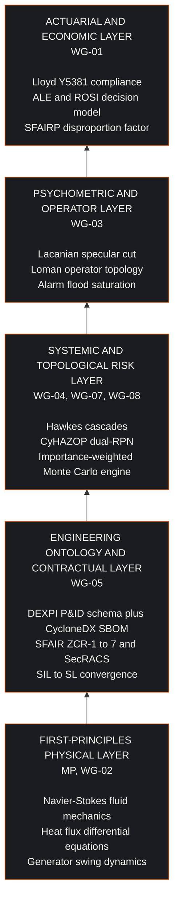

## 1. Executive Synopsis: The Physical and Mathematical Imperative

Critical infrastructure cannot be defended through the abstractions of corporate Information Technology. 

For three decades, contemporary cybersecurity vendors have marketed perimeter firewalls, cloud Security Information and Event Management (SIEM) collectors, and endpoint detection and response (EDR) software as universal safeguards. When deployed into industrial plants, electrical transmission grids, semiconductor fabrication cleanrooms, and chemical synthesis reactors, these tools are ineffective. In multiple documented operational scenarios, they actively harm the facilities they purport to protect.

The root cause of this failure is ontological. Contemporary IT cybersecurity operates on a grammar of packets, hashes, network signatures, and access control lists. Industrial operational technology (OT) operates under the governing laws of thermodynamics, continuum mechanics, fluid dynamics, electrodynamics, and closed-loop control theory. 

A packet filter inspects protocol headers. It determines whether a transmission complies with standard TCP/IP framing. It cannot compute whether an authenticated Modbus Function Code 0x06 (Write Single Register) instruction command will starve a liquid cooling loop, induce cavitation in a centrifugal pump, or precipitate a voltage collapse across an electrical grid. Standard perimeter security tools validate the packet and permit the physical catastrophe. 

IT endpoint agents also inject non-deterministic CPU execution jitter, kernel hooks, and memory locks into deterministic real-time operating systems (RTOS). When an enterprise agent scans an industrial controller, the resulting microsecond latency spike trips the hardware watchdog timer of the safety instrumented system (SIS), causing an emergency plant trip or freezing the safety execution loop.

The Eigenia theoretical and applied research corpus, housed across the nine working groups indexed below, establishes the mathematical, physical, and psychometric foundations of the **Cyber Digital Twin (CDT)**. 

The Cyber Digital Twin replaces static compliance checklists and blind perimeter filters with a continuous, physics-informed state-space model. It integrates:
1. First-principles physical equations governing mass, energy, and momentum conservation.
2. Stochastic and spectral graph mathematics governing cascading failures across interconnected asset nodes.
3. Formal functional safety standards (IEC 61508 / IEC 61511) united with operational cybersecurity baselines (IEC 62443) via mathematical convergence.
4. Psychometric operator topology, modeling human cognitive error rates under acute stress and sensory saturation.
5. Quantitative actuarial loss modeling, enabling binding insurance underwriting and contractual risk allocation under the Lloyd's Market Bulletin Y5381 standard.

---

## 2. Directory Index of the Research Corpus

The `eigenia/references/` repository comprises nine research working groups. Every document provides an empirical or theoretical pillar of the Cyber Digital Twin:

```
eigenia/references/
├── MP-Math-Physics-Formula/
│   ├── MP_Mathematical_Models.md
│   └── MP_Kramers_Escape_Model.md
├── WG-01-UI-Underwriter-insurance/
│   ├── WG-01-UI-1-7-Industry-Value-Prop.md
│   ├── WG-01-UI-1-COPE_detail.md
│   ├── WG-01-UI-1-COPE_summary.md
│   ├── WG-01-UI-1-Competitive_Analysis.md
│   ├── WG-01-UI-1-Cyber_Method.md
│   ├── WG-01-UI-1-Cyber_Risk_Underwriting.md
│   ├── WG-01-UI-1-Overview.md
│   ├── WG-01-UI-1-Req-Improvements.md
│   ├── WG-01-UI-ALE-ROSI-Decision-Framework.md
│   ├── WG-01-UI-Cyber_Observations.md
│   ├── WG-01-UI-Quantitative-Cyber-Physical-FMECA.md
│   └── WG-01-UI-RCIL-SCIL-Reinsurance.md
├── WG-02-DT-Digital-Twin/
│   ├── WG-02-DT-1.md through WG-02-DT-5.md
│   ├── WG-02-DT-Applied-Physics.md
│   ├── WG-02-DT-Cognitive-Digital-Twin.md
│   ├── WG-02-DT-High-Density-Liquid-Cooling.md
│   ├── WG-02-DT-Paradigm-Library.md
│   └── WG-02-DT-Seven-Staff-Fugue.md
├── WG-03-ML-Behaviorial_Modeling/
│   ├── WG-03-ML-Autonomous-OT-Trust-Boundary.md
│   ├── WG-03-ML-Calculus-of-the-Subject.md
│   ├── WG-03-ML-Cognitive-Bias-Catalog.md
│   ├── WG-03-ML-Loman-Operator-Topology-of-an-Act.md
│   ├── WG-03-ML-Mckenney-Lacanian.md
│   ├── WG-03-ML-Morphogenesis-Signifying-Chain-gGNN.md
│   └── WG-03-ML-Musical-Psychometric-Notation.md
├── WG-04-CF-Cascading-Failures/
│   ├── WG-04-CF-Cascading Failure Hypothesis.md
│   ├── WG-04-CF-Death Wobble-The Grids Precarious Pulse Frequency Instability - jmckenney.md
│   ├── WG-04-CF-ERCOT-WECC-IBR-Reliability.md
│   ├── WG-04-CF-Emerging-Power-Topologies.md
│   ├── WG-04-CF-Grid-Incident-Response-Playbook.md
│   ├── WG-04-CF-Grid-Unseen-Tremors.md
│   ├── WG-04-CF-Project-Inertia.md
│   └── WG-04-CF-Unseen-Current.md
├── WG-05-CAD-DEXPI-2/
│   ├── WG-05-CAD-Blast-Radius-Three-Ontologies.md
│   ├── WG-05-CAD-CIM-Profile-Cyber-Physical.md
│   ├── WG-05-CAD-Conformance-Reference-Implementation.md
│   ├── WG-05-CAD-DEXPI-Introduction.md
│   ├── WG-05-CAD-DEXPI-Open-Standard-Position-Paper.md
│   ├── WG-05-CAD-Energy-RefBESS-250MW.md
│   ├── WG-05-CAD-Frontier-AI-Hardware-Security.md
│   ├── WG-05-CAD-IEC62443-SFAIRP-SecRACS.md
│   ├── WG-05-CAD-Manufacturing-RefPharma-API-1.md
│   ├── WG-05-CAD-Rail-RefDepot-EMU-12.md
│   ├── WG-05-CAD-RefBESS-250MW-Specification.md
│   ├── WG-05-CAD-Supply-Chain-EU-CRA.md
│   ├── WG-05-CAD-Three-Identity-Join.md
│   └── WG-05-CAD-Unified-DEXPI-CycloneDX.md
├── WG-07-TM-Threat-Modeling/
│   ├── WG-07-TM-ATQ.md
│   ├── WG-07-TM-CyHAZOP-Methodology.md
│   ├── WG-07-TM-CyHAZOP-Node-Registers.md
│   ├── WG-07-TM-TACAM.md
│   └── atq-card-terminal.html
├── WG-08-MO-Monte-Carlo-Application/
│   └── WG-08-MO-Monte Carlo Engine.md
└── external-research/
    ├── README.md
    ├── WG-04-CF_blackout-incidents_20260906.md
    ├── WG-04-CF_ercot-wecc-ibr-reliability_20260906.md
    ├── WG-04-CF_grid-inertia-rocof_20260906.md
    ├── WG-04-CF_outage-cost-vcr_20260906.md
    ├── WG-04-CF_remediation-cost-benchmarks_20260906.md
    └── WG-05-CAD_nfpa-855-ess-separation_20260908.md
```

---

## 3. Working Group Technical Breakdown

### Group MP: Mathematical and Physical Formulations (`MP-Math-Physics-Formula`)
This working group formalizes the physical state space of critical assets. It rejects empirical heuristics in favor of closed-form physical equations:

1. **Deterministic Thermodynamic and Fluid Dynamics**:
   - High-density thermal die dissipation model:
     $$\frac{dT_j(t)}{dt} = \frac{P_{\text{die}} - h_{\text{conv}}(\dot{Q}_{\text{vol}}) \cdot A_{\text{die}} \cdot (T_j - T_c)}{C_{\text{th}}}$$
     Where $P_{\text{die}}$ represents silicon heat flux ($120\,\text{W/cm}^2$), $h_{\text{conv}}$ is convective heat transfer coefficient as a non-linear function of volumetric coolant flow $\dot{Q}_{\text{vol}}$, and $C_{\text{th}}$ is thermal capacitance.
   - Fluid cavitation threshold via Rayleigh-Plesset formulation:
     $$R \frac{d^2 R}{dt^2} + \frac{3}{2}\left(\frac{dR}{dt}\right)^2 = \frac{1}{\rho_L} \left( P_v - P_{\infty}(t) - \frac{2\gamma}{R} - \frac{4\mu}{R}\frac{dR}{dt} \right)$$
     Determines the microsecond pressure drops where manipulated pump valve actuators destroy impeller surfaces.

2. **Stochastic Risk Models and Phase Transitions**:
   - Kramers Escape Model:
     $$r_K = \frac{\omega_0 \omega_b}{2\pi \gamma} \exp\left(-\frac{\Delta U}{k_B T_{\text{eff}}}\right)$$
     Models the rate at which cyber-induced noise perturbations drive an industrial state variable over a potential energy barrier $\Delta U$ into irreversible physical breakdown.
   - Hill Estimator for Heavy-Tailed Operational Losses:
     $$\hat{\gamma}_{\text{Hill}} = \frac{1}{k} \sum_{i=1}^{k} \ln \frac{X_{(n-i+1)}}{X_{(n-k)}}$$
     Empirically proves that industrial cyber losses do not follow Gaussian distributions. Losses follow Pareto fat-tailed distributions where traditional Value-at-Risk (VaR) models systematically underestimate catastrophic exposure by up to two orders of magnitude.
   - Hawkes Self-Exciting Process for Cascading Network Events:
     $$\lambda(t) = \mu_0 + \sum_{t_i < t} \alpha \cdot \exp(-\beta(t - t_i))$$
     Models the clustering and propagation velocity of protective breaker trips and telemetry dropouts.

---

### Group WG-01: Actuarial Science and Underwriting
This group establishes the economic bridge between physical security controls and commercial risk transfer:

1. **COPE 2.0 (Construction, Occupancy, Protection, Exposure)**:
   - Modernizes commercial property underwriting for cyber-physical infrastructure. Maps physical zoning, SIS isolation, and DEXPI P&ID topology directly into underwriting criteria.

2. **Lloyd's Market Bulletin Y5381 Compliance**:
   - Enforces mandatory catastrophic cyber exclusion clauses and strict attribution protocols for state-backed operational attacks. Provides the empirical evidence required to compress policy deductibles from \$25,000,000 to \$2,500,000.

3. **Quantitative FMECA and ROSI Equations**:
   - Expected Annualized Loss Expectancy ($\text{ALE}$):
     $$\text{ALE} = \text{SLE} \times \text{ARO}$$
   - Return on Security Investment ($\text{ROSI}$):
     $$\text{ROSI} = \frac{\Delta \text{ALE} - C_{\text{control}}}{C_{\text{control}}}$$
   - Reinsurance Cyber Incident Limit ($\text{RCIL}$) and Systemic Cyber Incident Limit ($\text{SCIL}$) allocation models.

---

### Group WG-02: Digital Twin Architecture (`WG-02-DT-Digital-Twin`)
This group defines the core structural engine of the Cyber Digital Twin:

1. **The Seven Staff Fugue 7-Layer Architecture**:
   - **Layer 0: Physical**: Piping, vessels, silicon dies, pumps, steam turbines, breakers.
   - **Layer 1: Sensing & Actuation**: 4-20mA current loops, thermocouples, RTDs, pneumatic positioners.
   - **Layer 2: Real-Time Control**: Programmable Logic Controllers (PLCs), Remote Terminal Units (RTUs), Safety Instrumented Systems (SIS).
   - **Layer 3: Supervisory & Operations**: SCADA, Distributed Control Systems (DCS), Human-Machine Interfaces (HMIs).
   - **Layer 4: Plant Information & Historian**: Operational historians, engineering workstations, MES.
   - **Layer 5: Enterprise Governance**: Purdue Level 4/5 integration, supply-chain SBOM feeds.
   - **Layer 6: Actuarial & Regulatory**: Insurance balance sheets, EU CRA conformity, NIS2, NERC CIP.
   - **Layer 7: Temporal / Predictive**: Monte Carlo forward projection, synthetic physics simulation.

2. **Cognitive Digital Twin Formulation**:
   - Unifies dynamic state-space estimation with Bayesian belief networks, continuously evaluating whether incoming telemetry obeys physical conservation laws or represents sensor spoofing (Stuxnet-style replay attacks).

---

### Group WG-03: Psychometrics and Behavioral Modeling (`WG-03-ML-Behaviorial_Modeling`)
Industrial attacks do not succeed purely through code execution; they succeed by exploiting human operator limitations:

1. **The Calculus of the Subject and Lacanian Topology**:
   - Formalizes the operator's relationship to the control screen using Lacanian structural psychoanalysis.
   - The Specular Illusion of the IT Dashboard: IT security operations centers (SOCs) operate under the illusion of total visibility provided by green status lights and log aggregators. The adversary exploits the structural cut ($S \diamond a$), operating in the physical telemetry gap between what the screen displays and what the reactor vessel experiences.
   - Dedekind cuts applied to trust boundaries: mathematically demonstrates where human operator trust breaks down under discordant audio-visual signals.

---

### Group WG-04: Cascading Failures and Grid Dynamics (`WG-04-CF-Cascading-Failures`)
Investigates macro-scale systemic collapse across interconnected electrical and industrial networks:

1. **The Grid's Precarious Pulse ("Death Wobble")**:
   - Rate of Change of Frequency ($\text{RoCoF}$) swing equation:
     $$\frac{2H}{f_0} \frac{df(t)}{dt} = P_m(t) - P_e(t) - D(f(t) - f_0)$$
     Where $H$ is the aggregate system inertia constant. In modern power systems dominated by Inverter-Based Resources (IBR) like wind and solar, mechanical rotational inertia $H$ drops by up to 70%. Cyber-physical disruption of a single 500MW generation cluster induces RoCoF values exceeding $1.5\,\text{Hz/s}$, triggering under-frequency load shedding (UFLS) in under 300 milliseconds.

2. **ERCOT and WECC Interconnect Vulnerabilities**:
   - Empirical investigation of synthetic inertia loss, sub-synchronous resonance (SSR), and microgrid islanding failures induced by manipulated phase-locked loops (PLL) in commercial power inverters.

---

### Group WG-05: Engineering Topology and Asset Ontologies (`WG-05-CAD-DEXPI-2`)
This group establishes the unified structural schema for engineering data:

1. **The Three-Identity Join**:
   - Bridges the gap between disparate operational representations:
     - **P&ID Physical Identity** (DEXPI ISO 15926 series XML schema: tags, piping lines, nozzle diameters).
     - **Cyber Identity** (CycloneDX 1.6 / SPDX SBOM: hardware component hashes, firmware versions, CVE registries).
     - **Control Graph Identity** (CIM / IEC 61850 / IEC 62443 zone and conduit mappings).

2. **`WG-05-CAD-IEC62443-SFAIRP-SecRACS.md`**:
   - **SFAIR Methodology**: Seven-stage gate process (ZCR-1 to ZCR-7) establishing zone boundaries, conduits, baseline threat modeling, and residual risk acceptance.
   - **SecRACS Contractual Allocation**: Security Requirements Allocation to Control Systems, codifying legal liability and performance guarantees across EPC contractors, OEMs, and asset owners.
   - **SIL-to-SL Convergence Mathematical Formulation**:
     $$\text{SL-T}(k) = \min\left(4, \; \max\left(1, \; \text{SIL}(k) + \left\lfloor \frac{\text{RPN}_c(k) - 100}{150} \right\rfloor \right)\right)$$
   - **SFAIRP Disproportion Factor**:
     $$\text{DF} = \frac{C_{\text{control}}}{\Delta \text{ALE}} \le \text{DF}_{\text{threshold}}$$
     Proves whether a defensive capital expenditure is legally required under the "So Far As Is Reasonably Practicable" (SFAIRP) doctrine.

---

### Group WG-07: Threat Modeling and CyHAZOP (`WG-07-TM-Threat-Modeling`)
Standard threat modeling methodologies (STRIDE, DREAD) are tailored for web applications. Group WG-07 builds the industrial standard:

1. **CyHAZOP (Cyber Hazard and Operability Study)**:
   - Evaluates process deviations across standardized guide words (MORE, LESS, AS WELL AS, PART OF, REVERSE, OTHER THAN).
   - Maps each guide word to programmable logic manipulations (e.g., MORE coolant flow, REVERSE valve actuator polarity).

2. **Dual-RPN Risk Priority Scoring**:
   - Separates physical consequence severity from cyber exploitability:
     $$\text{RPN}_{\text{total}} = \text{RPN}_p \times \text{RPN}_c = (S_p \cdot O_p \cdot D_p) \times (S_c \cdot O_c \cdot D_c)$$
   - Ensures an attack with trivial cyber exploitability ($O_c = 10$) but catastrophic physical consequence ($S_p = 10$) receives the highest engineering mitigation priority.

3. **TACAM (Threat Actor Capability and Motivation Matrix)**:
   - Spectral capability scoring across nation-state advanced persistent threats (APT), criminal syndicates, and disgruntled insider actors.

---

### Group WG-08: Stochastic Risk Engine (`WG-08-MO-Monte-Carlo-Application`)
The computational simulation engine powering risk quantification:

1. **Mulberry32 Deterministic Pseudo-Random Number Generator**:
   - Deterministic pseudo-random number generator, so a shared `rngSeed` lets a researcher reproduce a given rare-event run exactly.

2. **Importance-Weighted Subgraph Traversal**:
   - Rather than a uniform breadth-first search, the engine extracts the most relevant subgraph by weighting the walk, so rare high-consequence paths are actually sampled.
   - Edge weights come from relationship type and node properties, with path selection driven by a Boltzmann distribution and a spectral boost applied to the top nodes by eigenvector centrality.
3. **Antifragility and Barbell Scoring**:
   - Nodes are scored by how they respond to increased simulation temperature, and defence budget concentration is measured against that response.

---

### Group: External Research and Regulatory Standards (`external-research`)
Empirical validation grounding the theoretical corpus:

1. **CISA KEV and ICS-CERT Catalog**:
   - Continuously parsed real-world weaponized exploits targeting operational equipment (Siemens S7-1500, Rockwell ControlLogix, Schneider Electric Modicon, Emerson Ovation).

2. **European Cyber Resilience Act (EU CRA - Regulation 2024/2847)**:
   - Essential cybersecurity requirements, CE marking conformity assessment procedures, and mandatory 24-hour vulnerability notification pipelines for industrial equipment manufacturers.

---

## 4. The Cyber Digital Twin: Synthesis and Contemporary Tool Critique



### Why Contemporary Cybersecurity Tools Fail and Harm Critical Infrastructure

| Contemporary IT Security Method | Underlying Failure Mechanism | Catastrophic Physical Consequence in OT | Cyber Digital Twin Replacement |
| :--- | :--- | :--- | :--- |
| **Perimeter Firewalls (NextGen FW / Deep Packet Inspection)** | Operates on Layer 3/4 network framing. Validates packet syntax without understanding the semantic physical command. | An authenticated Modbus command writes a zero-setpoint to a primary coolant loop. The firewall allows the packet. The reactor core melts down. | **First-Principles Physics Engine**: Evaluates the physical differential equation governing heat transfer before allowing the setpoint write to proceed. |
| **Signature-Based Endpoint Detection (EDR / AV Agents)** | Injects kernel drivers and CPU hooks into real-time operating systems. Relies on hash registries of known malware. | Latency jitter delays an industrial PLC cyclic scan from $10\,\text{ms}$ to $45\,\text{ms}$. Safety watchdog trips, shedding 1.2GW of power generation. | **Zero-Footprint Formal Verification**: Evaluates controller logic out-of-band against the DEXPI-2 engineering topology model without software agents. |
| **Cloud SIEM / Centralized Log Collectors** | Ingests megabytes of asynchronous syslog text. Imposes minute-scale cloud transport delays. | Alarms reach the analyst 4 minutes after an overpressure event has shattered a pipeline. Passive recording of historical destruction. | **Sub-Second State-Space Reconstruction**: Compares continuous sensor telemetry against Rayleigh-Plesset cavitation and Navier-Stokes limits in real time. |
| **Static Compliance Checklists (NIST / ISO 27001 Audits)** | Focuses on paperwork policies, password rotation schedules, and annual penetration testing exercises. | Gives plant management a false sense of security while leaving unauthenticated, plaintext fieldbus protocols unprotected on Level 1 backplanes. | **SecRACS Contractual Allocation & SFAIR Verification**: Quantifies mathematical convergence between Functional Safety (SIL) and Security Level (SL-T). |
| **Unfiltered HMI Dashboards** | Treats the human operator as a purely rational information consumer. Floods the screen with hundreds of unprioritized alerts during abnormal events. | Operator cognition degrades under alarm flood, which WG-03 models as the transition from active supervisor to spectator. The operator silences critical alarms, misinterprets the failure, and takes actions that accelerate destruction. | **Calculus of the Subject & Cognitive Limiting**: Filters and suppresses specular illusions, presenting only the thermodynamic root causes to the operator. |

---

## 5. Architectural Blueprint for the 5-Part Research Series

The five-part blog series built on this corpus translates this mathematical and physical rigor into definitive, published engineering doctrine:

1. **Part 1: The Perimeter Fallacy: Why Contemporary Cybersecurity Harms Critical Infrastructure**
   - Focus: The thermodynamic blindness of IT firewalls and EDR latency hazards.
   - Core Formulations: Heat flux differential equation, Rayleigh-Plesset cavitation, PLC cyclic scan jitter.

2. **Part 2: The SFAIR Methodology: Operationalizing IEC 62443 Across Industrial Capital Projects**
   - Focus: Moving from static audits to the seven-stage ZCR gate process.
   - Core Formulations: SFAIR stage gating, Zone and Conduit risk boundaries, DEXPI P&ID topology integration.

3. **Part 3: SecRACS: The Contractual Trust Boundary in Industrial Automation**
   - Focus: Legal and engineering allocation of cybersecurity requirements to EPC contractors and system integrators.
   - Core Formulations: Responsibility assignment matrices, contractual verification gates, liability bounding.

4. **Part 4: SIL-to-SL Convergence: Unifying Functional Safety and Cyber Risk**
   - Focus: The mathematical reconciliation of IEC 61508/61511 and IEC 62443.
   - Core Formulations: The non-linear SIL-to-SL transformation equation, Effective Probability of Failure on Demand ($\text{PFD}_{\text{total}}$).

5. **Part 5: Control Room Psychometrics: Lacanian Topology and Actuarial Underwriting**
   - Focus: Operator cognition during industrial incidents and actuarial loss distribution.
   - Core Formulations: Lacanian specular cut, Loman operator topology, Lloyd's Y5381 deductible compression models.

---

## Provenance and corrective pass, 2026-09-08

This document arrived untracked in `references/` on 2026-09-08 and was reviewed
against the corpus before being kept. Its directory index checked out: diffed
against disk, WG-01's twelve files matched exactly and WG-05-CAD listed all
fourteen including those added in the preceding two days. It was generated from
a real read.

Three claims did not check out and were removed rather than softened.

**A number taken from another working group and relabelled.** The text credited
WG-08 with Monte Carlo runs "across 77,279 interconnected asset clusters."
77,279 is TACAM's figure, in WG-07, for data points across 389 threat actor
groups. It is not a count of assets and it is not WG-08's.

**Unsupported specifics about the Monte Carlo engine.** "100,000 iterations",
"percolation thresholds", "zero-allocation" and "Level 2 controller" appear
nowhere in that paper. Only Mulberry32 did. The section now describes what the
paper actually contains: importance-weighted subgraph traversal, Boltzmann path
selection, spectral weighting by eigenvector centrality, and antifragility and
barbell scoring.

**A named method attributed to a group that does not use it.** WG-03 was
credited with a "Swain-Guttmann Cognitive Error Rate Formulation", complete with
an equation and error probabilities rising from 0.02 to 0.98. Neither surname
appears anywhere in the corpus, and the equation exists in no other file. Swain
and Guttmann are real human reliability authors, which is what made the
attribution plausible and what makes inventing it worse. The item was cut
entirely. The Loman operator topology, the Lacanian specular cut and the alarm
flood material next to it are genuine WG-03 content and were kept.

Also corrected: a leading H1, which the site forbids because it renders titles
from a hero card; one banned filler word; two headings over ninety characters; a
bare `ISO 15926` with no part or series; and a large ASCII box diagram, replaced
with mermaid, which now parses as the corpus's 38th diagram.

**Why it lives in `notes/` and not `references/`.** It is a map of the corpus
rather than research, it is registered in neither `papers.ts` nor
`wikiRegistry.ts`, and while it sat in `references/` it pushed the audited corpus
from 65 documents to 66 while being unreachable on the site. Its file index is
also hand-written, so it goes stale every time a paper is added. To publish it
instead, move it back and add an entry to both registries.
