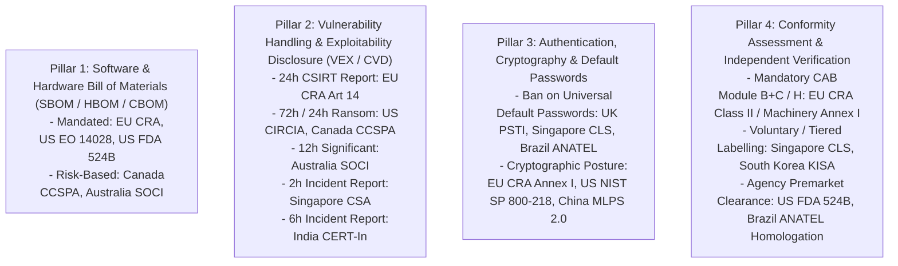

# Sequential Thinking & Divergent Multi-Agent Research: Global Statutory Index and Supply Chain Transparency

**Document**: Multi-Agent Deliberation and Synthesis  
**Date**: September 11, 2026  
**Methodology**: 6-Round Sequential Thinking with Divergent Expert Panel (/agent-swarm-deployer, /deep-research, /infinite-gratitude, /agent-orchestration-multi-agent-optimize, /kaizen, /scientific-writing, and /avoid-ai-writing).

---

## Expert Panel Composition

1. **International Trade & Regulatory Attorney**: Specialist in cross-border tech regulations, EU CRA/RED/NIS2, US export controls, and national critical infrastructure legislation.
2. **Industrial Cybersecurity Architect (ISA/IEC 62443 Expert)**: Specialist in OT/ICS security, Purdue model integration, secure product development lifecycles, and component-level security (SL-1 to SL-4).
3. **Global Supply Chain & Logistics Director**: Expert in international freight, customs clearance, distributor chargeback prevention, and vendor qualification workflows.
4. **Plant Operations & EPC Systems Integrator**: Expert in multi-vendor process plant assembly, CAD-DEXPI 2.0 engineering models, SCADA integration, and commissioning liability.
5. **Accredited Laboratory Director & CAB Lead Auditor**: Specialist in EU Notified Body conformity assessment (Module B, Module C, Module H), hardware-in-the-loop stress testing, and empirical VEX exploitability falsification.
6. **Actuarial Risk & Insurance Underwriter**: Specialist in cyber-physical property damage, Lloyd's Market Association war exclusions (Y5381/Y5382), and parametric supply chain warranties.

---

## Round 1: Divergent Scoping & Global Regulatory Discovery

### 1.1 Premise and Problem Space
The panel identified that by 2026, cybersecurity and digital equipment regulation has fundamentally fractured along national and regional boundaries. A product manufacturer cannot market a connected valve, motor, or controller globally under a single generic compliance certificate. Every major industrial jurisdiction has enacted binding statutory mandates with distinct technical requirements, incident reporting timelines, and conformity assessment procedures.

### 1.2 Global Mapping Across Jurisdictions
The panel systematically mapped 12 primary sovereign jurisdictions and international regimes active in 2026:

1. **European Union**: Regulation (EU) 2024/2847 (Cyber Resilience Act - CRA), Delegated Regulation (EU) 2022/30 (Radio Equipment Directive - RED), Directive (EU) 2022/2555 (NIS2), Regulation (EU) 2023/1230 (Machinery Regulation), and Regulation (EU) 2022/2554 (DORA).
2. **United States**: CISA Known Exploited Vulnerabilities (KEV) Catalog & BOD 22-01, Executive Order 14028, NIST SP 800-218 (SSDF), FDA FD&C Act Section 524B, CIRCIA 2022 (72h incident / 24h ransom reporting), and DoD CMMC 2.0.
3. **United Kingdom**: Product Security and Telecommunications Infrastructure (PSTI) Act 2022, NCSC Cyber Assessment Framework (CAF), and Telecommunications Security Act 2021.
4. **Canada**: Critical Cyber Systems Protection Act (CCSPA, enacted via Bill C-8 / C-26), establishing mandatory 90-day Cyber Security Programs (CSPs) and 72-hour incident reporting to the Communications Security Establishment (CSE).
5. **Australia**: Security of Critical Infrastructure Act 2018 (SOCI) as amended, Part 2A Critical Infrastructure Risk Management Program (CIRMP) Section 30AC/30AD, with 12-hour reporting for significant incidents and 72-hour for relevant incidents to ACSC.
6. **Singapore**: Cybersecurity Act 2018 as amended by Cybersecurity (Amendment) Act 2024, regulating Third-Party-Owned CII (Part 3A), Systems of Temporary Cybersecurity Concern (Part 3B), Foundational Digital Infrastructure (FDI), and enforcing the Cybersecurity Labelling Scheme (CLS(IoT) and CLS(MD)) based on ETSI EN 303 645.
7. **Japan**: METI Cybersecurity Management Guidelines, IPA/METI Industrial Control Systems Security Guidelines, and IoT Security Guidelines, coordinating with JPCERT/CC.
8. **South Korea**: KISA IoT Security Certification program, mandating unique device credentials, no default passwords, and firmware update integrity.
9. **China**: Cybersecurity Law, Data Security Law, Personal Information Protection Law (PIPL), Multi-Level Protection Scheme 2.0 (MLPS 2.0), and Critical Information Infrastructure Protection Regulations.
10. **India**: CERT-In Directions 2022 (mandatory 6-hour incident reporting, 180-day log retention, NTP time sync) and Digital Personal Data Protection Act 2023 (DPDP).
11. **Brazil**: ANATEL Resolution 740/2020 for telecom equipment and connected IoT homologation, banning hard-coded default passwords and mandating vulnerability remediation.
12. **Switzerland**: Information Security Act (ISA / ISG) effective 2024/2026, mandating reporting of critical infrastructure cyberattacks to the National Cyber Security Centre (NCSC) within 24 hours.
13. **International / Horizontal Sectoral**: IEC 62443 series (62443-4-1, 62443-4-2 SL-1..SL-4), ISO/SAE 21434 (Automotive), IEEE 1613 / IEC 61850-3 (Substations), and CLC/TS 50701 (Railway).

---

## Round 2: Deep Statutory Retrieval & Technical Invariant Analysis

### 2.1 The Technical Requirements Spectrum
The panel observed that international statutory mandates decompose into four core technical requirements:

---

## Round 3: Technical Reconciliation & Unified Schema Formulation

### 3.1 The Reconciliation Problem
Every country uses different names and data structures for identical concepts. For instance, a software inventory is called:
- `SBOM` in the United States (NTIA minimum elements).
- `Software Bill of Materials / Annex II documentation` in the European Union (CRA).
- `Third-party component inventory and supply chain dependency mapping` in Canada (CCSPA) and Australia (SOCI CIRMP).
- `Software asset ledger` in China (MLPS 2.0).

### 3.2 Reconciliation Engine Architecture
The panel established that Schema G_CPDT provides the perfect normalization layer:
1. **Physical Plane**: DEXPI 2.0 (ISO 15926-4 RDL) maps equipment, piping, nozzles, and structural limits.
2. **Cyber Plane**: CycloneDX 1.6+ (ECMA-424) maps software components, microcontrollers, cryptographic assets (CBOM), and vulnerabilities (VEX).
3. **Electrical Plane**: IEC 61970 CIM maps power feeds, network ports, and telemetry register maps.

By packaging these three layers into a single signed dossier, the PAN engine can project the asset against any country's rule set through automated deterministic queries.

---

## Round 4: End-to-End Industrial Value Chain Use Cases

The panel designed 5 comprehensive, highly detailed industrial use cases demonstrating how PAN resolves real-world procurement and compliance bottlenecks across the value chain:

1. **Use Case 1 (Industrial Product Manufacturer / OEM)**: A valve and pump manufacturer escapes CAD proprietary lock-in, publishes a single Schema G_CPDT catalog, triggers automated CAB qualification bidding, and unlocks immediate export eligibility across the EU, US, and UK.
2. **Use Case 2 (Global Equipment Distributor & Logistics Provider)**: A multi-national distributor verifies compliance across international customs borders, eliminates packaging and technical liquidated damages/chargebacks, and automates pre-clearance tokens for customs agencies.
3. **Use Case 3 (System Integrator & EPC Contractor)**: An EPC firm constructing a greenfield petrochemical plant integrates 5,000 components from 120 vendors, automatically checks hydraulic and cyber compatibility, and compiles plant-wide compliance dossiers without issuing a single manual questionnaire.
4. **Use Case 4 (Critical Infrastructure Plant Owner / Operator)**: An electric utility operating nuclear and grid substations maintains real-time operational technology assurance, continuously evaluates dynamic VEX feeds against CISA KEV and ENISA alerts, and satisfies NIS2 / CRA Article 14 incident reporting mandates.
5. **Use Case 5 (Accredited Conformity Assessment Body / CAB)**: A global inspection and certification partner (such as Bureau Veritas or TÜV SÜD) scales testing operations, automates technical file reviews, executes empirical VEX falsification via symbolic execution, and issues cryptographically signed in-toto attestations.

---

## Round 5: Adversarial Stress Testing & Edge Case Falsification

The panel subjected the network to adversarial edge cases:
- **Statutory Conflict**: What happens when Jurisdiction A mandates a specific cipher suite that Jurisdiction B forbids?
  * *Resolution*: The PAN Gap Engine identifies mutually exclusive statutory requirements and marks the asset as `JURISDICTION_EXCLUSIVE`, preventing illegal re-export while preserving regional qualification.
- **Supply Chain Concealment**: A tier-2 component vendor conceals an open-source library containing an unpatched vulnerability.
  * *Resolution*: The CAB executes automated binary software composition analysis (SCA) during Module B testing, disassembling compiled firmware to detect unlisted function signatures and flagging incomplete SBOM disclosures as immediate blockers.
- **Physical-Cyber Mismatch**: The physical valve in DEXPI 2.0 is rated for 150 PSI, but the firmware configuration allows pressure setpoints up to 300 PSI.
  * *Resolution*: The cross-domain binding engine detects the topological discrepancy between mechanical MAWP and cyber actuator setpoint limits, failing automated ingestion before commercial release.

---

## Round 6: Kaizen Synthesis & Document Plan

The panel agreed to execute continuous improvement (Kaizen) by:
1. Expanding `references/WG-10-Assurance-Network/WG-10-AN-03-Jurisdiction-Registry-Index.md` with complete, verbose country-by-country legal analyses, statutory citations, and reconciliation rules.
2. Creating `references/WG-10-Assurance-Network/WG-10-AN-06-Supply-Chain-Transparency-Use-Cases.md` detailing the 5 end-to-end industrial use cases with rich workflows and native Mermaid diagrams.
3. Applying `/avoid-ai-writing` throughout (zero em dashes, elimination of hollow intensifiers and banned buzzwords).
4. Running the full validation suite (`sync-publications.js`, all 10 audits in `run-audits.mjs`, `tsc --noEmit`, and `next build`).
