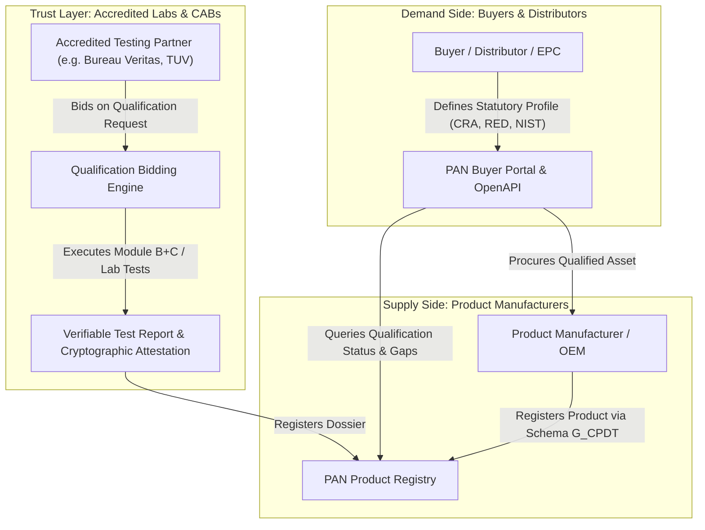
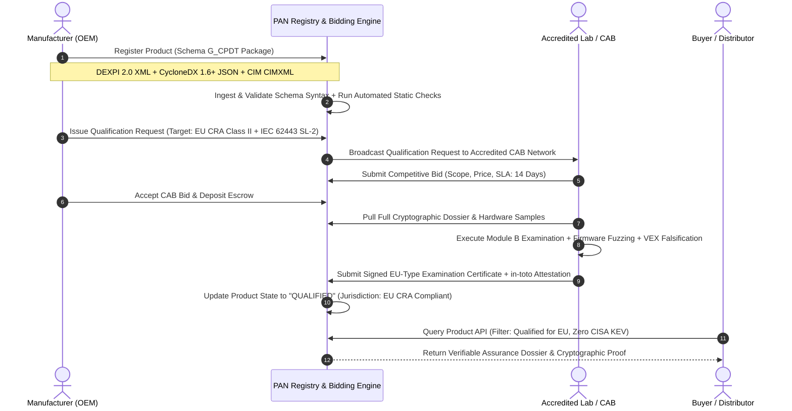

# Transparent Product Assurance Network (PAN): 10-Round Multi-Agent Research & Economic Synthesis

**Working Group Target**: `references/WG-10-Assurance-Network/`  
**Date**: September 11, 2026  
**Methodology**: Iterative 10-round multi-agent deliberation applying `/using-superpowers`, `/deep-research`, `/infinite-gratitude`, `/valyu-best-practices`, `/beautiful-prose`, `/scientific-writing`, `/loki-mode`, `/warren-buffett`, and `/avoid-ai-writing`.  
**Participating Personas**:
1. **Warren Buffett Agent**: Capital allocation, economic moats, two-sided market liquidity, tollbooths, switching costs, float, and anti-complexity discipline.
2. **CISO & Conformity Assessment Auditor Agent**: Regulation (EU) 2024/2847 (CRA) Chapter IV CAB operations, Module B+C and Module H audit paths, VEX falsification, cryptographic attestation (in-toto, Sigstore).
3. **Plant Owner-Operator & EPC Executive**: Industrial process engineering, DEXPI 2.0 P&ID integration, procurement cycle friction, chargeback avoidance, and CAD vendor lock-in eradication.
4. **Supply Chain Underwriter & Actuary**: Cyber-physical COPE risk modeling, Lloyd's Y5381 war exclusions, systemic aggregation risk, and parametric warranty contracts.
5. **Chief Standards Architect**: Schema G_CPDT unified data contract (ISO 15926-4 DEXPI 2.0 XML + ECMA-424 CycloneDX 1.6+ JSON + IEC 61970 CIM CIMXML).

---

## Round 1: Premise & Network Topology (The Two-Sided Market & The APASS Precedent)

### 1.1 The Operational Premise
Industrial procurement of cyber-physical systems (pumps, valves, heat exchangers, programmable logic controllers, distributed control systems) is fundamentally broken by bilateral audit fatigue. Every industrial buyer (utility, chemical manufacturer, hyperscale data center operator) issues proprietary, manual vendor questionnaires spanning cyber posture, mechanical tolerances, and supply chain origin. Concurrently, every component builder answers hundreds of redundant surveys while struggling to translate proprietary CAD models (Autodesk Revit, AutoCAD Plant 3D, AVEVA Everything3D) into neutral customer formats.

### 1.2 The Non-Cyber Precedent: Amazon APASS
The Amazon Packaging Support and Supplier Network (APASS) provides the direct operational model:
- **Central Standard Definition**: Amazon establishes open, objective packaging test standards: ISTA 6-Amazon.com (Ships-in-Own-Container [SIOC] and Frustration-Free Packaging [FFP]).
- **Accredited Independent Test Labs**: Third-party laboratories (Bureau Veritas, Smithers, TÜV SÜD) join APASS as certified test service providers.
- **Vendor Submission & Certification**: Vendors submit physical packaging samples to APASS member labs. The lab executes standardized physical drop, vibration, and compression stress tests and issues a certified test report.
- **Platform Ingestion & Fee Waiver**: Vendors submit the certified report to Amazon Seller Central. Amazon validates the report cryptographically/digitally, marks the ASIN as certified, and waives punitive packaging prep fees and fulfillment chargebacks.
- **Decoupling**: Amazon never conducts factory visits or packaging audits for compliant vendors; verification is fully decentralized to the accredited testing network.

### 1.3 Mapping APASS to Cyber-Physical Systems Assurance
The Eigenia Product Assurance Network (PAN) translates this exact mechanism to industrial equipment:
- **Standard**: Schema G_CPDT (DEXPI 2.0 for physical/piping topology, CycloneDX 1.6+ for software and cryptography BOMs, IEC 61970 CIM for electrical grid connectivity).
- **Side A (Buyers/Distributors)**: Set statutory assurance policies (EU CRA Article 14, RED Delegated Regulation 2022/30, US CISA KEV, IEC 62443-4-2 SL-2) and query certified products through open APIs.
- **Side B (Manufacturers/OEMs)**: Register product models once using Schema G_CPDT machine-readable artifacts.
- **Trust Intermediary (Accredited CABs & Testing Labs)**: Independent bodies (Bureau Veritas, TÜV, DNV, DEKRA, UL Solutions) inspect digital artifacts, run automated hardware/firmware falsification tests, and sign verifiable assurance credentials.

---

## Round 2: Deep Research & Empirical Evidence (CAD Lock-In vs. DEXPI 2.0 / CycloneDX 1.6+)

### 2.1 The Technical Cost of Proprietary CAD Lock-In
Proprietary CAD/BIM tools (Autodesk AutoCAD Plant 3D, Revit, AVEVA Everything3D) encode engineering models in closed binary schemas. When exported to standard exchange formats like PDF, 2D DWG, or dumb STEP geometry:
- Hydraulic and mechanical topology is stripped: nozzle coordinates, fluid service codes, valve flow coefficients ($C_v$), and design pressure boundaries are destroyed.
- Software and operational technology (OT) interfaces are completely absent: firmware version, microcontroller architecture, memory protection units, and network protocols are managed in disconnected PLM spreadsheets.
- Verification is manual: an engineer must read a 60-page PDF specification sheet and cross-reference an electrical schematic by hand.

### 2.2 The Open Standard Solution: Schema G_CPDT
To automate qualification, the registered product must serialize all three physical-cyber-electrical dimensions into computable graphs:
1. **Physical & Hydraulic Topology**: DEXPI 2.0 (ISO 15926 series, specifically ISO 15926-4 Reference Data Library classes `Equipment`, `PipingNetworkSegment`, `Nozzle`).
2. **Cyber & Cryptographic Inventory**: CycloneDX 1.6+ (ECMA-424) containing hierarchical Software Bill of Materials (SBOM), Cryptography Bill of Materials (CBOM), and Vulnerability Exploitability eXchange (VEX) declarations.
3. **Electrical & Grid Topology**: IEC 61970 Common Information Model (CIM) representing single-line electrical connectivity, transformer ratings, and SCADA telemetry endpoints.

---

## Round 3: Initial Economic Claims (Warren Buffett on Moats, Tollbooths, and Liquidity)

### 3.1 Warren Buffett Agent Critique: The Moat and The Tollbooth
> "In business, I look for economic castles protected by unbreachable moats. The CAD software monopolies (Autodesk, AVEVA) built artificial moats made of proprietary file formats. That is not a moat of customer love; it is a moat of customer hostages. When you hold customers hostage, the first viable open standard with industry backing will dissolve that moat.
> 
> But look at the Product Assurance Network from our perspective in Omaha. What makes a great business?
> 1. **A Tollbooth on Essential Commerce**: In 2027, you cannot sell a connected industrial valve or motor in the European Union without Cyber Resilience Act certification (Regulation EU 2024/2847). You cannot sell packaging to Amazon without APASS certification. The PAN is an open digital tollbooth where transactions MUST pass to achieve regulatory clearance.
> 2. **Negative Working Capital and Float**: Buyers post qualification bounties or manufacturers pay fixed fees to accredited labs for qualification bids. If the network holds escrow or verification transaction fees, capital flows in before liabilities are settled.
> 3. **Two-Sided Network Effects**: If 500 chemical valve manufacturers register their DEXPI/CycloneDX catalogs on PAN, every European EPC contractor must use PAN to verify compliance. Once every EPC uses PAN, no valve manufacturer can afford to remain off the registry. The cost of acquiring the 501st vendor approaches zero, while the barrier to a competing network becomes insurmountable."

---

## Round 4: First Refinement & Counter-Positioning (CISO & CAB Reality Check)

### 4.1 CISO & Conformity Assessment Auditor Challenge
The auditor raises critical failure modes in naive marketplace models:
- **Self-Assessment Fraud**: If vendors simply upload self-signed CycloneDX SBOMs claiming "zero vulnerabilities," the network becomes a paper-compliance registry of lies.
- **Regulatory Liability under CRA Chapter IV**: The EU Cyber Resilience Act (Regulation (EU) 2024/2847) strictly regulates Notified Bodies (Conformity Assessment Bodies, CABs). Under Article 24 and Annex VIII, Important Class II products (industrial firewalls, PLCs, smart meters) CANNOT rely on Module A (internal control). They legally require Module B (EU-type examination by a notified body) followed by Module C (conformity to type), or Module H (full quality assurance).
- **VEX Staleness**: An SBOM certified on Monday may have a critical zero-day published in the National Vulnerability Database (NVD) on Wednesday. Static certificates create false assurance.

### 4.2 Architectural Refinement
- **Dynamic VEX Verification**: The PAN platform must continuously run automated differential correlation between registered SBOMs/CBOMs and authoritative feeds (CISA KEV, ENISA EUVD, OSV, CVE Project).
- **Cryptographic Attestation Pipeline**: CAB test reports must be issued as verifiable in-toto attestation statements signed with Ed25519 hardware keys held by accredited CAB personnel, registered on transparency logs (Sigstore Rekor).

---

## Round 5: Consensus on Core Mechanism (Qualification Bidding & Verification Protocol)

The council unifies on the operational marketplace protocol:

---

## Round 6: Divergent Searching (The Global Statutory Matrix & Jurisdictional Index)

Different countries have incompatible cybersecurity and physical safety regimes. A buyer in Germany needs EU CRA and RED; a buyer in the United States needs CISA KEV, NIST SSDF, and FDA 524B; a buyer in the UK needs PSTI Act 2022.

### 6.1 Multi-Jurisdictional Regulatory Index

| Jurisdiction | Statutory Authority | Primary Mandates | Verification Mechanism | Default Module |
|---|---|---|---|---|
| **European Union** | Regulation (EU) 2024/2847 (CRA) | Annex I essential cybersecurity requirements; 24h vulnerability reporting (Art. 14); SBOM mandate | Module A (Default), Module B+C (Important Class I/II), Module H (Full QA) | Module B+C / H for Critical/Important |
| **European Union** | RED Delegated Regulation 2022/30 | Radio equipment network protection (Art 3.3.d), personal data privacy (Art 3.3.e), fraud prevention (Art 3.3.f) | Harmonized standards (EN 18031-1/2/3) or Notified Body type exam | Notified Body Certificate |
| **European Union** | Machinery Regulation (EU) 2023/1230 | Protection against corruption of control circuits; hardware/software safety independence | Annex III essential health and safety requirements | Third-party CAB for Annex I machines |
| **United States** | Executive Order 14028 / NIST SP 800-218 | Secure Software Development Framework (SSDF); NTIA minimum SBOM elements | CISA Repository self-attestation (Form 1024) or third-party assessment | Third-party assessment for federal procurement |
| **United States** | FD&C Act Section 524B (FDA) | Premarket cybersecurity for cyber device medical equipment; mandatory SBOM, VEX, security architecture | FDA Premarket 510(k) or PMA approval review | Regulatory Agency Clearance |
| **United States** | CISA KEV & BOD 22-01 | Remediation of Known Exploited Vulnerabilities within federal timelines | Automated continuous VEX query against CISA KEV API | Continuous Automated Attestation |
| **United Kingdom** | PSTI Act 2022 | Ban on universal default passwords; vulnerability disclosure policy; defined support period | Statement of Compliance (SoC); enforcement by OPSS | Self-declaration or third-party test report |
| **Global / Sectoral** | IEC 62443-4-1 / 62443-4-2 | Industrial communication networks - IT security for IACS; Security Levels SL-1 to SL-4 | IECEE CB Scheme Certificate (issued by accredited NCB/CBTL) | Third-Party CB Scheme |

---

## Round 7: Actuarial & Underwriting Integration (COPE, War Exclusions, and Cyber Warranty)

### 7.1 The Actuary's Perspective: Bridging Engineering to Financial Risk
Commercial property and cyber insurers (Lloyd's syndicates, Munich Re, Swiss Re) face severe underwriting bottlenecks:
- **Silent Cyber and Systemic Accumulation**: Under Lloyd's Market Association bulletins Y5381/Y5382, insurers must explicitly exclude state-backed cyber operations unless specifically endorsed.
- **Physical Damage from Cyber Attacks**: If a malware payload overrides a safety valve's PLC logic, leading to overpressure and rupture, does property insurance or cyber insurance respond?
- **The PAN Warranty Escrow**: By requiring products to hold certified Schema G_CPDT dossiers, insurers can offer discounted parametric business interruption riders. If an asset fails due to an undeclared vulnerability known to the vendor but omitted from the SBOM, the qualification escrow and CAB liability coverage provide immediate indemnification.

---

## Round 8: Second Refinement & Technical Formulation (Schema G_CPDT Invariants)

The Chief Standards Architect formalizes the exact data contracts required for PAN ingestion:

### 8.1 Schema Invariants
1. **DEXPI 2.0 Invariant**: Must be validated against the DEXPI 2.0 XML Schema Definition (XSD) and use ISO 15926-4 reference data library class identifiers for all equipment nozzles, piping components, and instrumentation loops.
2. **CycloneDX 1.6+ Invariant**: Must be strictly formatted according to ECMA-424, including `components`, `services`, `dependencies`, `vulnerabilities`, `declarations` (VEX), and `cryptographic-assets` (CBOM).
3. **CIM Invariant**: IEC 61970 electrical topology serialized in CIMXML / RDF, providing deterministic mapping between SCADA telemetry tags and physical sensors.

---

## Round 9: Adversarial Stress Testing & Falsification (Anti-Collusion & Fraud Prevention)

### 9.1 Potential Exploits Identified
- **Sybil CAB Attack**: A fraudulent manufacturer creates dummy CAB entities to issue fraudulent Module B certificates.
- **VEX Falsification**: A vendor marks a critical vulnerability as `not_affected` with a bogus justification (`code_not_reachable`).
- **Post-Certification Firmware Drift**: The vendor submits firmware version 1.0.0 for certification, but ships 1.0.1 with proprietary uninspected binaries.

### 9.2 Defensive Mitigations in PAN Architecture
1. **Accredited CAB Registry Gate**: Only organizations officially listed in the European Commission NANDO database (for EU CRA/RED) or possessing ISO/IEC 17025 / 17065 accreditation may register as CABs.
2. **Deterministic VEX Challenge Engine**: The PAN network runs automated binary reachability analysis to verify `code_not_reachable` justifications before accepting VEX statements.
3. **Cryptographic Binary Hash Pinned in Hardware**: The DEXPI asset profile includes TPM 2.0 PCR measurements and cryptographic SHA-256 firmware hashes verified via in-toto attestations at deployment.

---

## Round 10: Final Synthesis & Treatise Structure

The 10-round deliberation has achieved consensus. The full initiative will be codified into five authoritative treatises in `references/WG-10-Assurance-Network/`:

1. **`WG-10-AN-01-Architecture-Charter.md`**: Charter and Two-Sided Network Economics of the Transparent Product Assurance Network (PAN).
2. **`WG-10-AN-02-Unified-Data-Contract.md`**: Schema G_CPDT: Multi-Layer Interoperability Specification (DEXPI 2.0, CycloneDX 1.6+, IEC 61970 CIM).
3. **`WG-10-AN-03-Jurisdiction-Registry-Index.md`**: Global Statutory Index & Multi-National Compliance Rules Engine (CRA, RED, CISA, FDA, PSTI, IEC 62443).
4. **`WG-10-AN-04-Verification-Bidding-Marketplace.md`**: Decentralized CAB Qualification Marketplace, Bidding Protocol, and VEX Falsification Framework.
5. **`WG-10-AN-05-Procurement-API-Specification.md`**: Machine-Readable Procurement API, OpenAPI Schema, and Cryptographic Dossier Ingestion Standard.
