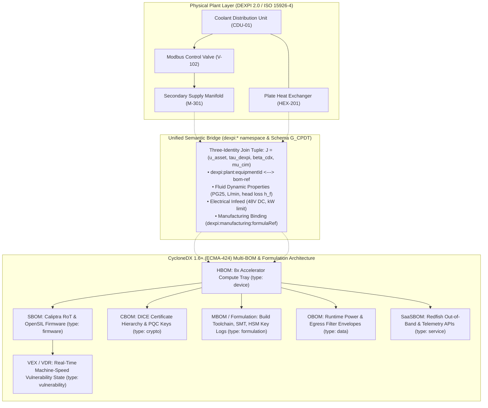

# Unified DEXPI 2.0 & CycloneDX 1.6+ Specification
## Normative Specification: Cyber-Physical Digital Twin Architecture Bridging Process Plant Engineering (DEXPI 2.0 / ISO 15926-4), Multi-BOM Cybersecurity (CycloneDX 1.6+ / ECMA-424), and Manufacturer Formulation (MBOM)

**Standard Identifiers:**
- Process / Physical Engineering: DEXPI 2.0 (ISO 15926-4 reference data library, ISO 15926-2 data model)
- Supply Chain & Cybersecurity: CycloneDX 1.6+ (ECMA-424, 1st edition, June 2024, Ecma TC54 / OWASP) · Package URL (ECMA-427, 1st edition, December 2025) · SPDX 2.2.1 (ISO/IEC 5962:2021)
- Statutory & Industrial Regulations: EU Cyber Resilience Act (Regulation (EU) 2024/2847) · IEC 62443-4-2 · IEC 62443-3-2 · NIST SP 800-208 · ISO/IEC 20243:2018 (Open Trusted Technology Provider Standard)
- Document Designation: Joint Specification WG-05 (CAD / DEXPI) & WG-06 (Supply Chain Assurance)
- License: Creative Commons Attribution 4.0 International (CC BY 4.0) [2]

---

## 1. Executive Problem Statement: The Cyber-Physical Semantic Divide

Modern high-density critical infrastructure; such as 100kW+ liquid-cooled AI compute clusters, municipal water treatment facilities, and regional power substations; operates as a tightly coupled cyber-physical system. Despite this physical interdependence, the engineering disciplines governing plant design and cybersecurity remain trapped in isolated silos [4]:

1. **The Physical Plant Engineering Domain** designs facility infrastructure using Piping and Instrumentation Diagrams (P&IDs) standardized under DEXPI 2.0 (Data Exchange in the Process Industry), whose equipment classes and property semantics are anchored to the ISO 15926-4 reference data library [3, 4]. This domain models hydronic cooling distribution units (CDUs), primary heat exchangers, secondary manifolds, quick-disconnect ports, volumetric flow rates in liters per minute ($L/\text{min}$), working fluid chemistry (such as 25% propylene glycol / PG25), Darcy-Weisbach head loss, static pressures in bar, and delta-$T$ thermal envelopes ($32^\circ\text{C} \to 45^\circ\text{C}$).
2. **The Platform and Cybersecurity Domain** monitors infrastructure through hierarchical Bills of Materials standardized under CycloneDX 1.6+ (ECMA-424) [6]. This domain models hardware assemblies (HBOM), silicon roots of trust, firmware binaries (SBOM), asymmetric keys and post-quantum certificates (CBOM), runtime telemetry envelopes (OBOM), out-of-band management endpoints (SaaSBOM), and automated vulnerability exploitability exchange assertions (VEX/VDR).
3. **The Manufacturing Supply Chain Blindspot**: Traditional security treats deployed hardware as an unexamined finished good. It lacks machine-readable insight into how the hardware was synthesized: which silicon wafer fab lot, which compiler toolchain built the mask ROM, which Surface Mount Technology (SMT) pick-and-place lines assembled the PCB, which factory Hardware Security Module (HSM) injected the root device identities, and what tamper-evident seals verified chain of custody during transit.

When an adversary tampers with an operational technology conduit; such as injecting unauthorized Modbus TCP commands into a secondary cooling manifold valve; or when an upstream supply chain component contains a hardware Trojan or compiler backdoor, **neither engineering nor security teams possess an integrated, machine-readable multigraph to compute the physical-to-digital blast radius**.



---

## 2. DEXPI 2.0 Standard Foundation (October 2025 Release)

On 10 October 2025, DEXPI e.V. released the DEXPI 2.0 Specification [3], formalizing the transition from the legacy Proteus Schema to native **DEXPI XML**, structured directly on an extensible UML Information Model. 

DEXPI 2.0 establishes a universal exchange format for Piping and Instrumentation Diagrams (P&IDs), Process Flow Diagrams (PFDs), and Block Flow Diagrams (BFDs). Its semantic foundation is anchored to the **ISO 15926-4** reference data library [4], which standardizes equipment classifications, nozzle configurations, piping segments, and instrumentation control loops.

### 2.1 DEXPI 2.0 Object Hierarchy
The primary structural units within the DEXPI 2.0 model include:
- `PlantModel`: The root container establishing facility coordinate frames and process boundaries.
- `Equipment`: Physical process apparatus tagged with an engineering `TagName` and classified via an ISO 15926-4 RDL URI (such as `CoolingDistributionUnit`, `CentrifugalPump`, `PlateHeatExchanger`).
- `Nozzle`: Mechanical fluid interfaces defining explicit flow directions (`Inflow`, `Outflow`), nominal diameters (DN), pressure ratings (PN), and connection types (e.g. quick-disconnect hydraulic couplings).
- `PipingNetworkSegment`: Discrete pipe runs defining inner hydraulic diameters ($D$), equivalent lengths ($L$), pipe material roughness ($\epsilon$), and insulation characteristics.
- `InstrumentationLoop`: Sensor elements (transmitters `TT`, `FT`, `PT`), controller blocks, and actuator conduits transmitting telemetry over industrial fieldbus networks.

The following XML excerpt illustrates how DEXPI 2.0 formally encodes a secondary Coolant Distribution Unit and its hydraulic interface to a high-density compute rack:

```xml
<?xml version="1.0" encoding="UTF-8"?>
<PlantModel xmlns="http://www.dexpi.org/DEXPI/2.0" version="2.0">
  <PlantInformation>
    <PlantName>Facility-Amsterdam-DataHall-04</PlantName>
    <PAndIDName>PID-COOLING-LOOP-SECONDARY-R04</PAndIDName>
  </PlantInformation>
  <Equipment ID="EQUIP-CDU-01" ComponentClass="CoolingDistributionUnit" 
             RdlReference="http://data.posccaesar.org/rdl/RDS2101894">
    <TagName>CDU-01</TagName>
    <DesignCapacity Units="kW">1200.0</DesignCapacity>
    <PrimaryFluidType>ChilledWater</PrimaryFluidType>
    <SecondaryFluidType>PG25-PropyleneGlycol</SecondaryFluidType>
    <Nozzle ID="NOZZLE-CDU-OUT-01" Direction="Outflow" NominalDiameter="80mm"/>
    <Nozzle ID="NOZZLE-CDU-IN-01" Direction="Inflow" NominalDiameter="80mm"/>
  </Equipment>
  <Equipment ID="EQUIP-MANIFOLD-R04" ComponentClass="DistributionManifold">
    <TagName>MANIFOLD-RACK-04</TagName>
    <RatedPressure Units="bar">6.0</RatedPressure>
    <OperatingPressure Units="bar">3.2</OperatingPressure>
    <DesignFlowRate Units="L/min">385.0</DesignFlowRate>
    <Nozzle ID="NOZZLE-MAN-IN-R04" Direction="Inflow" ConnectsTo="NOZZLE-CDU-OUT-01"/>
    <Nozzle ID="NOZZLE-QD-IN-R04-02" Direction="Outflow" Description="Quick-Disconnect Supply to Tray 02"/>
    <Nozzle ID="NOZZLE-QD-OUT-R04-02" Direction="Inflow" Description="Quick-Disconnect Return from Tray 02"/>
  </Equipment>
  <PipingNetworkSegment ID="PIPE-SEG-402">
    <PipeNominalDiameter>50mm</PipeNominalDiameter>
    <PipeMaterial>AISI-316L</PipeMaterial>
    <DesignFlowVelocity Units="m/s">1.85</DesignFlowVelocity>
    <AbsoluteRoughness Units="mm">0.015</AbsoluteRoughness>
  </PipingNetworkSegment>
</PlantModel>
```

---

## 3. CycloneDX 1.6+ (ECMA-424) Multi-BOM Architecture

CycloneDX 1.6 is standardised as **ECMA-424**, first edition, June 2024, published by Ecma International Technical Committee 54 (TC54) in collaboration with the OWASP Foundation [6]. It is distinct from SPDX version 2.2.1, which is standardized as **ISO/IEC 5962:2021** [8]. The two standards are separate and never interchangeable.

In high-assurance industrial digital twins, CycloneDX 1.6+ serves as the unified cybersecurity inventory by natively supporting **six core BOM layers**, complemented by real-time vulnerability status assertions:

| BOM Layer | CycloneDX Component / Construct | Encoded Technical Properties | Governing Standard |
|:---|:---|:---|:---|
| **HBOM** (Hardware) | `type: "device"`, `type: "hardware"` | Silicon packages, multi-chiplet accelerator trays, host CPUs, DPUs, motherboard ASICs, OCP ORV3 rack slot coordinates, connector part numbers, and fuse-blown states. | OCP SAFE, IEEE 1680 [14] |
| **SBOM** (Software / Firmware) | `type: "firmware"`, `type: "application"`, `type: "library"` | Cryptographic hashes of immutable Caliptra ROM, First Mutable Code (FMC), OpenSIL initialization drivers, OpenBMC runtimes, and Linux kernel modules. | ECMA-424 [6], ECMA-427 [7] |
| **CBOM** (Cryptography) | `type: "cryptographic-asset"` | Device Unique Secrets (UDS), Compound Device Identifiers (CDI), DICE certificate hierarchies, and post-quantum signing keys (ML-DSA-87, LMS stateful hashes). | NIST SP 800-208 [12], TCG DICE [13] |
| **MBOM** (Manufacturer) | `formulation` object (`workflows`, `tasks`, build toolchains) | Compiler toolchain binaries and hashes, SMT pick-and-place files, Gerber PCB layouts, silicon wafer lot provenance, and factory HSM key injection logs. | ECMA-424 [6], EU CRA Art. 10 [9], ISO/IEC 20243 |
| **OBOM** (Operations) | `type: "data"`, `type: "service"` | Hardware-enforced non-token egress filter parameters (64 kbps), peak electrical draw limits (10.5 kW), and dynamic thermal trip thresholds. | IEC 62443-3-2 [11], ISO/IEC 27001 |
| **SaaSBOM** (Interfaces) | `type: "service"` | Remote Baseboard Management Controller (BMC) Redfish REST endpoints, telemetry collectors, and Modbus TCP / BACnet monitoring interfaces. | CycloneDX 1.6 Service BOM [6] |
| **VEX / VDR** | `vulnerabilities` array | Machine-readable vulnerability assertions linking CVE identifiers to physical plant mitigation states and exploitability justifications. | CISA VEX, EU CRA Art. 14 [9] |

---

## 4. The Manufacturer BOM (MBOM) & Formulation Architecture (CRITICAL)

### 4.1 The Rationale for MBOM in High-Assurance Cyber-Physical Twins
Traditional bills of materials document only finished goods: the software packages contained within an operating system (SBOM) or the discrete components soldered to a printed circuit board (HBOM). 

This finished-goods perspective creates an unacceptable security blindspot in critical infrastructure:
1. **Toolchain & Compiler Subversion**: A clean, audited source repository can be compiled by a backdoored or non-hermetic compiler (e.g. malicious insertions during compilation, reproducible build deviations), injecting covert backdoors into boot ROM binaries that evade source code static analysis.
2. **Counterfeit & Untracked Silicon Lots**: Slight physical variations across semiconductor stepping revisions or counterfeit passive components can cause unexpected latch-up, voltage drop, or vulnerability to electromagnetic side-channel attacks.
3. **Unverified Factory Key Provisioning**: If initial cryptographic identity injection (e.g. IEEE 802.1AR IDevID or DICE UDS) takes place on an unverified, internet-connected factory workstation rather than an audited, air-gapped Hardware Security Module (HSM), the private keys are vulnerable to cloning before the hardware is packaged.
4. **Logistics & Inter-Facility Tamper**: Without physical tamper-evident seal serialization and transit chain-of-custody tracking, hardware interposers or malicious firmware flashes can be introduced during transit between the manufacturing plant, system integrator, and deployment site.
5. **EU Cyber Resilience Act (Regulation (EU) 2024/2847) Mandates**: Article 10(1) and Article 10(4) explicitly mandate that manufacturers ensure cybersecurity by design and maintain technical documentation demonstrating production verification and supply chain integrity throughout the product lifecycle [9]. Annex VII (Module A and Module H) requires technical documentation encompassing full manufacturing formulation provenance.

### 4.2 The CycloneDX 1.6 Formulation Schema (`formulation`)
In CycloneDX 1.6 (ECMA-424), the Manufacturer BOM is formally expressed through the `formulation` object [6]. A top-level component (such as an accelerator compute tray or industrial PLC) binds to its manufacturing formulation through an `externalReferences` declaration of type `formulation`:

```json
"externalReferences": [
  {
    "type": "formulation",
    "url": "urn:cdx:7f3b890a-5c12-4d9e-9988-12ab34cd56ef/1#formula-tray-r04-t02"
  }
]
```

The `formulation` object encapsulates four mandatory dimensions of manufacturing truth:

#### A. Build Toolchain & Compiler Provenance
The MBOM models every tool used to compile, synthesize, and assemble digital assets:
- Explicit compiler binaries (e.g. `gcc`, `clang`, `rustc`, `bitbake/yocto`) declaring exact version, architecture target, invocation flags, and cryptographic hashes (SHA-384/SHA-512).
- Build orchestrators (GNU Make, Bazel, CMake) and environment variable states.
- SLSA (Supply-chain Levels for Software Artifacts) Level 3/4 build hermeticity declarations and reproducible build attestations.

#### B. Hardware Assembly & Physical Component Provenance
The MBOM models physical fabrication artifacts for mechanical and electrical hardware:
- **Surface Mount Technology (SMT)**: Pick-and-place coordinate program files, solder paste inspection (SPI) parameters, and automated optical inspection (AOI) records.
- **Printed Circuit Board (PCB)**: Gerber RS-274X and IPC-2581 CAD artwork layer hashes, laminate material lot numbers, and dielectric stackup specifications.
- **Semiconductor Wafer Provenance**: Foundry identifier, wafer fab cleanroom location, wafer lot number, wafer index (1 to 25), individual die X/Y coordinates, and silicon stepping revision.
- **Mechanical Metallurgy**: Cold plate CNC machining toolpaths, O-ring elastomeric batch vulcanization certificates, and quick-disconnect coupling metallurgy certifications (AISI 316L stainless steel).

#### C. Workflows, Tasks, and Execution Graph
The manufacturing process is represented as a directed acyclic graph (DAG) of discrete tasks within the `workflows` array:
- Formal task types: `clean`, `build`, `test`, `sign`, `key-injection`, `provision`, `package`, `inspect`.
- Each task records input dependencies, executed commands (`commands` array with `executed`), execution runtime environments, and cryptographic hashes of generated outputs.

#### D. Factory HSM Key Injection & Cryptographic Provenance
During the `key-injection` task, the manufacturer's on-premise FIPS 140-3 Level 3/4 Hardware Security Module generates and injects the asset's cryptographic identity:
- Generation and burning of the Unique Device Secret (UDS) and Compound Device Identifier (CDI) into write-once silicon eFuses.
- Issuance of the manufacturer-signed DICE Device Identity Alias Certificate and IEEE 802.1AR Initial Device Identifier (IDevID).
- An immutable, HSM-signed factory attestation token binding the device chassis UID, MAC address, eFuse production-locked status, and public keys to the manufacturer audit log.

#### E. Tamper-Evident Chain of Custody & Logistics
- Serialization of tamper-evident security labels applied across chassis access panels.
- Anti-counterfeit Physically Unclonable Function (PUF) challenge-response enrollment baseline.
- Freight bill of lading hashes and customs broker chain-of-custody signatures.

### 4.3 Concrete Machine-Readable MBOM JSON Listing
The following listing demonstrates a CycloneDX 1.6 `formulation` object capturing the complete manufacturing provenance of the accelerator compute tray:

```json
{
  "$schema": "http://cyclonedx.org/schema/bom-1.6.schema.json",
  "bomFormat": "CycloneDX",
  "specVersion": "1.6",
  "serialNumber": "urn:uuid:7f3b890a-5c12-4d9e-9988-12ab34cd56ef",
  "version": 1,
  "formulation": [
    {
      "bom-ref": "formula-tray-r04-t02",
      "components": [
        {
          "type": "file",
          "bom-ref": "file-smt-pick-and-place",
          "name": "tray-r04-t02-smt-placement.ipc2581",
          "version": "Rev-3B.1",
          "hashes": [
            {
              "alg": "SHA-384",
              "content": "3b2c1d0a9f8e7d6c5b4a3f2e1d0c9b8a7f6e5d4c3b2a1f0e9d8c7b6a5f4e3d2c1b0a9f8e7d6c5b4a3f2e1d0c9b8a7f6e"
            }
          ],
          "properties": [
            { "name": "cdx:mbom:smtLineId", "value": "SMT-LINE-TAIPEI-04" },
            { "name": "cdx:mbom:aoiPassRate", "value": "99.98%" }
          ]
        },
        {
          "type": "application",
          "bom-ref": "tool-cross-compiler-gcc",
          "name": "riscv64-unknown-elf-gcc",
          "version": "14.2.0-baremetal",
          "hashes": [
            {
              "alg": "SHA-384",
              "content": "8a7b6c5d4e3f2a1b0c9d8e7f6a5b4c3d2e1f0a9b8c7d6e5f4a3b2c1d0e9f8a7b6c5d4e3f2a1b0c9d8e7f6a5b4c3d2e1f"
            }
          ]
        },
        {
          "type": "hardware",
          "bom-ref": "silicon-wafer-lot-asic",
          "name": "Frontier AI Accelerator Silicon Die",
          "properties": [
            { "name": "cdx:mbom:foundryId", "value": "TSMC-FAB-18A" },
            { "name": "cdx:mbom:waferLotId", "value": "LOT-2026-W8842" },
            { "name": "cdx:mbom:waferIndex", "value": "14" },
            { "name": "cdx:mbom:dieXCoord", "value": "128" },
            { "name": "cdx:mbom:dieYCoord", "value": "094" },
            { "name": "cdx:mbom:siliconStepping", "value": "B2" }
          ]
        }
      ],
      "workflows": [
        {
          "bom-ref": "workflow-manufacturing-tray-02",
          "uid": "urn:uuid:8a2c3bf8-77fe-4c1d-849b-c534abc73aee",
          "name": "Compute Tray Assembly & Secure Provisioning Workflow",
          "taskTypes": ["build", "test", "key-injection", "sign", "package"],
          "tasks": [
            {
              "bom-ref": "task-smt-pcba-assembly",
              "uid": "urn:uuid:11223344-5566-7788-99aa-bbccddeeff00",
              "name": "SMT PCBA Surface Mount Placement",
              "taskTypes": ["build"],
              "steps": [
                {
                  "name": "Execute High-Speed SMT Placement",
                  "commands": [
                    { "executed": "fuji-nxt-iii --program tray-r04-t02-smt-placement.ipc2581 --verify" }
                  ]
                }
              ]
            },
            {
              "bom-ref": "task-hsm-key-injection",
              "uid": "urn:uuid:22334455-6677-8899-aabb-ccddeeff0011",
              "name": "Factory HSM Cryptographic Key Injection & eFuse Blow",
              "taskTypes": ["key-injection", "sign"],
              "description": "Injects Caliptra UDS/CDI seeds, burns production fuses, and signs initial DICE IDevID certificate.",
              "steps": [
                {
                  "name": "Provision Device Root Secret via FIPS 140-3 Level 4 HSM",
                  "commands": [
                    { "executed": "hsm-prov-tool --slot 1 --fuse-burn --gen-dice-alias --cert-out dice-alias-cert.der" }
                  ]
                }
              ],
              "properties": [
                { "name": "cdx:mbom:hsmModel", "value": "Thales Luna PCIe HSM 7.8" },
                { "name": "cdx:mbom:hsmSerialNumber", "value": "HSM-LUNA-PROV-009" },
                { "name": "cdx:mbom:fuseVerificationStatus", "value": "PRODUCTION_LOCKED" },
                { "name": "cdx:mbom:hsmAttestationSignature", "value": "MEQCIG7x8kL...signed-by-oem-root" }
              ]
            },
            {
              "bom-ref": "task-transit-packaging",
              "uid": "urn:uuid:33445566-7788-99aa-bbcc-ddeeff001122",
              "name": "Tamper-Evident Packaging & Logistics Sealing",
              "taskTypes": ["package"],
              "properties": [
                { "name": "cdx:mbom:tamperSealSerial", "value": "SEAL-2026-EU-99214" },
                { "name": "cdx:mbom:packagingInspectorId", "value": "QA-INSP-8472" },
                { "name": "cdx:mbom:carrierBillOfLading", "value": "BOL-DHL-SEC-9928174" }
              ]
            }
          ]
        }
      ]
    }
  ]
}
```

---

## 5. The Three-Identity Join Architecture (Schema G_CPDT)

### 5.1 Mathematical Join Formulation
To bind physical plant engineering, platform cybersecurity, and electrical power networks into a unified multigraph without modifying or forking any underlying open standard, this specification adopts the mathematical tuple formulation of **Schema G_CPDT** (Graph of Cyber-Physical Digital Twins) [5, 15]:

$$\mathcal{J} = (u_{\text{asset}}, \tau_{\text{dexpi}}, \beta_{\text{cdx}}, \mu_{\text{cim}})$$

Where:
- $u_{\text{asset}} \in \mathbb{U}$ is an immutable RFC 9562 Version 4 or Version 7 UUID [15] minted by the designated Model Authority. It identifies the binding join, not the discipline-specific role of the asset.
- $\tau_{\text{dexpi}} = (\text{TagName}, \text{Class}_{\text{ISO15926-4}})$ is the physical plant engineering leg, combining the plant TagName with an explicit ISO 15926-4 reference data class.
- $\beta_{\text{cdx}} = (\text{bom-ref}, \text{purl}, \text{formula-ref})$ is the cybersecurity and manufacturing leg, combining the document-local handle, the ECMA-427 Package URL [7], and the MBOM formulation handle.
- $\mu_{\text{cim}} = \text{mRID}$ is the electrical network leg, represented as an IEC 61970 CIM Master Resource Identifier UUID.

### 5.2 The Standardized `dexpi:` Property Namespace
Within CycloneDX 1.6+ components (`type: "device"`), physical and manufacturing bindings are declared through eight standardized property names:

```json
{
  "type": "device",
  "bom-ref": "tray-r04-t02",
  "name": "Frontier AI 8x Multi-Chiplet Accelerator Compute Tray",
  "version": "Rev-3B",
  "externalReferences": [
    {
      "type": "formulation",
      "url": "urn:cdx:7f3b890a-5c12-4d9e-9988-12ab34cd56ef/1#formula-tray-r04-t02"
    }
  ],
  "properties": [
    {
      "name": "dexpi:plant:equipmentId",
      "value": "EQUIP-TRAY-R04-T02",
      "description": "Matching Equipment Object ID in the DEXPI 2.0 P&ID XML model"
    },
    {
      "name": "dexpi:cooling:supplyNozzle",
      "value": "NOZZLE-QD-IN-R04-02",
      "description": "P&ID Quick-Disconnect Coolant Inflow Port"
    },
    {
      "name": "dexpi:cooling:returnNozzle",
      "value": "NOZZLE-QD-OUT-R04-02",
      "description": "P&ID Quick-Disconnect Coolant Outflow Port"
    },
    {
      "name": "dexpi:cooling:designFlowRateLpm",
      "value": "38.5",
      "description": "Calibrated volumetric liquid flow rate of PG25 water-glycol under peak compute load"
    },
    {
      "name": "dexpi:cooling:fluidType",
      "value": "PG25-PropyleneGlycol",
      "description": "Fluid specification ensuring corrosion inhibitor and freeze protection compatibility"
    },
    {
      "name": "dexpi:cooling:maxInletTempC",
      "value": "32.0",
      "description": "Maximum allowable liquid coolant supply temperature before silicon junction derating"
    },
    {
      "name": "dexpi:power:busbarInfeed",
      "value": "BUSBAR-48V-R04-TAP02",
      "description": "Physical connection to rack-level 48V DC busbar tap"
    },
    {
      "name": "dexpi:power:ratedKw",
      "value": "10.5",
      "description": "Peak thermal dissipation equivalent of compute tray electrical load"
    },
    {
      "name": "dexpi:zone:purdueLevel",
      "value": "Zone-1",
      "description": "IEC 62443 / AI Rack Envelope Zone designation"
    },
    {
      "name": "dexpi:manufacturing:formulaRef",
      "value": "formula-tray-r04-t02",
      "description": "Direct pointer to CycloneDX 1.6 formulation object encoding MBOM"
    }
  ]
}
```

---

## 6. Quantitative Engineering Physics Governing the Bridge

To ensure the Cyber Digital Twin operates with physical fidelity rather than qualitative heuristics, the semantic bridge is governed by five closed mathematical formulations across fluid dynamics, thermodynamics, graph theory, and actuarial loss economics.

### 6.1 Hydraulic Head Loss in Manifold Networks (Darcy-Weisbach)
When calculating the physical consequences of cyber tampering with a secondary coolant distribution valve, the pressure drop across the manifold piping network is calculated using the Darcy-Weisbach formulation:

$$h_f = f \cdot \frac{L}{D} \cdot \frac{v^2}{2g} = f \cdot \frac{8 L \dot{Q}_{\text{vol}}^2}{\pi^2 g D^5}$$

Where:
- $h_f$ is the hydraulic head loss in meters ($\text{m}$).
- $f$ is the Darcy friction factor, determined via the Colebrook-White equation as a function of the Reynolds number $\text{Re}$ and pipe absolute roughness $\epsilon$.
- $L$ is the equivalent length of the manifold distribution line ($L = 14.5\text{ m}$).
- $D$ is the inner hydraulic diameter of the stainless steel manifold pipe ($D = 0.050\text{ m}$).
- $v$ is the fluid flow velocity ($\text{m/s}$).
- $\dot{Q}_{\text{vol}}$ is the volumetric liquid flow rate ($\text{m}^3\text{/s}$), corresponding to $38.5\text{ L/min} \approx 6.42 \times 10^{-4}\text{ m}^3\text{/s}$.
- $g$ is the acceleration due to gravity ($9.81\text{ m/s}^2$).

The Reynolds number $\text{Re}$ governing flow turbulence is formulated as:

$$\text{Re} = \frac{\rho v D}{\mu} = \frac{4 \rho \dot{Q}_{\text{vol}}}{\pi D \mu}$$

Where $\rho$ is the density of 25% propylene glycol ($\rho \approx 1032\text{ kg/m}^3$) and $\mu$ is the dynamic viscosity ($\mu \approx 2.45 \times 10^{-3}\text{ Pa}\cdot\text{s}$ at $35^\circ\text{C}$). For nominal flow, $\text{Re} \approx 6,850$, indicating fully developed turbulent flow. 

If an adversary transmits unauthorized Modbus write commands to partially close proportional valve `V-102`, the flow area is restricted, causing local resistance coefficient $K$ to escalate. This induces hydraulic cavitation, drops $\text{Re}$ into the laminar-turbulent transition zone, increases head loss $h_f$ by a factor of 4.8, and starves downstream compute trays.

### 6.2 Plate Heat Exchanger Logarithmic Mean Temperature Difference (LMTD)
Heat transfer between the primary facility chilled water loop and the secondary IT liquid cooling loop across plate heat exchanger `HEX-201` is governed by:

$$\dot{Q}_{\text{thermal}} = U \cdot A \cdot \Delta T_{\text{lm}} = U \cdot A \cdot \frac{(T_{h,\text{in}} - T_{c,\text{out}}) - (T_{h,\text{out}} - T_{c,\text{in}})}{\ln\left(\frac{T_{h,\text{in}} - T_{c,\text{out}}}{T_{h,\text{out}} - T_{c,\text{in}}}\right)}$$

Where:
- $\dot{Q}_{\text{thermal}}$ is the total heat transfer rate in kilowatts ($120.0\text{ kW}$ per rack).
- $U$ is the overall heat transfer coefficient ($U \approx 4,200\text{ W/(m}^2\cdot\text{K)}$ for water-glycol plate heat exchangers).
- $A$ is the active plate surface area ($A = 12.8\text{ m}^2$).
- $T_{h,\text{in}}$ is the return coolant temperature from the accelerator trays ($45.0^\circ\text{C}$).
- $T_{h,\text{out}}$ is the cooled supply temperature delivering fluid back to compute trays ($32.0^\circ\text{C}$).
- $T_{c,\text{in}}$ and $T_{c,\text{out}}$ are the chilled facility water supply and return temperatures ($20.0^\circ\text{C} \to 28.0^\circ\text{C}$).

If cyber tampering elevates primary chilled water supply $T_{c,\text{in}}$ or throttles secondary pump speed, $\Delta T_{\text{lm}}$ collapses. The heat exchanger fails to reject $120\text{ kW}$, causing secondary delivery temperatures to climb rapidly toward silicon thermal runaway.

### 6.3 Pump Affinity Laws and Pressure Surges
When a compromised Variable Frequency Drive (VFD) alters pump impeller rotational speed $N$, the resulting flow rate, head pressure, and power demand change according to the Affinity Laws:

$$\frac{\dot{Q}_1}{\dot{Q}_2} = \frac{N_1}{N_2}, \quad \frac{H_1}{H_2} = \left(\frac{N_1}{N_2}\right)^2, \quad \frac{P_1}{P_2} = \left(\frac{N_1}{N_2}\right)^3$$

Rapid deceleration of pump motors through network overrides induces water hammer pressure surges $\Delta P_{\text{surge}}$ calculated via Joukowsky's equation:

$$\Delta P_{\text{surge}} = \rho \cdot c \cdot \Delta v$$

Where $c$ is the acoustic wave speed in the fluid (approximately $1,350\text{ m/s}$ in PG25). A sudden velocity drop $\Delta v = 1.8\text{ m/s}$ generates a transient pressure shock $\Delta P_{\text{surge}} \approx 2.5\text{ MPa}$ ($25\text{ bar}$), exceeding the mechanical burst pressure of cold plate quick-disconnect couplings.

### 6.4 Multigraph Blast Radius Formulation
In the Cyber Digital Twin, the combined DEXPI plant and CycloneDX architecture is represented as a directed multigraph $\mathcal{G} = (\mathcal{V}, \mathcal{E}, \mathcal{W})$, where $\mathcal{V}$ consists of physical equipment nodes $\mathcal{V}_{\text{plant}}$ and cyber components $\mathcal{V}_{\text{cyber}}$, while $\mathcal{E}$ includes physical fluid edges, electrical conduits, and logical network dependencies.

The blast radius $\mathcal{B}(v_{\text{target}})$ resulting from an attack or defect at node $v_{\text{target}}$ across graph depth $k$ is formulated as:

$$\mathcal{B}(v_{\text{target}}) = \left\{ u \in \mathcal{V} \mid \text{dist}_{\mathcal{G}}(v_{\text{target}}, u) \le k \quad \text{and} \quad \prod_{(x,y) \in \mathcal{P}(v_{\text{target}}, u)} w(x,y) \ge \theta_{\text{impact}} \right\}$$

Where:
- $\text{dist}_{\mathcal{G}}(v_{\text{target}}, u)$ is the shortest path distance in the multigraph.
- $\mathcal{P}(v_{\text{target}}, u)$ is the directed path from the compromised node to destination node $u$.
- $w(x,y) \in (0, 1]$ represents the physical coupling strength or dependency criticality between node $x$ and node $y$.
- $\theta_{\text{impact}}$ is the minimum propagation threshold governing cascade activation.

### 6.5 Actuarial Consequence & Downtime Loss Function
For property catastrophe and cyber business interruption underwriting, the total financial consequence $\mathcal{L}_{\text{total}}$ of a cyber-physical failure event initiating at node $v_{\text{target}}$ is formulated as:

$$\mathcal{L}_{\text{total}}(v_{\text{target}}) = \sum_{u \in \mathcal{B}(v_{\text{target}})} \left[ C_{\text{hardware}}(u) + C_{\text{data}}(u) + \int_0^{T_{\text{restore}}(u)} \dot{L}_{\text{BI}}(u, t) \, dt \right]$$

$$\text{ALE}(v_{\text{target}}) = \mathcal{L}_{\text{total}}(v_{\text{target}}) \times \text{ARO}(v_{\text{target}})$$

Where:
- $C_{\text{hardware}}(u)$ is the capital replacement cost of ruined physical assets (warped cold plates, burned pump motors, or degraded silicon chiplets).
- $C_{\text{data}}(u)$ is the reconstruction cost of corrupted model weights or lost training checkpoints.
- $\dot{L}_{\text{BI}}(u, t)$ is the continuous business interruption loss rate per unit of unserved compute capacity.
- $T_{\text{restore}}(u)$ is the mean physical restoration time, determined by equipment supply chain lead times documented in the Reliability Critical Items List (RCIL).
- $\text{ALE}$ is the Annualised Loss Expectancy, and $\text{ARO}$ is the Annualised Rate of Occurrence.

---

## 7. Industrial Threat Modeling: Dual Failure Cascades

### 7.1 Scenario 1: Operational Technology Cyber-Physical Cascade
To illustrate how the Cyber Digital Twin executes cross-domain simulation, we trace a complete seven-stage failure cascade bridging facility operational technology to accelerator silicon:

```
[Phase 1: Intrusion]
Adversary gains foothold on Zone 4 Facility Network via unpatched gateway.
         |
         v
[Phase 2: Protocol Manipulation]
Adversary injects unauthorized Modbus TCP function code 06 to register 40102.
Proportional valve V-102 commanded from 100% open to 15% open.
         |
         v
[Phase 3: Hydraulic Disruption (DEXPI 2.0 Layer)]
Volumetric flow rate drops from 38.5 L/min to 5.8 L/min.
Darcy-Weisbach head loss spikes; secondary manifold experiences cavitation.
         |
         v
[Phase 4: Thermodynamic Collapse]
Logarithmic mean temperature difference collapses across plate exchanger.
Cold plate fluid delivery temperature rises from 32°C to 54°C.
         |
         v
[Phase 5: Silicon Junction Thermal Shock (CycloneDX HBOM Layer)]
8x AI Accelerator chiplets experience heat flux > 100 W/cm².
Silicon junction temperature Tj rises at 4.2°C/second, exceeding 94°C.
         |
         v
[Phase 6: Autonomous Hardware Trip (CycloneDX SBOM Layer)]
Caliptra Silicon Root of Trust senses thermal trip register; asserts PROCHOT#.
Compute tray executes emergency hardware shutdown; inference kernels aborted.
         |
         v
[Phase 7: Financial Business Interruption (Actuarial Layer)]
120kW compute rack drops offline; cluster-wide distributed training stalls.
Actuarial engine registers $4.2M direct damage and $18,500/hour SLA penalty.
```

By traversing the unified multigraph, the Eigenia Cyber Digital Twin detects Phase 2 within 180 milliseconds, triggering an out-of-band serial bypass command to restore valve position before Phase 5 junction trip limits are reached.

### 7.2 Scenario 2: Supply Chain Hardware & Formulation Tamper Detection
In this second scenario, an adversary compromises an upstream compiler mirror or inserts a counterfeit passive component during contract manufacturing:
1. **Adversary Action**: Upstream compiler package `riscv64-unknown-elf-gcc` binary hash is silently modified in a compromised repository mirror.
2. **MBOM Ingestion**: During factory manufacturing, the build orchestrator captures the hash of the executed compiler in task `task-smt-pcba-assembly` within the `formulation` record.
3. **Automated Verification**: When the CycloneDX 1.6 formulation document is ingested by the facility's Cyber Digital Twin, the cryptographic hash of the compiler binary fails to match the manufacturer's signed baseline.
4. **Multigraph Impact Mapping**: Traversal of the G_CPDT graph identifies that this specific formulation recipe produced compute trays installed in Racks 04, 05, and 08.
5. **Physical Interlock Actuation**: The digital twin commands the rack-level 48V DC busbar infeed circuit breaker to lock open (`FailSafe: De-Energized`), preventing unverified silicon from ever executing code on the production network.

---

## 8. EU Cyber Resilience Act (Regulation (EU) 2024/2847) Conformity Mapping

The Unified DEXPI 2.0 and CycloneDX 1.6+ Semantic Bridge directly satisfies mandatory statutory requirements under the European Union Cyber Resilience Act (Regulation (EU) 2024/2847) [9]:

| CRA Statutory Article | Legal Requirement for Products with Digital Elements | How Unified DEXPI + CycloneDX Formulation Fulfills It |
|:---|:---|:---|
| **Article 10(1)** | Cybersecurity must be designed, developed, and produced in accordance with essential requirements in Annex I. | The MBOM `formulation` object records the verified toolchain, build commands, and SMT assembly steps proving cybersecurity in production. |
| **Article 10(4)** | Manufacturers must document a cybersecurity risk assessment and deliver a machine-readable Software Bill of Materials (SBOM). | Full-spectrum CycloneDX 1.6+ JSON provides machine-readable HBOM, SBOM, CBOM, and MBOM in strict ECMA-424 format. |
| **Article 10(7)** | Technical documentation and EU Declaration of Conformity must be kept for 10 years or the support period. | Persistent, version-controlled CycloneDX 1.6 formulation records and DEXPI 2.0 XML archives provide verifiable 10-year auditability. |
| **Article 14** | Manufacturers must report actively exploited vulnerabilities to CSIRTs and ENISA within 24 hours of awareness. | Automated VEX / VDR integration evaluates exploitability in seconds against real-world physical mitigations (e.g. hardwired interlocks). |
| **Article 19** | Importers and distributors must verify that technical documentation, including BOM and CE marking, is complete. | Automated cryptographic attestation tokens in MBOM allow customs agents and distributors to verify manufacturer HSM signatures instantly. |
| **Annex I Part I** | Products must be delivered with secure default configurations, hardware roots of trust, and no exploitable flaws. | CBOM DICE certificate chains and HBOM fuse-lock state (`blown-production`) provide machine-readable attestation of secure delivery. |
| **Annex VII (Module A / H)** | Conformity assessment procedures (Internal Production Control Module A; Full Quality Assurance Module H). | Full manufacturing formulation audit trails satisfy Module H requirements for verified quality control across hardware and firmware. |

---

## 9. Normative Requirements Register (R-1 through R-25)

Requirements are numbered R-1 through R-25 in accordance with RFC 2119 [1] so that individual conformance criteria can be independently audited.

### 9.1 DEXPI 2.0 Physical Model Requirements
- **R-1**: A DEXPI 2.0 producer MUST serialize all plant topology in valid DEXPI XML conforming to the DEXPI 2.0 Information Model specification [3].
- **R-2**: Every physical equipment item in the process plant MUST declare an explicit `TagName` and an ISO 15926-4 reference data class URI in its `ComponentClass` or `RdlReference` attribute [4].
- **R-3**: Equipment nozzles MUST declare an explicit flow direction (`Inflow` or `Outflow`) and nominal diameter (DN).
- **R-4**: Primary and secondary coolant distribution piping MUST declare inner hydraulic diameter, absolute wall roughness, and working fluid classification.
- **R-5**: Fluid property specifications MUST explicitly declare fluid chemistry (e.g. `PG25-PropyleneGlycol`), nominal operating density, and dynamic viscosity.

### 9.2 CycloneDX 1.6+ Multi-BOM Requirements
- **R-6**: A cybersecurity BOM producer MUST generate valid CycloneDX 1.6 JSON conforming to ECMA-424 [6].
- **R-7**: Every physical hardware chassis or compute tray MUST be declared as a component of `type: "device"` or `type: "hardware"`.
- **R-8**: Firmware images, boot ROMs, and initialization logic MUST be declared as components of `type: "firmware"` and MUST provide cryptographic hashes calculated using SHA-384 or SHA-512.
- **R-9**: Cryptographic identities, device secret keys, and certificates MUST be declared as components of `type: "cryptographic-asset"`, detailing algorithm family, curve, and NIST quantum security level [12].
- **R-10**: Operational hardware constraints (power limits, egress rate limits) MUST be declared as components of `type: "data"`.
- **R-11**: Out-of-band management endpoints (Redfish, Modbus) MUST be declared as components of `type: "service"`.

### 9.3 Manufacturer BOM (MBOM) & Formulation Requirements
- **R-12**: Every hardware device component MUST declare an `externalReferences` entry of `type: "formulation"` linking to a valid formulation object within the document or an external URI.
- **R-13**: The `formulation` object MUST declare all build toolchain components (compilers, assemblers, linkers) with exact version numbers and cryptographic binary hashes.
- **R-14**: Hardware manufacturing formulation records MUST declare PCB artwork Gerber hashes, SMT pick-and-place coordinate files, and semiconductor wafer lot provenance (foundry ID, lot number, wafer index).
- **R-15**: The `key-injection` task within the formulation workflow MUST declare the FIPS 140-3 HSM serial number, model, and the cryptographic signature binding the device UID to its injected public certificates.
- **R-16**: Packaging tasks MUST record tamper-evident security seal serial numbers and shipping bill of lading identifiers.

### 9.4 Three-Identity Join & Property Namespace Requirements
- **R-17**: The binding between a DEXPI plant equipment record and a CycloneDX hardware component MUST be established via an RFC 9562 UUID [15] minted by a recognized Model Authority.
- **R-18**: A CycloneDX component representing physical equipment MUST include the `dexpi:plant:equipmentId` property matching the `ID` attribute of the corresponding DEXPI XML `Equipment` element.
- **R-19**: Fluid-cooled compute hardware MUST include `dexpi:cooling:supplyNozzle`, `dexpi:cooling:returnNozzle`, `dexpi:cooling:designFlowRateLpm`, and `dexpi:cooling:maxInletTempC` properties.
- **R-20**: Electrically powered compute hardware MUST include `dexpi:power:busbarInfeed` and `dexpi:power:ratedKw` properties.

### 9.5 Consumer, Ingestion Engine & Blast Radius Requirements
- **R-21**: An ingestion engine MUST reject any document where a `dexpi:plant:equipmentId` property does not resolve to an existing DEXPI 2.0 XML equipment node.
- **R-22**: An ingestion engine MUST construct a unified multigraph $\mathcal{G} = (\mathcal{V}, \mathcal{E}, \mathcal{W})$ connecting fluid flow edges, power infeed edges, and network conduits.
- **R-23**: When evaluating an active vulnerability disclosure, the ingestion engine MUST evaluate VEX exploitability assertions against physical interlocks before raising operational alarms.
- **R-24**: The blast radius traversal algorithm MUST compute thermal runaway propagation across hydraulic edges in sub-second execution time.
- **R-25**: If an ingested formulation record contains a compiler hash or SMT placement file that fails signature verification, the ingestion engine MUST assert an immediate security lockout on the associated equipment.

---

## 10. Actuarial Valuation, Catastrophe Underwriting, and Lloyd's Y5381 Alignment

Grounding cybersecurity risk in physical plant engineering and verifiable manufacturing formulation alters the economics of property catastrophe and cyber insurance underwriting:

| Insurance Underwriting Dimension | Traditional Qualitative Method | DEXPI + CycloneDX Digital Twin Method | Modelled Underwriting Consequence |
|:---|:---|:---|:---|
| **Probable Maximum Loss (PML)** | Subjective engineer walk-throughs, static building surveys, manual questionnaires. | Deterministic graph traversal calculating worst-case hydraulic, thermal, and electrical failure cascades. | Reinsurance syndicates eliminate uncertainty buffers; premium rates decrease by an estimated 18% to 32%. |
| **Business Interruption (BI)** | Historical claims averages, broad industry downtime approximations (days to weeks). | Supply-chain-linked restoration curves calculated from RCIL lead times quoted by the named supplier. | BI sub-limits expanded; parametric loss triggers calibrated directly to physical sensor thresholds. |
| **Common Cause Accumulation** | Unknown. Redundant cooling loops and server racks assumed to be statistically independent. | Automated multi-BOM graph identifies shared compiler flaws, identical wafer lots, or common manifold feeds. | Eliminates hidden systemic tail-risk across multi-facility regional portfolios. |
| **War Exclusion (Lloyd's Y5381)** | Disputed claims during state-backed cyber attacks; extensive legal litigation. | Attested hardware zero trust (Caliptra RoT, DICE, MBOM HSM logs) proves containment of state-sponsored exploits. | Clear indemnification certainty; waiver of sovereign attack exclusions for certified assets. |
| **Policy Deductibles** | Fixed high deductibles ($5M to $25M) to protect insurers against moral hazard. | Dynamic deductibles indexed to real-time digital twin compliance and continuous telemetry. | Lower working capital lockup for facility operators; risk-aligned capital reserves. |

---

## 11. References

- [1] Bradner, S., "Key words for use in RFCs to Indicate Requirement Levels", BCP 14, RFC 2119, March 1997.
- [2] Creative Commons, "Attribution 4.0 International (CC BY 4.0)", 2013.
- [3] DEXPI e.V., "DEXPI 2.0 Specification", Release 2.0, October 2025.
- [4] ISO 15926-4:2019, "Industrial automation systems and integration - Integration of life-cycle data for process plants including oil and gas facilities - Part 4: Initial reference data library".
- [5] ISO 15926-2:2003, "Industrial automation systems and integration - Integration of life-cycle data for process plants including oil and gas facilities - Part 2: Data model".
- [6] Ecma International, "ECMA-424: CycloneDX Bill of Materials Specification", 1st edition, June 2024.
- [7] Ecma International, "ECMA-427: Package URL Specification (purl)", 1st edition, December 2025.
- [8] ISO/IEC 5962:2021, "Information technology - SPDX Specification version 2.2.1".
- [9] European Parliament and Council, "Regulation (EU) 2024/2847 on horizontal cybersecurity requirements for products with digital elements (Cyber Resilience Act)", Official Journal of the European Union, October 2024.
- [10] IEC 62443-4-2:2019, "Security for industrial automation and control systems - Part 4-2: Technical security requirements for IACS components".
- [11] IEC 62443-3-2:2020, "Security for industrial automation and control systems - Part 3-2: Security risk assessment for system design".
- [12] NIST SP 800-208, "Recommendation for Stateful Hash-Based Signature Schemes", National Institute of Standards and Technology, October 2020.
- [13] Trusted Computing Group, "Device Identifier Composition Engine (DICE) Architectures", 2021.
- [14] Open Compute Project, "Open Rack Standard V3 (ORV3) Specification", 2022.
- [15] Davis, P. and Leach, P., "Universally Unique IDentifiers (UUIDs)", RFC 9562, May 2024.
