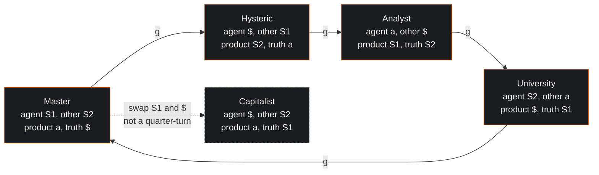
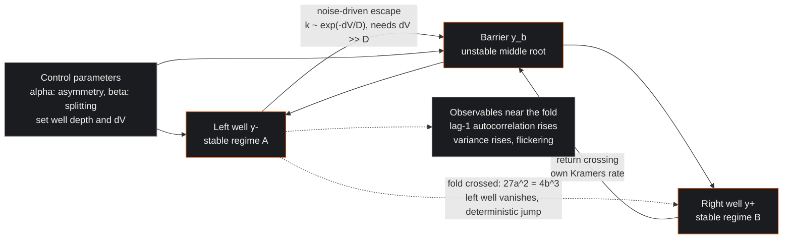
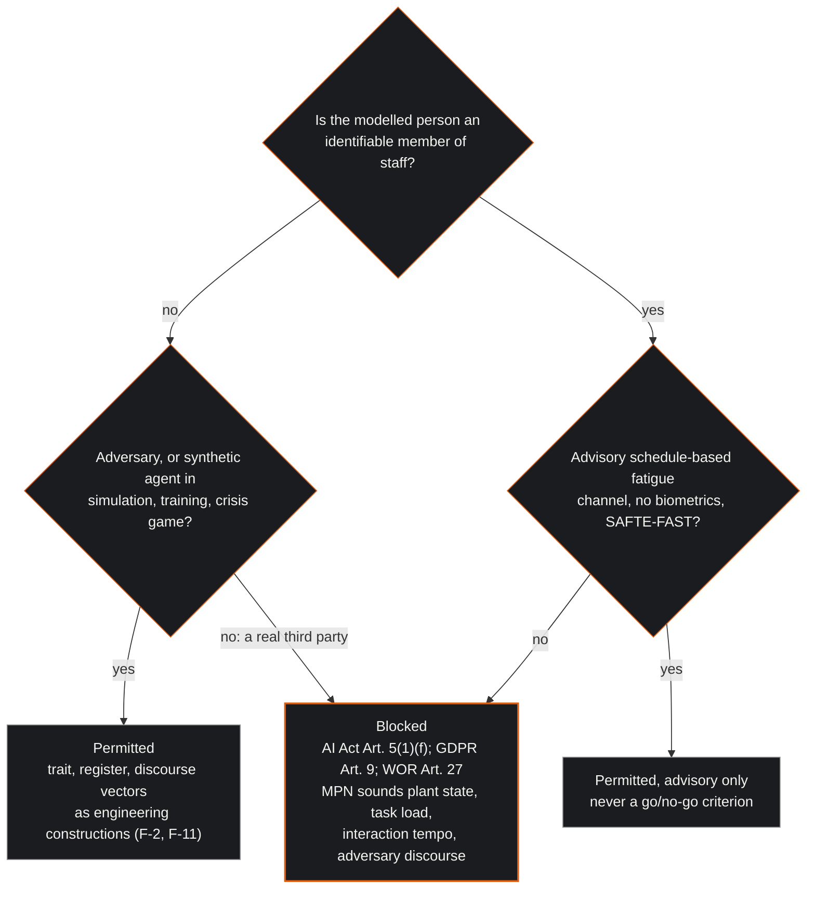

| Field | Value |
|:---|:---|
| Designation | MPN-1, foundations of the McKenney-Lacan notation programme |
| Status | Draft for working-group review |
| Normative language | RFC 2119 |
| Licence | Creative Commons Attribution 4.0 International (CC BY 4.0) |
| Extends | The working group's earlier papers on the Lacanian psychohistory framework, the calculus of the subject, the Loman operator, the morphogenesis of the signifying chain, the Kramers escape model and the MPN v1 specification |
| Series | Paper 1 of 4 (Foundations, Notation, Engine, Deployment) |

## 1. Executive Summary & Scope

The McKenney-Lacan notation (MPN) programme sets out to make the state of a socio-technical link audible: to render, as sound, what a control room's plant, its task load, its interaction tempo and any adversary acting on it are doing. Six earlier working-group papers built towards that aim with a vocabulary drawn from Jacques Lacan, a dynamical picture drawn from catastrophe theory and reaction-rate physics, and a personality feature space drawn from two trait inventories. Each was written before the programme had a foundation, and each made claims that a mathematician, a psychologist or a control engineer would decline to sign. This paper supplies the foundation and states which earlier claims are withdrawn, narrowed or relabelled.

The method is separation: what Lacan wrote (section 2); how far it is formalisable (section 3); the engineering ontology the working group adopts, with its own semantics labelled as its own (section 4); the dynamical model as a conditional hypothesis (section 5); the psychometric feature space (section 6); the predecessors (section 7); and the corrections (section 8). Statements about what could and could not be verified refer to the working group's source review, the research ledger compiled for this series before any paper was drafted. The key words MUST, MUST NOT, SHOULD and MAY are to be read as in RFC 2119 [1]. The paper is offered under CC BY 4.0 [2]. Foundations requirements are numbered F-1 through F-14 and bind every later MPN paper.

The programme is lawful by design: MPN sonifies plant state, task load, interaction tempo and adversary discourse, and never an inferred emotion, mood, stress or arousal of an operator; no biometric input about staff (voice, face, heart-rate variability, electrodermal activity, EEG, gaze or keystroke timing) enters the deployed signal chain. The legal grounds are three. Regulation (EU) 2024/1689 Article 5(1)(f) prohibits AI systems that infer the emotions of a natural person in the workplace, applicable since 2 February 2025, and the Commission's guidelines read "emotions" broadly enough to cover stress-based anxiety, emotional arousal, burnout and a team's emotional tone [3] [4]. Physiological data about a person are health data under GDPR Article 9 and Recital 35 [5]. Any facility suitable for observing staff behaviour needs prior works-council consent under the Dutch Works Councils Act Article 27(1)(k) and (l) [6]. The scientific ground, set out in section 6.6, is that physiology indexes arousal and load rather than emotion. Person-level psychological modelling is therefore confined to adversary modelling, to simulation, training and the crisis game, and to an advisory schedule-based fatigue channel on the SAFTE-FAST pattern [7].

### 1.1 What this paper does not do

It does not define the notation (Paper 2), describe the engine (Paper 3) or set the deployment invariants (Paper 4). It does not claim that Lacan's topology is mathematically sound, that any Kramers parameter has been measured for a human being, that DISC is a validated construct system, or that any early-warning lead time has been observed. It does not revisit the earlier papers' actuarial sections; their return-on-investment arithmetic rests on author-chosen values and says so.

## 2. What Lacan wrote

This section is descriptive: everything in it is attributable to Lacan or to his standard commentators. Where the source review could not verify a page number, none is given here.

### 2.1 The mathemes

Lacan coined "matheme" around 1971 to 1973, on the model of Lévi-Strauss's "mytheme", with the stated ambition of an integral transmission of psychoanalytic knowledge [8]. The four letters that concern this programme are fixed in Seminar XVII of 1969 to 1970 [9]. $S_1$ is the master signifier, the signifier without a signified that commands. $S_2$ is knowledge, the battery or chain of signifiers. $\$$ is the barred or divided subject, the subject as an effect of the signifier. $a$ is the objet petit a, surplus-jouissance, the cause of desire and the remainder of the signifying operation [9] [8] [10]. The letters are ideograms with a fixed reading grammar, not terms of a calculus; nothing in Lacan assigns them values, and his ambition for them was transmissibility, not computation [11].

### 2.2 The four discourses

The discourses are set out in the opening sessions of Seminar XVII, and they are the one place where Lacan supplies an exact combinatorial rule [9]. There are four positions, fixed:

$$\frac{\text{agent}}{\text{truth}} \;\longrightarrow\; \frac{\text{other}}{\text{product}}$$

The agent is the dominant term that sets the discourse going. The other is what the agent addresses and puts to work. The truth is what supports the agent, hidden beneath it. The product is what the operation yields, also read as the loss or remainder [9] [10] [12]. The four terms occupy the positions in a fixed cyclic order, and each discourse is a quarter-turn of the one before it in the order Master, Hysteric, Analyst, University. In the table the barred subject is written "barred S".

| Discourse | Agent | Truth | Other | Product |
|:---|:---|:---|:---|:---|
| Master | S1 | barred S | S2 | a |
| Hysteric | barred S | a | S1 | S2 |
| Analyst | a | S2 | barred S | S1 |
| University | S2 | S1 | a | barred S |

The standard reading, shared by Fink, Verhaeghe and Bracher, is that the upper relation (agent to other) is marked by impossibility and the lower relation (product to truth) by impotence: the product never reaches the truth [10] [12] [13]. The rotation is a cyclic permutation of one step, not the full symmetric group on four letters. The fifth "capitalist discourse", drawn in the Milan lecture of 12 May 1972, swaps $S_1$ and $\$$ on the left-hand side of the master's discourse, and Lacan says of it that it is not a discourse in the same sense [14]. The commentary reads the discourses clinically (Fink, Verhaeghe) or as social bonds (Bracher); the two readings cannot be cited for one claim, and section 4 says which the ontology draws on.

### 2.3 RSI and the Borromean property

The three registers, the Real, the Symbolic and the Imaginary, are first set out in the lecture of 8 July 1953 [15]. The Borromean knot enters in Seminar XIX in 1972 and becomes the whole object of Seminar XXII, which has no official edition; portions appeared in Ornicar? and the only English text is an unofficial translation, which any citation must say [16]. The formal claim is precise: R, S and I are three rings linked so that no two are linked to each other, yet the three hold together; cut any one and the other two fall apart. In knot theory that is the Borromean rings, a three-component Brunnian link, and Lacan uses exactly that property [8] [16]. In Seminar XXIII he adds a fourth ring, the sinthome, to repair a failed knotting [17]. He insists the knot is a writing of the structure, not a model or metaphor; that insistence is the contestable claim of section 3.

### 2.4 The formulas of sexuation

Seminar XX writes, in quantifier notation, four formulas over a predicate $\Phi x$, "x is subject to the phallic function": on one side $\exists x\, \neg\Phi x$ and $\forall x\, \Phi x$, on the other $\neg\exists x\, \neg\Phi x$ and $\neg\forall x\, \Phi x$ [18]. The logic is deliberately non-classical: the negated universal is read as an indeterminate "not-all", not as "some x is not $\Phi$", which is why commentators read the table as a revision of Aristotle's square rather than as first-order logic [19] [20]. The programme makes no use of the formulas; they are noted so that no later paper transcribes them as ordinary predicate logic.

### 2.5 Seminar II and cybernetics

Near the close of Seminar II of 1954 to 1955 Lacan gave a lecture on psychoanalysis and cybernetics, preceded by sessions on the odd-or-even game [21]. The game recodes a random sequence of pluses and minuses into overlapping triples and then into a four-symbol alphabet, and shows that certain successions become impossible after a few steps: memory and law arise from the syntax of the chain alone. The material is expanded in the texts appended to the seminar on the purloined letter in Écrits [22]; Liu documents that it was a direct response to Shannon, Wiener and the Macy conferences [23]. The four-symbol automaton is the one fragment of Lacan that is fully checkable finite-state combinatorics: the ancestor of any reading of a signifying chain as an automaton, not an anticipation of Markov models or control theory.

### 2.6 Miller's suture

Jacques-Alain Miller's "La Suture" of 1966 works from Frege's assignment of zero to the concept "not identical with itself", whose extension subsumes no object [24] [25]. Miller's claim is that this zero sutures logical discourse: the impossible object, the subject, is summoned and then excluded so that the series can run, and figures in the chain only as the element that is lacking [24]. Badiou contests the reading; for him the zero is a point of decision, not the mark of a lack [26]. Suture is a philosophical reading of Frege, citable as the source of the thesis that the subject is the lack the chain sutures over. It is not a mathematical result.

## 3. How formalisable is it

### 3.1 The objection

Sokal and Bricmont devote a chapter to Lacan [27]. Their charges are three. Lacan asserts an analogy between topological objects (torus, Möbius strip, cross-cap, Klein bottle) and the structure of the subject without saying which properties carry over, so no analogy can be assessed. His description of the space of jouissance as compact garbles the definition. His equation of the erectile organ with $\sqrt{-1}$ is mathematics as ornament. Their thesis is that the mathematics is often wrong, irrelevant to the psychoanalytic claim, and functions to impress; they disclaim any judgement on psychoanalysis as such [27].

### 3.2 The defences

Two defences and one counter-position exist, and the source review reached each of them through secondary summaries rather than the books themselves. Plotnitsky reads Lacan's mathematics as a non-classical model of what cannot be represented, and agrees that $\sqrt{-1}$ is not literally the organ [28]. Fink charges Sokal and Bricmont with linguistic reductionism: Lacan's mathematical terms are rhetorical, addressed to a particular audience [29]. Against both, Ragland, Milovanovic and the Vappereau school hold that the topology is a non-metaphorical writing of psychical structure [30]; Greenshields gives the literary reading [31]. The first two defences concede that the mathematics is figurative; the third denies it. A later MPN paper that wants to say the topology is figurative may cite Fink or Plotnitsky, and one that wants to say it is structural may cite Ragland and Milovanovic, but the two cannot be stacked as if they agreed. No defence located claims that the compactness passage is correct. Milner supplies the framing this programme uses: the mathemes were a bid for integral transmissibility on the model of Galilean science, an ideal of transmission rather than a claim that they compute anything [11]. For an engineer that settles the question of use: the letters are a fixed vocabulary to be transmitted intact, and whatever computes with them is the engineer's own model.

### 3.3 The consensus

The practical consensus is threefold [27] [29] [11]. The mathemes are ideograms, not terms of a calculus. The only strictly formal fragments in Lacan are the four-symbol automaton, the logical-time sophism, the deliberately ill-formed formulas of sexuation, and the knot and surface topology, which is correct as mathematics and interpretive in its use. Any model that assigns numbers to $S_1$, $S_2$, $\$$ or $a$ is therefore a new construction owned by its author. Topological claims must be split into checkable mathematics (the Borromean property; the one-sidedness of the Möbius strip) and interpretation ("the subject is a cross-cap"), and no theorem about the psyche follows from a theorem about surfaces or knots.

### 3.4 The one empirical operationalisation

The source review found exactly one peer-reviewed empirical quantification of the discourses. Gadalla, Nikoletseas and Amazonas annotated 40 dialogues (264 sentences) from the DailyDialog corpus with three raters familiar with Lacanian discourse theory, each sentence receiving up to three emotion labels from a 30-emotion set derived from GoEmotions and discourse labels with confidence scores for five discourses, the four of Seminar XVII plus the capitalist [32]. They define a relation intensity between emotions and discourses in the unit interval, and report Krippendorff's alpha of 0.70 for the analyst's discourse, 0.60 for the university, 0.55 for master and capitalist, and 0.52 for the hysteric [32]. There is no held-out prediction, no classifier and no external criterion, and the authors label the operationalisation as their own rather than as Lacan's. It is the strongest existing empirical bridge, and it is an annotation-and-reliability study on a small sample. Any MPN claim to detect or score a discourse has it as predecessor and benchmark, and since the reference implementation has no learned model, no MPN paper may describe discourse detection as implemented.

## 4. The engineering ontology adopted

The defensible framing is this: Lacan supplies a discrete vocabulary, four positions, four terms and a rotation rule, for describing who is put to work by whom in a socio-technical link. The working group adopts that vocabulary as an engineering ontology and does not inherit its metapsychological claims. The reading it draws on is the structural one shared by Bracher and the applied-discourse literature, in which a discourse is a form of social bond, rather than the clinical one [12].

### 4.1 Positions and terms as a labelled structure

Let the positions be indexed by the cyclic group of order four, $P = \mathbb{Z}_4 = \{0, 1, 2, 3\}$, read around the schema as agent (0), other (1), product (2) and truth (3). Let the terms be $T = \{S_1, S_2, a, \$\}$. A discourse is a bijection $d : P \to T$; there are twenty-four. Lacan's four are the orbit of the master's discourse

$$d_M = (S_1, S_2, a, \$),$$

written as the sequence of terms in positions 0 to 3, under the generator $g$ of $\mathbb{Z}_4$ acting by

$$(g \cdot d)(p) = d(p - 1), \qquad p \in \mathbb{Z}_4 .$$

The action shifts every term one position forward, so the term that was in the truth position moves to the agent position. Applied once to $d_M$ it gives $(\$, S_1, S_2, a)$: agent $\$$, other $S_1$, product $S_2$, truth $a$, which is the hysteric's discourse. Applied twice it gives $(a, \$, S_1, S_2)$, the analyst's discourse. Applied three times it gives $(S_2, a, \$, S_1)$, the university discourse. Applied four times it returns to $d_M$. The orbit is therefore Master, Hysteric, Analyst, University, the order in which the table of section 2.2 is written, and each sequence can be checked against that table position by position. The inverse generator runs the same cycle the other way; which direction is called "forward" is a convention of this paper. Stating the quarter-turn as a group action is a re-description of what Lacan wrote, not a discovery [9] [12].

### 4.2 The capitalist discourse outside the orbit

The capitalist discourse, as a bijection, is $(\$, S_2, a, S_1)$: the master's discourse with $S_1$ and $\$$ exchanged on the left [14]. It is not among the four cyclic shifts of $d_M$, so a model of discourse change as a walk on the $\mathbb{Z}_4$ orbit cannot generate it. Gadalla and colleagues treat it as a fifth discourse [32]. The ontology admits it as a fifth labelled bijection outside the orbit (F-3).

### 4.3 Engineering semantics attached to the positions

For describing a link, the agent is whatever currently sets the tempo: a procedure, an alarm system, an intruder, a supervisor's instruction. The other is what that agent puts to work. The product is what the working produces, including the residue nobody asked for: the alarm flood, the log, the workaround. The truth is what the agent's dominance rests on and does not display. These are engineering glosses, labelled as the working group's own; they carry no claim about what Lacan's letters denote, and any numerical value later attached to a position is a modelling choice owned by the paper that makes it (F-2).

### 4.4 The three registers as three coupled channels

The registers become three channels of distinct type describing the same link. The Real channel carries what the process does regardless of what is said about it: continuous physical state, flows, temperatures, frequencies, and whatever the plant does that no procedure named. The Symbolic channel carries the discrete, lawful layer: alarms, procedures, permits, interlocks, the log, the roster. The Imaginary channel carries the picture the control room is being shown: the interface, the trend display, the situation summary. None is an inferred mental state of a person; the Imaginary channel is the display, not a model of what an operator believes, and the earlier papers' habit of writing it as "the operator's ego" is withdrawn in section 8.

The Borromean property is adopted as a structural constraint on the notation, and only as that. The knot-theoretic property is that no two rings are linked while all three are; the design rule that mirrors it has two clauses. First, the notation defines no element that binds exactly two channels: a score element that couples two channels and is silent on the third is not a valid element. Second, every binding element in a score is a three-channel element, so removing any one channel from a score leaves the remaining two unbound. This is the working group's reading of a knot-theoretic property as a design rule; it is not a theorem about anything and yields no quantitative prediction. A constraint metaphor with defined content is legitimate; saying that RSI is a knot in a measurable sense is what Sokal and Bricmont called gibberish and what no defender has rescued [27] [30].

### 4.5 Foundations requirements

The following requirements, F-1 through F-14, bind every MPN paper.

- **F-1.** An MPN paper MUST present $S_1$, $S_2$, $\$$ and $a$ as labelled roles in a discrete structure, and MUST NOT present them as variables that take values in Lacan's text.
- **F-2.** Any numerical semantics attached to a position, a term or a register MUST be labelled as the working group's own construction and MUST cite this paper for the labelling.
- **F-3.** The four discourses MUST be represented as the orbit of one labelled bijection under $\mathbb{Z}_4$. The capitalist discourse, where used, MUST be labelled as a bijection outside that orbit and MUST NOT be described as a rotation.
- **F-4.** The three registers MUST be modelled as three channels of distinct type. An MPN paper MUST NOT claim that RSI is a knot in a measurable sense and MUST NOT derive a quantitative prediction from knot theory.
- **F-5.** Lacan's surface topology (torus, Möbius strip, cross-cap, compactness) MUST NOT be presented as mathematically sound in its psychoanalytic use; it MAY be cited as notation with reference to section 3.
- **F-6.** Any dynamical claim about operator, team or link state MUST be stated in conditional form ("if the state obeys ..., then ...") until the data requirements of section 5.6 have been met and reported.
- **F-7.** The cusp potential MUST NOT be called free energy unless the same sentence states that it is not the variational free energy of the free-energy principle.
- **F-8.** Early-warning indicators MAY be proposed. They MUST carry the caveats of section 5.4 and MUST NOT be reported as a measured lead time in the absence of data.
- **F-9.** The Big Five MAY be cited as the replicated trait taxonomy and MUST NOT be presented as real-time state. DISC MUST be presented as a lay vocabulary without independent validity evidence. The Dark Tetrad and the SD4 MUST NOT be used as an operational flag. Any product of two trait inventories MUST be labelled an engineering feature space with no measurement-theoretic warrant.
- **F-10.** Physiological channels, where discussed, MUST be described as indices of arousal and load, not of emotion, and MUST NOT appear in a deployed signal chain about staff.
- **F-11.** Person-level trait, register or discourse vectors MAY be used for adversary modelling, for simulation, training and the crisis game, and for an advisory schedule-based fatigue channel. They MUST NOT be used for deployed inference about identifiable staff.
- **F-12.** No MPN paper MAY describe the reference implementation as a trained model, its proposed 57-dimensional vector as an input to generation, its voice or personality extraction as working, or any early-warning lead time as measured.
- **F-13.** Any claim to detect or score a discourse in text MUST cite Gadalla, Nikoletseas and Amazonas as predecessor and SHOULD report inter-rater reliability on the same basis before reporting anything else.
- **F-14.** Any use of free-energy vocabulary MUST cite Carhart-Harris and Friston and Solms as predecessors and MUST distinguish the quantity used from theirs.

## 5. The dynamical hypothesis

The earlier papers used two dynamical pictures, a Thom-Zeeman cusp and a Kramers barrier escape, as if they were separate results. They are one object. The whole section is conditional: nobody has measured its parameters for a human operator, and the honest form of every statement is "if the state obeys this equation, then".

### 5.1 The stochastic cusp

Let $y$ be a scalar state and $\alpha$, $\beta$ control parameters. Cobb's stochastic cusp is the overdamped Langevin equation

$$dy = \left(\alpha + \beta y - y^{3}\right)dt + \sigma\, dW_t ,$$

with $W_t$ a standard Wiener process [33] [34]. The drift is minus the gradient of the potential

$$V(y;\alpha,\beta) = -\alpha y - \tfrac{1}{2}\beta y^{2} + \tfrac{1}{4} y^{4},$$

whose stationary points solve $\alpha + \beta y - y^{3} = 0$. For $\beta > 0$ there are up to three roots, the outer two stable and the middle one unstable, and the state is bistable; for $\beta < 0$ there is one. In Cobb's nomenclature $\alpha$ is the normal or asymmetry factor and $\beta$ the bifurcation or splitting factor [33]. The stable roots merge with the unstable one on the fold lines $27\alpha^{2} = 4\beta^{3}$, the discriminant locus of the cubic, which the earlier gGNN paper wrote correctly [35]. The stationary density is of Boltzmann type, proportional to $\exp(-2V(y)/\sigma^{2})$ under the noise convention used here; the scaling differs between sources, the quartic exponent and its stationary points do not [33]. Grasman and colleagues fit the model by maximum likelihood on that density and compare it with linear and logistic alternatives [33].

### 5.2 The Kramers escape as the same object

Kramers computed the rate at which a Brownian particle in a metastable well escapes over a barrier [36]; Hänggi, Talkner and Borkovec's review is the canonical statement [37]. In the strong-friction limit, their equation (1.6), the rate is

$$k = \frac{\omega_0\,\omega_b}{2\pi\gamma}\,\exp\!\left(-\frac{E_b}{k_B T}\right),$$

with $\omega_0$ the angular frequency of small oscillations in the well, $\omega_b$ the barrier frequency at the saddle, $\gamma$ the friction and $E_b$ the barrier height; the validity condition, their equation (2.2b), is $E_b \gg k_B T$ [37]. It is a rare-event theory and does not apply when the barrier is comparable to the noise. Transition-state theory, the Arrhenius law with the bare attempt frequency, "seriously overestimates the true rate" in the weak-friction regime, they note, and overestimates it in general; Kramers' friction-dependent prefactor is the correction [37].

The result is not specific to chemistry. Any overdamped one-dimensional diffusion in a potential, $dy = -V'(y)\,dt + \sigma\,dW_t$, obeys it with $k_B T$ replaced by the noise intensity $D = \sigma^{2}/2$ and the friction absorbed into the unit of time. In the variables of section 5.1, with $y_-$ a stable well and $y_b$ the barrier, the mean escape time from that well is

$$\tau = \frac{1}{k} = \frac{2\pi}{\sqrt{V''(y_-)\,|V''(y_b)|}}\,\exp\!\left(\frac{\Delta V}{D}\right), \qquad \Delta V = V(y_b) - V(y_-), \qquad \Delta V \gg D .$$

This is the formula the Loman and Calculus papers wrote [38] [39], and it is correct as a statement about the equation. Cobb's stochastic cusp and Kramers' escape therefore describe one stochastic differential equation: the cusp gives the shape of the double well and the fitting procedure for its parameters; Kramers gives the hopping rate between its minima. The identification is a textbook consequence of Cobb's construction and of Wagenmakers and colleagues' transformation-invariance analysis [34] [40]; it is not a result of this programme.

### 5.3 The contested history of the cusp

Thom's classification and Zeeman's popularisation, including the dog whose aggression is a cusp over rage and fear, are the source of the picture [41] [42]. Zahler and Sussmann's 1977 paper in Nature is the source of the objection, and its abstract reads: "Several representative attempts to apply catastrophe theory to biological and social science problems turn out on close analysis to be characterised by incorrect reasoning, far-fetched assumptions, erroneous consequences, and exaggerated claims" [43]. Their technical objections, as the source review summarises the paper and its longer sequel, are three: Thom's theorem applies to gradient systems with at most four control parameters, and behavioural systems are rarely shown to be gradient systems; the catastrophe flags (bimodality, hysteresis, sudden jumps, divergence, inaccessibility) can be produced by many non-catastrophe mechanisms; and most applications were qualitative curve-drawing with no fitted parameters [43].

The standard later applied workers accepted answers the third objection. A cusp is asserted only after it has been statistically fitted, by Cobb's maximum-likelihood method or Guastello's polynomial regression, has beaten linear and logistic alternatives on the same data, and has its control variables specified in advance [33] [44] [45]. Guastello's occupational cusps of accident rate under stress are the closest published precedent for a cusp of operator performance, and they are fits to organisational data, not to control-room telemetry [45]. Every earlier working-group paper drew a cusp without fitting one; F-6 exists so that none does so again without saying "if".

### 5.4 Early-warning signals and their caveats

Scheffer and colleagues set out generic indicators that a system approaching a fold displays: critical slowing down as the dominant eigenvalue of the linearised dynamics goes to zero, rising lag-1 autocorrelation, rising variance, skewness towards the alternative state, and flickering between basins under larger noise [46]. Dakos and colleagues give the estimation methods: rolling-window autocorrelation and variance after detrending, with surrogate-data significance tests [47]. Kuehn ties the pieces together: for an overdamped SDE approaching a fold, variance scales as the inverse of the eigenvalue's magnitude and the lag-1 autocorrelation tends to one, and the fold lines of the cusp are exactly the saddle-node bifurcations where this happens [48]. So the cusp, the Kramers rate and the early-warning indicators are one object seen three ways.

The method has been applied to human mood: van de Leemput and colleagues report, from experience-sampling series in two cohorts, elevated autocorrelation and variance of momentary mood in people who later moved into or out of depression [49]. The authors' caveats travel with the method: the indicators are necessary but not sufficient, they need long stationary series, and they can be produced by mechanisms unrelated to a critical transition [46]. An MPN paper may propose rising autocorrelation, variance and flickering in link metrics (alarm-acknowledge latency, interaction tempo) as candidate precursors of a regime change; it may not report a lead time it has not measured. The earlier specification's "15 to 30 minute early warning" and "average lead time 22 minutes across 15 events" are withdrawn in section 8 [50].

### 5.5 What is history, what is analogy, what is established

The Yerkes-Dodson law is history. The 1908 paper trained dancing mice on a discrimination task under electric shock; the inverted-U appeared only for the difficult discrimination [51]. Teigen documents how the "law" mutated into a generic inverted-U with the source almost never read [52]. The human-factors replacement is Hancock and Warm's dynamic model, in which performance is stable over a broad normative zone of stress and degrades at the extremes as adaptability is exhausted, an extended-U rather than an inverted one, and a picture closer to a basin of attraction than the inverted-U is [53].

The Kuramoto model of coupled phase oscillators, with an order parameter that rises above a critical coupling, is an analogy [54]. Nobody in the team-physiology literature fits it to a control-room team; that literature uses correlation, coherence and recurrence measures, and Kazi and colleagues' critical review finds measurement heterogeneous and effect sizes inconsistent [55]. An MPN paper may say that an order-parameter-like index of team synchrony has been proposed; it may not say that teams obey the Kuramoto model, nor compute such an index from staff physiology.

The drift-diffusion model is established. Ratcliff's diffusion model of two-choice decision, its review by Ratcliff and McKoon, and its normative grounding by Bogacz and colleagues constitute the one stochastic-dynamics model with decades of quantitative fits to human data [56] [57] [58], including the effect of sleep deprivation on drift [59]. Roxin and Ledberg show that neurobiological attractor models of two-choice decision reduce to a one-dimensional nonlinear diffusion in a potential, and where that potential has a metastable state the exit from it is a Kramers problem [60]. These are the strongest published precedents for a Kramers rate describing a cognitive transition, and they hold at the level of a single decision lasting a second, not of an operator's regime over a shift. The source review's search for a paper fitting a Kramers rate to operator state, fatigue or attentional lapses found none.

### 5.6 Data requirements for fitting to control-room data

Before any MPN paper reports a fitted cusp, an estimated escape rate or an observed early-warning signal for a control-room link, the following MUST be in hand and reported. They are transcribed from the source review's own statement of what fitting would need.

- (a) A defined scalar state variable sampled densely and stationarily, with hundreds of transitions per unit of analysis; under the lawful-by-design position the candidates are link metrics such as alarm-response latency and interaction tempo, not physiological signals from staff.
- (b) Control variables specified a priori (for example alarm rate as the splitting factor and roster-derived sleep pressure as the asymmetry factor), as Zahler and Sussmann require [43].
- (c) Demonstration of bimodality and hysteresis in the same data, per van der Maas's flags [44].
- (d) For early-warning signals, rolling-window autocorrelation and variance with detrending and surrogate-data significance tests [47].
- (e) For a Kramers rate, an independent estimate of the noise intensity from residual fluctuations in the stable regime and of the barrier from the fitted potential, followed by a comparison of predicted and observed mean time to jump.

Absent (a) through (e), every dynamical statement in the programme is illustrative, and F-6 requires it to be written as such.

## 6. The psychometric feature space

The earlier papers defined a "psychometric tensor" as the Kronecker product of a DISC vector and a Big Five vector, added a Dark Tetrad projection, and treated the result as a state on which distances and trajectories could be computed [61]. This section states the standing of each component and of the product, and where any of it may be used.

### 6.1 The Big Five

The lexical and questionnaire traditions converged on five broad domains, Openness, Conscientiousness, Extraversion, Agreeableness and Neuroticism [62] [63]. Block's contrarian view stands as the principal critique: the lexical hypothesis is a weak foundation, the factors depend on item pool and rotation, five is not compelled by the data, and the model is descriptive and says nothing about within-person dynamics [64]. The standing is that the Big Five is the mainstream, replicated, stable between-person trait taxonomy. It is not a state model. No reliability coefficient is quoted because the source review retrieved none from a primary source.

### 6.2 DISC

Marston's 1928 book proposed four behaviour tendencies and built no test; Geier's Personal Profile System of the 1970s became the commercial line [65]. The evidence, as the tertiary summary the source review could verify puts it, is that the scientific validity of the DISC assessment has not been demonstrated; the instruments show acceptable short-interval test-retest reliability, a German evaluation of one version found reliability largely met but validity not at all, and Scandinavian work found the dimensions not independent and better explained by Big Five traits [65]. The validation that exists is overwhelmingly vendor technical reports; the source review found no independent criterion-validity study and no meta-analysis. The standing is that DISC is a commercial typology with reasonable reliability and weak, non-independent validity evidence, whose dimensions collapse largely onto Big Five Extraversion and Agreeableness. Its four labels may serve as a communication vocabulary, not as measured constructs.

### 6.3 The Dark Tetrad and the SD4

Paulhus and Williams introduced the Dark Triad of narcissism, Machiavellianism and subclinical psychopathy; Paulhus later added everyday sadism and named the tetrad [66] [67]. The Short Dark Tetrad (SD4) is a 28-item instrument, four subscales of seven items, developed on three samples; its third study reports reliabilities of 0.80 for narcissism, 0.75 to 0.76 for Machiavellianism, and 0.81 for psychopathy and for sadism, with the last three correlating negatively with Agreeableness and narcissism positively with Extraversion [68]. The HEXACO model, with its Honesty-Humility factor, is the usual scientific route to dark traits inside a mainstream taxonomy [69]. These are well-defined research constructs with acceptable short-scale reliability, validated for between-person research; their use as a risk signal in a live system would be an unvalidated extrapolation, and F-9 forbids it.

### 6.4 The tensor product

The earlier paper defined, for an individual $i$,

$$P_i = \mathbf{d}_i \otimes \mathbf{o}_i \in \mathbb{R}^{4 \times 5},$$

with $\mathbf{d}_i$ the four DISC scores and $\mathbf{o}_i$ the five Big Five scores, and called the twenty numbers a tensor living in a topological space [61]. The source review's search for any psychometric literature that forms the outer product of two trait inventories to define a joint space returned nothing. There is a reason. The two inventories are not independent measurement bases, since DISC is largely a re-expression of two Big Five factors, so the product is heavily redundant; and the product of two trait scores has no established construct meaning. The nearest validated relatives are the circumplex models that place traits on planes defined by pairs of Big Five factors [70]. The standing, which F-9 fixes, is that $P_i$ is an engineering parameterisation with no measurement-theoretic warrant, expected to be redundant, and labelled as such wherever it appears. The reference implementation's proposed 57-dimensional input, which concatenates the DISC and Big Five scores with register weights, dark-triad scores, physics terms and 36 one-hot bias indicators, has the same standing and is a proposal only: at inference it is projected and then discarded, and the served endpoint accepts three scalars and builds a text prompt (`mpn-conductor-standalone:ml/psychoscore_v2/models/projector.py:82-150`; `mpn-conductor-standalone:ml/psychoscore_v2/models/musicgen_lora.py:124-141`).

### 6.5 State versus trait

Spielberger's State-Trait Anxiety Inventory is the canonical operationalisation of the distinction: the state scale asks how one feels right now, the trait scale how one generally feels [71]. Trait scores predict the base rate of states, not the current value, and within-person variability in states is large relative to between-person trait differences [72]. A Big Five, DISC or SD4 score administered once cannot be read as a real-time state; at most it is a prior.

### 6.6 What can be measured in real time, and what it measures

Three physiological channels have standard references and a common limit. Heart-rate variability has standardised time-domain and frequency-domain measures [73]; it decreases under acute mental stress and, in the working group's summary of the applied literature, is confounded by respiration, posture, movement, caffeine, fitness, age and circadian phase. Electrodermal activity indexes sympathetic arousal [74], and arousal is not valenced: it cannot distinguish stress from excitement or effort. Task-evoked pupil dilation indexes processing load [75] and is swamped in a control room by luminance and gaze angle. Speech-based stress recognition, on the working group's reading of the recent reviews, is trained on acted or elicited corpora and its reported accuracies fall on spontaneous, cross-corpus and noisy data; no accuracy figure is quoted here because any figure would be corpus-specific. On facial expression, Barrett and colleagues' review found that the expected configurations do occur more often than chance, but that similar configurations of facial movements variably express instances of more than one emotion category and often something other than emotion, so that the reliability, specificity and generalisability of the common view are limited [76]; the argument transfers to vocal expression, and the Commission's guidelines cite the same review as the scientific basis of the workplace prohibition [4]. The net position, which F-10 fixes, is that physiological channels index arousal and cognitive load with reasonable validity under controlled conditions, and measure neither emotion, mood, morale nor trust. Validity, under the testing standards, is a property of an interpretation for a use, and reading a trait test or a physiological index as momentary fitness for duty is a new use with no validity evidence behind it [77].

### 6.7 Where trait vectors may and may not be used

The consequence of the lawful-by-design position is a gate, drawn below. Person-level modelling is permitted where the person modelled is not an employee of the operator (adversary and threat-actor modelling, the original "Seldon" use), where no real person is modelled at all (simulation, training, the crisis game), and in one advisory channel, fatigue, which the Regulation's Recital 18 carves out as a physical state and for which the SAFTE-FAST pattern, schedule and sleep inputs, population-level effectiveness output, advisory only, is the accepted precedent [3] [7]. It is not permitted as deployed inference about identifiable staff by any route: not by trait inventory, not by physiology, not by voice, and not by averaging over the crew, since each operator's state would be inferred first. Even a non-biometric sonification of staff interaction data is a personnel-monitoring facility under the Works Councils Act and needs prior consent [6], and employee consent to health-data processing is not free under the Article 29 Working Party's opinion on data processing at work [78]. Paper 4 turns this gate into design invariants.

## 7. Predecessors and positioning

The earlier papers cited almost none of the people who built the bridge between psychoanalysis and formal modelling. Carhart-Harris and Friston mapped Freud's primary and secondary process onto free-energy minimisation in a hierarchical generative model: the ego as the higher-level hierarchy that explains away prediction error from primary-process activity [79]. Solms identified consciousness with affect as felt uncertainty in homeostatic regulation, writing that "deviation away from a homeostatic settling point (increasing uncertainty) is felt as unpleasure, and returning toward it (decreasing uncertainty) is felt as pleasure" [80]. In both, the free-energy side is rigorous variational inference and the psychoanalytic side is a dictionary; neither models a Lacanian construct. They are the mandatory citations for any free-energy language in the programme (F-14).

The distinction F-7 enforces is this. In the free-energy principle, free energy is the variational quantity

$$F = \mathbb{E}_{q}\left[\ln q(\theta) - \ln p(\theta, \text{data})\right],$$

a bound on surprise under a recognition density $q$. The quantity in section 5 is $V(y;\alpha,\beta)$, a Landau-type potential in an overdamped SDE. They are different objects with different arguments. The earlier gGNN paper used the first as a loss function and then mapped its integral to the asymmetry factor of the second [35]; that equivocation is corrected in section 8. The correct name for the section 5 object is "the cusp potential, equivalently the Kramers barrier", and if Friston is invoked in the same breath the sentence must say the two are not the same quantity.

Liu is the scholarly warrant for reading Lacan's chain as an information-theoretic object, on historical rather than formal grounds [23]. Iurato's book is the source of "computational psychoanalysis" as a title; it applies group-theoretic symmetry-breaking to bi-logic and to the mathemes, and the treatment is analogical [81]. Matte Blanco's bi-logic is the older formalising tradition, and Lauro-Grotto's reading of it as an ultrametric space is the one treatment in that line with checkable mathematical content [82] [83]. Borsboom's network theory of mental disorders, in which a disorder is a stable state of a coupled symptom network with hysteresis and early-warning signs, is the validated toolbox nearest to section 5 [84]. Gadalla, Nikoletseas and Amazonas are the predecessor for any quantification of the discourses [32].

The programme takes from Lacan a discrete combinatorial vocabulary and a three-channel constraint; from Cobb, Grasman, Kramers, Hänggi and Scheffer one stochastic object and the standard for asserting it; from psychometrics a trait taxonomy as a prior for simulated and adversary agents, and nothing for live staff; and from Carhart-Harris, Friston and Solms the warning not to confuse two free energies. What it adds, in Papers 2 through 4, is a notation and an engine for sounding link state, and the deployment rules that keep the whole thing lawful.

## 8. Corrections to earlier working-group papers

Each row states a claim as it appears, the paper by its published slug, and the correction. "Retracted" means withdrawn. "Narrowed" means it stands only in the restricted form given. "Relabelled" means the content stands under a different description of what it is.

| # | Claim as stated | Paper | Correction |
|:--|:---|:---|:---|
| 1 | The Psychometric Tensor, the Kronecker product of the DISC and OCEAN vectors, is "a 20-dimensional object living in a topological space" giving human behaviour "the same mathematical rigor as physical system behavior" | lacanian-psychohistory-framework [61] | Relabelled. A 4 by 5 array of trait scores with no psychometric precedent (section 6.4); the rigour claim is retracted; permitted only as a feature space for adversary and simulated agents (F-9, F-11). |
| 2 | Each discourse carries a "threat actor typology"; actors receive an "RSI dominance" and a "Dark Tetrad projection"; discourse "predicts targeting logic"; the registers "map with brutal precision" onto security vocabulary | lacanian-psychohistory-framework [61] | Narrowed and relabelled. Analyst's codings, not measurements (F-2); they stand as adversary-modelling vocabulary if any scoring reports reliability against Gadalla and colleagues (F-13) and the targeting statements are hypotheses (F-6). The Imaginary is the display, not anyone's ego (section 4.4). |
| 3 | The paper "establishes the definitive formalization of the Calculus of the Subject"; the cut on the cross-cap "proves the subject and the object are made of the same stuff" | calculus-of-the-subject [38] | Retracted. The surface topology is notational; no theorem about the subject follows from a theorem about surfaces (F-5). The exposition of Miller, Frege, Boole and sexuation stands as exposition. |
| 4 | A Kramers rate governs "adversary cognitive overload or ideological crisis"; "psychometric behavioral monitoring" of insiders reduces annualised loss expectancy | calculus-of-the-subject [38] | Narrowed to the conditional form of section 5.2, with no parameter measured (F-6); the monitoring control is retracted from the programme (F-11), its arithmetic standing only as arithmetic on author-chosen values. |
| 5 | The Loman operator acts on a state in the tensor product of three Hilbert spaces, one per register; the Five Sequences of Breakdown are "the mathematical execution" of it; denial "is a deterministic Taylor series approximation" | loman-operator-topology-of-an-act [39] | Retracted and relabelled. No such spaces are defined; the registers are three channels under the Borromean constraint (F-4). The sequences are a scenario storyboard for simulation and training; the formulas and the Taylor series are illustrative. |
| 6 | The decay rate "surges by an order of magnitude" above 150 alarms per minute; the escape time "collapses from twenty minutes down to less than eighteen seconds"; past the barrier "no amount of ... prompting can restore" procedure | loman-operator-topology-of-an-act [39] | Retracted. No measurement supports any constant or threshold; no Kramers parameter has been measured for a human operator (F-6); in the equation the return crossing has its own rate (section 5.2). |
| 7 | The mathemes "were not metaphors; they were, in Lacan's view, the structure of the Real itself"; the L-gGNN is "the first rigorous physics of the psychoanalytic subject" | morphogenesis-signifying-chain-ggnn [35] | Retracted. Section 3 states the standing of the mathemes. The L-gGNN is an architectural proposal; its case studies are described traces, and no implementation, dataset or run is reported. |
| 8 | Variational free energy is the network's loss, anxiety its time integral, and that integral the cusp's asymmetry factor | morphogenesis-signifying-chain-ggnn [35] | Retracted as an identification; the two free energies are different quantities (section 7, F-7). The cusp potential and its bifurcation set stand as correctly written. |
| 9 | S1 is a one-hot vector, S2 a dense embedding, the barred subject a dropout vector, a a residual; Big Five scores set GRU gate biases with numbered values for "clinical structures" | morphogenesis-signifying-chain-ggnn [35] | Relabelled and narrowed. A labelled engineering semantics for synthetic agents only (F-1, F-2, F-11); the values are illustrative; "clinical" is withdrawn. |
| 10 | MPN gives "a 15 to 30 minute early warning of organizational collapse"; "retrospective analysis of 15 Seldon Crisis events" found an average lead time of 22 minutes | musical-psychometric-notation [50] | Retracted. No data, method or source exists for the 15 events; the reference implementation's own internal review of its theory documents records "Zero empirical validation" (`mpn-conductor-standalone:docs/MCKENNEY_LACAN_PHD_REVIEW_CRITIQUE.md:24`). F-8 governs. |
| 11 | Instrument families encode DISC quadrants of "operational personnel"; dynamic markings "reflect OCEAN psychometric stress states"; a "Clinical Health Score" equal to the integer part of ten times (1 − R) | musical-psychometric-notation [50] | Retracted for staff and relabelled. Traits are not states (section 6.5); no trait of an operator may drive a deployed signal (F-9 to F-11); the score is a linear rescaling of one scalar and "clinical" is withdrawn. Paper 2 reassigns instrument and dynamics to plant, task and interaction variables. |
| 12 | Neo-Riemannian P, L and R operations encode register dominance, with P as "trauma, darkening" | musical-psychometric-notation [50] | Narrowed. The PLR group is the dihedral group of order 24 acting on the 24 consonant triads [85]; that is mathematics. The affective reading is a convention without experimental evidence; Paper 2 assigns its evidence tier. |
| 13 | The Arrhenius escape rate k = A exp(−ΔE/kT) with the temperature kT as "Attack Sophistication (APT = 1.5, Nation-State = 2.0)", the prefactor A as graph connectivity and the barrier ΔE from path distance gives a mean time to compromise "temporal forecast" | kramers-escape-model [86] | Relabelled. An Arrhenius-form scoring heuristic in an undefined unit system, lacking the potential, curvatures and validity condition that make it Kramers' result (section 5.2). The temperatures are author-chosen; mean time to compromise is a ranking heuristic until calibrated. |

Two general corrections apply across all six papers. Where any wrote "free energy" for the cusp potential, section 7 applies. Where any presented the reference implementation as a working system, F-12 applies: it is a rule-based sonification prototype with an unvalidated proposed input space and untrained ML scaffolding.

## 9. Conclusion

Three readers were named at the outset. The mathematician can sign: the four discourses are the orbit of one bijection under $\mathbb{Z}_4$ and the capitalist discourse is outside it; the Borromean property is a Brunnian link used as a design constraint with stated content; the stochastic cusp and the Kramers escape are one overdamped SDE, with the escape formula valid only when the barrier dominates the noise; nothing about the psyche follows from a theorem about surfaces. The psychologist can sign: the Big Five is a between-person taxonomy and not a state; DISC is a vocabulary; the SD4 is a research instrument; the tensor product has no precedent; physiology indexes arousal and load; and the one empirical operationalisation of the discourses is an annotation study whose reliability is the benchmark. The control engineer can sign: every dynamical claim is conditional until five stated data requirements are met; no lead time has been measured; the reference implementation is a rule-based prototype; and the deployed signal chain carries plant state, task load, interaction tempo and adversary discourse, and nothing inferred about a member of staff.

What the earlier papers reached for was not wrong in direction; the error was to write the reach as the result. Paper 2 defines the notation under these foundations; Paper 3 describes the engine and says exactly what it does; Paper 4 turns the gate of section 6.7 into design invariants.

## 10. References

[1] **Bradner, S.** *Key words for use in RFCs to Indicate Requirement Levels.* RFC 2119, BCP 14, Internet Engineering Task Force, March 1997.
[2] **Creative Commons.** *Attribution 4.0 International (CC BY 4.0) Legal Code.* Creative Commons Corporation, 2013.
[3] **European Parliament and Council.** *Regulation (EU) 2024/1689 (Artificial Intelligence Act).* OJ L, 12 July 2024. Article 5(1)(f), Article 113, Recitals 18 and 44. https://eur-lex.europa.eu/legal-content/EN/TXT/HTML/?uri=OJ:L_202401689
[4] **European Commission.** *Commission Guidelines on prohibited artificial intelligence practices established by Regulation (EU) 2024/1689 (AI Act).* C(2025) 5052 final, 29 July 2025, Section 7. https://digital-strategy.ec.europa.eu/en/library/commission-publishes-guidelines-prohibited-artificial-intelligence-ai-practices-defined-ai-act
[5] **European Parliament and Council.** *Regulation (EU) 2016/679 (General Data Protection Regulation).* Article 4(15), Article 9, Recital 35. https://eur-lex.europa.eu/legal-content/EN/TXT/HTML/?uri=CELEX:32016R0679
[6] **Staten-Generaal.** *Wet op de ondernemingsraden (WOR), Article 27(1)(k), (l) and 27(4).* https://wetten.overheid.nl/BWBR0002747
[7] **Roma, P. G., Hursh, S. R., Mead, A. M., and Nesthus, T. E.** *Flight Attendant Work/Rest Patterns, Alertness, and Performance Assessment: Field Validation of Biomathematical Fatigue Modeling.* FAA report DOT/FAA/AM-12/12, 2012. https://www.faa.gov/sites/faa.gov/files/data_research/research/med_humanfacs/oamtechreports/201212.pdf
[8] **Evans, D.** *An Introductory Dictionary of Lacanian Psychoanalysis.* Routledge, 1996.
[9] **Lacan, J.** *The Seminar of Jacques Lacan, Book XVII: The Other Side of Psychoanalysis (1969-70).* Translated by R. Grigg. W. W. Norton, 2007.
[10] **Fink, B.** *The Lacanian Subject: Between Language and Jouissance.* Princeton University Press, 1995.
[11] **Milner, J.-C.** *L'Œuvre claire: Lacan, la science, la philosophie.* Seuil, 1995.
[12] **Bracher, M.** *Lacan, Discourse, and Social Change: A Psychoanalytic Cultural Criticism.* Cornell University Press, 1993.
[13] **Verhaeghe, P.** From impossibility to inability: Lacan's theory of the four discourses. *The Letter* 3, 1995.
[14] **Lacan, J.** *Du discours psychanalytique.* Lecture, Milan, 12 May 1972.
[15] **Lacan, J.** Le symbolique, l'imaginaire et le réel (lecture of 8 July 1953). In *On the Names-of-the-Father*, translated by B. Fink. Polity, 2013.
[16] **Lacan, J.** *Le Séminaire, livre XXII: R.S.I. (1974-75).* Unpublished; extracts in *Ornicar?* 2-5, 1975-76; unofficial English translation by C. Gallagher.
[17] **Lacan, J.** *The Sinthome: The Seminar of Jacques Lacan, Book XXIII (1975-76).* Translated by A. R. Price. Polity, 2016.
[18] **Lacan, J.** *The Seminar of Jacques Lacan, Book XX: Encore, On Feminine Sexuality, the Limits of Love and Knowledge (1972-73).* Translated by B. Fink. W. W. Norton, 1998.
[19] **Copjec, J.** *Read My Desire: Lacan against the Historicists.* MIT Press, 1994.
[20] **Chiesa, L.** *The Not-Two: Logic and God in Lacan.* MIT Press, 2016.
[21] **Lacan, J.** *The Seminar of Jacques Lacan, Book II: The Ego in Freud's Theory and in the Technique of Psychoanalysis (1954-55).* Translated by S. Tomaselli, notes by J. Forrester. Cambridge University Press and W. W. Norton, 1988. Includes "Psychoanalysis and Cybernetics, or on the Nature of Language" (22 June 1955).
[22] **Lacan, J.** *Écrits: The First Complete Edition in English.* Translated by B. Fink. W. W. Norton, 2006. Includes the "Seminar on 'The Purloined Letter'" with its introduction and "Parenthesis of Parentheses".
[23] **Liu, L. H.** *The Freudian Robot: Digital Media and the Future of the Unconscious.* University of Chicago Press, 2010.
[24] **Miller, J.-A.** La suture: éléments de la logique du signifiant. *Cahiers pour l'Analyse* 1, 37-49, January 1966. https://cahiers.kingston.ac.uk/synopses/syn1.3.html
[25] **Miller, J.-A.** Suture (elements of the logic of the signifier). Translated by J. Rose. *Screen* 18(4), 24-34, 1977-78. https://doi.org/10.1093/screen/18.4.24
[26] **Badiou, A.** *Number and Numbers.* Translated by R. Mackay. Polity, 2008 (French original 1990).
[27] **Sokal, A., and Bricmont, J.** *Fashionable Nonsense: Postmodern Intellectuals' Abuse of Science.* Picador, 1998 (French original *Impostures intellectuelles*, Odile Jacob, 1997).
[28] **Plotnitsky, A.** *The Knowable and the Unknowable: Modern Science, Nonclassical Thought, and the "Two Cultures".* University of Michigan Press, 2002.
[29] **Fink, B.** *Lacan to the Letter: Reading Écrits Closely.* University of Minnesota Press, 2004.
[30] **Ragland, E., and Milovanovic, D. (eds.)** *Lacan: Topologically Speaking.* Other Press, 2004.
[31] **Greenshields, W.** *Writing the Structures of the Subject: Lacan and Topology.* Palgrave Macmillan, 2017. https://doi.org/10.1007/978-3-319-47533-2
[32] **Gadalla, M., Nikoletseas, S., and Amazonas, J. R. de A.** Combining psychoanalytic concepts and computer science methodologies: an empirical study of the relationship between emotions and the Lacanian discourses. *Frontiers in Psychology* 17, 1526215, 2026. https://doi.org/10.3389/fpsyg.2026.1526215
[33] **Grasman, R. P. P. P., van der Maas, H. L. J., and Wagenmakers, E.-J.** Fitting the cusp catastrophe in R: a cusp package primer. *Journal of Statistical Software* 32(8), 1-27, 2009. https://doi.org/10.18637/jss.v032.i08
[34] **Cobb, L., and Watson, B.** Statistical catastrophe theory: an overview. *Mathematical Modelling* 1(4), 311-317, 1980. https://doi.org/10.1016/0270-0255(80)90041-X
[35] **McKenney, J.** *The Morphogenesis of the Signifying Chain: Computational Simulation via Gated Graph Neural Networks.* Eigenia Labs working paper. https://eigenia.nl/papers/morphogenesis-signifying-chain-ggnn
[36] **Kramers, H. A.** Brownian motion in a field of force and the diffusion model of chemical reactions. *Physica* 7(4), 284-304, 1940. https://doi.org/10.1016/S0031-8914(40)90098-2
[37] **Hänggi, P., Talkner, P., and Borkovec, M.** Reaction-rate theory: fifty years after Kramers. *Reviews of Modern Physics* 62(2), 251-341, 1990. https://doi.org/10.1103/RevModPhys.62.251
[38] **McKenney, J.** *The Calculus of the Subject: Topology, Infinitesimal Logic, and the Mirror Stage.* Eigenia Labs working paper. https://eigenia.nl/papers/calculus-of-the-subject
[39] **McKenney, J.** *The Loman Operator and Topology of an Act: Dynamic Phase Space Simulation of Psychodynamic Collapse.* Eigenia Labs working paper. https://eigenia.nl/papers/loman-operator-topology-of-an-act
[40] **Wagenmakers, E.-J., Molenaar, P. C. M., Grasman, R. P. P. P., Hartelman, P. A. I., and van der Maas, H. L. J.** Transformation invariant stochastic catastrophe theory. *Physica D* 211(3-4), 263-276, 2005. https://doi.org/10.1016/j.physd.2005.08.014
[41] **Thom, R.** *Structural Stability and Morphogenesis.* Translated by D. H. Fowler. Benjamin, 1975 (French original 1972).
[42] **Zeeman, E. C.** Catastrophe theory. *Scientific American* 234(4), 65-83, 1976. https://doi.org/10.1038/scientificamerican0476-65
[43] **Zahler, R. S., and Sussmann, H. J.** Claims and accomplishments of applied catastrophe theory. *Nature* 269(5631), 759-763, 1977. https://doi.org/10.1038/269759a0
[44] **van der Maas, H. L. J., and Molenaar, P. C. M.** Stadium-wise cognitive development: an application of catastrophe theory. *Psychological Review* 99(3), 395-417, 1992.
[45] **Guastello, S. J.** Catastrophe modeling of the accident process: organizational subunit size. *Psychological Bulletin* 103(2), 246-255, 1988.
[46] **Scheffer, M., Bascompte, J., Brock, W. A., Brovkin, V., Carpenter, S. R., Dakos, V., Held, H., van Nes, E. H., Rietkerk, M., and Sugihara, G.** Early-warning signals for critical transitions. *Nature* 461, 53-59, 2009.
[47] **Dakos, V., et al.** Methods for detecting early warnings of critical transitions in time series illustrated using simulated ecological data. *PLoS ONE* 7(7), e41010, 2012.
[48] **Kuehn, C.** A mathematical framework for critical transitions: bifurcations, fast-slow systems and stochastic dynamics. *Physica D* 240(12), 1020-1035, 2011.
[49] **van de Leemput, I. A., Wichers, M., Cramer, A. O. J., Borsboom, D., Tuerlinckx, F., Kuppens, P., van Nes, E. H., Viechtbauer, W., Giltay, E. J., Aggen, S. H., Derom, C., Jacobs, N., Kendler, K. S., van der Maas, H. L. J., Neale, M. C., Peeters, F., Thiery, E., Zachar, P., and Scheffer, M.** Critical slowing down as early warning for the onset and termination of depression. *PNAS* 111(1), 87-92, 2014. https://doi.org/10.1073/pnas.1312114110
[50] **McKenney, J.** *Musical Psychometric Notation (MPN): Formal Specification for Security State Sonification.* Eigenia Labs working paper. https://eigenia.nl/papers/musical-psychometric-notation
[51] **Yerkes, R. M., and Dodson, J. D.** The relation of strength of stimulus to rapidity of habit-formation. *Journal of Comparative Neurology and Psychology* 18(5), 459-482, 1908. https://doi.org/10.1002/cne.920180503
[52] **Teigen, K. H.** Yerkes-Dodson: a law for all seasons. *Theory and Psychology* 4(4), 525-547, 1994. https://doi.org/10.1177/0959354394044004
[53] **Hancock, P. A., and Warm, J. S.** A dynamic model of stress and sustained attention. *Human Factors* 31(5), 519-537, 1989. https://doi.org/10.1177/001872088903100503
[54] **Kuramoto, Y.** Self-entrainment of a population of coupled non-linear oscillators. In H. Araki (ed.), *International Symposium on Mathematical Problems in Theoretical Physics*, Lecture Notes in Physics 39, 420-422. Springer, 1975.
[55] **Kazi, S., Khaleghzadegan, S., Dinh, J. V., Shelhamer, M. J., Sapirstein, A., Goeddel, L. A., Chime, N. O., Salas, E., and Rosen, M. A.** Team physiological dynamics: a critical review. *Human Factors* 63(1), 32-65, 2021. https://doi.org/10.1177/0018720819874160
[56] **Ratcliff, R.** A theory of memory retrieval. *Psychological Review* 85(2), 59-108, 1978.
[57] **Ratcliff, R., and McKoon, G.** The diffusion decision model: theory and data for two-choice decision tasks. *Neural Computation* 20(4), 873-922, 2008.
[58] **Bogacz, R., Brown, E., Moehlis, J., Holmes, P., and Cohen, J. D.** The physics of optimal decision making: a formal analysis of models of performance in two-alternative forced-choice tasks. *Psychological Review* 113(4), 700-765, 2006.
[59] **Ratcliff, R., and Van Dongen, H. P. A.** Diffusion model for one-choice reaction-time tasks and the cognitive effects of sleep deprivation. *PNAS* 108(27), 11285-11290, 2011.
[60] **Roxin, A., and Ledberg, A.** Neurobiological models of two-choice decision making can be reduced to a one-dimensional nonlinear diffusion equation. *PLoS Computational Biology* 4(3), e1000046, 2008.
[61] **McKenney, J.** *Lacanian Psychometric Tensor and Human Node Dissonance (the McKenney-Lacanian psychohistory framework).* Eigenia Labs working paper. https://eigenia.nl/papers/lacanian-psychohistory-framework
[62] **Goldberg, L. R.** An alternative "description of personality": the Big-Five factor structure. *Journal of Personality and Social Psychology* 59, 1216-1229, 1990.
[63] **John, O. P., and Srivastava, S.** The Big Five trait taxonomy: history, measurement, and theoretical perspectives. In *Handbook of Personality*, 2nd ed. Guilford, 1999.
[64] **Block, J.** A contrarian view of the five-factor approach to personality description. *Psychological Bulletin* 117, 187-215, 1995.
[65] **Wikipedia.** DISC assessment. https://en.wikipedia.org/wiki/DISC_assessment (tertiary summary; used for the history and the validity critiques it reports)
[66] **Paulhus, D. L., and Williams, K. M.** The Dark Triad of personality: narcissism, Machiavellianism, and psychopathy. *Journal of Research in Personality* 36, 556-563, 2002.
[67] **Paulhus, D. L.** Toward a taxonomy of dark personalities. *Current Directions in Psychological Science* 23, 421-426, 2014.
[68] **Paulhus, D. L., Buckels, E. E., Trapnell, P. D., and Jones, D. N.** Screening for dark personalities: the Short Dark Tetrad (SD4). *European Journal of Psychological Assessment* 37(3), 208-222, 2021. https://doi.org/10.1027/1015-5759/a000602
[69] **Ashton, M. C., and Lee, K.** Empirical, theoretical, and practical advantages of the HEXACO model of personality structure. *Personality and Social Psychology Review* 11, 150-166, 2007.
[70] **Hofstee, W. K. B., de Raad, B., and Goldberg, L. R.** Integration of the Big Five and circumplex approaches to trait structure. *Journal of Personality and Social Psychology* 63, 146-163, 1992.
[71] **Spielberger, C. D., Gorsuch, R. L., Lushene, R., Vagg, P. R., and Jacobs, G. A.** *Manual for the State-Trait Anxiety Inventory (Form Y).* Consulting Psychologists Press, 1983.
[72] **Fleeson, W.** Toward a structure- and process-integrated view of personality: traits as density distributions of states. *Journal of Personality and Social Psychology* 80, 1011-1027, 2001.
[73] **Task Force of the European Society of Cardiology and the North American Society of Pacing and Electrophysiology.** Heart rate variability: standards of measurement, physiological interpretation and clinical use. *Circulation* 93(5), 1043-1065, 1996.
[74] **Boucsein, W.** *Electrodermal Activity*, 2nd ed. Springer, 2012.
[75] **Beatty, J.** Task-evoked pupillary responses, processing load, and the structure of processing resources. *Psychological Bulletin* 91, 276-292, 1982.
[76] **Barrett, L. F., Adolphs, R., Marsella, S., Martinez, A. M., and Pollak, S. D.** Emotional expressions reconsidered: challenges to inferring emotion from human facial movements. *Psychological Science in the Public Interest* 20(1), 1-68, 2019. https://doi.org/10.1177/1529100619832930
[77] **American Educational Research Association, American Psychological Association, and National Council on Measurement in Education.** *Standards for Educational and Psychological Testing.* AERA, 2014.
[78] **Article 29 Data Protection Working Party.** *Opinion 2/2017 on data processing at work.* WP 249, adopted 8 June 2017, section 5.4.4. https://ec.europa.eu/newsroom/article29/items/610169/en
[79] **Carhart-Harris, R. L., and Friston, K. J.** The default-mode, ego-functions and free-energy: a neurobiological account of Freudian ideas. *Brain* 133(4), 1265-1283, 2010. https://doi.org/10.1093/brain/awq010
[80] **Solms, M.** The hard problem of consciousness and the free energy principle. *Frontiers in Psychology* 9, 2714, 2019. https://doi.org/10.3389/fpsyg.2018.02714
[81] **Iurato, G.** *Computational Psychoanalysis and Formal Bi-Logic Frameworks.* IGI Global, 2018. https://www.igi-global.com/book/computational-psychoanalysis-formal-logic-frameworks/182745
[82] **Matte Blanco, I.** *The Unconscious as Infinite Sets: An Essay in Bi-logic.* Duckworth, 1975 (Karnac reissue 1998).
[83] **Lauro-Grotto, R.** The unconscious as an ultrametric set. *American Imago* 64(4), 535-543, 2007.
[84] **Borsboom, D.** A network theory of mental disorders. *World Psychiatry* 16(1), 5-13, 2017. https://doi.org/10.1002/wps.20375
[85] **Crans, A. S., Fiore, T. M., and Satyendra, R.** Musical actions of dihedral groups. *American Mathematical Monthly* 116(6), 479-495, 2009.
[86] **McKenney, J.** *Kramers Barrier Escape Model and Topological Transition Rates.* Eigenia Labs working paper. https://eigenia.nl/papers/kramers-escape-model
