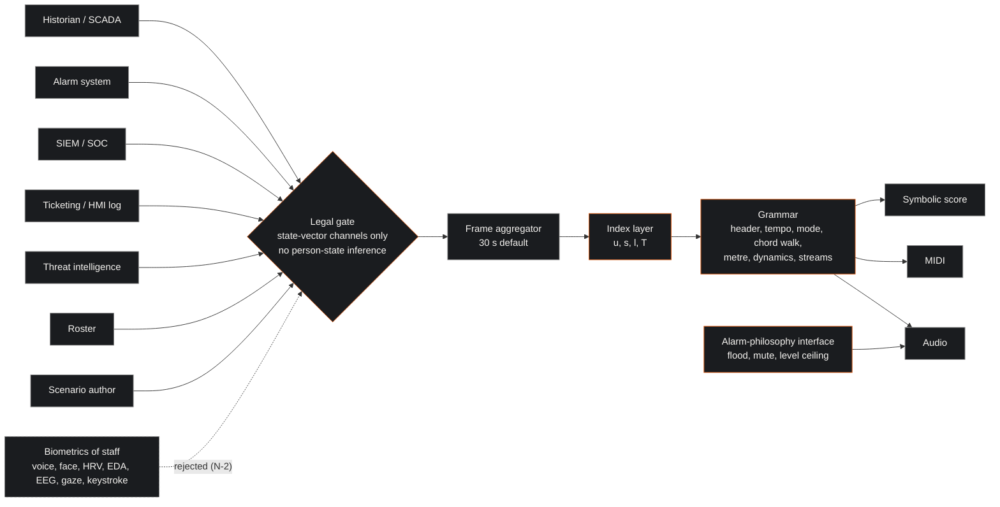
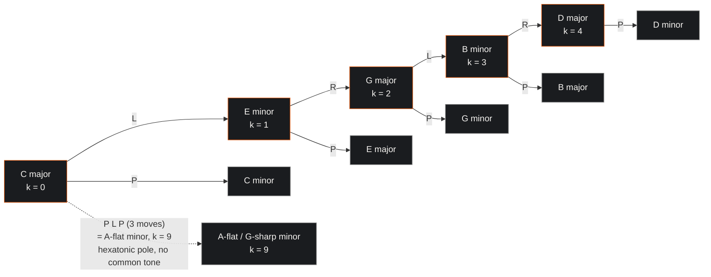
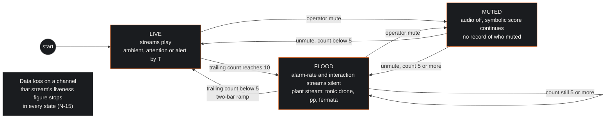

| Field | Value |
|:---|:---|
| Designation | MPN-2, normative specification of the notation (Musical Psychometric Notation, second edition) |
| Status | Draft for working-group review |
| Normative language | RFC 2119 |
| Licence | Creative Commons Attribution 4.0 International (CC BY 4.0) |
| Extends | MPN-1 (foundations) and the working group's earlier paper on Musical Psychometric Notation (MPN v1), which this edition supersedes |
| Series | Paper 2 of 4 (Foundations, Notation, Engine, Deployment) |

## 1. Executive Summary & Scope

This paper defines the notation: what may enter a score, how each input becomes a musical parameter, which single tension index and single alert rule the notation uses, how it behaves next to a real alarm system, how a score is rendered as symbols, MIDI and sound, and how the whole is to be validated. Two independent implementers, given the same input series and declared constants, must produce the same score. The key words MUST, MUST NOT, SHOULD and MAY are to be read as in RFC 2119 [1]. The paper is offered under CC BY 4.0 [2]. Notation requirements are numbered N-1 through N-27 and bind Papers 3 and 4; the foundations requirements F-1 through F-14 of Paper 1 bind this paper [3].

The notation is lawful by design. Regulation (EU) 2024/1689 Article 5(1)(f) prohibits AI systems that infer the emotions of a natural person in the workplace, except where the use is intended for medical or safety reasons; the prohibition has applied since 2 February 2025, and the Commission's guidelines read "emotions" widely enough to include emotional arousal, stress-based anxiety and a team's emotional tone, and read the safety exception narrowly [6] [7]. The notation does not rely on that exception, because it infers no emotion at all. Physiological data about a worker are health data under the GDPR [9], and any facility suitable for observing staff behaviour or performance needs prior works-council consent under the Dutch Works Councils Act [10]. The notation therefore sounds the state of the socio-technical link and not the state of a person: plant deviation from nominal, alarm load, task and interaction tempo, queue and latency, an adversary's estimated discourse, and one advisory schedule-based fatigue index on the SAFTE-FAST pattern [12] [13]. No biometric of a member of staff (voice, face, heart-rate variability, electrodermal activity, EEG, gaze, keystroke timing) is an admissible input, and no input is an inferred emotion, mood, stress or arousal. The scientific ground is the one the legislator cited: Barrett and colleagues found no facial configuration reliably diagnostic of an emotion, and the Commission's guidelines cite that review as the basis of the prohibition [11] [7]; physiological channels, reviewed in Paper 1, section 6.6, index arousal and load rather than emotion (F-10) [3].

### 1.1 The two input modes

The notation has two input modes, declared in the header of every score. In operational mode the inputs are the channels of section 2 and nothing else; no person-state is inferred. In simulation and adversary mode two further inputs are permitted: a hand-authored psychometric vector of the kind the reference implementation attaches to each frame of its thirteen dramatic scenarios (`mpn-conductor-standalone:src/components/mpn-lab/literary_data.ts:16`), and a labelled discourse estimate for a threat actor from threat intelligence, in the sense of the working group's earlier typology [5]. Both are engineering constructions labelled as such (F-2, F-11); neither describes an identifiable member of staff.

### 1.2 What this edition retracts from MPN v1

MPN v1 assigned instrument families to the DISC quadrants of "operational personnel", derived dynamics from OCEAN traits, defined a "clinical health score" as a rescaling of a trauma scalar, read the clef as organisational psychology, and claimed a 15 to 30 minute early warning with an average lead time of 22 minutes over fifteen events [4]. Paper 1 retracts those claims (corrections rows 10 to 12); this edition replaces them: instruments now identify streams of link state, dynamics encode a load index, the health score is withdrawn, the clef is an operating context declared by a person, and no lead time is claimed. It also fixes two mathematical errors: a leading-tone exchange that mapped C major to B minor, and a compound operation described as a tritone shift that is in fact a hexatonic pole (section 3.6). What survives of v1 is its layout: a header block, streams on staves, and a dissonance function feeding a small number of sonification modes.

## 2. The state vector

The state vector is the complete list of channels a score may draw on, each with a source system, a unit, a sampling rate, a personal-data status under the GDPR and a biometric status under the AI Act. The AI Act's definition of biometric data drops the GDPR's unique-identification qualifier, so personal data such as heart rate, EEG, voice, gaze and keystroke dynamics are biometric data for its purposes even where they do not permit unique identification [6] [7]; the table applies that reading.

| Channel | Symbol | Source system | Unit | Sampling | Personal data (GDPR) | Biometric (AI Act) | Mode |
|:---|:---|:---|:---|:---|:---|:---|:---|
| Plant deviation from nominal | `x_p` | Historian or SCADA process variables against the rationalised operating limits | dimensionless, 0 to 1 | 1 s to 10 s, aggregated per frame | No | No | All |
| Annunciated alarm rate | `a_10` | Alarm system, trailing 10-minute count, the IEC 62682 and ISA-18.2 rate metric [14] [15] | alarms per 10 min | per frame | No | No | All |
| Flood state | `F` | Derived from `a_10` by the state machine of section 5 | boolean | per frame | No | No | All |
| Standing, stale and chattering alarms | `a_st`, `a_stale`, `a_ch` | Alarm system counts, as in the IEC 62682 monitoring metrics [14] | count | per frame | No | No | All |
| Standing alarms of medium or high priority | `a_hp` | Alarm system, count of standing alarms whose rationalised priority is medium or high [14] | count | per frame | No | No | All |
| Alarm-count dispersion | `I` | Index of dispersion of the ten one-minute alarm counts in the trailing window | dimensionless | per frame | No | No | All |
| Security event rate | `e` | SIEM or SOC pipeline, events per minute after correlation | events per min | per minute | No (system events) | No | All |
| Queue depth | `q` | Ticketing, work-order or pending-action list at console level | count | per minute | No (counts only) | No | All |
| Acknowledge latency | `lam` | Alarm system, median time from annunciation to acknowledgement at console level | seconds | per frame | No in the score; the source log may be | No | All |
| Interaction tempo | `rho` | HMI event log: acknowledgements, commands and setpoint changes per console, without user identity | actions per min | per minute | No in the score; the source log may be | No | All |
| Adversary discourse estimate | `delta` | Threat-intelligence analyst coding of the active threat actor over the four discourses (and the capitalist discourse as a fifth label outside the orbit, F-3) | probability vector | on update | Not about staff | No | Adversary, simulation |
| Roster fatigue index | `phi` | Schedule-predicted sleep opportunity only, SAFTE-FAST pattern [12]; computed for the crew on shift, never for a named individual; no reported or measured sleep, health or biometric input | 0 to 1 | per shift | No in the score (a crew-level value with no identifier); the roster it is computed from is personal data and is not carried | No | All, annotation only |
| Simulation vector | `p_sim` | Scenario author; the 9-component vector of the reference implementation (`mpn-conductor-standalone:ml/psychoscore_v2/models/mckenney_lacan_calculus.py:25-51`) | 0 to 1 each | per scene or frame | No (synthetic) | No | Simulation |

Four remarks belong with the table. First, the interaction, latency and fatigue channels are the ones a works council will ask about: the first two are behavioural data and the third concerns presence and performance, so all three fall under Article 27(1)(k) and (l) of the Works Councils Act, and Paper 4 requires consent before any is connected [10]. The score carries console-level counts and medians with no user identity, but aggregation at the console does not anonymise a console staffed by one person; where a console is not shared, its channels MUST be aggregated at unit level with at least one other console or not rendered (N-3). The precedents for displaying group behaviour as turn-taking and position rather than as affect are the Meeting Mediator, which showed speaking-time balance to the participants themselves and to nobody else [28], and the sonification of player positions in team sport [29]; the notation goes further by dropping the person from the data before rendering. Second, the fatigue index is admitted because Recital 18 of the Regulation carves fatigue out of emotion recognition and because the aviation regulators keep such models advisory, population-level and never a go/no-go criterion [6] [13]. It is computed for the crew on shift from schedule-predicted sleep opportunity, never from reported or measured sleep and never for a named individual, and it is written as a text annotation and never sonified. Third, the adversary discourse estimate and the simulation vector carry person-level constructions, and the insider case is the trap: an estimate attached to a member of staff suspected of being an insider would be a psychological inference about an employee. N-27 prohibits attaching either channel to an identifiable member of staff, in any mode. Fourth, the Commission's guidelines on the AI-system definition place basic data processing and systems intended solely for descriptive analysis and visualisation outside the definition [8]; a fixed, human-authored parameter mapping arguably falls in that category, a learned model inferring a latent state of a person would not, and the position has not been tested by any authority.

The rule is absolute and is stated once here and again as N-2: a channel MUST NOT be a biometric of a member of staff, and a channel MUST NOT be an inferred emotion, mood, stress or arousal of a member of staff, in any mode.

## 3. The grammar

### 3.1 Frames, bars and the header block

The state is sampled in frames of fixed length $\Delta$, 30 s by default and never shorter than 10 s. Every index of section 3.2 is computed once per frame from the channels aggregated over that frame and over any trailing window the channel's definition names. Musical bars follow the tempo in the ordinary way, so a frame contains a variable number of bars; a change in any discrete parameter (chord, mode, metre, clef) is realised at the first bar line at or after the end of the frame in which it was computed, and continuous parameters (tempo, velocity) are interpolated linearly across the following frame. This is what makes the notation exact: a frame is a row in a table, and section 8 shows two such tables.

Four computational conventions make the tables reproducible, and N-26 depends on them. Every index is computed in exact rational arithmetic, and every comparison against a threshold is made on the exact value before rounding. The function round() is round-half-to-even, so 106.5 rounds to 106 and 0.715 prints as 0.72. In the first frame of a score, where no previous frame exists, the instability term that needs $x_p(t - \Delta)$ is zero. The dispersion index uses the population variance (divisor ten) over ten one-minute bins whose last bin ends at the frame end. Shortest PLR words are not unique in general (two words of length three lead from C major to C-sharp minor); where several shortest words exist, the one that is first in lexicographic order with P before L before R is chosen.

Every score opens with a header block. The clef, key, time signature and tempo are kept from v1 in name, and every one of them is redefined.

| Field | Content | Definition |
|:---|:---|:---|
| SCORE | Link identifier | The control room, desk or exercise the score describes; never a person |
| DATE | ISO 8601 start time | |
| MODE | operational, simulation or adversary | Fixes which channels of section 2 are admissible |
| CLEF | War Room (sharp), Boardroom (flat), Ops Floor (natural) | The operating context, declared by a person or by the site's own emergency procedure; never inferred. Sets the tempo band |
| KEY | Tonic pitch class, default C | The tonic triad represents the nominal operating state; the mode (major or minor) is realised bar by bar |
| TIME | Time signature at bar 1 | Realised from the dispersion index, section 3.5 |
| TEMPO | Beats per minute at bar 1 | Realised from the activity index, section 3.3 |
| FRAME | Frame length in seconds | Default 30 |
| CONSTANTS | Every reference value and weight named in sections 3 and 4 | Site-declared; a score without them is not conformant (N-4) |
| SILENCE | Mute state and flood state at bar 1 | Section 5 |

The clef is the v1 element most in need of redefinition. In v1 the War Room clef was selected by an inferred threat level [4]; in the reference implementation the equivalent "stability regime" is selected by a hand-set entropy scalar (`mpn-conductor-standalone:ml/psychoscore_v2/models/mckenney_lacan_calculus.py:103-162`). Here the clef is a context and nothing else: Ops Floor for normal operation, War Room for a declared incident or emergency, Boardroom for strategic review and replay. The declaration comes from a person (the shift supervisor or incident commander) or from a plant state the site's procedures already define as an emergency. The clef sets the tempo band, kept from v1 and from the code: 80 to 100 beats per minute for Ops Floor, 120 to 180 for War Room, 40 to 60 for Boardroom. A clef change is written as a double bar with a new tempo mark; the discontinuity it produces is an event announced by a person, not an artefact of a threshold on a continuous variable, which is what the reference implementation's tempo function produces at its two band edges (deconstruction, section 3.2).

### 3.2 The four indices

Four scalar indices in the unit interval stand between the channels and the musical parameters; they are the working group's own constructions, defined here so that they can be audited.

Plant deviation is computed from the $n$ process variables the site's alarm rationalisation has designated as the operating envelope. For variable $k$ with nominal value $y_k^0$, normal-band half-width $b_k$ and alarm limit $h_k$,

$$z_k = \frac{\max\!\left(0,\; |y_k - y_k^0| - b_k\right)}{h_k - b_k}, \qquad x_p = \min\!\left(1,\; \frac{\|z\|_2}{\sqrt{n}}\right),$$

so that a plant inside its normal bands has $x_p = 0$ and a plant whose variables sit on average at their alarm limits has $x_p = 1$. The normal band is a dead zone: ordinary process noise does not move the harmony.

The activity index combines the three rate channels against site-declared references,

$$u = w_a \min\!\left(1, \frac{a_{10}}{10}\right) + w_e \min\!\left(1, \frac{e}{e_{\text{ref}}}\right) + w_\rho \min\!\left(1, \frac{\rho}{\rho_{\text{ref}}}\right), \qquad w_a + w_e + w_\rho = 1,$$

with default weights $(0.5, 0.25, 0.25)$ for a room that has all three feeds; a plant control room without a SOC feed declares $w_e = 0$. The alarm term is normalised to ten per ten minutes because that is the flood threshold of section 5, so $u$ saturates on the alarm side exactly where the alarm system itself declares overload.

The instability index is the larger of the normalised rate of change of plant deviation and the normalised chattering count,

$$s = \max\!\left(\min\!\left(1, \frac{|x_p(t) - x_p(t - \Delta)|}{\delta_{\text{ref}}}\right),\; \min\!\left(1, \frac{a_{ch}}{a_{ch,\text{ref}}}\right)\right),$$

with $\delta_{\text{ref}} = 0.2$ per frame and $a_{ch,\text{ref}} = 3$ by default. It measures how fast the state is moving, not how far it has gone; the latter is $x_p$.

The load index is the mean of three normalised human-side quantities,

$$\ell = \frac{1}{3}\left(\min\!\left(1, \frac{a_{st}}{a_{st,\text{ref}}}\right) + \min\!\left(1, \frac{q}{q_{\text{ref}}}\right) + \min\!\left(1, \frac{\lambda}{\lambda_{\text{ref}}}\right)\right),$$

with defaults $a_{st,\text{ref}} = 10$, $q_{\text{ref}} = 6$ and $\lambda_{\text{ref}} = 120$ s. It is a task-load index computed from the alarm list and the work list, not a workload measurement of anyone: it says how much is standing, queued and waiting, and nothing about who is doing it.

### 3.3 The mapping table

Each mapping carries one of the evidence tiers fixed by the series brief and Paper 1, defined here in one line each. STRONG: replicated across meta-analysis and cross-cultural work. CONVENTIONAL: an association that Western-enculturated listeners read reliably but that is weaker cross-culturally or dominated by another cue. COMPONENT: a measurable psychoacoustic quantity that is one fitted predictor among several of the target percept. SUPPORTED: fitted to listener data within the Western tonal idiom. MATHEMATICS: a theorem, with no perceptual claim. THEORY: a prediction of a psychophysical theory whose affective reading is an inference. MODERATE: supported by rating studies of isolated stimuli. CONVENTION: a coding the working group owns outright (F-2), with no perceptual evidence. Perceived emotion and induced emotion are kept separate throughout: the notation communicates, and needs only the evidence that listeners recognise what a parameter expresses [36].

| Input | Musical parameter | Function | Tier | Citation |
|:---|:---|:---|:---|:---|
| Activity index `u`, clef band | Tempo | `tempo = t_min(clef) + u * (t_max(clef) - t_min(clef))`, interpolated across the frame | STRONG | Juslin and Laukka 2003 [35]; Husain et al. 2002 [40]; Fritz et al. 2009 [41] |
| Plant-health flag: `x_p < 0.5` and `a_hp = 0` | Mode (major or minor), realised by the P operation | major if the flag holds, else minor | CONVENTIONAL (Western; tempo-dominated) | Hevner 1936 [38]; Gabrielsson and Lindström 2010 [39]; Husain et al. 2002 [40]; Balkwill and Thompson 1999 [42] |
| Plant deviation `x_p` | Harmonic distance: chain position `k` along the LR chain from the tonic | `k = round(12 * x_p)`, with a dead band of 0.02 either side of each rounding boundary | SUPPORTED | Lerdahl 2001 [43]; Lerdahl and Krumhansl 2007 [44]; Bigand et al. 1996 [45]; Krumhansl and Kessler 1982 [47] |
| Change of `(k, mode)` between frames | P, L, R transition word | Shortest word in the PLR Cayley graph from the realised chord to the target chord, ties broken lexicographically with P before L before R, one generator per bar | MATHEMATICS (D24) | Cohn 1997 [52]; Crans, Fiore and Satyendra 2009 [53] |
| Instability `s` | Roughness: added tones and detune | Lookup of section 3.7 | COMPONENT | Plomp and Levelt 1965 [48]; Sethares 2005 [49]; Farbood 2012 [46]; McDermott et al. 2016 [50] |
| Alarm-count dispersion `I` | Metre | `I < 1`: 4/4; `1 <= I < 3`: 5/4; `I >= 3`: 7/8; fewer than four alarms in the window: 4/4 | THEORY | Large and Jones 1999 [58]; London 2004 [57]; Lerdahl and Jackendoff 1983 [56] |
| Load `l` | Dynamics: MIDI velocity and marking | `v = round(30 + 90 * l)`; marking by section 3.8 | STRONG (loudness as an arousal cue); CONVENTIONAL (loudness as a load code) | Juslin and Laukka 2003 [35]; Gabrielsson and Lindström 2010 [39]; Walker 2002 [32] |
| Stream identity | Timbre family, register, rhythmic figure | Fixed assignment of section 3.9 | MODERATE (timbre to arousal); THEORY (segregation by auditory scene analysis) | Bregman 1990 [27]; Eerola, Ferrer and Alluri 2012 [59]; Hailstone et al. 2009 [60]; Loeb and Fitch 2002 [23] |
| Adversary discourse `delta` (adversary mode) | Voice-leading style of the adversary stream | Lookup of section 3.10 | CONVENTION | Paper 1 [3]; Gadalla et al. 2026 [67] |
| Fatigue index `phi` | Text annotation on the score | `phi` below a declared threshold: annotation "fatigue advisory"; never audio | Not tiered (an annotation, not a mapping) | Roma et al. 2012 [12]; CASA guidance [13] |
| Rolling AC(1) and variance of `x_p` and `lam` (optional) | Margin annotation | Section 4.3 (F-6, F-8) | THEORY | Scheffer et al. 2009 [65]; Dakos et al. 2012 [66] |

### 3.4 Tempo and mode

Tempo is the strongest mapping the notation has. The meta-analysis of vocal and musical expression is organised by discrete emotion, and its finding that fast tempo and high intensity mark anger, happiness and fear while slow tempo and low intensity mark sadness and tenderness is read here, as its authors also read it, as tempo cueing arousal [35]; listeners without exposure to Western music recognise those emotions from tempo and mode cues [41], and tempo shifts arousal where mode shifts mood [40]. The activity index therefore drives tempo and nothing else does; the band edges are set by the declared clef, so the only discontinuities are the ones a person announces.

Mode is the weakest mapping the notation keeps, kept because it is cheap and because listeners in Western control rooms will read it. Major-to-happy and minor-to-sad is the oldest finding in the field [38], reviewed as a stable association for enculturated listeners [39], weaker cross-culturally than tempo and dominated by tempo when the two conflict [40] [42]. Mode is therefore a conventional valence marker, tempo-dominated, and no rule in this paper depends on it alone. What drives it is the plant-health flag, a defined condition on two channels of section 2, inside the operating envelope with no medium- or high-priority alarm standing, and it is realised harmonically by the P operation so that the realised chord's quality always matches the flag. The flag describes the plant, not anyone's feeling about it.

### 3.5 Metre from alarm-rate dispersion

Alarm arrivals can be frequent and steady or frequent and bunched; the rate goes into tempo and the bunching into metre. The index of dispersion of the ten one-minute alarm counts in the trailing window, variance over mean, is one for a Poisson process, below one for a regular process and well above one for a bursty one; it is undefined when the mean is zero and unstable when the count is small, so the notation falls back to common time when fewer than four alarms are in the window. Regular metre supports anticipatory attending, in which attention concentrates at expected time points as a rhythm becomes predictable [58], and metrical hearing has limits of period and regularity [57]; the well-formedness rules of the generative theory make "regular" and "irregular" formal properties of the grid rather than impressions [56]. That is the theory. The affective reading, that irregular metre is heard as uncertainty, is an inference and is labelled THEORY in the table; the listener study of section 9 tests it.

### 3.6 The transition algebra: P, L and R on the 24 triads

This subsection is mathematics and carries no psychological claim (F-2; Paper 1, corrections row 12). Write a consonant triad as a pair $(r, q)$ with root $r \in \mathbb{Z}_{12}$ and quality $q \in \{\text{major}, \text{minor}\}$, so that a major triad has pitch classes $\{r, r+4, r+7\}$ and a minor triad $\{r, r+3, r+7\}$. The three neo-Riemannian operations are

$$P(r, \text{major}) = (r, \text{minor}), \qquad P(r, \text{minor}) = (r, \text{major});$$

$$L(r, \text{major}) = (r + 4, \text{minor}), \qquad L(r, \text{minor}) = (r - 4, \text{major});$$

$$R(r, \text{major}) = (r + 9, \text{minor}), \qquad R(r, \text{minor}) = (r + 3, \text{major}).$$

Each is an involution, each preserves two common tones, and each moves the remaining voice by a semitone (P and L) or a whole tone (R); that is what parsimonious voice leading means [52]. On C major: $P$ gives C minor, $L$ gives E minor, $R$ gives A minor. The group generated by P, L and R is the dihedral group of order 24, it acts simply transitively on the 24 consonant triads, and it is generated by L and R alone, with $P = RLRLRLR$ [53]. The transposition-inversion group is a second dihedral group of order 24 on the same set, and the two actions are dual [53]. The general framework in which a transformation acts on a set of musical objects is Lewin's [54], and the standard survey of the neo-Riemannian programme is Cohn's [55].

Two errors are corrected here. MPN v1 wrote $L$ correctly as C major to E minor but described the compound $PLP$ as "C Major to D-flat Major" and called it a tritone shift [4]; in fact $PLP(\text{C major}) = P(L(\text{C minor})) = P(\text{A-flat major}) = \text{A-flat minor}$, which shares no pitch class with C major and is the hexatonic pole of Cohn's hexatonic systems [51], not a tritone transposition. The reference implementation's Tonnetz module defines $L$ on a major triad as root minus one, minor, so that C major maps to B minor, and a unit test asserts that result (`mpn-conductor-standalone:mpn_engine/core/tonnetz.py:104-107`; `mpn_engine/tests/test_tonnetz.py:74-80`). That map is an involution, but it is the wrong operation: C major and B minor share one pitch class, not two, so it is not a parsimonious voice leading and not the neo-Riemannian $L$. The repository's other calculus module has $L$ right (`ml/psychoscore_v2/models/mckenney_lacan_calculus.py:411-416`); Paper 3 records the discrepancy, and the definitions above are normative (N-9).

The state coordinate is a position on the LR chain. Alternating L and R from the tonic generates the 24-cycle through every consonant triad, and each LR pair is a transposition by a perfect fifth, so from C major the chain runs C, E minor, G, B minor, D, F-sharp minor, A, C-sharp minor, E, G-sharp minor, B, D-sharp minor, F-sharp at positions 0 to 12, then continues through A-sharp minor and eleven further triads to return to C major at position 24. Only positions 0 to 12 are targets, since $k = \text{round}(12\, x_p) \le 12$; the far half of the cycle, and the parallel triads such as C minor, are reached only through $P$. The chain position $k$ is the notation's pitch-space distance from nominal, and the number of fifths from the tonic is $\lfloor k/2 \rfloor$, with odd $k$ landing on a minor triad rather than a key. It is chosen over Lerdahl's fitted pitch-space distance [43] because it is exact and closed under the transition algebra; both treat fifths-related keys as near, but the comparison is not made here, and Lerdahl's fits are for Western tonal listeners [44]. The target chord for a frame is the chain chord at $k$, with $P$ applied if its quality disagrees with the plant-health flag. The realised chord walks to the target by a shortest word in the PLR Cayley graph, one generator per bar; the graph has diameter five, so a walk completes within five bars. Shortest words are not unique, and section 3.1 fixes the tie-break. Which generator is triggered by which state change is therefore fixed: a change of the flag alone is realised by $P$; a step of one in $k$ with the flag unchanged is realised by the single $L$ or $R$ that advances along the chain; a larger jump is realised by the chosen shortest word, which may cut across the chain through $P$. The one exception is alert entry (section 4.2), where the walk is suspended and the target is written directly.

### 3.7 Roughness from the instability index

Sensory roughness is a psychoacoustic quantity: for pure-tone pairs it peaks near a quarter of a critical bandwidth and vanishes beyond it, and for complex tones it sums over partial pairs [48], so it is a property of a timbre-and-interval pair, not of an interval alone [49]. Surface dissonance is one predictor among several of continuous tension ratings, alongside harmonic distance, loudness and onset rate [44] [46], hence the COMPONENT tier; and consonance preference is culturally shaped even where roughness is not [50], hence roughness is never read as valence. The instability index is rendered as added tones on the realised chord and as a detune, in a fixed order of increasing roughness: $s < 0.25$, none; $0.25 \le s < 0.5$, added major seventh; $0.5 \le s < 0.75$, added augmented fourth against the root; $s \ge 0.75$, added minor second above the root in the octave of the fifth, with the fifth doubled and detuned by 25 cents. Because roughness depends on spectrum, the renderer's timbre set is fixed per site and validated with it (section 9).

### 3.8 Dynamics from the load index

Velocity is linear in the load index, $v = \text{round}(30 + 90\,\ell)$, from 30 to 120; the floor keeps the display audible and the ceiling keeps it under the level cap of section 5. The marking follows the load index by six monotone bands: below 0.1 pianissimo, below 0.3 piano, below 0.5 mezzo-piano, below 0.7 mezzo-forte, below 0.85 forte, otherwise fortissimo. The reference implementation's TypeScript table maps its scalar to three bands (velocities 30, 72 and 118) with a default of 72 filling the gaps between them, so that six tenths of the input range collapse to one value and the steps at 0.2 and 0.8 are jumps of 42 and 46 (`mpn-conductor-standalone:src/components/mpn-lab/mpn_reference_lookup.ts:150-178`; deconstruction, section 3.1); the six bands above replace it. Loudness is a strong cue to perceived arousal and potency [35] [39]; its reading as load is a convention whose polarity is tested by magnitude estimation in section 9 [32].

### 3.9 Streams, timbre and the salience of absence

The notation has at most three concurrent streams in operational mode and four in simulation and adversary mode. The number is a design rule, not a capacity figure: the auditory system segregates sound into streams by frequency proximity, timbre, spatial position, onset synchrony and temporal regularity, and sources that share register and timbre fuse or mask one another [27]; the best-documented multi-variable display carried six variables in two rhythmic streams, with every event detected but only 60% identified from sound alone [23], and the working group's limited search (section 6.1) found no study establishing a larger number. Each stream is therefore assigned a distinct timbre family, register, rhythmic figure and pan position.

| Stream | Channel it carries | Timbre family | Register (MIDI) | Rhythmic figure | Pan |
|:---|:---|:---|:---|:---|:---|
| Plant | `x_p`, mode, roughness | Sustained strings or pad | 48 to 59 | Held chord, re-struck at each bar | Centre |
| Alarm rate | `a_10`, `I` | Pitched percussion (marimba-like) | 60 to 71 | Pulse density proportional to `a_10`, grouped by the metre; never one event per alarm | Left |
| Interaction | `rho`, `q` | Woodwind | 72 to 84 | Figure density proportional to `rho`; sustained tone length proportional to `q` | Right |
| Adversary (adversary and simulation mode only) | `delta` | Low brass | 24 to 47 | Voice-leading style of section 3.10 | Centre-left |

Timbre carries information of its own: brightness and attack time predict arousal ratings of isolated tones, and the same melody on different instruments shifts the emotion listeners recognise [59] [60]. The assignment uses timbre only for segregation and keeps the family fixed per stream, since a family that changed with state would reintroduce the v1 error of reading instruments as people; the orchestration treatises' craft mappings are not evidence and are not used.

A stream's absence must be salient. Peep, the network auralizer, made the point with crickets: when the mail server dies, the crickets stop [26]. Each stream therefore carries a liveness figure, a soft periodic element at the bottom of its register that continues whatever the state, and its cessation means data loss on that channel and nothing else. Deliberate silence, by operator mute or by flood, is written differently (section 5), so that a listener can tell the three silences apart: muted, flooded, and lost.

### 3.10 The four discourses as adversary-side voice leading

In adversary mode and in simulation, the fourth stream carries the estimated discourse of the active threat actor. The four discourses are the orbit of one labelled bijection under the quarter-turn, and the capitalist discourse is a fifth label outside the orbit (F-3) [3] [70]. The working group's earlier typology read the master's discourse as state warfare, the university's as espionage, the hysteric's as hacktivism and the analyst's as quiet reconnaissance [5], which Paper 1 narrows to analyst's codings standing as hypotheses. Here they become four voice-leading styles for one stream; the coding is the working group's own, with no perceptual evidence behind it (F-2).

| Discourse (agent) | Voice-leading style of the adversary stream |
|:---|:---|
| Master (S1) | Root-position triads in parallel motion, entries on strong beats, no suspensions |
| University (S2) | Stepwise sequential figures that repeat a pattern at successive scale degrees |
| Hysteric (barred S) | Syncopated entries against the beat; suspensions left unresolved |
| Analyst (a) | Sparse single tones off the beat, long rests; the stream is mostly absent |
| Capitalist (outside the orbit) | The master's style with the root omitted, so the bass is missing |

The stream plays the style of the discourse with the largest estimated probability and changes style at a double bar when the estimate rotates by a quarter-turn or leaves the orbit. Any claim that the estimate was scored from text rather than coded by an analyst MUST cite Gadalla, Nikoletseas and Amazonas as predecessor and report reliability on the same basis (F-13) [67]; no discourse detection exists in the reference implementation's code (deconstruction, section 2.5), so no deployed score may claim one.

## 4. The dissonance and crisis functions

### 4.1 One tension index

The reference implementation carries a tension score, a "Lyapunov exponent" that is a linear function of two hand-set scalars, and a Borromean stability index with three definitions in code and documents plus a fourth on the conductor page (`mpn-conductor-standalone:ml/psychoscore_v2/models/mckenney_lacan_calculus.py:281-287, 290-384, 445-454`; deconstruction, sections 3.5, 3.6 and 3.9); Paper 3 sets that out. This paper defines exactly one tension index,

$$T = 0.4\, x_p + 0.3\, s + 0.3\, \ell ,$$

a weighted mean of plant deviation, instability and load, and requires every score to declare the weights. The weights are author-chosen defaults, ordered because plant deviation carries the consequence, instability the rate and load the human-side backlog; the listener study of section 9 tests whether perceived tension is monotone in $T$, the only property the index needs. Neither the Lyapunov scalar nor the Borromean index enters $T$: the first is not a divergence estimate, and the second depends on three register weights with no source in operational mode. Musical tension as listeners rate it is a joint function of harmonic distance, dissonance, loudness and onset rate with fitted weights [44] [46]; $T$ is on the state side of the mapping, and those features are its consequences, not its inputs.

### 4.2 One alert rule

The reference implementation has two crisis thresholds and a third in its topology document (deconstruction, section 3.9); this paper has one rule. Alert mode is entered when $T \ge 0.7$ in any frame and is left when $T < 0.5$ in two consecutive frames; between 0.4 and the alert boundary the score is in attention mode, and below 0.4 in ambient mode. On alert entry the chord walk of section 3.6 is suspended for one bar and the target chord is written directly with a sforzando, so that the entry breaks parsimony once and audibly; on exit the walk resumes and the dynamics release over four bars. Flood overrides all three modes (section 5). The thresholds are defaults: a site SHOULD set the alert threshold so that alert mode occupies a small declared fraction of operating time under normal conditions, in the spirit of the alarm-performance benchmarks of IEC 62682 [14], and MUST declare the value it uses. The rule is chosen over the reference implementation's conjunctions because a single threshold with hysteresis on one declared index is auditable, uses only quantities that exist in operational mode, and in the worked example of section 8 enters after the trip and leaves after the recovery without tuning. An alert is not an alarm and requires no response (section 5).

### 4.3 Early-warning observables as optional annotations

Paper 1, section 5, sets out the generic indicators of a system approaching a fold: rising lag-one autocorrelation, rising variance, flickering [65], with rolling-window estimation, detrending and surrogate tests [66]. A score MAY carry, in its margin, the rolling AC(1) and variance of plant deviation and of acknowledge latency over a declared window, as text. They MUST NOT be sonified, MUST NOT enter $T$ or the alert rule, and MUST NOT be described as a lead time (F-8). The annotation exists so that the data requirements of Paper 1, section 5.6, can one day be met from archived scores; until then it is a number in a margin.

## 5. The alarm-philosophy interface

The auditory channel in a control room is regulated before the notation arrives. IEC 62682:2022 and ANSI/ISA-18.2-2016 reserve annunciation for alarms that require a defined operator response, manage them through an alarm philosophy and a lifecycle, and measure their load with rate metrics [14] [15]; EEMUA 191, now in its fourth edition, is the aligned guide [17]. The verified endpoints of the benchmark are the Health and Safety Executive's, citing EEMUA: no more than one alarm every ten minutes in normal operation, and no more than ten in the first ten minutes after a major upset [16]. The consequence of ignoring them is on record: in the last eleven minutes before the Milford Haven explosion the two operators had to recognise, acknowledge and act on 275 alarms, and the investigation found that the excessive number of alarms reduced the effectiveness of the operator response [16] [18].

The notation's position follows. It is not an alarm: it requires no response, is declared in the site's alarm philosophy as a non-alarm auditory display, and generates no alarm record. It must not raise the annunciated alarm rate: the alarm-rate stream renders density, never one sound per alarm. It must go silent, or reduce to a single drone, in a flood, exactly when a state display would be most informative and least usable. It must respect the audibility of danger signals: ISO 7731 sets the requirements for auditory danger signals in work areas [19], and the notation MUST stay below the site's alarm signals by a declared margin and MUST NOT share their spectral band. It must learn the masking lesson of the medical alarm standard: staff in operating rooms and intensive-care units could identify only a minority of the alarms in their own units, and many were masked by others [21]; the 2006 melodic alarm signals of IEC 60601-1-8 were followed in 2020 by an amendment introducing a new set of alarm sounds [20] [22]. The notation therefore carries no discrete identifiable messages, no earcons for named events, and no motif resembling the site's alarm tones. And it must be silenceable: one control, no penalty, no record of who used it, since a log of mute events would itself be behaviour monitoring.

The flood state machine is the working group's own definition on the industry practice. The standard's own clause text was not available to the working group for verification; public reproductions of the ISA-18.2 flood definition differ by one alarm ("exceeds ten" against "ten or more" in ten minutes), the verified figures are the HSE endpoints [16], and the end condition is not verified from any standard. The notation therefore fixes its own rule: flood is entered when the trailing ten-minute count reaches ten, and left when it falls below five, the gap being the working group's hysteresis against re-entry on a single late alarm and not a figure taken from the standards.

During flood the symbolic score continues in full, since a written score is not an auditory load, and the header's SILENCE field records the flood state. Every performance claim behind the design transfers from anaesthesia and laboratory work, none from an industrial control room: no controlled study of continuous sonification of plant state in a process control room was found [23] [24] [30], and no standard covers continuous non-alarm sonification at all, which is itself a finding.

## 6. Rendering

### 6.1 The symbolic score

The score is rendered as one system per frame group with one staff per stream, in ordinary staff notation with the register clefs the streams' ranges call for. The header block stands at the top; a change of context clef is a double bar with the new context symbol and tempo mark; a flood is a fermata over a tonic pedal on the plant staff with the other staves resting; a mute is a bracket over all staves marked "tacet"; data loss is the liveness figure stopping and the word "stale" over the affected staff. Margin annotations carry the fatigue advisory, the stale-alarm count and the optional early-warning observables. The score is the audit artefact: given the frame table and the header constants, a reader can check every bar. The precedent for a score as the trace of a formal process is Xenakis [68]; the precedent for time-series data rendered to notation is the musical sonification patent for market data [69]. No prior work was found that uses staff notation itself as a representation of operational state; the series claims that as its novelty, with the caveat that the search was limited.

### 6.2 MIDI parameter ranges

| Parameter | Range | Source |
|:---|:---|:---|
| Tempo | 40 to 180 beats per minute, by clef band | `u` and clef |
| Velocity | 30 to 120 | `l` |
| Plant stream pitch | 48 to 59 | Realised chord, root in the lowest octave |
| Alarm-rate stream pitch | 60 to 71 | Tonic and fifth of the realised chord |
| Interaction stream pitch | 72 to 84 | Third and fifth of the realised chord |
| Adversary stream pitch | 24 to 47 | Style of section 3.10 |
| Detune (pitch bend) | 0 to 25 cents on one plant voice | `s >= 0.75` |
| Channel volume (CC 7) | Site ceiling per mode, never exceeded by velocity | Section 5 |
| Pan (CC 10) | Fixed per stream | Section 3.9 |
| Channels | 1 to 4, one per stream | |

### 6.3 Sonification modes

| Mode | Entry | Audio characteristics | Transfer basis |
|:---|:---|:---|:---|
| Ambient | `T < 0.4` | All live streams at their computed dynamics under the ambient ceiling; chord walk one generator per bar; liveness figures present | Continuous informing at low attentional cost: eyes-free respiratory monitoring during other tasks [24]; detection of events from sound alone at rates comparable to visual display [23] (anaesthesia, laboratory) |
| Attention | `0.4 <= T < 0.7` | Attention ceiling; the alarm-rate pulse is accented on the metre's first beat; roughness as computed | Enhanced oximetry tones, which add a second acoustic dimension at threshold crossings to improve range identification without harming concurrent tasks [25] (laboratory) |
| Alert | `T >= 0.7`, exit below 0.5 for two frames | Alert ceiling; entry writes the target chord directly with a sforzando; exit releases over four bars | The same two anaesthesia results, with the caveat that audio alone was worse for identifying which event had occurred (60% against 88% visual) [23]; sound for detection and orientation, vision for diagnosis |
| Flood | `a_10 >= 10` | Tonic drone, pianissimo; other streams silent | Alarm-flood evidence [16] [18] |

The anaesthesia results are the transfer basis and are labelled as such: they were obtained with residents monitoring simulated patients in a laboratory, not with operators monitoring plant, and the pulse oximeter's variable-pitch tone, the one field-proven continuous sonification, was enhanced in that laboratory work because a plain pitch tone conveys trend better than absolute range [25]. Sonification has a canonical definition and taxonomy [31] [33] [34], and the process-monitoring chapter of its handbook endorses the soundscape direction while reporting no quantitative evaluation of concurrent-stream limits [30]; on that basis the notation is presented as promising and unproven.

## 7. Conformance requirements

The following requirements, N-1 through N-27, are normative for this notation and bind Papers 3 and 4.

- **N-1.** A score MUST declare its input mode (operational, simulation or adversary) in the header and MUST draw only on the channels of section 2 admissible in that mode.
- **N-2.** A channel MUST NOT be a biometric of a member of staff, and a channel MUST NOT be an inferred emotion, mood, stress or arousal of a member of staff, in any mode.
- **N-3.** In operational mode a score MUST carry no per-person data other than the crew-level fatigue annotation of N-25; interaction and latency channels MUST be aggregated at console level without user identity, and a console staffed by one person MUST be aggregated at unit level with at least one other console or not rendered.
- **N-4.** Every reference constant, weight and threshold named in sections 3, 4 and 5 MUST be declared in the header.
- **N-5.** The clef MUST be set by a human declaration or by a plant state the site's procedures define, and MUST NOT be inferred from any continuous index.
- **N-6.** Tempo MUST be the linear function of the activity index within the clef band of section 3.3 and MUST NOT be driven by any other input.
- **N-7.** Mode MUST be realised by the P operation from the plant-health flag of section 3.3, and rules MUST NOT depend on mode alone.
- **N-8.** Harmonic distance MUST be the chain position $k = \text{round}(12\, x_p)$ with the declared dead band.
- **N-9.** The operations P, L and R MUST be as defined in section 3.6; an implementation whose L maps C major to any triad other than E minor is not conformant.
- **N-10.** The realised chord MUST reach the target chord by a shortest PLR word, ties broken lexicographically with P before L before R, one generator per bar, except at alert entry.
- **N-11.** Metre MUST follow the dispersion lookup of section 3.3, falling back to common time when fewer than four alarms are in the trailing window.
- **N-12.** Roughness MUST follow the ordered lookup of section 3.7, rendered with a timbre set fixed per site.
- **N-13.** Velocity MUST be $v = \text{round}(30 + 90\,\ell)$ with round-half-to-even, and the marking MUST follow the six monotone bands of section 3.8 evaluated on the exact value of $\ell$.
- **N-14.** A score MUST NOT carry more than three concurrent streams in operational mode or four in simulation and adversary mode, each with a distinct timbre family and rhythmic figure and a register that overlaps no other stream's, as in the table of section 3.9.
- **N-15.** Every stream MUST carry a liveness figure whose cessation means data loss on that channel and nothing else.
- **N-16.** The adversary stream MUST appear only in adversary and simulation mode, and any discourse estimate claimed to be scored from text MUST satisfy F-13.
- **N-17.** A score MUST use the tension index $T$ of section 4.1 with declared weights, and MUST NOT compute a Lyapunov or Borromean quantity into it.
- **N-18.** Alert mode MUST be entered and left by the single rule of section 4.2 with the declared thresholds and hysteresis.
- **N-19.** Early-warning observables MAY appear only as margin annotations; they MUST NOT be sonified, enter $T$, or be reported as a lead time.
- **N-20.** The notation MUST be declared in the site's alarm philosophy as a non-alarm auditory display requiring no response, and MUST NOT generate an alarm record.
- **N-21.** The alarm-rate stream MUST render density and MUST NOT sound one event per alarm.
- **N-22.** The notation MUST enter flood when the trailing ten-minute alarm count reaches ten and leave it when the count falls below five, with the flood rendering of section 5.
- **N-23.** The notation's level MUST stay below the site's alarm signals by a margin the site declares in the header after verifying the alarm signals' audibility under ISO 7731, and MUST NOT occupy their spectral band; it MUST carry no discrete identifiable messages and no motif resembling an alarm tone.
- **N-24.** The notation MUST be silenceable by the operator with one control, without penalty and without a record of who silenced it.
- **N-25.** The fatigue index MUST be rendered as a text annotation only and MUST NOT be sonified or used as a go/no-go criterion.
- **N-26.** An implementation MUST reproduce the frame tables of section 8 from the stated inputs and constants under the conventions of section 3.1 (exact rational arithmetic with comparisons on exact values, round-half-to-even, instability zero in the first frame, population variance over ten one-minute bins ending at the frame end, lexicographic tie-break among shortest PLR words); every integer, chord, word, marking and mode MUST match exactly, and every index printed to two decimals MUST match to within 0.005.
- **N-27.** The adversary discourse estimate and the simulation vector MUST NOT be attached to, or describe, an identifiable natural person who is a member of staff, in any mode; a suspected insider is a member of staff.

## 8. Worked examples

### 8.1 Operational mode: a feeder trip with an alarm burst

The excerpt is ten minutes of a distribution control room in Ops Floor context, tonic C, frames of 30 s, weights $w = (0.6, 0, 0.4)$ since the room has no SOC feed, and reference constants $\rho_{\text{ref}} = 6$ actions per minute, $q_{\text{ref}} = 6$, $\lambda_{\text{ref}} = 120$ s, $a_{st,\text{ref}} = 10$, $a_{ch,\text{ref}} = 3$, $\delta_{\text{ref}} = 0.2$. A feeder trips at 1:00; eight alarms annunciate at 1:02, 1:08, 1:15, 1:25, 1:33, 1:41, 1:55 and 2:20; the supervisor declares an incident at 1:30 (War Room); load transfer begins at 3:00 and the plant recovers through 5:30; a back-feed overload at 6:00 brings two further alarms at 6:05 and 6:12, the trailing count reaches ten, and the notation enters flood. The trailing count does not fall below five until about 12:00, so the excerpt ends in flood. The input values were chosen for the example and are not a record of any site; the state table is the input, and the notation table is what N-26 requires an implementation to reproduce from it under the conventions of section 3.1. Two cells show why those conventions matter: the load index at 2:00 is exactly 0.85 and sits on the forte-fortissimo boundary, which the exact comparison resolves to fortissimo, and the velocities at 2:00, 2:30 and 5:30 are exact halves that round to even.

| Frame start | Event | `x_p` | `a_10` | `rho` | `q` | `lam` (s) | `a_st` | `a_ch` | `a_hp` | Clef |
|:--|:---|:--|:--|:--|:--|:--|:--|:--|:--|:--|
| 0:00 | Nominal | 0.02 | 1 | 1.0 | 1 | 40 | 2 | 0 | 0 | Ops |
| 0:30 | Nominal | 0.02 | 0 | 1.0 | 1 | 40 | 2 | 0 | 0 | Ops |
| 1:00 | Feeder trip; 4 alarms | 0.55 | 4 | 3.0 | 3 | 40 | 5 | 0 | 2 | Ops |
| 1:30 | 3 alarms; incident declared | 0.70 | 7 | 6.0 | 5 | 60 | 8 | 0 | 3 | War |
| 2:00 | 1 alarm; one chattering | 0.75 | 8 | 7.0 | 6 | 90 | 8 | 1 | 3 | War |
| 2:30 | Acknowledging | 0.72 | 8 | 6.0 | 6 | 110 | 7 | 1 | 3 | War |
| 3:00 | Load transfer begins | 0.65 | 8 | 5.0 | 5 | 120 | 6 | 0 | 2 | War |
| 3:30 | Recovering | 0.55 | 8 | 4.0 | 4 | 120 | 5 | 0 | 2 | War |
| 4:00 | Recovering | 0.45 | 8 | 3.0 | 3 | 100 | 4 | 0 | 1 | War |
| 4:30 | Recovering | 0.40 | 8 | 2.0 | 3 | 90 | 4 | 0 | 1 | War |
| 5:00 | High-priority alarm clears | 0.35 | 8 | 2.0 | 2 | 80 | 3 | 0 | 0 | War |
| 5:30 | Steady | 0.35 | 8 | 2.0 | 2 | 70 | 3 | 0 | 0 | War |
| 6:00 | Back-feed overload; 2 alarms | 0.60 | 10 | 4.0 | 4 | 70 | 5 | 0 | 1 | War |
| 6:30 | In flood | 0.62 | 10 | 4.0 | 5 | 80 | 5 | 0 | 1 | War |
| 7:00 to 9:30 (six frames) | In flood, steady | 0.62 | 10 | 4.0 | 5 | 80 | 5 | 0 | 1 | War |

The dispersion index, population variance over the ten one-minute bins ending at each frame end, is undefined before the trip (fewer than four alarms in the window, so the metre is 4/4), and from the end of the 1:00 frame to the end of the 5:30 frame it alternates between 3.2 and 6.3 as the burst straddles one or two bins, so the metre is 7/8 from the first bar after 1:30. At the end of the 6:00 frame it falls to 2.6, which would give 5/4, but the flood entered in that frame overrides metre.

| Frame start | `u` | Tempo | Mode | `k` | Target chord | PLR word from previous | `s` | Roughness | `l` | Velocity, marking | `T` | Sonification mode |
|:--|:--|:--|:--|:--|:--|:--|:--|:--|:--|:--|:--|:--|
| 0:00 | 0.13 | 83 | major | 0 | C | (tonic) | 0.00 | none | 0.23 | 51, p | 0.08 | ambient |
| 0:30 | 0.07 | 81 | major | 0 | C | (none) | 0.00 | none | 0.23 | 51, p | 0.08 | ambient |
| 1:00 | 0.44 | 89 | minor | 7 | C-sharp minor | L P R | 1.00 | minor second cluster, detune | 0.44 | 70, mp | 0.65 | attention |
| 1:30 | 0.82 | 169 | minor | 8 | E minor | R P (suspended: written directly, sforzando) | 0.75 | minor second cluster, detune | 0.71 | 94, f | 0.72 | alert (entry) |
| 2:00 | 0.88 | 173 | minor | 9 | G-sharp minor | P L | 0.33 | added major seventh | 0.85 | 106, ff | 0.66 | alert |
| 2:30 | 0.88 | 173 | minor | 9 | G-sharp minor | (none) | 0.33 | added major seventh | 0.87 | 108, ff | 0.65 | alert |
| 3:00 | 0.81 | 169 | minor | 8 | E minor | L P | 0.35 | added major seventh | 0.81 | 103, f | 0.61 | alert |
| 3:30 | 0.75 | 165 | minor | 7 | C-sharp minor | P R | 0.50 | added augmented fourth | 0.72 | 95, f | 0.59 | alert |
| 4:00 | 0.68 | 161 | minor | 5 | F-sharp minor | L R | 0.50 | added augmented fourth | 0.58 | 82, mf | 0.50 | alert |
| 4:30 | 0.61 | 157 | minor | 5 | F-sharp minor | (none) | 0.25 | added major seventh | 0.55 | 80, mf | 0.40 | alert (first frame below 0.5) |
| 5:00 | 0.61 | 157 | major | 4 | D major | L | 0.25 | added major seventh | 0.43 | 69, mp | 0.35 | ambient (exit; four-bar release) |
| 5:30 | 0.61 | 157 | major | 4 | D major | (none) | 0.00 | none | 0.41 | 66, mp | 0.26 | ambient |
| 6:00 | 0.87 | (drone) | minor | 7 | (drone on C) | (suspended) | 1.00 | (drone) | 0.58 | pp | 0.72 | flood |
| 6:30 | 0.87 | (drone) | minor | 7 | (drone on C) | (suspended) | 0.10 | (drone) | 0.67 | pp | 0.48 | flood |
| 7:00 to 9:30 (six frames) | 0.87 | (drone) | minor | 7 | (drone on C) | (suspended) | 0.00 | (drone) | 0.67 | pp | 0.45 | flood |

Three things in the table deserve notice. The alarm system leads and the notation follows: the trip is annunciated at 1:02, and the score reaches attention mode at the bar after 1:30 and alert mode at the bar after 2:00, the right order for a display that requires no response. The harmony walks: from C major two shortest words of three generators lead to C-sharp minor, the tie-break picks L P R, and it is realised over three bars, and thereafter each target is one or two generators away. And the flood at 6:00 silences the display exactly when the tension index would have re-entered alert mode; the written score continues, the audio does not, and the header records why.

### 8.2 Simulation mode: a scenario vector in the reference implementation's form

In simulation mode the input is a hand-authored vector per scene in the reference implementation's nine-component form, $(\tau, H, r, s, i, D, I, S, C)$, here with values chosen for this example and not taken from the repository. The declared translation is: plant deviation $x_p \leftarrow \tau$; activity $u \leftarrow H$; instability from the frame-to-frame change of $\tau$ as in section 3.2; load $\ell \leftarrow 1 - \text{BSI}$ with the Borromean index in its calculus-module form, one minus the largest pairwise difference of $(r, s, i)$ (`mckenney_lacan_calculus.py:451-454`), chosen because it is the only one of the four definitions the tests exercise; mode minor if $\tau \ge 0.5$ or the Real weight is dominant; DISC values name the actor stream's instrument as the conductor does, which is permitted for synthetic agents only (F-11). Clef is Ops Floor throughout, tonic C.

| Scene | Vector (tau, H, r, s, i) | `x_p` | `u` | Tempo | Mode | `k` | Target | Word | `s` | `l` | Velocity, marking | `T` | Mode of render |
|:--|:---|:--|:--|:--|:--|:--|:--|:--|:--|:--|:--|:--|:--|
| A, before | (0.20, 0.30, 0.30, 0.50, 0.20) | 0.20 | 0.30 | 86 | major | 2 | G major | L R | 0.00 | 0.30 | 57, mp | 0.17 | ambient |
| B, the act | (0.85, 0.70, 0.60, 0.25, 0.15) | 0.85 | 0.70 | 94 | minor | 10 | B minor | L (suspended: written directly, sforzando) | 1.00 | 0.45 | 70, mp | 0.78 | alert |
| C, after | (0.60, 0.55, 0.45, 0.40, 0.15) | 0.60 | 0.55 | 91 | minor | 7 | C-sharp minor | P R L R (tie-break among three) | 1.00 | 0.30 | 57, mp | 0.63 | alert (hysteresis) |
| D, aftermath | (0.30, 0.35, 0.30, 0.55, 0.15) | 0.30 | 0.35 | 87 | major | 4 | D major | L R L | 1.00 | 0.40 | 66, mp | 0.54 | alert (hysteresis) |

The example shows what simulation mode is for: a scenario author can write a trajectory and hear it, the crisis game can be scored, and the mathematics is the same as in operational mode. It also shows the limit: the input is a story, the render is a rendering of the story, and nothing about a person has been measured.

## 9. Validation protocol

A notation that communicates needs evidence that listeners perceive what its parameters express, not that the sound induces the state in them, and the two must not be confused [36]. The dimensional model of valence and arousal is the one most of the music-and-emotion literature uses, and its ratings are reliable [37]; the perceived-emotion evidence for tempo and, more weakly, mode is what section 3.4 rests on. What remains to be shown is that the specific mappings work for the listeners who will use them, and mapping choices are empirical questions: polarity and scaling depend on the data concept and on the listener population, and must be validated with the intended users [32] [33].

The listener study has four parts, run with operators of the target site or with participants of comparable training, in a simulator or on recorded frame tables, and evaluated under the control-centre evaluation framework of ISO 11064-7 [71]. First, magnitude estimation for polarity and scaling, in Walker's paradigm [32]: for each of tempo, dynamics, roughness and harmonic distance, participants judge which direction of change means "more" of the underlying quantity (activity, load, instability, deviation) and how much, so that the defaults of section 3 can be kept or reversed per population. Second, a two-stream detection task on the pattern of Loeb and Fitch [23]: participants monitor the plant and alarm-rate streams while performing a concurrent visual task, and the measures are detection latency and identification accuracy for scripted state changes, including the cessation of a liveness figure. Third, SAGAT-style situation-awareness probes [61] [62]: the simulation is frozen at scripted points and participants answer questions at the three levels, perception of the state, comprehension of its meaning, and projection, with and without the notation, so that any benefit is measured as situation awareness rather than as preference. Fourth, NASA-TLX after each block [63], to check that the notation does not raise subjective workload; multiple-resource theory predicts a reduced but non-zero cross-modal cost, and interference with alarm sounds and crew speech, and that prediction is what the instrument tests [64]. The criteria are stated in advance: a mapping is kept only if a declared majority of the population agrees its polarity; the notation is kept only if detection latency in the two-stream task does not exceed the visual baseline and identification accuracy is reported alongside it; and a situation-awareness gain is reported only with its probe-level breakdown. Nothing in this section has been run.

## 10. Conclusion

The notation of this paper can be implemented from the text and audited against it. Its inputs are thirteen channels with named source systems, units, sampling rates and legal status, none of them a biometric or an inferred state of a member of staff. Its grammar turns four declared indices into tempo, mode, harmonic distance, metre, roughness and dynamics by functions written out in full, each with its evidence tier. Its transition algebra is the dihedral group of order 24 on the consonant triads, with P, L and R defined correctly, the LR-chain position as the state coordinate, and the shortest-word walk with a fixed tie-break as the realisation rule. It has one tension index and one alert rule, both declared, and treats early-warning observables as margin notes. It sits under the alarm philosophy, goes silent in a flood, stays below the danger signals, and can be muted without trace. Its rendering is a score, a MIDI range table and three modes whose transfer basis is labelled as anaesthesia; and it says how it is to be validated, and that it has not been.

What the notation gives up is what MPN v1 promised: a reading of people. Instruments are no longer personalities, dynamics are no longer traits, health is no longer a score, and no minutes of warning are claimed. What it keeps is the idea, which was sound: that the state of a link between a plant, its alarms, its work and its adversary can be heard, and that a score is a good way to write it down. Paper 3 describes the engine and says exactly what the reference implementation does and does not do; Paper 4 turns the legal gate of section 2 into deployment invariants.

## 11. References

[1] **Bradner, S.** *Key words for use in RFCs to Indicate Requirement Levels.* RFC 2119, BCP 14, Internet Engineering Task Force, March 1997.
[2] **Creative Commons.** *Attribution 4.0 International (CC BY 4.0) Legal Code.* Creative Commons Corporation, 2013.
[3] **McKenney, J.** *MPN-1: Foundations of the McKenney-Lacan notation programme.* Eigenia Labs working paper, 2026 (Paper 1 of this series).
[4] **McKenney, J.** *Musical Psychometric Notation (MPN): Formal Specification for Security State Sonification.* Eigenia Labs working paper. https://eigenia.nl/papers/musical-psychometric-notation
[5] **McKenney, J.** *Lacanian Psychometric Tensor and Human Node Dissonance (the McKenney-Lacanian psychohistory framework).* Eigenia Labs working paper. https://eigenia.nl/papers/lacanian-psychohistory-framework
[6] **European Parliament and Council.** *Regulation (EU) 2024/1689 (Artificial Intelligence Act).* OJ L, 12 July 2024. Article 3(34), Article 5(1)(f), Article 113, Recitals 18 and 44. https://eur-lex.europa.eu/legal-content/EN/TXT/HTML/?uri=OJ:L_202401689
[7] **European Commission.** *Commission Guidelines on prohibited artificial intelligence practices established by Regulation (EU) 2024/1689 (AI Act).* C(2025) 5052 final, 29 July 2025, Section 7. https://digital-strategy.ec.europa.eu/en/library/commission-publishes-guidelines-prohibited-artificial-intelligence-ai-practices-defined-ai-act
[8] **European Commission.** *Commission Guidelines on the definition of an artificial intelligence system.* C(2025) 5053 final, 29 July 2025, paragraphs 40 to 47. https://digital-strategy.ec.europa.eu/en/library/commission-publishes-guidelines-ai-system-definition-facilitate-first-ai-acts-rules-application
[9] **European Parliament and Council.** *Regulation (EU) 2016/679 (General Data Protection Regulation).* Article 4(15), Article 9, Recital 35. https://eur-lex.europa.eu/legal-content/EN/TXT/HTML/?uri=CELEX:32016R0679
[10] **Staten-Generaal.** *Wet op de ondernemingsraden (WOR), Article 27(1)(k), (l) and 27(4).* https://wetten.overheid.nl/BWBR0002747
[11] **Barrett, L. F., Adolphs, R., Marsella, S., Martinez, A. M., and Pollak, S. D.** Emotional expressions reconsidered: challenges to inferring emotion from human facial movements. *Psychological Science in the Public Interest* 20(1), 1-68, 2019. https://doi.org/10.1177/1529100619832930
[12] **Roma, P. G., Hursh, S. R., Mead, A. M., and Nesthus, T. E.** *Flight Attendant Work/Rest Patterns, Alertness, and Performance Assessment: Field Validation of Biomathematical Fatigue Modeling.* FAA report DOT/FAA/AM-12/12, 2012. https://www.faa.gov/sites/faa.gov/files/data_research/research/med_humanfacs/oamtechreports/201212.pdf
[13] **Civil Aviation Safety Authority (Australia).** *Biomathematical Fatigue Models Guidance Document*, condensed version published by IATA. https://www.iata.org/contentassets/5f976bb3ca2446f3a40e88b18dd61fbb/condensed-version-of-casa-biomathematical-models-doc.pdf
[14] **International Electrotechnical Commission.** *IEC 62682:2022, Management of alarm systems for the process industries*, edition 2.0, 8 December 2022, TC 65/SC 65A. https://webstore.iec.ch/en/publication/65543
[15] **International Society of Automation.** *ANSI/ISA-18.2-2016, Management of Alarm Systems for the Process Industries.* ISA, 2016.
[16] **Health and Safety Executive.** *Better alarm handling.* Chemicals Information Sheet No 6 (CHIS6), 2000. https://humanfactors101.com/wp-content/uploads/2016/04/better-alarm-handling.pdf
[17] **EEMUA.** *Publication 191: Alarm Systems, A Guide to Design, Management and Procurement*, edition 4, November 2024. https://www.eemua.org/getattachment/9d3f8071-55c3-49bf-a74a-3bf6ad4a2e0f/Contents-EEMUA-Publication-191-Edition4-November-2024.pdf
[18] **Health and Safety Executive.** COMAH case study: the explosion and fires at the Texaco Refinery, Milford Haven, 24 July 1994. https://www.hse.gov.uk/Comah/sragtech/casetexaco94.htm
[19] **International Organization for Standardization.** *ISO 7731:2003, Ergonomics: Danger signals for public and work areas. Auditory danger signals.* https://www.iso.org/standard/33590.html
[20] **International Electrotechnical Commission.** *IEC 60601-1-8, Medical electrical equipment: General requirements, tests and guidance for alarm systems in medical electrical equipment and medical electrical systems.* 2006; Amendment 1, 2012; Amendment 2, 2020.
[21] **Momtahan, K., Hétu, R., and Tansley, B.** Audibility and identification of auditory alarms in the operating room and intensive care unit. *Ergonomics* 36(10), 1159-1176, 1993.
[22] **AAMI.** Updated IEC 60601-1-8 breaks new ground in development of alarm sounds. *AAMI News.* https://array.aami.org/content/news/updated-iec-60601-1-8-breaks-new-ground-development-alarm-sounds
[23] **Loeb, R. G., and Fitch, W. T.** A laboratory evaluation of an auditory display designed to enhance intraoperative monitoring. *Anesthesia & Analgesia* 94(2), 362-368, 2002. https://doi.org/10.1097/00000539-200202000-00025
[24] **Watson, M., and Sanderson, P.** Sonification supports eyes-free respiratory monitoring and task time-sharing. *Human Factors* 46(3), 497-517, 2004. https://doi.org/10.1518/hfes.46.3.497.50401
[25] **Paterson, E., et al.** The effectiveness of pulse oximetry sonification enhanced with tremolo and brightness for distinguishing clinically important oxygen saturation ranges: a laboratory study. *Anaesthesia* 71(5), 565-572, 2016. https://doi.org/10.1111/anae.13424
[26] **Gilfix, M., and Couch, A. L.** Peep (the network auralizer): monitoring your network with sound. *Proceedings of the 14th USENIX Systems Administration Conference (LISA 2000)*, 2000. https://www.usenix.org/legacy/publications/library/proceedings/lisa2000/full_papers/gilfix/gilfix_html/index.html
[27] **Bregman, A. S.** *Auditory Scene Analysis: The Perceptual Organization of Sound.* MIT Press, 1990.
[28] **Kim, T., Chang, A., Holland, L., and Pentland, A. S.** Meeting Mediator: enhancing group collaboration using sociometric feedback. *Proceedings of the ACM Conference on Computer Supported Cooperative Work (CSCW 2008)*, 2008. https://www.media.mit.edu/publications/meeting-mediator-enhancing-group-collaboration-and-leadership-with-sociometric-feedback/
[29] **Höner, O., Hermann, T., and Grunow, C.** Sonification of group behavior for analysis and training of sports tactics. *Proceedings of the International Workshop on Interactive Sonification*, Bielefeld, 2004.
[30] **Vickers, P.** Sonification for process monitoring. In T. Hermann, A. Hunt and J. G. Neuhoff (eds), *The Sonification Handbook*, chapter 18. Logos, 2011. https://sonification.de/handbook/chapters/chapter18/
[31] **Hermann, T., Hunt, A., and Neuhoff, J. G. (eds).** *The Sonification Handbook.* Logos, 2011. https://sonification.de/handbook/
[32] **Walker, B. N.** Magnitude estimation of conceptual data dimensions for use in sonification. *Journal of Experimental Psychology: Applied* 8(4), 211-221, 2002.
[33] **Walker, B. N., and Nees, M. A.** Theory of sonification. In *The Sonification Handbook*, chapter 2. Logos, 2011.
[34] **Kramer, G., et al.** *Sonification Report: Status of the Field and Research Agenda.* Report prepared for the National Science Foundation by members of the International Community for Auditory Display, 1999.
[35] **Juslin, P. N., and Laukka, P.** Communication of emotions in vocal expression and music performance: different channels, same code? *Psychological Bulletin* 129(5), 770-814, 2003. https://doi.org/10.1037/0033-2909.129.5.770
[36] **Juslin, P. N., and Västfjäll, D.** Emotional responses to music: the need to consider underlying mechanisms. *Behavioral and Brain Sciences* 31(5), 2008.
[37] **Eerola, T., and Vuoskoski, J. K.** A review of music and emotion studies: approaches, emotion models, and stimuli. *Music Perception* 30(3), 307-340, 2013.
[38] **Hevner, K.** Experimental studies of the elements of expression in music. *American Journal of Psychology* 48(2), 246-268, 1936.
[39] **Gabrielsson, A., and Lindström, E.** The role of structure in the musical expression of emotions. In P. N. Juslin and J. A. Sloboda (eds), *Handbook of Music and Emotion*, 367-400. Oxford University Press, 2010.
[40] **Husain, G., Thompson, W. F., and Schellenberg, E. G.** Effects of musical tempo and mode on arousal, mood, and spatial abilities. *Music Perception* 20(2), 151-171, 2002.
[41] **Fritz, T., et al.** Universal recognition of three basic emotions in music. *Current Biology* 19(7), 2009.
[42] **Balkwill, L.-L., and Thompson, W. F.** A cross-cultural investigation of the perception of emotion in music. *Music Perception* 17(1), 43-64, 1999.
[43] **Lerdahl, F.** *Tonal Pitch Space.* Oxford University Press, 2001.
[44] **Lerdahl, F., and Krumhansl, C. L.** Modeling tonal tension. *Music Perception* 24(4), 329-366, 2007.
[45] **Bigand, E., Parncutt, R., and Lerdahl, F.** Perception of musical tension in short chord sequences. *Perception & Psychophysics* 58, 125-141, 1996.
[46] **Farbood, M. M.** A parametric, temporal model of musical tension. *Music Perception* 29(4), 387-428, 2012.
[47] **Krumhansl, C. L., and Kessler, E. J.** Tracing the dynamic changes in perceived tonal organization in a spatial representation of musical keys. *Psychological Review* 89(4), 334-368, 1982.
[48] **Plomp, R., and Levelt, W. J. M.** Tonal consonance and critical bandwidth. *Journal of the Acoustical Society of America* 38(4), 548-560, 1965.
[49] **Sethares, W. A.** *Tuning, Timbre, Spectrum, Scale*, 2nd edition. Springer, 2005.
[50] **McDermott, J. H., Schultz, A. F., Undurraga, E. A., and Godoy, R. A.** Indifference to dissonance in native Amazonians reveals cultural variation in music perception. *Nature* 535, 547-550, 2016.
[51] **Cohn, R.** Maximally smooth cycles, hexatonic systems, and the analysis of late-Romantic triadic progressions. *Music Analysis* 15(1), 9-40, 1996.
[52] **Cohn, R.** Neo-Riemannian operations, parsimonious trichords, and their Tonnetz representations. *Journal of Music Theory* 41(1), 1-66, 1997.
[53] **Crans, A. S., Fiore, T. M., and Satyendra, R.** Musical actions of dihedral groups. *American Mathematical Monthly* 116(6), 479-495, 2009. https://doi.org/10.1080/00029890.2009.11920965
[54] **Lewin, D.** *Generalized Musical Intervals and Transformations.* Yale University Press, 1987 (reprinted Oxford University Press, 2007).
[55] **Cohn, R.** Introduction to neo-Riemannian theory: a survey and a historical perspective. *Journal of Music Theory* 42(2), 167-180, 1998.
[56] **Lerdahl, F., and Jackendoff, R.** *A Generative Theory of Tonal Music.* MIT Press, 1983.
[57] **London, J.** *Hearing in Time: Psychological Aspects of Musical Meter.* Oxford University Press, 2004 (2nd edition 2012).
[58] **Large, E. W., and Jones, M. R.** The dynamics of attending: how people track time-varying events. *Psychological Review* 106(1), 119-159, 1999.
[59] **Eerola, T., Ferrer, R., and Alluri, V.** Timbre and affect dimensions: evidence from affect and similarity ratings and acoustic correlates of isolated instrument sounds. *Music Perception* 30(1), 49-70, 2012.
[60] **Hailstone, J. C., et al.** It's not what you play, it's how you play it: timbre affects perception of emotion in music. *Quarterly Journal of Experimental Psychology* 62(11), 2141-2155, 2009.
[61] **Endsley, M. R.** Toward a theory of situation awareness in dynamic systems. *Human Factors* 37(1), 32-64, 1995.
[62] **Endsley, M. R.** Situation awareness global assessment technique (SAGAT). *Proceedings of the IEEE National Aerospace and Electronics Conference (NAECON)*, 1988.
[63] **Hart, S. G., and Staveland, L. E.** Development of NASA-TLX (Task Load Index): results of empirical and theoretical research. In P. A. Hancock and N. Meshkati (eds), *Human Mental Workload*, 139-183. North-Holland, 1988.
[64] **Wickens, C. D.** Multiple resources and performance prediction. *Theoretical Issues in Ergonomics Science* 3(2), 159-177, 2002.
[65] **Scheffer, M., Bascompte, J., Brock, W. A., Brovkin, V., Carpenter, S. R., Dakos, V., Held, H., van Nes, E. H., Rietkerk, M., and Sugihara, G.** Early-warning signals for critical transitions. *Nature* 461, 53-59, 2009.
[66] **Dakos, V., et al.** Methods for detecting early warnings of critical transitions in time series illustrated using simulated ecological data. *PLoS ONE* 7(7), e41010, 2012.
[67] **Gadalla, M., Nikoletseas, S., and Amazonas, J. R. de A.** Combining psychoanalytic concepts and computer science methodologies: an empirical study of the relationship between emotions and the Lacanian discourses. *Frontiers in Psychology* 17, 2026. https://doi.org/10.3389/fpsyg.2026.1526215
[68] **Xenakis, I.** *Formalized Music: Thought and Mathematics in Composition*, revised edition. Pendragon Press, 1992.
[69] **Childs, E. P., Perkins, J. C., and Brooks, J. G.** *System and method for musical sonification of data.* US Patent 7,138,575, Accentus LLC, granted 2006. https://patents.justia.com/patent/7138575
[70] **Lacan, J.** *The Seminar of Jacques Lacan, Book XVII: The Other Side of Psychoanalysis (1969-70).* Translated by R. Grigg. W. W. Norton, 2007.
[71] **International Organization for Standardization.** *ISO 11064-7:2006, Ergonomic design of control centres, Part 7: Principles for the evaluation of control centres.*
