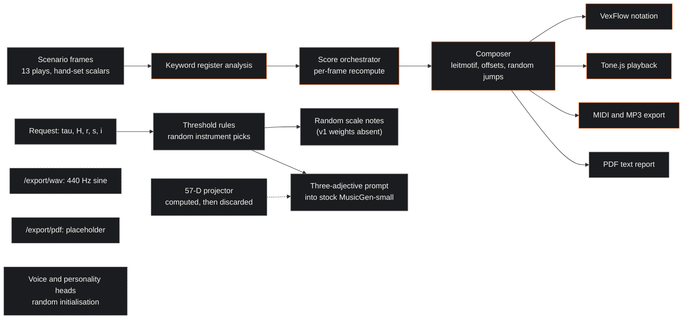
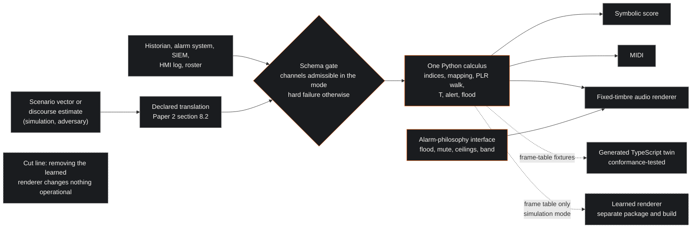
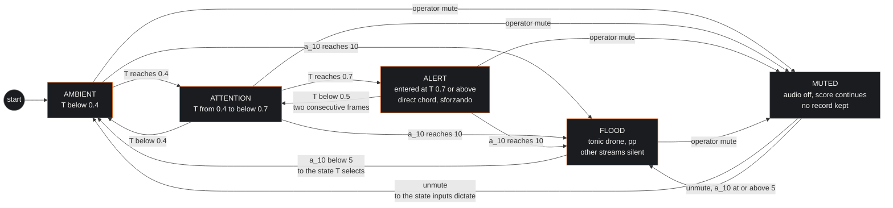
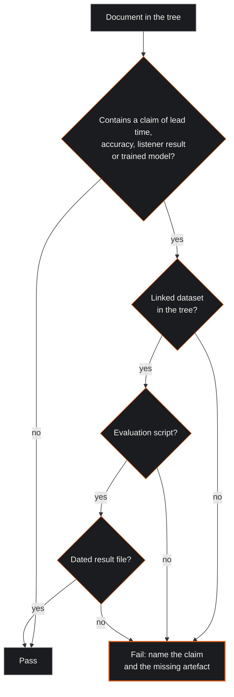

| Field | Value |
|:---|:---|
| Designation | MPN-3, engine and evidence: the reference implementation audited, the engine specified, the path to a validated model |
| Status | Draft for working-group review |
| Normative language | RFC 2119 |
| Licence | Creative Commons Attribution 4.0 International (CC BY 4.0) |
| Extends | MPN-2 (notation) and MPN-1 (foundations) |
| Series | Paper 3 of 4 (Foundations, Notation, Engine, Deployment) |
| Reference implementation | https://github.com/Planet9V/mpn-conductor-standalone (public repository, 36 commits, 2026-01-01 to 2026-02-06; analysed by static reading, no code executed) |

## 1. Executive Summary & Scope

This paper audits the reference implementation of the MPN programme as it stands, with a path and line for every finding; specifies the engine that the notation of Paper 2 requires, as requirements E-1 through E-24; sets out, as an explicit data and evaluation budget, what would have to exist before anyone could write "a validated model" about any part of the programme; and lists the security and reproducibility work the repository needs before it can be cited as a reference implementation at all. The key words MUST, MUST NOT, SHOULD and MAY are to be read as in RFC 2119 [1]. The paper is offered under CC BY 4.0 [2]. The foundations requirements F-1 through F-14 of Paper 1 and the notation requirements N-1 through N-27 of Paper 2 bind it [3] [4]. Three things the working group could not verify are stated once here: the clause text of IEC 62443-2-1, the size of Tango 2's preference set, and the findings of the benchmarking study comparing automatic music metrics with human preference.

The audit's conclusion can be stated in one sentence; the rest of the paper is the evidence for it. The reference implementation is a rule-based sonification prototype for dramatic text, with a proposed input space that has never been validated and machine-learning scaffolding that has never been trained on anything meaningful. Its mapping is a set of hand-written threshold tables and linear maps implemented twice, in Python and in TypeScript, which disagree with each other and with the repository's own documents. Its "trained model" was trained on uniformly random target tokens; its second-generation planner for fifteen optimiser steps on ten labels a language model produced in reaction to an error message; its performance adapter's training loop is the statement `pass`. Its 57-dimensional input vector is projected to an embedding and then discarded. Its served music endpoint emits random notes from a scale, its WAV export returns a fixed sine tone, and its voice and personality heads are randomly initialised with no training script. The repository's own internal review of its theory documents records "Zero empirical validation" (`mpn-conductor-standalone:docs/MCKENNEY_LACAN_PHD_REVIEW_CRITIQUE.md:24`). None of that is an accusation; a prototype built in five weeks is allowed to be a prototype. What it is not allowed to be, under F-12, is described as a working system.

The engine is lawful by design, as every paper in the series is. Regulation (EU) 2024/1689 Article 5(1)(f) has prohibited AI systems that infer the emotions of natural persons in the workplace since 2 February 2025, and the Commission reads "emotions" widely enough to reach stress, arousal, burnout and a team's emotional tone [7] [9]; physiological data about a worker are health data under the GDPR [10]; and a facility suitable for observing staff behaviour or performance needs prior works-council consent under the Dutch Works Councils Act [11]. The engine therefore takes as its only operational input the state vector of Paper 2: plant deviation, alarm load, task and interaction tempo, queue and latency, an adversary's estimated discourse, and one advisory roster-based fatigue annotation. It admits no biometric of any member of staff and infers no emotion, mood, stress or arousal of anyone; physiology would in any case index arousal and load rather than emotion [47]. Person-level vectors enter only in simulation and adversary mode, where the person modelled is synthetic or a threat actor, and any learned component is confined to that mode and kept physically separate from the fixed-rule operational path, so that the deployed system is a rule-based visualisation system on the Commission's own reading of the AI-system definition [8].

### 1.1 What this paper does not claim

It does not claim that any mapping in the reference implementation has perceptual validity, that any lead time has been measured, that any listener has been tested, or that any model has learned anything. It does not claim that the engine specified here has been built, nor a concurrent-stream capacity figure, nor that the Commission's reading of the AI-system definition has been tested by any authority; it has not [8].

## 2. Architecture as found

The repository [5] holds three pipelines that share vocabulary and little else: a browser application that a user can hear; a Python inference server that the browser can call; and a standalone text-to-score engine. This section describes each as the code shows it, using the deconstruction's status vocabulary: implemented and tested, implemented without a test, stub, or claimed only in documents.

### 2.1 The browser pipeline

The application is Next.js 16 with React 19, TypeScript 5 and Tailwind 4, with Tone.js 15 for playback and VexFlow 5 for notation (`mpn-conductor-standalone:package.json:10-58`). Its input is a scenario: thirteen dramatic plays and 232 frames, in which a trauma scalar and an entropy scalar are hand-authored per frame by a single annotator with no codebook (`src/components/mpn-lab/literary_data.ts:16`; `src/app/mpn-conductor/page.tsx:348-349`). Register weights come from counting keywords in the frame's analysis text, and the hand-written analysis strings contain the words "Real" and "Symbolic" literally (`src/components/mpn-lab/psychometric_calculus.ts:142-144, 236-250`; `literary_data.ts:24, 30`). A character-profile route calls an external language model for trait and register scores, and its fallback sets entropy to a random number (`src/app/api/analyze-character-psychometrics/route.ts:136-145, 251`).

From the scalars, a score orchestrator recomputes tempo, key, mode, dynamics and chord once per frame, with no state carried between frames beyond a decaying stave-activation value (`src/components/mpn-lab/score_orchestrator.ts:228-429, 274`). A composer builds a leitmotif from an archetype interval table, then applies scale-degree offsets index-wise to it, random octave jumps and velocity jitter (`src/components/mpn-lab/GeniusComposer.ts:147-383, 351-362, 371`); its inversion negates an array nothing reads, so it is inaudible (`leitmotif_generator.ts:183-186`). The notation renderer and the playback engine are implemented and tested (`ConductorScoreVexFlow.tsx:131-134`; `src/lib/playback_engine.ts`); the MIDI writer and the MP3 exporter are implemented without a direct test, since no test imports the first and the one test that imports the second mocks it (`src/lib/midi_writer.ts:112-160`; `src/lib/audio_exporter.ts:94-150`; `ExportButton.test.tsx:12`); the PDF export is a text report rather than engraved notation (`score_exporter.ts:390-590`). This pipeline is the one thing in the repository a paper can honestly call working: a deterministic rule set from a small scalar state to a multi-stave score with playback and export.

### 2.2 The Python inference server

The server's `/generate` route calls "chain-of-thought planning", which is eight threshold rules and a temperature formula with instrument choices made by `random.choice` (`ml/psychoscore_v2/inference/server_v2.py:211-221, 233-259, 261-286`). Generation tries to load a v1 model from a directory that contains no weights, catches the failure, and falls back to a generator that emits `random.choice` notes from the scale per bar (`server_v2.py:305-314, 329-330, 380-414, 427-430`); the health endpoint reports the engine as `"rule-based"` (`:104`). A second route, `/generate-v2/`, accepts only the trauma and entropy scalars and the three register weights, builds a three-adjective text prompt from thresholds, attempts to apply the 66 MB adapter of section 3.3 and, that being a pointer without bytes, serves the stock pretrained MusicGen-small, the 300-million-parameter model (`ml/psychoscore_v2/audio_analysis/v2_endpoint.py:24-44, 80, 82-94, 101-134`). No projector and no 57-dimensional input is on that path. Of the export routes, `/export/midi` returns the bytes it was given (`export_endpoint.py:490-499`), `/export/wav` returns a five-second 440 Hz sine tone or sine triad regardless of input (`:452-462, 469-484`), and `/export/pdf` prints a placeholder sentence about a missing engraving integration (`:350-358`). A third script prompts AudioLDM 2 from the two scalars alone and ignores the planner's output (`ml/psychoscore_v2/scripts/generate_music.py:75-100`).

### 2.3 Two calculi that disagree

The mapping from scalars to musical parameters is implemented in a Python module and a TypeScript module, with a third variant in the standalone engine and ad hoc formulas in the conductor page and the server, and they do not agree. The deconstruction's consolidated table follows with its evidence.

| Quantity | Definition A | Definition B | Definition C |
|:---|:---|:---|:---|
| Borromean stability index | one minus the largest pairwise register difference (`ml/psychoscore_v2/models/mckenney_lacan_calculus.py:451-454`) | ratio of smallest to largest register weight (`public/theory/mckenney_lacan_appliced_2025_11_19/02_BORROMEAN_TOPOLOGY.md:80`) | one minus the largest weight (`src/app/wiki/theory/implementation-mapping/page.tsx:208`); and a fourth, `max(0.3, 1 - abs(lambda))` (`src/app/mpn-conductor/page.tsx:356`) |
| Crisis rule | Lyapunov scalar above 0.2 and index below 0.3 (`mckenney_lacan_calculus.py:302-306`) | Lyapunov scalar above 0.1 and index below 0.3 (`10_CORE_EQUATIONS.md:285`) | index below 0.3 and entropy above 0.8 (`02_BORROMEAN_TOPOLOGY.md:230`) |
| Register to mode | Real to Phrygian, Symbolic to Ionian, Imaginary to Lydian (`mckenney_lacan_calculus.py:191-200`; README) | Real to Dorian or Aeolian, Symbolic to Lydian or Mixolydian, Imaginary to Phrygian or Locrian (`ml/psychoscore/data/generate_synthetic_pairs.py:23-30`) | mode from trauma alone (`server_v2.py:223-227`) |
| Trauma to tempo | no effect; tempo from entropy (`mckenney_lacan_calculus.py:103-162`) | minus 30 per unit trauma (`server_v2.py:231`) | plus 80 per unit trauma (`ml/psychoscore_v2/scripts/create_octuple_training_data.py:53`) |
| DISC C to instrument family | keyboard (`mckenney_lacan_calculus.py:226-253`) | percussion (`public/theory/RSCH-39-MUSICAL_PSYCHOMETRIC_NOTATION.md:143`) | |
| L operation on C major | E minor, correct (`mckenney_lacan_calculus.py:411-416`) | B minor, wrong, asserted by a test (`mpn_engine/core/tonnetz.py:104-107`; `mpn_engine/tests/test_tonnetz.py:74-80`) | |
| Dynamics bands | eight (`mckenney_lacan_calculus.py:58-90`) | three with default gaps; discontinuous (`src/components/mpn-lab/mpn_reference_lookup.ts:150-178`) | five (`page.tsx:360`) |
| Trauma to velocity in TypeScript | table lookup giving 30, 72 or 118 | the theory document's claim that TypeScript uses `20 + 107 tau` (`10_CORE_EQUATIONS.md:296-320`), false for the lookup module the composer uses | the conductor page implements `20 + 107 tau` separately (`page.tsx:359`), a fourth velocity rule |

Two rows deserve a sentence each. The TypeScript dynamics table gives velocity 30 on the interval up to 0.2, 72 from there to 0.8, and 118 above, with the middle value supplied by a hard-coded default because two of the intervals match no declared band (`mpn_reference_lookup.ts:176`); the map is monotone, but six tenths of the input range collapse to one value and the steps at 0.2 and 0.8 are jumps of 42 and 46 across one hundredth of trauma, and its tests pass because they probe only 0.1, 0.5 and 0.9 (`src/__tests__/psychometric_calculus.test.ts:119-137`). And the standalone engine's L maps C major to B minor rather than E minor, its docstring contradicts itself, its compound operation contains the sentence "But wait, let me recalculate", and a unit test asserts the wrong root (`tonnetz.py:98, 150`; `test_tonnetz.py:79`); Paper 2 fixed the definitions (N-9), and this paper records that a test can enshrine an error as easily as catch one. Two quantities the documents name are computed nowhere: the "Lyapunov exponent" is `(tau + H - 0.5) / 2` of two hand-set scalars (`mckenney_lacan_calculus.py:290-384`), and the standalone engine's "entropy" is a count of punctuation marks (`mpn_engine/core/mpn_calculus.py:135-165`), while the Shannon helpers that exist are never called (`:165-184`).

### 2.4 The projector that nothing uses

The only executable definition of the 57-dimensional vector is a projector that concatenates four DISC scores, five Big Five scores, three register weights, trauma and entropy, three dark-triad scores, four "physics" terms and thirty-six one-hot cognitive-bias indicators, and maps the result to a 768-dimensional embedding (`ml/psychoscore_v2/models/projector.py:82-150`). Its own comment calls the bias block "a placeholder" (`:134`), and its only test checks the output shape (`tests/test_all_modules.py:544-552`). At inference the generator computes the projection and then calls MusicGen with an empty description, so the embedding is discarded (`ml/psychoscore_v2/models/musicgen_lora.py:124-141`). The calculus that runs takes nine scalars (`mckenney_lacan_calculus.py:25-51`); the served endpoint takes five. The vector is a proposal in code, F-12 forbids calling it an input to generation, and Paper 1 has stated its psychometric standing [3].

## 3. The training claims examined

The README and wiki describe a trained model called PSYCHOSCORE in two generations, with CLAP-based preference alignment, chain-of-thought musical reasoning and hierarchical adapters. This section follows each claim to its artefact.

### 3.1 Version 1 was trained on random targets

The v1 pipeline generates 46,000 synthetic profile-to-parameter pairs by rule (`ml/psychoscore/data/generate_synthetic_pairs.py`), then tokenises each as a prefix of profile tokens followed by between 100 and 256 tokens drawn uniformly at random from the vocabulary, with the labels set equal to the inputs (`ml/psychoscore/scripts/run_training_pipeline.py:204-216`). A GPT-2 with low-rank adapters was trained on that for fifteen epochs and 17,250 steps, with the loss falling from 40.7 to 25.08 (`ml/psychoscore/checkpoints/psychoscore/checkpoint-17250/trainer_state.json`), and the phase audit reports the loss as a success (`docs/PHASE_AUDIT_COMPLETE.md:92-94`). A model trained to predict uniformly random tokens learns nothing about music, whatever its loss does. The adapter weights are not in the repository in any case, since weight files are git-ignored (`.gitignore:44-49`). An EMOPIA loader exists and a download log records 1,084 MIDI files extracted, but the pipeline tokenises only the synthetic file and the EMOPIA directory is absent (`ml/psychoscore/data/emopia_loader.py:38-70`; `ml/psychoscore/logs/emopia_download.log:636`; `run_training_pipeline.py:153-161`).

### 3.2 Version 2 was trained on ten error messages

The v2 data path extracts skeleton token strings from ten MIDI files of the MAESTRO piano dataset (`ml/psychoscore_v2/data/skeleton_dataset.jsonl`, ten lines) and asks GPT-4o to label each with a psychometric profile. The labeller returns the string "Error extracting features: ..." when MIDI parsing fails (`ml/psychoscore_v2/data/llm_labeler.py:49-50`), and all ten label files open by reasoning about that error string rather than about any music: two begin "The error message suggests", two "The error message indicates", two "The error suggests", and the remaining four "The error indicates", "The error and language suggest", "The reference to an error suggests" and "The error in feature extraction suggests" (`data/silver_labels/*.json`). Those ten labels are the whole training set for the planner, the preference stage and the performance stage (`data/train_planner.jsonl`, ten lines; `train_dpo.jsonl`, eight; `train_performance.jsonl`, ten). The planner is distilgpt2 with a rank-8 adapter trained for fifteen optimiser steps at batch size two to a loss of 3.63 (`models/lora_planner/checkpoint-15/trainer_state.json`). The preference stage ran fifteen steps with `rewards/accuracies` of 0.40, `rewards/margins` of minus 0.287 and a gradient norm of zero, the rejected sample being the skeleton of a random other clip (`models/dpo_planner/checkpoint-15/trainer_state.json`; `scripts/create_dpo_dataset.py:37-45`). The planner's only saved output is repeated English prose about voices in a room, not a musical skeleton (`output/cyborg_skeleton.txt`).

### 3.3 The performance adapter, the pointers and the missing checkpoints

The performance-adapter training script's loop body is `pass`, annotated "Simplified flow: Mock training loop", with a placeholder loss increment and the save call commented out (`ml/psychoscore_v2/scripts/train_performance.py:138-141, 146`). The 66 MB adapter file beside it targets different modules and a different rank from any script in the repository, and the README points to an external training repository for its provenance (`checkpoints/lora_performance/adapter_config.json`; `README.md:175-182`). Every one of the sixteen weight files in the tree is a Git LFS pointer of about 130 bytes with no bytes behind it in the clone; the audio-side preference trainer expects a directory that does not exist (`train/train_dpo.py:55-65`); and the training script the v2 README names does not exist (`ml/psychoscore_v2/README.md:20`). There is no usable checkpoint, and a fetched one would carry the provenance above.

### 3.4 The voice and personality heads

The speech and audio-analysis modules load real pretrained backbones (Wav2Vec2-XLSR, Whisper, XLM-RoBERTa, CLAP) and feed their outputs into small randomly initialised perceptrons: an arousal-valence-dominance head (`ml/psychoscore_v2/speech/wav2vec_encoder.py:57-64`), Big Five and dark-triad heads (`speech/personality_detector.py:71-86`), a fusion head (`speech/fusion_module.py:97-114`), a CLAP regressor whose docstring claims training on labelled pairs (`audio_analysis/psychometric_regressor.py:5, 57-58`), and a group graph network (`models/group_gnn.py:210-215`). No `load_state_dict` call and no training script exists for any of them, and a hand table mapping acted emotion labels of the RAVDESS corpus to trauma and entropy is consumed only by the download script that writes records nothing else reads (`scripts/download_high_fidelity.py:79-89, 208-225`). Their outputs are noise around one half. Under N-2 none could enter a deployed signal chain even if trained, since voice is a biometric of staff; they are recorded because the README presents them as working capabilities (`README.md:74-77`) and F-12 forbids that.

### 3.5 What the counts are

The README's "84 passing tests" is a table whose rows sum to 74 (`README.md:328-336`); the phase audit's breakdown reaches 84 and quotes a run of "84 passed, 4 skipped" for which no log exists (`docs/PHASE_AUDIT_COMPLETE.md:552-561`); static counts of the named files give 79. The repository holds 108 Python test functions under the v2 package and 157 across all Python, with no pytest run artefact; 639 Vitest cases with a logged run of 658 passed (`test-reports/test-run-20260205-102328.log`); and 167 Playwright tests whose last run recorded 88 failures (`test-results/.last-run.json`). Many Python tests mock the model dependencies at import and test routing and shapes, not behaviour (`tests/test_v2_endpoint.py:12-14`). The "34 wiki pages" are 57 page files (`src/app/wiki/`; `README.md:8`). The "22 phases complete" are a planning document whose own table lists human evaluation and the Fréchet audio distance as pending (`docs/PHASE_AUDIT_COMPLETE.md:117-139, 389-401`). The theory document behind the earlier specification [6] asserts a 22-minute average lead time over fifteen crisis events with no data, method or source (`public/theory/RSCH-39-MUSICAL_PSYCHOMETRIC_NOTATION.md:485-494`); Paper 1 retracted it, and section 8.5 installs the gate that keeps it out. No dataset, listening test, metric, benchmark or validation of the mapping exists in the repository; the A/B page keeps its ratings in React state and never persists them (`src/app/mpn-lab/ab-test/page.tsx:14, 22`).

### 3.6 The repository's own verdict

A reviewer document in the repository, dated 2026-02-04, reviews three of the theory documents (the calculus of the subject, the graph-network paper and the codex) rather than the code, and lists among its findings "Zero empirical validation", "Mathematical errors", "Category confusion" and "No Methods, Results, Limitations" (`docs/MCKENNEY_LACAN_PHD_REVIEW_CRITIQUE.md:24-29`), predicting that machine-learning reviewers will reject the unimplemented model for having no code, benchmarks or baselines (`:542-544`). The audit above, which does cover the code, agrees with it on every point about the theory documents it reviews and finds that the code bears the review out. The honest description, which the deconstruction supplies and this series adopts, is a rule-based sonification design and prototype for dramatic text, with a proposed and unvalidated psychometric input space and untrained machine-learning scaffolding.

## 4. Engine specification

The engine turns the state vector of Paper 2 into a score, a MIDI stream and audio under the alarm-philosophy interface, and does nothing else. The reference implementation's browser pipeline is its nearest ancestor; that pipeline's calculus, inputs and randomness are replaced.

### 4.1 One calculus and a generated twin

The reference implementation's central defect is two calculi with no relation between them. The engine has one: a single Python module is the source of truth for every function of Paper 2 sections 3 through 5, the four indices, the mapping table, the transition algebra, the roughness lookup, the dynamics bands, the tension index, the alert rule and the flood machine. Where a browser needs the same functions, the TypeScript twin is generated from the Python module's frame-table fixtures and tested against them, not written by hand. The conformance test is the frame tables of Paper 2 section 8, which N-26 requires any implementation to reproduce bit for bit, plus a randomised fixture on which the two calculi must agree row by row.

### 4.2 Inputs by mode

In operational mode the engine accepts the channels of Paper 2 section 2 that its state-vector table marks admissible in that mode, which excludes the adversary discourse estimate `delta` and the simulation vector `p_sim`, and rejects any other field at the schema boundary, as a hard failure rather than a warning, because the danger is not malformed data but the wrong kind of data (N-1). In simulation and adversary mode it additionally accepts those two channels, `p_sim` being the nine-component scenario vector of the reference implementation (`mckenney_lacan_calculus.py:25-51`) and `delta` a labelled discourse estimate for a threat actor, translated to the operational indices by the declared rule of Paper 2 section 8.2; neither may be attached to an identifiable member of staff in any mode, a suspected insider included (N-27). The 57-dimensional projector, the voice and personality heads and the language-model profile extraction are not part of the engine in any mode; they may live in a separate research package, and they are not in the operational build.

### 4.3 The fixed-rule path and the separable learned component

The operational path is a fixed, human-authored mapping with declared constants and no learned component, for two reasons. The legal reason is that a fixed rule set computing musical parameters from process and interaction data is, on the Commission's reading of the definition, a visualisation system rather than an AI system, and the rules must stay fixed for that reading to hold [8]. The engineering reason is Paper 2 itself: N-12 fixes the timbre set per site because roughness depends on spectrum, N-14 fixes timbre family, rhythmic figure and a non-overlapping register per stream so that streams segregate, and N-23 forbids any motif resembling an alarm tone; a generative audio model guarantees none of these, so it could not sit on the operational path even if trained. Any learned component the programme develops (section 5) is therefore confined to simulation and adversary mode, packaged as a separate service with its own build, and joined to the engine only through the frame-table interface, so that removing it changes nothing operational.

### 4.4 The alert and flood machines

Paper 2 defines one tension index, one alert rule with hysteresis, and a flood machine with its own hysteresis that overrides the alert modes. The engine implements both as explicit state machines with state carried between frames, which the reference implementation's per-frame recomputation does not do (`score_orchestrator.ts:228-429`). Flood entry from any state suspends the chord walk and reduces the audio to the tonic drone regardless of the tension index.

### 4.5 Streams, silence, level, latency and sampling

The stream budget is the one Paper 2 set, three streams in operational mode and four in simulation and adversary mode, each with fixed timbre family, register, rhythmic figure and pan, and each with a liveness figure whose cessation means data loss and nothing else, on the precedent of the network auralizer whose crickets stopped when a server died [38]. The audio renderer therefore has a fixed instrument set per site, never changed by state, which the reference implementation's random instrument selection violates (`psychometric_calculus.ts:203-217`; `server_v2.py:233-259`). Silence is under two controls, the flood machine and one operator mute; level is under a site-declared ceiling per rendering state that velocity cannot exceed, with the spectral band of the site's alarm signals excluded from the instrument set.

Latency is stated in frames, not milliseconds, because the frame is the notation's time base: a discrete parameter computed at the close of a frame is realised at the first bar line at or after that close, and the path from frame close to first realised bar must complete within one frame, with the measured figure declared in the header. Every input carries a source timestamp, and a channel whose latest sample is older than twice its declared interval is stale, which stops its liveness figure. Nothing on the operational path calls a random-number generator; the reference implementation does so in the composer, the instrument selector, the server and the profile fallback, and none of those survives.

### 4.6 Logging and the alarm-philosophy configuration

The log is the frame table, the header constants, the rendering state and the timestamps, and nothing else. It carries no user identity, since the interaction and latency channels are aggregated at console level before they reach the engine (N-3); no mute event attributed to anyone (N-24); and no export path to any human-resources, appraisal or personnel system, because with one it becomes a personnel-monitoring facility of the kind the Works Councils Act and the Article 29 Working Party's guidance on data processing at work address [11] [48]. The alarm-philosophy interface is a configuration file annexed to the site's alarm philosophy under IEC 62682 and ISA-18.2 [26] [27]; it declares the flood thresholds, the level ceilings, the excluded band, the mute control, the retention period and the non-alarm declaration (N-20), and a change to any field is a management-of-change event under the same lifecycle as an alarm change. The engine reads from the alarm system and never writes to it.

### 4.7 Engine requirements

The following requirements, E-1 through E-24, are normative for the engine and bind Paper 4.

- **E-1.** The engine MUST implement every function of Paper 2 sections 3, 4 and 5 in one module, in one language, which is the source of truth; any second implementation MUST be generated from or conformance-tested against it.
- **E-2.** The two implementations MUST reproduce the frame tables of Paper 2 section 8 bit for bit and MUST agree with each other on a randomised fixture of at least one thousand frames.
- **E-3.** In operational mode the engine MUST accept only the channels of Paper 2 section 2 that its state-vector table marks admissible in that mode, which excludes `delta` and `p_sim`, and MUST reject any other field at the schema boundary with a hard failure.
- **E-4.** In simulation and adversary mode the engine MAY additionally accept the simulation vector `p_sim` and the discourse estimate `delta` of that table, MUST translate them by the declared rule of Paper 2 section 8.2, and MUST NOT attach either to an identifiable member of staff (N-27).
- **E-5.** The 57-dimensional projector, the voice, speech and personality heads, and any language-model profile extraction MUST NOT be present in the operational build in any mode.
- **E-6.** The operational path MUST be a fixed, human-authored mapping with constants declared in the header, and MUST contain no learned component.
- **E-7.** Any learned component MUST be confined to simulation and adversary mode, MUST be packaged and built separately from the engine, and MUST be joined to it only through the frame-table interface, so that its removal changes no operational output.
- **E-8.** The engine MUST implement the alert rule of Paper 2 section 4.2 and the flood machine of Paper 2 section 5 as explicit state machines with state carried between frames, and flood MUST override the tension-selected modes.
- **E-9.** The engine MUST render at most three concurrent streams in operational mode and four in simulation and adversary mode, with timbre family, register, rhythmic figure and pan position fixed per stream at configuration time.
- **E-10.** Every stream MUST carry a liveness figure, and a channel whose latest sample is older than twice its declared sampling interval MUST stop that stream's liveness figure and be marked stale in the score.
- **E-11.** The engine MUST provide one operator mute that silences audio without stopping the symbolic score, without penalty, and without any record of who used it.
- **E-12.** Audio level MUST be bounded by a site-declared ceiling per rendering state that velocity cannot exceed, and the renderer's instrument set MUST exclude the spectral band of the site's alarm signals.
- **E-13.** The path from frame close to the first realised bar MUST complete within one frame, and the measured latency MUST be declared in the score header.
- **E-14.** Inputs MUST be sampled at the rates of the state-vector table and MUST carry source timestamps.
- **E-15.** The operational path MUST NOT call any random-number generator; the same inputs and constants MUST produce the same score.
- **E-16.** The engine's log MUST consist of the frame table, the header constants, the rendering state and timestamps, and MUST carry no user identity and no attributed mute event.
- **E-17.** The engine MUST have no export path to any human-resources, appraisal or personnel system, and its retention period MUST be declared per site.
- **E-18.** The alarm-philosophy interface MUST be a configuration file annexed to the site's alarm philosophy, declaring flood thresholds, level ceilings, the excluded band, the mute control, retention and the non-alarm declaration; any change MUST pass management of change.
- **E-19.** The engine MUST read from the alarm system and MUST NOT write to it or generate any alarm record.
- **E-20.** The alarm-rate stream MUST render density and MUST NOT sound one event per alarm.
- **E-21.** Early-warning observables and the fatigue index MUST be rendered as text annotations only and MUST NOT be sonified.
- **E-22.** The repository MUST contain no credential, MUST build from a clean clone with pinned and audited dependencies, MUST NOT depend on an external repository or an absent binary for any artefact it cites, MUST publish signed releases, and MUST carry a data-flow diagram showing that the engine reads from the alarm system and the historian and writes to nothing but its own log.
- **E-23.** Continuous integration MUST fail on any document in the repository that claims a lead time, an accuracy, a listener result or a trained model without a linked dataset, evaluation script and result file; the gate's phrase list and a fixture of documents that MUST fail it are themselves part of the repository.
- **E-24.** Any discourse estimate claimed to be scored from text rather than coded by an analyst MUST satisfy F-13 and cite Gadalla, Nikoletseas and Amazonas as predecessor [49].

## 5. From rules to a validated model

The engine of section 4 needs no learned model, and none may enter its operational path. This section answers a different question: if the programme wishes to render simulation and adversary scores with a generative model rather than a fixed synthesiser, what would have to be true before it could call that model validated? The answer is drawn from what the generative-music literature treats as its own minimum, and it is stated as a budget.

### 5.1 The minimum bar

MusicGen, the model the reference implementation's endpoint calls, is a single-stage transformer over four-codebook EnCodec tokens at 50 Hz whose conditioning enters by cross-attention, trained on 20,000 hours of licensed music with text descriptions. Its evaluation is Fréchet audio distance, a KL divergence over classifier labels and a CLAP score objectively, with overall quality and text relevance rated on a 1 to 100 scale by at least five raters per sample, filtered by CrowdMOS on loudness-normalised stimuli and reported with confidence intervals, for example 84.81 plus or minus 0.95 for the largest model [12]. Its chromagram pathway shows that a non-text structured signal can condition the model, but that pathway was trained jointly on the whole corpus and deliberately bottlenecked, and nothing in the paper trains or evaluates a continuous low-dimensional control vector, so a projected vector is an extension, not a replication [12]. Low-rank adaptation of MusicGen is documented practice, a public repository fine-tuning every checkpoint on a 27-minute dataset in under fifteen minutes on one accelerator with no metric reported [16] [17]; that establishes feasibility and nothing about whether a fine-tune has learned a controllable axis.

The emotion-conditioned generation literature sets the scale of what "conditioned" has meant. EMOPIA holds 1,087 clips from 387 pop-piano songs, about eleven hours, labelled in Russell's four valence-arousal quadrants by four annotators over a two-and-a-half-month campaign with cross-checks; its listening test had 25 participants each rating twelve samples on five-point scales [15]. Its predecessor used 95 clips [24]. The systems EMOPIA reviews condition on two dimensions or four classes, and the working group found no published conditioner above that [15]. The minimum bar before "a trained state-to-music model" may be written follows: a labelled corpus at EMOPIA scale, on the order of a thousand clips and ten hours, with vector labels from a documented protocol; a held-out set of vectors, not merely of clips; an objective metric independent of the training signal, meaning Fréchet audio distance or KL against a reference set rather than CLAP if CLAP was the reward, or a separately trained probe that recovers the vector from audio; a listening study with at least 25 listeners, preferably with at least five ratings per sample, attention filtering and loudness normalisation; a same-protocol baseline, the unmodified MusicGen-small with a text prompt that the reference implementation already serves; and confidence intervals reported as MusicGen reports them [12] [15].

### 5.2 Two preference-alignment templates

Two published templates exist for the preference alignment the reference implementation's documents describe. MusicRL aligned MusicLM to human preference with two reward models built by selected raters and 300,000 pairwise preferences collected from deployed users, and its authors' own finding is that text adherence and audio quality account for only part of what listeners prefer [13]. Tango 2 fine-tuned a diffusion text-to-audio model with a diffusion-DPO loss on a synthetically constructed preference set, winner and loser audio for the same prompt, and reported gains over its base model and over AudioLDM 2 [14] [18] [19]. The first template is out of reach: there are no deployed users and no path to hundreds of thousands of judgements. The second is feasible in form; the reference implementation's own script, which pairs a clip's skeleton with that of a random other clip, is a degenerate instance of it (`scripts/create_dpo_dataset.py:37-45`), and a credible version would construct pairs from the notation itself, two renderings of the same frame table with one mapping deliberately reversed, so that the preference signal is "which rendering expresses the declared state" rather than "which sounds better".

### 5.3 What CLAP can and cannot reward

A CLAP score is the cosine alignment between an audio clip and a text prompt in a joint embedding [12] [20]; it is the standard text-adherence metric, and MusicGen also tested CLAP as a conditioner [12]. As a reward for a state-conditioned renderer it has two defects. The structural one is that a state vector has no text, so scoring it with CLAP means either verbalising the vector, which throws away the continuous structure that was the point, or training a new audio-to-vector alignment head, which needs the very data whose absence is the problem; the reference implementation's three-adjective prompt is the first of these in its crudest form (`v2_endpoint.py:101-134`). The empirical one is MusicRL's finding that adherence and quality explain only part of preference [13], and a benchmarking study of how well automatic metrics track human preference is the place to look for the size of the gap [25]. CLAP may serve as one objective metric among several, never as reward and evaluation at once.

### 5.4 The first credible milestone

The first milestone is not a 57-dimensional conditioner and not a nine-dimensional one. It is a two-dimensional conditioner evaluated as EMOPIA evaluates, or at most a handful of factor scores [15]. In the notation's own terms the two axes already exist: the plant-health flag that selects mode and the activity index that drives tempo, both defined in Paper 2 for the socio-technical link and not for any person. A learned renderer for simulation mode would take those two indices from the frame table and be judged on whether listeners recover the declared state from the audio at a rate that beats the fixed synthesiser and the text-prompted baseline under the same protocol. Such a system sits in the affective-generation literature surveyed by Williams and colleagues and by Dash and Agres, whose precedents calibrate against affect targets and physiological signals, whereas the programme's inputs are link state and nobody's physiology [21] [22] [23]. Whatever labels the corpus carries describe the perceived character of the music, never an inferred state of a person.

### 5.5 The data and evaluation budget

| Item | Minimum before "validated" may be written | Source of the figure | Status in the reference implementation |
|:---|:---|:---|:---|
| Labelled corpus | Order of one thousand clips, about ten hours, labelled by a documented protocol with more than one annotator and a reliability figure | EMOPIA: 1,087 clips, about 11 h, four annotators [15] | Ten MIDI clips with error-string labels; 46,000 synthetic parameter pairs with no audio (section 3) |
| Label dimensionality | Two continuous axes or four classes at first; factor scores at most | EMOPIA quadrants; the systems it reviews condition on two to four dimensions [15] | Fifty-seven proposed, nine computed, five served (section 2.4) |
| Held-out set | Held-out vectors, not only held-out clips | Inference from the generalisation requirement [12] [15] | None |
| Objective metric | Fréchet audio distance or KL against a reference set, independent of any reward; CLAP as a secondary metric only | MusicGen protocol [12]; MusicRL's finding on adherence [13] | A FAD script with no output (`ml/psychoscore_v2/scripts/calculate_fad.py`) |
| Listener study | At least 25 listeners; preferably at least five ratings per sample, attention filtering, loudness normalisation | EMOPIA: 25 participants [15]; MusicGen: at least five raters, CrowdMOS [12] | An A/B page whose ratings live in React state (`ab-test/page.tsx:14`) |
| Baseline | Unmodified MusicGen-small with a text prompt, same protocol | The served endpoint itself [12]; section 2.2 | Exists, unevaluated |
| Preference pairs, if alignment is attempted | Synthetic pairs from the notation, conforming versus reversed rendering of the same frame table; count declared in the study plan | Tango 2 template [14]; MusicRL's 300,000 human pairs is the infeasible alternative [13] | Eight pairs from random other clips |
| Reporting | Confidence intervals on every subjective score | MusicGen: 84.81 plus or minus 0.95 [12] | None |
| Compute for adaptation | Feasible on one accelerator in minutes for a small adapter | musicgen-dreamboothing: 27 min of audio, under 15 min on one accelerator [16] | Adapter of unknown provenance, an LFS pointer without its blob |

The budget is modest in compute and demanding in data and evaluation, because that is where the published work says the cost lies. Until every row is met, the defensible description of any generative rendering in the programme is a rule-based mapping from a state vector to a text prompt consumed by a pretrained model, and the adapter, preference and reward stack is a proposed training programme with the budget above.

## 6. Sonification constraints carried from the notation

The engine inherits five constraints from Paper 2 that no implementation detail may relax, restated here because each has a mechanism in the engine.

The first is that the engine must not raise the annunciated alarm rate. The verified endpoints of the alarm benchmark are no more than one alarm every ten minutes in normal operation and no more than ten in the first ten minutes after a major upset [28], and the consequence of exceeding them is on record: in the last eleven minutes before the Milford Haven explosion two operators had to recognise, acknowledge and act on 275 alarms, and the investigation found that the excessive number of alarms reduced the effectiveness of their response [28] [30]. The mechanism is E-19 and E-20: the engine never writes to the alarm system, and its alarm-rate stream renders density, never one sound per alarm. The display is declared in the alarm philosophy as a non-alarm auditory display under the standards' own lifecycle [26] [27] [29].

The second is silence in a flood, which is exactly when a state display would be most informative and least usable. The flood machine reduces the audio to a tonic drone at pianissimo and silences the other streams until the trailing count falls below five (E-8); the symbolic score continues, because a written score is not an auditory load.

The third is audibility of danger signals. ISO 7731 sets the requirements for auditory danger signals in work areas [31]; the engine stays below the site's alarm signals by a declared margin and excludes their spectral band from its instrument set (E-12), and no numeric requirement of the standard is quoted because none was verified.

The fourth is the masking lesson of the medical alarm standard. Staff in operating rooms and intensive-care units could identify only a minority of the alarms in their own units, and many were masked by others [33]; the melodic alarm signals of the 2006 edition of IEC 60601-1-8 were followed by a 2020 amendment introducing a new set of alarm sounds [32] [34]; and alarm fatigue is documented in the clinical literature [50]. The engine therefore carries no discrete identifiable messages, no earcons for named events and no motif resembling an alarm tone, and it can be muted by one control (E-11).

The fifth is the stream budget and the rule that no capacity figure is claimed. The best-documented multi-variable display carried six variables in two rhythmic streams: fourteen anaesthesia residents detected every scripted event in every display format, fastest with the combined display at 10.4 seconds against 12.8 seconds visual and 13.0 seconds auditory, and identified the event from sound alone in 60% of cases against 88% from the visual display [35]. A second study showed a continuous respiratory sonification supporting eyes-free monitoring and task time-sharing alongside the oximeter tone [36]. Those are two streams; auditory scene analysis explains why streams must be segregated by frequency, timbre, location, onset and regularity to be monitored separately [37]; no study establishes a larger number, and none was found in an industrial control room at all [39]. The engine's limit of three streams is a design rule, not a capacity figure, and no paper in the series states one. Multiple-resource theory predicts a reduced but non-zero cross-modal cost for an auditory display added to a visually loaded operator, with interference from alarm sounds and crew speech [40]; that prediction is what the listener study of Paper 2 section 9 measures with situation-awareness probes and the task load index under the control-centre evaluation framework [41] [42] [43].

## 7. Security and reproducibility remediation

A repository that is to be cited as a reference implementation must be safe to clone into an engineering environment and must build from what it contains. The reference implementation currently satisfies neither condition.

### 7.1 Findings

A live-looking ElevenLabs API key is hard-coded in the compose file (`docker-compose.yml:26`). Whether or not it is still valid, its presence in a public history means it is compromised: it must be rotated at the provider, purged from every commit that carries it, and prevented from recurring by secret scanning in continuous integration. Two commits on 2026-01-22 carry most of the tree, one of 3,097 files and 631,901 added lines and one of 453 files and 1,941,914 added lines (`144c909`; `b9a6a01`); the second is a checkpoint-tokenizer and data dump, its line count dominated by six copies of a 250,306-line tokenizer file under the v1 checkpoint directories, the 46,000-line synthetic-pairs file and agent scaffolding, with the audio present only as one-line LFS pointers. The history cannot be reviewed commit by commit, and the checkpoint directories and data should become a fetch script with checksums. Agent-orchestration scaffolding is checked in (`CLAUDE.md:1-40`; `.claude-flow/`; `claude-swarm/`), and its phrasing appears in source (`tonnetz.py:150`). The default compose stack builds a service from `ml/ace_step/` (`docker-compose.yml:68-71`), which is empty in the clone because it is an orphaned submodule pointer, a gitlink to a commit with no `.gitmodules` file to say where it lives, so the stack cannot build. Every model weight is a Git LFS pointer of about 130 bytes with no bytes behind it, and the one adapter with a plausible provenance depends on an external repository for the central claim (`README.md:175-182`). The theory folder's README cites a Zenodo-prefixed DOI (`10.5281/...`) that does not resolve and was never registered (`public/theory/mckenney_lacan_appliced_2025_11_19/README.md:9, 139`), and a data-sources document carries the placeholder `10.1037/0000000-000` (`Enhancement_04_Psychometric_Integration/DATA_SOURCES.md:26`). A fabricated identifier in a scholarly document is a defect of a different kind from a missing test, and it is removed before anything else.

### 7.2 Expectations for a control-room component

Inside a control-room network the engine is one new asset with three data flows, and the asset owner's security programme under IEC 62443-2-1:2024 [44] has to account for all three: a read of the alarm system's journal and rate metrics, a read of the historian's designated process variables, and a write of the engine's own log to its own store. Nothing flows back. That is a checkable design fact, and E-22 and E-19 make it a requirement: the engine holds no write credential for any system it reads, its network position permits no inbound connection from the process network, and its log contains no channel that is personal data in the score or biometric under the AI Act, since Paper 2's state-vector table was drawn to exclude both. The obligations that remain are those of any new read-only component, an inventory entry, access control on the log store and management of change for the configuration of section 4.6, lighter than for a system carrying operator physiology precisely because the engine carries none.

### 7.3 Remediation checklist

| # | Item | Evidence | Action | Blocks citation as reference implementation |
|:--|:---|:---|:---|:---|
| 1 | Hard-coded API key | `docker-compose.yml:26` | Rotate at provider; purge from history; enable secret scanning in CI (E-22) | Yes |
| 2 | Fabricated DOI and placeholder DOI | `mckenney_lacan_appliced_2025_11_19/README.md:9, 139`; `DATA_SOURCES.md:26` | Remove; cite the working papers by their published URLs | Yes |
| 3 | Mega-commits with a checkpoint-tokenizer and data dump | `144c909`, `b9a6a01` | Replace the checkpoint directories and data with a fetch script and checksums; rewrite history in the same operation as item 1 | Yes |
| 4 | Missing LFS blobs and external training dependency | sixteen LFS pointers of about 130 bytes; `README.md:175-182` | Either publish the blobs with a training script that reproduces them, or delete the pointers and the claims (E-22, E-23) | Yes |
| 5 | Orphaned submodule as build context | `ml/ace_step` gitlink with no `.gitmodules`; `docker-compose.yml:68-71` | Restore `.gitmodules` with a pinned commit, vendor the code, or remove the service; compose must build from a clean clone | Yes |
| 6 | Agent scaffolding and agent phrasing in source | `CLAUDE.md`; `.claude-flow/`; `claude-swarm/`; `tonnetz.py:150` | Remove from the tree; add to ignore rules | No |
| 7 | Two calculi that disagree | Section 2.3 | Replace with one calculus and a generated twin (E-1, E-2) | Yes |
| 8 | Wrong L operation enshrined by a test | `tonnetz.py:104-107`; `test_tonnetz.py:74-80` | Fix to Paper 2 section 3.6; replace the test with the property tests of section 8 | Yes |
| 9 | Randomness on the rendering path | `GeniusComposer.ts:351-362`; `psychometric_calculus.ts:203-217`; `server_v2.py:233-259, 378-414`; `route.ts:251` | Remove (E-15) | Yes |
| 10 | Stub endpoints presented as features | `export_endpoint.py:350-358, 452-484` | Remove or label as unimplemented in the README | Yes |
| 11 | Untrained heads presented as capabilities | Section 3.4; `README.md:74-77` | Remove from the operational build (E-5); relabel in documents | Yes |
| 12 | Inflated counts | `README.md:7-8, 328-336`; `docs/PHASE_AUDIT_COMPLETE.md:26, 561` | Replace with generated counts from the test runner; commit run artefacts | No |
| 13 | Unused dependencies and version mismatch | `package.json:3` (version 1.0.0 against README 3.7); `package.json:18-21, 30, 32, 35, 41, 44, 45` (declared, never imported) | Remove; align version | No |
| 14 | No Python project files or pytest artefacts | `ml/`, `mpn_engine/` | Add project files, pin dependencies, run tests in CI and commit the report | Yes |
| 15 | Claims of lead time and validation in documents | `RSCH-39-MUSICAL_PSYCHOMETRIC_NOTATION.md:485-494`; wiki pages | Remove; install the CI gate of section 8.5 (E-23) | Yes |

## 8. Test and evidence plan

The tests below are the ones the reference implementation lacks and the engine needs, stated so that each can be written from the text of Paper 2.

### 8.1 Conformance tests for the mapping table

For each row of the mapping table of Paper 2 section 3.3, a unit test fixes the declared constants and checks endpoints and monotone direction: tempo equals the clef band's minimum at zero activity and its maximum at one; velocity is 30 at zero load and 120 at unit load, with the six marking bands non-decreasing in load; the fifths distance is zero at zero deviation and twelve at unit deviation; the roughness lookup is non-decreasing in instability; and metre follows the dispersion lookup with the fallback below four alarms. Three property tests then run over the unit interval. A monotonicity test draws pairs of inputs with the first below the second and asserts that no mapping decreases. A coverage test asserts that every input matches a declared band and never a fallback value. A continuity test asserts that no step between adjacent inputs, at the declared resolution, exceeds a declared bound. The reference implementation's TypeScript dynamics table is the reason there are three: it is monotone, so the first test passes it, but two of its five intervals fall to a hard-coded default and it jumps 42 velocity points across one hundredth of trauma (`mpn_reference_lookup.ts:150-178`), so the second and third fail it where its endpoint-only tests at 0.1, 0.5 and 0.9 did not. Each of the three tests catches a different way of being wrong, and none of them alone is enough.

### 8.2 Property tests for the transition algebra

The operations P, L and R of Paper 2 section 3.6 are tested as group elements, not as examples, and the standalone engine's wrong L is the reason the tests are layered. That module's L subtracts a semitone from a major triad's root and adds one to a minor triad's, so C major goes to B minor and B minor comes back to C major (`tonnetz.py:104-107`): the operation is an involution, and an involution test alone would have passed it. What it fails is the common-tone test, since C major and B minor share no pitch class where L must preserve two, and the group test, since with P and R it does not generate the dihedral group of order 24. The property tests are therefore four. Each of P, L and R is an involution: applied twice to any of the 24 consonant triads it returns the triad. Each preserves exactly two pitch classes of the triad it acts on. The product LR applied twelve times returns any triad and no smaller power does, which is the transposition-by-a-fifth structure of the LR chain, and the word RLRLRLR equals P on every triad [45]. The group generated by L and R has exactly 24 elements and acts simply transitively, so that for every ordered pair of triads exactly one element carries the first to the second [45] [46]. The named examples then follow: L carries C major to E minor and nothing else, R to A minor, P to C minor, and PLP to A-flat minor, which shares no pitch class with C major.

### 8.3 Conformance and idempotence between the two calculi

The conformance test runs the Python calculus and its generated twin on the frame tables of Paper 2 section 8 and on a randomised fixture of at least one thousand frames and asserts equality of every output column (E-2). The idempotence test renders the symbolic score from a frame table, re-extracts the musical columns from the rendered score, and renders again; the second score must equal the first, which is what makes the score an audit artefact.

### 8.4 State-machine and interface tests

The alert machine is tested for entry at the threshold, non-exit after one frame below the exit threshold, and exit after two; the flood machine for entry at ten, persistence at five through nine, and exit below five; and the override for flood entry from each tension-selected state. The schema gate is tested by presenting each forbidden field class in turn, a biometric channel, a per-person identity, an inferred emotion label, and asserting a hard failure (E-3). The log is tested for the absence of any identity field and any attributed mute event (E-16), and determinism by running the engine twice on the same inputs and asserting byte-identical output (E-15).

### 8.5 The listener study and the evidence gate

The perceptual validation of the mapping is the four-part listener study of Paper 2 section 9: magnitude estimation for polarity and scaling, a two-stream detection task on the pattern of Loeb and Fitch, situation-awareness probes, and the task load index, with criteria stated in advance [35] [41] [42]. This paper adds nothing to that protocol. What it adds is the gate that keeps unearned claims out of the repository: a continuous-integration check scans every document for the classes of claim the reference implementation currently makes, a lead time in minutes, an accuracy or percentage attributed to a model, a listener result, or the phrase "trained model", and fails the build unless the claim is followed by a link to a dataset in the tree, an evaluation script and a dated result file. The gate is crude by design; it can be satisfied only by producing the evidence or removing the claim.

## 9. Conclusion

The reference implementation is a rule-based sonification prototype with a browser pipeline that works, two calculi that disagree, a proposed input space that nothing consumes, training runs that learned nothing because they were given nothing to learn, and documents that describe all of this as more than it is. Sections 2 and 3 say so with a line number for every finding, and the repository's own review of its theory documents said so first.

The engine the notation requires is specified as twenty-four requirements: one calculus with a generated twin; the state vector of Paper 2, in the channels admissible in operational mode, as the only operational input; explicit alert and flood machines; a fixed stream budget with liveness figures; one mute and a declared level ceiling; latency and staleness stated in frames; a log that identifies nobody and exports nowhere; an alarm-philosophy configuration under management of change; and a fixed-rule operational path from which any learned component is physically separable, so that what is deployed is a visualisation system on the Commission's reading and what is learned stays in simulation.

The path to a validated model is a budget, not a promise: an EMOPIA-scale corpus with protocol labels, held-out vectors, an objective metric independent of the reward, a listener study of at least 25 people against a text-prompted baseline with confidence intervals, and a first milestone of two dimensions rather than fifty-seven. The remediation of section 7 is the price of citing the repository at all, and the tests and evidence gate of section 8 are how the engine proves it does what Paper 2 says and how the repository stops saying what it cannot show. Paper 4 turns the legal gate of Paper 2 and the separation of section 4.3 into deployment invariants.

## 10. References

[1] **Bradner, S.** *Key words for use in RFCs to Indicate Requirement Levels.* RFC 2119, BCP 14, Internet Engineering Task Force, March 1997.
[2] **Creative Commons.** *Attribution 4.0 International (CC BY 4.0) Legal Code.* Creative Commons Corporation, 2013.
[3] **McKenney, J.** *MPN-1: Foundations of the McKenney-Lacan notation programme.* Eigenia Labs working paper, 2026 (Paper 1 of this series).
[4] **McKenney, J.** *MPN-2: Normative specification of the notation.* Eigenia Labs working paper, 2026 (Paper 2 of this series).
[5] **Planet9V.** *mpn-conductor-standalone.* Public Git repository, 36 commits, 2026-01-01 to 2026-02-06, MIT licence; URL in the metadata table. Cited throughout as `mpn-conductor-standalone:path:line`.
[6] **McKenney, J.** *Musical Psychometric Notation (MPN): Formal Specification for Security State Sonification.* Eigenia Labs working paper. https://eigenia.nl/papers/musical-psychometric-notation
[7] **European Parliament and Council.** *Regulation (EU) 2024/1689 (Artificial Intelligence Act).* OJ L, 12 July 2024. Article 3(34), Article 5(1)(f), Article 113, Recitals 18 and 44. https://eur-lex.europa.eu/legal-content/EN/TXT/HTML/?uri=OJ:L_202401689
[8] **European Commission.** *Commission Guidelines on the definition of an artificial intelligence system.* C(2025) 5053 final, 29 July 2025, paragraphs 40 to 47. https://digital-strategy.ec.europa.eu/en/library/commission-publishes-guidelines-ai-system-definition-facilitate-first-ai-acts-rules-application
[9] **European Commission.** *Commission Guidelines on prohibited artificial intelligence practices established by Regulation (EU) 2024/1689 (AI Act).* C(2025) 5052 final, 29 July 2025, Section 7. https://digital-strategy.ec.europa.eu/en/library/commission-publishes-guidelines-prohibited-artificial-intelligence-ai-practices-defined-ai-act
[10] **European Parliament and Council.** *Regulation (EU) 2016/679 (General Data Protection Regulation).* Article 4(15), Article 9, Recital 35. https://eur-lex.europa.eu/legal-content/EN/TXT/HTML/?uri=CELEX:32016R0679
[11] **Staten-Generaal.** *Wet op de ondernemingsraden (WOR), Article 27(1)(k), (l) and 27(4).* https://wetten.overheid.nl/BWBR0002747
[12] **Copet, J., Kreuk, F., Gat, I., Remez, T., Kant, D., Synnaeve, G., Adi, Y., and Défossez, A.** Simple and controllable music generation. *NeurIPS 2023.* arXiv:2306.05284 (v3, 30 January 2024). https://arxiv.org/abs/2306.05284
[13] **Cideron, G., Girgin, S., Verzetti, M., Vincent, D., Kastelic, M., Borsos, Z., McWilliams, B., Ungureanu, V., Bachem, O., Pietquin, O., Geist, M., Hussenot, L., Zeghidour, N., and Agostinelli, A.** MusicRL: aligning music generation to human preferences. arXiv:2402.04229, 2024. https://arxiv.org/abs/2402.04229
[14] **Majumder, N., et al.** Tango 2: aligning diffusion-based text-to-audio generations through direct preference optimization. arXiv:2404.09956, 2024. https://arxiv.org/abs/2404.09956
[15] **Hung, H.-T., Ching, J., Doh, S., Kim, N., Nam, J., and Yang, Y.-H.** EMOPIA: a multi-modal pop piano dataset for emotion recognition and emotion-based music generation. *Proceedings of ISMIR 2021.* https://archives.ismir.net/ismir2021/paper/000039.pdf
[16] **ylacombe.** *musicgen-dreamboothing: fine-tune your own MusicGen with LoRA.* GitHub repository README. https://github.com/ylacombe/musicgen-dreamboothing
[17] **Hu, E. J., et al.** LoRA: low-rank adaptation of large language models. *ICLR 2022.* arXiv:2106.09685.
[18] **Rafailov, R., et al.** Direct preference optimization: your language model is secretly a reward model. *NeurIPS 2023.* arXiv:2305.18290.
[19] **Wallace, B., et al.** Diffusion model alignment using direct preference optimization. *CVPR 2024.* arXiv:2311.12908.
[20] **Wu, Y., et al.** Large-scale contrastive language-audio pretraining with feature fusion and keyword-to-caption augmentation. *ICASSP 2023.* arXiv:2211.06687.
[21] **Dash, A., and Agres, K.** AI-based affective music generation systems: a review of methods and challenges. *ACM Computing Surveys*, 2024. https://doi.org/10.1145/3672554
[22] **Williams, D., Kirke, A., Miranda, E. R., Roesch, E., Daly, I., and Nasuto, S.** Investigating affect in algorithmic composition systems. *Psychology of Music*, 2015. https://doi.org/10.1177/0305735614543282
[23] **Williams, D., et al.** Affective calibration of musical feature sets in an emotionally intelligent music composition system. *ACM Transactions on Applied Perception*, 2017. https://doi.org/10.1145/3059005
[24] **Ferreira, L., and Whitehead, J.** Learning to generate music with sentiment. *Proceedings of ISMIR 2019.*
[25] **Benchmarking music generation models and metrics via human preference studies.** *ICASSP 2025.* https://openreview.net/pdf?id=105yqGIpVW
[26] **International Electrotechnical Commission.** *IEC 62682:2022, Management of alarm systems for the process industries*, edition 2.0, 8 December 2022, TC 65/SC 65A. https://webstore.iec.ch/en/publication/65543
[27] **International Society of Automation.** *ANSI/ISA-18.2-2016, Management of Alarm Systems for the Process Industries.* ISA, 2016.
[28] **Health and Safety Executive.** *Better alarm handling.* Chemicals Information Sheet No 6 (CHIS6), 2000. https://humanfactors101.com/wp-content/uploads/2016/04/better-alarm-handling.pdf
[29] **EEMUA.** *Publication 191: Alarm Systems, A Guide to Design, Management and Procurement*, edition 4, November 2024. https://www.eemua.org/getattachment/9d3f8071-55c3-49bf-a74a-3bf6ad4a2e0f/Contents-EEMUA-Publication-191-Edition4-November-2024.pdf
[30] **Health and Safety Executive.** COMAH case study: the explosion and fires at the Texaco Refinery, Milford Haven, 24 July 1994. https://www.hse.gov.uk/Comah/sragtech/casetexaco94.htm
[31] **International Organization for Standardization.** *ISO 7731:2003, Ergonomics: Danger signals for public and work areas. Auditory danger signals.* https://www.iso.org/standard/33590.html
[32] **International Electrotechnical Commission.** *IEC 60601-1-8, Medical electrical equipment: General requirements, tests and guidance for alarm systems in medical electrical equipment and medical electrical systems.* 2006; Amendment 1, 2012; Amendment 2, 2020.
[33] **Momtahan, K., Hétu, R., and Tansley, B.** Audibility and identification of auditory alarms in the operating room and intensive care unit. *Ergonomics*, 1993.
[34] **AAMI.** Updated IEC 60601-1-8 breaks new ground in development of alarm sounds. *AAMI News.* https://array.aami.org/content/news/updated-iec-60601-1-8-breaks-new-ground-development-alarm-sounds
[35] **Loeb, R. G., and Fitch, W. T.** A laboratory evaluation of an auditory display designed to enhance intraoperative monitoring. *Anesthesia & Analgesia* 94(2), 362-368, 2002. https://doi.org/10.1097/00000539-200202000-00025
[36] **Watson, M., and Sanderson, P.** Sonification supports eyes-free respiratory monitoring and task time-sharing. *Human Factors* 46(3), 497-517, 2004. https://doi.org/10.1518/hfes.46.3.497.50401
[37] **Bregman, A. S.** *Auditory Scene Analysis: The Perceptual Organization of Sound.* MIT Press, 1990.
[38] **Gilfix, M., and Couch, A. L.** Peep (the network auralizer): monitoring your network with sound. *Proceedings of the 14th USENIX Systems Administration Conference (LISA 2000)*, 2000. https://www.usenix.org/legacy/publications/library/proceedings/lisa2000/full_papers/gilfix/gilfix_html/index.html
[39] **Vickers, P.** Sonification for process monitoring. In T. Hermann, A. Hunt and J. G. Neuhoff (eds), *The Sonification Handbook*, chapter 18. Logos, 2011. https://sonification.de/handbook/chapters/chapter18/
[40] **Wickens, C. D.** Multiple resources and performance prediction. *Theoretical Issues in Ergonomics Science* 3(2), 159-177, 2002.
[41] **Endsley, M. R.** Toward a theory of situation awareness in dynamic systems. *Human Factors* 37(1), 32-64, 1995.
[42] **Hart, S. G., and Staveland, L. E.** Development of NASA-TLX (Task Load Index): results of empirical and theoretical research. In P. A. Hancock and N. Meshkati (eds), *Human Mental Workload*, 139-183. North-Holland, 1988.
[43] **International Organization for Standardization.** *ISO 11064-7:2006, Ergonomic design of control centres, Part 7: Principles for the evaluation of control centres.*
[44] **International Electrotechnical Commission.** *IEC 62443-2-1:2024, Security for industrial automation and control systems, Part 2-1: Security program requirements for IACS asset owners.* https://webstore.iec.ch/en/publication/62883
[45] **Crans, A. S., Fiore, T. M., and Satyendra, R.** Musical actions of dihedral groups. *American Mathematical Monthly* 116(6), 2009. https://doi.org/10.1080/00029890.2009.11920965
[46] **Cohn, R.** Neo-Riemannian operations, parsimonious trichords, and their Tonnetz representations. *Journal of Music Theory* 41(1), 1-66, 1997.
[47] **Barrett, L. F., Adolphs, R., Marsella, S., Martinez, A. M., and Pollak, S. D.** Emotional expressions reconsidered: challenges to inferring emotion from human facial movements. *Psychological Science in the Public Interest* 20(1), 1-68, 2019. https://doi.org/10.1177/1529100619832930
[48] **Article 29 Data Protection Working Party.** *Opinion 2/2017 on data processing at work.* WP 249, adopted 8 June 2017, section 5.4.4. https://ec.europa.eu/newsroom/article29/items/610169/en
[49] **Gadalla, M., Nikoletseas, S., and Amazonas, J. R. de A.** Combining psychoanalytic concepts and computer science methodologies: an empirical study of the relationship between emotions and the Lacanian discourses. *Frontiers in Psychology* 17, 2026. https://doi.org/10.3389/fpsyg.2026.1526215
[50] **Sendelbach, S., and Funk, M.** Alarm fatigue: a patient safety concern. *AACN Advanced Critical Care*, 2013.
