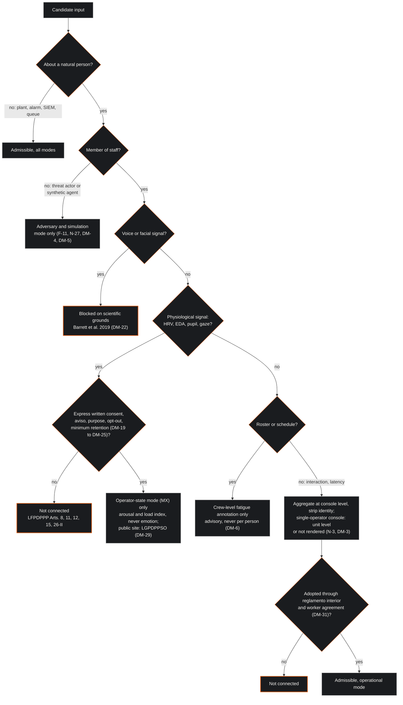
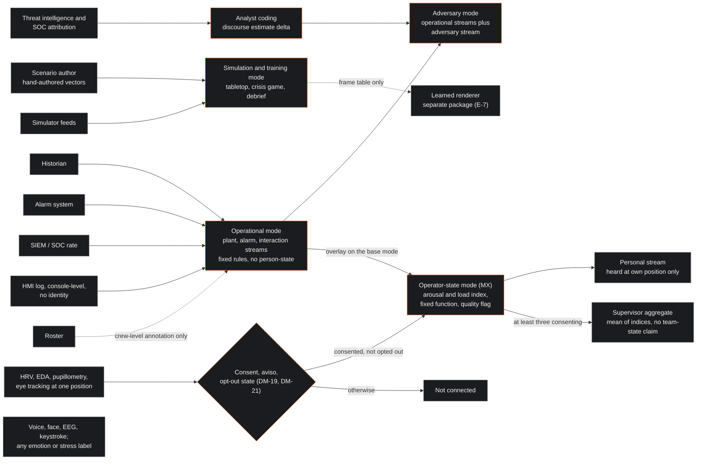
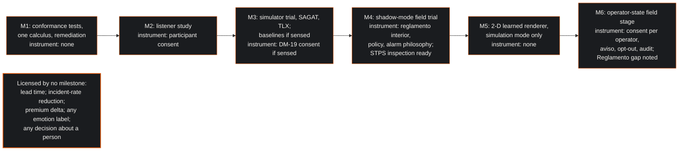

| Field | Value |
|:---|:---|
| Designation | MPN-4-MX, deployment and outcome, jurisdictional profile MX: the audible control room in Mexico, deployment of MPN under the LFPDPPP, the Ley Federal del Trabajo and NOM-035 |
| Status | Draft for working-group review |
| Normative language | RFC 2119 |
| Licence | Creative Commons Attribution 4.0 International (CC BY 4.0) |
| Extends | MPN-1 (foundations), MPN-2 (notation) and MPN-3 (engine); the Mexico edition of MPN-4, whose section numbering it mirrors so that a delta can be read section by section |
| Series | Paper 4 of 4 (Mexico edition; the EU edition is MPN-4) |
| Reference implementation | https://github.com/Planet9V/mpn-conductor-standalone (public repository; audited in MPN-3, not executed) |

## 1. Executive Summary & Scope

This paper is the Mexico edition of the deployment paper. It says how an MPN system is put into a Mexican industrial control room lawfully and safely, what changes relative to the European edition, and what does not change because it never depended on the law. The key words MUST, MUST NOT, SHOULD and MAY are to be read as in RFC 2119 [1]. The paper is offered under CC BY 4.0 [2]. The requirements F-1 through F-14 of Paper 1, N-1 through N-27 of Paper 2 and E-1 through E-24 of Paper 3 bind it, as they bind the EU edition [3] [4] [5] [6]; its own invariants are numbered DM-1 through DM-32 so that they do not collide with the D-numbers of the EU edition.

The author's brief for this edition was that Mexico is not in the European Union and there are no restrictions. That is half right, and the wrong half matters more. Mexico has no artificial-intelligence statute in force, no rule that names emotion recognition, no general workplace-surveillance statute and no works-council veto; the prohibition of Article 5(1)(f) of Regulation (EU) 2024/1689 does not reach a system put into service and used only at a Mexican site, and the Commission's wide reading of "emotions", which excluded the word arousal from every output of the EU edition, has no counterpart [7] [8] [9]. A channel that infers an operator's arousal or load from physiology may therefore be admitted. But Mexico is a consent-and-proportionality jurisdiction rather than a prohibition jurisdiction. The Ley Federal de Protección de Datos Personales en Posesión de los Particulares of 20 March 2025 treats data that may reveal state of health as sensitive on an open-ended definition, which on the working group's reading reaches an operator's physiological signals and the indices computed from them; it requires express written consent for sensitive data, fixes purpose and proportionality, requires the retention of sensitive data to be the minimum indispensable, makes consent revocable at any time, gives a right to object to automated evaluation of performance, reliability or behaviour where that evaluation is made without human intervention and produces legal or significant effects, and carries fines to 320,000 UMA, about 37.5 million pesos at the 2026 value, which may be increased up to twofold for sensitive data [10] [11]. NOM-035-STPS-2018 confines psychosocial-risk results to workplace improvement and makes individual psychological evaluation a triggered act [12]. The Ley Federal del Trabajo requires work in dignity, free of discrimination on grounds of health, and admits medical examinations only as the reglamento interior provides [13]. In CENACE, CFE and PEMEX control rooms the public-sector data law applies instead. None of that is a prohibition; all of it is binding.

The scientific limits do not move with the border. Physiology indexes arousal and load, not emotion; no facial configuration is reliably diagnostic of an emotional state [14], and the working group extends that finding to the voice; there is no controlled study of continuous sonification in an industrial control room [15] [16]; and no early-warning lead time has been measured for any operator metric [3]. The Mexican edition therefore admits an operator-state channel that renders arousal and load indices from heart-rate variability, electrodermal activity, pupillometry and eye tracking, and still forbids any emotion label, any voice or facial inference and any lead-time claim.

### 1.1 The jurisdictional-profile concept

The requirements of Papers 2 and 3 were written for one jurisdiction, which this paper names profile EU. Profile MX is defined by difference: it relaxes exactly the requirements named here, adds the invariants of section 3, and leaves everything else as written. Operator-state mode (MX) is an overlay, not an exclusive mode: a score declares its base mode, operational, adversary or simulation, and may additionally declare the overlay, under which the base mode's streams and rules run unchanged and the operator-state channels are added beside them (section 4.4). Five requirements are relaxed, for the overlay only. N-1 now admits a header that declares a base mode and an optional operator-state overlay. N-2's prohibition of biometric channels and of inferred arousal is lifted under the overlay, and with it the prose sentence of Paper 2 section 2 that calls the rule absolute; its prohibition of inferred emotion, mood and stress stands in every mode. N-3 is relaxed to the extent that a score carrying the overlay holds per-operator indices in the consenting operator's own view and a mean over at least three consenting operators in the supervisor's view, while the room-wide score and the persistent log carry neither. N-14 and E-9 admit two further streams under the overlay, a personal stream at the consenting operator's position and an aggregate stream at the supervisor's position, each with its own timbre family, register, rhythmic figure and pan position declared at configuration time and overlapping no other stream's. E-3's schema boundary admits the operator-state channels of section 4.4 when the overlay is declared and rejects them otherwise. N-19, N-25, E-5, E-16, E-17 and E-21 are not relaxed: early-warning observables are still annotations; the fatigue index is still a crew-level text annotation; the voice, speech and personality heads are still absent from every build; the engine's log still consists of the frame table, the header constants, the rendering state and timestamps with no user identity, which is why per-operator baseline constants live outside the header (DM-14); and there is still no export path. A site that does not declare the overlay is running profile EU on Mexican soil and needs only the legal replacements of section 3.

### 1.2 What this paper does not do

It does not give legal advice for a particular site. The Reglamento of the new data-protection law had not been published as of July 2026, the enforcement authority has issued no implementing guidance, and no Mexican court has ruled on physiological or affective monitoring at work; the reading here is the working group's, and section 2 records where it rests on a secondary source. It reports no validation result, since none has been run. It does not describe the reference implementation as deployable; Paper 3 lists what must change before it can be cited at all.

## 2. The legal frame

This section states the Mexican texts as verified by the working group's research and draws from them the gate of section 2.11. Spanish is quoted only where the text was read; where an article is known from a secondary source, the article number is given and the source named. Where a reading is the working group's own, the text says so.

### 2.1 The LFPDPPP of 2025

The Ley Federal de Protección de Datos Personales en Posesión de los Particulares was published in the Diario Oficial de la Federación on 20 March 2025, in a decree that also enacted the public-sector counterpart of section 2.2; it abrogated the law of 5 July 2010, entered into force the following day, and has been amended once, on 14 November 2025, in a procedural reform touching Article 4 only [10] [17]. The regulator is no longer INAI: Article 2 fraction XV names the Secretaría Anticorrupción y Buen Gobierno, the fifth transitory article passes INAI's staff to it, the tenth sends pending data-protection procedures to it, and the twentieth orders specialised federal courts in data protection within 120 days [10]. The twelfth transitory article required the Executive to adapt the regulations within ninety days. That has not happened: Chambers reported in February 2026 that no updated regulations had been published, and a practitioner note of 9 July 2026 repeated that the 2011 Reglamento applies supletoriamente where it does not contradict the new law [18] [19]. The working group did not check the DOF index for August and September 2026; this paper assumes that the 2011 Reglamento and the 2013 Lineamientos del Aviso de Privacidad apply where compatible, and DM-19 requires the position to be re-read at commissioning [20].

The definitions decide the case. Article 2 fraction V: "Datos personales: Cualquier información concerniente a una persona identificada o identificable. Se considera que una persona es identificable cuando su identidad pueda determinarse directa o indirectamente a través de cualquier información"; the second sentence is the test a pseudonymised research set will be judged against (DM-25). Fraction VI: "Datos personales sensibles: Aquellos datos personales que afecten a la esfera más íntima de la persona titular, o cuya utilización indebida pueda dar origen a discriminación o conlleve un riesgo grave para esta. De manera enunciativa más no limitativa se consideran sensibles los datos personales que puedan revelar aspectos como origen racial o étnico, estado de salud presente o futuro, información genética, creencias religiosas, filosóficas y morales, opiniones políticas y preferencia sexual" [10]. The list is expressly illustrative and includes present or future state of health; the words biométrico, emocional, psicológico and trabajador appear nowhere in the law [10]. The law does not say that an inferred arousal or load index is sensitive. The working group's reading is that it is: heart-rate variability, electrodermal activity and pupil diameter about an identified operator may reveal state of health, and an index computed from them, misused, could ground discrimination on grounds of health, which the labour law forbids. INAI's 2018 guide on biometric data reasons the same way: biometric data are sensitive when "a) Que se refieran a la esfera más íntima de su titular; b) Que su utilización indebida pueda dar origen a discriminación, o c) Que su uso ilegítimo conlleve un grave riesgo para su titular"; its definition of biometric data covers "Propiedades físicas, fisiológicas, de comportamiento o rasgos de la personalidad, atribuibles a una sola persona y que son medibles", and its list of physiological biometrics includes "pulsación cardíaca" [21]. Chambers reports that in practice biometric data are treated as sensitive and processed on express written consent [18]. The design treats the raw signals and the indices as datos personales sensibles.

Article 8 fixes the consequence: "Tratándose de datos personales sensibles, el responsable deberá obtener el consentimiento expreso y por escrito de la persona titular para su tratamiento, a través de su firma autógrafa, firma electrónica, o cualquier mecanismo de autenticación que al efecto se establezca. No podrán crearse bases de datos que contengan datos personales sensibles, sin que se justifique la creación de las mismas para finalidades legítimas, concretas y acordes con las actividades o fines explícitos que persigue el sujeto regulado" [10]. Article 9 lists exceptions, among them data required to perform obligations arising from a legal relationship between the parties [10]. The working group does not rely on it: the exception is generally read as covering data necessary to perform the contract, and continuous physiological monitoring is not necessary to operate a console. The doubt the EU edition raised about consent under subordination applies here too; Article 3 Bis of the labour law defines hostigamiento by reference to "una relación de subordinación real" [13]. Consent is the lawful basis, and because it is contestable, purpose limitation and proportionality carry the weight.

Article 5 lists the principles of "licitud, finalidad, lealtad, consentimiento, calidad, proporcionalidad, información y responsabilidad", and Article 11 confines processing to the purposes stated in the aviso de privacidad, so that a new purpose needs new consent [10]. Article 12 reads: "El tratamiento de datos personales será el que resulte necesario, adecuado y relevante en relación con las finalidades previstas en el aviso de privacidad, para los datos personales sensibles, el responsable deberá realizar esfuerzos razonables para limitar el periodo de tratamiento de los mismos a efecto de que sea el mínimo indispensable" [10]. That sentence is the retention rule of DM-25. Article 7 provides in its last paragraph that "El consentimiento podrá ser revocado en cualquier momento sin que se le atribuyan efectos retroactivos", which is the provision the opt-out of DM-21 rests on [10]. Article 13 makes the controller answerable for the aviso being honoured by third parties with which it has a legal relationship; a Dutch supplier processing on the site's behalf is not a tercero but a persona encargada, a figure the law defines separately in Article 2 fraction XII and excludes from its definition of transfer, and whose regime sits in the 2011 Reglamento applied supletoriamente [10] [20].

Articles 15 and 16 prescribe the aviso de privacidad, naming the data "identificando aquéllos que son sensibles" and the purposes "distinguiendo aquéllas que requieren el consentimiento", and where data are collected "por cualquier medio electrónico, óptico, sonoro, visual, o a través de cualquier otra tecnología" a simplified notice at the point of capture [10]. A sensor at a console is such a medium; DM-19 puts the simplified notice at the position and the full notice in the reglamento interior de trabajo.

Article 26 gives a right to object, "por causa legítima", in two cases. Fraction I covers a specific situation of the data subject; fraction II covers the case where "Sus datos personales sean objeto de un tratamiento automatizado, el cual le produzca efectos jurídicos no deseados o afecte de manera significativa sus intereses, derechos o libertades, y estén destinados a evaluar, sin intervención humana, determinados aspectos personales de la misma o analizar o predecir, en particular, su rendimiento profesional, situación económica, estado de salud, preferencias sexuales, fiabilidad o comportamiento", and neither applies where the processing meets a legal obligation on the controller [10]. Fraction II is not the default ban of Article 22 of the GDPR, and its elements are cumulative: an automated processing that produces unwanted legal effects or significantly affects the person, and that evaluates without human intervention. A design in which no output is or feeds a decision and every use of an index passes through a person (DM-28) fails both elements, so fraction II is a fallback that would bite only if the system were later wired to an automated decision, which DM-28 forbids. What the operator actually holds is the revocation right of Article 7, exercisable at any time without retroactive effect, and the objection of fraction I for a specific situation. DM-21 rests the opt-out on those two provisions; its choice to honour an opt-out without asking for a causa legítima is more generous than Article 26 requires and is a design decision, not a reading of the article. DM-24 keeps the supervisor from ever hearing an individual score, so that nothing evaluates anyone.

Article 18 requires security measures taking account of "el riesgo existente, las posibles consecuencias para las personas titulares, la sensibilidad de los datos y el desarrollo tecnológico"; Article 19 requires immediate notification of breaches that significantly affect the data subject; Article 20 imposes confidentiality surviving the end of the relationship [10]. Article 59 sets fines of "100 a 160,000 veces la Unidad de Medida y Actualización" for one band of infractions and "200 a 320,000 veces la Unidad de Medida y Actualización" for the other, and its closing sentence, printed at the end of fraction IV on repeat infractions and conventionally read as a general aggravator, provides that "En tratándose de infracciones cometidas en el tratamiento de datos sensibles, las sanciones podrán incrementarse hasta por dos veces, los montos establecidos": the increase is discretionary, up to twofold [10]. Articles 62 to 64 add prison terms, doubled for sensitive data [10]. The daily UMA for 2026, published by INEGI and in force from 1 February 2026, is 117.31 pesos, so the 320,000 UMA band tops at 37,539,200 pesos before any increase [11]. International transfers, as reported by Chambers, require the recipient to assume equivalent obligations by contract; Mexico has no EU adequacy decision [18]. Nothing in the law addresses employment or biometrics expressly; the INAI guide recommends privacy by design and an evaluación de impacto [21].

### 2.2 The constitution and the public-sector counterpart

Article 16 of the Constitution provides, in a paragraph added in 2009, that "Toda persona tiene derecho a la protección de sus datos personales, al acceso, rectificación y cancelación de los mismos, así como a manifestar su oposición, en los términos que fije la ley, la cual establecerá los supuestos de excepción a los principios que rijan el tratamiento de datos, por razones de seguridad nacional, disposiciones de orden público, seguridad y salud públicas o para proteger los derechos de terceros" [22]. That fundamental rights bind private employers is the working group's understanding of Supreme Court doctrine; no tesis was fetched.

The same decree of 20 March 2025 enacted the Ley General de Protección de Datos Personales en Posesión de Sujetos Obligados, the public-sector law [10] [23]. It matters because of who runs Mexican control rooms. Article 2 fraction XII of the Ley del Sector Eléctrico defines Control Operativo del Sistema Eléctrico Nacional as an "Actividad estratégica exclusiva del Estado", and Article 123 provides that "El CENACE es un organismo público descentralizado de la Administración Pública Federal ... que tiene a su cargo el Control Operativo del Sistema Eléctrico Nacional" [24]. CENACE, an organismo descentralizado, is a sujeto obligado under Article 3 fraction XXVII of the public-sector law, which names the authorities, entities, organs and organisms of the three powers; CFE and PEMEX, empresas públicas del Estado under the same 18 March 2025 package, are not named as such, and their inclusion as entidades of the federal executive is the working group's inference [23]. The public-sector law admits sensitive data on express written consent in the same words as the federal law (Article 15); it also requires, under Article 68, an evaluación de impacto en la protección de datos personales whenever a sujeto obligado puts into operation a system involving intensive or relevant processing, deems any processing of sensitive data such a treatment under Article 69 fraction II, and requires under Article 71 that the evaluation be presented to the Secretaría thirty days before the intended date of operation [23]. That thirty-day prior filing is the public-sector gate, and DM-29 carries it. Only privately owned control rooms fall under the LFPDPPP.

### 2.3 The Ley Federal del Trabajo

The labour law, with reforms to 14 May 2026, contains no regime for electronic surveillance. The words videovigilancia and monitoreo do not occur in it; inteligencia artificial occurs once, in Article 305 Bis, added by the decree of 14 May 2026, which requires performers' contracts to stipulate the conditions and remuneration for the use of their image or voice through artificial-intelligence systems, a provision with no bearing on a control room [13]. What the law contains for this paper is a set of general duties a monitoring system must not offend, a procedure for the reglamento interior de trabajo through which a site adopts one, and two specific provisions that supply the standard by analogy.

Article 2 states that labour norms aim to "propiciar el trabajo digno o decente en todas las relaciones laborales, en un entorno libre de violencias y con respeto pleno a los derechos humanos", the environment clause having been added on 15 January 2026 [13]. Article 3 forbids conditions "que impliquen discriminación entre los trabajadores por motivo de ... condiciones de salud ... o cualquier otro que atente contra la dignidad humana", and adds that "No se considerarán discriminatorias las distinciones, exclusiones o preferencias que se sustenten en las calificaciones particulares que exija una labor determinada" [13]. The last sentence is the hook a fitness-for-duty regime would hang on; the design does not hang on it, because an arousal index is not a qualification a job demands, and DM-27 forbids its use as a fitness criterion. Article 132 obliges the employer to operate workplaces under the safety norms (fractions XVI and XVII), to inform workers of the risks to which they are exposed (XVIII), and to implement "en acuerdo con los trabajadores" a protocol on discrimination and harassment (XXXI); Article 475 Bis places responsibility for safety on the employer; Article 133 contains no fraction on surveillance [13]. Article 134 fraction X obliges the worker to "Someterse a los reconocimientos médicos previstos en el reglamento interior y demás normas vigentes en la empresa o establecimiento, para comprobar que no padecen alguna incapacidad o enfermedad de trabajo, contagiosa o incurable" [13]. Continuous physiological monitoring is not a reconocimiento médico in that sense, and DM-27 forbids describing it as one. The reglamento interior is the instrument through which the site adopts the display: under Article 424 fraction I it is drawn up by a comisión mixta of representatives of the workers and the employer, under fraction II it is deposited with the Centro Federal de Conciliación y Registro Laboral within eight days of signature, and under Article 425 it takes effect from deposit; Article 423 lists its contents, among them the norms for preventing occupational risks (fraction VI), which is where a non-alarm auditory display belongs, and the medical examinations, prior or periodic (fraction VIII), which is the clause DM-27 keeps the system out of [13]. The comisión mixta is the statutory worker-participation step that stands where the Dutch works council stood.

Article 47 lists the grounds for rescission without liability, none of which refers to emotional or psychological state; fraction VII covers a worker who "por su imprudencia o descuido inexcusable" compromises safety [13]. A sonified index is not a rescission ground, and DM-8 forbids any export path that could feed such a proceeding.

Two provisions supply the standard. Article 330-I, on telework, added in January 2021, is the only express statutory proportionality rule for technological supervision: "Los mecanismos, sistemas operativos y cualquier tecnología utilizada para supervisar el teletrabajo deberán ser proporcionales a su objetivo, garantizando el derecho a la intimidad de las personas trabajadoras ... Solamente podrán utilizarse cámaras de video y micrófonos para supervisar el teletrabajo de manera extraordinaria, o cuando la naturaleza de las funciones desempeñadas ... lo requiera" [13]. It binds telework only; the working group applies it by analogy, noting that cameras and microphones are the two sensors the design excludes anyway. Article 291-J, on digital platforms, added in December 2024, is the first Mexican rule on algorithmic management: assignment "a través de algoritmos o mecanismos análogos deberán ser transparentes, claras y conocidas"; a plain-language "política de gestión algorítmica del trabajo" is mandatory; and "El algoritmo deberá ser razonable en sus requisitos y elementos, atendiendo a las condiciones objetivas del trabajo y no poner en riesgo la salud e integridad del trabajador, ni ser factor de discriminación en su contra" [13]. It binds platform work only; DM-31 adopts its form as a template, because a legislator that has written down what it expects of algorithmic supervision has told a deployer what a court would look for. Breaches of the safety norms and discriminatory acts are fined under Article 994 at 250 to 5,000 UMA [13].

### 2.4 ILO Convention 190

The Senate approved Convention 190 by a decree of 6 April 2022; the instrument of ratification was deposited on 6 July 2022, and the promulgating decree of 19 June 2023 provides that the Convention entered into force on 6 July 2023 [25]. Article 1(1)(a) defines violence and harassment as behaviours "que tengan por objeto, que causen o sean susceptibles de causar, un daño físico, psicológico, sexual o económico", and Article 9(b) requires employers to "tener en cuenta la violencia y el acoso, así como los riesgos psicosociales asociados, en la gestión de la seguridad y salud en el trabajo" [25]. That a ratified treaty ranks above federal statute is the working group's understanding and is not verified here. The labour-law reform of 15 January 2026 that added the environment-free-of-violence clauses is a general gender-equality decree that does not name the Convention; reading it as the domestic follow-through is the working group's inference. A monitoring system that a worker experiences as pressure is a psychosocial risk the employer must manage, which is where NOM-035 comes in.

### 2.5 NOM-035-STPS-2018

NOM-035, published on 23 October 2018, aims to "Establecer los elementos para identificar, analizar y prevenir los factores de riesgo psicosocial, así como para promover un entorno organizacional favorable en los centros de trabajo" [12]. A control room of a plant with more than fifty workers is in the third tier, which requires the employer to identify psychosocial risk factors and evaluate the organisational environment (5.3), to adopt control measures (5.4), and under 5.6 to "Practicar exámenes médicos y evaluaciones psicológicas a los trabajadores expuestos a violencia laboral y/o a los factores de riesgo psicosocial, cuando existan signos o síntomas que denoten alguna alteración a su salud y el resultado de la identificación y análisis ... así lo sugiera y/o existan quejas de violencia laboral" [12]. The method is questionnaires (7.4), validated on Mexican workers if self-developed (7.5); the third tier may sample (7.1 b); results are available to workers (7.8) and repeated at least every two years (7.9) [12]. The reference guides require the applier to "Enfatizar en la protección de la privacidad y confidencialidad del manejo de los datos, y que el uso de la información proporcionada por el trabajador ... y de sus resultados será exclusivamente para fines de mejora del ambiente de trabajo"; the guides are not mandatory, but chapter 8 requires lineamientos against discrimination and confidential complaint mechanisms [12]. Enforcement is by the Secretaría del Trabajo y Previsión Social, and the norm declares itself equivalent to no international standard [12].

The working group's reading is in three parts. A continuous sensor-based display cannot satisfy NOM-035, whose method is validated questionnaires measuring organisational risk factors, not individual state; it does not conflict with the norm, which is a floor; but the norm's sample-based tier, its confidential results for workplace improvement only, and its confinement of individual psychological evaluation to a triggered professional act all pull against an individual, continuous, supervisor-facing display. An operator-state channel must therefore be justified under the data-protection law and the safety duties of the labour law, never presented as NOM-035 compliance, and may enter the NOM-035 file only as an additional control measure under 5.4 and chapter 8, on aggregated output (DM-26).

### 2.6 Artificial-intelligence regulation

No general artificial-intelligence statute is in force. The Senate's specialised commission closed the ordinary session in July 2026 without taking its draft Ley General para Regular y Fomentar el Uso de la Inteligencia Artificial to the floor, as reported by Cadena Política [26]. The draft, a working text of 223 articles with a title on prohibited and high-risk applications, would assign stewardship to the science ministry SECIHTI and the operative function to the Agencia de Transformación Digital y Telecomunicaciones, according to the Observatorio IA México, which warns that a working text proves neither approval nor entry into force [27]; it reached the Senate in April 2026 and its chair was still arguing for basic rules in May [28] [29]. A constitutional initiative of 3 February 2026 to give Congress competence over artificial intelligence, a bill for a national agency with fining powers, a package of initiatives in the Chamber of Deputies and presidential consultation forums running to 17 September 2026 are all pending [26] [27]; no such competence appears in the constitutional text with reforms to 2 June 2026 [22]. The working group found no Mexican bill text that names workplace emotion inference and did not read the draft's title on prohibited applications; nothing on emotion recognition is in force, and what has been enacted is sectoral: the platform-work articles of December 2024 and the performers' reform of 14 May 2026 that added Article 305 Bis to the labour law [26] [13]. The classification exercise of the EU edition's sections 2.3 and 2.4 has no Mexican counterpart; the design keeps the record anyway (DM-31), because a legislator drafting a risk-based statute on the European model may one day ask.

### 2.7 Sector regulators and the alarm standards

The energy package of 18 March 2025 replaced the two coordinated regulators. Article 2 of the Ley de la Comisión Nacional de Energía establishes the Comisión as "órgano de carácter técnico, sectorizado a la Secretaría de Energía", to "regular, supervisar e imponer sanciones en las Actividades en materia energética"; its transitory articles abrogate the 2014 law on the coordinated regulators, so that the CRE and the CNH are extinguished, and redirect references to them to the Secretaría or the Comisión [30]. The text records a Supreme Court declaration of invalidity, published on 26 December 2025, of Article 22 fraction III; the Comisión approves the terms of CENACE's Control Operativo services [30]. The Ley del Sector Eléctrico keeps the grid code alive: its third transitory article requires the operation of the wholesale electricity market to follow the "Código de Red, y demás disposiciones aplicables vigentes al momento de la publicación de esta Ley y hasta en tanto no se expidan nuevas disposiciones" [24]. The Reglamento of that law, published on 3 October 2025 according to CENACE's listing, was not read [31]; the Código de Red 2.0 of December 2021 is the version so preserved, its current text was not read, and to the working group's knowledge it says nothing about operator physiological monitoring [32]. In hydrocarbons, ASEA's 2016 lineamientos for the SASISOPA require regulated parties to manage human factors, competence and change; on the working group's unverified understanding, a new display in a PEMEX or ASEA-regulated control room is a change needing documented management of change and possibly an updated authorisation [33].

No norma oficial mexicana adopts ISA-18.2 or IEC 62682 as mandatory, and no NOM or NMX on control-centre ergonomics was found; ISO 11064 is not adopted. The national electricity research institute's journal treats the ISA-18.2 lifecycle, "la cual establece 10 fases", and the EEMUA 191 benchmark of "menos de una (1) alarma por operador cada diez (10) minutos" as the reference practice for CFE plants [34]. This paper cites ISA-18.2, IEC 62682 and EEMUA 191 as practice references a Mexican site adopts in its alarm philosophy, not as law [35] [36] [37]; the flood rule, the non-alarm declaration and the rate metrics of the EU edition are unchanged because their basis was never legal.

### 2.8 Cybersecurity law

Mexico has no general cybersecurity statute; obligations are distributed across criminal law, data protection and sectoral regulation, and a national plan for 2025 to 2030 was presented in late 2025 [18]. The Ley Federal de Ciberseguridad bill of 26 April 2023 would create a national agency and an incident register and punish unauthorised access with penalties aggravated for critical infrastructure, as reported by DPL News; it was never enacted [38] [39]. What applies in a control room is the strategic-infrastructure status of the state's sites, the grid code's cybersecurity manual, the operators' own control-system security policies, and the security duty of Article 18; DM-10 states the practical obligations.

### 2.9 Cross-border reach

The EU AI Act applies to providers placing systems on the market or into service in the Union and to third-country providers and deployers where the output is used in the Union; the working group reads Article 2(1)(a) and (c) from knowledge, the text not having been re-verified for this edition [7]. A system supplied from the Netherlands, put into service in Mexico and whose output is used only there is outside that scope. Three caveats stand: the same product may not be placed on the EU market with operator-state mode enabled, the amending Regulation of July 2026 not having altered the prohibition [40]; if any output or retrained model is used in the Union, the third-country clause is arguable; and a Dutch funder's conditions may import the Act's values by contract.

The GDPR applies, on Article 3(1) as the working group reads it, to processing in the context of the activities of an establishment of a controller or processor in the Union wherever the processing takes place [9]. What follows depends on the role. If the Dutch company hosts the model or receives telemetry on the site's instructions, it is in the ordinary case a processor: the Article 9 basis and the Article 35 assessment are then the controller's obligations, the controller is the Mexican employer, which is outside Article 3(1) and reached, if at all, only under Article 3(2), which this paper does not analyse; what binds the Dutch processor is the Article 28 contract and the Article 32 security duty, and the EU edition's employee-consent conclusion does not transfer, because a processor is nobody's employer here. If instead the Dutch company determines purposes and means, as it would if it ran a research analysis on Mexican operator data for its own ends, it is a controller, Article 9 and Article 35 apply to it although the data subjects are in Mexico, and the EU edition's conclusion that explicit employee consent is all but closed and that the occupational-medicine route reaches no supervisor governs that leg in full [6]. The only way to keep the GDPR out altogether is for the Dutch company to have neither role: turn-key delivery, no telemetry, no research data return (DM-30). Dutch works-council consent does not apply to a Mexican site; the counterpart is the reglamento interior and a worker agreement on the Article 132 fraction XXXI pattern. Transfers of EU-origin data to Mexico need standard contractual clauses, there being no adequacy decision [18]; the modernised EU-Mexico Global Agreement, whose ratification status was not verified, would not create one [41]; and Chapter 19 of the USMCA, on the working group's unverified understanding, binds Mexico against data localisation towards the United States and Canada only [42].

### 2.10 What Mexico permits that the EU does not

In the EU the inference of an operator's arousal from physiology at a console is prohibited regardless of consent, the data are health data with no employer ground short of occupational medicine, and any monitoring facility needs works-council consent [6]. In Mexico there is no prohibition, consent is a valid basis for sensitive data, and there is no works-council veto, no conformity assessment, no default ban on automated decisions but only an objection right, no mandatory impact assessment under the private-sector law, and no localisation rule. The system is lawful in Mexico if consented, purpose-limited, proportionate, confidential and objectable; it is unlawful in the EU regardless. Section 4.4 is what that difference licenses.

### 2.11 The admissibility gate under profile MX

The readings above reduce to one decision procedure, applied to every candidate input before it reaches the engine's schema boundary (E-3). It differs from the EU gate at two nodes: a physiological input about a consenting member of staff is routed to operator-state mode under its conditions instead of being blocked, and the consent gate is an individual signed consent rather than a works-council decision.

## 3. Design invariants under profile MX

The invariants restate, as obligations on a Mexican deployment, what the three earlier papers established and what section 2 adds. DM-1 through DM-18 correspond to D-1 through D-20 of the EU edition less D-9 and D-10, which are replaced by DM-19 and DM-31; each carried invariant names its D-number and says whether it is unchanged or modified. DM-19 through DM-32 are new. Every invariant that rests on science or safety is carried unchanged in substance.

- **DM-1** (D-1, modified). No channel of a score that does not declare the operator-state overlay MAY be a biometric of a member of staff, on any path, research annotations included (N-2, E-3). Biometric channels are admissible only under the overlay, only from the sensors of DM-22, only on the base mode's own streams remaining unchanged, and only under DM-19 through DM-32; voice and facial signals are excluded from every mode.
- **DM-2** (D-2, modified). No output, label, annotation, log field or document MAY name an emotion, mood, stress, anxiety, burnout, morale, trust or emotional tone of any person or crew, in any mode. In operator-state mode the permitted labels are "arousal index" and "load index", and every such output MUST be labelled by sensor, quantity, unit, window and quality flag (DM-32). The word arousal, which the EU edition excluded on the Commission's reading, is admitted because in Mexico it is only the name of what physiology measures [14].
- **DM-3** (D-3, modified). In operational, adversary and simulation mode no output MAY be, or be described as, an inference about an identifiable member of staff; the score identifier MUST name a link and never a person (N-1, N-3), and a console staffed by one person MUST be aggregated at unit level or not rendered. Under the operator-state overlay the per-operator index exists by nature, N-3 is relaxed to the extent stated in section 1.1, and DM-24 governs who hears it.
- **DM-4** (D-4, unchanged). Person-level vectors MUST appear only in simulation and adversary mode (F-11, N-16, E-4), and any learned component MUST be confined to those modes and physically separable from the operational build (E-5, E-7).
- **DM-5** (D-5, unchanged). Adversary mode MUST take its discourse estimate from threat intelligence about a threat actor, coded by an analyst, and MUST NOT apply it to a named or identifiable member of staff, a suspected insider included (N-27, E-4).
- **DM-6** (D-6, unchanged). The fatigue annotation MUST be computed from schedule-predicted sleep opportunity only, for the crew on shift and never for a named individual, MUST be an advisory crew-level text annotation (N-25, E-21), MUST NOT be a go/no-go criterion or an input to any decision about an individual, and MUST NOT be rendered where the crew on shift is one person.
- **DM-7** (D-7, modified). A deployed system MUST keep no per-person record in its engine log, which is the frame table, the header constants, the rendering state and timestamps (E-16), and interaction and latency channels MUST be aggregated at console level without identity (N-3). Operator-state values and per-operator baseline constants MUST NOT enter that log or the score header; they live only in the operator-state store of DM-14 and DM-25.
- **DM-8** (D-8, modified). A deployed system MUST have no export path to any human-resources, appraisal, disciplinary, scheduling or personnel system (E-17); no downstream system MAY join its outputs to roster identity; and the site MUST NOT adduce any output of the system in a rescission under Article 47 of the labour law or in any disciplinary proceeding [13].
- **DM-9** (D-11, modified). The display MUST be entered in the site's alarm philosophy as a non-alarm auditory display requiring no response (N-20), its configuration annexed (E-18), and every change MUST pass management of change; at a site regulated by ASEA or operating under the Código de Red the change MUST also be recorded in the SASISOPA or grid-code change process [33] [32].
- **DM-10** (D-12, modified). The site's security programme under IEC 62443-2-1 MUST cover the engine as a new component with its read-only interfaces (E-3, E-14, E-19), its log, access control and retention; where operator-state mode is enabled, the sensor path and any store MUST be treated as a sensitive-data asset under Articles 18 to 20 of the LFPDPPP, segregated from the control-system zone, with no inbound remote access from the supplier without the site's approval and a breach-notification plan under Article 19 [10].
- **DM-11** (D-13, unchanged). The operator MUST have one silence control, without penalty and without any record of who used it (N-24, E-11); its use MUST NOT be reported, attributed or raised in any appraisal.
- **DM-12** (D-14, unchanged). The flood behaviour of N-22 and E-8 MUST be implemented; the annunciated alarm rate MUST be measured by the rate metrics of IEC 62682 before and after commissioning and MUST NOT rise [36].
- **DM-13** (D-15, unchanged). The level margin and the excluded spectral band of N-23 and E-12 MUST be verified at the console against the site's danger signals under ISO 7731 before commissioning and after any change to the instrument set [43].
- **DM-14** (D-16, modified). The operational mapping MUST remain fixed and human-authored (E-6). The computation from sensor to index under the overlay MUST likewise be a fixed, declared function with no learned component; the score header MUST carry only the form of that function and a version identifier, and the per-operator baseline constants it needs MUST be held in a separate operator-state store, keyed to the consent register, under the retention of DM-25 and outside the header and the engine log (E-16). Any change to either function is a management-of-change event and reopens the record of DM-31.
- **DM-15** (D-17, modified). Early-warning observables MUST be research annotations labelled by quantity and window, MUST NOT be sonified or enter the tension index (N-19), and MUST NOT be described as a lead time until the data requirements of Paper 1 section 5.6 are met and reported (F-8). Under profile MX they MAY be computed on an operator-state index, but only for a consenting operator whose consent names that purpose, only as an annotation that operator can see, and never for a supervisor.
- **DM-16** (D-18, unchanged). In simulation and training mode with real participants, interaction channels MUST come from the simulator, frame tables MUST NOT be retained per participant, and debriefing MUST use the score and the frame table, not any per-person measure.
- **DM-17** (D-19, modified). Rollout MUST follow the staged sequence of section 5.3 with the acceptance criteria of section 5.2 stated in advance; no stage MAY be entered until the previous stage's criteria are met and recorded, and operator-state mode MUST NOT be enabled at any stage before the consent instrument of DM-19 is executed for each operator concerned.
- **DM-18** (D-20, unchanged). No MPN deployment MAY be described as delivering a measured lead time, a measured reduction in incident or alarm rate beyond what DM-12 records, or an insurance premium delta.
- **DM-19** (new; replaces D-9). Before any operator-state channel is connected, shadow mode included, the site MUST obtain from each operator concerned express written consent under Article 8, by handwritten or electronic signature, in a Spanish-language instrument separate from the employment contract, naming the sensors, the indices, the purposes, the retention period, who hears what, the opt-out and the right of revocation under Article 7; MUST publish a Spanish aviso de privacidad meeting Article 15, with a simplified notice at each sensed position carrying the content Article 16 fraction II requires and, in addition, the name of the Secretaría Anticorrupción y Buen Gobierno as authority; and MUST re-read the status of the Reglamento and any lineamientos at commissioning [10].
- **DM-20** (new). The purposes stated in the consent and the aviso MUST be limited to the safety of operation and the improvement of the working environment; they MUST NOT include appraisal, discipline, scheduling, fitness for duty or any decision about an individual; and any new purpose MUST have new consent under Article 11 [10].
- **DM-21** (new). Every consenting operator MUST have one opt-out control that disconnects that operator's sensors and silences that operator's personal stream while leaving the console and every other stream fully functional. The control is the channel for revocation of consent under Article 7 and for objection under Article 26 fraction I, and the site MUST honour it at once and without asking for a reason, a design choice more generous than Article 26 requires; its use MUST NOT be recorded in any personnel file or raised in any appraisal [10].
- **DM-22** (new). The admissible sensors in operator-state mode are heart-rate variability, electrodermal activity, pupillometry and eye tracking, and no other; voice, facial imaging, EEG and keystroke timing MUST NOT be connected in any mode. Voice and face are excluded because no facial configuration, and by extension no vocal one, is reliably diagnostic of an emotional state [14], and because reported speech-based accuracies are, on the working group's reading of that literature, corpus-specific; EEG and keystroke timing because the working group has no field evidence for them at a console.
- **DM-23** (new). The operator-state channel MUST render only an arousal index and a load index computed by the declared function of DM-14, and MUST NOT render, log or transmit any emotion, mood or stress label, any classifier output, or any inference about a person beyond the indices themselves.
- **DM-24** (new). A consenting operator's indices MUST be rendered as one personal stream heard at that operator's position only, panned to that position and at a level that does not reach the next position. A supervisor or the room MAY hear only one aggregate stream over at least three consenting operators, panned to the supervisor's position and labelled as the arithmetic mean of their indices and nothing more; no per-person value MAY be identifiable in any stream heard by anyone but its subject; where fewer than three consent, no aggregate MAY be rendered. Each of the two streams MUST have a timbre family, register and rhythmic figure declared at configuration time that overlap no other stream's (N-14, E-9); the working group's default is a plucked family for the personal stream and a sustained reed family for the aggregate, both in a register above the interaction stream.
- **DM-25** (new). Raw physiological samples MUST be discarded once the index window has closed; indices MUST NOT be retained per operator beyond the declared minimum the safety purpose needs, stated in the aviso and justified under Article 12; any research dataset MUST rest on a separate consent, MUST be pseudonymised so that no operator is identifiable directly or indirectly in the sense of Article 2 fraction V, and MUST NOT leave the site except under DM-30 [10].
- **DM-26** (new). The system MUST NOT be presented as compliance with NOM-035; it MAY be recorded in the NOM-035 file as an additional control measure under numeral 5.4 and chapter 8, described by its aggregated output only; its records MUST be kept separate from the NOM-035 records; and no output MAY trigger, or be cited in, an individual evaluation under numeral 5.6 [12].
- **DM-27** (new). The system is not a reconocimiento médico under Article 134 fraction X and MUST NOT be described as one or entered under Article 423 fraction VIII of the reglamento interior; no index MAY be a fitness-for-duty criterion, a ground for any distinction between workers, or an input to any decision touching conditions of health under Articles 2 and 3 [13].
- **DM-28** (new). The system informs and never actuates or recommends: no output MAY be, or feed, an automated decision about a person, and every use of an index by any person MUST pass through a human who can see the quality flag and the opt-out state; this is what keeps the system outside the cumulative elements of Article 26 fraction II [10].
- **DM-29** (new). At CENACE, or at any other sujeto obligado under Article 3 fraction XXVII of the Ley General de Protección de Datos Personales en Posesión de Sujetos Obligados, and at CFE and PEMEX on the working group's inference that they are such, the deployment MUST be structured under that law rather than the LFPDPPP: consent under its Article 15, the supplier as encargado under contract, the evaluación de impacto of Article 68, which Article 69 fraction II makes mandatory for any processing of sensitive data, presented to the Secretaría at least thirty days before any channel is connected as Article 71 requires, and the site's strategic-infrastructure security approvals obtained [23] [24].
- **DM-30** (new). By default no operator-state data, raw or indexed, MAY leave the site or reach the supplier. If the supplier is to process any such data as a processor, an Article 28 contract and Article 32 security measures under the GDPR and the LFPDPPP transfer contract MUST be in place before any transfer; if it is to act as a controller, its Article 9 basis and Article 35 assessment MUST be in place as well [9] [18]; and the product MUST NOT be placed on the EU market, or its operator-state output used in the Union, with the overlay enabled [7].
- **DM-31** (new; replaces D-10). Before commissioning, the site MUST adopt the system in its reglamento interior de trabajo, drawn up by the comisión mixta of Article 424 fraction I, entered under the risk-prevention norms of Article 423 fraction VI, deposited with the Centro Federal de Conciliación y Registro Laboral under Article 424 fraction II and in force from deposit under Article 425, or, where a collective agreement governs, by written agreement with the workers on the pattern of Article 132 fraction XXXI; MUST publish a plain-language policy in the form of the política de gestión algorítmica of Article 291-J stating what is sensed, computed, heard, retained and never done; MUST inform every affected worker; and MUST record its reasoning on whether any path contains a learned component [13].
- **DM-32** (new). Every operator-state index MUST carry a quality flag reflecting the declared confounds of its sensor, including luminance and gaze angle for pupillometry, respiration, posture, movement, caffeine and circadian phase for heart-rate variability, and the unvalenced character of electrodermal activity; an index whose flag is poor MUST be rendered as stale and MUST NOT be aggregated.

Two invariants deserve a sentence of motivation. DM-24 exists because the difference between a self-regulation aid and a supervision tool is who hears the number: an index the operator alone hears is a mirror, an index a supervisor hears per operator is a statement about a named worker's fiabilidad or comportamiento that the dignity clauses of the labour law and the purpose limit of DM-20 both forbid, and an aggregate over fewer than three is a per-person value under a thin cover. DM-22 and DM-23 exist because the science does not change at the border: the review the European legislator cited is as true in Monterrey as in Rotterdam, and a label that says more than the sensor measures would be a claim the working group has no evidence for.

## 4. The four lawful modes in Mexico

The notation of Paper 2 has three declared input modes (N-1); profile MX adds a fourth as an overlay on any of them. The first three are unchanged from the EU edition and are restated only in what a Mexican deployer needs to know.

### 4.1 Operational mode

Operational mode is the EU edition's, unchanged: the channels of Paper 2 section 2 admissible in that mode (E-3), the alarm-system counts of the IEC 62682 and ISA-18.2 metrics among them, turned into four indices and then into tempo, mode, harmonic distance, metre, roughness and dynamics by the fixed functions of Paper 2 on at most three streams [4] [5] [36] [35]. In normal operation the room hears a background that sounds normal in any combination and whose deviation is noticed with little effort, in the sense Peep gave a network soundscape [44]; in a flood the display goes silent but for a tonic drone (section 8). What a Mexican deployer needs to know is that the interaction and latency channels, which in the Netherlands made the display a personnel-monitoring facility needing works-council consent, are here console-level counts without identity, adopted through the reglamento interior and the worker agreement of DM-31; the single-operator rule of DM-3 remains because aggregation does not anonymise a console of one. The limitation of the EU edition stands: the plant stream sounds what the historian reports, forged process variables leave it calm, and fast transients belong to hardwired interlocks [45] [46].

### 4.2 Adversary mode

Adversary mode is the EU edition's, unchanged. It adds a fourth stream carrying a threat-intelligence analyst's coding of the active threat actor over the four discourses of the working group's earlier typology [47] [4]; the input describes an actor identified through security-operations data, never a member of staff (N-27, DM-5). The typology is a modelling frame the working group owns (F-2), the only empirical precedent for quantifying the discourses is the annotation-and-reliability study of Gadalla, Nikoletseas and Amazonas, with no held-out prediction [48], and no text scoring exists in the reference implementation [5]. Nothing in Mexican law licenses the insider case: a suspected insider is an employee, and an estimate attached to one would be a psychological inference that the sensitive-data rules and the dignity clause would both reach.

### 4.3 Simulation and training mode

Simulation and training mode is the EU edition's, unchanged: hand-authored vectors in the nine-component form of the reference implementation (`mpn-conductor-standalone:ml/psychoscore_v2/models/mckenney_lacan_calculus.py:25-51`), translated by the declared rule of Paper 2 section 8.2 (E-4), for the tabletop exercise, the crisis game and debriefing from the score without any per-person measure [4] [5]. It is lawful in Mexico for the reason it is lawful in Europe: the vectors are authored, the crew is synthetic, and DM-16 keeps real participants' interaction data inside the simulator; the practice it sits beside is observer-rated crew evaluation, on the working group's understanding of a nuclear human-factors literature it did not verify at clause level [49]. One thing is added under profile MX: a site that intends operator-state mode SHOULD run its sensors first in the simulator, under the same consent instrument, because that is where per-operator baselines and the confound flags of DM-32 are established.

### 4.4 Operator-state mode (MX)

The fourth mode is what the Mexican frame licenses and the European frame forbids. It is an overlay: the header declares a base mode, operational, adversary or simulation, and the overlay flag beside it; the base mode's streams, indices, alert rule and flood machine run unchanged, and the operator-state channels are added at the schema boundary only while the flag is set (E-3). It is admitted under the conditions DM-19 through DM-32; this subsection says what it measures, who consents, who hears what, and how it meets NOM-035.

The mode renders two indices per consenting operator. The arousal index is computed from heart-rate variability and electrodermal activity; the load index from pupillometry and eye-tracking measures, with heart-rate variability as a second term. The evidence for each sensor as an index of arousal or load under controlled conditions is the ordinary psychophysiology literature: the 1996 Task Force standards for heart-rate variability, cited for the definitions of the standard measures and not read [50]; electrodermal activity as an index of sympathetic arousal, following Boucsein, with the caveat that arousal is not valenced and the skin cannot tell stress from excitement or effort [51]; and task-evoked pupil dilation as a load index, following Beatty, with the confound that pupil size is dominated by luminance and gaze angle, so that screens, alarm flashes and lighting changes swamp the cognitive signal unless luminance is controlled [52]. That these measures are used in control rooms is established for simulator validation and research: workload measurement in an integrated system validation of a nuclear main control room; pupillometry and heart-rate variability for cognitive workload; fatigue detection from blink rate, PERCLOS and mouse velocity, a use this design does not adopt; and a 2025 systematic review of neurophysiological workload assessment in real-world settings [53] [54] [55] [56]. The working group verified the existence of those studies and not their contents, and found no source in which physiological state is fed back to an operating crew in real time by any modality. Operator-state mode is an extension outside published practice, and section 5 treats it as such.

What the mode does not measure is stated as firmly. Physiology indexes arousal and load; it does not measure emotion, mood, morale, trust or team climate, and no emotion label is computed, rendered or logged (DM-23) [14]. Voice and face are not sensed, although Mexican law would allow it, because no facial configuration is reliably, specifically or generalisably diagnostic of an emotional state [14], because the working group extends that finding to the voice, and because it will not build on an input whose best review says it does not work. The supervisor aggregate of DM-24 is the arithmetic mean of consenting operators' indices, labelled as such; it is not a team state, because no literature establishes that a team's psychological state can be read from aggregated physiology, and the one literature that has tried, team physiological synchrony, is heterogeneous in measurement and inconsistent in effect [57].

The consent flow has five steps. First, the site adopts the mode through its reglamento interior or a written agreement with the workers and publishes the policy of DM-31, so that the mode is known before any individual is asked. Second, each operator is given the Spanish consent instrument of DM-19, separate from the employment contract, naming the sensors, the indices, the purposes, the retention, who hears what, the opt-out and the authority; the operator signs or does not, and either answer is recorded nowhere but in the consent register. Third, the simplified aviso is posted at the sensed position [10]. Fourth, the operator's baselines and the quality flags of DM-32 are established in the simulator stage under the same consent. Fifth, the opt-out control of DM-21 is live before the first live index is rendered, and revocation by it is honoured at once and without a question.

What each listener hears is fixed by DM-24. The consenting operator hears one personal stream at their own position, near-field, below the level of the room-wide streams and outside the alarm band of N-23: a figure whose rate follows the arousal index and whose density follows the load index, rendered by the fixed function of DM-14 whose form is declared in the header and whose per-operator baseline is held in the operator-state store, so that the operator can hear their own indices change and judge for themselves what, if anything, to do with the information; whether the indices co-vary with the plant is a question for stage 5, not a premise. Nobody else hears it. The supervisor hears, where at least three operators have consented and none has opted out, one aggregate stream carrying the mean indices, labelled in the score as a mean over $n$ consenting operators with $n$ printed; where $n$ falls below three the stream falls silent, and the silence means only that the aggregate is not available. In the written score the personal indices appear on a staff visible only in that operator's own view and the aggregate in the supervisor's view; neither enters the persistent log (DM-7), and both are discarded at the end of their declared retention (DM-25).

The interface to NOM-035 is one of separation and one of contribution. Separation: the mode is not a NOM-035 method, is never presented as compliance, keeps its records apart, and never triggers or feeds an individual evaluation under numeral 5.6 (DM-26) [12]. Contribution: where the site's NOM-035 identification has found workload or shift-related risk factors in the control room, the site MAY record the aggregate stream in its chapter 8 control measures as an aid to workload distribution, and MAY use the identity-free frame tables of operational mode as evidence in the two-yearly cycle that a shift pattern or a staffing level needs attention. The conversation that follows is about the roster and the alarm system, which is what the norm's exclusive-purpose clause requires.

The fatigue annotation is carried into profile MX unchanged (DM-6): a crew-level text annotation from schedule-predicted sleep opportunity on the SAFTE pattern, whose field validation and whose regulators' insistence that such models are advisory, population-level and never a go/no-go criterion are set out in the EU edition [58] [59] [60]. A reader might ask why, with physiology now admitted, fatigue is not read from the sensors. The answer is that the annotation exists to make a roster visible, that a per-person fatigue value from sensors would be a fitness-for-duty datum that DM-27 forbids, and that the one thing operator-state mode must not become is a screen at the door.

## 5. The validation stack

### 5.1 The instruments

The instruments are the EU edition's, because they were chosen for the science and not for the jurisdiction. ISO 11064-7 supplies the evaluation principles for control centres, and ISO 11064-1 with ISO 9241-210 the human-centred process within which the evaluation sits; none is adopted as a Mexican norm, and a site adopts them as practice [61] [62] [63]. Endsley's three-level model of situation awareness supplies the construct and the situation awareness global assessment technique the method: freeze the simulation at scripted points and query the participants at the levels of perception, comprehension and projection [64] [65]. The NASA task load index supplies the subjective workload criterion [66]. Multiple-resource theory supplies the prediction under test, a reduced cross-modal cost for a visually loaded operator and a time-sharing cost against alarm sounds and crew speech, not a benefit [67]. The performance task is the two-stream detection task of the anaesthesia literature, in which fourteen residents detected every scripted event in every format, fastest with the combined display at 10.4 seconds against 12.8 seconds visual and 13.0 seconds auditory, and identified worst with sound alone at 60% against 88% visual [15], and in which a continuous respiratory sonification supported eyes-free monitoring and task time-sharing [16]. The MPN version is set out in Paper 2 section 9 and is preceded by magnitude estimation of each mapping's polarity with the target population [4] [68].

Two things change under profile MX. Physiological workload measures, excluded from the EU validation for want of an Article 9 basis, MAY be used in the simulator stage under the consent instrument of DM-19, and that is where operator-state baselines are set. And a consent-and-opt-out audit is added: at every stage at which operator-state mode is enabled, the evaluation team verifies that every rendered personal stream corresponds to an executed consent, that every opt-out was honoured and left the console functional, that no personal index reached any position but its subject's, that the aggregate was silent whenever fewer than three operators were consenting, and that nothing about who consented appears in any record but the consent register. The audit tests DM-19, DM-21, DM-24 and DM-25.

### 5.2 Acceptance criteria

The criteria are stated in advance and each names its instrument.

- The annunciated alarm rate, measured by the IEC 62682 rate metrics over a declared period before and after the display is connected, MUST NOT rise (DM-12) [36].
- The audibility of the site's danger signals at the console, with every stream including the personal stream at its declared ceiling, MUST meet ISO 7731 as verified by measurement before commissioning (DM-13) [43].
- Situation awareness, measured by SAGAT probes with and without the display, MUST show a gain or no loss at each of the three levels, reported with its probe-level breakdown.
- Subjective workload, measured by NASA-TLX after each block, MUST be no worse with the display than without it; where operator-state mode is enabled the comparison MUST be run with and without the personal stream separately, since a stream about oneself may cost attention that a stream about the plant does not.
- In the two-stream task, detection latency with the display MUST NOT exceed the visual baseline, and identification accuracy MUST be reported alongside it.
- Each mapping is kept only if its polarity is agreed by a declared majority of the population in the magnitude-estimation block.
- The consent-and-opt-out audit MUST report zero personal streams without consent, zero opt-outs unhonoured, zero personal indices heard outside their subject's position and zero aggregates rendered under three, or the stage is not passed.

### 5.3 Staged rollout

The rollout has five stages, and a stage is entered only when the previous stage's criteria are met and recorded (DM-17). The first four are the EU edition's; the fifth is the operator-state stage, which a site running profile EU on Mexican soil never enters.

```mermaid
flowchart LR
    accTitle: The staged rollout of an MPN deployment under profile MX
    accDescr {
      Five stages in sequence. The simulator stage runs the listener study and the SAGAT and TLX trial with volunteer participants and, where operator-state mode is intended, establishes per-operator baselines under the consent instrument. A gate requiring adoption through the reglamento interior, the plain-language policy, the alarm-philosophy entry, the security programme and, at a public-sector site, the LGPDPPSO impact evaluation stands before shadow mode. Shadow mode connects live plant and console data with audio off-console. The single-console stage puts audio on one console with the silence control. The crew stage extends to the room. A second gate requiring the executed consent instrument, the aviso at each position and the live opt-out stands before the operator-state stage, which enables the personal stream and, with at least three consenting operators, the aggregate. Each stage has a rollback arrow.
    }
    S1["Stage 1: Simulator<br/>listener study; SAGAT and TLX;<br/>baselines under consent (DM-19)"]
    G1["Gate 1: reglamento interior and policy (DM-31);<br/>alarm philosophy (DM-9); security (DM-10);<br/>public site: LGPDPPSO evaluation (DM-29)"]
    S2["Stage 2: Shadow mode<br/>live data, audio off-console"]
    S3["Stage 3: Single console<br/>silence control live"]
    S4["Stage 4: Crew<br/>room-wide display"]
    G2["Gate 2: consent executed per operator;<br/>aviso at each position; opt-out live<br/>(DM-19, DM-21)"]
    S5["Stage 5: Operator-state mode (MX)<br/>personal stream; aggregate at three or more;<br/>consent-and-opt-out audit"]
    S1 -->|"criteria met and recorded"| G1
    G1 --> S2
    S2 -->|"no alarm-rate rise;<br/>audibility verified;<br/>log identity-free"| S3
    S3 -->|"alarm rate and TLX<br/>no worse in the field"| S4
    S4 -->|"criteria met"| G2
    G2 --> S5
    S2 -.->|"rollback"| S1
    S3 -.->|"rollback"| S2
    S4 -.->|"rollback"| S3
    S5 -.->|"rollback"| S4
    classDef n fill:#1a1c1f,stroke:#E05A10,stroke-width:1px,color:#f5f3f0;
    classDef s fill:#1a1c1f,stroke:#8a8a8a,stroke-width:1px,color:#f5f3f0;
    class S1,S2,S3,S4,S5 n;
    class G1,G2 s;
```

The first gate is the Mexican counterpart of the EU edition's works-council gate: adoption through the reglamento interior or the worker agreement, the published policy, the alarm-philosophy entry, the security-programme coverage and, at a public-sector site, the impact evaluation of the public-sector law filed with the Secretaría at least thirty days before operation (DM-29). Shadow mode, the single-console stage and the crew stage are as in the EU edition. The second gate is individual: every operator whose position will carry a personal stream has signed, the simplified aviso is at the position, and the opt-out is live. The operator-state stage begins with the personal stream only; the aggregate is enabled when at least three operators on a shift have consented and the audit has been run once. Every stage is a management-of-change record.

### 5.4 What the evidence base is, and the honest transfer statement

No controlled study of continuous sonification of plant state in an industrial control room was found, no standard covers continuous non-alarm sonification, and every performance claim behind the design is a transfer from anaesthesia or the laboratory [15] [16] [69]. That statement is unchanged from the EU edition and is not softened by the jurisdiction. For operator-state mode the base is thinner still: physiological workload measurement is established in simulator validation and research, but the working group found no study in which an operator's own arousal or load index was sonified back to that operator at a live console, and none of what a supervisor does with an aggregate of such indices. Operator-state mode is a design with a stated physiological basis for its inputs, a stated scientific limit on its labels, and no evidence for its effect; until stage 5 has been run and reported, it is a hypothesis that Mexican law permits a site to test under consent, and nothing more.

## 6. Early-warning signals under profile MX

Paper 1 set out the generic indicators of a system approaching a fold, critical slowing down, rising lag-one autocorrelation, rising variance, skewness and flickering, with their authors' caveats: necessary but not sufficient, needing long stationary series, and producible by mechanisms unrelated to a critical transition [70]. Dakos and colleagues give the estimation method, rolling-window autocorrelation and variance after detrending with surrogate-data tests [71]; Kuehn ties the indicators to the fold lines of the cusp [72]; the method has been applied to human mood from experience-sampling series [73] [74]. Over a declared window $W$ of frames, for a channel $x$, the annotation carries

$$\hat{\rho}_1 = \frac{\sum_{t}(x_t - \bar{x})(x_{t-1} - \bar{x})}{\sum_{t}(x_t - \bar{x})^{2}}, \qquad \hat{\sigma}^{2} = \frac{1}{W}\sum_{t}(x_t - \bar{x})^{2},$$

with the window, the detrending method and the surrogate test declared in the header. They are margin annotations (N-19): not sonified, not in the tension index.

What profile MX changes is the set of channels on which the annotation may be computed. In the EU edition D-17 forbade any physiological signal; under DM-15 an operator-state index MAY be a channel, for a consenting operator whose consent names that research purpose, as an annotation that operator alone can see. The change is a change in what is lawful, not in what is known. The data requirements of Paper 1 section 5.6 stand: a defined scalar state sampled densely and stationarily with hundreds of transitions, control variables specified in advance, bimodality and hysteresis in the same data, rolling-window estimates with surrogate tests, and an independent estimate of noise and barrier followed by a comparison of predicted and observed times to jump [3]. No operator's arousal index has met them anywhere; the earlier specification's fifteen to thirty minutes of warning was retracted in Paper 1 and the repository records zero empirical validation [3] [5]. Two cautions belong to the physiological case: the confounds of DM-32 are themselves sources of autocorrelation and variance, so that a rising lag-one autocorrelation in a pupil series may be a lighting change; and where a physiological stream has been sonified, in the EEG of epilepsy, naive listeners identified only gross discrete events and only after training [75]. Under profile MX the annotation is a number in the margin of one operator's own view. That is all it is.

## 7. Outcome, and the regulator and underwriting link

### 7.1 What CNE, ASEA, STPS or an underwriter can be shown

The deployment produces a small set of artefacts a third party can inspect, and the working group's claim to an outcome rests on them and nothing else: the adoption record in the reglamento interior or the worker agreement and the plain-language policy of DM-31; the consent register and the Spanish aviso de privacidad of DM-19, and at a public-sector site the impact evaluation of DM-29; the alarm-philosophy entry, its annexed configuration and the management-of-change records, including the SASISOPA or grid-code change record where one applies; the security-programme coverage of DM-10; the alarm-rate metrics before and after commissioning, showing no rise; the ISO 7731 verification; the listener-study and simulator-trial results against the criteria stated in advance; the staged rollout record; the consent-and-opt-out audit; the NOM-035 chapter 8 entry, if the site made one, described by aggregated output only; and the identity-free frame-table archive with its retention. Every one of those is evidence about the plant, the alarm system, the display and the site's handling of consent. None is evidence about a person; the consent register, the one artefact that names people, records only that they were asked and what they answered.

Which regulator asks depends on the site: the Comisión Nacional de Energía would see the grid-code change record [30] [24]; ASEA the SASISOPA change record [33]; the Secretaría del Trabajo y Previsión Social the NOM-035 file, the reglamento interior adoption and the policy [12] [13]; the Secretaría Anticorrupción y Buen Gobierno, on a complaint, the aviso, the consent register, the retention record and the security measures [10]. None of them has asked, because no Mexican deployment exists.

### 7.2 Why no premium delta is attached

The working group's underwriting programme translates engineering risk into annualised loss expectancy on a modelled facility whose exposure factors and rates are working-group estimates, so that its outputs are a sensitivity result and not a measurement [76]. Attaching MPN to that arithmetic would mean assigning it a reduction in a rate or an exposure factor, and there is no measurement from which to take such a number; the earlier claim that psychometric monitoring of insiders reduces annualised loss expectancy was retracted in Paper 1 [3]; DM-18 forbids the claim in either profile. An underwriter may inspect the artefacts of section 7.1 as evidence of alarm-management discipline, of a human-factors validation actually run, of consent handled as the statute requires, and of a change process that includes the auditory channel, and weigh them as the underwriter sees fit. The working group supplies the evidence and declines to price it.

### 7.3 The connection to the operator-decision papers

The working group's earlier paper on the 20-second deficit argued that fast transients must be handled by hardwired interlocks rather than by any human loop, its time budgets being modelled figures read under F-6 as illustrative [46]. MPN adds nothing to the fast loop in either profile: it informs, never actuates, and goes silent in a flood. The paper on Lacan in the control room read the Imaginary register as the operator's ego; Paper 1 withdrew that reading and made the Imaginary channel the display the control room is being shown [45] [3]. Operator-state mode does not reinstate the earlier reading: an arousal index is not an ego, a load index is not a belief, and the personal stream shows an operator a measurement of their own body, labelled as such, with no claim about what they feel or defend.

## 8. The Milford Haven lesson

On 24 July 1994 an explosion and fires at the Texaco refinery at Milford Haven injured 26 people and caused damage of about £48 million. The Health and Safety Executive records that "In the last 11 minutes before the explosion the two operators had to recognise, acknowledge and act on 275 alarms", and its case study lists among the causes that "Excessive number of alarms in emergency situation reduced effectiveness of operator response" and that "Control panel graphics did not provide necessary process overviews" [77] [78] [79]. The programme that followed produced the benchmarks that EEMUA 191, IEC 62682 and ISA-18.2 carry, whose verified endpoints are no more than one alarm every ten minutes in normal operation and no more than ten displayed in the first ten minutes after a major upset, and which the Mexican electricity research institute cites as the reference for CFE plants [77] [37] [36] [35] [34].

The lesson is unchanged by the jurisdiction, and the Mexican edition adds one sentence to it. The flood rule silences the alarm-rate and interaction streams and reduces the plant stream to a drone at ten alarms in ten minutes, because at Milford Haven the operators did not need more sound. Under profile MX the personal stream of operator-state mode falls silent in a flood too, and the aggregate with it: the moment the display would be loudest about the operator is the moment the operator has least capacity for it, and a display that spoke then would be adding a sound about the operator to a room already full of sounds about the plant. The overview finding is the one item a continuous display addresses, and management of change is why DM-9 exists and why every stage of section 5.3 is a change record.

## 9. Programme roadmap for Mexico

The Mexican edition adds a sixth milestone to the five of the EU edition. The claims accumulate, and none is available before its milestone.

M1 through M5 are the EU edition's milestones [5] [4] [61] [64] [65] [66], with two Mexican additions: M3 needs the consent instrument of DM-19 for each wearer where sensors are worn to set baselines, and M4, entered through the first gate of section 5.3, is the milestone at which the site must be ready for an STPS inspection, with the NOM-035 file showing the system as a separate, aggregated control-measure entry and not as compliance. M6 is the operator-state field stage, entered through the second gate. It is exposed to the one open legal question of this paper, the unpublished Reglamento: a site reaching M6 must re-read its status and any lineamientos of the Secretaría at that date, because the form of consent, the aviso and the transfer contract may be specified further by then (DM-19). M6 licenses the claim that an operator-state channel ran under consent, that every opt-out was honoured and that no personal index reached anyone but its subject; it licenses no claim about what the channel did for anyone. No milestone licenses a lead time, a measured reduction in incident rate, a premium delta, an emotion label or a decision about a person; a lead time would need the data requirements of Paper 1 section 5.6 met in full, on archived link metrics or, under DM-15, on consented operator-state series, a research programme beyond M6 with no date attached.

## 10. Conclusion

The brief for this edition was that Mexico has no restrictions. The paper's answer is that Mexico has no prohibition, and that the difference between the two is the whole of the paper. What the European frame forbids regardless of consent, the inference of an operator's arousal or load from physiology at a console, the Mexican frame permits under a signed consent, a stated purpose, a minimum retention, an objection right and the dignity clauses of the labour law, with a public-sector regime for the state's control rooms and a sector change process for the plants. Thirty-two invariants turn those texts into obligations a checker can test: eighteen are the European invariants carried across, eight unchanged because they rested on the alarm standards, the acoustics and the science, ten modified where a Mexican article now supplies the anchor; two European invariants, the works-council gate and the AI Act classification record, are replaced by the consent instrument and the reglamento interior adoption; fourteen are new, and every new one is a condition on the one thing Mexico adds, an overlay in which a consenting operator hears their own arousal and load and a supervisor hears at most a mean over three.

What the audible control room delivers in Mexico, if the milestones are reached, is what it delivers in Europe: a regulated auditory channel that carries what the eyes are not looking at and falls silent in a flood. What it may add, under consent, is a mirror: an operator's own physiology, labelled by the sensor and the window, heard by nobody else. What it does not deliver, in either jurisdiction, and will not be said to deliver, is any reading of what anyone in the room feels, because no sensor measures that and no statute can make one do so.

## 11. References

[1] **Bradner, S.** *Key words for use in RFCs to Indicate Requirement Levels.* RFC 2119, BCP 14, Internet Engineering Task Force, March 1997.
[2] **Creative Commons.** *Attribution 4.0 International (CC BY 4.0) Legal Code.* Creative Commons Corporation, 2013.
[3] **McKenney, J.** *MPN-1: Foundations of the McKenney-Lacan notation programme.* Eigenia Labs working paper, 2026 (Paper 1 of this series).
[4] **McKenney, J.** *MPN-2: Normative specification of the notation.* Eigenia Labs working paper, 2026 (Paper 2 of this series).
[5] **McKenney, J.** *MPN-3: Engine and evidence.* Eigenia Labs working paper, 2026 (Paper 3 of this series).
[6] **McKenney, J.** *MPN-4: Deployment and outcome, the audible control room (EU edition).* Eigenia Labs working paper, 2026 (Paper 4 of this series, profile EU).
[7] **European Parliament and Council.** *Regulation (EU) 2024/1689 (Artificial Intelligence Act).* OJ L, 12 July 2024. Article 2(1)(a), (c) (cited from knowledge; text not re-verified for this edition); Article 3(34), (39); Article 5(1)(f); Recital 18. https://eur-lex.europa.eu/legal-content/EN/TXT/HTML/?uri=OJ:L_202401689
[8] **European Commission.** *Commission Guidelines on prohibited artificial intelligence practices established by Regulation (EU) 2024/1689 (AI Act).* C(2025) 5052 final, 29 July 2025, Section 7. https://digital-strategy.ec.europa.eu/en/library/commission-publishes-guidelines-prohibited-artificial-intelligence-ai-practices-defined-ai-act
[9] **European Parliament and Council.** *Regulation (EU) 2016/679 (General Data Protection Regulation).* Article 3(1), 3(2), 28, 32 (cited from knowledge; text not re-verified for this edition); Article 9; Article 35. https://eur-lex.europa.eu/legal-content/EN/TXT/HTML/?uri=CELEX:32016R0679
[10] **Congreso de la Unión.** *Ley Federal de Protección de Datos Personales en Posesión de los Particulares.* Nueva ley, DOF 20 March 2025; última reforma DOF 14 November 2025; texto vigente. Articles 2 (fr. IV, V, VI, XII, XV, XVII, XX), 5, 7, 8, 9, 11, 12, 13, 15, 16, 18, 19, 20, 26 (fr. I, II), 58, 59, 62, 63, 64; Transitorios Segundo, Quinto, Décimo, Décimo Segundo, Vigésimo. Cámara de Diputados. https://www.diputados.gob.mx/LeyesBiblio/pdf/LFPDPPP.pdf
[11] **KPMG México.** *Flash: INEGI publica el valor de la Unidad de Medida y Actualización para 2026.* January 2026 (INEGI communiqué 1/26: daily UMA 117.31 MXN from 1 February 2026). https://kpmg.com/mx/es/tendencias/2026/01/flash-inegi-valor-de-la-uma-para-2026.html
[12] **Secretaría del Trabajo y Previsión Social.** *NOM-035-STPS-2018, Factores de riesgo psicosocial en el trabajo: Identificación, análisis y prevención.* DOF 23 October 2018. Numerals 1, 2, 5.1 to 5.8, 7.1 to 7.9, 8, 10, 11, 13; Guías de referencia II, III and V; Transitorios. https://dof.gob.mx/nota_detalle.php?codigo=5541828&fecha=23/10/2018
[13] **Congreso de la Unión.** *Ley Federal del Trabajo.* DOF 1 April 1970; última reforma DOF 14 May 2026; texto vigente. Articles 2, 3, 3 Bis, 47, 132 (fr. XVI, XVII, XVIII, XXXI), 133, 134 (fr. X), 291-J, 305 Bis, 330-I, 423 (fr. VI, VIII), 424 (fr. I, II), 425, 475 Bis, 994 (fr. V, VI). Cámara de Diputados. https://www.diputados.gob.mx/LeyesBiblio/pdf/LFT.pdf
[14] **Barrett, L. F., Adolphs, R., Marsella, S., Martinez, A. M., and Pollak, S. D.** Emotional expressions reconsidered: challenges to inferring emotion from human facial movements. *Psychological Science in the Public Interest* 20(1), 1-68, 2019. https://doi.org/10.1177/1529100619832930
[15] **Loeb, R. G., and Fitch, W. T.** A laboratory evaluation of an auditory display designed to enhance intraoperative monitoring. *Anesthesia & Analgesia* 94(2), 362-368, 2002. https://doi.org/10.1097/00000539-200202000-00025
[16] **Watson, M., and Sanderson, P.** Sonification supports eyes-free respiratory monitoring and task time-sharing. *Human Factors* 46(3), 497-517, 2004. https://doi.org/10.1518/hfes.46.3.497.50401
[17] **KPMG México.** *Flash: Nueva Ley Federal de Protección de Datos Personales en Posesión de los Particulares.* April 2025. https://kpmg.com/mx/es/tendencias/2025/04/flash-nueva-ley-federal-de-proteccion-de-datos-personales-en-posesion-de-los-particulares.html
[18] **Chambers and Partners.** *Data Protection & Privacy 2026: Mexico.* Global Practice Guide, 2026. https://practiceguides.chambers.com/practice-guides/data-protection-privacy-2026/mexico
[19] **Sharkit.** *Nueva LFPDPPP 2025-2026: reglamento pendiente.* Practitioner note, updated 9 July 2026. https://sharkit.mx/nueva-lfpdppp-reglamento-pendiente/
[20] **Poder Ejecutivo Federal.** *Reglamento de la Ley Federal de Protección de Datos Personales en Posesión de los Particulares*, DOF 21 December 2011; *Lineamientos del Aviso de Privacidad*, DOF 17 January 2013 (dates from knowledge; texts not read; applied supletoriamente per [18]).
[21] **Instituto Nacional de Transparencia, Acceso a la Información y Protección de Datos Personales (INAI).** *Guía para el Tratamiento de Datos Biométricos.* March 2018. https://home.inai.org.mx/wp-content/documentos/DocumentosSectorPublico/GuiaDatosBiometricos_Web_Links.pdf
[22] **Congreso Constituyente.** *Constitución Política de los Estados Unidos Mexicanos.* DOF 5 February 1917; últimas reformas DOF 2 June 2026; texto vigente. Article 6 apartado A fr. II; Article 16. Cámara de Diputados. https://www.diputados.gob.mx/LeyesBiblio/pdf/CPEUM.pdf
[23] **Congreso de la Unión.** *Ley General de Protección de Datos Personales en Posesión de Sujetos Obligados.* DOF 20 March 2025; última reforma DOF 14 November 2025; texto vigente (enacted by the same decree as [10]). Articles 3 (fr. XXVII), 15, 68, 69 (fr. II), 71. Cámara de Diputados. https://www.diputados.gob.mx/LeyesBiblio/pdf/LGPDPPSO.pdf
[24] **Congreso de la Unión.** *Ley del Sector Eléctrico.* DOF 18 March 2025; texto vigente. Article 2 fr. XII; Article 123; Transitorio Tercero. Cámara de Diputados. https://www.diputados.gob.mx/LeyesBiblio/pdf/LSE.pdf
[25] **Presidencia de la República.** *Decreto Promulgatorio del Convenio 190 sobre la Eliminación de la Violencia y el Acoso en el Mundo del Trabajo.* DOF 19 June 2023 (Senate approval decree DOF 6 April 2022; instrument deposited 6 July 2022; in force 6 July 2023). Convention Article 1(1)(a), Article 9(b). https://www.dof.gob.mx/nota_detalle.php?codigo=5692625&fecha=19/06/2023
[26] **Cadena Política.** México regula la inteligencia artificial por sectores mientras el Congreso aplaza la ley general. 23 July 2026. https://cadenapolitica.com/2026/07/23/regulacion-de-la-inteligencia-artificial-en-mexico-2026-leyes-sectoriales/
[27] **Observatorio IA México.** *Iniciativa de Ley General de IA: seguimiento (en proceso).* Revised 6 September 2026. https://www.observatorio-ia-mexico.com/proceso-legislativo
[28] **Político.mx.** Ley para regular IA llega al Senado entre alertas por censura. 20 April 2026. https://politico.mx/2026/04/21/ley-para-regular-ia-llega-al-senado-entre-alertas-por-censura-y-control-de-narrativa/
[29] **El Informador / SUN.** Senado busca establecer regulación para el uso de inteligencia artificial en México. 7 May 2026. https://www.informador.mx/mexico/senado-busca-establecer-regulacion-para-el-uso-de-inteligencia-artificial-en-mexico-20260507-0109.html
[30] **Congreso de la Unión.** *Ley de la Comisión Nacional de Energía.* DOF 18 March 2025; texto vigente (declaratoria de invalidez of Article 22 fr. III by sentencia de la SCJN, DOF 26 December 2025). Article 2; Transitorios Segundo, Tercero. Cámara de Diputados. https://www.diputados.gob.mx/LeyesBiblio/pdf/LCNE.pdf
[31] **Poder Ejecutivo Federal.** *Reglamento de la Ley del Sector Eléctrico.* DOF 3 October 2025, edición vespertina (listed in CENACE's regulatory framework; text not read). https://www.cenace.gob.mx/Docs/16_MARCOREGULATORIO/Leyes/
[32] **Comisión Reguladora de Energía.** *Código de Red 2.0.* RES/550/2021, DOF 31 December 2021 (current text not read; preserved by [23] Transitorio Tercero).
[33] **Agencia Nacional de Seguridad Industrial y de Protección al Medio Ambiente del Sector Hidrocarburos (ASEA).** *Disposiciones administrativas de carácter general que establecen los Lineamientos para conformar, implementar y autorizar un Sistema de Administración de Seguridad Industrial, Seguridad Operativa y Protección al Medio Ambiente (SASISOPA).* DOF 13 May 2016 (text not read).
[34] **Reyes Gutiérrez, L.** Gestión de sistemas de alarmas: un camino hacia la optimización operativa de centrales de generación. *Transición Energética*, Instituto Nacional de Electricidad y Energías Limpias (INEEL). https://transicionenergetica.ineel.mx/Revista.mvc/CD2n1v3
[35] **International Society of Automation.** *ANSI/ISA-18.2-2016, Management of Alarm Systems for the Process Industries.* ISA, 2016.
[36] **International Electrotechnical Commission.** *IEC 62682:2022, Management of alarm systems for the process industries*, edition 2.0, 8 December 2022, TC 65/SC 65A. https://webstore.iec.ch/en/publication/65543
[37] **EEMUA.** *Publication 191: Alarm Systems, A Guide to Design, Management and Procurement*, edition 4, November 2024. https://www.eemua.org/getattachment/9d3f8071-55c3-49bf-a74a-3bf6ad4a2e0f/Contents-EEMUA-Publication-191-Edition4-November-2024.pdf
[38] **DPL News.** Ley de Ciberseguridad en México: nueva agencia, registro y estrategia nacional. 2023. https://dplnews.com/ley-de-ciberseguridad-en-mexico-nueva-agencia-registro-y-estrategia-nacional/
[39] **OXM Tech.** Ley Federal de Ciberseguridad en México: horizonte 2026. 2026. https://www.oxmtech.com/oxford-tech-review/ley-federal-de-ciberseguridad-en-mxico-la-gua-estratgica-para-el-horizonte-2026
[40] **European Parliament and Council.** *Regulation (EU) 2026/1744 of 8 July 2026 amending Regulations (EU) 2024/1689, (EU) 2018/1139 and (EU) 2023/1230 as regards the simplification of the implementation of harmonised rules on artificial intelligence (Digital Omnibus on AI).* OJ L, 24 July 2026. https://eur-lex.europa.eu/legal-content/EN/TXT/HTML/?uri=OJ:L_202601744
[41] **European External Action Service.** *Negotiators conclude on modernised Global Agreement with Mexico.* January 2025 (not read; ratification status in 2026 not verified). https://www.eeas.europa.eu/delegations/mexico/negotiators-conclude-modernised-global-agreement-mexico_en
[42] **United States, Mexico and Canada.** *Agreement between the United States of America, the United Mexican States, and Canada (USMCA / T-MEC)*, 2020, Chapter 19 (Digital Trade), Articles 19.8, 19.11, 19.12 (text not verified).
[43] **International Organization for Standardization.** *ISO 7731:2003, Ergonomics: Danger signals for public and work areas. Auditory danger signals.* https://www.iso.org/standard/33590.html
[44] **Gilfix, M., and Couch, A. L.** Peep (the network auralizer): monitoring your network with sound. *Proceedings of the 14th USENIX Systems Administration Conference (LISA 2000)*, 2000. https://www.usenix.org/legacy/publications/library/proceedings/lisa2000/full_papers/gilfix/gilfix_html/index.html
[45] **McKenney, J.** *Lacan in the Control Room.* Eigenia Labs working paper. https://eigenia.nl/papers/lacan-in-the-control-room
[46] **McKenney, J.** *The 20-Second Deficit.* Eigenia Labs working paper. https://eigenia.nl/papers/the-20-second-deficit
[47] **McKenney, J.** *Lacanian Psychometric Tensor and Human Node Dissonance (the McKenney-Lacanian psychohistory framework).* Eigenia Labs working paper. https://eigenia.nl/papers/lacanian-psychohistory-framework
[48] **Gadalla, M., Nikoletseas, S., and Amazonas, J. R. de A.** Combining psychoanalytic concepts and computer science methodologies: an empirical study of the relationship between emotions and the Lacanian discourses. *Frontiers in Psychology* 17, 2026. https://doi.org/10.3389/fpsyg.2026.1526215
[49] **U.S. Nuclear Regulatory Commission.** *NUREG-0711, Human Factors Engineering Program Review Model.* (Cited for the practice of observer-rated crew evaluation in simulator validation; revision and clause text not verified.)
[50] **Task Force of the European Society of Cardiology and the North American Society of Pacing and Electrophysiology.** Heart rate variability: standards of measurement, physiological interpretation and clinical use. *Circulation* 93, 1043-1065, 1996 (content not read; cited for the definitions of the standard measures).
[51] **Boucsein, W.** *Electrodermal Activity*, 2nd edition. Springer, 2012 (not read; cited as the standard reference for electrodermal activity as an index of sympathetic arousal).
[52] **Beatty, J.** Task-evoked pupillary responses, processing load, and the structure of processing resources. *Psychological Bulletin* 91, 276-292, 1982 (not read; cited as the canonical source for pupil dilation as a load index).
[53] **[Authors not verified].** Workload measurement using physiological and activity measures for validation test: a case study for the main control room of a nuclear power plant. *International Journal of Industrial Ergonomics*, 2020 (existence verified; content not read).
[54] **[Authors not verified].** Detection of operator fatigue in the main control room of a nuclear power plant based on eye blink rate, PERCLOS and mouse velocity. *Applied Sciences* 13(4), 2718, 2023 (existence verified; content not read). https://doi.org/10.3390/app13042718
[55] **[Authors not verified].** Determining cognitive workload using physiological measurements: pupillometry and heart-rate variability. *Sensors* 24(6), 2010, 2024 (existence verified; content not read). https://doi.org/10.3390/s24062010
[56] **[Authors not verified].** Systematic review of neurophysiological assessment techniques and metrics for mental workload evaluation in real-world settings. *Frontiers in Neuroergonomics*, 2025 (existence verified; content not read). https://doi.org/10.3389/fnrgo.2025.1584736
[57] **Kazi, S., Khaleghzadegan, S., Dinh, J. V., Shelhamer, M. J., Sapirstein, A., Goeddel, L. A., Chime, N. O., Salas, E., and Rosen, M. A.** Team physiological dynamics: a critical review. *Human Factors* 63(5), 1044-1069, 2021. https://doi.org/10.1177/0018720819874160
[58] **Roma, P. G., Hursh, S. R., Mead, A. M., and Nesthus, T. E.** *Flight Attendant Work/Rest Patterns, Alertness, and Performance Assessment: Field Validation of Biomathematical Fatigue Modeling.* FAA report DOT/FAA/AM-12/12, September 2012. https://www.faa.gov/sites/faa.gov/files/data_research/research/med_humanfacs/oamtechreports/201212.pdf
[59] **Civil Aviation Safety Authority (Australia).** *Biomathematical Fatigue Models Guidance Document*, condensed version published by IATA. https://www.iata.org/contentassets/5f976bb3ca2446f3a40e88b18dd61fbb/condensed-version-of-casa-biomathematical-models-doc.pdf
[60] **Federal Railroad Administration.** Fatigue Risk Management Programs for Certain Passenger and Freight Railroads. Final rule, 87 FR 35660, 13 June 2022 (49 CFR Part 271). https://www.federalregister.gov/documents/2022/06/13/2022-12614/fatigue-risk-management-programs-for-certain-passenger-and-freight-railroads
[61] **International Organization for Standardization.** *ISO 11064-7:2006, Ergonomic design of control centres, Part 7: Principles for the evaluation of control centres.*
[62] **International Organization for Standardization.** *ISO 11064-1:2000, Ergonomic design of control centres, Part 1: Principles for the design of control centres.*
[63] **International Organization for Standardization.** *ISO 9241-210, Ergonomics of human-system interaction, Part 210: Human-centred design for interactive systems.*
[64] **Endsley, M. R.** Toward a theory of situation awareness in dynamic systems. *Human Factors* 37(1), 32-64, 1995.
[65] **Endsley, M. R.** Situation awareness global assessment technique (SAGAT). *Proceedings of the IEEE National Aerospace and Electronics Conference (NAECON)*, 1988.
[66] **Hart, S. G., and Staveland, L. E.** Development of NASA-TLX (Task Load Index): results of empirical and theoretical research. In P. A. Hancock and N. Meshkati (eds), *Human Mental Workload*, 139-183. North-Holland, 1988.
[67] **Wickens, C. D.** Multiple resources and performance prediction. *Theoretical Issues in Ergonomics Science* 3(2), 159-177, 2002.
[68] **Walker, B. N.** Magnitude estimation of conceptual data dimensions for use in sonification. *Journal of Experimental Psychology: Applied*, 2002.
[69] **Vickers, P.** Sonification for process monitoring. In T. Hermann, A. Hunt and J. G. Neuhoff (eds), *The Sonification Handbook*, chapter 18. Logos, 2011. https://sonification.de/handbook/chapters/chapter18/
[70] **Scheffer, M., Bascompte, J., Brock, W. A., Brovkin, V., Carpenter, S. R., Dakos, V., Held, H., van Nes, E. H., Rietkerk, M., and Sugihara, G.** Early-warning signals for critical transitions. *Nature* 461, 53-59, 2009.
[71] **Dakos, V., et al.** Methods for detecting early warnings of critical transitions in time series illustrated using simulated ecological data. *PLoS ONE* 7(7), e41010, 2012.
[72] **Kuehn, C.** A mathematical framework for critical transitions: bifurcations, fast-slow systems and stochastic dynamics. *Physica D* 240(12), 1020-1035, 2011.
[73] **van de Leemput, I. A., Wichers, M., Cramer, A. O. J., Borsboom, D., Tuerlinckx, F., Kuppens, P., van Nes, E. H., Viechtbauer, W., Giltay, E. J., Aggen, S. H., Derom, C., Jacobs, N., Kendler, K. S., van der Maas, H. L. J., Neale, M. C., Peeters, F., Thiery, E., Zachar, P., and Scheffer, M.** Critical slowing down as early warning for the onset and termination of depression. *PNAS* 111(1), 87-92, 2014. https://doi.org/10.1073/pnas.1312114110
[74] **Wichers, M., Groot, P. C., and the Psychosystems ESM Group.** Critical slowing down as a personalized early warning signal for depression. *Psychotherapy and Psychosomatics* 85(2), 114-116, 2016.
[75] **Loui, P., Koplin-Green, M., Frick, M., and Massone, M.** Rapidly learned identification of epileptic seizures from sonified EEG. *Frontiers in Human Neuroscience* 8, 820, 2014. https://doi.org/10.3389/fnhum.2014.00820
[76] **McKenney, J.** *ALE/ROSI Decision Framework.* Eigenia Labs working paper. https://eigenia.nl/papers/ale-rosi-decision-framework
[77] **Health and Safety Executive.** *Better alarm handling.* Chemicals Information Sheet No 6 (CHIS6), 2000. https://humanfactors101.com/wp-content/uploads/2016/04/better-alarm-handling.pdf
[78] **Health and Safety Executive.** COMAH case study: the explosion and fires at the Texaco Refinery, Milford Haven, 24 July 1994. https://www.hse.gov.uk/Comah/sragtech/casetexaco94.htm
[79] **Health and Safety Executive.** *The explosion and fires at the Texaco Refinery, Milford Haven, 24 July 1994.* HSE Books, 1997. ISBN 0 7176 1413 1.
