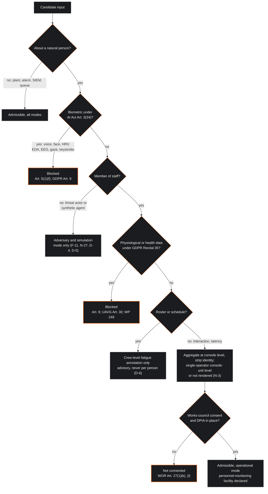
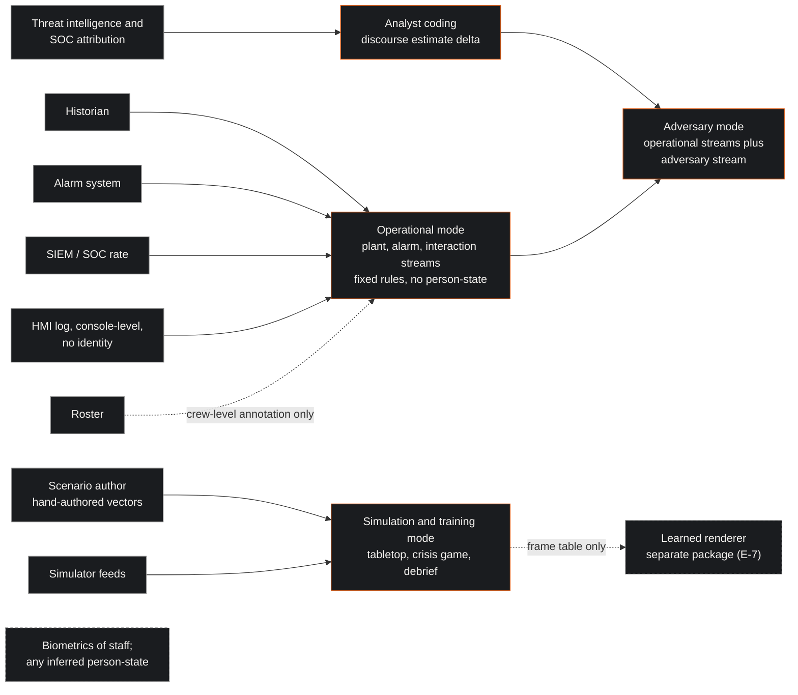

| Field | Value |
|:---|:---|
| Designation | MPN-4, deployment and outcome: the audible control room, lawful-by-design sonification of plant, task and adversary state |
| Status | Draft for working-group review |
| Normative language | RFC 2119 |
| Licence | Creative Commons Attribution 4.0 International (CC BY 4.0) |
| Extends | MPN-1 (foundations), MPN-2 (notation) and MPN-3 (engine); connects to the working group's earlier papers on the 20-second deficit, on Lacan in the control room and, cautiously, on the ALE/ROSI decision framework |
| Series | Paper 4 of 4 (Foundations, Notation, Engine, Deployment) |
| Reference implementation | https://github.com/Planet9V/mpn-conductor-standalone (public repository; audited in MPN-3, not executed) |

## 1. Executive Summary & Scope

This paper closes the series. It says how an MPN system is put into a European industrial control room lawfully and safely, how it is validated, what it can be said to deliver once validated, and where the person-level psychological layer of the programme lives so that it never touches a member of staff. The key words MUST, MUST NOT, SHOULD and MAY are to be read as in RFC 2119 [1]. The paper is offered under CC BY 4.0 [2]. The foundations requirements F-1 through F-14 of Paper 1, the notation requirements N-1 through N-27 of Paper 2 and the engine requirements E-1 through E-24 of Paper 3 bind it [3] [4] [5]; its own deployment invariants are numbered D-1 through D-20.

The outcome the working group claims is narrow. An MPN deployment adds to the control room a regulated auditory channel that carries situational information vision does not carry while the eyes are elsewhere: the plant's distance from nominal, the alarm system's load and its bunching, the tempo of work at the console and, in incident conditions, an analyst's coded discourse estimate for an adversary. The benefit hypothesised is detection and orientation, and the evidence for the hypothesis is transferred from anaesthesia, where a continuous auditory display of six variables let residents detect every scripted event with sound alone and supported eyes-free monitoring during other tasks [6] [7]. No lead time is claimed, no reduction in incident rate, no insurance premium delta, and no result from an industrial control room, because none exists (section 5.4).

The deployment is lawful by design, and this paper is where the position of the series becomes a set of invariants. Regulation (EU) 2024/1689 Article 5(1)(f) has prohibited AI systems that infer the emotions of a natural person in the workplace since 2 February 2025, untouched by the Digital Omnibus on AI of July 2026 [8] [9]; the Commission reads "emotions" widely, reaching stress-based anxiety, emotional arousal, burnout and a team's emotional tone [10]; physiological data about a worker are treated as health data on GDPR Recital 35 and the Dutch regulator's practice [11]; and any facility suitable for observing staff behaviour or performance needs prior works-council consent [12]. MPN therefore sonifies plant state, task load, interaction tempo and adversary discourse, never an inferred emotion, mood, stress or arousal of an operator; no biometric of a member of staff enters the deployed signal chain; and person-level modelling is confined to adversary modelling from threat intelligence, to simulation and training including the crisis exercise, and to one advisory crew-level fatigue annotation on the SAFTE-FAST pattern [13] [14]. Physiology indexes arousal and load, not emotion [15]; the guidelines' footnote on the doubts about the accuracy of emotion recognition points, through a secondary report, to the same review [10].

One consequence for the programme's own name follows. The planned title reads "operator state made audible"; operator state is exactly what the series declines to infer. This paper recommends the subtitle "the state of the socio-technical link made audible", which is what the notation of Paper 2 writes down.

### 1.1 What this paper does not do

It does not give legal advice for a particular site; it sets out the verified texts and the working group's reading of them, and records where that reading has not been tested by any authority. It reports no validation result, since none has been run. It does not describe the reference implementation as deployable; Paper 3 lists what must change before it can be cited at all.

## 2. The legal frame

This section quotes the primary texts as verified and draws from them the gate of section 2.7. Where a reading is the working group's own, the text says so.

### 2.1 The prohibition and its definitions

Article 5(1) of the Regulation opens "The following AI practices shall be prohibited:" and point (f) reads: "the placing on the market, the putting into service for this specific purpose, or the use of AI systems to infer emotions of a natural person in the areas of workplace and education institutions, except where the use of the AI system is intended to be put in place or into the market for medical or safety reasons" [8]. Article 3(39) defines an emotion recognition system as "an AI system for the purpose of identifying or inferring emotions or intentions of natural persons on the basis of their biometric data", and Article 3(34) defines biometric data as "personal data resulting from specific technical processing relating to the physical, physiological or behavioural characteristics of a natural person, such as facial images or dactyloscopic data" [8]. The second definition keeps the requirement that the data be personal data and drops the GDPR's qualifier that they allow or confirm unique identification, as the Commission's guidelines note in a footnote; the consequence, which Paper 2 applied to its state vector, is that heart rate, EEG, voice, gaze and keystroke dynamics are biometric data for the Regulation's purposes even where they do not by themselves allow unique identification, provided they are personal data about an identifiable operator, which at a manned console they are [10] [4].

Recital 18 fixes the boundary that matters most here. The notion of emotion recognition "refers to emotions or intentions such as happiness, sadness, anger, surprise, disgust, embarrassment, excitement, shame, contempt, satisfaction and amusement. It does not include physical states, such as pain or fatigue, including, for example, systems used in detecting the state of fatigue of professional pilots or drivers for the purpose of preventing accidents" [8]. Recital 44 gives the reason: "serious concerns about the scientific basis of AI systems aiming to identify or infer emotions", their "limited reliability, the lack of specificity and the limited generalisability", and the "imbalance of power in the context of work" [8]. Article 113 makes Chapters I and II applicable from 2 February 2025, so the prohibition has applied for more than a year and a half at the date of this paper, and the amending Regulation (EU) 2026/1744 of 8 July 2026 did not alter point (f) [8] [9].

### 2.2 The Commission's reading

The Commission approved draft guidelines on prohibited practices on 4 February 2025 as C(2025) 884 final and adopted them on 29 July 2025 as C(2025) 5052 final; section 7 concerns Article 5(1)(f), and the guidelines state that they are not binding, the Court of Justice being the final interpreter [10]. Five readings shape the design. First, the prohibition covers inferences from biometric data, identifying or inferring emotions or intentions; text and sentiment analysis are out of scope. Second, emotions are to be "understood in a wide sense and not interpreted restrictively", the Recital 18 list is not exhaustive, and the prohibition "should not be circumvented by referring to attitudes"; in the education examples, eye tracking also used "to detect emotions, such as emotional arousal and anxiousness" falls within scope, which is why no MPN output may carry the word arousal. Third, the workplace is read broadly, a control room is within it, and a prohibited example is "AI systems monitoring the emotional tone in hybrid work teams by identifying and inferring emotions from voice and imagery of hybrid video calls". Fourth, physical states are out: "Using AI recognition systems to infer a professional pilot's or driver's fatigue to alert them and suggest when to take brakes to avoid accidents is not 'emotion recognition'", but "Concluding that a person is happy is emotion recognition" [10].

Fifth, the safety exception is narrow, in the guidelines' own words. It "should be narrowly interpreted"; therapeutic uses mean CE-marked medical devices; "The general monitoring of stress levels at the workplace is not permitted under health or safety aspects"; a system "intended to detect burnout or depression at the workplace" remains prohibited; safety means the protection of life and health; use must be "limited to what is strictly necessary and proportionate, including limits in time, personal application and scale", accompanied by safeguards, of which the guidelines' example is a prior written and motivated expert opinion; and necessity may not refer to the employer's needs. The worked example allows measuring anxiety from stress levels only where the stress level itself "would pose a specific danger, for example when deploying dangerous machines or dealing with dangerous chemicals", and even then the employer "may not use the data for other purposes, such as assessing the employee's work performance" [10].

The rest of this subsection is the working group's own reasoning. A process plant handles dangerous machines and chemicals, and a reader might think the exception opens a door. It does not open one wide enough to walk through: it admits a biometric emotion inference only as strictly necessary, proportionate, time-limited, safeguarded and purpose-bound; the inference would still have to clear the GDPR, where the Dutch position on employee consent all but closes the route (section 2.5); and it would deliver a signal that, on the review the guidelines point to, measures arousal and load rather than the emotion it would be labelled with [15]. A design that needs the exception has chosen the wrong input. The guidelines also note that continuous monitoring via wearables "may increase work-stress while affecting productivity", and they place crowd-level mood analysis in public places outside the prohibition because it infers nothing about a concrete natural person, with a duty to avoid screening employees [10]; they do not address a system that reads a team's tone while inferring nothing about any member. The working group's own view is that a crew of three or four is not a crowd and that an average over their inferred states would infer each state first; the design relies on no wider reading.

### 2.3 High-risk classification and the worker-information duty

If an MPN system were an AI system, three Annex III entries would be in view. Point 1(c) lists "AI systems intended to be used for emotion recognition", which the design excludes by construction. Point 2 lists "AI systems intended to be used as safety components in the management and operation of critical digital infrastructure, road traffic, or in the supply of water, gas, heating or electricity". Point 4(b) lists systems "intended to be used to make decisions affecting terms of work-related relationships ... to allocate tasks based on individual behaviour or personal traits or characteristics or to monitor and evaluate the performance and behaviour of persons in such relationships" [8]. Article 26(7) requires deployers of a high-risk system in the workplace to "inform workers' representatives and the affected workers that they will be subject to the use of the high-risk AI system" [8]. Those obligations were to apply from 2 August 2026. Regulation (EU) 2026/1744, the Digital Omnibus on AI, published in the Official Journal on 24 July 2026 and in force on the third day after publication, amends Article 113 so that "the date of application of Sections 1, 2 and 3 of Chapter III is set to 2 December 2027 for AI systems classified as high-risk pursuant to Article 6(2) and Annex III", and to 2 August 2028 for Annex I systems; Article 26 sits in Section 3 of that Chapter, so the worker-information duty is deferred with them [9]. At the date of this paper the Annex III obligations are not yet applicable; the design does not wait for them. Article 50(3), on informing persons exposed to a permitted emotion recognition system, has no application because nothing is recognised [8].

The design answers each entry by intended purpose. The display is not a safety component: it requires no response, actuates nothing, writes to nothing, and is entered in the alarm philosophy as a non-alarm auditory display (N-20, E-19). It does not monitor or evaluate the performance of persons: its interaction channels are console-level counts without identity (N-3), it keeps no per-person log (E-16), and it exports to no personnel system (E-17). Those are design facts a site can verify, and D-10 requires the site to record its classification reasoning and inform workers' representatives and affected workers before commissioning regardless of its conclusion and of the deferral.

### 2.4 Whether the operational build is an AI system at all

The Commission's guidelines on the definition of an AI system, C(2025) 5053 final of 29 July 2025, quote Recital 12 to the effect that the definition "should not cover systems that are based on the rules defined solely by natural persons to automatically execute operations", describe a basic data processing system as one that follows "predefined, explicit instructions or operations ... without any 'learning, reasoning or modelling'", and state that systems "solely intended for descriptive analysis, hypothesis testing, and visualisation, fall outside the definition of an AI system", the example being a dashboard that presents data and does not recommend how to improve sales [16]. The operational path of the engine is a fixed, human-authored mapping with declared constants and no learned component (E-6); on the Commission's reading it is a visualisation system. Three caveats travel with that position. The guidelines are non-binding and no authority has tested the reading. The dashboard example recommends nothing, whereas the notation has an alert threshold and a flood machine; that an alert entry is a rendering rule rather than a recommendation is a further step of the working group's own, which D-10 leaves each site to record. And the reading holds only while the mapping stays fixed, which is why D-16 makes any change to it a management-of-change event that reopens the question, and why any learned renderer is confined to simulation and adversary mode and physically separable (E-7).

### 2.5 The GDPR, the Dutch implementation and the occupational-medicine route

Article 9(1) of the GDPR prohibits the processing of, among other categories, "biometric data for the purpose of uniquely identifying a natural person, data concerning health"; Article 4(15) defines data concerning health as personal data "related to the physical or mental health of a natural person ... which reveal information about his or her health status"; and Recital 35 extends that to "any information on ... the physiological or biomedical state of the data subject independent of its source" [11]. No court has held that every physiological datum is health data; heart-rate variability, electrodermal activity and EEG about an operator are treated as health data on Recital 35 and the Dutch regulator's practice, and an inference of stress, anxiety or burnout risk is mental-health data on the definition itself. Article 30(1) of the UAVG lifts the health-data ban for employers only where processing is necessary for the proper execution of statutory provisions, pension schemes or collective agreements that provide entitlements dependent on the data subject's state of health, or for the reintegration or support of employees in connection with illness or incapacity; the further limbs of Article 30 concern care providers, insurers and others [17]. Continuous monitoring of healthy operators fits none of them. The version consulted is the consolidated text valid to 31 August 2026, and D-9 requires the current text to be re-read at commissioning.

Explicit consent under Article 9(2)(a) is the only other candidate, and the Dutch and European positions all but close it. The Article 29 Working Party says of employer-provided wearables that "Given the unequal relationship between employers and employees ... it is highly unlikely that legally valid explicit consent can be given"; that "Even if the employer uses a third party to collect the health data, which would only provide aggregated information about general health developments to the employer, the processing would still be unlawful"; that complete anonymisation is "technically very difficult"; and that "The resulting health data should only be accessible to the employee and not the employer" [18]. In March 2016 the Autoriteit Persoonsgegevens found two Dutch employers' processing of wearable data on movement and sleep unlawful: such data are sensitive data about health, in an employment relationship there is in general no free consent, and processing by colleagues or a vendor on the employer's behalf, even anonymously, does not cure it [19] [20] [21]. The AP, which has positioned itself as the coordinating supervisor for the Regulation's prohibitions in the Netherlands, ran a consultation on emotion recognition at the workplace in early 2025; its summary was not readable to the working group and is cited for existence only [22].

The one lawful route to operator physiology is Article 9(2)(h), processing for preventive or occupational medicine, read with Article 9(3), which admits it only when the data are processed "by or under the responsibility of a professional subject to the obligation of professional secrecy" [11]. That route is real and it defeats a supervisor display: the data reach an occupational physician and nothing reaches the floor. Article 22 confers the right not to be subject to a decision "based solely on automated processing, including profiling, which produces legal effects concerning him or her or similarly significantly affects him or her"; the design forbids the system any such decision. Article 88(2), requiring suitable measures "with particular regard to the transparency of processing ... and monitoring systems at the work place", frames the Dutch regime, since the Netherlands has enacted no dedicated Article 88 statute [11].

### 2.6 The works council and the impact assessment

Article 27(1) of the Wet op de ondernemingsraden requires the employer to obtain the consent of the works council for any proposed decision to adopt, amend or withdraw, under (k), a regulation on the processing and protection of the personal data of persons working in the undertaking, and, under (l), "een regeling inzake voorzieningen die gericht zijn op of geschikt zijn voor waarneming van of controle op aanwezigheid, gedrag of prestaties van de in de onderneming werkzame personen", a regulation on facilities aimed at or suitable for observing or checking the presence, behaviour or performance of persons working in the undertaking, in so far as it concerns all or a group of them [12]. The word that matters is "geschikt", suitable. A sonification of console interaction tempo and acknowledge latency is suitable for observing performance whether or not anyone intends it for that, so it is a personnel-monitoring facility and needs prior consent, with or without biometrics, with or without an AI system; a crew is a group. Under Article 27(3) the requirement falls away where the matter is already substantively regulated in a collective agreement, which a site with such a clause must check; under 27(4) an employer refused consent may ask the cantonal court for leave, granted only where the refusal is unreasonable or there are compelling organisational, economic or social reasons; under 27(5) a decision taken without consent is void if the works council invokes nullity in writing within a month [12]. The design plans for consent, on a regulation that states the channels, the console-level aggregation, the absence of identity, the retention period, the purposes and the absence of export to personnel systems.

A data protection impact assessment is completed before the same channels are connected. The duty flows from Article 35(1), processing likely to result in a high risk, read with Article 35(4): the Dutch supervisor's list of processing operations for which an assessment is mandatory includes, as item 11, "Controle werknemers", large-scale processing or systematic monitoring of employees' activities, and the Article 29 Working Party's guidelines on impact assessments name systematic monitoring and vulnerable data subjects such as employees among their criteria [11] [23] [24]. The consent and the assessment are the first artefacts an auditor is shown (section 7). The occupational-safety literature points the same way: EU-OSHA's analysis of AI for worker management calls for human-centred, prevention-through-design approaches [25], and ISO 45003 frames psychosocial risk as an organisational and participatory matter, though its clause text was not verified [26].

### 2.7 The admissibility gate

The readings above reduce to one decision procedure, applied to every candidate input before it reaches the engine's schema boundary (E-3).

## 3. Design invariants

The invariants restate, as obligations on a deployment, what the three earlier papers established as properties of the foundations, the notation and the engine. Where an invariant repeats an earlier requirement it cites the requirement that contains the mechanism. They are numbered D-1 through D-20 and bind every MPN deployment in every mode.

- **D-1.** No channel of a deployed MPN system MAY be a biometric of a member of staff under Article 3(34) of the Regulation (voice, face, heart-rate variability, electrodermal activity, EEG, gaze, keystroke timing), in any mode, on any path, research annotations included (N-2, E-3).
- **D-2.** No output, label, annotation, log field or document of a deployed system MAY name an emotion, mood, stress, arousal, anxiety, burnout, morale, trust or emotional tone of any person or crew (N-2); every output MUST be labelled by the measured quantity, its unit and its window. A listener's rating of the music's own perceived arousal or valence in the protocol of Paper 2 section 9 is a property of the sound, not of a person, and is not an output of the system.
- **D-3.** No deployed output MAY be, or be described as, an inference about an identifiable member of staff. The score identifier MUST name a link and never a person (Paper 2 section 3.1, N-1, N-3), and a console staffed by one person MUST be aggregated at unit level with at least one other console or not rendered (N-3).
- **D-4.** Person-level vectors (trait, register, discourse, scenario) MUST appear only in simulation and adversary mode (F-11, N-16, E-4), and any learned component MUST be confined to those modes and physically separable from the operational build (E-5, E-7).
- **D-5.** Adversary mode MUST take its discourse estimate from threat intelligence and security-operations data about a threat actor, coded by an analyst, and MUST NOT apply it to a named or identifiable member of staff, a suspected insider included (N-27, E-4); insider concerns belong to the site's security programme and employment law.
- **D-6.** The fatigue annotation MUST be computed from schedule-predicted sleep opportunity only, for the crew on shift and never for a named individual, MUST be a text annotation presented as an advisory crew-level estimate (N-25, E-21), MUST NOT be a go/no-go criterion or an input to any decision about an individual, and MUST NOT be rendered where the crew on shift is one person.
- **D-7.** A deployed system MUST keep no per-person record: its log is the frame table, the header constants, the rendering state and timestamps (E-16), and interaction and latency channels MUST be aggregated at console level without user identity before they reach the engine (N-3).
- **D-8.** A deployed system MUST have no export path to any human-resources, appraisal, disciplinary or personnel system (E-17), and no downstream system MAY join its frame tables or its fatigue annotation to roster identity.
- **D-9.** Works-council consent under Article 27(1)(k) and (l) of the Works Councils Act MUST be obtained, and a data protection impact assessment completed, before any interaction, latency or fatigue channel is connected, shadow mode included; the regulation consented to MUST state the channels, the aggregation, the retention period, the purposes and the absence of export, and the current consolidated texts of the UAVG and the Works Councils Act MUST be re-read at commissioning.
- **D-10.** Before commissioning, the site MUST record its reasoning on whether the system is an AI system and, if so, whether Annex III applies, and MUST inform workers' representatives and affected workers in the manner of Article 26(7), whether or not it concludes that the Annex applies and whether or not the deferred high-risk obligations have begun to apply.
- **D-11.** The display MUST be entered in the site's alarm philosophy as a non-alarm auditory display requiring no response (N-20), its configuration annexed (E-18), and commissioning and every later change MUST pass management of change.
- **D-12.** The site's security programme under IEC 62443-2-1 MUST cover the engine as a new component: asset inventory, its read-only interface to the alarm system (E-19), its timestamped read-only inputs from the historian and the other source systems of Paper 2 section 2 (E-3, E-14), its log as a new data flow, access control and retention.
- **D-13.** The operator MUST have one silence control, without penalty and without any record of who used it (N-24, E-11); its use MUST NOT be reported, attributed or raised in any appraisal.
- **D-14.** The flood behaviour of N-22 and E-8 MUST be implemented. Because the display generates no alarm record (N-20, E-19) and renders density rather than one sound per alarm (N-21, E-20), the annunciated alarm rate can change only through behaviour; it MUST be measured by the rate metrics of IEC 62682 before and after commissioning and MUST NOT rise.
- **D-15.** The level margin and the excluded spectral band of N-23 and E-12 MUST be verified at the console against the site's danger signals under ISO 7731 before commissioning and after any change to the instrument set.
- **D-16.** The operational mapping MUST remain fixed and human-authored (E-6); any change to it is a management-of-change event and reopens the classification reasoning of D-10.
- **D-17.** Early-warning observables MUST be research annotations on link metrics, labelled by quantity and window, MUST NOT be sonified or enter the tension index (N-19), MUST NOT be computed on any physiological signal, and MUST NOT be described as a lead time until the data requirements of Paper 1 section 5.6 are met and reported (F-8).
- **D-18.** In simulation and training mode with real participants, interaction channels MUST come from the simulator, frame tables MUST NOT be retained per participant, and debriefing MUST use the score and the frame table, not any per-person measure.
- **D-19.** Rollout MUST follow the staged sequence of section 5.3 with the acceptance criteria of section 5.2 stated in advance, and no stage MAY be entered until the previous stage's criteria are met and recorded.
- **D-20.** No MPN deployment MAY be described as delivering a measured lead time, a measured reduction in incident or alarm rate beyond what D-14 records, or an insurance premium delta; claims MUST be limited to what section 7 lists as evidenced.

Two invariants deserve a sentence of motivation. D-2 exists because the anti-circumvention paragraph reaches labels: a rolling autocorrelation of acknowledge latency is a number about a queue, and annotated "operator approaching overload" it becomes a statement about a person that the design has neither the evidence nor the right to make. D-5 and the single-operator clauses of D-3 and D-6 exist because aggregation does not anonymise a group of one: the earlier typology placed "quiet reconnaissance / insider" under the analyst's discourse [27], a suspected insider is an employee, and a console or crew of one is an identifiable person whatever the channel is called.

## 4. The three lawful modes

The notation has three input modes declared in the header of every score (N-1). This section says what each is for, where its data come from and what a listener hears.

### 4.1 Operational mode

The inputs are the channels of Paper 2 section 2 marked admissible in operational mode and nothing else (E-3): plant deviation, the alarm-system counts of the IEC 62682 and ISA-18.2 metrics [28] [29] and their dispersion, the SIEM event rate where the room has a security feed, the queue depth, and the console-level acknowledge latency and interaction tempo [4]. The engine turns them into four indices and the indices into tempo, mode, harmonic distance, metre, roughness and dynamics by the fixed functions of Paper 2, on at most three streams: plant at the centre, alarm rate on the left rendering density and never one event per alarm, interaction on the right [4] [5].

In normal operation the room hears very little, by design: a slow tempo, the tonic chord in major at a low dynamic, a sparse alarm pulse in common time, a thin interaction figure, and on each stream the liveness figure whose only meaning is that the channel is alive. The intent is the one Peep stated for a network: a background that sounds normal in any combination, whose deviation is noticed with little effort, and whose silence on one stream means that stream's data have stopped [30]. In an upset the tempo rises, the harmony walks away from the tonic, the mode turns minor when a medium or high-priority alarm stands, roughness and irregular metre enter as the plant moves fast and alarms bunch, and the dynamics rise with the backlog; a declared incident changes the clef at a double bar, announced by a person and not by a threshold. In the worked example of Paper 2 the alarm system annunciates the trip at 1:02 and the score reaches attention mode after 1:30 and alert mode after 2:00, the right order for a display that requires no response [4]. In a flood the display goes silent but for a tonic drone at pianissimo (section 8), and the written score continues in full.

One limitation belongs here. The plant stream sounds what the historian reports. The working group's earlier paper on Lacan in the control room described the adversary's move as a symbolic severance, telemetry decoupled from physics so that the display stays calm while the process runs toward failure [31]. An audible plant stream is telemetry too: if the process variables are forged, the plant stream is calm, and MPN is no defence against that attack. What the notation offers is juxtaposition, a calm plant stream beside a rising SIEM term or an adversary stream that has entered, a mismatch a listener can hear and the notation does not resolve. Resolution is the operator's, and the earlier paper's conclusion stands: fast transients belong to hardwired interlocks, not to any display [32].

### 4.2 Adversary mode

Adversary mode adds a fourth stream. The working group's earlier typology read the four discourses as four kinds of threat actor: the master's as state warfare, the university's as espionage, the hysteric's as hacktivism and high-ego intrusion, the analyst's as quiet reconnaissance [27]. Paper 1 narrowed those readings to analyst's codings that stand as hypotheses, and Paper 2 gave each a voice-leading style for one brass stream, with the capitalist discourse, outside the orbit of the quarter-turn, as the master's style with the bass missing [3] [4].

The input is a probability vector over the five labels, coded by a threat-intelligence analyst from attribution, tradecraft and campaign context, and updated when the assessment changes. It describes an actor identified through security-operations and threat-intelligence data, never a member of staff (N-27, D-5). The earlier typology's hypothesis for the master's discourse was that such an actor "will strike at the most symbolically significant node" even where that is not the most efficient path [27]. In adversary mode that hypothesis is voiced, not detected: when the analyst's coding places the master's discourse highest, the brass stream enters in root-position triads in parallel motion on the strong beats while the plant and alarm streams go on sounding the plant; if the incident commander has declared War Room, the tempo band is already high, and the adversary stream's regular, commanding entries are heard against whatever the plant is doing. A rotation of the estimate by a quarter-turn, or its departure from the orbit, is a double bar and a change of style. What the listener learns is which frame the analysts are currently using to read the actor, useful in an incident room where the frame is otherwise carried in people's heads, and it is all that is learned.

The standing of this mode is stated without ornament. The typology is a modelling frame the working group owns (F-2). The only empirical precedent for quantifying the discourses at all is the annotation-and-reliability study of Gadalla, Nikoletseas and Amazonas, three trained raters on 264 sentences with Krippendorff's alpha between 0.52 and 0.70 by discourse, with no held-out prediction and no classifier [33]. Any claim that an estimate was scored from text rather than coded by an analyst must cite that study as predecessor and report reliability on the same basis (F-13, E-24), and no such scoring exists in the reference implementation [5]. Adversary mode is a way of hearing an analyst's assessment, and the value of the assessment is the analyst's.

### 4.3 Simulation and training mode

Simulation and training mode is where the psychological vocabulary of the earlier papers keeps its use. The inputs are hand-authored vectors in the nine-component form of the reference implementation (`mpn-conductor-standalone:ml/psychoscore_v2/models/mckenney_lacan_calculus.py:25-51`), attached per scene or frame as the Conductor attaches them to its thirteen dramatic scenarios (`mpn-conductor-standalone:src/components/mpn-lab/literary_data.ts:16`), and translated to the operational indices by the declared rule of Paper 2 section 8.2 (E-4) [4] [5]. A scenario author writes a trajectory: a plant that drifts, an alarm burst, an adversary whose discourse rotates, a synthetic crew whose register weights shift. The engine renders it, and the exercise plays against it.

Three uses are intended. In a tabletop exercise the score is a shared timeline that the facilitator advances and the participants hear, so that the state of the link at each injected event is common knowledge without a slide. In the crisis game, the working group's earlier "Seldon" use, the adversary stream carries the red team's coded discourse, the plant streams carry the simulator, and the participants play the room. In debriefing, the symbolic score is the record: every bar can be checked against the frame table (N-26), so a debrief can say "at this bar the alarm stream bunched into 7/8, the harmony was nine steps out, and the decision came four bars later" without saying who decided what or how they felt.

The mode is lawful because no natural person's state is inferred and no natural person's data are kept: the vectors are authored, the crew in the scenario is synthetic, and D-18 keeps real participants' interaction data inside the simulator and out of any retained per-person record. That design fact is what the lawfulness rests on. The practice it sits beside is observer-rated crew evaluation: on the working group's understanding of a literature whose clause text it did not verify, the human-factors review model for nuclear plants has crew performance assessed by trained observers during simulator evaluation, and aviation's crew resource management rates observable team behaviours the same way [34]. The working group found no operational safety-critical system that continuously infers and displays a team's psychological state to a supervisor, without claiming an exhaustive search. What the audible score adds is a common, replayable account of what the link was doing while the observers watched the crew.

### 4.4 The fatigue annotation

The one person-related channel is the crew-level fatigue annotation, and its precedent is stated precisely because the design copies its form and narrows its content. The SAFTE model integrates physiological and circadian processes with a task-effectiveness prediction; its inputs are individual sleep, wake and work patterns from actigraphy and duty logs; its output is predicted effectiveness as a percentage of an individual's optimum baseline; and its field validation for the Federal Aviation Administration compared predictions against 10,659 psychomotor vigilance sessions from 178 cabin crew, reporting a coefficient of determination of 0.884 for binned predictions [13]. The Australian regulator's guidance, in the condensed form the working group could verify, describes such models as "an optional tool (not a requirement)", restricted to "predicting risk probabilities for a target population average rather than the instantaneous fatigue levels of a specific individual", says they "should not be used in isolation or as a go/no go criteria", and warns that their outputs "can give the illusion of being precise and quantitative" [14]. The United States rail rule of 13 June 2022 requires fatigue risk management programmes and mandates no physiological monitoring [35]. Recital 18 places fatigue outside emotion recognition [8].

The MPN annotation is narrower than any of those, because a per-person value would be an inference about an identifiable rostered person and D-3 forbids it. It takes no actigraphy, no reported sleep and no health input; it is computed from the schedule-predicted sleep opportunity of the crew on shift, the hours into shift, the position in the night and the run of consecutive shifts the roster implies, as a single crew-level value carried with no identifier (N-3, N-25). It is a text annotation, never a sound; D-6 forbids its use as a go/no-go criterion or as an input to any decision about an individual, and where the crew on shift is one person it is not rendered. The roster is personal data, processed under the regulation the works council consents to (D-9) and not carried in the score. The annotation exists so that a supervisor reading a score can see that a crew's predicted sleep opportunity was low when a long upset began, and so that the conversation that follows is about the roster.

## 5. The validation stack

### 5.1 The instruments

Validation uses instruments that already exist in control-centre practice, so that a site's human-factors staff can run it and an auditor can read it. ISO 11064-7 supplies the evaluation principles for control centres, and ISO 11064-1 with ISO 9241-210 the human-centred, iterative process with operator participation within which the evaluation sits [36] [37] [38]. Endsley's three-level model of situation awareness supplies the construct and the situation awareness global assessment technique the method: freeze the simulation at scripted points and query the participants at the levels of perception, comprehension and projection [39] [40]. The NASA task load index supplies the subjective workload criterion after each block [41]. Multiple-resource theory supplies the prediction under test: a visually loaded operator has spare auditory capacity, so an auditory display should add information at a reduced cross-modal cost, but that capacity is shared with alarm sounds and crew speech, and the theory predicts a time-sharing cost, not a benefit [42].

The performance task is the two-stream detection task of the anaesthesia literature, adapted. Loeb and Fitch had fourteen residents monitor auditory, visual and combined displays of six variables in two streams over 21 trials; every subject detected every scripted event in every format, detection was fastest with the combined display at 10.4 seconds against 12.8 seconds visual and 13.0 seconds auditory, and identification accuracy was lowest with sound alone at 60% against 88% visual and 80% combined [6]. Watson and Sanderson showed a continuous respiratory sonification supporting eyes-free monitoring and task time-sharing alongside the oximeter tone [7]. The MPN version, set out in Paper 2 section 9, has participants monitor the plant and alarm-rate streams while performing a concurrent visual task, measuring detection latency and identification accuracy for scripted state changes including the cessation of a liveness figure, and is preceded by magnitude estimation of each mapping's polarity and scaling with the target population, since polarity is an empirical property of the data concept and the listeners rather than a convention [4] [43]. Physiological workload measures are not used at any stage: they would need the Article 9 route of section 2.5 for every participant, and the acceptance criteria do not need them.

### 5.2 Acceptance criteria

The criteria are stated in advance and each names its instrument.

- The annunciated alarm rate, measured by the IEC 62682 rate metrics over a declared period before and after the display is connected, MUST NOT rise (D-14); since the display generates no alarm record, the criterion is a check on behaviour.
- The audibility of the site's danger signals at the console, with the display at its declared ceiling in every rendering state, MUST meet ISO 7731 as verified by measurement before commissioning (D-15) [44].
- Situation awareness, measured by SAGAT probes with and without the display, MUST show a gain or no loss at each of the three levels, and any gain MUST be reported with its probe-level breakdown.
- Subjective workload, measured by NASA-TLX after each block, MUST be no worse with the display than without it.
- In the two-stream task, detection latency with the display MUST NOT exceed the visual baseline, and identification accuracy MUST be reported alongside it, since the transfer basis predicts that sound alone identifies worse than it detects.
- Each mapping is kept only if its polarity is agreed by a declared majority of the population in the magnitude-estimation block; a mapping that fails is reversed and retested, not argued for.

### 5.3 Staged rollout

The rollout has four stages, and a stage is entered only when the previous stage's criteria are met and recorded (D-19).

```mermaid
flowchart LR
    accTitle: The staged rollout of an MPN deployment from simulator to crew
    accDescr {
      Four stages in sequence. The simulator stage runs the listener study and the SAGAT and TLX trial with volunteer participants on simulator data, and its exit criteria are the acceptance criteria. The shadow-mode stage connects the engine to live plant and console data with audio heard only off-console by the evaluation team, and it may begin only after works-council consent and a data protection impact assessment; its exit criteria are no alarm-rate rise, verified audibility margins and a clean log. The single-console stage puts audio on one console with the silence control, and its exit criteria repeat the alarm-rate and TLX checks in the field. The crew stage extends to the room. Each stage has a rollback arrow to the previous one, and the whole sequence sits under management of change.
    }
    S1["Stage 1: Simulator<br/>listener study; SAGAT and TLX trial<br/>volunteer participants, simulator data"]
    G["Gate: works-council consent<br/>and DPIA (D-9); MoC entry (D-11);<br/>security programme (D-12)"]
    S2["Stage 2: Shadow mode<br/>live data, audio off-console<br/>evaluation team only"]
    S3["Stage 3: Single console<br/>audio on one console<br/>silence control live"]
    S4["Stage 4: Crew<br/>room-wide display"]
    S1 -->|"criteria met and recorded"| G
    G --> S2
    S2 -->|"no alarm-rate rise;<br/>audibility verified;<br/>log identity-free"| S3
    S3 -->|"alarm rate and TLX<br/>no worse in the field"| S4
    S2 -.->|"rollback"| S1
    S3 -.->|"rollback"| S2
    S4 -.->|"rollback"| S3
    classDef n fill:#1a1c1f,stroke:#E05A10,stroke-width:1px,color:#f5f3f0;
    classDef s fill:#1a1c1f,stroke:#8a8a8a,stroke-width:1px,color:#f5f3f0;
    class S1,S2,S3,S4 n;
    class G s;
```

The simulator stage needs no consent beyond that of its volunteer participants, because its interaction data come from the simulator and no per-person record is kept (D-18). The shadow-mode stage is the first that touches live console data, and it is a personnel-monitoring facility from that moment even though nobody on the floor hears it; hence the gate. In shadow mode the engine runs on live feeds, the audio goes to the evaluation team off the floor, and the scores are archived and compared against the event log, which is where the frame tables needed for section 6 begin to accumulate. The single-console stage introduces the silence control to one position and repeats the alarm-rate and workload checks in the field; the crew stage extends the display to the room. Every stage is a management-of-change record, and rollback is a configuration change under the same record.

### 5.4 What the evidence base is

No controlled study of continuous sonification of plant state in an industrial control room was found, no standard covers continuous non-alarm sonification at all, and every performance claim behind the design is a transfer from anaesthesia or the laboratory [6] [7] [45]. The anaesthesia results were obtained with residents monitoring simulated patients; the one field-proven continuous sonification is the pulse oximeter's tone, which conveys trend well and absolute level poorly [45]. The validation stack is how the transfer is tested; until it has been run, MPN is a design whose transfer basis is stated and whose control-room evidence is nil.

## 6. Early-warning signals, correctly scoped

Paper 1 set out the generic indicators of a system approaching a fold, critical slowing down, rising lag-one autocorrelation, rising variance, skewness and flickering, with their authors' caveats: necessary but not sufficient, needing long stationary series, and producible by mechanisms unrelated to a critical transition [46]. Dakos and colleagues give the estimation method, rolling-window autocorrelation and variance after detrending with surrogate-data significance tests [47]; Kuehn ties the indicators to the fold lines of the cusp, so that the cusp, the Kramers rate and the early-warning signals are one object seen three ways [48]. The method has been applied to human mood from experience-sampling series, in two cohorts and in a single-case series [49] [50].

In an MPN deployment the observables are computed on link metrics and nothing else. Over a declared window $W$ of frames, for a channel $x$ such as plant deviation or the console-level acknowledge latency, the annotation carries the lag-one autocorrelation and the variance of the detrended residuals,

$$\hat{\rho}_1 = \frac{\sum_{t}(x_t - \bar{x})(x_{t-1} - \bar{x})}{\sum_{t}(x_t - \bar{x})^{2}}, \qquad \hat{\sigma}^{2} = \frac{1}{W}\sum_{t}(x_t - \bar{x})^{2},$$

with the window, the detrending method and the surrogate test declared in the header. They are margin annotations (N-19): not sonified, not in the tension index, and by D-17 never computed on a physiological signal. Team physiological synchrony, the one literature that has tried to read a team from its physiology, is heterogeneous in measurement and inconsistent in effect [51], and where a physiological stream has been sonified, in the EEG of epilepsy, naive listeners identified only gross discrete events and only after training [52].

What the annotations are for is the data requirements of Paper 1 section 5.6: a defined scalar state sampled densely and stationarily with hundreds of transitions, control variables specified in advance, bimodality and hysteresis in the same data, rolling-window estimates with surrogate tests, and an independent estimate of noise and barrier followed by a comparison of predicted and observed times to jump [3]. Archived frame tables from shadow mode onward are where (a) through (d) can one day be met. Until then the annotation is a number in a margin, never a lead time; the earlier specification's fifteen to thirty minutes of warning was retracted in Paper 1, the repository's own reviewer file records zero empirical validation [3] [5], and nothing here reinstates it.

## 7. Outcome, and the underwriting link

### 7.1 What an auditor or an underwriter can be shown

The deployment produces a small set of artefacts that a third party can inspect, and the working group's claim to an outcome rests on them and on nothing else: the works-council consent and its regulation; the impact assessment; the classification reasoning and worker-information record of D-10; the alarm-philosophy entry, its annexed configuration and the management-of-change records; the security-programme coverage of D-12; the alarm-rate metrics before and after commissioning, showing no rise; the ISO 7731 verification; the listener-study and simulator-trial results, with SAGAT probe-level breakdown, TLX and detection figures, against the criteria stated in advance; the staged rollout record; and the identity-free frame-table archive with its retention. Every one of those is evidence about the plant, the alarm system, the process and the display. None is evidence about a person.

### 7.2 Why no premium delta is attached

The working group's underwriting programme translates engineering risk into annualised loss expectancy and a return on security investment; its worked case is a modelled facility on which every exposure factor and rate of occurrence is a working-group estimate, so that its outputs are a sensitivity result and not a measurement [53]. Attaching MPN to that arithmetic would mean assigning it a reduction in a rate of occurrence or an exposure factor, and there is no measurement from which to take such a number. The earlier claim that psychometric monitoring of insiders reduces annualised loss expectancy was retracted in Paper 1, because the control is withdrawn and because its arithmetic stood only on author-chosen values [3]; D-20 forbids the claim for MPN. The connection to the underwriting programme is of one kind only: an underwriter assessing a site's controls can inspect the artefacts of section 7.1 as evidence of alarm-management discipline, of a human-factors validation actually run, and of a change process that includes the auditory channel, and weigh them as the underwriter sees fit. The working group supplies the evidence and declines to price it.

### 7.3 The connection to the operator-decision papers

The working group's earlier paper on the 20-second deficit argued that during a cyber-physical crisis the decision-maker is the point of failure, that decision latency expands as physical margins compress, and that fast transients must be handled by hardwired interlocks rather than by any human loop; its time budgets, a calm acknowledgement of twelve seconds against a saturated recognition-primed simulation of sixty-five seconds or more, are modelled figures, read here under F-6 as illustrative [32]. MPN is consistent with that conclusion and adds nothing to the fast loop: it informs, never actuates, and goes silent in a flood. Where it may help is upstream, in the minutes of an upset when the eyes are on one screen and the rest of the link is drifting, the situation the Milford Haven investigation described when it found that the control panel graphics did not provide the necessary process overviews [54]. The paper on Lacan in the control room read the Imaginary register as the operator's ego; Paper 1 withdrew that reading and made the Imaginary channel the display the control room is being shown [31] [3]. The audible score is one realisation of that channel, and nothing of the earlier reading is carried over: the score shows the link and carries no claim about what any operator believes, feels or defends.

## 8. The Milford Haven lesson

On 24 July 1994 an explosion and fires at the Texaco refinery at Milford Haven injured 26 people and caused damage of about £48 million. The Health and Safety Executive's information sheet on alarm handling records that "In the last 11 minutes before the explosion the two operators had to recognise, acknowledge and act on 275 alarms", and its case study lists among the causes that "Excessive number of alarms in emergency situation reduced effectiveness of operator response", that "Control panel graphics did not provide necessary process overviews", that a control valve was shut when the control system indicated it was open, and that the plant had been modified without an assessment of the consequences [55] [54] [56]. The programme that followed produced the benchmarks that EEMUA 191, IEC 62682 and ISA-18.2 carry, whose verified endpoints are no more than one alarm every ten minutes in normal operation and no more than ten displayed in the first ten minutes after a major upset [55] [57] [28] [29].

Three things in that record shape this deployment. The first is the flood rule: ten alarms in ten minutes is the point at which the alarm system itself declares the operator's channel overloaded and at which a state display would have the most to say, and Paper 2 defined the flood state to enter at that count, silence the alarm-rate and interaction streams and reduce the plant stream to a drone [4]. The display goes silent when it would be most tempting to speak, because at Milford Haven the operators did not need more sound; they needed less, and an overview, and the written score is the overview that continues. The second is the overview finding itself, the one item in the case study that a continuous display addresses and on which the transfer from anaesthesia bears: detection and orientation from sound while the eyes are on the graphics. The third is management of change: an auditory display added without an alarm-philosophy entry and a change record would repeat the refinery's error in a new medium, which is why D-11 exists and why every stage of section 5.3 is a change record.

## 9. Programme roadmap

The four papers map onto the working group's phases in order: Foundations fixed what may be claimed and withdrew what may not; Notation defined what is written and how it is validated; Engine specified what must be built and what the reference implementation must shed; Outcome, this paper, says how the result is deployed and what it can be said to deliver. Five milestones follow, each with the claim it would license; the claims accumulate, and none is available before its milestone.

```mermaid
flowchart LR
    accTitle: The four papers, the five milestones and the claim each milestone licenses
    accDescr {
      Four paper nodes in sequence, Foundations, Notation, Engine and Outcome, feed five milestone nodes in sequence. M1, conformance tests and calculi reconciliation, licenses the claim that an implementation reproduces the notation. M2, the listener study, licenses claims about mapping polarity and laboratory detection against a visual baseline. M3, the simulator trial with SAGAT and TLX, licenses a situation-awareness and workload result in a simulator. M4, the shadow-mode field trial after works-council consent and a DPIA, licenses the claim that the engine runs on live data without raising the alarm rate and begins the frame-table archive. M5, a two-dimensional learned renderer in simulation mode, licenses a validated state-to-music model for simulation only. A final node lists what no milestone licenses: a lead time, an incident-rate reduction, a premium delta, or any statement about a person.
    }
    P1["MPN-1<br/>Foundations"] --> P2["MPN-2<br/>Notation"] --> P3["MPN-3<br/>Engine"] --> P4["MPN-4<br/>Outcome"]
    P4 --> M1["M1: conformance tests,<br/>one calculus, remediation<br/>claim: implementation reproduces<br/>the notation (E-1, E-2, N-26)"]
    M1 --> M2["M2: listener study<br/>claim: polarity and scaling validated;<br/>laboratory detection vs visual baseline"]
    M2 --> M3["M3: simulator trial, SAGAT, TLX<br/>claim: situation-awareness and<br/>workload result in a simulator"]
    M3 --> M4["M4: shadow-mode field trial<br/>after WOR consent and DPIA<br/>claim: runs on live data, alarm rate<br/>unchanged; frame-table archive begins"]
    M4 --> M5["M5: 2-D learned renderer,<br/>simulation mode only<br/>claim: validated state-to-music<br/>model for simulation (MPN-3 §5)"]
    NV["Licensed by no milestone:<br/>lead time; incident-rate reduction;<br/>premium delta; any statement<br/>about a person"]
    classDef n fill:#1a1c1f,stroke:#E05A10,stroke-width:1px,color:#f5f3f0;
    classDef s fill:#1a1c1f,stroke:#8a8a8a,stroke-width:1px,color:#f5f3f0;
    classDef x fill:#1a1c1f,stroke:#E05A10,stroke-width:2px,color:#f5f3f0;
    class M1,M2,M3,M4,M5 n;
    class P1,P2,P3,P4 s;
    class NV x;
```

M1 is the conformance and remediation work of Paper 3: one calculus with a generated twin, reproduction of the frame tables of Paper 2 section 8 under N-26, the property and schema-gate tests, and the fifteen remediation items, of which the hard-coded credential, the fabricated identifier and the missing weights come first [5]; it licenses the claim that an implementation of the notation exists and reproduces it, and nothing about anyone's perception of it. M2 is the magnitude-estimation and two-stream parts of the listener study of Paper 2 section 9, with operators of the target site or participants of comparable training [4]; it licenses claims about each mapping's polarity and scaling for that population and about detection and identification against a visual baseline in the laboratory. M3 is the simulator trial with SAGAT probes and the task load index under ISO 11064-7 [36] [39] [40] [41]; it licenses a situation-awareness and workload result in a simulator with its probe-level breakdown, and is the first milestone at which the word "benefit" may be used, qualified by "in a simulator".

M4 is the shadow-mode field trial, entered only after works-council consent, the impact assessment, the alarm-philosophy entry and the security-programme coverage (D-9 to D-12); it licenses the claim that the engine runs on live plant and console data without raising the annunciated alarm rate and with an identity-free log, starts the frame-table archive on which section 6 depends, and licenses no claim about early warning. Should a site conclude that the display is a high-risk AI system, M4 is also where the deferred obligations of section 2.3 would bite, from 2 December 2027; D-10 requires the worker information regardless. M5 is the two-dimensional learned renderer of Paper 3 section 5.4, conditioned on the plant-health flag and the activity index and evaluated on the budget of Paper 3 section 5.5 against the fixed synthesiser and the text-prompted baseline, in simulation mode and nowhere else [5]; it licenses a validated state-to-music model for simulation and training and changes nothing on the operational path (E-7).

No milestone licenses a lead time, a measured reduction in incident rate, a premium delta, or any statement about a member of staff. A lead time would need the data requirements of Paper 1 section 5.6 met in full on archived link metrics and reported, a research programme beyond M4 with no date attached.

## 10. Conclusion

The series set out to make the state of a socio-technical link audible and to say, at each step, exactly what was being claimed. This paper says how the result is deployed. The legal frame is quoted rather than summarised, from the prohibition and its definitions through the Annex III entries as deferred by the Digital Omnibus to the works-council consent and impact assessment that a monitoring facility needs whether or not it is an AI system, and where a reading is the working group's own the text says so. Twenty invariants turn those readings into obligations a checker can test; three modes keep the person-level layer where it is lawful; the validation stack is ordinary control-centre practice with its criteria stated in advance and its rollout staged behind consent and change control; the early-warning observables are numbers in a margin; and the outcome is a list of artefacts about the plant, the alarm system and the display, none of which the working group prices.

What the audible control room delivers, if the milestones are reached, is a regulated auditory channel that carries what the eyes are not looking at, and that falls silent in a flood because Milford Haven taught that more sound is not what an overloaded operator needs. What it does not deliver, and will not be said to deliver, is any reading of the people in the room.

## 11. References

[1] **Bradner, S.** *Key words for use in RFCs to Indicate Requirement Levels.* RFC 2119, BCP 14, Internet Engineering Task Force, March 1997.
[2] **Creative Commons.** *Attribution 4.0 International (CC BY 4.0) Legal Code.* Creative Commons Corporation, 2013.
[3] **McKenney, J.** *MPN-1: Foundations of the McKenney-Lacan notation programme.* Eigenia Labs working paper, 2026 (Paper 1 of this series).
[4] **McKenney, J.** *MPN-2: Normative specification of the notation.* Eigenia Labs working paper, 2026 (Paper 2 of this series).
[5] **McKenney, J.** *MPN-3: Engine and evidence.* Eigenia Labs working paper, 2026 (Paper 3 of this series).
[6] **Loeb, R. G., and Fitch, W. T.** A laboratory evaluation of an auditory display designed to enhance intraoperative monitoring. *Anesthesia & Analgesia* 94(2), 362-368, 2002. https://doi.org/10.1097/00000539-200202000-00025
[7] **Watson, M., and Sanderson, P.** Sonification supports eyes-free respiratory monitoring and task time-sharing. *Human Factors* 46(3), 497-517, 2004. https://doi.org/10.1518/hfes.46.3.497.50401
[8] **European Parliament and Council.** *Regulation (EU) 2024/1689 (Artificial Intelligence Act).* OJ L, 12 July 2024. Article 3(1), (34), (39); Article 5(1)(f); Article 26(7); Article 50(3); Article 113; Recitals 18 and 44; Annex III points 1(c), 2 and 4(b). https://eur-lex.europa.eu/legal-content/EN/TXT/HTML/?uri=OJ:L_202401689
[9] **European Parliament and Council.** *Regulation (EU) 2026/1744 of 8 July 2026 amending Regulations (EU) 2024/1689, (EU) 2018/1139 and (EU) 2023/1230 as regards the simplification of the implementation of harmonised rules on artificial intelligence (Digital Omnibus on AI).* OJ L, 24 July 2026. Article 2 (amending Article 113 of Regulation (EU) 2024/1689); Article 3. https://eur-lex.europa.eu/legal-content/EN/TXT/HTML/?uri=OJ:L_202601744
[10] **European Commission.** *Commission Guidelines on prohibited artificial intelligence practices established by Regulation (EU) 2024/1689 (AI Act).* C(2025) 5052 final, 29 July 2025 (draft approved 4 February 2025 as C(2025) 884 final), Section 7. https://digital-strategy.ec.europa.eu/en/library/commission-publishes-guidelines-prohibited-artificial-intelligence-ai-practices-defined-ai-act
[11] **European Parliament and Council.** *Regulation (EU) 2016/679 (General Data Protection Regulation).* Article 4(14), (15); Article 9(1), (2)(a), (2)(h), (3); Article 22; Article 35(1), (4); Article 88; Recital 35. https://eur-lex.europa.eu/legal-content/EN/TXT/HTML/?uri=CELEX:32016R0679
[12] **Staten-Generaal.** *Wet op de ondernemingsraden (WOR), Article 27(1)(k), (l), 27(3), 27(4) and 27(5)* (consolidated text valid from 18 February 2023). https://wetten.overheid.nl/BWBR0002747
[13] **Roma, P. G., Hursh, S. R., Mead, A. M., and Nesthus, T. E.** *Flight Attendant Work/Rest Patterns, Alertness, and Performance Assessment: Field Validation of Biomathematical Fatigue Modeling.* FAA report DOT/FAA/AM-12/12, September 2012. https://www.faa.gov/sites/faa.gov/files/data_research/research/med_humanfacs/oamtechreports/201212.pdf
[14] **Civil Aviation Safety Authority (Australia).** *Biomathematical Fatigue Models Guidance Document*, condensed version published by IATA. https://www.iata.org/contentassets/5f976bb3ca2446f3a40e88b18dd61fbb/condensed-version-of-casa-biomathematical-models-doc.pdf
[15] **Barrett, L. F., Adolphs, R., Marsella, S., Martinez, A. M., and Pollak, S. D.** Emotional expressions reconsidered: challenges to inferring emotion from human facial movements. *Psychological Science in the Public Interest* 20(1), 1-68, 2019. https://doi.org/10.1177/1529100619832930
[16] **European Commission.** *Commission Guidelines on the definition of an artificial intelligence system.* C(2025) 5053 final, 29 July 2025, paragraphs 40 to 47. https://digital-strategy.ec.europa.eu/en/library/commission-publishes-guidelines-ai-system-definition-facilitate-first-ai-acts-rules-application
[17] **Staten-Generaal.** *Uitvoeringswet Algemene verordening gegevensbescherming (UAVG), Article 30* (consolidated text valid from 1 July 2021 to 31 August 2026; the current consolidated text is to be re-read at commissioning). https://wetten.overheid.nl/BWBR0040940
[18] **Article 29 Data Protection Working Party.** *Opinion 2/2017 on data processing at work.* WP 249, adopted 8 June 2017, section 5.4.4. https://ec.europa.eu/newsroom/article29/items/610169/en
[19] **Autoriteit Persoonsgegevens.** *AP: verwerking gezondheidsgegevens wearables door werkgevers mag niet.* News release, March 2016 (primary; page not readable to the working group). https://www.autoriteitpersoonsgegevens.nl/nl/nieuws/ap-verwerking-gezondheidsgegevens-wearables-door-werkgevers-mag-niet
[20] **NJB.** Verwerking gezondheidsgegevens 'wearables' door werkgevers mag niet. *Nederlands Juristenblad*, 15 March 2016 (report of the decision in [19]). https://www.njb.nl/nieuws/verwerking-gezondheidsgegevens-wearables-door-werkgevers-mag-niet/
[21] **CMS.** Werkgever mag data van 'wearables' van werknemers niet inzien. Client note, 20 April 2016. https://cms.law/nl/nld/publication/werkgever-mag-data-van-wearables-van-werknemers-niet-inzien
[22] **Autoriteit Persoonsgegevens.** *AI-systemen voor emotieherkenning op de werkplek of in het onderwijs: samenvatting reacties en vervolgstappen.* February 2025 (cited for existence; content not read). https://www.autoriteitpersoonsgegevens.nl/system/files?file=2025-02%2FSamenvatting+reacties+vervolgstappen+emotieherkenning+werkplek+onderwijs.pdf
[23] **Autoriteit Persoonsgegevens.** *Besluit lijst verwerkingen persoonsgegevens waarvoor een gegevensbeschermingseffectbeoordeling (DPIA) verplicht is.* 19 November 2019, Staatscourant 2019, 64418, item 11 "Controle werknemers". https://wetten.overheid.nl/BWBR0042812
[24] **Article 29 Data Protection Working Party.** *Guidelines on Data Protection Impact Assessment (DPIA) and determining whether processing is "likely to result in a high risk" for the purposes of Regulation 2016/679.* WP 248 rev.01, 2017. https://ec.europa.eu/newsroom/article29/items/611236/en
[25] **EU-OSHA.** *Artificial intelligence for worker management: implications for occupational safety and health.* European Agency for Safety and Health at Work, 2022. https://osha.europa.eu/en/publications/artificial-intelligence-worker-management-implications-occupational-safety-and-health
[26] **International Organization for Standardization.** *ISO 45003:2021, Occupational health and safety management: psychological health and safety at work. Guidelines for managing psychosocial risks* (cited for existence; clause text not read). https://www.iso.org/standard/64283.html
[27] **McKenney, J.** *Lacanian Psychometric Tensor and Human Node Dissonance (the McKenney-Lacanian psychohistory framework).* Eigenia Labs working paper. https://eigenia.nl/papers/lacanian-psychohistory-framework
[28] **International Electrotechnical Commission.** *IEC 62682:2022, Management of alarm systems for the process industries*, edition 2.0, 8 December 2022, TC 65/SC 65A. https://webstore.iec.ch/en/publication/65543
[29] **International Society of Automation.** *ANSI/ISA-18.2-2016, Management of Alarm Systems for the Process Industries.* ISA, 2016.
[30] **Gilfix, M., and Couch, A. L.** Peep (the network auralizer): monitoring your network with sound. *Proceedings of the 14th USENIX Systems Administration Conference (LISA 2000)*, 2000. https://www.usenix.org/legacy/publications/library/proceedings/lisa2000/full_papers/gilfix/gilfix_html/index.html
[31] **McKenney, J.** *Lacan in the Control Room.* Eigenia Labs working paper. https://eigenia.nl/papers/lacan-in-the-control-room
[32] **McKenney, J.** *The 20-Second Deficit.* Eigenia Labs working paper. https://eigenia.nl/papers/the-20-second-deficit
[33] **Gadalla, M., Nikoletseas, S., and Amazonas, J. R. de A.** Combining psychoanalytic concepts and computer science methodologies: an empirical study of the relationship between emotions and the Lacanian discourses. *Frontiers in Psychology* 17, 2026. https://doi.org/10.3389/fpsyg.2026.1526215
[34] **U.S. Nuclear Regulatory Commission.** *NUREG-0711, Human Factors Engineering Program Review Model.* (Cited for the practice of observer-rated crew evaluation in simulator validation; revision and clause text not verified.)
[35] **Federal Railroad Administration.** Fatigue Risk Management Programs for Certain Passenger and Freight Railroads. Final rule, 87 FR 35660, 13 June 2022 (49 CFR Part 271). https://www.federalregister.gov/documents/2022/06/13/2022-12614/fatigue-risk-management-programs-for-certain-passenger-and-freight-railroads
[36] **International Organization for Standardization.** *ISO 11064-7:2006, Ergonomic design of control centres, Part 7: Principles for the evaluation of control centres.*
[37] **International Organization for Standardization.** *ISO 11064-1:2000, Ergonomic design of control centres, Part 1: Principles for the design of control centres.*
[38] **International Organization for Standardization.** *ISO 9241-210, Ergonomics of human-system interaction, Part 210: Human-centred design for interactive systems.*
[39] **Endsley, M. R.** Toward a theory of situation awareness in dynamic systems. *Human Factors* 37(1), 32-64, 1995.
[40] **Endsley, M. R.** Situation awareness global assessment technique (SAGAT). *Proceedings of the IEEE National Aerospace and Electronics Conference (NAECON)*, 1988.
[41] **Hart, S. G., and Staveland, L. E.** Development of NASA-TLX (Task Load Index): results of empirical and theoretical research. In P. A. Hancock and N. Meshkati (eds), *Human Mental Workload*, 139-183. North-Holland, 1988.
[42] **Wickens, C. D.** Multiple resources and performance prediction. *Theoretical Issues in Ergonomics Science* 3(2), 159-177, 2002.
[43] **Walker, B. N.** Magnitude estimation of conceptual data dimensions for use in sonification. *Journal of Experimental Psychology: Applied*, 2002.
[44] **International Organization for Standardization.** *ISO 7731:2003, Ergonomics: Danger signals for public and work areas. Auditory danger signals.* https://www.iso.org/standard/33590.html
[45] **Vickers, P.** Sonification for process monitoring. In T. Hermann, A. Hunt and J. G. Neuhoff (eds), *The Sonification Handbook*, chapter 18. Logos, 2011. https://sonification.de/handbook/chapters/chapter18/
[46] **Scheffer, M., Bascompte, J., Brock, W. A., Brovkin, V., Carpenter, S. R., Dakos, V., Held, H., van Nes, E. H., Rietkerk, M., and Sugihara, G.** Early-warning signals for critical transitions. *Nature* 461, 53-59, 2009.
[47] **Dakos, V., et al.** Methods for detecting early warnings of critical transitions in time series illustrated using simulated ecological data. *PLoS ONE* 7(7), e41010, 2012.
[48] **Kuehn, C.** A mathematical framework for critical transitions: bifurcations, fast-slow systems and stochastic dynamics. *Physica D* 240(12), 1020-1035, 2011.
[49] **van de Leemput, I. A., Wichers, M., Cramer, A. O. J., Borsboom, D., Tuerlinckx, F., Kuppens, P., van Nes, E. H., Viechtbauer, W., Giltay, E. J., Aggen, S. H., Derom, C., Jacobs, N., Kendler, K. S., van der Maas, H. L. J., Neale, M. C., Peeters, F., Thiery, E., Zachar, P., and Scheffer, M.** Critical slowing down as early warning for the onset and termination of depression. *PNAS* 111(1), 87-92, 2014. https://doi.org/10.1073/pnas.1312114110
[50] **Wichers, M., Groot, P. C., and the Psychosystems ESM Group.** Critical slowing down as a personalized early warning signal for depression. *Psychotherapy and Psychosomatics* 85(2), 114-116, 2016.
[51] **Kazi, S., Khaleghzadegan, S., Dinh, J. V., Shelhamer, M. J., Sapirstein, A., Goeddel, L. A., Chime, N. O., Salas, E., and Rosen, M. A.** Team physiological dynamics: a critical review. *Human Factors* 63(5), 1044-1069, 2021. https://doi.org/10.1177/0018720819874160
[52] **Loui, P., Koplin-Green, M., Frick, M., and Massone, M.** Rapidly learned identification of epileptic seizures from sonified EEG. *Frontiers in Human Neuroscience* 8, 820, 2014. https://doi.org/10.3389/fnhum.2014.00820
[53] **McKenney, J.** *ALE/ROSI Decision Framework.* Eigenia Labs working paper. https://eigenia.nl/papers/ale-rosi-decision-framework
[54] **Health and Safety Executive.** COMAH case study: the explosion and fires at the Texaco Refinery, Milford Haven, 24 July 1994. https://www.hse.gov.uk/Comah/sragtech/casetexaco94.htm
[55] **Health and Safety Executive.** *Better alarm handling.* Chemicals Information Sheet No 6 (CHIS6), 2000. https://humanfactors101.com/wp-content/uploads/2016/04/better-alarm-handling.pdf
[56] **Health and Safety Executive.** *The explosion and fires at the Texaco Refinery, Milford Haven, 24 July 1994.* HSE Books, 1997. ISBN 0 7176 1413 1.
[57] **EEMUA.** *Publication 191: Alarm Systems, A Guide to Design, Management and Procurement*, edition 4, November 2024. https://www.eemua.org/getattachment/9d3f8071-55c3-49bf-a74a-3bf6ad4a2e0f/Contents-EEMUA-Publication-191-Edition4-November-2024.pdf
