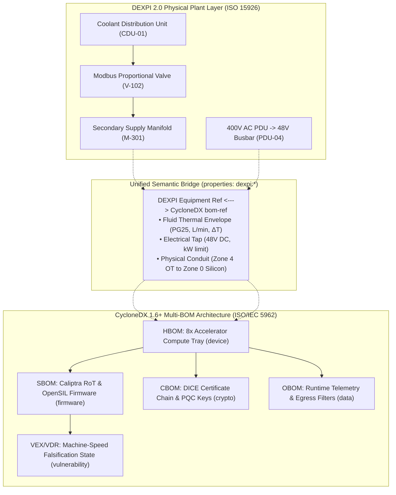

# Unified DEXPI 2.0 & CycloneDX 1.6+ Specification
## Bridging Physical Plant Engineering (P&ID/OT) and Platform Cybersecurity (BOM) for the Cyber Digital Twin

**Standard Identifiers:** 
- Process / Physical: DEXPI 2.0 (ISO 15926) · OpenBIM IFC (ISO 16739)
- Cybersecurity / Supply Chain: CycloneDX 1.6 / 1.7 (ISO/IEC 5962 / ECMA-424) · IEC 62443-4-2 · EU CRA (Reg 2024/2847)

---

## 1. Executive Problem Statement: The Cyber-Physical Semantic Divide

Modern high-density critical infrastructure—such as 100kW+ liquid-cooled AI cluster datacenters, water treatment networks, and power generation facilities—suffers from a dangerous semantic disconnect between physical engineering and cybersecurity:

1. **The Physical Engineering Domain** speaks in Piping and Instrumentation Diagrams (P&IDs), DEXPI 2.0, mechanical tolerances, hydronic coolant loops (CDUs, heat exchangers, secondary manifolds, quick-disconnects), flow rates ($\text{L/min}$), fluid chemistry (PG25 water-glycol), pressure drops ($\text{bar}$), and delta-$T$ thermal dissipation envelopes.
2. **The Cybersecurity & Platform Domain** speaks in Software Bills of Materials (SBOMs), Hardware Bills of Materials (HBOMs), Cryptographic Assets (CBOMs), firmware hashes, DICE certificate chains, CVE vulnerability disclosures (VEX/VDR), and Zero Trust network policies.

In practice, facility engineers hand security teams static 2D PDF drawings, while security teams hand facility teams static compliance checklists. When an adversary compromises an operational technology conduit (e.g. Modbus/BACnet cooling valves, smart power distribution units, or BMCs), **neither team possesses an integrated, machine-readable graph to compute the physical-to-digital blast radius**.



---

## 2. Multi-BOM Architecture (CycloneDX 1.6 / 1.7)

CycloneDX 1.6+ natively supports multi-dimensional component categorization within a single JSON artifact. In the Cyber Digital Twin, we leverage all 6 BOM layers:

| BOM Layer | CycloneDX Component `type` | What It Encodes in the Digital Twin | Governing Standard |
|:---|:---|:---|:---|
| **HBOM** (Hardware) | `device`, `hardware` | Silicon packages, multi-chiplet GPUs, host CPUs, DPUs, motherboard ASICs, connector part numbers, and board layout physical locations. | OCP SAFE, IEEE 1680 |
| **SBOM** (Software & Firmware) | `firmware`, `library`, `application` | Caliptra Silicon Root of Trust (ROM/FMC/runtime), open-source OpenSIL initialization code, OpenBMC, host Linux kernels, ROCm/CUDA acceleration drivers, and container runtimes. | CycloneDX 1.6, SPDX |
| **CBOM** (Cryptography) | `cryptographic-asset` | On-die asymmetric key pairs, DICE device secret identities, certificate hierarchies, and post-quantum cryptography (PQC) readiness (LMS, ML-DSA-87). | CycloneDX 1.6 CBOM, NIST SP 800-208 |
| **MBOM** (Manufacturing) | `component` / `metadata.manufacturer` | 6-site manufacturing HSM key provisioning audit, wafer lot provenance, fab identity, packaging date, and ODM supply chain chain-of-custody. | EU CRA Annex I/II, ISO 20243 |
| **OBOM** (Operations) | `data`, `service` | Runtime operational parameters, power draw limits, dynamic thermal envelopes, non-token egress filter rules, and out-of-band telemetry thresholds. | IEC 62443-3-3, ISO 27001 |
| **SaaSBOM** (Interfaces) | `service` | Remote baseboard management endpoints (Redfish), Modbus/BACnet facility telemetry feeds, and facility OT monitoring conduits. | CycloneDX 1.6 Service BOM |
| **VEX / VDR** | `vulnerabilities` | Vulnerability Exploitability eXchange and Vulnerability Disclosure Reports enabling automated, machine-speed exploit falsification. | CISA VEX, EU CRA Art. 14 |

---

## 3. The Concrete DEXPI <-> CycloneDX Linkage Specification

To establish a bidirectional topological graph, CycloneDX components representing physical hardware (`device`) are augmented with standardized `properties` under the `dexpi:` namespace:

```json
{
  "type": "device",
  "bom-ref": "tray-r04-t02",
  "name": "Frontier AI 8x Multi-Chiplet Accelerator Compute Tray",
  "version": "Rev-3B",
  "properties": [
    {
      "name": "dexpi:plant:equipmentId",
      "value": "EQUIP-TRAY-R04-T02",
      "description": "Matching Equipment Object ID in the DEXPI 2.0 P&ID XML model"
    },
    {
      "name": "dexpi:cooling:supplyNozzle",
      "value": "NOZZLE-QD-IN-R04-02",
      "description": "P&ID Quick-Disconnect Coolant Inflow Port"
    },
    {
      "name": "dexpi:cooling:returnNozzle",
      "value": "NOZZLE-QD-OUT-R04-02",
      "description": "P&ID Quick-Disconnect Coolant Outflow Port"
    },
    {
      "name": "dexpi:cooling:designFlowRateLpm",
      "value": "38.5",
      "description": "Required volumetric flow rate of PG25 water-glycol"
    },
    {
      "name": "dexpi:cooling:maxInletTempC",
      "value": "32.0",
      "description": "Maximum allowable liquid coolant supply temperature"
    },
    {
      "name": "dexpi:power:busbarInfeed",
      "value": "BUSBAR-48V-R04-TAP02",
      "description": "Electrical connection to rack-level 48V DC busbar"
    },
    {
      "name": "dexpi:power:ratedKw",
      "value": "10.5",
      "description": "Peak electrical power consumption of compute tray"
    },
    {
      "name": "dexpi:zone:purdueLevel",
      "value": "Zone-1",
      "description": "IEC 62443 / AI Rack Envelope Zone designation"
    }
  ]
}
```

---

## 4. Digital Twin Simulation Use Case: Cyber-Physical Cascading Failure

With this unified format, the Eigenia Cyber Digital Twin can simulate cascading failures that cross the physical and digital boundaries:

1. **Adversary Intrusion (Layer 4)**: Threat actor targets unauthenticated Modbus/BACnet controller on Zone 4 (Facility OT).
2. **Physical Actuation (DEXPI Layer 0/1)**: Modbus command forces valve `V-102` partially closed; coolant flow rate to Rack 4 drops from $38.5\,\text{L/min}$ to $8.2\,\text{L/min}$.
3. **Hydronic & Thermal Propagation**: DEXPI model calculates reduced heat transfer coefficient across plate heat exchanger `HEX-201`; tray inlet temperature spikes from $32^\circ\text{C}$ to $58^\circ\text{C}$.
4. **Silicon Boundary Response (CycloneDX HBOM/SBOM Layer 2)**: Caliptra Silicon RoT monitors internal junction sensors; accelerator chiplet reaches $94^\circ\text{C}$ critical threshold.
5. **Operational Cascade (CycloneDX OBOM Layer 3)**: Automatic thermal throttling engages; inference latency escalates by 840%, triggering an S-Curve catastrophe across downstream critical infrastructure dependencies.
