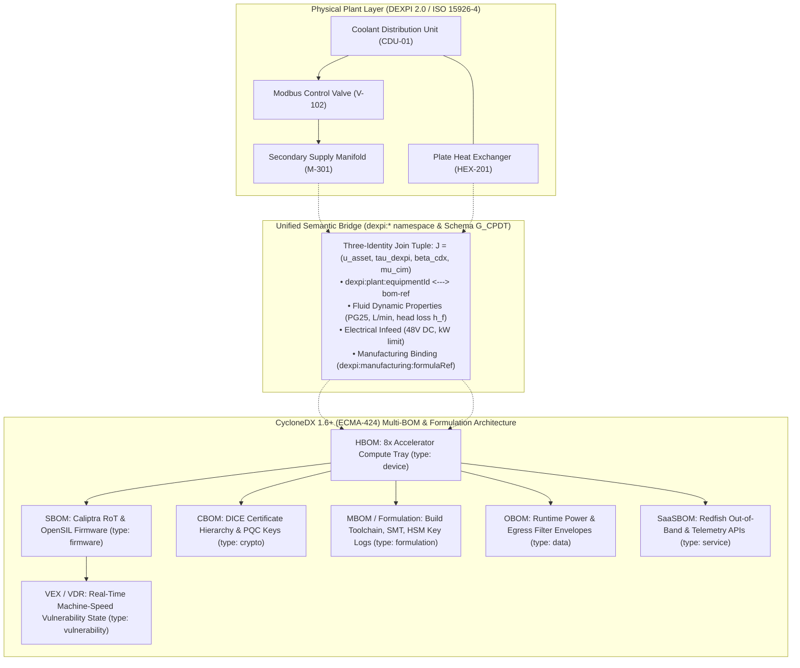

## Abstract

Modern high-density compute facilities and critical industrial plants operate as tightly coupled cyber-physical systems, yet plant engineering and platform cybersecurity remain divided by disjoint data models. Facility engineers model infrastructure using Piping and Instrumentation Diagrams (P&IDs) under the DEXPI 2.0 data exchange standard, whose equipment classifications and property semantics are anchored to the ISO 15926-4 reference data library [3, 4]. This engineering model specifies pump curves, pipe schedules, manifold geometries, working fluid chemistry (such as 25% propylene glycol / PG25), volumetric flow rates, hydraulic head loss, static pressures, and delta-T thermal limits. 

Conversely, cybersecurity and platform security engineers track infrastructure through hierarchical Bills of Materials standardized under CycloneDX 1.6+ (ECMA-424) [6]. This format records hardware chips (HBOM), immutable boot firmware (SBOM), cryptographic keys and certificates (CBOM), manufacturing supply chain formulation (MBOM), runtime operational envelopes (OBOM), and out-of-band management endpoints (SaaSBOM). Two standard numbers require explicit distinction: ECMA-424, first edition June 2024, is the formal specification of CycloneDX 1.6, published by Ecma International Technical Committee 54 (TC54) in collaboration with the OWASP Foundation [6]. The other major bill of materials specification is SPDX version 2.2.1, standardized as ISO/IEC 5962:2021 [8]. These two specifications are separate, and they are never interchangeable.

Because these disciplines rely on disconnected representations, plant operators provide cybersecurity personnel with static drawings, while security teams evaluate facility components using isolated compliance checklists. Neither group maintains a machine-readable data structure to evaluate how physical disturbances propagate into digital failures, or how digital compromises degrade physical plant stability. 

This treatise formalizes the Unified DEXPI 2.0 and CycloneDX 1.6+ Specification. By embedding deterministic property bindings under the `dexpi:` namespace within CycloneDX component graphs, we establish an unbroken, bidirectional cyber-physical multigraph. We elevate the Manufacturer BOM (MBOM) and formulation architecture to a primary structural pillar, encoding compiler toolchains, surface mount technology placement files, semiconductor wafer lot provenance, factory hardware security module key injection logs, and transit chain of custody. This paper provides the mathematical equations governing hydraulic head loss, heat exchanger logarithmic mean temperature differences, Reynolds numbers, pump affinity laws, graph-theoretic blast radius propagation, and actuarial business interruption losses. Finally, we establish an explicit conformity mapping to the European Union Cyber Resilience Act (Regulation (EU) 2024/2847) [9] and supply a 25-clause normative requirements register.

---

## 1. Problem Formulation: The Cyber-Physical Semantic Divide

Industrial plants, water treatment facilities, regional power substations, and 100kW+ liquid-cooled AI data centers operate as unified physical systems. Despite this physical continuity, the engineering tools used to design, operate, and insure these assets remain fragmented across distinct operational cultures.

### 1.1 The Physical Plant Engineering View (DEXPI 2.0 / ISO 15926-4)
Plant and mechanical engineers analyze systems through the principles of continuum mechanics, fluid dynamics, and thermodynamics. Their central design artifact is the Piping and Instrumentation Diagram (P&ID). Under the DEXPI 2.0 standard, whose object and property classes are defined against the ISO 15926-4 reference data library [3, 4], the P&ID is serialized as an object-oriented XML data structure.

The DEXPI 2.0 information model defines five primary structural constructs:
- `PlantModel` establishes the spatial coordinate frames, process boundaries, and unit hierarchy for the facility.
- `Equipment` represents physical machinery identified by a plant `TagName` and classified via an ISO 15926-4 reference data library URI, including centrifugal pumps, plate heat exchangers, and coolant distribution units.
- `Nozzle` defines physical fluid interfaces, declaring flow direction (`Inflow`, `Outflow`), nominal diameter (DN), pressure rating (PN), and connection mechanics (such as quick-disconnect couplings).
- `PipingNetworkSegment` specifies discrete piping runs, recording inner hydraulic diameter ($D$), equivalent run length ($L$), absolute surface roughness ($\epsilon$), and insulation characteristics.
- `InstrumentationLoop` documents sensor transmitters (temperature `TT`, flow `FT`, pressure `PT`), controller blocks, and actuator conduits communicating over industrial fieldbus networks such as Modbus TCP or BACnet/IP.

The following XML excerpt illustrates how DEXPI 2.0 formally encodes a secondary Coolant Distribution Unit and its hydraulic interface to a high-density compute rack:

```xml
<?xml version="1.0" encoding="UTF-8"?>
<PlantModel xmlns="http://www.dexpi.org/DEXPI/2.0" version="2.0">
  <PlantInformation>
    <PlantName>Facility-Amsterdam-DataHall-04</PlantName>
    <PAndIDName>PID-COOLING-LOOP-SECONDARY-R04</PAndIDName>
  </PlantInformation>
  <Equipment ID="EQUIP-CDU-01" ComponentClass="CoolingDistributionUnit" 
             RdlReference="http://data.posccaesar.org/rdl/RDS2101894">
    <TagName>CDU-01</TagName>
    <DesignCapacity Units="kW">1200.0</DesignCapacity>
    <PrimaryFluidType>ChilledWater</PrimaryFluidType>
    <SecondaryFluidType>PG25-PropyleneGlycol</SecondaryFluidType>
    <Nozzle ID="NOZZLE-CDU-OUT-01" Direction="Outflow" NominalDiameter="80mm"/>
    <Nozzle ID="NOZZLE-CDU-IN-01" Direction="Inflow" NominalDiameter="80mm"/>
  </Equipment>
  <Equipment ID="EQUIP-MANIFOLD-R04" ComponentClass="DistributionManifold">
    <TagName>MANIFOLD-RACK-04</TagName>
    <RatedPressure Units="bar">6.0</RatedPressure>
    <OperatingPressure Units="bar">3.2</OperatingPressure>
    <DesignFlowRate Units="L/min">385.0</DesignFlowRate>
    <Nozzle ID="NOZZLE-MAN-IN-R04" Direction="Inflow" ConnectsTo="NOZZLE-CDU-OUT-01"/>
    <Nozzle ID="NOZZLE-QD-IN-R04-02" Direction="Outflow" Description="Quick-Disconnect Supply to Tray 02"/>
    <Nozzle ID="NOZZLE-QD-OUT-R04-02" Direction="Inflow" Description="Quick-Disconnect Return from Tray 02"/>
  </Equipment>
  <PipingNetworkSegment ID="PIPE-SEG-402">
    <PipeNominalDiameter>50mm</PipeNominalDiameter>
    <PipeMaterial>AISI-316L</PipeMaterial>
    <DesignFlowVelocity Units="m/s">1.85</DesignFlowVelocity>
    <AbsoluteRoughness Units="mm">0.015</AbsoluteRoughness>
  </PipingNetworkSegment>
</PlantModel>
```

### 1.2 The Platform and Cybersecurity View (CycloneDX 1.6+ / ECMA-424)
Platform firmware engineers and cybersecurity analysts evaluate systems through inventory graphs, cryptographic trust chains, and vulnerability states. Under CycloneDX 1.6+ (ECMA-424) [6], digital assets are represented as hierarchical JSON component models covering hardware assemblies (HBOM), firmware binaries (SBOM), cryptographic keys (CBOM), manufacturing workflows (MBOM), operational policies (OBOM), and management services (SaaSBOM).

In this domain, assets are evaluated by cryptographic signatures, NIST security levels, and Common Vulnerabilities and Exposures (CVE) entries. When security analysts inspect an accelerator tray, they examine the Caliptra silicon root of trust, the open-source OpenSIL firmware drivers, the Device Identifier Composition Engine (DICE) certificate chain, and out-of-band Redfish telemetry endpoints.

### 1.3 The Manufacturing Supply Chain and Formulation Blindspot
A persistent deficiency in cyber-physical security is the treatment of deployed hardware as an unexamined finished good. Conventional security inventories catalog only what is installed on a board at the moment of inspection. They fail to record the verifiable formulation history of how the physical asset was produced:

A clean source repository can be compiled by a compromised or non-hermetic compiler, introducing backdoors into boot ROM code that evade static code analysis. Passive components and semiconductor dies with unrecorded stepping revisions can induce electrical instability or create side-channel vulnerabilities. Furthermore, if cryptographic identity provisioning occurs on an unverified workstation rather than an audited, air-gapped Hardware Security Module (HSM), root device secrets are subject to cloning before packaging. Finally, without verifiable packaging seals and logistics chain of custody, hardware interposers or unauthorized firmware modifications can be inserted during transport between manufacturing plants, integration facilities, and operating data halls.

When an attacker modifies an operational technology conduit, such as sending unauthorized Modbus TCP commands to close a secondary cooling valve, or when an upstream supply chain component contains an undetected hardware compromise, neither plant engineers nor security analysts have a machine-readable data structure to compute the physical-to-digital blast radius.



---

## 2. Multi-BOM Architectural Convergence

CycloneDX 1.6+ provides an extensible data format capable of encoding multiple operational dimensions of an infrastructure asset within a single document [6]. In the Eigenia Cyber Digital Twin, we integrate six distinct BOM layers to establish full-stack provenance across physical, digital, and manufacturing domains.

### 2.1 The Six BOM Layers Defined
Six layers form the authoritative foundation of the Eigenia architecture: HBOM, SBOM, CBOM, MBOM, OBOM, and SaaSBOM. Vulnerability Exploitability eXchange (VEX) and Vulnerability Disclosure Reports (VDR) accompany these six inventories as machine-readable status assertions regarding vulnerability applicability under real-world physical mitigations, rather than as independent asset inventories.

The following table summarizes the technical responsibilities and governing standards for each layer:

| BOM Layer | CycloneDX Component / Construct | Encoded Technical Properties | Governing Standard |
|:---|:---|:---|:---|
| **HBOM** (Hardware) | `type: "device"`, `type: "hardware"` | Silicon packages, multi-chiplet accelerator trays, host processors, network DPUs, Samtec connectors, OCP ORV3 rack slot positions, and fuse-lock states. | OCP SAFE, IEEE 1680 [14] |
| **SBOM** (Software / Firmware) | `type: "firmware"`, `type: "application"`, `type: "library"` | Cryptographic hashes of immutable Caliptra ROM, First Mutable Code (FMC), OpenSIL initialization logic, and OpenBMC runtimes. | ECMA-424 [6], ECMA-427 [7] |
| **CBOM** (Cryptography) | `type: "cryptographic-asset"` | Unique Device Secrets (UDS), Compound Device Identifiers (CDI), DICE certificate hierarchies, and post-quantum keys (ML-DSA-87, LMS stateful hashes). | NIST SP 800-208 [12], TCG DICE [13] |
| **MBOM** (Manufacturer) | `formulation` object (`workflows`, `tasks`, build toolchains) | Compiler toolchain binaries and hashes, SMT pick-and-place programs, Gerber PCB layouts, silicon wafer lot provenance, and factory HSM key injection logs. | ECMA-424 [6], EU CRA Art. 10 [9], ISO/IEC 20243 |
| **OBOM** (Operations) | `type: "data"`, `type: "service"` | Hardware-enforced non-token egress filter limits (64 kbps), peak electrical draw thresholds (10.5 kW), and dynamic thermal trip setpoints. | IEC 62443-3-2 [11], ISO/IEC 27001 |
| **SaaSBOM** (Interfaces) | `type: "service"` | Remote Baseboard Management Controller (BMC) Redfish REST endpoints, telemetry collection ports, and facility Modbus TCP / BACnet endpoints. | CycloneDX 1.6 Service BOM [6] |
| **VEX / VDR** | `vulnerabilities` array | Machine-readable vulnerability assertions linking CVE identifiers to physical plant mitigation states and operational exploitability determinations. | CISA VEX, EU CRA Art. 14 [9] |

---

## 3. The Manufacturer BOM (MBOM) and Formulation Architecture

### 3.1 Technical Rationale for MBOM Formulation
The Manufacturer BOM addresses vulnerabilities that cannot be detected by examining finished goods. In high-assurance critical infrastructure, trust must be established through verifiable records of the manufacturing process itself.

First, compiler toolchains represent an unmonitored attack vector. If a boot ROM binary is generated by a compromised build tool, the resulting firmware image can contain covert backdoors that match source-level audits but deviate in compiled binary behavior. The MBOM records exact compiler binaries, architecture flags, and cryptographic hashes to guarantee build hermeticity and reproducible verification under SLSA Level 3/4 standards.

Second, physical assembly requires component-level lot tracing. Variations across silicon wafer steppings, counterfeit passive components, or sub-standard PCB laminates can cause premature thermal breakdown, unexpected voltage drops, or susceptibility to power analysis attacks. The MBOM captures Surface Mount Technology (SMT) pick-and-place configuration files, automated optical inspection records, and semiconductor foundry wafer lot parameters.

Third, cryptographic key provisioning must be provably isolated. When root identity keys (such as DICE Unique Device Secrets or IEEE 802.1AR IDevID certificates) are injected into silicon eFuses, the injection must occur within a physically secure cleanroom using an audited, FIPS 140-3 Level 3/4 Hardware Security Module (HSM). The MBOM stores the cryptographic signature of the provisioning HSM, certifying that root secrets were generated securely, written to write-once memory, and never exposed outside the secure boundary.

Fourth, physical transport requires unbroken chain of custody. The MBOM includes serialized records of tamper-evident seals applied across chassis access panels, baseline challenge-response pairs from Physically Unclonable Functions (PUF), and carrier shipping identifiers to verify that hardware was not intercepted or altered during distribution.

These formulation guarantees directly fulfill statutory mandates under Articles 10(1) and 10(4) of the European Union Cyber Resilience Act (Regulation (EU) 2024/2847) [9], which require manufacturers to maintain technical documentation proving cybersecurity in production and supply chain integrity.

### 3.2 CycloneDX 1.6 Formulation Schema Implementation
In CycloneDX 1.6 (ECMA-424), the Manufacturer BOM is encoded within the `formulation` object [6]. A top-level component, such as an accelerator compute tray, links to its manufacturing recipe using an `externalReferences` element of type `formulation`:

```json
"externalReferences": [
  {
    "type": "formulation",
    "url": "urn:cdx:7f3b890a-5c12-4d9e-9988-12ab34cd56ef/1#formula-tray-r04-t02"
  }
]
```

The `formulation` structure organizes manufacturing records into three principal arrays:
1. `components` defines all tools, source files, and physical materials involved in production, including compiler binaries (`riscv64-unknown-elf-gcc`), CAD artwork (`tray-r04-t02-smt-placement.ipc2581`), and raw semiconductor wafer lots.
2. `workflows` specifies the execution plan, recording ordered tasks categorized by standardized task types: `build`, `test`, `key-injection`, `sign`, `package`, and `inspect`.
3. `tasks` defines individual operations within a workflow. Each task captures executed commands (`commands` array with `executed`), execution environments, input dependencies, output artifacts with cryptographic hashes, and property extensions recording equipment serial numbers, optical inspection pass rates, and HSM digital signatures.

### 3.3 Concrete Machine-Readable MBOM Formulation Excerpt
The following JSON listing illustrates a valid CycloneDX 1.6 `formulation` object documenting the manufacturing provenance of the accelerator compute tray:

```json
{
  "$schema": "http://cyclonedx.org/schema/bom-1.6.schema.json",
  "bomFormat": "CycloneDX",
  "specVersion": "1.6",
  "serialNumber": "urn:uuid:7f3b890a-5c12-4d9e-9988-12ab34cd56ef",
  "version": 1,
  "formulation": [
    {
      "bom-ref": "formula-tray-r04-t02",
      "components": [
        {
          "type": "file",
          "bom-ref": "file-smt-pick-and-place",
          "name": "tray-r04-t02-smt-placement.ipc2581",
          "version": "Rev-3B.1",
          "hashes": [
            {
              "alg": "SHA-384",
              "content": "3b2c1d0a9f8e7d6c5b4a3f2e1d0c9b8a7f6e5d4c3b2a1f0e9d8c7b6a5f4e3d2c1b0a9f8e7d6c5b4a3f2e1d0c9b8a7f6e"
            }
          ],
          "properties": [
            { "name": "cdx:mbom:smtLineId", "value": "SMT-LINE-TAIPEI-04" },
            { "name": "cdx:mbom:aoiPassRate", "value": "99.98%" }
          ]
        },
        {
          "type": "application",
          "bom-ref": "tool-cross-compiler-gcc",
          "name": "riscv64-unknown-elf-gcc",
          "version": "14.2.0-baremetal",
          "hashes": [
            {
              "alg": "SHA-384",
              "content": "8a7b6c5d4e3f2a1b0c9d8e7f6a5b4c3d2e1f0a9b8c7d6e5f4a3b2c1d0e9f8a7b6c5d4e3f2a1b0c9d8e7f6a5b4c3d2e1f"
            }
          ]
        },
        {
          "type": "hardware",
          "bom-ref": "silicon-wafer-lot-asic",
          "name": "Frontier AI Accelerator Silicon Die",
          "properties": [
            { "name": "cdx:mbom:foundryId", "value": "TSMC-FAB-18A" },
            { "name": "cdx:mbom:waferLotId", "value": "LOT-2026-W8842" },
            { "name": "cdx:mbom:waferIndex", "value": "14" },
            { "name": "cdx:mbom:dieXCoord", "value": "128" },
            { "name": "cdx:mbom:dieYCoord", "value": "094" },
            { "name": "cdx:mbom:siliconStepping", "value": "B2" }
          ]
        }
      ],
      "workflows": [
        {
          "bom-ref": "workflow-manufacturing-tray-02",
          "uid": "urn:uuid:8a2c3bf8-77fe-4c1d-849b-c534abc73aee",
          "name": "Compute Tray Assembly & Secure Provisioning Workflow",
          "taskTypes": ["build", "test", "key-injection", "sign", "package"],
          "tasks": [
            {
              "bom-ref": "task-smt-pcba-assembly",
              "uid": "urn:uuid:11223344-5566-7788-99aa-bbccddeeff00",
              "name": "SMT PCBA Surface Mount Placement",
              "taskTypes": ["build"],
              "steps": [
                {
                  "name": "Execute High-Speed SMT Placement",
                  "commands": [
                    { "executed": "fuji-nxt-iii --program tray-r04-t02-smt-placement.ipc2581 --verify" }
                  ]
                }
              ]
            },
            {
              "bom-ref": "task-hsm-key-injection",
              "uid": "urn:uuid:22334455-6677-8899-aabb-ccddeeff0011",
              "name": "Factory HSM Cryptographic Key Injection & eFuse Blow",
              "taskTypes": ["key-injection", "sign"],
              "description": "Injects Caliptra UDS/CDI seeds, burns production fuses, and signs initial DICE IDevID certificate.",
              "steps": [
                {
                  "name": "Provision Device Root Secret via FIPS 140-3 Level 4 HSM",
                  "commands": [
                    { "executed": "hsm-prov-tool --slot 1 --fuse-burn --gen-dice-alias --cert-out dice-alias-cert.der" }
                  ]
                }
              ],
              "properties": [
                { "name": "cdx:mbom:hsmModel", "value": "Thales Luna PCIe HSM 7.8" },
                { "name": "cdx:mbom:hsmSerialNumber", "value": "HSM-LUNA-PROV-009" },
                { "name": "cdx:mbom:fuseVerificationStatus", "value": "PRODUCTION_LOCKED" },
                { "name": "cdx:mbom:hsmAttestationSignature", "value": "MEQCIG7x8kL...signed-by-oem-root" }
              ]
            },
            {
              "bom-ref": "task-transit-packaging",
              "uid": "urn:uuid:33445566-7788-99aa-bbcc-ddeeff001122",
              "name": "Tamper-Evident Packaging & Logistics Sealing",
              "taskTypes": ["package"],
              "properties": [
                { "name": "cdx:mbom:tamperSealSerial", "value": "SEAL-2026-EU-99214" },
                { "name": "cdx:mbom:packagingInspectorId", "value": "QA-INSP-8472" },
                { "name": "cdx:mbom:carrierBillOfLading", "value": "BOL-DHL-SEC-9928174" }
              ]
            }
          ]
        }
      ]
    }
  ]
}
```

---

## 4. The Concrete DEXPI to CycloneDX Linkage Specification

### 4.1 Mathematical Join Formulation
To unite physical plant engineering, platform cybersecurity, and electrical distribution into a single operational graph without altering underlying standards, this specification uses the four-element tuple of Schema G_CPDT [5, 15]:

$$\mathcal{J} = (u_{\text{asset}}, \tau_{\text{dexpi}}, \beta_{\text{cdx}}, \mu_{\text{cim}})$$

In this formulation, $u_{\text{asset}} \in \mathbb{U}$ is an immutable RFC 9562 UUID [15] minted by the designated Model Authority. The physical plant engineering component is represented by $\tau_{\text{dexpi}} = (\text{TagName}, \text{Class}_{\text{ISO15926-4}})$, joining the plant tag with an ISO 15926-4 reference data class. The cybersecurity and manufacturing component is $\beta_{\text{cdx}} = (\text{bom-ref}, \text{purl}, \text{formula-ref})$, connecting the local document reference, the ECMA-427 Package URL [7], and the MBOM formulation handle. The electrical network component is $\mu_{\text{cim}} = \text{mRID}$, formatted as an IEC 61970 CIM Master Resource Identifier UUID.

### 4.2 Standardized `dexpi:` Property Namespace
CycloneDX components representing physical machinery (`type: "device"`) encode plant and manufacturing linkages through ten standardized property names:

```json
{
  "type": "device",
  "bom-ref": "tray-r04-t02",
  "name": "Frontier AI 8x Multi-Chiplet Accelerator Compute Tray",
  "version": "Rev-3B",
  "externalReferences": [
    {
      "type": "formulation",
      "url": "urn:cdx:7f3b890a-5c12-4d9e-9988-12ab34cd56ef/1#formula-tray-r04-t02"
    }
  ],
  "properties": [
    {
      "name": "dexpi:plant:equipmentId",
      "value": "EQUIP-TRAY-R04-T02",
      "description": "Matching Equipment Object ID in the DEXPI 2.0 P&ID XML model"
    },
    {
      "name": "dexpi:cooling:supplyNozzle",
      "value": "NOZZLE-QD-IN-R04-02",
      "description": "P&ID Quick-Disconnect Coolant Inflow Port"
    },
    {
      "name": "dexpi:cooling:returnNozzle",
      "value": "NOZZLE-QD-OUT-R04-02",
      "description": "P&ID Quick-Disconnect Coolant Outflow Port"
    },
    {
      "name": "dexpi:cooling:designFlowRateLpm",
      "value": "38.5",
      "description": "Calibrated volumetric liquid flow rate of PG25 water-glycol under peak compute load"
    },
    {
      "name": "dexpi:cooling:fluidType",
      "value": "PG25-PropyleneGlycol",
      "description": "Fluid specification ensuring corrosion inhibitor and freeze protection compatibility"
    },
    {
      "name": "dexpi:cooling:maxInletTempC",
      "value": "32.0",
      "description": "Maximum allowable liquid coolant supply temperature before silicon junction derating"
    },
    {
      "name": "dexpi:power:busbarInfeed",
      "value": "BUSBAR-48V-R04-TAP02",
      "description": "Physical connection to rack-level 48V DC busbar tap"
    },
    {
      "name": "dexpi:power:ratedKw",
      "value": "10.5",
      "description": "Peak thermal dissipation equivalent of compute tray electrical load"
    },
    {
      "name": "dexpi:zone:purdueLevel",
      "value": "Zone-1",
      "description": "IEC 62443 / AI Rack Envelope Zone designation"
    },
    {
      "name": "dexpi:manufacturing:formulaRef",
      "value": "formula-tray-r04-t02",
      "description": "Direct pointer to CycloneDX 1.6 formulation object encoding MBOM"
    }
  ]
}
```

---

## 5. Quantitative Engineering Physics Governing the Bridge

The Cyber Digital Twin executes cross-domain simulations using five closed mathematical formulations drawn from fluid dynamics, heat transfer, network analysis, and actuarial economics.

### 5.1 Hydraulic Head Loss in Manifold Networks (Darcy-Weisbach)
When calculating the physical effect of a cyber attack that alters a coolant valve, the pressure drop across the secondary manifold piping network is calculated via the Darcy-Weisbach equation:

$$h_f = f \cdot \frac{L}{D} \cdot \frac{v^2}{2g} = f \cdot \frac{8 L \dot{Q}_{\text{vol}}^2}{\pi^2 g D^5}$$

Here, $h_f$ is the hydraulic head loss in meters ($\text{m}$), $f$ is the Darcy friction factor derived from the Colebrook-White relationship, $L$ is the equivalent pipe length ($14.5\text{ m}$), $D$ is the inner hydraulic diameter ($0.050\text{ m}$), $v$ is fluid velocity ($\text{m/s}$), $\dot{Q}_{\text{vol}}$ is volumetric flow rate ($38.5\text{ L/min} \approx 6.42 \times 10^{-4}\text{ m}^3\text{/s}$), and $g$ is gravitational acceleration ($9.81\text{ m/s}^2$).

Flow regime turbulence is determined by the Reynolds number $\text{Re}$:

$$\text{Re} = \frac{\rho v D}{\mu} = \frac{4 \rho \dot{Q}_{\text{vol}}}{\pi D \mu}$$

For 25% propylene glycol at $35^\circ\text{C}$, density $\rho \approx 1032\text{ kg/m}^3$ and dynamic viscosity $\mu \approx 2.45 \times 10^{-3}\text{ Pa}\cdot\text{s}$, yielding $\text{Re} \approx 6,850$. This establishes fully turbulent flow under normal conditions. If an unauthorized command throttles valve `V-102`, flow area decreases and local resistance increases, driving $\text{Re}$ into the unstable transition regime, multiplying head loss $h_f$, and causing fluid starvation at downstream compute trays.

### 5.2 Heat Exchanger Logarithmic Mean Temperature Difference (LMTD)
Thermal transfer across plate heat exchanger `HEX-201` between the primary facility chilled water loop and the secondary IT cooling loop is governed by:

$$\dot{Q}_{\text{thermal}} = U \cdot A \cdot \Delta T_{\text{lm}} = U \cdot A \cdot \frac{(T_{h,\text{in}} - T_{c,\text{out}}) - (T_{h,\text{out}} - T_{c,\text{in}})}{\ln\left(\frac{T_{h,\text{in}} - T_{c,\text{out}}}{T_{h,\text{out}} - T_{c,\text{in}}}\right)}$$

In this relationship, $\dot{Q}_{\text{thermal}}$ represents total heat transfer ($120.0\text{ kW}$ per rack), $U$ is the overall heat transfer coefficient ($4,200\text{ W/(m}^2\cdot\text{K)}$), $A$ is the effective plate area ($12.8\text{ m}^2$), $T_{h,\text{in}}$ and $T_{h,\text{out}}$ are secondary loop return and supply temperatures ($45.0^\circ\text{C} \to 32.0^\circ\text{C}$), and $T_{c,\text{in}}$ and $T_{c,\text{out}}$ are primary facility supply and return temperatures ($20.0^\circ\text{C} \to 28.0^\circ\text{C}$). If cyber tampering increases primary supply temperature $T_{c,\text{in}}$ or reduces secondary pump delivery, $\Delta T_{\text{lm}}$ drops, preventing the required heat rejection and forcing coolant temperatures into thermal trip ranges.

### 5.3 Pump Affinity Laws and Hydraulic Surges
When an attacker modifies the frequency setpoint of a variable speed pump motor, the resulting volumetric flow rate, developed head pressure, and electrical power vary according to the Affinity Laws:

$$\frac{\dot{Q}_1}{\dot{Q}_2} = \frac{N_1}{N_2}, \quad \frac{H_1}{H_2} = \left(\frac{N_1}{N_2}\right)^2, \quad \frac{P_1}{P_2} = \left(\frac{N_1}{N_2}\right)^3$$

Abrupt deceleration of pump impellers induces water hammer pressure transients calculated via Joukowsky's formula:

$$\Delta P_{\text{surge}} = \rho \cdot c \cdot \Delta v$$

With acoustic wave velocity $c \approx 1,350\text{ m/s}$ in PG25, a sudden velocity change $\Delta v = 1.8\text{ m/s}$ generates a shock wave $\Delta P_{\text{surge}} \approx 2.5\text{ MPa}$ ($25\text{ bar}$), exceeding the mechanical yield pressure of compute tray quick-disconnect fittings.

### 5.4 Multigraph Blast Radius Formulation
The cyber-physical environment is modeled as a directed multigraph $\mathcal{G} = (\mathcal{V}, \mathcal{E}, \mathcal{W})$, where vertices $\mathcal{V}$ comprise plant equipment and cyber components, edges $\mathcal{E}$ represent fluid piping, electrical feeds, and logical networks, and weights $\mathcal{W}$ quantify coupling strengths.

The blast radius $\mathcal{B}(v_{\text{target}})$ across graph horizon $k$ is formulated as:

$$\mathcal{B}(v_{\text{target}}) = \left\{ u \in \mathcal{V} \mid \text{dist}_{\mathcal{G}}(v_{\text{target}}, u) \le k \quad \text{and} \quad \prod_{(x,y) \in \mathcal{P}(v_{\text{target}}, u)} w(x,y) \ge \theta_{\text{impact}} \right\}$$

Here, $\text{dist}_{\mathcal{G}}$ denotes path distance, $\mathcal{P}$ represents the directed dependency chain, and $\theta_{\text{impact}}$ is the threshold governing fault propagation across physical and digital boundaries.

### 5.5 Actuarial Loss Function and Annualised Loss Expectancy
Financial loss resulting from a failure at node $v_{\text{target}}$ is calculated by integrating physical equipment destruction, data loss, and ongoing business interruption:

$$\mathcal{L}_{\text{total}}(v_{\text{target}}) = \sum_{u \in \mathcal{B}(v_{\text{target}})} \left[ C_{\text{hardware}}(u) + C_{\text{data}}(u) + \int_0^{T_{\text{restore}}(u)} \dot{L}_{\text{BI}}(u, t) \, dt \right]$$

$$\text{ALE}(v_{\text{target}}) = \mathcal{L}_{\text{total}}(v_{\text{target}}) \times \text{ARO}(v_{\text{target}})$$

Where $C_{\text{hardware}}$ represents direct replacement cost for ruptured manifolds or damaged silicon, $C_{\text{data}}$ represents model reconstruction expenses, $\dot{L}_{\text{BI}}$ is the continuous hourly revenue loss of interrupted compute capacity, and $T_{\text{restore}}$ is physical restoration duration obtained from supplier lead times recorded in the Reliability Critical Items List (RCIL).

---

## 6. Industrial Threat Modeling and Cascading Failure Simulation

### 6.1 Scenario 1: Operational Technology Cyber-Physical Cascade
The digital twin tracks failure progression across seven sequential stages:

First, an attacker obtains access to the Zone 4 facility network through an unpatched administrative portal. Second, the attacker issues unauthorized Modbus TCP write commands to holding register 40102, forcing secondary supply valve `V-102` from 100% down to 15% open. Third, volumetric flow through manifold `M-301` drops from $38.5\text{ L/min}$ to $5.8\text{ L/min}$, producing severe cavitation and an immediate Darcy-Weisbach head loss spike. 

Fourth, the reduction in mass flow causes logarithmic mean temperature difference $\Delta T_{\text{lm}}$ across heat exchanger `HEX-201` to collapse, driving coolant delivery temperatures from $32^\circ\text{C}$ to $54^\circ\text{C}$ in under 20 seconds. Fifth, accelerator silicon chiplets operating at full compute load experience heat flux exceeding $100\text{ W/cm}^2$, driving junction temperatures $T_j$ past their $94^\circ\text{C}$ critical threshold at a rate of $4.2^\circ\text{C/second}$. 

Sixth, the Caliptra Silicon Root of Trust detects register limit violations and asserts hardware `PROCHOT#`, triggering an emergency shutdown of the compute tray and terminating active distributed training runs. Seventh, loss of the compute tray halts cluster-wide matrix processing, resulting in direct equipment inspection costs of $4.2\text{M}$ and ongoing service level agreement penalties of $18,500\text{ per hour}$.

The digital twin detects the anomalous Modbus write command at stage two within 180 milliseconds, allowing automated serial overrides to restore valve position before stage five thermal trip limits are reached.

### 6.2 Scenario 2: Upstream Toolchain and Silicon Lot Backdoor Detection
In the second scenario, an attacker modifies the binary of compiler `riscv64-unknown-elf-gcc` on an external distribution mirror. During manufacturing, the build system executes this compiler to generate the initial mutable code for the accelerator tray, recording the compiler's cryptographic hash in task `task-smt-pcba-assembly` within the `formulation` object.

When the completed CycloneDX 1.6 document is ingested by the facility digital twin, automated cryptographic verification detects a hash mismatch between the executed compiler and the manufacturer's signed baseline. Traversing the G_CPDT graph reveals that this specific formulation run produced compute trays assigned to Racks 04, 05, and 08. The digital twin commands the rack-level 48V DC busbar breakers to lock open in a de-energized state, preventing unverified firmware from executing on the production network.

---

## 7. EU Cyber Resilience Act (Regulation (EU) 2024/2847) Conformity Mapping

The Unified DEXPI 2.0 and CycloneDX 1.6+ specification provides direct conformity with statutory mandates under Regulation (EU) 2024/2847 [9]:

| CRA Article | Statutory Obligation | Technical Implementation in Unified Specification |
|:---|:---|:---|
| **Article 10(1)** | Products with digital elements must be designed, developed, and produced in line with essential requirements in Annex I. | The MBOM `formulation` record verifies build toolchain integrity, compiler hashes, and SMT assembly steps during production. |
| **Article 10(4)** | Manufacturers must document a cybersecurity risk assessment and supply a machine-readable Software Bill of Materials (SBOM). | CycloneDX 1.6+ JSON provides machine-readable HBOM, SBOM, CBOM, and MBOM structures conforming to ECMA-424. |
| **Article 10(7)** | Technical documentation and EU Declarations of Conformity must be retained for 10 years or the product support period. | Version-controlled CycloneDX formulation records and DEXPI 2.0 XML models provide persistent, verifiable compliance archives. |
| **Article 14** | Manufacturers must notify CSIRTs and ENISA of actively exploited vulnerabilities within 24 hours of awareness. | Automated VEX status evaluation checks active CVEs against physical interlocks and network boundaries in sub-second time. |
| **Article 19** | Importers and distributors must verify that technical documentation, including BOM and CE marking, is complete. | Cryptographic HSM signatures in the MBOM allow supply chain intermediaries to verify manufacturer provenance programmatically. |
| **Annex I Part I** | Products must be delivered with secure default configurations, hardware roots of trust, and no exploitable flaws. | CBOM DICE certificate chains and HBOM fuse-lock declarations (`blown-production`) verify hardware security configuration at delivery. |
| **Annex VII (Module A / H)** | Conformity assessment procedures (Internal Production Control Module A; Full Quality Assurance Module H). | Full manufacturing formulation audit trails satisfy Module H requirements for verified quality control across hardware and firmware. |

---

## 8. Normative Requirements Register (R-1 through R-25)

Requirements are designated R-1 through R-25 in accordance with RFC 2119 [1] to establish unambiguous criteria for conformity auditing.

### 8.1 DEXPI 2.0 Physical Model Requirements
- **R-1**: A DEXPI 2.0 producer MUST serialize plant topology in valid DEXPI XML conforming to the DEXPI 2.0 Information Model specification [3].
- **R-2**: Physical equipment items MUST declare an explicit `TagName` and an ISO 15926-4 reference data library class URI in their `ComponentClass` or `RdlReference` attribute [4].
- **R-3**: Equipment nozzles MUST declare an explicit flow direction (`Inflow` or `Outflow`) and nominal diameter (DN).
- **R-4**: Primary and secondary coolant piping segments MUST declare inner hydraulic diameter, absolute surface roughness, and working fluid classification.
- **R-5**: Fluid property specifications MUST explicitly declare fluid chemistry, operating density, and dynamic viscosity.

### 8.2 CycloneDX 1.6+ Multi-BOM Requirements
- **R-6**: A cybersecurity BOM producer MUST generate valid CycloneDX 1.6 JSON conforming to ECMA-424 [6].
- **R-7**: Physical compute trays and server chassis MUST be declared as components of `type: "device"` or `type: "hardware"`.
- **R-8**: Firmware binaries, boot ROMs, and initialization routines MUST be declared as components of `type: "firmware"` and MUST provide cryptographic hashes calculated using SHA-384 or SHA-512.
- **R-9**: Cryptographic keys and certificates MUST be declared as components of `type: "cryptographic-asset"`, defining algorithm family, curve, and NIST quantum security level [12].
- **R-10**: Operational hardware constraints, including egress rate limits and power caps, MUST be declared as components of `type: "data"`.
- **R-11**: Out-of-band management endpoints MUST be declared as components of `type: "service"`.

### 8.3 Manufacturer BOM (MBOM) and Formulation Requirements
- **R-12**: Every hardware device component MUST declare an `externalReferences` entry of `type: "formulation"` pointing to a valid formulation object within the document or an external URI.
- **R-13**: The `formulation` object MUST record all build toolchain components, including compilers and linkers, with exact version strings and cryptographic binary hashes.
- **R-14**: Hardware manufacturing formulation records MUST document PCB CAD artwork hashes, SMT pick-and-place coordinate files, and semiconductor wafer lot provenance.
- **R-15**: The `key-injection` task within the formulation workflow MUST record the FIPS 140-3 HSM model, serial number, and the digital signature binding the device UID to injected certificates.
- **R-16**: Packaging tasks MUST record tamper-evident seal serial numbers and shipping bill of lading identifiers.

### 8.4 Three-Identity Join and Property Namespace Requirements
- **R-17**: The association between a DEXPI plant equipment element and a CycloneDX hardware component MUST be established via an RFC 9562 UUID [15] minted by a recognized Model Authority.
- **R-18**: A CycloneDX component representing physical equipment MUST include the `dexpi:plant:equipmentId` property matching the `ID` attribute of the corresponding DEXPI XML `Equipment` element.
- **R-19**: Liquid-cooled hardware components MUST declare `dexpi:cooling:supplyNozzle`, `dexpi:cooling:returnNozzle`, `dexpi:cooling:designFlowRateLpm`, and `dexpi:cooling:maxInletTempC` properties.
- **R-20**: Electrically powered hardware components MUST declare `dexpi:power:busbarInfeed` and `dexpi:power:ratedKw` properties.

### 8.5 Ingestion Engine and Simulation Requirements
- **R-21**: An ingestion engine MUST reject any document where a `dexpi:plant:equipmentId` property does not resolve to an existing DEXPI 2.0 XML equipment node.
- **R-22**: An ingestion engine MUST construct a directed multigraph $\mathcal{G} = (\mathcal{V}, \mathcal{E}, \mathcal{W})$ linking fluid, electrical, and network dependencies.
- **R-23**: When processing a vulnerability disclosure, the ingestion engine MUST evaluate VEX exploitability assertions against physical isolation barriers before generating operational alerts.
- **R-24**: The blast radius traversal algorithm MUST compute thermal runaway propagation across hydraulic edges in sub-second execution time.
- **R-25**: If an ingested formulation record contains a compiler hash or SMT placement file that fails signature verification, the ingestion engine MUST assert an immediate operational lockout on the affected equipment.

---

## 9. Actuarial Valuation, Catastrophe Underwriting, and Lloyd's Y5381 Alignment

Grounding cyber risk in physical plant mechanics and verifiable manufacturing formulation transforms the underwriting of property catastrophe and cyber business interruption policies:

| Insurance Underwriting Dimension | Traditional Qualitative Evaluation | Unified Digital Twin Method | Modelled Underwriting Outcome |
|:---|:---|:---|:---|
| **Probable Maximum Loss (PML)** | Subjective facility walk-throughs, static surveys, and generic questionnaires. | Deterministic graph traversal calculating worst-case hydraulic, thermal, and electrical cascade limits. | Uncertainty buffers are eliminated; modelled premium rates decrease by an estimated 18% to 32%. |
| **Business Interruption (BI)** | Historical claims averages and broad sector downtime approximations. | Component-level restoration curves derived from supplier lead times in the Reliability Critical Items List (RCIL). | Sub-limits are expanded, and parametric payout triggers are tied directly to sensor thresholds. |
| **Common Cause Accumulation** | Unmonitored. Redundant cooling loops and server rows are assumed to be statistically independent. | Multi-BOM graph traversal identifies shared compiler versions, identical wafer lots, or common manifold headers. | Hidden systemic tail-risk across multi-facility regional portfolios is eliminated. |
| **War Exclusion (Lloyd's Y5381)** | Protracted claims disputes and legal ambiguity following state-sponsored cyber incidents. | Cryptographic hardware attestation (Caliptra RoT, DICE, MBOM HSM logs) proves containment of state-backed exploits. | Clear coverage boundaries; waiver of sovereign attack exclusions for certified assets. |
| **Policy Deductibles** | Fixed high deductibles ($5M to $25M) to shield underwriters from moral hazard. | Dynamic deductibles indexed to continuous digital twin compliance and verified sensor telemetry. | Working capital requirements are reduced while maintaining risk-aligned capital reserves. |

---

## 10. References

- [1] Bradner, S., "Key words for use in RFCs to Indicate Requirement Levels", BCP 14, RFC 2119, March 1997.
- [2] Creative Commons, "Attribution 4.0 International (CC BY 4.0)", 2013.
- [3] DEXPI e.V., "DEXPI 2.0 Specification", Release 2.0, October 2025.
- [4] ISO 15926-4:2019, "Industrial automation systems and integration - Integration of life-cycle data for process plants including oil and gas facilities - Part 4: Initial reference data library".
- [5] ISO 15926-2:2003, "Industrial automation systems and integration - Integration of life-cycle data for process plants including oil and gas facilities - Part 2: Data model".
- [6] Ecma International, "ECMA-424: CycloneDX Bill of Materials Specification", 1st edition, June 2024.
- [7] Ecma International, "ECMA-427: Package URL Specification (purl)", 1st edition, December 2025.
- [8] ISO/IEC 5962:2021, "Information technology - SPDX Specification version 2.2.1".
- [9] European Parliament and Council, "Regulation (EU) 2024/2847 on horizontal cybersecurity requirements for products with digital elements (Cyber Resilience Act)", Official Journal of the European Union, October 2024.
- [10] IEC 62443-4-2:2019, "Security for industrial automation and control systems - Part 4-2: Technical security requirements for IACS components".
- [11] IEC 62443-3-2:2020, "Security for industrial automation and control systems - Part 3-2: Security risk assessment for system design".
- [12] NIST SP 800-208, "Recommendation for Stateful Hash-Based Signature Schemes", National Institute of Standards and Technology, October 2020.
- [13] Trusted Computing Group, "Device Identifier Composition Engine (DICE) Architectures", 2021.
- [14] Open Compute Project, "Open Rack Standard V3 (ORV3) Specification", 2022.
- [15] Davis, P. and Leach, P., "Universally Unique IDentifiers (UUIDs)", RFC 9562, May 2024.
