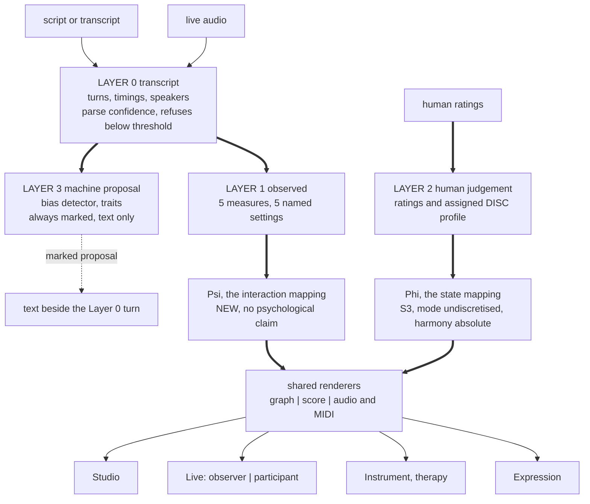

| Field | Value |
|:---|:---|
| Designation | MPN-DESIGN-01 |
| Title | One engine, several surfaces: a unified framework for decomposing dialogue into relationship networks and expressing them mathematically, visually and musically |
| Status | Revision 8, drafted against the gate that returned revision 7. **What the gate found.** `ARBITRATION-DESIGN-R7.md` ruled forty-five findings, upheld twenty, upheld and narrowed twenty-two, rejected three, and returned **STOP**, on the ground that three of revision 7's six restored capabilities lose their stated mechanism rather than their numbers [14]. **What is struck.** The bias layer's modulation rule, its perturbation budget, D45's rationale, D48 and the whole of revision 7's section 5a.4; the claim that six is the timbre channel's capacity, from this block and from D50, with "falls 28 per cent at the seventh" deleted rather than corrected; the sentence that the third clef is the only place the other half of the material can go; the words beats and plays as descriptions of the seven score files; the clause "which the corpus confirms" in R4. **What is corrected.** Coverage is 39.0 to 69.2 per cent on the three files that are single plays, one of three below half, and the 8.2 per cent is withdrawn as a coverage figure, being the top-two share of an eight-play anthology counted as one cast; event density with the King Lear parse failure excluded is 4.5, 33.9 and 26.6 per cent on 27,653 retained rows; the timbre separation is flat at the square root of two from three to six characters and strictly lower at seven, confirmed by a converged search at three seeds and by an exhaustive corner search needing no seed; and section 5a.3's table becomes a census rather than an allocation, which is what keeps assertion B4 standing. **What the author decided.** BL-8 is answered as option (e), so the layer occupies no musical channel and is a Layer 3 detector emitting a marked textual proposal, with a reopening condition rather than a permanence clause; and both of MPN-NOTE-05's recommendations are adopted, so $\Phi$ no longer discretises mode at all and the harmonic parameter is a function of the current state alone at $k_{\max} = 23$ [15]. This revision applies the forty-five changes and carries the two decisions. **It is not complete and is not claimed to be**: section 10 lists what it still lacks, and revision 7's restorations return here smaller and better attested than revision 7 gave them. **The programme's standing caveat on its empirical position was added to section 0 on 14 September 2026**, in the form this document takes it, which is that Ψ's claim to make no psychological claim is untested and that listener testing is a condition of Ψ shipping on any surface, together with three sentences marking, where each is made, a claim that turns on a choice nobody has taken |
| Understanding Lock | Confirmed by the author, 13 September 2026. Equal peers on one engine from day one; one engine with several surfaces; the live score surface carries both observer and participant modes, built in; autism framed as a non-clinical communication and expression aid |
| Rests on | S1 to S4 [1], [2], [3], [4] and MPN-PRD-01 [5], with the two decisions of 14 September 2026 [15] and the amendments they force on S3 [3] |
| Reviews | Revision 7 was reviewed by `REVIEW-DESIGN-R7-skeptic.md` (STOP, 11 blocking of 20), `REVIEW-DESIGN-R7-constraints.md` (REVISE, 8 of 12) and `REVIEW-DESIGN-R7-user.md` (REVISE, 10 of 13), and arbitrated in [14]. The earlier reviews of revisions 1 to 5 stand where the arbitration did not reach them [8] |
| Numbers | Every figure here is traceable to `05_DATA/03_generators/VERIFICATION-2026-09-14.txt` [13], to MPN-NOTE-05 [16], or to a named paper. Section 10 names the figures revision 7 carried that are not re-verified and are therefore withdrawn or flagged |
| Scope | **Theory and internal research.** The material is synthetic dialogue the programme generates. No human subjects, no personal data, no recording of real conversations, no public deployment, no market. Every requirement here is technical or epistemic. There is no regulatory content in this document and none is to be added |

## 0. Scope

**This is theory and internal research on synthetic material.** The dialogue this framework decomposes is dialogue the programme writes or generates. Nobody is recorded, no personal data is processed, nothing is placed on a market.

That is not a limitation to work around. **It is the reason the hardest measurement problem in revisions 1 to 5 disappears.** Synthetic dialogue arrives with its speaker labels already correct and, more usefully, with its relational structure already known, because whoever generated it decided what that structure was. Sections 4.1 and 10a are shorter and stronger for it. It is also why several of this design's claims can be checked rather than argued: three of the four rulings that returned revision 7 turned on a recomputation, and the numbers here are the recomputed ones.

**And a standing caveat, which is about evidence rather than about scope.** No listener has been asked anything, and every empirical claim in this programme is untested. Everything the programme holds it produced itself: 31,078 scored rows and 232 annotated frames, both outputs of the system under study, and every figure in this design traces to one of them or to a theorem [13], [4]. The listening pack that would change that is built, blinded and published, and it has been sent to nobody. Two earlier listener studies exist and neither is citable, their stimuli having come from an unseeded generator [1].

**The largest untested thing in this document is Ψ's claim to make no psychological claim.** Section 3 states why that cannot be resolved by wording, and D42 draws the consequence: listener testing of Ψ for exactly the unintended affective reading is a condition of Ψ shipping on **any** surface, so three of the four surfaces stand behind a gate nobody has yet opened. **That is the caveat in its operative form and it is not a hedge on the design.** Nothing below is softened by it. What it says is that the design's central mapping is a specification with no evidence about it, which section 10 already lists, and that a reader should meet the fact at the front rather than after nine sections of what Ψ would render.

## 1. The idea in one paragraph

A conversation has a structure that is not in any participant. Who holds the floor, who speaks after whom, who is spoken over: these are properties of the **exchange** rather than of the people, and a transcript with timings carries them. The MPN framework maps a psychological state to musical material. The extension is to map an **interaction structure** to musical material as well, to render both as a graph, a score and sound, and to keep the two rigorously apart, because one of them is arithmetic and the other is a theory.

## 2. What revision 1 got wrong, and what survives

Revision 1 claimed that Bruscia's Autonomy gradient is a directed edge, that this unifies the therapy and dialogue lines, and that the gradient can be derived from observed turn structure. The third claim is false and it takes most of the first two with it.

**The derivation is not possible as specified.** The five gradients are not ordered on one dimension. Resister is not more than Leader; it is a refusal of the shared frame. A client who dominates by refusing every prompt and a client who leads productively produce the same floor share, the same turn lengths and the same latencies. Any scalar over turn structure is monotone and collapses the two. Separating them requires knowing a speaker's stance toward the shared structure, which is not in the timings. **The derivation claim is withdrawn.** Autonomy is human-rated on every surface or it is absent.

**What survives is smaller and true.** Bruscia defines Autonomy over the relationship between improvisers [6], so it is naturally recorded as a directed edge, and a rating instrument shaped that way serves a two-node therapy session and an N-node panel without redesign. That is a fact about the rating surface, not a shared semantics between a human rating and a derived quantity, because there is no derived quantity.

**So the unification is infrastructural, not semantic.** The surfaces share a state model, a renderer set, an explanation mechanism and a determinism guarantee. They do not share an input path and they do not share a mapping. Section 3 is why.

## 3. Two mappings, because there are two different things to map

Revision 1's diagram routed interaction measures into the S3 mapping. That mapping's domain is fixed: dynamics from trauma, tempo and metre from entropy, mode from the register triple, timbre from the DISC coordinates [3]. Floor share is not in it. An implementer handed revision 1 would have had to compute a number called trauma from turn structure, which is the proof of concept's defect with a new input.

There are therefore **two mappings and they are not the same function.**

**Ψ, the interaction mapping.** Domain: the observed measures of section 4. Codomain: musical material. It renders the shape of an exchange. It is new, it is simple, it makes no psychological claim, and **it is not Φ and is never described as Φ.**

**Φ, the state mapping.** Domain: the nine-component state. Codomain: musical material, as S3 specifies [3]. Its domain and codomain are unchanged, and it runs only where a state exists, which means only where a human has rated one. Two of its six parameters change form under the author's decision of 14 September 2026 and neither change touches the domain: mode is no longer discretised inside the mapping at all, and the harmonic parameter becomes a function of the current state alone [15]. Section 7.1 states what that buys. Neither change reaches a prior question this design inherits and does not settle: which mode the register triple selects is one of four incompatible tables in the corpus, two of them inversions of each other, and the choice among them is under test as Part A of the published listening pack, so every modal claim made about a Φ stave here is conditional on a return nobody has had [3].

They share the renderers and nothing else. A session that uses both keeps them on separate staves.

**The mark is a sentence, not a symbol.** Revision 3 had each output carry a mark naming its mapping, and Ψ and Φ are internal names that no dramaturg, producer or client can decode. Two outputs that mean categorically different things would have looked identical but for a Greek letter. So the face of every output carries a sentence in the reader's language: *this renders the shape of the exchange and says nothing about anyone's state*, or *this renders a state a person rated*.

**The second of those two sentences was made false by revision 7 and is true again here.** Revision 7 put a machine proposal inside the rendered parameters of the Φ stave, so an output the therapist was told was a state a person rated was in part a state a model proposed, with nothing on the face of it to say which part. That is the User Advocate's first finding, and the gate upholds it, narrowing it only in that the Ψ half of the complaint falls with the ruling that takes the layer off Φ's channels altogether [14]. Under D71 no Layer 3 output reaches a rendered parameter in version one, so the sentence is accurate again, and section 4.4 states the rule that keeps it accurate rather than leaving it a property of the current feature set. If the channel question of BL-8 reopens, this sentence pair is revisited before anything is rendered, not after.

**And the disclaimer has a problem the design must own rather than assert past.** Ψ makes no psychological claim, and Ψ's codomain is musical material, which is read affectively by construction. The PRD's own evidence records the major-happy and minor-sad association as robust and reaching 92 per cent in adults [5]. A user whose conversation renders harsh or thin will read that as a verdict on the conversation and on themselves, and a line of text saying no claim is intended does not survive contact with a minor key.

**This is not resolved by wording.** Either Ψ's codomain choices are tested with listeners for exactly that inference, or the claim is untested and is recorded as such in section 10. **Listener testing of Ψ for unintended affective reading is a condition of shipping**, on Expression above all, and D42 extends it to every surface that uses Ψ.

## 4. Four layers, ordered by what stands behind them

Revision 1 had two layers and conflated a human's rating with a machine's inference, which are not the same kind of thing at all.

### 4.1 Layer 0, the transcript, and its confidence

Turns, timings, speakers. Everything else rests on this, and S4 records what happens when it fails silently: the parser assigned 3,424 of King Lear's 3,425 rows to a non-speaker, and the speaker-change column there "is constant by construction" [4]. That count is re-verified, the one remaining row carrying the single token `FINIS` [13]. Revision 1 quoted S4's endorsement of turn-taking and cut the qualifier that followed, which was "on the six files where a speaker was found".

**So parse confidence is a first-class output, not a diagnostic.** Every analysis reports the share of material attributed to a named speaker, the share unattributed, and the number of speakers found. **Below a declared threshold the product refuses to render and says why.** A flat score from a failed parse and a flat score from a flat conversation must never look alike. 

**Revision 7 measured its own legibility budgets on the file this rule would refuse**, which is the second half of the gate's ruling C, and section 6.2 no longer does. The exclusion rule the product applies to a user's material is the exclusion rule the design applies to its own evidence, or the rule is decoration. The same point reaches section 8's non-dialogue exclusion, because several hundred of the rows revision 7 measured on are Project Gutenberg licence text that the engine scored as a catastrophe, trauma rising to 0.80 over two runs of more than 260 consecutive rows [4].

**And Layer 0 has three ingest classes whose error differs by orders of magnitude.** Revision 2 treated ingest as one thing and bet the flagship surfaces on the worst class.

| Class | What it is | Speaker error | Status |
|:---|:---|:---|:---|
| **A, labelled text** | **Generated dialogue, and play scripts.** The labels are given | **None** | The only class the theory work needs |
| **B, multi-track audio** | One channel per speaker | **Near none.** Attribution is the channel | Future work, if real audio is ever used |
| **C, single-channel mixed audio** | One microphone, a mixed recording | **Large.** See below | Future work, and the figures say why it is last |

**Class C is where the measured error lives, and the numbers rule out what revision 2 promised.** The best published streaming diarisation error rate on DIHARD III is 19.8 per cent, the two vendors bundling diarisation with transcription are at 39.1 and 39.2 per cent, meeting-benchmark word error runs from 35 to 46 per cent, and a 2025 benchmark scored with overlap included finds missed speech the dominant failure across all models. At a fifth of speech mis-attributed, a true 60/40 floor share is not distinguishable from an even one.

**Synthetic dialogue is class A by construction**, so none of that reaches the theory work. The two requirements below apply to classes B and C, and **both classes are future work if real audio is ever used**, a hedge repeated at section 7.6 and at item 6a of section 10a, which are the places an implementer will read.

**The resolution floor.** Each measure reports only at a resolution its ingest class supports. For class C the product declares a minimum reportable difference derived from the deployed diariser's error rate, and differences below it are not reported as numbers. A floor share of 58 against 42 on a single mixed microphone is not a finding.

**And it is rendered as a measurement failure, not a result.** Revision 3 reported these as *not distinguishable*, which reads as *even* to anybody not already holding the difference between absence of evidence and evidence of absence in mind, and this section's own rule forbids that. So a below-floor difference is rendered in the visual and musical channels as **unmeasured**, visibly distinct from any rendering of an even exchange, and worded as *this recording cannot tell you*.

**Class C does not carry a multi-party surface.** A panel of five on one microphone is precisely the material these error rates are measured on.

### 4.2 Layer 1, the five observed measures, with every judgement call exposed

Revision 1 called these observation and claimed they were claim-free. Four of the five require a decision that changes the answer, and naming those decisions is what makes the layer honest.

**The count is five, and revision 7 could not say whether it was five or six.** Revision 7 opened this section with "four of the six", tabulated five rows, and closed on "those five settings"; section 6.3 said "five of the six"; section 7.2 said "four of six"; and section 6.2's information budget counted six interaction quantities, listing backchannel as the sixth. Backchannel appears in the table below only as a sub-decision of the overlap row, whether backchannels count, and never as a measure in its own right. So the document counted a measure it had not defined, and that measure was one of the eighteen quantities D53's arithmetic turned on.

**Backchannel is a parameter of the overlap row and not a sixth measure.** The count is five everywhere in this revision, and every figure that depended on the six is restated in terms of the five: two of five available from a script, three of five carrying no information at two speakers, four of five needing timings, and five interaction quantities in section 6.2's budget rather than six. Naming a sixth measure, with the decision it would require and the setting it would carry, is available to the author at any time and is not a designer's act; what is not available to anybody is a document that counts a measure it has not defined.

| Measure | The decision it requires | How it is handled |
|:---|:---|:---|
| Floor share | seconds, words or turns; over what window | Named setting, default declared, shown on every output |
| Speaker adjacency | none to compute | Reported as **adjacency**, never as "response". Nothing in a transcript marks an addressee |
| Overlap | the threshold, and whether backchannels count | Named setting. Backchannel lexicon declared and editable, because a raw overlap detector scores the most supportive listener as the most aggressive interrupter |
| Latency | turn-boundary rule, and medium | Named setting, **with the medium recorded**: edited podcasts remove pauses, video calls add jitter, subtitle timings are a translator's artefact |
| Reciprocity | the window | Named setting |

**Four of those five need turn onsets and offsets**, which is why item 1 of section 10a must say whether the generator emits them: floor share in seconds, overlap, latency and the reciprocity window are timing quantities, and adjacency alone comes from the turn order.

**Two things revision 1 asserted are withdrawn.** "It is arithmetic over a transcript" is false until those settings are fixed, so the output carries them. And **structural balance is unavailable here**: it needs signed edges, nothing in this list produces a sign, and two people who interrupt each other constantly may be allies. "Where the coalitions were" was a Layer 3 inference wearing Layer 1 clothes. Revision 4 deleted the concept and the Arbiter reversed that too, since a human rater can sign an edge and doing so is an ordinary analytic act. **Structural balance is unavailable at Layer 1, permitted at Layer 2 where a human signs the edges, and prohibited at Layer 3.**

**A caution the design inherits and revision 1 missed.** Gap length and overlap tolerance vary by language and speech community, so a fixed threshold will systematically score some communities as more interruptive. The PRD carries a cultural caveat for modes [5]; **it applies to timings too**, the defaults are declared rather than universal, and the setting is visible. It is now also a requirement on the generator, whose timing model embeds the same choice and must record it as a choice rather than emit it as a fact.

**And the speech pipeline's accuracy is a constraint, not just its latency.** Diarisation is worst exactly at overlap, and many pipelines assign an overlapped span to one speaker, which deletes an interruption rather than mis-scoring it. The error is asymmetric and invisible: a conversation where one party talks over the other reads as balanced.

**Revision 2 said the live surface reports its diarisation confidence, and no such number exists.** The major streaming APIs return a speaker label and no confidence on the live path, per-segment confidence is a batch-only field, and published error rates are corpus-level, so a rule suppressing overlap measures on low confidence has no input. **The replacement**: on class A and B overlap is measured from the source and the rule is unnecessary, and on class C **the overlap-derived measures are not computed at all**, interruption and anything depending on it being reported as unavailable for that ingest class rather than computed from data known to delete it. **The product says so before it says anything else**, because interruption is the dynamic most users of a single-microphone recording are trying to read and silent omission lets a user conclude that nobody talked over anybody. So a class C analysis opens with the sentence *this recording cannot tell you whether anyone talked over anyone*, ahead of the content rather than in a footnote.

### 4.3 Layer 2, the human rating

A person's judgement, recorded as such. The therapist rating the client edge; an analyst rating the edges of a play they are studying. It has known properties, it can be tested for inter-rater agreement, and it is the input Φ requires. **It is not automatic and no roadmap makes it automatic**, which is the withdrawal in section 2.

**Layer 2 is also where a profile is compared.** Two analysts can rate an existing character's DISC profile and be compared for agreement, exactly as two raters can be compared on an edge, which is why the profile is a judgement and not a slot. Section 5b.3 settles whether the canonical table binds.

### 4.4 Layer 3, the machine proposal

Anything a model infers: stance, rhetorical move, which bias is operating, a psychometric trait. **Revisions 3 to 5 gated this layer behind a written legal opinion and made it off by default, and both go with the premise that built them.** No inference is being made about a real person. Layer 3 is built, it is on, and it is where the author's ask about expressing bias and psychometric traits actually lives.

**What stays is epistemic and it is the whole of the layer's discipline.** A model's judgement is not an observation. It is marked as a proposal wherever it appears, it never renders without the Layer 0 material that prompted it, and it is never the only thing on screen. That rule is not about anyone's rights. It is about not repeating S4's finding, where a keyword counter's output was read as a measurement through three revisions of a paper [4].

**Revision 7 broke the first of those three rules and the gate is right that it is the rule that matters.** A bias device that shifted a rendered parameter carried no mark and was inseparable by construction from the value Φ computed, so rule one was unsatisfiable inside a rendered note. Rules two and three did survive a running score, because the Layer 0 turn is always present and the score is never alone on the screen, and the honest statement is not that they held but that **they were satisfied and did no work**, which is a weaker and truer thing to say about a discipline than that two of its three clauses passed [14].

**One sub-claim against marking is not adopted, and is named here so that it is not raised again.** The Advocate argued that this section's own cited precedent is evidence that marking fails, since S4's keyword counter was read as a measurement through three revisions of a paper. That counter **carried no mark of any kind**, so its misreading is evidence for marking rather than against it [4], [14].

**So the rule is stated positively and it constrains the whole design. No Layer 3 output reaches a rendered parameter in version one.** Nothing a model proposes moves a note, a marking, a tempo, a metre, a mode, a chord or a timbre. Layer 3's output is text beside the material that prompted it, so the boundary between a proposal and a rendering is a boundary between two kinds of object on the screen rather than a difference of degree inside one. If BL-8 reopens, this is the first sentence to rewrite, and it is rewritten with a mechanism that satisfies rule one rather than with a bound that hopes to.

**Psychometric traits are a Layer 3 output and they are not gated.** A model proposing that a character is high in dominance, or that a turn carries an anchoring move, is making a proposal about a character the programme wrote. The DISC profile is a special case and is not a Layer 3 output at all: under the scope ruling it is **assigned** by whoever writes the character, which makes it Layer 2 material, and section 5b specifies what to assign.

**Rhetorical patterns and the bias layer live here and only here.** Revision 1 put rhetorical patterns in three places at once. They are model judgements with a countable output, which is what the old keyword counter also was: "a topic changed after a challenge" requires detecting a challenge and a topic change, and neither is countable. Which of the thirty biases is operating on a turn is the same kind of judgement.

**And on synthetic material Layer 3 becomes testable, which it never was.** A generated dialogue can be written to contain a specific move on a specific turn. Whether the layer finds it is then a question with an answer rather than a judgement about a judgement, and section 5a.6 partitions the thirty biases by which kind of test each admits.

## 5. The engine

## 5a. The bias layer

Revisions 3 to 5 renamed this layer "rhetorical patterns", moved it out of the product and made a written legal opinion a condition of building it, and the rename and the gate are both withdrawn. This is the layer the author asked for twice, the classification is the author's own Cognitive Bias Atlas, thirty entries in four domains, and S3 section 4 carries thirty musical devices against them [3]. What was missing was not permission but the three things a layer has to survive before anyone builds it, which `s6_bias_layer.py` computes from the reconciliation rather than restating [9].

**What the layer is in version one, stated before any count, because every count here reads differently under it.** The bias layer is a **Layer 3 detector**. Its output is a **marked textual proposal beside the Layer 0 turn that prompted it**, and it occupies no musical channel. That satisfies all three rules of section 4.4 exactly: the proposal is marked because it is text and says so, it never appears without the turn it came from, and the turn's presence means it is never alone on screen. It needs no channel, and it is what the partition of section 5a.6 scores. **No musical rendering of a bias is specified**, and BL-8, the channel allocation, is the item that would unblock one. This is what the layer is in the version being built and not a deferral of a device: the thirty devices of S3 section 4 are a specification with no renderer, which is the phrase S3's amendment note uses and which should not be softened [3].

**Why it is this and not the modulation rule revision 7 wrote.** The rule fell twice over, on two independent grounds found by two reviewers who were not looking for the same thing, and it is worth setting out both, because a reader who knows only that the rule was struck will propose it again in a different form [14].

**The channel argument.** Revision 7 bounded each device by the width of the band its parameter is discretised into, on the principle that a perturbation wider than a band moves the marking by itself and is therefore assignment wearing a hat. S3 section 2.1 says in terms that the output of Φ is the marking and not the velocity, that the function is piecewise constant, and that nothing about it is continuous and nothing should be claimed to be [3]. On a piecewise-constant output **there is no positive perturbation that cannot move the marking**. A sub-band perturbation is not a small effect; it is a categorical reassignment that fires some of the time, and S3 computes the rate in the same subsection: for a character at a uniformly random point inside a band, a step of 0.05 in trauma moves the marking one time in two at the extremes of the scale and one in three in the middle, and in the topmost band it cannot move it at all [3]. So revision 7's budget was roughly a one-in-three chance of a full step, a silent no-op the rest of the time, and a dead zone at the loudest marking. That is not a modulation of dynamics. It is a stochastic reassignment of the dynamic marking with a hole in it.

**The distinction it was meant to protect does not exist.** Revision 7's rule did not permit what it defines as assignment; it bounded the joint effect at one step, which is a bound on a maximum and not a guarantee of a move. What collapses is not the equality of the two but the usefulness of the distinction: on a categorical output a bounded perturbation and an assignment differ only in how often they act, never in what they do when they act. That statement is worse for the design than the one a reader would reach for, and it holds on every channel in the census rather than on the categorical ones alone, which is why the remedy is to strike the mechanism and not to refine the rule for the channels that carry one entry each.

**The marking argument, which is independent and reaches the same place.** Section 4.4 states the whole of Layer 3's discipline: a judgement is marked as a proposal wherever it appears, it never renders without the Layer 0 material that prompted it, and it is never the only thing on screen. A shift of a few velocity units inside a rendered note **carries no mark and is inseparable by construction from the value Φ computed**, so rule one is unsatisfiable inside a rendered note. Rules two and three do survive a running score, because the Layer 0 turn is always present and the score is never alone on the screen; the accurate and less comfortable statement is that they were satisfied and did no work.

**And the two arguments close the door together.** Audibility on a categorical channel means crossing a boundary. A crossed boundary is a categorical change indistinguishable from Φ's own. Indistinguishability is precisely what rule one forbids. The design needs audibility and separability at once and cannot have both on any channel Φ occupies, which is every channel in the census.

**Two candidates were considered before the null and both fail for stated reasons.** The first is to keep the layer on Φ's channels and find a mechanism there that is both audible and markable. There is none, for the reason the two arguments above give jointly. The second is to move the layer to the channel B4 already gives it, the harmonic relation between staves, which is also where section 6.2 puts it. That is buildable in principle and it is not buildable today, and the obstacle is the thirty devices themselves: every one of them is written as a modulation of a Φ channel, an ostinato, a pedal tone, a sforzando, a minor mode, a missing voice, an asymmetric envelope, and **none of them is a relation between two staves**. A single relation channel also cannot carry thirty distinguishable devices, let alone two at once, and section 5a.7 gives the count, which is one of the thirty as written and six as an upper bound after respecification.

**And the author has answered the question the arbitration reserved.** BL-8 is taken as **option (e)**, the null [15]. The permanence clause that option carried is replaced by a **stated reopening condition**, a detection rate from BL-5 and BL-6: if the detector finds planted moves at a usable rate, the channel question reopens with evidence it has never had. If it reopens, the candidate is the **fourth stave** and not articulation and voicing, which is the option a later revision of S3 is likeliest to reclaim for a parameter of its own, and a channel a later specification reclaims is worse than no channel because its devices are respecified twice [18].

**The cost, recorded rather than softened.** This defers for a second time a capability the author asked for twice. It removes half of section 6.2's framing sentence. Assertion B1, that the bias layer is not predicted by the state, stays untested, because testing it needs a rendered bias somebody can find in a score. And the layer meant to be the most musical thing in the design is the one thing on Live that is not music.

### 5a.1 The thirty, assembled

Every Atlas entry carries a domain and a musical device. Fourteen devices are inherited from the reference implementation through S3's strict name match; sixteen are drafted in S3 section 4.2 for the author to strike [3]. The script asserts that no entry is left without a device, so a change to either source fails the check rather than quietly shrinking the layer. The domain census over the completed thirty is Perception 8, Decision 10, Social 6 and Memory 6 [18].

### 5a.2 Where each device rides, and what the negative claim covers

S3 states the discipline of the layer in one sentence: a bias is not a free-floating decoration but a modulation of something the state already determines [3]. Under the detector reading that sentence changes meaning in a way that improves it. A coordinate is no longer an instruction to perturb a parameter but a claim about plausibility, that the prior probability of this bias being the move on this turn is a function of that quantity, with nothing in the row asserting anything about sound [19]. That claim is testable on generated dialogue with no listener, no panel and no channel, because the generator plants the move and the state together.

**Fifteen of the sixteen drafted mappings name a state coordinate, not sixteen of sixteen.** The exception is **CB-004, survivorship bias**, in S3's own words: survivorship rides on **fragmentation**, which is a Φ output on TEXTURE, the same channel the device writes to, rather than on a state coordinate [3], [14]. The script derives the exception by testing each drafted ride against the set of Φ outputs rather than naming CB-004 by hand, and fifteen of sixteen reproduces [13]. S3 sections 4.2 and 4.4 both carried the unqualified sixteen and both are amended [3].

**The fourteen inherited from the implementation name none, and that claim now names the class it covers.** As shipped, `s6_bias_layer.py` reads a five-field JSON projection and assigns `rides=None` to every inherited entry at the record-building line, never opening the reference implementation, so the fourteen-name-none result was the shape of the loader rather than a finding about the code [14]. The claim was therefore tested before it was acted on, by searching the checkout of 14 September 2026 for values rather than function names. **A state coordinate is attached to a cognitive bias in exactly three places in that checkout, and not one of them is a coordinate for any single entry** [19].

The first is **a trauma gate on the whole bias list**, in the only bias-consuming function on the score path: it returns one articulation above trauma 0.7 and another above 0.5, both evaluated before the bias loop is entered, so above half the trauma range no bias in the list reaches the output at all. It is a suppressor rather than a rider, it applies to the list collectively and names no bias, and the loop it gates searches a category holding no entry carrying the cognitive-bias dimension, so the lookup cannot match any of the thirty in any case.

The second is **a wiring of confirmation bias into the mode selector**, which sets an emotion key that is given priority over the register branch. It overrides the register triple rather than riding on it, and it misses on every frame because no entry with that emotion key exists anywhere in the reference data. It matters here because it is a second door to the parameter A4 is about, and it is inert by accident rather than by design.

The third is **a visualisation** that declares six named bias channels, four of them Atlas entries among the fourteen, and gives each a common amplitude in trauma and a common spread in entropy. It is the only place in the repository where a state coordinate is attached to a named bias, and it is not a coordinate for any one of them, because the formula is identical across all six channels and the output is a canvas rather than a score. It is still evidence about intent: where the implementation did attach state to biases, it attached trauma to magnitude and entropy to spread, and nothing to the registers.

**Two further things the search found are not coordinates and belong in the census anyway.** A second and independent bias table exists in the Python tree with its own audio devices, two of which disagree with the devices the census inherits, and the reconciliation does not record that it exists. And the Atlas carries an **activation ordinal**, a severity from 4 to 9 out of 10 on sixteen of the thirty entries, with a prose trigger clause on five of them, which the five-field projection drops entirely.

**The class the claim covers, stated so that it can be falsified.** It reaches source text and data committed as source, in one checkout, on one date. It does not reach a dependence that exists only at runtime, an unshipped branch, a build artefact, or the bundled theory tree beyond a coarse co-occurrence filter. The application was not executed, so a dependence arising from call order rather than from source text would not appear [19].

**The projection carries a field the script does not read, set aside with a reason rather than by silence.** `strength` is present on 30 of 30 entries in the interval 0.75 to 0.95, taking five values [13]. It is an authored confidence in the device rather than a state dependence, so it cannot be the coordinate BL-1 is about. The better prior for the firing rate section 5a.8 still owes is the Atlas's own **activation ordinal**, a severity from 4 to 9 out of 10 on sixteen of the thirty entries, which the projection drops entirely [19].

Supplying the fourteen coordinates is authorial work rather than a derivation, and it is item BL-1. It is drafted, with three rows flagged as genuinely undecided, and with the drafted coordinates loaded the script prints thirty mappings naming a coordinate and zero naming none [13], [19].

### 5a.3 The channel census, which is history and not an allocation

**This table is a census of which Φ channel each of the thirty devices was written for**, a finding about the Atlas and the reference implementation. **It is not an allocation of channels to the bias layer**, and revision 7's labelling it as one is what falsified assertion B4 [14]. B4 claims that profile, state and bias are simultaneously legible because they occupy channels that do not compete, and it puts bias on the harmonic relation between staves rather than on any channel of a single stave; its falsification clause names the failure verbatim, the between-stave channel turning out to be a within-stave channel in disguise [17]. Revision 7 put the layer on eight within-stave channels of one voice, which is that case. Nothing in this design writes a bias to any musical channel, so **B4 is not falsified by this design at all**, S3 section 4.4's exemption of the layer from its identifiability count stands, and section 6.2 keeps its treatment of the layer as a between-stave quantity.

| Channel | Devices written for it | What Φ already sets there | From |
|:---|---:|:---|:---|
| TEXTURE | 8 | fragmentation and density | trauma and entropy |
| HARMONY | 7 | chord quality and chain position | registers, through $f(\text{state})$ |
| MELODY | 6 | leitmotif pitches | registers, through the transformation |
| RHYTHM | 3 | tempo and metre | entropy |
| DYNAMICS | 3 | dynamic marking | trauma |
| TIMBRE | 1 | the three DISC contrasts | DISC |
| MODE | 1 | the mode | the register simplex |
| INTERVALS | 1 | leitmotif intervals | the transformation |

Read as history the table keeps every one of its findings and loses none. It produces BL-2, it produces the collision analysis of 5a.5, and it shows that there was never going to be a free channel: Φ maps the state onto the whole musical surface, so a bias layer rendered in music would necessarily have been a second writer to an occupied channel. Read as an allocation it falsifies B4 and breaks the document.

**And read either way it carries one finding revision 7 confined to a single row and which reaches all eight.** Revision 7 said that on a categorical channel, mode above all, the word perturb has no meaning, and treated that as a property of one entry. It is a property of every row in the table, on S3's own text, channel by channel [3]. Dynamics is piecewise constant on eight markings. Tempo is rounded to an integer beat count inside three bands, and metre is a four-condition lookup with a hole in it. Fragmentation and density are five-stage ladders at even fifths declared in advance. Harmony is twenty-four discrete triads at integer chain positions under a Cayley metric. The instrument family is categorical by construction, and the three continuous timbre coordinates have no stated jump set at all, which is worse rather than better, because a bound cannot be written for them. **Every channel the layer would have written to is categorical in output**, and BL-2 was one entry of thirty only because the census counted the categorical channels as one.

**The sharp case is MODE and it is a single entry.** CB-017, the framing effect, was written as the minor mode. Mode is the parameter A4 is about, the assertion that the dominant register selects the mode, and S3 spends its longest section on how the registers reach it [3]. An entry that **sets** the mode does not modulate A4, it overwrites it, and a listening study on A4 over material carrying that entry would be measuring the bias layer and reporting the result as the registers. One entry is enough, because framing is present in most dialogue worth analysing. The census also records a second door to the same parameter, found by BL-1's search: confirmation bias is wired into the mode selector by an emotion branch that overrides the register triple and misses on every frame because its lookup key does not exist [19]. It is inert by accident rather than by design.

**BL-2's rationale, restated as the gate requires.** CB-017 sets the mode, and **no channel allocation is available on which setting the mode is admissible**. That is the whole of it, and it no longer rests on the struck modulation rule. Under S3's amendment note the entry is provisionally remapped on Option A, the same pitch classes restated in a different registral disposition and spacing, open and high against close and low, with mode, key, tempo, metre, dynamic marking and instrument all held, so the device writes to nothing S3 section 2 determines [3], [20]. Two costs travel with the remap: CB-017 moves out of the frame-local class into the historical one, because a restatement is audible only against what it restates, and it sits on a sub-channel S3 has not specified, which a later revision specifying voicing takes back.

**The closing inference of revision 7 is deleted.** Revision 7 concluded from this table that the layer modulates and never assigns because every channel is occupied. The premise was the allocation, the allocation is gone, and the rule it justified was already struck on independent grounds. The implementation's own thirty carry two further mode entries inside the fifteen implementation-only rows; they are not in this count, and the same rule reaches them if they are promoted.

### 5a.4 Deleted

**Revision 7's section 5a.4, the perturbation budget, is deleted in its entirety**, with the 0.0333 per-bias dynamics budget in trauma, the 3.6 MIDI velocity units expressing the same bound, the 0.73 rhythm budget in discrimination thresholds, and decision D48 [14]. A budget is a bound on a mechanism, the mechanism is struck, and a bound on nothing reads as a live constraint.

**One finding survives and is recorded as a note in section 10**, because it will bind whatever channel the author ever allocates: no bound written in a state coordinate can be safe. **BL-3 survives as a sequencing note and not as a budget**, marked in 5a.7 as dependent on BL-1, because CB-005 and CB-008 are both among the fourteen entries naming no coordinate, so both divisors behind revision 7's printed budgets were provisional [14]. The script discharges the dependency from the data rather than by assertion: all three RHYTHM entries ride on entropy and all three DYNAMICS entries ride on trauma, so the divisor of three held at signature level and not only at channel level [13]. That is a note for the replacement, not a restoration. **Change 12 of the gate is discharged rather than deferred**: revision 7's script carried two adjacent hardcoded strings disagreeing about whether five or six channels lacked stated band widths, neither derived from the data the script loads, and both are gone with the section that carried them [13].

### 5a.5 Eight collisions, one contradiction that cannot occur, and the granularity the layer uses

Two biases collide when they write to the same channel off the same state coordinate, because their effects would then be one perturbation of one parameter and nobody could attribute it. **With BL-1's fourteen coordinates loaded, the thirty entries carry eighteen distinct signatures, eight of which carry more than one bias, involving twenty of the thirty** [13]. The baseline before BL-1 was twelve signatures, four collisions and eight of sixteen entries involved, so **four of the eight collisions are created by the drafting itself and are strikeable with the rows that create them** [13]. Four collisions did not appear because half the table was blank.

**The eight, named**, so that BL-4 is a list to work through rather than a count to argue about [13]:

| Signature | Entries | Status |
|:---|:---|:---|
| DYNAMICS off trauma | CB-005, CB-007, CB-016 | widened by BL-1 |
| HARMONY off entropy | CB-003, CB-022, CB-025 | widened by BL-1 |
| HARMONY off register: Symbolic | CB-015, CB-024 | created by BL-1 |
| MELODY off entropy | CB-010, CB-026 | created by BL-1 |
| MELODY off register: Imaginary | CB-021, CB-028 | created by BL-1 |
| RHYTHM off entropy | CB-002, CB-008, CB-027 | widened by BL-1 |
| TEXTURE off register: Imaginary | CB-009, CB-030 | created by BL-1 |
| TEXTURE off register: Symbolic | CB-011, CB-014, CB-020 | widened by BL-1 |

Four are widened, meaning the signature already carried a collision and a drafted coordinate joined it, and four are created outright, meaning they exist only because BL-1 supplied coordinates. **The four created are strikeable with the rows that create them**, and the three flagged rows move the counts: taking CB-001 on entropy instead of the Symbolic makes MELODY off entropy a three-way and lifts the entries involved to twenty-one, taking CB-018 on the Symbolic instead of trauma makes HARMONY off the Symbolic a three-way and does the same, and taking CB-017 on trauma changes nothing, because the mode channel carries one entry either way [13].

A collision whose devices **oppose** is a prediction worth keeping. Normalcy holds the metre through a disturbance and the planning fallacy starts a phrase at a tempo it cannot finish, both off entropy and in opposite directions, so a character high in both should sound self-contradictory, and if that never happens the two are not independent. A collision whose devices **agree** is a loss of resolution and something has to give. That is item BL-4.

**The third finding was not visible from the prose.** S3 section 4.2 names one pair as exactly this kind of prediction: zero-risk bias and information bias both ride on entropy, both concern voicing density, and they pull in opposite directions [3]. They do both ride on entropy. They are not on one parameter: CB-025 is tabled to HARMONY and closes a chord, CB-029 is tabled to TEXTURE and adds a line, so the contradiction the paper predicts cannot arise and the test it proposes would return nothing whatever the truth of the claim. Either the prose describes a mapping the table does not carry or one of the two categories is wrong. That is item BL-7, it is the author's call, and it was found by computing the signatures rather than by reading the section.

**The granularity, which revision 7 used inconsistently and never declared.** BL-7 was found by a parameter-level test; the normalcy against planning-fallacy pair was assessed at channel level, both being tabled to RHYTHM. The rule this design uses: **a collision is declared at signature level, the pair (channel, coordinate), and is a candidate rather than a finding until the two devices are checked at parameter level.** BL-7 fails that second check, which is what BL-7 records. The other pair passes it, and the gate is explicit about why: holding a metre and beginning a phrase at a tempo one cannot finish are the two parameters of the rhythm channel, and a voice doing both at once in one passage is the self-contradiction the design predicted [14]. The inconsistency is answered by stating a rule rather than by deleting a true and testable prediction.

### 5a.6 What kind of test each bias admits, which is what the scope ruling buys

**Twenty-two of the thirty are detectable within a single frame and eight need material heard earlier**: survivorship, the gambler's fallacy, groupthink, the peak-end rule, choice-supportive bias, outcome bias, recency and the planning fallacy [13]. Each of the eight is historical for a stated reason rather than by category, and the script asserts the partition covers all thirty. **Under BL-2's provisional Option A remap the partition becomes twenty-one and nine** [3], [20]. Both figures are reported because the remap is provisional and the author may take Option B instead.

**The test harness follows from the partition, and it exists only because the material is generated.** For a frame-local bias the generator plants the move on a named turn and the score is per turn: did the layer fire there and not on the neighbours. For a historical bias a per-turn score is meaningless and the unit of test is a **pair of passages**, the statement and its distortion, scored by whether the second is heard as a distortion of the first.

S3 names choice-supportive bias the natural pilot for the whole layer, it being the only mapping checkable against earlier material note for note without a listener [3]. It is one of the historical eight and the cheapest test in the programme, two passages of one score and an analyst. That is item BL-5. **BL-5 and BL-6 carry more weight than in revision 7**, being the layer's whole route to evidence and the source of the reopening condition on BL-8: a layer that renders nothing produces no listener evidence about itself, so the null is defensible only while the cheaper evidence is being gathered.

### 5a.7 The work queue this section generates

| Item | What | Status |
|:---|:---|:---|
| BL-1 | Supply the state coordinate for the fourteen inherited mappings that name none, or strike them | Drafted, fourteen rows, three flagged as undecided. The three flags are the author's [19] |
| BL-2 | Remap or strike CB-017, the one entry written to set the mode | Option A adopted provisionally in S3's amendment note, conditional on the author not intending to specify voicing later [3], [20] |
| BL-3 | The firing rule for the three rhythm biases | **Discharged as a budget** with section 5a.4, retained as a sequencing note dependent on BL-1 |
| BL-4 | Resolve or declare the eight collisions, four of which BL-1's drafting creates. Opposing devices are a prediction; agreeing devices are a loss | Open. Twenty of thirty entries involved [13] |
| BL-5 | Pilot the layer on choice-supportive bias, which needs an analyst and two passages and no listener panel | Open, and one of the two items the reopening condition reads |
| BL-6 | Plant the frame-local biases in generated dialogue and score detection per turn; score the historical ones as passage pairs | Open, and the second item the reopening condition reads |
| BL-7 | Reconcile S3 section 4.2's stated zero-risk against information-bias contradiction with the table, which puts them on different parameters | Open, the author's call |
| BL-8 | Allocate a channel the layer can occupy, and respecify the thirty devices for it | **Answered: option (e), no musical channel**, with a reopening condition rather than a permanence clause. Reopens on a detection rate from BL-5 and BL-6; if it reopens, the fourth stave and not articulation and voicing [15], [18] |

Nothing in that queue is a permission question and nothing in it waits on anyone outside this programme.

**What BL-8 would cost if it reopens, computed rather than estimated, so that the reopening is not taken blind.** Five candidates were tested against five tests before the author ruled, and the result is worth carrying here because a later revision will otherwise re-derive it [18].

| Candidate | Does Φ occupy it | Devices carried | Cost against B4 | Can a device carry the 4.4 mark |
|:---|:---|:---|:---|:---|
| A fourth stave | No, by construction | 16 of 30 unchanged, 30 after respecification, 2 to 3 at once | Outside the per-stave budget, and outside the region where B4 carries evidence | Yes. Exclusive occupancy makes the stave the mark |
| The between-stave relation | Yes, derivatively and completely | 1 of 30 as written, 6 as an upper bound | Falsifies B4's third clause and masks the influence layer | No. A vertical interval is emergent from notes Φ wrote |
| Articulation and voicing | Not in S3; yes in the implementation, from trauma and DISC | 5 of 30, alphabet of 4 to 6 | May spend the profile's own channel on one reading of B4 | Yes, per note, by an editorial convention this programme has not established |
| Spatialisation | Not in any paper; yes in the implementation, from the family | Not notatable, so 0 on the score renderer | Adds a writer downstream of Φ's family parameter, which is masking | No. A heard position carries no mark |
| **No musical channel** | Not applicable | **30 of 30, as marked text** | **None. No channel is consumed and B4 is untouched** | **Yes, by construction** |

The translation count behind the second column is the part a later author will need. A device survives translation to a channel the layer occupies exclusively if it can be stated without altering a parameter Φ determines and without referring to material a Φ stave states. Four flags disqualify a row: it needs a soloist against a group or three or more voices; it sets a parameter a score holds globally and Φ owns, meaning metre, mode, key or tempo; it is defined against a motif or phrase Φ wrote; or it needs simultaneous pitches. Applied to the thirty, those counts are **nine, four, one and six, leaving ten that need only a single line** [18]. So **sixteen survive on a dedicated stave that carries chords and fourteen must be respecified; ten survive on a single line and twenty must be respecified; five survive on articulation and voicing; and one survives on the relation channel, where twenty-four are excluded by assertion B3 before any respecification is attempted.**

Two consequences the author should see. **The sixteen that survive a dedicated stave are self-contained gestures**, an ostinato, a sforzando, a mirror inversion, a pedal tone, a perfect cadence, which never needed a Φ value at all: what made them modulations was the census assigning each a channel, not anything in the device. And **the fourteen that fail are not a random fourteen**: nine fail because they are ensemble devices, and five of those nine are in the Social domain, which is where B3 expects the dyadic biases to be. The layer's most structurally interesting third is the third no single added channel can carry.

### 5a.8 What the layer does not specify, and must

Three things are missing, and without them there is no denominator on any surface that displays the layer's output [14].

**What a turn with no bias looks like.** The overwhelming majority of turns in any dialogue carry no nameable bias. A detector with no representation for that case will either mark every turn or mark none, and from a surface that shows only the marks a reader cannot tell those two failures apart, nor tell either of them from a layer that is working.

**Whether the layer may return nothing.** An abstention is a different object from a low-confidence proposal, and the surface must distinguish them on the same rule section 4.1 applies to a failed parse: a blank because the layer declined and a blank because the layer found nothing must not look alike. Without the rule, the most common output the layer produces is the one output it cannot express.

**How many of the thirty may fire on one turn.** Without a stated cap and a stated firing rate, a per-turn score has no denominator and BL-6's detection rate has no baseline to beat, since a detector that proposes ten biases per turn will find the planted one by volume. The Atlas's own activation ordinal, a severity from 4 to 9 out of 10 on sixteen of the thirty entries, is the obvious prior for the rate and the five-field projection drops it [19]. If BL-8 ever reopens onto a staved option, B4 supplies the cap directly at two or three simultaneous quantities, and that cap is no more a matter of taste than the budget it comes from [17], [18].

All three debts belong to this design rather than to the author, none of them needs a channel, and none is supplied here. Until they are paid the layer has no surface, which is what section 8a's last row records.

## 5b. The timbre channel, which is live because the profiles are ours to choose

S3 section 2.6 specifies the map from the four DISC coordinates into the three-dimensional timbre space, proves its rank is three and its nullity exactly one, and names the null direction as overall profile magnitude [3]. S3 then records that this is the one channel neither frame can exercise, because the reference implementation does not measure DISC and, under decision 9, no longer infers it.

**That is true of a real person and false of a character.** Under the scope ruling the subjects are synthetic, so a character's DISC profile is assigned rather than measured. The question is no longer what the channel loses, which S3 settled. It is how much the channel can carry and which profiles to choose so that it carries it. `s6_timbre_capacity.py` answers the first conditionally and the second exactly [10].

### 5b.1 The shape of the reachable set

Because the contrast basis is orthonormal, the map is an orthogonal projection followed by an isometry. Two consequences hold that would not hold for a general rank-three map: timbre distance equals DISC distance measured after the magnitude component is removed, with no distortion, and every fibre is a straight segment in the direction of the flat profile whose length is the length of the DISC interval it collapses.

The reachable set is the zonotope generated by the four columns of the map. It has volume 2, diameter 2, and fourteen vertices in a six-plus-eight arrangement: **it is a rhombic dodecahedron.** The six far vertices, at distance 1 from the centre, are the images of the six DISC profiles with two coordinates high and two low, and the two poles of the DISC cube, the all-low and all-high flat profiles, both land on the centre. Every figure here was independently reproduced by the gate [14], and the converged search of 5b.3 recovers the same six far vertices by a route needing no seed.

### 5b.2 What each audible timbre costs, and the two rules that follow

By the coarea formula the mean fibre length is one divided by the volume of the reachable set, which is **0.5**. The longest fibre is the main diagonal of the DISC cube, which lies exactly in the null direction and has length **2, the full diameter of DISC space**. So the single worst case is the family of flat profiles: every profile with all four coordinates equal renders identically, and that family spans the whole of DISC space end to end. The flat profile is not a corner case in an assignment scheme. It is the default a careless assignment lands on, and it is precisely where the channel is deaf.

**The first assignment rule.** Never assign two characters profiles that differ by a constant. The test is one line: compare the magnitude component of the difference against the length of the difference, and if the ratio is near one the two characters are near-identical through timbre however far apart their DISC scores look on paper. S3's two worked pairs both come out at zero audible fraction. A pair not in S3, a profile lowered by 0.2 on three coordinates and 0.1 on the fourth, comes out at 0.240: three quarters of that difference is inaudible.

**The second rule is about defaults and it is why 5b.6 exists.** The reference implementation's own default puts every unnamed character at the centre of the reachable set, which is the one point the channel cannot carry, so this failure is not hypothetical and not avoidable by an assigner's discipline. It is shipped.

### 5b.3 What the separation curve shows, and what it does not

The table is **two different objects printed side by side and it matters which column a claim rests on.** The corners column is an **exhaustive search over the sixteen corners of the DISC cube**: exact, needing no seed and no search, re-runnable in a few lines. The cube column is a **converged multi-start search over the whole cube** at 600 polished starts per cast size, identical at seeds 20260913, 11111 and 99991 to one part in a million [13].

| Characters | Corners, exact | Whole cube, converged | Of the diameter 2 |
|---:|---:|---:|---:|
| 2 | 2.000000 | 2.000000 | 100 per cent |
| 3 | 1.414214 | 1.512776 | 76 per cent |
| 4 | 1.414214 | 1.424955 | 71 per cent |
| 5 | 1.414214 | 1.414214 | 71 per cent |
| 6 | 1.414214 | 1.414214 | 71 per cent |
| 7 | 1.000000 | 1.089845 | 54 per cent |
| 8 | 1.000000 | 1.000000 | 50 per cent |
| 9 | 0.866025 | 0.976561 | 49 per cent |
| 10 | 0.866025 | 0.927764 | 46 per cent |
| 11 | 0.866025 | 0.898979 | 45 per cent |
| 12 | 0.866025 | 0.898979 | 45 per cent |
| 13 | 0.866025 | 0.866743 | 43 per cent |
| 14 | 0.866025 | 0.866025 | 43 per cent |

The table runs to fourteen characters because the shape of the tail is part of the evidence: after the kink between six and seven the curve descends in small steps with no second cliff, which is what says the kink at seven is a feature of the packing rather than one of a series [13]. The percentage column is arithmetic on the separation, the reachable set having diameter 2.

**Revision 7's table was a set of lower bounds from an unconverged seeded search, printed as a curve and reasoned from as a shape, and that is the defect rather than any one number.** Revision 7's procedure was 60 restarts of 1,500 steps at a seed derived from the date. Re-running that identical procedure at three seeds gives three different tables, and the decisive evidence is a single cell [13]:

| Seed | 3 | 4 | 5 | 6 | 7 |
|:---|---:|---:|---:|---:|---:|
| 20260913, as published | 1.5126 | 1.4231 | 1.4142 | 1.4142 | 1.0123 |
| 11111 | 1.5127 | 1.4225 | **1.4057** | 1.4142 | 0.9556 |
| 99991 | 1.5119 | 1.4233 | 1.4142 | **1.3722** | 0.9927 |

At seed 11111 the five-character cell returns **1.4057, below its own six-character value of 1.4142**. That is impossible for the true optimum, and the reason is a one-line argument rather than an intuition: any optimal six-set contains a five-set whose minimum separation is at least the six-set's, so the max-min curve is non-increasing in the cast size by construction. **The search returned a value the problem forbids**, which means the table is not a set of optima at all. It is a set of lower bounds whose tightness varies with the seed, and revision 7 printed it as a curve and reasoned from its shape.

Four things in the script now make that failure impossible to print again [13]. It **asserts monotonicity on both tables** and raises with the offending pair rather than printing it, which is the assertion that would have caught the published run. It **asserts that the whole-cube table dominates the corner table** at every cast size, since the corners lie inside the cube and a continuous search that fell below them would be searching badly. It **asserts that a recovered DISC profile lies in the unit cube and maps back to its timbre point** to one part in a billion, so the profiles printed beside the separations are checked rather than assumed. And it **repeats the entire table at three seeds under a flag** and fails with the offending cell if any disagrees beyond one part in a million.

**What converged the search was not more restarts.** Raising the restart count alone does not get there: the old coordinate-jitter search at 1,200 restarts of 4,000 steps still returns 1.0329 at seven characters and costs about ninety-five seconds for that one cell. What converges is polishing each start, by solving the epigraph form, maximise the separation subject to each pair being at least that far apart and each point lying in the reachable set. That is a change of method and not a change of problem, and the script proves the two are the same problem: section 2 of it establishes that the map is an orthogonal projection followed by an isometry, so the minimum pairwise timbre distance depends on the profiles only through their timbre images, and the reachable set is exactly the rhombic dodecahedron, so the question is a three-dimensional packing problem. At 200 polished starts every cell agrees across the three seeds except at thirteen characters; at 600 every cell agrees. **Six hundred is therefore the count at which re-seeding changes nothing**, which is the only convergence test this problem needs.

**The exact part of the result, which depends on no search.** The max-min timbre separation of this map is **flat at the square root of two, 1.414214, from three characters to six, and strictly lower at seven**. The corner search establishes it without a seed and the converged continuous search confirms it at five and six. **The curve has exactly one sharp kink and it is between six and seven.** That is a fact about packing in a rhombic dodecahedron and it is the strongest new material this design carries.

**The figure revision 7 printed for the seventh character is deleted and not corrected.** Revision 7 said the separation falls 28 per cent at the seventh. That value has moved four times, from 1.0123 to 1.0360 to 1.053712 to **1.089845**, rising under every harder search so far, and the arbitration's own 1.053712 did not reproduce at any seed tried, the same procedure returning 1.032925 and three other seeds 1.031153, 1.027706 and 1.019204 [13]. **No percentage drop can be printed that the next search will not move**, so none is printed, and the script prints those four values as its reason.

**What may be claimed about capacity, with the conditional where it belongs.** "Six is the capacity" is not supported by this evidence and is struck from the status block and from D50. What may be claimed is that **six is the largest cast that costs nothing a five-character cast does not already cost, conditional on the perceptual resolution lying at or below the square root of two.**

The conditional is not decoration and the inversion shows why. Six is the answer only for a resolution in the window **(1.0898, 1.4142]**, which is a width of 0.3244 in a space of diameter 2, a fifth of the space. Move outside it in either direction and the answer changes rather than degrading: at a resolution of 1.0 the channel holds seven, at 1.45 it holds three, and at 1.6 it holds two [13], [14]. So the claim is not that six is approximately right and might be five or seven. It is that six is right on a window and something quite different outside it.

And the window **narrows with every improvement rather than widening**, because its lower edge is the seven-character value and that value has risen under every harder search so far: it was (1.0537, 1.4142] on the arbitration's figures and it is (1.0898, 1.4142] on the converged ones. A window whose lower edge moves toward its upper edge each time somebody searches harder is not a fact converging on itself. The resolution is unmeasured, and 5b.5 is the experiment that fixes it. That experiment now exists outside this document as Part D of the published listening pack, eight same-or-different pairs with pitch, length and loudness held so that colour is the only thing that could differ, and it has been sent to nobody, so the window above stays a conditional and the word capacity stays struck until a return is scored [3].

**The optimal six are the six far vertices**, found by search and not by hand: the six DISC profiles with two coordinates at the top of the scale and two at the bottom, mutually separated by the square root of two, each mapping to a unit point on one of the three timbre axes. The converged five-set and six-set are five and six **of those same far vertices** [13].

**The six canonical profiles are advisory and not binding**, which is the sentence D49 and D50 owed each other. Every one of the six has two coordinates at 1.0 and two at 0.0, so a binding table cannot express a moderately dominant character at all. The table is the default a five or six-character cast starts from, any departure states what it costs in minimum separation, and a profile moved for audibility rather than for characterisation carries the provenance mark of section 10.

### 5b.4 The instrument family is in direct conflict with the continuous channel

The shipped family selector takes the largest of the four DISC coordinates, which S3 shows is invariant under adding a constant to all four, so it carries the null direction into the family label as well [3]. The assignment result exposes a conflict S3 could not ask about. **Every one of the six canonical profiles sits exactly on a tie**, because two coordinates are at the maximum by construction, so maximum continuous separation puts every character on the one point where the categorical label is undefined.

**Converging the search made this worse rather than better, which sharpens the finding.** At 600 starts the optimal sets return three distinct families out of four at four characters with three profiles within 0.05 of a tie, three out of five at five with all five within 0.05, and three out of six at six with **all six** within 0.05 [13]. The section's own rule, that maximum continuous separation does not imply distinct families and that a near-tie makes the label unstable, is now true of every profile in the optimal set rather than of some. Constraining the search to one character per family, clear of any tie by 0.05, costs little at four characters, **1.3956 against the unconstrained 1.424955, a loss of 2.1 per cent**, itself a lower bound from a seeded search [13]. It cannot reach six at all, because there are only four letters.

**So the family channel needs a remap and the remedy revision 7 chose is not the right one.** D51 keyed the family to the six canonical contrast directions. A label that is a deterministic function of the three coordinates it labels **carries no information those coordinates do not already carry**, and S3 section 2.6 put the family parameter there precisely to hold the categorical specificities that lie on no shared dimension [3], [14]. The six-direction key solves the tie by deleting the channel. **The diagnosis stands and the remedy is withdrawn**: the argmax tie is real, four families keyed to the largest coordinate cannot label a six-character cast and cannot survive the profiles that use the continuous channel best, and whatever replaces the argmax must carry something the three contrast coordinates do not. TC-1 is restated as an open problem and it is the author's, being a question about what the family parameter is for.

**Two further facts belong beside it.** CB-012, authority bias, is a catalogued Atlas entry in the Social domain whose inherited device writes to timbre; the claim that it is not a cognitive bias at all is false [14]. It writes there with no bound, so **D50's cost claim holds only while Φ is the sole writer to the channel**, which it is today and which would stop being true the moment BL-8 reopened onto anything touching timbre. And CB-012's device was inherited by strict name match from the implementation's Cialdini entry, which decision 8 rules a different kind of object, a crossing S3 section 5 already declares.

### 5b.5 The one number that is not ours to invent

How many characters the channel holds at a given perceptual resolution is the inversion of the table in 5b.3, exact up to the search. A volume argument is the wrong instrument and is not used: at the separations that matter the optimal sets lie entirely on the boundary of the reachable set, so a volume count is out by orders of magnitude in both directions depending on the regime.

What is missing is the resolution itself, in contrast units, and this design does not guess it. The experiment that fixes it is a discrimination test with no verbal anchor and no affective vocabulary: synthesise the six canonical timbres, present pairs, ask same or different, and find the separation at which listeners reach chance. If that separation is at or below the square root of two the six-character table stands as printed; if above, the cast shrinks and the table says by how much. S3 cancelled one study, the recovery of a DISC profile from a cue, and specified its replacement as a shape discrimination [3]. **This is that replacement made concrete**, with named stimuli, a fixed seed and a single number as its result.

**It is no longer the cheapest outstanding experiment in the programme. It is the one the whole section's claim rests on**, because without it the word six has no status at all: the conditional form of 5b.3 is true and the unconditional form is simply not available, and the window the conditional depends on narrows every time anybody searches harder. Revision 7 described this experiment as the thing that unblocks the channel, which understated it. It decides whether there is a capacity claim to make.

### 5b.6 What has to be built before one assigned profile reaches one rendered sound

Revision 7 said the timbre channel is live because the profiles are ours to choose, and scheduled it as work depending on nothing. Both halves were checked against the reference implementation at path and line, and both are wrong [14], [21]. Four things are missing and they are missing in sequence, so supplying any one of them alone changes nothing.

**The contrast map of S3 section 2.6 does not exist in the code in any form.** There is no implementation anywhere in the tree of the map from the four DISC coordinates into the three contrast dimensions, so even a correctly assigned profile has nothing to be mapped through, and every figure in sections 5b.1 to 5b.4 is a property of a map the product does not contain.

**There is no input path for a profile.** `inferDISC` at `src/lib/play_parser.ts:254` returns null at `:261`, which is decision 9 correctly implemented and not a defect; what is a defect is that nothing replaces it with an assignment. The character pickers type a profile as a single letter, at `ActorInstrumentPicker.tsx:37` and `:49` and at `wizard/TimbreInstrumentPicker.tsx:18` and `:27`, and the calculus does the same at `psychometric_calculus.ts:213` where the argmax of `:211` to `:212` is cast to one of `D`, `I`, `S`, `C`. A single letter cannot express a four-coordinate profile at all, let alone one of the six canonical ones, so the assignment the scope ruling makes possible has nowhere to be entered.

**The family selector is an argmax over the four coordinates**, at `psychometric_calculus.ts:211` to `:212`, whose result is cast to a single letter at `:213` and selects through `lookupInstrument` at `:216`. That is the conflict of section 5b.4 present in shipped code rather than in prospect, and it is the same selector D51 was written to replace and that this revision reopens rather than replaces.

**And the default puts every unnamed character at the centre of the reachable set.** `page.tsx` at `:96` and `:115` substitutes a fourteen-name table and a flat default, and a flat profile is exactly the point section 5b.2 identifies as the one the channel cannot carry. So the failure that section calls the default a careless assignment lands on is not a risk to be managed by whoever assigns profiles. It is what the product does today for every character nobody has named.

One citation correction travels with this. Two of the Constraint Guardian's references give the calculus file's directory as `src/lib`; the file is at `src/components/mpn-lab/psychometric_calculus.ts` and the line numbers are right [14], [21].

**So the timbre channel is not live today, and section 10a records what it depends on**: item 2's rating store, because the channel is live only if a profile can be assigned and stored, and item 4's audio path, because the discrimination experiment needs the six timbres synthesised before anyone can be asked to discriminate them.

## 6. The four surfaces

### 6.1 Studio

**For** dramaturgs, directors, podcast and panel producers, discourse researchers, and the author. **Gives** the interaction structure over the arc of a work, rendered as graph, score and sound, with the settings that produced it on the face of the output. **Ships first**: it needs no Ψ, no audio pipeline and no latency budget, and class A is what synthetic material produces.

**But class A is the weaker experience and the design should say so rather than let a user discover it.** A play script yields two of the five measures, one of them a line count, under a header carrying the mapping sentence, three parse-confidence numbers, the ingest class, five settings, the resolution floor and the window. A dramaturg who drops in the play they know best on day one reads a page of caveats and finds a line count. **Studio's first good output is class B, multi-track audio**, and the product says which material is worth analysing before the user spends an afternoon finding out. Class B remains future work if real audio is ever used, which this sentence does not cancel.

**Revision 1 called it the corpus generator and that is withdrawn.** A corpus of Studio outputs is a corpus of system outputs, and S1's governing sentence would apply to it verbatim [1]. What Studio can accumulate honestly is **Layer 0 with human Layer 2 ratings attached**, which is a corpus of human judgements about real material.

**That withdrawal does not forbid what section 6.2 does with the score files, and the distinction is worth a paragraph because the gate considered the objection and declined to adopt it** [14]. The Skeptic argued that section 6.1 forbids the move in its own words, since a corpus of Studio outputs is a corpus of system outputs. What that rule forbids is **treating system outputs as evidence about the world**. Applying S3's normative laws to a stream of numbers in order to ask how often a notational channel would change is not evidence about the world; it is a test on a distribution, and a test on a distribution is a legitimate thing to run on an artefact. What section 6.2 owes is therefore not silence but a declaration: whose distribution it is, how degenerate it is on one of its two inputs, and what it is contaminated by. Section 6.2 now makes all three.

### 6.2 Live, and the three-clef score

The author's framing, verbatim, is a near real time transposition of dialogue on a screen "like we do for close captioning but the music score is there instead of words, with the three clefs and the third outside", showing tension and bias. Revision 2 withdrew that framing on a latency argument and put nothing in its place, so readers arrived holding the withdrawn one. The withdrawal was half right and it was applied to the wrong material.

**The latency argument reaches speech that has to be recognised as it arrives and nothing else, and that is the scoping revision 7 got one step wrong.** Revision 7 scoped the restoration by ingest class, saying the score is synchronous on class A and class B. The correct scope is **whether the material is known in advance**, which is not the same partition, and the difference is not a quibble because it is the difference between a rule that is true and a rule that is false on one of the two classes it names [14]. Generated material and recorded material are known in full before a single note is rendered, so the score is computed ahead and played against the dialogue, which is what a film score is, and the author's picture is deliverable now on the material the scope ruling makes primary.

**Class B is a live capture that still has to be transcribed as it arrives.** A per-speaker microphone removes the attribution problem, which is why section 4.1 puts its speaker error at near none. It does not remove the recognition problem: meeting-benchmark word error of 35 to 46 per cent is a recognition figure and it survives the move to one channel per speaker unchanged, because recognising the words is the same job on one channel as on four.

**What follows is a split within the live case rather than a class boundary.** On a live capture a per-speaker microphone **does** carry a synchronous Ψ score, because floor share, adjacency, latency, overlap and reciprocity are computed from channel timings and need no words at all: the engine knows who started talking and when without knowing what was said. What is not synchronous there is anything that requires the words, which includes every Layer 3 output, since a bias proposal is about what was said, and any overlap classified as a backchannel, since the backchannel lexicon is a word list and classifying an overlap as supportive means matching it. So a live surface may run a synchronous Ψ stave beside a trailing word-dependent one, and it says which is which on the face of the output rather than in a design document.

**And no class is described as captioning.** A score computed ahead and played against known material is a **synchronisation** problem, whatever the reader experiences, and the framing is delivered by the synchronisation rather than by the word. The word goes, the picture stays, and the surface describes itself as a running score rendered against the dialogue.

**One rule the precomputation lacked and now has.** Section 7.1 makes Ψ history-dependent with a declared window, and nothing in revision 7 confined the precomputation window to the causal past, so a measure shown at turn ten could have been a function of turn five hundred. **Every quantity rendered at a turn is a function of that turn and of turns before it, and of nothing after it.** Whole-work precomputation is a convenience of the implementation and not a licence to see forward, and a measure that genuinely needs the whole work, such as a normalisation over total speaking time, is labelled a whole-work quantity and is not rendered as a running one.

The latency argument was never the interesting question in any case. It asks when the surface can show something. It says nothing about whether what it shows can be read, and that is the question the corpus can answer, on the three quantities that had never been measured before revision 7 measured them: how often a stave changes, how much of a work two staves cover, and how often the third stave's active pair moves [11], [12].

**A naming rule, which is a ruling of a completed paper in this series and not a preference.** The artefact is **the seven score files**, or where a count is needed **the 31,078 rows**. It is not seven plays and the rows are not beats. S4 section 3.5 rules on the figure in words written for this use: 31,078 is right as a row count and wrong as a description, the files are not seven plays, and no paper in this series should cite it as either, with beat reserved for the engine's own column name [4]. Revision 7 called them beats in its status block, in this section and in reference [11], as did the script's header, and every such use is replaced. **Reference [11] still asserts a total of 31,078 rows, which enforces the contamination described next, and rewriting it is outstanding work recorded in section 10** [13].

**The exclusion, applied to this design's own evidence.** The King Lear file carries 3,425 rows of which 3,424 are assigned to the non-speaker token `STAGE` [13]. Section 4.1 requires the product to refuse below a parse-confidence threshold and section 8 requires non-dialogue spans to be excluded, so revision 7 measured its budgets on a file the product it specifies would refuse. **The file is excluded: 31,078 rows read, 3,425 excluded, 27,653 retained** [13].

**Event density, the first legibility budget, on the six retained files.** A reader tracking a stave tracks changes. Under S3's normative laws, over the retained rows, the dynamic marking changes on **4.5 per cent** of rows, the tempo band on **33.9 per cent** and the metre on **26.6 per cent** [13]. Revision 7's all-seven figures were 4.5, 32.2 and 25.7; the magnitude of the correction is small and the principle is not.

**And all three are properties of one generator's output distribution rather than of S3's laws.** S4 section 2 establishes that these columns came from `mpn_engine`, which implements no psychology on the path that produced them: trauma is a row-position ramp plus keyword hits, entropy is a punctuation tally, and it shares no code with the Conductor the theory papers describe [4]. **`ENTROPY_H` takes fourteen distinct values over the corpus and is exactly 0.3 on 22,611 rows, 72.8 per cent, and 9,482 of the 10,020 tempo-band changes have 0.3 on one side, 94.6 per cent** [13]. A channel sitting at one value for nearly three quarters of its rows is a constant with spikes, and these figures measure how often that generator's spikes cross a cut.

**The spread between the channels is still the finding and one of its two explanations is withdrawn.** Revision 7 explained the near-frozen dynamics channel with a mechanism: dynamics is a function of trauma alone and trauma ratchets, so the marking cannot fall across an act. **That sentence is deleted, and it is deleted rather than hedged because the corpus refutes it directly.** On this corpus the marking **falls on 597 of 27,416 within-speaker steps** against **827 rises**, and the raw column beneath it, `TRAUMA_R`, **falls on 822** of the same steps [13]. A quantity that falls on 822 of 27,416 steps does not ratchet. S3's ratchet is a property of the theory's trauma, and this column is a row-position ramp with keyword bumps rather than the theory's trauma, so the design may keep neither the mechanism nor this corpus as its evidence for the mechanism. What survives is the measurement itself: on this generator's output one stave barely moves and two change on a quarter to a third of rows, which is a fact about what a reader would be asked to track, and it is enough for the legibility argument without the mechanism.

**The entropy channels' reach, corrected.** The tempo band reaches three bands, which is **two cuts and not three**: slow on 19,568 rows, middle on 7,517, fast on 568 [13]. Metre reaches **four of its five labels and never reaches m1, common time**: m2 on 23,086 rows, m3 on 3,229, m4 on 1,182, m5 on 156, m1 on none [13]. The reason is the entropy floor, since no row carries entropy below 0.3, so the four labels reached **exclude the ordered end of the scale** rather than being a representative four of five. A reader of this channel never sees the state the notation would use for order.

**What follows for damping, which revision 7 got backwards.** D54 named a damping constant on the strength of these rates, and damping a channel that sits at its floor for three quarters of the corpus and makes brief excursions **removes the excursions, which are its only content** [14]. So **a live rendering states what the damping is meant to preserve before it names a constant.** If what is preserved is the reader's ability to track a line, the quantity to damp is the redraw rate rather than the parameter, and a hold-and-release on the notated value is a different mechanism from a smoothing of the input; if what is preserved is the excursion, no damping of the input is admissible and the surface marks the excursion instead. That is item LS-1, a specification problem rather than a tuning note, and the constant it will need is in section 10's inventory.

**What a two-voice reduction costs, measured on plays this time.** The design has recorded an unresolved question since revision 1: who selects the two principal voices in a panel of more than two. Before choosing a rule it is worth knowing what the choice costs, and revision 7 measured that cost on six rows it presented as six works. **Three of the seven score files are single plays with a real speaker set**, and those three are where a coverage figure means what the word coverage says [4], [13]:

| Work | Speakers | Top two |
|:---|---:|---:|
| A Doll's House | 14 | 69.2 |
| Hamlet | 44 | 50.1 |
| Macbeth | 49 | 39.0 |

**Two staves render between 39.0 and 69.2 per cent of a single play, and on one of the three less than half.** The denominator counts every non-empty speaker value, the convention the score generator already used; excluding the non-speaker token gives 69.3, 50.8 and 40.0, so the range and the one-of-three survive the choice [13].

**Three of the seven files are anthologies and their figures measure anthologies, not plays.** The Cherry Orchard file is the Chekhov second series and holds eight plays, the Miss Julie file is the Strindberg second series and holds five, and the Oedipus file is the whole Theban trilogy [4]. Their top-two shares are **8.2 per cent over 82 speakers, 26.2 per cent over 28 and 48.1 per cent over 20** [13]. **The 8.2 per cent is withdrawn as a coverage figure**: it is the top-two share of a file holding eight plays with eight disjoint casts, the 82 speakers beside it are eight casts counted as one, and it measures the anthology. Revision 7's headline, between 8 and 69 per cent and on four of six less than half, was wrong at its lower anchor and in its fraction, and both halves are withdrawn.

**The argument the third stave gets from this, at its true strength.** Revision 7 said the third clef is not an elegance but the only place the other half of the material can go. **That sentence is deleted and it was false twice over**: false on the numbers, the corrected range being 39 to 69 rather than 8 to 69, and false on the mechanism, because the third stave renders the relation of the **selected dyad** and therefore carries nothing about the other speakers, adding in Macbeth the relation between the two busiest voices and saying nothing about the other forty-seven. **What carries the rest of the material is the graph**, which carries the full speaker set whether or not the score does, as revision 7 said in a subordinate clause. The third-stave case survives on its own merits, that the relation is a quantity neither Φ stave renders and that the author asked for it.

**So the coverage figure moves to where the choice is made.** A coverage figure on the face of a rendered output tells a reader what they already cannot see, too late to act on. It belongs **where the two voices are selected**, so a user reducing a forty-nine speaker play is told two staves will carry 39 per cent of it while the choice is open, and a work whose coverage is low is sorted into the first of section 8a's four kinds, **your material**, whose stated action is to use the graph. That is item LS-2, a sorting rule rather than a warning.

**How often the third stave redraws, and what the design got right for the wrong reason.** Measuring the rate at which the active pair changes from turn to turn, and the share of active pairs containing the busiest speaker [11]:

| File | Turn changes | Dyad changes | Distinct dyads | Busiest speaker's share of pairs |
|:---|---:|---:|---:|---:|
| A Doll's House, single play | 1,281 | 9.4 | 19 | 87.0 |
| Miss Julie file, anthology of 5 | 2,010 | 8.8 | 49 | 25.6 |
| Oedipus file, anthology of 3 | 1,234 | 16.6 | 41 | 62.4 |
| Hamlet, single play | 1,100 | 30.7 | 93 | 61.6 |
| Macbeth, single play | 674 | 43.7 | 137 | 42.7 |
| Cherry Orchard file, anthology of 8 | 2,310 | 44.1 | 253 | 10.2 |

Dyad churn runs from 8.8 to 44.1 per cent, nowhere near the rate a flickering stave would need. **The active pair survives**, and on the two-handers it changes on under a tenth of turns, so a third stave pinned to the active pair would be a stave rather than a flicker. The legibility objection to an automatic reduction is therefore not supported by the corpus that was supposed to support it. **These six rows come from the generator revision 7 cited and are not among the figures re-verified on 14 September 2026**; three of the six describe anthology files rather than plays and are labelled so here, which is the same correction ruling C makes to the coverage table, and section 10 records the rerun as outstanding [13].

The objection that **is** supported is the one the design actually gave, and it is a different objection. The busiest speaker sits in up to 87.0 per cent of all active pairs, so in a work with a dominant voice an automatic active-dyad rule renders that voice against everyone else for most of the runtime and discards the clash a user came for. D10 stands and its justification is now a number rather than an argument.

**The information budget, which is the constraint on the whole surface.** S1's assertion B4 puts the independent state quantities a single stave can carry at two to three and calls it an estimate rather than a measured figure [1], [17], so three staves carry six to nine. **Revision 7 counted eighteen rendered parameters against that budget, which is a different unit, and it is the conflation S3 refused to make.** Its six per voice, mode, dynamics, tempo, metre, texture and timbre, are not six independent quantities: dynamics is a function of trauma alone, tempo and metre both of entropy alone, texture of trauma and entropy jointly, mode of the register triple and timbre of the assigned profile [3]. S3 section 2.6 declines to discharge B4 for exactly this reason, warning that B4 counts independent state quantities while the timbre literature counts perceptual dimensions within one channel, and that the agreement between two to three and three is a coincidence of numbers [3].

**So the count is stated in both units, and B4's unit is the one the budget is in.**

As **rendered parameters** the total is **seventeen**: six per Φ stave, being mode, dynamics, tempo, metre, texture and timbre, and the five Layer 1 measures on the Ψ stave. It is seventeen and not eighteen because section 4.2 has settled the Layer 1 count at five, backchannel having been a parameter of the overlap row rather than a measure the document ever defined.

In **B4's unit**, which counts independent state quantities carried by a stave, the collapses are these. Dynamics is a function of trauma alone. Tempo and metre are both functions of entropy alone, so those two rendered parameters carry one quantity between them. Texture is a function of trauma and entropy jointly and introduces no third quantity. Mode is a function of the register triple. Timbre is a function of the assigned DISC profile, which is a fixed profile rather than a moving state and which B4 accounts separately as set once per character. So each Φ stave carries **three moving state quantities**, trauma, entropy and the register triple, with the profile beside them, and the Ψ stave wants the five Layer 1 measures. That is **six moving state quantities across two Φ staves against a budget of four to six, and five interaction quantities on one Ψ stave against a budget of two to three.**

The derivation above is arithmetic over the functional dependencies S3 states and is not a figure taken from the verification file. It is shown step by step rather than asserted, so that a reader who thinks the register triple should count as three quantities rather than one, or who wants the profile inside the budget rather than beside it, can disagree with the step rather than with the total.

**The oversubscription survives the recount and that is the point.** On the rendered-parameter count the score wants seventeen against six to nine. On B4's own count the Φ staves sit at or just above their ceiling and the Ψ stave wants twice its ceiling at best. **The surface must choose on either count**, which is exactly what D53 requires, so D53's rule depends on the total exceeding the budget and not on the total's value, and it does not need reopening [14].

**Each stave carries a declared two or three quantities, chosen before the session and shown on the output, and the rest are in the graph.** A live surface configured with its selection is a different object from one that discovers mid-session that it cannot show everything, and the selection is exactly the thing a user should be asked for once. That is item LS-3.

**LS-3 now comes with a default set and a budget, because as revision 7 left it the configuration act was itself the accumulation D37 is about.** Revision 7 asked a user the design says is not defined by musical literacy to choose two or three items per stave from a list of seventeen, before hearing anything, with no default and no preview, and the PRD budgets the therapist's setup explicitly while Live had no budget at all [5], [14]. Three things fix it. **The default set is stated and is what the surface renders if the user chooses nothing**: dynamics and tempo on each Φ stave, which are the two channels whose event densities this section measures, and floor share and adjacency on the Ψ stave, which are the two Layer 1 measures available on every ingest class and therefore the two that never blank. **The budget is one screen and one decision**: the user is asked once, the default is preselected, and every alternative states what it displaces rather than being offered as a free addition. And the selection is **reversible without re-ingest** under D36, so the cost of choosing wrongly is a click rather than a re-analysis. A user who never opens the configuration gets a defensible score rather than an empty one.

It also gives B4 a place where the estimate bites, since the difference between two and three quantities per stave is the difference between showing the relation and not showing it. **Settling B4 is now worth the study it has never justified**, and it is the same kind of study as the timbre discrimination of 5b.5. **That is the most load-bearing sentence in this section**, for a reason that gives the programme no comfort: B4 survives the gate only because the mechanism that would have falsified it was struck, so this revision produces no evidence about B4 and leaves it an unmeasured estimate carrying more weight than before.

**What each stave carries, as a proposal to be tried against readers.** Two staves for the two principal voices, each rendering that voice's state through Φ; a third, set apart, rendering the relation through Ψ. The third stave is the author's "third outside" and it is where the tension lands, tension being a property of the exchange rather than of either speaker. **The bias layer is not rendered and does not land there or anywhere**, which is half of what revision 7's framing sentence promised and is the cost of the decision of 14 September 2026 [15]. The risk is unchanged: three staves may read as three voices, and a reader who can read music will read the third stave's pitch as pitch because a stave is a pitch space. **Nothing about the ontology of relations determines a notation**, and this layout is a proposal with three measured constraints on it rather than a claim.

**The primary renderer, and what that costs the thesis.** The graph leads Studio and Live; the score and the audio lead the Instrument and Expression. Most named users of Studio and Live are not defined by musical literacy, and section 10 records the demotion as evidence against the thesis rather than as a user-interface decision.

### 6.3 Instrument

MPN-PRD-01 [5], with one change forced by this design: **it pins engine behaviour, not a deployed artefact.** A shared engine under three faster-moving surfaces would otherwise alter the Instrument's rendering mid-study, and the PRD's roadmap assumes stable stimuli.

**Revision 2 pinned the build, which put the clinical surface in conflict with its own security obligations**: a frozen artefact cannot take a security patch, and the PRD requires a rollback path reaching every deployment within one working day. So the engine ships as a separately versioned library with a **security-backport lane that is behaviour-identical by test**, and a patch that changes rendered output is a stimulus-version bump with a stated migration for any study in flight. **The stimulus version is on the therapist's screen, and a rendering change is surfaced to the clinician before a session rather than only to the study**, because the person who needs to know the material changed is the one who will otherwise read a different response from a client as a change in the client. The PRD's paradigm client responds to the material itself [5].

**And the pin needs a mechanism, because this programme's demonstrated behaviour under divergence is to fork.** S4 found the two predecessor programs sharing no code at all [4]. A single golden-output regression suite over the Φ path runs in continuous integration against both the pinned build and head, and any divergence is a release blocker rather than a later discovery.

**Which default governs the Instrument, which revision 7 left to be inferred.** This design has Layer 3 on and routes every surface into the shared renderers; PRD section 6.2 requires every optional input to be off by default and binds each input separately [5]. **The PRD's rule governs the Instrument.** Layer 3 is off by default there, each input is enabled separately by the clinician, and shared renderers are an implementation fact rather than a licence for one surface's defaults to reach another.

**It is not "the engine at N equals two", which revision 1 claimed.** At two speakers, adjacency is deterministic, reciprocity is 1 by construction and floor share is one number and its complement, so **three of the five Layer 1 measures carry no information** at that size; latency and overlap still do. The Instrument shares the renderers, the state model and the explanation mechanism. It does not use Layer 1 in any load-bearing way.

### 6.4 Expression

**For** anyone who finds conversational dynamics easier to read as sound or image than to infer from speech. No diagnostic or therapeutic claim. **Layer 1 only**, and revision 1's argument for that was too strong: it said such a tool "is showing them the transcript", when it is showing a windowed statistic and a threshold-dependent classification.

**What Expression actually renders, which revision 7 did not say.** Section 6.4 carried section 6.2's sentence about the running score, and that score is two Φ staves and one Ψ stave. Φ runs only where a human has rated a state, and Expression is Layer 1 only, so two of the three staves have no input at all [14]. **Expression renders the Ψ stave alone**, and it says so: one stave carrying the shape of the exchange, with the sentence of section 3 on its face. It does not render an empty Φ stave and it does not silently omit two staves from a layout the reader has been told has three. If a Layer 2 rating ever reaches this surface, Expression stops being Layer 1 only, which is a change to the surface rather than a configuration of it.

**Visibility is not intelligibility, which revision 3 confused.** Showing this user a control reading *floor share unit: seconds, words or turns* hands them the power to change the answer and no basis on which to choose, and the three units genuinely disagree about who dominated a conversation. So on this surface each setting appears **with a sentence saying what it changes**, and the default is justified rather than merely declared.

**And the backchannel lexicon is not a control here.** Section 4.2 mitigates the supportive-listener failure by making that lexicon editable, which is an expert act. On the surface whose audience most needs the mitigation, it would not exist. So the lexicon is either right by default for the deployed language, or the overlap measures are withheld as they are on class C. This surface never tells a supportive listener that they were the aggressor because nobody edited a word list.

**One sentence of what it is for, in the user's words**, carried on the surface. On material known in advance the stave runs with the dialogue and the sentence says so. On a live capture it trails by seconds, it blanks when it falls behind, and it is not to be relied on in the moment.

## 7. Constraints and open problems

**7.1 A11, history, and what the decision of 14 September 2026 changes.** Floor share is a function of history to date; adjacency and latency are functions of at least the previous turn. S3 rejects hysteresis for the mode selector precisely because it would make the mapping a function on the product space and cost A11's decomposability [3]. **Ψ is history-dependent by nature and Φ is not, and this design does not let Ψ's history dependence reach Φ.** The window is a declared parameter of Ψ, stated on every output, and A11 is a claim about Φ alone.

**That section now has a second thing to say, and it is the stronger half.** Until 14 September 2026 A11 was a claim about Φ that one of Φ's own six parameters did not satisfy. The harmonic parameter was a move of $\operatorname{round}(k_{\max}\delta)$ positions from the chord already sounding, which reads a previous chord and therefore a previous state, so it was a function on the product space by exactly the construction S3 rules out for mode. **Under the author's decision the harmonic parameter is re-expressed in the absolute form**: chord position is $\operatorname{round}(23 \cdot f(\text{state}))$ around the $LR$ cycle from a fixed origin, a function of the current state alone [15]. Twenty-three is the only value at which the absolute and relative forms have the same reachable set, so the constant is what makes the re-expression possible rather than a musical preference [16]. **A11's decomposability is therefore restored for the one parameter of six that lacked it**, and the first-frame problem goes with it, which in a therapy session is the opening of every session. Two things it does not fix travel with it: chain position and Cayley distance still do not rise together, so a larger change in state can produce a smaller harmonic move, and positions 17 and 23 both leave the character one generator from where they started [3], [16]; and $f$ itself is unspecified, the decision fixing the form and the constant and leaving the function to the author. Which state coordinates reach the harmonic parameter therefore moves with $f$, so what a Φ stave's chord carries is open until the author names it, and no claim this design makes about that channel is stronger than that [3].

**The mode parameter changes in the other direction and the consequence is permanent.** Under the same decision Φ does not round: it emits the blended scale degree as a continuous value in cents, and the notated pitch is the rounded pre-image, a property of the notation renderer, on the precedent S3 section 2.1 already sets for dynamics [3], [15]. The jump set of mode stays exactly what S3 proves it to be, the single surface at trauma 0.6 and nothing on the simplex, and this amendment is what keeps it there. **The consequence for this design is that Φ ceases to discretise mode at all, so no perturbation budget can ever be written for that channel**, a budget being a bound stated against a quantum and this channel now having none [3]. Any later proposal writing a second writer into mode must supply a discretisation or state its bound in cents, and no version of that proposal inherits a bound from this document.

**7.2 Scripts have no timings.** A play script yields no latency, no overlap and no floor share in time. **Two of the five measures are unavailable outright, floor share degrades to a line or word count, and reciprocity's window becomes a turn count rather than a duration.** A script analysis and a podcast analysis are not the same measurement and the product says so on the output rather than placing them side by side in one report.

**7.3 Material, and the one hygiene rule that survives.** Revisions 3 to 5 carried several hundred words of data-protection and security requirement built on the premise that this framework captures real conversations. It does not. The material is synthetic, so all of that is removed rather than softened. **One rule survives and it is not regulatory.** No credential in source or image, secret scanning in continuous integration, and a history purge if one lands. That is S4-1, the programme's own finding: a live key committed on 10 January 2026 and present in all 36 commits since [4]. It costs nothing and it has bitten this programme once.

**7.4 Participant mode, specified rather than deferred.** Revisions 4 and 5 hollowed this out on a harm analysis about real people in a real room. **On generated material there is nobody in the room, so every one of those restrictions falls with the premise that produced them.** The Understanding Lock asked for observer and participant as modes built in from day one, and the clause is restored in full.

**What participant mode is.** The same three-clef surface of section 6.2, rendered while the exchange is running, with the exchange's own participants as its readers rather than an analyst. It renders **everything the observer mode renders, per-person measures included**, because the people it would have ranked do not exist. D32 and D41 are void.

**Per-person measures, restored in full.** Floor share, turn count, mean turn length, latency before taking the floor, overlap initiated and overlap received, backchannel given and received, degree in the adjacency graph, and each person's own Φ rendering where a Layer 2 rating exists. All of them are attributable by name on a shared display. Revision 4 restricted these to a person's own device; that restriction existed to stop a real person being ranked in front of colleagues and it protects nobody here.

**What gates the mode, scoped.** Revision 7 said participant mode is gated on Ψ existing and on nothing else, unqualified where it should have been scoped [14]. **On generated material, which is class A, participant mode is gated on Ψ and on nothing else.** Multi-party live participant mode requires class B, a microphone per speaker, which is D18 and stands as a measurement. With the sentence scoped, item 6 of section 10a needs no split.

**What the mode still refuses, and why it is not a harm rule.** The surface blanks after a declared staleness horizon rather than holding the last frame, because participant mode is a delayed feedback loop by construction and a frozen picture of a conversation that has already ended is worse than a blank one. It refuses to render below the parse-confidence threshold. And it marks a discontinuity rather than restating prior measures when the speaker set changes mid-session. Those are three instances of the same technical rule, which is that a stale or unsound reading must not be indistinguishable from a sound one, and they have nothing to do with anyone's rights.

**The observer effect, and the experiment revision 7 wrote for it, which measures nothing.** Revision 7 offered PM-1 as the most interesting thing the restoration makes possible: run the same generated dialogue through the same engine with and without the display in the loop, and the difference is the effect with everything else held fixed. **A fixed transcript through a deterministic engine run twice is bit-identical**, so the measured difference is zero for reasons that have nothing to do with whether an observer effect exists. An experiment whose result is fixed by the determinism guarantee the design elsewhere insists on is not an experiment, and the gate is right that it measures nothing [14].

**The rescue is available and the scope ruling is what makes it available, and it is renamed because it measures a different thing. DC-1, display conditioning of a generator.** Condition the generator itself on the display: the generator writes the next turn with the rendered score available to it as context, and a paired run with the same seed writes the next turn without it. Holding the seed fixed is what makes the pair a comparison rather than two samples, since a fixed seed holds everything except the display identical across the pair, and the comparison is over many seed-matched pairs rather than over one dialogue. **What this measures is display conditioning of a generator and not an observer effect on people**, and the name says so, because a generator conditioned on its own rendering is a model of the feedback loop and not an instance of it. It is worth running, it is only available because the material is synthetic, and it is the item that stands where PM-1 stood.

**7.5 The seven-mode problem is inherited** [5].

**7.6 Live capture, sequenced on engineering grounds only.** Revisions 3 to 5 ruled live capture out on grounds void under the scope ruling. **Nothing forbids live capture and the design does not pretend otherwise.** What remains is engineering, and it is real. Class C, a single room microphone through a diarising speech API, carries published diarisation error large enough that a 60 to 40 floor share is not distinguishable from an even one, no live API returns per-segment diarisation confidence so the confidence rule has no input, and overlap is where diarisation is worst and is therefore not computed on that class. Those findings stand because they are measurements rather than opinions, and D15, D17 and D18 stand with them.

**So the sequencing is by error, not by permission.** Class A is exact and is where every measure is defined. Class B has no diarisation step and is the first class on which the full measure set is trustworthy live, though it still has to be recognised as it arrives, which is why the word-dependent half of the surface trails there. Class C is last, carries a stated resolution floor, suppresses the overlap measures, and opens by saying what it cannot tell you. **Both classes remain future work if real audio is ever used**, which is section 4.1's own record repeated here rather than left to be discovered two sections away. **Live capture is scheduled rather than excluded**, it sits after Ψ because it consumes Ψ like every other surface, and it gains the programme nothing until Ψ exists.

## 8. Edge cases, and what the product does

Revision 1 addressed none of these.

| Case | What breaks | What the product does |
|:---|:---|:---|
| Two people who agree | Identical Layer 1 signature to a polite deadlock; Ψ is content-blind | Renders the same. Stated as a known limit of Ψ |
| Monologue | N equals 1, empty edge set | Refuses and says a dialogue surface needs a dialogue |
| Silent participant | Floor share 0, degree 0, division by zero in per-turn normalisation | Rendered as a present, silent node in both modes, because the most conspicuous relational fact is not an absence |
| Overlapping speech | Diarisation is worst here and may delete the overlap | On class A and B, measured from the source. **On class C the overlap measures are not computed at all**, and the analysis opens by saying so |
| Advertisement or reading | A long uninterrupted span addressed to nobody dominates the arc | Non-dialogue spans are marked and excluded, which S4's Gutenberg licence finding makes non-optional [4] |
| Stage directions | The `STAGE` failure [4] | Layer 0 confidence catches it. This design applies the same rule to its own evidence, which is why section 6.2 excludes 3,425 rows |
| One character, two actors; one actor, two characters; choral speech | Diarisation keys on voice, script parsing on the label, so the same work yields different node sets | Node identity is declared at ingest and reconciliation is a user act, never silent |
| An anthology file presented as one work | Eight casts counted as one; every share measured against the wrong denominator | The speaker set is reported per contained work where a contents block is detectable, and a file the product cannot split is labelled a file rather than a work |
| Translated or subtitled material | Timings are the subtitler's artefact | The medium is recorded and timing measures are suppressed |

## 8a. Failure behaviour

Revision 2 had one failure rule, the parse-confidence refusal, which covers bad input and not a broken pipeline.

**Sixteen things in this design cause the output to shrink or disappear, and every one of them is correct.** Together they are a product that frequently shows nothing, and revision 3 never distinguished the kinds a user has to tell apart in order to act. **Every refusal, suppression and blank states which of four kinds it is and the one action available.**

| Kind | What it means | What the user can do |
|:---|:---|:---|
| **Your material** | A script has no timings; a monologue has no dialogue; a forty-nine speaker play covered 39 per cent by two staves | Use different material, or use the graph |
| **Your ingest class** | Class C cannot measure overlap; subtitle timings are the subtitler's | Record differently, a microphone per speaker |
| **Not specified yet** | Ψ has no function; the bias layer has no renderer; a measure is deferred | Nothing today. Say which item it waits on |
| **We broke** | Vendor outage, staleness, dropped stream | Wait and retry |

Undifferentiated, all four read as a fault. A user who meets the third will report a bug; a user who meets the fourth will rebuild their recording setup for nothing. **A low-coverage work is the first kind and not the third**, which is the sorting rule section 6.2 adds, because the action available to that user is real and immediate: the graph carries the speakers the score cannot.

| Trigger | What the product does |
|:---|:---|
| Speech vendor outage or rate limit mid-session | Live display blanks with a stated reason; capture continues to local storage, so the session is recoverable as class B or C later |
| Concurrency or stream cap reached | Refused at session start with the cap named, never degraded silently mid-session |
| Stream duration cap reached | Warned at 80 per cent, segmented at the cap with the seam marked on the output |
| Dropped connection in participant mode | The staleness horizon below governs |
| Diariser returns fewer speakers than the room declares | Class C measures suppressed; the product reports the discrepancy rather than distributing the missing speaker's time |
| Mid-session speaker relabelling | Rejected in session, since a relabel silently rewrites floor share for the whole elapsed window. The session is marked discontinuous, prior measures are not restated, and **the refusal names post-session re-derivation as where relabelling belongs** |
| A speaker leaves mid-session | Their speech stops entering the aggregate and the session is marked discontinuous. This is a speaker-set change, which is a soundness problem |
| The bias detector returns nothing on a turn | Rendered as an abstention distinct from a blank, per 5a.8, once that section's three debts are paid. Until they are, the layer has no surface |

**The staleness horizon, which participant mode needs most.** Participant mode is a delayed feedback loop by construction. A frozen display in a delayed feedback loop is worse than a blank one, because people keep talking and keep reading a picture of a conversation that has already ended. **After a declared staleness horizon the Live display blanks and says it is stale.** It does not hold the last frame.

## 9. Decision log

| # | Decision | Alternatives | Rationale |
|:---|:---|:---|:---|
| D1 | One engine, four surfaces | Modes in one application; a public API | Author's lock. Modes would share a UI across the clinical boundary; an API would surrender the claims surface |
| D2 | Therapy and dialogue as equal peers | Either leading | Author's lock |
| D3 | **Two mappings, Ψ and Φ, never conflated** | One mapping taking both inputs | Skeptic 1. Φ's domain is fixed by S3 and does not contain floor share; forcing it would mean computing a quantity called trauma from turn structure |
| D4 | **The derivation of Autonomy from turn structure is withdrawn** | Deriving it | Skeptic 3. Leader and Resister are not separable by any monotone function of timings |
| D5 | **Four layers, separating human rating from machine proposal** | Revision 1's two | Skeptic 5 and 8. A judged observation and an inference are not the same epistemic object |
| D6 | The bias layer is Layer 3. **Off-by-default and the named-person restriction are VOID**; a proposal is marked and never renders alone | Layer 1 | Skeptic 7 and 8 |
| D7 | ~~Structural balance dropped~~ **SUPERSEDED by D40** | Keeping it at Layer 1 | Skeptic 9. No Layer 1 observable produces a sign |
| D8 | Parse confidence is an output, and the product refuses below threshold | A diagnostic | Skeptic 4 |
| D9 | The Layer 1 settings are declared on every output | Hidden defaults | Skeptic 5, 15, 22 |
| D10 | The active-dyad reduction is user-selected | Automatic by floor | Skeptic 18. The busiest speaker sits in up to 87.0 per cent of active pairs |
| D11 | ~~The Instrument pins a frozen build~~ **SUPERSEDED by D24** | Shared latest | Skeptic 14. A frozen artefact cannot take a security patch |
| D12 | Studio is not a corpus generator; Layer 0 plus human ratings is | Revision 1's claim | Skeptic 12 |
| D13 | Live is not described as captioning. **D52's class-C narrowing is SUPERSEDED by D67** | The author's framing | Skeptic 20, then change 24. Seconds of lag is not a caption, and revision 2 applied that to material with no lag |
| D14 | ~~Consent required from everyone captured~~ **VOID under the scope ruling** | | Skeptic 13; Guardian 11 |
| D15 | **Three ingest classes, ordered A then B then C** | One ingest path | Guardian 1. Published class C error makes a 60/40 floor share indistinguishable from an even one |
| D16 | A resolution floor per ingest class. **Wording SUPERSEDED by D28** | Full precision everywhere | Guardian 1 |
| D17 | **Overlap measures not computed at all on class C** | Confidence gating | Guardian 2. No live API returns per-segment confidence |
| D18 | **Multi-party live participant mode requires class B** | One room microphone | Guardian 1 and 3. A measurement, and it scopes the sentence change 25 repairs |
| D19 | ~~Layer 3 gated by jurisdiction~~ **VOID**. Superseded by D49 | | Guardian 7 |
| D20 | ~~A written opinion gates Layer 3~~ **VOID. Layer 3 is built** | | Guardian 7 |
| D21 | ~~The PRD's data obligations apply to every capturing surface~~ **VOID** | | Guardian 8 |
| D22 | ~~Session-scoped diarisation, no voiceprint~~ **VOID** | | Guardian 9 |
| D23 | **One rule: no credential in source, secret scanning, history purge** | A security programme | Guardian 12, against S4-1. It costs nothing and it has bitten this programme once |
| D24 | **The Instrument pins behaviour, with a backport lane and a golden-output suite** | Pinning the artefact | Guardian 13 and 15. A frozen artefact cannot take a security patch, and this programme's behaviour under divergence is to fork |
| D25 | **A failure-behaviour table and a staleness horizon** | The parse refusal alone | Guardian 14 |
| D26 | **The mapping mark is a sentence in the reader's language. REVISED by D71**: "this renders a state a person rated" is true only while no Layer 3 output reaches a rendered parameter, and the pair is revisited if BL-8 reopens | A symbol on the output | Advocate 1, then change 33. Two categorically different outputs would otherwise differ by one glyph |
| D27 | Listener testing of Ψ gates shipping. **Expression-only scope SUPERSEDED by D42** | Asserting the disclaimer | Advocate 2 |
| D28 | **Below-floor differences render as unmeasured** | "Not distinguishable" | Advocate 3. That phrase reads as "even" to the audience least able to hear the difference |
| D29 | **Class C opens by saying it cannot tell you about interruption** | A capability footnote | Advocate 4. Silence about a missing measure reads as a finding of none |
| D30 | **Each setting carries a sentence saying what it changes; the backchannel lexicon is not a control on Expression** | Visible settings, editable lexicon | Advocate 5. Visibility is not intelligibility, and editing a lexicon is an expert act |
| D31 | **Every refusal states which of four kinds it is** | Undifferentiated refusals | Advocate 6 |
| D32 | ~~Participant mode renders no per-person comparative measure~~ **VOID**. Superseded by D55 | | Advocate 7 |
| D33 | ~~A participant may withdraw mid-session~~ **VOID** | | Advocate 8 |
| D34 | **Each surface names a primary renderer; the graph leads Studio and Live** | Three renderers, user's choice | Advocate 9. Most named users of those two surfaces are not defined by musical literacy |
| D35 | Adjacency drawn undirected. **NARROWED by D39** to a renderer default | A directed arrow | Advocate 12. Every reader reads an arrow as a response |
| D36 | **Dyad selection is reversible without re-ingest** | One selection at ingest | Advocate 13 |
| D37 | **Studio states that class A is the weaker experience** | Shipping without comment | Advocate 10 |
| D38 | **The stimulus version is on the therapist's screen** | Migration left to the study | Advocate 11 |
| D39 | **Direction retained in the data; undirected is a renderer default labelled "speaks next"** | Revision 4's undirected data model | Arbiter reversing Advocate 12's over-correction. Adjacency is directed; what it lacks is addressee semantics |
| D40 | **Structural balance permitted at Layer 2 where a human signs the edges** | Revision 4's deletion of the concept | Arbiter reversing Skeptic 9's over-correction. Layer 2 exists for what a machine cannot observe and a person can judge |
| D41 | ~~Per-person measures own-device only~~ **VOID** | | Arbiter, on Advocate 7 |
| D42 | **Listener testing gates Ψ on any surface.** It tests the affective reading of the interaction mapping and **does not cover a named per-person comparison** | Expression-only | Arbiter re-scoping Advocate 2; scoping clause added under change 45 |
| D43 | **The score's demotion is recorded as evidence against the thesis**, in section 10, and tested by item 9 of section 10a | Recording it as a user-interface decision | Arbiter, on Advocate 9, with change 44 supplying the test |
| D44 | **The Autonomy-to-register mapping survives, human-rated, with no dead band** | Withdrawal; a dead band | Section 11 |
| D45 | ~~The bias layer modulates rather than assigns~~ **SUPERSEDED by D57.** The rule is struck and the rationale sentence that it is forced by 5a.3 is deleted, that inference being what produced the contradiction ruling B settles. **The layer's detection and test apparatus is restored; its rendering is deferred behind BL-8** | Revisions 3 to 5's rename and gate | Ruling A [14] |
| D46 | **The fourteen inherited mappings naming no coordinate are given one or struck** | Shipping as they stand | Section 5a.2. Drafted, three rows flagged for the author |
| D47 | **CB-017 is remapped off the mode channel or struck.** Option A is adopted provisionally, conditional on voicing not being specified later | Leaving framing to set the mode | Section 5a.3: no channel allocation admits setting the mode |
| D48 | ~~Each bias device carries a perturbation budget~~ **DELETED under change 3**, with the 0.0333, the 3.6 velocity units and the 0.73 thresholds | An unbounded device | Ruling A. The surviving finding is section 10's note that no bound in a state coordinate is safe |
| D49 | **Layer 3 is on, traits included. The DISC profile is Layer 2, being assigned.** On the Instrument, D72 governs the default | The off-by-default gate | The scope ruling, and section 5b |
| D50 | **The six profiles with two DISC coordinates high and two low are the canonical table.** ~~and six is the capacity~~ **STRUCK under ruling D**, with "falls 28 per cent at the seventh" deleted rather than corrected. 5b.3's conditional stands, and the cost claim holds only while Φ is timbre's sole writer | Profiles invented per production | Section 5b.3, confirmed by exhaustive corner search as well as by seeded search |
| D51 | ~~The family is keyed to the six canonical contrast directions~~ **WITHDRAWN as a remedy.** The argmax-tie diagnosis stands; the key would make the label a deterministic function of the coordinates it labels, deleting the categorical residue S3 put the parameter there to carry. TC-1 is reopened | The shipped argmax selector | Section 5b.4, change 41 |
| D52 | **The three-clef score is restored in the author's framing**, ~~synchronous on classes A and B~~ **rescoped to material known in advance**, a live capture carrying a synchronous Ψ score from timings while the word-dependent half trails | Revision 2's withdrawal | Section 6.2, change 22 |
| D53 | **Each stave declares two or three quantities before the session, and every two-voice reduction carries its coverage figure**, stated where the selection is made | Rendering everything | Section 6.2. The rule holds on both counts, so it does not depend on the total |
| D54 | ~~A live rendering damps the entropy channels~~ **REWRITTEN.** Damping a channel at its floor for three quarters of the corpus removes the excursions, its only content, so **a rendering states what damping preserves before naming a constant** | The raw parameter stream | Section 6.2, finding S19 |
| D55 | **Participant mode renders everything the observer mode renders** | Own-device restriction | The scope ruling. Its observer-effect experiment is replaced by D68 |
| D56 | **Live capture is sequenced by ingest-class error, not by permission** | Exclusion | The scope ruling; D15, D17 and D18 stand as measurements |
| **D57** | **BL-8 answered: the bias layer occupies no musical channel.** It is a Layer 3 detector emitting a marked textual proposal beside the Layer 0 turn. **The permanence clause is replaced by a reopening condition**, a detection rate from BL-5 and BL-6; if it reopens, the fourth stave and not articulation and voicing | A fourth stave now; articulation and voicing; the between-stave relation; spatialisation | The author's decision of 14 September 2026 [15] on the five candidates and five tests of [18]. Option (a) passes all five and stays available; ordering decides against it now |
| **D58** | **Φ does not round**: it emits the blended degree in cents and the notated pitch is the rounded pre-image. **Φ therefore ceases to discretise mode at all, and no perturbation budget can ever be written for that channel** | Rounding inside Φ | The author's decision [15]. Rounding inside Φ leaves a scale different from argmax on 0.64 per cent of the simplex at δ = 0.05 and 3.05 per cent at δ = 0.20, which very nearly deletes the interpolation S3 chose [16] |
| **D59** | **$k_{\max} = 23$, with the absolute form**, chord position being $\operatorname{round}(23 \cdot f(\text{state}))$ from a fixed origin. **A11's decomposability is restored for the one parameter of six that lacked it** | The relative form | The author's decision [15]. Twenty-three is the only value at which the two forms have the same reachable set [16]. $f$ is unfixed and is the author's |
| **D60** | **No bound on any second writer may be written in a state coordinate**, recorded as a note in section 10 rather than as a budget | A smaller constant | Change 3, finding S3. The mode surface and both texture ladders are properties of the coordinate, so no smaller bound is safe either |
| **D61** | **Section 5a.3's table is a census of which Φ channel each device was written for, not an allocation**, and the closing inference goes with the premise | Keeping it as an allocation | Ruling B. As a census it keeps every finding; as an allocation it falsifies B4 |
| **D62** | **Coverage is measured on single plays**: 39.0 to 69.2 per cent over three files, one below half. **The 8.2 per cent is withdrawn as a coverage figure** | "8 to 69 per cent, four of six below half" | Ruling C, verified in [13]. Three of the seven files are anthologies of eight, five and three works |
| **D63** | **The artefact is the seven score files, or the 31,078 rows**, never beats and never plays, with the King Lear file excluded and 27,653 rows retained | Revision 7's naming and aggregate | S4 section 3.5 [4]; the exclusion is section 4.1's rule applied to this design's own evidence |
| **D64** | **Layer 1 has five measures; backchannel is a parameter of the overlap row** | A sixth measure | Change 21, finding S16. Naming a sixth is the author's; counting an undefined one is available to nobody |
| **D65** | **Section 6.2 states its count in both units and B4's unit governs**: seventeen rendered parameters; six moving state quantities across two Φ staves and five interaction quantities on the Ψ stave | Eighteen rendered parameters against B4 | Change 20, finding S17. S3 section 2.6 declines to discharge B4 for this conflation |
| **D66** | **Every quantity rendered at a turn is a function of that turn and of turns before it**, whole-work quantities being labelled as such | Rendering any part of a precomputation at any turn | Change 23, finding S7 |
| **D67** | **No class is described as captioning** | D13 as narrowed by D52 | Change 24. A score played against known material is a synchronisation problem, and the framing is delivered by the thing rather than the word |
| **D68** | **PM-1 is replaced by DC-1, display conditioning of a generator**: condition the generator on the display, hold the seed, compare paired runs, and name what is measured | PM-1; withdrawal | Change 26, findings S8, G8 and U10. A fixed transcript through a deterministic engine twice is bit-identical |
| **D69** | **LS-3 has a stated default set and a one-screen budget** | Two or three of seventeen with no default | Change 31, finding U6. The PRD budgets the therapist's setup and Live had none |
| **D70** | **Expression renders the Ψ stave alone and says so** | Carrying 6.2's three-stave sentence onto a Layer 1 only surface | Change 32, finding U9 |
| **D71** | **No Layer 3 output reaches a rendered parameter in version one** | A bounded second writer to a Φ channel | Change 33 and ruling A. This makes D26's second sentence true again, and is the first sentence to rewrite if BL-8 reopens |
| **D72** | **The PRD's off-by-default rule governs the Instrument**, each input enabled separately | This design's default reaching it through shared renderers | Change 34, finding U12 [5] |
| **D73** | **The six canonical profiles are advisory, not binding**, and any departure states what it costs in minimum separation | A binding table | Change 42, finding S20. Every one has two coordinates at 1.0 and two at 0.0, so a binding table cannot express a moderately dominant character |
| **D74** | **Both renderers are put in front of real users**, item 9 of section 10a | Leaving the demotion untested | Change 44, finding U13 |
| **R1** | **REJECTED: that the two-mapping split leaves nothing worth calling one engine.** The surfaces share a state model, a renderer set, an explanation mechanism and a determinism guarantee | Abandoning the framework | The Arbiter's closing on revision 5 |
| **R2** | **REJECTED: that the Autonomy mapping falls with the withdrawn derivation.** The table is not monotone: it sends Resister to a third vertex | Treating it as the same claim | Section 11 |
| **R3** | **REJECTED: that participant mode should be removed rather than deferred** | Deleting it | Exit criterion (a): a lock is amended by the author |
| **R4** | **REJECTED: that the churn measurement reinstates the automatic reduction.** Churn is 8.8 to 44.1 per cent, so a pinned third stave would not flicker, and D10 was argued on dominance. ~~which the corpus confirms~~ **deleted under change 19** | Reinstating it | Section 6.2, finding S18: the dominance range is measured on seven Gutenberg files, none a moderated exchange, with an anthology artefact at one end of both quoted ranges and a two-hander at the other |
| **R5** | **REJECTED: that the kept collision has the same defect as the struck one.** The granularity was inconsistent and 5a.5 states the rule; the prediction survives, a character high in both normalcy and the planning fallacy holding a metre through a disturbance while beginning a phrase at a tempo it cannot finish | Deleting it with BL-7 | Rejection of finding S14. That tempo and metre jump sets do not coincide is a fact about where parameters change, not about whether two devices are active together, and accepting it would delete a true and testable prediction |
| **R6** | **REJECTED: that the perturbation formula needs a local refinement for single-bias channels.** On a piecewise-constant output every bounded perturbation is a categorical reassignment that fires with some probability, so the defect is general | Refining the rule for timbre, mode and intervals | Rejection of finding G3. The two remedies contradict; patching three rows would have told an author that seven of eight channels were sound. The observation is preserved inside ruling A and the deletion of D48 |
| **R7** | **REJECTED: that every per-person measure now reaches the surface least able to discount one.** Expression has been Layer 1 only since revision 1 and those measures reached it by the same silence; the harm depends on a conversation the reader was in and the material is synthetic; and the residue is a limitation section 3, section 10 and D42 already declare | Restricting per-person measures on Expression | Rejection of finding U8. What was sound in it is carried forward as D42's scoping clause rather than lost |

## 10. What this design does not yet have

Named here so the remaining reviewers attack the gaps rather than discover them. Revision 8 adds to this list rather than shortening it, which is what a gate that struck three mechanisms should produce.

**No specified Ψ, and a way to test one.** There is still no function and no acceptance criterion. The gap beside it, the absence of a ground-truth corpus, is closed in principle by item 1 of section 10a, so "does Ψ recover the structure the generator put in" is answerable and setting the accuracy target is ordinary work.

**No cost question.** There is no market, no deployment and no per-hour speech bill on synthetic text.

**Ψ's claim to make no psychological claim is untested.** Its codomain is music and music is read affectively. Listener testing is a condition of Ψ shipping on **any** surface, not of the Expression surface alone, because a producer hearing their panel render harsh draws the same inference as an Expression user and is merely better placed to argue with it. What varies by surface is the required result, not whether the test is run. Until that testing exists the claim is an intention, and this is the largest untested assertion in the design. D42 tests the affective reading of the interaction mapping and **does not cover a named per-person comparison**, which is a separate question with no test attached to it and which the gate carried forward as a scope hole in a decision rather than as a defect of the design.

**And the demotion of the score to a secondary renderer is evidence against the thesis, not a user-interface decision.** On the two surfaces with the most clearly specified users, the graph answered their question and the music did not. **Nothing in revision 7's implementation order put either renderer in front of a dramaturg, a director, a producer or a discourse researcher**, so the evidence section 10 says decides the thesis was never scheduled. Item 9 of section 10a schedules it.

**The bound that cannot be written, which is what survives the deleted perturbation budget.** No bound on a second writer to a Φ channel can be stated safely in a state coordinate. Take 0.0333 in trauma purely as a demonstration and not as a budget, since no budget is proposed: **the mode jump surface is at trauma 0.6, and a bound of 0.0333 spans 0.5667 to 0.6333, so it changes the mode by itself.** Both texture ladders are stated at even fifths with cuts at 0.2, 0.4, 0.6 and 0.8 of the ladder value; density, 0.3 times entropy plus 0.7 times trauma, moves 0.0233 per 0.0333 of trauma, 11.7 per cent of a stage, and fragmentation, the positive part of 0.7 times entropy minus 0.3 times trauma over 0.7, moves 0.0143, 7.1 per cent of a stage [13]. Both derivatives are strictly positive, so both ladders have states where the bound crosses a cut, and **no smaller bound is safe either, the surfaces being properties of the state coordinate rather than of the channel.** One rate is recorded as an illustration and labelled as one: a trauma value uniform on the unit interval lies within 0.0333 of the mode surface on 6.7 per cent of frames [13].

**Two closures that reduce work and belong beside it** [14], [16]. Texture was never blocked on the interpolation margin, the rounding rule or $k_{\max}$: S3 section 2.4 states both ladders at even fifths, a stated band width of 0.2. And with $k_{\max} = 23$ in the absolute form the harmonic channel has a stated quantum of **0.0435 per chain position**, one twenty-third. **What has no stated discretisation anywhere is melody, intervals and mode**: the first two have none in S3, in MPN-NOTE-05 or in this design, and mode now has none by construction under D58, permanently.

**The numeric parameters this design leaves unfixed**, so they are deferred rather than merely absent: the parse-confidence refusal threshold; the resolution floor per ingest class; the staleness horizon; the Layer 1 defaults; the trigger at which a below-floor difference renders as unmeasured, which is the numeric heart of one of the design's central honesty claims; **the damping constant of LS-1 and D54**, which revision 7 named, left empty and omitted from this list; **the audible-fraction threshold of section 5b**, which PRD section 7.6 leaves as "near zero" with no value in either document; and **the firing rate and per-turn cap of 5a.8**. The retention period revision 7 listed here is removed, no requirement in this design consuming one.

**A provenance mark that goes with the audible-fraction threshold.** A profile assigned for audibility is an extreme profile by construction, the audible assignment being the far vertices and the far vertices having two coordinates at each end of the scale. **The surface states which reason produced a profile**, characterisation or audibility, so a reader is not shown an extreme character and left to infer that somebody meant it.

**No accuracy target for the speech pipeline**, only a latency budget.

**Who selects the principal voices is still open, but the question has changed shape.** Section 6.2 measures what the choice costs, between 39 and 69 per cent coverage on a single play, so the surface can no longer make the selection silently whatever rule it uses. What is missing is the rule; what is no longer missing is the obligation to declare its cost at the point of choice.

**Three things the restored capabilities need and do not have.** The perceptual resolution of the timbre space in contrast units, without which section 5b's table cannot be inverted and the word capacity has no status at all, and which one afternoon of listening fixes. The state coordinates for the fourteen inherited bias mappings, which is authorial work: fourteen rows are drafted, three of them are flagged as genuinely undecided, and the three flags are the author's to settle. And S1's assertion B4 settled at two or three quantities per stave, which section 6.2 turns from an idle estimate into the difference between showing the relation and not showing it. **B4 is more load-bearing after this gate than before it**, because the mechanism that would have falsified or tested it has been struck, so the programme gains no evidence about B4 from this revision at all.

**The timbre channel is not live today, which revision 7 said it was.** Section 5b.6 lists what has to exist before one assigned profile reaches one rendered sound: the contrast map, an input path for a profile, a family selector that is not an argmax over the four coordinates, and a default that is not the centre of the reachable set. Revision 7 scheduled the channel as depending on nothing. It depends on item 2's rating store and on item 4's audio path.

**The bias layer's thirty devices rest on no evidence at all, and now they render nothing either.** S3 says the first plainly and it is worth repeating where an implementer will read it: no listener has ever been asked whether any of the thirty carries what it claims to carry [3]. The layer is buildable as a detector, testable through BL-5 and BL-6, and specified as such. It is not validated, it produces no sound, and assertion B1 is untested for as long as that holds, which is why B1's own register entry is now gated on the same reopening condition as the channel.

**Three pieces of generator work the gate requires and 14 September 2026 did not complete** [13]. `s6_three_clef.py` still asserts a total of 31,078 rows, which enforces the contamination rather than guarding against it, and must instead assert over the rows retained after this design's own exclusion rule and print the exclusions; it still calls the rows beats; and its default corpus path does not resolve. The dyad-churn and information-budget figures quoted here come from that script and have not been re-verified. Separately, the absolute machine path in `s6_bias_layer.py`'s resolver is still present, though the script no longer needs it now that the reconciliation is committed beside it.

## 10a. Implementation order, as arbitrated

Ψ still has no specification and three of the four surfaces consume it, so it remains the constraint that dominates all others. **What the scope ruling changes is that Ψ is now testable**, because a generator that decides a dialogue's relational structure in advance is a ground truth to validate against.

| Order | What | Status |
|:---|:---|:---|
| 1 | **A synthetic dialogue generator with known ground truth.** Dialogues whose relational structure is decided in advance: who leads, who resists, where the coalition sits, which move lands on which turn. **It emits turn onsets and offsets**, because four of the five Layer 1 measures need them and item 3 validates Ψ against this generator, so without them item 3 can test one measure. **The timing model is recorded as a choice and not as a fact**, gap length and overlap tolerance varying by speech community | Build now |
| 2 | **The shared spine on class A.** Layer 0 from labelled text, the five Layer 1 measures with their settings, Layer 2's rating store, the graph renderer, the four-kind refusal vocabulary, and the credential rule of 7.3 | Build now |
| 3 | **Ψ: specify the function, then validate it against the generator** | Next, and it unblocks everything musical |
| 4 | **Studio** on class A, graph and measures, then the score once Ψ exists. The audio path is built here, and item 5a needs it | After 3 |
| 5 | **Layer 3 and the bias detector**, scored against the generator's planted moves: frame-local biases per turn, historical ones as passage pairs. **No renderer is built**, per D57. BL-1 and BL-2 come first, because a device with no coordinate cannot be planted and a device written to set the mode cannot be scored against A4. Section 5a.8's three debts are paid before the layer reaches any surface | After 1, in parallel with 3 |
| 5a | **The timbre channel.** The discrimination experiment of 5b.5 fixes the resolution and is what the section's claim rests on; TC-1 is reopened rather than solved by D51; and 5b.6's four missing pieces are built before one assigned profile reaches one sound | **After 2 and after 4.** It depends on item 2's rating store and on item 4's audio path. Revision 7's claim that the six canonical profiles need no further work is deleted |
| 6 | **Live, both modes, with the three-clef score.** Synchronous on material known in advance. LS-1 damping, LS-2 coverage and LS-3 the per-stave declaration with its default set are part of the surface. Participant mode on generated material is gated on Ψ and nothing else | After 3 |
| 6a | **Live capture**, class B first, then class C with its resolution floor and suppressed overlap measures. **Both classes are future work if real audio is ever used**, which is section 4.1's record repeated because this is the item an implementer reads | After 6. Sequenced by error, not by permission |
| 7 | **Expression**, rendering the Ψ stave alone, with the listener testing of D27 | After 3 |
| 8 | **The Instrument** on the PRD's own gates, Layer 3 off by default per D72 | Parallel, see below |
| 9 | **Put both renderers in front of real users.** A dramaturg, a director, a producer and a discourse researcher, given the graph and the score on the same material, asked which answered their question. Section 10 says this decides section 1's thesis and no earlier revision scheduled it | After 4, and before any decision to build three renderers for a fourth surface |

**The Instrument is a separate matter and this design does not rule on it.** MPN-PRD-01 specifies a tool for real therapists and real clients, which is not what the scope ruling covers, so its own gates stand unchanged until the author says otherwise [5].

What this design owes it is technical, and the list is shorter than revision 7's by two. Revision 7 owed S3's unsettled interpolation margin, the harmonic rounding rule and $k_{\max}$, without which Φ cannot render deterministically. **The rounding rule and $k_{\max}$ are closed under D58 and D59**, so what remains is the interpolation margin and, new today, the function $f$ inside the harmonic parameter, which the author's decision left unnamed. Both are cheap to close and neither is closed here. D24's golden-output suite over the Φ path runs in continuous integration before the Instrument has a second consumer, which is the mechanism the pin needs.

**The Understanding Lock's participant-mode clause is restored in full.** Revisions 4 and 5 hollowed it out on a harm analysis about real people in real rooms, and the arbitration of revision 5 returned the clause to the author because a designer may not amend a lock. The scope ruling settles it the other way: **both modes are built as locked, with every measure rendered**, because the harm the restriction addressed cannot occur on generated material. D34's demotion of the score to a secondary renderer stands, since that is a legibility finding and not a harm one, and item 9 is where the demotion is tested rather than merely recorded.

## 11. The Autonomy-to-register mapping, ruled

The PRD left an open question: its section 6.3 maps Bruscia's Autonomy gradient onto the register simplex, Partner lands at the barycentre, and S2's Lemma 2 shows argmax is discontinuous on the tripod that meets there. Elegant correspondence, or a mapping fitted to the geometry? And does Partner need a dead band?

**The mapping survives. Partner gets no dead band, and must not have one.**

**Why it survives the withdrawal that killed its sibling.** D4 withdrew the derivation of Autonomy from turn structure because Leader and Resister are not separable by any monotone function of timings. Look at what the human-rated table does: Dependent to Imaginary-weighted, Follower toward Symbolic, Partner to the barycentre, Leader to Symbolic-weighted, and **Resister to a third vertex entirely**, the Real. The table is not monotone. It runs a path from I toward S and then steps off it. So the human-rated mapping separates precisely the two gradients the derivation could not, by sending them to different vertices rather than to different points on a line, and it does so using the one instrument that carries a speaker's stance toward the shared frame. It is not the withdrawn derivation in new clothes; it is what becomes available because the derivation was withdrawn.

**The tripod worry dissolves, because it is posed against a selector Φ no longer uses.** Lemma 2 is a theorem about argmax. S3 replaced argmax with modal interpolation, and under that rule the barycentre is the **most** stable point on the simplex rather than the least: the weights are equal there, the result is the mean of the three modes, and the map is Lipschitz on the closed simplex [3]. S3 states the consequence outright, that the jump set of the mode parameter under interpolation is the single surface at trauma 0.6 and nothing on the simplex [3], and the author's decision of 14 September 2026 is what keeps that true, because rounding inside Φ would have put a jump on every rounding boundary inside the margin, a set that grows with the margin and that S3 section 2.3 enumerates nowhere [15], [16]. Partner does not sit in a neighbourhood of undefined values. It sits at the one point the interpolation was built to make well defined, and the 21 of 128 frames that land exactly on a tie are why interpolation was chosen [3].

That also disposes of the fitting suspicion from the other side. Read through the rule Φ actually uses, Partner at the barycentre is not flattering geometry; it is an ordinary, testable and unglamorous prediction, that mutual regulation sounds like the even blend of the three modes. Nobody fitting a mapping for elegance lands on the mean of three scales.

**And the dead band is not merely unnecessary; it is undefined at Partner and its failure mode is clinically unacceptable.** S3 rules out hysteresis and a dead band on three grounds, and each bites hardest exactly there [3]. Both are defined by a gap and neither releases when the gap is zero, and at Partner the gap is zero permanently, because Partner is a rated triple at the barycentre rather than a state that wanders near it. Both make Φ a function on the product space and cost A11's decomposability, which section 7.1 spends a section protecting from Ψ and which D59 has just restored for the one parameter of six that lacked it, so reintroducing the loss through the mode selector would undo the same day's work. And neither has a previous register to hold on a first frame, which in therapy is not an edge case but the opening of every session.

Follow the mechanism and it is worse than an undefined case. A dead band freezes the selector while the gap is small; the gap at Partner is zero and stays zero; so it would hold whatever register the preceding gradient selected, indefinitely. **A client moving Resister to Partner would sound Real; a client moving Dependent to Partner would sound Imaginary; the same clinical state would sound like two different things depending on where the client came from, and neither would sound like partnership.** The instrument would erase the one transition a therapist most wants to hear.

**Four conditions on keeping it.**

**Fix the five triples numerically.** The table says Imaginary-weighted, Imaginary to Symbolic, near the barycentre. Under interpolation the exact coordinates set the blend weights, and near the barycentre and at it produce measurably different music. Five triples as numbers, in the code beside the two warnings the PRD already requires.

**Run the collapse check before shipping.** Version one ships two gradients, so the register triple takes exactly five values and the mode channel has at most five reachable outputs. Dependent and Follower are both Imaginary-leaning; if their leaders sit within the interpolation margin of each other the interpolation returns the same mode for both and the therapist's distinction is discarded without trace. Enumerate the five triples against the chosen margin and the live table, count the distinct modal outputs, and if it is fewer than five, either widen the triples or declare the collapse on the therapist's screen. A flat output from a collapsed channel and a flat output from a flat state must not look alike.

**The notation path carries a convention and must declare it.** Revision 7 required Partner to stay away from a diatonic renderer until the rounding rule existed, on the ground that Partner is the only one of the five gradients that sits inside the margin and therefore the only one that renders microtonally, the other four sitting at or near vertices where interpolation reproduces argmax exactly. Under D58 there is no rounding rule inside Φ to wait for: Φ emits the blended degree in cents and the notation renderer rounds, so the quarter-tone worst case S3 states is a property of the notation path and not of the mapping [3], [16]. **What replaces the condition is a disclosure, in three parts.** The renderer still chooses between rounding half up and rounding half to even, and the choice decides the scale precisely where interpolation exists: at an exact tie the weights are one half each, so every degree on which the two modes differ lands on a half, and on the live table's Real against Symbolic tie, Dorian against Lydian, half up returns Lydian, one of the two inputs, while half to even returns a scale that is neither of them and is what a Python implementation gets by writing `round` [3], [16]. The renderer therefore declares which convention it used on the face of the score. And notation and audio disagree by up to a quarter tone inside the margin, on the share of the simplex S3's own table gives, which is printed beside the score rather than implied, because anyone reading a score while hearing the audio hears the difference there.

**That change also unblocks the experiment the condition was waiting on.** S3 names the cheap experiment that fixes the interpolation margin, one blended pair at a small margin against a large one, and revision 7 could not run it because it was entangled with a notation question. Under D58 the audio path carries the exact value in cents, so **the experiment runs on a synthesiser and needs no microtonal notation renderer at all** [3], [16]. It costs an afternoon and several documents are waiting on it.

**It never acquires warrant by being used.** It is a stated interpretation and stays one. Its route to evidence is the PRD's agreement log and its Study 1 gate, not accumulated sessions.

## 12. References

[1] J. McKenney, "The McKenney-Lacan psychometric calculus," MPN-S1, `S1-mckenney-lacan-theory.md`, revision 3, with `MPN-S4-AMENDMENTS.md`. Source of assertion B4 and of the information budget of two to three independent state channels per stave, which S1 states at `:317` with a hedge this document keeps: "the working notes put that at two to three per stave ... and that number is an estimate rather than a measured figure; S3 owes either its derivation or the recovery study that replaces it." Also the source of the governing sentence section 6.1 applies to a corpus of system outputs. **The 6.6 recoverable bits per character per frame is not S1's and is not in S1.** It originates at `REVIEW-A-constraints.md:309`, where it is derived as $\log_2(8 \times 3 \times 4) \approx 6.6$ from eight dynamic levels, three modes and four articulations, and it is carried into B4's constraint clause at `ASSERTIONS-REGISTER.md:213`. Both are in the series and neither is S1, so where this document uses the 6.6 it is citing the register and the constraints review rather than the theory paper.

[2] J. McKenney, "The formal apparatus," MPN-S2, `S2-mathematics.md`, revision 4 with its post-acceptance correction. Lemma 2, the tripod, is section 4.3.

[3] J. McKenney, "The mapping," MPN-S3, `S3-mapping-phi.md`, revision 9, **as amended by `MPN-S3-AMENDMENTS-2.md` of 14 September 2026**. Section 2.1 is the dynamics law and the pre-image precedent that decision B extends to mode; 2.2 the tempo bands and the metre lookup, and the finding that their jump sets coincide at no boundary; 2.3 the tie rule, the interpolation, and the grounds for rejecting hysteresis and a dead band; 2.4 the two texture ladders at even fifths; 2.5 the harmonic parameter, now in the absolute form at $k_{\max} = 23$; 2.6 the timbre map, its rank and nullity, and the categorical specificities the instrument family was put there to carry; section 3 the identifiability analysis; section 4 the bias layer, its sixteen drafted mappings and fourteen inherited devices; section 5 the influence layer, which holds the between-stave relation channel.

[4] J. McKenney, "The application," MPN-S4, `S4-application.md`, revision 2, with `ARBITRATION-S4.md`. Section 2 establishes the provenance of the score columns, that `mpn_engine` implements no psychology on the path that produced them; 3.2 is the printed contents-block test that finds three of the seven files to be anthologies of eight, five and three works; 3.3 is the King Lear parse failure at 3,424 of 3,425 rows; 3.5 is the ruling on how the 31,078 rows may be named; section 4 is the Gutenberg licence finding that makes non-dialogue exclusion non-optional, and S4-1 is the committed credential.

[5] "The instrument," MPN-PRD-01, `PRD-MPN-THERAPY.md`, draft 6. Section 7.6 is the paradigm client who responds to the material itself, at `:314`; 6.2 requires every optional input to be off by default and binds each input separately; 6.3 is the Autonomy-to-register table section 11 rules on; 7.4 to 7.6 are the therapist's setup budget and the audible-fraction wording that has no value; section 7.2, at `:261`, is the evidence on the major-happy and minor-sad association reaching 92 per cent in adults. **Two section numbers are corrected here**: the paradigm client was cited to 5.2, which is "What the therapist sees" and is a product table, and the 92 per cent was cited to section 14, which is the open questions for the author.

[6] K. Bruscia, Improvisation Assessment Profiles, 1987, as summarised at https://ifas.thws.de/en/high-m/theory/improvisation-assessment-profiles-iap/ and cited in [5]. Six profiles, five gradients each; the Autonomy gradients are Dependent, Follower, Partner, Leader, Resister.

[7] The carry-over manifest, `05_DATA/03_generators/s5_salvage.py`. Nineteen artefacts: four ported, seven repaired, two rewritten, six dropped. **The path is resolved and the unresolved marking is withdrawn.** When the Constraint Guardian checked, the corpus generators directory held one unrelated file; the script has since been committed there, and it is byte for byte the working copy at `gen4/s5_salvage.py`. Change 43 is discharged on this reference.

[8] The reviews. Of revision 7: `REVIEW-DESIGN-R7-skeptic.md` (STOP, 11 blocking of 20), `REVIEW-DESIGN-R7-constraints.md` (REVISE, 8 of 12), `REVIEW-DESIGN-R7-user.md` (REVISE, 10 of 13). Of revisions 1 to 5: `REVIEW-DESIGN-skeptic.md`, `REVIEW-DESIGN-constraints.md`, `REVIEW-DESIGN-user.md`, in which the Guardian's findings 7 to 11 are marked void under the scope ruling.

[9] The bias layer, computed rather than restated: `05_DATA/03_generators/s6_bias_layer.py`, run against `05_DATA/03_generators/s3_bias_reconciliation.json`, which is now committed beside it so the script runs from the corpus alone with no environment variable. Source of the coordinate census, the eighteen signatures, the eight collisions and the twenty of thirty entries involved, the fifteen of sixteen count with CB-004 derived rather than named by hand, the five-field projection and its unread `strength`, and the twenty-two by eight locality partition. It asserts that the inherited and drafted sets are disjoint, so the wrong edit fails in this file rather than in the reconciler. **On the prefix.** Revision 7 cited this script at `05_DATA/03_generators/`, that directory then held one unrelated file, and revision 8 cited the working copy at `gen6/` instead. The scripts have since been committed to the corpus directory, so the corpus path is restored here and is the one a reader should follow; the working copy at `gen6/s6_bias_layer.py` is byte for byte the same file.

[10] The timbre channel: `05_DATA/03_generators/s6_timbre_capacity.py`. Source of the rhombic dodecahedron, the fibre lengths, the six far vertices, the exhaustive corner search, the converged continuous table and the family conflict. It asserts monotonicity on both tables, asserts that the continuous table dominates the corner table at every cast size, asserts that a recovered DISC profile lies in the unit cube and maps back to its timbre point, and repeats the whole table at three seeds under a flag. Corpus path as for [9]; the working copy is `gen6/s6_timbre_capacity.py` and is the same file. This is the path the PRD gives at its own [18].

[11] `05_DATA/03_generators/s6_three_clef.py`, source of the dyad-churn table and the information budget. **It still asserts a total of 31,078 rows, which enforces the contamination rather than guarding against it; it still calls the rows beats throughout; and its default corpus path does not resolve. All three are outstanding work recorded in section 10, and the figures this design takes from it are the ones [13] does not re-verify.** Corpus path as for [9]; the working copy is `gen6/s6_three_clef.py`. **One of the three defects no longer holds**: the file was corrected at 17:20 on 14 September, four minutes after this revision was written, and the word beat now appears only in notes at `:16`, `:19` and `:129` repudiating the usage and quoting S4 section 3.5. The row assertion at `:164` and the unresolved default path at `:61` to `:63` are still open.

[12] The corpus recount: `05_DATA/03_generators/s6_corpus_recount.py`, added 14 September 2026 and independent of [11] in its reading of the data though not in its laws, which it restates identically at `:20`, re-reading the score files and recomputing from scratch. Source of the coverage figures on the three single plays and the three anthology files, the event densities with King Lear excluded, the entropy census, the metre and tempo label counts, and the within-speaker monotonicity counts.

[13] `05_DATA/03_generators/VERIFICATION-2026-09-14.txt`. Every figure in this revision that is not from a named paper is confirmed or corrected there, with the command that produced it, so a reader can re-run any single number on its own. It corrects the arbitration itself three times: the seven-character timbre value moves from 1.053712 to 1.089845 and 1.053712 did not reproduce at any seed tried; the four-character value moves from 1.4231 to 1.424955; and "falls 28 per cent at the seventh" is deleted rather than corrected.

[14] `ARBITRATION-DESIGN-R7.md`, 14 September 2026, disposition STOP. Rulings A to D, forty-five required changes, three rejections. Section 13 of this document audits every one of the forty-five.

[15] `DECISION-LOG-2026-09-14.md`, 14 September 2026. Decision A, BL-8 as option (e) with its permanence clause replaced by a reopening condition; decision B, both of MPN-NOTE-05's recommendations.

[16] `MPN-NOTE-05-blocking-numbers.md`, 14 September 2026, headed an estimate for the author's decision and not a ruling.

[17] `ASSERTIONS-REGISTER.md`. B1, that the bias layer exists and is not predicted by the state; B3, which indexes dyadic biases by speaker, other and turn and individual biases by speaker and turn; B4, whose claim, formal content, constraint and falsification clause govern sections 5a.3 and 6.2.

[18] `MPN-S3-BL8-OPTIONS.md`, 14 September 2026. Five candidates against five tests, three live, option (e) recommended with a reopening condition, and the translation census of how many of the thirty devices survive each candidate channel.

[19] `MPN-S3-BL1-DRAFT.md`, 14 September 2026. The fourteen drafted coordinates with three rows flagged, the seven-part search of the reference implementation and what it found, and the Atlas activation ordinal the five-field projection drops.

[20] `MPN-S3-BL2-DRAFT.md`, 14 September 2026. Option A, the registral restatement, its two costs, and the condition that it is adopted only if voicing is not to be specified in a later revision of S3.

[21] `mpn-conductor-standalone`, inspected 14 September 2026, working tree at commit `8a3db9f`. `src/lib/play_parser.ts` at `:254` to `:262` for `inferDISC`, whose `return null` is at `:261`; `src/components/mpn-lab/psychometric_calculus.ts` at `:310` for the confirmation-bias wiring into the mode selector, at `:211` to `:212` for the argmax over the four DISC coordinates that selects the instrument family through `lookupInstrument`, and at `:213` for the cast of that argmax to a single letter; `src/components/mpn-lab/ActorInstrumentPicker.tsx` at `:37` and `:49`, and `src/components/mpn-lab/wizard/TimbreInstrumentPicker.tsx` at `:18` and `:27`, for the same single-letter profile typing in the two character pickers; `src/app/mpn-conductor/page.tsx` at `:96` and `:115` for the fourteen-name substitution table and the flat default; and `src/components/mpn-lab/mpn_reference_lookup.ts` at `:183` to `:214` for the trauma gate on the bias list. **Three anchors are corrected from revision 7 and from the reviews.** The null return of `inferDISC` was cited at `psychometric_calculus.ts:204`, which is the opening of `discToInstrument` and holds no function of that name; `inferDISC` is in `src/lib/play_parser.ts`. The single-letter typing was cited at `:316`, which is a call site and carries no type. The argmax was cited at `:326` to `:340`, which is the base timbre object and the Dark Triad modulation. Two of the Constraint Guardian's citations give the calculus file's directory as `src/lib`; the line numbers are right and the directory is corrected here, and `src/lib` is where `play_parser.ts` does live.

## 13. Change audit, all forty-five

One row per numbered change in `ARBITRATION-DESIGN-R7.md` section 3 [14], so that a reader can check this revision against the gate rather than take its word for it. **Status counts: applied 42, applied in part 2, discharged elsewhere 1.** The three rejected findings are not changes and are recorded as R5, R6 and R7 in section 9. Where a change has a half that belongs to a generator rather than to this document, the row says which half landed where.

| Change | What it required | Where it landed | Status |
|---:|:---|:---|:---|
| 1 | Strike the modulation rule from 5a.3 and D45; replace D45 with what is restored and what is deferred; delete D45's rationale sentence | 5a intro, 5a.3 closing paragraph, D45, D57 | Applied |
| 2 | Relabel 5a.3's table as a census; delete the closing inference; keep the mode observation; rewrite BL-2's rationale | 5a.3, D61, D47, 5a.7 BL-2 row | Applied |
| 3 | Delete 5a.4 entirely, with 0.0333, 3.6 velocity units, 0.73 thresholds and D48; retain the state-coordinate finding as a note in section 10 | 5a.4 (marked deleted), D48, D60, section 10's bound note | Applied |
| 4 | Add a paragraph stating what the layer now is: a Layer 3 detector emitting a marked textual proposal, satisfying all three rules of 4.4, with BL-8 as what would unblock a rendering | 5a opening, 4.4, D57 | Applied |
| 5 | Add BL-8 to the work queue, with the respecification problem stated | 5a.7 BL-8 row and the option table below it | Applied, **rewording required**: BL-8 is now answered as option (e) with a reopening condition rather than listed as open, per decision A [15] |
| 6 | Correct 6.2's bias sentence so it asserts no rendering | 6.2, "what each stave carries" | Applied |
| 7 | Restate 5a.2's count as fifteen of sixteen and name CB-004 | 5a.2 | Applied |
| 8 | Qualify the negative claim by naming the class the enumeration covered; record the unread `strength` field and use it or say why not | 5a.2, including the three found attachments and the class statement | Applied |
| 9 | Record that BL-4's kept collision and BL-7's struck one were tested at different granularities; state which granularity the layer uses | 5a.5 granularity rule; R5 | Applied |
| 10 | Mark BL-3 as dependent on BL-1 | 5a.4, 5a.7 BL-3 row | Applied |
| 11 | Record the Guardian's two closures and the three channels with no stated discretisation, including that Φ no longer discretises mode | Section 10, the two-closures paragraph; 7.1; D58 | Applied |
| 12 | Correct or delete the two adjacent hardcoded strings in `s6_bias_layer.py` | Recorded at 5a.4 | **Discharged elsewhere**: both strings went with the deleted section when the generator was rewritten on 14 September 2026 [13] |
| 13 | Restate coverage on the three single plays; withdraw "between 8 and 69 per cent" and "four of the six"; report the anthologies separately and labelled | 6.2 coverage table and the two paragraphs after it; D62 | Applied |
| 14 | Restate event density with King Lear excluded; state the generator's provenance and the entropy floor beside it | 6.2 event-density paragraphs; D63 | Applied |
| 15 | Delete the sentence that dynamics cannot fall because trauma ratchets | 6.2, with the 597 / 827 / 822 counts over 27,416 steps | Applied |
| 16 | Correct "three tempo cuts and four metre cuts" to two cuts and three bands; state that metre never reaches m1 | 6.2, entropy channels' reach | Applied |
| 17 | Rewrite D54: state what damping is meant to preserve before naming a constant | D54; 6.2 damping paragraph; section 10's numeric inventory | Applied |
| 18 | Replace beats and plays throughout; replace the script's `assert TOTAL == 31078` with an assertion over retained rows and print the exclusions | Naming replaced in the status block, 6.2 and reference [11]; exclusion applied to the design's own figures at 6.2 and 4.1; D63 | **Applied in part.** The document half is complete. The script half is **not applied**: `s6_three_clef.py` was untouched on 14 September 2026 [13], and section 10 and reference [11] record it as outstanding |
| 19 | Narrow R4 by deleting "which the corpus confirms" | R4 | Applied |
| 20 | Recount and relabel the eighteen; state whether the count is of rendered parameters or independent quantities and use B4's unit | 6.2 information budget, both counts derived; D65 | Applied |
| 21 | Settle the Layer 1 measure count at five or add the sixth with its decision | 4.2; and the dependent counts at 6.1, 6.2, 6.3, 7.2 and 10a item 1; D64 | Applied, settled at **five**, backchannel being a parameter of the overlap row; naming a sixth is left to the author |
| 22 | Scope D52 by whether the material is known in advance; state what a per-speaker microphone does and does not carry | 6.2 scoping paragraphs; D52 | Applied |
| 23 | Add the causal-window rule to whole-work precomputation | 6.2; D66 | Applied |
| 24 | Stop describing any class as captioning | 6.2; D13; D67 | Applied |
| 25 | Scope 7.4's gating sentence to class A | 7.4, "what gates the mode"; D18 | Applied |
| 26 | Rewrite PM-1 as seed-matched generator conditioning and rename it | 7.4, DC-1; D68; 10a item 6 | Applied |
| 27 | Repeat section 4.1's classes B and C hedge at 7.6 and at item 6a | 4.1, 7.6 and 10a item 6a | Applied |
| 28 | Add the abstention rule, the firing rate and the per-turn cap as things the layer must specify | 5a.8; 8a's last row; section 10's numeric inventory | Applied as a statement of what is owed; **the three values are not supplied**, which is what the change asks for |
| 29 | Delete the sentence that the third clef is the only place the other half of the material can go; say the graph carries the full speaker set | 6.2, third-stave paragraph | Applied |
| 30 | Move the coverage figure to where the choice is made; sort a low-coverage work into "your material" | 6.2; 8a's four-kind table | Applied |
| 31 | Give LS-3 a default set and a budget | 6.2 LS-3 paragraph; D69 | Applied |
| 32 | Say what Expression renders | 6.4; D70 | Applied |
| 33 | Revise D26 for the case revision 7 created; state in 4.4 that no Layer 3 output reaches a rendered parameter | 4.4; section 3; D26; D71 | Applied |
| 34 | Say which default governs the Instrument | 6.3; D72; 10a item 8 | Applied |
| 35 | Put the audible-fraction threshold into section 10's numeric inventory and add the provenance mark | Section 10, inventory and provenance paragraphs; 5b.3 | Applied |
| 36 | Add the damping constant to section 10's list and remove the retention period | Section 10's numeric inventory | Applied |
| 37 | Say whether the generator emits turn onsets and offsets; record the timing model as a choice | 10a item 1; 4.2 | Applied |
| 38 | Correct item 5a: it depends on item 2 and item 4, and the claim that the six profiles need no further work is false | 10a item 5a; 5b.6 | Applied |
| 39 | State what must be built before one assigned profile reaches one rendered sound, with the path corrected | 5b.6, at path and line; reference [21] | Applied |
| 40 | Delete the capacity claim from the status block and D50; delete "falls 28 per cent"; relabel the 5b.3 table as lower bounds; print the exhaustive corner result; re-run the search until the curve is non-increasing and assert it | Status block; D50; 5b.3's two-column table, seed table and convergence paragraph | Applied. The search re-run and the in-script assertions were **discharged elsewhere**, by the generator work of 14 September 2026, and this document reports their results [13] |
| 41 | Reconsider D51; record that CB-012 writes to timbre unbounded and that D50's cost claim holds only while Φ is the sole writer | D51; 5b.4 | Applied, with D51's remedy **withdrawn** and TC-1 reopened as a problem |
| 42 | Settle whether the six canonical profiles are binding or advisory | 5b.3 closing paragraph; D73 | Applied, settled as **advisory** |
| 43 | Fix the generators' provenance: commit the reconciliation or change the docstring, remove the absolute machine path, correct the `MPN_SCORES` default, correct references [7], [9], [10] and [11] | References [7], [9], [10], [11] corrected here; section 10 records what remains | **Applied in part.** The reconciliation is committed beside its script and the docstring is correct [13]. The absolute machine path and the `MPN_SCORES` default are **not applied** and are recorded as outstanding in section 10. Reference **[7]** is now resolved: every script this document cites has been committed to `05_DATA/03_generators/`, `s5_salvage.py` among them, and references [7] and [9] to [13] give the corpus path rather than a working-copy path |
| 44 | Schedule the evidence section 10 says decides the thesis | 10a item 9; D74; section 10 | Applied |
| 45 | Add a scoping note to D42 | D42; section 10 | Applied |

**What this table does not cover, said so that its scope is not mistaken for completeness.** It audits the forty-five numbered changes and not the four rulings, which reach further than any single change: ruling A is carried by changes 1 to 6 and by section 4.4's positive rule, ruling B by changes 2 and 20, ruling C by changes 13, 14, 15, 16 and 18, and ruling D by changes 40, 41 and 42. It does not audit the two author decisions of 14 September 2026, which are carried by D57, D58 and D59 and by sections 5a, 7.1 and 11. And it records where a change landed rather than whether the landing is correct, which is the next gate's question and not this document's.

