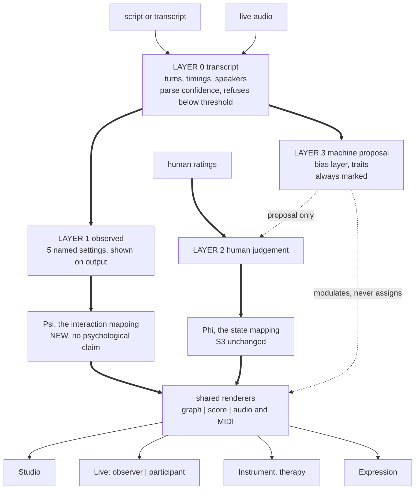

| Field | Value |
|:---|:---|
| Designation | MPN-DESIGN-01 |
| Title | One engine, several surfaces: a unified framework for decomposing dialogue into relationship networks and expressing them mathematically, visually and musically |
| Status | Revision 7. Revision 6 removed the false regulatory premise; revision 7 builds back what that premise had cut, and the restorations are specified rather than listed. Six capabilities return: the bias layer under the author's own Cognitive Bias Atlas, sections 5a and 9 decisions D45 to D48; the DISC timbre channel, which is live because a synthetic character's profile is assigned, section 5b and D50 and D51; the three-clef live score in the author's framing, which is synchronous on generated and recorded material, section 6.2 and D52 to D54; participant mode with every per-person measure, section 7.4 and D55; live capture sequenced by ingest-class error, section 7.6 and D56; and psychometric traits in an ungated Layer 3, section 4.4 and D49. Three generators supply the figures and none of them restates a paper: [9] finds fourteen of thirty bias mappings naming no state coordinate and one writing to the mode channel A4 depends on, [10] finds the timbre channel's capacity to be exactly six characters and its optimal assignment to be six profiles nobody chose by hand, and [11] measures the three-clef score's legibility on the 31,078 beats and returns eighteen wanted quantities against a budget of six to nine. Revision 6. The author ruled the scope on 13 September 2026 and the ruling is non-negotiable: this is theory and internal private use, synthetic data only, no people, no public data, not in the EU. The regulatory apparatus revisions 3 to 5 carried was built on a false premise, that the framework was a product being placed on a market, and it is removed entirely. Revision 5, after arbitration. The Arbiter returned REVISE, ruled that four of the fifty-six objections had been wrongly accepted, and answered the author's open question on the Autonomy-to-register mapping. Revision 4, after the Skeptic, the Constraint Guardian and the User Advocate. The Advocate returned REVISE on fifteen findings, and the sharpest is that Ψ has no psychological claim on paper and an unavoidable one in the ear, because its codomain is music and music is read affectively whatever the mapping intends. Revision 3, after the Skeptic and the Constraint Guardian. The Guardian returned REJECT, six of its sixteen findings blocking, and all six were correct and sourced: published 2026 diarisation error makes the flagship multi-party live case unmeasurable, the confidence rule it depends on has no input on live APIs, Layer 3 stance inference may be a prohibited practice under the EU AI Act in workplace and education settings, live capture with speaker attribution is special-category biometric processing the design declared nothing about, and the design stated no security requirements at all. Revision 2, after the Skeptic. Revision 1 was returned STOP on twenty-five findings, and the three structural ones were correct: the design routed Layer 1 observables into a mapping whose domain cannot accept them, claimed a derivation of the Autonomy gradient that is not possible as specified, and placed the rhetorical layer in two places at once. Not implementable until the Arbiter declares it complete |
| Understanding Lock | Confirmed by the author, 13 September 2026. Equal peers on one engine from day one; one engine with several surfaces; the live score surface carries both observer and participant modes, built in; autism framed as a non-clinical communication and expression aid |
| Rests on | S1 to S4 [1], [2], [3], [4] and MPN-PRD-01 [5] |
| Reviews | `REVIEW-DESIGN-skeptic.md` (STOP, 25 findings), `REVIEW-DESIGN-constraints.md` (REJECT, 16), `REVIEW-DESIGN-user.md` (REVISE, 15). The Guardian's findings 7 to 11 are void under the scope ruling and are marked so in that file |
| Scope | **Theory and internal research.** The material is synthetic dialogue the programme generates. No human subjects, no personal data, no recording of real conversations, no public deployment, no market. Every requirement here is technical or epistemic. There is no regulatory content in this document and none is to be added |

## 0. Scope

**This is theory and internal research on synthetic material.** The dialogue this framework decomposes is dialogue the programme writes or generates. Nobody is recorded, no personal data is processed, nothing is placed on a market.

That is not a limitation to work around. **It is the reason the hardest measurement problem in revisions 1 to 5 disappears.** Synthetic dialogue arrives with its speaker labels already correct and, more usefully, with its relational structure already known, because whoever generated it decided what that structure was. Sections 4.1 and 10a are shorter and stronger for it.

## 1. The idea in one paragraph

A conversation has a structure that is not in any participant. Who holds the floor, who speaks after whom, who is spoken over: these are properties of the **exchange** rather than of the people, and a transcript with timings carries them. The MPN framework maps a psychological state to musical material. The extension is to map an **interaction structure** to musical material as well, to render both as a graph, a score and sound, and to keep the two rigorously apart, because one of them is arithmetic and the other is a theory.

## 2. What revision 1 got wrong, and what survives

Revision 1 claimed that Bruscia's Autonomy gradient is a directed edge, that this unifies the therapy and dialogue lines, and that the gradient can be derived from observed turn structure. The third claim is false and it takes most of the first two with it.

**The derivation is not possible as specified.** The five gradients are not ordered on one dimension. Resister is not more than Leader; it is a refusal of the shared frame. A client who dominates by refusing every prompt and a client who leads productively produce the same floor share, the same turn lengths and the same latencies. Any scalar over turn structure is monotone and collapses the two. Separating them requires knowing a speaker's stance toward the shared structure, which is not in the timings. **The derivation claim is withdrawn.** Autonomy is human-rated on every surface or it is absent.

**What survives is smaller and true.** Bruscia defines Autonomy over the relationship between improvisers [6], so it is naturally recorded as a directed edge rather than as a property of a person, and a rating instrument shaped that way serves a two-node therapy session and an N-node panel without redesign. That is a fact about the rating surface. It is not a shared semantics between a human rating and a derived quantity, because there is no derived quantity.

**So the unification is infrastructural, not semantic.** The surfaces share a state model, a renderer set, an explanation mechanism and a determinism guarantee. They do not share an input path and they do not share a mapping. Section 3 is why.

## 3. Two mappings, because there are two different things to map

Revision 1's diagram routed interaction measures into the S3 mapping. That mapping's domain is fixed: dynamics from trauma, tempo and metre from entropy, mode from the register triple, timbre from the DISC coordinates [3]. Floor share is not in it. An implementer handed revision 1 would have had to compute a number called trauma from turn structure, which is the proof of concept's defect with a new input.

There are therefore **two mappings and they are not the same function.**

**Ψ, the interaction mapping.** Domain: the observed measures of section 4. Codomain: musical material. It renders the shape of an exchange. It is new, it is simple, it makes no psychological claim, and **it is not Φ and is never described as Φ.**

**Φ, the state mapping.** Domain: the nine-component state. Codomain: musical material, as S3 specifies [3]. Unchanged, and it runs only where a state exists, which means only where a human has rated one.

They share the renderers and nothing else. A session that uses both keeps them on separate staves.

**The mark is a sentence, not a symbol.** Revision 3 had each output carry a mark naming its mapping, and Ψ and Φ are internal names that no dramaturg, producer or client can decode. Two outputs that mean categorically different things would have looked identical but for a Greek letter. So the face of every output carries a sentence in the reader's language: *this renders the shape of the exchange and says nothing about anyone's state*, or *this renders a state a person rated*.

**And the disclaimer has a problem the design must own rather than assert past.** Ψ makes no psychological claim, and Ψ's codomain is musical material, which is read affectively by construction. The PRD's own evidence records the major-happy and minor-sad association as robust and reaching 92 per cent in adults [5]. A user whose conversation renders harsh or thin will read that as a verdict on the conversation and on themselves, and a line of text saying no claim is intended does not survive contact with a minor key.

**This is not resolved by wording.** Either Ψ's codomain choices are tested with listeners for exactly that inference, or the claim that Ψ makes no psychological claim is untested and is recorded as such in section 10. **Listener testing of Ψ for unintended affective reading is a condition of the Expression surface shipping**, because that is the surface whose audience is least placed to discount it.

## 4. Four layers, ordered by what stands behind them

Revision 1 had two layers and conflated a human's rating with a machine's inference, which are not the same kind of thing at all.

### 4.1 Layer 0, the transcript, and its confidence

Turns, timings, speakers. Everything else rests on this, and S4 records what happens when it fails silently: the parser assigned 3,424 of King Lear's 3,425 rows to a non-speaker, and the speaker-change column there "is constant by construction" [4]. Revision 1 quoted S4's endorsement of turn-taking and cut the qualifier that followed it, which was "on the six files where a speaker was found".

**So parse confidence is a first-class output, not a diagnostic.** Every analysis reports the share of material attributed to a named speaker, the share unattributed, and the number of speakers found. **Below a declared threshold the product refuses to render and says why.** A flat score from a failed parse and a flat score from a flat conversation must never look alike.

**And Layer 0 has three ingest classes whose error differs by orders of magnitude.** Revision 2 treated ingest as one thing and bet the flagship surfaces on the worst class.

| Class | What it is | Speaker error | Status |
|:---|:---|:---|:---|
| **A, labelled text** | **Generated dialogue, and play scripts.** The labels are given | **None** | The only class the theory work needs |
| **B, multi-track audio** | One channel per speaker | **Near none.** Attribution is the channel | Future work, if real audio is ever used |
| **C, single-channel mixed audio** | One microphone, a mixed recording | **Large.** See below | Future work, and the figures below say why it is last |

**Class C is where the measured error lives, and the numbers rule out what revision 2 promised.** The best published streaming diarisation error rate on DIHARD III is 19.8 per cent, and the two vendors that bundle diarisation with transcription are at 39.1 and 39.2 per cent; meeting-benchmark word error runs from 35 to 46 per cent across vendors. A 2025 benchmark scored with overlap included finds missed speech the dominant failure across all models. At a fifth of speech mis-attributed, a true 60/40 floor share is not distinguishable from an even one.

**Synthetic dialogue is class A by construction**, so none of that reaches the theory work: the labels are exact because the generator wrote them. The two requirements below apply to classes B and C and are recorded for whenever real audio is used, not for now.

**Two requirements, for classes B and C.**

**The resolution floor.** Each measure reports only at a resolution its ingest class supports. For class C the product declares a minimum reportable difference derived from the deployed diariser's error rate, and differences below it are not reported as numbers. A floor share of 58 against 42 on a single mixed microphone is not a finding.

**And it is rendered as a measurement failure, not as a result.** Revision 3 reported these as *not distinguishable*, which reads as *even* to anybody who is not already holding the difference between absence of evidence and evidence of absence in mind. Section 4.1's own rule is that a flat score from a failed parse and a flat score from a flat conversation must never look alike; the same rule applies here and revision 3 did not apply it. So a below-floor difference is rendered in the visual and musical channels as **unmeasured**, visibly distinct from any rendering of an even exchange, and worded as *this recording cannot tell you* rather than as a finding about the conversation.

**Class C does not carry a multi-party surface.** A panel of five on one microphone is precisely the material these error rates are measured on.

### 4.2 Layer 1, the observed measures, with every judgement call exposed

Revision 1 called these observation and claimed they were claim-free. Four of the six require a decision that changes the answer, and naming those decisions is what makes the layer honest.

| Measure | The decision it requires | How it is handled |
|:---|:---|:---|
| Floor share | seconds, words or turns; over what window | Named setting, default declared, shown on every output |
| Speaker adjacency | none to compute | Reported as **adjacency**, never as "response". Nothing in a transcript marks an addressee |
| Overlap | the threshold, and whether backchannels count | Named setting. Backchannel lexicon declared and editable, because a raw overlap detector scores the most supportive listener as the most aggressive interrupter |
| Latency | turn-boundary rule, and medium | Named setting, **with the medium recorded**: edited podcasts remove pauses, video calls add jitter, subtitle timings are a translator's artefact |
| Reciprocity | the window | Named setting |

**Two things revision 1 asserted are withdrawn.** "It is arithmetic over a transcript" is false until those five settings are fixed, so the output carries them. And **structural balance is unavailable here**: it needs signed edges, nothing in this list produces a sign, and two people who interrupt each other constantly may be allies. "Where the coalitions were" was a Layer 3 inference wearing Layer 1 clothes.

**Revision 4 deleted the concept and the Arbiter reversed that too.** A human rater can sign an edge, and doing so is an ordinary analytic act for a dramaturg working on *Lear* or a researcher coding a panel. The design built Layer 2 for exactly the things a machine cannot observe and a person can judge, and revision 4 did not consult its own architecture. **Structural balance is unavailable at Layer 1, permitted at Layer 2 where a human signs the edges, and prohibited at Layer 3.**

**A caution the design inherits and revision 1 missed.** Gap length and overlap tolerance vary by language and speech community. A fixed threshold will systematically score some communities as more interruptive. The PRD carries a cultural caveat for modes [5]; **it applies to timings too**, the defaults are declared rather than universal, and the setting is visible.

**And the speech pipeline's accuracy is a constraint, not just its latency.** Diarisation is worst exactly at overlap, and many pipelines assign an overlapped span to one speaker, which deletes an interruption rather than mis-scoring it. The error is asymmetric and invisible: a conversation where one party talks over the other reads as balanced.

**Revision 2 said the live surface reports its diarisation confidence, and no such number exists.** The major streaming APIs return a speaker label and no confidence on the live path; per-segment confidence is a batch-only field, and published error rates are corpus-level. So a rule that suppresses overlap measures on low confidence has no input, and as written it was a safeguard that does nothing.

**The replacement.** On class A and B, overlap is measured from the source and the rule is unnecessary. On class C, **the overlap-derived measures are not computed at all**: interruption, and any measure that depends on it, is reported as unavailable for that ingest class rather than computed from data known to delete it. That is a capability difference between ingest classes and it is the honest form of a rule that cannot be implemented as confidence gating.

**On class C the product says what it cannot answer before it says anything else.** Interruption is the dynamic most users of a single-microphone recording are trying to read, and a product that silently omits it lets a user conclude from an empty result that nobody talked over anybody. So a class C analysis opens with the sentence *this recording cannot tell you whether anyone talked over anyone*, in the user's own words, ahead of the content rather than in a capability footnote.

### 4.3 Layer 2, the human rating

A person's judgement, recorded as such. The therapist rating the client edge; an analyst rating the edges of a play they are studying. It has known properties, it can be tested for inter-rater agreement, and it is the input Φ requires.

**It is not automatic and no roadmap makes it automatic**, which is the withdrawal in section 2.

### 4.4 Layer 3, the machine proposal

Anything a model infers: stance, rhetorical move, which bias is operating, a psychometric trait. **Revisions 3 to 5 gated this layer behind a written legal opinion and made it off by default, and both go with the premise that built them.** No inference is being made about a real person. Layer 3 is built, it is on, and it is where the author's ask about expressing bias and psychometric traits actually lives.

**What stays is epistemic and it is the whole of the layer's discipline.** A model's judgement is not an observation. It is marked as a proposal wherever it appears, it never renders without the Layer 0 material that prompted it, and it is never the only thing on screen. That rule is not about anyone's rights. It is about not repeating S4's finding, where a keyword counter's output was read as a measurement through three revisions of a paper [4].

**Psychometric traits are a Layer 3 output and they are not gated.** A model proposing that a character is high in dominance, or that a turn carries an anchoring move, is making a proposal about a character the programme wrote. The DISC profile is a special case and it is not a Layer 3 output at all: under the scope ruling it is **assigned** by whoever writes the character, which makes it Layer 2 material, a human's judgement recorded as such, and section 5b specifies what to assign.

**Rhetorical patterns and the bias layer live here and only here.** Revision 1 put rhetorical patterns in Layer 1 in one section, Layer 2 in the diagram and the Studio headline in a third. They are model judgements with a countable output, which is exactly what the old keyword counter also was: "a topic changed after a challenge" requires detecting a challenge and a topic change, and neither is countable. Which of the thirty biases is operating on a turn is the same kind of judgement, and section 5a specifies the layer it feeds.

**And on synthetic material Layer 3 becomes testable, which it never was.** A generated dialogue can be written to contain a specific move on a specific turn. Whether the layer finds it is then a question with an answer rather than a judgement about a judgement, and section 5a.6 partitions the thirty biases by which kind of test each admits.

## 5. The engine

## 5a. The bias layer

Revisions 3 to 5 renamed this layer "rhetorical patterns", moved it out of the product and made a written legal opinion a condition of building it. The rename and the gate are both withdrawn. This is the layer the author asked for twice, the classification is the author's own Cognitive Bias Atlas, thirty entries in four domains, and S3 section 4 already carries thirty musical devices against them [3]. What was missing was not permission. It was the three things a layer has to survive before anyone builds it, and `s6_bias_layer.py` computes all three from the reconciliation rather than restating the paper [9].

### 5a.1 The thirty, assembled

Every Atlas entry carries a domain and a musical device. Fourteen devices are inherited from the reference implementation through S3's strict name match; sixteen are drafted in S3 section 4.2 for the author to strike [3]. The script asserts that no entry is left without a device, so a change to either source fails the check rather than quietly shrinking the layer.

### 5a.2 Fourteen of the thirty ride on nothing, which is the defect S3 names

S3 states the discipline of the layer in one sentence: a bias is not a free-floating decoration but a modulation of something the state already determines [3]. Each of the sixteen drafted mappings names the state coordinate its device rides on. **The fourteen inherited from the implementation name none.** Confirmation bias is an ostinato, anchoring is a pedal tone, availability is a sforzando, and nothing in the corpus says what any of them is a function of.

That is not a documentation gap. A device with no stated dependence on the state either fires always, fires never, or fires on a rule nobody has written down, and the third is what an implementer will invent. It was inherited silently because the reconciliation matched on the bias **name** and never asked what the matched device was attached to. Supplying the fourteen coordinates is authorial work rather than a derivation, and it is item BL-1.

### 5a.3 Every channel is contended, and one of them is A4 itself

| Channel | Biases | What Φ already sets there | From |
|:---|---:|:---|:---|
| TEXTURE | 8 | fragmentation and density | trauma and entropy |
| HARMONY | 7 | chord quality and operator | registers |
| MELODY | 6 | leitmotif pitches | registers, through the transformation |
| RHYTHM | 3 | tempo and metre | entropy |
| DYNAMICS | 3 | dynamic marking | trauma |
| TIMBRE | 1 | the three DISC contrasts | DISC |
| MODE | 1 | the mode | the register simplex |
| INTERVALS | 1 | leitmotif intervals | the transformation |

Every channel the bias layer writes to is a channel Φ already sets, and there was never going to be a free one: Φ maps the state onto the whole musical surface, so a bias layer rendered in music is necessarily a second writer to an occupied channel.

**The sharp case is MODE and it is a single entry.** CB-017, the framing effect, renders as the minor mode. Mode is the parameter A4 is about, the assertion that the dominant register selects the mode, and S3 spends its longest section on how the registers reach it [3]. An entry that **sets** the mode does not modulate A4, it overwrites it, and a listening study on A4 run over material carrying that entry would be measuring the bias layer and reporting the result as the registers. One entry is enough, because it is the entry that fires on framing and framing is present in most dialogue worth analysing.

**So the layer modulates and never assigns.** It perturbs the parameter Φ computed; it does not replace it. On a categorical channel, mode above all, "perturb" has no meaning, so a bias mapped to a categorical channel is remapped to a continuous one or struck. That is item BL-2 and it is one entry of the thirty. The implementation's own thirty carry two further mode entries inside the fifteen implementation-only rows; they are not in this count, and the same rule reaches them if they are ever promoted.

### 5a.4 The perturbation budget, computed against S3's own band widths

If the layer modulates, every device needs a bound, and the bound is not a matter of taste. It is set by the width of the band the parameter is discretised into, because a perturbation wider than a band moves the marking by itself, which is assignment wearing a hat.

**Dynamics is the one channel S3 states in full.** The eight normative markings have widths 0.10, 0.10, 0.15, 0.15, 0.15, 0.15, 0.10, 0.10 in trauma [3]. Three biases write to the channel. If all three fire at once and together may move the marking by at most one step, the per-bias budget is 0.10 divided by 3, which is **0.0333 in trauma, or 3.6 MIDI velocity units** on S3's law of 20 plus 107 times trauma.

**Rhythm does not clear its own threshold.** S3 gives three tempo bands whose spans are 18.2, 6.6 and 10.5 per cent of their own midpoints, against a published relative discrimination threshold near 6 per cent for a single interval and 3 per cent for a six-interval sequence [3]. The narrowest band clears the sequence threshold by a factor of 2.2. Three biases write to the channel, so the per-bias budget inside that band is **0.73 of a discrimination threshold, which is below one**. On the narrow band the three rhythm biases are not separately audible even in principle. The layer either fires at most one rhythm bias per passage or accepts that the others are inaudible, and that is item BL-3. It is a constraint, not a tuning note.

**The other six channels cannot be budgeted today**, and they wait on exactly the three numbers four documents already wait on: S3's interpolation margin, the harmonic rounding rule and the maximum chain length.

### 5a.5 Four collisions, and one contradiction that cannot occur

Two biases collide when they write to the same channel off the same state coordinate, because their effects are then one perturbation of one parameter and nobody can attribute it. Over the sixteen entries that name a coordinate there are twelve distinct signatures, four of which carry more than one bias, involving eight of the sixteen.

A collision whose devices **oppose** is a prediction worth keeping. Normalcy holds the metre through a disturbance and the planning fallacy starts a phrase at a tempo it cannot finish, both off entropy and in opposite directions, so a character high in both should sound self-contradictory, and if that never happens the two are not independent. A collision whose devices **agree** is a loss of resolution and something has to give. That is item BL-4.

**The third finding was not visible from the prose.** S3 section 4.2 names one pair as exactly this kind of prediction: zero-risk bias and information bias both ride on entropy, both concern voicing density, and they pull in opposite directions [3]. They do both ride on entropy. They are not on one channel: CB-025 is tabled to HARMONY and closes a chord, CB-029 is tabled to TEXTURE and adds a line. Those are different parameters, so the contradiction the paper predicts cannot arise, and the test it proposes would return nothing whatever the truth of the claim. Either the prose describes a mapping the table does not carry or one of the two categories is wrong. That is item BL-7, it is the author's call, and it was found by computing the signatures rather than by reading the section.

### 5a.6 What kind of test each bias admits, which is what the scope ruling buys

Twenty-two of the thirty are detectable within a single frame. Eight need material heard earlier: survivorship, the gambler's fallacy, groupthink, the peak-end rule, choice-supportive bias, outcome bias, recency and the planning fallacy. Each of those eight is historical for a stated reason rather than by category, and the script asserts the partition covers all thirty.

**The test harness follows from the partition, and it exists only because the material is generated.** For a frame-local bias the generator plants the move on a named turn and the score is per turn: did the layer fire there and not on the neighbours. For a historical bias a per-turn score is meaningless and the unit of test is a **pair of passages**, the statement and its distortion, scored by whether the second is heard as a distortion of the first.

S3 names choice-supportive bias the natural pilot for the whole layer, because it is the only mapping checkable against earlier material note for note without a listener at all [3]. It is one of the historical eight and it is the cheapest test in the programme: two passages of one score and an analyst, no panel and no stimulus budget. That is item BL-5.

### 5a.7 The work queue this section generates

| Item | What |
|:---|:---|
| BL-1 | Supply the state coordinate for the fourteen inherited mappings that name none, or strike them. Authorial |
| BL-2 | Remap or strike CB-017, the one entry that writes to the mode, which a modulation cannot perturb |
| BL-3 | Decide the firing rule for the three rhythm biases, whose per-bias budget on the narrow tempo band is below one discrimination threshold |
| BL-4 | Resolve or declare the four collisions. Opposing devices are a prediction; agreeing devices are a loss |
| BL-5 | Pilot the layer on choice-supportive bias, which needs an analyst and two passages and no listener panel |
| BL-6 | Plant the twenty-two frame-local biases in generated dialogue and score detection per turn; score the other eight as passage pairs |
| BL-7 | Reconcile S3 section 4.2's stated zero-risk against information-bias contradiction with the table, which puts them on different channels |

Nothing in that queue is a permission question and nothing in it waits on anyone outside this programme.

## 5b. The timbre channel, which is live because the profiles are ours to choose

S3 section 2.6 specifies the map from the four DISC coordinates into the three-dimensional timbre space, proves its rank is three and its nullity exactly one, and names the null direction as overall profile magnitude [3]. S3 then records that this is the one channel neither frame can exercise, because the reference implementation does not measure DISC and, under decision 9, no longer infers it either.

**That is true of a real person and false of a character.** Under the scope ruling the subjects are synthetic, so a character's DISC profile is assigned rather than measured, and the channel is live. The question is no longer what the channel loses, which S3 settled. It is how much the channel can carry and which profiles to choose so that it carries it. `s6_timbre_capacity.py` answers both, and every figure is a property of the map S3 already states [10].

### 5b.1 The shape of the reachable set

Because the contrast basis is orthonormal, the map is an orthogonal projection followed by an isometry. Two consequences hold that would not hold for a general rank-three map: timbre distance equals DISC distance measured after the magnitude component is removed, with no distortion, and every fibre is a straight segment in the direction of the flat profile whose length is the length of the DISC interval it collapses.

The reachable set is the zonotope generated by the four columns of the map. It has volume 2, diameter 2, and fourteen vertices in a six-plus-eight arrangement: **it is a rhombic dodecahedron.** The six far vertices, at distance 1 from the centre, are the images of the six DISC profiles with two coordinates high and two low, and the two poles of the DISC cube, the all-low and all-high flat profiles, both land on the centre.

### 5b.2 What each audible timbre costs, and the two rules that follow

By the coarea formula the mean fibre length is one divided by the volume of the reachable set, which is **0.5**. The longest fibre is the main diagonal of the DISC cube, which lies exactly in the null direction and has length **2, the full diameter of DISC space**. So the single worst case is the family of flat profiles: every profile with all four coordinates equal renders identically, and that family spans the whole of DISC space end to end. The flat profile is not a corner case in an assignment scheme. It is the default a careless assignment lands on, and it is precisely where the channel is deaf.

**The first assignment rule.** Never assign two characters profiles that differ by a constant. The test is one line: compare the magnitude component of the difference against the length of the difference, and if the ratio is near one the two characters are near-identical through timbre however far apart their DISC scores look on paper. S3's two worked pairs both come out at zero audible fraction. A pair not in S3, a profile lowered by 0.2 on three coordinates and 0.1 on the fourth, comes out at 0.240: three quarters of that difference is inaudible.

### 5b.3 How many characters the channel holds, and which profiles to use

Maximising the minimum pairwise timbre distance over profiles in the DISC cube, by seeded multi-start local search:

| Characters | Best minimum separation | Of the diameter 2 |
|---:|---:|---:|
| 2 | 2.000 | 100 per cent |
| 3 | 1.513 | 76 per cent |
| 4 | 1.423 | 71 per cent |
| 5 | 1.414 | 71 per cent |
| 6 | 1.414 | 71 per cent |
| 7 | 1.012 | 51 per cent |
| 8 | 0.902 | 45 per cent |

**The shape of that curve is the result.** Separation is flat at the square root of two from five characters to six and then falls away, 28 per cent for the seventh character alone and further after. **Six is the channel's natural capacity**, and a six-character cast costs nothing a five-character cast does not already cost. A seventh is not a small degradation; it is where the channel is being asked for more than three dimensions can carry.

**The optimal six are the six vertices**, found by search and not put in by hand: the six DISC profiles with two coordinates at the top of the scale and two at the bottom. They are mutually separated by the square root of two and each maps to a unit point on one of the three timbre axes. That is the canonical assignment table, it needs no tuning, and any five-character cast should use five of the six rather than a set invented for the occasion.

### 5b.4 The instrument family is in direct conflict with the continuous channel

The shipped family selector takes the largest of the four DISC coordinates, which S3 shows is invariant under adding a constant to all four, so it carries the null direction into the family label as well [3]. The assignment result exposes a conflict S3 could not ask about. **Every one of the six canonical profiles sits exactly on a tie**, because two coordinates are at the maximum by construction, so maximum continuous separation puts every character on the one point where the categorical label is undefined. At five characters the search returns three distinct families out of five and all five within 0.05 of a tie.

Constraining the search to one character per family, clear of any tie by 0.05, costs almost nothing at four characters: 1.396 against the unconstrained 1.423, a loss of 1.9 per cent. It cannot reach six at all, because there are only four letters.

**So the family channel is remapped, not tuned.** Four families keyed to the largest coordinate cannot label a six-character cast and cannot survive the profiles that use the continuous channel best. Six families keyed to the six canonical contrast directions can do both, they agree with the continuous coordinates by construction, and they are stable under editing a profile because the nearest canonical direction does not flip at a tie. That is item TC-1.

### 5b.5 The one number that is not ours to invent

How many characters the channel holds at a given perceptual resolution is the inversion of the table in 5b.3, and the inversion is exact up to the search. A volume argument is the wrong instrument and is not used: at the separations that matter the optimal sets lie entirely on the boundary of the reachable set, so a volume count is out by orders of magnitude in both directions depending on the regime.

What is missing is the resolution itself, in contrast units, and this design does not guess it. The experiment that fixes it is a discrimination test with no verbal anchor and no affective vocabulary: synthesise the six canonical timbres, present pairs, ask same or different, and find the separation at which listeners reach chance. If that separation is below the square root of two the six-character table stands as printed; if it is above, the cast shrinks and the table says by how much.

S3 cancelled one study, the recovery of a DISC profile from a cue, and specified its replacement as a shape discrimination [3]. **This is that replacement made concrete.** The stimuli are named, the search seed is fixed, and the result is a single number. It is the cheapest outstanding experiment in the programme and it unblocks the whole timbre channel.

## 6. The four surfaces

### 6.1 Studio

**For** dramaturgs, directors, podcast and panel producers, discourse researchers, and the author.

**Gives** the interaction structure over the arc of a work, rendered as graph, score and sound, with the settings that produced it on the face of the output.

**Ships first**: it needs no Ψ, no audio pipeline and no latency budget, and class A is what synthetic material produces.

**But class A is the weaker experience and the design should say so rather than let a user discover it.** A play script yields two of six measures, one of them a line count, under a header carrying the mapping sentence, three parse-confidence numbers, the ingest class, five settings, the resolution floor and the window. A dramaturg who drops in the play they know best on day one reads a page of caveats and finds a line count. **Studio's first good output is class B, multi-track audio**, and the product says which material is worth analysing before the user spends an afternoon finding out.

**Revision 1 called it the corpus generator and that is withdrawn.** A corpus of Studio outputs is a corpus of system outputs, and S1's governing sentence would apply to it verbatim [1]. What Studio can accumulate honestly is **Layer 0 with human Layer 2 ratings attached**, which is a corpus of human judgements about real material, and that is a different object.

### 6.2 Live, and the three-clef score

The author's framing, verbatim, is a near real time transposition of dialogue on a screen "like we do for close captioning but the music score is there instead of words, with the three clefs and the third outside", showing tension and bias. Revision 2 withdrew that framing on a latency argument and put nothing in its place, so readers arrived holding the withdrawn one. The withdrawal was half right and it was applied to the wrong material.

**The latency argument reaches live capture of unknown speech and nothing else.** A caption must be synchronous, and speech that has to be recognised as it arrives cannot be scored in less than seconds. But the material this framework is built on is generated or recorded, and generated material is known in full before a single note is rendered. **On generated and recorded material the three-clef score is exactly synchronous**, because nothing has to be recognised in real time: the score is computed ahead and played against the dialogue, which is what a film score is. The author's picture is therefore deliverable now, on the material the scope ruling makes primary, and the honest restriction is narrower than the one revision 2 imposed. It applies to one ingest class, live capture, and section 7.6 sequences that separately.

So the framing is restored with its scope stated: **a running score rendered against the dialogue, synchronous on class A and class B, trailing by seconds on class C.** It is not called captioning on class C, and the reason appears on the surface rather than in a design document.

The latency argument was never the interesting question in any case. It asks when the surface can show something. It says nothing about whether what it shows can be read, and that is the question the corpus can answer. `s6_three_clef.py` answers it on the same 31,078 beats S4 audits, and the three quantities it measures had never been measured [11].

**Event density, the first legibility budget.** A reader tracking a stave tracks changes. Under S3's normative laws, over all 31,078 beats, the dynamic marking changes on **4.5 per cent** of beats and reaches all eight levels; the tempo band changes on **32.2 per cent** and reaches three; the metre changes on **25.7 per cent** and reaches four [11].

That spread is the finding, and it is not a tuning problem. **The trauma channel is nearly frozen and the entropy channels churn**, and both follow from things the theory already says: S3 establishes that dynamics is a function of trauma alone and that trauma ratchets, so the marking cannot fall across an act, while entropy is free to move in both directions and crosses three tempo cuts and four metre cuts. A reader given these three staves gets one line that barely moves and two that change every third or fourth beat. Neither is what a live surface wants. **Any live rendering damps the entropy channels or the surface is unreadable**, and the damping constant is a stated parameter of the surface rather than a hidden default, because it changes what the reader sees. That is item LS-1.

**What a two-voice reduction costs, measured.** The design has recorded an unresolved question since revision 1: who selects the two principal voices in a panel of more than two. Before choosing a rule it is worth knowing what the choice costs. The share of a work covered by its two busiest speakers, over the plays with a real speaker set [11]:

| Work | Speakers | Top speaker | Top two | Top three |
|:---|---:|---:|---:|---:|
| A Doll's House | 14 | 45.2 | 69.2 | 80.4 |
| Hamlet | 44 | 36.1 | 50.1 | 58.5 |
| Macbeth | 49 | 28.8 | 39.0 | 47.5 |
| Miss Julie file | 28 | 15.7 | 26.2 | 36.7 |
| Oedipus file | 20 | 25.7 | 48.1 | 59.3 |
| Cherry Orchard file | 82 | 4.1 | 8.2 | 12.1 |

**Two staves render between 8 and 69 per cent of a work, and on four of the six less than half.** That is the strongest argument for the third stave there is, and it is stronger than the one the author gave: the third clef is not an elegance, it is the only place the other half of the material can go. It also settles the shape of the answer to the selection question. A surface that renders two voices and says nothing about the rest is silently discarding most of a play, so **the two-voice reduction is always accompanied by a stated coverage figure on the face of the output**, and the graph carries the full speaker set whether or not the score does. That is item LS-2.

**How often the third stave redraws, and what the design got right for the wrong reason.** Measuring the rate at which the active pair changes from turn to turn, and the share of active pairs containing the busiest speaker [11]:

| Work | Turn changes | Dyad changes | Distinct dyads | Busiest speaker's share of pairs |
|:---|---:|---:|---:|---:|
| A Doll's House | 1,281 | 9.4 | 19 | 87.0 |
| Miss Julie file | 2,010 | 8.8 | 49 | 25.6 |
| Oedipus file | 1,234 | 16.6 | 41 | 62.4 |
| Hamlet | 1,100 | 30.7 | 93 | 61.6 |
| Macbeth | 674 | 43.7 | 137 | 42.7 |
| Cherry Orchard file | 2,310 | 44.1 | 253 | 10.2 |

Dyad churn runs from 8.8 to 44.1 per cent, nowhere near the rate a flickering stave would need. **The active pair survives**, and on the two-handers it changes on under a tenth of turns, so a third stave pinned to the active pair would be a stave rather than a flicker. The legibility objection to an automatic reduction is not supported.

The objection that **is** supported is the one the design actually gave. The busiest speaker sits in up to 87 per cent of all active pairs, so in a work with a dominant voice an automatic active-dyad rule renders that voice against everyone else for most of the runtime and discards the clash a user came for. D10 stands and its justification is now a number rather than an argument.

**The information budget, which is the constraint on the whole surface.** S1's assertion B4 puts the number of independent quantities a single stave can carry at two to three and calls it an estimate rather than a measured figure [1]. Three staves therefore carry six to nine. What the surface wants to show is two voices at six state quantities each, mode, dynamics, tempo, metre, texture and timbre, and six interaction measures on the relation: **eighteen against a budget of six to nine.** The three-clef score is oversubscribed by a factor of two at B4's ceiling and three at its floor.

That does not kill the surface. It says the surface must choose, and it says how many things it may choose. **Each stave carries a declared two or three quantities, chosen before the session and shown on the output, and the rest are in the graph.** A live surface configured with its selection is a different object from one that discovers mid-session that it cannot show everything, and the selection is exactly the thing a user should be asked for once. That is item LS-3.

It also gives B4 a place where the estimate bites. B4 has sat in the assertions register as an unmeasured number with no consequence attached. Here the difference between two and three quantities per stave is the difference between six and nine on screen, which is the difference between showing the relation and not showing it. **Settling B4 is now worth the study it has never justified**, and it is the same kind of study as the timbre discrimination of section 5b.5.

**What each stave carries, as a proposal to be tried against readers.** Two staves for the two principal voices, each rendering that voice's state through Φ; a third, set apart, rendering the relation through Ψ. The third stave is the author's "third outside" and it is where the tension and the bias layer land, because both are properties of the exchange rather than of either speaker. The risk is unchanged and is stated rather than argued away: three staves may read as three voices, and a reader who can read music will read the third stave's pitch as pitch because a stave is a pitch space. **Nothing about the ontology of relations determines a notation**, and this layout is a proposal with three measured constraints on it rather than a claim.

**The primary renderer, and what that costs the thesis.** The graph leads Studio and Live; the score and the audio lead the Instrument and Expression. Most named users of Studio and Live are not defined by musical literacy, and section 10 records the demotion as evidence against the thesis rather than as a user-interface decision.

### 6.3 Instrument

MPN-PRD-01 [5], with one change forced by this design: **it pins engine behaviour, not a deployed artefact.** A shared engine under three faster-moving surfaces would otherwise alter the Instrument's rendering mid-study, and the PRD's roadmap assumes stable stimuli.

**Revision 2 pinned the build, which put the clinical surface in conflict with its own security obligations**: a frozen artefact cannot take a security patch, and the PRD requires a rollback path reaching every deployment within one working day. So the engine ships as a separately versioned library with a **security-backport lane that is behaviour-identical by test**, and a patch that changes rendered output is a stimulus-version bump with a stated migration for any study in flight. **The stimulus version is on the therapist's screen, and a rendering change is surfaced to the clinician before a session rather than only to the study**, because the person who needs to know the material changed is the one who will otherwise read a different response from a client as a change in the client. The PRD's paradigm client responds to the material itself [5].

**And the pin needs a mechanism, because this programme's demonstrated behaviour under divergence is to fork.** S4 found the two predecessor programs sharing no code at all [4]. A single golden-output regression suite over the Φ path runs in continuous integration against both the pinned build and head, and any divergence is a release blocker rather than a later discovery.

**It is not "the engine at N equals two", which revision 1 claimed.** At two speakers, adjacency is deterministic, reciprocity is 1 by construction and floor share is one number and its complement, so five of the six Layer 1 measures carry no information. The Instrument shares the renderers, the state model and the explanation mechanism. It does not use Layer 1 in any load-bearing way.

### 6.4 Expression

**For** anyone who finds conversational dynamics easier to read as sound or image than to infer from speech. No diagnostic or therapeutic claim.

**Layer 1 only**, and revision 1's argument for that was too strong. It said such a tool "is showing them the transcript"; it is showing a windowed statistic and a threshold-dependent classification.

**Visibility is not intelligibility, which revision 3 confused.** Showing this user a control reading *floor share unit: seconds, words or turns* hands them the power to change the answer and no basis on which to choose, and the three units genuinely disagree about who dominated a conversation. So on this surface each setting appears **with a sentence saying what it changes**, and the default is justified rather than merely declared.

**And the backchannel lexicon is not a control here.** Section 4.2 mitigates the supportive-listener failure by making that lexicon editable, which is an expert act. On the surface whose audience most needs the mitigation, it would not exist. So the lexicon is either right by default for the deployed language, or the overlap measures are withheld as they are on class C. This surface never tells a supportive listener that they were the aggressor because nobody edited a word list.

**One sentence of what it is for, in the user's words**, carried on the surface, and section 6.2 now supplies the sentence rather than leaving a hole where the withdrawn framing was. On generated or recorded material the score runs with the dialogue and the sentence says so. On live capture it trails by seconds, it blanks when it falls behind, and it is not to be relied on in the moment.

## 7. Constraints and open problems

**7.1 A11 and history.** Floor share is a function of history to date; adjacency and latency are functions of at least the previous turn. S3 rejects hysteresis for the mode selector precisely because it would make the mapping a function on the product space and cost A11's decomposability [3]. **Ψ is history-dependent by nature and Φ is not, and this design does not let Ψ's history dependence reach Φ.** The window is a declared parameter of Ψ, stated on every output, and A11 is a claim about Φ alone.

**7.2 Scripts have no timings.** A play script yields no latency, no overlap and no floor share in time. Four of six measures are unavailable and floor share degrades to a line or word count. **A script analysis and a podcast analysis are not the same measurement and the product says so on the output rather than placing them side by side in one report.**

**7.3 Material, and the one hygiene rule that survives.**

Revisions 3 to 5 carried several hundred words of data-protection and security requirement built on the premise that this framework captures real conversations. It does not. The material is synthetic, so there is no personal data, no biometric data, no consent question and no jurisdiction question, and all of it is removed rather than softened.

**One rule survives and it is not regulatory.** No credential in source or image, secret scanning in continuous integration, and a history purge if one lands. That is S4-1, the programme's own finding: a live key committed on 10 January 2026 and present in all 36 commits since [4]. It costs nothing, it has already bitten this programme once, and it is good practice whether or not anyone is watching.

**7.4 Participant mode, specified rather than deferred.**

Revisions 4 and 5 hollowed this out on a harm analysis about real people in a real room: the display would rank them, the quietest person would become the most conspicuous object on a shared screen, and a participant would need a way to withdraw. **On generated material there is nobody in the room, so every one of those restrictions falls with the premise that produced them.** The Understanding Lock asked for observer and participant as modes built in from day one, and the clause is restored in full and specified here.

**What participant mode is.** The same three-clef surface of section 6.2, rendered while the exchange is running, with the exchange's own participants as its readers rather than an analyst. It renders **everything the observer mode renders, per-person measures included**, because the people it would have ranked do not exist. D32 and D41 are void.

**Per-person measures, restored in full.** Floor share, turn count, mean turn length, latency before taking the floor, overlap initiated and overlap received, backchannel given and received, degree in the adjacency graph, and each person's own Φ rendering where a Layer 2 rating exists. All of them are attributable by name on a shared display. Revision 4 restricted these to a person's own device; that restriction existed to stop a real person being ranked in front of colleagues and it protects nobody here.

**What the mode still refuses, and why it is not a harm rule.** The surface blanks after a declared staleness horizon rather than holding the last frame, because participant mode is a delayed feedback loop by construction and a frozen picture of a conversation that has already ended is worse than a blank one. It refuses to render below the parse-confidence threshold. It marks a discontinuity rather than restating prior measures when the speaker set changes mid-session. Those are three instances of the same technical rule, which is that a stale or unsound reading must not be indistinguishable from a sound one, and they have nothing to do with anyone's rights.

**The observer effect becomes an experiment.** A display that changes the exchange it measures was, in revisions 4 and 5, a hazard to design around. It is a real effect and generated material is where it can be isolated cleanly: run the same generated dialogue through the same engine with and without the display in the loop, and the difference is the effect with everything else held fixed. **That experiment is only available because the material is synthetic**, since no real conversation can be run twice. It is item PM-1 and it is the most interesting thing the restoration makes possible.

**Version one.** Section 10a builds both modes as the lock requires. Participant mode consumes Ψ like every other surface, so it is gated on Ψ existing and on nothing else.

**7.5 The seven-mode problem is inherited** [5].

**7.6 Live capture, sequenced on engineering grounds only.**

Revisions 3 to 5 ruled live capture out on consent, biometric processing and jurisdiction. All three grounds are void: the material is synthetic, nobody is recorded, and there is no market. **Nothing forbids live capture and the design does not pretend otherwise.**

What remains is engineering, and it is real. Class C, a single room microphone through a diarising speech API, carries published diarisation error large enough that a 60 to 40 floor share is not distinguishable from an even one, no live API returns per-segment diarisation confidence so the confidence rule has no input, and overlap is where diarisation is worst and is therefore not computed at all on that class. Those findings stand because they are measurements rather than opinions, and D15, D17 and D18 stand with them.

**So the sequencing is by error, not by permission.** Class A, labelled text, is exact and is where every measure is defined. Class B, a microphone per speaker, has no diarisation step at all and is the first class on which the full measure set is trustworthy live. Class C is last, carries a stated resolution floor, suppresses the overlap measures, and opens by saying what it cannot tell you.

**Live capture is therefore scheduled rather than excluded**, it sits after Ψ because it consumes Ψ like every other surface, and it gains the programme nothing until Ψ exists. That ordering is in section 10a. What changes from revisions 3 to 5 is the reason and the destination: the item is on the list, and it is on the list because class B is straightforwardly buildable, not because anyone gave permission.

## 8. Edge cases, and what the product does

Revision 1 addressed none of these.

| Case | What breaks | What the product does |
|:---|:---|:---|
| Two people who agree | Identical Layer 1 signature to a polite deadlock; Ψ is content-blind | Renders the same. Stated as a known limit of Ψ |
| Monologue | N equals 1, empty edge set | Refuses and says a dialogue surface needs a dialogue |
| Silent participant | Floor share 0, degree 0, division by zero in per-turn normalisation | Rendered as a present, silent node in both modes, because the most conspicuous relational fact is not an absence. The shared-display restriction revisions 4 and 5 placed here is void under 7.4: there is nobody in the room to be made conspicuous |
| Overlapping speech | Diarisation is worst here and may delete the overlap | On class A and B, measured from the source. **On class C the overlap measures are not computed at all**, and the analysis opens by saying so. There is no confidence field on the live path, so the rule revision 2 wrote here had no input |
| Advertisement or reading | A long uninterrupted span addressed to nobody dominates the arc | Non-dialogue spans are marked and excluded, which S4's Gutenberg licence finding makes non-optional [4] |
| Stage directions | The `STAGE` failure [4] | Layer 0 confidence catches it |
| One character, two actors; one actor, two characters; choral speech | Diarisation keys on voice, script parsing on the label, so the same work yields different node sets | Node identity is declared at ingest and reconciliation is a user act, never silent |
| Translated or subtitled material | Timings are the subtitler's artefact | The medium is recorded and timing measures are suppressed |

## 8a. Failure behaviour

Revision 2 had one failure rule, the parse-confidence refusal, which covers bad input and not a broken pipeline.

**Sixteen things in this design cause the output to shrink or disappear, and every one of them is correct.** Together they are a product that frequently shows nothing, and revision 3 never distinguished the kinds a user has to tell apart in order to act. **Every refusal, suppression and blank states which of four kinds it is and the one action available.**

| Kind | What it means | What the user can do |
|:---|:---|:---|
| **Your material** | A script has no timings; a monologue has no dialogue | Use different material |
| **Your ingest class** | Class C cannot measure overlap; subtitle timings are the subtitler's | Record differently, a microphone per speaker |
| **Not specified yet** | Ψ has no function; a measure is deferred | Nothing today. Say which item it waits on |
| **We broke** | Vendor outage, staleness, dropped stream | Wait and retry |

Undifferentiated, all four read as a fault. A user who meets the third will report a bug; a user who meets the fourth will rebuild their recording setup for nothing.

| Trigger | What the product does |
|:---|:---|
| Speech vendor outage or rate limit mid-session | Live display blanks with a stated reason; capture continues to local storage, so the session is recoverable as class B or C later |
| Concurrency or stream cap reached | Refused at session start with the cap named, never degraded silently mid-session |
| Stream duration cap reached | Warned at 80 per cent, segmented at the cap with the seam marked on the output |
| Dropped connection in participant mode | The staleness horizon below governs |
| Diariser returns fewer speakers than the room declares | Class C measures suppressed; the product reports the discrepancy rather than distributing the missing speaker's time |
| Mid-session speaker relabelling | Rejected in session. A relabel silently rewrites floor share for the whole elapsed window, so the session is marked discontinuous and prior measures are not restated. **The refusal names post-session re-derivation as where relabelling belongs**, since capture is retained locally and the material is there |
| A speaker leaves mid-session | Their speech stops entering the aggregate and the session is marked discontinuous, so prior measures are not restated. The withdrawal-and-anonymity apparatus revisions 4 and 5 attached here is void: this is a speaker-set change, which is a soundness problem, not a rights one |

**The staleness horizon, which participant mode needs most.** Participant mode is a delayed feedback loop by construction. A frozen display in a delayed feedback loop is worse than a blank one, because people keep talking and keep reading a picture of a conversation that has already ended. **After a declared staleness horizon the Live display blanks and says it is stale.** It does not hold the last frame.

## 9. Decision log

| # | Decision | Alternatives | Rationale |
|:---|:---|:---|:---|
| D1 | One engine, four surfaces | One application with modes; a public API | Author's lock. Modes would share a UI across the clinical boundary; an API would surrender the claims surface |
| D2 | Therapy and dialogue as equal peers | Either leading | Author's lock |
| D3 | **Two mappings, Ψ and Φ, never conflated** | One mapping taking both inputs | Skeptic 1. Φ's domain is fixed by S3 and does not contain floor share; forcing it would mean computing a quantity called trauma from turn structure |
| D4 | **The derivation of Autonomy from turn structure is withdrawn** | Deriving it, as revision 1 claimed | Skeptic 3. Leader and Resister are not separable by any monotone function of turn structure |
| D5 | **Four layers, separating human rating from machine proposal** | Revision 1's two | Skeptic 5 and 8. A judged observation and an inference are not the same epistemic object |
| D6 | Rhetorical patterns and the bias layer are Layer 3. **The off-by-default clause and the named-person restriction are VOID under the scope ruling**; what survives is that a proposal is marked and never renders alone | Layer 1, as revision 1 half-said | Skeptic 7 and 8 |
| D7 | ~~Structural balance dropped~~ **SUPERSEDED by D40**: unavailable at Layer 1, permitted at Layer 2 | Keeping it at Layer 1 | Skeptic 9. No observable in Layer 1 produces a sign |
| D8 | Parse confidence is an output, and the product refuses below threshold | A diagnostic | Skeptic 4 |
| D9 | The five Layer 1 settings are declared on every output | Sensible defaults, hidden | Skeptic 5, 15, 22 |
| D10 | The active-dyad reduction is user-selected | Automatic by floor | Skeptic 18. The automatic rule selects the moderator |
| D11 | ~~The Instrument pins a frozen engine build~~ **SUPERSEDED by D24** | Shared latest | Skeptic 14. A frozen artefact cannot take a security patch |
| D12 | Studio is not a corpus generator; Layer 0 plus human ratings is | Revision 1's claim | Skeptic 12. A corpus of system outputs is what S1 warns about |
| D13 | Live is not described as captioning. **NARROWED by D52 to class C alone**: on generated and recorded material the score is synchronous | The author's framing | Skeptic 20. Seconds of lag is not a caption, and revision 2 applied that to material with no lag |
| D14 | ~~Consent required from everyone captured~~ **VOID under the scope ruling**: synthetic material, nobody is captured | | Skeptic 13; Guardian 11 |
| D15 | **Three ingest classes, ordered A then B then C** | One ingest path | Guardian 1. Published class C error makes a 60/40 floor share indistinguishable from an even one |
| D16 | A resolution floor per ingest class. **The reporting wording is SUPERSEDED by D28** | Reporting all measures at full precision | Guardian 1 |
| D17 | **Overlap measures not computed at all on class C** | Confidence gating, as revision 2 specified | Guardian 2. No live API returns per-segment diarisation confidence, so the gating rule had no input |
| D18 | **Multi-party live participant mode requires class B**, a microphone per speaker | One room microphone | Guardian 1 and 3 |
| D19 | ~~Layer 3 gated by jurisdiction and context~~ **VOID under the scope ruling**. Superseded in the positive by D49 | | Guardian 7 |
| D20 | ~~A written opinion is a condition of building Layer 3~~ **VOID under the scope ruling. Layer 3 is built** | | Guardian 7 |
| D21 | ~~The PRD's data obligations apply to every capturing surface~~ **VOID under the scope ruling**: no surface captures anyone. The PRD keeps its own, for the day it is built for real | | Guardian 8 |
| D22 | ~~Session-scoped diarisation, no voiceprint feature~~ **VOID under the scope ruling**. Synthetic material needs no diarisation at all | | Guardian 9 |
| D23 | **Reduced to one rule: no credential in source, secret scanning, history purge** | A full security programme | Guardian 12, against S4-1. Not regulatory, and it has bitten this programme once |
| D24 | **The Instrument pins behaviour, with a security-backport lane and a golden-output suite** | Pinning the built artefact, as revision 2 did | Guardian 13 and 15. A frozen artefact cannot take a security patch |
| D25 | **A failure-behaviour table and a staleness horizon** | The parse-confidence refusal alone | Guardian 14 |
| D26 | **The mapping mark is a sentence in the reader's language**, not a Greek letter | A symbol on the output | Advocate 1. Two categorically different outputs would differ by one glyph |
| D27 | Listener testing of Ψ for unintended affective reading is a condition of shipping. **The Expression-only scope is SUPERSEDED by D42**: any surface using Ψ | Asserting the disclaimer | Advocate 2. The codomain is music and music is read affectively whatever the mapping intends |
| D28 | **Below-floor differences render as unmeasured**, visibly distinct from an even exchange | Reporting them as "not distinguishable" | Advocate 3. That phrase reads as "even" to the audience least able to hear the difference |
| D29 | **Class C opens by saying it cannot tell you about interruption** | A capability footnote | Advocate 4. Silence about a missing measure reads as a finding of none |
| D30 | **Each setting carries a sentence saying what it changes; the backchannel lexicon is not a user control on Expression** | Visible settings, editable lexicon | Advocate 5. Visibility is not intelligibility, and editing a lexicon is an expert act |
| D31 | **Every refusal states which of four kinds it is** | Sixteen individually correct refusals, undifferentiated | Advocate 6 |
| D32 | ~~Participant mode renders no per-person comparative measure~~ **VOID under the scope ruling**: the people it would rank do not exist. Superseded in the positive by D55, which says what it does render | | Advocate 7 |
| D33 | ~~A participant may withdraw mid-session~~ **VOID under the scope ruling** | | Advocate 8 |
| D34 | **Each surface names a primary renderer; the graph leads Studio and Live** | Three renderers, user's choice | Advocate 9. Most named users are not musically literate |
| D35 | Adjacency is drawn undirected. **NARROWED by D39** to a renderer default; direction is retained in the data | A directed arrow | Advocate 12. Every reader reads an arrow as a response |
| D36 | **Dyad selection is reversible without re-ingest** | One selection at ingest | Advocate 13 |
| D37 | **Studio states that class A is the weaker experience and class B is its first good output** | Shipping class A first without comment | Advocate 10 |
| D38 | **The stimulus version is on the therapist's screen** | Migration assigned to the study | Advocate 11 |
| D39 | **Direction retained in the data; undirected is a renderer default labelled "speaks next"** | Revision 4's undirected data model | Arbiter reversing Advocate 12's over-correction. Adjacency is directed; what it lacks is addressee semantics |
| D40 | **Structural balance permitted at Layer 2 where a human signs the edges** | Revision 4's deletion of the concept | Arbiter reversing Skeptic 9's over-correction. Layer 2 exists for what a machine cannot observe and a person can judge |
| D41 | ~~Per-person measures own-device only~~ **VOID under the scope ruling. Participant mode renders everything** | | Arbiter, on Advocate 7 |
| D42 | **Listener testing is a condition of Ψ shipping on any surface** | Revision 4's Expression-only gate | Arbiter re-scoping Advocate 2 |
| D43 | **The score's demotion is recorded as evidence against the thesis**, in section 10 | Recording it as a user-interface decision | Arbiter, on Advocate 9 |
| D44 | **The Autonomy-to-register mapping survives, human-rated, with no dead band** | Withdrawing it alongside the derivation; giving Partner a dead band | Arbiter's ruling, section 11 |
| D45 | **The bias layer is restored under the author's Cognitive Bias Atlas vocabulary, and it modulates rather than assigns** | Revisions 3 to 5's rename to "rhetorical patterns" and the legal gate | The scope ruling. The rename was a consequence of the gate and went with it. The modulation rule is forced by section 5a.3: every channel the layer writes to is a channel Φ already sets |
| D46 | **The fourteen inherited mappings that name no state coordinate are given one or struck** | Shipping them as they stand | Section 5a.2. A device with no stated dependence on the state fires on a rule nobody has written down |
| D47 | **CB-017 is remapped off the mode channel or struck** | Leaving the framing effect setting the mode | Section 5a.3. Mode is categorical, so a modulation cannot perturb it, and it is the one parameter A4 is about |
| D48 | **Each bias device carries a perturbation budget set by the width of the band its parameter is discretised into** | An unbounded or hand-tuned device | Section 5a.4. Dynamics gives 0.0333 in trauma per bias; the three rhythm biases together do not clear one discrimination threshold on the narrow tempo band |
| D49 | **Layer 3 is on, psychometric traits included. The DISC profile is Layer 2, because it is assigned rather than inferred** | Revisions 3 to 5's off-by-default gate | The scope ruling, and section 5b: a character's profile is written by whoever writes the character |
| D50 | **The six profiles with two DISC coordinates high and two low are the canonical assignment table, and six is the channel's capacity** | Profiles invented per production | Section 5b.3. Found by search, not construction; separation is flat to six and falls 28 per cent at the seventh |
| D51 | **The instrument family is keyed to the six canonical contrast directions, not to the largest of the four DISC coordinates** | Keeping the shipped argmax selector | Section 5b.4. Every canonical profile sits exactly on an argmax tie, so maximum continuous separation lands on the one point where the categorical label is undefined |
| D52 | **The three-clef score is restored in the author's framing, synchronous on classes A and B and trailing on class C** | Revision 2's blanket withdrawal of the captioning framing | Section 6.2. Generated and recorded material is known before rendering, so the latency argument reaches live capture and nothing else. D13 is narrowed to class C |
| D53 | **Each stave declares two or three quantities before the session, and every two-voice reduction carries its coverage figure on the output** | Rendering everything and letting the reader sort it out | Section 6.2. Eighteen quantities against B4's budget of six to nine, and two staves render as little as 8 per cent of a work |
| D54 | **A live rendering damps the entropy-driven channels, with the damping constant declared on the output** | Rendering the raw parameter stream | Section 6.2. Tempo changes on 32.2 per cent of beats and metre on 25.7, against 4.5 for dynamics |
| D55 | **Participant mode renders everything the observer mode renders, per-person measures included, and the observer effect becomes an experiment** | Revisions 4 and 5's own-device restriction and withdrawal path | The scope ruling. D32 and D41 are void, and the same dialogue can be run with and without the display in the loop, which no real conversation permits |
| D56 | **Live capture is sequenced by ingest-class error, not by permission** | Revisions 3 to 5's exclusion on consent and biometric grounds | The scope ruling for the exclusion; D15, D17 and D18 stand because they are measurements |
| **R1** | **REJECTED: that the two-mapping split leaves nothing worth calling one engine.** The surfaces share a state model, a renderer set, an explanation mechanism and a determinism guarantee. That is an infrastructure claim, it is smaller than revision 1's, and it is true | Abandoning the unified framework | The Arbiter's closing: the correct scope of what one engine can honestly mean here |
| **R2** | **REJECTED: that section 6.3's Autonomy mapping falls with the withdrawn derivation.** The table is not monotone: it sends Resister to a third vertex, so it separates exactly the two gradients the derivation could not, and it does so using the one instrument that has a speaker's stance toward the shared frame | Treating it as the same claim in new clothes | Section 11 |
| **R4** | **REJECTED: that the churn measurement reinstates the automatic active-dyad reduction.** Dyad churn is 8.8 to 44.1 per cent, so a pinned third stave would not flicker, and the legibility objection fails. D10 was never argued on churn. It was argued on dominance, and the busiest speaker sits in up to 87 per cent of all active pairs, which the corpus confirms | Reinstating the automatic reduction on the strength of the churn figure | Section 6.2 |
| **R3** | **REJECTED: that participant mode should be removed rather than deferred.** It is not built in version one, and the clause is returned to the author rather than repealed by the designer | Deleting it; building it as locked | Exit criterion (a): a lock is amended by the author |

## 10. What this design does not yet have

Named here so the remaining reviewers attack the gaps rather than discover them, and because revision 1 asserted shippability without any of it.

**No specified Ψ, and now a way to test one.** There is still no function and no acceptance criterion. But the gap that used to sit beside it, the absence of a ground-truth corpus, is closed in principle by item 1 of section 10a: synthetic dialogue carries the structure its generator put in, so "does Ψ recover it" is answerable. Setting the accuracy target is the remaining work and it is ordinary.

**No cost question.** There is no market, no deployment and no per-hour speech bill on synthetic text. The Guardian's costing stands as future work and nothing in the theory programme turns on it.

**No specification of Ψ itself.** Section 3 says what its domain and codomain are and what it must not be. It does not say what the function is.

**Ψ's claim to make no psychological claim is untested.** Its codomain is music and music is read affectively. Listener testing is a condition of Ψ shipping on **any** surface, not of the Expression surface alone, because a producer hearing their panel render harsh draws the same inference as an Expression user and is merely better placed to argue with it. What varies by surface is the required result, not whether the test is run. Until that testing exists the claim is an intention, and this is the largest untested assertion in the design.

**And the demotion of the score to a secondary renderer is evidence against the thesis, not a user-interface decision.** Section 1 holds that interaction structure is well expressed as music. On the two surfaces with the most clearly specified users, the graph answered their question and the music did not. If that survives contact with real users, Ψ's case is weaker than section 1 claims, and the author should know it before three renderers are built.

**The numeric parameters this design leaves unfixed**, so they are deferred rather than merely absent: the parse-confidence refusal threshold; the resolution floor per ingest class; the staleness horizon; the five Layer 1 defaults; the retention period; and the trigger at which a below-floor difference renders as unmeasured, which is the numeric heart of one of the design's central honesty claims and currently has no value anywhere.

**No accuracy target for the speech pipeline**, only a latency budget.

**Who selects the principal voices is still open, but the question has changed shape.** Section 6.2 measures what the choice costs, between 8 and 69 per cent coverage, so the surface can no longer make the selection silently whatever rule it uses. What is missing is the rule. What is no longer missing is the obligation to declare its cost.

**Three things the restored capabilities need and do not have.** The perceptual resolution of the timbre space in contrast units, without which section 5b's capacity table cannot be inverted and which one afternoon of listening fixes. The state coordinates for the fourteen inherited bias mappings, which is authorial work. And S1's assertion B4 settled at two or three quantities per stave, which section 6.2 turns from an idle estimate into the difference between showing the relation and not showing it.

**And the bias layer's thirty devices rest on no evidence at all.** S3 says so plainly and it is worth repeating where an implementer will read it: no listener has ever been asked whether any of the thirty carries what it claims to carry [3]. The layer is buildable, testable and specified. It is not validated, and section 5a.6 is the route to changing that rather than a claim that it has been changed.

## 10a. Implementation order, as arbitrated

Ψ still has no specification and three of the four surfaces consume it, so it remains the constraint that dominates all others. **What the scope ruling changes is that Ψ is now testable**, because a generator that decides a dialogue's relational structure in advance is a ground truth to validate against, and section 10's "no ground-truth corpus" gap closes the moment item 1 exists.

| Order | What | Status |
|:---|:---|:---|
| 1 | **A synthetic dialogue generator with known ground truth.** Write dialogues whose relational structure is decided in advance: who leads, who resists, where the coalition sits, which rhetorical move lands on which turn. This is now the first item and it was not in any earlier revision | Build now |
| 2 | **The shared spine on class A.** Layer 0 from labelled text, the Layer 1 measures with their five settings, Layer 2's rating store, the graph renderer, and the four-kind refusal vocabulary. Plus the one credential rule of 7.3 | Build now |
| 3 | **Ψ: specify the function, then validate it against the generator.** Does Ψ recover the structure the generator put in? That question has an answer now, which is the largest single change the scope ruling makes | Next, and it unblocks everything musical |
| 4 | **Studio** on class A, graph and measures, then the score once Ψ exists | After 3 |
| 5 | **Layer 3 and the bias layer**, with detections scored against the generator's planted moves: twenty-two frame-local biases scored per turn, eight historical ones scored as passage pairs. BL-1 and BL-2 come first, because a device with no coordinate cannot be planted and a device that sets the mode cannot be scored against A4 | After 1, in parallel with 3 |
| 5a | **The timbre channel.** The six canonical profiles of section 5b.3 need no further work; TC-1, the six-family remap, is small; and the discrimination experiment of 5b.5 is an afternoon and unblocks the channel | Build now. It depends on nothing else in this table |
| 6 | **Live, both modes, with the three-clef score.** Synchronous on generated and recorded material, which is the author's framing delivered rather than deferred. LS-1 damping, LS-2 coverage and LS-3 the per-stave declaration are part of the surface, not follow-on work | After 3 |
| 6a | **Live capture**, class B first, a microphone per speaker. Class C last, with its resolution floor and its suppressed overlap measures | After 6. Sequenced by error, not by permission |
| 7 | **Expression**, and the listener testing of D27, which is a perception question and survives the scope ruling intact | After 3 |
| 8 | **The Instrument** on the PRD's own gates, which are a separate matter | Parallel, see below |

**The Instrument is a separate matter and this design does not rule on it.** MPN-PRD-01 specifies a tool for real therapists and real clients, which is not what the scope ruling covers, so its own gates stand unchanged until the author says otherwise [5]. What this design does owe it is technical: S3's unsettled $\delta$, the rounding rule and $k_{\max}$, without which Φ cannot render deterministically, and D24's golden-output suite in continuous integration before the Instrument has a second consumer.

**The Understanding Lock's participant-mode clause is restored in full.** Revisions 4 and 5 hollowed it out on a harm analysis about real people in real rooms, and the arbitration returned the clause to the author because a designer may not amend a lock. The scope ruling settles it the other way: **both modes are built as locked, with every measure rendered**, because the harm the restriction addressed cannot occur on generated material. D34's demotion of the score to a secondary renderer stands, since that is a legibility finding and not a harm one.

## 11. The Autonomy-to-register mapping, ruled

The PRD left an open question: its section 6.3 maps Bruscia's Autonomy gradient onto the register simplex, Partner lands at the barycentre, and S2's Lemma 2 shows argmax is discontinuous on the tripod that meets there. Elegant correspondence, or a mapping fitted to the geometry? And does Partner need a dead band?

**The mapping survives. Partner gets no dead band, and must not have one.**

**Why it survives the withdrawal that killed its sibling.** D4 withdrew the derivation of Autonomy from turn structure because Leader and Resister are not separable by any monotone function of timings. Look at what the human-rated table does: Dependent to Imaginary-weighted, Follower toward Symbolic, Partner to the barycentre, Leader to Symbolic-weighted, and **Resister to a third vertex entirely**, the Real. The table is not monotone. It runs a path from I toward S and then steps off it. So the human-rated mapping separates precisely the two gradients the derivation could not, by sending them to different vertices rather than to different points on a line, and it does so using the one instrument that carries a speaker's stance toward the shared frame. It is not the withdrawn derivation in new clothes; it is what becomes available because the derivation was withdrawn.

**The tripod worry dissolves, because it is posed against a selector Φ no longer uses.** Lemma 2 is a theorem about argmax. S3 replaced argmax with modal interpolation, and under that rule the barycentre is the **most** stable point on the simplex rather than the least: the weights are equal there, the result is the mean of the three modes, and the map is Lipschitz on the closed simplex [3]. S3 states the consequence outright, that the jump set of the mode parameter under interpolation is the single surface $\tau = 0.6$ and nothing on the simplex [3]. Partner does not sit in a neighbourhood of undefined values. It sits at the one point the interpolation was built to make well defined, and the 21 of 128 frames that land exactly on a tie are why interpolation was chosen [3].

That also disposes of the fitting suspicion from the other side. Read through the rule Φ actually uses, Partner at the barycentre is not flattering geometry; it is an ordinary, testable and unglamorous prediction, that mutual regulation sounds like the even blend of the three modes. Nobody fitting a mapping for elegance lands on the mean of three scales.

**And the dead band is not merely unnecessary; it is undefined at Partner and its failure mode is clinically unacceptable.** S3 rules out hysteresis and a dead band on three grounds, and each bites hardest exactly there [3]. Both are defined by a gap and neither releases when the gap is zero, and at Partner the gap is zero permanently, because Partner is a rated triple at the barycentre rather than a state that wanders near it. Both make $\Phi$ a function on $\mathcal{P} \times \mathcal{P}$ and cost A11's decomposability, which section 7.1 spends a section protecting from Ψ. And neither has a previous register to hold on a first frame, which in therapy is not an edge case but the opening of every session.

Follow the mechanism and it is worse than an undefined case. A dead band freezes the selector while the gap is small; the gap at Partner is zero and stays zero; so it would hold whatever register the preceding gradient selected, indefinitely. **A client moving Resister to Partner would sound Real; a client moving Dependent to Partner would sound Imaginary; the same clinical state would sound like two different things depending on where the client came from, and neither would sound like partnership.** The instrument would erase the one transition a therapist most wants to hear.

**Four conditions on keeping it.**

**Fix the five triples numerically.** The table says Imaginary-weighted, Imaginary to Symbolic, near the barycentre. Under interpolation the exact coordinates set the blend weights, and near the barycentre and at it produce measurably different music. Five triples as numbers, in the code beside the two warnings the PRD already requires.

**Run the collapse check before shipping.** Version one ships two gradients, so the register triple takes exactly five values and the mode channel has at most five reachable outputs. Dependent and Follower are both Imaginary-leaning; if their leaders sit within $\delta$ of each other the interpolation returns the same mode for both and the therapist's distinction is discarded without trace. Enumerate the five triples against the chosen $\delta$ and the live table, count the distinct modal outputs, and if it is fewer than five, either widen the triples or declare the collapse on the therapist's screen. A flat output from a collapsed channel and a flat output from a flat state must not look alike.

**Partner must not reach a diatonic renderer until the rounding rule exists.** The other four gradients sit at or near vertices where interpolation reproduces argmax exactly; Partner is the only one inside the margin, so it is the only one that renders microtonally. S3 is explicit that rounding at a tie reintroduces the jump interpolation removed, worst case a quarter tone, and that the rounding rule is S4's debt and unpaid [3]. S3 also names the cheap experiment that fixes $\delta$: one blended pair at $\delta = 0.05$ against $\delta = 0.20$ on a synthesiser that takes cents, no notation required. It costs an afternoon and four documents are waiting on it.

**It never acquires warrant by being used.** It is a stated interpretation and stays one. Its route to evidence is the PRD's agreement log and its Study 1 gate, not accumulated sessions.

## 12. References

[1] J. McKenney, "The McKenney-Lacan psychometric calculus," MPN-S1, `08_PAPERS/S1-mckenney-lacan-theory.md`, revision 3, with `MPN-S4-AMENDMENTS.md`.

[2] J. McKenney, "The formal apparatus," MPN-S2, `08_PAPERS/S2-mathematics.md`, revision 4 with its post-acceptance correction. Lemma 2, the tripod, is section 4.3.

[3] J. McKenney, "The mapping," MPN-S3, `08_PAPERS/S3-mapping-phi.md`, revision 9. Section 2.3 is the tie rule, the interpolation and the grounds for rejecting hysteresis and a dead band.

[4] J. McKenney, "The application," MPN-S4, `08_PAPERS/S4-application.md`, revision 2, and `08_PAPERS/ARBITRATION-S4.md`.

[5] "The instrument," MPN-PRD-01, `08_PAPERS/PRD-MPN-THERAPY.md`, draft 6.

[6] K. Bruscia, Improvisation Assessment Profiles, 1987, as summarised at https://ifas.thws.de/en/high-m/theory/improvisation-assessment-profiles-iap/ and cited in [5]. Six profiles, five gradients each; the Autonomy gradients are Dependent, Follower, Partner, Leader, Resister.

[7] The carry-over manifest, `05_DATA/03_generators/s5_salvage.py`. Nineteen artefacts: four ported, seven repaired, two rewritten, six dropped.

[8] The three reviews of this design: `REVIEW-DESIGN-skeptic.md`, `REVIEW-DESIGN-constraints.md`, `REVIEW-DESIGN-user.md`.

[9] The bias layer, computed rather than restated: `05_DATA/03_generators/s6_bias_layer.py`, run against `s3_bias_reconciliation.json`. Source of the fourteen mappings naming no coordinate, the channel occupancy table, the four collisions, the perturbation budgets and the twenty-two by eight locality partition.

[10] The timbre channel's capacity and assignment table: `05_DATA/03_generators/s6_timbre_capacity.py`. Source of the rhombic dodecahedron, the fibre lengths, the six canonical profiles, the separation curve to fourteen characters and the family conflict. Seeded, so it reproduces.

[11] The three-clef legibility budget, measured on the 31,078 scored beats: `05_DATA/03_generators/s6_three_clef.py`. Source of the event-density, coverage and dyad-churn tables. Asserts the beat count against the figure S1 to S4 cite, so a change of corpus fails the script rather than the paper.
