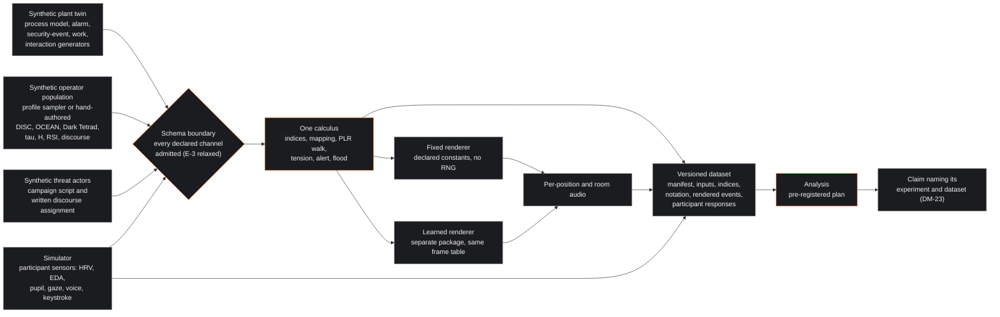
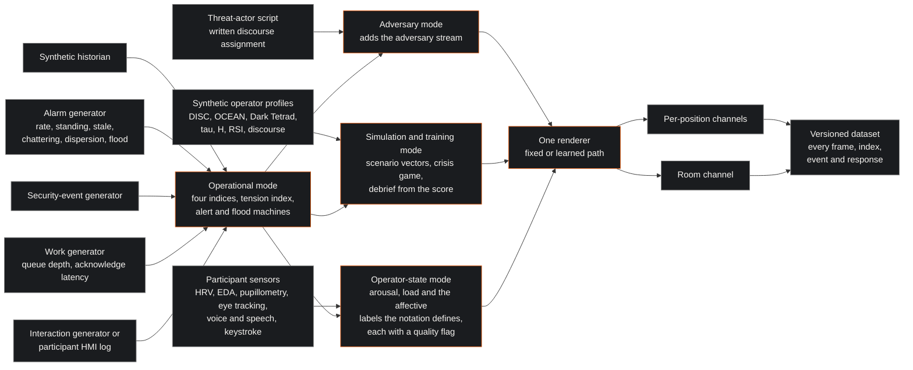
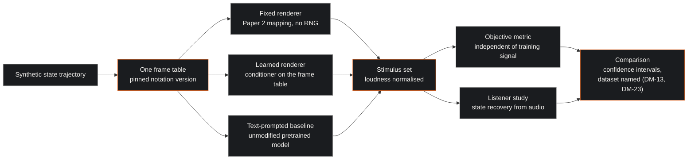

| Field | Value |
|:---|:---|
| Designation | MPN-4-MX-R, the closed research environment edition |
| Series | Paper 4 of 4 (research edition; the European field edition is MPN-4) |
| Extends | MPN-1 (foundations), MPN-2 (notation) and MPN-3 (engine) |
| Reference implementation | https://github.com/Planet9V/mpn-conductor-standalone (public repository; audited in MPN-3, not executed) |
| Status | Draft for working-group review |
| Normative language | RFC 2119 |
| Licence | Creative Commons Attribution 4.0 International (CC BY 4.0) |

## 1. Executive Summary & Scope

This paper is the research edition of the deployment paper. The field edition describes what a site does when it puts an MPN system into an operating control room, where the plant is real, the alarms are real and the people at the consoles are doing a job. This edition describes something else: a closed development environment in which the whole of the MPN programme runs at full capability on synthetic data, so that the measurements the first three papers could not report can be taken. The key words MUST, MUST NOT, SHOULD and MAY are to be read as in RFC 2119 [1]. The paper is offered under CC BY 4.0 [2]. The foundations requirements F-1 through F-14 of Paper 1, the notation requirements N-1 through N-27 of Paper 2 and the engine requirements E-1 through E-24 of Paper 3 bind this paper except where profile MX-R relaxes them [3] [4] [5]; its own requirements are numbered DM-1 through DM-23 and are research-protocol requirements, not deployment invariants.

The programme described here is a private research project run in a closed development environment on synthetic plant data and synthetic operator profiles; the operator complies with all applicable Mexican legal requirements, including consent, and no further legal analysis is in scope for this paper.

What the environment is for follows from what the series has had to say four times over. The psychometric-to-music mapping that gives the notation its name is unvalidated: no study has shown that a listener recovers anything about a psychometric vector from a rendering of it, and the tensor product of a DISC vector with a Big Five vector has no measurement-theoretic warrant at all [3]. The musical mappings carry evidence tiers that run from tempo as an arousal cue, which is replicated, to the adversary voice-leading styles, which are a coding the working group owns outright [4]. Physiology indexes arousal and cognitive load; inferring a discrete emotion from a face is not established, and the working group extends that finding to the voice [6]. No early-warning lead time and no classification accuracy have been measured for any operator metric anywhere in the programme [3]. The MPN Conductor, the reference implementation, is a rule-based sonification prototype whose machine-learning scaffolding is untrained: its first projector was fitted to random targets, its second to ten error strings, and its own reviewer file records zero empirical validation [5] [7]. Every one of those is a measurement that has not been taken. The environment exists to take them.

The design principle of the environment follows from the word closed. Nothing in it is connected to an operating plant, nothing in it is drawn from a production alarm system, and every person in its datasets is generated. The discipline that a field deployment spends on gating what may enter the signal chain, this environment spends instead on provenance, determinism, logging and pre-registration: the question is never who may hear a stream, but whether the rendering of that stream can be reproduced exactly, whether the dataset it came from has a version, and whether the claim someone wants to make from it names the experiment that supports it. That is the whole of the difference in posture between the two editions, and it is why the requirement list here is shorter than the field edition's and points in a different direction.

### 1.1 Profile MX-R and the requirements it relaxes

The requirements of Papers 2 and 3 were written for one setting, a live control room with a crew, which this series names profile EU. Profile MX-R is defined by difference: it relaxes exactly the requirements named in the table below, adds the research-protocol requirements of section 3, and leaves everything else as written. The reason attached to every relaxation is the same one, a closed research environment on synthetic data, and it is not an argument that the relaxed requirement was wrong; it is a statement that the condition the requirement guarded against does not arise here and that the thing it forbade is the object of study.

| Requirement | Subject | Relaxation under MX-R |
|:---|:---|:---|
| N-1 | Declared input mode; only that mode's channels admissible | A score MAY declare operator-state as a fourth mode, or as an overlay on any of the three, and MAY draw on that mode's channels |
| N-2 | No biometric of a member of staff; no inferred emotion, mood, stress or arousal | Lifted in full: every sensor of section 2.7 is an admissible input and every affective label the notation defines MAY be rendered, under DM-18 |
| N-3 | No per-person data; console-level aggregation; single-operator console rule | Lifted in full: per-participant channels are carried, rendered and logged, and no aggregation minimum applies |
| N-14 | At most three concurrent streams operational, four simulation and adversary | Relaxed as to the count only: the stream budget becomes a variable under test, and the per-stream declaration of timbre family, register, figure and pan is retained by DM-7 |
| N-16 | Adversary stream only in adversary and simulation mode | Relaxed as to mode: the adversary stream MAY run beside any other stream in any experiment that declares it |
| N-19 | Early-warning observables as margin annotations, never sonified | Relaxed as to rendering: observables MAY be computed on any channel and MAY be rendered where the experiment registers the rendering as a condition under test |
| N-24 | Silence control with no record of who used it | Relaxed as to the record: the control remains, and its use is logged as an experimental measure, with participants told in the briefing (DM-16) |
| N-25 | Fatigue index as a text annotation only | Relaxed as to rendering: the fatigue channel MAY be sonified, and MAY be computed per synthetic operator |
| E-3 | Schema boundary rejecting non-admissible channels | Relaxed to admit the operator-state channels of section 4.4 and the psychometric vectors of section 2.2 in every declared mode |
| E-5 | Projector, voice, speech and personality heads absent from the build | Relaxed: these components MAY be present as research components, under MPN-3's finding that they are untrained and under DM-18 |
| E-6 | Operational path fixed, human-authored, no learned component | Relaxed: a learned renderer MAY drive a rendering path, provided the fixed renderer remains present as the comparison reference (DM-12) |
| E-7 | Learned component confined to simulation and adversary mode | Relaxed as to mode confinement; the packaging separation is retained by DM-12 so that the two renderers can be compared |
| E-9 | At most three or four rendered streams | Relaxed as to the count, with the fixed per-stream configuration retained by DM-7 |
| E-16 | Log limited to frame table, constants, rendering state and timestamps, no identity | Lifted and replaced by DM-5, which requires the opposite: everything is logged, including participant identifiers within the environment |
| E-17 | No export path to any personnel system; declared retention | Lifted as to the export prohibition, which has no referent here; retention is governed by DM-22 |
| E-21 | Early-warning observables and fatigue index as text only | Relaxed with N-19 and N-25 |

Two requirements that a reader might expect in that table are not in it. N-27, which forbids attaching a discourse estimate or a psychometric vector to an identifiable member of staff, stands unrelaxed: the synthetic population of section 2.2 is generated, the threat actors of section 2.3 are generated, and no vector in the environment describes a participant in a simulator study. E-4, which requires the declared translation of Paper 2 section 8.2 for scenario vectors and discourse estimates, stands because it is the rule that makes a rendering reproducible.

### 1.2 What this paper does not do

It reports no result. Every experiment in section 5 is a design, and none has been run. It does not describe the reference implementation as ready for the work: Paper 3 lists the remediation the repository needs before any artefact it produces can be cited, and DM-11 and DM-12 restate the parts of that list which the environment depends on [5]. It does not claim that the environment will produce a positive result. A calibration experiment that finds no agreement on the polarity of a mapping is a finding, and the roadmap of section 9 is written so that such a finding closes a branch rather than being absorbed.

## 2. The research environment

### 2.1 The synthetic plant twin and its generators

The environment's ground truth is a synthetic plant. It is a process model with a declared set of variables, each with a nominal value, a normal-band half-width and an alarm limit, which is exactly the structure the plant-deviation index of Paper 2 section 3.2 requires, so that the index has a defined value at every frame and the value is known to the generator as well as to the renderer [4]. The model is driven by a scenario file: a sequence of disturbances with start times, magnitudes and decay constants, plus the trips and interlock actions a site's own procedures would produce. A scenario is the unit of generation, and a run of a scenario under a seed is the unit of data.

Four generators sit on top of the plant model. The alarm generator turns process excursions into annunciations under a rationalisation table that assigns each alarm a priority, a deadband and a chatter tendency, and it produces the counts the notation needs: the trailing ten-minute rate, the standing, stale and chattering counts, the standing count at medium or high priority, and the one-minute bins from which the dispersion index is computed. It carries a flood mode in which a declared number of alarms arrive inside a declared window, because an environment that cannot produce a flood cannot test the one behaviour the notation is most confident about (DM-21, section 8). The security-event generator produces a correlated event rate on a declared arrival process. The work generator produces queue depth and acknowledge latency, drawing acknowledgement times either from a fitted distribution when the run has no human in it or from the simulator's own participants when it does. The interaction generator produces the HMI event stream, acknowledgements, commands and setpoint changes, again either synthetically or from participants.

Every generator is versioned, and every dataset carries a manifest naming the generator versions, the scenario file, the seed, the notation version and the date (DM-2, DM-3, DM-6). This is the environment's substitute for the thing a field deployment has for free, which is a real world that does not change when nobody is looking. A synthetic dataset with no manifest is not evidence of anything, because a second run of the same nominal scenario under a different generator version is a different experiment.

### 2.2 The synthetic operator population

The environment's second population is people who do not exist. Each synthetic operator carries a profile vector, and the environment admits the full feature space the MPN programme has ever envisaged, with each component labelled by its standing.

| Component | Symbol | Standing in the programme |
|:---|:---|:---|
| DISC quadrant scores | D, I, S, C | A commercial typology with acceptable short-interval reliability and weak, non-independent validity evidence, whose dimensions collapse largely onto two Big Five factors; a communication vocabulary, not a measured construct [8] [3] |
| Big Five domain scores | O, C, E, A, N | The mainstream, replicated, between-person trait taxonomy, and not a state model [9] [10] [11] |
| Dark Tetrad scores | narcissism, Machiavellianism, psychopathy, sadism | Research constructs with acceptable short-scale reliability on the SD4, validated for between-person research and never as an operational flag [12] [13] |
| Trauma scalar | tau | The reference implementation's own scalar; an engineering quantity of the working group's construction with no external referent [7] [5] |
| Entropy | H | Likewise; the reference implementation's stability-regime selector is a hand-set scalar, not an estimate of anything [7] |
| Register triple | r, s, i | The Real, Symbolic and Imaginary weights of the working group's own calculus; an engineering parameterisation, labelled as such [3] [14] |
| Discourse estimate | delta | A probability vector over the four discourses and the capitalist label outside the orbit; a modelling frame the working group owns [3] [15] |

Profiles are produced in two ways, and both are declared in the manifest. Hand-authored profiles are written by a scenario author for a named dramatic purpose, which is what the reference implementation does across its thirteen literary scenarios, and they are the right instrument when an experiment needs a specific trajectory [7]. Generated profiles come from a declared sampler: marginal distributions per component, a correlation structure imposed by a copula or by a factor model, and a seed. The generator MAY reproduce the redundancy the psychometric literature predicts, since DISC is largely a re-expression of Extraversion and Agreeableness, and an experiment that wants to test whether the renderer distinguishes redundant axes needs a generator that can make them redundant on purpose [3] [16].

Two statements about this population are load-bearing and are repeated wherever it appears. The first is that the mapping from any of these components to a musical parameter is unvalidated. The outer product of a DISC vector and a Big Five vector has no psychometric precedent, is expected to be redundant, and is an engineering feature space rather than a measurement [3]. The reference implementation's proposed fifty-seven-dimensional input, which concatenates the DISC and Big Five scores with the register weights, the dark-triad scores, physics terms and thirty-six one-hot bias indicators, has the same standing and is a proposal only: at inference the projection is computed and discarded, and the served endpoint accepts three scalars and builds a text prompt from them [5] [7]. Validating the mapping is the point of the environment, and section 5.5 is the experiment that would do it. The second is that a trait score is not a state. The state-trait distinction is the canonical one, trait scores predict the base rate of states rather than their current value, and within-person variability is large relative to between-person differences [17] [18]; a profile vector in this environment is therefore a generator parameter, and any rendering of it is a rendering of a parameter.

### 2.3 Synthetic threat actors and their discourse assignments

The adversary side is generated in the same spirit. A synthetic threat actor carries a campaign script, a set of observable security events it injects into the event generator, and a discourse assignment: a probability vector over the master, university, hysteric and analyst discourses, with the capitalist label available outside the orbit [3] [15]. In the field edition that vector comes from a threat-intelligence analyst's coding of a real actor; here it comes from the scenario author, who writes it into the script before the run, so that the environment has something a field deployment never has, which is the ground truth of what the estimate should have been.

That ground truth is what makes the adversary-discourse study of section 5.6 possible at all. The only empirical precedent for quantifying the discourses is an annotation-and-reliability study with no held-out prediction [19], and no discourse detection exists in the reference implementation's code [5]. An environment in which the intended discourse is written down before the audio is rendered can ask the only question that matters at this stage: given the rendering, does a listener recover the discourse the author wrote?

### 2.4 The MPN Conductor as renderer

The renderer is the engine of Paper 3, and the environment uses it in the configuration that paper specifies: one calculus as the source of truth for every function of Paper 2 sections 3 through 5, with the browser twin generated from its frame-table fixtures and conformance-tested against it rather than written by hand [5]. The reason that arrangement matters more here than in the field is that an experiment is a comparison, and a comparison between two renderings is worthless if the two were computed by calculi that disagree. The reference implementation's central defect, two calculi with no relation between them, would silently become a confound in every listener study the environment runs.

Two rendering paths exist side by side. The fixed path is the human-authored mapping of Paper 2 with declared constants, no learned component and no call to a random-number generator, so that the same inputs and constants produce the same score, the same MIDI and the same audio [4] [5]. The learned path is the generative renderer the programme would like to have: a conditioner over the frame table driving a pretrained music model, whose training budget Paper 3 sets out and whose current state is an adapter of unknown provenance behind a missing binary [5] [20]. In the field edition the learned path is confined to simulation mode and physically separated so that removing it changes nothing operational. Here the separation is kept for a different reason: the two paths must be separable so that they can be run on the same frame table and compared under one protocol (DM-12, DM-13, section 5.4).

### 2.5 Logging and the dataset layout

The environment logs everything. A run produces a directory whose contents are fixed by DM-5 and DM-6: the manifest; the scenario file and the generator parameter files; the raw input frames as received at the schema boundary, one row per channel per frame, with source timestamps; the intermediate index table, carrying the plant-deviation, activity, instability and load indices, the tension index and, where the run has them, the operator-state indices and their quality flags; the notation table, carrying the realised chord, the transition word, the metre, the velocity, the marking and the rendering state per bar; the rendered-event log, one row per note-on, stream change, alert entry, flood entry and mute, with the wall-clock time of each; the audio itself; and, where participants took part, their responses, their sensor streams and their session timeline. Each file carries a schema identifier and a schema version, and the schema is published with the dataset, because a log whose fields are not defined is not a log.

This is the exact inverse of the field edition's logging rule, which limits the engine's log to the frame table, the constants, the rendering state and timestamps, and forbids any user identity in it [21]. The inversion is deliberate and is the point of the environment: the field rule exists so that a deployed system cannot become a record about a person, and this environment has no people to make a record about, so the constraint is replaced by its opposite, completeness, which is what re-analysis needs.

### 2.6 The simulator

The simulator is a control-room mock-up with a small number of positions, each with a process display, an alarm list and an interaction log, driven by the plant twin rather than by a live plant. It carries the two things an experiment needs beyond a rendering: freeze points, at which the displays blank and the participants answer situation-awareness probes, and block boundaries, at which participants complete a workload instrument [22] [23] [24]. It also carries the scripted-event structure that the two-stream detection task needs, in which events occur at known times and the measures are detection latency and identification accuracy [25].

Participants in simulator studies are volunteers drawn either from the target operator population or from people of comparable training, and the protocol treats them as study participants and not as operators: they are briefed before the session on what is sensed, what is rendered and what is logged, and they are debriefed after it with the score and the frame table in front of them (DM-16). Debriefing from the score is itself a claim the environment can test, since the symbolic score is the artefact the series proposes as the audit trail and nobody has yet shown that a person can read one usefully [4].

### 2.7 The hardware

The sensing side carries every input the MPN programme envisages. Heart-rate variability is captured by chest-strap or finger electrocardiography at a sampling rate adequate for the standard time-domain and frequency-domain measures [26]. Electrodermal activity is captured at the palm or the wrist as an index of sympathetic arousal [27]. Pupillometry and eye tracking come from a desk-mounted tracker at the position, with a luminance sensor beside it, because pupil diameter is dominated by luminance and gaze angle and a pupil series without a luminance record cannot be interpreted [28]. Voice and speech features come from a near-field microphone per position, with the audio retained and the feature extraction versioned. Keystroke and interaction dynamics come from the position's own input devices. All of it is timestamped against one clock, because an experiment that correlates a pupil dilation with an alarm annunciation is an experiment about timing and inherits every error in the synchronisation.

The rendering side carries a near-field channel at each position and a room channel, so that an experiment can render any stream to one participant, to a subset or to everyone, which is the capability the field edition's rules on who hears what removed. Compute for the learned renderer is a single accelerator, which the published fine-tuning practice suggests is sufficient for adapter training at the scale the programme needs [29] [30].

## 3. Research-protocol requirements

The following requirements, DM-1 through DM-23, are normative for the closed research environment. They replace the field edition's deployment invariants entirely; nothing in this list is carried from it.

- **DM-1.** The environment MUST be closed: no component of it MAY read from an operating plant, a production alarm system, a production historian or a production security-operations pipeline, and no component MAY write to any of them. Every input is generated by a declared generator or captured from the simulator.
- **DM-2.** Every dataset MUST carry a manifest naming the version of every generator that produced it, the scenario file, the profile sampler and its parameters, the notation version, the engine version and the date. A dataset without a manifest MUST NOT be used as evidence for any claim.
- **DM-3.** Every stochastic component, in the generators and in any learned renderer, MUST be seeded from a seed recorded in the manifest; the fixed rendering path MUST call no random-number generator at all, so that the same inputs, constants and seed produce identical outputs (E-15).
- **DM-4.** Every example rendered in any paper, presentation or artefact of the programme MUST name the manifest identifier and the frame-table hash it came from, and MUST be regenerable from the repository by a single declared command.
- **DM-5.** The environment MUST log, for every run, every input frame as received at the schema boundary with its source timestamps, every intermediate index including the tension index and every operator-state index with its quality flag, every notation row, every rendered event with its wall-clock time, and every participant response. Each log file MUST carry a schema identifier and a schema version, and the schema MUST be published with the dataset.
- **DM-6.** The dataset layout MUST be declared once for the environment and MUST be identical across runs, so that an analysis script written for one run reads any other without modification.
- **DM-7.** Every stream rendered in a run MUST have its timbre family, register, rhythmic figure and pan position declared in the run configuration and recorded in the log, and no two concurrent streams MAY share a register and timbre family unless the experiment is testing that confusion deliberately and says so in its registration. The number of concurrent streams is not bounded by N-14 or E-9 in this environment; it is a variable under test.
- **DM-8.** Every synthetic operator profile MUST record whether it was hand-authored or generated, and, if generated, the sampler version, its parameters and the seed. No profile MAY be derived from, or described as, a real person, and no participant in a simulator study MAY be assigned a profile (N-27).
- **DM-9.** Every synthetic threat actor MUST carry its discourse assignment in its script, written before the run, and the assignment MUST be withheld from any listener or model whose task is to recover it.
- **DM-10.** Every experiment MUST pin the notation version it uses, by identifier and by the full constant set of Paper 2 section 3.1, in its registration and in its dataset manifests. A change to the notation or to any declared constant starts a new experiment rather than continuing an old one.
- **DM-11.** The two calculi MUST satisfy E-1 and E-2 before any experiment runs on them: one module is the source of truth, any second implementation is generated from or conformance-tested against it, both reproduce the frame tables of Paper 2 section 8 bit for bit, and they agree row by row on a randomised fixture of at least one thousand frames.
- **DM-12.** The fixed renderer and any learned renderer MUST be packaged and built separately and MUST be joined to the calculus only through the frame-table interface, so that either can be run on the same frame table without the other being present.
- **DM-13.** Any evaluation of a learned renderer MUST include, under one protocol and on the same frame tables, the fixed renderer and a text-prompted baseline from the unmodified pretrained model, and MUST report an objective metric independent of any training signal alongside the listener result.
- **DM-14.** Every experiment MUST be registered before data collection in a record naming its hypothesis, design, conditions, measures, sample size and stopping rule, and that record MUST be stored in the repository with a timestamp.
- **DM-15.** Every experiment MUST carry a pre-specified analysis plan naming the statistical model, the primary outcome and the handling of exclusions and missing data. Any analysis not in the plan MUST be reported as exploratory, and any deviation from the plan MUST be reported with its reason.
- **DM-16.** Participants in simulator studies MUST be briefed before the session on what is sensed, what is rendered, who hears it and what is logged, including that the silence control's use is recorded as a measure, and MUST be debriefed after it using the score and the frame table.
- **DM-17.** Every musical mapping in use MUST carry its Paper 2 evidence tier in the run configuration and in any report of the experiment, so that a result obtained under a CONVENTION-tier mapping is not read as a result about a STRONG-tier one.
- **DM-18.** Any affective label rendered or displayed in the environment MUST be recorded as a hypothesis under test, with the sensor, the quantity, the window, the mapping that produced it and the identifier of the experiment in which it is under test. No such label MUST be carried out of the environment as a finding except under DM-23, and no such label MUST be described as a measurement of an emotion, since inferring a discrete emotion from a face or a voice is not established [6].
- **DM-19.** Every operator-state index MUST carry a quality flag reflecting the declared confounds of its sensor, including luminance and gaze angle for pupillometry, respiration, posture, movement, caffeine, fitness, age and circadian phase for heart-rate variability, and the unvalenced character of electrodermal activity; an index whose flag is poor MUST be marked as such in the log and in every analysis that uses it [26] [27] [28].
- **DM-20.** A lead time, a detection accuracy or a classification performance figure MUST be reported only as the outcome of a registered experiment whose analysis plan specified it, and a lead-time claim MUST additionally satisfy the data requirements of Paper 1 section 5.6 in full and report them (F-8).
- **DM-21.** The plant twin and the alarm generator MUST be able to produce alarm floods at declared rates and durations, and the engine's flood machine MUST be exercised in every conformance run, because the flood behaviour is the one part of the design with a documented industrial basis and the environment exists in part to check that it survives contact with everything else.
- **DM-22.** Every dataset MUST be retained, with its manifest and its schema, for re-analysis for a declared period stated in the environment's own configuration, and a dataset that supports a published claim MUST be retained for as long as the claim stands.
- **DM-23.** Any claim leaving the environment MUST name the experiment that produced it and the dataset that supports it, by their identifiers, and a claim that cannot name both MUST NOT be made. Continuous integration MUST fail on any document in the repository that states a lead time, an accuracy, a listener result or a trained model without a linked dataset, evaluation script and result file (E-23).

## 4. The four modes at full capability

The notation declares three input modes; the environment adds operator-state as a fourth, usable alone or as an overlay on any of the others. This section says, for each, what enters, what is computed, what is rendered, who hears it and what is written to the dataset.

### 4.1 Operational mode

The inputs are the plant-twin channels: process variables against the rationalised envelope, the alarm counts and their one-minute bins, the correlated security-event rate, queue depth, acknowledge latency and interaction tempo. The computation is the one Paper 2 specifies and nothing else: plant deviation, activity, instability and load as four scalars in the unit interval, the mapping to tempo, mode, harmonic distance, metre, roughness and dynamics, the shortest-word walk on the twenty-four consonant triads with its lexicographic tie-break, the single tension index and the single alert rule with hysteresis, and the flood machine overriding all of it [4] [31] [32].

Tempo is the strongest mapping in the table, carrying the STRONG tier on the meta-analytic finding that fast tempo and high intensity mark high-arousal expressions and on the cross-cultural recognition of tempo and mode cues by listeners without exposure to Western music [33] [34]; it is driven by the activity index and by nothing else.

The rendering is the three streams of Paper 2 section 3.9, plant, alarm rate and interaction, each with its declared timbre family, register, figure and pan, plus the liveness figure whose cessation means data loss on that channel and nothing else, on the precedent of the network auralizer whose crickets stop when a server dies [35]. Under DM-7 the environment MAY render more than three, and the stream budget is itself a research question: the auditory system segregates sound by frequency proximity, timbre, spatial position, onset synchrony and temporal regularity, and sources sharing register and timbre fuse or mask one another [36]; the best-documented multi-variable auditory display carried six variables in two rhythmic streams, with every scripted event detected but only sixty per cent identified from sound alone [25]; and the working group found no study establishing a larger number, so the number is a hypothesis that the listener studies of section 5.1 can test directly.

Who hears it is unrestricted. A run may put the room mix on every position, or a different subset of streams at each position, or one stream alone, as the experiment's design requires. What is logged is everything in DM-5, and in operational mode the dataset has the property that makes conformance testing possible: the generator knows the true plant state, so the notation table can be checked against the state that produced it rather than against another rendering.

### 4.2 Adversary mode

Adversary mode adds the fourth stream, carrying the synthetic threat actor's discourse over the four positions of the working group's engineering ontology, rendered as the four voice-leading styles of Paper 2 section 3.10: root-position triads in parallel motion for the master, stepwise sequential figures for the university, syncopated entries with unresolved suspensions for the hysteric, sparse off-beat single tones for the analyst, and the master's style with the root omitted for the capitalist label outside the orbit [4] [3] [15]. The coding is the working group's own and carries the CONVENTION tier, which under DM-17 is printed wherever a result from this mode is reported.

The inputs are the campaign script's injected events, which reach the engine through the security-event channel exactly as a real campaign's would, and the written discourse assignment, which reaches it through the declared translation of Paper 2 section 8.2 (E-4). The output is the adversary stream beside the operational ones; the rendering is unrestricted; and the log carries the assignment, the rendering and, in a listener study, every response, so that recovery of the written discourse from the audio is a measurable quantity rather than an assertion.

### 4.3 Simulation and training mode

Simulation and training mode is where the psychometric feature space enters. A scenario author writes a sequence of profile vectors, or samples them, and the environment translates them to the operational indices by the declared rule of Paper 2 section 8.2: plant deviation from the trauma scalar, activity from the entropy scalar, instability from the frame-to-frame change of the trauma scalar, and load from one minus the register-triple index in its calculus-module form [4] [7]. The four DISC values name the actor stream's instrument, which for a synthetic agent is exactly what the notation permits.

The mode carries the tabletop exercise, the crisis game and the debrief. Its outputs are a score, a MIDI stream and audio, and, in a training session, a participant record: what each participant did, when, and what they said in the debrief. Its limitation is the honest one Paper 2 states about its own worked example: the input is a story, the render is a rendering of the story, and nothing about a person has been measured. What the environment adds is that the story is written down before the rendering, so that whether a listener recovers the story is a question with an answer.

### 4.4 Operator-state mode

Operator-state mode takes participant physiology and behaviour as input and renders it. The sensor set is the full one of section 2.7, and the derived quantities are of three kinds, kept apart in the log and in every report.

The first kind is the arousal and load indices. Heart-rate variability and electrodermal activity drive an arousal index; pupillometry and eye-tracking measures, with heart-rate variability as a second term, drive a load index. The evidence for each sensor is the ordinary psychophysiology literature: standardised time-domain and frequency-domain measures for heart-rate variability [26]; electrodermal activity as an index of sympathetic arousal, unvalenced, unable to separate stress from excitement or effort [27]; task-evoked pupil dilation as a load index, dominated in any room with screens by luminance and gaze angle [28]. That these measures are used in control rooms is established for simulator validation and research rather than for feedback to a crew: workload measurement in an integrated system validation of a nuclear main control room [37], pupillometry and heart-rate variability for cognitive workload [38], fatigue detection from blink rate, PERCLOS and mouse velocity [39], and a systematic review of neurophysiological workload assessment in real-world settings [40]. The working group verified the existence of those studies and not their contents, and found no source in which physiological state is fed back to an operating crew in real time by any modality. Rendering such an index to the person it came from is an extension beyond published practice, which is why it is an experiment here and not a product.

The second kind is the voice, speech, keystroke and interaction features. These are extracted, logged and available as renderer inputs. Their standing is stated once and carried by DM-18: speech-based stress recognition is trained on acted or elicited corpora and its reported accuracies fall on spontaneous, cross-corpus and noisy data, and the review the field rests on found that similar configurations of facial movements variably express instances of more than one emotion category and often something other than emotion, so that reliability, specificity and generalisability are limited [6] [3]. In this environment that is not a reason to exclude the channel; it is the reason the channel is under test.

The third kind is the affective labels the notation itself defines. Where MPN-2's mapping table attaches an affective reading to a musical parameter, the rendering carries that reading as a label, and the label is written into the log with its tier and its experiment identifier. Mode as a valence marker is CONVENTIONAL and tempo-dominated [41] [42] [43] [44]; irregular metre heard as uncertainty is THEORY, an inference from anticipatory attending and from the formal well-formedness of the metrical grid rather than a measured association [45] [46] [47]; roughness as a component of tension is COMPONENT, one fitted predictor among several alongside harmonic distance, loudness and onset rate [48] [49] [50] [51]; and perceived emotion is kept separate from induced emotion throughout, since the notation communicates and needs only the evidence that listeners recognise what a parameter expresses [52] [53]. Every one of those labels is a hypothesis in this environment, and section 5.1 is where they are tested.

Rendering is unrestricted and this is the largest single difference from the field edition. A participant's own indices may be rendered at that participant's position; another participant's may be rendered there too; the room channel may carry any of them; a supervisor position may carry all of them at once with no aggregation minimum. Those are conditions in an experimental design, and the design says which. Everything is logged per participant, with identifiers that are stable within the environment, because an analysis that cannot follow one participant across blocks cannot answer any question worth asking.

## 5. The experimental programme

Six studies make up the programme. Each is stated with its design, its measures, its sample, its analysis and, in one sentence, what it would allow the working group to claim. None has been run, and under DM-14 none may start before its registration is filed.

### 5.1 Listener studies of the mappings

The design is the four-part study of Paper 2 section 9, run in the environment on recorded frame tables and in the simulator [4]. The first part is magnitude estimation in Walker's paradigm: for each of tempo, dynamics, roughness and harmonic distance, participants judge which direction of change means more of the underlying quantity, activity, load, instability or deviation, and by how much, since polarity and scaling are empirical questions that depend on the data concept and the listener population and must be settled with the intended users [54] [55]. The second is the two-stream detection task on the pattern of the anaesthesia study, with participants monitoring the plant and alarm-rate streams under a concurrent visual load while scripted state changes occur, including the cessation of a liveness figure [25] [56]. The third is the situation-awareness probe set. The fourth is the workload instrument. Parts three and four are described in section 5.2 because they belong to the simulator.

The measures are the magnitude-estimation slopes and their polarity agreement per mapping, detection latency and identification accuracy per scripted event type, and the false-alarm rate on catch trials. The sample is drawn from operators of the target population or people of comparable training; the registration fixes the number and the stopping rule, and the environment's cost structure favours more participants over more conditions, since a mapping that only half the population reads the same way is not saved by a larger stimulus set. The analysis is a mixed model with participant as a random effect and mapping direction as the fixed effect of interest, with the polarity criterion, a declared majority agreeing, stated in advance.

This study would allow the working group to claim, for each mapping in Paper 2's table, that the intended polarity is or is not the one the target population reads, and to keep, reverse or drop the mapping accordingly. It would not allow any claim about what the display does for anyone, which is the next study.

### 5.2 Situation awareness and workload in the simulator

The design is a within-participant comparison of scenario blocks with and without the display, counterbalanced, in the simulator, using the plant twin's scripted scenarios. Situation awareness is measured by freeze-and-probe at scripted points, with questions at the three levels of perception, comprehension and projection [22] [23]. Subjective workload is measured after each block by the task load index [24]. The prediction under test comes from multiple-resource theory, which anticipates a reduced but non-zero cross-modal cost and a time-sharing cost against alarm sounds and crew speech rather than a benefit [57]; the evaluation sits inside the control-centre evaluation framework and the human-centred design process the ergonomics standards define [58] [59] [60].

The measures are the probe-level situation-awareness scores at each of the three levels, the six task-load subscales and their weighted total, and, from the simulator log, acknowledge latency and command rate as behavioural covariates. The sample is again fixed in the registration; the design's within-participant structure is what makes a modest sample informative. The analysis compares levels separately rather than collapsing them, because a display that improves perception while harming projection is a different object from one that helps everywhere, and the pre-specified plan says which of the three is primary.

Where operator-state mode is enabled the comparison runs with and without the personal stream as a separate factor, because a stream about oneself may cost attention that a stream about the plant does not, and that is a hypothesis with an obvious mechanism and no evidence either way.

This study would allow the working group to claim that the display raises, lowers or does not change situation awareness at each level and subjective workload in a simulated control room with a synthetic plant. It would not allow a claim about a real plant, and section 7 says what a later field edition would have to do to get one.

### 5.3 Early-warning-signal analysis

The design is described in section 6, because it is as much an analysis plan as a study. In outline: long synthetic series from the plant twin, driven through scripted regime changes with the transition times known to the generator and withheld from the analysis; matched series of participant operator-state indices from extended simulator sessions; rolling-window estimation of lag-one autocorrelation and variance after detrending; surrogate-data significance tests; and a comparison of predicted and observed times to transition where a potential has been fitted [61] [62] [63].

### 5.4 Training a state-conditioned renderer on synthetic vectors

The design is the training programme of Paper 3 section 5, run on the environment's own generated data [5]. The first milestone is not the fifty-seven-dimensional conditioner and not the nine-dimensional one; it is a two-dimensional conditioner over the plant-health flag and the activity index, evaluated as the emotion-conditioned generation literature evaluates [64]. The budget that paper sets is the constraint, and the environment's advantage is that it can generate the corpus rather than collect one: a labelled set on the order of a thousand clips and ten hours, with vector labels that are exact by construction because the vector generated the clip; a held-out set of vectors and not merely of clips; an objective metric independent of the training signal, meaning a Fréchet audio distance or a divergence against a reference set, or a separately trained probe that recovers the vector from audio, rather than the contrastive audio-text score if that score was the reward [20] [65]; a listening study with at least twenty-five listeners and preferably at least five ratings per sample, with attention filtering and loudness normalisation; a same-protocol baseline from the unmodified pretrained model with a text prompt; and confidence intervals on every subjective score [20] [64].

Preference alignment, if attempted, follows the feasible template rather than the infeasible one. Aligning to hundreds of thousands of deployed-user judgements is out of reach [66]; constructing preference pairs synthetically and fine-tuning with a direct-preference objective is within reach [67] [68] [69]. The environment makes the pairs honestly: two renderings of the same frame table, one conforming to the declared mapping and one with a mapping deliberately reversed, so that the preference signal is which rendering expresses the declared state rather than which sounds better. The measure of whether that worked is not the reward; it is the held-out probe and the listener study, and a benchmarking study of how far automatic metrics track human preference is the place to look for the size of the gap [70].

The comparison is the point, and DM-12 and DM-13 exist to protect it.

This study would allow the working group to claim that a learned renderer conveys a two-dimensional declared state better, worse or no differently than the fixed renderer and the text-prompted baseline, under one protocol, on synthetic data. Until every row of Paper 3's budget is met, the defensible description of any generative rendering in the programme remains a rule-based mapping from a state vector to a text prompt consumed by a pretrained model [5].

### 5.5 Calibrating the psychometric-to-music mapping

This is the study the series is named after and the one it has never had. The design is a recovery experiment. A profile generator samples synthetic operator vectors over the full feature space of section 2.2 with a declared covariance structure; the renderer renders each by a candidate mapping; listeners, given the rendering and a forced-choice or rating response on the underlying components, attempt to recover them; and the analysis asks, component by component, whether recovery exceeds chance and by how much.

The measures are per-component recovery accuracy or correlation, the confusion structure between components, and the marginal contribution of each musical parameter, obtained by ablating one parameter at a time from the rendering. The sample needs enough listeners for per-component confidence intervals rather than a single aggregate figure. The analysis is stated in advance and is deliberately unkind to the hypothesis: the primary outcome is the recovery of the components that the psychometric literature says are redundant, because if the rendering separates DISC dominance from Big Five Extraversion when the generator made them correlated, the separation is an artefact of the mapping and not information about the vector [3] [16].

Three outcomes are possible and all three are useful. A mapping under which no component is recovered above chance tells the working group that the psychometric layer contributes nothing beyond the operational indices and that the notation should carry the indices alone. A mapping under which a small number of components is recovered tells it which ones, and the notation keeps those and drops the rest. A mapping under which everything is recovered would be surprising and would need replication with a different listener population before anything was written down. What no outcome licenses is a claim that the recovered components are properties of a real person, because there are no real people in the generator and a trait score is not a state in any case [17] [18].

This study would allow the working group to claim that a given psychometric-to-music mapping does or does not carry information about the vector that produced the rendering, and to calibrate the mapping accordingly. It is the gate on every use of the psychometric layer elsewhere in the programme.

### 5.6 An adversary-discourse rendering study

The design uses the written assignments of section 2.3. Synthetic campaigns are generated with the discourse fixed in the script; the adversary stream is rendered by the four voice-leading styles; listeners, trained or untrained according to the condition, classify the discourse from the audio alone, from the audio with the operational streams present, and from a written case description as a control. The analysis compares classification accuracy against chance and against the written-description control, and reports the confusion matrix, because the interesting result is not the overall rate but which pairs of discourses are confused, given that the four are related by a quarter-turn on one labelled structure [3] [15].

The precedent to cite, and the only one there is, is the annotation-and-reliability study that related emotion annotations to the discourses; it reports reliability and does not report held-out prediction, and any claim of scoring a discourse from text rather than coding it by an analyst has to satisfy that standard first [19] [5].

This study would allow the working group to claim that listeners can or cannot recover an authored discourse from its rendering at a stated rate, which is the precondition for the adversary stream carrying any information at all. It would say nothing about whether real threat actors fall into these four positions, which is a question the environment cannot ask because it has no real threat actors in it.

## 6. Early-warning signals in the closed environment

Paper 1 sets out the generic indicators that a system approaching a fold displays: critical slowing down as the dominant eigenvalue of the linearised dynamics goes to zero, rising lag-one autocorrelation, rising variance, skewness towards the alternative state, and flickering between basins under larger noise [61]. The estimation method is rolling-window autocorrelation and variance after detrending, with surrogate-data significance tests [62], and the indicators attach to the fold lines of the cusp, so that the stochastic cusp, the Kramers escape rate and the early-warning indicators are one object seen three ways [63] [71] [72] [73] [74]. Over a declared window of $W$ frames, for a channel $x$, the annotation carries the lag-one autocorrelation and the variance,

$$\hat{\rho}_1 = \frac{\sum_{t}(x_t - \bar{x})(x_{t-1} - \bar{x})}{\sum_{t}(x_t - \bar{x})^{2}}, \qquad \hat{\sigma}^{2} = \frac{1}{W}\sum_{t}(x_t - \bar{x})^{2},$$

with the window, the detrending method and the surrogate test declared in the header.

What changes under MX-R is the set of channels. The field edition restricts the annotation to link metrics such as plant deviation and acknowledge latency; here the full operator-state set is admissible, so the analysis may run on an arousal index, a load index, a pupil series, a keystroke-interval series or a speech feature, alongside the link metrics and the synthetic plant state whose transitions the generator knows. Two of those channels are worth naming as hard cases. A pupil series inherits every luminance change in the room, and a rising lag-one autocorrelation in it may be a lighting change rather than anything about the person, which is why DM-19 requires the luminance record and the quality flag. A heart-rate variability series inherits respiration, posture and movement, each of which is autocorrelated on its own account.

The analysis plan is Paper 1 section 5.6, adopted whole, and it is the reason this section is short. Before the environment reports a fitted cusp, an estimated escape rate or an observed early-warning signal, five things must be in hand and reported [3]. First, a defined scalar state variable sampled densely and stationarily, with hundreds of transitions per unit of analysis; the environment can supply that on synthetic series by construction and cannot supply it from participants without sessions far longer than any run so far contemplated, which is itself a finding about feasibility. Second, control variables specified in advance, for example the alarm rate as the splitting factor and a schedule-derived sleep-pressure term as the asymmetry factor, since the standing objection to applied catastrophe theory is that the flags can be produced by many mechanisms and that most applications were curve-drawing without fitted parameters [75]. Third, demonstration of bimodality and hysteresis in the same data [76]. Fourth, rolling-window autocorrelation and variance with detrending and surrogate-data significance tests [62]. Fifth, for a Kramers rate, an independent estimate of the noise intensity from residual fluctuations in the stable regime and of the barrier from the fitted potential, followed by a comparison of predicted and observed mean time to jump [74].

The surrogate-data step deserves its own sentence because it is where a synthetic environment can fool itself most easily. A generator that produces a regime change also produces, incidentally, a slow drift and a changing noise level, and both raise a rolling variance without any critical transition underneath. The surrogates therefore have to be generated from the same detrended series under the null of no approaching fold, and the test has to be run on the synthetic series first, where the answer is known, before it is run on anything else. An indicator that fires on a synthetic series whose generator contains no fold is an indicator the environment has just falsified, and that is a result worth having.

The method has been applied to human mood from experience-sampling series, with raised autocorrelation and variance in people who later moved into or out of depression, and the authors' caveats travel with it: the indicators are necessary but not sufficient, they need long stationary series, and they can be produced by mechanisms unrelated to a critical transition [77] [78] [61]. One further caution belongs to the sonified case. Where a physiological stream has been rendered to listeners, in the sonified electroencephalography of epilepsy, naive listeners identified only gross discrete events and only after training [79]; an environment that intends to render an early-warning observable should expect the same and design the training condition into the study rather than discovering it afterwards. No lead time exists anywhere in this programme, and under DM-20 none will be stated except as the reported outcome of a registered experiment that met all five requirements.

## 7. Outcome

What the environment produces, if the programme runs, is four things, and none of them is a product.

The first is datasets. Each is a versioned directory with a manifest, a schema, the full input, index, notation and event record of its runs, and the participant responses where there were participants. Their value is that they can be re-analysed by someone who did not run them, which is a property the programme has never had: every earlier claim in the corpus was an assertion about data nobody else could see, and the retraction list in Paper 1 is what that costs [3].

The second is a calibrated psychometric-to-music mapping, or the finding that no such mapping carries information. Section 5.5 has three outcomes and the working group has publicly committed to accepting any of them. A mapping that survives calibration is the only basis on which the psychometric layer can appear in anything the programme writes afterwards; a mapping that does not survive tells the series to keep the four operational indices and drop the rest, which would be the largest simplification available to it.

The third is a trained renderer, or the finding that the fixed renderer is not beaten. Section 5.4 sets the comparison, and the honest expectation, from the published record rather than from optimism, is that a two-dimensional conditioner trained on a synthetic corpus at the scale the environment can generate will be close to the fixed renderer and will need the held-out probe rather than a preference score to separate them [20] [64] [66].

The fourth is the evidence a later field edition would carry. A field deployment argues from artefacts, and today it has none of its own: it can point at anaesthesia results obtained with residents monitoring simulated patients in a laboratory, at a network auralizer, at the alarm standards and at nothing else, because no controlled study of continuous sonification of plant state in an industrial control room exists and no standard covers continuous non-alarm sonification at all [25] [56] [80] [35]. What this environment can hand it is a listener-study result per mapping with its polarity criterion, a probe-level situation-awareness result and a workload result from a simulator, a flood-behaviour conformance record, a renderer comparison with confidence intervals, and a statement about early-warning indicators on synthetic series that says plainly whether they fire when there is nothing there. That is a modest list and it is more than the series has now.

What the environment cannot produce is a claim about a real control room. The plant is synthetic, the operators are generated, the threat actors are written, and the participants in the simulator studies are volunteers in a mock-up. Every result carries that boundary, and under DM-23 every claim names the dataset that shows it.

## 8. The Milford Haven lesson

On 24 July 1994 an explosion and fires at a refinery at Milford Haven injured twenty-six people and caused damage of about forty-eight million pounds. The Health and Safety Executive records that in the last eleven minutes before the explosion the two operators had to recognise, acknowledge and act on 275 alarms, and its case study lists among the causes that the excessive number of alarms in an emergency situation reduced the effectiveness of the operator response and that the control-panel graphics did not provide the necessary process overviews [81] [82] [83]. The programme that followed produced the benchmarks the alarm standards carry, whose verified endpoints are no more than one alarm every ten minutes in normal operation and no more than ten displayed in the first ten minutes after a major upset [81] [84] [85] [86].

Two things follow for this environment, and they are the reason the lesson survives into a paper with no deployment in it. The first is the design rationale for the flood behaviour: the notation goes silent but for a tonic drone when the trailing ten-minute count reaches ten, and stays silent until it falls below five, because at Milford Haven the operators did not need more sound. That is the one rule in the whole design with a documented industrial basis, and it is the rule most likely to be quietly dropped by a researcher who finds that the display is more interesting when it keeps playing.

The second is the requirement that the environment reproduce floods (DM-21). A synthetic plant that never floods is a plant that never tests the behaviour, and an experimental programme run entirely on calm scenarios would validate a display that fails precisely when a control room needs it to fail gracefully. Every conformance run therefore exercises the flood machine, and every listener study includes flood scenarios among its stimuli, so that the participants hear what the silence sounds like and the analysis can ask whether they understood it. The overview finding is the one item a continuous display addresses at all, and it is the claim the environment is best placed to test: whether a room that hears a background it can read keeps a process overview that a room reading panel graphics alone does not.

## 9. Programme roadmap for the closed environment

Six milestones, all internal to the environment, each with a gate that the previous milestone's recorded result opens. The claims accumulate, and none is available before its milestone.

```mermaid
flowchart LR
    accTitle: The six milestones of the closed research programme and the gate on each
    accDescr {
      Six milestones in sequence, each preceded by a gate. M1 is conformance and determinism: the two calculi agree, the frame tables reproduce bit for bit, and every rendered example regenerates from its manifest. Its gate opens M2, the listener studies of the mappings. M2's gate, polarity settled per mapping, opens M3, the simulator studies of situation awareness and workload. M3's gate, probe-level and workload results recorded, opens M4, the psychometric calibration study. M4's gate, a calibrated mapping or a negative finding, opens M5, the trained renderer and its comparison against the fixed renderer and a text-prompted baseline. M5's gate, a comparison with confidence intervals, opens M6, the early-warning analysis on long synthetic and participant series with surrogate tests. A final node lists what no milestone licenses.
    }
    G1["Gate: DM-11 satisfied,<br/>DM-2 to DM-6 in place"]
    M1["M1: conformance and determinism<br/>two calculi agree; examples regenerate"]
    G2["Gate: registration filed (DM-14)"]
    M2["M2: listener studies of the mappings<br/>magnitude estimation, two-stream task"]
    G3["Gate: polarity settled per mapping<br/>tiers recorded (DM-17)"]
    M3["M3: simulator studies<br/>SAGAT probes, task load index"]
    G4["Gate: probe-level and workload<br/>results recorded"]
    M4["M4: psychometric calibration<br/>component recovery study"]
    G5["Gate: calibrated mapping<br/>or negative finding"]
    M5["M5: trained renderer<br/>compared with fixed and baseline"]
    G6["Gate: comparison with<br/>confidence intervals"]
    M6["M6: early-warning analysis<br/>long series, surrogate tests"]
    NV["Licensed by no milestone:<br/>any claim about a real control room;<br/>any emotion measurement;<br/>any lead time without Paper 1 section 5.6"]
    G1 --> M1 --> G2 --> M2 --> G3 --> M3 --> G4 --> M4 --> G5 --> M5 --> G6 --> M6
    classDef n fill:#1a1c1f,stroke:#E05A10,stroke-width:1px,color:#f5f3f0;
    classDef s fill:#1a1c1f,stroke:#8a8a8a,stroke-width:1px,color:#f5f3f0;
    classDef x fill:#1a1c1f,stroke:#E05A10,stroke-width:2px,color:#f5f3f0;
    class M1,M2,M3,M4,M5,M6 n;
    class G1,G2,G3,G4,G5,G6 s;
    class NV x;
```

M1 is the one the programme can start tomorrow, and it needs no participants. It is the remediation list of Paper 3 reduced to what the environment depends on: one calculus as the source of truth, the twin generated and conformance-tested against it, the frame tables of Paper 2 section 8 reproduced bit for bit, the randomised fixture agreeing row by row, no random-number generator on the fixed path, a clean build from a clean clone with pinned dependencies and no credential in the repository, and the continuous-integration gate of E-23 failing any document that claims a result without a linked dataset [5] [4]. Until M1 is recorded, every later milestone would be measuring an instrument that cannot repeat itself.

M2 and M3 are the human-factors milestones and are the ones that produce numbers a third party would recognise. M4 is the calibration study, placed after the mapping polarities are settled because calibrating a psychometric mapping on top of a musical mapping whose direction is unknown would confound the two. M5 is the renderer comparison, placed after M4 because there is no point training a conditioner on a psychometric layer that M4 has shown to carry nothing. M6 is last because it needs the longest series and the most participant hours, and because its negative result, indicators firing on generators with no fold in them, is cheapest to obtain on synthetic data and should be obtained there first.

What no milestone licenses is worth stating in the same place. No milestone licenses a claim about a real control room, because there is no real control room in the environment. No milestone licenses a measurement of an emotion, because the sensors do not measure one and the affective labels are hypotheses under test throughout [6]. No milestone licenses a lead time unless the data requirements of Paper 1 section 5.6 have been met in full and reported (DM-20). And no milestone licenses a premium delta or a reduction in incident rate: the working group's underwriting arithmetic rests on modelled exposure factors and produces a sensitivity result rather than a measurement, and the earlier claim that psychometric monitoring of insiders reduces annualised loss expectancy was retracted in Paper 1 [87] [3].

## 10. Conclusion

The research edition exists because a closed environment on synthetic data removes the reason for most of the field edition's rules and supplies no reason at all to remove the science. What the field edition spent on gating, this edition spends on provenance, determinism, logging and pre-registration; sixteen notation and engine requirements are relaxed, each named with its subject and each for the same reason, and twenty-three research-protocol requirements take their place. The four modes run at full capability, with every sensor the programme envisages, the full McKenney-Lacan notation, and the affective labels the notation defines rendered where it defines them.

The honesty of the series is unchanged and is stated as research design rather than as prohibition. Every mapping carries its evidence tier into the run configuration. Every affective label is recorded as a hypothesis with its experiment identifier, because physiology indexes arousal and load and inferring a discrete emotion from a face or a voice is not established. The psychometric-to-music mapping is unvalidated, and validating it is the point of the environment rather than an embarrassment to be phrased around. No lead time and no accuracy have been measured, and both are outcomes the environment exists to measure. The renderer is a rule-based prototype with untrained machine-learning scaffolding, and the programme's first milestone is making that prototype repeat itself.

What the environment can deliver is a small set of datasets and results that someone else could check: a polarity per mapping, a probe-level situation-awareness result, a workload result, a component-recovery result for the psychometric layer, a renderer comparison with confidence intervals, and an early-warning analysis that has been run against its own null before it is run against anything else. What it cannot deliver is a statement about a real control room or a real person, and every claim that leaves it names the experiment and the dataset that support it.

## 11. References

[1] **Bradner, S.** *Key words for use in RFCs to Indicate Requirement Levels.* RFC 2119, BCP 14, Internet Engineering Task Force, March 1997.
[2] **Creative Commons.** *Attribution 4.0 International (CC BY 4.0) Legal Code.* Creative Commons Corporation, 2013.
[3] **McKenney, J.** *MPN-1: Foundations of the McKenney-Lacan notation programme.* Eigenia Labs working paper, 2026 (Paper 1 of this series).
[4] **McKenney, J.** *MPN-2: Normative specification of the notation.* Eigenia Labs working paper, 2026 (Paper 2 of this series).
[5] **McKenney, J.** *MPN-3: Engine and evidence.* Eigenia Labs working paper, 2026 (Paper 3 of this series).
[6] **Barrett, L. F., Adolphs, R., Marsella, S., Martinez, A. M., and Pollak, S. D.** Emotional expressions reconsidered: challenges to inferring emotion from human facial movements. *Psychological Science in the Public Interest* 20(1), 1-68, 2019. https://doi.org/10.1177/1529100619832930
[7] **Planet9V.** *mpn-conductor-standalone.* Public Git repository, MIT licence; URL in the metadata table. Cited as `mpn-conductor-standalone:path:line`.
[8] **Wikipedia.** DISC assessment. https://en.wikipedia.org/wiki/DISC_assessment (tertiary summary; used for the history and the validity critiques it reports)
[9] **Goldberg, L. R.** An alternative "description of personality": the Big-Five factor structure. *Journal of Personality and Social Psychology* 59, 1216-1229, 1990.
[10] **John, O. P., and Srivastava, S.** The Big Five trait taxonomy: history, measurement, and theoretical perspectives. In *Handbook of Personality*, 2nd edition. Guilford, 1999.
[11] **Block, J.** A contrarian view of the five-factor approach to personality description. *Psychological Bulletin* 117, 187-215, 1995.
[12] **Paulhus, D. L., and Williams, K. M.** The Dark Triad of personality: narcissism, Machiavellianism, and psychopathy. *Journal of Research in Personality* 36, 556-563, 2002.
[13] **Paulhus, D. L., Buckels, E. E., Trapnell, P. D., and Jones, D. N.** Screening for dark personalities: the Short Dark Tetrad (SD4). *European Journal of Psychological Assessment* 37(3), 208-222, 2021. https://doi.org/10.1027/1015-5759/a000602
[14] **McKenney, J.** *Lacanian Psychometric Tensor and Human Node Dissonance (the McKenney-Lacanian psychohistory framework).* Eigenia Labs working paper. https://eigenia.nl/papers/lacanian-psychohistory-framework
[15] **Lacan, J.** *The Seminar of Jacques Lacan, Book XVII: The Other Side of Psychoanalysis (1969-70).* Translated by R. Grigg. W. W. Norton, 2007.
[16] **Hofstee, W. K. B., de Raad, B., and Goldberg, L. R.** Integration of the Big Five and circumplex approaches to trait structure. *Journal of Personality and Social Psychology* 63, 146-163, 1992.
[17] **Spielberger, C. D., Gorsuch, R. L., Lushene, R., Vagg, P. R., and Jacobs, G. A.** *Manual for the State-Trait Anxiety Inventory (Form Y).* Consulting Psychologists Press, 1983.
[18] **Fleeson, W.** Toward a structure- and process-integrated view of personality: traits as density distributions of states. *Journal of Personality and Social Psychology* 80, 1011-1027, 2001.
[19] **Gadalla, M., Nikoletseas, S., and Amazonas, J. R. de A.** Combining psychoanalytic concepts and computer science methodologies: an empirical study of the relationship between emotions and the Lacanian discourses. *Frontiers in Psychology* 17, 1526215, 2026. https://doi.org/10.3389/fpsyg.2026.1526215
[20] **Copet, J., Kreuk, F., Gat, I., Remez, T., Kant, D., Synnaeve, G., Adi, Y., and Defossez, A.** Simple and controllable music generation. *NeurIPS 2023.* arXiv:2306.05284. https://arxiv.org/abs/2306.05284
[21] **McKenney, J.** *MPN-4: Deployment and outcome, the audible control room (European field edition).* Eigenia Labs working paper, 2026 (Paper 4 of this series, field edition).
[22] **Endsley, M. R.** Toward a theory of situation awareness in dynamic systems. *Human Factors* 37(1), 32-64, 1995.
[23] **Endsley, M. R.** Situation awareness global assessment technique (SAGAT). *Proceedings of the IEEE National Aerospace and Electronics Conference (NAECON)*, 1988.
[24] **Hart, S. G., and Staveland, L. E.** Development of NASA-TLX (Task Load Index): results of empirical and theoretical research. In P. A. Hancock and N. Meshkati (eds), *Human Mental Workload*, 139-183. North-Holland, 1988.
[25] **Loeb, R. G., and Fitch, W. T.** A laboratory evaluation of an auditory display designed to enhance intraoperative monitoring. *Anesthesia & Analgesia* 94(2), 362-368, 2002. https://doi.org/10.1097/00000539-200202000-00025
[26] **Task Force of the European Society of Cardiology and the North American Society of Pacing and Electrophysiology.** Heart rate variability: standards of measurement, physiological interpretation and clinical use. *Circulation* 93(5), 1043-1065, 1996.
[27] **Boucsein, W.** *Electrodermal Activity*, 2nd edition. Springer, 2012.
[28] **Beatty, J.** Task-evoked pupillary responses, processing load, and the structure of processing resources. *Psychological Bulletin* 91, 276-292, 1982.
[29] **ylacombe.** *musicgen-dreamboothing: fine-tune your own MusicGen with LoRA.* GitHub repository README. https://github.com/ylacombe/musicgen-dreamboothing
[30] **Hu, E. J., et al.** LoRA: low-rank adaptation of large language models. *ICLR 2022.* arXiv:2106.09685.
[31] **Cohn, R.** Neo-Riemannian operations, parsimonious trichords, and their Tonnetz representations. *Journal of Music Theory* 41(1), 1-66, 1997.
[32] **Crans, A. S., Fiore, T. M., and Satyendra, R.** Musical actions of dihedral groups. *American Mathematical Monthly* 116(6), 479-495, 2009. https://doi.org/10.1080/00029890.2009.11920965
[33] **Juslin, P. N., and Laukka, P.** Communication of emotions in vocal expression and music performance: different channels, same code? *Psychological Bulletin* 129(5), 770-814, 2003. https://doi.org/10.1037/0033-2909.129.5.770
[34] **Fritz, T., et al.** Universal recognition of three basic emotions in music. *Current Biology* 19(7), 2009.
[35] **Gilfix, M., and Couch, A. L.** Peep (the network auralizer): monitoring your network with sound. *Proceedings of the 14th USENIX Systems Administration Conference (LISA 2000)*, 2000. https://www.usenix.org/legacy/publications/library/proceedings/lisa2000/full_papers/gilfix/gilfix_html/index.html
[36] **Bregman, A. S.** *Auditory Scene Analysis: The Perceptual Organization of Sound.* MIT Press, 1990.
[37] **[Authors not verified].** Workload measurement using physiological and activity measures for validation test: a case study for the main control room of a nuclear power plant. *International Journal of Industrial Ergonomics*, 2020.
[38] **[Authors not verified].** Determining cognitive workload using physiological measurements: pupillometry and heart-rate variability. *Sensors* 24(6), 2010, 2024. https://doi.org/10.3390/s24062010
[39] **[Authors not verified].** Detection of operator fatigue in the main control room of a nuclear power plant based on eye blink rate, PERCLOS and mouse velocity. *Applied Sciences* 13(4), 2718, 2023. https://doi.org/10.3390/app13042718
[40] **[Authors not verified].** Systematic review of neurophysiological assessment techniques and metrics for mental workload evaluation in real-world settings. *Frontiers in Neuroergonomics*, 2025. https://doi.org/10.3389/fnrgo.2025.1584736
[41] **Hevner, K.** Experimental studies of the elements of expression in music. *American Journal of Psychology* 48(2), 246-268, 1936.
[42] **Gabrielsson, A., and Lindstrom, E.** The role of structure in the musical expression of emotions. In P. N. Juslin and J. A. Sloboda (eds), *Handbook of Music and Emotion*, 367-400. Oxford University Press, 2010.
[43] **Husain, G., Thompson, W. F., and Schellenberg, E. G.** Effects of musical tempo and mode on arousal, mood, and spatial abilities. *Music Perception* 20(2), 151-171, 2002.
[44] **Balkwill, L.-L., and Thompson, W. F.** A cross-cultural investigation of the perception of emotion in music. *Music Perception* 17(1), 43-64, 1999.
[45] **Large, E. W., and Jones, M. R.** The dynamics of attending: how people track time-varying events. *Psychological Review* 106(1), 119-159, 1999.
[46] **London, J.** *Hearing in Time: Psychological Aspects of Musical Meter.* Oxford University Press, 2004 (2nd edition 2012).
[47] **Lerdahl, F., and Jackendoff, R.** *A Generative Theory of Tonal Music.* MIT Press, 1983.
[48] **Plomp, R., and Levelt, W. J. M.** Tonal consonance and critical bandwidth. *Journal of the Acoustical Society of America* 38(4), 548-560, 1965.
[49] **Sethares, W. A.** *Tuning, Timbre, Spectrum, Scale*, 2nd edition. Springer, 2005.
[50] **Farbood, M. M.** A parametric, temporal model of musical tension. *Music Perception* 29(4), 387-428, 2012.
[51] **Lerdahl, F., and Krumhansl, C. L.** Modeling tonal tension. *Music Perception* 24(4), 329-366, 2007.
[52] **Juslin, P. N., and Vastfjall, D.** Emotional responses to music: the need to consider underlying mechanisms. *Behavioral and Brain Sciences* 31(5), 2008.
[53] **Eerola, T., and Vuoskoski, J. K.** A review of music and emotion studies: approaches, emotion models, and stimuli. *Music Perception* 30(3), 307-340, 2013.
[54] **Walker, B. N.** Magnitude estimation of conceptual data dimensions for use in sonification. *Journal of Experimental Psychology: Applied* 8(4), 211-221, 2002.
[55] **Walker, B. N., and Nees, M. A.** Theory of sonification. In *The Sonification Handbook*, chapter 2. Logos, 2011.
[56] **Watson, M., and Sanderson, P.** Sonification supports eyes-free respiratory monitoring and task time-sharing. *Human Factors* 46(3), 497-517, 2004. https://doi.org/10.1518/hfes.46.3.497.50401
[57] **Wickens, C. D.** Multiple resources and performance prediction. *Theoretical Issues in Ergonomics Science* 3(2), 159-177, 2002.
[58] **International Organization for Standardization.** *ISO 11064-7:2006, Ergonomic design of control centres, Part 7: Principles for the evaluation of control centres.*
[59] **International Organization for Standardization.** *ISO 11064-1:2000, Ergonomic design of control centres, Part 1: Principles for the design of control centres.*
[60] **International Organization for Standardization.** *ISO 9241-210, Ergonomics of human-system interaction, Part 210: Human-centred design for interactive systems.*
[61] **Scheffer, M., Bascompte, J., Brock, W. A., Brovkin, V., Carpenter, S. R., Dakos, V., Held, H., van Nes, E. H., Rietkerk, M., and Sugihara, G.** Early-warning signals for critical transitions. *Nature* 461, 53-59, 2009.
[62] **Dakos, V., et al.** Methods for detecting early warnings of critical transitions in time series illustrated using simulated ecological data. *PLoS ONE* 7(7), e41010, 2012.
[63] **Kuehn, C.** A mathematical framework for critical transitions: bifurcations, fast-slow systems and stochastic dynamics. *Physica D* 240(12), 1020-1035, 2011.
[64] **Hung, H.-T., Ching, J., Doh, S., Kim, N., Nam, J., and Yang, Y.-H.** EMOPIA: a multi-modal pop piano dataset for emotion recognition and emotion-based music generation. *Proceedings of ISMIR 2021.* https://archives.ismir.net/ismir2021/paper/000039.pdf
[65] **Wu, Y., et al.** Large-scale contrastive language-audio pretraining with feature fusion and keyword-to-caption augmentation. *ICASSP 2023.* arXiv:2211.06687.
[66] **Cideron, G., et al.** MusicRL: aligning music generation to human preferences. arXiv:2402.04229, 2024. https://arxiv.org/abs/2402.04229
[67] **Majumder, N., et al.** Tango 2: aligning diffusion-based text-to-audio generations through direct preference optimization. arXiv:2404.09956, 2024. https://arxiv.org/abs/2404.09956
[68] **Rafailov, R., et al.** Direct preference optimization: your language model is secretly a reward model. *NeurIPS 2023.* arXiv:2305.18290.
[69] **Wallace, B., et al.** Diffusion model alignment using direct preference optimization. *CVPR 2024.* arXiv:2311.12908.
[70] **Benchmarking music generation models and metrics via human preference studies.** *ICASSP 2025.* https://openreview.net/pdf?id=105yqGIpVW
[71] **Cobb, L., and Watson, B.** Statistical catastrophe theory: an overview. *Mathematical Modelling* 1(4), 311-317, 1980. https://doi.org/10.1016/0270-0255(80)90041-X
[72] **Grasman, R. P. P. P., van der Maas, H. L. J., and Wagenmakers, E.-J.** Fitting the cusp catastrophe in R: a cusp package primer. *Journal of Statistical Software* 32(8), 1-27, 2009. https://doi.org/10.18637/jss.v032.i08
[73] **Kramers, H. A.** Brownian motion in a field of force and the diffusion model of chemical reactions. *Physica* 7(4), 284-304, 1940. https://doi.org/10.1016/S0031-8914(40)90098-2
[74] **Hanggi, P., Talkner, P., and Borkovec, M.** Reaction-rate theory: fifty years after Kramers. *Reviews of Modern Physics* 62(2), 251-341, 1990. https://doi.org/10.1103/RevModPhys.62.251
[75] **Zahler, R. S., and Sussmann, H. J.** Claims and accomplishments of applied catastrophe theory. *Nature* 269(5631), 759-763, 1977. https://doi.org/10.1038/269759a0
[76] **van der Maas, H. L. J., and Molenaar, P. C. M.** Stadium-wise cognitive development: an application of catastrophe theory. *Psychological Review* 99(3), 395-417, 1992.
[77] **van de Leemput, I. A., et al.** Critical slowing down as early warning for the onset and termination of depression. *PNAS* 111(1), 87-92, 2014. https://doi.org/10.1073/pnas.1312114110
[78] **Wichers, M., Groot, P. C., and the Psychosystems ESM Group.** Critical slowing down as a personalized early warning signal for depression. *Psychotherapy and Psychosomatics* 85(2), 114-116, 2016.
[79] **Loui, P., Koplin-Green, M., Frick, M., and Massone, M.** Rapidly learned identification of epileptic seizures from sonified EEG. *Frontiers in Human Neuroscience* 8, 820, 2014. https://doi.org/10.3389/fnhum.2014.00820
[80] **Vickers, P.** Sonification for process monitoring. In T. Hermann, A. Hunt and J. G. Neuhoff (eds), *The Sonification Handbook*, chapter 18. Logos, 2011. https://sonification.de/handbook/chapters/chapter18/
[81] **Health and Safety Executive.** *Better alarm handling.* Chemicals Information Sheet No 6 (CHIS6), 2000. https://humanfactors101.com/wp-content/uploads/2016/04/better-alarm-handling.pdf
[82] **Health and Safety Executive.** COMAH case study: the explosion and fires at the Texaco Refinery, Milford Haven, 24 July 1994. https://www.hse.gov.uk/Comah/sragtech/casetexaco94.htm
[83] **Health and Safety Executive.** *The explosion and fires at the Texaco Refinery, Milford Haven, 24 July 1994.* HSE Books, 1997. ISBN 0 7176 1413 1.
[84] **EEMUA.** *Publication 191: Alarm Systems, A Guide to Design, Management and Procurement*, edition 4, November 2024. https://www.eemua.org/getattachment/9d3f8071-55c3-49bf-a74a-3bf6ad4a2e0f/Contents-EEMUA-Publication-191-Edition4-November-2024.pdf
[85] **International Electrotechnical Commission.** *IEC 62682:2022, Management of alarm systems for the process industries*, edition 2.0, 8 December 2022, TC 65/SC 65A. https://webstore.iec.ch/en/publication/65543
[86] **International Society of Automation.** *ANSI/ISA-18.2-2016, Management of Alarm Systems for the Process Industries.* ISA, 2016.
[87] **McKenney, J.** *ALE/ROSI Decision Framework.* Eigenia Labs working paper. https://eigenia.nl/papers/ale-rosi-decision-framework
