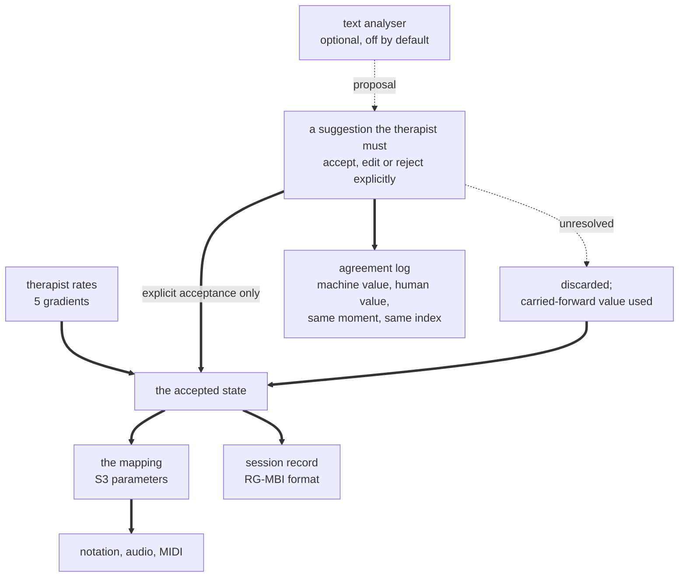

| Field | Value |
|:---|:---|
| Designation | MPN-PRD-01 |
| Title | The instrument: the two-node case of the MPN framework, rated rather than inferred |
| Author of the theory | J. McKenney |
| Status | Draft 6. Two additions, both of which the false regulatory premise had foreclosed. Section 7.6 specifies the timbre channel, which is live because a synthetic character's DISC profile is assigned rather than measured: the two-node case reaches the channel's full diameter with no search, the tension between assigning for meaning and assigning for audibility is stated rather than resolved, and the instrument is required to compute and show the audible fraction of every assigned pair so that a deaf assignment cannot pass as a similar one. And the first open question of section 14, the Autonomy mapping and Partner's dead band, is answered by MPN-DESIGN-01 section 11 and recorded here as a ruling with four conditions instead of standing open [17]. Draft 5. The author extended the scope ruling of 13 September 2026 to this document: theory and internal private use, synthetic material, no people, no personal data, not in the EU, no regulatory restrictions. The whole of the old section 8, most of section 10 and the gates of section 13 rested on the premise that this was a product for real clients, and that premise is withdrawn. Draft 4, for the author's review. Drafts 1, 2 and 3 were returned with fifteen, six and four blocking findings, all verified and all correct. The largest were that draft 1's override semantics routed unreviewed machine output to a client, that its safety section was written for one attentive verbal adult, that it attributed to MDCG 2019-11 a sentence not in it, and that draft 3's live-use gate bounded each change without bounding their accumulation. This is the first document in the programme that is not an audit. **The programme's standing caveat on its empirical position was added at the head of section 1 on 14 September 2026**, naming which of the instrument's claims rest on the four unrun studies, together with two sentences marking, where each is made, a claim that turns on a choice nobody has taken |
| Supersedes | The MPN Conductor and `mpn_engine` as products. Both are retained as proofs of concept and as reference implementations, and neither is a release candidate |
| Rests on | S1 to S4 and their rulings [1], [2], [3], [4]. Where this document states what the software does today it cites the paper that established it and does not re-derive it |
| Reproduces | `05_DATA/03_generators/s5_salvage.py`, which prints the carry-over manifest of section 9 and asserts that every artefact it names exists at the path it gives |
| Decisions locked by the author | Dual input with rated override; rebuild with the proofs of concept as reference; quantities renamed to what they measure. **The fourth lock, a non-device practitioner tool, is withdrawn**: it was a regulatory posture and there is no regulator here |
| Scope | Theory and internal research on synthetic characters and generated or scripted dialogue. Nobody is assessed, nothing is deployed, no claim is made to anyone. Every requirement below is technical, musical or epistemic |
| Length | About 7,500 words of body text, counting alphabetic tokens outside tables and code fences |

## Contents

1. What this document is, and what changed
2. The product in one page
3. Who it is for, and what they do now
4. The four decisions, and what each forecloses
5. The quantity model, renamed
6. The dual-input architecture
7. What the framework produces
8. The claims boundary, and how it is enforced
9. What carries over from the proofs of concept
10. Safety
11. The validation roadmap
12. Non-goals
13. Release gates
14. Open questions for the author
15. References

## 1. What this document is, and what changed

**The standing caveat, before anything this document specifies.** No listener has been asked anything, and every empirical claim in this programme is untested. Everything the programme holds it produced itself: 31,078 scored rows and 232 annotated frames, both outputs of the system under study [4]. The listening pack is built, blinded and published, and it has been sent to nobody. Two earlier listener studies exist and neither is citable, their stimuli having come from an unseeded generator [1].

**Four studies are specified in section 11 and not one of them has run.** What rests on each belongs here rather than at section 11, because a reader meets the requirements before the roadmap. **Study 1 carries section 5's quantity model and section 6's authoritative path.** The five gradients are the state; that two raters watching the same material set the same gradients is an assumption until a weighted kappa comes back, and a gradient that fails it is not a rating item. **Study 2 carries section 7.1's outputs and the mode of section 7.2.** That material rendered from two different states is distinguishable in the direction the theory predicts is the claim the instrument exists to make, and section 7.2 already labels the seven-mode map untested in its own words. **Study 3 carries section 6.4's interaction budget and the analyser proposal it feeds**, including the shipping rule that disables a proposal overridden more often than chance would predict. **Study 4 carries the corpus claim of section 4.3 and nothing else.** **And section 11.5 governs all four**: none of them produces an observation of trauma, entropy or a register that the system did not itself produce, so the instrument's inputs remain assigned rather than measured after every one of them passes [1].

Four papers audited a theory and two programs that implement pieces of it. S1 states the McKenney-Lacan calculus as assertions with falsification conditions [1]. S2 establishes its formal apparatus and finds the state space eight-dimensional in nine named coordinates, which S2 is careful to call an observation rather than a theorem [2]. S3 states the mapping from state to musical material parameter by parameter [3]. S4 reports what the software actually does and finds, among other things, that the two programs share no code, that one of them implements no psychology at all on the path that produced the programme's evidence, and that the corpus contains no observation of anything that the system did not itself produce [4].

**That was the point of the proofs of concept and they discharged it.** The MPN Conductor and `mpn_engine` were built to find out whether the theory could be made to run, and the answer is that most of it can, that some of it was never wired up, and that the parts which were wired up were pointed at the wrong material. Knowing which is which is what four papers bought. An experiment that produces a clear negative is not a failed experiment, and this document does not treat either program as a failure. It treats them as finished.

This document specifies what replaces them: **one framework, therapist-operated, that turns psychological state into musical material in a way a clinician can inspect, override and document.** It is a product requirements document and not a theory paper. Where it needs a fact about the theory it cites S1 to S3; where it needs a fact about the current software it cites S4; and where it needs a fact about music therapy practice it cites the literature, because the proofs of concept were built without reference to that literature and it changes several things.

The single most consequential thing the research changed is section 3. The programme has been building an instrument for a profession that already has instruments, already has a scope of practice, already has a reporting standard, and already has a documented view of what technology it wants. None of that was in the proofs of concept.

## 2. The product in one page

**Working name.** The instrument. It is deliberately not a clinical-sounding name, for the reasons in section 8.

**What it is.** A therapist-operated tool that takes a description of where a client is, in musical and relational terms the therapist recognises, and renders musical material from it: notation the therapist can read and play, a rendered audio version, and MIDI for use in a DAW. It also keeps a session record in the field's own reporting format.

**What it is not.** It is not a therapist, it does not assess anyone, it does not diagnose, it does not recommend treatment, and it produces no score, index or number that describes a person's health. Section 12 is the list of things it deliberately will not do, and it is longer than usual because the proofs of concept did several of them.

**Why it is different from what exists.** A 2026 survey of generative AI music therapy systems finds that none of the five systems it reviews trains on clinically annotated data, that therapeutic intent is "injected post hoc via textual prompts rather than being embedded within the model's generative priors", that large-scale trials of AI-driven music therapy "remain scarce", and that two of the five provide "limited discussion of therapist-facing interfaces or interpretability mechanisms" [5]. Every one of those is a gap this framework is shaped to fill, and it fills them by being the opposite kind of system.

**The MPN calculus is a white box.** It is a stated set of rules from a named state to named musical parameters, written down before any code, audited to the point where four papers can say exactly which rules run and which do not. It will not out-generate a diffusion model and it does not try to. What it can do, and what the survey reports no reviewed system addressing, is answer the question a clinician asks after every surprising output: *why did it do that?* The answer is a chain of named rules with the therapist's own inputs at the top of it. That property is also what keeps the product on the right side of two regulators, which section 8 sets out.

**The wedge.** The same survey's recommendation, and the finding of a 2024 survey of 104 board-certified music therapists, point the same way: automate the recurring annotation and documentation work so that clinicians "devote more time to foster deeper client-therapist relationships" [5], [6]. The instrument earns its place in a session by producing the documentation as a by-product of being used.

## 3. Who it is for, and what they do now

### 3.1 The primary user

A board-certified music therapist. In the United States that is the MT-BC credential, granted by the Certification Board for Music Therapists after an AMTA-approved academic programme, a minimum of 1,200 supervised clinical hours and a national examination [7]. The AMTA and CBMT scope of practice defines music therapy as "the clinical and evidence-based use of music interventions to accomplish individualized goals for people of all ages and ability levels within a therapeutic relationship by a credentialed professional who has completed an approved music therapy program" [7].

Two phrases in that definition are requirements on this product. **"Within a therapeutic relationship"** means the software is never the therapeutic agent; it is an instrument inside a relationship between two people. **"Individualized goals"** means the framework must attach to goals the therapist sets, not to goals it infers.

### 3.2 What they use today

A 2024 survey of board-certified practitioners, 104 respondents, classified technology across the phases of practice [6]. In session, the diversity is greatest: electric and electronic instruments at 42.3 per cent, recording via digital audio workstations at 21.2 per cent, streaming at 24 per cent, acoustic instruments at 18.3 per cent, recording equipment at 14.4 per cent. In documentation and evaluation the picture narrows sharply to electronic health record software, 26 per cent and 21.2 per cent, with note-taking and data-entry tools behind it.

Three things follow for the product. The therapist already has a DAW and already records, so **MIDI and audio export are not conveniences, they are the integration surface**. The documentation phase is owned by the EHR, so **the instrument must produce records that leave it**, not records that live in it. And barriers to adoption in that survey are "clinicians' lack of training, lack of access" and environment, which is an argument for a tool that is useful in the first session without a course.

### 3.3 The instruments the field already has

The programme has been inventing a rating scheme. The field has several, and two matter here.

**Bruscia's Improvisation Assessment Profiles.** Six profiles, Integration, Variability, Tension, Congruence, Salience and Autonomy, each rated on a scale of five discrete gradients, applied to musical parameters including rhythm, tempo, volume and timbre [8]. The Autonomy profile's five gradients are Dependent, Follower, Partner, Leader and Resister, and it "deals with the kinds of role relationships formed between the improvisers" [8]. This is, in the field's own vocabulary, a mapping from clinical observation to musical parameters, which is the same shape as the map S3 specifies and is forty years older.

**The Nordoff-Robbins scales.** Evaluation Scale I, Client-Therapist Relationship in Musical Activity, has published interrater evidence: 34 certified music therapists rated 10 video excerpts, and 78 per cent of all raters scored within one point of the group mean, 82 per cent among Nordoff-Robbins-trained raters and 74 per cent among untrained [9].

**One distinction before the consequences, because the IAPs are an assessment instrument and section 12 says the product does not assess.** Both are true, and the line between them is where the professional act sits. The therapist assesses, which is within their scope and their credential [7]; the product records what they assessed, in the vocabulary they used. Borrowing an assessment instrument's gradients for a recording surface does not make the recorder an assessor, in the way that a form does not diagnose. The product is never described as applying the IAPs, only as recording a therapist's IAP-derived rating.

Two consequences follow, and the second is the more important.

First, **the therapist-facing rating surface should speak IAP, not MPN.** A therapist who already rates Autonomy on a five-point gradient should not be asked to rate the Imaginary register on the unit interval. Section 6 specifies the rating surface in IAP terms and maps it into the calculus behind the glass.

Second, **do not ship all six profiles.** Wigram, who did more than anyone to make music therapy assessment rigorous, applied Bruscia's profiles selectively and used only two of the six in practice: Autonomy, for "the readiness of the child to interact with others, and his or her turn-taking, sharing and behavior as a musical partner", and Variability, for creativity and the rigidity or flexibility of a client's playing [10]. Version one ships those two.

Wigram's own phrasing links rigid playing to a possible diagnosis [10]. **That phrasing does not travel into the product.** Section 8.2 prohibits a named condition beside a claim of effect on any product surface, and an anchor descriptor a therapist reads every session is precisely where such a phrase would propagate. The anchors describe the playing and say nothing about what it might indicate.

### 3.4 The evidence the field rests on, stated honestly

A 2022 update of systematic reviews across autism, dementia, depression, insomnia and schizophrenia concludes that music therapy is "a safe and low-threshold method" with improvements "in terms of physical, psychological and social aspects", and states plainly that "no study of high quality was found, and, therefore, these findings may not be reliable" [11]. A 2026 review reaches a similar place: the evidence is strongest in dementia, and elsewhere rests on small sample sizes, heterogeneous designs and short follow-up, with adverse events inconsistently reported [12]. **The absence of reported harms is not evidence of safety.** That same review says rigorous evidence on potential harms remains sparse, which is a statement about what has been looked for rather than about what is there.

The instrument is being built into a field whose evidence base is thin and knows it. That is an argument for building the thing that produces better evidence, which is section 11, and it is an argument against any claim language that implies the underlying therapy is more established than it is.

## 4. The four decisions, and what each forecloses

The author locked four decisions before this document was written. Each is recorded with what it buys and what it gives up, because a requirements document that only records the upside of a decision is not usable later when someone asks why.

### 4.1 Synthetic subjects, which is what the scope ruling buys

**The decision.** The subject of the instrument is a character, not a person. A dramatic role, a generated speaker, a scenario the author writes. The state is **assigned** rather than inferred.

**What it buys, and it is more than the removal of a constraint.** Four papers of audit were scored against a standard this work does not have to meet. S1's governing sentence is that the corpus contains no observation of trauma, entropy or the registers that the system did not itself produce [1]. Against a real person that is a fatal gap: you claim to measure someone and you have measured your own formula. **Against a character there is nothing to observe.** Hamlet has no trauma to go and measure. An author assigns it, which is not a measurement failure but the only way fiction works.

So the sentence stays true and stops being a defect, and the theory's assertions change character with it. A1's nine-component state is a definition. A2 and A3's competing registers are claims about a state space, testable analytically. A4, A5, A8 and A11 are claims about a **mapping**, and a mapping is tested by listening rather than by validating an instrument against a population. Not one of them needs a person measured.

**What it forecloses.** Any claim that a state value corresponds to a real psychological condition in a real person. That claim is not being made and nothing here needs it.

**And it makes DISC available immediately**, which the regulatory framing had written off. Section 5.4.

### 4.2 Dual input with therapist override

**The decision.** The analyser proposes a state; the therapist confirms or corrects it; the therapist's value is what drives the music and what is recorded.

**What it buys.** It is the only one of the three options that generates the data the programme has never had. Every explicit acceptance or edit is a paired observation: what the machine proposed, what a credentialed human decided, on the same material at the same moment.

**No such comparison has ever been made in this programme**, and it is worth being exact about that, because an earlier draft of this document implied S4 had attempted one and been defeated by indexing. S4 withdrew a different comparison: between two corpora, the seven score files against the 232 frames, aligned on a normalised position the two do not share [4]. A machine-against-human comparison could not have been made on that material at all, since S4 section 4.5 establishes that the frames' trauma and entropy are the author's own literals, the registers are the analyser's, and DISC is not produced. The architecture here does not repair S4's comparison. It produces a different one, for the first time.

**What it forecloses.** It costs therapist attention in session, which is the scarcest thing in the room, so section 6.4 constrains the interaction budget hard. It also means the analyser can never be removed later without losing the data stream, and it means the product has a component in it whose validity is unestablished, which section 8.3 handles by never letting that component's output reach a user as an assertion.

### 4.3 Rebuild, with the proofs of concept as reference

**The decision.** A new codebase. Named parts are ported from the Conductor. `mpn_engine` goes outside the programme, which resolves S4-2 on its second branch [4].

**What it buys.** The defects S3 and S4 found are structural rather than local: a mode that is computed and discarded, a composer that receives a literal instead of the state, a psychology module that is constructed and never called, an operator that is not the operator it is named for. Fixing those in place means touching most of the files anyway, with the wrong architecture underneath.

**What it forecloses.** The only route the programme had to scored text at corpus scale. `mpn_engine` is what could have taken twenty-five single-work texts to line resolution; the frame library is thirteen works at scene resolution. S4 named this cost and it is real [4]. Section 11.4 says what replaces it.

### 4.4 Rename every quantity to what it measures

**The decision.** Section 5 is the new vocabulary. The clinical health score is deleted rather than renamed.

**What it buys.** It removes the most dangerous artefact in either codebase. `mpn_engine` ships a column called `CLINICAL_HEALTH_SCORE`, out of ten, which S4 establishes is trauma inverted onto ten points, where trauma is itself 99.4 per cent the row's position in a text file [4]. A number labelled clinical health, in a clinician's hands, that is really a row counter is not a naming problem. It is a patient-safety problem, and it is the single strongest argument in this document for not shipping the proofs of concept to anyone.

**What it forecloses.** Continuity with the four papers' vocabulary. Section 5.4 carries the mapping table so the papers remain readable against the product.

## 5. The quantity model, renamed

### 5.1 The rule

**Every user-visible quantity is named for what it measures, in the vocabulary of the profession that will read it.** Where a quantity is the therapist's own judgement it is named as a judgement. Where it is computed it is named for its input. No quantity carries a name borrowed from mathematics, psychoanalysis or medicine unless it is that thing.

### 5.2 What the therapist sees

| Product name | What it is | Range | Source |
|:---|:---|:---|:---|
| Relational stance | The IAP Autonomy gradient: Dependent, Follower, Partner, Leader, Resister | 5 gradients | Therapist's rating [8] |
| Musical variability | The IAP Variability gradient, rigid through to unstable | 5 gradients | Therapist's rating [8] |
| Arousal | How activated the client presents, low to high | 5 gradients | Therapist's rating |
| Valence | How the affect presents, negative to positive | 5 gradients | Therapist's rating |
| Session intensity | Where this moment sits in the arc the therapist is shaping | 5 gradients | Therapist's rating |

Five ratings, each five-way, each anchored with written descriptors, two of them taken directly from an established instrument.

**The naming rule binds every surface a client or a non-specialist reader can reach**: the rating interface, the session record, the exported documents and the section 7.4 explanation. None of them uses trauma, entropy, Real, Symbolic, Imaginary, curvature or health. The theory's vocabulary survives in three places only, all of them addressed to a reader who has the papers: the engine internals, the mapping table in section 5.4, and the papers themselves. Section 8.4's golden-output test is what enforces this on the explanation, which is generated and therefore cannot be checked by reading the source.

Arousal and valence are the two dimensions of the circumplex the AI music therapy literature already uses for affective modelling [5], so a therapist and a reader of that literature will both recognise them.

### 5.3 What is deleted outright

| Removed | What it was | Why |
|:---|:---|:---|
| `CLINICAL_HEALTH_SCORE` | Trauma inverted onto ten points | S4 s4.2: not a measurement of health [4] |
| `TRAUMA_R` as shipped | 0.8 times row over total, plus keyword hits | S4 s4.3: 99.4 per cent row position [4] |
| `ENTROPY_H` as shipped | A weighted punctuation count | S4 s4.4: at its floor on 72.8 per cent of rows [4] |
| `BASELINE_B` | One minus row over total | S4 s4.3: the same ramp again [4] |
| `ARRHYTHMIA_α` | A speaker-change flag | S4 s4.4: not a rhythm, an arrhythmia or a coefficient [4] |
| The OCEAN profile | Big Five by word list | S4 s2.1: zero use sites; s2.2: no factor can fall below 0.5 [4] |
| The DISC profile | Four coordinates by word list | S4 s2.1: zero use sites. Decision 9 of the decision log leaves DISC unset pending an instrument, and `inferDISC` returning null is S4 s4.5 [4] |

### 5.4 The mapping back to the theory

The calculus keeps its own vocabulary inside the engine and in the papers. The mapping is published rather than hidden, because a therapist who reads S1 should be able to follow it, and because concealing the theory behind the product is how a white box becomes a black one.

| Theory term (S1 to S3) | Product term | Relationship |
|:---|:---|:---|
| Trauma, $\tau$ | Session intensity | The therapist's rating replaces the computed ramp entirely |
| Entropy, $H$ | Musical variability | Mapped from the IAP Variability gradient |
| The register triple, $(r, s, i)$ | Relational stance | Mapped from the IAP Autonomy gradient, section 6.3 |
| DISC, $(D, I, S, C)$ | **Assigned per character** | Decision 9 left DISC unset because nothing could measure it in a person. A character has no DISC to measure either: the author assigns it, as with trauma and entropy. **The timbre channel is live**, and S3 section 2.6 already specifies it |
| The mode | The mode | Unchanged, and see section 7.2 |

## 6. The dual-input architecture

### 6.1 The shape

Three paths reach one state, and only one of them is authoritative.

### 6.2 The authoritative path

The therapist's five gradients are the state. They are sufficient on their own: **the product is fully usable with every optional input switched off, and ships with all of them off by default.** That is a requirement and not a preference, and it binds each input separately rather than the analyser as a class. It means the product's core value never depends on an unvalidated component, and it means a therapist who distrusts the analyser is not a therapist who cannot use the tool.

Each gradient carries a written anchor descriptor at every level, in the manner of the IAPs and the Nordoff-Robbins scales. The anchors are the instrument; the numbers are a convenience.

### 6.3 Mapping the Autonomy gradient onto the register triple

The IAP Autonomy gradient and the register simplex are different objects and the mapping between them is a design decision, not a discovery. It is stated here so it can be argued with.

| Autonomy gradient | Register emphasis | Reasoning |
|:---|:---|:---|
| Dependent | Imaginary-weighted | The client's playing is organised around the other as image rather than as partner |
| Follower | Imaginary to Symbolic | Rule-taking without rule-setting |
| Partner | Balanced, near the barycentre | Mutual regulation, which is where argmax is a three-way tie rather than absent, on the tripod S2 shows it is discontinuous along [2] |
| Leader | Symbolic-weighted | The client sets the structure the other follows |
| Resister | Real-weighted | The client's playing refuses the shared structure |

**Two warnings attach to this table and both must survive into the code comments.** It is an interpretation of a clinical instrument in the theory's terms and has no empirical warrant whatever; nothing in S1 to S4, and nothing in the IAP literature, tests it. And the Partner gradient lands at the barycentre, which S2 shows is where the tripod meets: argmax is discontinuous not at that point alone but on the whole of the three segments joining the barycentre to the edge midpoints [2]. Partner therefore lands in a set with undefined neighbours all around it, which is a weaker and more awkward correspondence than a single distinguished point would have been. That is either an elegant correspondence or a sign that the mapping is being fitted to the geometry, and the author should decide which before it ships.

### 6.4 The interaction budget

Therapist attention in session is the constraint that governs this design. The requirement is stated as a budget rather than as a principle.

**Version one ships prepared use only**, per section 10.2, so the budget below is what makes preparing and revising a passage between moments quick rather than what makes live improvisation possible. It is written to the live standard deliberately, because a budget that only works when nobody is waiting is not a budget.

**Setting a state must take under ten seconds and no more than five interactions.** Five gradients, one tap each, defaults carried forward from the previous moment. Anything that cannot be done inside that budget belongs after the session, not in it.

**The analyser's proposals must never interrupt, and must never take effect by default.** They appear beside the gradient as a suggestion, never as a modal, a prompt or an alert, and never as a pre-filled value that becomes the state if nobody touches it. **Acceptance is affirmative.** A proposal the therapist has not explicitly accepted or edited does not enter the state; the engine uses the carried-forward therapist value, and where there is none it refuses to render rather than guessing.

The distinction is not pedantic and it is the reason this paragraph exists. A pre-filled default that takes effect through inaction routes an unreviewed machine value to a client through the most ordinary event in a clinical session, which is a therapist attending to the person in front of them rather than to a screen. It also destroys the agreement log, because an unnoticed default recorded as a therapist's decision is a human judgement that was never made. **An unresolved proposal is logged as unresolved**, never as a rejection.

**Nothing blocks on the network.** The rendering path runs locally. A session does not stop because a server did.

### 6.5 The agreement log

Every moment where the analyser proposed writes one row, whatever happened next: the gradient, the proposed value, the outcome as one of accepted, edited, rejected or **unresolved**, the resulting value where there is one, the timestamp, the pseudonymous session identifier, and the analyser, ruleset and build versions of section 7.5. The unresolved category is not optional bookkeeping: sections 6.4 and 11.3 both depend on it, and a schema without it would record a decision nobody made. That is the paired data set. It is the product's most valuable by-product and section 11 is built on it.

It is not shown to the therapist as a score, a match rate or a confidence figure. A therapist who can see how often they agree with the machine is a therapist being trained by the machine, which would corrupt the very measurement the log exists to make.

## 7. What the framework produces

### 7.1 The outputs

**Notation**, multi-stave, rendered in the browser, one stave per voice in the therapist's configuration. Ported from the Conductor's VexFlow renderer, which S4 records as working [4].

**Audio**, played locally against sampled instruments, and exportable as a file.

**MIDI**, because section 3.2 establishes that the DAW is where the therapist already works and is therefore the integration surface.

**A session record** in the field's reporting format, section 7.3.

**An explanation**, section 7.4, which is the output the 2026 survey reports no reviewed system offering [5].

### 7.2 The mode, and an honest constraint

S3 maps the dominant register to one of seven diatonic modes [3]. The evidence base does not support a seven-way distinction.

A systematic review of the major-minor dichotomy finds the major-happy and minor-sad association robust, developing from 58 per cent correct at age four to 92 per cent in adults, and replicated in Japanese and Chinese samples, while also finding that "major mode does not induce greater happiness than minor in a group of people with minimal exposure to Western music", and that about 70 per cent of listeners "performed near chance when asked to classify rapid tone-scrambles" [13]. The authors' reading is that psychoacoustic predisposition becomes a "established cultural-based emotional connotation" through exposure [13].

Three requirements follow.

**The seven-mode map is used and labelled untested.** The old framing was about what could be claimed to an outside reader, which does not apply to private work. The author can render all seven, listen, and form a view; what the map cannot yet do is carry an argument to someone else. A second question sits underneath that one and is not the same question: which register takes which of the seven is one of four incompatible tables in the corpus, and the choice among them is under test as Part A of the published listening pack, so what the author would be forming a view about is not yet a single map [3].

**The major-minor axis may carry a weak, hedged interpretation**, because it is the one part of the map with a real evidence base, and even that is culturally conditioned.

**Mode selection is configurable per client**, because the review's cross-cultural finding means a fixed mapping is wrong for a client outside the Western listening tradition. This is a clinical setting, not a preference.

### 7.3 The session record

The record schema is the Reporting Guidelines for Music-based Interventions checklist, whose 2025 revision has eight components across twelve items [14]. Using the field's own reporting standard means anything a therapist produces is publishable and comparable without transcription, and it means the validation studies in section 11 report in the format reviewers expect.

| RG-MBI component | How the instrument fills it |
|:---|:---|
| 1 Brief name | Therapist-set, per intervention |
| 2 Theory or scientific rationale | Therapist-authored. Any system-supplied text is the section 7.4 rule chain carrying the standing disclosure of section 8.5, and cites nothing: presenting S1 to S3 as the scientific rationale for a clinical intervention, to a reader who has not read S4, would breach section 8.2 |
| 3a Music selection | The state and the rules that acted on it, captured automatically |
| 3b Music | Mode, tempo, metre, dynamic and harmonic material, captured automatically |
| 3c Music delivery method | Therapist-set: played live, rendered, or client-created |
| 3d Materials | Therapist-set, with the instrument configuration pre-filled |
| 3e Intervention strategies | Therapist-set, against their own goals |
| 4 Interventionist | Credential and training, set once |
| 5 Individual or group | Therapist-set, with group size |
| 6 Setting | Therapist-set: location, privacy, ambient sound |
| 7 Delivery schedule | Session count, length, frequency, captured automatically |
| 8 Treatment fidelity | The agreement log, and the deterministic seed of section 7.5 |

Most of the automatically captured fields are free at the point of use, which is the whole argument for the product from section 3.2.

### 7.4 The explanation, which is the differentiating output

Every rendered passage carries a plain-language chain from the therapist's inputs to the musical material, naming every rule that fired and every value it read.

> You set relational stance to Partner and musical variability to 2 of 5. Partner sits between leading and following, so no single mode was clearly indicated and the music blends the two nearest rather than jumping between them. Session intensity at 4 of 5 set the volume to the fourth of eight levels and widened the chord movement by one step. Variability at 2 of 5 kept the melody whole rather than breaking it into fragments. Nothing here was chosen at random, and setting the same five ratings again produces the same music.

This is the first fixture in section 8.4's golden-output suite, and it is written in the vocabulary section 5.2 permits rather than the theory's, because section 10.6 requires it to be deliverable to a client or their advocate. Note what it does not contain: no register name, no operator name, no band, no seed string, and no word a non-specialist would have to look up.

The 2026 survey reports interpretability as an open challenge across the systems it reviews and describes no system that offers this [5]. It is what makes the tool arguable with, which is what a clinician needs. It is also, not coincidentally, what MDCG 2019-11 and the FDA CDS guidance both care about, section 8.

### 7.5 Determinism

The keyed generator ports unchanged. S4 establishes that the score path already has zero unseeded draws and that eleven keyed draws run against eleven key constructions [4]. Every rendered passage is a pure function of the state, the configuration and the seed, and the seed is in the session record.

Determinism is a requirement here for a reason it was not in the proofs of concept: if a therapist cannot reproduce what a client heard last week, the record is not a record.

**The seed alone does not achieve that, and S4 says why.** A change to the seeding algorithm changes every stimulus in the programme, and S4 makes it a condition that any stimulus set published for reuse be published as audio rather than as a promise that the code will regenerate it [4]. The clinical record has the same problem and less tolerance for it. So the record carries the seed, the `SEED_ALGORITHM_VERSION`, the ruleset version and the application build; and where a passage matters clinically, the rendered audio itself, because a version quartet is a promise and a waveform is a record.

### 7.6 The timbre channel, and what the two-node case gets for nothing

Decision 9 left the DISC profile unset because nothing could measure it in a person, and S3 recorded the consequence: the one channel its section 2.6 analyses is the one channel the application cannot exercise [3]. **A character has no DISC to measure either, so the author assigns it**, and the channel is live. The design document's section 5b works out what that buys, and revision 8 of it narrows the result, so what applies here is the narrowed form and not revision 7's [17]. "Six is the capacity" is struck. What stands is that six is the largest cast that costs nothing a five-character cast does not already cost, **conditional on the perceptual resolution of the timbre space lying at or below the square root of two**, and that resolution is unmeasured. The window is narrow, (1.0898, 1.4142], and it has narrowed at every harder search; outside it the answer changes rather than degrading [17], [18]. Part D of the listening pack is the experiment that would fix the resolution, it is built and published and has been sent to nobody, so six is a conditional and not a capacity for as long as that stays true [3]. The two-node case below does not depend on any of that, which is why it is the case this document builds on.

**The two-node case is the best case and it needs no search.** Maximum separation in the timbre space is attained by any pair of profiles differing in opposite senses on two coordinates, so a paradigm client at $(1, 1, 0, 0)$ and a therapist voice at $(0, 0, 1, 1)$ sit at opposite ends of the channel's full diameter. Two characters is the one cast size where the optimum is exact, trivial and requires no compromise with anything else.

**But maximum separation is not automatically the right assignment, and this is the honest tension.** A profile is supposed to say what the character is like. If the author assigns two profiles because they mean something, they may be close together in the channel or identical in it, and the instrument will render two clinically different characters with the same timbre while every other parameter says they differ. **The check is one line and it belongs in the build rather than in a reviewer's head**: take the difference of the two profiles, compare its magnitude component against its length, and if the ratio is near one the two are inaudible through timbre however far apart their scores look. Two profiles differing by a constant added to all four coordinates render identically, and that is not an edge case: it is where a careless assignment lands, because the natural way to say "the same shape, more of it" is exactly the direction the channel cannot carry.

So the requirement is neither "assign for meaning" nor "assign for audibility". It is that **the instrument computes the audible fraction of every assigned pair and shows it**, and an assignment that comes out near zero is declared on the therapist's screen in the same way a collapsed mode channel is, under the rule of section 6.3's collapse check. A flat timbre from two indistinguishable profiles and a flat timbre from two genuinely similar characters must not look alike.

**The instrument family needs the same remap the design specifies.** The shipped selector takes the largest of the four coordinates, which is invariant under adding a constant to all four, so it carries the deaf direction into the family label as well [3]. Worse for this case, the maximally separated pair sits exactly on a tie, two coordinates at the top by construction, so the family label is undefined precisely where the continuous channel is best. **The diagnosis stands and the remedy this draft named does not.** Revision 8 of the design withdraws D51, the six families keyed to the six canonical contrast directions, on the ground that a label which is a deterministic function of the three coordinates it labels carries nothing those coordinates do not already carry, and deletes the categorical residue the parameter was put there to hold. Item TC-1 is reopened as an open problem rather than solved, and it is the author's, being a question about what the family parameter is for [17].

**What this does not give the instrument.** It does not give DISC any warrant. An assigned profile is the author's statement about a character they wrote, which makes it Layer 2 material rather than a measurement, and no amount of audible separation makes it true of anybody. What it gives is a channel that was written off across two documents and has been buildable the whole time.

## 8. What the instrument is careful about, now that nothing legal applies

The old section 8 was a claims boundary: an allowlist and denylist of marketing language, a lint in continuous integration, a named owner, a quarterly regulatory review. All of it existed to keep a product on the right side of two regulators. There is no product and there are no regulators, and it is deleted rather than softened.

**One discipline survives and it is not legal.** A quantity is called what it is. A ramp is not trauma, a punctuation count is not entropy, and nothing is called a clinical health score. That rule came from S4 finding a column named `CLINICAL_HEALTH_SCORE` that was trauma inverted onto ten points, where trauma was 99.4 per cent a row counter [4]. Naming a thing wrongly is how a programme deceives itself, which is a research failure before it is ever a regulatory one, and section 5 is where that rule lives.

**And the explanation of section 7.4 stays**, for the same reason. A rule chain that says why a passage came out as it did is what makes the instrument arguable with. That was never a compliance feature; it was always the point.

## 9. What carries over from the proofs of concept

`s5_salvage.py` prints this manifest and asserts that every artefact exists at the path it names; it caught one stale path when it was written, which is the point of the assertion. Nineteen artefacts: four ported, seven repaired, two rewritten, six dropped.

### 9.1 Ported

| Artefact | What it is | Warrant |
|:---|:---|:---|
| `src/lib/deterministic.ts` | The keyed generator | S4 s7: zero unseeded draws on the score path [4] |
| `ConductorScoreVexFlow.tsx` | Multi-stave notation rendering | S4 s8: renders and plays, and that works [4] |
| `literary_data.ts` | 119 frames | S4 s4.5: the trauma and entropy are the author's judgements [4] |
| `additional_plays.ts` | 113 frames, 232 in total | S4 s4.5 [4] |

The frame library is ported for a specific and limited purpose. It is **the only set of human judgements the programme has**, and section 11.1 uses it as the seed corpus for the rating instrument's anchors. It is not evidence about anything, for the reasons S1's governing sentence gives [1].

### 9.2 Repaired

| Artefact | The named defect |
|:---|:---|
| `leitmotif_generator.ts` | `retrograde_inverted` is bit-identical to `inverted` and unreachable from the selector; `selectTransformation` never reads the Symbolic [4] |
| `score_orchestrator.ts` | No `mode` field on the output and an `as any` cast hiding it, S3-1; the undocumented stave decay of 0.1 per frame [3], [4] |
| `GeniusComposer.ts` | `composeMelody` passes a literal register triple at line 161 instead of the state, S3-2 [3] |
| `mpn_reference_data.ts` | Three dynamic entries where decision 6 makes eight normative, S3-3; the metre hole at entropy 0.5 to 0.6, S3-5; tempo reaching 35 of 141 integer values, S3-6 [3] |
| `leitmotif_transformation_rules.ts` | The superseded, correlated fragmentation and density pair, S3-4 [3]. `s5_salvage.py` also prints S3-8 against this artefact, and **this document excludes S3-8 from the repair set** for the reason below; the generator records the defect, the document rules on whether it may be touched |
| `score_exporter.ts` | The PDF export is a jsPDF text report, not notation [4] |
| `mpn_engine/core/tonnetz.py` | `transform_L` preserves no common tone; its group agrees with the published one on 50.0 per cent of ordered chord pairs [4] |

The operators are worth porting despite the defect: the published P, L and R on 24 consonant triads are a real and well-understood structure, S3 computes the Cayley metric of the correct group, and the repair is to implement the published definitions rather than the engine's [3], [4].

**One repair is barred and the bar is inherited.** ARBITRATION-S3's twelfth entry, carried into the S4 ruling as its fifth condition, binds this series: S3-1 and S3-2 may be implemented at once, and **no modal table may be implemented under A4 until question 5a of the listening pack returns**, because 5a may change A4's mechanism and not merely its assignment [4]. S3-8, the trauma switch giving the Imaginary a partner against decision 4, is the author's item on exactly that ground. So the rebuild implements S3-1 and S3-2, and does not touch the modal or pitch tables, until 5a returns. Section 11.2's entry condition inherits the same limit: after those two repairs the mode reaching a score is a function of the registers on the path, and the table that path reads is still the shipped one, so the A4 study cannot run on it.

### 9.3 Rewritten and dropped

`psychometric_calculus.ts` is rewritten, because `analyzeRSI` is a keyword count over the author's own prose and `rsiToMode` with its `MODES` constant is dead [3], [4]. `dialogue_parser.py` is rewritten if text input survives, because it emitted `SPEAKER=STAGE` on 3,424 of King Lear's 3,425 rows [4].

Dropped: `mpn_calculus.py` with all six computed columns, `dynamics_mapper.py`, `instrument_mapper.py`, one of the fifteen visualisations as the manifest's representative of that class with the other fourteen pending S4-7, the whole of `ml/psychoscore_v2`, and `docker-compose.yml`. The warrants are in section 5.3 and in S4 sections 2.1, 4.2, 4.3, 6 and 6.1 [4].

**One drop is not a technical decision.** `docker-compose.yml` carries a plaintext API key committed on 10 January 2026 and present in all 36 commits [4]. It does not travel, and S4-1 stands whatever this document says.

## 10. What the instrument still owes its listener

The old section 10 ran to nineteen hundred words: audition gates, per-client intensity ceilings enforced in the renderer, requirements for minors and for clients who cannot say stop, group consent, withdrawal paths, recording consent and protected health information. Every one of those existed because a real client might hear something they were not ready for. **There is no client. All of it is void.**

Four requirements survive, and none is a safety rule. They are instrument design.

**Nothing plays unbidden.** No autoplay, no preview on hover, no sound on load. A tool that makes noise when you did not ask is a bad tool whoever is listening, and the author is the one at the desk.

**A stop that is immediate.** One control, fixed position, silence inside 200 milliseconds. Same reason.

**The arc has a return in it.** The music therapy literature on trauma-informed practice makes the same point about sequencing within a session [15], and S1 records that trauma as defined has no way to decrease [1], and the proofs of concept made that a monotone ramp [4]. A generator whose intensity only rises is the wrong shape for a dramatic arc, never mind a session. Session intensity can fall and the renderer handles a falling arc as a first-class case. **This was always a musical finding and never a safety one**, and the old section buried it among the consent rules.

**The bound on intensity is a compositional control, not a guard.** A ceiling on dynamic range, tempo and harmonic distance is how an author shapes a piece. It stays, applied at generation so it travels into MIDI and audio exports, because it is useful, not because anyone must be protected from it.

## 11. The validation roadmap

This is the part the four papers were written to make possible. Each study has an entry condition, a design, a statistic with a threshold set in advance, and a claim it licenses on success.

### 11.1 Study 1: the rating instrument's reliability

**Question.** Do two credentialed therapists watching the same material set the same gradients?

**Why first.** The five gradients are the state. If they are not reliable, nothing downstream means anything, and the programme has never run this study for any of its quantities.

**Design.** Scenes from the frame library and from generated dialogue, rated independently against the written anchors. Raters are whoever the author can put in front of the material; no credential is required for a study nobody is going to publish, and no approval is required for a study with no human subject beyond the raters themselves. The frame library's 232 author judgements seed the anchor descriptors and are not rating data.

**Statistic.** The gradients are ordinal five-point scales, and the two statistics here are chosen for that rather than inherited. Primary: **quadratic-weighted kappa per gradient**, which is the appropriate agreement statistic for ordered categories and is the same statistic section 11.3 uses, so the two studies are comparable. Secondary, and reported alongside because the field reports it: intraclass correlation, two-way random effects, absolute agreement, **single-measures** since a single rater is how the instrument is used, with its confidence interval. Koo and Li's thresholds interpret the ICC: below 0.50 poor, 0.50 to 0.75 moderate, 0.75 to 0.90 good, 0.90 and above excellent, and their own recommendation is to judge on the confidence interval rather than the point estimate [16]; their guideline addresses continuous data, which is why it is secondary here.

**Thresholds and size set in advance.** A gradient ships as a rating item only if the lower bound of its 95 per cent confidence interval reaches 0.75 on both statistics. **On the ICC that boundary is Koo and Li's [16], the lower edge of "good". On weighted kappa it is a house threshold**, set at the same value for comparability and not taken from, whose guideline addresses continuous data; it is recorded as a choice so that a later reviewer can disagree with it rather than assume it was inherited.

**Size.** The planned design is 12 excerpts rated by 34 therapists, published with its power calculation before any data is collected. The Nordoff-Robbins study's 34 raters on 10 excerpts is the reference the design is set against and not a statistical floor [9]; it is matched here because a study of a new instrument in this field should not be smaller than the one it is measured against. If the power calculation returns a larger number, the study grows rather than the threshold moving.

**Licenses.** That the instrument's inputs are reliable between raters. Nothing else.

### 11.2 Study 2: does the mapping carry what it claims

**Question.** Given material rendered from two different states, can listeners tell them apart in the direction the theory predicts?

**Entry condition.** Study 1 passed; S3-1 and S3-2 repaired, since S3 establishes that the mode reaching a rendered score is not currently a function of the registers [3]; **and question 5a of the listening pack returned**, because until it does the table the repaired path reads is the shipped one, which S3-8 records as standing against decision 4, and section 9.2 bars changing it [4].

**Design.** Forced-choice discrimination on matched pairs, stimuli generated deterministically and published as audio rather than as a promise to regenerate, which S4 makes a condition of any stimulus set [4]. Musical training recorded as a covariate, since the mode literature finds expertise moderates perception and that around 70 per cent of listeners perform near chance on rapid classification [13].

**Statistic.** Discrimination against chance with the effect size and its interval. Registered before data collection. **The corpus holds two listener studies and S1 reports that neither can be cited**, because the stimuli came from an unseeded system and are not reproducible [1]. The first gave 24 participants a mean appropriateness of 4.2 on a five-point scale, and it tested a Symbolic-to-Lydian assignment that matches no shipped module: the only positive listener evidence in the corpus was collected on a table the programme never adopted. The second is a null, 48 participants, p = 0.72, effect size 0.08. This study is designed on the assumption that it may return a null too.

**Licenses.** On success, that the mapping is audible. Not that it is clinically useful.

### 11.3 Study 3: machine against human, from the agreement log

**Question.** How well does the analyser's proposal match the therapist's decision?

**Design.** No separate recruitment is needed: the agreement log accumulates from the first session, indexed to a clinical moment by construction. This comparison has never been made in the programme before; S4 withdrew a comparison between two corpora, which is a different thing [4]. Analysis is pre-registered and run at a pre-named sample size, planned at 1,000 proposal rows per gradient.

**This is not human-subjects research and nothing here is governed as such.** The ratings are judgements about characters in generated or scripted material. What the log measures is how a human rater and a machine proposal differ about fiction, which is a question about the analyser and not about anybody.

**Statistic.** Quadratic-weighted kappa per gradient, the same statistic as section 11.1, with the per-gradient override rate and the unresolved rate reported separately. **A gradient whose analyser proposal is overridden more often than chance would predict has its proposal disabled**, which is a shipping rule and not a research finding.

**Licenses.** Nothing external. It is an internal quality measure and section 6.5's requirement that therapists never see their own agreement rate stands.

### 11.4 Study 4: the corpus that replaces `mpn_engine`

Section 4.3 gave up the route to scored text at scale. What replaces it is narrower and better: **session-derived data from real use**, indexed to a real clinical moment, rated by a credentialed human, with an agreement pair attached. Twenty-five plays at line resolution was never evidence about anyone. A thousand rated clinical moments is a different kind of object, and it is the first thing in the programme's history that would be.

**Entry condition: none.** The old entry condition was ethics approval, client consent, de-identification, a data governance framework and a data protection impact assessment, all of which presupposed real clients. The corpus here is generated dialogue and rated scenes, so the only condition is that the generator of section 10a exists and the rating anchors are written.

### 11.5 What no study here produces

An instrument that observes a person. Every study above measures agreement between humans, audibility of a mapping, or agreement between a machine and a human. None of them produces an observation of trauma, entropy or a register that the system did not itself produce, which is S1's governing sentence and remains true after all four studies pass [1]. The programme should stop expecting the next study to close that gap, because none of these will.

## 12. Non-goals

**It does not assess a person**, because there is no person. It records a rating of a character, made by whoever is rating. The old wording deferred to a professional scope of practice that does not bind private theory work.

**It does not replace a human rater**, for one reason only: S4 established that deriving a stance from text was a keyword count over the author's own prose [4], and the framework's withdrawal of the Autonomy derivation says the same thing formally. The rating is the input because nothing else can produce it, not because a professional body says so.

**It does not generate audio with a learned model.** A rule engine that can explain itself is the product. Everything dropped in section 9.3 from `ml/psychoscore_v2` stays dropped.

**It does not listen to the room in version one, and that is now an engineering call rather than a legal one.** The reason was the consent and regulatory surface, which is gone. What remains is that the framework's own design puts audio ingest behind a specification of Ψ and a working class-A path, so it is sequenced later rather than ruled out.

**It does not score text at corpus scale.** That is `mpn_engine`, and section 4.3 put it outside.

**It is not a health record.** Documentation leaves for the EHR the therapist already uses [6].

**It does not recommend.** Not for legal reasons, which no longer apply, but because an unvalidated mapping producing advice is the failure mode S4 spent a paper documenting: a system's own output read back as a finding [4].

## 13. Release gates

| Gate | Condition |
|:---|:---|
| G0, usable at the desk | The five gradients have written anchors. Affirmative acceptance enforced, so a proposal nobody touched never becomes the state. Nothing plays unbidden and the stop control meets its 200 millisecond bound. No credential in source |
| G1, usable for the theory work | G0, plus the agreement log writing correctly with its unresolved category, the RG-MBI record exporting, determinism reproducing a passage from its seed and versions, and DISC assigned per character so the timbre channel renders, with the audible-fraction check of section 7.6 computed and shown |
| G2, a claim to anyone outside | Study 1 passed at its threshold on every shipping gradient, the S3-1 and S3-2 repairs landed, the modal tables untouched pending question 5a. **This gate exists because a claim to a reader needs evidence, not because anyone requires it** |
| G3, a claim about audibility | G2, plus question 5a returned, the modal table settled, and Study 2 run and reported whatever it finds |

**The gates now govern claims, not permission.** G0 and G1 are about whether the instrument works. G2 and G3 are about whether anything may be said to a reader on the strength of it, and a failed study is reported rather than re-run until it passes.

## 14. Open questions for the author

**The Autonomy mapping of section 6.3 is answered and the answer is recorded here rather than left open.** MPN-DESIGN-01 section 11 rules that the mapping survives, human-rated, and that Partner gets no dead band and must not have one [17]. The tripod worry was posed against argmax, which S3 replaced: under modal interpolation the barycentre is the most stable point on the simplex rather than the least [3]. A dead band is undefined at Partner, where the gap is permanently zero, and its failure mode is that a client moving from Resister to Partner would sound Real while a client moving from Dependent to Partner would sound Imaginary, so the one transition a therapist most wants to hear would be erased. Four conditions attach and they are the live work: fix the five triples numerically, run the collapse check before shipping, keep Partner away from a diatonic renderer until the rounding rule exists, and record that the mapping never acquires warrant by being used.

**Whether to assign DISC for meaning or for audibility.** Section 7.6 gives the two-node case a free optimum and then says why taking it may be wrong. The instrument can compute the audible fraction of any assigned pair and declare a deaf assignment, which is the mechanism. What it cannot do is decide whether a paradigm client's profile should be what the character is or what the channel can carry, and that is the author's call.

**Whether arousal and valence belong at all.** They are the AI literature's dimensions [5], not the theory's. They make the instrument legible to that literature and they add two ratings to a five-rating budget. Two of the five gradients are not from the McKenney-Lacan calculus, and the author should say whether that is a bridge or a dilution.

**Which client populations version one names.** Section 8.2 forbids naming a condition near a claim of effect, but the anchors have to be written for someone, and anchors written for a verbal adult client are wrong for a minimally verbal child.

**Whether the frame library ships in the product.** Thirteen dramatic works make a good demonstration and a bad clinical metaphor. A therapist who meets the tool through Hamlet may reasonably conclude it is a dramaturgy toy.

**The name.** "Conductor" implies the software directs. That was the right name for a proof of concept and it is the wrong name for an instrument a clinician holds.

## 15. References

[1] J. McKenney, "The McKenney-Lacan psychometric calculus," MPN-S1, `08_PAPERS/S1-mckenney-lacan-theory.md`, revision 3, with `MPN-S4-AMENDMENTS.md`.

[2] J. McKenney, "The formal apparatus of the McKenney-Lacan psychometric calculus," MPN-S2, `08_PAPERS/S2-mathematics.md`, revision 4 with the post-acceptance correction of 13 September 2026.

[3] J. McKenney, "The mapping: from psychological state to musical material," MPN-S3, `08_PAPERS/S3-mapping-phi.md`, revision 9.

[4] J. McKenney, "The application," MPN-S4, `08_PAPERS/S4-application.md`, revision 2, and `08_PAPERS/ARBITRATION-S4.md`.

[5] "A Focused Survey of Generative AI-Based Music Therapy Systems: Recent Progress and Open Challenges," *Applied Sciences*, 16(9), 4120, 2026. https://www.mdpi.com/2076-3417/16/9/4120

[6] "Classifying Technologies during the Assessment, Treatment Planning, Documentation and Evaluation Phases of Music Therapy: A Survey of Board-Certified Practitioners," *Proceedings of the ACM on Human-Computer Interaction*, 2024. 104 respondents. https://par.nsf.gov/servlets/purl/10558604

[7] AMTA and CBMT, "Scope of Music Therapy Practice," 2021. https://www.cbmt.org/wp-content/uploads/2021/09/AMTA-CBMT_Scope-of-Music-Therapy-Practice-091721.pdf

[8] K. Bruscia, Improvisation Assessment Profiles, 1987, as summarised by the Technical University of Applied Sciences Würzburg-Schweinfurt. Six profiles, five gradients each. https://ifas.thws.de/en/high-m/theory/improvisation-assessment-profiles-iap/

[9] Mahoney, "Interrater Agreement on the Nordoff-Robbins Evaluation Scale I: Client-Therapist Relationship in Musical Activity," *Music and Medicine*, 2010. https://mmd.iammonline.com/index.php/musmed/article/view/MMD-2010-2-1-4

[10] "Tony Wigram's Contributions to the Assessment of Children with Autism and Multiple Disabilities," *Voices: A World Forum for Music Therapy*. https://voices.no/index.php/voices/article/view/1983/1725

[11] "Effectiveness of music therapy for autism spectrum disorder, dementia, depression, insomnia and schizophrenia: update of systematic reviews," *European Journal of Public Health*, 32(1), 27, 2022. https://academic.oup.com/eurpub/article/32/1/27/6378748

[12] "Music therapy in health care practice: promise, pitfalls, and policy implications," *Frontiers in Human Neuroscience*, 2026. https://www.frontiersin.org/journals/human-neuroscience/articles/10.3389/fnhum.2026.1768102/full

[13] "The major-minor mode dichotomy in music perception: A systematic review on its behavioural, physiological, and clinical correlates," bioRxiv, 2023. https://www.biorxiv.org/content/10.1101/2023.03.16.532764v1.full

[14] S. L. Robb, J. S. Carpenter and D. S. Burns, "Reporting Guidelines for Music-based Interventions," with the 2025 revision of the checklist, eight components across twelve items. https://scholarworks.indianapolis.iu.edu/server/api/core/bitstreams/ce8607bc-11ce-470c-856d-9b43fbe1b6f7/content

[15] "Trauma-Informed Care in Music Therapy: Principles, Guidelines, and a Clinical Case Illustration," *Music Therapy Perspectives*, 39(2), 142, 2021. https://academic.oup.com/mtp/article-abstract/39/2/142/6324975

[16] T. K. Koo and M. Y. Li, "A Guideline of Selecting and Reporting Intraclass Correlation Coefficients for Reliability Research," *Journal of Chiropractic Medicine*, 15, 155, 2016. https://pubmed.ncbi.nlm.nih.gov/27330520/

[17] "One engine, several surfaces," MPN-DESIGN-01, `08_PAPERS/DESIGN-UNIFIED-FRAMEWORK-rev8.md`, revision 8. Section 5b is the timbre channel and the assignment table; section 11 is the ruling on the Autonomy-to-register mapping, which survives from revision 7 unchanged. **Revision 8 supersedes the revision 7 this draft was written against, and it narrows section 5b.** Revision 7 drew STOP at its four-reviewer gate; revision 8 strikes "six is the timbre channel's capacity" from its status block and from D50, and deletes rather than corrects the figure that the separation falls 28 per cent at the seventh character. What section 5b.3 of revision 8 states instead is conditional, and section 7.6 above is worded to that conditional rather than to revision 7.

[18] The timbre channel's separation curve and assignment table, computed: `05_DATA/03_generators/s6_timbre_capacity.py`. Seeded at `:58` with `random.seed(20260913)`, and a `--reseed` flag at `:42` repeats the whole table at three seeds and asserts the cells do not move, so it reproduces. The exhaustive corner search at `:203` needs no seed. The working copy is `gen6/s6_timbre_capacity.py` and is byte for byte the same file. The word capacity is deliberately not used here: revision 8 of the design [17] strikes the capacity claim this script was read for in revision 7, and the figures it produced for revision 7 were themselves corrected on 14 September, the seven-character value moving from 1.053712 to 1.089845.
