# Review S1 — Constraint Guardian

**Subject:** `/home/claude/ms-drafts/S1-mckenney-lacan-theory.md`, revision 3
**Mandate:** feasibility, cost, dependency, critical path. Nothing here is an opinion about whether an assertion is true, interesting or well written; two other reviewers hold those mandates.
**Date:** 2026-09-12
**Evidence base:** the reference implementation at `/home/claude/mpn-conductor-standalone/` (cited `path:line`, all line numbers verified in this session); the author's corpus under `MPN/` on the author's machine (cited corpus-relative); `hand_annotated_frames.csv` (232 rows, every §8.2 figure recomputed and confirmed); `REVIEW-S1-skeptic.md`, `BLOCK-A-ARBITRATION.md`, `ASSERTIONS-REGISTER.md`, `A8-DECISION-MEMO.md`, and `REVIEW-A-constraints.md` (the Block A constraint review, whose figures I have re-derived rather than inherited, and two of which I withdraw below).

---

## Verdict

The four-item critical path in §11 is the right shape and it is incomplete, mis-ordered in one place and under-costed by roughly a factor of two throughout, and the reason is the finding the paper has just accepted: once nothing in the corpus is independent data, the annotation instrument stops being one item among four and becomes the programme's only source of a number it did not generate, which means every cost estimate that was built on "we already have 232 frames" has to be rebuilt on "we have thirteen plays' worth of text and no measurements at all". The instrument as §11 specifies it — codebook, unconstrained anchored scales, calibration set, published reliability — is buildable and is the correct next artefact, but it costs about **$10,000 and seven months elapsed**, not "about five thousand dollars and one term", because the rating unit has to change from the author's critical commentary to bounded passages of primary dramatic text that a rater must read; and it gates **four** of the nine live assertions, not six, with the other five needing listeners, stimuli, composer time or engineering that the instrument does not touch and that costs more than it does. Three things are missing from the path outright and two of them are free: the corpus contains no decision on whether the wider personality space is 24- or 42-dimensional, which blocks S2's entire reduction section; the seven public-domain source texts cover only seven of the thirteen library plays, so passage selection is authoring work not yet begun; and human-subjects clearance for any listener study has no route in a programme with no institutional affiliation. Against that, three items in the paper are committed to work the programme cannot afford at any plausible budget — the thirty-dimensional bias vector, A11's composer-counterpart study, and the therapist audience — and each has an affordable restatement that tests a weaker but genuine claim, priced in §6. The single most consequential engineering finding is not in the paper at all: the ingest path fabricates four of the nine state components at random (`src/lib/play_parser.ts:254-257`) and two entry points assign trauma and entropy at random outright, so "seed the generator" is two jobs, not one, and only the first of them is days.

---

## Constraint table

| id | What it constrains | Hard or soft | Severity |
|:---|:---|:---|:---|
| **C1** | Two convex combinations of the same variable pair cannot dissociate. Settles A8 as drafted; no corpus and no money changes it | **Hard** (arithmetic) | Settled — already acted on |
| **C2** | Three magnitudes summing to a constant have a *singular* correlation matrix; equicorrelation at −0.5 is the boundary of the positive-semidefinite cone. A3's stated test (pairwise correlation against 0) is testing against an extreme point and is the wrong statistic | **Hard** (arithmetic) | Major — changes A3's analysis spec, not its cost |
| **C3** | A between-stave harmonic-relation channel carries on the order of 2.6 bits (six interval classes). Thirty continuous bias magnitudes cannot be recovered from it, whatever the engraving | **Hard** (information) | Blocking for B1/B4 as stated |
| **C4** | In chapter 08's semantic space, whose named dimensions (Technicality, Urgency, Risk, Cost) are non-negative, the angle between two speakers is bounded at 90°. The tritone at 180° is unreachable | **Hard** if dimensions are non-negative; the chapter does not say | Blocking for B2's dissonance measure |
| **C5** | A factor structure on a 24-dimensional space needs roughly 240 complete profiles to estimate. The programme has 83 fictional speakers and no profile instrument | **Hard** (statistical) | Blocking for §4.3's reduction |
| **C6** | Agreement statistics are undefined or unstable on near-constant items. Most of thirty biases are absent in most turns, so per-bias reliability cannot be estimated at that dimension | **Hard** (statistical) | Blocking for B1 at 30 items |
| **C7** | Seeding a global PRNG buys reproducibility, not functionhood. `discToInstrument` (`psychometric_calculus.ts:216`) draws the instrument from the palette, so a seeded stream makes timbre a function of state *and call order*. A11 asserts a function of state | **Hard** (definitional) | Major — resizes the "seed the generator" item |
| **C8** | `analyzeRSI` returns (0,0,0) on 104 of the 232 frames, because no keyword in any of the three lists occurs in the analysis prose. On 45% of the library the simplex is not imposed at all: r+s+i = 0 | **Hard** (shipped arithmetic) | Blocking for A4 stimulus generation |
| **C9** | On 125 of 232 frames no register exceeds the 0.6 key threshold (`psychometric_calculus.ts:349-352`), so the key is C Major regardless of state. The register triple reaches the key on 46% of the library and the mode by argmax on the rest, two different reductions of the same quantity | **Hard** (shipped arithmetic) | Blocking for S3's key section |
| **C10** | Trauma has no resolution term, so any parameter monotone in trauma can only rise. The paper states this; it is a hard property of the definition, not of any corpus | **Hard** (definitional) | Moderate |
| **C11** | Φ is piecewise constant at every threshold. `entropyToRhythm` (`:169-186`) jumps stability band at H = 0.4 and 0.7; dynamics, fragmentation and density all step. A composition of step maps lurches at stipulated boundaries | **Hard** (of the current construction) | Major — contaminates every listening study |
| **C12** | No independent measurement exists anywhere in the corpus. Every number the programme holds is an output of its own formulae | **Hard** (now settled) | The premise of everything below |
| **C13** | Money. One-person research programme; I take the affordable envelope as ≤ ~$15k total and ≤ 12 months per study | Soft | Governs §3 and §6 |
| **C14** | Calendar and one person's attention. Instrument authoring is ~174 unpaid hours before any rater is recruited | Soft | Major |
| **C15** | Rater scarcity. Lacan-literate raters who are also blind to the hypotheses are the scarce input, not money | Soft | Major |
| **C16** | No institutional affiliation and no ethics route. Every listener study needs one | Soft, but with no in-programme workaround | Blocking for all listener work |
| **C17** | Six of the thirteen library plays have no source text in `05_DATA/02_source_texts/` (Antigone, Othello, Medea, Hedda Gabler, The Seagull, Earnest, Uncle Vanya are absent; seven texts are present) | Soft | Moderate — passage selection work |
| **C18** | The 12-vs-30 bias count, and therefore whether the wider space is 24- or 42-dimensional, is undecided. No factor analysis can be specified on a space of undecided dimension | Soft (a free decision) | Blocking for S2 |
| **C19** | The modal table is undecided. Four incompatible tables, two live code paths, and the only positive listener result attached to the table no shipped module uses | Soft (a free decision) | Blocking for S3 |
| **C20** | The A8 form is undecided. Both candidates' level ladders are invalid, because the 0.25/0.5/0.75/0.9 and 0.2/0.4/0.6/0.85 cuts were set for the shipped scalar's distribution | Soft (a free decision plus re-cutting) | Blocking for S3 and for A7's study |

### Cost model used throughout

Every rate below is an estimate and is labelled as one. Where I cannot cost something I say so and say what would have to be known.

| Input | Rate | Basis |
|:---|:---|:---|
| Trained graduate rater | $40/h | Carried from `REVIEW-A-constraints.md:22`; consistent with US graduate research-assistant scales of roughly $25–45/h. **Estimate.** A programme outside the US may pay half, which moves every annotation figure below proportionally |
| Senior adjudicator (Lacan-literate, doctoral) | $60/h | **Estimate**, no source; needed for calibration-set adjudication only |
| Professional composer or orchestrator | $120/h | Carried from `REVIEW-A-constraints.md:22`. **Estimate** |
| Contract developer | $80/h | **Estimate.** Zero in money if the author writes it, in which case the cost is C14, his calendar |
| Online listener panel | $12 per 30-minute session, inclusive of platform fee | **Estimate.** `REVIEW-A-constraints.md` used $15; a fair-rate 30-minute session at a common panel floor plus a one-third platform fee lands near $10–12. I use $12 to stay conservative |
| Annotation throughput | 7 min per passage for a five-item anchored rating | **Estimate, and it is a deliberate revision.** `REVIEW-A-constraints.md:22` used 2.5 min for three items, but its unit was a library frame — a one-line quotation with the author's commentary supplied as context. That unit is no longer admissible (C12): it is the circular instrument. The corrected unit is a bounded passage of primary dramatic text, 20–40 lines, which a rater must read before rating. 3 min reading + 4 min rating |
| Per-rater training and calibration | 8 h | Codebook study 3 h, calibration set 2 h, adjudication 2 h, re-calibration 1 h. **Estimate**, extending `REVIEW-A-constraints.md`'s 6 h for the larger item set |
| Rater attrition | recruit 5 to retain 3 | **Planning assumption.** 20–40% attrition or attention-check failure is an ordinary figure; it is not measured here |
| Independent or commercial IRB, initial review | $1,500–3,000 | **Estimate.** Needs a quote. Would have to be known: whether the author can obtain an affiliation instead, which costs nothing |

Two figures from `REVIEW-A-constraints.md` I **withdraw** rather than carry forward:

- Its §0 F2 treats `r(τ, H) = 0.280` over the 232 frames as "favourable to A5". Under C12 it is not evidence about A5; it is a fact about two formulae over one body of prose, exactly as revision 3 now says. Every cost estimate in that review that assumed the 232 frames were a usable starting sample is inflated in the programme's favour and is re-derived below.
- Its §4.3 channel budget — "the practical budget for state is two to three channels per stave" — is an assertion I can find nowhere outside that review. It is repeated in `ASSERTIONS-REGISTER.md:208`, in `BLOCK-B-REDRAFT.md:21`, and in S1's B4 as "the working notes put that at two to three per stave". It originates at `REVIEW-A-constraints.md:296` and has no source behind it. B4's only "arithmetical" warrant is a previous reviewer's estimate now circulating as a prior finding, and S1 should not cite it as working notes. See §4.1 for what replaces it.

---

## 1. The critical path

§11 names four things: seed the generator (days), choose the modal table (an afternoon), build the annotation protocol (a term, gating six of nine), run the unconstrained register correlation (settles A3). The list is not complete, the costing is optimistic on three of the four, and one dependency is stated backwards.

### 1.1 What each item actually gates

**Seed the generator.** Stated as days. It is two jobs and the paper has counted only the first.

*Job one, performance randomness.* Twelve call sites, as the paper says: nine in `src/components/mpn-lab/GeniusComposer.ts` (`:351, :356, :361, :371, :403, :410, :413, :419, :539`), two in `src/components/mpn-lab/psychometric_calculus.ts` (`:216, :411`), one in `src/app/api/analyze-character-psychometrics/route.ts:251`. Confirmed by count in this session.

*Job two, which the paper does not mention.* The ingest path fabricates state. `src/lib/play_parser.ts:254-257` assigns all four DISC components as `0.6 + Math.random()*0.3` or similar bands; `:264-266` does the same for the Dark Triad. `src/app/api/process-play/route.ts:48` sets `const trauma = Math.random() * 0.8 + 0.1`. `src/app/play-library/import/page.tsx:145-146` sets trauma and entropy to `Math.random()` outright. For any play the user imports or processes — that is, everything outside the thirteen curated library plays — **four of the nine state components are noise, and on two entry points a fifth and a sixth are too.** Seeding these makes them reproducible noise. That is not a fix; it is a decision the paper has not made about what the system does when no profile exists.

*And C7.* Seeding a global generator makes a run repeatable. It does not make Φ a function of the state, which is what A11 asserts, because `discToInstrument` (`:205-216`) draws timbre from the palette by position in the stream: the same DISC profile at a different point in the score yields a different instrument. To satisfy A11 as written, each draw must be replaced by a derivation from the state or keyed to a character identity, not seeded from a global stream.

*Cost.* 12 sites at 2–4 h each (decide the replacement policy, implement, test) = 24–48 h; a determinism regression harness that renders one input twice and byte-compares the MIDI, 8–12 h; the ingest-path policy decision and its implementation, 16–24 h. **48–84 developer-hours, seven to eleven working days**, or $3,800–6,700 at $80/h if bought. Not one to two days. The paper's figure is right for the narrowest reading of job one and wrong for A11.

*What it gates.* Every listener study in the programme: A4, A7, A11, B2, B4, B5. It is a prerequisite of six items and a member of none of their critical paths beyond itself. It remains the highest return per hour in the programme.

**Choose the modal table.** Stated as an afternoon at a keyboard. The decision is an afternoon. The consequences are not, and they are not optional.

Whichever table is chosen, at least one live code path must change, because two are live and they disagree. `src/lib/leitmotif_transformation_rules.ts:63-90` selects the mode by argmax over the register triple with a trauma switch at 0.6 — table one. `src/components/mpn-lab/psychometric_calculus.ts:108-112` offers a different pair table including a whole-tone scale, and `:349-352` selects the *key* by a 0.6 threshold on the register magnitudes — table three, with table two's assignments. So the corpus does not merely hold four tables; the shipped system reduces the register triple two different ways, by argmax on one path and by threshold on another, and A4 states only the first.

*What the decision blocks.* §5 below. In short: S3's modal section, key section, chord-quality section and every worked example.

*Cost.* One afternoon of the author's ear, plus 2–3 developer-days to reconcile the two live paths and a documentation sweep across the four sources. Free in money. **This is the cheapest large gain in the programme and it is unspent.**

**Build the annotation protocol.** Priced at "roughly five thousand dollars and one term" in `BLOCK-A-ARBITRATION.md` and carried into §11 as "a term". §2 re-costs it at about $10,000 and seven months, for reasons that follow entirely from C12. Gates four of nine, not six.

**Run the unconstrained register correlation.** Stated as the thing that settles A3, and as "the cheapest decisive test in the programme that needs new data". Both are right, with a correction of the statistic (C2) and one of ordering: **this is not a fourth item, it is an analysis of the third's output.** It has no independent cost, no independent schedule and no independent instrument. Listing it alongside the protocol invites a reader to think there are four things to fund when there are three, one of which is free.

### 1.2 What is missing from the list

**M1. The bias count decision, and with it the dimension of the wider personality space.** §4.3 says plainly that the relation between the twelve biases in the 24-dimensional space and the thirty in the layer "is not settled: either the twelve are a named subset of the thirty, in which case the paper owes a list, or the wider vector should carry the thirty and become forty-two dimensional." This is a free decision of exactly A4's class, and it blocks more than A4 does: no factor structure can be specified on a space whose dimension is undecided, so S2's entire reduction section is unwritable until it is made. It is not in §11's list. **Cost: an afternoon. Gates: S2 §reduction, C5's study design, B1's indexing.**

**M2. Passage selection and preparation.** The annotation instrument needs a rating unit. The current unit is inadmissible under C12: the frames' `analysis` field is the author's critical commentary, which is exactly what the circular analyser was reading. The replacement is bounded passages of primary dramatic text. `05_DATA/02_source_texts/` holds seven texts (Hamlet, King Lear, Macbeth, Oedipus Rex, A Doll's House, Cherry Orchard, Miss Julie). Six of the thirteen library plays have no text in the corpus, including **Antigone**, which the assertions register nominates as the decisive case for A3 and which carries twelve frames. Selecting, bounding, de-contexting and randomising ~216 passages is 50–60 hours of the author's own time and it precedes every rater hour. Not in the list.

**M3. Human-subjects clearance.** Every listener study — A4, A7, A11, B2, B4, B5 — is human-subjects research. Nothing in the corpus indicates an institutional affiliation, and the programme's own regulatory note (`06_APPLICATIONS/04_therapy_usecase/research-a4-regulatory-and-tools.md:69`) states the Common Rule requirement correctly for the clinical case. For the non-clinical listener studies the options are: an affiliation, which costs nothing but must be obtained; an independent or commercial IRB at an estimated $1,500–3,000 per protocol and 4–8 weeks; or venues that accept a self-certification of minimal risk, which some do and many do not. **This is soft but it has no in-programme workaround (C16), and it sits in front of six studies.** Not in the list.

**M4. Stimulus viability, which is not the same as determinism.** Seeding makes stimuli reproducible. It does not make them *different from each other*. C8 and C9 bite here: `analyzeRSI` returns (0,0,0) on 104 of the 232 library frames because none of the 42 keywords occurs in the analysis prose, and the descending sort in `getModalTransformation` then makes 'real' the dominant register by tie-break. On 125 frames no register clears the 0.6 key threshold, so the key is C Major. A modal listener study run over the library as it stands would draw about 45% of its stimuli from a degenerate state and would find the Real over-represented by construction. **Stimuli must be synthesised at target states, not sampled from the library** — which is the same conclusion `REVIEW-A-constraints.md` reached for A7 and which now applies to A4 as well. 40–60 developer-hours.

**M5. The continuity decision (C11).** Φ steps at every threshold. `entropyToRhythm` (`psychometric_calculus.ts:169-186`) changes stability band at H = 0.4 and H = 0.7 and then interpolates within the band, so a hundredth of a point in a rated quantity moves the tempo by the width of a band. Every coherence or preference study will measure that lurch before it measures anything the theory asserts. The decision is: declare Φ discontinuous and defend it, or commit to smoothing or hysteresis. Deciding it in S1 costs a sentence; discovering it in S4 costs a re-render of every stimulus. Not in the list.

### 1.3 Corrected ordering

The paper's order implies four parallel items. Three are serial and one is free and should be pulled forward.

```
free decisions (M1, C19 modal table, C20 A8 form, M5 continuity)   ← do first, cost nothing, unblock two papers
        ↓
determinism, both jobs (48–84 dev-h)         ─┐
passage selection M2 (50–60 author-h)        ─┤ parallel
codebook and anchors (80 author-h)           ─┘
        ↓
calibration set + two pilots (≈10 weeks)
        ↓
main annotation pass (≈8 weeks, $8–10k)
        ↓
A2 reliability → A3 rank test → A5 separability     [the only assertions this chain settles]
        ↓
ethics clearance (M3) + stimulus synthesis (M4)  → listener studies (A4 restated, A7, B5)
```

---

## 2. The annotation instrument

This is now the programme's single point of failure, and it should be specified once, properly, because it is also the only artefact in the programme that will still be worth something if the theory turns out to be wrong.

### 2.1 Specification

**Rating unit.** A bounded passage of primary dramatic text: one continuous stretch of 20–40 lines from a single scene, presented without act/scene label, without the author's commentary, and without any material from `literary_data.ts`. The unit change is forced by C12 and it is the single most consequential design decision in the instrument: rating the author's commentary reproduces the circularity the paper has just admitted.

**Target.** One state assignment per *speaking character* per passage, not per passage. Five frame-level constructs: trauma, entropy, Real, Symbolic, Imaginary.

**Codebook.** Operational definitions of the five constructs for a dramatic passage; a decision procedure ("read the passage twice, then rate"); worked examples with adjudicated values drawn from plays outside the study set; explicit edge cases (a character who does not speak in the passage; a character quoting another; a chorus). Written **before** the raters see any hypothesis and framed so that the raters are blind to A1, A3 and A5: the codebook must not tell raters that the registers compete, and must not tell them that trauma and entropy are held to be independent. Both are things the study is measuring.

**Scale design.** Five unconstrained 0–100 continuous scales, one per construct. Unconstrained is load-bearing for A3: if the rater is given three sliders that sum to 100, the simplex is imposed by the interface exactly as `analyzeRSI`'s normalisation imposes it now, and the study answers nothing.

**Anchors.** Written behavioural anchors at 0, 50 and 100 on each scale, in ordinary dramatic language. For the registers the anchors are the hard part, and they cannot use the words "real", "symbolic" and "imaginary" — the current instrument's failure is exactly that it counts those words. Anchors have to be phrased as what a character does and says, not as what register they are in.

**Calibration set.** 40 passages, values adjudicated by two senior raters independently and reconciled in a recorded meeting, drawn from plays excluded from the main set. Used for rater qualification and for drift checks at the midpoint of the main pass.

**Rater count and qualification.** Three complete raters minimum, which is the count ICC(2,3) needs. Recruit five. Qualification is the calibration set: a rater qualifies by reaching a stated agreement with the adjudicated values on 40 passages. Raters must be literate in the source material and blind to the hypotheses. This is C15 and it is the binding soft constraint: money will buy graduate students; it will not buy graduate students who can rate the Lacanian registers and have not read the theory.

**Reliability statistic and target.** ICC(2,k), two-way random effects, absolute agreement, reported **with a 95% confidence interval, not a point estimate**, per construct. Target: the lower bound of the CI above 0.75, which is the conventional floor for "good". Pre-register the floor. A pre-registered floor is what converts a disappointing result into a finding rather than into a reason to re-analyse.

**Sample size.**

| Purpose | Statistic | n needed | Reasoning |
|:---|:---|---:|:---|
| A2, reliability of each scale | ICC(2,3), lower CI bound > 0.75 | **~45 passages** | Standard ICC sample-size tables (Walter, Eliasziw & Donner) give n in the 30–45 range for k = 3 raters to separate a true ICC of 0.80–0.85 from a floor of 0.70–0.75 at 80% power. **Estimate**; the exact figure depends on the floor chosen. Reliability treats each passage as a subject, so clustering does not bite and the count is small |
| A3, strong simplex | rank/eigenvalue test on the 3×3 register matrix — see C2 | **~29 effective** | Fisher-z for ρ = −0.5 against 0 gives n = 29. But the simplex forces a *singular* matrix, and −0.5 equicorrelation is the boundary of the PSD cone for three variables, so the correct test is whether the smallest eigenvalue is indistinguishable from zero. Same data, different statistic, same order of n |
| A3, weak simplex | as above | **~85 effective** | Fisher-z for ρ = −0.3 against 0. The programme should state in advance which version is on trial |
| A5, separability | correlation of independently rated τ and H | **~26 effective** | Fisher-z distinguishing r = 0.28 from a "does no work" value of 0.70 |
| A1 restated to five components | four-predictor leave-one-out regression | **~40–60 effective** | 10–15 observations per predictor. At nine predictors it is 80–120, which is out of reach; see §3 |

**Effective sample size, and the design lever nobody has pulled.** Passages within one play are not independent. At a within-play intraclass correlation of 0.3 — the figure `REVIEW-A-constraints.md` used, and an assumption rather than a measurement — the design effect is 1 + (m − 1)·0.3 for m passages per play. The library's current shape is the worst possible for this: Hamlet 50 frames, Uncle Vanya 9, mean 17.8, which gives a design effect of 6.1 and turns 232 into 38. **Six passages per play across 36 plays gives a design effect of 2.5 and turns 216 into 86.** Breadth buys effective n; depth does not. That single design choice is worth more than doubling the rater budget, and it reverses the shape of the existing library.

**Recommended size: 216 passages, 36 plays, 6 per play.** It supports A2 comfortably, A3's strong and weak forms, A5, and a five-component A1. C17 bites: seven texts are in the corpus and 29 more must be sourced, which for public-domain drama is free and is a day's work.

### 2.2 Cost, with the arithmetic

**Authoring (the author's own time, unpaid, and therefore C14 not C13):**

| Item | Hours | Reasoning |
|:---|---:|:---|
| Codebook, five constructs | 60 | 12 h per construct: definition, decision rule, three worked examples, edge cases. `REVIEW-A-constraints.md` allowed ~40 h for three constructs; five constructs plus hypothesis-blind framing is 60 |
| Anchors, 5 × 3 | 22 | ~1.5 h each to write and vet against the codebook |
| Passage selection and preparation | 54 | 216 passages × 15 min: locate, bound, strip stage directions and speech headings that give the game away, randomise order |
| Rating platform build | 20 | A five-slider form with attention checks, on a self-hosted survey tool |
| Codebook revision after pilot 1 and pilot 2 | 20 | Two rounds |
| **Total author hours** | **176** | ≈ 4.5 weeks full time, or **4–5 months at 10 h/week**, which is the realistic rate for a one-person programme with three other papers to write |

**Purchased (C13):**

| Item | Arithmetic | Cost |
|:---|:---|---:|
| Calibration-set adjudication | 2 senior raters × 40 passages × 10 min = 13.3 h, + 8 h reconciliation meeting = 21 h @ $60 | $1,260 |
| Pilot 1 | 3 raters × 30 passages × 7 min = 10.5 h @ $40 | $420 |
| Pilot 2 | 3 raters × 30 passages × 7 min = 10.5 h @ $40 | $420 |
| Main pass | 216 passages × 7 min = 25.2 h/rater + 8 h training = 33.2 h/rater × 5 recruited @ $40 = 166 h | $6,640 |
| Survey platform and admin | Self-hosted to commercial | $300 |
| Statistical consultation | 15 h @ $120. The analysis is not routine: ICC with CIs per construct, an eigenvalue test on a compositional triple, and a clustered regression | $1,800 |
| **Total money** | | **$10,840** |

Round to **$10,000–11,000 and 176 hours of the author's own time**, against the arbitration's "roughly five thousand dollars and one term". The gap is not padding. It is: five constructs instead of three; a rating unit that must be read instead of a one-line frame with commentary attached; 216 passages instead of 232 frames that are no longer admissible; and a statistical consultation the programme needs because the A3 statistic is not a correlation.

**Calendar, with the reasoning:**

| Phase | Weeks | Note |
|:---|---:|:---|
| Codebook + anchors | 8 | 82 h at 10 h/week |
| Passage selection | 6 | overlaps the above by 3 |
| Calibration set adjudication | 3 | limited by adjudicator scheduling, not hours |
| Pilot 1, revise, pilot 2, revise | 8 | two rounds with rater scheduling |
| Rater recruitment and qualification | 4 | overlaps |
| Main pass | 8 | 33 h per rater at 8 h/week is 4 weeks of work; 8 weeks is the honest figure once scheduling, drift checks and one re-rate are allowed |
| Analysis and write-up | 4 | |
| **Elapsed, allowing overlaps** | **28–32** | **≈ 7 months** |

"A term" is 12–15 weeks. The instrument is about twice that. If the paper keeps "a term" it commits the programme in print to a date it will miss, which costs more than the extra three months do.

### 2.3 What the instrument gates, and what it does not

The paper says it "gates six of the nine assertions". On the specification above it gates four, and the distinction matters because the other five are where the money is.

**Gated by the instrument (it is necessary and, with the analysis, sufficient):**

- **A2.** The instrument *is* A2's test. Reliability is the assertion.
- **A3.** Same pass, unconstrained scales, eigenvalue test. Zero marginal cost.
- **A5.** Same pass, two of the five items. Zero marginal cost.
- **A1, restated to its five frame-level components.** Same pass. At nine components it is not gated by this instrument, because DISC is character-level and has no instrument here at all (see §3).

**Not gated by it — and each needs something the instrument does not supply:**

- **A4** needs a decided table (free), a seeded renderer, synthesised non-degenerate stimuli (M4), ethics (M3), and — in its semantic form — a verbal anchor set for "sounds Real" that is a second instrument costing more than this one.
- **A6** needs a criterion variable ("a transformation is obligatory here") that composers must be shown to agree on before it can be used, plus rendered continuous cues, plus the transformations actually reaching the output.
- **A7** needs synthesised stimuli at balanced levels, a listener panel, and — first — the A8 form decision, because the ladder under test is the ladder A8 is about to change.
- **A8** needs nothing empirical; the algebra settles it. The choice between C2 and C3 needs the author's ear or a listener study, not annotation.
- **A11** needs a seeded renderer, boundary smoothing or a decision to live with C11, and counterpart cues.

**Partly served:** B1 and B3 would use the same annotation discipline and the same platform, but at a reduced dimension only (C3, C6); see §4.2.

So the honest sentence for §11 is: *the annotation instrument gates four of the nine live assertions and supplies the discipline for two Block B assertions; the remaining five assertions need listeners, stimuli, composer time or engineering, and together they cost several times what the instrument costs.*

---

## 3. Assertions that cannot be tested as written

Affordable is taken as ≤ ~$15,000 and ≤ 12 months for the study in question, one person's attention plus purchased rater and listener time (C13, C14).

| Id | Testable in 12 months at that cost, as written? | Binding constraint | What would have to change |
|:---|:---|:---|:---|
| A1 | **No** | 8-predictor redundancy needs 80–120 effective obs ≈ 36+ plays fully annotated on nine items ≈ $25k+; and four of the nine (DISC) have no instrument and are currently fabricated at random in the ingest path | Split it. Assert five frame-level components (τ, H, r, s, i) as A1, testable inside the §2 pass at zero marginal cost; assert the DISC profile separately as a character-level claim with its own instrument and its own timetable |
| A2 | **Yes** | None beyond building the instrument. $10–11k, 7 months | Nothing. Pre-register the reliability floor |
| A3 | **Yes** | Rides on A2. The statistic is wrong as stated (C2) | Replace "the correlation matrix" with a test that the register triple's correlation matrix is rank-deficient, and state in advance whether the strong (ρ ≈ −0.5) or weak (ρ ≈ −0.3) version is on trial — the second needs n_eff 85 and therefore the 36-play design |
| A4 | **No** as a semantic claim; **yes** as a discrimination claim | The anchor pre-study is two-thirds of the $8–10k. Plus C8/C9: the library cannot supply non-degenerate stimuli | Restate as discrimination: *listeners reliably tell apart cues generated under different dominant registers*. Same/different or triadic comparison, no verbal anchors, no Lacan-literate panel. ~40 listeners × 24 items ≈ $500 in panel fees, plus stimulus synthesis 40–60 dev-h and ethics. **≈ $2,500 and 3 months.** The semantic version stays out of reach and should be named as future work |
| A5 | **Yes** | Rides on A2. Power comfortable (n_eff 86 against 26 needed) | Nothing |
| A6 | **No** | Three blockers, one possibly terminal: transformations do not reach output; the criterion needs continuous rendered cues; and composer agreement on "obligatory here" is unknown and may be too low to score anything against. ~$12k and a real chance the pre-study ends the line | Split it as A1 should be split. Assert first, as an implementation claim, that every named transformation reaches the rendered score — auditable today, free, days, and currently **false**. Keep the empirical claim as a hypothesis with a stated pre-study and a stated stopping rule |
| A7 | **Conditionally yes**, ~$5k, 3 months | Blocked behind A8's form decision, which the paper does not say. The 0.25/0.5/0.75/0.9 ladder is cut for the shipped scalar; under C3 the top density band holds 8 of 232 frames and under C2 the bottom holds 7, so both candidates need re-cut ladders before any stimulus set can be specified | Nothing in the assertion; the ordering in §11 needs fixing |
| A8 | **Yes**, already settled algebraically | The remaining choice is a stipulation, and the criterion (r < 0.65, ≥ 18 of 25) was set after the candidates were computed, which the paper now admits | Pre-register the criterion before the next form search, so the next set of constants is not also self-describing |
| A11 | **No** as the composer comparison; **yes** as a permutation control | $25–30k, dominated by 3 composers × ~60 h at $120/h. Plus C11: the study measures threshold lurch unless boundaries are smoothed first | Replace the composer counterpart with a **parameter-matched permutation control**: the same parameter values with the parameter-to-character assignment permuted. It tests whether the specific composition carries anything, needs no composer time, and costs ~$1,000 in panel fees plus ~40 dev-h. Weaker claim, genuine falsification, affordable |
| B1 | **No** at 30 dimensions | C6 (agreement undefined on near-constant items) and the arithmetic in §4.2: ~$24k of annotation before any reliability is known | Pre-register 6–8 biases plausibly present in dramatic dialogue; rate presence/absence plus a coarse intensity. 200 turns × 8 items × 15 s × 3 raters ≈ 20 rater-hours ≈ **$800** |
| B2 | **No** as stated | Its central quantity is undefined for drama (C4 and §4.3), and the orchestrator has no relational term to test | Define the relation on the state vector the system already has — sign agreement across components between consecutive turns gives parallel, contrary and oblique directly — and drop the semantic-vector angle until a drama semantic space exists. The decisive listener test then costs ~$1,000 and 3 months after seeding |
| B3 | **Conditionally yes**, at reduced dimension | Inherits B1's cost at 30 items. At 6–8 the design (one speaker against four interlocutors in *Hamlet*) is sound and cheap | Same reduction as B1, and declare the dyadic partition in the same pre-registration |
| B4 | **Testable, but its stated warrant is not a warrant** | The "two to three channels" figure has no source outside this review chain. And C3 is the real constraint and is fatal to the assertion as stated | Drop "the constraint is arithmetical" and state the assignment as a design stipulation to be tested by a recovery study with **score readers, not listeners** — a scarcer panel. ~30 music-literate participants × 1 h ≈ $900 in fees plus ~80 dev-h of stimulus preparation, **≈ $3,500 and 4 months** |
| B5 | **Yes after two prerequisites**, ~$1,000, 3 months | Blocked behind seeding *and* behind A6's implementation work — there must be transformations to identify. The paper names only A11 | State both blockers |

---

## 4. Things the paper asserts that cannot be built as stated

### 4.1 B4's channel budget

**What it would take.** The assertion says the reason three layers do not compete is "a channel budget rather than a preference", and attributes "two to three per stave" to the working notes. That number exists in one place in the whole corpus, `REVIEW-A-constraints.md:296`, where it was asserted by a reviewer without a source. It is now cited in `ASSERTIONS-REGISTER.md:208`, `BLOCK-B-REDRAFT.md:21` and S1 §9.3. To make it a measurement would take a notation-recovery study: present engraved excerpts, ask trained readers to recover one channel, then two, then three, and find the point at which recovery falls to chance. ~30 score-literate participants, which is a scarcer panel than a listener panel, ≈ $900 in fees plus ~80 developer-hours of stimulus engraving, ≈ **$3,500 and 4 months**.

**Is the stated form achievable?** The budget claim is achievable as a measurement. **The assertion it is meant to support is not, and it fails on its own third failure condition before any study.** B4 says bias "takes the harmonic relation between staves rather than any channel on a single stave". A harmonic relation between two staves is read off the pitches printed on those two staves. Mode is realised as the pitch collection on each stave. The between-stave channel is therefore the within-stave pitch channel, read twice — which is precisely the failure B4 itself names ("the between-stave channel turns out to be a within-stave channel in disguise"). No budget figure is needed to see this; it follows from what notation is.

**The buildable form.** Drop the arithmetic claim. State the channel assignment as a stipulation, name the recovery study as its test, and either find a channel that is genuinely orthogonal to pitch — onset timing offsets between staves, articulation pairing, dynamic differential — or accept that bias and mode contend for one channel and say which wins.

### 4.2 The thirty-dimensional bias vector per speaker per turn

**The arithmetic.** A 40-turn scene with three speakers carries 3,600 bias numbers against 27 state numbers: the bias layer is 99% of the model's per-scene parameters and none of them is instrumented. To annotate it: 30 items at a generous 20 s each is 10 minutes per speaker-turn. A modest corpus of 200 turns averaging two speakers, rated by three raters, is 1,200 speaker-turn ratings × 10 min × 3 = 600 rater-hours = **$24,000** — spent before anyone knows whether a single bias can be rated reliably.

**Two hard constraints on top of the money.**

*C6.* Most of the thirty are absent from most turns. Krippendorff's α and ICC are both unstable to undefined when an item is near-constant across units; a bias that is zero on 195 of 200 turns yields an agreement statistic that cannot be interpreted. The assertion's own failure condition ("raters cannot assign the magnitudes with usable agreement") cannot be evaluated at that dimension — not because raters fail, but because the statistic does.

*C3.* B4 assigns the bias layer to the between-stave harmonic relation. Interval classes within an octave number six; a between-stave harmonic channel carries on the order of log₂(6) ≈ 2.6 bits per sounding moment. Thirty continuous magnitudes in [0,1] cannot be recovered from 2.6 bits. This is information, not engraving quality, and it is independent of the disputed channel budget: **the channel the theory assigns to the layer cannot carry the layer, by a factor of about ten in dimension.**

**Is the stated form achievable?** No, at thirty. **Yes at five to eight.** The buildable form: pre-register six to eight biases that are plausibly present and audible in dramatic dialogue, rate presence/absence with a three-point intensity, and map them to a channel that has the capacity — which, at 2.6 bits, is about six distinguishable states, i.e. about six biases at presence/absence. The arithmetic and the annotation budget agree on the same number, which is a good sign.

### 4.3 The relation vocabulary applied to real dialogue

**What it would take.** B2 has three components and they have different standings.

*The motion trichotomy* (parallel, contrary, oblique) is a three-way nominal judgement about consecutive turns. It needs its own codebook and its own Krippendorff's α with a pre-registered floor of 0.667. That is buildable and cheap — it rides on the §2 pass at perhaps 1 min per consecutive pair, ≈ 4 h per rater. **Buildable.**

*The resolution trichotomy* (concession, mutual modulation, suspension) is the same shape and the same cost. **Buildable.**

*The dissonance measure* is not buildable as stated. "Dissonance between speakers is the angle between their semantic vectors" is taken from `01_THEORY/01_core/08_POLYPHONY_AND_DISSONANCE_IN_DIALOGUE.md:36-52`, where the semantic vector is explicitly dimensioned "Technicality, Urgency, Risk, Cost, etc." and the application is a cyber-incident meeting. **There is no semantic vector for drama anywhere in the corpus.** S1 §9.3 acknowledges the transplant; it does not acknowledge that the object being transplanted has no values in the destination.

And C4, which is arithmetic: if those dimensions are non-negative — and Technicality, Urgency, Risk and Cost read as non-negative quantities — then all vectors lie in the positive orthant, the angle between any two is bounded at 90°, and the chapter's own "Tritone (θ ≈ 180°): diametric opposition, Conflict" is unreachable. The formalism's maximum expressible disagreement is a right angle. The chapter never states the sign convention, so this is conditional; but the convention has to be stated before the measure can be computed, and if the answer is "non-negative", the vocabulary's most dramatic category is empty.

**The buildable form.** Define the relation on the state vector the system already carries: for consecutive turns by two speakers, compare the signs of the component-wise changes. Both rising on the same components is parallel; opposed signs are contrary; one static while the other moves is oblique. It is computable today, it costs nothing, and it makes B2's first failure condition ("the motion vocabulary cannot be applied to real dialogue with agreement") testable against a rated criterion. The angle measure waits on a drama semantic space, which is an S3 commitment nobody has made.

### 4.4 The reduction of a 24-dimensional personality space to eight factors

**What it would take.** A factor structure on 24 dimensions means estimating a 24 × 24 covariance matrix — 300 distinct covariances. Conventional minima for a stable solution are 5–10 subjects per variable, or an absolute floor around N = 200. At 10:1 that is **240 complete profiles**, each carrying four DISC scores, five Big Five scores, three Dark Triad scores and twelve bias scores.

**Three constraints, in ascending order of severity.**

*C18, and it is free to fix.* §4.3 leaves the space at 24 or 42 dimensions depending on whether the twelve biases are a subset of the thirty. A factor analysis cannot be specified on a space of undecided dimension. At 42 the profile requirement rises to 420.

*C5.* The "subjects" the theory wants are characters. There are 83 named speakers in the library, the median carrying two frames, and their DISC and Dark Triad profiles are currently generated by `Math.random()` at `src/lib/play_parser.ts:254-266`. There is no instrument that produces a character profile from a text, and 83 is a third of the minimum in any case. **The reduction cannot be demonstrated on the corpus at any price.**

*And a stated-form problem.* "Standardised per dimension, reduced by principal or independent component analysis to roughly eight factors said to capture the large majority of variance, and normalised to the unit sphere." PCA and ICA are different operations with different outputs and the theory cannot be indifferent between them: PCA gives orthogonal components ordered by variance, ICA gives statistically independent components with no natural ordering and no variance-explained figure. "Roughly eight factors capturing the large majority of variance" is a PCA sentence; it has no meaning under ICA. And the final normalisation to the unit sphere discards magnitude — which is what the DISC and Big Five scores were contributing.

**Is the stated form achievable?** Not as a claim about characters. **It is achievable as a claim about people**, and that is worth pricing because it is affordable: administer an IPIP Big Five (free), the SD3 or SD4 (free for research), a bias battery, and a DISC-equivalent to ~240 participants via an online panel at roughly $12 per 30-minute session ≈ **$2,900 plus instrument licensing**. Licensing is the unknown: DISC is a commercial instrument and a validated version is not free to use; the corpus's own §4.3 already concedes DISC's standing. **I cannot cost the DISC licence and would need a vendor quote**; an IPIP proxy is free and would change what the resulting factors are.

The honest position is the one §4.3 half-states already: the reduction is a hypothesis about a covariance matrix nobody has estimated, it cannot be estimated on fictional characters, and estimating it on real people produces factors with no guarantee of being the factors that individuate a character's musical voice. Declaring it a design stipulation costs nothing and removes a claim the programme cannot support.

---

## 5. Sequencing risk for S2, S3, S4

### 5.1 S2, the mathematics

**Blocked outright:**

- **f_fragmentation and f_density cannot be written.** S2's job is to state Φ's component functions. Two of them are the subject of an open decision. Writing them in the shipped form documents a construction S1 has declared fatal; writing them as C2 or C3 presupposes a choice not made. There is no third option and no partial version. **C20.**
- **The reduction section cannot be written.** C18: the dimension is 24 or 42. Free to fix, and unfixed.
- **λ.** `REVIEW-A-constraints.md §3` records that the quantity the corpus calls a Lyapunov exponent, λ = (τ + H − 0.5)/2, has no trajectory, no limit and no linearisation; it is an affine function of τ + H. S1 §7 names Lyapunov exponents among apparatus that is "named here and not argued from". S2 is where it becomes load-bearing, and S2 has exactly two options: rename it, which is free, or define a vector field on P and compute a finite-time exponent, which is the same dynamical model A9 needed and which was costed at 200–300 developer-hours with no training data. **This is the largest unfunded liability S1 hands to S2, and S1 does not name it.**
- **The free-energy / potential-well collision.** S1 §7 says S2 gives them different names. That is a commitment S2 must honour and it is cheap; noted so it is not forgotten.

**Forces rework if S1 does not decide it now:**

- **Continuity (C11, M5).** S1 commits Φ to total, deterministic and decomposable, and is silent on continuity. Φ is piecewise constant at every threshold; `entropyToRhythm` changes band at H = 0.4 and 0.7. S2 will be asked. If S2 answers "we smooth", every threshold in S3 changes and every stimulus in S4 is re-rendered. **Decide it in S1's revision, in one sentence. Deciding it later costs it three times.**

### 5.2 S3, the mapping — and exactly what the modal decision blocks

This is the item the brief asks to be specific about, so here is the list. Until one table is chosen, S3 cannot write:

1. **The register-to-mode table itself** — f_mode's codomain assignment, which is the section's central object.
2. **Whether θ exists.** Table one carries a trauma switch at 0.6, live at `leitmotif_transformation_rules.ts:79, 84, 89`. Table two has no switch. Choosing table two deletes θ, and with it the second half of A4's formal content. A4 is not one decision; it is two, and the second is contingent on the first.
3. **The key rule.** `psychometric_calculus.ts:349-352` selects the key by a **0.6 threshold** on register magnitudes; `leitmotif_transformation_rules.ts:63-90` selects the mode by **argmax**. Two different reductions of the same triple, both live, and A4 states only the argmax. S3 must state one, so one live path changes.
4. **The chord-quality rule.** `psychometric_calculus.ts:310` computes tension as 0.9·real + 0.1·entropy and `:313` derives the chord type from it. It is indexed to the register whose modal meaning is in dispute, so its justification moves with the table.
5. **The codomain of f_mode.** `psychometric_calculus.ts:108-112` offers the Imaginary a **whole-tone scale**, which is not one of the seven diatonic modes. That is not a table row, it is a decision about what set f_mode maps into, and it changes the arity of every downstream lookup.
6. **Every worked example in S3**, because every worked example prints a mode.

And two consequences the paper should carry:

- **The only positive listener result in the corpus is attached to table one** (Symbolic → Lydian, n = 24, mean 4.2/5). If a different table is chosen, that result becomes evidence against the adopted assignment rather than merely uncitable. The paper reports the number and the assignment; it does not draw this consequence.
- **C8/C9 mean the decision alone does not produce testable stimuli.** On the current analyser, 104 of 232 frames give a degenerate (0,0,0) triple and 'real' wins by sort tie-break; 125 of 232 give C Major regardless of state. Choosing a table settles what the system *should* do; M4's stimulus synthesis is still required before A4 can be run.

**Also blocked in S3:**

- **The A8 form, and its ladders.** S1 says "S3 carries whichever form is chosen, with its thresholds." The thresholds do not carry over. Recomputing the implementation's own ladders on the 232 frames: the shipped pair gives fragmentation occupancy 9/68/129/19/7 and density 9/45/61/100/17; C3 gives 19/69/100/25/19 and 23/59/92/50/8; C2 gives 31/45/57/50/49 and 7/16/48/86/75. Under C3 the top density band holds 8 frames, under C2 the bottom holds 7. **Both candidates need their ladders re-cut**, which is S3 work that cannot start until the form is chosen, and which then invalidates A7's stimulus design (§3).
- **The dynamics discretisation.** Three live versions: eight markings in `ml/psychoscore_v2/models/mckenney_lacan_calculus.py`, five labels at `src/app/mpn-conductor/page.tsx:359-360`, three fixed entries with a velocity-72 fallback via `mpn_reference_lookup.ts` / `mpn_reference_data.ts`. S1 names this defect and does not resolve it. S3 must state one; free, unmade.
- **The bias work queue.** Sixteen Atlas entries with no musical mapping, fifteen implementation traits with no Atlas home, fourteen Atlas entries with no domain. That is roughly 45 assignments at ~20 min each ≈ **15 hours** — cheap, but it must precede S3's bias chapter, and it depends on C18 being settled first.

### 5.3 S4, the application

- **Determinism, both jobs.** S4 is the paper that documents the system. It cannot describe an ingest pipeline that assigns four of nine state components by `Math.random()` (`play_parser.ts:254-266`) and two more on two entry points (`api/process-play/route.ts:48`; `play-library/import/page.tsx:145-146`). Seeding makes those reproducible, not real. S4 needs a decision — a profile instrument, a documented default, or an explicit "no profile available" path — and that decision is not in S1's list.
- **A6's unreached transformations.** Orchestration level reaches a console log; instrument assignment and harmonic context reach nothing; the motif inversion negates an interval array nothing reads. S4 either ships the engineering or states the gap, and if it states the gap it sits at odds with Proposition 3's confidence. S1 already discloses this in §11, which is the right place; the risk is that S4 is written before the engineering and has to be rewritten after it.
- **C7.** If A11's determinism is repaired by seeding a global stream rather than by deriving each draw from the state, S4 will document a system that is reproducible and still not a function of p, and a careful reader will notice that this is not what A11 claims.
- **C11 again.** Every audio example in S4 carries the threshold lurch. If S2 commits to smoothing after S4's examples are rendered, they are re-rendered.

---

## 6. Commitments the programme cannot afford, and the price of the alternative

| # | Commitment | Where | Cost as committed | Affordable alternative | Cost of the alternative |
|:---|:---|:---|:---|:---|:---|
| 1 | **The therapist audience.** §1 scope, Prop 4, §11's closing note all keep music therapists in the series | §1, §3, §11 | A clinical-facing paper implies a population, supervision, adverse-event handling and — per the programme's own note at `06_APPLICATIONS/04_therapy_usecase/research-a4-regulatory-and-tools.md:69,86` — IRB, a DPIA, an Article 9(2) basis and prospective registration. A single-arm n = 12 feasibility study with a therapist co-investigator is plausibly **$40–80k and 18–24 months**, and I flag that as an unreliable figure: it cannot be costed without knowing the population, the setting and whether any efficacy claim is made | Narrow S1's stated audience to composers and researchers. If a therapy paper is wanted, scope it as a non-interventional design or position paper with no efficacy claim | **One sentence.** The position paper is ordinary writing |
| 2 | **A11's composer-counterpart study** | §8.1 A11, §10 | **$25–30k, 9–12 months**, dominated by 3 composers × ~60 h at $120/h, because one composer confounds "assembled by a human" with "assembled by *this* human". Plus C11 smoothing first | Parameter-matched permutation control: same parameter values, assignment permuted across characters or scenes. Tests whether the particular composition carries anything | **≈ $1,000 in panel fees + ~40 dev-h.** Weaker claim, real falsification |
| 3 | **The thirty-bias layer** | B1, B3, §9.2 | **≈ $24k of annotation** before any reliability is known, and C3 says the assigned channel cannot carry it, and C6 says the reliability statistic is undefined at that dimension | Six to eight pre-registered biases, presence/absence plus coarse intensity | **≈ $800–1,500** |
| 4 | **A4 in its semantic form** | A4, §10 | **$8–10k and 5–7 months**, two-thirds of it a verbal anchor pre-study for "sounds Symbolic" | Discrimination form: can listeners tell register-differentiated cues apart at all | **≈ $2,500 and 3 months** including stimulus synthesis and panel |
| 5 | **The 24 → 8 reduction as a claim about characters** | §4.3 | Not purchasable at any price on the corpus (C5). On real people, ≈ $2,900 in panel fees plus an uncostable DISC licence, and the factors would be about people, not characters | Declare it a design stipulation and delete "said to capture the large majority of variance", which is a claim about an unestimated covariance matrix | **Free.** §4.3 already contains most of the sentence |
| 6 | **A1 at nine components** | A1 | Corpus expansion to ~36 plays annotated on nine items ≈ **$25k+ and 18 months** | Restate as five frame-level components; carry DISC as a separate character-level assertion with its own instrument | **Zero marginal** — it rides on §2's pass |
| 7 | **A9's re-entry condition.** §8.4 removes *objet a* "until there is a predictive layer for it to measure against", which reads as a plan | §8.4 | The predictive layer is a filtering model over the state with a defined transition and observation model: **200–300 developer-hours**, and it needs state trajectories, which is the corpus A1 would have to build first | State the re-entry condition explicitly with that price attached, or withdraw without one | **Free**, and it stops a reader reading §8.4 as a roadmap |
| 8 | **"A term" for the annotation protocol** | §11 | Commits the programme in print to a date it will miss by about three months (§2.2) | Say seven months, or say "two terms" | **Free**, and cheaper than missing it |

---

## Critical path

```mermaid
flowchart TB
    accTitle: The MPN critical path after the no-independent-data finding
    accDescr {
      Four free decisions sit in front of everything: the modal table, the A8
      functional form, the bias count that fixes the personality space dimension,
      and whether the transformation is continuous. They cost nothing and they
      unblock papers S2 and S3. Two engineering jobs run in parallel with the
      annotation instrument: seeding the generator's performance randomness, and
      deciding what the ingest path does instead of fabricating four state
      components at random. The annotation instrument is the only source of a
      number the system did not generate; it takes roughly seven months and
      eleven thousand dollars and it gates four assertions, A1 restated, A2, A3
      and A5. Everything else, the listener studies for the modal claim, the
      fragmentation levels, the composition claim and the Block B extension,
      waits behind seeding, stimulus synthesis and human subjects clearance, and
      each of those costs more than the instrument does.
    }
    subgraph FREE["Free decisions, do first"]
        D1["Choose the modal table"]
        D2["Choose the A8 form"]
        D3["Settle the bias count: 24 or 42 dimensions"]
        D4["Decide continuity of Phi"]
    end
    subgraph ENG["Engineering, 48 to 84 dev-hours"]
        E1["Seed performance randomness, 12 sites"]
        E2["Replace ingest fabrication, 7 sites"]
        E3["Re-cut level ladders for the chosen A8 form"]
        E4["Synthesise non-degenerate stimuli"]
    end
    subgraph INST["Annotation instrument, 7 months, about 11k"]
        I1["Codebook and anchors, 82 author-hours"]
        I2["Select 216 passages across 36 plays"]
        I3["Calibration set, 40 passages, adjudicated"]
        I4["Two pilots and codebook revision"]
        I5["Main pass, 5 raters, 166 rater-hours"]
    end
    subgraph OUT["What the instrument settles"]
        O1["A2 reliability, ICC with CI"]
        O2["A3 rank test on the register triple"]
        O3["A5 separability"]
        O4["A1 restated to five components"]
    end
    subgraph LATER["Behind seeding, stimuli and ethics"]
        L1["A4 as discrimination, about 2.5k"]
        L2["A7 ordered levels, about 5k"]
        L3["A11 as permutation control, about 1k"]
        L4["B1 and B3 at 6 to 8 biases, about 1k"]
        L5["B4 recovery study with score readers"]
    end
    ETH["Human subjects clearance: affiliation or IRB"]
    D1 --> E3
    D2 --> E3
    D1 --> S3P["S3 can be written"]
    D2 --> S3P
    D3 --> S2P["S2 reduction can be written"]
    D4 --> S2P
    I1 --> I3
    I2 --> I3
    I3 --> I4
    I4 --> I5
    I5 --> O1
    O1 --> O2
    O1 --> O3
    O1 --> O4
    E1 --> E4
    E2 --> E4
    E3 --> E4
    E4 --> L1
    E4 --> L2
    E4 --> L3
    E4 --> L5
    ETH --> L1
    ETH --> L2
    ETH --> L3
    ETH --> L5
    I5 -.->|"same platform, reduced dimension"| L4
    classDef n fill:#1a1c1f,stroke:#E05A10,stroke-width:1px,color:#f5f3f0;
    classDef f fill:#1a1c1f,stroke:#4a9d5f,stroke-width:2px,color:#f5f3f0;
    class E1,E2,E3,E4,I1,I2,I3,I4,I5,O1,O2,O3,O4,L1,L2,L3,L4,L5,ETH,S2P,S3P n;
    class D1,D2,D3,D4 f;
```



---

## The next five actions, ranked by return per unit cost

**1. Make the four free decisions.** The modal table, the A8 form, the bias count (24 or 42), and whether Φ is continuous. **Cost: one afternoon each, plus 2–3 developer-days to reconcile the two live modal paths. Zero money.** Return: unblocks S2's reduction section and S3's modal, key, chord-quality and worked-example sections — that is two of the three remaining papers, currently unwritable. Nothing else in the programme has this ratio, and three of the four are not on §11's list.

**2. Seed the generator, both jobs, and add a determinism regression test.** **Cost: 48–84 developer-hours, seven to eleven working days, or $3,800–6,700 if bought.** Return: prerequisite of six studies (A4, A7, A11, B2, B4, B5) and of every stimulus the programme will ever produce. Note that job two — deciding what the ingest path does instead of fabricating DISC, the Dark Triad, trauma and entropy at random — is a policy decision as much as a code change, and it is the one S4 cannot be written without.

**3. Correct §11's four-item list and its costings in the current revision.** **Cost: an afternoon of writing.** Specifically: the instrument is $10–11k and seven months, not $5k and a term; it gates four assertions, not six; the unconstrained register correlation is an analysis of the instrument's output and not a fourth item; passage selection, ethics clearance and stimulus viability are missing; and the register correlation's statistic is a rank test, not a pairwise correlation. Return: the paper stops committing in print to dates and coverage it will not meet, which is the cheapest credibility the programme can buy and is exactly the discipline §8.2 already applies to A8.

**4. Build the annotation instrument.** **Cost: ~$10,800 in purchased time and 176 hours of the author's own, over seven months.** Return: four assertions (A1 restated, A2, A3, A5), the first number in the programme's history that the system did not generate, and an artefact that retains its value if the theory is refuted. It is fourth and not first only because items 1–3 are nearly free and two of them are its prerequisites.

**5. Audit whether each named transformation reaches the rendered score, and publish the result.** **Cost: two to three days of reading the code and one table.** Return: it converts A6's unfalsifiable half into an implementation assertion that is testable today and currently false, it tells S4 what it must document, it sizes the engineering that B5 is silently blocked behind, and it is the same move the paper made with A8 — report the checkable thing against yourself before a reader does.
