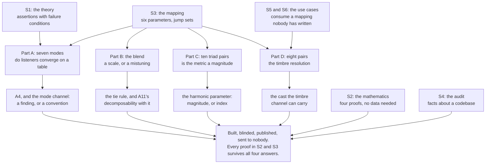

| Field | Value |
|:---|:---|
| Designation | MPN-S0 |
| Title | The McKenney-Lacan psychometric calculus: a series prospectus, and the caveat that governs every paper in it |
| Author of the theory | J. McKenney |
| Series | Paper 0 of 6. S1 states the theory, S2 the mathematics, S3 the mapping from state to musical material, S4 the audit of the reference implementation, S5 and S6 the two use-case papers [1], [2], [3], [4], [5], [6] |
| Licence | CC BY 4.0 |
| Status | Draft 1. First issue. It is written to be read before any of the six and to be re-read after all of them |
| Scope | Theory and internal research on synthetic and published material, under the author's ruling of 13 September 2026. The dialogue the engine decomposes is dialogue the programme generates, together with labelled script text. Nobody is recorded and nothing is placed on a market. The private internal use the series is for is defined by the four use cases of S5 and the one of S6 [5], [6] |
| Governing caveat | Section 2. **Not one listener has been asked anything. Every empirical claim in this series is untested.** That sentence is the reason this document exists and it holds over all six papers |
| Numbers | Every figure quoted here is reproduced from a named paper or from `VERIFICATION-2026-09-14.txt` [12], which carries the command that produced each one. Nothing in this document is transcribed from memory |

## Contents

1. What the series is, in one page
2. The caveat, which nothing in the series survives without
3. What the series can be cited for today, and what it cannot
4. The four questions in the field, and what each answer does to the series
5. The one result that would falsify the programme rather than a paper
6. How the series is read
7. Provenance and reproducibility
8. What is not in the series
9. References

## 1. What the series is, in one page

Six papers. Each establishes something, and what each establishes is narrower than what each is about, so the list below names the first and not the second.

**S1 establishes a theory stated as a register of numbered assertions, each carrying a failure condition** [1]. Nine assertions stand after arbitration, two are withdrawn, one is amended on an algebraic finding, and one is held pending a decision by the author. The theory's content is that a character's psychological state, for the purposes of musical representation, is carried by nine bounded numbers; that three of them are the Lacanian registers and compete on a simplex; and that a total, deterministic, decomposable function carries that state to musical material. S1 also establishes the provenance boundary, separating what is taken from Lacan, from psychometrics, from dynamical systems and from the film-scoring tradition, from what the theory asserts on its own authority. The numeric layer over the registers is McKenney's and Lacan assigned no magnitudes to anything; S1 claims the formalisation for its author and not the original's authority for it.

**S2 establishes the mathematics, including four results that hold whether or not any play was ever scored** [2]. The state space has eight degrees of freedom carried in nine named coordinates, since the simplex constraint removes one. Lemma 1 shows that three magnitudes summing to one must on average move against each other, so the negative correlation A3 offers as evidence of competition is a theorem about anything summing to one rather than a fact about registers. Lemma 2 locates the discontinuity of the dominant-register map exactly, on a tripod joining the barycentre to the three edge midpoints. Theorem 1 bounds below the correlation of two positively weighted blends of the same two variables, which is what makes the A8 collinearity computable from the weights before any corpus exists. Theorem 2 gives an identity for the sample lag-1 autocorrelation that makes the undetrended early-warning apparatus uninformative on a quantity that ratchets. S2 also establishes that the simplex and the Borromean link are incompatible formalisations of the same three registers, so the theory must choose between two things it takes from Lacan.

**S3 establishes the mapping, parameter by parameter, with a jump set for each** [3]. Dynamics from trauma on eight markings; tempo and metre from entropy; mode from the register triple with trauma as a second stage; fragmentation and orchestration density as a direction and its orthogonal complement; harmonic position as a function on the state alone, at a fixed constant of 23 positions around a Hamiltonian cycle of the 24 consonant triads; and timbre, which S3 specifies for the first time and proves can carry three of the four DISC coordinates and never their magnitude. It establishes a tie rule for the mode selector that is determinate where the alternatives are undefined, and it establishes, by enumeration rather than by argument, that no mode reaching a rendered score on the current build is a function of the registers at all.

**S4 establishes what the reference implementation does, at path and line** [4]. There are two programs and they share no code. The seven score files are twenty works from Project Gutenberg rather than seven plays, one of them yielding no dialogue at all, two of them ending in a licence block scored as a catastrophe. The principal state coordinate in those files is a row counter, correlating with position at +0.9969 pooled. The Python engine that produced them implements no psychology on the path that produced them, and its leading-tone operator is not the leading-tone operator. Determinism now holds on the score path and nowhere else. A credential has been committed in plaintext since 10 January 2026. These are facts about a codebase and they stand on their own.

**S5 establishes what four named users would do with one engine, and what each use case forces on a mapping nobody has written** [5]. A play script, a podcast or panel, an interview, and the running score surface. The finding that gives the paper its purpose is that the four failures are complementary: the script has exact attribution and no timings, the single-microphone podcast has timings and inexact attribution, the interview has both and three of five measures degenerate at two speakers, and the live surface has everything and cannot show it because its information budget is oversubscribed on either count of it. From those four facts S5 derives four obligations on the interaction mapping, which turns specifying it from an open job into a bounded one.

**S6 establishes what a tool that renders the shape of a conversation may show, and rules seven questions the design left open** [6]. Its load-bearing result is a layer boundary rather than a policy: the surface is Layer 1 only, the state mapping runs only where a human has rated a state, that surface has no rating instrument, so the state mapping does not run and the tool renders nothing about anybody's mind. It rules that the overlap-derived measures are withheld by default rather than computed and greyed, on the ground that the object that would produce a false positive there is a word list, and the series has already found once what a keyword counter read as a measurement costs.

Two things the six have in common are worth stating before the caveat. Each reports against itself, so that S1 corrects its own previous revision, S2 withdraws an instruction it issued to another document, S3 withdraws a tool it built and records why believing it would have confirmed the error it was written to catch, and S4 withdraws the comparison its own first revision drew. And each states its own negative claims no further than the enumeration behind them reaches, which is the method the series arrived at over the course of S3 and which S4 states as a rule: search for the values a claim is about, never for the names of functions that might touch them.

## 2. The caveat, which nothing in the series survives without

**Not one listener has been asked anything. Every empirical claim in this series is untested.**

That sentence is not a hedge attached to a result. It is the programme's actual position, and stating it plainly at the front is the condition of the rest of the series being worth reading.

### 2.1 Everything the programme holds was produced by the programme

The corpus holds two bodies of numbers and both are outputs of the system under study.

The first is 31,078 scored rows in seven files. S4 establishes what they are [4]. They are seven Project Gutenberg downloads containing twenty works, six introductions and an author's preface, two licence blocks and a lower bound of 200 rows of boilerplate. Three of the seven are anthologies, of eight, five and three plays, so the named work occupies 24.3, 20.7 and 31.0 per cent of the file it is named for. One of the seven yielded no dialogue: 3,424 of King Lear's 3,425 rows carry the token the parser emits when it cannot find a speaker. Trauma in those rows is a linear ramp in row position plus a keyword tally, correlating with position at +0.9969 pooled, so 99.4 per cent of its variance is how far through the file the line falls; over the licence block closing two of the files the engine reports trauma rising to 0.80 and its clinical health score falling to 1 out of 10. Entropy is a weighted punctuation count sitting at its floor on 72.8 per cent of rows.

The second is 232 frames over thirteen works. S4 establishes what they are too, and corrects S1 in doing so [4], [11]. The trauma and entropy values are 232 literals each, numbers the author typed, taking twelve and ten distinct values, almost all of them round. The prose and chord annotations are the author's. The three register magnitudes are computed, by a keyword counter run over that prose, whose word lists contain the strings "real", "symbolic" and "imaginary" themselves. The instrument therefore finds what the analyst wrote, and the normalisation that follows is what produces the simplex constraint that the theory calls a substantive claim about competition. On 104 of the 232 frames, 44.8 per cent, that instrument returns a triple that is not on the state space at all, and four components of the system then resolve it four different ways. Counting those, the register triple is absent, pure or undecided on 226 of 232 frames, 97.4 per cent [2].

S1's governing sentence covers both, and S2, S3 and S4 each affirm it rather than qualifying it. **The corpus contains no observation of trauma, entropy or the registers that the system did not itself produce.** A number one person typed for a scene he selected, about which he wrote the prose the analyser then read, is a judgement: one coder, no codebook, no second coder. A judgement is not an observation, and the correction S4 makes changes which part of the system produced which coordinate rather than whether anything was observed.

### 2.2 The listening pack exists, is built, blinded and published, and has been sent to nobody

Listening pack version 2 is real and finished [8]. Thirty-one stimuli, every one synthesised by a script that draws no random number, each carrying a SHA-256 in a manifest. The presentation order is one permutation drawn once from seed 20260914 and identical for every respondent, which is the whole of the comparability argument. The key that decodes the labels is held in the corpus and is not shipped in the pack. Three things are withheld from every respondent by design: the scale names, what the theory predicts, and what the earlier panel of language models said. An intake protocol exists, with a filing rule, a register, five stated unusability conditions and a scoring script, and a response that contradicts the theory is not among the five [9].

No response has been returned. No response has been scored. The plan that schedules the campaign records the position in four words of its own: nobody has been asked. No names, no invitations, no schedule [7].

Everything in the four papers that a listener would settle is therefore a conditional, and every outcome traced in section 4 below is a conditional about an instrument in a drawer rather than in the field.

### 2.3 The two earlier listener studies are not citable, and the series says so

The corpus holds two listener studies and S1 reports both and disqualifies both [1]. The first gave twenty-four participants a mean appropriateness rating of 4.2 on a five-point scale, and it tested a register-to-mode assignment that matches no shipped calculus module: the only positive listener evidence in the corpus was collected on a table the programme has not adopted. The second is a null, forty-eight participants, p = 0.72, effect size 0.08, and it sits in a document that presents the system as validated.

Neither is citable, and the reason is the same for both: the stimuli came from an unseeded system and cannot be reproduced. The pack's one methodological property that its predecessors lacked is that its stimuli are reproducible, and S4 makes publishing the audio rather than a promise to regenerate it a condition of any stimulus set [4], [8].

### 2.4 The claim-by-claim position

The assertions register is where the theory is stated as examinable items [10], and reading it against S2, S3 and S4 sorts every assertion into one of four classes. The classification is not a softening device. Two of the four classes contain results that are settled and will not move; the other two contain everything the programme wants and does not have.

**Class I: true by construction, and therefore not evidence for anything.** A3's simplex constraint, as instrumented, is produced by a line of arithmetic dividing three keyword counts by their total; S2 shows that three independent and exchangeable counts have zero correlation before that division and exactly minus one half after it, so the competition A3 asserts appears at the moment of division [2]. A1's unit bound is a normalisation carrying no unit, and nothing says what a trauma of 0.6 is 0.6 of. Trauma's ratchet is a property of S1's own definition, which gives it no way to decrease, so any parameter monotone in trauma can only rise across an act. S2's declaration that the coordinates are interval-scaled is a commitment about an instrument that does not exist rather than a fact about one that does. None of these may be offered as a finding, and the series does not offer them as findings.

**Class II: analytically settled, tested, and independent of every listener.** These are theorems about a construction and they would hold if no play had ever been scored. The state space has eight degrees of freedom in nine named coordinates. The covariance identity on the simplex, which is exact for every distribution on it. The discontinuity set of the dominant-register map, and the closed form 2d minus d squared for the measure of states within d of a tie. The positivity bound, under which the shipped fragmentation and density pair could not have fallen below +0.7241 whatever any corpus contained, against the +0.9150 it realises. The amended pair's exact orthogonality away from its clip. The lag-1 identity. The four properties of the modal interpolation: determinacy at a three-way tie, exact agreement with the dominant-register rule outside the margin, Lipschitz continuity on the closed simplex, and a worst-case notation error of exactly a quarter tone. The neo-Riemannian facts: diameter and radius five, the alternation of two generators closing as a Hamiltonian cycle where the other two alternations close at six and eight, and the non-monotonicity of chain position against graph distance. That 23 is the only constant at which the absolute and relative forms of the harmonic parameter have the same reachable set. That the map from DISC to timbre has rank three against a domain of dimension four, so its nullity is exactly one and its null direction is profile magnitude. And the timbre packing result, flat at the square root of two from three characters to six and strictly lower at seven, established by an exhaustive search over sixteen corners that needs no seed at all [12]. Every one of these is a result the series may cite today without qualification.

**Class III: mapping claims that need a listener, four of which have an instrument built and unsent.** A4, the register-to-mode assignment and its second stage, which Part A of the pack asks. Whether the microtonal blend is heard as a scale or as a mistuning, and what the margin should be, which Part B asks. Whether the formal chord distance is audible as a magnitude, which Part C asks. The perceptual resolution of the timbre space, which Part D asks and which every cast-size claim in S5 is conditional on. Four further claims in this class have no instrument built: A7's ordering of the fragmentation stages, which is a discrimination test needing no verbal anchor; whether A8's two ladders are separable to the ear now that they are orthogonal in construction; A11's musical coherence, which is the assertion the whole system exists to demonstrate and which is judged by listening; and B2 and B5, on whether a sequence-aware score is distinguishable from a turn-by-turn one and on whether a transformed motif is identified as the same motif.

**Class IV: untested, with no instrument built and, in three cases, none costed.** A2, that the registers admit magnitudes at all, which is measurement-circular as currently instrumented and which needs the annotation protocol: a codebook, unconstrained anchored scales, a calibration set and a published reliability figure, costed in the S1 constraint review at about eleven thousand dollars and 176 hours over roughly seven months, gating A1 as restated, A2, A3 and A5 [2]. A3 as a claim about subjects rather than about arithmetic, which needs unconstrained ratings in the cube and their raw correlation matrix against a null of independence, and which S2 identifies as the cheapest decisive test in the programme that needs new data. A5, that trauma and entropy are separable under rating. A6, which is implementation-falsified rather than tested, because the orchestration level is computed and written to a console log, the instrument assignment and harmonic context do not reach even the log, and a transformation that does reach the notes is bit-identical to another one and is returned by the selector on none of 171,666 states. B1, whether the bias layer is a second layer or a view of the first, whose test is now gated on a detection rate because nothing in the layer renders. B3, on dyadic biases. And B4, the channel budget of two to three independent quantities per stave, which S1 states in its own words as an estimate rather than a measured figure, which S5 shows to be oversubscribed on either count of it, and which survives its own review only because the mechanism that would have falsified it was struck.

Two assertions are withdrawn and the register keeps their identifiers rather than renumbering: A9, which operationalised a Lacanian concept as a divergence from an internal model the system does not maintain, and A10, which multiplied a state by a factor above one and so broke both the unit bound and the simplex.

## 3. What the series can be cited for today, and what it cannot

This section exists so that a reader who wants one sentence about the weight the series bears does not have to assemble it from six papers.

**S4's audit findings are facts about a codebase and stand on their own.** That two programs share no code, that seven files hold twenty works, that one file yielded no dialogue, that a principal coordinate is a row counter, that an operator named for a published one is not it and agrees with it on the distance between only half of all ordered chord pairs, that a mode is computed on every frame and read by nothing, that a composer is passed a literal instead of the state, that a transformation is unreachable and would be inaudible if it were reached: each is established by reading the tree at a pinned commit, each is reproduced by a named script, and none of them depends on anybody's ear. They are citable now and they are the most solid material in the series.

**S2's proofs are proofs.** Lemma 1, Lemma 2, Theorem 1 and Theorem 2, and with them S3's interpolation properties, the harmonic group results, the reach result at 23 and the timbre rank and nullity. These are citable now, with the single qualification the papers already carry: a theorem about a construction says nothing about whether the construction describes anything.

**S1's assertions are assertions, and each carries a stated failure condition.** They are citable as a statement of what the theory claims and of what would refute each claim. They are not citable as findings, and S1's own dispositions say which are held as hypotheses.

**S3's mapping is a specification.** Every table in it is a proposal, and the figures that look like results are properties of a proposed map computed exactly. The paper says so in its own words before anything else: nothing in it has been measured on any person and none of its tables is evidence, however precisely its numbers are computed.

**S5 and S6 are use-case papers and their central mapping does not exist.** Every surface they describe consumes an interaction mapping that has no function, no acceptance criterion, no stated codomain, no channel count and no jump set. What they establish is what four use cases force on that mapping and what a fifth surface may show, which is a bounded specification problem rather than a result.

And the exclusions, stated in the form a reader needs them.

The series cannot be cited for any learned model. No weights ship, one training run used uniformly random target tokens, another saw ten examples derived from an error string, and a performance training loop is a placeholder marked as a mock. It cannot be cited for the 57-dimensional psychological input the application advertises, because that vector is computed and discarded and the generator is called with an empty description. It cannot be cited for any measurement of a person: the four DISC coordinates are not produced at all, the registers are a keyword count over the author's own prose, and trauma and entropy are numbers he typed. It cannot be cited for validity, there being no inter-rater reliability, no participant and no statistic anywhere in the tree. The 31,078 rows cannot be cited as evidence about the mapping or as seven plays.

**And nothing in any paper is a finding about how a human hears anything.** Not one. That is the whole of section 2 restated as a citation rule, and it is the rule a reader should apply to any sentence in the series that sounds like a result about perception.

## 4. The four questions in the field, and what each answer does to the series

S3 revision 10 section 2.3 is the model this series uses for an open question, and the reason it is the model is that it does three things in order rather than one [3]. It sets out the alternatives, saying what each claims, where it lives and what would have to be true of the world for it to be right. It describes the instrument as it is built rather than as a plan. And it traces each possible outcome through to the documents that change and the work that opens or closes. This section generalises that treatment from one assertion to the whole series.

The pack asks four questions, each with a separate set of stimuli [8]. The panel it asks them of is a small expert panel, sized at five in the decision log and re-planned as a pilot of three to five followed by a wave of ten to fifteen per role [7]. That is the right instrument for settling a design parameter and the wrong instrument for a citable perceptual claim, and the pack says so on its own face rather than leaving a reader to notice. Part R of the pack asks the respondents themselves what a citable study would require, which makes the instrument's replacement specifiable from its own returns.

### 4.1 Part A: whether listeners converge on a register-to-mode table

**What is asked.** Seven items, each the same eight-bar melody at the same tempo, in the same key, over the same pedal, on the same neutral tone, with only the scale changing. A ranking from happiest to saddest over six of the seven, and then four predicaments, written as a director would describe them, which are the three registers put into language a respondent can answer without holding a theory, plus a fourth that answers to no register at all and is there to see whether a respondent will assign a scale to anything. Each predicament carries a confidence, a free-text reason, and a second question asking whether the choice changes when the situation is at its most extreme, which is what separates a second stage that dims within a pair from one that jumps to a different kind of scale [3], [8].

**What counts as an answer, and this is the thing that decides everything.** The question is not whether listeners agree with the theory. It is whether they converge with each other. Four incompatible tables sit in the corpus, two of them exact inversions of each other on every register, so no one of the four can be the standard without assuming the answer.

**A positive result.** Convergence on any of the four is a result, including convergence on a table the theory does not hold, because it establishes that there is a table to find and says which one it is. Convergence on none of the four is a sharper result still, because it would mean the registers pair with scales in a way nobody in this corpus has written down, which is a finding about the world rather than about the corpus. On convergence the mode channel becomes the first parameter in the whole mapping with listener warrant behind it. Which papers change depends on which table wins: on the live pitch table, nothing in the theory moves and two small repairs become the changes that turn a warranted table into a rendered one; on its inversion, every document carrying a modal example needs correcting, and a clean seven-degree statement of the inverted table has to be written because the one in the corpus carries two display strings where mode names should be and a six-degree scale where seven are required; on the raters' mechanism, A4's second stage changes rather than its table, the jump surface at trauma 0.6 survives but what it switches between becomes a larger interval, and a crisis mode per register has to be drafted because nobody has drafted one.

**A null.** Section 5 is the null, because it is the one result in the programme that reaches past a paper.

### 4.2 Part B: whether a microtonal blend is heard as a scale or a mistuning

**What is asked.** Seven items: the two pure input scales, the exact blend at a tie between them, the two near-tie blends at margins of 0.05 and 0.20 separated by 17.4 cents, and both roundings of the tie as separate items. Two of the seven carry the same scale, because rounding half up at an exact tie returns one of the two inputs exactly, which makes that pair a result and a reliability check at once [3], [8].

**Why it matters more than a tuning question.** The tie is not a corner case: 21 of the 128 frames that reach the simplex sit exactly on one, 16.4 per cent of them. S2 shows that the two obvious remedies, hysteresis and a dead band, are both defined by a gap and so neither releases when the gap is zero, and that both make the transformation a function of the current and the previous state, which costs the decomposability A11 asserts and which Proposition 4 needs. Interpolation is the only one of the three that is determinate at an exact tie and on a scene's first frame, and the only one that leaves decomposability intact.

**A positive result.** The blend is heard as an intermediate scale. The adopted tie rule is ratified by ear rather than chosen by elimination, A11's decomposability holds of the mode channel by a rule a listener endorsed, and the margin is fixed from the second half of the same seven items: if the two margins separate at 17.4 cents, a small margin is doing audible work and the margin can be small; if they do not, a small margin buys nothing and the larger one is the honest choice. S3's front-matter table gains a fixed margin and S2's open decision closes.

**A null.** The blend is heard as out of tune. Then interpolation is not a musical object, the theory is pushed back onto a state-dependent selector, and the cost is decomposability: the mapping becomes a function on pairs of states, and Proposition 4's claim that an explicit system can be interrogated about why an output is wrong loses the property that makes a per-frame answer possible. This is the null with the longest reach after Part A's, and it reaches S3 section 2.3, S2's decision on the tie, and A11's entry in the register.

**What survives the null.** All of the mathematics. The tripod result, the closed form for the area within a margin of a tie, the measurement that rounding inside the mapping would leave a different scale from the dominant-register rule on 0.64 per cent of the simplex at the small margin and 3.05 per cent at the large one and so would very nearly delete the interpolation rather than degrade it, the finding that one rounding convention returns an input and the other returns none of the seven modes, and the cardinality constraint that rules a six-degree scale inadmissible in any table whatever anybody hears. None of those is hostage to the answer.

### 4.3 Part C: whether the formal chord distance is audible as a magnitude

**What is asked.** Ten triad pairs at five graph distances, each item one chord, a short gap and another, with the respondent asked how far the second feels from the first on a scale from next door to as far as it gets, and told not to try to name the chords. The ten pairs are deliberately not equally spaced in any obvious way, because chain position and graph distance do not rise together [3], [8].

**A positive result.** Rated distance tracks graph distance. The metric carries a magnitude, and the first of S3's two harmonic repairs becomes available: define the move in the metric rather than on the chain, taking the target at a graph distance proportional to the driving quantity, which is monotone by construction. That repair is not free even on a positive result, because it no longer names a unique chord: from one triad there are three at distance one, six at two, eight at three, five at four and exactly one at five, so a selection rule is owed among them. S3's front-matter harmonic row changes and S2's statement that the Cayley distance is the only thing in the theory making a harmonic displacement a number gains a listener's warrant behind it.

**A null.** Rated distance does not track graph distance. Then the metric is decoration, the second repair is the honest one, and the harmonic parameter is a walk along a fixed cycle carrying an index rather than a magnitude. S3 withdraws the claim that the move size is metric. The constant of 23 keeps its standing, because the reason it was fixed at 23 was reachability and not magnitude: it is the only value at which the absolute and relative forms of the parameter have the same reachable set.

**What survives either way.** Every group-theoretic result: the diameter and radius of five computed from the generators rather than cited, the alternation that closes as a Hamiltonian cycle where the other two alternations close at six and eight, the distance distribution over all 576 ordered pairs, the antipode result, the full non-monotonicity table, and the uniqueness of 23. Also surviving, and worth naming because it is a null the series already carries, is S3's refusal to adopt the affective reading of the individual generators, which is a convention with no experimental support and which the series says so about rather than borrowing.

### 4.4 Part D: the perceptual resolution of the timbre space

**What is asked.** Eight same-or-different pairs with pitch, length and loudness held so that colour is the only thing that could differ, two of the eight genuinely identical as a floor on a respondent's reliability, and six voices [8].

**What the answer fixes.** A single number, the separation at which same and different reach chance, and every cast-size claim in the programme is conditional on it. The largest cast the timbre channel can carry is six only if that resolution lies in a window of width 0.3244 in a space of diameter 2; outside the window the answer changes rather than degrades, holding seven at a resolution of 1.0, three at 1.45 and two at 1.6 [12].

**A positive result.** Listeners discriminate below the square root of two. The six-character table stands as printed, and S5's cast tables and the design document's capacity table stand with it. The window narrows with every improvement to the packing search rather than widening, so a positive result is a result about a window that is already tight.

**A null.** Listeners are at chance on the closest pair the design calls distinct. Then the resolution is coarser than the square root of two and the cast shrinks by a stated amount, which is the useful property of this question: the capacity table says by how much, so the null has a number attached to it rather than a shrug. One case is immune at any resolution finer than the whole space: two characters attain the full diameter of 2, which is why the interview use case and the two-stave score are the one cast size in the series that this question cannot touch.

**What survives either way.** The rank of the map is three against a domain of dimension four, so its nullity is exactly one and its null direction is profile magnitude. Two characters whose profiles differ by a constant added to all four coordinates produce identical timbre, and no listener can tell them apart however good their ear. That is a theorem about the map and not a claim about ears, and it cancels one study before it is paid for: a study asking a listener to recover a DISC profile from a cue is asking for something the channel cannot carry, and what such a study can ask is whether listeners discriminate profile shape with magnitude held or varied as a control.

### 4.5 A null on three of the four is plausible, and the series survives all three

The plan states it in its own words and does not hedge: three of the four questions have a plausible null [7]. That is not pessimism, it is the reason the questions are worth asking, and the series is written so that a null is a result rather than a failure. Here is how each of the three is survived, in one sentence apiece.

A null on Part C decides which of two harmonic repairs is honest, and the honest one is smaller than the other: the parameter becomes an index, the group theory is untouched, and the constant stays fixed for the reason it was fixed. A null on Part D shrinks the cast table by an amount the table itself states, leaves the rank and nullity results standing, and leaves the two-character case untouched. A null on Part B costs the mode channel its continuity and costs A11 its decomposability on that one channel, which is real and is the most expensive of the three, and it leaves every proof in S2 section 4 and S3 section 2.3 exactly where it was, because those proofs are about a rule and not about a table.

The asymmetry between those three and the fourth is the subject of the next section, and it is the reason this document treats the fourth separately rather than as one item in a list.

## 5. The one result that would falsify the programme rather than a paper

**If expert listeners do not converge with each other on any register-to-mode table, A4 is not a fact about listeners and the mode channel carries a convention rather than a finding.**

The distinction matters because it is not the distinction a reader expects. Non-convergence would not show that the mapping is wrong, and it is not a null result about the mapping. It shows that A4 is not the kind of claim it presents itself as. A4 says that the pairing between a register and a mode is a consequence: that a subject's predicament, formalised as a dominant register, determines a scale, and determines it in a way another person's ear would recognise. Non-convergence says instead that there is no fact about listeners for that claim to be a statement of, and that what the channel carries is a private code: internally consistent, implementable, and communicating nothing that a second person would have arrived at.

**Why that reaches the programme and not a paper.** A4 is where the borrowing from Lacan is supposed to pay a musical dividend. The registers are the one part of the state the theory takes from outside psychometrics; the simplex is the one place the theory makes a substantive claim about them rather than a normalisation; and the mode is the only channel the two register degrees of freedom reach at all, by S2's own reach table. If the register-to-mode pairing is a convention, then Proposition 2, which says the registers stand in a competitive relation properly represented on a simplex, has no audible consequence anywhere in the mapping, and the Lacanian layer becomes a vocabulary the theory uses to organise its own parameters rather than a claim about anything a listener could check. The other three questions can each fail and cost the series a parameter. This one failing costs the series the argument for its own central borrowing.

**And it should be stated at exactly that size and no larger.** A convention is not worthless, and the series already labels one: S3 reads the spectral centroid as the task-against-people contrast and says in the table itself that this is a convention. What a convention cannot do is bear the weight A4 puts on it. On this outcome A4 is restated as a convention with a named author and a stated arbitrariness, and S1's A4 entry and the assertions register both change to say so. No work item opens for the implementation at all, which is the sharpest single consequence: the two repairs that would make the modal path register-dependent remain correct and stop being urgent, because there is no warranted table for them to carry.

**What survives, and it is more than a reader would expect.** The interpolation survives entire. Its weight function is defined on any pair of modes of equal cardinality and mentions no mode by name. The proof that the rule is determinate at a three-way tie uses nothing about which modes sit at the vertices. The exact agreement with the dominant-register rule outside the margin is a property of the weight function alone, since a register a full margin below the leader has weight exactly zero whatever mode it names. The Lipschitz constant is proportional to the reciprocal of the margin for the same reason. The jump set is the single surface at trauma 0.6 and nothing on the simplex, because it is the table that switches at that surface and the simplex map that does not, so the shape of the result does not depend on which table switches there. Change the table and every one of those results is unchanged in statement and in proof; what changes is only the size of the bend at the surface.

The Lipschitz result survives. The jump set survives. The cardinality constraint survives, and it rules a six-degree scale inadmissible in any table whatever any listener says, because it is about the arithmetic of a weighted mean over degrees and not about anybody's ear. The identifiability analysis survives: the state has eight degrees of freedom, two of which are recoverable as quantities, two of which reach a channel that is categorical outside a margin, and four of which reach a channel carrying three of them and never their magnitude. That ceiling belongs in front of any listening study rather than after one is analysed, and it does not move.

And every one of S4's audit findings survives, because not one of them is about perception. Two programs sharing no code, twenty works in seven files, one file with no dialogue, a row counter standing in for a state coordinate, an operator that is not the operator it is named for, a mode computed and discarded, a composer handed a literal, a transformation that is unreachable and would be inaudible if reached, a credential in plaintext across 36 commits. A listener panel has nothing to say about any of them.

What the programme would be, after that outcome, is what S4 already says it is and what this document says it is now: a well-specified proposal with a working renderer, an unusually complete audit of itself, and a set of theorems about its own construction. That is an honest thing to be. It is less than the programme wants and it is not nothing, and the difference between those two sentences is what a reader of this series is entitled to know before reading it rather than after.

## 6. How the series is read

**The reading order is S1, S2, S3, S4, then S5 and S6 in either order.** Each of the first four assumes the one before it, and each says in its own opening what the previous one left to it. S5 and S6 sit against a working document rather than against S4, and they consume S1 to S4 without amending them.

**A reader who wants only one paper should take the one that matches the question they arrived with.** For what the theory claims and what would refute each claim, S1, and specifically its register in section 8 and its standing section in section 11, which is the part a reader who ran the system would find out in a few minutes. For whether the formalism holds together, S2, and specifically sections 4 and 5, which carry the simplex results and the scalarisation bound. For what the music actually is, S3, and specifically its front-matter parameter table, which gives every function, its codomain and its jump set in eight rows before any justification. For what the software does, S4, and specifically sections 3 and 4 on what the largest empirical artefact contains and section 8 on what the application can and cannot be cited for. For what anybody would do with it, S5 section 7, which is where the four use cases are set against each other in one table. And for the layer boundary that decides what a rendering may claim, S6 section 1.

**S3 revision 10 section 2.3 is the model for how this programme treats an open question, and it is worth reading as a method even by someone with no interest in modes.** It does three things in order. It sets out the alternatives: four candidate tables, what each claims, where each lives at path and line, whether each reaches a rendered score at all, and what would have to be true of the world for each to be right, with one of the four separated out because it changes the mechanism rather than the assignment and so does not sit on the same axis as the other three. It describes the instrument as built rather than as planned: what a respondent hears, what they are asked, what is withheld and why, what the analysis does with the returns, and the statement that the analysis tallies rather than scores because the key holds no row for that part. And it traces every outcome through to the documents that change and the work items that open or close, in a table, including the outcome that costs the theory the most.

Then it does the thing that makes the treatment worth imitating. It states, separately and in its own sentence, what in the section is not hostage to the answer: nothing in the section's formal content, and everything in its assignment content. A question written that way can be lost without taking anything with it that was not the question.

**One reading rule applies throughout and is the series' own.** A negative claim in any of these papers reaches no further than the class its script enumerates, and each script names the class of object it enumerates. Where a paper says that nothing reads a value, what is warranted is that no line of the enumerated class reads it, in the checkout on the date named. That rule exists because three earlier claims in this series were false in exactly the way it prevents, and because a tool written to automate the check failed in the direction that would have confirmed the error it was written to catch.

## 7. Provenance and reproducibility

**Every figure names the command that produced it.** Each paper carries a Reproduces field listing its generators, and S3 alone names fourteen scripts with what each establishes, committed beside a file that says how to run them. No numerical claim in S3 or S4 is transcribed, and each script that reads the implementation aborts if the lines it reads have changed. `VERIFICATION-2026-09-14.txt` carries, for every figure in the design document that does not come from a named paper, the command that produces it, so that a reader can re-run any single number on its own [12].

**Where a computation and a prediction disagree, the computation wins and the disagreement is stated loudly.** That rule has overturned a figure the author's collaborator hand-wrote, a figure a reviewer produced and a figure an arbiter produced, in that order. One of those is instructive enough to name: a timbre value moved four times under successively harder searches, from 1.0123 to 1.0360 to 1.053712 to 1.089845, and the published figure of 1.053712 could not be reproduced at any restart count under its own stated procedure. The response was not to print the new number as settled. It was to delete every percentage drop computed from it and to state instead the part that is exact, which an exhaustive search over sixteen corners establishes with no seed at all, and the part that is conditional, with the window the condition lives in and the observation that the window narrows with every improvement rather than widening.

**The generators draw no unseeded randomness.** Determinism on the score path is now closed: a keyed generator supplies every draw as a pure function of its own coordinates, built from the work, the character and the frame index, with an algorithm version so that a change is visible rather than silent. Fifty-four unseeded draws remain in the tree and none is reachable from a rendered score; they sit in visualisations, demos and page chrome. The consequence is stated in the form a study designer needs: the stimuli are reproducible and the pictures beside them are not, so a study presenting both is not replicable even though its audio is.

**The pack's stimuli are hashed and the audio is published.** Every file carries a SHA-256 in a manifest; no random number is drawn anywhere in their generation; the presentation order is a fixed permutation from one seed, identical for every respondent, and re-shuffling it makes a new wave that pools with nothing before it. S4 makes publishing audio rather than a promise to regenerate it a condition of any stimulus set, on the ground that a change to the seeding algorithm changes every stimulus in the programme, and the pack honours that condition. The pack's stimuli are also synthesised directly from the scale formulas rather than rendered by the application, which is why Part A can test A4 while a study on the build could not: a study run on the current build would put a three-way branch on the sum of trauma and entropy in front of listeners, and would return a null whatever the truth of the assertion.

**Two provenance facts about the corpus belong here rather than being discovered.** Reading the frame library goes through one reader which asserts its own record count against the annotation count, so a parser dropping records fails rather than reports. That reader exists because a parser defect shared by every script in the programme since S2 truncated seven annotation strings at an escaped apostrophe and moved four published figures; the correction was issued against the papers that carried them rather than absorbed. And the two earlier listener studies are kept in the corpus and reported in S1 rather than dropped, including the null, because a programme that reports its own negative findings in the same document is doing something a reader can check.

## 8. What is not in the series

**The PRD and the design document are working documents, not papers.** MPN-PRD-01 and MPN-DESIGN-01 govern S5 and S6 and are cited by them, but neither has been through the review gate every paper in this series has passed: the design document's current revision has never been reviewed, and the PRD has never been gated at all [7]. They are the substrate of two use-case papers and they are not part of what this series asks to be cited for.

**The bias layer renders no music.** Under the author's decision of 14 September 2026, taken as the null among five candidates, the layer is a detector whose output is a marked textual proposal beside the turn that prompted it, and it occupies no musical channel on any surface [13]. Its thirty devices are a specification with no renderer. The decision carries a reopening condition rather than a permanence clause, being a detection rate from two named pilots, and it was forced rather than cautious: every one of the eight channels the thirty devices were written for is a channel the state mapping already sets.

**The interaction mapping has no specification.** There is no function, no acceptance criterion, no stated codomain, no channel count, no jump set and no discretisation, and three of the four surfaces in the design consume it. S5 and S6 describe surfaces whose central mapping does not exist, say so at the front, and spend their length turning an open specification problem into a bounded one rather than working around it.

**The series is addressed to composers and to researchers and is not yet addressed to music therapists.** The quantities it names are dramatic quantities about fictional characters: trauma here is the difference between a character in the first scene and the same character after the event the play is about. No paper states what a therapist would do with the system, and declining to make a clinical claim is not the same as answering the questions such a paper would owe. S1 records that debt and records that it is unpaid.

**And no paper in the series contains an instrument.** Nothing in the tree observes a person, and no item on any queue in any of the six papers produces one. The timbre channel needs DISC and DISC is not produced; the registers need something other than a keyword count over the author's own prose; and the calculus needs, at some point, a number that came from outside the system. That is the one item on any of these lists that is research rather than repair, and until it exists the programme is what section 5 says it is after the worst outcome and what it is now: a well-specified proposal with a working renderer.

## 9. References

[1] J. McKenney, "The McKenney-Lacan psychometric calculus: a theory of musical representation for psychological state," MPN-S1, `S1-mckenney-lacan-theory.md`, revision 3, with the corrections issued in [11]. Cited for the nine-component state, the assertion register and its dispositions, the governing sentence on what the corpus contains, the two earlier listener studies, and the standing section.

[2] J. McKenney, "The formal apparatus of the McKenney-Lacan psychometric calculus," MPN-S2, `S2-mathematics.md`, revision 4, with its post-acceptance correction of 13 September 2026. Cited for the eight degrees of freedom, Lemma 1, Lemma 2 and the kite measure, Theorem 1 and the positivity bound, Theorem 2, the register instrument audit, the incompatibility of the simplex with the Borromean link, the codomain and the piecewise-continuity decision, the identifiability reach table, and the annotation protocol's cost and gating.

[3] J. McKenney, "The mapping: from psychological state to musical material, parameter by parameter," MPN-S3, `S3-mapping-phi-rev10.md`, revision 10. Cited for the six parameter functions and their jump sets, section 2.3 in full as the model for an open question, the four candidate modal tables and the four outcomes traced, the interpolation and its four proved properties, the rounding pre-image rule, the harmonic parameter in its absolute form with the constant at 23, the timbre space with its rank and null direction, the identifiability completion, the bias layer's status, and the method clause at the end of section 7.

[4] J. McKenney, "The application: what the MPN Conductor implements, what it stubs, and what the seven score files actually contain," MPN-S4, `S4-application.md`, revision 2. Cited for the two programs, the contents of the seven score files, trauma as a clock, the frame library's provenance, the determinism position, the three kinds of not-working, the citation boundaries of section 8, and the work queue.

[5] J. McKenney, "Decomposing dialogue: four use cases for one engine, and what each of them needs from the interaction mapping," MPN-S5, `S5-dialogue-use-cases.md`, revision 1. Cited for the four use cases, the four obligations on the interaction mapping, the coverage and dyad-churn measurements, the information budget, and the timbre capacity at each cast size.

[6] J. McKenney, "The Expression surface: what a tool that renders the shape of a conversation may show, and what it would have to get right first," MPN-S6, `S6-expression-aid.md`, draft 1. Cited for the layer boundary, the seven rulings, the floor-share unit measurement, and the six falsifiers of section 10.

[7] "Completion, publication and the listener campaign: a prioritised plan," MPN-PLAN-02, `MPN-PLAN-02-completion-and-publication.md`, 14 September 2026. Cited for the two routes, the critical path, the state of recruitment, the panel sizes, the three process failures and the rule added against them, and the statement that three of the four questions have a plausible null.

[8] "Listening pack version 2: what it asks, who it goes to, and how to read what comes back," MPN-PACK-02, `LISTENING-PACK-FACILITATOR.md`, 14 September 2026. Cited for the four parts and what each settles, the three paths, the blinding and the seed, the location of the key, the catch trial in Part B, the reading of each of the four results, and the statement that the panel is the right instrument for a design parameter and the wrong one for a citable perceptual claim.

[9] "Intake protocol: what happens to a returned file," MPN-PACK-02-INTAKE. Cited for the filing rule, the codes and the register, the five unusability conditions and the fact that contradicting the theory is not among them, and the rule that Part A is tallied rather than scored.

[10] J. McKenney, "The McKenney assertions: a register for examination," `ASSERTIONS-REGISTER.md`. Cited for A1 to A11 with their formal content, failure conditions and dispositions, and for B1 to B5.

[11] "Corrections to S1 arising from S4," MPN-S4-AMENDMENTS. Cited for the replacement text on the frame library's provenance and for the four figures S4 moves.

[12] `VERIFICATION-2026-09-14.txt`, 14 September 2026. Every figure confirmed or corrected with the command that produced it. Cited for the coverage figures, the event densities, the entropy floor, the King Lear parse failure, the bias-layer collision counts, the exhaustive corner search and the converged timbre table, the correction of the seven-character value to 1.089845, and the deletion of a percentage rather than its correction.

[13] "Decision log, 14 September 2026," MPN-DECISIONS-2026-09-14, `DECISION-LOG-2026-09-14.md`. Decision A, the bias layer's channel taken as the null with a reopening condition; Decision B, the rounding pre-image rule and the harmonic constant at 23 in the absolute form.

[14] "Decision log, 12 September 2026," MPN-DECISIONS-01, `DECISION-LOG-2026-09-12.md`. Cited for the eight-marking dynamics made normative, for the drafting instruction on the bias mappings, for the separation of the influence principles from the bias index, and for the panel size.

[15] "One engine, several surfaces," MPN-DESIGN-01, `DESIGN-UNIFIED-FRAMEWORK-rev8.md`, revision 8. The working document governing S5 and S6. Cited here only for its status as a working document and for the constraints it places on an interaction mapping that does not exist.

[16] "The instrument," MPN-PRD-01, `PRD-MPN-THERAPY.md`, draft 6. The second working document. Cited here only for its status, and for the systematic review it carries on the major and minor mode association, which reaches 92 per cent in adults and which is why the series treats an unintended affective reading as a real hazard rather than a theoretical one.
