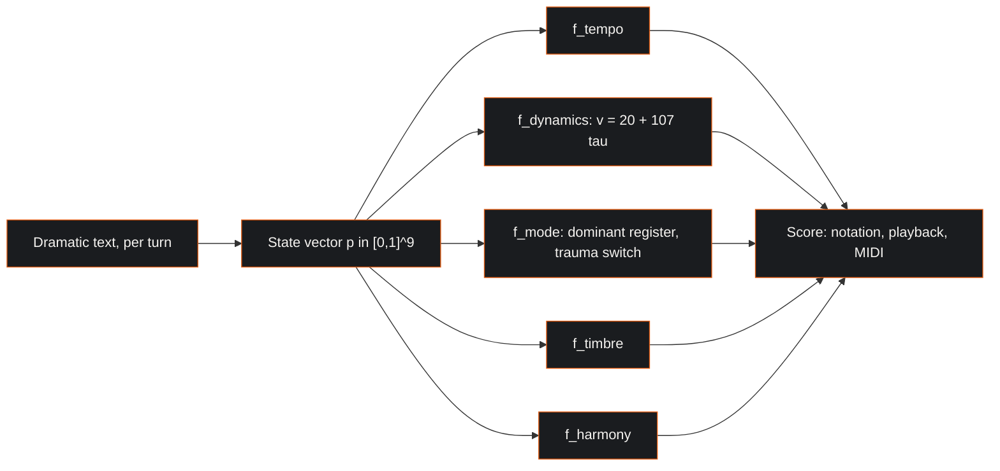
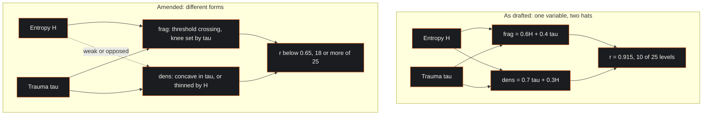
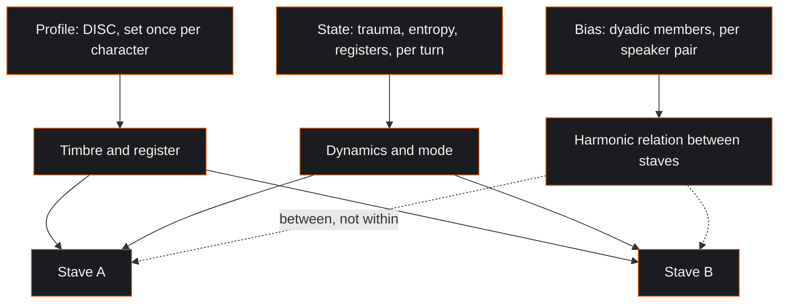

| Field | Value |
|:---|:---|
| Designation | MPN-S1 |
| Title | The McKenney-Lacan psychometric calculus: a theory of musical representation for psychological state |
| Author of the theory | J. McKenney |
| Series | Paper 1 of 4, the music and score path. S2 treats the mathematics, S3 the mapping from state to musical parameter, S4 the Conductor implementation |
| Extends | The unified theory volumes and the core chapters in the author's corpus; the reference implementation is the MPN Conductor |
| Licence | CC BY 4.0 |
| Length | 7,700 words of body text. The series convention is 4,500 to 7,000; this paper carries the assertion register, the A8 amendment with its evidence and the implementation-standing section, and exceeds it by about ten per cent |
| Status | Draft, revision 3, after Block A arbitration and a Skeptic review of revision 2 |
| Revision note | A9 and A10 withdrawn; A8 amended on an algebraic finding confirmed on 232 hand-annotated frames; A4 held pending a decision; the bias layer restated on the Cognitive Bias Atlas; Block B rebuilt on the author's core chapters. Revision 2 treated seven machine-generated score files as evidence and is corrected here |

## 1. Executive Summary & Scope

Music's effect on a listener's affect is among the better documented findings in psychology. The inverse problem, generating music that represents a specified psychological state, has been solved repeatedly in practice by film composers and almost never stated in a form another person can check. McKenney's proposal is that the craft is formalisable: that the transformations professional composers apply to a leitmotif as a character changes are deterministic functions of a psychological state vector, and that the vector can be given a definite composition, a definite geometry and a definite range.

This paper states that theory. It gives the nine-component state, the constraint that binds three of its components, the master transformation from state space to musical parameter space, and the provenance of every element, separating what McKenney takes from Lacan, from psychometrics, from dynamical systems and from the film-scoring tradition, from what the theory asserts on its own authority and must therefore defend on its own. It then gives the assertions as a numbered register, with the two that were withdrawn under review, the one that has been amended on evidence, and the one that is held pending a decision by the author. It closes with the conditions under which the theory would be wrong and with a plain statement of what is currently implemented and what is not.

Scope. This is a theory paper. The formal apparatus belongs to S2, the parameter-by-parameter mapping to S3, and the system that realises it to S4. Nothing here is a clinical model, and the quantities named are not diagnoses even where they share a word with one.

The revision is not cosmetic. A structured review of the eleven original assertions returned one finding that is fatal to an assertion as it was stated. The finding is algebraic: two of the theory's quantities were constructed so that they cannot vary independently of each other, whatever data they are computed on. Section 8.2 sets it out, along with the correction of a mistake this paper's own first revision made, which was to treat a machine-generated file of derived numbers as though it were annotated evidence.

## 2. The problem the theory addresses

A composer scoring a scene decides in a few seconds what a character sounds like. Ask why the cue is in Lydian and the answer will be a gesture: the scene is weightless, the character is not yet disillusioned, the sharpened fourth holds the moment open. The judgement is usually right and almost never reproducible. Two composers given the same scene produce different cues, and neither can fully state the rule they followed, because there is no rule, only a practice.

This is not a complaint about composers. Craft knowledge of this kind is efficient and it works. It becomes a problem only when someone wants to generate music continuously from a state that is itself changing, faster than a composer can score it; or to explain a musical decision to someone who is not a musician, in terms of the psychological content it carries; or to test whether the mapping between a state and a treatment is any good, which is impossible while it remains tacit, since there is nothing to test.

McKenney's theory exists to make the mapping explicit. Its claim is not that the explicit version is better than a composer's ear. It is that an explicit version can be inspected, argued with, implemented and corrected, and that a tacit one cannot.

The tradition the theory formalises is specific. Wagner established in *Oper und Drama* that music should carry the psychological essence of a character rather than accompany the character's actions, and the leitmotif was the vehicle: a musical idea that accumulates meaning and is transformed as its subject is transformed, so that Wotan's spear motif carries authority and its burden rather than a weapon [1]. Two modern practitioners refined the technique in ways the theory takes as its direct source. John Williams uses modal colour as a semantic device, the raised fourth of the Lydian mode marking the transcendent and the not yet disenchanted. Howard Shore uses progressive fragmentation, the Fellowship theme losing members as the fellowship does, until what remains is an interval rather than a melody. McKenney's observation is that these are not mysteries. They are transformations, they are applied under conditions, and the conditions are psychological. If the conditions can be written down, so can the transformations.

## 3. What the theory proposes

The theory can be stated as four propositions. Everything else in this paper is either the content of one of them or the evidence for it.

**Proposition 1.** A character's psychological state, for the purposes of musical representation, can be carried by a small vector of bounded real components, and the components can be named.

**Proposition 2.** Three of those components are the Lacanian registers, and they stand in a competitive relation to one another, so that they are properly represented on a simplex rather than as free coordinates.

**Proposition 3.** The transformations that professional practice applies to a leitmotif, modal recolouring, fragmentation, orchestration growth and harmonic recontextualisation, are functions of that vector, and the functions are total, deterministic and inspectable.

**Proposition 4.** Because the functions are explicit, the resulting system is interpretable, controllable and extensible in a way that a system trained to imitate scores from examples is not, even where the trained system produces more idiomatic output.

The fourth proposition gives the theory its practical motive, and it is worth stating plainly what it does and does not claim. It does not claim that explicit mapping produces better music than pattern learning. It claims that when the output is wrong, an explicit system can be interrogated about why, and a learned system cannot. For a composer that is the difference between a tool and a slot machine. For a therapist it is the difference between an instrument and an oracle. For a researcher it is the difference between a hypothesis and a black box.

## 4. The state

### 4.1 The nine components

The theory's working state vector has nine components, each bounded to the unit interval.

$$\vec{p} = (\tau,\; H,\; r,\; s,\; i,\; D,\; I_d,\; S_d,\; C) \in [0,1]^9$$

Trauma, written $\tau$, is the accumulated weight of what has happened to the subject and has not been resolved. It is not a clinical measure and the theory does not treat it as one. It is a dramatic quantity: the difference between a character in the first scene and the same character after the event the play is about. One property of the definition deserves to be stated here rather than discovered later. Weight that is accumulated and unresolved ratchets: the definition gives trauma no way to decrease, so any musical parameter monotone in trauma can only rise across an act. Whether that is true of the drama is a separate question the theory has not asked. If a parameter should fall as well as rise, trauma needs a resolution term, and it has none.

Entropy, written $H$, is the disorder of the subject's symbolic organisation. Where trauma asks how heavily the subject is loaded, entropy asks how far the subject's account of their situation has stopped cohering. The two are held to be independent. A character may carry great weight in perfect order, and a character may be scarcely burdened and entirely scattered, and the theory holds that these should not sound alike.

The three registers $r$, $s$ and $i$ are the Real, the Symbolic and the Imaginary, treated in section 5.

The four remaining components are the DISC dimensions: dominance, influence, steadiness and compliance. They carry the disposition the subject brings rather than the situation itself, and in the musical mapping they individuate a character's voice across scenes while trauma and entropy move within one.

### 4.2 Why a vector and not a valence

The most common representation of affect in computational work is two-dimensional, valence and arousal, and the theory declines it. The reason is not that valence and arousal are wrong; the dimensional model is the prevalent one and it is reliable on its own terms [2]. It is that two dimensions are insufficient for this task. Two characters may share a position in the valence-arousal plane and require entirely different music, because what separates them is not how pleasant or how activated they are but what kind of subject they are and what has happened to them. A dimensional summary discards exactly the material a leitmotif is supposed to carry. The theory's response is to keep the dimensions that do the work and accept the cost, which is that a nine-component state is harder to elicit, harder to visualise and harder to validate than a two-component one.

### 4.3 The wider vector and its reduction

The nine components are the working state. Behind them the theory defines a wider personality space formed from the four DISC dimensions, the five Big Five dimensions, the three Dark Triad dimensions and the cognitive biases. Earlier statements of that space named twelve biases and gave it twenty-four dimensions. **The count is now settled at thirty, the full Cognitive Bias Atlas, so the wider space is forty-two dimensional.** The twelve were a selection with no stated basis, and a theory that carries a thirty-item classification in one place and a twelve-item subset in another is carrying the defect section 9.2 diagnoses elsewhere.

Two consequences follow and S2 owes both. The reduction was proposed against a twenty-four dimensional space with a target of roughly eight factors. **It is restated here with a target of twenty-four.** Retaining twenty-four is the decision, and it has a tidy internal logic: twenty-four was the size of the wider vector before the bias count was settled, so reducing forty-two to twenty-four keeps the personality space the size it has always been while carrying the whole bias catalogue behind it. The number is chosen rather than fitted, no data exists to fit it to, and S2 says so. And the per-turn bias layer of section 9 and the per-person bias coordinates here are now indexed to the same thirty, which makes the relation between them checkable: the layer should be the turn-level realisation of the person-level disposition, and if annotation ever shows otherwise the theory has two objects rather than one. That space is standardised per dimension, reduced by principal or independent component analysis to roughly eight factors said to capture the large majority of variance, and normalised to the unit sphere.

Two remarks are owed here, and they are the kind of remark a theory paper should make about itself rather than leave to a critic. First, the reduction is proposed rather than demonstrated: a specific factor structure is named, and naming a factor structure is a hypothesis about a covariance matrix that only data can settle. Second, the constituent inventories do not have equal standing. The Big Five is the replicated, cross-culturally examined taxonomy of trait psychology [3]. DISC is a widely used commercial vocabulary that is reported to lack independent published validity evidence and to overlap substantially with Big Five extraversion and agreeableness [4]. The source for both statements is tertiary and is labelled as such; neither is established here, and the second would need a primary loading study the theory does not depend on. The Dark Triad instruments are research measures with reported reliabilities and a contested factor structure [5], [6]. A theory that takes all three as inputs inherits all three standings, and the honest position is that the DISC components in the working vector are doing expressive work rather than measurement work: they individuate a character's musical voice, and nothing in the theory requires them to be valid measures of a person.

## 5. The registers, and what is Lacan's and what is McKenney's

The three registers come from Lacan and almost nothing else about their treatment here does. That distinction matters enough to make in detail, because it is the point at which the theory is most often misread as a psychoanalytic application when it is a formalisation that borrows a vocabulary.

What is Lacan's. The tripartite division itself: the Imaginary as the register of images, identification and the ego, organised by the mirror stage; the Symbolic as the register of language, law and differential meaning, entered through the paternal function; the Real as what resists symbolisation, showing itself in symptom and repetition, and which is emphatically not the same thing as reality [7]. Also Lacan's is the topological insistence that the three are interdependent in a specific way, figured as a Borromean link in which cutting any one ring frees all three, so that no two of them hold together without the third [8]. The seminar in which that figure is developed has no authorised English edition and circulates in unofficial transcriptions, which is why it is cited here for the figure and for nothing finer. And Lacan's is the *objet petit a*, the object-cause of desire understood as a remainder that escapes symbolisation rather than as a thing anybody wants.

What is McKenney's. That the registers can be assigned magnitudes at all. That the magnitudes sum to one, so that the state lives on a two-simplex, which encodes a competitive relation between the registers and is a substantive claim about them rather than a normalisation convenience: it says that a subject's investment in fantasy and identification is bought at the cost of their investment in rule and language. That the dominant register selects a musical mode, with trauma acting as a second-stage switch within the register's pair. And that the whole composes into a calculus.

Lacan assigned no numbers to the registers and would have had no use for the simplex. The mathemes he did write are ideograms, notational rather than computational, and commentators who otherwise disagree profoundly agree that they are not variables with values [9]. The numeric layer is therefore entirely McKenney's construction. That is not a weakness in the theory; it is the location of the theory. Formalising a borrowed distinction in a way its author never did is an ordinary move, and it becomes disreputable only when the borrower claims the original's authority for the formalisation. This paper claims it for McKenney, and notes that the standard critique of Lacan's use of mathematics is a critique of claiming mathematical authority for a metaphor [10], which is the move the theory declines to make.

$$r + s + i = 1, \qquad (r, s, i) \in \Delta^2$$

The consequence for the modal mapping is treated in section 8.3, where it is currently a defect rather than a claim.

## 6. The transformation

The theory's central object is a single function from psychological state space to musical parameter space.

$$\Phi : \mathcal{P} \rightarrow \mathcal{M}$$

with the psychometric state space a bounded subset of Euclidean space and the musical parameter manifold carrying, at minimum, tempo, dynamics, mode, timbre and harmony:

$$\Phi(\vec{p}) = \big(f_{\text{tempo}}(\vec{p}),\; f_{\text{dynamics}}(\vec{p}),\; f_{\text{mode}}(\vec{p}),\; f_{\text{timbre}}(\vec{p}),\; f_{\text{harmony}}(\vec{p})\big)$$

Three properties of this function are theoretical commitments rather than implementation details.

It is total. Every reachable state produces a score, which is what makes continuous generation possible and which also means that nonsense in produces music out, a property the theory must own rather than hide.

It is deterministic. The same state produces the same musical parameters, so that two implementations agreeing on the equations agree on the output. Any stochastic element in a realisation sits downstream of the transformation, in performance rather than in composition, and must be seeded to preserve the property. Section 11 records that this property is specified and not yet realised.

It is decomposable. Each musical parameter is a function of the state in its own right. Dynamics is a function of trauma alone in the simplest form, velocity running linearly from the threshold of audibility to the ceiling of the instrument, which in the theory's standard parameterisation gives $v(\tau) = 20 + 107\tau$, discretised to the eight conventional dynamic markings at stated boundaries. That parameterisation is normative here and it is worth saying at once that the implementation does not hold to it: one path implements the linear velocity and then discretises to five labels, and another replaces it altogether with three fixed velocity entries and a constant fallback. This is the same defect the paper diagnoses for the modal table in section 8.3 and for the bias list in section 9.2, and it is sitting in the paper's own worked example. Naming the disease three times is better than naming it twice and stepping over the third case. Mode is a function of the register simplex with trauma as a switch. Orchestration density and fragmentation are functions of trauma and entropy, in forms that section 8.2 revises. The decomposition is what makes the system explicable to a composer: a cue is loud because trauma is high, and thin because entropy is high, and in a particular mode because a particular register dominates, and each of those sentences can be checked separately.

## 7. The supporting apparatus, and what each part is for

The theory draws on bodies of work beyond Lacan and the scoring tradition. A theory paper is not the place to catalogue them, and S2 gives the formal treatment. What belongs here is the one piece the argument of this paper actually uses, and two cautions about the rest.

The piece in use is simplicial topology, and specifically the difference between a pair and a group. The author's chapter on the diad and the triad argues that a pair has no mediator, so that a disagreement between two voices has nowhere to go and the pair breaks, while three voices are the minimal stable configuration because the third can mediate or can form a coalition [11]. This is Simmel's argument [12] carried into a form the theory can compute with, and it is the structural warrant for section 9.3's claim that some quantities belong to a pair rather than to a person. Nothing else in this paper rests on it.

The rest of the apparatus, Hamiltonian phase space for a state that moves rather than sits, Lyapunov exponents for how unstable a trajectory is, the Ising model for a group that flips rather than drifts, Granovetter thresholds for influence propagating through an ensemble, is real and is developed in S2. It is named here and not argued from, because no assertion in section 8 and no test in section 10 currently depends on any of it. Until one does, listing it in a theory paper would be decoration, which is the charge such a list invites and does not answer.

Two cautions belong with that. The first is that borrowing a formalism is not the same as inheriting its results. A Lyapunov exponent computed on a trajectory in a stipulated state space is a real number about that stipulated space, not a measurement of anybody's stability, and any claim made from it stands or falls on the space being well posed. The second is that the quantity called free energy in the predictive-processing literature is a variational bound on surprise and is a different object from a potential well in a dynamical model of collapse. One name for two objects is how a reader comes to believe a theory has borrowed a result it has not. The term is therefore retired from this corpus. The variational quantity is the **surprise bound** and the dynamical well is the **stability potential**, and S2 carries a naming table that does the same job for every other borrowed term.

## 8. The assertions, as they stand after review

Section 5 said where the theory's originality lies. This section states it as a register that can be examined one item at a time, because a theory stated as a list of claims with failure conditions can be improved, and a theory stated as a description cannot.

Eleven assertions were drafted. A structured review took each in turn, and the arbitration disposed of them as follows. Nine stand. Two are withdrawn. One of the nine is amended on evidence, and one is held pending a decision that only the author can make. The identifiers are kept stable across the revision, so A9 and A10 are absent rather than renumbered.

### 8.1 The nine live assertions

| Id | Assertion | Formal content | Status |
|:---|:---|:---|:---|
| A1 | The state is nine-dimensional, and these are the nine | $\vec{p} \in [0,1]^9$ | Hold, with the disclosure in section 11 |
| A2 | The Lacanian registers admit magnitudes | $r, s, i \in [0,1]$ per character per frame | Hold as hypothesis; measurement instrument missing |
| A3 | The registers are competitive; the state lives on a simplex | $r + s + i = 1$ | Hold as hypothesis; currently imposed, not observed |
| A4 | The dominant register selects the mode, trauma the darker member | mode $= f(\arg\max(r,s,i),\; \tau > \theta)$ | Held pending decision, section 8.3 |
| A5 | Trauma and entropy are separable and act on different parameters | Two free components | Hold; most likely to be confirmed |
| A6 | The transformation typology is a function, not a repertoire | Each transformation a total function of $\vec{p}$ | Hold as hypothesis; not yet carried to output |
| A7 | Fragmentation has ordered levels | Five stages, selected by a scalar | Levels kept; selector amended with A8 |
| A8 | Orchestration density has ordered levels on a different scalar | See section 8.2 | Amended on evidence |
| A11 | The whole composes: it is a calculus | $\Phi$ total, deterministic, decomposable | Composition holds; determinism unrealised |

Each assertion carries its own failure condition in the companion register, and the tests that would settle them are costed there.

### 8.2 A8, amended: the two intensity scalars cannot dissociate

A8 as drafted said that fragmentation and orchestration density are ordered level sets selected by differently weighted combinations of the same two variables:

$$\text{fragmentation} = 0.6H + 0.4\tau, \qquad \text{density} = 0.7\tau + 0.3H$$

**The finding is algebraic.** Given the standard deviations of the two inputs and the correlation between them, the correlation between the two outputs follows exactly, because both are linear combinations of the same pair. Nothing else about the data enters: not which plays, not who annotated them, not how many frames there are. With equal variances and trauma independent of entropy, the two scalars correlate at 0.8376. They are one intensity variable wearing two hats, and no corpus can make them otherwise.

**The illustration.** The largest set of state values in the corpus is the 232 frames of the play library, thirteen works from fifty frames of *Hamlet* to nine of *Uncle Vanya*. On those the two scalars correlate at $r = 0.9150$, the first principal component carries 95.75 per cent of the joint variance, ten of the twenty-five fragmentation-by-density level pairs are realised, and all thirteen works sit above 0.65, from 0.7403 on *Miss Julie* to 0.9678 on *A Doll's House*. The algebraic expression, given only sd(entropy) = 0.1925, sd(trauma) = 0.2496 and their correlation of +0.2802, returns the same 0.9150.

That agreement is an identity rather than a confirmation, and the paper claims nothing more from it than an identity gives. It matters here only because the frames are not independent evidence either, as the next paragraph sets out; the finding does not need them and is not weakened by what they turn out to be.

For the pair to fall below 0.65 with these variances, trauma and entropy would have to correlate at worse than $-0.525$. A corpus like that would refute A5's independence claim rather than rescue A8.

Hence the result worth carrying forward. **A5 succeeding forces A8 to fail as drafted.** The better trauma and entropy separate, the more tightly two similar reweightings of them must track. The theory cannot have both assertions in their original form.

**What the corpus does not contain.** This paper's second revision cited two bodies of numbers as evidence and neither is.

The first is a set of seven files described as scored plays, 31,078 beats. The script that produced them computes trauma as the beat index over the total, times 0.8, plus a count of eight keywords, and entropy as 0.30 plus a tally of question marks, exclamation marks and ellipses. Trauma correlates with beat position at 0.995 to 0.999 in every file, entropy reproduces from the text column with zero error, 72.8 per cent of rows sit at the entropy floor, no register values appear anywhere in them, and the speaker parser assigns all 3,425 rows of *King Lear* to a single non-speaker.

The second is the 232 frames. Their prose descriptions and chord annotations are the author's, but the state values were produced by the application's own text analyser and calculus, run over that prose. The paper's second revision was wrong to describe them as hand annotations, and the error is not a small one: the analyser assigns the registers by counting the words "real", "symbolic" and "imaginary", among others, in the text it is given, so the frame values are the analyser's reading of the author's commentary rather than a reading of the plays. The correlation of +0.2802 between trauma and entropy on those frames is a fact about two formulae applied to one body of prose.

The consequence is worth stating once, plainly, because it governs section 11 and everything in section 10 that depends on measurement. **The corpus contains no observation of trauma, entropy or the registers that the system did not itself produce.** Six of the nine live assertions turn on those quantities, and none of the six has yet been tested against anything outside the system. That is not a defect of the theory. It is a statement of where the programme has reached, and the instrument that would change it is named in section 11.

Both sets are kept in the corpus and in the analysis script as labelled illustrations rather than as data, on the reasoning that a construction which produces the same collinearity on a curated frame library and on a punctuation tally is demonstrating its own property rather than being flattered by either.

**The amendment, adopted.** Fragmentation and density are no longer two blends of the same pair. The theory chooses one direction, which is what density means, and the second is then determined rather than chosen: fragmentation is the orthogonal complement of density in the state plane, clipped at zero because a motif cannot be less than fully stated, and scaled so that the stage ladder spans the unit interval.

$$\text{density} = 0.3H + 0.7\tau, \qquad \text{fragmentation} = \frac{\max\!\left(0,\; 0.7H - 0.3\tau\right)}{0.7}$$

Density keeps its original weighting, so the theory's claim that density leans on trauma is preserved exactly. What changes is fragmentation, and it changes from a near-parallel projection to a perpendicular one.

On the frame library the pair correlates at $r = +0.0571$, Spearman $+0.0216$, against $+0.9150$ for the pair it replaces. The first principal component falls from 95.8 per cent to 58.8, so the two scalars now carry 41.2 per cent of their variance on the second direction, against 4.2 before and 31.4 in the state itself. Per work the correlation runs from $-0.616$ to $+0.560$ on samples of nine to fifty frames, with no work above the stipulated bar of 0.65 in absolute value. Twenty of the 232 frames sit at the zero clip, which is the region where weight exceeds disorder and the motif is fully stated.

The corner behaviour is the argument for it, because it is A5 made literal rather than asserted:

| State | Density | Fragmentation |
|:---|---:|---:|
| calm and ordered | 0.00 | 0.00 |
| maximum weight, perfect order | 0.70 | 0.00 |
| no weight, total disorder | 0.30 | 1.00 |
| both at maximum | 1.00 | 0.57 |

A character under great weight whose account of the situation still holds gets a full statement of the theme, loud and thick. A character carrying little weight whose symbolic organisation has failed gets a dissolved theme, thin. The pair A8 replaced asserted that separation and then computed two quantities that could not express it.

The stage ladders are declared a priori at even fifths on both scalars, 0.2, 0.4, 0.6 and 0.8, rather than fitted to the corpus. That is a decision and it is recorded as one: even fifths are declarable in advance, do not move when the corpus changes, and keep the mapping local, which quintile cuts would not. They give fifteen of the twenty-five level pairs against ten for the pair replaced. Full dissolution requires near-total disorder with almost no weight and is rare by construction; no frame in the library reaches it.

**What this supersedes.** Two candidate families were built and tested before the change of basis, one making trauma shift the knee of fragmentation and one setting the cross-terms in opposition.

| Form | fragmentation | density | $r$ | PC1 | cells of 25 | works above 0.65 |
|:---|:---|:---|---:|---:|---:|---:|
| Shipped | $0.6H + 0.4\tau$ | $0.7\tau + 0.3H$ | +0.915 | 95.8% | 10 | 13 of 13 |
| C2 knee-shift | $\sigma\!\left(8\left(H - (0.6 - 0.3\tau)\right)\right)$ | $\tau^{0.7}$ | +0.565 | 78.3% | 19 | 5 |
| C3 opposed | $H + 0.25(\tau - 0.5)$ | $\tau\,(1 - 0.4H)$ | +0.295 | 64.7% | 19 | 1 |

C2 says trauma moves the knee of fragmentation rather than adding to it: a burdened theme breaks up sooner, not more, holding until entropy passes 0.60 at zero trauma and coming apart from 0.30 at full trauma, with density concave in trauma so that the orchestra swells early and saturates. C3 says the two cross-terms oppose: trauma adds a little fragmentation while entropy thins the texture, on the claim that a subject whose symbolic organisation is coming apart cannot muster a tutti. The negative cross-term is what breaks the collinearity, and it is the strongest musical claim of the three.

They reached $r = 0.565$ and $0.295$ respectively. Both are superseded: they repair a blend, and the orthogonal complement removes the need for one. They are kept in the analysis script as the record of how the decision was reached.

The criterion those candidates were measured against, pooled correlation below 0.65 and at least eighteen of twenty-five level pairs, was **stipulated rather than derived**, and the second half of it is now retired. Level coverage was a proxy for dissociation; with the correlation at 0.057 and the second principal component at 41 per cent, the direct measures are available and the proxy is not needed.

A7's five fragmentation stages are unaffected. The levels were never the problem; the selector was.

**A correction the audit forced, and it cuts the other way.** The figures above describe the two scalars as the theory states them. On the path the composer actually runs they are worse. `composeMelody` declares an entropy default of 0.5 and the orchestrator calls it with five arguments, so entropy never arrives: the orchestration intensity is $0.7\tau + 0.15$ and the fragmentation score is $0.3 + 0.4\tau$. Both are affine functions of trauma alone. Their correlation on the shipped path is not 0.915 but exactly 1, and the two selectors the whole of A7 and A8 rests on are one variable with two intercepts. The collinearity finding understated what is running.

One limitation belongs with these figures. The frames give trauma twelve distinct values and entropy ten, both in steps of 0.1, across thirteen works carrying between nine and fifty frames each, and they are system output rather than measurement. Per-work correlations on nine frames are noisy in any case and should be read as a range. They are enough to exhibit the collinearity, because the collinearity is algebraic and needs almost nothing from the numbers it is computed on. They are not enough to choose between C2 and C3, and nothing here claims that they are. That choice is made by ear, and the comparison that would settle it empirically waits on the same instrument as everything else.

### 8.3 A4, held pending a decision

A4 says the largest of the three register magnitudes selects a modal pair and that trauma above a threshold selects the darker member. The assertion is untested rather than refuted, but it cannot be defended in its present state for a reason that has nothing to do with its merits: the corpus and the implementation between them contain four mutually incompatible register-to-mode tables.

The first gives the Real to Dorian or Aeolian, the Symbolic to Lydian or Mixolydian and the Imaginary to Phrygian or Locrian, with the trauma switch selecting the darker member. This is the version in the assertions register, in the transformation rules of the reference implementation and in the training-data generator.

The second gives the Real to Phrygian, the Symbolic to Ionian and the Imaginary to Lydian, with no trauma switch. This is the version in the shipped Python calculus, in the project README and in the core equations document.

The third is a pair table carrying the second's register assignments, giving the Real to Phrygian or Locrian, the Symbolic to Ionian or Mixolydian, and the Imaginary to Lydian or a whole-tone scale, which is not one of the seven modes at all. It sits in the browser calculus that produces the key and the chord quality.

The fourth derives the mode from trauma alone and does not consult the registers. Its windows overlap and are resolved in insertion order, with the result that six modes are reachable and Lydian is never returned at all. Its defect is different in kind from the others: it is a lookup table with a dead entry.

Lydian and Locrian are the brightest and the darkest modes in the set, and between the first table and the second, Phrygian moves from the Imaginary to the Real while Lydian moves from the Symbolic to the Imaginary. That is a partial permutation rather than an inversion, and the point survives the correction: these are not near misses. A composer who learns the theory from one document and listens to the output of another will hear something close to the opposite of what they were taught and will conclude, reasonably, that the tool is broken.

One claim the arbitration made about this must be withdrawn here, because a paper whose method is to report against itself cannot carry an unchecked claim in its own favour or against it. The arbitration said the trauma threshold $\theta = 0.6$ is implemented nowhere and that the mode-selection function does not take trauma as an argument. That is false. The transformation-rules module takes trauma, branches on $\tau > 0.6$ three times, is called inside the professional-transformation path, and its mode is applied to every pitch by the composer. On that path the trauma switch is the only live input to mode selection, because the register triple beside it is hard-coded. The threshold is absent from the other paths, not from all of them.

**Table one is withdrawn, and the reason is worth giving.** A blind panel of eight independent raters was shown the seven modes stripped of their names and given only as interval content, and asked to match them to the three registers paraphrased with every Lacanian word removed [21]. The panel converged: the Real to the mode with no perfect fifth, seven of eight; the Symbolic to the unaltered reference scale, eight of eight; the Imaginary to the mode with a single raised degree, six of eight. Agreement across seven options with no communication between raters was 0.69 by Fleiss kappa. The reasons given were structural rather than conventional, and they transferred: shown a family of scales that has no name and no history, eight of eight chose, for the Real, the one rotation carrying the same signature of a tritone and no perfect fifth.

Against that consensus, table three matches on all three registers, table two on two, and table one on none. Table one is the assignment A4 states, and it is the only one of the four with no structural support. It is withdrawn here and the assignment the running code uses is adopted as normative pending the listener study: the Real takes the modes without a stable fifth, the Symbolic the unaltered reference, the Imaginary the single raised degree.

Two qualifications are owed and neither is small. The panel failed its own calibration: asked to rank the modes by the happiness a listener would hear, six of eight produced the pure brightness ordering, which the only published listener data on this question contradicts, because listeners put the unaltered scale above the brightest one. So the panel has no standing as a prediction of what anyone will hear, and none is claimed. And every rater assigned a mode, confidently and unanimously, to a decoy register that denotes nothing, so agreement by itself is not evidence of meaning; only the confidence gap and the transfer arm separate the real registers from the fake one.

What the panel establishes is narrower than settling A4 and is still worth having: which assignment is structurally motivated and which is arbitrary. The listener study remains the instrument, and it now has a manipulation check, a control condition and a directional hypothesis. A listening pack for professional composers and pianists has been built to run it [22].

### 8.4 A9 and A10, withdrawn

Two assertions are withdrawn, and saying so costs the theory nothing it was using.

A9 operationalised *objet a* as the divergence between an internal model and an observed state. The system maintains no internal model, so there is nothing for an observation to diverge from and the assertion's own failure condition is already met; what ships under the name is a different formula on different inputs whose only caller is never called. *Objet a* is retained as a conceptual frame, which is how Lacan used it, and removed from the state calculus until there is a predictive layer for it to measure against. Claiming a quantity the system does not compute is the precise failure this series exists to avoid.

A10 made the audience a term in the model, multiplying the observed subject's state by a factor above one, which breaks A1's unit bound and A3's simplex. No implementation exists. The underlying idea, that being watched changes the watched subject and that sensitivity varies by register, is genuinely Lacanian, since the gaze in Lacan is on the side of the object. It belongs to a treatment of live performance rather than to the core calculus.

## 9. The bias layer and the dialogue extension

The assertions above concern a single subject at a single moment. The extension the theory is now taking up concerns two things the first block does not reach: that what distorts a subject's reasoning can be represented alongside what the subject feels, and that a dialogue is not a sequence of independent moments.

### 9.1 The bias classification is the Cognitive Bias Atlas

The corpus contains several bias counts, and the count has to be settled before a bias layer can be built, for the same reason the modal table has to be settled before A4 can be tested. The classification of record is the author's Cognitive Bias Atlas, which catalogues thirty biases, CB-001 to CB-030, and names four domains of distortion: Perception, the filter on incoming data; Decision, the calculation of risk; Social, conformity to the group; and Memory, the account of what happened [13]. Thirty is the count, and the four domains are the classification the theory uses.

One thing has to be said before the Atlas is relied on. It assigns a domain to sixteen of its thirty entries; the remaining fourteen sit in an expanded reference table with a definition and a risk column and no domain, among them framing, status quo, bandwagon, recency and fundamental attribution, all of which the next section names. Assigning those fourteen is a small piece of work that has not been done, and until it is, the classification covers rather more than half of what it classifies.

Subject to that, the choice of four domains is not arbitrary with respect to the rest of the theory. Perception and Memory concern how the subject's account of the situation is formed and held, which is the territory of entropy. Decision concerns what the subject does under weight, which is the territory of trauma. Social concerns what happens between subjects, which is the territory the dialogue extension opens. The domains and the state variables are not the same objects and the theory does not identify them, but they are addressed to the same distinctions, and that is a reason to prefer this classification over a flat list.

### 9.2 The two sets of thirty do not agree, and this is a defect of the same class as A4

The reference implementation also carries thirty bias entries, each with a musical mapping: a timbre, a rhythmic figure, a texture, a harmonic device or a modal choice attached to a named bias. It would be convenient to say that the Atlas's thirty and the implementation's thirty are the same thirty. They are not.

Comparing by name, fourteen biases appear in both: confirmation, anchoring, availability, sunk cost, present bias under the name hyperbolic discounting, overconfidence under the name Dunning-Kruger, authority, hindsight, framing, status quo, bandwagon, blind spot, recency and fundamental attribution. Fifteen further traits appear only in the implementation. Sixteen of the Atlas's thirty have no musical mapping at all, among them groupthink, loss aversion and in-group bias, which the Atlas rates at nine, eight and eight out of ten for activation. The implementation's thirty entries cover twenty-nine distinct traits, because framing appears twice, once positively and once negatively framed.

Those four counts are the output of matching by name, and name-matching admits reasonable disagreement. A reader who matched optimism to the planning fallacy, liking to the halo effect and cognitive dissonance to choice-supportive bias would get seventeen shared, twelve implementation-only and thirteen Atlas-only. The stricter reading is used here because it is the one that has to be defended, and the point does not turn on three entries either way.

One pattern in the fifteen is worth naming rather than leaving for a reader to spot. Scarcity, social proof, reciprocity, commitment and liking, together with authority, which is counted among the shared fourteen, are Cialdini's six principles of influence, in his order, occupying the implementation's first two tiers. These are not distortions in a subject; they are techniques applied to one. A persuasion taxonomy has been merged into a bias taxonomy, and the merge is invisible because both sets happen to number thirty.

The two sources are not separable by provenance: the implementation's entries are indexed to a research note itself titled a bias catalogue and referred to Kahneman and Tversky, and the Atlas treats its own entries through the same lens. They are the same genre, and the ground for preferring the Atlas is that it is the author's and is the classification the theory will be held to.

This is a documentation defect of the same class as A4 and is repaired the same way. The Atlas is authoritative. The influence principles move to a separate layer. A technique applied to a subject and a distortion in a subject are different objects and should not share an index, and conflating them is what allowed a persuasion taxonomy to be absorbed into a bias taxonomy without anyone noticing. The influence layer is defined in S3 and is not part of the bias vector of section 9.3. The remaining extra traits are matched to Atlas entries or added to it. The sixteen unmapped entries, and the fourteen that carry no domain, are the S3 work queue.

### 9.3 The dialogue assertions

Five assertions carry the extension. They are candidates rather than settled claims, and they are compressed here; the companion register carries each one's formal content, its failure conditions and the study that would settle it. Their apparatus is taken from the author's own chapters on polyphony in dialogue, on adversarial counterpoint and on the topology of the diad and triad, rather than constructed for this paper [11], [14], [15]. Those chapters develop the apparatus against a different application, a crisis meeting rather than a scene, and their semantic vector is dimensioned accordingly. Carrying the formalism across to drama is the author's move and is stated here as one.

**B1. Bias is a layer, not a component of the state.** Each of the thirty Atlas biases takes a magnitude for a speaker at a turn, giving a vector in $[0,1]^{30}$ carried alongside $\vec{p}$ rather than inside it. It fails if raters cannot assign the magnitudes with usable agreement, or if the bias vector proves largely predicted by the state vector, in which case it is a view of the first layer and not a second one.

**B2. A dialogue is a sequence with relations.** A scene's score is a function of the ordered turns and of the relation each bears to the one before, and cannot be recovered by scoring each turn independently. The relation vocabulary is the author's and it is musical rather than conversational: parallel motion, which reinforces; contrary motion, which is the balance of a dialectic; and oblique motion, where one voice holds a pedal point while the other moves. Dissonance between speakers is the angle between their semantic vectors, and it resolves in one of three ways, by concession, by both parties modulating, or by suspension, which is the musical name for deferring the decision. It fails decisively if a score computed from the sequence is indistinguishable to listeners from one computed turn by turn.

**B3. Some biases are dyadic.** A named subset has a magnitude only relative to a specific interlocutor, and the partition is declared before any annotation. The warrant is the topology chapter: a pair has no mediator, so tension in a diad has nowhere to go, and a quantity that exists only inside a pair is what that argument predicts. The formal content indexes dyadic biases by speaker, other and turn, and deliberately avoids multiplying one speaker's state by another's, which is the construction that sank A10. The test is one speaker against several interlocutors in one text, for which *Hamlet* is the natural case.

**B4. The three layers take channels that do not compete.** Profile takes timbre and register, set once per character; state takes dynamics and mode; bias, living between speakers, takes the harmonic relation between staves rather than any channel on a single stave. The reason is a channel budget rather than a preference: a stave carries only so many independent quantities before a reader recovers none of them. The working notes put that at two to three per stave, which would put three layers over the limit, and that number is an estimate rather than a measured figure; S3 owes either its derivation or the recovery study that replaces it. Moving bias between the voices is not an evasion, it follows from B3.

**B5. A listener can identify a transformed motif as the same motif.** Identification should degrade with transformation distance rather than collapse, which also tests A7's ordering. It is blocked behind A11: there is no stable original to learn while the generator is unseeded.

## 10. What would show the theory wrong

A theory that cannot fail is not doing work. This one can fail in six ways, and most of them are already stated with the assertion they belong to, so they are gathered rather than argued here.

The simplex could be wrong. If a subject can be strongly invested in fantasy and in symbolic order at once without contradiction, then the constraint that the three components sum to one distorts rather than encodes, and the state should be a cube. The test is elicitation without the constraint, followed by the correlation matrix. It is the cheapest decisive test in the programme that needs new data, and it settles the question the theory most needs settled.

The modal assignments could be wrong. If listeners do not hear the assigned modes as carrying the assigned registers, in any careful framing of the question, the assignment is a private code that is internally consistent and communicates nothing. The evidence base for mode as a carrier of affect is real but conventional and is dominated by tempo [16], [17], [18], so the theory should expect a demanding test rather than a formality.

The separation of trauma and entropy could collapse. If everything a rater calls entropy is predicted by what they call trauma, the state has eight useful components and not nine. Section 8.2 has already shown the reverse failure, where the separation holds and forces a different assertion to fail.

The decomposition could fail musically. If cues assembled by composing the separate parameter functions are reliably judged incoherent by musicians, while cues with the same parameter values assembled by a composer are not, then decomposability is false even where each function is individually reasonable.

The bias layer could fail to be a layer, in the way B1 states.

Proposition 4 could fail on its own terms. If a learned system produces output composers prefer and can also be interrogated about its reasons, the interpretability argument for explicit mapping loses its force.

## 11. Standing: what is theory, what is implemented, and what is evidence

The theory is a proposal about representation. It is stated completely enough to be wrong, which is unusual in this area: the state has a definite composition, the constraint is definite, the functions have definite forms with definite constants, and an implementation exists whose output can be listened to. What follows is the part a reader who ran the system would find out in a few minutes.

**What moves and what does not.** The picture is mixed, and this paper's earlier revision got it wrong in the system's disfavour. On the score path the registers do vary and are audible: the analyser produces a triple per frame, which sets the key and, through a tension term, the chord quality. Entropy sets the tempo and the time signature. What is fixed is narrower: the composer's own modal transformation takes a hard-coded triple, and its melody routine carries an entropy default the caller never overrides, because it passes five arguments to a function that takes seven.

**Where the state values come from is the disclosure that matters.** The analyser assigns the three register magnitudes by counting keyword hits in the text it is given, and the keyword lists contain the strings "real", "symbolic" and "imaginary" themselves. The text it is given, in the play library, is the author's own critical commentary on each scene. The instrument therefore finds what the analyst wrote. The normalisation that follows, dividing each count by the total of the three, is what produces the simplex constraint that A3 calls a substantive claim about competition between registers; A3's constraint is imposed by a line of arithmetic and is nowhere observed.

The same holds for the library itself. The 232 frames are the output of this analyser and this calculus, so the largest set of state values in the corpus is the system's reading of the author's prose about the plays, not a reading of the plays and not an independent assignment. Every figure in section 8.2 that is drawn from them is a fact about the formulae, which is why that section rests on the algebra and treats the frames as illustration. This is the single most important thing in this section, and it is why A2 and A3 are held as hypotheses rather than defended.

**Determinism is specified and not realised.** Eleven unseeded calls to the platform random number generator remain in the composer and the calculus, and a twelfth in the character-analysis endpoint assigns entropy at random within a band. The same state does not produce the same score, and a user discovers this by pressing render twice. This blocks every listening study in the programme and it is one to two days of work.

**No coefficient in this theory should be read at face value.** A weight buys influence in proportion to its variable's dispersion, so a nominal weight is an implicit claim about that dispersion. An audit of every weighted combination in the corpus and the implementation found thirty-four, of which six are degenerate, one input carrying no variation at all, and eight misleading, the nominal and effective splits differing once both dispersions are measured [23]. The published weight table for total stability says sixty per cent on a quantity that is constant on the only path it has. The entropy instrument's largest nominal weight carries under one per cent of the variance and is non-zero on one row in thirty-one thousand. S2 and S3 state no coefficient without its effective contribution beside it.

**Most of the transformation typology does not reach the output.** The orchestration level is computed and written to a console log. The instrument assignment and the harmonic context are computed and do not even reach the log. The motif inversion negates an interval array that nothing else in the source reads, so it is inaudible. A6 stands as a hypothesis the implementation is not yet in a position to test.

**The empirical position.** Two listener studies exist and neither can be cited as evidence about a mapping, because the stimuli came from an unseeded system and are not reproducible. Both are reported. The first gave twenty-four participants a mean appropriateness rating of 4.2 on a five-point scale, and the assignment it tested was Symbolic to Lydian, the first of the four tables in section 8.3, which matches no shipped calculus module: the only positive listener evidence in the corpus was collected on a table the programme has not adopted. The second, at line 1127 of the author's dissertation, is a null result, forty-eight participants, $p = 0.72$, effect size 0.08, and it sits in a document that presents the system as validated.

**What the programme needs before any of this becomes evidence** is short and it is known. Seed the generator, which is days. Choose the modal table, which is an afternoon at a keyboard. Build an annotation protocol with a codebook, unconstrained anchored scales, a calibration set and a published reliability figure, which is a term and which gates six of the nine assertions, and which is the only thing that will give the theory a number it did not generate itself. Run the unconstrained register correlation, which settles A3. The papers that follow, S2 on the mathematics, S3 on the mapping and S4 on the application, carry the theory to the point where those tests can be run against it.

**A note on the audience.** This paper is addressed to composers and to researchers, and it is not yet addressed to music therapists, though the series is. Nothing here states what a therapist would do with the system, under what supervision, with which population, or what the failure modes of a generated cue are in a clinical setting. Those questions are the subject of a later paper in the series and they are not answered by declining to make clinical claims.

## 12. References

[1] R. Wagner, *Oper und Drama*, 1851. Cited for the dramatic warrant of the leitmotif; no pages quoted.

[2] T. Eerola and J. K. Vuoskoski, "A review of music and emotion studies," *Music Perception*, vol. 30, no. 3, 2013.

[3] L. R. Goldberg, "An alternative description of personality: the Big-Five factor structure," *Journal of Personality and Social Psychology*, 1990.

[4] "DISC assessment," Wikipedia. Tertiary source, labelled as such, cited for the history of the instrument and for the reported absence of independent validity evidence.

[5] D. L. Paulhus and K. M. Williams, "The Dark Triad of personality," *Journal of Research in Personality*, 2002.

[6] D. L. Paulhus, E. E. Buckels, P. D. Trapnell and D. N. Jones, "Screening for dark personalities: the Short Dark Tetrad (SD4)," *European Journal of Psychological Assessment*, vol. 37, no. 3, pp. 208-222, 2021.

[7] J. Lacan, *Écrits*, W. W. Norton, 2006. Cited for the three registers; no pages quoted.

[8] J. Lacan, *Seminar XXII: R.S.I.* Cited for the Borromean figure only. No authorised English edition exists; the edition status is stated in section 5.

[9] B. Fink, *The Lacanian Subject*, Princeton University Press, 1995. Cited for the mathemes as ideograms rather than variables.

[10] A. Sokal and J. Bricmont, *Fashionable Nonsense*, Picador, 1998. Cited for the charge against claiming mathematical authority for a metaphor.

[11] J. McKenney, "Topology of the diad and triad: the geometry of small group dynamics," core chapter 03, McKenney-Lacan corpus, 2025.

[12] G. Simmel, on the triad as the first stable social form. Cited through [11]; no pages quoted.

[13] J. McKenney, "The cognitive bias atlas: critical infrastructure of the mind," Unified Psychometric Field Theory, volume XV, version .8, 8 December 2025.

[14] J. McKenney, "Polyphony and dissonance in dialogue," core chapter 08, McKenney-Lacan corpus, 2025.

[15] J. McKenney, "Adversarial counterpoint," core chapter 09, McKenney-Lacan corpus, 2025.

[16] K. Hevner, "Experimental studies of the elements of expression in music," *American Journal of Psychology*, vol. 48, no. 2, 1936.

[17] A. Gabrielsson and E. Lindström, "The role of structure in the musical expression of emotions," in *Handbook of Music and Emotion*, Oxford University Press, 2010.

[18] P. N. Juslin and P. Laukka, "Communication of emotions in vocal expression and music performance," *Psychological Bulletin*, vol. 129, no. 5, 2003.

[19] J. McKenney, "The McKenney assertions: a register for examination," `08_PAPERS/ASSERTIONS-REGISTER.md`, revision of 12 September 2026. Carries A1 to A11 and B1 to B5 with formal content, failure conditions, tests and the review disposition for each.

[20] "Commensurability, scalarisation and the second dimension," MPN-NOTE-01, `08_PAPERS/COMMENSURABILITY-NOTE.md`, 12 September 2026. Reproducible from `05_DATA/03_generators/a8_form_analysis.py`.

[21] "Can A4 be settled without listeners? A blind synthetic rater panel," MPN-SIM-01, `08_PAPERS/A4-SIMULATION-REPORT.md`, 12 September 2026. Materials and raw responses in `06_APPLICATIONS/05_a4_simulation/`.

[22] "Which scale fits which kind of character? A listening test for composers and pianists," `06_APPLICATIONS/06_listening_test/`, 12 September 2026. Fourteen stimuli, notation, response form and answer key.

[23] "Commensurability audit," MPN-AUDIT-01, `08_PAPERS/COMMENSURABILITY-AUDIT.md`, 12 September 2026. Thirty-four weighted combinations with nominal and effective contributions, and the quantities defined more than one way.

Code cited in the text is identified in the companion citation ledger by repository path and line. The figures in section 8.2 are reproducible from `05_DATA/03_generators/a8_form_analysis.py` against `05_DATA/01_scores/`, which carries both the frame library and the generated control files, each labelled for what it is.
