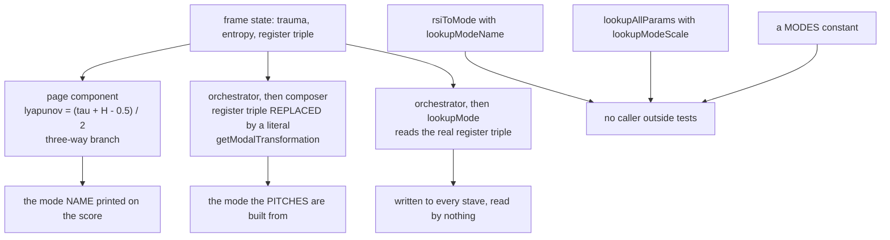
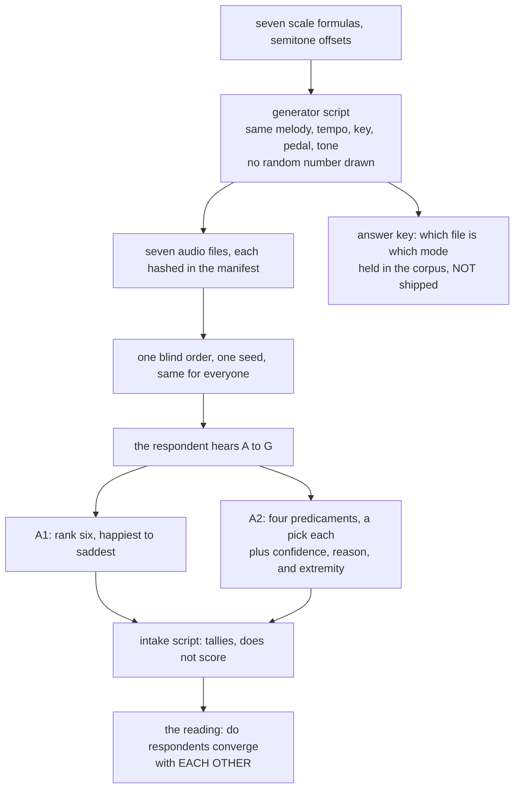

| Field | Value |
|:---|:---|
| Designation | MPN-S3 |
| Title | The mapping: from psychological state to musical material, parameter by parameter |
| Author of the theory | J. McKenney |
| Series | Paper 3 of 4, the music and score path. S1 states the theory, S2 the formal apparatus, S4 the Conductor implementation |
| Licence | CC BY 4.0 |
| Length | About 23,900 words of body text at revision 10, against about 13,850 at revision 9, counting alphabetic tokens outside tables and display maths on the same rule. The whole file, tables and all, runs to about 31,400 words against 18,900 at revision 9. The author set aside the series ceiling on 13 September 2026, after ARBITRATION-S3 had already accepted the paper over it, and the growth here is section 2.3's modal treatment and four folded-in amendments rather than restatement |
| Status | Revision 10. Two changes of substance and no reversals. Section 2.3's modal question is expanded from a report of four incompatible tables into a full treatment: what each of the four claims, where it lives, whether it reaches a score, what would have to be true for it to be right, the instrument that is now in the field to settle it, and what each of four possible outcomes does to the theory and to the application. And the four amendments of MPN-S3-AMENDMENTS-2 are folded into the body, so that the paper is self-contained and the amendment note becomes a record rather than a dependency [18]. **The modal question is open and under test rather than unanswered.** Item S3-8 is no longer a stub awaiting a decision at a keyboard: the question has stimuli, a response form, a blind presentation order, an intake protocol and a scoring script, and this paper now says what each answer costs. Everything ARBITRATION-S3 accepted at revision 7 and everything revision 9 verified stands unaltered. **The programme's standing caveat on its empirical position was added at the head of section 1 on 14 September 2026**, with the count of which of the six parameters have a listener test and which have none, and one further sentence in section 2.6 marking a claim that turns on an unmeasured number |
| What revisions 8, 9 and 10 changed | Revision 8 restored material earlier revisions cut for length, folded the implementation audit back into the body, completed section 2.5, and added a second worked frame, a decision-point diagram and a parameter summary. Revision 9 corrects four errors in that new material and one older than the paper: a parser defect, shared by every script in this programme since S2, that truncated seven annotation strings at an escaped apostrophe and misreported the degenerate-frame count as 107 where it is 104. Section 2.3 states the correction and MPN-S3-AMENDMENTS issues it against S2 and the register simplex figure. Revision 10 expands section 2.3's modal question and folds in four amendments issued against revision 9: the rounding pre-image rule in section 2.3, $k_{\max} = 23$ with the absolute form in section 2.5, the fourteen inherited bias coordinates and CB-017's remap in section 4, and the layer's status as a Layer 3 detector that renders no music in version one, in sections 4 and 5. No finding of revisions 8 or 9 is withdrawn |
| Implementation claims pinned to | `mpn-conductor-standalone`, working tree of 13 September 2026, the same tree S2 section 6.5 cites |
| Precedence | Where MPN-S3-AMENDMENTS-2 and the body of revision 9 conflict, **the note wins** and this revision takes the note's figure. Section 6 of that note lists every figure that moves and each is applied here [18] |
| Revision note | Revisions 1 to 7 are recorded here rather than narrated in the body, on the disposal ARBITRATION-S3 entry 5 ruled correct. Revision 1 described a modal table no rendered score has used, having searched a guessed list of function names; revision 3 corrected that and then drew a conclusion about the registers from the same mode search; revision 4 generalised over four of its own script's five register readings. Earlier drafts also misread the timbre literature as failing to replicate a third dimension, claimed S1's assertion B4 discharged, reported a naive product of 1,800 distinguishable frames, said six rhythmic cells where there are seven, and left the interpolation margin unstated. Each is corrected in place. Every one was found by verification rather than by argument, and the method that replaced the one which produced them is stated at the end of section 7 |
| Decisions implemented | 6, 7 and 8 of the decision log of 12 September 2026, and both decisions of 14 September 2026, D-2026-09-14-A on the bias layer's channel and D-2026-09-14-B on the rounding rule and $k_{\max}$ [17]. Decision 4 is **not** implemented: the shipped table conflicts with it and section 2.3 reports the conflict rather than resolving it, because resolving it would pre-empt question 5a under decision 5; it is item S3-8 of the work queue, and section 2.3 now states what would settle it and what each settlement costs. D3's drafting obligation is discharged, the interpolation being defined in section 2.3; the selection among (a), (b) and (c) remains the author's |
| Drafted for the author to strike | Sixteen bias-to-music mappings and fourteen domain assignments, per decision 7, and now also the fourteen state coordinates for the inherited mappings and the remapped device for CB-017. Section 4.4 says what each rests on and how to strike one, and three coordinate rows are marked undecided rather than defended |
| Under test rather than decided | A4's register-to-mode table and its second stage, by Part A of listening pack version 2; the interpolation margin $\delta$ and the rounding convention, by Part B; whether the Cayley metric carries a magnitude, item S3-10, by Part C; and the timbre channel's resolution, by Part D [19]. The pack is published and no response has been returned or scored, so every outcome section 2.3 traces is a conditional |
| Reproduces | Fourteen scripts in `05_DATA/03_generators/`, listed with what each establishes in `05_DATA/03_generators/S3-GENERATORS-README.md`, which is committed beside them. Eleven are this paper's own; three are shared with MPN-NOTE-05 and with the listening pack, and are named in the table at the end of section 8 with the figures they supply. Every numerical claim in this paper is produced by one of them; none is transcribed, and each aborts if the lines of the implementation it reads have changed |

## Contents

1. What this paper is
2. The six parameters
3. What survives into a score
4. The bias layer
5. The influence layer
6. What would show the mapping wrong
7. What is decided, what is drafted, what is absent
8. References

The parameter functions in one place, for a reader who wants the mapping before its justification:

| Parameter | Function of | Codomain | Jump set | Section |
|:---|:---|:---|:---|:---|
| Dynamics | trauma | eight markings, ppp to fff | seven boundaries: 0.10, 0.20, 0.35, 0.50, 0.65, 0.80, 0.90 | 2.1 |
| Tempo | entropy | 35 reachable integer bpm in three clusters | $\{0.4, 0.7\}$ | 2.2 |
| Metre | entropy | 4/4, 3/4, irregular, free | $\{0.3, 0.5, 0.6, 0.8\}$ | 2.2 |
| Mode | the register triple, trauma as a second stage | seven diatonic modes under $\arg\max$; a continuum containing them under the interpolation defined here | under interpolation, the surface $\tau = 0.6$ and nothing on the simplex | 2.3 |
| Fragmentation | entropy and trauma | five stages | four ladder boundaries at even fifths | 2.4 |
| Orchestration density | trauma and entropy | five levels | four ladder boundaries at even fifths | 2.4 |
| Harmonic position | $\mathcal{P}$, through $f(\text{state})$, with $f$ unfixed | 24 consonant triads under the neo-Riemannian algebra | the 24 chain positions of $\operatorname{round}(23 f)$, a quantum of $1/23 = 0.0435$ in $f$ | 2.5 |
| Timbre | the four DISC coordinates | $F \times [0,1]^3$, rank 3, null direction profile magnitude | none; nothing here discretises it | 2.6 |

Eight rows for six parameters, because metre travels with tempo and the harmonic position with trauma, and because the paper counts a parameter by what the theory names rather than by what the implementation packages together.

## 1. What this paper is

**The standing caveat, before the four findings and before anything this paper measures.** No listener has been asked anything, and every empirical claim in this programme is untested. Everything the programme holds it produced itself: 31,078 scored rows and 232 annotated frames, both outputs of the system under study. Listening pack version 2 is built, blinded and published, and it has been sent to nobody, so every figure below is either a theorem, a reading of source, or a design parameter awaiting a panel. Two earlier listener studies exist and neither is citable, their stimuli having come from an unseeded generator [1]. **Section 2.3 does this work in full for the modal question**, setting out the four candidates, the instrument in the field, and what each of four outcomes costs the theory and the application, and it is not restated here or anywhere else in this paper. What belongs here is the count across the six parameters, which nothing else states in one place. **Three of the six have a listener test specified and built**: mode, by Parts A and B; the harmonic position, by Part C; and timbre, by Part D [19]. **Three have none**: dynamics, tempo with metre, and fragmentation with orchestration density. The three without are not thereby safer. They are the three whose mapping claims nobody has yet arranged to put to anyone.

S1 asserts that the transformations professional practice applies to a leitmotif are functions of a psychological state, and that the functions are total, deterministic and inspectable [1]. S2 establishes what kind of object that transformation is, and leaves three things to this paper: the timbre space, which it shows to be the only channel the four DISC coordinates reach; the tie behaviour of the mode selector; and the completion of the identifiability analysis, which every listening study the programme plans depends on [2]. This paper states each of the six parameter functions, specifies the timbre space, decides the tie, completes the identifiability result, and drafts the bias layer that decision 7 assigns to it.

Four findings are worth stating before the detail, each with the section that establishes it.

**No mode that reaches a score is a function of the registers, though much else is** (section 2.3). Five places in the shipped source decide a mode. The name printed on a score comes from a three-way branch on $(\tau + H - 0.5)/2$, a quantity the code calls a Lyapunov exponent and which is not one; that branch is written as a fallback behind a field that does not exist, and a cast stops the type checker from saying so, so it wins on every frame. The notated pitches come from a selector fed a hard-coded register triple, which makes the Imaginary dominant for every character in every play and leaves five of seven modes unreachable. The one selector that does read the frame's register triple has its answer written to every stave and read by nothing. Two further tables are unreachable from any score. S2 reports the first two of those [2]; what is added here is why the branch always wins, which is the part a repair needs, the discarded selector, and the measurement that the printed name and the notated pitches agree on only 36.0 per cent of the state square. The registers do reach the score, through the key, the chord quality and the leitmotif transformation, and section 3 enumerates every reading; none of them compares the registers against each other, so which register leads is never consulted anywhere. A4 is therefore not merely untested but untestable on the current build, and a listening study run on it would return a null whatever the truth of the assertion. Items S3-1 and S3-2 of section 7 are the repair and they are small.

**The timbre channel cannot carry DISC** (section 2.6). Multidimensional scaling of musical timbre returns three perceptual dimensions, agreed across both cited studies, which disagree only about the acoustic correlate of the third [3], [4]. DISC has four coordinates. Section 2.6 states the map from one to the other and proves that its null direction is profile magnitude: two characters whose DISC scores differ by a constant added to all four produce **identical** timbre, and no listener can tell them apart however good their ear. The loss is exactly one dimension, no more and no less, and the choice the theory gets to make is only which direction is lost. A listening study that asks a listener to recover a DISC profile from a cue is therefore asking for something the channel cannot carry, and this result cancels such a study before it is paid for.

**The tie rule is defined, with one parameter left to the author** (section 2.3). S2 leaves the mode selector's behaviour at a tie as decision D3 and shows that hysteresis and a dead band both fail on it, since both are defined by a gap and neither releases when the gap is zero [2]. D3 assigns this paper the interpolation, not the selection among the three alternatives, which is the author's. The interpolation is given in closed form, and four of its properties are proved in a line each and checked numerically: determinacy at a three-way tie, exact agreement with $\arg\max$ away from the margin, Lipschitz continuity on the closed simplex, and a worst-case notation error of exactly a quarter tone. The tie is not a corner case: 21 of the 128 frames that reach the simplex sit exactly on one. Under the rounding rule section 2.3 now adopts, the quarter tone is a property of the notation path and not of the mapping: $\Phi$ emits cents and the notated pitch is the rounded pre-image.

**The modal question is open and under test, not unanswered** (section 2.3). Four incompatible register-to-mode tables sit in the corpus, two of them exact inversions of each other on every register, so at most one can be right and all four may be wrong. Revision 9 reported that and stopped. What section 2.3 now adds is the treatment: what each table claims, where it lives, whether it reaches a score at all, and what the theory would have to be true for each to be right; why the fourth candidate is not a fifth table but a different mechanism, a jump to a crisis mode per register rather than a dim within a pair, which changes A4's second stage rather than A4's assignment; the instrument that is in the field to settle it, which is Part A of listening pack version 2, described as it is built rather than as a plan [19]; and what each of four outcomes does to the theory and to the application, naming for each the documents that change and the work items that open or close. **The question the pack asks is not whether listeners agree with the theory but whether they converge with each other**, because four tables disagree and no one of them can be the standard without assuming the answer. Convergence on any of the four is a result; non-convergence refutes the premise that there is a table to find.

**The bias layer's two sets of thirty reconcile exactly, and reproducibly** (section 4.1). Fourteen shared, fifteen implementation-only, sixteen Atlas entries with no musical mapping, fourteen with no domain. Those are S1's counts [1]; what is new is that a script now derives all four from the two sources rather than restating them, and fails loudly if the drafted content does not cover exactly the gaps. The invariant it enforces survives the author striking a drafted row, provided the strike is recorded, so the reconciliation continues to account for all thirty entries and a row cannot be dropped silently.

**Scope.** This paper states the mapping. It does not implement it, which is S4's business, and it does not settle A4's choice of modal table, which remains the author's; what it does is state the consequences of each option precisely enough that the choice can be made at a keyboard, and say what an instrument now in the field would have to return for the choice to be made by ear instead. The sixteen bias mappings and fourteen domain assignments are drafted under decision 7 for the author to strike out what is wrong, and section 4.4 is written so that striking one is a local operation.

**What this paper is not, stated before anything else.** No listener has been asked about any mapping in it. Listening pack version 2 is published and its stimuli are final and hashed, and no response to it has yet been returned or scored, so nothing in this paper rests on a listener's answer and nothing in it may be read as reporting one [19]. Nothing in it has been measured on any person. The corpus contains no observation of trauma, entropy or the registers that the system did not produce about itself, so every table below is a proposal and none is evidence, however precisely its numbers are computed. The figures that look like results are properties of a proposed map, which is why each is reproduced by a named script rather than reported.

**A note for a clinical reader.** The quantities this paper maps are dramatic quantities about fictional characters, defined in S1. Trauma here is the difference between a character in the first scene and the same character after the event the play is about. It is not a clinical measure, it is not a diagnosis or a screen, nothing in this paper is a treatment protocol, and no paper in this series is yet addressed to music therapists. A therapist reading it should treat it as a description of a piece of software and of a theory about drama.

**Three words that mean different things in this paper.** *Register*, unqualified, means one of Lacan's three, the Real, the Symbolic and the Imaginary, as S1 defines them; where the musical sense is meant, the paper writes *registral* or names the octave. *DISC* is the four-factor personality instrument, Dominance, Influence, Steadiness and Conscientiousness, and a character's DISC profile is four numbers in $[0,1]$. *Mode* means one of the seven diatonic modes, never a manner of operation. Three terms of art are inherited from S2 and used without re-deriving them: the *tripod* is the set of three segments from the centre of the register triangle to the midpoints of its sides, which is where the dominant register is undefined; the *kite result* is S2's closed form $2\delta - \delta^2$ for the area within $\delta$ of a tie; and a map is *Lipschitz* if there is a fixed bound on how much its output can change per unit change of its input, which for a musical parameter means no sudden jump.

## 2. The six parameters

Each subsection states the function, its effective contributions where it takes more than one input, its jump set, and what would show it wrong. Effective contributions are computed at the frame library's dispersions, $\operatorname{sd}(H) = 0.1925$ and $\operatorname{sd}(\tau) = 0.2496$, which are themselves system output and are labelled as such in S1 [1]; a weight quoted without one is an unexamined claim about a variance [5].

### 2.1 Dynamics

Decision 6 makes the eight-marking linear form normative [6]. Velocity runs linearly from the threshold of audibility to the ceiling of the instrument,

$$v(\tau) = 20 + 107\tau,$$

truncated to an integer rather than rounded, as the shipped module does it with `int()`, and discretised to the eight conventional markings. The output of $\Phi$ is the marking, not the velocity: the velocity interval is the pre-image, as S2 section 6.1 sets out. The boundaries are those of the shipped Python module, which is the only implementation carrying all eight:

| Marking | ppp | pp | p | mp | mf | f | ff | fff |
|:---|---:|---:|---:|---:|---:|---:|---:|---:|
| $\tau$ below | 0.10 | 0.20 | 0.35 | 0.50 | 0.65 | 0.80 | 0.90 | 1.00 |

Two properties follow and both are consequences rather than choices. The bands are unequal, widest in the middle and narrowest at the extremes: the four at the ends of the range are 0.10 wide and the four in the middle 0.15, a ratio of three to two, so the instrument resolves trauma half again as finely at the extremes as it does in the middle. As a property of the band widths, for a character sitting at a uniformly random point inside a band a step of 0.05 in trauma changes the marking one time in two at the extremes and one time in three in the middle, and in the topmost band it cannot change it at all, since a step upward has nowhere to go. [12] And because dynamics is a function of trauma alone, and trauma ratchets, **the dynamic marking of a character cannot fall across an act**. S1 states the ratchet as a property of the definition; here is where it becomes audible. If the drama wants relief, decision D4 of the S2 list is what supplies it, and until it is taken this parameter is monotone by construction.

**The path a rendered score actually takes.** There is a second implementation and it is the one the application uses. `lookupDynamics` matches trauma against the reference dictionary's `volume_level` entries conditioned on trauma, of which there are three, and returns a literal fallback of velocity 72 labelled `mf` when none matches [12]:

| Entry | Condition | Label emitted | Velocity |
|:---|:---|:---|---:|
| `dynamics-001` | 0.0 to 0.2 | `ppp/pp` | 30 |
| none | 0.2 to 0.4 | `mf`, the fallback | 72 |
| `dynamics-002` | 0.4 to 0.6 | `mf` | 72 |
| none | 0.6 to 0.8 | `mf`, the fallback | 72 |
| `dynamics-003` | above 0.8 | `fff` | 118 |

Three things follow and none is a judgement call. The composed function emits **three** labels, not eight, at **three constant velocities**, not $20 + 107\tau$. Two of its five intervals are accidents of a lookup that fails rather than bands anyone designed, and they return the same `mf` as the interval that succeeds, so six tenths of the trauma range collapse to one velocity, which is the observation the commensurability audit makes independently [5]. And the label `ppp/pp` is not a dynamic marking at all but a display string split on its first space, so a consumer resolving a marking by name finds nothing under it.

Decision 6 makes the eight-marking linear form normative and only the Python module implements it. Everything else in this section describes the normative law, which is what the theory says; item S3-3 of section 7 is the repair, and until it lands no test of A7's dynamic ordering is possible, because the ordering under test has three rungs and one of them is a hole.

The jump set is the seven boundaries above. $f_{\text{dynamics}}$ is piecewise constant and the marking is the output, so nothing about it is continuous and nothing should be claimed to be.

It would be shown wrong if listeners asked to rank cues by the weight the character is carrying did not reproduce the ordering of the markings, which is a discrimination test and does not need a verbal anchor.

### 2.2 Tempo

Tempo is the one factor of the codomain that is genuinely continuous in the state, and it is continuous only in pieces. The shipped implementation sorts entropy into three bands, strategic at $H \le 0.4$, operational at $0.4 < H \le 0.7$ and crisis above that, looks up a beats-per-minute range for the band, and then places the tempo inside that range in proportion to entropy:

$$f_{\text{tempo}}(H) = \operatorname{round}\Big(b_{\min}(H) + H\big(b_{\max}(H) - b_{\min}(H)\big)\Big),$$

with $(b_{\min}, b_{\max})$ equal to $(40, 60)$, $(80, 100)$ and $(120, 180)$ on the three bands [12]. Within a band the law is therefore affine in the state with a strictly positive slope, and the two discontinuities come from the range changing underneath it rather than from the tempo being constant between them.

What the arithmetic then does is very nearly cancel the continuity it has just established, and the figures are worth having in full:

| Band | Entropy | Range | Law | Span emitted | Jump that follows |
|:---|:---|:---|:---|---:|---:|
| strategic | $H \le 0.4$ | 40 to 60 | $40 + 20H$ | 40 to 48, 8 bpm | $+40$, five times the span |
| operational | $0.4 < H \le 0.7$ | 80 to 100 | $80 + 20H$ | 88 to 94, 6 bpm | $+68$, eleven times the span |
| crisis | $H > 0.7$ | 120 to 180 | $120 + 60H$ | 162 to 180, 18 bpm | |

The slope inside the two lower bands is twenty beats per minute per unit of entropy, so a change of 0.05 in $H$ moves the tempo by one beat per minute, which is the rounding quantum of the output: within those bands the parameter is very nearly inert. The three ranges sit so far apart that of the 141 integer tempi between 40 and 180 only **35** are reachable at all, in the three runs above; the intervals 49 to 87 and 95 to 161 are silent for every character in every play, whatever their state. Against that inertness the jumps are enormous.

So tempo is continuous in form and categorical in effect, and it is worth being careful about why, because the obvious explanation is not quite right and the careful one is more useful.

The within-band variation is not ruled out by the published discrimination thresholds. Drake and Botte give relative just-noticeable differences for tempo of about 6 per cent for a single interval and about 3 per cent for a six-interval sequence, over interonset intervals from 100 to 1,500 milliseconds with sensitivity best between 300 and 800 [15]. The three bands span 18.2, 6.6 and 10.5 per cent of their own midpoints, at interonset intervals of 1364, 659 and 351 milliseconds [12]. Every span clears the single-interval figure and all three clear the sequence figure.

Three qualifications belong with that, and they matter more than the comparison. The thresholds come from a two-interval forced choice on isochronous sequences with one dimension varying, which is a best case for a listener; clearing them means a difference is **not ruled out**, not that it would be heard in a score where several parameters move at once. The operational band clears the 6 per cent figure by 0.6 points, which is inside the precision of the source. And the strategic band's 1364 milliseconds lies outside the range where the thresholds were best measured, so 6 per cent is not the applicable figure there and the applicable one is probably larger.

What the comparison does establish, and what section 3 needs, is a ratio. Taking 6 per cent as the threshold, about 3.0, 1.1 and 1.8 just-noticeable differences fit inside the three bands, while the mapping emits 9, 7 and 19 distinct integer tempi in them. **Inside a band the mapping emits roughly five times as many levels as a listener could resolve.** That is the sharpest statement of the difference between what the mapping emits and what could be recovered from it that this paper can make, and section 3's counts should be read against it.

What makes the parameter categorical in effect, then, is proportion rather than inaudibility: the steps between bands are five and eleven times the spans within them, so a listener attending to speed hears three plateaux with cliffs between, and the gradient inside each plateau is real, is probably at the edge of resolution, and is swamped. Section 6 records that as a prediction rather than asserting it.

Metre travels with the tempo, and travels badly. It is looked up from entropy against four conditions, below 0.3, 0.3 to 0.5, 0.6 to 0.8 and above 0.8, giving common time, waltz time, an irregular 5/4 or 7/8, and free metre [12]. Those conditions do not cover 0.5 to 0.6, where no entry matches and the lookup returns its literal fallback of 4/4, the metre of the most ordered characters in the play. Metre as shipped therefore runs 4/4, 3/4, 4/4, irregular, free as disorder increases, and a character at $H = 0.55$ is notated like one at $H = 0.10$. An implementation defect and not a statement of the theory, reported here because the defect falls exactly on the meaning this section asserts.

The two jump sets do not coincide either. Tempo steps at 0.4 and 0.7 and metre at 0.3, 0.5, 0.6 and 0.8, and six boundaries partition the unit interval into seven cells, which direct enumeration confirms. No boundary in one parameter is heard at the same moment as a boundary in the other. Nothing in the theory motivates the offset; it is what two independently written lookup tables happen to produce.

The claim underneath all of this is that disorder in the subject's symbolic organisation shows as instability of pulse rather than as speed. It is worth separating from the more obvious claim it is often confused with: this is not that agitated characters play faster, and a character can be scattered and slow. The implementation asserts the claim and then works against it, because the signal it produces is dominated by speed, a step of 40 and then of 68 beats per minute, while metre, where instability of pulse would have to live, has a hole in the middle of its range and returns the most ordered metre there. The jump set is $\{0.4, 0.7\}$ for tempo and $\{0.3, 0.5, 0.6, 0.8\}$ for metre, and the section would be shown wrong if listeners heard the band changes as changes of speed rather than of stability. On the current build that test would most likely fail, and section 6 records the prediction in that direction rather than in the one that would flatter the mapping.

### 2.3 Mode, and what happens at a tie

A4 selects the mode from the dominant register, with trauma as a second-stage switch. Which register takes which mode is the author's to settle at a keyboard and this paper does not settle it. The four options in the corpus, so that the choice is on the page rather than in a search:

| Source | Real | Symbolic | Imaginary |
|:---|:---|:---|:---|
| the live pitch table, `leitmotif_transformation_rules.ts` | Dorian, Aeolian above $\tau = 0.6$ | Lydian, Mixolydian | Phrygian, Locrian |
| the reference dictionary, `mpn_reference_data.ts` | Phrygian/Locrian | Ionian | Lydian/whole-tone |
| `lookupModeName`, unreachable | phrygian | ionian | lydian |
| the eight synthetic raters, per decision 5 | not reported | the semitone above the tonic | not reported |

This paper does not pre-empt the choice and it does not leave it bare either. What follows does three things in order. It states what each of the four claims, where it lives, whether it reaches a score, and what would have to be true of the world for it to be right. It describes the instrument that is now in the field to settle it. And it traces each of four possible outcomes through to the documents that would change and the work that would open or close. Governing all three is a prior fact this section establishes: **no mode that reaches a score is a function of the registers**, so A4 is not under test in any score the system has produced, and an instrument that could test it cannot be the application.

**The four candidates, one at a time.** A choice between four tables is cheap to take only if what each one claims is on the page beside what would have to be true for it to be right. The four differ in more than their assignments. They differ in whether they reach a score at all, and one of them differs in mechanism rather than in assignment, which takes it off the axis the other three sit on.

**One, the live pitch table, `leitmotif_transformation_rules.ts:63-91`.** It claims that the Real takes Dorian and dims to Aeolian above trauma 0.6, the Symbolic takes Lydian and dims to Mixolydian, and the Imaginary takes Phrygian and dims to Locrian. It reaches a score, and it is the only one of the four that reaches the notated pitches, through `getModalTransformation` on the composer path. What it does not reach is the frame's registers, because `composeMelody` substitutes a literal triple before calling it, so on the build as it stands the table is live and its input is a constant and every character in every play is notated in Phrygian or in Locrian. For this table to be right, three things would have to hold. Brightness would have to run with the register in the order Symbolic, Real, Imaginary, since Lydian is the brightest of the seven modes by raised degrees against lowered and Phrygian the second darkest. The second stage would have to be a dim within a pair, one degree flattened and the character of the scale preserved, rather than a change of kind. And the Imaginary would have to take a trauma partner, which decision 4 of the log of 12 September 2026 denies [6]. The first of those is a musical claim about what the three registers sound like and is exactly what Part A of the listening pack asks. The third is a conflict on the face of the corpus and is item S3-8.

**Two, the reference dictionary, `mpn_reference_data.ts:1034-1102`.** It claims that the Real takes Phrygian or Locrian, the Symbolic takes Ionian, and the Imaginary takes Lydian or the whole-tone scale. It is consulted by `lookupMode`, which is called on every frame and which is the only function in the application that sorts the frame's actual register triple; its answer is written into every stave's `musicParams` and read by nothing, so it reaches no score. It is an **exact inversion** of the live table on every one of the three registers: where the live table gives the Symbolic the brightest mode and the Imaginary the darkest, this one gives the Imaginary the brightest and the Real the darkest. At most one of the two can be right, and both may be wrong, and that is the most useful thing that can be said about the pair before anyone listens. For this table to be right, brightness would have to run Imaginary, Symbolic, Real, and the Real would have to be the darkest register, which is a defensible reading and not an obviously worse one than the live table's, the Real being in S1's terms what resists symbolisation. Two mechanical facts sit against it whatever any listener says. Two of its three entries are not mode names at all but slash-joined pairs produced by splitting a display label on its first space, so a consumer resolving a mode by name finds nothing under `phrygian/locrian` or under `lydian/whole-tone`. And its Imaginary entry names Lydian while the formula beside it is the six-degree whole-tone scale, so a name and a formula disagree inside one module, and the cardinality constraint stated later in this section makes the interpolation undefined on this table rather than merely awkward.

**Three, `lookupModeName` in `psychometric_calculus.ts:109-113`, unreachable.** It claims that the Real takes Phrygian, the Symbolic Ionian and the Imaginary Lydian, with **no second stage at all**. It is consulted only by `rsiToMode`, which has no caller outside its own tests, so it reaches nothing; a `MODES` constant in the same module is declared and never read. It is the reference dictionary's assignment with the alternatives stripped out and the trauma stage dropped, which makes it the cleanest statement of the inverted reading and the only one of the four that is a bare function of the registers. For it to be right, the inverted brightness ordering would have to hold and the trauma switch would have to be nothing: mode would be a function of the register triple alone. That is a stronger claim than the reference dictionary makes and a more easily falsified one, because it predicts that the same register at any trauma takes the same scale, which a listener can be asked about directly.

**Four is not a fifth option on the same axis, and it needs its own treatment.** The eight synthetic raters of decision 5 are not a table. At maximum extremity, six of the eight moved the Symbolic to the **semitone above the tonic** rather than to a dimmer partner of its reference scale, and the decision log records that this fits none of the four tables in the corpus [6]. Read as a table it is an oddity. Read as a **mechanism** it is something else and more interesting. The semitone above the tonic is the flat second, and the flat second is the degree that distinguishes Phrygian and Locrian from every other mode in the set. A rater who moves the Symbolic there at maximum trauma is not dimming Lydian to Mixolydian, one degree flattened inside a bright pair. They are jumping to a different kind of scale. So what the raters propose is a **jump to a crisis mode per register** rather than a **dim within a pair**, and that changes **A4's second stage rather than A4's table**.

That distinction is worth holding because it decides which of two questions an instrument has to ask. A table question is answered by asking which scale goes with which predicament. A mechanism question is answered by asking whether that answer **changes when the predicament is at its worst**, and by how far it changes. This is why every situation in Part A of the pack carries a second question, whether the respondent's choice changes if the situation is at its most extreme, on the same seven items plus "no change". Three answers to that question are distinguishable in the returns and they are answers to three different mechanisms. A respondent who names one scale for a predicament and a neighbouring one at extremity is describing a dim. A respondent who names a scale from the other end of the brightness ordering is describing a jump. A respondent whose answer does not change at all is describing a mechanism with no second stage, which is candidate three's claim. None of those three is A1's ranking, which is why the ranking and the situations are separate questions rather than one.

Two limits on candidate four belong with it. The raters reported the Symbolic only, so even taken at face value it is one register of three and says nothing about what the Real or the Imaginary do at extremity; the pack asks all four situations of every respondent for that reason. And they were synthetic, which is the whole reason decision 5 refused to settle the matter at a desk and put it to people who score drama instead.

| Candidate | Where it lives | Reaches a score | What it claims | True only if |
|:---|:---|:---|:---|:---|
| the live pitch table | `leitmotif_transformation_rules.ts:63-91` | yes, the notated pitches, on a constant register triple | Real Dorian to Aeolian, Symbolic Lydian to Mixolydian, Imaginary Phrygian to Locrian | brightness runs Symbolic, Real, Imaginary; the second stage dims within a pair; the Imaginary has a partner, against decision 4 |
| the reference dictionary | `mpn_reference_data.ts:1034-1102`, via `lookupMode` | computed every frame, read by nothing | Real Phrygian or Locrian, Symbolic Ionian, Imaginary Lydian or whole-tone | brightness runs Imaginary, Symbolic, Real; and two defects are repaired, the slash-joined labels and the six-degree entry |
| `lookupModeName` | `psychometric_calculus.ts:109-113`, via `rsiToMode` | no caller outside tests | Real Phrygian, Symbolic Ionian, Imaginary Lydian, no second stage | the inverted ordering holds **and** trauma changes nothing, so mode is a function of the registers alone |
| the eight synthetic raters | decision 5's note, no code | not code at all | the Symbolic goes to the semitone above the tonic at extremity | the second stage is a jump to a crisis mode per register; this changes the mechanism and leaves the table below the switch open |

**Where the modes actually come from.** Five places in the shipped source decide a mode. They are set out in full here because the claim this section rests on is a negative one, and a negative claim about an implementation is worth only as much as the enumeration behind it. The enumeration is `s3_modes.py`, which searches every non-test source file for lines returning or assigning one of the seven mode names or a scale formula, rather than for the names of functions that might do so; that is the distinction an earlier revision of this paper got wrong [12], [13].

**One: the name printed on the score.** The rendered frame takes its mode from `(output.global as any)?.mode || (lyapunov < 0 ? 'Ionian' : lyapunov < 0.1 ? 'Lydian' : 'Phrygian')`, where `lyapunov` is $(\tau + H - 0.5)/2$, a quantity the code names for an exponent it is not [12]. The first operand looks like a deference to whatever the orchestrator decided. It is not, and the reason is worth stating exactly, because it is the whole of the repair. The `OrchestratorOutput.global` interface declares four fields, tempo, time signature, key and dynamics, and the object built at the return site carries the same four; there is no `mode` among them. The expression is written with an `as any` cast, which is what stops the type checker from reporting the access to a field that does not exist. So the first operand evaluates to `undefined` on every frame and the branch always wins. The printed mode is therefore a three-way function of $\tau + H$ alone: Ionian below 0.5, Lydian to 0.7, Phrygian above. S2 section 6.5 reports that this branch is what reaches the score [2]; what is added here is why it always wins, and that is the part a repair needs, because adding the field without removing the cast would change nothing.

**Two: the mode the pitches are built from.** `composeMelody` opens by writing `const rsi = { real: 0.33, symbolic: 0.33, imaginary: 0.34 };` and passes that literal, not the state, into `getModalTransformation` [12]. Since 0.34 is strictly the largest, the dominant register is the Imaginary for every character in every play, whatever their state. The table `getModalTransformation` holds is:

| Dominant register | $\tau \le 0.6$ | $\tau > 0.6$ | Reached? |
|:---|:---|:---|:---|
| Real | Dorian | Aeolian | never |
| Symbolic | Lydian | Mixolydian | never |
| Imaginary | Phrygian | Locrian | always |

Of the seven modes the module defines, two are reachable and five are not, Ionian among them. S2 section 6.5 reports this as well [2].

**Three: the one selector that reads the registers, and what becomes of its answer.** `lookupMode` is reached on every frame, from `psychometricToMusical` at `score_orchestrator.ts:267`, and it is the only function in the application that sorts the frame's actual register triple and chooses on it. Its result is written into every stave's `musicParams` at `score_orchestrator.ts:360` and then read by nothing: the string `musicParams` never appears with `.mode` anywhere else in the source [12]. **The claim is about the mode field and not about the assignment.** The mutated stave is returned at `:363` and the object is read downstream, at `score_exporter.ts:81`, `:84`, `:88` and `:89`, which take `instrumentFamily`, `timbre`, `dynamic` and `articulation` from it. The mode is not among them: the exporter writes `mode: 'ionian'` as a literal at `:73`, under the comment `TODO: extract from params`. Nor does the orchestrator's own output interface carry a mode at all, `OrchestratorOutput.global` declaring only tempo, time signature, key and dynamics at `:61-70` and the output object supplying only those four at `:440-445`, which is why the page's `(output.global as any)?.mode` at `page.tsx:488` is undefined on every frame and the Lyapunov branch behind it always wins [12]. So the register-dependent mode is computed on every frame and discarded. That finding is this paper's rather than S2's. Two of the three strings it would emit are not mode names in any case but slash-joined pairs, `phrygian/locrian` and `lydian/whole-tone`, produced by splitting a display label on its first space, so a consumer resolving a mode by name would find nothing under either.

**Four and five: two tables no score can reach.** `rsiToMode` in `psychometric_calculus.ts` has no caller outside its own tests, and `lookupModeName`, which it consults, is referenced only inside it; that table gives the Real to Phrygian, the Symbolic to Ionian and the Imaginary to Lydian, which is an inversion of the live pitch table on every one of the three registers. `lookupAllParams` has no caller either, and `lookupModeScale`, which reads a fourth table out of the reference dictionary, is referenced only inside that; in that table the Imaginary's entry is named Lydian and its formula is the six-degree whole-tone scale, so a name and a formula disagree inside one module. A `MODES` constant in `psychometric_calculus.ts` is declared and never read. S1's report of four incompatible register-to-mode tables, two of them exact inversions, is confirmed here at path and line, with two corrections: there are five decision points rather than four once the Lyapunov branch is counted, and the table the documentation describes is reachable from nothing.

**The trauma switch, against decision 4.** The pitch table gives all three registers a trauma partner, the Imaginary included, and decision 4 rules that the Imaginary has **no partner** [6]. The conflict is reported, not resolved: A4's second stage is already question 5a in the listening pack under decision 5 [6]. If the synthetic raters' reading holds, that the switch is a jump to a crisis mode per register rather than a dim within a pair, then decision and code are both wrong and A4's mechanism changes rather than its table.

**The printed name and the notated pitches disagree, measurably.** The name is a function of $\tau + H$ and the pitches of $\tau$, so a score's header and its accidentals need not describe the same mode. Over the $(\tau, H)$ square they agree on 36.0 per cent of states; on the rest a score labelled Ionian or Lydian is notated in Phrygian, or one labelled Phrygian is notated in Locrian [12].

**What follows for A4.** The assertion is testable in principle and untested in fact: a study run on stimuli from the current build measures a branch on $\tau + H$ against a constant register triple and returns a null whatever the truth of A4. The repair is S4's and it is small: give `OrchestratorOutput.global` a mode field, remove the cast, and pass the frame's register triple into `composeMelody` instead of the literal.

**Why a study on the application cannot answer this, and why a pack can.** This governs everything that follows and it is the reason the question goes to synthesised stimuli rather than to a rendered score. **No mode that reaches a score is a function of the registers on the current build.** A study run on stimuli rendered by that build would be putting a three-way branch on $\tau + H$, and a register triple that is a literal, in front of listeners; it would return a null whatever the truth of A4, and the null would look like a verdict on the assertion rather than on the wiring. The pack's stimuli do not come from the build. They are synthesised directly from the seven scale formulas by a script that takes a list of semitone offsets above the tonic and renders a melody on them, so the chain from a mode to a sound contains no orchestrator, no composer and no register substitution [19]. That is why items S3-1 and S3-2 block a modal study on the application and block nothing at all in the pack.

**The instrument, and it exists.** Listening pack version 2 is built and published, its stimuli are final and hashed, and **Part A** is the part that bears on A4 [19]. What follows describes the instrument that is in the field, not a plan for one.

**What a respondent hears.** Seven items, labelled A to G. Every one of them is the **same eight-bar melody**, at the **same tempo** of 100 beats per minute, in the **same key**, over the **same low pedal**, a C two octaves below middle C sounding once a bar, and on the **same neutral tone**, which is an additive voice of five partials under one fixed envelope. **Only the scale changes, and nothing else in any file differs from anything else**, which the page states before the first item. The melody is twenty-two notes across the eight bars, an arch that rises to the octave and returns, and it is published in scale degrees in the manifest so that a reader can check that no degree is omitted or favoured. The octave is held at twelve semitones in every item, so the tonic and the octave are fixed points and every judgement a respondent makes is about the five degrees between them on which the seven modes disagree. The seven scales are the seven diatonic modes. No random number is drawn anywhere in the generation, the set is a pure function of one script, every file carries a SHA-256 in the manifest, and the pack ships the audio rather than a promise to regenerate it.

**What they are asked.** Two questions, in that order, and the page instructs that an earlier part is not revised after a later one is heard. First, **a ranking**: take six of the seven, A to F, and put them in order from the one that sounds happiest to the one that sounds saddest, with a separate box for ties and for anything that will not rank. The wording is careful about which question it is asking, and says so in its own words: what the music sounds like it is expressing, not how it makes the listener feel, those being two different questions. The seventh item is held out of the ranking, and it is the one scale of the seven with no perfect fifth. Second, **four predicaments**: four situations a character can be in, written as a director would describe them and, on the therapist path, as a colleague would; nothing else differs between paths and **no stimulus differs at all**, so a therapist's Part A answers and a composer's are directly comparable and are pooled. For each situation, listening to all seven, the respondent gives four things. A **pick**, from A to G or "none of them fits" or "cannot tell". A **confidence**, on a slider from 0 to 100 that starts unset and is recorded as unset until it is touched, so that a lean and a certainty do not look alike and neither looks like an untouched control. A **reason** in free text, prompted to say what it is about the sound rather than what the scale is called. And an answer to **whether the pick changes if the situation is at its most extreme**, on the same seven plus "no change" and "cannot tell", which is the question that separates a dim from a jump.

**The four predicaments are the registers, written without naming them.** The first is something that has happened to the character and will not go away and cannot be explained, a fact that does not yield and that comes back exactly as it was however they try to account for it. The second is a world held in place by role, rule, duty and position, where who the character is is where they stand, and what is at stake is whether that order holds and where they sit inside it. The third is a character living through a picture of themselves and measuring themselves constantly against other people, with vanity, rivalry, admiration, and a version of themselves they can never quite become. Those are the Real, the Symbolic and the Imaginary as S1 defines them, put into a director's language so that a respondent can answer without holding a theory [1]. The fourth is none of the three: a character whose attention rises and falls on a fixed cycle that has nothing to do with what is happening around them, so that events arrive early or late with respect to it. It answers to no register in the triple. Since "none of them fits" is on offer for every situation, a respondent who gives the fourth a scale as confidently as the other three has said something about the instrument rather than about the table, and the confidence slider is what makes that visible.

**What is withheld, and why.** Three things are withheld from every respondent, and the pack says on its face that they are and why. The scale names. What the theory predicts. And what the earlier panel of language models said. The stated reason is that a respondent who knew could not unknow it and the answer would be worth nothing. Respondents are also not told how any item was built or why it is in the set. The key that decodes the labels is `ANSWER-KEY-v2.json`, it is held in the corpus and is **not shipped in the pack**, and a returned file is meaningless without it, which is what makes a returned file safe to send back by ordinary electronic mail. Presentation order is one permutation drawn once from seed 20260914 and identical for every respondent, and that is the whole of the comparability argument: one respondent's item and another's under the same label are the same item, so two answers can be put side by side with no further assumption. Nobody gets a re-shuffled pack, not to control for order and not for a respondent who has seen it before, and a change to the order is a new wave that pools with nothing before it [20].

**What the analysis does with the returns.** A response arrives as one plain text file, or as the same text pasted into a message, and there is nothing else to collect. It is filed verbatim under a code assigned in the order responses are received, never reused and never reassigned, and the join from a code to a person exists in one tracking sheet and nowhere else. **The returned file is never edited**, not to fix a typo and not to close a quote; a repair needed before it will parse goes in a sibling file and the reason goes in the register [20]. The intake script reads the directory, joins each answer to the key, and writes one summary per respondent and one pooled summary. For Part A specifically it **does not score**. It computes, over those rankings that are six distinct letters from A to F, each item's **mean position** in the happiest-first order, and it reports how many rankings were usable of how many respondents attempted the part. It **tallies the picks per situation**, one count per item picked. It reports the confidences, and it reports a confidence set with no item picked as a contradiction rather than dropping it silently. Free text is tallied as answered or not and then read by a person. And it prints, in its own words, that convergence is read off the spread of those picks rather than off any key, **because the key holds no row for Part A**. A part with no answers makes a response partial rather than unusable, and a partial response is filed, registered and scored exactly like a complete one, on the stated ground that most of the value of the pack survives an abandoned part and none of it survives a response that was never filed. Five conditions make a response unusable and only one of them is about the content of an answer: no path can be established, nothing was answered, the labels cannot be trusted, the respondent was told what the items were before answering, or an earlier part was revised after a later one was heard and the respondent says so. **A response that contradicts the theory is not among them**, and neither is a respondent who answered "cannot tell" throughout.

**What counts as an answer, and this is the one thing that decides everything.** **The question is not whether listeners agree with the theory. It is whether they converge with each other.** Four tables disagree and two of them are exact inversions, so no one of the four can be the standard against which a respondent is marked without assuming the answer the pack exists to get. Convergence on any of the four is a result, including convergence on a table the theory does not hold, because it establishes that there **is** a table to find and says which one it is. Convergence on none of the four is also a result and a sharper one, because it would mean the registers pair with scales in a way nobody in this corpus has yet written down, which is a finding about the world and not about the corpus. And **non-convergence refutes the premise**. If expert listeners do not agree with each other about which scale goes with which predicament, then A4 is not merely untested: there is no fact about listeners for it to be a statement of.

**The panel, stated honestly.** This is a **small expert panel**, and it is the right instrument for settling a design parameter and the wrong instrument for a citable perceptual claim. The pack has no pre-registration, no counterbalancing and no power calculation, and it says so in its own documentation rather than leaving a reader to notice. Decision 12 of the log of 12 September 2026 sets the number at five people [6]. No figure the pack returns may be cited as a perceptual result, and nothing in this paper should be read as claiming one. **Part R of the pack asks respondents themselves what a citable study would require**, in four places: the minimum panel size they would accept, the statistic they would want reported, what is missing from the pack, and what they make of the fact that nothing is counterbalanced and nothing is randomised per respondent. That is the instrument asking to be replaced by a better one, and the answers to Part R are the specification for its replacement. Two listener studies already exist in this corpus and neither is citable, because their stimuli came from an unseeded system and cannot be reproduced [1]. These stimuli are reproducible, and that is the one methodological property this pack has that its predecessors did not.

**What each outcome does to the theory and to the application.** Four outcomes are possible and each is traced through here, because a question is only worth asking if the answers are worth having and that has to be shown rather than asserted.

**One: listeners converge on the live pitch table.** A4 stands as written, mechanism and assignment both: the dominant register selects the mode and trauma dims within a pair. Nothing in the theory moves and nothing in this section's tables moves. What changes is the standing of the repair. Items S3-1 and S3-2 stop being housekeeping and become the two changes that turn a warranted table into a rendered one, so they are what makes A4 testable on a build, and the **mode channel becomes the first parameter in the whole mapping with listener warrant behind it**. ARBITRATION-S3 binds S4 to implement no modal table under A4 until question 5a returns, and that constraint lifts on this outcome with the live table as the one to implement [23]. Item S3-8 closes in the direction that the code is right and the decision is wrong, since the live table gives the Imaginary a trauma partner and a panel converging on that table is endorsing a table that gives it one; the decision log would need an entry recording decision 4 overturned by a return rather than by an argument, which would be the first such entry in the corpus.

**Two: listeners converge on its inversion, the reference dictionary.** A4's mechanism stands and **its table is inverted**. This is the most expensive of the four outcomes for the corpus, because the live assignment is what every document carrying a modal example carries. This section's own worked material reads from it, the two worked frames of section 3 read from it, and the pack's own Part B blends Dorian against Lydian because that is the live table's Real against Symbolic tie, so those stimuli would be answering a question about the wrong pair even though the properties they test survive. Every document carrying the live table needs correcting and the list is nameable: S1's A4 statement and section 8.3, the assertions register entry for A4, section 2.3 and section 3 of this paper, and MPN-DESIGN-01's modal observation [1], [11], [24]. The application's repair changes too. S3-1 and S3-2 are still the plumbing and are still correct, but the table they carry is replaced, and the replacement cannot be implemented as the dictionary stands: its two slash-joined labels are display strings and not mode names, and its six-degree whole-tone entry is inadmissible under the cardinality constraint below, which makes the interpolation undefined rather than awkward. **So this outcome opens a repair item that does not exist today**, a clean seven-degree statement of the inverted table, and it is a table item rather than a plumbing item, which means S4 cannot start it without the author. Item S3-8 does not close on this outcome: the reference dictionary states no trauma second stage in the form that reaches `lookupMode`, so the question of whether the Imaginary has a partner is left live rather than settled, and its content changes from a conflict between code and decision to a gap between a table and an assertion.

**Three: listeners converge on the synthetic raters' mechanism.** **A4's second stage changes rather than its table.** The switch is a jump to a crisis mode per register and not a dim within a pair, and the assignment below trauma 0.6 may be untouched by the finding, which is why this outcome is compatible with either of the first two on the assignment question and settles a different axis. Three things move with it. **Decision D4 of the S2 list** moves, because section 2.1 names D4 as what would supply relief from a dynamic marking that cannot fall, and a second stage that jumps rather than dims is a different object to make releasable; the release has to be designed against a jump. **The trauma switch** moves: the surface at $\tau = 0.6$ stays a jump surface, so this section's jump-set result survives untouched, but what the surface switches between is no longer a neighbouring mode, so the semitone that the live table moves at that surface becomes a larger interval and the size of the discontinuity has to be recomputed against whatever crisis mode each register takes. And **section 2.3's trauma partner for the Imaginary is settled against decision 4**: if the mechanism is a jump to a crisis mode per register, then every register has a crisis mode, the Imaginary included, and a decision that the Imaginary has no partner is a statement about a mechanism that is not the one under test. Item S3-8 closes against the decision. The documents that change are S1 section 8.3 and the assertions register entry A4, both of which carry the mechanism [1], [11]; the decision log of 12 September 2026 needs an entry against decision 4 [6]; and the front-matter parameter table's mode row keeps its jump set and changes its description of the second stage. What opens is a new drafting item, the crisis mode per register, which is three assignments rather than three pairs and which nobody in the corpus has written down.

**Four: listeners do not converge at all.** This is the outcome to be most careful about, because it says the least and is the easiest to overstate in either direction. It does not show that the mapping is wrong and it is not a null result about the mapping. It shows that A4 is not the kind of claim it presents itself as. **A4 is then not merely untested but not a fact about listeners**, and the honest consequence is that **the mode channel carries a convention rather than a finding**. A convention is not worthless and this paper already labels one: section 2.6 reads the spectral centroid as the task-against-people contrast and says in the table itself that this is a convention. What a convention cannot do is bear the weight A4 puts on it, which is that the register-to-mode pairing is consequence rather than taste. On this outcome A4 is restated as a convention with a named author and a stated arbitrariness, in the form section 2.6 already uses, and S1's A4 entry and the assertions register both change to say so [1], [11]. No work item opens for S4 at all, which is the sharpest single consequence: S3-1 and S3-2 remain correct as plumbing and stop being urgent, because there is no warranted table for them to carry.

**And something survives outcome four, which is why it is worth stating carefully.** **The interpolation, the Lipschitz result and the jump set are properties of the rule and not of the table.** The weight $w_k$ is defined on any pair of modes of equal cardinality and mentions no mode by name. The proof that the rule is determinate at a three-way tie uses nothing about which modes sit at the vertices. The exact agreement with $\arg\max$ outside the margin is a property of the weight function alone, since a register $\delta$ below the leader has weight exactly zero whatever mode it names. The Lipschitz constant is proportional to $1/\delta$ for the same reason. And the jump set is the single surface $\tau = 0.6$ and nothing on the simplex, because it is the **table** that switches at that surface and the simplex map that does not, so the shape of the result does not depend on which table switches there. Change the table and every one of those results is unchanged in statement and in proof; what changes is only the size of the bend at the surface, which depends on how far apart the two modes of a pair are. A non-convergent panel therefore takes A4's content and leaves this section's mathematics intact. It also leaves the cardinality constraint standing, which is what rules the reference dictionary's whole-tone entry inadmissible whatever any listener says, since that constraint is about the arithmetic of a weighted mean over degrees and not about anybody's ear.

| Outcome | What happens to A4 | Documents that change | What opens | What closes |
|:---|:---|:---|:---|:---|
| converge on the live pitch table | stands as written, mechanism and table | none | S4 released to implement the table; a decision-log entry overturning decision 4 | S3-8, against decision 4; the ordering constraint of ARBITRATION-S3 |
| converge on the reference dictionary | mechanism stands, table inverted | S1 section 8.3 and A4; the register; sections 2.3 and 3 of this paper; MPN-DESIGN-01's modal observation | a clean seven-degree statement of the inverted table, which is the author's and not S4's; the correction pass across every document carrying the live table | nothing; S3-8 stays open with changed content |
| converge on the raters' mechanism | second stage changes, table below the switch untouched | S1 section 8.3 and A4; the register; the decision log; the front-matter mode row | a drafting item for the crisis mode per register; a redesign of D4's relief against a jump; a recomputation of the bend at $\tau = 0.6$ | S3-8, against decision 4 |
| no convergence | not a fact about listeners; the channel carries a convention | S1's A4 entry and the register, restated as a convention with a stated arbitrariness | nothing for S4 | S3-8 becomes moot rather than answered |

All four outcomes leave this section's mathematics untouched. That is not a coincidence and it is worth saying plainly: **nothing in this section's formal content is hostage to the answer**, and everything in its assignment content is.

**The tie, and how the code disposes of it by accident.** The tie is not a corner case. On the frame library, **21 of the 128 states that reach the simplex sit exactly on one**, 16.4 per cent, and a further **104** frames produce no state at all because the analyser returns $(0,0,0)$, 44.8 per cent of all 232 [12]. So a sixth of the states that reach the simplex take their mode from whatever the comparison happens to do, and none of the selectors records a rule.

Those two counts correct figures this programme has used since S2, and the correction is worth stating because its cause is a parser and not an instrument. Every script that read the frame library matched the annotation field with a non-greedy pattern that stops at the first occurrence of the quote character and does not honour backslash escapes. Seven of the 232 annotations contain an escaped apostrophe, so on those seven the pattern returned a truncated string, and on three of them the truncation removed the only register keyword the annotation carried, which the analyser then read as no register at all. One of the three, *Comparison of authenticity. The actor's fake emotion feels more Real than Hamlet's true drive*, is pure Real once read in full. S2 reports 107 degenerate frames and 125 on the simplex, and so did revisions 1 to 7 of this paper; the corrected figures are 104 degenerate, 128 on the simplex and 101 at a vertex. The tie count of 21 and the single interior point are unchanged, so nothing that rests on the tie moves. `s3_frames.py` is now the only reader of the library and the other scripts call it; run directly, it prints the comparison. The corrections to S2 and to the register simplex figure are issued separately [14].

`lookupMode` and `getModalTransformation` both build the array in the order Real, Symbolic, Imaginary, sort it descending, and take the first element. `Array.prototype.sort` has been required to be stable since ES2019, so on a tie the earlier element survives and the effective rule is Real over Symbolic over Imaginary. The dead `rsiToMode` initialises its answer to `'symbolic'` and replaces it only on a strict inequality against both others, so a tie there yields Symbolic instead. The two disagree on the three-way tie and on every two-way tie involving the Real, and in both cases the behaviour is a side effect of how a comparison was written rather than a decision anybody took. On the current build none of this reaches a score, because neither selector's answer does; it will matter the moment items S3-1 and S3-2 land.

What the theory should do is a separate question, and S2 leaves it as decision D3 [2]. D3 offers three options and rules out two of them on grounds this paper adopts rather than re-derives. **Hysteresis** holds the previous frame's register until the new leader exceeds it by a margin: it is defined by a gap, so it does not release when the gap is zero, and it has no previous register to hold on a scene's first frame. A **dead band** freezes the selector while the gap is small: same two failures. Both also make $\Phi$ a function on $\mathcal{P} \times \mathcal{P}$ rather than on $\mathcal{P}$, which costs A11's decomposability, the property that lets a frame's music be computed from that frame's state alone. **Interpolation** is the only one of the three that is determinate at an exact tie and on a first frame, and the only one that leaves decomposability intact.

**Defined, per D3 option (c): modal interpolation.** The choice among D3's three options is the author's; what this paper owes is the interpolation itself, defined so that it works on any pair of modes, and that is what follows. The idea is simple. Where two registers are close, the mode is not chosen between them: the degrees on which the two candidate modes differ are bent proportionally, so a character poised between the Real and the Symbolic sounds poised rather than sounding like whichever register won by a thousandth. Let $x = (r,s,i)$, let $m = \max x$, and fix a margin $\delta$. Give the mode of register $k$ the weight

$$w_k = \max\left(0,\; 1 - \frac{m - x_k}{\delta}\right),$$

normalise to sum to one, and sound each scale degree at the weighted mean of the degrees the candidate modes assign it. The leader always has weight 1 and a register $\delta$ below it has weight exactly 0, so candidates enter and leave the set continuously; a weighting without that property jumps at the margin.

Four properties follow, each with a one-line proof and each checked numerically as well [12]. The weights are defined at every point of the simplex, so the rule is total and the three-way tie is determinate: at the barycentre the weights are equal and the result is the mean of the three modes, and at a two-way tie the third register has weight 0 and the result is the midpoint. If $x_k \le m - \delta$ then $w_k = 0$, so wherever the gap exceeds $\delta$ only the leader survives and the rule is $\arg\max$ exactly; enumeration finds no divergence on 180,183 such states. And $w$ is a composition of 1-Lipschitz maps scaled by $1/\delta$ over a normaliser bounded below by 1, since the leader's weight is identically 1, so the map is Lipschitz on the closed simplex with a constant proportional to $1/\delta$. Numerically, at $\delta = 0.05$ and a grid step of $1/1200$ the largest change in any degree between adjacent states is 0.0476 semitones, halving with the step; the $\arg\max$ selector jumps a full semitone across the tripod at every resolution. The Lipschitz property holds for every $\delta > 0$; the constant does not, and grows as $\delta$ shrinks. The margin $\delta$ is the register gap below which two modes blend, and it is the author's to fix. Every property above holds for any positive value; what changes with it is this:

| $\delta$ | Blended area, $2\delta - \delta^2$ | Bend | Worst notation error |
|---:|---:|:---|---:|
| 0 | 0 per cent | none; $\arg\max$, and the tie is undefined again | 0 |
| 0.02 | 4.0 per cent | sharpest | 50 cents |
| 0.05 | 9.8 per cent | | 50 cents |
| 0.10 | 19.0 per cent | | 50 cents |
| 0.20 | 36.0 per cent | gentlest | 50 cents |

The Lipschitz constant grows as $1/\delta$, so a small margin bends fast over a small region and a large one bends gently over a large one; the worst-case notation error is a quarter tone at every margin, because it is attained at the tie itself. That quarter tone is a property of the **notation path** and not of the mapping, for the reason the next paragraphs give, and revision 9 stated it as a property of the mapping. Since no microtonal renderer exists yet, the practical way to choose is to hear one blended pair at $\delta = 0.05$ against $\delta = 0.20$ on a synthesiser that takes cents, which needs no notation at all. What it does not buy is more reach. Outside the margin the rule is $\arg\max$ exactly, so the region on which the registers reach the mode continuously is the neighbourhood of the tripod and nothing else; by S2's kite result its area is $2\delta - \delta^2$, which is 9.75 per cent at $\delta = 0.05$ and goes to zero with $\delta$ [2], [12]. The interpolation removes the discontinuity; it does not make the channel less categorical.

The cost is stated rather than buried. Interpolated degrees are microtonal, so this parameter's codomain is no longer the seven diatonic modes but a continuum containing them, and any renderer targeting standard notation must round. The worst case is exactly a quarter tone, reached at a two-way tie between modes whose degrees differ by a semitone, and rounding there reintroduces the jump the interpolation removed. The interpolation is what the theory means. What a score can print is a separate question, and the six paragraphs that follow settle it.

**$\Phi$ does not round, and the rounding rule is nobody's debt.** Under the decision of 14 September 2026, $\Phi$ emits the blended scale degree as a **continuous value in cents**, and the notated pitch is the **rounded pre-image** of that value, a property of the notation renderer and not of the mapping [17]. Revision 9 of this paper closed this section by saying that S4 owes the rounding rule. **S4 owes no rounding rule, because there is none inside $\Phi$ to owe**, and what a renderer does with 3.46 semitones above the tonic is a setting on that renderer. The argument is one precedent and it is already in this paper: section 2.1 settles the identical question for dynamics in a single sentence, that the output of $\Phi$ is the marking and the velocity interval is the pre-image, as S2 section 6.1 sets out. Doing the same for mode makes the two channels consistent rather than introducing a new rule into either, and that is the whole of the argument.

**The jump set does not move, and that is the point of the rule.** It remains exactly what this section proves it to be, **the single surface $\tau = 0.6$ and nothing on the simplex**. Rounding inside $\Phi$ would have put a jump on every rounding boundary inside the margin, a set that grows with $\delta$ and that this section enumerates nowhere. The front-matter parameter table's mode row stands as printed, and the pre-image rule is what keeps it standing.

**What rounding inside $\Phi$ would have cost, measured rather than argued.** Rounding inside $\Phi$ would leave a scale different from $\arg\max$ on **0.64 per cent of the whole simplex at $\delta = 0.05$** and on **3.05 per cent at $\delta = 0.20$** [16]. Everywhere else it snaps every blended degree back onto the winning mode. Each figure is the product of two measured columns: the share of the simplex inside the margin, 9.21 per cent at $\delta = 0.05$ and 35.36 per cent at $\delta = 0.20$ on a grid of 20,301 points at a step of $1/200$, against the closed form's 9.75 and 36.00, which is the cross-check that the grid is computing the margin this paper describes; and the share of points inside the margin at which the rounded blend is a different scale from the one $\arg\max$ would have chosen, 6.96 per cent and 8.62 per cent. So rounding inside $\Phi$ does not degrade the interpolation that this section chose over hysteresis and a dead band and spent its longest passage defending. **It very nearly deletes it.**

**The rounding convention decides the scale exactly where the interpolation exists.** At an exact tie the weights are one half each, so every degree on which the two modes differ by a semitone lands on a half. On the live table's Real against Symbolic tie, Dorian against Lydian, the blend is 0, 2, 3.5, 5.5, 7, 9, 10.5. Round half up returns 0, 2, 4, 6, 7, 9, 11, which is **Lydian exactly**, one of the two inputs. Round half to even returns 0, 2, 4, 6, 7, 9, 10, which is **none of the seven**, and it is what a Python implementation gets by writing `round` [16]. One convention returns an input and the other returns a scale that is not in the table, and both do so at precisely the states the interpolation was chosen for: this section's own count puts **21 of the 128 frames that reach the simplex exactly on a tie**. It is not a detail to leave to a language, and revision 9 did not carry it.

**Where the convention question goes, since it does not disappear.** It moves to the notation renderer. A renderer printing a score from the continuous value still chooses between half up and half to even, faces the same two outcomes at the same states, and must declare which it chose on the face of the score. What the pre-image rule buys is that the choice no longer gates S1 to S4, and that the audio path carries the exact value regardless, so the $\delta$ experiment runs on a synthesiser that takes cents and waits on no microtonal notation renderer. **Part B of the listening pack is that experiment.** Its seven items are the two pure inputs, the exact blend at the tie, the two near-tie blends at $\delta = 0.05$ and $\delta = 0.20$ separated by 17.4 cents, and **both roundings of the tie as separate items**, so the panel's answer about the convention falls out of the same seven items that answer about $\delta$ [19]. Two of those seven carry the same scale, because rounding half up at an exact tie returns one of the two inputs exactly, which makes that pair a result and a catch trial at once.

**Finding G2, and it reaches past notation.** Under the pre-image rule $\Phi$ ceases to discretise mode at all [21]. Mode therefore joins the channels with no stated discretisation in this paper, in MPN-NOTE-05 or in MPN-DESIGN-01, and the consequence is that **no perturbation budget can ever be written for that channel**, a budget being a bound stated against a quantum and this channel now having none. Any later proposal writing a bias or an influence principle into mode must supply a discretisation or state its bound in cents. Section 4's layer is the obvious candidate and it is the reason the finding is recorded here rather than left in the arbitration.

**What the pre-image rule costs, printed rather than implied.** It costs the notation path its fidelity inside the margin, and the cost is exactly the quarter tone above: notation and audio disagree by up to a quarter tone, **only inside the margin**, on the share of the simplex the table above gives, 9.8 per cent at $\delta = 0.05$ and 36.0 per cent at $\delta = 0.20$. Anyone reading a score while hearing the audio hears the difference there and it is not a rendering artefact but a stated property of the two paths. It costs the mode channel any future perturbation budget, per G2. And it moves an unresolved convention onto a renderer that has no specification yet, which improves where the problem sits without solving it.

Two standing constraints bind any future choice under A4. Cardinality: interpolation is defined degree by degree, so every mode in a table must have the same number of degrees, which holds on the live table's six seven-degree modes and fails on the reference dictionary, whose Imaginary entry is a six-degree whole-tone scale against seven-degree modes elsewhere, making interpolation undefined there rather than merely awkward. And decision 4: the Imaginary takes no trauma partner, so any table giving it one is outside A4's admissible space as the decision log stands [6]. Within those, A4 may reassign the modes freely.

Two statements about the jump set need care. There is no discontinuity at the simplex boundary: the weight map is Lipschitz on the **closed** simplex, and crossing a face where a register reaches zero changes no degree by more than 0.0196 semitones at a step of $1/2000$ [12]. But the table itself switches at $\tau = 0.6$, so the candidate modes change discontinuously in trauma whatever the interpolation does on the simplex, and on the live table that switch moves a degree by a full semitone. The jump set of the mode parameter under interpolation is therefore the single surface $\tau = 0.6$ and nothing on the simplex. That surface is a property of A4's second stage, not of the tie rule, and it disappears only if the second stage is itself made continuous, which is not proposed here.

### 2.4 Fragmentation and orchestration density

S1's A8 amendment gives the pair as a direction and its orthogonal complement [1]:

$$\text{density} = 0.3H + 0.7\tau, \qquad \text{fragmentation} = \frac{\max(0,\; 0.7H - 0.3\tau)}{0.7}.$$

Effective contributions at the library dispersions: density is 24.8 per cent entropy to 75.2 per cent trauma; fragmentation is 64.3 to 35.7 [5]. Both ladders are at even fifths, 0.2, 0.4, 0.6 and 0.8, declared in advance rather than fitted, giving five stages each.

S2's Theorem 1 establishes what the superseded pair cost and the amended pair buys. For two weighted sums of the same inputs with every weight at least $\varepsilon$, the correlation cannot fall below $\sin(2 \arctan(\varepsilon / (1 - \varepsilon)))$ [2]. The superseded pair, $0.6H + 0.4\tau$ against $0.7\tau + 0.3H$, has every weight at least 0.3, so it could not have fallen below $+0.7241$ whatever any corpus contained: the collinearity S1's A8 amendment responds to was a property of the weights and not a fact about the plays. On the 232 annotated frames it realises $+0.9150$. What buys the separation in the amended pair is the negative weight on trauma in the fragmentation term, which takes the second vector out of the positive quadrant where Theorem 1's bound lives, and that negative weight is a musical claim with a direction: weight makes a theme more fully stated, not less. The adopted pair is exactly orthogonal away from the clip, and the clip binds on 21 of those frames, 20 strictly and one on the boundary. On the library as a whole the adopted pair realises $+0.0571$ with the clip applied and $+0.0031$ with it removed, the second figure being what the theorem predicts once the library's own dispersion and its trauma-entropy correlation of $+0.2802$ are substituted into it. One caveat belongs with those numbers. Restricted to the 211 frames where the clip does not bind the correlation rises to $+0.2072$, because conditioning on being off the clip is conditioning on a half-plane defined by both variables. Orthogonality is a property of the pair over the whole state space and not of any subsample selected by the clip. A character under great weight whose account still holds gets the theme whole and thick, which is what the second worked frame in section 3 is chosen to show.

None of this is implemented. The shipped code still computes `fragmentationScore = (entropy * 0.6) + (trauma * 0.4)` with cuts at 0.25, 0.5, 0.75 and 0.9, and an orchestration `intensity = (trauma * 0.7) + (entropy * 0.3)` with cuts at 0.2, 0.4, 0.6 and 0.85 [12]: the superseded pair, the one S1 amends and Theorem 1 bounds below at $+0.72$, on two ladders that are neither even fifths nor equal to each other. At the library's dispersions those nominal weights are effectively 53.6 per cent entropy to 46.4 per cent trauma, and 75.2 per cent trauma to 24.8 per cent entropy [5], [12]. Two qualifications belong with them. On the composer path entropy is pinned at 0.5, so the two reduce to $0.3 + 0.4\tau$ and $0.7\tau + 0.15$, and neither may be described as a combination of entropy and trauma at all while that stands [5]. And the amended forms above are what this paper specifies and what S4 owes.

The two jump sets are the eight ladder boundaries, four each, and both ladders are piecewise constant, so neither quantity is continuous in the output however continuous it is in the state. It would be shown wrong if listeners could not order the five fragmentation stages by how much of a theme they had heard, which is the test A7 already carries and which also tests B5. There is a sharper version of that test available now that the two quantities are orthogonal: present pairs of cues that differ in fragmentation and agree in density, and pairs that differ in density and agree in fragmentation, and ask which pair differs more. Under the superseded pair those two conditions were barely distinguishable, because the quantities moved together; under the amended pair they are independent, so a listener who cannot separate them is telling you the two ladders are one ladder to the ear whatever the arithmetic says.

### 2.5 The harmonic operator

The harmonic codomain is the 24 consonant triads under the neo-Riemannian transition algebra generated by $P$, $L$ and $R$, which the sister series sets out in full [7]. What matters for the mapping is that this codomain has a metric: the Cayley graph distance under the three generators, which is the only thing in the theory that makes the size of a harmonic move a number [2].

That structure is checked here rather than cited, because everything in this subsection depends on it [12]. The three generators are involutions with no fixed points, the action on the 24 triads is transitive, and the Cayley graph has **diameter 5 and radius 5**, which confirms MPN-2's figure independently. The distance distribution over all 576 ordered pairs is 24 at distance 0, then 72, 144, 192, 120 and 24. The last of those is worth noticing: from any triad there is exactly **one** triad at distance 5, its antipode, and from C major that antipode is B flat minor. The hexatonic pole, $PLP$ of C major, which is G sharp minor, sits at distance 3 and is not the farthest point.

**The parameter, in the absolute form.** Chord position is

$$\operatorname{round}\big(23 \cdot f(\text{state})\big)$$

around the $LR$ Hamiltonian cycle from a fixed origin, and the realised chord walks to the target by a shortest word, one generator per bar. The constant is $k_{\max} = 23$ and the next subsection says why that value and no other. **The parameter is a function on $\mathcal{P}$ alone**: it reads no previous state and no previous chord. Shortest words are not unique and the tie-break is lexicographic with $P$ before $L$ before $R$, which the sister series fixes and this paper adopts unchanged so that two implementations agree.

**What the relative form cost, kept as a record of why the form changed.** The proposal this paper carried to revision 9 read differently: a state change of size $\delta$ in the trauma coordinate moved the chord $\operatorname{round}(k_{\max}\delta)$ positions along the alternating chain from the chord already sounding. Two words in that sentence were doing more than they looked. A state *change* was a function of two states, and the *realised* chord was the one the previous bar left behind. So that parameter, unlike every other in section 2, was not a function on $\mathcal{P}$ at all: it was a function on $\mathcal{P} \times \mathcal{P}$ and on the chord already sounding. Those were exactly the two dependencies section 2.3 uses to rule out hysteresis and a dead band for the mode selector, so the paper carried a rule it disqualified elsewhere, and it had the first-frame problem too, since a scene's opening bar has no previous chord and no previous state. In a therapy session the first frame is the opening of every session, which is where that defect would have been felt. Revision 9 recorded all of this and asked, in one sentence and without computing it, whether the parameter could be re-expressed as a function of the current state alone. **It can, and the absolute form above is that re-expression** [16], [17]. Item S3-11 is discharged, and A11's decomposability, the property that lets a frame's music be computed from that frame's state alone, now holds of six parameters of six rather than five.

**The alternating chain is well defined, which was not obvious.** Alternating $L$ and $R$ from any triad closes after 24 steps having visited every triad exactly once, so the $LR$ chain is a Hamiltonian cycle and "position along the chain" is an integer modulo 24. From C major the first eight positions are C, E minor, G, B minor, D, F sharp minor, A, C sharp minor, which is the circle of fifths with each relative minor interleaved. The other two alternations do not have this property and could not carry the parameter: $PL$ closes after 6 triads and $PR$ after 8, which are the hexatonic and octatonic cycles.

**$k_{\max} = 23$, and why no other value.** Section 7 carried this as an open item from revision 1 to revision 9, and the decision of 14 September 2026 closes it at 23 [17]. The constraints were computable and are set out first, because the value follows from them rather than from a preference. Under the relative form, a change of $\delta = 1$, a character destroyed over a play, moves $k_{\max}$ positions and can reach $k_{\max} + 1$ distinct chords:

| $k_{\max}$ | Chords a full sweep reaches | Greatest Cayley distance reachable | Antipode reachable |
|---:|---:|---:|:---|
| 1 to 4 | 2 to 5 | 1 to 4 | no |
| 5 | 6 | 4 | no |
| 6 to 10 | 7 to 11 | 4 | no |
| 11 to 12 | 12 to 13 | 5 | from some triads |
| 13 to 22 | 14 to 23 | 5 | from every triad |
| 23 | 24 | 5 | from every triad; a sweep traverses the whole cycle |
| 24 or more | 24 | 5 | wraps: $\delta$ and $\delta + 1/k_{\max}$ give the same chord |

Two constraints are real and a third, which an earlier draft of this paragraph asserted, is not. At 24 and above the map becomes non-injective by an artefact of the modulus rather than by any fibre of the theory, so $k_{\max} \le 23$. At the other end, the antipode of a triad sits at chain offset 11 from twelve of the 24 triads and offset 13 from the other twelve, so **no value below 11 lets any trauma trajectory reach a chord at the graph's full diameter, and no value below 13 lets every trajectory do so**. The claim an earlier draft made, that $k_{\max} = 5$ makes a full sweep span the diameter, is false: five chain positions cost three generator steps, and the greatest distance reachable at $k_{\max} = 5$ is 4, which the table's own row said while the sentence beside it said otherwise.

So the defensible range is 13 to 23 if the theory wants a destroyed character to be able to arrive at the far side of the harmonic space, 11 to 23 if it will accept that happening from only half the starting chords, and 1 to 23 if it does not care.

**Reach, which is where the two forms part company and where 23 is forced.** The two forms agree on the size of every move by construction. They do not agree on what can ever be visited. The relative form reaches all 24 triads at any $k_{\max}$ by accumulating moves; the absolute form reaches $\min(k_{\max} + 1, 24)$ from its fixed origin [16]:

| $k_{\max}$ | Chords the absolute form can ever visit | Of 24 | Sweeps the full cycle |
|---:|---:|---:|:---|
| 1 | 2 | 8.3 per cent | no |
| 4 | 5 | 20.8 per cent | no |
| 5 | 6 | 25.0 per cent | no |
| 10 | 11 | 45.8 per cent | no |
| 11 | 12 | 50.0 per cent | no |
| 12 | 13 | 54.2 per cent | no |
| 13 | 14 | 58.3 per cent | no |
| 16 | 17 | 70.8 per cent | no |
| 20 | 21 | 87.5 per cent | no |
| 22 | 23 | 95.8 per cent | no |
| 23 | 24 | 100.0 per cent | yes |
| 24 or more | 24 | 100.0 per cent | yes, and the map wraps |

**Three reasons, and which of them is decisive.** First, **23 is the only value at which the absolute and the relative forms have the same reachable set**, as the table shows: below it the absolute form is a strictly smaller mapping than the one this paper published, and at 24 and above it wraps by the artefact of the modulus already ruled out. Second, 23 sits at the top of this section's own defensible range of 13 to 23, so a character destroyed over a play can arrive at the far side of the harmonic space from every starting triad rather than from half of them. Third, 23 is the largest value that stays injective. **The first is decisive.** It is not a musical preference for 23 over 22; it is what makes the re-expression possible at all, and the other two reasons would not have chosen a value on their own. The constant is therefore load-bearing in a way it was not under the relative form, where any value in the range would have served, and that is part of what the change costs.

**What the absolute form fixes.** The harmonic parameter becomes a function on $\mathcal{P}$ alone, reading no previous state and no previous chord. That removes both of the dependencies section 2.3 uses to rule out hysteresis and a dead band for the mode selector, so this paper no longer carries a rule it disqualifies elsewhere. It restores A11's decomposability for the one parameter of six that lacked it. And it loses the first-frame problem. Items S3-9 and S3-11 both close.

**What it does not fix, and the constant is worth nothing if this is not said with it.** Chain position and Cayley distance still do not rise together, so the parameter is no more monotone in the metric at 23 than at any other value. The paper still does not make the musical judgement about how far a chord should travel when a character is destroyed; what it now records is that at 23 a full sweep traverses the whole cycle and that traversing the whole cycle is not the same as travelling far. The next paragraphs set that out in full.

**A defect in the proposal, found in checking it, and it survives the change of form.** The proposal, in either form, says that the size of the quantity driving the parameter sets the size of a harmonic move, and cites the Cayley metric as what makes that size a number. Measured in that metric it does not do what it says. Chain position and Cayley distance do not rise together, because a cycle of 24 is embedded in a graph of diameter 5 and folds back on itself. Revision 9 stated this from three data points, that four positions cost four generator steps, five cost three and twenty-three cost one. Three points understate how badly the function behaves, and the full table from C major replaces them [16]:

| Positions | 1 | 2 | 3 | 4 | 5 | 6 | 7 | 8 | 9 | 10 | 11 | 12 |
|:---|--:|--:|--:|--:|--:|--:|--:|--:|--:|--:|--:|--:|
| Cayley distance | 1 | 2 | 3 | 4 | 3 | 2 | 3 | 2 | 3 | 4 | 3 | 4 |

| Positions | 13 | 14 | 15 | 16 | 17 | 18 | 19 | 20 | 21 | 22 | 23 |
|:---|--:|--:|--:|--:|--:|--:|--:|--:|--:|--:|--:|
| Cayley distance | 5 | 4 | 3 | 2 | 1 | 2 | 3 | 4 | 3 | 2 | 1 |

Read downward the column is not monotone and is not close to it. The greatest distance any chain position buys is reached at 13 and the function falls away on both sides of it. **Position 17 and position 23 both give distance 1**, so at three quarters of the range and at the full sweep alike the character ends one generator from where they started. **So a larger change in $f$ can produce a smaller harmonic move.** Fixing $k_{\max}$ at 23 does not repair this and makes the worst case plainest.

Two repairs are available and neither is free. Define the move in the metric instead of on the chain, taking the target to be a triad at Cayley distance $\operatorname{round}(5 f(\text{state}))$, the graph's diameter of 5 standing in for the cycle's 23: monotone by construction, but it no longer names a unique chord, since from C major there are 3 triads at distance 1, 6 at distance 2, 8 at distance 3, 5 at distance 4 and 1 at distance 5, so a selection rule is needed among them. Or keep the chain and withdraw the claim that the move size is metric, in which case the Cayley distance is decoration and the parameter is a walk along a fixed cycle. The first is what the theory appears to mean and the second is what its present wording describes. The choice decides whether the harmonic parameter carries a magnitude or an index, and it is the author's; section 7 carries it as item S3-10, unchanged. **The re-expression does not settle it**, because what the absolute form implements is about decomposability and not about magnitude [16]. **Part C of the listening pack is the test**: ten triad pairs at five Cayley distances, each item one chord, a short gap and another, with the respondent asked to rate how far the second chord feels from the first on a scale from next door to as far as it gets, and told not to try to name the chords [19]. If rated distance tracks graph distance, the metric carries a magnitude and the first repair is available. If it does not, the second repair is the honest one, the metric is decoration, and the parameter is a walk along a fixed cycle. The ten pairs are deliberately not equally spaced in an obvious way, for the reason the table above gives.

**One loose end, and it is the author's.** $f(\text{state})$ is **not specified**. The decision fixes the form and the constant and leaves the function unnamed, and this paper leaves it open rather than adopting the one candidate the live implementation offers [17]. That candidate is the tension term $0.9r + 0.1H$ that section 3 enumerates as the only live linear reading of a register, and three facts stop it being adopted silently. It is a function of the Real and of entropy, not of trauma, so adopting it changes what the front-matter table says the harmonic position is a function of. At the frame library's dispersions its nominal 90 to 10 is effectively 94.9 to 5.1, so it is very nearly the Real alone [5]. And on the 164 frames of 232 that section 3 counts as carrying no Real keyword the Real is exactly zero, so tension reduces to $0.1H$ in $[0, 0.1]$, which under $\operatorname{round}(23 f)$ confines the chord to three of the 24 triads on roughly seven frames in ten. Section 7 carries $f$ as open and as the author's.

**What this paper does not adopt.** The affective reading of the individual generators, that $P$ darkens and $L$ elevates, is a convention with no experimental support, and MPN-1 says so in its own words [8]. What is adopted is the metric, which carries no psychological claim at all.

**Jump set and falsification.** The jump set is the 24 chain positions of $\operatorname{round}(23 f)$, which is a quantum of $1/23 = 0.0435$ in $f$ and is now writable because the constant is fixed [21]. Revision 9 could not write it down and section 3's counts excluded the harmonic factor partly for that reason; section 3 now states the exclusion on a different ground. It would be shown wrong if listeners did not rank pairs of chords by the Cayley distance between them, which is a discrimination test on the metric alone and needs no affective vocabulary. That test is worth running before either repair is chosen, because if the metric is not audible as a magnitude then the second repair is the honest one.

### 2.6 Timbre, which the theory has never specified

This is the parameter S2 assigns to S3, and it is the one where the specification changes what the theory can claim.

**What the timbre literature supplies.** Multidimensional scaling of musical timbre asks listeners to rate the dissimilarity of pairs of sounds and recovers the small number of perceptual dimensions those judgements imply, then looks for acoustic quantities that correlate with each. McAdams and colleagues, working with synthesised instrument tones, find three shared dimensions with correlates log rise time, spectral centroid and degree of spectral variation, together with instrument-specific *specificities*, attributes of a particular instrument that lie on no shared dimension at all [3]. The specificities matter for what follows, because they are categorical and are what an instrument-family label carries. A confirmatory study using synthetic tones designed to isolate the candidates also finds **three** dimensions: it confirms attack time on a logarithmic scale, spectral centroid, and spectrum fine structure modelled as even-harmonic attenuation, and finds spectral flux only weakly salient and strongly context-dependent, contributing little when attack time and centroid vary concurrently [4]. So the number of dimensions is agreed at three. What the two studies disagree about is the acoustic correlate of the third: spectral variation in the earlier, spectrum fine structure in the later. The dimension is not in dispute; its correlate is. There is also a categorical residue in both, the instrument specificities.

**The space.** S2 leaves the timbre space unspecified and shows it to be the only channel the four DISC coordinates reach [2]. Take

$$T = F \times [0,1]^3,$$

with $F$ a finite set of instrument families carrying the specificities, and the three continuous coordinates the log attack time, the spectral centroid, and the third dimension, which is named as the third dimension rather than as one of its candidate correlates because the two studies disagree about which correlate it is. Writing it that way keeps the disagreement visible in the specification instead of burying it in a choice. One number the space needs is not in either study and is not this paper's to invent: how finely a listener resolves distance in the three continuous coordinates, which decides how many characters the channel separates and therefore what any capacity claim made on it is worth, and which Part D of the listening pack is built to fix [19].

**The map from DISC.** Write the four DISC coordinates in an orthonormal contrast basis, a scaled Hadamard matrix, verified orthonormal:

$$h_0 = \tfrac{1}{2}(D+I+S+C), \quad h_1 = \tfrac{1}{2}(D+I-S-C), \quad h_2 = \tfrac{1}{2}(D-I+S-C), \quad h_3 = \tfrac{1}{2}(D-I-S+C).$$

Two are the instrument's own axes: $h_1$ its pace contrast, D and I against S and C, and $h_3$ its task-against-people contrast, D and C against I and S. $h_2$ is a contrast the instrument does not name, and $h_0$ is not a contrast at all but how high the whole profile sits. The assignment:

| Contrast | Timbral dimension | Standing | Reading |
|:---|:---|:---|:---|
| $h_1$, pace | log attack time, inverted | robust [3], [4] | assertive and outgoing reads as a fast attack, reserved and steady as a slow one |
| $h_3$, task against people | spectral centroid | robust [3], [4] | task orientation reads as brighter, people orientation as warmer. A convention, and labelled as one |
| $h_2$, the unnamed contrast | the third dimension | correlate disputed [3], [4] | the dimension is agreed and its acoustic realisation is not, so an implementation must choose one and say which |
| $h_0$, magnitude | nothing | | the null direction |

**The result, which is a constraint rather than a design.** The map has rank three, the timbre space being three-dimensional on both cited studies, against a domain of dimension four, so its nullity is exactly one. **Its null direction is $h_0$.** Two characters whose DISC profiles differ only by a constant added to all four coordinates produce identical timbre. Verified on two worked pairs [12]: $(0.3, 0.3, 0.3, 0.3)$ and $(0.7, 0.7, 0.7, 0.7)$ both give contrasts $(0, 0, 0)$, and $(0.7, 0.2, 0.5, 0.1)$ and the same profile raised by 0.2 both give $(0.15, 0.45, 0.05)$. The first pair is the extreme case, a character with no shape at all at two different heights; the second is an ordinary profile moved bodily up the scale. Neither pair is distinguishable through this channel by any listener. This is not a defect of the assignment. Any map from four coordinates into three dimensions has a null direction, and the only question a theory gets to answer is which one; the choice made here is that **profile shape is audible and profile magnitude is not**, which is how the DISC instrument is read in the first place. What is not a choice is that there is a null direction at all: four coordinates cannot survive a three-dimensional channel, and the loss is exactly one dimension, no more and no less. The claim is conditional on the rule for choosing among $F$'s members, which this paper does not specify and which could in principle read magnitude. On the shipped build it does not: `discToInstrument` takes $\arg\max$ over the four DISC coordinates, which is invariant under adding a constant to all four [12], so the null direction survives into the instrument family as well. Any future rule for $F$ has to preserve that or the result above weakens.

The consequence for the programme is direct and it is the kind of result worth having early. A listening study that asks a listener to recover a character's DISC profile from a cue is asking for something the channel cannot carry, and would return a partial failure that looked like a failure of the listeners or of the mapping when it is neither: it is a failure of the question. What such a study can ask is whether listeners discriminate characters differing in profile *shape*, holding magnitude constant or varying it deliberately as a control, and it should be designed to that from the start. Section 2.6 therefore cancels one study and specifies its replacement, which is the most useful thing a negative result can do.

The partition of the timbre channel, which S2 section 6.1 assigns to this paper, is not supplied: nothing here discretises the three continuous coordinates, so they have no stated jump set, and until $F$ and its selection rule are fixed the partition of $T$ cannot be written down. Section 7 records it as outstanding.

**One debt not discharged, and a narrower result in its place.** S1's assertion B4 puts the number of independent quantities a single stave can carry at two to three, calls it an estimate rather than a measured figure, and assigns S3 either its derivation or a recovery study [1]. The timbre literature does not discharge it. B4 counts independent **state quantities carried by a stave**, of which timbre is one channel among several; the scaling literature counts **perceptual dimensions within the timbre channel**. Those are different quantities and the agreement between "two to three" and "three" is a coincidence of numbers. What the result does give is narrower and still worth having: an upper bound of three on the independent quantities the timbre channel alone can carry, measured rather than estimated, for one channel of the several. B4 remains an estimate and the debt stands.

## 3. What survives into a score

S2 computes a coarse bound on the information in one frame, states which state dimensions reach which parameters, and leaves the fibre structure open pending the timbre space [2]. With the space specified in section 2.6 that analysis can be completed. What is new here is the completion and the arithmetic, not the shape of the table: S2 section 6.4 already states that the two register degrees of freedom reach only mode and that the four DISC coordinates reach only timbre, and S2 section 6.5 states the stronger fact, confirmed and sharpened in section 2.3 above, that on the composer path the register triple is a constant, so the registers reach the *mode* through nothing. They do reach other parameters, and this section sets out which.

The state has eight degrees of freedom [2]. Taking them in turn:

| State | Degrees of freedom | Reaches | What survives, under the mapping this paper specifies |
|:---|---:|:---|:---|
| Trauma $\tau$ | 1 | dynamics, density, fragmentation, harmonic position | the coordinate, to the resolution of the coarsest ladder |
| Entropy $H$ | 1 | tempo, metre, density, fragmentation | 35 reachable tempi in three clusters, four metre values over five intervals, and two ladders |
| Registers $(r,s,i)$ | 2 | mode | a three-way categorical choice under $\arg\max$; two continuous degrees of freedom under the interpolation of section 2.3 |
| DISC | 4 | timbre | three contrasts; magnitude never |

**One row of that table is now conditional on a function nobody has named.** Section 2.5 re-expresses the harmonic position as $\operatorname{round}(23 f(\text{state}))$ and leaves $f$ open, so which state coordinates reach the harmonic parameter is open with $f$. The row above lists it against trauma because trauma is what revision 9's relative form read. Under the absolute form it is a function on $\mathcal{P}$ and the author fixes which part of $\mathcal{P}$; the front-matter parameter table says so, and section 7 carries $f$ as unsettled.

**The register plane.** Under the selector as S1 and S2 describe it, mode takes the dominant register, so the simplex reaches the output only through $\arg\max$ and every state in one cell produces the same mode: a character at $(0.9, 0.05, 0.05)$ and one at $(0.4, 0.35, 0.25)$ are indistinguishable here. The interpolation of section 2.3 removes the discontinuity but not the collapse: outside the margin it reproduces $\arg\max$ exactly, and the region where it does anything else has area $2\delta - \delta^2$, under a tenth of the simplex at $\delta = 0.05$.

**DISC loses exactly one dimension.** Section 2.6.

**Counting.** Multiplying the cell counts together, three tempo bands by eight markings by three modal cells by five fragmentation stages by five density levels, gives 1,800 frames and about eleven bits. That is a loose upper bound: dynamics, density and fragmentation are three functions of the same two coordinates and cannot vary independently, and tempo and metre are two functions of one of them. Enumerating the reachable output tuples over the $(\tau, H)$ square on a grid of 1,201 by 1,201 gives the figures below, the three modal cells included as a factor and timbre excluded [12]:

| Laws | Tempo read as | Tuples | With mode | Bits |
|:---|:---|---:|---:|---:|
| as this paper specifies them | three bands, metre ignored | 90 | 270 | 8.08 |
| as this paper specifies them | every distinct tempo and metre | 555 | 1,665 | 10.70 |
| as the code ships them | three bands, metre ignored | 42 | 126 | 6.98 |
| as the code ships them | every distinct tempo and metre | 326 | 978 | 9.93 |

The shipped rows use the shipped laws throughout, three dynamic labels rather than eight and the superseded A8 pair with its uneven ladders. They are lower for the reason one would expect: a lookup with holes emits fewer distinct things than one without.

Four cautions attach to every figure. They count emission over the whole $(\tau, H)$ square rather than over the states a play produces, and the corpus reaches only part of it; on the composer path entropy is pinned at 0.5, so the shipped fragmentation stage there is a function of trauma alone and the shipped rows overstate what that path emits [5]. They count emission rather than recovery: the larger figures need tempo resolved to the beat per minute, and the whole span inside the two lower bands is eight and six beats per minute. They take the modal factor as three, which neither reading delivers: the shipped one because no mode reads a register, the specified one because interpolation's codomain is a continuum, so three brackets rather than equals. And they exclude the harmonic coordinate, which the table above lists as reached. The reason revision 9 gave, that section 2.5 left $k_{\max}$ unbounded and the number of reachable triads with it, no longer holds: **$k_{\max}$ is fixed at 23 and the codomain is 24 triads exactly**. The counts are **not recomputed here**, and the exclusion now rests on that rather than on an unknown quantity. Adding a factor of 24 would move every figure in the table above, and a recomputation belongs with the script that produced them rather than with a multiplication written into a sentence, because the harmonic factor does not vary independently of the others once $f$ is named and $f$ is not named. S2's own bound of 4,032 included 24 triads as a factor and this one does not.

**Two frames, all the way through.** None of this is much use without cases, so here are two real ones, taken from the shipped library with the trauma, entropy and annotation the author wrote for them, and the register triple the shipped analyser reads from that annotation [12]. They are chosen by stated criteria rather than picked for effect: the first is the highest-trauma frame that reaches the simplex without sitting at a vertex, and the second the lowest-trauma frame with a register above 0.6. Between them they cover a tie and a vertex, both sides of the trauma switch, both ends of the dynamic range, and a register threshold that fires against four that cannot.

**Frame 1: *ANAGNORISIS*, Oedipus.** Trauma 1.0, entropy 0.1, annotation "Total Symbolic Collapse. The Ego (Eye) cannot sustain the vision of the Real." The analyser reads $(\tfrac13, \tfrac13, \tfrac13)$: the barycentre, an exact three-way tie, and the single interior point in the whole library.

**Frame 2: *Othello/Desdemona*, Othello.** Trauma 0.1, entropy 0.3, annotation "The origin of love in narrative." The analyser reads $(0, 0, 1)$, pure Imaginary.

| Parameter | Frame 1, specified | Frame 1, the build | Frame 2, specified | Frame 2, the build |
|:---|:---|:---|:---|:---|
| dynamic marking | fff, velocity 127 | `ppp/pp`-`mf`-`fff` lookup gives fff, velocity 118 | pp, velocity 30 | `ppp/pp`, velocity 30 |
| tempo | 42 bpm, strategic | 42 bpm | 46 bpm, strategic | 46 bpm |
| metre | 4/4 | 4/4 | 3/4 | 3/4 |
| mode, printed name | from the registers | Phrygian, from $\tau + H = 1.10$ | from the registers | Ionian, from $\tau + H = 0.40$ |
| mode, notated pitches | from the registers | Locrian, from $\tau$ | from the registers | Phrygian, from $\tau$ |
| mode, computed then discarded | | `phrygian/locrian` | | `lydian/whole-tone` |
| fragmentation stage | 0.000, rung 0 of 5 | 0.460, rung 1 of 5 | 0.257, rung 1 of 5 | 0.220, rung 0 of 5 |
| orchestration density | 0.730, rung 3 of 5 | 0.730, rung 3 of 5 | 0.160, rung 0 | 0.160, rung 0 |
| key | not specified here | C Major, the default: no threshold fires | not specified here | E Major, the Imaginary threshold fires |
| chord quality | not specified here | minor7, tension $= 0.310$ | not specified here | major7, tension $= 0.030$ |
| leitmotif transform | not specified here | fragmented, from $\tau > 0.8$ | not specified here | whole_tone_ascent, from $i > 0.6$ |
| timbre | three contrasts of DISC | nothing | three contrasts of DISC | nothing |

Five things are visible in that pair that no amount of general statement conveys. Each is derived from the table by the script rather than written beside it, so the two cannot drift apart.

**The printed name and the notated pitches disagree on both frames.** Frame 1 is headed Phrygian and notated in Locrian; frame 2 is headed Ionian and notated in Phrygian. On frame 1 the printed name happens to coincide with the head of what the registers would have given, `phrygian/locrian`, which makes the mechanism look as though it is working. It is a coincidence of two unrelated functions: the branch that produced Phrygian read trauma and entropy and no register, and it produced Phrygian because $\tau + H = 1.10$ is above 0.7. That is exactly how a defect of this kind survives a spot check.

**The register thresholds are silent where the registers are most interesting.** Frame 1 is the barycentre, the one state in the library where all three registers are equal, which is where A4 has the most to say and where S2's tripod result bites. It is also the frame where no key threshold fires, because no register reaches 0.6, so the key falls through to its default of C Major. Frame 2 is pure Imaginary, one threshold fires, and the key is E Major. At most one threshold can ever fire, since at most one register can exceed 0.6 on a simplex.

**The dynamic law agrees on a label and not on a velocity.** Frame 1 is fff either way, but at velocity 127 under the normative law against 118 in the build. Frame 2 is pp under the normative law and `ppp/pp` in the build, at velocity 30 both. Agreement on a label here is agreement over a much wider band: the shipped lookup has three labels where decision 6 makes eight normative, so `ppp/pp` covers what the normative law splits into two markings and two velocities.

**The A8 amendment moves fragmentation and leaves density alone, on both frames.** Frame 1: fragmentation rung 0 specified against rung 1 shipped, density rung 3 against rung 3. Frame 2: fragmentation rung 1 against rung 0, density rung 0 against rung 0. That is what taking the trauma weight negative is for. Oedipus at the moment of recognition is at the top of the density ladder under either pair, because he is carrying everything the play has; the amended pair drops his fragmentation to nothing, because his account of what has happened is at that moment complete. Whether that is the right reading is a question for a composer's ear, and it is printed here so it can be disagreed with.

**Timbre is blank in both columns.** The DISC coordinates are not measured and are no longer inferred either: under decision 9 `inferDISC` returns `null`, and every consumer must handle an absent profile [12]. The previous implementation banded four values off average trauma and filled the band with `Math.random()`, fabricating four of the nine state components per character; that is withdrawn, and what replaces it is an acknowledged gap rather than a substitute. The one channel section 2.6 analyses is the one channel neither frame can exercise, and it will stay that way until an instrument for DISC exists.

The bound that matters is not the count but the reach. **Of the eight state dimensions, two are recoverable as quantities, two reach a channel that is categorical under $\arg\max$ and continuous only within the margin under interpolation, and four reach a channel that carries three of them and never their magnitude.** That is the honest ceiling, and it belongs in front of any listening study rather than after it is analysed.

**What the registers reach on the build as it stands.** A search for mode names supports a conclusion about modes and not one about registers, so the claim here rests on a wider search: every line in the source that reads a register component, enumerated [12]. The registers reach the leitmotif transformation, through `selectTransformation`, which is called with the frame's actual triple and rewrites every pitch in the melody; they reach the key, which unlike mode is a declared field of the output; and they reach the tension, and through it the chord type and the harmony readout. What they do not reach is the mode.

That enumeration turns up a further finding of its own. **No live register reading compares the registers against each other.** Every one reads a single component in isolation. Five are thresholds at 0.6, two in `selectTransformation` and three in the key branch, and on the simplex at most one component can exceed 0.6 so they are well defined; the sixth is linear, $\text{tension} = 0.9r + 0.1H$, which reaches the harmony readout as a continuous number and a five-way chord type through cuts at 0.2, 0.4, 0.6 and 0.8 [12]. Two things must be said about that coefficient together, and neither alone is true of the system [5]. At the library's dispersions the nominal 90 to 10 is effectively **94.9 to 5.1**, because the Real varies more than entropy does; and on the 164 frames of 232 where the analysis text carries no Real keyword the Real is exactly zero, tension reduces to $0.1H$, which lies in $[0, 0.1]$, and the chord quality is `major7` by arithmetic rather than by theory [12]. The one comparison between components in the build is `lookupMode`'s sort, and its answer is discarded. So a state at $(0.59, 0.21, 0.20)$ and one at $(0.34, 0.33, 0.33)$ take the same branch on every threshold and differ on the chord type only through $r$. What reaches a score is the value of individual registers, and on the 68 frames where the Real is non-zero it is chiefly the Real; on the other 164 the register contribution is nil. What never reaches a score is which register leads. That is a weaker quantity than A4 is about and a different one from A3's competition.

## 4. The bias layer

**What the layer is, before any count in this section is read.** The bias layer **renders no music in version one**. It is a **Layer 3 detector** whose output is a marked textual proposal beside the Layer 0 turn that prompted it, which is the author's decision of 14 September 2026 on BL-8, taken as the null among five candidates [17], [24]. This is a statement of what the layer **is** in the version being built and not a deferral of a device or of a channel, and it belongs before section 4.1 because every count below reads differently under it. The thirty devices set out in this section are therefore **a specification with no renderer**, and those are the words to use for them. The alternatives mislead. Not *deferred*, since nothing waits on a date. Not *proposals*, since section 4.4 already uses that word for their evidential status, which is a different matter. And not *struck*, since the reconciliation invariant of section 4.1 still accounts for all thirty. The phrase should not be softened.

**The reopening condition, which replaces a permanence clause.** The option as put to the author carried a permanence clause, and the decision replaces it with a stated condition: **a detection rate from BL-5 and BL-6** [17], [24]. BL-5 pilots the layer on choice-supportive bias, which section 4.2 below names as the natural pilot because it is the only mapping checkable against earlier material note for note without a listener at all. BL-6 plants the frame-local biases in generated dialogue and scores detection per turn, and scores the historical ones as passage pairs. If the detector is shown to find planted moves at a usable rate, the channel question **reopens with evidence it has never had**; and if it reopens, the candidate is the **fourth stave** rather than articulation and voicing, that being the option a later revision of this paper is likeliest to reclaim for a parameter of its own, and a channel a later specification reclaims is worse than no channel because its devices are respecified twice.

**What the layer's status costs, recorded rather than softened.** It defers for a second time a capability the author asked for twice. It leaves the whole of this section, thirty devices, sixteen mappings, fourteen domains and fourteen coordinates, as a specification whose only route to evidence is a detection rate nobody has measured. And it changes why section 3 excludes the layer from the identifiability counts, which section 4.4 states.

S1 settles the classification at the author's Cognitive Bias Atlas [9], thirty entries in four domains, and records that the Atlas and the reference implementation carry different thirties [1]. Decision 7 assigns the missing content to this paper: Claude drafts, Jim McKenney strikes out what is wrong [6].

### 4.1 The two sets of thirty, reconciled reproducibly

S1 gives four counts from name matching. A script now derives all four from the Atlas and the implementation rather than restating them, and asserts that the drafted content covers exactly the gaps, so that a change to either source fails the script rather than silently invalidating the paper.

| Count | Value |
|:---|---:|
| Atlas entries | 30 |
| of those, carrying a domain | 16 |
| of those, carrying no domain | 14 |
| Implementation entries | 30 |
| distinct traits in the implementation | 29 |
| shared by strict name matching | 14 |
| shared under the looser reading S1 also records | 17 |
| implementation only, strict | 15 |
| Atlas entries with no musical mapping | 16 |

The implementation carries 29 distinct traits across 30 entries because framing appears twice, positively and negatively framed. The strict reading is the one used, because it is the one that has to be defended; the loose reading adds optimism against the planning fallacy, liking against the halo effect and cognitive dissonance against choice-supportive bias, and the argument does not turn on those three.

### 4.2 The thirty mappings: sixteen drafted, fourteen inherited

Each names the musical device, the domain and, in **fifteen of the sixteen**, the state coordinate the device rides on, together with one clause giving the reason the device follows from the bias, so that a strike can be judged on the row rather than by opening a script. A bias is not a free-floating decoration here but a modulation of something the state already determines.

**The exception is CB-004, survivorship, and it is named rather than absorbed.** Revision 9 said sixteen of sixteen. The correct count is fifteen, with survivorship the exception, because that row rides on **fragmentation**, which is a $\Phi$ output on the very channel the device writes to, rather than on a state coordinate [21]. The Survivorship paragraph below has always said so in this paper's own words; what moves is the count above it, here and in section 4.4's second property. A row that rides on the output it perturbs is a different object from a row that rides on the state, and the difference matters for a strike: strike survivorship and what is left is not a stated hole in a state coordinate but a channel with one fewer thing written to it.

**How to strike one.** Delete the row, delete the entry of the same id from `DRAFT_MAPPINGS` in `05_DATA/03_generators/s3_bias_reconcile.py`, and add a line `| CB-0nn | why |` to `08_PAPERS/MPN-S3-STRIKES.md`. The script reads that file, and its invariant is that **every Atlas entry with no musical mapping is covered by a drafted mapping or by a recorded strike**, so a strike recorded with its reason keeps the check green and a strike recorded nowhere makes it fail. That is the intended behaviour in both directions: the reconciliation continues to account for all thirty entries, and a row cannot be dropped silently. Nothing else in the paper depends on any row, and the rows do not depend on each other, with the single exception noted under Survivorship below. A domain marked † is itself drafted in section 4.3 and can be struck separately; striking a mapping does not strike its domain, or the reverse.

| Id | Bias | Domain | Musical device | Rides on | Why this device |
|:---|:---|:---|:---|:---|:---|
| CB-002 | Normalcy | PERC | Metre held through a metric disturbance | entropy | the refusal to register that conditions have changed |
| CB-004 | Survivorship | PERC | Missing voice, never re-entered | fragmentation | reasoning from what remains |
| CB-007 | Loss Aversion | DEC | Asymmetric envelope, fast decay and slow recovery | trauma | losses weigh about twice gains |
| CB-010 | Gambler's Fallacy | DEC | Sequence expecting an inversion that does not come | entropy | the belief that a run must reverse |
| CB-011 | Groupthink | SOC | Unison with the dissenting voice absorbed mid-phrase | Symbolic | absorption, not joining; social proof is the joining one |
| CB-013 | Halo Effect | SOC | One voice's consonance imposed on the whole chord | Imaginary | one favourable impression colours every later judgement |
| CB-014 | In-Group Bias | SOC | Two groups with incompatible tuning or articulation | Symbolic | tribalism is about the terms of playing, not the content |
| CB-016 | Peak-End Rule | MEM | Loudest bar and final bar marked, middle levelled | trauma | an experience is judged by its peak and its end |
| CB-019 | Negativity Bias | PERC† | Dissonances sustained, consonances passed through | trauma | negative events weigh more |
| CB-022 | Choice-Supportive | MEM† | Retrospective reharmonisation of a phrase already heard | entropy | remembering a choice as better than it was |
| CB-023 | Ostrich Effect | PERC† | Registral gap where a voice should answer | Real | ignoring information is a hole in a specific place, not silence |
| CB-024 | Outcome Bias | MEM† | Cadence justified after the fact by its resolution | Symbolic | judging the decision by the result |
| CB-025 | Zero-Risk Bias | DEC† | Complete triad preferred over a richer incomplete voicing | entropy | a small certainty preferred to a large probability |
| CB-027 | Planning Fallacy | DEC† | Phrase begun at a tempo it cannot finish in | entropy | underestimating time |
| CB-028 | Representativeness | DEC† | Figure treated as a familiar type and completed wrongly | Imaginary | stereotyping probability |
| CB-029 | Information Bias | DEC† | Accumulating countermelodies that change no decision | entropy | seeking more information than can be used |

**The fourteen inherited mappings, with coordinates supplied.** The sixteen above are drafted here. The fourteen inherited from the reference implementation named no coordinate at all, and the table below supplies one for each in the same six columns, so that the two read as one table of thirty [22]. A domain marked with a dagger is drafted in section 4.3 and is strikeable separately, on the same terms as the sixteen. A row marked **undecided** carries the drafter's flagged alternative, because the choice there is genuinely open and a flagged row is easier to strike than a defended one.

| Id | Bias | Domain | Musical device | Rides on | Why this device |
|:---|:---|:---|:---|:---|:---|
| CB-001 | Confirmation | PERC | Ostinato pattern, repeating | register: Symbolic, **undecided** against entropy inverted | the loop is the account defending itself against revision, so it modulates the register that holds the account rather than the disorder of it |
| CB-003 | Anchoring | PERC | Sustained pedal tone | entropy | an anchor is what a subject holds to when the symbolic organisation cannot supply a value |
| CB-005 | Availability | PERC | Sforzando, sudden loud accent | trauma | the vivid item is the one already carrying weight, and the accent perturbs a marking that is already a function of it |
| CB-006 | Sunk Cost | DEC | Forced motif development despite dissonance | trauma | trauma is the only coordinate that accumulates and cannot fall, so it is the one quantity that can stand for what has been spent |
| CB-008 | Present Bias | DEC | Short notes for the immediate, long for the future | entropy | a horizon is a structure and entropy is the disorder of structure |
| CB-009 | Overconfidence | DEC | Solo dominating over ensemble | register: Imaginary | the inflated estimate is an estimate of oneself, which is the Imaginary's content |
| CB-012 | Authority | SOC | Deep brass and organ pedal | register: Symbolic | deference is to the office and not to the person; the device's channel is set from DISC and from no state coordinate |
| CB-015 | Hindsight | MEM | Strong perfect cadence | register: Symbolic | the outcome is written back into the record as a necessity |
| CB-017 | Framing | PERC† | See the remap below | register: Imaginary, **undecided** against trauma | a frame is the image under which a datum appears, and the Imaginary is the register of the image |
| CB-018 | Status Quo | DEC† | No modulation, stays in the tonic | trauma, **undecided** against register: Symbolic | the refusal to modulate is risk aversion under load, which couples this row to CB-007 |
| CB-020 | Bandwagon | SOC† | Tutti crescendo | register: Symbolic | joining is joining the terms the others play on, which puts it on the declared groupthink signature |
| CB-021 | Blind Spot | MEM† | Mirror inversion, self-blind | register: Imaginary | the blind spot is a property of the image one holds of oneself |
| CB-026 | Recency | MEM† | Strong final note emphasis | entropy | the last item wins when the store has no order to rank it by |
| CB-030 | Fundamental Attribution | SOC† | Solo success, ensemble failure | register: Imaginary | the other appears as a character rather than as a situated agent |

**What no row of the fourteen rides on, and why that is a statement rather than an omission.** No row rides on the Real. The Real in this calculus is what resists symbolisation, and a cognitive bias is by definition an operation of the account rather than a failure to have one, so the Real is the wrong register for all fourteen; the drafted sixteen put exactly one entry there, CB-023, and the clause it carries is that ignoring information is a hole in a specific place rather than silence, which is a refusal at intake and not a distortion in processing. No row rides on fragmentation or on density either. Density is $0.3H + 0.7\tau$, which at the frame library's dispersions is three quarters trauma, so a row on density is a row on trauma with a weaker statement of itself. Fragmentation is clipped at zero on a fifth of the annotated frames, so a proposal conditioned on it is conditioned on a quantity that is constant over a large region of the state space. If the author wants a row on fragmentation, CB-021 is the candidate, a blind spot being a hole in the account [22].

Loading the fourteen takes the layer from twelve signatures and four collisions to eighteen and eight. **Four of the eight collisions are created by this drafting and are strikeable with the rows that create them**, which is the price of supplying coordinates at all: the collisions were always latent and were invisible only because half the table was blank.

**CB-017, framing, remapped.** The inherited device for framing **sets the mode**, and no channel allocation is available on which setting the mode is admissible [21]. It is remapped to the same pitch classes restated in a different registral disposition and spacing, open and high against close and low, with mode, key, tempo, metre, dynamic marking and instrument all held [22]. Every $\Phi$ parameter is held, so the device writes to nothing section 2 determines, which is the property that makes the remap admissible.

Two costs come with it and both belong here rather than in a note. **First, it costs the frame-local classification.** A restatement is audible only against the statement it restates, so CB-017 moves out of the frame-local class into the historical one: the per-turn score becomes a passage-pair score for that row, and the layer's detector partition moves from **twenty-two frame-local and eight historical to twenty-one and nine**. That is a real loss to the cheapest test the layer has. **Second, it rests on a sub-channel this paper has not specified.** Nothing in S3 specifies the octave placement, the spacing or the voicing of the pitch set the leitmotif transformation produces, which makes the sub-channel free today and fragile tomorrow: a later revision specifying voicing takes it back, and puts CB-017 one specification away from a collision with a parameter the theory owns.

Four of the sixteen drafted rows are worth more than a clause, because they are the ones a composer is most likely to argue with and because the argument in each case is about the device rather than about the bias.

**Survivorship** is the only mapping that rides on fragmentation rather than on a state coordinate, and it has to: the bias is reasoning from what remains, which is audible only if the listener heard what was dropped. It therefore requires the theme to have been stated whole earlier in the scene, and it is the one mapping in the set that is not local to a frame.

**Groupthink and in-group bias** are both textural and both social, and they are distinguished deliberately rather than by accident of vocabulary. Social proof, which is in the influence layer and not here, is *joining*: a voice that was not playing begins to play what the others play. Groupthink is *absorption*: a voice that was playing something else is drawn into the unison mid-phrase, so what the listener hears is a dissent that stops. In-group bias is neither, and is not about a single texture at all: it is two groups whose tuning or articulation are incompatible, so the disagreement is about the terms of playing rather than about the content. If the author strikes one of those three the other two need rewording, because each is defined partly by contrast with the others; that is the one coupling in the table and section 4.4 declares it.

**Choice-supportive bias** is the natural pilot for the whole layer, being the only mapping that restates earlier material with a change and so the only one checkable against that earlier statement note for note. Every other mapping asks a listener to recognise a device; this one lets an analyst compare two passages of the same score and say whether the restatement is more favourable than the original, without a listener at all. If the layer is to be piloted cheaply, it should be piloted here.

**Zero-risk bias and information bias** both ride on entropy and both concern voicing density, and they pull in opposite directions: the first closes the voicing, the second thickens it. A character high in both should sound contradictory, and if that never happens in practice the two are not independent.

### 4.3 The fourteen drafted domains

Assigned on the Atlas's own definitions and nothing else: Perception filters the input, Memory holds the account, Decision calculates risk, Social conforms to the network.

| Id | Bias | Domain | Why |
|:---|:---|:---|:---|
| CB-017 | Framing Effect | PERC | Acts on how the datum is presented, before any calculation |
| CB-018 | Status Quo Bias | DEC | A weighting of the default option in the calculation, not a filter on what arrives |
| CB-019 | Negativity Bias | PERC | Weights incoming events by valence at the point of intake |
| CB-020 | Bandwagon Effect | SOC | Conformity to the observed behaviour of others |
| CB-021 | Blind Spot Bias | MEM | A failure in the account one holds of oneself |
| CB-022 | Choice-Supportive | MEM | Rewrites the record of a past decision |
| CB-023 | Ostrich Effect | PERC | A refusal at intake: the information is available and is not taken in |
| CB-024 | Outcome Bias | MEM | Re-reads a past decision in the light of its result |
| CB-025 | Zero-Risk Bias | DEC | A distortion of the probability calculation itself |
| CB-026 | Recency Bias | MEM | A weighting of the store by age |
| CB-027 | Planning Fallacy | DEC | An error in the estimate, which is the processing layer |
| CB-028 | Representativeness | DEC | Substitutes similarity for probability in the calculation |
| CB-029 | Information Bias | DEC | A distortion of what the calculation requires before it will conclude |
| CB-030 | Fundamental Attribution | SOC | A judgement about another agent |

Completed, the Atlas distributes as Perception 8, Decision 10, Social 6, Memory 6, totalling thirty. The drafted fourteen are more weighted toward Memory than the catalogued sixteen, which move from 2 of 16 to 4 of 14, 12.5 per cent to 28.6; Decision shifts by one entry's worth, 31.3 per cent to 35.7. That is a fact about the expanded reference rather than about the mind: the entries left undomained are disproportionately about what is recalled after the fact.

Two assignments are genuinely arguable and are flagged rather than defended, because decision 7 asks the author to strike what is wrong and a defended assignment is harder to strike than a flagged one.

**Status quo bias** could be read as Perception, on the ground that what is currently the case is what gets attended to and everything else has to be imagined. It is placed in Decision because the Atlas's own definition makes it a preference for the current state, and a preference is a weighting applied at the point of choosing rather than a filter applied at the point of noticing. That is a fine distinction and the Atlas's four domains force it.

**Outcome bias** could be read as Decision, since what it distorts is the evaluation of decisions. It is placed in Memory because the evaluation happens afterwards, against the record of what happened, and Memory is the Atlas's storage layer: the bias is in what the record is allowed to contain, not in the calculation performed on it.

The two turn on the same distinction, between a distortion at the moment of acting and a distortion in what is available to act on. If the author strikes either, the other should be reconsidered with it, because a reading of the Atlas's domains that rescues one will usually move the other.

### 4.4 What the drafting rests on, and how to strike it

Decision 7 says the author strikes out what is wrong, so the drafting has to be strikeable one entry at a time. Three properties make it so.

Each mapping is independent of every other. No device is defined by reference to another bias's device, so removing one leaves the remaining fifteen intact. The two exceptions are declared: survivorship depends on the theme having been stated, and groupthink, in-group bias and social proof are defined by contrast with each other, so striking one of those three requires the other two to be reworded. Note that social proof is not one of the sixteen at all: it is in the influence layer of section 5, so that coupling crosses a layer boundary and striking it is not a strike operation on this table.

**Fifteen of the sixteen** name the state coordinate they ride on, so a struck mapping leaves a stated hole rather than an undefined one: the coordinate is still mapped, the bias simply no longer modulates it. CB-004, survivorship, is the named exception, for the reason section 4.2 gives, and striking it leaves a channel rather than a coordinate.

**The negative claim about the inherited entries, qualified by the class the enumeration covered.** It is not enough to say that no inherited entry names a state coordinate, because a negative claim about an implementation is worth only as much as the enumeration behind it, which is this paper's own rule and is stated at the end of section 7. As shipped, the reconciliation script reads a five-field JSON projection and assigns no coordinate to every inherited entry at the record-building line, never opening the reference implementation at all, so that script is not evidence for the claim [21], [22]. The restated claim is narrower and stronger. **A search of the checkout of 14 September 2026 for values rather than for function names finds a state coordinate attached to a cognitive bias in exactly three places, and none of the three is a coordinate for any single entry.** They are a trauma gate that suppresses the whole bias list above trauma 0.5 and distinguishes no member of it; a wiring of confirmation bias into the mode selector that overrides the register triple and misses on every frame; and a visualisation that gives six named channels a common amplitude in trauma and a common spread in entropy while emitting no music. The claim reaches source text and data committed as source. It does not reach a runtime dependence, an unshipped branch or a build artefact, and it is a statement about one checkout on one date.

**One field set aside rather than used.** The projection carries a `strength` in $[0.75, 0.95]$ on all thirty entries and the script does not read it [21], [22]. It is recorded here and set aside, with the reason: it is a constant band with no stated derivation, so using it would put a weight into the layer that nothing in the corpus justifies.

And none of the sixteen is load-bearing for anything else in the series. No assertion depends on a particular bias mapping, and B1 asserts only that the layer exists and is not predicted by the state.

**Why section 3 excludes the layer, and the reason has changed.** The identifiability result of section 3 does not count the bias layer at all. Revision 9 gave the reason as B4, that the layer is carried between staves rather than on one [11]. **That exclusion now holds for a different reason and the section must say which.** The layer renders nothing, so there is nothing for an identifiability count to include, on a stave or between two. The B4 reason is not wrong and is no longer what does the work, and leaving it alone would leave a reader thinking the exclusion is a fact about staves when it is a fact about version one. Section 3's tuple and bit figures are unaffected either way, and none of them moves in this revision.

**Assertion B1 stays untested, because nothing renders.** B1 asserts that the bias layer exists and is not predicted by the state. Testing it needs a rendered bias that an analyst or a listener can find in a score, and version one produces none. The sentence above, that no assertion depends on a particular bias mapping, stands unaltered. What changes is the register entry for B1, which should record that its test is now **gated on the same reopening condition as the channel**, a detection rate from BL-5 and BL-6 [11], [14], [17].

What the drafting does **not** rest on is any evidence. These are proposals by a reader of the Atlas, not findings, and the honest status of all thirty mappings, the fourteen inherited as well as the sixteen drafted here, is that no listener has ever been asked whether any of them carries what it claims to carry.

## 5. The influence layer

**This layer renders nothing either, and for a different reason from the bias layer's.** The decision of 14 September 2026 answers BL-8, which is the **bias** layer's channel allocation, and takes the null [17]. The influence layer has never had a channel allocation put to anybody at all, so its six devices are unrendered in version one not by a decision but by the absence of one. The practical consequence is the same and it should be stated in the same words: the six below are **a specification with no renderer**, and this section's account of what distinguishes the layer is an account of a specification. The difference matters in one place only, and it is where a future channel would come from. If BL-8 reopens on a detection rate from BL-5 and BL-6, what reopens is the bias layer's channel; the influence layer's would still have to be asked, and the three structural differences below are the reason it cannot simply be given the same one.

Decision 8 separates Cialdini's six principles of influence [10] from the bias index: a technique applied to a subject and a distortion in a subject are different objects [6]. S1 section 9.2 gives the reason the merge went unnoticed, that both sets happen to number thirty, and this section adopts that rather than restating it [1]. All six are present in the implementation and five of them are implementation-only, with authority the one that also matches an Atlas entry.

These six are read out of the implementation rather than drafted, and like everything in section 4 they are proposals: no listener has been asked whether any is audible as the principle it names. Unlike the bias mappings they carry no state coordinate, because the implementation attaches none, which is itself a reason the layer is separate. They are listed under the implementation's own `bias-` identifiers, which is provenance rather than classification: decision 8 separates them from the Atlas CB index, not from the file they happen to live in.

| Principle | Implementation entry | Device |
|:---|:---|:---|
| Scarcity | bias-002 | Accelerando |
| Social proof | bias-003 | Tutti or unison passage |
| Reciprocity | bias-007 | Call and response |
| Commitment | bias-008 | Strict tempo, no rubato |
| Liking | bias-009 | Warm major chords, richer voicing |
| Authority | bias-001 | Deep brass or organ pedal |

The layer differs from the bias layer in three ways that the theory should state, because the merge happened silently and the difference is structural rather than one of emphasis.

**It has a source and a target.** A bias is a property of a subject; an influence principle is something one character does to another. Its magnitude is therefore indexed by an ordered pair and not by a person, and a scoring system with one index per character has nowhere to put it. That is the same structure B3 gives the dyadic biases, so the machinery already exists and the influence layer should use it rather than inventing a second one.

**It is intentional, and biases are not.** A character can be subject to anchoring without anyone anchoring them: the anchor may be a number they read. Nobody is subject to reciprocity without another character invoking it. A system that cannot distinguish a distortion a character arrives with from a technique another character applies to them is not representing the drama, because in drama the second is usually the event and the first is usually the condition.

**Its musical devices are directed.** Call and response has a caller. An accelerando under scarcity is imposed by the speaker on the scene's pulse; it does not express the listener's state, and if it is written into the listener's stave it says the wrong thing. Where a bias modulates a character's own stave, an influence principle modulates the relation between two staves, which is exactly the channel B4 reserves for what happens between speakers and which no bias mapping in section 4 uses.

Authority sits in both sets and should stay in both, under two readings this paper distinguishes. Authority *bias* is the subject's disposition to over-weight a source, which is CB-012 and stays in the Atlas; the authority *principle* is the deployment of status cues by a speaker, which joins the influence layer. They are not the same object, they have different indices, one is a condition and the other an act, and the shared name is why they were conflated in the first place. A drama can carry either without the other: a character may over-weight every authority they meet without anyone in the play deploying status, and a character may deploy status all evening on people immune to it. The musical consequence is that the two want different devices, and the implementation currently has one.

## 6. What would show the mapping wrong

The mapping can fail in six ways, and they are worth separating because each names a different instrument and because the cheapest of them can be run before the expensive ones and would settle a good deal. A note on order: three of the six are blocked by repairs in section 7's queue, and running them before those repairs land would produce nulls that mean nothing. The ordering constraint is stated with each.

The **parameter orderings** could fail: if listeners cannot rank cues by dynamic marking, fragmentation stage or density level in the order the ladders assert, the ladders are private codes. A discrimination test with no verbal anchors, and the cheapest in the series.

The **modal assignment** could fail, which is A4 and which S1 already costs. Section 2.3 adds a prior question that needs no listener: the assignment under test has to be one the application implements, and at present no mode that reaches a score reads a register. A listening study run on the current build would be putting a branch on $\tau + H$ in front of listeners and calling the null a verdict on A4. A study on the registers more broadly is in a different position: they do reach the score, and section 3 states how: five readings are thresholds at 0.6 on single components, and the sixth, the tension term, reads the Real linearly and reaches the harmony readout as a continuous number and the chord type through cuts at 0.2, 0.4, 0.6 and 0.8. What such a study could test is a threshold and one linear term, not the ordering A3 asserts. The order of work is therefore fixed: the repair in section 2.3 comes before a study **on the application**, not after it.

**A study on the application is not the only kind, and Part A of the listening pack is the other kind.** Because the pack's stimuli are synthesised from the scale formulas and not rendered by the build, the repair blocks nothing there, and A4 can be put to listeners now. Section 2.3 describes the instrument and traces the four outcomes. The one point to repeat here, because this is the section about failure, is what failure means for this test. **It is not a failure if listeners disagree with the theory's table.** It is a failure of A4 as a claim about listeners if they **do not agree with each other**, and the section states what survives in that case, which is the whole of the interpolation result and none of the assignment.

**Interpolation could fail musically.** Section 2.3 adopts it because it is the only option determinate at a tie; if musicians hear an interpolated mode as out of tune rather than as intermediate, the adoption is wrong and the theory must accept a state-dependent selector and lose decomposability. **Part B of the listening pack is that test**, and it carries a second question with it: whether the two margins are distinguishable at a separation of 17.4 cents, which is what decides $\delta$. If listeners separate them, a small margin is doing audible work and $\delta$ can be small; if they do not, a small margin buys nothing and the larger one is the honest choice [19].

The **timbre map** could fail. Section 2.6 makes two predictions that are directly testable and that pull in opposite directions, which is what makes the pair worth running together. First, characters differing only in DISC magnitude are **indistinguishable** on this channel: that is a null prediction, and a null prediction is unusual in this programme and therefore worth having, because confirming it costs little and disconfirming it would mean the map has a different null direction from the one claimed, which is a fact about the map and not about the listeners. Second, characters differing in the pace contrast are distinguished by attack time: a positive prediction on a dimension both cited studies agree about. A design that varies magnitude and shape orthogonally tests both at once. Neither test is blocked by anything in section 7's queue, because the timbre channel is not implemented at all, so both would be run on purpose-built stimuli rather than on the Conductor's output, and that is a virtue here rather than a limitation. Part D of the listening pack is built on exactly that principle, eight same-or-different pairs with pitch, length and loudness held so that colour is the only thing that could differ, and two of the eight genuinely identical as a floor on a respondent's reliability [19].

The **rhythmic claim** could fail, and section 2.2 predicts that on the present implementation it will. Entropy is supposed to be heard as instability of pulse rather than as speed, yet the implementation moves tempo by 40 and then 68 beats per minute and hands metre a lookup with a gap in it. The test is a two-alternative forced choice, speed against steadiness, and the prediction recorded here is that listeners will answer speed. That is a prediction against the mapping, and satisfying it needs the metre lookup repaired and the tempo ranges narrowed, which is S4's work.

The **bias layer** could fail as a layer, which is B1: if the bias vector proves largely predicted by the state vector, it is a view of the first layer and not a second one, and thirty new quantities collapse into a restatement of nine. S1 section 9.1 settled the list of thirty; what section 4.1 adds is that the reconciliation is reproducible and the domains complete, so the list to rate is fixed rather than reconstructed each time. **That test cannot be run in version one, because nothing renders.** Section 4 states the layer's status and B1's test is gated on the same reopening condition as the channel, a detection rate from BL-5 and BL-6, so this is the one of the six failure modes whose instrument does not yet exist [17].

## 7. What is decided, what is drafted, what is absent

**Decided here.** The eight-marking dynamics, per decision 6. The rounding pre-image rule: $\Phi$ emits cents, the notated pitch is the rounded pre-image, and no rounding rule is owed by S4 or by anybody inside the mapping, which is what keeps the mode parameter's jump set at the single surface $\tau = 0.6$. $k_{\max} = 23$ with the absolute form, which makes the harmonic parameter a function on $\mathcal{P}$ alone and closes items S3-9 and S3-11 together. The bias layer's status in version one, a Layer 3 detector emitting a marked textual proposal, with its thirty devices a specification with no renderer and a reopening condition rather than a permanence clause. The definition of modal interpolation, which D3 assigns to this paper; the choice of (c) over (a) and (b) remains the author's, and section 2.3 sets out what each costs. Interpolation is the only one determinate at a tie because the alternatives are undefined on 21 of the 128 frames that reach the simplex, 16.4 per cent of those and 9.1 per cent of all 232, with the weight stated, four properties checked, and the margin $\delta$ left to the author. The constraint that a table under A4 may reassign modes freely but may not mix scale cardinalities. The timbre space, its three coordinates and the contrast map from DISC, with profile magnitude as the declared null direction. The influence layer's separation from the bias index, per decision 8.

**Proved here.** That the absolute and the relative forms of the harmonic parameter have the same reachable set at exactly one value of $k_{\max}$, namely 23, the absolute form reaching $\min(k_{\max}+1, 24)$ triads and the relative form reaching all 24 at every value, which is what makes the re-expression possible rather than merely desirable. That chain position against Cayley distance is non-monotone across the whole range of 23 positions and not only at the three points revision 9 gave, with positions 17 and 23 both at distance 1. That rounding inside $\Phi$ would leave a scale different from $\arg\max$ on 0.64 per cent of the simplex at $\delta = 0.05$ and 3.05 per cent at $\delta = 0.20$, so it would very nearly delete the interpolation rather than degrade it, and that at an exact tie half up returns one of the two inputs while half to even returns none of the seven modes. That the neo-Riemannian Cayley graph on the 24 triads has diameter and radius 5, computed from the generators rather than cited, which confirms MPN-2's figure independently; that the $LR$ alternation is a Hamiltonian cycle, so position along the alternating chain is well defined, while $PL$ and $PR$ are not and could not carry the parameter; and, as the fuller statement above records, that chain position is not monotone in Cayley distance, so section 2.5's proposal does not do what it says it does. That the DISC-to-timbre map has rank three against a domain of dimension four, so its nullity is exactly one, and that the null direction is profile magnitude. That the interpolation of section 2.3 is determinate, reduces to $\arg\max$ away from the margin, and is Lipschitz on the simplex. Together with S2 section 6.4, which supplies the reach table, these complete the identifiability bound of section 3.

**Drafted for the author to strike.** Sixteen bias-to-music mappings and fourteen domain assignments, per decision 7, and now also the fourteen state coordinates for the inherited mappings and the remapped device for CB-017, framing, which is moved off the mode because no channel allocation admits setting the mode. None is evidence and none is load-bearing, and section 4.2 marks the three rows whose coordinate the drafter flags as genuinely open.

This paper adds content to A4, A8 and B4 and corrects two rows of the commensurability audit. The replacement text for each is issued separately so the register can be amended without rereading this paper [14].

**The work queue.** Eight defects, each established by reading the implementation and checked by script [12], [13]. Two are carried from S2 section 6.5 rather than found here. None is a defect in the theory. In order, because the first two block the listening studies the whole programme waits on:

| # | Defect | Where | Owner | Blocks |
|:---|:---|:---|:---|:---|
| S3-1 | The printed mode is a branch on $\tau + H$; `OrchestratorOutput.global` has no `mode` field and an `as any` cast hides it | `score_orchestrator.ts:61-70`, `:440-445`, `page.tsx:488` | S4 | A4, every modal listening study |
| S3-2 | `composeMelody` passes a literal register triple instead of the state | `GeniusComposer.ts:161` | S4 | A4, A3, the same studies |
| S3-3 | The dynamics lookup has three entries and two uncovered trauma intervals, emitting three labels at constant velocity where decision 6 makes eight and a linear law normative | `mpn_reference_data.ts:664-742`, `mpn_reference_lookup.ts:150-176` | S4 | A7's ordering test |
| S3-4 | The shipped A8 pair is the superseded one, on unequal ladders | `leitmotif_transformation_rules.ts:121-132`, `:214-250` | S4 | A8, B5 |
| S3-5 | The metre lookup leaves entropy 0.5 to 0.6 uncovered and returns 4/4 there | `mpn_reference_data.ts:248-330` | S4 | the rhythmic test in section 6 |
| S3-6 | The three tempo ranges reach 35 of the 141 integer tempi they span | `mpn_reference_data.ts:330-406` | Jim, then S4 | nothing; a musical judgement first |
| S3-7 | `lookupMode` computes a register-dependent mode on every frame and nothing reads it | `mpn_reference_lookup.ts:220-242`, `score_orchestrator.ts:360` | S4 | nothing once S3-1 lands |
| S3-8 | The trauma switch gives the Imaginary a partner, against decision 4. **Open and under test**: section 2.3 sets out the four candidates, the instrument, and what each of four outcomes closes. Three of the four outcomes close this item and the fourth makes it moot | `leitmotif_transformation_rules.ts:86-90` | Jim, on a return from Part A of the pack | decision 4, and question 5a |

Four further items are decisions rather than defects, all from section 2.5. Two of them close in this revision and two remain the author's:

| # | Decision | Status | What hangs on it |
|:---|:---|:---|:---|
| S3-9 | Fix $k_{\max}$ | **Closed at 23** [17]. The three reasons are in section 2.5 and the decisive one is that 23 is the only value at which the absolute and relative forms have the same reachable set | the harmonic jump set, now the 24 chain positions of $\operatorname{round}(23 f)$ at a quantum of 0.0435 in $f$ |
| S3-11 | Whether the harmonic parameter can be re-expressed as a function of the current state alone | **Closed: it can be and it is** [17]. Section 2.5 gives the absolute form; A11's decomposability now holds of six parameters of six | whether A11 holds of the mapping as a whole or of five of its six parameters |
| S3-10 | Decide whether the harmonic move is defined **on the chain** or **in the metric**. As written it is on the chain, which means a larger change in $f$ can produce a smaller harmonic move; defined in the metric it is monotone but needs a rule to choose among the several triads at each distance | **Open, unchanged.** The re-expression does not settle it, being about decomposability and not about magnitude. **Part C of the listening pack is the test**, ten triad pairs at five Cayley distances [19] | whether the harmonic parameter carries a magnitude or an index, which is the difference between a quantity and a label |
| S3-12 | Name $f(\text{state})$ in section 2.5's $\operatorname{round}(23 f(\text{state}))$. The decision fixes the form and the constant and leaves the function unnamed | **Open, and the author's.** The live tension term $0.9r + 0.1H$ is **not** adopted, for the three reasons section 2.5 gives | what the harmonic position is a function of, which the front-matter parameter table currently states only as $\mathcal{P}$ |

S3-1 and S3-2 together are the repair that makes A4 testable at all, and they are small: add the field, drop the cast, pass the triple. Nothing else on the list blocks them.

**Not settled here.** A4's modal table, which is the author's and belongs at a keyboard, and which is now also under test by ear: section 2.3 states the four candidates, the instrument, and what each outcome costs, and the author may take the choice before a return or after one. The margin $\delta$, on which Part B of the pack bears. **The rounding rule for interpolated modes is closed for $\Phi$** and was not S4's to owe: $\Phi$ does not round, and what remains is a convention on a notation renderer, half up against half to even, which that renderer must declare on the face of a score. **$k_{\max}$ is closed at 23**, and the inconsistent range this paragraph carried in revision 9, 5 to 23 against section 2.5's own 13 to 23, goes with it. **$f(\text{state})$ is open and is the author's**, item S3-12, and was not raised at all before this revision. Whether the harmonic move is defined on the chain or in the metric stays open, which section 2.5 shows are different mappings and not two descriptions of one. The instrument-family set $F$, left as a finite set without an enumeration or a rule for choosing among its members, and with it the partition of the timbre channel that S2 section 6.1 assigns to this paper. The simplex metric, which S2 raises and which becomes forced the moment any parameter is made a function of how far the registers moved.

**Absent, and inherited.** Section 1 states this first and it governs everything above. Listening pack version 2 is published and its four listening parts bear on four claims in this paper, but **no response to it has been returned or scored**, so nothing in this paper rests on a listener's answer and every outcome section 2.3 traces is a conditional [19], [20]. There is no measurement instrument for any state coordinate that the system does not itself produce: trauma, entropy and the register triple are all read off annotations the system or its author wrote, and the DISC coordinates are not produced at all, `inferDISC` having been reduced to returning `null` under decision 9 rather than fabricating them [12]. No listener has been asked about any mapping in this paper. The whole of section 4 is proposal, and the whole of section 2 is a statement of what the theory says rather than a demonstration that it is right. S1's governing sentence holds over this paper as over the others: the corpus contains no observation of trauma, entropy or the registers that the system did not produce about itself. Every figure in this paper is therefore a property of a proposed map, computed exactly, and none is a measurement of anything.

**The method, and why it is stated in the paper rather than in a note.** This paper reached its seventh revision because three of its earlier claims about the implementation were false, and all three failed the same way: a negative claim was drawn from a search narrower than the claim. Revision 1 searched a guessed list of function names and concluded which modal table was live. Revision 3 fixed that, then used the same mode-name search to conclude that the registers reach nothing. Revision 4 generalised over four of its own script's five register readings. None of these was caught by argument; each was caught by someone running the enumeration.

The rule that replaced the one which produced them is this. **Search for the values or the data the claim is about, not for the names of functions that might touch them.** A claim about modes is warranted by enumerating every line that returns or assigns a mode name or a scale formula. A claim about what the registers reach is warranted by enumerating every line that reads a register component, and by that script's printed counts rather than by a count retyped into a sentence. A claim about dynamics, tempo or metre is warranted by parsing every entry of the relevant subcategory. Each script names the class of object it enumerates, and **a negative claim in this paper reaches no further than the class its script enumerates**.

One tool was built to automate this and failed in the direction that matters. `s3_callgraph.py` reported five functions on the live pitch chain as unreachable, because its attribution of a call to the enclosing function does not model class methods. Had the paper trusted it, it would have confirmed the very error it was written to catch. It is withdrawn, and the episode is the reason the rule above is about enumerating data rather than about running a better tool.

## 8. References

[1] J. McKenney, "The McKenney-Lacan psychometric calculus: a theory of musical representation for psychological state," MPN-S1, `08_PAPERS/S1-mckenney-lacan-theory.md`, revision 3.

[2] J. McKenney, "The formal apparatus of the McKenney-Lacan psychometric calculus," MPN-S2, `08_PAPERS/S2-mathematics.md`, revision 4. Cited for the state space, the identifiability bound this paper completes, the register instrument audit, and decision D3.

[3] S. McAdams, S. Winsberg, S. Donnadieu, G. De Soete and J. Krimphoff, "Perceptual scaling of synthesized musical timbres: common dimensions, specificities, and latent subject classes," *Psychological Research*, vol. 58, pp. 177-192, 1995. Three shared dimensions with acoustic correlates log rise time, spectral centroid and degree of spectral variation, plus instrument specificities.

[4] A. Caclin, S. McAdams, B. K. Smith and S. Winsberg, "Acoustic correlates of timbre space dimensions: a confirmatory study using synthetic tones," *Journal of the Acoustical Society of America*, vol. 118, no. 1, pp. 471-482, 2005. Confirms a three-dimensional space with correlates log attack time, spectral centroid and spectrum fine structure modelled as even-harmonic attenuation; finds spectral flux only weakly salient and strongly context-dependent, contributing little when attack time and centroid vary concurrently.

[5] "Commensurability audit," MPN-AUDIT-01, `08_PAPERS/COMMENSURABILITY-AUDIT.md`. Cited for the effective contributions and for the rule that no coefficient appears without one.

[6] "Decision log, 12 September 2026," MPN-DECISIONS-01, `08_PAPERS/DECISION-LOG-2026-09-12.md`. Decisions 4, 6, 7 and 8 are implemented here.

[7] "Musical psychometric notation: the notation system," MPN-2, `08_PAPERS/MPN-2-notation.md`, section 3.6. Cited for the neo-Riemannian transition algebra, the Cayley metric, the alternating chain and the tie-break on shortest words.

[8] "Musical psychometric notation: foundations," MPN-1, `08_PAPERS/MPN-1-foundations.md`, correction 12. Cited for the statement that the affective reading of the PLR operators is a convention without experimental evidence.

[9] J. McKenney, "The cognitive bias atlas: critical infrastructure of the mind," Unified Psychometric Field Theory, volume XV. The classification of record: thirty entries, four domains, sixteen catalogued and fourteen in the expanded reference.

[10] R. B. Cialdini, *Influence: The Psychology of Persuasion*. Cited for the six principles that decision 8 moves to a separate layer.

[11] J. McKenney, "The McKenney assertions: a register for examination," `08_PAPERS/ASSERTIONS-REGISTER.md`. Cited for A4, A7, A8, A11, B1, B3 and B4.

[12] MPN Conductor reference implementation, cited at path and line. `src/components/mpn-lab/psychometric_calculus.ts:170-187` for `entropyToRhythm`, `:109-113` and `:192-199` for two unreachable tables, and `:296-320` for `psychometricToMusical`; `src/components/mpn-lab/mpn_reference_lookup.ts:31-49`, `:110-120`, `:125-145`, `:150-176`, `:220-242`, `:261-278` and `:344` for `checkCondition`, the metre, tempo and dynamics lookups, `lookupMode` and the unreachable remainder `lookupAllParams`, whose declaration opens at `:344` and not at the `:345` an earlier revision gave; `src/components/mpn-lab/mpn_reference_data.ts:248-406`, `:664-742` and `:1034-1102` for the metre, tempo, dynamics and mode entries; `src/components/mpn-lab/score_orchestrator.ts:61-70`, `:267`, `:321`, `:360` and `:440-445` for the output interface, whose `OrchestratorOutput` declaration opens at `:61` and not at the `:60` an earlier revision gave, the two live calls, the mode assignment that nothing reads, and the output object that carries no mode; `src/components/mpn-lab/score_exporter.ts:73` for the literal `mode: 'ionian'` written under the comment `TODO: extract from params`, and `:81`, `:84`, `:88` and `:89` for the four fields the exporter does take from `musicParams`, which do not include the mode; `src/components/mpn-lab/GeniusComposer.ts:161`, `:180` and `:188` for the hard-coded register triple; `src/lib/leitmotif_transformation_rules.ts:63-107` and `:209-250` for the modal selector at `:63-91`, the scale formulas at `:96-107` and the shipped A8 pair; an earlier revision gave the first range as `:63-132`, which over-reaches into `getOrchestrationLevel` at `:109-132`, a function the citation does not name; `src/components/mpn-lab/leitmotif_generator.ts:243-266` and `src/components/mpn-lab/psychometric_calculus.ts:320`, `:356-361` for the register readings that do reach a score; `src/app/mpn-conductor/page.tsx:353` and `:488` for the Lyapunov quantity and the branch that sets the printed mode; and `ml/psychoscore_v2/models/mckenney_lacan_calculus.py:58-90` for the velocity law and the eight-marking discretisation.

[13] "The implementation audit behind S3: every path and line," MPN-NOTE-03, `08_PAPERS/MPN-NOTE-03-implementation-audit.md`. Carries the call chains, the extracted evidence and the search method that replaced the one this paper's revision 2 used.

[14] "Register and audit amendments arising from S3," MPN-S3-AMENDMENTS, `08_PAPERS/MPN-S3-AMENDMENTS.md`. Replacement text for A4, A8 and B4, and two corrections to the commensurability audit.

[15] C. Drake and M.-C. Botte, "Tempo sensitivity in auditory sequences: evidence for a multiple-look model," *Perception and Psychophysics*, vol. 54, no. 3, pp. 277-286, 1993. Relative just-noticeable differences for tempo of about 6 per cent for a single interval and about 3 per cent for a six-interval sequence, with interonset intervals from 100 to 1,500 milliseconds and best sensitivity between 300 and 800.

[16] "Two blocking numbers: the rounding rule and $k_{\max}$," MPN-NOTE-05, `08_PAPERS/MPN-NOTE-05-blocking-numbers.md`, 14 September 2026, with `05_DATA/03_generators/s7_blocking_numbers.py` and its committed output. Cited for the 0.64 and 3.05 per cent figures, the margin cross-check against the closed form, the two roundings at the tie, the absolute-form reach table, and the full chain-position against Cayley-distance table.

[17] "Decision log, 14 September 2026," MPN-DECISIONS-2026-09-14, `08_PAPERS/DECISION-LOG-2026-09-14.md`. Decision D-2026-09-14-A, the bias layer's channel, taken as the null with a reopening condition; and D-2026-09-14-B, the rounding pre-image rule and $k_{\max} = 23$ with the absolute form. Both are implemented in this revision.

[18] "Four amendments to S3 revision 9," MPN-S3-AMENDMENTS-2, `08_PAPERS/MPN-S3-AMENDMENTS-2.md`, 14 September 2026. The four amendments folded into this revision, and the closing table of every figure that moves. Where that note and the body of revision 9 conflict, the note wins.

[19] "Listening pack version 2: what it asks, who it goes to, and how to read what comes back," MPN-PACK-02, 14 September 2026, with the published pack, `05_DATA/03_generators/s7_listening_stimuli.py`, `05_DATA/03_generators/stimuli/MANIFEST.json`, `05_DATA/03_generators/stimuli/DISPLAY.json` and `05_DATA/03_generators/stimuli/ANSWER-KEY-v2.json`. Cited for Part A's seven items and two questions, Part B's seven items and the 17.4 cent separation, Part C's ten triad pairs, Part D's eight pairs and six voices, Part R's four method questions, the blinding, the fixed order drawn from seed 20260914, and the statement that the panel is the right instrument for a design parameter and the wrong one for a citable perceptual claim.

[20] "Intake protocol: what happens to a returned file," MPN-PACK-02-INTAKE, with `05_DATA/03_generators/s8_intake.py`. Cited for the filing rule, the codes, the register, the completeness and unusability conditions, the pooling rule on the build and wording hashes, and the statement that Part A is tallied rather than scored because the key holds no row for it.

[21] "Arbitration of the unified design framework, revision 7," `08_PAPERS/ARBITRATION-DESIGN-R7.md`, 14 September 2026. Cited for changes 2, 7, 8 and 11 and for findings G2, S12 and S15.

[22] "The fourteen inherited coordinates," MPN-S3-BL1-DRAFT, and "CB-017, the remap," MPN-S3-BL2-DRAFT, both 14 September 2026. The fourteen coordinates, the three flagged rows, the search behind the negative claim, Option A for CB-017 and its two costs.

[23] "Arbitration of S3," `08_PAPERS/ARBITRATION-S3.md`, 13 September 2026. Cited for the acceptance at revision 7, for the disposal of the decision 4 conflict at item S3-8, and for the ordering constraint that no modal table may be implemented under A4 until question 5a returns.

[24] "The unified design framework," MPN-DESIGN-01, `08_PAPERS/DESIGN-UNIFIED-FRAMEWORK.md`, revision 8. Cited for the Layer 3 detector, for BL-5, BL-6 and BL-8, and for the capacity table Part D of the pack closes.

Every numerical claim in this paper is produced by one of fourteen scripts in `05_DATA/03_generators/`, none is transcribed, and each aborts if the lines of the implementation it reads have changed. Eleven are this paper's own and three are shared with MPN-NOTE-05 and with the listening pack, marked as shared in the table below. `05_DATA/03_generators/S3-GENERATORS-README.md`, committed beside them, says how to run them; the eleven need `MPN_REPO` set to the Conductor working tree and nothing else, and the three shared ones read no implementation at all, which is why the figures they supply are unaffected by the state of the build.

| Script | Section | What it establishes |
|:---|:---|:---|
| `s3_modes.py` | 2.3 | The five modal decision points, the Lyapunov branch and why it always wins, the hard-coded triple, the discarded selector, the 36.0 per cent agreement figure. Enumerates every line in the non-test source returning or assigning a mode name or scale formula |
| `s3_register_reach.py` | 1, 3, 6 | Every line that reads a register component, the four chains they feed, and the printed counts sections 1 and 3 use |
| `s3_tempo_metre.py` | 2.2 | The piecewise affine tempo law, the two jumps, the 35 reachable tempi, the metre map and its uncovered interval, and the comparison with published discrimination thresholds |
| `s3_dynamics.py` | 2.1 | The eight-marking law, its band widths and crossing probabilities in closed form and by enumeration, and the three-label shipped path with its two uncovered intervals |
| `s3_harmony.py` | 2.5 | The generators, the Cayley graph, its diameter and radius, the Hamiltonian $LR$ chain, the constraints on $k_{\max}$, and the non-monotonicity of the proposed move |
| `s3_interpolate.py` | 2.3 | The interpolation weight, its determinacy, its agreement with $\arg\max$, its Lipschitz constant, its worst-case rounding error, the area it touches and its jump set |
| `s3_timbre.py` | 2.6 | The Hadamard contrast basis, its orthonormality, the rank and null direction of the DISC-to-timbre map, and the worked inaudible pairs |
| `s3_clip.py` | 2.4 | Where the fragmentation clip binds, and every realised correlation of both the adopted and the superseded A8 pair |
| `s3_commensurability.py` | 2.1, 2.4, 3 | Every effective-contribution figure, and the two commensurability-audit figures that do not reproduce |
| `s3_frame_cells.py` | 3 | The reachable output tuples under the specified and the shipped laws separately, and the seven rhythmic cells |
| `s3_worked_frame.py` | 3 | Two real frames from the library taken through every law, specified against shipped |
| `s3_bias_reconcile.py` | 4 | The four bias counts, and the invariant that every Atlas entry without a musical mapping is covered by a drafted mapping or a recorded strike |
| `s7_blocking_numbers.py`, shared | 2.3, 2.5 | The cost of rounding inside $\Phi$, 0.64 and 3.05 per cent, with the margin cross-check against the closed form; the two roundings at the tie; the absolute-form reach table and the agreement of the two forms at 23 alone; the full chain-position against Cayley-distance table |
| `s7_listening_stimuli.py`, shared | 2.3, 2.5, 2.6, 6 | Every stimulus in the listening pack and the manifest, from the scale formulas and the DISC contrasts directly and with no random number drawn. Reads no implementation, which is why Part A can test A4 while the build cannot |
| `s8_intake.py`, shared | 2.3, 6 | What the analysis does with a returned file: the per-respondent and pooled summaries, the mean-position and pick tallies for Part A, and the objective scores for Parts B, C and D |

A twelfth script, `s3_callgraph.py`, was written for section 2.3 and is withdrawn. It built a textual call graph and reported reachability per function, but its attribution of a call to the enclosing function does not model class methods, so it reported five functions on the live pitch chain as unreachable and invented callers for them. Its negative answers were the wrong ones, and believing it would have confirmed the error it was written to prevent. The reason is recorded in the companion note [13].
