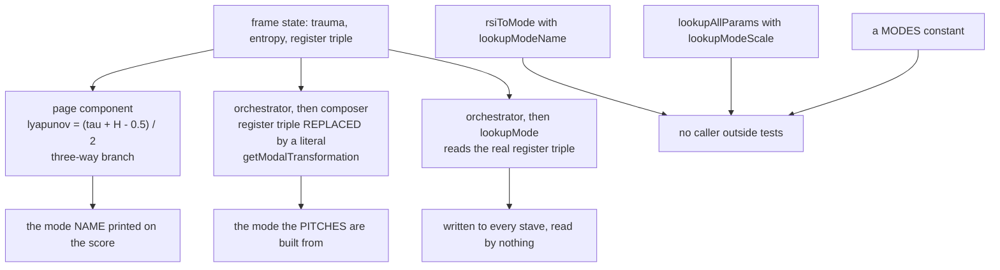

| Field | Value |
|:---|:---|
| Designation | MPN-S3 |
| Title | The mapping: from psychological state to musical material, parameter by parameter |
| Author of the theory | J. McKenney |
| Series | Paper 3 of 4, the music and score path. S1 states the theory, S2 the formal apparatus, S4 the Conductor implementation |
| Licence | CC BY 4.0 |
| Length | About 13,849 words of body text, counting alphabetic tokens outside tables and display maths. The author set aside the series ceiling on 13 September 2026, after ARBITRATION-S3 had already accepted the paper over it |
| Status | Revision 9. Accepted by ARBITRATION-S3 at revision 7 with eleven conditions, all applied; condition C13 required a limited Skeptic pass on revision 8's new material, which returned four blocking findings, all verified and applied here |
| What revisions 8 and 9 changed | Revision 8 restored material earlier revisions cut for length, folded the implementation audit back into the body, completed section 2.5, and added a second worked frame, a decision-point diagram and a parameter summary. Revision 9 corrects four errors in that new material and one older than the paper: a parser defect, shared by every script in this programme since S2, that truncated seven annotation strings at an escaped apostrophe and misreported the degenerate-frame count as 107 where it is 104. Section 2.3 states the correction and MPN-S3-AMENDMENTS issues it against S2 and the register simplex figure |
| Implementation claims pinned to | `mpn-conductor-standalone`, working tree of 13 September 2026, the same tree S2 section 6.5 cites |
| Revision note | Revisions 1 to 7 are recorded here rather than narrated in the body, on the disposal ARBITRATION-S3 entry 5 ruled correct. Revision 1 described a modal table no rendered score has used, having searched a guessed list of function names; revision 3 corrected that and then drew a conclusion about the registers from the same mode search; revision 4 generalised over four of its own script's five register readings. Earlier drafts also misread the timbre literature as failing to replicate a third dimension, claimed S1's assertion B4 discharged, reported a naive product of 1,800 distinguishable frames, said six rhythmic cells where there are seven, and left the interpolation margin unstated. Each is corrected in place. Every one was found by verification rather than by argument, and the method that replaced the one which produced them is stated at the end of section 7 |
| Decisions implemented | 6, 7 and 8 of the decision log of 12 September 2026. Decision 4 is **not** implemented: the shipped table conflicts with it and section 2.3 reports the conflict rather than resolving it, because resolving it would pre-empt question 5a under decision 5; it is item S3-8 of the work queue. D3's drafting obligation is discharged, the interpolation being defined in section 2.3; the selection among (a), (b) and (c) remains the author's |
| Drafted for the author to strike | Sixteen bias-to-music mappings and fourteen domain assignments, per decision 7. Section 4.4 says what each rests on and how to strike one |
| Reproduces | Eleven scripts in `05_DATA/03_generators/`, listed with what each establishes in `05_DATA/03_generators/S3-GENERATORS-README.md`, which is committed beside them. Every numerical claim in this paper is produced by one of them; none is transcribed, and each aborts if the lines of the implementation it reads have changed |

## Contents

1. What this paper is
2. The six parameters
3. What survives into a score
4. The bias layer
5. The influence layer
6. What would show the mapping wrong
7. What is decided, what is drafted, what is absent
8. References

The parameter functions in one place, for a reader who wants the mapping before its justification:

| Parameter | Function of | Codomain | Jump set | Section |
|:---|:---|:---|:---|:---|
| Dynamics | trauma | eight markings, ppp to fff | seven boundaries: 0.10, 0.20, 0.35, 0.50, 0.65, 0.80, 0.90 | 2.1 |
| Tempo | entropy | 35 reachable integer bpm in three clusters | $\{0.4, 0.7\}$ | 2.2 |
| Metre | entropy | 4/4, 3/4, irregular, free | $\{0.3, 0.5, 0.6, 0.8\}$ | 2.2 |
| Mode | the register triple, trauma as a second stage | seven diatonic modes under $\arg\max$; a continuum containing them under the interpolation defined here | under interpolation, the surface $\tau = 0.6$ and nothing on the simplex | 2.3 |
| Fragmentation | entropy and trauma | five stages | four ladder boundaries at even fifths | 2.4 |
| Orchestration density | trauma and entropy | five levels | four ladder boundaries at even fifths | 2.4 |
| Harmonic position | trauma | 24 consonant triads under the neo-Riemannian algebra | undetermined; $k_{\max}$ is not fixed | 2.5 |
| Timbre | the four DISC coordinates | $F \times [0,1]^3$, rank 3, null direction profile magnitude | none; nothing here discretises it | 2.6 |

Eight rows for six parameters, because metre travels with tempo and the harmonic position with trauma, and because the paper counts a parameter by what the theory names rather than by what the implementation packages together.

## 1. What this paper is

S1 asserts that the transformations professional practice applies to a leitmotif are functions of a psychological state, and that the functions are total, deterministic and inspectable [1]. S2 establishes what kind of object that transformation is, and leaves three things to this paper: the timbre space, which it shows to be the only channel the four DISC coordinates reach; the tie behaviour of the mode selector; and the completion of the identifiability analysis, which every listening study the programme plans depends on [2]. This paper states each of the six parameter functions, specifies the timbre space, decides the tie, completes the identifiability result, and drafts the bias layer that decision 7 assigns to it.

Four findings are worth stating before the detail, each with the section that establishes it.

**No mode that reaches a score is a function of the registers, though much else is** (section 2.3). Five places in the shipped source decide a mode. The name printed on a score comes from a three-way branch on $(\tau + H - 0.5)/2$, a quantity the code calls a Lyapunov exponent and which is not one; that branch is written as a fallback behind a field that does not exist, and a cast stops the type checker from saying so, so it wins on every frame. The notated pitches come from a selector fed a hard-coded register triple, which makes the Imaginary dominant for every character in every play and leaves five of seven modes unreachable. The one selector that does read the frame's register triple has its answer written to every stave and read by nothing. Two further tables are unreachable from any score. S2 reports the first two of those [2]; what is added here is why the branch always wins, which is the part a repair needs, the discarded selector, and the measurement that the printed name and the notated pitches agree on only 36.0 per cent of the state square. The registers do reach the score, through the key, the chord quality and the leitmotif transformation, and section 3 enumerates every reading; none of them compares the registers against each other, so which register leads is never consulted anywhere. A4 is therefore not merely untested but untestable on the current build, and a listening study run on it would return a null whatever the truth of the assertion. Items S3-1 and S3-2 of section 7 are the repair and they are small.

**The timbre channel cannot carry DISC** (section 2.6). Multidimensional scaling of musical timbre returns three perceptual dimensions, agreed across both cited studies, which disagree only about the acoustic correlate of the third [3], [4]. DISC has four coordinates. Section 2.6 states the map from one to the other and proves that its null direction is profile magnitude: two characters whose DISC scores differ by a constant added to all four produce **identical** timbre, and no listener can tell them apart however good their ear. The loss is exactly one dimension, no more and no less, and the choice the theory gets to make is only which direction is lost. A listening study that asks a listener to recover a DISC profile from a cue is therefore asking for something the channel cannot carry, and this result cancels such a study before it is paid for.

**The tie rule is defined, with one parameter left to the author** (section 2.3). S2 leaves the mode selector's behaviour at a tie as decision D3 and shows that hysteresis and a dead band both fail on it, since both are defined by a gap and neither releases when the gap is zero [2]. D3 assigns this paper the interpolation, not the selection among the three alternatives, which is the author's. The interpolation is given in closed form, and four of its properties are proved in a line each and checked numerically: determinacy at a three-way tie, exact agreement with $\arg\max$ away from the margin, Lipschitz continuity on the closed simplex, and a worst-case rounding error of exactly a quarter tone. The tie is not a corner case: 21 of the 128 frames that reach the simplex sit exactly on one.

**The bias layer's two sets of thirty reconcile exactly, and reproducibly** (section 4.1). Fourteen shared, fifteen implementation-only, sixteen Atlas entries with no musical mapping, fourteen with no domain. Those are S1's counts [1]; what is new is that a script now derives all four from the two sources rather than restating them, and fails loudly if the drafted content does not cover exactly the gaps. The invariant it enforces survives the author striking a drafted row, provided the strike is recorded, so the reconciliation continues to account for all thirty entries and a row cannot be dropped silently.

**Scope.** This paper states the mapping. It does not implement it, which is S4's business, and it does not settle A4's choice of modal table, which remains the author's; what it does is state the consequences of each option precisely enough that the choice can be made at a keyboard. The sixteen bias mappings and fourteen domain assignments are drafted under decision 7 for the author to strike out what is wrong, and section 4.4 is written so that striking one is a local operation.

**What this paper is not, stated before anything else.** No listener has been asked about any mapping in it. Nothing in it has been measured on any person. The corpus contains no observation of trauma, entropy or the registers that the system did not produce about itself, so every table below is a proposal and none is evidence, however precisely its numbers are computed. The figures that look like results are properties of a proposed map, which is why each is reproduced by a named script rather than reported.

**A note for a clinical reader.** The quantities this paper maps are dramatic quantities about fictional characters, defined in S1. Trauma here is the difference between a character in the first scene and the same character after the event the play is about. It is not a clinical measure, it is not a diagnosis or a screen, nothing in this paper is a treatment protocol, and no paper in this series is yet addressed to music therapists. A therapist reading it should treat it as a description of a piece of software and of a theory about drama.

**Three words that mean different things in this paper.** *Register*, unqualified, means one of Lacan's three, the Real, the Symbolic and the Imaginary, as S1 defines them; where the musical sense is meant, the paper writes *registral* or names the octave. *DISC* is the four-factor personality instrument, Dominance, Influence, Steadiness and Conscientiousness, and a character's DISC profile is four numbers in $[0,1]$. *Mode* means one of the seven diatonic modes, never a manner of operation. Three terms of art are inherited from S2 and used without re-deriving them: the *tripod* is the set of three segments from the centre of the register triangle to the midpoints of its sides, which is where the dominant register is undefined; the *kite result* is S2's closed form $2\delta - \delta^2$ for the area within $\delta$ of a tie; and a map is *Lipschitz* if there is a fixed bound on how much its output can change per unit change of its input, which for a musical parameter means no sudden jump.

## 2. The six parameters

Each subsection states the function, its effective contributions where it takes more than one input, its jump set, and what would show it wrong. Effective contributions are computed at the frame library's dispersions, $\operatorname{sd}(H) = 0.1925$ and $\operatorname{sd}(\tau) = 0.2496$, which are themselves system output and are labelled as such in S1 [1]; a weight quoted without one is an unexamined claim about a variance [5].

### 2.1 Dynamics

Decision 6 makes the eight-marking linear form normative [6]. Velocity runs linearly from the threshold of audibility to the ceiling of the instrument,

$$v(\tau) = 20 + 107\tau,$$

truncated to an integer rather than rounded, as the shipped module does it with `int()`, and discretised to the eight conventional markings. The output of $\Phi$ is the marking, not the velocity: the velocity interval is the pre-image, as S2 section 6.1 sets out. The boundaries are those of the shipped Python module, which is the only implementation carrying all eight:

| Marking | ppp | pp | p | mp | mf | f | ff | fff |
|:---|---:|---:|---:|---:|---:|---:|---:|---:|
| $\tau$ below | 0.10 | 0.20 | 0.35 | 0.50 | 0.65 | 0.80 | 0.90 | 1.00 |

Two properties follow and both are consequences rather than choices. The bands are unequal, widest in the middle and narrowest at the extremes: the four at the ends of the range are 0.10 wide and the four in the middle 0.15, a ratio of three to two, so the instrument resolves trauma half again as finely at the extremes as it does in the middle. As a property of the band widths, for a character sitting at a uniformly random point inside a band a step of 0.05 in trauma changes the marking one time in two at the extremes and one time in three in the middle, and in the topmost band it cannot change it at all, since a step upward has nowhere to go. [12] And because dynamics is a function of trauma alone, and trauma ratchets, **the dynamic marking of a character cannot fall across an act**. S1 states the ratchet as a property of the definition; here is where it becomes audible. If the drama wants relief, decision D4 of the S2 list is what supplies it, and until it is taken this parameter is monotone by construction.

**The path a rendered score actually takes.** There is a second implementation and it is the one the application uses. `lookupDynamics` matches trauma against the reference dictionary's `volume_level` entries conditioned on trauma, of which there are three, and returns a literal fallback of velocity 72 labelled `mf` when none matches [12]:

| Entry | Condition | Label emitted | Velocity |
|:---|:---|:---|---:|
| `dynamics-001` | 0.0 to 0.2 | `ppp/pp` | 30 |
| none | 0.2 to 0.4 | `mf`, the fallback | 72 |
| `dynamics-002` | 0.4 to 0.6 | `mf` | 72 |
| none | 0.6 to 0.8 | `mf`, the fallback | 72 |
| `dynamics-003` | above 0.8 | `fff` | 118 |

Three things follow and none is a judgement call. The composed function emits **three** labels, not eight, at **three constant velocities**, not $20 + 107\tau$. Two of its five intervals are accidents of a lookup that fails rather than bands anyone designed, and they return the same `mf` as the interval that succeeds, so six tenths of the trauma range collapse to one velocity, which is the observation the commensurability audit makes independently [5]. And the label `ppp/pp` is not a dynamic marking at all but a display string split on its first space, so a consumer resolving a marking by name finds nothing under it.

Decision 6 makes the eight-marking linear form normative and only the Python module implements it. Everything else in this section describes the normative law, which is what the theory says; item S3-3 of section 7 is the repair, and until it lands no test of A7's dynamic ordering is possible, because the ordering under test has three rungs and one of them is a hole.

The jump set is the seven boundaries above. $f_{\text{dynamics}}$ is piecewise constant and the marking is the output, so nothing about it is continuous and nothing should be claimed to be.

It would be shown wrong if listeners asked to rank cues by the weight the character is carrying did not reproduce the ordering of the markings, which is a discrimination test and does not need a verbal anchor.

### 2.2 Tempo

Tempo is the one factor of the codomain that is genuinely continuous in the state, and it is continuous only in pieces. The shipped implementation sorts entropy into three bands, strategic at $H \le 0.4$, operational at $0.4 < H \le 0.7$ and crisis above that, looks up a beats-per-minute range for the band, and then places the tempo inside that range in proportion to entropy:

$$f_{\text{tempo}}(H) = \operatorname{round}\Big(b_{\min}(H) + H\big(b_{\max}(H) - b_{\min}(H)\big)\Big),$$

with $(b_{\min}, b_{\max})$ equal to $(40, 60)$, $(80, 100)$ and $(120, 180)$ on the three bands [12]. Within a band the law is therefore affine in the state with a strictly positive slope, and the two discontinuities come from the range changing underneath it rather than from the tempo being constant between them.

What the arithmetic then does is very nearly cancel the continuity it has just established, and the figures are worth having in full:

| Band | Entropy | Range | Law | Span emitted | Jump that follows |
|:---|:---|:---|:---|---:|---:|
| strategic | $H \le 0.4$ | 40 to 60 | $40 + 20H$ | 40 to 48, 8 bpm | $+40$, five times the span |
| operational | $0.4 < H \le 0.7$ | 80 to 100 | $80 + 20H$ | 88 to 94, 6 bpm | $+68$, eleven times the span |
| crisis | $H > 0.7$ | 120 to 180 | $120 + 60H$ | 162 to 180, 18 bpm | |

The slope inside the two lower bands is twenty beats per minute per unit of entropy, so a change of 0.05 in $H$ moves the tempo by one beat per minute, which is the rounding quantum of the output: within those bands the parameter is very nearly inert. The three ranges sit so far apart that of the 141 integer tempi between 40 and 180 only **35** are reachable at all, in the three runs above; the intervals 49 to 87 and 95 to 161 are silent for every character in every play, whatever their state. Against that inertness the jumps are enormous.

So tempo is continuous in form and categorical in effect, and it is worth being careful about why, because the obvious explanation is not quite right and the careful one is more useful.

The within-band variation is not ruled out by the published discrimination thresholds. Drake and Botte give relative just-noticeable differences for tempo of about 6 per cent for a single interval and about 3 per cent for a six-interval sequence, over interonset intervals from 100 to 1,500 milliseconds with sensitivity best between 300 and 800 [15]. The three bands span 18.2, 6.6 and 10.5 per cent of their own midpoints, at interonset intervals of 1364, 659 and 351 milliseconds [12]. Every span clears the single-interval figure and all three clear the sequence figure.

Three qualifications belong with that, and they matter more than the comparison. The thresholds come from a two-interval forced choice on isochronous sequences with one dimension varying, which is a best case for a listener; clearing them means a difference is **not ruled out**, not that it would be heard in a score where several parameters move at once. The operational band clears the 6 per cent figure by 0.6 points, which is inside the precision of the source. And the strategic band's 1364 milliseconds lies outside the range where the thresholds were best measured, so 6 per cent is not the applicable figure there and the applicable one is probably larger.

What the comparison does establish, and what section 3 needs, is a ratio. Taking 6 per cent as the threshold, about 3.0, 1.1 and 1.8 just-noticeable differences fit inside the three bands, while the mapping emits 9, 7 and 19 distinct integer tempi in them. **Inside a band the mapping emits roughly five times as many levels as a listener could resolve.** That is the sharpest statement of the difference between what the mapping emits and what could be recovered from it that this paper can make, and section 3's counts should be read against it.

What makes the parameter categorical in effect, then, is proportion rather than inaudibility: the steps between bands are five and eleven times the spans within them, so a listener attending to speed hears three plateaux with cliffs between, and the gradient inside each plateau is real, is probably at the edge of resolution, and is swamped. Section 6 records that as a prediction rather than asserting it.

Metre travels with the tempo, and travels badly. It is looked up from entropy against four conditions, below 0.3, 0.3 to 0.5, 0.6 to 0.8 and above 0.8, giving common time, waltz time, an irregular 5/4 or 7/8, and free metre [12]. Those conditions do not cover 0.5 to 0.6, where no entry matches and the lookup returns its literal fallback of 4/4, the metre of the most ordered characters in the play. Metre as shipped therefore runs 4/4, 3/4, 4/4, irregular, free as disorder increases, and a character at $H = 0.55$ is notated like one at $H = 0.10$. An implementation defect and not a statement of the theory, reported here because the defect falls exactly on the meaning this section asserts.

The two jump sets do not coincide either. Tempo steps at 0.4 and 0.7 and metre at 0.3, 0.5, 0.6 and 0.8, and six boundaries partition the unit interval into seven cells, which direct enumeration confirms. No boundary in one parameter is heard at the same moment as a boundary in the other. Nothing in the theory motivates the offset; it is what two independently written lookup tables happen to produce.

The claim underneath all of this is that disorder in the subject's symbolic organisation shows as instability of pulse rather than as speed. It is worth separating from the more obvious claim it is often confused with: this is not that agitated characters play faster, and a character can be scattered and slow. The implementation asserts the claim and then works against it, because the signal it produces is dominated by speed, a step of 40 and then of 68 beats per minute, while metre, where instability of pulse would have to live, has a hole in the middle of its range and returns the most ordered metre there. The jump set is $\{0.4, 0.7\}$ for tempo and $\{0.3, 0.5, 0.6, 0.8\}$ for metre, and the section would be shown wrong if listeners heard the band changes as changes of speed rather than of stability. On the current build that test would most likely fail, and section 6 records the prediction in that direction rather than in the one that would flatter the mapping.

### 2.3 Mode, and what happens at a tie

A4 selects the mode from the dominant register, with trauma as a second-stage switch. Which register takes which mode is the author's to settle at a keyboard and this paper does not settle it. The four options in the corpus, so that the choice is on the page rather than in a search:

| Source | Real | Symbolic | Imaginary |
|:---|:---|:---|:---|
| the live pitch table, `leitmotif_transformation_rules.ts` | Dorian, Aeolian above $\tau = 0.6$ | Lydian, Mixolydian | Phrygian, Locrian |
| the reference dictionary, `mpn_reference_data.ts` | Phrygian/Locrian | Ionian | Lydian/whole-tone |
| `lookupModeName`, unreachable | phrygian | ionian | lydian |
| the eight synthetic raters, per decision 5 | not reported | the semitone above the tonic | not reported |

The first two are inversions of each other on every register. The fourth fits none of the other three and is already question 5a in the listening pack under decision 5, which is not a deferral but a live question put to people who score drama [6]: if the raters are right, the second stage is a jump to a crisis mode per register rather than a dim within a pair, and A4's mechanism changes rather than its table. This paper does not pre-empt that. What this paper establishes is a prior fact that changes what settling it would mean: **no mode that reaches a score is a function of the registers**, so A4 is not under test in any score the system has produced.

**Where the modes actually come from.** Five places in the shipped source decide a mode. They are set out in full here because the claim this section rests on is a negative one, and a negative claim about an implementation is worth only as much as the enumeration behind it. The enumeration is `s3_modes.py`, which searches every non-test source file for lines returning or assigning one of the seven mode names or a scale formula, rather than for the names of functions that might do so; that is the distinction an earlier revision of this paper got wrong [12], [13].

**One: the name printed on the score.** The rendered frame takes its mode from `(output.global as any)?.mode || (lyapunov < 0 ? 'Ionian' : lyapunov < 0.1 ? 'Lydian' : 'Phrygian')`, where `lyapunov` is $(\tau + H - 0.5)/2$, a quantity the code names for an exponent it is not [12]. The first operand looks like a deference to whatever the orchestrator decided. It is not, and the reason is worth stating exactly, because it is the whole of the repair. The `OrchestratorOutput.global` interface declares four fields, tempo, time signature, key and dynamics, and the object built at the return site carries the same four; there is no `mode` among them. The expression is written with an `as any` cast, which is what stops the type checker from reporting the access to a field that does not exist. So the first operand evaluates to `undefined` on every frame and the branch always wins. The printed mode is therefore a three-way function of $\tau + H$ alone: Ionian below 0.5, Lydian to 0.7, Phrygian above. S2 section 6.5 reports that this branch is what reaches the score [2]; what is added here is why it always wins, and that is the part a repair needs, because adding the field without removing the cast would change nothing.

**Two: the mode the pitches are built from.** `composeMelody` opens by writing `const rsi = { real: 0.33, symbolic: 0.33, imaginary: 0.34 };` and passes that literal, not the state, into `getModalTransformation` [12]. Since 0.34 is strictly the largest, the dominant register is the Imaginary for every character in every play, whatever their state. The table `getModalTransformation` holds is:

| Dominant register | $\tau \le 0.6$ | $\tau > 0.6$ | Reached? |
|:---|:---|:---|:---|
| Real | Dorian | Aeolian | never |
| Symbolic | Lydian | Mixolydian | never |
| Imaginary | Phrygian | Locrian | always |

Of the seven modes the module defines, two are reachable and five are not, Ionian among them. S2 section 6.5 reports this as well [2].

**Three: the one selector that reads the registers, and what becomes of its answer.** `lookupMode` is reached on every frame, from `psychometricToMusical` at `score_orchestrator.ts:267`, and it is the only function in the application that sorts the frame's actual register triple and chooses on it. Its result is written into every stave's `musicParams` at `score_orchestrator.ts:360` and then read by nothing: the string `musicParams` never appears with `.mode` anywhere else in the source [12]. **The claim is about the mode field and not about the assignment.** The mutated stave is returned at `:363` and the object is read downstream, at `score_exporter.ts:81`, `:84`, `:88` and `:89`, which take `instrumentFamily`, `timbre`, `dynamic` and `articulation` from it. The mode is not among them: the exporter writes `mode: 'ionian'` as a literal at `:73`, under the comment `TODO: extract from params`. Nor does the orchestrator's own output interface carry a mode at all, `OrchestratorOutput.global` declaring only tempo, time signature, key and dynamics at `:61-70` and the output object supplying only those four at `:440-445`, which is why the page's `(output.global as any)?.mode` at `page.tsx:488` is undefined on every frame and the Lyapunov branch behind it always wins [12]. So the register-dependent mode is computed on every frame and discarded. That finding is this paper's rather than S2's. Two of the three strings it would emit are not mode names in any case but slash-joined pairs, `phrygian/locrian` and `lydian/whole-tone`, produced by splitting a display label on its first space, so a consumer resolving a mode by name would find nothing under either.

**Four and five: two tables no score can reach.** `rsiToMode` in `psychometric_calculus.ts` has no caller outside its own tests, and `lookupModeName`, which it consults, is referenced only inside it; that table gives the Real to Phrygian, the Symbolic to Ionian and the Imaginary to Lydian, which is an inversion of the live pitch table on every one of the three registers. `lookupAllParams` has no caller either, and `lookupModeScale`, which reads a fourth table out of the reference dictionary, is referenced only inside that; in that table the Imaginary's entry is named Lydian and its formula is the six-degree whole-tone scale, so a name and a formula disagree inside one module. A `MODES` constant in `psychometric_calculus.ts` is declared and never read. S1's report of four incompatible register-to-mode tables, two of them exact inversions, is confirmed here at path and line, with two corrections: there are five decision points rather than four once the Lyapunov branch is counted, and the table the documentation describes is reachable from nothing.

**The trauma switch, against decision 4.** The pitch table gives all three registers a trauma partner, the Imaginary included, and decision 4 rules that the Imaginary has **no partner** [6]. The conflict is reported, not resolved: A4's second stage is already question 5a in the listening pack under decision 5 [6]. If the synthetic raters' reading holds, that the switch is a jump to a crisis mode per register rather than a dim within a pair, then decision and code are both wrong and A4's mechanism changes rather than its table.

**The printed name and the notated pitches disagree, measurably.** The name is a function of $\tau + H$ and the pitches of $\tau$, so a score's header and its accidentals need not describe the same mode. Over the $(\tau, H)$ square they agree on 36.0 per cent of states; on the rest a score labelled Ionian or Lydian is notated in Phrygian, or one labelled Phrygian is notated in Locrian [12].

**What follows for A4.** The assertion is testable in principle and untested in fact: a study run on stimuli from the current build measures a branch on $\tau + H$ against a constant register triple and returns a null whatever the truth of A4. The repair is S4's and it is small: give `OrchestratorOutput.global` a mode field, remove the cast, and pass the frame's register triple into `composeMelody` instead of the literal.

**The tie, and how the code disposes of it by accident.** The tie is not a corner case. On the frame library, **21 of the 128 states that reach the simplex sit exactly on one**, 16.4 per cent, and a further **104** frames produce no state at all because the analyser returns $(0,0,0)$, 44.8 per cent of all 232 [12]. So a sixth of the states that reach the simplex take their mode from whatever the comparison happens to do, and none of the selectors records a rule.

Those two counts correct figures this programme has used since S2, and the correction is worth stating because its cause is a parser and not an instrument. Every script that read the frame library matched the annotation field with a non-greedy pattern that stops at the first occurrence of the quote character and does not honour backslash escapes. Seven of the 232 annotations contain an escaped apostrophe, so on those seven the pattern returned a truncated string, and on three of them the truncation removed the only register keyword the annotation carried, which the analyser then read as no register at all. One of the three, *Comparison of authenticity. The actor's fake emotion feels more Real than Hamlet's true drive*, is pure Real once read in full. S2 reports 107 degenerate frames and 125 on the simplex, and so did revisions 1 to 7 of this paper; the corrected figures are 104 degenerate, 128 on the simplex and 101 at a vertex. The tie count of 21 and the single interior point are unchanged, so nothing that rests on the tie moves. `s3_frames.py` is now the only reader of the library and the other scripts call it; run directly, it prints the comparison. The corrections to S2 and to the register simplex figure are issued separately [14].

`lookupMode` and `getModalTransformation` both build the array in the order Real, Symbolic, Imaginary, sort it descending, and take the first element. `Array.prototype.sort` has been required to be stable since ES2019, so on a tie the earlier element survives and the effective rule is Real over Symbolic over Imaginary. The dead `rsiToMode` initialises its answer to `'symbolic'` and replaces it only on a strict inequality against both others, so a tie there yields Symbolic instead. The two disagree on the three-way tie and on every two-way tie involving the Real, and in both cases the behaviour is a side effect of how a comparison was written rather than a decision anybody took. On the current build none of this reaches a score, because neither selector's answer does; it will matter the moment items S3-1 and S3-2 land.

What the theory should do is a separate question, and S2 leaves it as decision D3 [2]. D3 offers three options and rules out two of them on grounds this paper adopts rather than re-derives. **Hysteresis** holds the previous frame's register until the new leader exceeds it by a margin: it is defined by a gap, so it does not release when the gap is zero, and it has no previous register to hold on a scene's first frame. A **dead band** freezes the selector while the gap is small: same two failures. Both also make $\Phi$ a function on $\mathcal{P} \times \mathcal{P}$ rather than on $\mathcal{P}$, which costs A11's decomposability, the property that lets a frame's music be computed from that frame's state alone. **Interpolation** is the only one of the three that is determinate at an exact tie and on a first frame, and the only one that leaves decomposability intact.

**Defined, per D3 option (c): modal interpolation.** The choice among D3's three options is the author's; what this paper owes is the interpolation itself, defined so that it works on any pair of modes, and that is what follows. The idea is simple. Where two registers are close, the mode is not chosen between them: the degrees on which the two candidate modes differ are bent proportionally, so a character poised between the Real and the Symbolic sounds poised rather than sounding like whichever register won by a thousandth. Let $x = (r,s,i)$, let $m = \max x$, and fix a margin $\delta$. Give the mode of register $k$ the weight

$$w_k = \max\left(0,\; 1 - \frac{m - x_k}{\delta}\right),$$

normalise to sum to one, and sound each scale degree at the weighted mean of the degrees the candidate modes assign it. The leader always has weight 1 and a register $\delta$ below it has weight exactly 0, so candidates enter and leave the set continuously; a weighting without that property jumps at the margin.

Four properties follow, each with a one-line proof and each checked numerically as well [12]. The weights are defined at every point of the simplex, so the rule is total and the three-way tie is determinate: at the barycentre the weights are equal and the result is the mean of the three modes, and at a two-way tie the third register has weight 0 and the result is the midpoint. If $x_k \le m - \delta$ then $w_k = 0$, so wherever the gap exceeds $\delta$ only the leader survives and the rule is $\arg\max$ exactly; enumeration finds no divergence on 180,183 such states. And $w$ is a composition of 1-Lipschitz maps scaled by $1/\delta$ over a normaliser bounded below by 1, since the leader's weight is identically 1, so the map is Lipschitz on the closed simplex with a constant proportional to $1/\delta$. Numerically, at $\delta = 0.05$ and a grid step of $1/1200$ the largest change in any degree between adjacent states is 0.0476 semitones, halving with the step; the $\arg\max$ selector jumps a full semitone across the tripod at every resolution. The Lipschitz property holds for every $\delta > 0$; the constant does not, and grows as $\delta$ shrinks. The margin $\delta$ is the register gap below which two modes blend, and it is the author's to fix. Every property above holds for any positive value; what changes with it is this:

| $\delta$ | Blended area, $2\delta - \delta^2$ | Bend | Worst rounding error |
|---:|---:|:---|---:|
| 0 | 0 per cent | none; $\arg\max$, and the tie is undefined again | 0 |
| 0.02 | 4.0 per cent | sharpest | 50 cents |
| 0.05 | 9.8 per cent | | 50 cents |
| 0.10 | 19.0 per cent | | 50 cents |
| 0.20 | 36.0 per cent | gentlest | 50 cents |

The Lipschitz constant grows as $1/\delta$, so a small margin bends fast over a small region and a large one bends gently over a large one; the worst-case rounding error is a quarter tone at every margin, because it is attained at the tie itself. Since no microtonal renderer exists yet, the practical way to choose is to hear one blended pair at $\delta = 0.05$ against $\delta = 0.20$ on a synthesiser that takes cents, which needs no notation at all. What it does not buy is more reach. Outside the margin the rule is $\arg\max$ exactly, so the region on which the registers reach the mode continuously is the neighbourhood of the tripod and nothing else; by S2's kite result its area is $2\delta - \delta^2$, which is 9.75 per cent at $\delta = 0.05$ and goes to zero with $\delta$ [2], [12]. The interpolation removes the discontinuity; it does not make the channel less categorical.

The cost is stated rather than buried. Interpolated degrees are microtonal, so this parameter's codomain is no longer the seven diatonic modes but a continuum containing them, and any renderer targeting standard notation must round. The worst case is exactly a quarter tone, reached at a two-way tie between modes whose degrees differ by a semitone, and rounding there reintroduces the jump the interpolation removed. The interpolation is what the theory means and the rounding is what a score can print; S4 owes the rounding rule.

Two standing constraints bind any future choice under A4. Cardinality: interpolation is defined degree by degree, so every mode in a table must have the same number of degrees, which holds on the live table's six seven-degree modes and fails on the reference dictionary, whose Imaginary entry is a six-degree whole-tone scale against seven-degree modes elsewhere, making interpolation undefined there rather than merely awkward. And decision 4: the Imaginary takes no trauma partner, so any table giving it one is outside A4's admissible space as the decision log stands [6]. Within those, A4 may reassign the modes freely.

Two statements about the jump set need care. There is no discontinuity at the simplex boundary: the weight map is Lipschitz on the **closed** simplex, and crossing a face where a register reaches zero changes no degree by more than 0.0196 semitones at a step of $1/2000$ [12]. But the table itself switches at $\tau = 0.6$, so the candidate modes change discontinuously in trauma whatever the interpolation does on the simplex, and on the live table that switch moves a degree by a full semitone. The jump set of the mode parameter under interpolation is therefore the single surface $\tau = 0.6$ and nothing on the simplex. That surface is a property of A4's second stage, not of the tie rule, and it disappears only if the second stage is itself made continuous, which is not proposed here.

### 2.4 Fragmentation and orchestration density

S1's A8 amendment gives the pair as a direction and its orthogonal complement [1]:

$$\text{density} = 0.3H + 0.7\tau, \qquad \text{fragmentation} = \frac{\max(0,\; 0.7H - 0.3\tau)}{0.7}.$$

Effective contributions at the library dispersions: density is 24.8 per cent entropy to 75.2 per cent trauma; fragmentation is 64.3 to 35.7 [5]. Both ladders are at even fifths, 0.2, 0.4, 0.6 and 0.8, declared in advance rather than fitted, giving five stages each.

S2's Theorem 1 establishes what the superseded pair cost and the amended pair buys. For two weighted sums of the same inputs with every weight at least $\varepsilon$, the correlation cannot fall below $\sin(2 \arctan(\varepsilon / (1 - \varepsilon)))$ [2]. The superseded pair, $0.6H + 0.4\tau$ against $0.7\tau + 0.3H$, has every weight at least 0.3, so it could not have fallen below $+0.7241$ whatever any corpus contained: the collinearity S1's A8 amendment responds to was a property of the weights and not a fact about the plays. On the 232 annotated frames it realises $+0.9150$. What buys the separation in the amended pair is the negative weight on trauma in the fragmentation term, which takes the second vector out of the positive quadrant where Theorem 1's bound lives, and that negative weight is a musical claim with a direction: weight makes a theme more fully stated, not less. The adopted pair is exactly orthogonal away from the clip, and the clip binds on 21 of those frames, 20 strictly and one on the boundary. On the library as a whole the adopted pair realises $+0.0571$ with the clip applied and $+0.0031$ with it removed, the second figure being what the theorem predicts once the library's own dispersion and its trauma-entropy correlation of $+0.2802$ are substituted into it. One caveat belongs with those numbers. Restricted to the 211 frames where the clip does not bind the correlation rises to $+0.2072$, because conditioning on being off the clip is conditioning on a half-plane defined by both variables. Orthogonality is a property of the pair over the whole state space and not of any subsample selected by the clip. A character under great weight whose account still holds gets the theme whole and thick, which is what the second worked frame in section 3 is chosen to show.

None of this is implemented. The shipped code still computes `fragmentationScore = (entropy * 0.6) + (trauma * 0.4)` with cuts at 0.25, 0.5, 0.75 and 0.9, and an orchestration `intensity = (trauma * 0.7) + (entropy * 0.3)` with cuts at 0.2, 0.4, 0.6 and 0.85 [12]: the superseded pair, the one S1 amends and Theorem 1 bounds below at $+0.72$, on two ladders that are neither even fifths nor equal to each other. At the library's dispersions those nominal weights are effectively 53.6 per cent entropy to 46.4 per cent trauma, and 75.2 per cent trauma to 24.8 per cent entropy [5], [12]. Two qualifications belong with them. On the composer path entropy is pinned at 0.5, so the two reduce to $0.3 + 0.4\tau$ and $0.7\tau + 0.15$, and neither may be described as a combination of entropy and trauma at all while that stands [5]. And the amended forms above are what this paper specifies and what S4 owes.

The two jump sets are the eight ladder boundaries, four each, and both ladders are piecewise constant, so neither quantity is continuous in the output however continuous it is in the state. It would be shown wrong if listeners could not order the five fragmentation stages by how much of a theme they had heard, which is the test A7 already carries and which also tests B5. There is a sharper version of that test available now that the two quantities are orthogonal: present pairs of cues that differ in fragmentation and agree in density, and pairs that differ in density and agree in fragmentation, and ask which pair differs more. Under the superseded pair those two conditions were barely distinguishable, because the quantities moved together; under the amended pair they are independent, so a listener who cannot separate them is telling you the two ladders are one ladder to the ear whatever the arithmetic says.

### 2.5 The harmonic operator

The harmonic codomain is the 24 consonant triads under the neo-Riemannian transition algebra generated by $P$, $L$ and $R$, which the sister series sets out in full [7]. What matters for the mapping is that this codomain has a metric: the Cayley graph distance under the three generators, which is the only thing in the theory that makes the size of a harmonic move a number [2].

That structure is checked here rather than cited, because everything in this subsection depends on it [12]. The three generators are involutions with no fixed points, the action on the 24 triads is transitive, and the Cayley graph has **diameter 5 and radius 5**, which confirms MPN-2's figure independently. The distance distribution over all 576 ordered pairs is 24 at distance 0, then 72, 144, 192, 120 and 24. The last of those is worth noticing: from any triad there is exactly **one** triad at distance 5, its antipode, and from C major that antipode is B flat minor. The hexatonic pole, $PLP$ of C major, which is G sharp minor, sits at distance 3 and is not the farthest point.

**The proposal, and a cost it carries that section 2.3 charged against two other rules.** A state change of size $\delta$ in the trauma coordinate moves the chord $\operatorname{round}(k_{\max}\delta)$ positions along the alternating chain, and the realised chord walks to the target by a shortest word, one generator per bar.

Two words in that sentence are doing more than they look. A state *change* is a function of two states, and the *realised* chord is the one the previous bar left behind. So this parameter, unlike every other in section 2, is not a function on $\mathcal{P}$ at all: it is a function on $\mathcal{P} \times \mathcal{P}$ and on the chord already sounding. Those are exactly the two dependencies section 2.3 uses to rule out hysteresis and a dead band for the mode selector, and it has the first-frame problem too, since a scene's opening bar has no previous chord and no previous state. This paper does not resolve that. It records it, because A11's decomposability is asserted for the mapping as a whole and this parameter does not have it, and because it is a second reason section 3 must exclude the harmonic factor from its counts, the first being that $k_{\max}$ is unfixed. Whether the harmonic parameter should be re-expressed as a function of the current state alone, as the other five are, is a question for the author alongside the two below. Shortest words are not unique and the tie-break is lexicographic with $P$ before $L$ before $R$, which the sister series fixes and this paper adopts unchanged so that two implementations agree.

**The alternating chain is well defined, which was not obvious.** Alternating $L$ and $R$ from any triad closes after 24 steps having visited every triad exactly once, so the $LR$ chain is a Hamiltonian cycle and "position along the chain" is an integer modulo 24. From C major the first eight positions are C, E minor, G, B minor, D, F sharp minor, A, C sharp minor, which is the circle of fifths with each relative minor interleaved. The other two alternations do not have this property and could not carry the parameter: $PL$ closes after 6 triads and $PR$ after 8, which are the hexatonic and octatonic cycles.

**$k_{\max}$, which no document fixes.** Section 7 has carried this as an open item since revision 1. The choice is the author's, but it is not unconstrained, and the constraints can be computed. A change of $\delta = 1$, a character destroyed over a play, moves $k_{\max}$ positions and can reach $k_{\max} + 1$ distinct chords:

| $k_{\max}$ | Chords a full sweep reaches | Greatest Cayley distance reachable | Antipode reachable |
|---:|---:|---:|:---|
| 1 to 4 | 2 to 5 | 1 to 4 | no |
| 5 | 6 | 4 | no |
| 6 to 10 | 7 to 11 | 4 | no |
| 11 to 12 | 12 to 13 | 5 | from some triads |
| 13 to 22 | 14 to 23 | 5 | from every triad |
| 23 | 24 | 5 | from every triad; a sweep traverses the whole cycle |
| 24 or more | 24 | 5 | wraps: $\delta$ and $\delta + 1/k_{\max}$ give the same chord |

Two constraints are real and a third, which an earlier draft of this paragraph asserted, is not. At 24 and above the map becomes non-injective by an artefact of the modulus rather than by any fibre of the theory, so $k_{\max} \le 23$. At the other end, the antipode of a triad sits at chain offset 11 from twelve of the 24 triads and offset 13 from the other twelve, so **no value below 11 lets any trauma trajectory reach a chord at the graph's full diameter, and no value below 13 lets every trajectory do so**. The claim an earlier draft made, that $k_{\max} = 5$ makes a full sweep span the diameter, is false: five chain positions cost three generator steps, and the greatest distance reachable at $k_{\max} = 5$ is 4, which the table's own row said while the sentence beside it said otherwise.

So the defensible range is 13 to 23 if the theory wants a destroyed character to be able to arrive at the far side of the harmonic space, 11 to 23 if it will accept that happening from only half the starting chords, and 1 to 23 if it does not care. Within whichever range, the choice is a musical judgement about how far a chord should travel when a character is destroyed, and the paper does not make it.

**A defect in the proposal, found in checking it.** The proposal says the size of a state change sets the size of a harmonic move and cites the Cayley metric as what makes that size a number. Measured in that metric it does not do what it says. Chain position and Cayley distance do not rise together, because a cycle of 24 is embedded in a graph of diameter 5 and folds back on itself. Moving four positions along the chain costs four generator steps; moving five costs three; moving twenty-three costs one. **So a larger change in trauma can produce a smaller harmonic move**, and at the extreme a character whose trauma sweeps almost the whole range ends one generator from where they started.

Two repairs are available and neither is free. Define the move in the metric instead of on the chain, taking the target to be a triad at Cayley distance $\operatorname{round}(5\delta)$: monotone by construction, but it no longer names a unique chord, since from C major there are 3 triads at distance 1, 6 at distance 2, 8 at distance 3, 5 at distance 4 and 1 at distance 5, so a selection rule is needed among them. Or keep the chain and withdraw the claim that the move size is metric, in which case the Cayley distance is decoration and the parameter is a walk along a fixed cycle. The first is what the theory appears to mean and the second is what its present wording describes. The choice decides whether the harmonic parameter carries a magnitude or an index, and it is the author's; section 7 carries it.

**What this paper does not adopt.** The affective reading of the individual generators, that $P$ darkens and $L$ elevates, is a convention with no experimental support, and MPN-1 says so in its own words [8]. What is adopted is the metric, which carries no psychological claim at all.

**Jump set and falsification.** The jump set is whatever the rounding in $\operatorname{round}(k_{\max}\delta)$ produces, which cannot be written down until $k_{\max}$ is fixed; section 3's counts exclude the harmonic factor for the same reason. It would be shown wrong if listeners did not rank pairs of chords by the Cayley distance between them, which is a discrimination test on the metric alone and needs no affective vocabulary. That test is worth running before either repair is chosen, because if the metric is not audible as a magnitude then the second repair is the honest one.

### 2.6 Timbre, which the theory has never specified

This is the parameter S2 assigns to S3, and it is the one where the specification changes what the theory can claim.

**What the timbre literature supplies.** Multidimensional scaling of musical timbre asks listeners to rate the dissimilarity of pairs of sounds and recovers the small number of perceptual dimensions those judgements imply, then looks for acoustic quantities that correlate with each. McAdams and colleagues, working with synthesised instrument tones, find three shared dimensions with correlates log rise time, spectral centroid and degree of spectral variation, together with instrument-specific *specificities*, attributes of a particular instrument that lie on no shared dimension at all [3]. The specificities matter for what follows, because they are categorical and are what an instrument-family label carries. A confirmatory study using synthetic tones designed to isolate the candidates also finds **three** dimensions: it confirms attack time on a logarithmic scale, spectral centroid, and spectrum fine structure modelled as even-harmonic attenuation, and finds spectral flux only weakly salient and strongly context-dependent, contributing little when attack time and centroid vary concurrently [4]. So the number of dimensions is agreed at three. What the two studies disagree about is the acoustic correlate of the third: spectral variation in the earlier, spectrum fine structure in the later. The dimension is not in dispute; its correlate is. There is also a categorical residue in both, the instrument specificities.

**The space.** S2 leaves the timbre space unspecified and shows it to be the only channel the four DISC coordinates reach [2]. Take

$$T = F \times [0,1]^3,$$

with $F$ a finite set of instrument families carrying the specificities, and the three continuous coordinates the log attack time, the spectral centroid, and the third dimension, which is named as the third dimension rather than as one of its candidate correlates because the two studies disagree about which correlate it is. Writing it that way keeps the disagreement visible in the specification instead of burying it in a choice.

**The map from DISC.** Write the four DISC coordinates in an orthonormal contrast basis, a scaled Hadamard matrix, verified orthonormal:

$$h_0 = \tfrac{1}{2}(D+I+S+C), \quad h_1 = \tfrac{1}{2}(D+I-S-C), \quad h_2 = \tfrac{1}{2}(D-I+S-C), \quad h_3 = \tfrac{1}{2}(D-I-S+C).$$

Two are the instrument's own axes: $h_1$ its pace contrast, D and I against S and C, and $h_3$ its task-against-people contrast, D and C against I and S. $h_2$ is a contrast the instrument does not name, and $h_0$ is not a contrast at all but how high the whole profile sits. The assignment:

| Contrast | Timbral dimension | Standing | Reading |
|:---|:---|:---|:---|
| $h_1$, pace | log attack time, inverted | robust [3], [4] | assertive and outgoing reads as a fast attack, reserved and steady as a slow one |
| $h_3$, task against people | spectral centroid | robust [3], [4] | task orientation reads as brighter, people orientation as warmer. A convention, and labelled as one |
| $h_2$, the unnamed contrast | the third dimension | correlate disputed [3], [4] | the dimension is agreed and its acoustic realisation is not, so an implementation must choose one and say which |
| $h_0$, magnitude | nothing | | the null direction |

**The result, which is a constraint rather than a design.** The map has rank three, the timbre space being three-dimensional on both cited studies, against a domain of dimension four, so its nullity is exactly one. **Its null direction is $h_0$.** Two characters whose DISC profiles differ only by a constant added to all four coordinates produce identical timbre. Verified on two worked pairs [12]: $(0.3, 0.3, 0.3, 0.3)$ and $(0.7, 0.7, 0.7, 0.7)$ both give contrasts $(0, 0, 0)$, and $(0.7, 0.2, 0.5, 0.1)$ and the same profile raised by 0.2 both give $(0.15, 0.45, 0.05)$. The first pair is the extreme case, a character with no shape at all at two different heights; the second is an ordinary profile moved bodily up the scale. Neither pair is distinguishable through this channel by any listener. This is not a defect of the assignment. Any map from four coordinates into three dimensions has a null direction, and the only question a theory gets to answer is which one; the choice made here is that **profile shape is audible and profile magnitude is not**, which is how the DISC instrument is read in the first place. What is not a choice is that there is a null direction at all: four coordinates cannot survive a three-dimensional channel, and the loss is exactly one dimension, no more and no less. The claim is conditional on the rule for choosing among $F$'s members, which this paper does not specify and which could in principle read magnitude. On the shipped build it does not: `discToInstrument` takes $\arg\max$ over the four DISC coordinates, which is invariant under adding a constant to all four [12], so the null direction survives into the instrument family as well. Any future rule for $F$ has to preserve that or the result above weakens.

The consequence for the programme is direct and it is the kind of result worth having early. A listening study that asks a listener to recover a character's DISC profile from a cue is asking for something the channel cannot carry, and would return a partial failure that looked like a failure of the listeners or of the mapping when it is neither: it is a failure of the question. What such a study can ask is whether listeners discriminate characters differing in profile *shape*, holding magnitude constant or varying it deliberately as a control, and it should be designed to that from the start. Section 2.6 therefore cancels one study and specifies its replacement, which is the most useful thing a negative result can do.

The partition of the timbre channel, which S2 section 6.1 assigns to this paper, is not supplied: nothing here discretises the three continuous coordinates, so they have no stated jump set, and until $F$ and its selection rule are fixed the partition of $T$ cannot be written down. Section 7 records it as outstanding.

**One debt not discharged, and a narrower result in its place.** S1's assertion B4 puts the number of independent quantities a single stave can carry at two to three, calls it an estimate rather than a measured figure, and assigns S3 either its derivation or a recovery study [1]. The timbre literature does not discharge it. B4 counts independent **state quantities carried by a stave**, of which timbre is one channel among several; the scaling literature counts **perceptual dimensions within the timbre channel**. Those are different quantities and the agreement between "two to three" and "three" is a coincidence of numbers. What the result does give is narrower and still worth having: an upper bound of three on the independent quantities the timbre channel alone can carry, measured rather than estimated, for one channel of the several. B4 remains an estimate and the debt stands.

## 3. What survives into a score

S2 computes a coarse bound on the information in one frame, states which state dimensions reach which parameters, and leaves the fibre structure open pending the timbre space [2]. With the space specified in section 2.6 that analysis can be completed. What is new here is the completion and the arithmetic, not the shape of the table: S2 section 6.4 already states that the two register degrees of freedom reach only mode and that the four DISC coordinates reach only timbre, and S2 section 6.5 states the stronger fact, confirmed and sharpened in section 2.3 above, that on the composer path the register triple is a constant, so the registers reach the *mode* through nothing. They do reach other parameters, and this section sets out which.

The state has eight degrees of freedom [2]. Taking them in turn:

| State | Degrees of freedom | Reaches | What survives, under the mapping this paper specifies |
|:---|---:|:---|:---|
| Trauma $\tau$ | 1 | dynamics, density, fragmentation, harmonic position | the coordinate, to the resolution of the coarsest ladder |
| Entropy $H$ | 1 | tempo, metre, density, fragmentation | 35 reachable tempi in three clusters, four metre values over five intervals, and two ladders |
| Registers $(r,s,i)$ | 2 | mode | a three-way categorical choice under $\arg\max$; two continuous degrees of freedom under the interpolation of section 2.3 |
| DISC | 4 | timbre | three contrasts; magnitude never |

**The register plane.** Under the selector as S1 and S2 describe it, mode takes the dominant register, so the simplex reaches the output only through $\arg\max$ and every state in one cell produces the same mode: a character at $(0.9, 0.05, 0.05)$ and one at $(0.4, 0.35, 0.25)$ are indistinguishable here. The interpolation of section 2.3 removes the discontinuity but not the collapse: outside the margin it reproduces $\arg\max$ exactly, and the region where it does anything else has area $2\delta - \delta^2$, under a tenth of the simplex at $\delta = 0.05$.

**DISC loses exactly one dimension.** Section 2.6.

**Counting.** Multiplying the cell counts together, three tempo bands by eight markings by three modal cells by five fragmentation stages by five density levels, gives 1,800 frames and about eleven bits. That is a loose upper bound: dynamics, density and fragmentation are three functions of the same two coordinates and cannot vary independently, and tempo and metre are two functions of one of them. Enumerating the reachable output tuples over the $(\tau, H)$ square on a grid of 1,201 by 1,201 gives the figures below, the three modal cells included as a factor and timbre excluded [12]:

| Laws | Tempo read as | Tuples | With mode | Bits |
|:---|:---|---:|---:|---:|
| as this paper specifies them | three bands, metre ignored | 90 | 270 | 8.08 |
| as this paper specifies them | every distinct tempo and metre | 555 | 1,665 | 10.70 |
| as the code ships them | three bands, metre ignored | 42 | 126 | 6.98 |
| as the code ships them | every distinct tempo and metre | 326 | 978 | 9.93 |

The shipped rows use the shipped laws throughout, three dynamic labels rather than eight and the superseded A8 pair with its uneven ladders. They are lower for the reason one would expect: a lookup with holes emits fewer distinct things than one without.

Four cautions attach to every figure. They count emission over the whole $(\tau, H)$ square rather than over the states a play produces, and the corpus reaches only part of it; on the composer path entropy is pinned at 0.5, so the shipped fragmentation stage there is a function of trauma alone and the shipped rows overstate what that path emits [5]. They count emission rather than recovery: the larger figures need tempo resolved to the beat per minute, and the whole span inside the two lower bands is eight and six beats per minute. They take the modal factor as three, which neither reading delivers: the shipped one because no mode reads a register, the specified one because interpolation's codomain is a continuum, so three brackets rather than equals. And they exclude the harmonic coordinate, which the table above lists as reached, because section 2.5 leaves $k_{\max}$ unbounded and the number of reachable triads with it; S2's own bound of 4,032 included 24 triads as a factor and this one does not.

**Two frames, all the way through.** None of this is much use without cases, so here are two real ones, taken from the shipped library with the trauma, entropy and annotation the author wrote for them, and the register triple the shipped analyser reads from that annotation [12]. They are chosen by stated criteria rather than picked for effect: the first is the highest-trauma frame that reaches the simplex without sitting at a vertex, and the second the lowest-trauma frame with a register above 0.6. Between them they cover a tie and a vertex, both sides of the trauma switch, both ends of the dynamic range, and a register threshold that fires against four that cannot.

**Frame 1: *ANAGNORISIS*, Oedipus.** Trauma 1.0, entropy 0.1, annotation "Total Symbolic Collapse. The Ego (Eye) cannot sustain the vision of the Real." The analyser reads $(\tfrac13, \tfrac13, \tfrac13)$: the barycentre, an exact three-way tie, and the single interior point in the whole library.

**Frame 2: *Othello/Desdemona*, Othello.** Trauma 0.1, entropy 0.3, annotation "The origin of love in narrative." The analyser reads $(0, 0, 1)$, pure Imaginary.

| Parameter | Frame 1, specified | Frame 1, the build | Frame 2, specified | Frame 2, the build |
|:---|:---|:---|:---|:---|
| dynamic marking | fff, velocity 127 | `ppp/pp`-`mf`-`fff` lookup gives fff, velocity 118 | pp, velocity 30 | `ppp/pp`, velocity 30 |
| tempo | 42 bpm, strategic | 42 bpm | 46 bpm, strategic | 46 bpm |
| metre | 4/4 | 4/4 | 3/4 | 3/4 |
| mode, printed name | from the registers | Phrygian, from $\tau + H = 1.10$ | from the registers | Ionian, from $\tau + H = 0.40$ |
| mode, notated pitches | from the registers | Locrian, from $\tau$ | from the registers | Phrygian, from $\tau$ |
| mode, computed then discarded | | `phrygian/locrian` | | `lydian/whole-tone` |
| fragmentation stage | 0.000, rung 0 of 5 | 0.460, rung 1 of 5 | 0.257, rung 1 of 5 | 0.220, rung 0 of 5 |
| orchestration density | 0.730, rung 3 of 5 | 0.730, rung 3 of 5 | 0.160, rung 0 | 0.160, rung 0 |
| key | not specified here | C Major, the default: no threshold fires | not specified here | E Major, the Imaginary threshold fires |
| chord quality | not specified here | minor7, tension $= 0.310$ | not specified here | major7, tension $= 0.030$ |
| leitmotif transform | not specified here | fragmented, from $\tau > 0.8$ | not specified here | whole_tone_ascent, from $i > 0.6$ |
| timbre | three contrasts of DISC | nothing | three contrasts of DISC | nothing |

Five things are visible in that pair that no amount of general statement conveys. Each is derived from the table by the script rather than written beside it, so the two cannot drift apart.

**The printed name and the notated pitches disagree on both frames.** Frame 1 is headed Phrygian and notated in Locrian; frame 2 is headed Ionian and notated in Phrygian. On frame 1 the printed name happens to coincide with the head of what the registers would have given, `phrygian/locrian`, which makes the mechanism look as though it is working. It is a coincidence of two unrelated functions: the branch that produced Phrygian read trauma and entropy and no register, and it produced Phrygian because $\tau + H = 1.10$ is above 0.7. That is exactly how a defect of this kind survives a spot check.

**The register thresholds are silent where the registers are most interesting.** Frame 1 is the barycentre, the one state in the library where all three registers are equal, which is where A4 has the most to say and where S2's tripod result bites. It is also the frame where no key threshold fires, because no register reaches 0.6, so the key falls through to its default of C Major. Frame 2 is pure Imaginary, one threshold fires, and the key is E Major. At most one threshold can ever fire, since at most one register can exceed 0.6 on a simplex.

**The dynamic law agrees on a label and not on a velocity.** Frame 1 is fff either way, but at velocity 127 under the normative law against 118 in the build. Frame 2 is pp under the normative law and `ppp/pp` in the build, at velocity 30 both. Agreement on a label here is agreement over a much wider band: the shipped lookup has three labels where decision 6 makes eight normative, so `ppp/pp` covers what the normative law splits into two markings and two velocities.

**The A8 amendment moves fragmentation and leaves density alone, on both frames.** Frame 1: fragmentation rung 0 specified against rung 1 shipped, density rung 3 against rung 3. Frame 2: fragmentation rung 1 against rung 0, density rung 0 against rung 0. That is what taking the trauma weight negative is for. Oedipus at the moment of recognition is at the top of the density ladder under either pair, because he is carrying everything the play has; the amended pair drops his fragmentation to nothing, because his account of what has happened is at that moment complete. Whether that is the right reading is a question for a composer's ear, and it is printed here so it can be disagreed with.

**Timbre is blank in both columns.** The DISC coordinates are not measured and are no longer inferred either: under decision 9 `inferDISC` returns `null`, and every consumer must handle an absent profile [12]. The previous implementation banded four values off average trauma and filled the band with `Math.random()`, fabricating four of the nine state components per character; that is withdrawn, and what replaces it is an acknowledged gap rather than a substitute. The one channel section 2.6 analyses is the one channel neither frame can exercise, and it will stay that way until an instrument for DISC exists.

The bound that matters is not the count but the reach. **Of the eight state dimensions, two are recoverable as quantities, two reach a channel that is categorical under $\arg\max$ and continuous only within the margin under interpolation, and four reach a channel that carries three of them and never their magnitude.** That is the honest ceiling, and it belongs in front of any listening study rather than after it is analysed.

**What the registers reach on the build as it stands.** A search for mode names supports a conclusion about modes and not one about registers, so the claim here rests on a wider search: every line in the source that reads a register component, enumerated [12]. The registers reach the leitmotif transformation, through `selectTransformation`, which is called with the frame's actual triple and rewrites every pitch in the melody; they reach the key, which unlike mode is a declared field of the output; and they reach the tension, and through it the chord type and the harmony readout. What they do not reach is the mode.

That enumeration turns up a further finding of its own. **No live register reading compares the registers against each other.** Every one reads a single component in isolation. Five are thresholds at 0.6, two in `selectTransformation` and three in the key branch, and on the simplex at most one component can exceed 0.6 so they are well defined; the sixth is linear, $\text{tension} = 0.9r + 0.1H$, which reaches the harmony readout as a continuous number and a five-way chord type through cuts at 0.2, 0.4, 0.6 and 0.8 [12]. Two things must be said about that coefficient together, and neither alone is true of the system [5]. At the library's dispersions the nominal 90 to 10 is effectively **94.9 to 5.1**, because the Real varies more than entropy does; and on the 164 frames of 232 where the analysis text carries no Real keyword the Real is exactly zero, tension reduces to $0.1H$, which lies in $[0, 0.1]$, and the chord quality is `major7` by arithmetic rather than by theory [12]. The one comparison between components in the build is `lookupMode`'s sort, and its answer is discarded. So a state at $(0.59, 0.21, 0.20)$ and one at $(0.34, 0.33, 0.33)$ take the same branch on every threshold and differ on the chord type only through $r$. What reaches a score is the value of individual registers, and on the 68 frames where the Real is non-zero it is chiefly the Real; on the other 164 the register contribution is nil. What never reaches a score is which register leads. That is a weaker quantity than A4 is about and a different one from A3's competition.

## 4. The bias layer

S1 settles the classification at the author's Cognitive Bias Atlas [9], thirty entries in four domains, and records that the Atlas and the reference implementation carry different thirties [1]. Decision 7 assigns the missing content to this paper: Claude drafts, Jim McKenney strikes out what is wrong [6].

### 4.1 The two sets of thirty, reconciled reproducibly

S1 gives four counts from name matching. A script now derives all four from the Atlas and the implementation rather than restating them, and asserts that the drafted content covers exactly the gaps, so that a change to either source fails the script rather than silently invalidating the paper.

| Count | Value |
|:---|---:|
| Atlas entries | 30 |
| of those, carrying a domain | 16 |
| of those, carrying no domain | 14 |
| Implementation entries | 30 |
| distinct traits in the implementation | 29 |
| shared by strict name matching | 14 |
| shared under the looser reading S1 also records | 17 |
| implementation only, strict | 15 |
| Atlas entries with no musical mapping | 16 |

The implementation carries 29 distinct traits across 30 entries because framing appears twice, positively and negatively framed. The strict reading is the one used, because it is the one that has to be defended; the loose reading adds optimism against the planning fallacy, liking against the halo effect and cognitive dissonance against choice-supportive bias, and the argument does not turn on those three.

### 4.2 The sixteen drafted mappings

Each names the musical device, the domain, the state coordinate the device rides on, and in one clause the reason the device follows from the bias, so that a strike can be judged on the row rather than by opening a script. A bias is not a free-floating decoration here but a modulation of something the state already determines.

**How to strike one.** Delete the row, delete the entry of the same id from `DRAFT_MAPPINGS` in `05_DATA/03_generators/s3_bias_reconcile.py`, and add a line `| CB-0nn | why |` to `08_PAPERS/MPN-S3-STRIKES.md`. The script reads that file, and its invariant is that **every Atlas entry with no musical mapping is covered by a drafted mapping or by a recorded strike**, so a strike recorded with its reason keeps the check green and a strike recorded nowhere makes it fail. That is the intended behaviour in both directions: the reconciliation continues to account for all thirty entries, and a row cannot be dropped silently. Nothing else in the paper depends on any row, and the rows do not depend on each other, with the single exception noted under Survivorship below. A domain marked † is itself drafted in section 4.3 and can be struck separately; striking a mapping does not strike its domain, or the reverse.

| Id | Bias | Domain | Musical device | Rides on | Why this device |
|:---|:---|:---|:---|:---|:---|
| CB-002 | Normalcy | PERC | Metre held through a metric disturbance | entropy | the refusal to register that conditions have changed |
| CB-004 | Survivorship | PERC | Missing voice, never re-entered | fragmentation | reasoning from what remains |
| CB-007 | Loss Aversion | DEC | Asymmetric envelope, fast decay and slow recovery | trauma | losses weigh about twice gains |
| CB-010 | Gambler's Fallacy | DEC | Sequence expecting an inversion that does not come | entropy | the belief that a run must reverse |
| CB-011 | Groupthink | SOC | Unison with the dissenting voice absorbed mid-phrase | Symbolic | absorption, not joining; social proof is the joining one |
| CB-013 | Halo Effect | SOC | One voice's consonance imposed on the whole chord | Imaginary | one favourable impression colours every later judgement |
| CB-014 | In-Group Bias | SOC | Two groups with incompatible tuning or articulation | Symbolic | tribalism is about the terms of playing, not the content |
| CB-016 | Peak-End Rule | MEM | Loudest bar and final bar marked, middle levelled | trauma | an experience is judged by its peak and its end |
| CB-019 | Negativity Bias | PERC† | Dissonances sustained, consonances passed through | trauma | negative events weigh more |
| CB-022 | Choice-Supportive | MEM† | Retrospective reharmonisation of a phrase already heard | entropy | remembering a choice as better than it was |
| CB-023 | Ostrich Effect | PERC† | Registral gap where a voice should answer | Real | ignoring information is a hole in a specific place, not silence |
| CB-024 | Outcome Bias | MEM† | Cadence justified after the fact by its resolution | Symbolic | judging the decision by the result |
| CB-025 | Zero-Risk Bias | DEC† | Complete triad preferred over a richer incomplete voicing | entropy | a small certainty preferred to a large probability |
| CB-027 | Planning Fallacy | DEC† | Phrase begun at a tempo it cannot finish in | entropy | underestimating time |
| CB-028 | Representativeness | DEC† | Figure treated as a familiar type and completed wrongly | Imaginary | stereotyping probability |
| CB-029 | Information Bias | DEC† | Accumulating countermelodies that change no decision | entropy | seeking more information than can be used |

Four of the sixteen are worth more than a clause, because they are the ones a composer is most likely to argue with and because the argument in each case is about the device rather than about the bias.

**Survivorship** is the only mapping that rides on fragmentation rather than on a state coordinate, and it has to: the bias is reasoning from what remains, which is audible only if the listener heard what was dropped. It therefore requires the theme to have been stated whole earlier in the scene, and it is the one mapping in the set that is not local to a frame.

**Groupthink and in-group bias** are both textural and both social, and they are distinguished deliberately rather than by accident of vocabulary. Social proof, which is in the influence layer and not here, is *joining*: a voice that was not playing begins to play what the others play. Groupthink is *absorption*: a voice that was playing something else is drawn into the unison mid-phrase, so what the listener hears is a dissent that stops. In-group bias is neither, and is not about a single texture at all: it is two groups whose tuning or articulation are incompatible, so the disagreement is about the terms of playing rather than about the content. If the author strikes one of those three the other two need rewording, because each is defined partly by contrast with the others; that is the one coupling in the table and section 4.4 declares it.

**Choice-supportive bias** is the natural pilot for the whole layer, being the only mapping that restates earlier material with a change and so the only one checkable against that earlier statement note for note. Every other mapping asks a listener to recognise a device; this one lets an analyst compare two passages of the same score and say whether the restatement is more favourable than the original, without a listener at all. If the layer is to be piloted cheaply, it should be piloted here.

**Zero-risk bias and information bias** both ride on entropy and both concern voicing density, and they pull in opposite directions: the first closes the voicing, the second thickens it. A character high in both should sound contradictory, and if that never happens in practice the two are not independent.

### 4.3 The fourteen drafted domains

Assigned on the Atlas's own definitions and nothing else: Perception filters the input, Memory holds the account, Decision calculates risk, Social conforms to the network.

| Id | Bias | Domain | Why |
|:---|:---|:---|:---|
| CB-017 | Framing Effect | PERC | Acts on how the datum is presented, before any calculation |
| CB-018 | Status Quo Bias | DEC | A weighting of the default option in the calculation, not a filter on what arrives |
| CB-019 | Negativity Bias | PERC | Weights incoming events by valence at the point of intake |
| CB-020 | Bandwagon Effect | SOC | Conformity to the observed behaviour of others |
| CB-021 | Blind Spot Bias | MEM | A failure in the account one holds of oneself |
| CB-022 | Choice-Supportive | MEM | Rewrites the record of a past decision |
| CB-023 | Ostrich Effect | PERC | A refusal at intake: the information is available and is not taken in |
| CB-024 | Outcome Bias | MEM | Re-reads a past decision in the light of its result |
| CB-025 | Zero-Risk Bias | DEC | A distortion of the probability calculation itself |
| CB-026 | Recency Bias | MEM | A weighting of the store by age |
| CB-027 | Planning Fallacy | DEC | An error in the estimate, which is the processing layer |
| CB-028 | Representativeness | DEC | Substitutes similarity for probability in the calculation |
| CB-029 | Information Bias | DEC | A distortion of what the calculation requires before it will conclude |
| CB-030 | Fundamental Attribution | SOC | A judgement about another agent |

Completed, the Atlas distributes as Perception 8, Decision 10, Social 6, Memory 6, totalling thirty. The drafted fourteen are more weighted toward Memory than the catalogued sixteen, which move from 2 of 16 to 4 of 14, 12.5 per cent to 28.6; Decision shifts by one entry's worth, 31.3 per cent to 35.7. That is a fact about the expanded reference rather than about the mind: the entries left undomained are disproportionately about what is recalled after the fact.

Two assignments are genuinely arguable and are flagged rather than defended, because decision 7 asks the author to strike what is wrong and a defended assignment is harder to strike than a flagged one.

**Status quo bias** could be read as Perception, on the ground that what is currently the case is what gets attended to and everything else has to be imagined. It is placed in Decision because the Atlas's own definition makes it a preference for the current state, and a preference is a weighting applied at the point of choosing rather than a filter applied at the point of noticing. That is a fine distinction and the Atlas's four domains force it.

**Outcome bias** could be read as Decision, since what it distorts is the evaluation of decisions. It is placed in Memory because the evaluation happens afterwards, against the record of what happened, and Memory is the Atlas's storage layer: the bias is in what the record is allowed to contain, not in the calculation performed on it.

The two turn on the same distinction, between a distortion at the moment of acting and a distortion in what is available to act on. If the author strikes either, the other should be reconsidered with it, because a reading of the Atlas's domains that rescues one will usually move the other.

### 4.4 What the drafting rests on, and how to strike it

Decision 7 says the author strikes out what is wrong, so the drafting has to be strikeable one entry at a time. Three properties make it so.

Each mapping is independent of every other. No device is defined by reference to another bias's device, so removing one leaves the remaining fifteen intact. The two exceptions are declared: survivorship depends on the theme having been stated, and groupthink, in-group bias and social proof are defined by contrast with each other, so striking one of those three requires the other two to be reworded. Note that social proof is not one of the sixteen at all: it is in the influence layer of section 5, so that coupling crosses a layer boundary and striking it is not a strike operation on this table.

Each mapping names the state coordinate it rides on, so a struck mapping leaves a stated hole rather than an undefined one: the coordinate is still mapped, the bias simply no longer modulates it.

And none of the sixteen is load-bearing for anything else in the series. No assertion depends on a particular bias mapping, B1 asserts only that the layer exists and is not predicted by the state, and the identifiability result of section 3 does not count the bias layer at all, because the layer is carried between staves rather than on one, per B4 in the register [11].

What the drafting does **not** rest on is any evidence. These are proposals by a reader of the Atlas, not findings, and the honest status of all thirty mappings, the fourteen inherited as well as the sixteen drafted here, is that no listener has ever been asked whether any of them carries what it claims to carry.

## 5. The influence layer

Decision 8 separates Cialdini's six principles of influence [10] from the bias index: a technique applied to a subject and a distortion in a subject are different objects [6]. S1 section 9.2 gives the reason the merge went unnoticed, that both sets happen to number thirty, and this section adopts that rather than restating it [1]. All six are present in the implementation and five of them are implementation-only, with authority the one that also matches an Atlas entry.

These six are read out of the implementation rather than drafted, and like everything in section 4 they are proposals: no listener has been asked whether any is audible as the principle it names. Unlike the bias mappings they carry no state coordinate, because the implementation attaches none, which is itself a reason the layer is separate. They are listed under the implementation's own `bias-` identifiers, which is provenance rather than classification: decision 8 separates them from the Atlas CB index, not from the file they happen to live in.

| Principle | Implementation entry | Device |
|:---|:---|:---|
| Scarcity | bias-002 | Accelerando |
| Social proof | bias-003 | Tutti or unison passage |
| Reciprocity | bias-007 | Call and response |
| Commitment | bias-008 | Strict tempo, no rubato |
| Liking | bias-009 | Warm major chords, richer voicing |
| Authority | bias-001 | Deep brass or organ pedal |

The layer differs from the bias layer in three ways that the theory should state, because the merge happened silently and the difference is structural rather than one of emphasis.

**It has a source and a target.** A bias is a property of a subject; an influence principle is something one character does to another. Its magnitude is therefore indexed by an ordered pair and not by a person, and a scoring system with one index per character has nowhere to put it. That is the same structure B3 gives the dyadic biases, so the machinery already exists and the influence layer should use it rather than inventing a second one.

**It is intentional, and biases are not.** A character can be subject to anchoring without anyone anchoring them: the anchor may be a number they read. Nobody is subject to reciprocity without another character invoking it. A system that cannot distinguish a distortion a character arrives with from a technique another character applies to them is not representing the drama, because in drama the second is usually the event and the first is usually the condition.

**Its musical devices are directed.** Call and response has a caller. An accelerando under scarcity is imposed by the speaker on the scene's pulse; it does not express the listener's state, and if it is written into the listener's stave it says the wrong thing. Where a bias modulates a character's own stave, an influence principle modulates the relation between two staves, which is exactly the channel B4 reserves for what happens between speakers and which no bias mapping in section 4 uses.

Authority sits in both sets and should stay in both, under two readings this paper distinguishes. Authority *bias* is the subject's disposition to over-weight a source, which is CB-012 and stays in the Atlas; the authority *principle* is the deployment of status cues by a speaker, which joins the influence layer. They are not the same object, they have different indices, one is a condition and the other an act, and the shared name is why they were conflated in the first place. A drama can carry either without the other: a character may over-weight every authority they meet without anyone in the play deploying status, and a character may deploy status all evening on people immune to it. The musical consequence is that the two want different devices, and the implementation currently has one.

## 6. What would show the mapping wrong

The mapping can fail in six ways, and they are worth separating because each names a different instrument and because the cheapest of them can be run before the expensive ones and would settle a good deal. A note on order: three of the six are blocked by repairs in section 7's queue, and running them before those repairs land would produce nulls that mean nothing. The ordering constraint is stated with each.

The **parameter orderings** could fail: if listeners cannot rank cues by dynamic marking, fragmentation stage or density level in the order the ladders assert, the ladders are private codes. A discrimination test with no verbal anchors, and the cheapest in the series.

The **modal assignment** could fail, which is A4 and which S1 already costs. Section 2.3 adds a prior question that needs no listener: the assignment under test has to be one the application implements, and at present no mode that reaches a score reads a register. A listening study run on the current build would be putting a branch on $\tau + H$ in front of listeners and calling the null a verdict on A4. A study on the registers more broadly is in a different position: they do reach the score, and section 3 states how: five readings are thresholds at 0.6 on single components, and the sixth, the tension term, reads the Real linearly and reaches the harmony readout as a continuous number and the chord type through cuts at 0.2, 0.4, 0.6 and 0.8. What such a study could test is a threshold and one linear term, not the ordering A3 asserts. The order of work is therefore fixed: the repair in section 2.3 comes before the study, not after it.

**Interpolation could fail musically.** Section 2.3 adopts it because it is the only option determinate at a tie; if musicians hear an interpolated mode as out of tune rather than as intermediate, the adoption is wrong and the theory must accept a state-dependent selector and lose decomposability.

The **timbre map** could fail. Section 2.6 makes two predictions that are directly testable and that pull in opposite directions, which is what makes the pair worth running together. First, characters differing only in DISC magnitude are **indistinguishable** on this channel: that is a null prediction, and a null prediction is unusual in this programme and therefore worth having, because confirming it costs little and disconfirming it would mean the map has a different null direction from the one claimed, which is a fact about the map and not about the listeners. Second, characters differing in the pace contrast are distinguished by attack time: a positive prediction on a dimension both cited studies agree about. A design that varies magnitude and shape orthogonally tests both at once. Neither test is blocked by anything in section 7's queue, because the timbre channel is not implemented at all, so both would be run on purpose-built stimuli rather than on the Conductor's output, and that is a virtue here rather than a limitation.

The **rhythmic claim** could fail, and section 2.2 predicts that on the present implementation it will. Entropy is supposed to be heard as instability of pulse rather than as speed, yet the implementation moves tempo by 40 and then 68 beats per minute and hands metre a lookup with a gap in it. The test is a two-alternative forced choice, speed against steadiness, and the prediction recorded here is that listeners will answer speed. That is a prediction against the mapping, and satisfying it needs the metre lookup repaired and the tempo ranges narrowed, which is S4's work.

The **bias layer** could fail as a layer, which is B1: if the bias vector proves largely predicted by the state vector, it is a view of the first layer and not a second one, and thirty new quantities collapse into a restatement of nine. S1 section 9.1 settled the list of thirty; what section 4.1 adds is that the reconciliation is reproducible and the domains complete, so the list to rate is fixed rather than reconstructed each time.

## 7. What is decided, what is drafted, what is absent

**Decided here.** The eight-marking dynamics, per decision 6. The definition of modal interpolation, which D3 assigns to this paper; the choice of (c) over (a) and (b) remains the author's, and section 2.3 sets out what each costs. Interpolation is the only one determinate at a tie because the alternatives are undefined on 21 of the 128 frames that reach the simplex, 16.4 per cent of those and 9.1 per cent of all 232, with the weight stated, four properties checked, and the margin $\delta$ left to the author. The constraint that a table under A4 may reassign modes freely but may not mix scale cardinalities. The timbre space, its three coordinates and the contrast map from DISC, with profile magnitude as the declared null direction. The influence layer's separation from the bias index, per decision 8.

**Proved here.** That the neo-Riemannian Cayley graph on the 24 triads has diameter and radius 5, computed from the generators rather than cited, which confirms MPN-2's figure independently; that the $LR$ alternation is a Hamiltonian cycle, so position along the alternating chain is well defined, while $PL$ and $PR$ are not and could not carry the parameter; and that chain position is not monotone in Cayley distance, so section 2.5's proposal does not do what it says it does. That the DISC-to-timbre map has rank three against a domain of dimension four, so its nullity is exactly one, and that the null direction is profile magnitude. That the interpolation of section 2.3 is determinate, reduces to $\arg\max$ away from the margin, and is Lipschitz on the simplex. Together with S2 section 6.4, which supplies the reach table, these complete the identifiability bound of section 3.

**Drafted for the author to strike.** Sixteen bias-to-music mappings and fourteen domain assignments, per decision 7; none is evidence or load-bearing.

This paper adds content to A4, A8 and B4 and corrects two rows of the commensurability audit. The replacement text for each is issued separately so the register can be amended without rereading this paper [14].

**The work queue.** Eight defects, each established by reading the implementation and checked by script [12], [13]. Two are carried from S2 section 6.5 rather than found here. None is a defect in the theory. In order, because the first two block the listening studies the whole programme waits on:

| # | Defect | Where | Owner | Blocks |
|:---|:---|:---|:---|:---|
| S3-1 | The printed mode is a branch on $\tau + H$; `OrchestratorOutput.global` has no `mode` field and an `as any` cast hides it | `score_orchestrator.ts:61-70`, `:440-445`, `page.tsx:488` | S4 | A4, every modal listening study |
| S3-2 | `composeMelody` passes a literal register triple instead of the state | `GeniusComposer.ts:161` | S4 | A4, A3, the same studies |
| S3-3 | The dynamics lookup has three entries and two uncovered trauma intervals, emitting three labels at constant velocity where decision 6 makes eight and a linear law normative | `mpn_reference_data.ts:664-742`, `mpn_reference_lookup.ts:150-176` | S4 | A7's ordering test |
| S3-4 | The shipped A8 pair is the superseded one, on unequal ladders | `leitmotif_transformation_rules.ts:121-132`, `:214-250` | S4 | A8, B5 |
| S3-5 | The metre lookup leaves entropy 0.5 to 0.6 uncovered and returns 4/4 there | `mpn_reference_data.ts:248-330` | S4 | the rhythmic test in section 6 |
| S3-6 | The three tempo ranges reach 35 of the 141 integer tempi they span | `mpn_reference_data.ts:330-406` | Jim, then S4 | nothing; a musical judgement first |
| S3-7 | `lookupMode` computes a register-dependent mode on every frame and nothing reads it | `mpn_reference_lookup.ts:220-242`, `score_orchestrator.ts:360` | S4 | nothing once S3-1 lands |
| S3-8 | The trauma switch gives the Imaginary a partner, against decision 4 | `leitmotif_transformation_rules.ts:86-90` | Jim | decision 4, and question 5a |

Two further items are decisions rather than defects, both from section 2.5 and both the author's:

| # | Decision | What hangs on it |
|:---|:---|:---|
| S3-9 | Fix $k_{\max}$, which no document does. It lies between 5 and 23: below 5 most of the 24 triads are unreachable by any trauma trajectory, and at 24 or more the map wraps and two different traumas give the same chord | the harmonic jump set, the reachable triad count, and whether section 3's counts can include the harmonic factor at all |
| S3-11 | Decide whether the harmonic parameter should be re-expressed as a function of the current state alone. As proposed it reads a state *change* and the *realised* chord, so it is a function on $\mathcal{P} \times \mathcal{P}$ and on the previous bar, which is the dependence section 2.3 rules out for the mode selector and which A11's decomposability claim does not admit | whether A11 holds of the mapping as a whole or of five of its six parameters |
| S3-10 | Decide whether the harmonic move is defined **on the chain** or **in the metric**. As written it is on the chain, which means a larger change in trauma can produce a smaller harmonic move; defined in the metric it is monotone but needs a rule to choose among the several triads at each distance | whether the harmonic parameter carries a magnitude or an index, which is the difference between a quantity and a label |

S3-1 and S3-2 together are the repair that makes A4 testable at all, and they are small: add the field, drop the cast, pass the triple. Nothing else on the list blocks them.

**Not settled here.** A4's modal table, which is the author's and belongs at a keyboard. The margin $\delta$. The rounding rule for interpolated modes, which is S4's. $k_{\max}$ in section 2.5, now bounded to the range 5 to 23 but not fixed, and with it the harmonic jump set and the reachable triad count, which is why section 3's figures exclude harmony; and whether the harmonic move is defined on the chain or in the metric, which section 2.5 shows are different mappings and not two descriptions of one. The instrument-family set $F$, left as a finite set without an enumeration or a rule for choosing among its members, and with it the partition of the timbre channel that S2 section 6.1 assigns to this paper. The simplex metric, which S2 raises and which becomes forced the moment any parameter is made a function of how far the registers moved.

**Absent, and inherited.** Section 1 states this first and it governs everything above. There is no measurement instrument for any state coordinate that the system does not itself produce: trauma, entropy and the register triple are all read off annotations the system or its author wrote, and the DISC coordinates are not produced at all, `inferDISC` having been reduced to returning `null` under decision 9 rather than fabricating them [12]. No listener has been asked about any mapping in this paper. The whole of section 4 is proposal, and the whole of section 2 is a statement of what the theory says rather than a demonstration that it is right. S1's governing sentence holds over this paper as over the others: the corpus contains no observation of trauma, entropy or the registers that the system did not produce about itself. Every figure in this paper is therefore a property of a proposed map, computed exactly, and none is a measurement of anything.

**The method, and why it is stated in the paper rather than in a note.** This paper reached its seventh revision because three of its earlier claims about the implementation were false, and all three failed the same way: a negative claim was drawn from a search narrower than the claim. Revision 1 searched a guessed list of function names and concluded which modal table was live. Revision 3 fixed that, then used the same mode-name search to conclude that the registers reach nothing. Revision 4 generalised over four of its own script's five register readings. None of these was caught by argument; each was caught by someone running the enumeration.

The rule that replaced the one which produced them is this. **Search for the values or the data the claim is about, not for the names of functions that might touch them.** A claim about modes is warranted by enumerating every line that returns or assigns a mode name or a scale formula. A claim about what the registers reach is warranted by enumerating every line that reads a register component, and by that script's printed counts rather than by a count retyped into a sentence. A claim about dynamics, tempo or metre is warranted by parsing every entry of the relevant subcategory. Each script names the class of object it enumerates, and **a negative claim in this paper reaches no further than the class its script enumerates**.

One tool was built to automate this and failed in the direction that matters. `s3_callgraph.py` reported five functions on the live pitch chain as unreachable, because its attribution of a call to the enclosing function does not model class methods. Had the paper trusted it, it would have confirmed the very error it was written to catch. It is withdrawn, and the episode is the reason the rule above is about enumerating data rather than about running a better tool.

## 8. References

[1] J. McKenney, "The McKenney-Lacan psychometric calculus: a theory of musical representation for psychological state," MPN-S1, `08_PAPERS/S1-mckenney-lacan-theory.md`, revision 3.

[2] J. McKenney, "The formal apparatus of the McKenney-Lacan psychometric calculus," MPN-S2, `08_PAPERS/S2-mathematics.md`, revision 4. Cited for the state space, the identifiability bound this paper completes, the register instrument audit, and decision D3.

[3] S. McAdams, S. Winsberg, S. Donnadieu, G. De Soete and J. Krimphoff, "Perceptual scaling of synthesized musical timbres: common dimensions, specificities, and latent subject classes," *Psychological Research*, vol. 58, pp. 177-192, 1995. Three shared dimensions with acoustic correlates log rise time, spectral centroid and degree of spectral variation, plus instrument specificities.

[4] A. Caclin, S. McAdams, B. K. Smith and S. Winsberg, "Acoustic correlates of timbre space dimensions: a confirmatory study using synthetic tones," *Journal of the Acoustical Society of America*, vol. 118, no. 1, pp. 471-482, 2005. Confirms a three-dimensional space with correlates log attack time, spectral centroid and spectrum fine structure modelled as even-harmonic attenuation; finds spectral flux only weakly salient and strongly context-dependent, contributing little when attack time and centroid vary concurrently.

[5] "Commensurability audit," MPN-AUDIT-01, `08_PAPERS/COMMENSURABILITY-AUDIT.md`. Cited for the effective contributions and for the rule that no coefficient appears without one.

[6] "Decision log, 12 September 2026," MPN-DECISIONS-01, `08_PAPERS/DECISION-LOG-2026-09-12.md`. Decisions 4, 6, 7 and 8 are implemented here.

[7] "Musical psychometric notation: the notation system," MPN-2, `08_PAPERS/MPN-2-notation.md`, section 3.6. Cited for the neo-Riemannian transition algebra, the Cayley metric, the alternating chain and the tie-break on shortest words.

[8] "Musical psychometric notation: foundations," MPN-1, `08_PAPERS/MPN-1-foundations.md`, correction 12. Cited for the statement that the affective reading of the PLR operators is a convention without experimental evidence.

[9] J. McKenney, "The cognitive bias atlas: critical infrastructure of the mind," Unified Psychometric Field Theory, volume XV. The classification of record: thirty entries, four domains, sixteen catalogued and fourteen in the expanded reference.

[10] R. B. Cialdini, *Influence: The Psychology of Persuasion*. Cited for the six principles that decision 8 moves to a separate layer.

[11] J. McKenney, "The McKenney assertions: a register for examination," `08_PAPERS/ASSERTIONS-REGISTER.md`. Cited for A4, A7, A8, A11, B1, B3 and B4.

[12] MPN Conductor reference implementation, cited at path and line. `src/components/mpn-lab/psychometric_calculus.ts:170-187` for `entropyToRhythm`, `:109-113` and `:192-199` for two unreachable tables, and `:296-320` for `psychometricToMusical`; `src/components/mpn-lab/mpn_reference_lookup.ts:31-49`, `:110-120`, `:125-145`, `:150-176`, `:220-242`, `:261-278` and `:344` for `checkCondition`, the metre, tempo and dynamics lookups, `lookupMode` and the unreachable remainder `lookupAllParams`, whose declaration opens at `:344` and not at the `:345` an earlier revision gave; `src/components/mpn-lab/mpn_reference_data.ts:248-406`, `:664-742` and `:1034-1102` for the metre, tempo, dynamics and mode entries; `src/components/mpn-lab/score_orchestrator.ts:61-70`, `:267`, `:321`, `:360` and `:440-445` for the output interface, whose `OrchestratorOutput` declaration opens at `:61` and not at the `:60` an earlier revision gave, the two live calls, the mode assignment that nothing reads, and the output object that carries no mode; `src/components/mpn-lab/score_exporter.ts:73` for the literal `mode: 'ionian'` written under the comment `TODO: extract from params`, and `:81`, `:84`, `:88` and `:89` for the four fields the exporter does take from `musicParams`, which do not include the mode; `src/components/mpn-lab/GeniusComposer.ts:161`, `:180` and `:188` for the hard-coded register triple; `src/lib/leitmotif_transformation_rules.ts:63-107` and `:209-250` for the modal selector at `:63-91`, the scale formulas at `:96-107` and the shipped A8 pair; an earlier revision gave the first range as `:63-132`, which over-reaches into `getOrchestrationLevel` at `:109-132`, a function the citation does not name; `src/components/mpn-lab/leitmotif_generator.ts:243-266` and `src/components/mpn-lab/psychometric_calculus.ts:320`, `:356-361` for the register readings that do reach a score; `src/app/mpn-conductor/page.tsx:353` and `:488` for the Lyapunov quantity and the branch that sets the printed mode; and `ml/psychoscore_v2/models/mckenney_lacan_calculus.py:58-90` for the velocity law and the eight-marking discretisation.

[14] "Register and audit amendments arising from S3," MPN-S3-AMENDMENTS, `08_PAPERS/MPN-S3-AMENDMENTS.md`. Replacement text for A4, A8 and B4, and two corrections to the commensurability audit.

[15] C. Drake and M.-C. Botte, "Tempo sensitivity in auditory sequences: evidence for a multiple-look model," *Perception and Psychophysics*, vol. 54, no. 3, pp. 277-286, 1993. Relative just-noticeable differences for tempo of about 6 per cent for a single interval and about 3 per cent for a six-interval sequence, with interonset intervals from 100 to 1,500 milliseconds and best sensitivity between 300 and 800.

[13] "The implementation audit behind S3: every path and line," MPN-NOTE-03, `08_PAPERS/MPN-NOTE-03-implementation-audit.md`. Carries the call chains, the extracted evidence and the search method that replaced the one this paper's revision 2 used.

Every numerical claim in this paper is produced by one of eleven scripts in `05_DATA/03_generators/`, none is transcribed, and each aborts if the lines of the implementation it reads have changed. `05_DATA/03_generators/S3-GENERATORS-README.md`, committed beside them, says how to run them; they need `MPN_REPO` set to the Conductor working tree and nothing else.

| Script | Section | What it establishes |
|:---|:---|:---|
| `s3_modes.py` | 2.3 | The five modal decision points, the Lyapunov branch and why it always wins, the hard-coded triple, the discarded selector, the 36.0 per cent agreement figure. Enumerates every line in the non-test source returning or assigning a mode name or scale formula |
| `s3_register_reach.py` | 1, 3, 6 | Every line that reads a register component, the four chains they feed, and the printed counts sections 1 and 3 use |
| `s3_tempo_metre.py` | 2.2 | The piecewise affine tempo law, the two jumps, the 35 reachable tempi, the metre map and its uncovered interval, and the comparison with published discrimination thresholds |
| `s3_dynamics.py` | 2.1 | The eight-marking law, its band widths and crossing probabilities in closed form and by enumeration, and the three-label shipped path with its two uncovered intervals |
| `s3_harmony.py` | 2.5 | The generators, the Cayley graph, its diameter and radius, the Hamiltonian $LR$ chain, the constraints on $k_{\max}$, and the non-monotonicity of the proposed move |
| `s3_interpolate.py` | 2.3 | The interpolation weight, its determinacy, its agreement with $\arg\max$, its Lipschitz constant, its worst-case rounding error, the area it touches and its jump set |
| `s3_timbre.py` | 2.6 | The Hadamard contrast basis, its orthonormality, the rank and null direction of the DISC-to-timbre map, and the worked inaudible pairs |
| `s3_clip.py` | 2.4 | Where the fragmentation clip binds, and every realised correlation of both the adopted and the superseded A8 pair |
| `s3_commensurability.py` | 2.1, 2.4, 3 | Every effective-contribution figure, and the two commensurability-audit figures that do not reproduce |
| `s3_frame_cells.py` | 3 | The reachable output tuples under the specified and the shipped laws separately, and the seven rhythmic cells |
| `s3_worked_frame.py` | 3 | Two real frames from the library taken through every law, specified against shipped |
| `s3_bias_reconcile.py` | 4 | The four bias counts, and the invariant that every Atlas entry without a musical mapping is covered by a drafted mapping or a recorded strike |

A twelfth script, `s3_callgraph.py`, was written for section 2.3 and is withdrawn. It built a textual call graph and reported reachability per function, but its attribution of a call to the enclosing function does not model class methods, so it reported five functions on the live pitch chain as unreachable and invented callers for them. Its negative answers were the wrong ones, and believing it would have confirmed the error it was written to prevent. The reason is recorded in the companion note [13].
