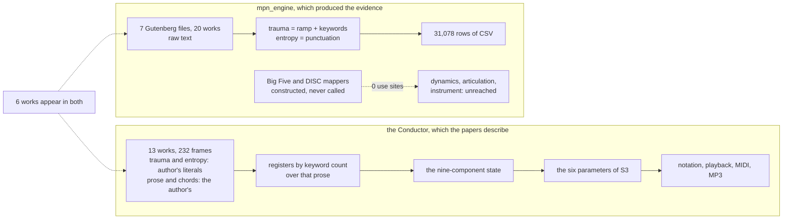

| Field | Value |
|:---|:---|
| Designation | MPN-S4 |
| Title | The application: what the MPN Conductor implements, what it stubs, and what the seven score files actually contain |
| Author of the theory | J. McKenney |
| Series | Paper 4 of 4, the music and score path. S1 states the theory, S2 the formal apparatus, S3 the mapping, and this paper the implementation |
| Licence | CC BY 4.0 |
| Status | Revision 2, ACCEPTED at the four-reviewer gate of 13 September 2026 with six conditions, all applied. Revision 1 was returned with seven blocking findings, all verified and all correct; the largest is that it described the seven score files as seven plays without ever reading their TEXT column. Revision 2 cleared the Skeptic, the Constraint Guardian and the User Advocate in turn and carries the Arbiter's six conditions. The largest change since revision 1 is section 3; the largest since the Skeptic passed it is section 4.5, which corrects S1 revision 3 on the provenance of the 232 frames. **The programme's standing caveat on its empirical position was added at the head of section 1 on 14 September 2026**, in the short form of section 8, together with two sentences in section 8.1 marking claims that turn on a choice nobody has taken |
| Implementation claims pinned to | `mpn-conductor-standalone`, working tree of 13 September 2026, the same tree S2 section 6.5 and S3 cite |
| Scores examined | The seven files under `05_DATA/01_scores/` named `MCKENNEY_LACAN_SCORE_*.csv`, 31,078 rows, read in full including the text of every row. Section 3 establishes that they are seven Project Gutenberg files containing twenty works, not seven plays |
| Ruling | `08_PAPERS/ARBITRATION-S4.md` |
| Reproduces | `05_DATA/03_generators/s4_scores.py`, `s4_score_provenance.py`, `s4_score_laws.py`, `s4_two_engines.py`, `s4_dead_paths.py`, `s4_leitmotif.py`, `s4_frame_provenance.py`, `s4_determinism.py`, `s4_claims_check.py`. Every numerical claim below is produced by one of them and none is transcribed, except for a small number cited to [4] as readings of named source lines, each of which carries its path and line in the sentence that makes it. `s4_hand_vs_engine.py` is retained in the directory and is NOT cited: the comparison it computes is withdrawn in section 4.5 |
| Length | About 10,700 words of body text, counting alphabetic tokens outside tables, code fences and display maths. No ceiling: the author set the series convention aside on 13 September 2026 |

## Contents

1. What this paper is
2. There are two programs, not one
3. What the seven score files actually are
4. What the thirty-one thousand rows contain
5. What the Conductor implements, and what a user hears
6. What is stubbed, what is dead, and what is decorative
7. Determinism, and what it now costs
8. What the application can and cannot be cited for
9. The work queue
10. Where the programme stands
11. References

## 1. What this paper is

S1 states the McKenney-Lacan calculus as a set of assertions with their falsification conditions [1]. S2 establishes the formal apparatus and finds the state space to be eight-dimensional in nine named coordinates [2]. S3 states the mapping from that state to musical material, parameter by parameter, and finds that the mode reaching a rendered score is not a function of the registers [3]. This paper is about the program.

It has one job and a stated method. The job is to say what the MPN Conductor implements, what it stubs, what it fabricates, and what the programme's largest empirical artefact actually contains, at path and line, so that a reader knows which claims in the first three papers are exercised by running code and which are not. The method is the one the series arrived at over the course of S3: **every negative claim is warranted by an enumeration whose class is named, every numerical claim is produced by a script rather than transcribed, and where a script and a reading disagree the disagreement is reported rather than resolved silently** [3].

**The standing caveat, and why it lands on this paper differently from the other three.** No listener has been asked anything, and every empirical claim in this programme is untested. Everything the programme holds it produced itself: the 31,078 scored rows this paper reads in full and the 232 frames of the library are both outputs of the system under study. The listening pack is built, blinded and published, and it has been sent to nobody. Two earlier listener studies exist and neither is citable, their stimuli having come from an unseeded generator [1]. **None of that touches a single finding below.** A credential in a file, two programs that share no code, a column that is a row counter, a value computed and written to a console log: these are facts about a codebase, each warranted by an enumeration whose class is named and each produced by a script rather than transcribed, and every one of them would read the same if no listener were ever asked anything. **The implication does not run the other way, and that is what this block exists to say.** Every figure in this paper is a measurement of a system and none is evidence about the world. The seven score files are this paper's subject and not its witness. Section 8 sets out what the application can and cannot be cited for, at the length that question deserves, and this block is its short form rather than a second copy of it.

Seven findings are worth stating before the detail. The first is the only one that will not wait.

**An API key has been committed in plaintext for eight months.** `docker-compose.yml:26` carries an ElevenLabs key, put there on 10 January 2026 and present in every one of the repository's 36 commits since, at `github.com/Planet9V/mpn-conductor-standalone`, which the programme's own working plan describes as public. Whether the key still authenticates is not tested here and does not change the repair: a credential committed to a repository that has been cloned or pushed anywhere is compromised by default, and if the repository is public, scanners find it within minutes of the push and the spend is billed to its owner. Rotating it is the quick half and purging it from the history is the slow half. Section 6, and item S4-1.

**There are two programs.** The Conductor is a TypeScript application under `src/`, and it renders from a frame library of thirteen works. The 31,078 scored rows were produced by `mpn_engine/`, a standalone Python package, over seven quite different files. Neither imports the other and no file is shared. They do not take the same psychology as input, and one of them takes none. The Conductor reads the nine-component state the theory defines. `mpn_engine` declares a Big Five mapper and a DISC mapper, constructs both in its scorer, and calls neither: every entry point of both has zero use sites anywhere in the package, so on the path that produced the scores the engine implements no psychology at all. Section 2.

**The seven score files are not seven plays.** They hold twenty works. The file named for The Cherry Orchard is the Chekhov *Second Series* and contains eight plays, the orchard last among them and occupying 24.3 per cent of the file; the file named for Miss Julie is the Strindberg *Second Series* and contains five, Miss Julia second; the file named for Oedipus Rex is the whole Theban trilogy. **The file named for King Lear yielded no dialogue at all**: 3,424 of its 3,425 rows carry the speaker `STAGE`, which is what the parser emits when it cannot find one. Several hundred rows across the files are the Project Gutenberg licence, scored as dramatic beats. One thing this does not damage is worth saying in the same breath: **no assertion in S1, S2 or S3 rests on these rows.** S1 cites four figures from them, and replacement text for all four is issued in the amendments note [8]. The defect is in what has been cited, not in what has been built on. Section 3.

**The rows are not a score either.** Nine columns, of which three are transcription and six are computed. Of the nine state components, two appear. Of the parameters S3 maps to, none appears: no marking, no tempo, no metre, no mode, no fragmentation stage, no density level, no instrument, and no triad. Section 4.

**Trauma, over those rows, is 99.4 per cent position in the file.** The engine computes it as $0.8 \times \text{row}/\text{total}$ plus a weighted keyword count and a weighted entity count, and those two terms, which are the only part of the formula that reads the text at all, account for 0.6 per cent of its variance. `BASELINE_B` is exactly $1 - \text{row}/\text{total}$, so it and trauma are the same ramp with opposite signs; the clinical health score is trauma inverted onto ten points; the arrhythmia coefficient is a speaker-change flag and reconstructs exactly. Because the denominator is the whole file, the position is a position in an anthology and a licence rather than in a play: over the Gutenberg licence closing two of the files the engine reports trauma rising to 0.80 and clinical health falling to 1 out of 10. Section 4.

**Determinism now holds where the theory needs it and nowhere else.** S1 recorded unseeded draws as blocking every listening study [1]. Of the 54 unseeded draws left in the source, none is reachable from a rendered score; all 54 are in visualisations, demos and page chrome. So the stimuli are reproducible and the pictures beside them are not. Section 7.

**Neither corpus is an observation, and S1's correction about the frames goes one step too far.** Revision 1 of this paper compared the seven score files against the Conductor's 232 frames and concluded that the frames are the better instrument. The comparison is withdrawn: it aligned two corpora on an index they do not share. On the way to withdrawing it this paper read the frame library's provenance, which turns out to be neither of the two things the series has called it. **Trauma and entropy are literals**, 232 of each, written out as numbers in `literary_data.ts` and `additional_plays.ts` and passed to the orchestrator unchanged; **the register triple is computed**, by a keyword count over the author's own prose commentary on the scene; the four DISC coordinates are not produced at all. S1 revision 3 states that the frames' state values were produced by the application's analyser and calculus [1], which is exact for the triple, which is what S2 says too [2], and not true of the other two. Neither reading makes the frames an observation of anyone, and S1's governing sentence stands unaltered. Section 4.5, and the replacement text for S1 is in the amendments note [8].

**What this paper is not.** It is not a defence of the application and it is not an attack on it. Several of the findings below are unflattering, and they are in a paper the author commissioned about his own software, which is the only reason they can be stated plainly. Nothing here bears on whether the theory is true. A theory can be right and its first implementation wrong, and the point of separating the four papers was to make that distinction possible.

## 2. There are two programs, not one

The programme is usually described as a theory with an implementation. It has two implementations that share nothing.

`src/` holds the MPN Conductor: a Next.js application whose engine is `psychometric_calculus.ts`, `score_orchestrator.ts`, `GeniusComposer.ts` and the reference dictionary, rendering to VexFlow and playing through Tone.js. `mpn_engine/` holds a standalone Python package: a dialogue parser, a calculus, a Tonnetz, a dynamics mapper and generators for CSV, MIDI and MusicXML.

A search of every TypeScript file under `src/` for the string `mpn_engine` returns nothing, and a search of every Python file under `mpn_engine/` for any Conductor module returns nothing [4]. They are not two views of one system. They are two systems.

That matters because the programme's papers describe the first and its evidence comes from the second. A reader who takes the 31,078 rows as evidence about the mapping S3 specifies is taking the output of one implementation as evidence about another, and the two do not agree about what music is a function of.

### 2.1 They take different psychologies as input, and one of them is not wired up

S1's state is $p = (\tau, H, r, s, i, D, I, S, C)$: trauma, entropy, the three Lacanian registers, and the four DISC coordinates [1]. The Conductor reads that state.

`mpn_engine` declares two psychometric mappers of its own. `core/dynamics_mapper.py` maps an `OceanProfile` with fields O, C, E, A, N, the Big Five, onto dynamic marking, velocity, articulation, modulation and tempo style. `core/instrument_mapper.py` maps a `DISCProfile` onto an instrument and an ensemble. Both are constructed by the scorer, at `mpn_engine/text/batch_scorer.py:34` and `:35`, which is how revision 1 of this paper came to describe the Big Five as the psychology the engine drives its music from [4].

That description was wrong, and the way it was wrong is the same way S3 went wrong twice: it read the definitions and did not ask for the call sites.

Every `.py` file under `mpn_engine/` was parsed and every public definition enumerated from the parse tree, 104 of them across 19 files, 69 outside the test suite. Use sites were collected from the same parse trees, counting a definition as used where its name appears as the function of a call, as the attribute of a call, or, for a property, as an attribute read. The match ignores the receiver, so the count over-counts wherever two classes share a method name, which means a definition credited with uses may still be dead and **a definition credited with none has none anywhere in the package** [4].

| Definition | Use sites in the whole package |
|:---|---:|
| `DynamicsMapper.get_dynamics` | **0** |
| `DynamicsMapper.infer_profile_from_text` | **0** |
| `DynamicsMapper.set_speaker_profile` | **0** |
| `InstrumentMapper.infer_profile_from_text` | **0** |
| `InstrumentMapper.get_ensemble` | **0** |
| `InstrumentMapper.set_speaker_profile` | **0** |
| `MPNCalculus.score_beat` | 3, one of them the scorer at `batch_scorer.py:79` |
| `BatchScorer.export_csv` | 1, the command-line entry point |

The two mappers are constructed and never touched again. Each is mentioned three times in the whole package: an import, a constructor call, and its own class statement [4]. `InstrumentMapper.get_instrument` has one use, inside `get_ensemble`, which itself has none, so the DISC path is dead behind a live-looking door.

The consequence is larger than the finding it replaces. **`mpn_engine` implements no psychology at all on the path that produced the scores.** Not the nine-component state, and not the Big Five either. What reaches the CSV is `MPNCalculus`, whose entire output is the six computed columns of section 4, and the only psychological quantities among them are trauma and entropy. The fieldnames `export_csv` writes are the nine columns of the seven files, and no dynamic, no instrument, no register and no Big Five value appears in that list [4].

### 2.2 The engine's personality instrument has no lower half, and nothing calls it

The dead module is worth reading anyway, because the programme has cited it and because what it would do if wired up bears on any decision to wire it up.

`infer_profile_from_text` estimates the five factors from word lists. Each factor starts at 0.5 and each match adds 0.05; Extraversion additionally adds 0.02 per exclamation mark and Neuroticism 0.01 per question mark [4]. Nothing ever subtracts.

Every factor is therefore confined to $[0.5, 1.0]$. No character in any play could score below the midpoint on any Big Five factor, whatever they said or did. A character could be more extraverted than average or much more, never less.

`DYNAMIC_MARKINGS` declares eight markings against thresholds at 0.0, 0.15, 0.3, 0.45, 0.55, 0.7, 0.85 and 0.95, and exactly one line in the package reads that table: the selection loop inside `get_dynamics` at `mpn_engine/core/dynamics_mapper.py:174` [4]. Revision 1 reported that the confinement to the upper half makes ppp, pp, p and mp unreachable and leaves mf, f, ff and fff. **That is the wrong count.** `get_dynamics` has no caller, so all eight markings are unreachable, and the question of which half of the range survives does not arise until something calls it.

The finding that matters is smaller and harder to fix than the one it replaces. The lower half is unreachable by construction and would stay unreachable the moment the module was connected, because the bound is in the estimator and not in the table. Wiring the mapper in without changing `infer_profile_from_text` would buy half a dynamic range and a personality instrument that cannot report a quiet person.

### 2.3 The engine's leading-tone operator is not the leading-tone operator

The three neo-Riemannian operators are defined by preserving two of the three tones of a triad. `transform_L` in `mpn_engine/core/tonnetz.py` moves the root by a semitone, which preserves none: it sends C major to B minor where the published operator sends it to E minor [4]. Its own docstring contains both readings at once, saying "C Major → e minor (root C→B)", and the package's test suite fixes the wrong behaviour in place.

The deconstruction records this [5]. What is new here is what it costs, because the obvious check does not catch it. The group generated by P, the engine's L, and R still acts transitively on all 24 triads, and its Cayley graph still has diameter 5, so counting either would show nothing wrong. The two graphs are nevertheless different: **they agree on the distance between only 50.0 per cent of ordered chord pairs**, and the largest disagreement is maximal, B minor to G being one step in the published group and five in the engine's [4].

S3 section 2.5 computes the Cayley metric of the published group and reasons from its distances [3]. A harmonic distance computed in `mpn_engine` is a distance in the other graph. The PLP the score files emit 114 times, against 11,491 R, 11,688 L and 7,785 P, is not the PLP S3 discusses.

## 3. What the seven score files actually are

The seven files under `05_DATA/01_scores/` are the programme's largest empirical artefact. They are cited across the corpus as 31,078 beats from seven plays, and revision 1 of this paper cited them that way too, computing four sections' worth of findings from them without once reading the `TEXT` column.

The figure 31,078 is right as a row count and wrong as a description. Every claim below is a count over the files, produced by `s4_score_provenance.py`, so a reader can disagree with a test rather than with a conclusion.

### 3.1 They are Project Gutenberg files, not play texts

All seven carry a Gutenberg start marker in their opening rows and an end marker further down, which in five of the seven is the last row and in two is not [4]. Nobody extracted a play from a Gutenberg download and scored the play; the download was scored.

Two of the seven run past the end marker into the licence. In the file named for The Cherry Orchard the licence opens at row 6,391 of 6,658, position 0.960, and 268 rows follow it; in the file named for Oedipus Rex it opens at row 4,829 of 5,097, position 0.947, with 269 rows after. A lower bound of 200 rows across all seven match a Gutenberg boilerplate phrase outright, and the true figure is higher because most of a licence does not name Gutenberg [4].

### 3.2 Three of the seven are anthologies

Each Gutenberg file carries a table of contents near its head. It is read here rather than guessed at: the generator locates the row whose text is exactly `CONTENTS`, takes the short lines that follow it, and keeps an entry as a work only where that line **recurs later in the file as a standalone heading** and is not an act, a scene, a character list or an introduction. Every entry it rejects is printed with its reason, so a reader who disagrees with a rule can see which entries it moved [4].

The recurrence requirement is what does the work. A single play's contents block lists acts and scenes and sometimes a dramatis personae, and a character name does not recur as a heading; an anthology's lists works, and each one opens a section further down the file. A file whose contents block names no work under that rule, or which has no contents block at all, is one play.

An earlier version of this generator matched titles against a hardcoded list of play names, which could not match `ON THE HIGH ROAD` or `THERE ARE CRIMES AND CRIMES` and undercounted three of the seven files. It was the same defect this paper's method clause forbids, in this paper's own instrument, and it is recorded here rather than quietly repaired.

| File | Works named | The work it is named for |
|:---|:---|:---|
| `A_DOLLS_HOUSE` | none; its contents block is a dramatis personae, so one play | the whole file |
| `CHERRY_ORCHARD` | **8**: On the High Road, The Proposal, The Wedding, The Bear, A Tragedian in Spite of Himself, The Anniversary, The Three Sisters, The Cherry Orchard | last of the eight, rows 4,751 to 6,368, positions 0.713 to 0.956, **24.3 per cent** |
| `HAMLET` | none; acts and scenes only, so one play | the whole file |
| `KING_LEAR` | no contents block at all, so one play | see 3.3 |
| `MACBETH` | none; acts and scenes only, so one play | the whole file |
| `MISS_JULIE` | **5**: There Are Crimes and Crimes, Miss Julia, The Stronger, Creditors, Pariah | **second** of the five, rows 2,998 to 4,426, positions 0.435 to 0.642, **20.7 per cent** |
| `OEDIPUS_REX` | **3**: Oedipus the King, Oedipus at Colonus, Antigone | first of the three, rows 23 to 1,600, positions 0.004 to 0.314, **31.0 per cent** |

**Twenty works across the seven files**, together with six introductions and an author's preface that the contents blocks name in their own right [4]. The boundaries in the right-hand column are the body headings themselves and the heading that follows, with the last work in a file running to the end-of-book marker; no cast is named and nothing is inferred from where speakers appear.

Two properties of that test should be stated rather than assumed.

A work whose title is printed twice, once over its translator's introduction and once over the play itself, is bounded by the second, so no introduction is counted against the play that **follows** it. Only the Strindberg file does this, and it does it for all five of its plays; taking the first printing instead would have absorbed 1,061 rows, 15.4 per cent of that file, into the plays after them, Miss Julia's own 675-row introduction among them [4]. Each span still runs to the next work's heading, so an introduction is counted against the play that **precedes** it, and the spans below should be read with that in mind: 898 of those 1,061 rows sit inside a span rather than outside all of them.

And the recurrence requirement errs in one direction only. An anthology whose contents entries do not recur verbatim as headings would fall through to one play, so **the test can undercount anthologies and cannot invent one**; each of the four files it calls a single play was checked by hand as well.

The corroborating test agrees, and it is worth running because it is independent of the headings. In `MISS_JULIE`, Adolphe speaks 1,085 lines between positions 0.074 and 0.439 and Jean speaks 713 between 0.439 and 0.642: two casts that do not overlap at all, which is what an anthology looks like and not what a play looks like. Jean is Miss Julia's male lead, and his span agrees with the heading boundaries above to within half a per cent of the file at each end: his first line is 30 rows after the play's heading, which is the title page, the cast list and the opening stage direction, and his last attributed line is 4 rows past the next heading, because the parser carries the previous speaker across unattributed lines and so puts Jean's name on The Stronger's title page. Two tests built on different evidence, headings and speaker attributions, land within a few rows of each other, and the only discrepancy at the far end is a parser artefact rather than a disagreement about where the play ends. In `HAMLET`, by contrast, Hamlet spans 0.081 to 0.986 and Horatio 0.019 to 0.997 [4].

### 3.3 One file contains no dialogue

`KING_LEAR.csv` has 3,425 rows. **3,424 of them carry the speaker `STAGE`**, which is what the dialogue parser emits when it cannot find a speaker. The only other value in the column is `FINIS`, once, on the last row [4]. S1 reports the same failure and gives the count as all 3,425 [1]; the difference is that one row, and the reading here supersedes it.

The parser found no dialogue in that file. Every quantity computed over it was computed over unparsed text, and the arrhythmia column, which is a speaker-change flag and is exact everywhere else, is constant there by construction. The file has been cited in this programme as 3,425 beats of King Lear. It is 3,425 lines of a text file with one speaker in it.

### 3.4 What this does to the ramp

The engine computes trauma as $0.8 \times \text{beat}/\text{total}$ plus a weighted keyword count, and `BASELINE_B` as $1 - \text{beat}/\text{total}$. In both, `total` is the row count of the whole file. So on an anthology the narrative position of a line is its position in the assembly, not in any play. The Cherry Orchard opens at position 0.713 of its file, so its first line is scored as though the tragedy were already three-quarters over and its last as though nothing further could happen. Antigone opens at 0.685 of a ramp that began in Oedipus the King. Miss Julia runs from 0.435 to 0.642, so it never reaches either end of the scale its own tragedy is supposed to traverse: the engine has it beginning at moderate trauma and ending before the ramp does.

At the far end it is worse than a mismatch. Over the licence block that closes two of the files, the engine reports trauma rising to 0.80 and clinical health falling to 1 out of 10 [4]. **It scores a copyright notice as a catastrophe**, and does so for 268 and 269 consecutive rows, at the precise position where a reader looking for a tragic climax would look.

### 3.5 What the figure should be called

The seven files hold 31,078 rows. They contain twenty works, six introductions and an author's preface, two licence blocks, a lower bound of 200 rows of Gutenberg apparatus, and one file with no dialogue in it. The number is a line count over seven text files.

It is not a number of dramatic beats, the files are not seven plays, and no paper in this series should cite it as either. Where a later section needs to refer to the artefact it is called the seven score files or the 31,078 rows, and the word beat is reserved for the engine's own column name.

## 4. What the thirty-one thousand rows contain

All seven files share one header of nine columns:

`BEAT, SPEAKER, TEXT, TRAUMA_R, ENTROPY_H, BASELINE_B, ARRHYTHMIA_α, NEO_RIEMANNIAN_OP, CLINICAL_HEALTH_SCORE`

Three are transcription and six are computed.

### 4.1 What is absent

Of S1's nine state components, **two appear**: trauma and entropy. The three registers appear nowhere and the four DISC coordinates appear nowhere, so seven of the nine are absent from the artefact.

Of the musical parameters S3 maps to, **none appears**. There is no dynamic marking, no tempo, no metre, no mode, no fragmentation stage, no orchestration density, no instrument and no triad. Section 2.1 says why: the modules that would have produced those parameters are never called.

One script disagrees with that sentence and the disagreement is reported rather than resolved silently. `s4_scores.py` lists harmonic position as present, on the ground that `NEO_RIEMANNIAN_OP` exists. The column names an operator, not a chord, and no triad is recorded anywhere in the seven files, so the mapping's codomain is absent even though a name from its vocabulary is present [4]. The reading here is the narrower one and the script's census line should be read as a column inventory rather than as a parameter inventory.

The rows are a table of two state coordinates and four quantities derived from them. Citing them as evidence about a mapping to musical material overstates what the file is by a wide margin.

### 4.2 What the six computed columns are

Every one reconstructs from `mpn_engine/core/mpn_calculus.py` with its default constants [4]:

| Column | The engine's formula | Reconstructed |
|:---|:---|---:|
| `TRAUMA_R` | $\operatorname{clamp}\left(0.8 \cdot \dfrac{\text{beat}}{\text{total}} + 0.1 \sum_{w} n_w \lambda_w + \sum \text{entity weights}\right)$, where $n_w$ counts keyword $w$ and $\lambda_w$ is its own weight | see 4.3 |
| `ENTROPY_H` | $\operatorname{clamp}(0.3 + 0.20 \cdot \#? + 0.15 \cdot \#! + 0.10 \cdot (\#\text{--} + \#\ldots) + 0.25 \cdot \#[?!]\{2,\})$ | **100.00 per cent**, one row aside |
| `BASELINE_B` | $\max(0,\ 1 - \text{beat}/\text{total})$ | **100.00 per cent** |
| `ARRHYTHMIA_α` | 0.2 if the speaker is unchanged, 0.7 if it changed, 0.5 on a first beat | **100.00 per cent**, first beats aside |
| `NEO_RIEMANNIAN_OP` | R below trauma 0.3, L below 0.6, P below 0.8, else PLP | 98.13 per cent |
| `CLINICAL_HEALTH_SCORE` | $\lfloor (1 - \min(1, \tau)) \cdot 10 \rfloor$ out of ten | 94.39 per cent |

Three of those functions carry docstrings naming quantities they are not. `trauma_R` is documented as "Riemann Curvature" and is a linear ramp plus keyword hits. `entropy_H` is documented as "Shannon Entropy" and is a weighted punctuation count. `baseline_B` is documented as "Structural Integrity" and is one minus the same ramp.

Two of the reconstructions fall short of exact, and both shortfalls have the same cause. The health score and the operator band are computed from the unrounded trauma, and the CSV stores trauma rounded to two places, so **neither column can be reproduced from the file that contains it**. The shortfall is the same on all seven files, between 94.36 and 94.44 per cent for health and 98.08 and 98.20 for the operator, which is what systematic rounding looks like rather than noise.

Two further discrepancies are worth recording together, because they say the same thing and neither says it alone.

The first row of every file carries an arrhythmia of 0.7, where the shipped scorer passes no previous speaker for the first beat and the shipped calculus returns 0.5 in that case. The value 0.5 appears **nowhere in the 31,078 rows** [4].

S1 records that entropy reproduces from the text column with zero error [1]. It reproduces on 31,077 of 31,078 rows, and the exception is the more interesting fact. The entropy formula carries a term adding 0.25 for a run of two or more of `?` or `!`. Exactly one row in the seven files can trigger it, a line of Chekhov ending "sail!!". Its stored entropy is 0.6, which is what the formula gives **without** that term; with it the value would be 0.85 [4].

Two independent branches of the published calculus are contradicted by the published output. The seven score files were produced by an earlier version of `mpn_engine`, and no record of that version exists in the tree. Anyone re-deriving these columns will get different numbers from the ones the programme has been citing, and the two discrepancies above are the measure of it.

### 4.3 Trauma is a clock

S1 records that trauma correlates with row position at 0.995 to 0.999 in every file [1]; the pooled figure, computed here, is $+0.9969$ over all 31,078 rows. **So 99.4 per cent of the variance of trauma is how far through the file the line falls.** The keyword and entity terms, which are the only part of the formula that reads the text at all, account for the remaining 0.6 per cent [4].

The corollaries follow immediately. `BASELINE_B` correlates with position at exactly $-1.0000$, because it is that ramp; its correlation with trauma of $-0.9968$ is the same fact seen twice. The clinical health score is trauma inverted onto ten points, so it is the same ramp a third time. Three of the nine columns carry one quantity.

That quantity is position in a text file. Had the files been single plays it would at least be narrative position, and narrative position is not nothing: tragedies do build, and a monotone ramp is a defensible first model of a tragic arc. Section 3 removes even that reading for three of the seven. What the column measures is a row counter, and it does not distinguish two characters in the same scene.

One thing this column does **not** explain is worth saying, because a reader meeting it here could easily draw the inference. That trauma ratchets is a property of S1's definition, which gives trauma no way to decrease [1], and S2 says so explicitly [2]. The ramp is a second and unrelated reason why this particular column can only rise. The two coincide and neither is evidence for the other.

### 4.4 What the other two computed columns are

`ENTROPY_H` is a weighted punctuation count, and applying the published formula to the `TEXT` column reproduces it on 31,077 of 31,078 rows [4]. Four counts drive it: question marks, exclamation marks, double dashes and ellipses.

Its floor of 0.3 covers **72.8 per cent of all rows**, which is S1's figure [1], and this paper adds the range behind it: from 53.2 per cent on the Chekhov file to 88.8 per cent on the King Lear one [4]. On nearly three lines in four the text contains none of those four marks, the formula returns its base rate, and the entropy coordinate carries no information about the line at all. S2 takes entropy as one of two continuous state coordinates and S3 maps tempo and metre from it [2], [3]; on this artefact it is constant across three-quarters of the corpus.

`ARRHYTHMIA_α` is a speaker-change indicator with two values, and it reconstructs exactly. It measures turn-taking, which is a real property of a scene and arguably the most defensible quantity in the file, on the six files where a speaker was found. It is not a rhythm, an arrhythmia, or a coefficient.

An earlier draft of the generator behind this section concluded from the data alone that the arrhythmia column was a biased coin, because it takes two values that nothing in its own row predicts. That was wrong, and the way it was wrong is worth recording as a method point: **distributional evidence bounds what a column could be, and only the source says what it is.** A speaker-change flag is invisible within a row and obvious in the code.

### 4.5 The comparison that cannot be made, and what the frame library actually is

The programme holds two bodies of numbers. The seven score files are one. The other is the Conductor's frame library: thirteen works, 232 frames, Antigone, A Doll's House, The Importance of Being Earnest, Hamlet, Hedda Gabler, King Lear, Macbeth, Medea, Miss Julie, Oedipus, Othello, The Seagull and Uncle Vanya, six of them also among the seven scored files. That list is read from `src/components/mpn-lab/literary_data.ts` and `additional_plays.ts` rather than produced by a generator.

**The comparison revision 1 drew is withdrawn.** It aligned the two on normalised position, resampled both onto twenty bins, and reported a table of correlations. The frame library's position is a position within a play; the engine's is a position within a file, and section 3 shows that two of the six overlapping files are anthologies, in which the named work occupies 20.7 and 31.0 per cent of the rows, while a third contains no dialogue at all. A correlation between two differently indexed curves is not a measurement of agreement. No corrected table is offered in its place, because the correction is not arithmetic: it requires re-scoring from single-work texts, which is item S4-3 of the work queue.

**What the frame library is, by counting it.** The withdrawal made it necessary to ask what the frame library is, which the series has now called two incompatible things. Revision 1 of this paper, and the corpus before it, called the 232 frames hand annotations. S1's third revision withdrew that, and said the state values were produced by the application's own text analyser and calculus run over the author's prose, adding that the error was not a small one [1]. S2 says the same of the registers: no human produced any of the 232 triples [2].

Reading the data files and the consumer settles it, and the answer is neither of the two. The library is read through `s3_frames.py`, the single reader the S3 amendments made mandatory after a parser defect moved four figures in S2, and which asserts its own record count against the annotation count so a parser dropping records fails rather than reports [4], [6]:

| Component | In the frame library |
|:---|:---|
| trauma | **232 literals**, one per frame, written out as numbers in the two data files |
| entropy | **232 literals**, likewise |
| the three registers | **computed**, by `analyzeRSI` at `score_orchestrator.ts:249`, which counts the words "real", "symbolic" and "imaginary", among others, in the frame's `analysis` field |
| the four DISC coordinates | not produced at all; `inferDISC` returns null under decision 9 |

Trauma takes twelve distinct values across the whole library and entropy ten, all of them round: 0.1, 0.2 and so on, with 0.85 and 0.95 the only figures finer than a tenth. That is the signature of a person typing a judgement, not of a formula over prose. And nothing downstream derives them. `processFrame` takes trauma and entropy as parameters, and the two files that bind those parameters bind copies: the page passes the selected frame's own literals at `src/app/mpn-conductor/page.tsx:348` and `:349`, with constant fallbacks of 0.3 and 0.25 for the case where no frame is selected, and the exporter passes a caller-supplied sequence at `score_exporter.ts:54`. The only arithmetic on either coordinate anywhere in the six modules is the running totals and means the PDF report prints, which the composer never sees. Not one binding derives a trauma or an entropy from a text [4].

So S1's correction is exact for the register triple and does not hold for the two continuous coordinates. Replacement text for S1 is issued in the amendments note rather than left to a reading of this prose [8].

**What that does and does not buy.** It does not restore revision 1's conclusion. A number the author typed for a scene he wrote a description of is a judgement, and a judgement is not an observation: one person, no codebook, no second coder, and the scenes being judged are his own selections and his own prose about them. S1's governing sentence therefore stands exactly as written, and this paper affirms it rather than qualifying it: **the corpus contains no observation of trauma, entropy or the registers that the system did not itself produce** [1]. What the correction changes is which system produced which coordinate, not whether anything was observed.

What it does buy is that the two corpora are different kinds of thing, and the difference is worth naming precisely because revision 1 named it wrongly. The seven score files are one formula applied to the wrong text: three anthologies, a file with no dialogue, two licence blocks, and a principal coordinate that is a row counter. The frame library is one person's judgements of his own scenes, plus a keyword count over the prose in which he recorded them. Both are inside the system. Only one of them was also computed over text that is not what it was taken to be, and that is section 3's finding and a defect of that corpus alone.

S2 and S3 rest on the 232 frames and will continue to, because the frames are what the Conductor renders from. Re-scoring from single-work texts, item S4-3, removes one defect from one corpus; it does not produce an observation, and no item on any queue in this series does.

## 5. What the Conductor implements, and what a user hears

Against the second implementation, the Conductor is in better condition, and the reason is that S3 audited it. What follows is the state of the parameters S3 specifies.

| Parameter | S3 specifies | The Conductor implements | Gap |
|:---|:---|:---|:---|
| Dynamics | eight markings on a linear velocity law | three labels at three constant velocities, from a three-entry lookup with two uncovered trauma intervals | S3-3 |
| Tempo | piecewise affine in entropy, three bands | as specified, but the three ranges reach 35 of the 141 integer tempi they span | S3-6 |
| Metre | four values on four entropy conditions | as specified, with the interval 0.5 to 0.6 uncovered and falling to 4/4 | S3-5 |
| Mode | from the dominant register, with a trauma switch | a branch on $\tau + H$ for the printed name; a hard-coded register triple for the pitches; the register-reading selector's answer discarded | S3-1, S3-2, S3-7 |
| Fragmentation and density | the amended A8 pair, orthogonal, on even fifths [6] | the superseded pair, correlated, on unequal ladders | S3-4 |
| Harmonic position | 24 triads under the published operators | the operators are implemented; $k_{\max}$ is unfixed, so the walk is undefined | S3-9, S3-10 |
| Timbre | $F \times [0,1]^3$ from the DISC contrasts | nothing: DISC is not produced | section 6 |

None of those rows is clean: five carry defects S3 already itemised, one is implemented but left undefined for want of $k_{\max}$, and one is not implemented at all. This paper does not repeat S3's evidence for the modal rows, which is set out with its paths and lines in the implementation audit behind S3 [7]; it records that the queue S3 issued is the queue this paper inherits, and section 9 states which items this paper adds to it.

### 5.1 The path from a play to a sound

What a user gets is worth setting out in order, because the theory papers describe a mapping and a user experiences a pipeline, and the pipeline has more in it than the mapping does.

A scenario frame arrives carrying the author's prose annotation, his chord annotation, and the trauma and entropy he typed for it. The orchestrator computes the register triple from the annotation by keyword count. It then calls `psychometricToMusical` for the global parameters, selects a leitmotif transformation, and calls the composer for each speaking character's melody and for the ensemble's chords. The composer applies the transformations, fragments the motif, and emits note events. Those are rendered to notation through VexFlow, played through Tone.js against sampled instruments, and exported to MIDI, to MP3 through an offline render, or to PDF.

Three things about that path deserve stating because they are invisible from the theory.

**A character's stave decays by a tenth per frame.** At `src/components/mpn-lab/score_orchestrator.ts:296`, a stave's activation is set to 1.0 while its character speaks and otherwise reduced by 0.1 to a floor of zero, so a character who has stopped speaking fades rather than stopping. That is a musical decision with no counterpart in S1, S2 or S3. It is recorded here because a reader comparing the theory with the output will hear it and not find it, and whether it belongs in the theory is the author's to decide.

**One of the nine declared leitmotif transformations is not what it appears to be, and revision 1 named a different one.** Revision 1 asserted that inversion is inaudible, on the reasoning that `transformLeitmotif` negates the motif's intervals while the composer reads only the pitch classes. That assertion is false and is withdrawn. The function recomputes the pitch classes from the transformed intervals for four of the eight cases in its switch, at `src/components/mpn-lab/leitmotif_generator.ts:226` to `:234`, so inversion changes the pitches.

Running the function establishes what is actually true of it. The TypeScript is stripped of its type annotations and executed under `node` against a test motif, once per transformation, and the two fields the composer reads are compared [4]:

| Transformation | Pitch classes | Rhythm | Differs from the original |
|:---|:---|:---|:---|
| `original` | 0, 4, 7, 11 | 1, 0.5, 0.5, 2 | no |
| `inverted` | 0, 8, 5, 1 | unchanged | yes |
| `retrograde` | 11, 7, 4, 0 | reversed | yes |
| `retrograde_inverted` | 0, 8, 5, 1 | unchanged | yes, and **identically to `inverted`** |
| `fragmented` | 0, 7 | 1, 0.5 | yes |
| `augmented` | unchanged | doubled | yes |
| `diminished` | unchanged | halved | yes |
| `chromatic_descent` | 0, 11, 10, 9 | unchanged | yes |
| `whole_tone_ascent` | 0, 2, 4, 6 | unchanged | yes |

Every transformation changes something. But `retrograde_inverted` reverses the pitch classes and then the recomputation block rebuilds them from `motif.pitchClasses[0]` and the negated intervals, discarding the reversal; it does not reverse the rhythm either. The result is bit-identical to `inverted`, so nothing downstream can distinguish them.

It never has to. `selectTransformation` was run over 171,666 states, trauma and entropy on a 0.02 grid crossed with 66 points of the register simplex, and `retrograde_inverted` was returned for none of them [4]. It is declared in the type, implemented in the switch, unreachable from the selector, and would be inaudible if it were reached.

**The Symbolic register selects nothing.** The same reading of `selectTransformation` shows it testing trauma, then entropy, then `rsi.real`, then `rsi.imaginary`. It never reads `rsi.symbolic` [4]. The Real selects chromatic descent on 5.6 per cent of the grid and the Imaginary whole-tone ascent on 5.6 per cent; a Symbolic-dominant character takes whatever the trauma and entropy tests leave behind. This is the same shape of defect S3 found in the modal selector, in a different file: a register-reading function whose answer is partly discarded [3].

**The PDF export is a text report, not notation.** It writes a title, statistics, a dramatis personae and a per-frame table through jsPDF, dynamically imported at `src/components/mpn-lab/score_exporter.ts:405` [5]. A reader who exports a score and expects an engraved one gets a document about the score instead. The MIDI and MP3 exports are real.

### 5.2 The service beside the browser

The browser is where the working system lives. The Python service beside it is not in that state. Its `/export/wav` endpoint returns five seconds of a constant regardless of its input: a 440 hertz sine at `ml/psychoscore_v2/audio_analysis/export_endpoint.py:456`, or, on the branch taken when FluidSynth is absent, a C major triad at `:476`. Its `/export/pdf` prints a line saying that notation rendering requires an integration which is not present [5]. Those are stubs in the strict sense: they have the shape of an implementation and return a constant.

## 6. What is stubbed, what is dead, and what is decorative

The repository deconstruction of 11 September 2026 is a thorough static reading with a path and line for every claim [5]. It cannot be cited as a current description, because two of its findings have been acted on since it was written.

**Eleven checks were run against the pinned tree, and they do not cover the whole document.** The deconstruction carries twelve numbered executive findings. `s4_claims_check.py` re-derives nine of those twelve, each by a test named in the script, together with two further readings that are not among the twelve, which is the eleven stated below. Three of the twelve were not rechecked: its reading of the v2 planner's training state, its finding that the voice and music analysis heads are randomly initialised with no saved weights, and its catalogue of internal mathematical inconsistency. The first two are readings of the machine-learning directories, which this paper does not otherwise enter; the third is largely superseded by S3, which re-derived that catalogue from the sources rather than from the deconstruction [3]. Nothing here warrants the three either way. Revision 1 of this paper said that each of the deconstruction's executive findings had been rechecked, which overstated what the script does, and that is corrected here.

**Nine stand**, and they are listed rather than run together because a reader needs to be able to cite the fourth without counting to it, and because the ninth is not like the other eight.

1. The running mapping is hand-written threshold tables and linear maps. The script's test is that `mckenney_lacan_calculus.py` still defines the threshold functions; the stronger claim that no learned or fitted component exists anywhere in the repository is the deconstruction's, from its own enumeration, and is cited to it rather than re-derived here [5].
2. PSYCHOSCORE v1 was trained on uniformly random target tokens.
3. The v2 silver labels are a language model's reaction to an error string, and all ten label files still contain it.
4. The performance-LoRA training loop is still a placeholder marked as a mock.
5. The 57-to-768 projector is still computed and discarded at inference, the endpoint passing an empty description.
6. The README still claims 84 tests, against 661 Vitest cases and 158 Python test functions counted now by enumerating `it(` and `test(` calls under `src/__tests__` and `def test_` under `mpn_engine/` and `ml/`.
7. The README still claims 34 wiki pages against 57 counted now.
8. No listening test, metric or validation of the mapping exists, and the A/B page still holds its ratings in component state where they cannot outlive the page.
9. **An ElevenLabs API key is still hard-coded at `docker-compose.yml:26`**, in the repository at `github.com/Planet9V/mpn-conductor-standalone`, which the programme's own working plan describes as public. It was committed on 10 January 2026 and is in every one of the 36 commits since. This paper does not test whether it still authenticates, and the repair is the same either way: rotation alone does not close it, because the history has to be purged and the key has to be assumed already compromised. This is item S4-1, and it is the only finding in this series whose consequence does not wait for a reader.

**Two are superseded and must not be cited from the deconstruction.** The unseeded draws that made the composer non-deterministic are gone from the score path, replaced by a keyed generator; section 7 gives the current state. And the ingest path no longer fabricates DISC: `inferDISC` returns `null` under decision 9, and every consumer must handle an absent profile.

That second repair is worth dwelling on, because it turns a defect into an absence and the two need different words. The previous implementation banded four values off average trauma and filled the band with `Math.random()`, so four of the nine state components were invented per character and then presented as measurements. What replaces it is nothing at all. The timbre channel S3 section 2.6 analyses in detail is therefore the one channel the application cannot exercise, and it will stay that way until an instrument for DISC exists. An acknowledged gap is a better position than a fabricated measurement, and it is not the same as working.

### 6.1 Three kinds of not-working, which deserve different words

The tree contains three different conditions that a casual audit collapses into one, and the programme's own documents have collapsed them more than once.

**Stubbed** means the code has the shape of an implementation and returns a constant. The `/export/wav` endpoint returning a sine is stubbed. The performance training loop whose body is a placeholder is stubbed. A stub is honest in a way that matters: it can be found by reading it, and nobody who reads it will believe it works.

**Dead** means the code is correct, or at least plausible, and nothing calls it. `rsiToMode` and the two tables behind it are dead, and so is the `MODES` constant [3]. The objet petit a function is dead: its only caller is itself uncalled [5]. Dead code is more dangerous than a stub, because a reader who finds it reasonably concludes that the system does what it says.

**Decorative** means the code runs, produces output, and that output is not connected to the claim it appears to support. The fifteen `MPNExperiment_` visualisations are decorative: they animate and they respond to trauma and entropy, and section 7 shows that ten of the fifteen do so with unseeded draws, so what those ten show differs run to run. The other five draw no random numbers, though one of them reads the clock twice at `src/components/mpn-lab/MPNExperiment_BorromeanKnot.tsx:73` and `:93`, so reproducibility across that set was not established and is not claimed here. All fifteen are decorative in the weaker sense as well: they are pictures of a state that nothing validates. The evaluation panel showing numeric scores for the visualisations with no provenance is decorative [5]. Decoration is the hardest of the three to find, because it looks like it is working and in a sense it is.

The distinction matters for what the programme should do next. A stub is a task where something depends on it, and section 9 says why the two Python-service stubs are recorded rather than queued. Dead code is a decision: revive it or delete it. Decoration is a labelling problem, and the cheapest repair in this paper is to label it.

## 7. Determinism, and what it now costs

S1 recorded that the mapping was not deterministic and that this blocked every listening study the programme plans [1]. The state of that is now specific.

`src/lib/deterministic.ts` supplies a keyed generator: `rand`, `randInt`, `randRange`, `chance` and `pick`, with keys built by `characterKey(work, character)` and `frameKey(work, character, frame)` and a `SEED_ALGORITHM_VERSION` so that a change of algorithm is visible rather than silent. Four files import it, and the three on the score path make 11 keyed draws and 11 key constructions between them [4]. A draw is a pure function of its own coordinates, so no global stream can reorder it and two runs of the same work give the same score.

Fifty-four unseeded draws remain in the source, in sixteen files. **None is reachable from a rendered score** [4]. Nineteen of the 54 are in one background particle effect; twenty-seven are spread across ten of the fifteen `MPNExperiment_` visualisations, the largest being the percolation map with seven; the remaining eight are in the dialectic graph's data module with three, the wizard's demo renderer with two, and one each in the A/B test page, the play library and a job identifier in an API route. Three of those files could not be classified by filename and were resolved by reading their importers; the reason for each is recorded in the generator rather than left to inference.

So determinism holds exactly where A11 needs it and nowhere else, and the consequence is worth stating in the form a study designer needs. **The stimuli are reproducible. The pictures beside them are not.** A participant shown a visualisation alongside a cue is shown something that will differ on the next run, so a study that presents both is not replicable even though its audio is.

### 7.1 What determinism does not buy

Two things follow that are easy to overstate and should not be.

Determinism is not validity. A deterministic mapping from an invented state to a musical parameter is exactly as unvalidated as a random one; what determinism buys is that a listening study can be run at all, because the same stimulus can be presented twice and to two people. S1 was right that the unseeded draws blocked every study and right that closing them unblocks nothing else [1].

Determinism is also not stability across versions. The keyed generator carries a `SEED_ALGORITHM_VERSION`, which is the right design, but it means that a change to the seeding algorithm changes every stimulus in the programme. Any study that runs must record that version alongside its results, and any stimulus set published for reuse must be published as audio rather than as a promise that the code will regenerate it. That is a condition on how a study is reported, not on the code, and it belongs in the study protocol rather than in a repair queue.

## 8. What the application can and cannot be cited for

This section exists because the first three papers cite the application constantly, and a reader needs one place that says what those citations can bear.

**It can be cited for the existence of a deterministic rule-based mapping.** A nine-scalar state goes in, musical parameters come out, the functions are inspectable, they are implemented twice, and unit tests exercise their ranges and endpoints. That is a real artefact and the series describes it accurately.

**It can be cited for an interactive application** that renders those parameters as multi-stave notation and plays them, over a frame library of thirteen dramatic works, with MIDI and MP3 export. That works.

**It can be cited for the neo-Riemannian operators as S3 states them**, and not as `mpn_engine` implements them: section 2.3 shows the engine's L is not a neo-Riemannian operator, and that the diameter of 5 is precisely the check that fails to catch it. The group structure S3 analyses is real, and S3 re-derives it from the operator definitions rather than from either implementation [3].

**It cannot be cited for any learned model.** No weights ship, the v1 training targets were random, and the performance loop is a placeholder. The v2 planner saw ten error-derived examples and, on the deconstruction's reading, which section 6 lists among the three not rechecked here, ran for fifteen steps [5]. PSYCHOSCORE is scaffolding.

**It cannot be cited for the 57-dimensional psychological input it advertises.** A projector computes a 57-number conditioning vector, and the model it was computed for never receives it: the vector is discarded and the generator is called with an empty description.

**It cannot be cited for any measurement of a person.** Over the frame library the four DISC coordinates are not produced at all, the three registers are a keyword count over prose the author wrote about the plays rather than over the plays, and trauma and entropy are numbers the author typed, one per frame, without a codebook or a second coder [4]. Nothing in either corpus was observed [1].

**It cannot be cited for validity.** There is no listening test, no inter-rater reliability, no participant and no statistic anywhere in the tree, and the repository's own critique file says so in its own words [5].

**And the seven score files cannot be cited as evidence about the mapping, or about seven plays.** They come from the other program, they contain none of the mapping's parameters, and their principal state coordinate is a row counter. Three of them are anthologies, one contains no dialogue, two end in a licence block scored as tragedy, and two branches of the calculus that produced them are contradicted by their own contents. And the frame library is not a substitute: section 4.5 says why the two are defective in one way together and in one way separately.

The honest framing the deconstruction proposes is right and this paper adopts it: a rule-based sonification design and a working prototype for dramatic text, with a proposed and unvalidated psychometric input space and untrained machine-learning scaffolding [5].

### 8.1 What the application would have to do to make the theory testable

The series has now produced a long list of what is wrong. It is worth stating the short list of what would have to be right, because it is shorter than the catalogue suggests and all but one item on it is repair rather than research.

**Three repairs make A4 testable.** Give `OrchestratorOutput.global` a mode field, remove the cast that hides its absence, and pass the frame's register triple into the composer instead of the literal [3]. After those, the mode a listener hears is a function of the registers and the assertion can be put in front of someone.

**Two repairs close two ladders with holes in them.** Give the dynamics lookup the eight bands decision 6 makes normative, which makes A7 testable; amending decision 6 to three would equally close the gap and is the author's to make, not this paper's. And cover the entropy interval 0.5 to 0.6 in the metre lookup, which currently falls through to 4/4, S3-5. The two are the same defect in two parameters, and this paper includes both where an earlier draft included only the first.

**One repair makes A8 testable.** Implement the amended pair. The superseded one is collinear by construction, so a study of it measures Theorem 1 rather than the theory [2].

**One decision makes the harmonic parameter testable.** Fix $k_{\max}$ and choose whether the move is defined on the chain or in the metric [3]. Two things sit behind that one line and neither is settled: the state scalar the chain position reads is unnamed and is the author's, so what the harmonic parameter is a function of is open with it; and whether the Cayley metric is heard as a magnitude at all, which is what decides between the two definitions, is under test as Part C of the listening pack and has returned nothing.

**One repair makes the Symbolic register audible.** `selectTransformation`, at `src/components/mpn-lab/leitmotif_generator.ts:243`, never reads `rsi.symbolic`, so one of the three registers selects no leitmotif transformation of its own. Give it a branch, or state in the theory that it is not meant to have one.

**One ordering constraint is not a repair and governs all of them.** S3-8 records that the trauma switch gives the Imaginary a partner, against decision 4, and the S3 arbitration ruled that no modal table may be adopted under A4 until the author's question 5a returns [3]. So the three repairs above make the modal path register-dependent; they do not by themselves make the A4 study runnable, because the table that study would test is not yet settled. S3-6, the tempo ranges reaching 35 of 141 integer tempi, is left off this list deliberately: it is a musical judgement rather than a hole, and it blocks nothing.

**And one instrument is missing outright.** Nothing can test the timbre map until DISC is produced by something. That is the only item on this list that is research rather than repair, and S3 section 2.6 has already narrowed what the study can ask. A second number is missing beside it and is easy to overlook because it is not an implementation gap: how finely a listener resolves the timbre space is unmeasured, so what the channel could carry even once DISC exists is conditional on Part D of the listening pack, which is in the field and has returned nothing.

**One further item is not on this list and should be said aloud.** None of the above is testable on the seven score files, because those files are not what the programme took them for. A listening study needs stimuli from single-work texts, which means re-scoring, which is S4-3 below. The repairs make the theory testable; the corpus makes the test possible.

Counted plainly, that is **seven repairs**, three to the modal path and one each to dynamics, metre, the fragmentation and density pair and the Symbolic branch; **two decisions**, $k_{\max}$ with the chain-or-metric choice, and question 5a's modal table; **one corpus**, which means S4-2 decided and, on its first branch, S4-3 run; and **one instrument that does not exist**, which is DISC and is the only item here that is research rather than repair. None of it can be exercised on the present corpus. That is the useful summary of four papers of audit.

## 9. The work queue

S3 issued eight defects and three author decisions [3], which this paper inherits unchanged and does not reproduce; S3 section 7 carries them with their owners. This paper adds eight items of its own and changes no ordering: nothing that depends on a listening study can start until S3-1 and S3-2 land, and nothing about the second program can start until S4-2 is decided.

The eight below are ordered by what they block, so the three that block nothing come last. S4-1 is first because it is the only item in the series whose cost is not borne by the programme, and it reached a queue only with this paper.

| # | Item | Where | Owner | Size | Blocks |
|:---|:---|:---|:---|:---|:---|
| S4-1 | Rotate the ElevenLabs key, then purge it from 36 commits of history, then assume it spent | `docker-compose.yml:26` | Jim, credentials | minutes to rotate, an afternoon to purge | nothing in the papers; everything outside them |
| S4-2 | Decide whether `mpn_engine` is part of the programme. If it is, reconcile its psychology with the theory's and connect the two mappers or delete them; if it is not, stop citing its output as the programme's evidence | `mpn_engine/` | Jim, decision | an hour to decide, weeks to act on the first branch | S4-3, S4-4 and S4-5, each of which is worth doing only on the first branch |
| S4-3 | Re-score from single-work texts. The clean 25-work corpus at `05_DATA/02_source_texts/clean/` exists; the seven files under `01_scores/` do not come from it | `05_DATA/01_scores/`, `mpn_engine/text/` | implementation, after S4-2 | a day | every citation of the 31,078 rows, and every study over scored text |
| S4-4 | Fix `transform_L` to the published operator and correct the test that fixes the wrong behaviour in place | `mpn_engine/core/tonnetz.py:92-111`, `mpn_engine/tests/test_tonnetz.py` | implementation, after S4-2 | an hour | any harmonic distance computed in the engine |
| S4-5 | Give `infer_profile_from_text` a lower half before connecting it, or delete the module. Connecting it as it stands buys a personality instrument that cannot report a quiet person | `mpn_engine/core/dynamics_mapper.py:188-230` | implementation, after S4-2 | a day, or minutes to delete | the lower four dynamic markings, once the module is connected |
| S4-6 | Three things the theory does not cover and a listener does. Give `selectTransformation` a Symbolic branch or record in S1 that the Symbolic selects no transformation; delete `retrograde_inverted` or make it differ from `inverted`; and decide whether the per-frame stave decay of section 5.1 belongs in the theory | `src/components/mpn-lab/leitmotif_generator.ts:243-266`, `:194-198`, `score_orchestrator.ts:296` | Jim, decision, then implementation | an hour to decide | nothing; it is the gap between the theory and what is heard |
| S4-7 | Label the decoration, and settle the dead code: the fifteen `MPNExperiment_` visualisations and the evaluation panel produce output that is not connected to the claim it appears to support, and ten of the fifteen differ run to run. Decide the same question for the dead objet petit a function: revive it or delete it | `src/components/mpn-lab/MPNExperiment_*.tsx`, the evaluation panel, `ml/psychoscore_v2/models/advanced_extensions.py` | implementation | an afternoon | nothing; it is the cheapest repair in this paper |
| S4-8 | Correct the counts, in the README and in a generator. Correct or delete the README's counts, and correct the census line in `s4_scores.py` that reports harmonic position as present, which section 4.1 records as a column inventory misread as a parameter inventory | `README.md:7, 313, 336, 353, 388`, `05_DATA/03_generators/s4_scores.py` | implementation | an hour | nothing; they are statements about the work that are not true |

The Owner column names a kind as well as a person. Two of the three items that are Jim's are **decisions** about what the programme is, and one of them gates other work: S4-2 gates three items; S4-6 gates nothing, but cannot be resolved by anyone else. S4-1 is his only because the account is his. "Implementation" means the workstream that holds the code; this paper is the last in the series, so unlike S3 it cannot assign work to a successor paper. The sizes are estimates and are given so the queue can be triaged rather than only read.

**Two findings in the body deliberately carry no queue item.** The two Python-service stubs of section 5.2 and the PDF export of section 5.1 are stubs in the strict sense and are honest as they stand: a reader who opens them sees at once that they return a constant. Repairing them is a product decision rather than a condition on anything this series asserts, so they are recorded and not queued. And the rounding rule for interpolated modes, which S3 section 2.3 assigns to this paper [3], is not discharged here and is not queued either: it is moot until S3-1 and S3-2 land, because until then the mode reaching a score is not a function of the registers and there is nothing to round.

**On S4-3, which cannot start until S4-2 is decided.** The defect section 3 documents is not in the calculus; it is in what the calculus was pointed at. A clean corpus of 25 single-work texts already exists in the repository, and the seven files under `01_scores/` are not from it. Re-scoring is a re-run, not a rewrite, and until it happens no figure derived from the 31,078 rows can be repaired by argument. Note that a re-run of the current code will not reproduce the current files either, for the two reasons section 4.2 gives, so the re-scored corpus should be treated as new rather than as a correction. It is listed after S4-2 because on S4-2's second branch there is nothing to re-score for.

**On S4-2, which is the largest of the eight and is the author's.** The choice is genuinely open and it is not a technical one. `mpn_engine` can be brought inside the programme, in which case its psychology has to be reconciled with the theory's, its two mappers connected or deleted, and its L operator fixed, and the reconciliation is real work because the Big Five and the nine-component state are different instruments and not two namings of one. Or it can be set outside, in which case it stays as a useful text-to-CSV tool and the programme stops citing its rows as evidence about anything the theory says. What cannot continue is the present arrangement, where the papers describe one program and quote the other's output.

This paper does not recommend a branch, because the choice is about what the programme is for and that is not a question an audit answers. What it can say is what each branch costs. On the first, S4-3, S4-4 and S4-5 all become live and the reconciliation of two psychologies is added to them. On the second, three of the eight items fall away and nothing the programme currently relies on is lost, because section 4.5 shows that S2 and S3 rest on the frame library and not on these rows. But it is not free either, and the cost should be on the page rather than inferred: `mpn_engine` is the only route the programme has to scored text at corpus scale, so setting it outside takes S4-3 off the table, and with it any listening study whose stimuli come from scored text rather than from the 232 frames. The frame library is thirteen works at scene resolution; the engine is the thing that could have made it twenty-five at line resolution.

### 9.1 The eleven items this paper inherits

Section 5, section 8.1 and the table above refer to S3's queue by number. It is reproduced here in brief so those references can be followed without S3 open, and S3 section 7 remains the authority on each [3].

| # | In one line | Owner |
|:---|:---|:---|
| S3-1 | The printed mode is a branch on $\tau + H$, and a cast hides the missing field | implementation |
| S3-2 | `composeMelody` passes a literal register triple instead of the state | implementation |
| S3-3 | The dynamics lookup has three entries where decision 6 makes eight normative | implementation |
| S3-4 | The shipped fragmentation and density pair is the superseded, correlated one | implementation |
| S3-5 | The metre lookup leaves entropy 0.5 to 0.6 uncovered and returns 4/4 there | implementation |
| S3-6 | The three tempo ranges reach 35 of the 141 integer tempi they span | Jim, judgement, then implementation |
| S3-7 | `lookupMode` computes a register-dependent mode on every frame and nothing reads it | implementation |
| S3-8 | The trauma switch gives the Imaginary a partner, against decision 4 | Jim, defect against a decision |
| S3-9 | Fix $k_{\max}$, which no document does; it lies between 5 and 23 | Jim, **decision** |
| S3-10 | Decide whether the harmonic move is defined on the chain or in the metric | Jim, **decision** |
| S3-11 | Decide whether the harmonic parameter should be a function of the current state alone | Jim, **decision** |

The three marked **decision** are S3's three author decisions; S3-8 is a defect that a decision already settled, and the rest are repairs. S3-1 and S3-2 are the two that gate every listening study in the programme, which is why nothing in this paper reorders them.
## 10. Where the programme stands

This is the last of four papers and it should say plainly where they leave the work, because no one reading only this paper would be able to assemble it.

**What the four papers establish.** There is a stated theory with falsification conditions, nine assertions after arbitration [1]. There is a formal apparatus for it: the state space is eight-dimensional in nine named coordinates, the simplex geometry is worked out, and the collinearity that forced the A8 amendment is a theorem rather than an observation [2]. There is a mapping from that state to musical material, parameter by parameter, with a defined answer to the modal tie and a computed harmonic metric [3]. And there is a working application that renders the mapping as notation, plays it, and exports MIDI and MP3 over a library of thirteen dramatic works. That is a real artefact and a more complete one than most theories of this kind have.

**What is now known not to be true.** The mode a listener hears is not a function of the registers [3]. Fragmentation and density as shipped are two reweightings of one pair [2]. The seven score files are not seven plays and their principal coordinate is a row counter. `mpn_engine` implements no psychology on the path that produced them, and its leading-tone operator is not the leading-tone operator. No machine-learning component in the tree is trained on anything. And the frame library's trauma and entropy are the author's judgements rather than measurements, which S1's governing sentence already covers and this paper does not soften: the corpus contains no observation of trauma, entropy or the registers that the system did not itself produce [1], [8].

**What the next milestone is.** The first listening study. It is what every assertion turning on musical perception is waiting for, and S1 identified the unseeded draws as what blocked it. Those are closed on the score path, so the stimuli are now reproducible. What stands between the programme and that study is smaller than four papers of audit might suggest: seven repairs and two decisions, which section 8.1 enumerates one by one, plus a corpus, which means S4-2 decided and, on its first branch, S4-3 run.

**What no queue in this series will produce.** An instrument. Nothing in the tree observes a person, and no repair makes it do so. The timbre channel needs DISC and DISC is not produced; the registers need something other than a keyword count over the author's own prose; and the whole calculus needs, at some point, a number that came from outside the system. That is research rather than repair, it is the one item on any of these lists that is, and until it exists the programme is a well-specified proposal with a working renderer, which is an honest thing to be and is what these four papers should be cited as describing.

## 11. References

[1] J. McKenney, "The McKenney-Lacan psychometric calculus: a theory of musical representation for psychological state," MPN-S1, `08_PAPERS/S1-mckenney-lacan-theory.md`, revision 3.

[2] J. McKenney, "The formal apparatus of the McKenney-Lacan psychometric calculus," MPN-S2, `08_PAPERS/S2-mathematics.md`, revision 4, carrying the post-acceptance correction of 13 September 2026 in its metadata, which applies the S3 amendments' section 3 to its section 4.4 figures [6].

[3] J. McKenney, "The mapping: from psychological state to musical material, parameter by parameter," MPN-S3, `08_PAPERS/S3-mapping-phi.md`, revision 9. Cited for the parameter functions, the modal audit, the work queue, and the harmonic group.

[4] The generators named in the metadata table above, under `05_DATA/03_generators/`. Each prints the evidence for the claims it supports, including the tests it applies and the entries those tests reject, so a reader can disagree with a rule rather than with a conclusion. Two of them carry a guard that compares a transcribed formula against its source and reports a mismatch; the guard reports that it has skipped when the Conductor tree is not present on the machine, which is the case wherever only the score CSVs are available, so its passing is not evidence that it ran. A small number of claims are cited to [4] as readings rather than as generator output, and each of those carries its own path and line in the sentence that makes it.

[5] "MPN Conductor v3.7: repository deconstruction," `mpn-analysis/repo-deconstruction.md`, 11 September 2026. A static reading with a path and line for every claim. Cited for the eleven findings section 6 records as rechecked, and, in sections 2.3, 5.1, 5.2 and 6.1, for six further readings that are not among the eleven: the engine's `transform_L`, the browser's jsPDF export, the service's two export endpoints, the objet petit a function and the evaluation panel. Each of those six was confirmed against the pinned tree while writing this paper and carries its path and line in the sentence that makes it; none is warranted by `s4_claims_check.py`. Where this paper cites [5] for the document itself, its own words or its date, no such enumeration applies.

[6] "Register and audit amendments arising from S3," MPN-S3-AMENDMENTS, `08_PAPERS/MPN-S3-AMENDMENTS.md`.

[7] "The implementation audit behind S3: every path and line," MPN-NOTE-03, `08_PAPERS/MPN-NOTE-03-implementation-audit.md`.

[8] "Corrections to S1 arising from S4," MPN-S4-AMENDMENTS, `08_PAPERS/MPN-S4-AMENDMENTS.md`. Replacement text for the four figures this paper moves, in its section 3, and for the one description it supersedes outright, in its section 4, issued so S1 can be updated from the note rather than from a reading of this paper. An earlier revision of this line said two descriptions; the note carries one.
