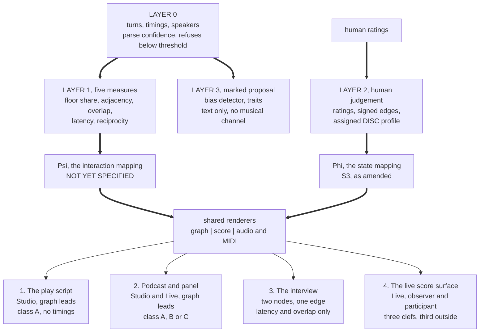

| Field | Value |
|:---|:---|
| Designation | MPN-S5 |
| Title | Decomposing dialogue: four use cases for one engine, and what each of them needs from $\Psi$ |
| Author of the theory | J. McKenney |
| Series | Paper 5 of the music and score path. S1 is the theory, S2 the mathematics, S3 the mapping, S4 the application, MPN-DESIGN-01 the engine and its four surfaces, MPN-PRD-01 the therapy instrument. MPN-S6 is the companion on communication and expression support and is written in parallel with this one [1], [2], [3], [4], [6], [5], [19] |
| Status | Draft, revision 3. Revision 2 was revised against the first half of `ARBITRATION-S5-S6.md` of 14 September 2026 [22]; revision 3 adds the three repairs that arbitration's second half, written 15 September, addressed to this paper at its rulings 8.1, 8.4 and 8.8. First issue. This paper was ruled out of scope in earlier planning and that ruling was wrong: the author has asked for this material twice, and it is what the private internal market for the dialogue line consists of. **The programme's standing caveat on its empirical position was added as section 0 on 14 September 2026**, placed ahead of section 1 so that a reader who opens the paper at a use case meets it, and one sentence was added in section 7.1 marking a claim that turns on a choice nobody has taken |
| Understanding Lock | Confirmed by the author, 13 September 2026. Equal peers on one engine from day one; one engine with several surfaces; the live score surface carries both observer and participant modes, built in. The four use cases below are peers of one another and of the Instrument, and none is a special case of another [6] |
| Rests on | MPN-DESIGN-01 revision 8 [6], which governs wherever the two could be read as disagreeing. No enumeration of this paper against the design has been made, so no claim is made that none exists. Through it, S1 to S4 [1], [2], [3], [4], the arbitration of revision 7 [7] and the author's decisions of 14 September 2026 [8] |
| Numbers | Every figure here is traceable to `05_DATA/03_generators/VERIFICATION-2026-09-14.txt` [9], to a run of one of the four named generators, or to a named paper in this series. The three were re-run in full for this paper on 14 September 2026 and their tables reproduce; section 8 carries forward the one generator defect the verification file records as outstanding [10], [11], [12] |
| Scope | **Theory and internal research on synthetic and published material.** The dialogue this engine decomposes is dialogue the programme generates, together with labelled script text. Nobody is recorded and nothing is placed on a market. Every requirement here is technical or epistemic, and the author's scope ruling of 13 September 2026 governs throughout [6] |

## 0. The standing caveat, which governs all four use cases

**No listener has been asked anything. Every empirical claim in this programme is untested.** The 31,078 scored rows and the 232 annotated frames this paper draws its figures from are both outputs of the system under study [4], [10]. The listening pack is built, blinded and published, and it has been sent to nobody. Two earlier listener studies exist and neither is citable, their stimuli having come from an unseeded generator [1].

**The sharp form of that for this paper is one sentence, and it is section 2's: every use case here describes a surface whose interaction mapping is not a function.** $\Psi$ has a domain, a codomain and, by the end of section 7.3, four stated obligations. It has no specification, no acceptance criterion, and no listener evidence that its codomain choices carry what they are meant to carry [6]. Section 2 says that once and does not hedge each section with it, which is the right way to write it. **It is said again here, and only here, because a reader who opens this paper at the play script or at the live score meets section 3 or section 6 and never meets section 2**, and would otherwise read four accounts of what a surface shows without meeting the fact that the mapping doing the showing has not been written.

**So read sections 3 to 6 for what they are.** None of them reports something that has been rendered, heard or judged. Each states what its user needs, which surface and renderer serve the question, what arrives from the material and what does not, and what that use case requires of $\Psi$, which is why each ends by saying what must be built first. That is a stronger thing to have than four descriptions of a working product would be, because it puts four necessary conditions on $\Psi$'s interface that are each forced by a measured fact rather than by preference.

## 1. What this paper is

MPN-DESIGN-01 specifies one engine, two mappings, four layers and four surfaces [6]. It does not say what anybody would do with them. This paper says, for four named users with four named questions, which surface serves the question, which renderer leads, what the material costs, what arrives and what does not, what the output looks like, what it refuses, and what has to exist first. It is a use-case paper and not a second design: where this paper and the design could be read as disagreeing, the design governs. Where the design's own text or its own generators count differently, which this paper records at items S5-2 and S5-8 of section 8, this paper names the discrepancy rather than choosing silently.

The four use cases are the author's own, in the author's own framing. A play script decomposed into a relationship network by a dramaturg or a director. A podcast or a panel read back by the producer or the organiser who ran it. An interview, two parties, asymmetric by construction. And the running score, which is the picture the author has drawn twice: a near real time transposition of dialogue on a screen, with the three clefs and the third outside, showing tension, and expressing primarily as music. Music therapy is the fifth peer and is MPN-PRD-01's [5]. Communication and expression support, which the author also raised, is MPN-S6 and is a non-clinical aid; it is cross-referenced here and is not duplicated here, because it asks a different question of the same engine and deserves its own paper [19].

**Why these four are one paper and not four.** They consume one engine. They share a state model, a renderer set, an explanation mechanism and a determinism guarantee, which is the whole of what the design means by one engine and is the rejection R1 records [6]. They share Layer 0 and its parse-confidence refusal, the Layer 1 measures and their declared settings, the four-kind refusal vocabulary, and the rule that every output carries a sentence in the reader's language naming which mapping produced it. What they do not share is arity, ingest class, whether the material is known before a note is rendered, which renderer answers the question, and whether a human has rated anything. Section 7 sets out both halves, because the Understanding Lock's equal-peers clause is a claim about the engine and not a claim that the four are the same job.

**A note on counting, made once here so that it is not made four times.** The design settles the Layer 1 measure count at **five**: floor share, speaker adjacency, overlap, latency and reciprocity, with backchannel a parameter of the overlap row rather than a measure in its own right [6]. Earlier material in this programme, and the brief this paper was written to, speak of six. The sixth is backchannel. Naming a sixth measure, with the decision it would require and the setting it would carry, is available to the author at any time and is not a designer's act; counting a measure the document has not defined is available to nobody, which is what decision D64 settles. This paper therefore says five everywhere and names backchannel where it matters, which is in the two use cases where a supportive listener would otherwise be scored as the aggressor.

## 2. The honest frame: $\Psi$ is not yet a function

**Every use case in this paper describes a surface whose interaction mapping does not exist.** Section 3 of the design gives $\Psi$ a domain, the observed measures of Layer 1, and a codomain, musical material, and says what it must not be: it is not $\Phi$, it is never described as $\Phi$, it renders the shape of an exchange, and it makes no psychological claim [6]. Those are constraints on a function. They are not a function. There is no specified $\Psi$, no acceptance criterion for one, and no listener evidence that its codomain choices carry what they are meant to carry. The design says so in section 10 and puts it first in its own implementation order, because three of the four surfaces consume it [6].

That is said here once, plainly, at the front, and it is not said again in each section as a hedge. What each section does instead is the useful thing: it states what that use case needs $\Psi$ to be, so that four of the constraints on $\Psi$ are stated and forced rather than left to be discovered. The four obligations are collected in section 7.3 and they are, in advance: $\Psi$ must be defined on a sub-domain and must render an absent measure distinguishably from a zero one; $\Psi$ must be defined at arbitrary speaker count with the dyad reduction taken before $\Psi$ rather than inside it; $\Psi$ must either be non-degenerate at two speakers or declare two speakers outside its domain; and $\Psi$ must be causal and incremental, computable turn by turn against a declared window. Those four are not preferences. Each of them is forced by a measured fact about one of the four use cases, and together they narrow the specification problem from "write a mapping" to "write a mapping satisfying four constraints and validate it against a generator that knows the answer." They narrow the interface and not the codomain. What musical material carries what relational quantity is untouched by all four, and it is the part that is actually open.

**Two further things belong in the honest frame and are not deferred.**

The first is that $\Psi$'s claim to make no psychological claim is untested and is the largest untested assertion in the design [6]. Its codomain is music, music is read affectively by construction, and the PRD's own evidence puts the major-happy and minor-sad association at 92 per cent in adults [5]. A producer whose panel renders harsh will read that as a verdict on the panel, and a line of text saying no claim is intended does not survive contact with a minor key. Listener testing of $\Psi$ for exactly that unintended reading is a condition of $\Psi$ shipping on **any** surface, which is decision D42, and what varies between the use cases here is the required result rather than whether the test is run [6].

The second is that the scope ruling is what makes $\Psi$ testable at all. A generator that decides a dialogue's relational structure before writing it, which is item 1 of the design's implementation order, is a ground truth, so the question "does $\Psi$ recover the structure the generator put in" has an answer rather than a judgement [6]. Every acceptance criterion this paper asks for is an accuracy figure against that generator, and setting the target is ordinary work once the generator emits turn onsets and offsets, which four of the five Layer 1 measures require.

## 3. The play script

### 3.1 The user and the question

A dramaturg preparing a production, or a director deciding a cutting. The text is fixed and they know it well. What they do not have is the relationship network as an object they can hold: who is in contact with whom across the whole work rather than inside the scene they are staging, where the weight of the speaking sits, which pairings carry the play and which exist once, and what a proposed cut costs the network rather than the word count. The question arrives as "show me the shape of this text", and the honest restatement of it is "show me the shape of the speaking in this text", because that is what a script carries.

### 3.2 Surface and renderer

**Studio**, and the **graph** leads.

One thing has to be said here because every later section leans on it. The graph is the design's primary renderer on Studio and on Live and it has no specification anywhere in this programme: no layout, no legibility budget, no declared quantity set and no coverage statement, and design section 10's inventory of what the design lacks does not list it [6]. Item 9 schedules a comparison between the two renderers and does not specify either. Every place below where this paper sends a user to the graph is a place where it is sending them to an unspecified object, and item S5-13 is what closes that.

Decision D34 names a primary renderer per surface and puts the graph first on Studio and on Live, on the ground that most named users of those two surfaces are not defined by musical literacy; the dramaturg and the director are two of the four users that decision is about [6]. The score and the audio are secondary here and the design records that demotion as evidence against its own thesis rather than as a user-interface decision, with item 9 of the implementation order as the test that settles it: a dramaturg, a director, a producer and a discourse researcher, given the graph and the score on the same material, asked which answered their question [6].

Studio ships first, and this use case is the reason. It needs no $\Psi$, no audio pipeline and no latency budget for its leading renderer, and class A is what the material already is.

### 3.3 Ingest class, and what it costs

**Class A, labelled text.** The design's class table names play scripts in the class A row alongside generated dialogue, on the ground that the labels are given, and puts the speaker error at none [6]. Attribution is exact and free. Nothing in the diarisation error literature reaches this use case at all.

**What it costs instead is timings.** A play script has none. Section 7.2 of the design states the consequence: two of the five measures are unavailable outright, floor share degrades to a line or word count, and reciprocity's window becomes a turn count rather than a duration [6]. The design also states, in section 6.1 and in decision D37, that class A is the weaker experience and that the product must say so rather than let a user discover it: a dramaturg who drops in the play they know best on day one reads a page of caveats and finds a line count [6]. That sentence is written about this user and it should not be softened here.

**A second cost is specific to the corpus this programme has.** Three of the seven score files are anthologies, holding eight, five and three works, and their speaker sets are disjoint casts counted as one [4], [10]. Re-running `s6_three_clef.py` reproduces the effect exactly: the Chekhov second series returns a top-two share of 8.2 per cent over 82 speakers, which measures the anthology and is not a coverage figure for any play in it [10]. The design's edge-case table gives the product's behaviour, which is that the speaker set is reported per contained work where a contents block is detectable, and a file the product cannot split is labelled a file rather than a work [6]. For this user that is not a technicality: a director who drops in a collected edition and is shown one network is being shown eight networks superimposed.

### 3.4 Which Layer 1 measures arrive

| Measure | On a script | Why |
|:---|:---|:---|
| Speaker adjacency | **Available, unchanged** | The only measure that needs no timings; it comes from the turn order [6] |
| Floor share | **Available in a changed unit** | Lines or words, never seconds. The unit is a named setting, declared on every output [6] |
| Reciprocity | **Available with a changed window** | The window is a turn count rather than a duration [6] |
| Overlap | **Unavailable** | A script records no simultaneity. There is nothing to threshold |
| Latency | **Unavailable** | A script records no gaps. There is nothing to time |

**The design counts this at three sites and two of the three agree.** Section 4.2's restatement rule, in the section that defines Layer 1, says two of five available from a script. Section 6.1 says the same. Section 7.2 says two of the five are unavailable outright, which leaves three [6]. The two sentences differ on whether reciprocity measured over a turn-count window is the same measure as reciprocity over a duration. Both readings are defensible and the design's own rule settles the practical question without settling the count: a script analysis and a podcast analysis are not the same measurement and the product says so on the output rather than placing them side by side in one report [6]. This paper uses section 7.2's reading, three available with two of them changed, because that is what its own tables and its own partiality obligation state; it records that the design's restatement rule at section 4.2 picks two, and resolving the two is item S5-2 and is the design's. In this paper's own terms: **adjacency alone survives unchanged, floor share and reciprocity survive in changed units, and overlap and latency do not survive at all**, and the output names the unit of each. Resolving the count to a single number is item S5-2 of section 8 and it is the design's to resolve, not this paper's.

**Backchannel does not arise here**, which is the one mercy of the class. The supportive-listener failure, where a raw overlap detector scores the most supportive listener as the most aggressive interrupter, needs overlaps to misread, and a script has none [6].

### 3.5 What the output is, and which half of it exists today

A graph of the full speaker set, with the play's speakers as nodes and adjacency as edges. Adjacency is rendered as adjacency and never as response, because nothing in a transcript marks an addressee; direction is retained in the data and the renderer's default is undirected, labelled "speaks next", which is decisions D35 and D39 together [6]. Node weight is the line-count floor share. Edge weight is adjacency count over the declared window.

Above it, a header carrying the mapping sentence in the reader's language, three parse-confidence numbers, the ingest class, the four named settings, the resolution floor where the ingest class has one, and the window [6]. Two of those four settings, the overlap threshold with its backchannel parameter and the latency turn-boundary rule with its medium field, govern measures section 3.4 has just shown are unavailable outright on a script, and the resolution floor has no definition on class A at all, being derived at design section 4.1 from a deployed diariser's error rate and class A having no diariser. The header states a setting as inapplicable where the material makes it so, and states that the ingest class has no resolution floor where it has none, which is the same distinction section 8a's four kinds already require. That header is the page of caveats decision D37 warns the dramaturg about, and it is correct, and the design's answer to it is not to hide it but to tell the user before the afternoon is spent.

**And where the two principal voices are chosen, a coverage figure, before the choice is made rather than after.** This is item LS-2 and it is a sorting rule rather than a warning [6]. The figures are measured, on the three of the seven score files that are single plays, and this paper re-ran them [10], [9]:

| Work | By lines, `s6_three_clef.py` | By turns, `s6_floor_share_units.py` | By words, same |
|:---|---:|---:|---:|
| A Doll's House | 69.2 | 64.6 | 71.0 |
| Hamlet | 50.1 | 40.4 | 53.2 |
| Macbeth | 39.0 | 30.0 | 42.3 |

The speaker counts on those three files are 14, 44 and 49 respectively, and they are retained here because sections 3.6 and 7.2 both use them [10].

**Counted in lines, two staves render between 39.0 and 69.2 per cent of a single play. Counted in turns the same three plays give 30.0, 40.4 and 64.6 per cent, and counted in words 42.3, 53.2 and 71.0, so the unit moves the headline by up to nine points and moves Hamlet across the half-way line.** [9], [10], [19]. Excluding the non-speaker token from the denominator gives 69.3, 50.8 and 40.0, so the range and the one of three survive the convention [9]. A director reducing Macbeth is told, while the choice is still open, that two staves will carry 39 per cent of it, and a work whose coverage is low is sorted into the first of the design's four refusal kinds, **your material**, whose stated action is real and immediate: use the graph, which carries the full speaker set whether or not the score does [6].

**What the graph carries that the score cannot.** The design deletes revision 7's claim that the third clef is the only place the other half of the material can go, and deletes it twice over: the corrected range is 39 to 69 rather than 8 to 69, and the third stave renders the relation of the *selected* dyad, so in Macbeth it adds the relation between the two busiest voices and says nothing about the other forty-seven [6]. For this user that is the decisive fact about which renderer to reach for, and it is why the graph leads.

### 3.6 What it cannot do

It cannot render a score today, because $\Psi$ does not exist. It cannot render a $\Phi$ stave unless the dramaturg rates a state, because $\Phi$ runs only where a human has rated one, and that is Layer 2 work the dramaturg has to do [6].

It cannot tell the dramaturg who is addressed. Adjacency is not response and the design forbids the product from implying otherwise, because every reader reads an arrow as a response [6].

It cannot tell two people who agree from a polite deadlock. $\Psi$ is content-blind and the two produce an identical Layer 1 signature; the design's edge-case table renders them the same and states it as a known limit [6].

**It cannot find the coalitions, at Layer 1.** Structural balance needs signed edges and nothing in the five measures produces a sign; two characters who interrupt each other constantly may be allies [6]. This is the limitation a dramaturg will feel hardest, because coalition is most of what a relationship network is for. The route is stated and it is not automatic: structural balance is **permitted at Layer 2 where a human signs the edges**, which is decision D40, and signing an edge is an ordinary analytic act for exactly this user [6]. It is prohibited at Layer 3, so no model proposes it.

It cannot tell the director whether a character leads or refuses. The two produce the same floor share, the same turn lengths and the same latencies, and no monotone function of turn structure separates them, which is decision D4 and is a withdrawal rather than a gap to be closed later [6].

It cannot give a large cast distinct voices through timbre. Running `s6_timbre_capacity.py` gives the inversion of the separation curve directly: at a perceptual resolution of 0.80 the channel holds fourteen characters, at 0.90 it holds ten, and the table stops at fourteen because that is where the curve was computed to [12]. A Doll's House at fourteen speakers is at the edge of the computed table; Hamlet at forty-four and Macbeth at forty-nine are off it entirely, and no figure exists for them. And the resolution itself is unmeasured, which is section 5b.5's experiment, so even the fourteen is conditional [6], [12]. Separately and independently, the timbre channel is not live at all today: the contrast map of S3 section 2.6 does not exist in the code in any form, there is no input path for a profile, the family selector is an argmax over the four coordinates, and the default puts every unnamed character at the centre of the reachable set, which is the one point the channel cannot carry [3], [6].

It renders no bias in music, which is decision D57 and the author's decision of 14 September 2026 [8]. The bias layer is a Layer 3 detector emitting marked text beside the Layer 0 turn.

### 3.7 What $\Psi$ must supply here, and what must be built first

**The obligation this use case puts on $\Psi$ is partiality.** Two of five inputs are permanently absent on this material and one more arrives in a different unit. A $\Psi$ that requires all five is undefined on every play script in the world. So $\Psi$ must be defined on a declared sub-domain, must state which sub-domain a given output used, and must render an absent measure **distinguishably from a zero one**. That last clause is not a courtesy: the design's own rule, which is general and is stated at section 4.1, is that a flat score from a failed parse and a flat score from a flat conversation must never look alike [6]. An absent overlap measure on a script falls under that rule. D28 is the same rule applied to below-floor differences on class C, which render as *unmeasured*, and it is named here as the precedent for how such a rendering looks rather than as authority reaching class A, where there is no diariser and therefore no floor.

**What must be built first**, named from the design's queues [6]:

Item 2 of the implementation order, the shared spine on class A, is the whole of this use case's dependency for its leading renderer: Layer 0 from labelled text, the five Layer 1 measures with their settings, Layer 2's rating store, the graph renderer, the four-kind refusal vocabulary, and the credential rule of section 7.3. Item 4, Studio on class A, is the surface. **LS-2**, the coverage sorting rule, is what puts the 39 per cent in front of the director while the choice is open rather than after it, and the coverage figure LS-2 shows is computed in whatever unit the floor-share setting currently holds, because showing a figure in one unit at the point where a different unit is selected is the defect LS-2 exists to prevent. Item 2's rating store is what makes D40's signed edges possible, which is the route to the coalition question. And **item 9** is the test that decides whether the graph or the score answered this user's question, which section 10 of the design says decides its own thesis and which no earlier revision scheduled.

Nothing in that list waits on $\Psi$. This is the one use case of the four that ships without it.

## 4. The podcast and the panel

### 4.1 The user and the question

A producer or an organiser reading back an exchange that has already happened. Unlike the dramaturg they did not write the material and, unlike the dramaturg, they were present. The question is almost always comparative and almost always about the middle of the exchange rather than its ends: who actually held the floor against who seemed to, where the exchange turned, who came in over whom, whether the moderator moderated or participated, and which pairing on the panel was the one worth having. The producer arrives with an intuition and wants it confirmed or broken.

### 4.2 Surface and renderer

**Studio** for the analysis, and the **graph** leads, for the same reason and under the same decision D34 as the play script [6]. The producer is the third of the four users item 9 puts the two renderers in front of.

**Live is also available on this material and that is a finding rather than a convenience.** The correct scoping of the running score is not by ingest class but by **whether the material is known in advance**, which is decision D52 as the arbitration rescoped it [6], [7]. A recorded exchange is known in full before a single note is rendered, so the score is computed ahead and played against the dialogue, which is what a film score is. A producer reviewing last week's panel is therefore in exactly the position the author's picture describes, and no latency argument reaches them. That is the least obvious thing in this section and it is worth the producer knowing: the running score is available on recorded material today in principle, and what blocks it is $\Psi$ and nothing about the recording.

One rule travels with the precomputation and constrains what may be shown. **Every quantity rendered at a turn is a function of that turn and of turns before it, and of nothing after it**, which is decision D66; whole-work precomputation is a convenience of the implementation and not a licence to see forward, and a measure that genuinely needs the whole work, such as a normalisation over total speaking time, is labelled a whole-work quantity and is not rendered as a running one [6]. A producer watching the score run past minute four must not be shown a floor share that already knows about minute forty.

### 4.3 Ingest class, and what it costs

This use case is the one where the class question decides everything, and the producer usually has a choice they do not know they are making.

**The labelled transcript with timings is class A and is the cheapest good path.** A producer who kept the edit decision list, or who has a per-speaker labelled transcript carrying onsets and offsets, is in class A with timings and carries all five measures. The cost is a caveat rather than an error: the design requires the **medium to be recorded** on the latency setting, because edited podcasts remove pauses, video calls add jitter, and subtitle timings are a translator's artefact [6]. A latency distribution computed over an edited podcast is a measurement of the editor. That is not a reason to suppress it; it is a reason to label it, and the design's edge-case table suppresses timing measures outright only where the timings are a subtitler's [6].

**The multitrack is class B, one channel per speaker, and speaker error is near none because attribution is the channel** [6]. It is the class the design calls Studio's first good experience. Two things must be said with it and the design says both. Class B removes the attribution problem and does not remove the recognition problem: meeting-benchmark word error of 35 to 46 per cent is a recognition figure and survives the move to one channel per speaker unchanged, because recognising the words is the same job on one channel as on four [6]. And **class B is future work if real audio is ever used**, which section 4.1, section 7.6 and item 6a of the implementation order all repeat, and which this paper repeats here rather than leaving to be discovered two sections away [6].

**The published podcast, one mixed file, is class C, and the panel is precisely the material class C is worst on.** The design's stated position is this, and it carries no reference for any of the four figures [6]. Three of the four have since been traced to a single published streaming diarisation benchmark run on DIHARD III, which supplies the 19.8 figure, both of the vendor figures at 39.1 and 39.2, and the missed-speech finding as well [23]. The fourth, the meeting-benchmark word error range, is traced to no publication and is recorded in this paper's ledger as unsourced; the tracing at source belongs to the design and is item S5-12. The best published streaming diarisation error rate on DIHARD III is 19.8 per cent; the two vendors bundling diarisation with transcription are at 39.1 and 39.2 per cent; meeting-benchmark word error runs from 35 to 46 per cent; and a 2025 benchmark scored with overlap included finds missed speech the dominant failure across all models [6]. At a fifth of speech mis-attributed, a true 60/40 floor share is not distinguishable from an even one, which is the producer's most common question answered with a shrug. Four consequences follow and all four are the product's stated behaviour rather than advice. A resolution floor is declared and differences below it are rendered as **unmeasured**, worded as *this recording cannot tell you*, and visibly distinct from any rendering of an even exchange, which is decision D28 [6]. **The overlap-derived measures are not computed at all on class C**, which is decision D17, because no live API returns per-segment diarisation confidence so a confidence gate has no input, and because diarisation is worst exactly at overlap and many pipelines assign an overlapped span to one speaker, which deletes an interruption rather than mis-scoring it [6]. The analysis **opens** by saying so, ahead of the content rather than in a footnote, which is decision D29, because interruption is the dynamic most users of a single-microphone recording are trying to read [6]. And **class C does not carry a multi-party surface at all**: a panel of five on one microphone is the material those error rates are measured on [6].

The producer's practical reading of that paragraph is short. If you have the multitrack, keep it. If you have only the mix of a panel, there is no surface: design section 4.1 rules that class C carries no multi-party surface, and the refusal is sorted as **your ingest class** with the one action being a per-speaker capture. On a two-party mix the engine will tell you about the floor at a stated resolution and will refuse to tell you about interruption, and that refusal is the honest answer rather than a missing feature.

### 4.4 Which Layer 1 measures arrive

| Measure | Class A with timings | Class B, multitrack | Class C, mixed, which carries no multi-party surface at all |
|:---|:---|:---|:---|
| Floor share | Available, in seconds | Available, synchronous from channel timings | Available only above the declared resolution floor |
| Speaker adjacency | Available | Available, synchronous | Available, degraded by attribution error |
| Overlap | Available, from the source | Available, from the source | **Not computed at all** [6] |
| Latency | Available, medium recorded | Available, synchronous | Degraded; the boundaries are the diariser's |
| Reciprocity | Available | Available, synchronous | Degraded by the same attribution error |
| Backchannel, the overlap row's parameter | Available, lexicon declared and editable | **Trails**, because classifying an overlap as supportive means matching a word list | Does not arise; overlap is not computed |

The class C column is what a class C analysis of a two-party exchange carries. At the three to eight speakers this use case is defined by, design section 4.1 rules that class C carries no multi-party surface, so the column has no instance on this use case's own arity [6].

**The split inside class B is the design's and it is sharper than a class boundary.** On a live capture a per-speaker microphone carries a **synchronous $\Psi$ score**, because floor share, adjacency, latency, overlap and reciprocity are computed from channel timings and need no words at all: the engine knows who started talking and when without knowing what was said [6]. What is not synchronous is anything requiring the words, which is every Layer 3 output, since a bias proposal is about what was said, and any overlap classified as a backchannel, since the backchannel lexicon is a word list. A live surface may therefore run a synchronous $\Psi$ stave beside a trailing word-dependent one, and it says which is which on the face of the output [6].

**The backchannel lexicon matters more here than anywhere else in this paper.** A panel is full of supportive listening and a raw overlap detector scores the most supportive listener as the most aggressive interrupter [6]. The design makes the lexicon a declared and editable setting, which is an expert act, and the producer is one of the few users in this series who can plausibly perform it. Two limits on that, both from MPN-S6's section 4 and neither of them about the producer's competence [19]. The list the producer edits is right for the speech community it was built against and not for the language, so it does not travel between communities inside a language, which is the design's own record at section 4.2 [6]. And a backchannel lexicon is a keyword counter, which is the object S4 found read as a measurement through three revisions of a paper, so an edited list ships this programme's own worst precedent alongside its most useful mitigation. The mitigation is still worth having on this use case, because the producer is the user who can inspect it; it is worth having labelled.

### 4.5 What the output is, and which half of it exists today

A graph of the full panel, which is what the score cannot carry and what the producer's question is mostly about. Node weight by floor share in seconds, edges by adjacency over the declared window, with the busiest speaker's position in the graph visible rather than inferred.

Beside it, the two measured quantities that bear directly on how a panel reads, both re-run for this paper [10]:

| Score file | Turn changes | Dyad churn | Distinct dyads | Busiest speaker's share of active pairs |
|:---|---:|---:|---:|---:|
| A Doll's House, single play | 1,281 | 9.4 per cent | 19 | 87.0 per cent |
| Miss Julie file, anthology of 5 | 2,010 | 8.8 per cent | 49 | 25.6 per cent |
| Oedipus file, anthology of 3 | 1,234 | 16.6 per cent | 41 | 62.4 per cent |
| Hamlet, single play | 1,100 | 30.7 per cent | 93 | 61.6 per cent |
| Macbeth, single play | 674 | 43.7 per cent | 137 | 42.7 per cent |
| Cherry Orchard file, anthology of 8 | 2,310 | 44.1 per cent | 253 | 10.2 per cent |

**Dyad churn runs from 8.8 to 44.1 per cent**, nowhere near the rate a flickering stave would need, so an active pair pinned to a third stave would be a stave rather than a flicker [10], [6]. **The busiest speaker sits in 10.2 to 87.0 per cent of all active pairs**, measured on six Gutenberg play files, three of them anthologies and none of them a moderated exchange. It is the number decision D10 turns on and it is not the number this use case turns on, which is what a moderator does to the dyad structure of a panel and which this corpus cannot supply. In an exchange with a dominant voice, an automatic active-dyad rule renders that voice against everyone else for most of the runtime and discards the clash the producer came for. That is why the active-dyad reduction is a **user act** and not an automatic one, which is decision D10, and its justification is now a number rather than an argument [6], [10]. What D10 does not supply is how the producer performs the act it protects. On a panel of five there are ten pairs and on six fifteen, and this paper specifies no ordering, no preview and no rule over them, so the producer selects, renders, looks and selects again. The quantity that would support the act is already computed and already drawn: adjacency count over the declared window is the edge weight of the graph above, and a pair whose weight the producer did not expect is the pair worth rendering. Turning that into a selection aid is item S5-16 and it is not proposed here, because specifying a renderer is the design's work and the graph has none, per section 3.2.

**And here is the limit that belongs to this use case above all the others, stated rather than buried.** These are seven Project Gutenberg score files and **none of them is a moderated exchange** [6], [10]. Three of the six are anthologies, and the extremes of both ranges sit on an anthology at one end and a two-hander at the other. So the figure the panel producer most wants, what a moderator does to the dyad structure of a panel, is the figure this corpus cannot supply. The range 10.2 to 87.0 does not corroborate a claim about moderated panels; it corroborates the general shape of the objection D10 was withdrawn on. What would supply it is item 1 of the implementation order, a synthetic dialogue generator whose relational structure is decided in advance, writing moderated exchanges with the moderator's role known, and that is item S5-3 of section 8.

The coverage figure appears where the two principal voices are selected, as in section 3, and on a panel of five or six it is the producer's decision rather than the engine's.

### 4.6 What it cannot do

On class C it cannot tell the producer whether anyone talked over anyone, and it says so before it says anything else [6].

It cannot tell agreement from a polite deadlock, for the same reason as section 3.6.

It cannot tell the producer who was addressed. On a panel this is a sharper loss than on a script, because an addressee is most of what a panel exchange means, and adjacency is what the transcript carries.

It cannot rank the panellists against a tested reading. The design carries per-person measures in full, including a named comparison on a shared display, because the restriction two earlier revisions placed on them rested on a premise the scope ruling removes, which is decisions D55 and R7 [6]. What it also records, and this paper carries forward rather than softening, is that the listener test of D42 covers the affective reading of the interaction mapping and **does not cover a named per-person comparison**, which is a separate question with no test attached to it [6]. So a named comparison is permitted, is not tested, and is recorded as untested. MPN-S6 took the opposite position for the musical channel on the same scope hole, and the arbitration recorded the disagreement as its decision 9.2 [19], [22]. **The author settled it on 15 September 2026 in the direction of permission, on every surface and on the stave** [24]. So both papers now permit the named comparison, both carry it as untested and labelled, and extending D42's scope to cover it is a test to run rather than a choice to make. The reach of the permission is wider than this use case: a persona may be an actor, a character in a play, a speaker in a podcast or any persona a score carries, and a score carries several, added and removed as the material requires, which `MPN-NOTE-06-persona-scaling.md` computes the cost of [25].

It cannot render a bias in music. On this use case that is the most conspicuous gap in the whole design, because a producer reading a panel is closer than any other user in this paper to the author's original ask, which was to express biases and psychometric traits. What exists instead is the Layer 3 detector: a marked textual proposal beside the Layer 0 turn that prompted it, never rendered without that turn and never alone on screen [6], [8]. The Atlas distributes across four domains as Perception 8, Decision 10, Social 6 and Memory 6 [3], [15]. Running `s6_bias_layer.py` gives the shape of what that detector would cover: thirty of thirty now naming a state coordinate with the BL-1 draft loaded, of which three rows are flagged as genuinely undecided and are the author's; eighteen distinct signatures, eight of them carrying more than one bias and twenty of thirty entries involved in a collision; and **twenty-two of the thirty detectable within a single frame against eight needing material heard earlier** [11], [9]. The eight are survivorship, the gambler's fallacy, groupthink, the peak-end rule, choice-supportive bias, outcome bias, recency and the planning fallacy [11]. Under BL-2's provisional Option A remap of the one entry written to set the mode, the partition becomes twenty-one and nine, and both figures are reported because the remap is provisional and the author may take Option B instead [6], [17]. For a panel that partition is directly useful: groupthink is one of the eight, so a detector fires on it only against material it has already heard, and the unit of test for it is a pair of passages rather than a turn.

It cannot tell the producer what a moderator does, for the corpus reason above.

### 4.7 What $\Psi$ must supply here, and what must be built first

**The obligation this use case puts on $\Psi$ is arity.** A panel is not two people. $\Psi$ must be defined at arbitrary speaker count, and the reduction to a dyad must happen **before** $\Psi$ rather than inside it, because the reduction is a user act under D10 and a mapping that reduces internally has taken that act away from the user [6]. Two clauses follow. Every whole-exchange normaliser $\Psi$ uses, total speaking time above all, is a whole-work quantity under D66 and is labelled as one rather than rendered as a running value [6]. And $\Psi$ must accept a declared resolution floor as a parameter, so that a class C analysis renders *unmeasured* through the mapping rather than around it.

**What must be built first.** Item 3, specify $\Psi$ and validate it against the generator, unblocks everything musical here [6]. Item 2's spine and item 4's Studio carry the graph. **Item 6a, live capture, class B first and then class C with its resolution floor and suppressed overlap measures, is future work if real audio is ever used**, and it is sequenced by measured error rather than by any gate [6]. **LS-2** puts the coverage figure at the point of selection. **D42's listener testing** gates $\Psi$ on this surface as on every other, and this is the surface where the required result is most demanding, because the producer will read a harsh rendering as a verdict on a panel they convened. And item S5-3, generated moderated dialogue, is what would let the design say anything about moderators at all.

## 5. The interview

### 5.1 The user and the question

Two parties, asymmetric by construction: one asks and one answers, and the asymmetry is the form rather than an accident of the occasion. The reader may be the interviewer reviewing their own work, a researcher reading a set of interviews, or the author. The question is about the asymmetry: how is it carried, how far does it go, where does it slip, and what does it look like when the answering party takes the floor back.

This is the case closest to the two-node instrument and it is worth the comparison, which is section 5.6.

### 5.2 Surface and renderer

**Studio** retrospectively, and **Live** where the material is known in advance, which on a recorded or generated interview it is. **The graph leads on both, under decision D34, and that ruling stands here as it stands everywhere**; what this section adds is a prediction about the test that is already scheduled against it rather than an exception to it.

The prediction is this. D34's ground is a claim about users: most named users of Studio and Live are not defined by musical literacy, so the graph answers their question and the music does not [6]. At two speakers there is a second and independent fact the ground does not reach, which is that **a two-node graph carries one edge**. The renderer that leads everywhere else in this paper has one node pair and one line to draw, and the quantities the reader came for, latency and overlap, are properties of that single edge over time rather than of the network's shape. Meanwhile two speakers is exactly the size the three-clef layout is built for: two $\Phi$ staves and one $\Psi$ stave, with no selection problem at all. So the interview is where the demotion of the score is least likely to be borne out, and item 9 of the implementation order is where that is settled rather than argued. Item 9 as written names a dramaturg, a director, a producer and a discourse researcher, and it does not name a reader of interviews; extending it is item S5-7.

### 5.3 Ingest class, and what it costs

The same three classes are available and the ranking between them is steeper here than anywhere else in the paper, for a reason section 5.4 makes exact: at two speakers almost all of the Layer 1 content is in the timings, so a class that loses the timings loses everything.

A scripted or transcribed interview without timings is class A and is free of attribution error. A recorded interview with two microphones is class B, near-exact attribution, future work if real audio is ever used [6]. A recorded interview on one microphone is class C. It would be natural to assume that two speakers are the easy case for a diariser and that class C is therefore tolerable here, and this paper does not assume it: **the design carries no error figure broken down by speaker count**, the published rates it quotes being corpus-level and measured on multi-party material, so nothing in the evidence base licenses a narrower claim for two speakers than for five [6]. The class C rules therefore apply here unchanged, and the one that bites is decision D17: overlap is not computed at all on class C, and overlap is one of the only two informative measures this use case has.

### 5.4 Which Layer 1 measures arrive, and the degeneracy that governs this section

**At two speakers, three of the five Layer 1 measures carry no information, by construction and not by accident.** The design states it in section 6.3, in the course of refusing the claim that the Instrument is the engine at N equals two: adjacency is deterministic, reciprocity is 1 by construction, and floor share is one number and its complement; latency and overlap still carry information [6].

| Measure | At two speakers | Why |
|:---|:---|:---|
| Speaker adjacency | **No information** | The only possible sequence is alternation. The single edge is known before the material is read |
| Reciprocity | **No information** | It is 1 by construction |
| Floor share | **One degree of freedom** | One number and its complement, so it is a scalar rather than a distribution |
| Latency | **Informative** | The gap before taking the floor is the interview's own material |
| Overlap | **Informative** | Who comes in over whom is where the asymmetry breaks |

**Compose that with section 3.3 and the result is the sharpest fact in this paper.** Both of the two informative measures are timing quantities, and a script has no timings. **So a scripted interview, or an untimed transcript of one, yields one scalar and nothing else.** Adjacency is alternation and reciprocity is 1, both carrying nothing; floor share survives as one degree of freedom in a changed unit, a line count and its complement; and the two measures that would have carried the asymmetry, latency and overlap, are absent. This is not a degradation to be flagged on the output; it is an empty Layer 1, and the design's four-kind refusal vocabulary sorts it into **your material** with a real action attached: bring timings, or accept that the reading is a Layer 2 and Layer 3 reading rather than a Layer 1 one [6].

The consequence for the class ranking is exact. A generated interview carrying the generator's own onsets and offsets, which is what item 1 of the implementation order must emit, carries two informative measures. Class B carries the same two. Class C carries at most one, latency, and that one degraded, because its turn boundaries are the diariser's; overlap, the other one, is not computed. And class A without timings carries none.

### 5.5 What the output is, and which half of it exists today

Two $\Phi$ staves and one $\Psi$ stave, with the selection problem absent. Coverage, which decides so much of sections 3 and 4, is **100 per cent by construction** here: the top two speakers are all the speakers, so LS-2's figure is trivially complete and D53's question shrinks from *which voices* to *which quantities per stave* [6]. That shrinkage is worth stating positively, because it means the interview is the one use case in this paper where the three-clef layout renders the whole of the material rather than a measured fraction of it.

On the $\Phi$ staves, a state a person rated, with the sentence saying so on the face of the output [6]. Nobody can make that rating today. $\Phi$ runs only where a human has rated a state, the rating apparatus this programme owns is the Instrument's and does not travel, and no instrument exists that would let a reader of interviews rate the nine-component state: no gradient definitions written for a non-clinical rater, no anchors, no scale and no worked example. That is item S5-14, and it is a larger obstacle on this use case than $\Psi$ is. On the $\Psi$ stave, the relation, which is where the asymmetry would land.

**And the timbre channel is at its maximum here, exactly.** Running `s6_timbre_capacity.py` gives the reachable set as a rhombic dodecahedron of diameter 2, and the two-character maximum separation as **2.000000, the full diameter**, attained by any pair of profiles differing by minus one, minus one, plus one, plus one on the four DISC coordinates; the profiles (1, 1, 0, 0) and (0, 0, 1, 1) are the most audibly separated pair there is [12]. The inversion table makes the consequence plain: the channel holds two characters at every perceptual resolution up to 2.0, where it holds six only at a resolution at or below the square root of two, 1.4142 [12]. **So the interview is the only cast size in this paper immune to the unmeasured resolution of section 5b.5**, because any resolution finer than the diameter of the whole space suffices for two. That is an exact result and it is the strongest positive thing this paper can say about the timbre channel on any use case.

Two qualifications travel with it and neither is small. The channel is **not live today** for anybody, because the contrast map does not exist in the code, there is no input path for a profile, the family selector is an argmax, and the default puts every unnamed character at the centre of the reachable set, which is the one point the channel cannot carry [6], [3]. And the assignment rule still binds: never assign two characters profiles that differ by a constant, because the null direction of the map is overall profile magnitude and a pair differing only in magnitude renders identically however far apart their DISC scores look on paper [12], [3].

Everything above this line waits on a Layer 2 rating; everything below it waits on $\Psi$ as well.

Beside the staves, the bias layer's marked text against the Layer 0 turn, with the twenty-two frame-local entries scorable per turn and the eight historical ones scorable only as passage pairs [11].

### 5.6 The comparison with the two-node instrument, which is why this case is here

The interview and a therapy session have the same arity and share an engine, and they are not the same thing at all. The design is explicit that the Instrument is **not** the engine at N equals two, and sets out what it does and does not share: it shares the renderers, the state model and the explanation mechanism, and **it does not use Layer 1 in any load-bearing way** [6]. The interview does. That is the whole of the difference and it is instructive in both directions.

Reading it toward the Instrument: three of the five Layer 1 measures are degenerate at two speakers, which is why a therapy surface can afford to ignore Layer 1 and rest on Layer 2. Reading it toward the interview: the two measures that survive, latency and overlap, are exactly the two the Instrument does not need and the two a class C recording destroys.

**One piece of structure genuinely crosses between them and it is the design's infrastructural unification rather than a semantic one.** Bruscia defines the Autonomy gradient over the relationship between improvisers, so it is naturally recorded as a directed edge, and a rating instrument shaped that way serves a two-node session and an N-node panel without redesign [6], [20]. That is a fact about the rating surface. It is not a shared semantics between a human rating and a derived quantity, because there is no derived quantity: the derivation of Autonomy from turn structure is withdrawn, since Leader and Resister are not separable by any monotone function of timings [6]. A rater can sign the edge and rate the gradient; the engine cannot infer either.

**And the withdrawal lands on this use case harder than on any other, because the interview's central question is the withdrawn one.** Whether an interviewee is leading or refusing, whether an interviewer is guiding or dominating, is precisely the Leader against Resister distinction, and it is a Layer 2 question by ruling rather than by present limitation. What the mapping that survives does give is worth having, and the design's section 11 says why it survives the withdrawal that killed its sibling: the human-rated table is not monotone, running a path from Imaginary toward Symbolic and then stepping off it to send Resister to the Real, so it separates precisely the two gradients the derivation could not, by sending them to different vertices rather than to different points on a line [6]. Partner takes the barycentre and gets no dead band, and must not have one, because a dead band would hold whatever register the preceding gradient selected: a client or an interviewee moving Resister to Partner would sound Real and one moving Dependent to Partner would sound Imaginary, and the same state would sound like two different things depending on where it came from [6].

### 5.7 What $\Psi$ must supply here, and what must be built first

**The obligation this use case puts on $\Psi$ is that it must not be degenerate at two.** A $\Psi$ that is a symmetric function of all five Layer 1 measures returns a constant on every interview in the world, because three of its five arguments are constants at that arity. There are exactly two admissible answers and choosing between them is a bounded job. Either **$\Psi$ at two speakers is a declared function of latency and overlap alone**, with the other three measures documented as carrying no information at that size and the output saying so; or **$\Psi$ declares two speakers outside its domain** and the interview is served by $\Phi$, Layer 2 and Layer 3 with no $\Psi$ stave, which is a coherent product and is close to what the Instrument already is. What is not admissible is a $\Psi$ that renders a constant and lets the reader take it for a finding, which is the design's own rule against a flat score from a degenerate input looking like a flat score from a flat exchange [6]. That is item S5-5.

**What must be built first.** Item 1's generator, **with turn onsets and offsets**, because without them this use case has no Layer 1 content whatever and item 3 can validate one measure [6]. Item 2's **rating store**, because the interview's central question is a Layer 2 question by ruling and the rating is the answer rather than a supplement to one. Item 3, $\Psi$, under the non-degeneracy obligation above. Item 5's Layer 3 detector with **BL-1 and BL-2 first**, because a device with no coordinate cannot be planted and a device written to set the mode cannot be scored against assertion A4 [6], [11]. And **D24's golden-output regression suite over the $\Phi$ path**, running in continuous integration against both the pinned build and head, because this use case renders two $\Phi$ staves on an engine the Instrument pins, and this programme's demonstrated behaviour under divergence is to fork [6], [4].

And the state mapping's own unfixed parameters, which this paper counts in its information budget and does not otherwise name: the interpolation margin $\delta$, which blocks the mode channel and through it every $\Phi$ stave; the function $f$ inside the harmonic parameter, item S3-12, which the author's decision of 14 September 2026 left unnamed [8], [17]; and a register triple that is not fixed before a rating reaches it. Neither $\delta$ nor $f$ is in the design's implementation order, both are in its section 10a as what it still owes, and neither is closed.

And the four settings that decide this use case's only two answers: latency's turn-boundary rule and its medium field, and overlap's threshold and whether backchannels count. None has a value in any document, and on this use case they govern both surviving measures rather than one of three. That is item S5-22.

## 6. The live score surface

### 6.1 The user and the question

The author's own picture, and the user is anybody watching an exchange run: a near real time transposition of dialogue on a screen, with the score there instead of the words, three clefs and the third outside, showing tension, and expressing primarily as music. The question is not analytic and should not be made analytic: can I read the shape of this while it is happening. The reader is not asking for a number. They are asking whether the exchange has a shape a person can follow in the moment.

**Both modes are built, as locked.** The observer mode renders to an analyst; the participant mode renders the same surface, while the exchange is running, to the exchange's own participants. The Understanding Lock asks for both from day one and the design restores the participant clause in full, because the restrictions two earlier revisions placed on it rested on a premise about real people in a real room and on generated material there is nobody in the room [6]. The same sentence is why the mode has no reader today. On the material the scope ruling makes primary the participants are generated and read nothing, so participant mode is specified, built and gated on $\Psi$ alone, and its reader within scope is the generator itself under DC-1, which section 6.6 sets out. Its human reader arrives with a live capture, which is future work if real audio is ever used.

### 6.2 Surface and renderer

**Live**, and under decision D34 the **graph** leads here too. This paper states that squarely rather than stepping over it, because it is the one place where the design's own ruling sits at an angle to the author's picture: the picture is a score, and the design's renderer ruling puts the graph first on the surface the picture describes. The design does not hide this either. It records the demotion as **evidence against the thesis of its own section 1, not as a user-interface decision**, and item 9 of the implementation order is the test that settles it [6]. The honest position for this paper is that the score is what this use case is for, the graph is what the design currently leads with, and the question of which is right is scheduled rather than argued.

**No class is described as captioning, and the picture survives the word going.** A score computed ahead and played against known material is a **synchronisation** problem whatever the reader experiences, which is decision D67, and the framing is delivered by the synchronisation rather than by the word [6]. The surface describes itself as a running score rendered against the dialogue.

### 6.3 Ingest class, and what it costs

**The partition that matters is whether the material is known in advance, not the ingest class**, and the difference is the difference between a rule that is true and a rule that is false on one of the two classes it names [6], [7]. Generated material and recorded material are known in full before a note renders, so the score is computed ahead and played against the dialogue. That removes the latency objection to the author's picture on exactly the material the scope ruling makes primary, and it removes nothing else: what blocks the picture is $\Psi$, which does not exist, and on the two state staves a Layer 2 rating, which nobody on this surface has made.

On a live capture the split runs inside the class rather than between classes. A per-speaker microphone, class B, carries a **synchronous $\Psi$ score** from channel timings, because the five Layer 1 measures need no words; what trails is everything needing the words, which is every Layer 3 output and any overlap classified as a backchannel [6]. So the surface may run a synchronous $\Psi$ stave beside a trailing word-dependent one and says which is which on its face. Class C carries a resolution floor, computes no overlap measures at all, opens by saying it cannot tell you about interruption, and carries no multi-party surface [6]. Both live classes are future work if real audio is ever used [6].

The causal rule of decision D66 binds the precomputation, as in section 4.2: everything rendered at a turn is a function of that turn and of turns before it, and a whole-work quantity is labelled as one [6].

### 6.4 Which Layer 1 measures arrive

On material known in advance and carrying the generator's own onsets and offsets, all five, with backchannel available as the overlap row's parameter. On a class B live capture, all five synchronously with backchannel trailing. On class C, floor share above the floor, degraded adjacency and reciprocity, degraded latency, and no overlap.

**The default the surface renders if the user chooses nothing is stated, and this is where those availabilities bite.** Decision D69 gives LS-3 a default set and a one-screen budget: **dynamics and tempo on each $\Phi$ stave**. The design justifies that pair as the two channels whose event densities it measures, which is a statement about what the programme measured rather than about legibility, and section 6.5's measurement cuts against half of it: the dynamic marking changes on one row in twenty-two while metre, which the pair displaces, changes on one in four. Whether a near-frozen line is the right default because its excursions are rare, or the wrong one because a reader cannot track a line that does not move, is not settled anywhere and is item S5-17. The other half of the default is **floor share and adjacency on the $\Psi$ stave**, which are the two Layer 1 measures that need neither timings nor an overlap detector, and are therefore the two that survive the largest number of ingest classes in some form. They do not never blank: on class C a below-floor floor share renders as unmeasured under D28 and adjacency is degraded by attribution error, and at two speakers both are degenerate [6]. That default set is stated for a multi-party surface and it is degenerate at two speakers, which is the arity of use case 3 and of the two principal voices on this one. At two speakers adjacency is deterministic and floor share is one number and its complement, so a user who opens no configuration is shown one degree of freedom and one constant, and latency, the one measure that is not degenerate at that size, is not in the default. Item S5-20 is who fixes it. A user who never opens the configuration gets a defensible score rather than an empty one, the default is preselected, every alternative states what it displaces rather than being offered as a free addition, and the selection is reversible without re-ingest under D36 so the cost of choosing wrongly is a click [6]. That is an answer about one person at one screen and this surface has several readers. In participant mode the chooser configures and the participants read, and a reader who did not choose is shown the two or three declared quantities and nothing about the eleven to fourteen that were displaced, because the sentence naming what an alternative displaces belongs to the configuration screen. And the click is not costless mid-session: changing which quantities a stave carries while a reader is tracking it silently rewrites what they have been tracking, which is the same object as the mid-session relabel section 6.6 records the design as refusing, and for the same stated reason. This paper does not resolve it. Item S5-18 does.

### 6.5 What the output is, and which half of it exists today, and what has been measured about whether it can be read

Three staves. Two for the two principal voices, each rendering that voice's state through $\Phi$. A third, set apart, rendering the relation through $\Psi$: the author's third outside, and where the tension lands, tension being a property of the exchange rather than of either speaker [6].

**The bias is not there.** The layer renders nothing in version one and occupies no musical channel, which is the author's decision of 14 September 2026 taken as option (e), with a stated reopening condition rather than a permanence clause [8], [6]. Running `s6_bias_layer.py` prints the census that made that decision forced rather than cautious: every one of the eight channels the thirty devices were written for is a channel $\Phi$ already sets, TEXTURE 8, HARMONY 7, MELODY 6, RHYTHM 3, DYNAMICS 3, TIMBRE 1, MODE 1 and INTERVALS 1, totalling thirty, and $\Phi$ maps the state onto the whole musical surface so a bias rendered in music would necessarily have been a second writer to an occupied channel [11], [6]. The cost is recorded rather than softened: this defers for a second time a capability the author asked for twice, it removes half of the framing sentence this section began with, and the layer meant to be the most musical thing in the design is the one thing on Live that is not music [6], [8]. What the surface carries instead is the detector's marked text beside the Layer 0 turn, and BL-5 and BL-6 are the detection rate on which the channel question reopens.

**Event density, which is what a reader is asked to track.** Under S3's normative laws, over the 27,653 rows retained after the King Lear file is excluded, the dynamic marking changes on **4.5 per cent** of rows, the tempo band on **33.9 per cent** and the metre on **26.6 per cent** [9], [10]. This paper re-ran `s6_three_clef.py` and reproduces 4.4952, 33.8963 and 26.6491 per cent [10]. The exclusion is the design's own rule applied to its own evidence: the King Lear file carries 3,425 rows of which 3,424 are assigned to the non-speaker token, so it is a file the product this design specifies would refuse, and 31,078 rows are read, 3,425 excluded and 27,653 retained [10], [4].

Read those rates with the levels beside them. Dynamics reaches all eight markings and changes on one row in twenty-two. The tempo band reaches three bands, which is **two cuts and not three**, slow on 19,568 rows, middle on 7,517 and fast on 568. Metre reaches **four of its five labels and never reaches common time**: m2 on 23,086 rows, m3 on 3,229, m4 on 1,182, m5 on 156 and m1 on none, because no row carries entropy below the floor, so the four labels reached exclude the ordered end of the scale and a reader of this channel never sees the state the notation would use for order [9], [13]. So the picture a reader gets is one near-frozen line and two lines changing on a quarter to a third of rows.

**Two things must be said about those figures before anybody designs to them, and the design says both.**

The first is provenance. All three are properties of one generator's output distribution rather than of S3's laws. The columns came from `mpn_engine`, which implements no psychology on the path that produced them: trauma is a row-position ramp plus keyword hits and entropy is a punctuation tally [4], [6]. `ENTROPY_H` takes fourteen distinct values over the corpus and is exactly 0.3 on 22,611 rows, 72.8 per cent, and 9,482 of the 10,020 tempo-band changes have 0.3 on one side, 94.6 per cent [9], [10]. A channel sitting at one value for nearly three quarters of its rows is a constant with spikes, and these figures measure how often that generator's spikes cross a cut.

The second is the explanation, and this paper states the corrected version because the obvious one is deleted. **It is true in the theory that trauma ratchets and entropy does not**: S1's definition gives trauma no way to decrease, so any musical parameter monotone in trauma can only rise across an act, while nothing constrains entropy that way [1], [3]. **It is not true that this asymmetry explains the measured spread between the channels on this corpus, and the sentence claiming it is deleted rather than hedged, because the corpus refutes it directly.** On this corpus the dynamic marking **falls on 597 of 27,416 within-speaker steps** against **827 rises**, and the raw column beneath it falls on **822** of the same steps [9], [13]. A quantity that falls on 822 of 27,416 steps does not ratchet. The column is a row-position ramp with keyword bumps rather than the theory's trauma, and S4 records the two as coinciding without either being evidence for the other [4]. So the design keeps the theory's asymmetry, keeps the measurement, and keeps neither this corpus as evidence for the mechanism nor the mechanism as an explanation of the measurement. What survives, and it is enough for the legibility argument, is the measurement itself: on this generator's output one stave barely moves and two change on a quarter to a third of rows, which is a fact about what a reader would be asked to track.

**What follows for damping, and it is a specification problem rather than a tuning note.** Damping a channel that sits at its floor for three quarters of the corpus and makes brief excursions removes the excursions, which are its only content [6]. So a live rendering **states what the damping is meant to preserve before it names a constant**, which is the rewritten decision D54. If what is preserved is the reader's ability to track a line, the quantity to damp is the redraw rate rather than the parameter, and a hold-and-release on the notated value is a different mechanism from a smoothing of the input; if what is preserved is the excursion, no damping of the input is admissible and the surface marks the excursion instead. That is item **LS-1**, and its constant is in the design's inventory of unfixed numbers [6].

**How often the third stave's referent changes, which is not how often it redraws.** The dyad churn table of section 4.5 is the same measurement and the same run: churn from 8.8 to 44.1 per cent, so the active pair survives and a third stave pinned to it would be a stave rather than a flicker, and on the two-handers it changes on under a tenth of turns [10]. The busiest speaker's 10.2 to 87.0 per cent of active pairs is why the reduction is a user act, and change 19's limit applies here as it does there: none of the seven files is a moderated exchange [10], [6]. That is the rate at which the pair changes and not the rate at which the stave's contents change, which with a pinned pair move on every turn. Nothing equivalent to the event-density measurement has ever been made for a $\Psi$ stave, because $\Psi$ does not exist, so the third stave has no legibility budget, measured or estimated, and LS-1 cannot be specified for it before item 3.

**The information budget, which is the constraint on the whole surface.** Assertion B4 puts the independent state quantities a single stave can carry at two to three and calls it an estimate rather than a measured figure, so three staves carry six to nine [1], [14]. Against that:

The generator prints the total as **eighteen quantities**, six per $\Phi$ stave and six on the $\Psi$ stave, the sixth of the latter being backchannel, and the script has not been updated since decision D64 settled the Layer 1 count at five [10]. Running it for this paper reproduces that eighteen, which the verification file records as unrepaired [9]: the line listing the $\Psi$ quantities still names backchannel as a measure, which D64 rules is a parameter of the overlap row. That is item **S5-8** of section 8 and it is the one new defect this paper's re-runs found.

The design's own restatement governs. As **rendered parameters** the total is **seventeen**: six per $\Phi$ stave, being mode, dynamics, tempo, metre, texture and timbre, and the five Layer 1 measures on the $\Psi$ stave [6]. In **B4's own unit**, which counts independent state quantities, the collapses are these: dynamics is a function of trauma alone; tempo and metre are both functions of entropy alone, so those two rendered parameters carry one quantity between them; texture is a function of trauma and entropy jointly and introduces no third; mode is a function of the register triple; and timbre is a function of the assigned profile, which is fixed rather than moving and which B4 accounts separately as set once per character [3], [6]. Which mode that register triple selects is not settled anywhere in this programme: four incompatible tables sit in the corpus, two of them inversions of each other, and the choice among them is under test as Part A of the published listening pack, so what a $\Phi$ stave's mode carries on any surface here is conditional on a return nobody has had [3]. So each $\Phi$ stave carries **three moving state quantities** with the profile beside them, giving **six across two staves against a budget of four to six**, and the $\Psi$ stave wants **five interaction quantities against a budget of two to three**.

**The oversubscription survives the recount on either unit, and that is the point.** Seventeen against six to nine as rendered parameters; at or just above the ceiling on the $\Phi$ staves and twice the ceiling at best on the $\Psi$ stave in B4's unit. **The surface must choose on either count**, which is what decision D53 requires, so D53's rule depends on the total exceeding the budget and not on the total's value [6]. Each stave therefore carries a declared two or three quantities, chosen before the session and shown on the output, and the rest are in the graph.

And that gives B4 a place where the estimate bites, since the difference between two and three quantities per stave is the difference between showing the relation and not showing it. **Settling B4 is now worth the study it has never justified**, and it is the same kind of study as the timbre discrimination of section 5b.5. The design's own record of why is uncomfortable and is carried here rather than dropped: B4 survives its gate only because the mechanism that would have falsified it was struck, so revision 8 produces no evidence about B4 and leaves it an unmeasured estimate carrying more weight than before [6].

**What the cast size costs in timbre, if the audio renderer is used.** The two principal voices are two characters, so on the staves the separation is the full diameter of 2.0 [12]. If the surface gives distinct timbres to a larger cast in the audio renderer, the curve binds: the max-min separation is **flat at the square root of two, 1.414214, from three characters to six, and strictly lower at seven**, established by an exhaustive search over the sixteen corners of the DISC cube that needs no seed and confirmed by a converged continuous search at 600 polished starts identical across three seeds [12], [9]. The curve has exactly one sharp kink and it is between six and seven. What may be claimed is that **six is the largest cast that costs nothing a five-character cast does not already cost, conditional on the perceptual resolution lying at or below the square root of two**, and the conditional is not decoration: six is the answer only for a resolution in the window **(1.0898, 1.4142]**, a width of 0.3244 in a space of diameter 2, and outside it the answer changes rather than degrades, holding three at a resolution of 1.45 and two at 1.6. No figure is given at a resolution of exactly 1.0, because the continuous search and the exhaustive corner search disagree there at the sixteenth decimal place and the answer at that one cell is an artefact of which table is read [12], [9]. The window narrows with every improvement rather than widening, because its lower edge is the seven-character value and that value has risen under every harder search so far. The resolution is unmeasured and section 5b.5's discrimination test is what fixes it [6].

### 6.6 What it cannot do

It is not captioning and the design does not let it call itself that [6].

It renders no bias, anywhere, in version one [8].

It cannot show everything, on either count of the information budget, and it asks the user once which two or three quantities each stave carries [6].

**On a live capture it blanks rather than freezing.** On material known in advance the stave is synchronous and nothing can fall behind, so the horizon has no instance there. On a live capture participant mode is a delayed feedback loop, and a frozen picture of a conversation that has already ended is worse than a blank one, so after a declared staleness horizon the display blanks and says it is stale [6]. It refuses below the parse-confidence threshold. It marks a discontinuity rather than restating prior measures when the speaker set changes mid-session, and it rejects a mid-session speaker relabelling in session, because a relabel silently rewrites floor share for the whole elapsed window; the refusal names post-session re-derivation as where relabelling belongs [6]. Those are three instances of one technical rule, which is that a stale or unsound reading must not be indistinguishable from a sound one. A fourth instance is owed and is not in the design. A mid-session change of the declared quantity set rewrites what a reader has been tracking exactly as a relabel rewrites floor share, so either it is refused in session as a relabel is, or the surface marks the seam as it marks a speaker-set discontinuity. Neither is specified.

**Three staves may read as three voices, and a reader who can read music will read the third stave's pitch as pitch, because a stave is a pitch space.** Nothing about the ontology of relations determines a notation, and this layout is a proposal with three measured constraints on it rather than a claim [6]. That sentence is the most important caveat in this section and it should reach the author rather than sit in a design document, because the layout is the author's picture and the risk is in the picture rather than in the implementation of it.

The observer effect on the participant mode is not measurable by the experiment that was written for it. A fixed transcript through a deterministic engine run twice is bit-identical, so the measured difference is zero for reasons that have nothing to do with whether an observer effect exists [6], [7]. What replaces it is **DC-1**, display conditioning of a generator: condition the generator on the display, so it writes the next turn with the rendered score available to it as context, and compare against a seed-matched paired run without it, over many pairs rather than one dialogue. The name says what it measures, which is display conditioning of a generator and not an observer effect on people, and it is only available because the material is synthetic [6].

### 6.7 What $\Psi$ must supply here, and what must be built first

**The obligation this use case puts on $\Psi$ is that it must be causal and incremental.** Under decision D66 every quantity rendered at a turn is a function of that turn and of turns before it, so $\Psi$ must be computable turn by turn against a declared window, and any quantity of it that genuinely needs the whole exchange is labelled a whole-work quantity and is not rendered as a running one [6]. Two clauses follow. $\Psi$ is history-dependent by nature and $\Phi$ is not, and this design does not let $\Psi$'s history dependence reach $\Phi$: the window is a declared parameter of $\Psi$, stated on every output, and assertion A11's decomposability is a claim about $\Phi$ alone [6]. And $\Psi$'s output must be expressible in **two or three quantities on one stave**, which is B4's budget as D53 applies it, so a $\Psi$ emitting all five Layer 1 measures as five rendered parameters is oversubscribed before it reaches the page.

**What must be built first.** Item 3, $\Psi$, which unblocks everything musical. Item 4's **audio path**, because the primary expression the author asks for is sound rather than notation. Item 6, Live in both modes with the three-clef score, with **LS-1** damping, **LS-2** coverage and **LS-3** the per-stave declaration and its default set as parts of the surface rather than as follow-on work [6]. LS-1's mechanism cannot be chosen for the third stave until a $\Psi$ exists to measure, which makes it strictly later than item 3 rather than part of item 6. And the coverage figure LS-2 shows is computed in whatever unit the floor-share setting currently holds, because showing a figure in one unit at the point where a different unit is selected is the defect LS-2 exists to prevent.

And the state mapping's own unfixed parameters, which this paper counts in its information budget and does not otherwise name: the interpolation margin $\delta$, which blocks the mode channel and through it every $\Phi$ stave; the function $f$ inside the harmonic parameter, item S3-12, which the author's decision of 14 September 2026 left unnamed [8], [17]; and a register triple that is not fixed before a rating reaches it. Neither $\delta$ nor $f$ is in the design's implementation order, both are in its section 10a as what it still owes, and neither is closed. Participant mode on generated material is gated on $\Psi$ and nothing else; multi-party live participant mode additionally requires class B, a microphone per speaker, which is decision D18 and is a measurement [6]. **DC-1** is the experiment the restoration makes possible. **D27 and D42's listener testing** gate $\Psi$ here as everywhere. And item 9 decides whether the score or the graph should have led this surface at all.

## 7. What the four share, and where they differ

### 7.1 One engine, stated as what is actually shared

What the four genuinely share is four things and not more: a state model, a renderer set, an explanation mechanism and a determinism guarantee [6]. They share Layer 0, including the rule that parse confidence is a first-class output and that the product refuses to render below a declared threshold, so that a flat score from a failed parse never looks like a flat score from a flat conversation. They share the five Layer 1 measures and the four named settings that change the answers, declared on every output. Adjacency is the measure with no decision to make, per design section 4.2's table, so there are five measures and four settings and the design's own section 6.1 says five settings where it should say four. They share the two-mapping discipline, so that no output of $\Psi$ is ever described as $\Phi$ and each output carries a sentence in the reader's language naming which produced it. They share the four-kind refusal vocabulary, so that a user who meets "not specified yet" does not report a bug and a user who meets "your ingest class" does not rebuild a recording setup for nothing. And they share the one engineering hygiene rule that survives the scope ruling, which is that no credential belongs in source or image, and the two mechanisms D23 gives it, which are secret scanning in continuous integration and a history purge if one lands. The rule is shared. Whether either mechanism is built is a fact about the tree and is stated in the queue rather than assumed here, which is the same form this paper uses for every other item. This is the programme's own finding S4-1 and it has bitten this programme once [6], [4].

What they do **not** share is an input path and a mapping, which is why the design's unification is infrastructural rather than semantic [6].

### 7.2 Where they differ, in one table

| | 1. Play script | 2. Podcast and panel | 3. Interview | 4. Live score surface |
|:---|:---|:---|:---|:---|
| Typical arity | 14 to 49 speakers | 3 to 8 | exactly 2 | 2 on the staves, N in the graph |
| Known in advance | Yes | Yes if recorded | Yes if recorded | Yes, by the design's scoping |
| Ingest class | A, no timings | A with timings, or B. Class C carries no multi-party surface at this arity, per design 4.1 | A, B or C | A known in advance, or B live |
| Surface | Studio | Studio and Live | Studio and Live | Live, both modes |
| Renderer that leads | Graph, by D34 | Graph, by D34 | Graph, by D34, though a two-node graph draws one edge and item 9 is where that is tested | Graph, by D34, against the author's picture, which is a score. Item 9 decides |
| Layer 1 available | Adjacency unchanged; floor share and reciprocity in changed units; overlap and latency absent | All five on A with timings and on B; overlap not computed on C | Latency and overlap only; three of five degenerate at two speakers | All five on known material; word-dependent half trails on a live capture |
| Two-stave coverage | 39.0 to 69.2 per cent by lines on three single plays; 30.0 to 64.6 by turns; 42.3 to 71.0 by words | User's choice. The busiest speaker sits in 10.2 to 87.0 per cent of active pairs on six play files, none of them a moderated exchange, so the range corroborates D10 and says nothing about panels | 100 per cent by construction | As the selected pair |
| Timbre separation at that cast size | 14 speakers at 0.866 on the computed curve; no figure exists above 14 | flat at the square root of two up to a cast of six and strictly lower above it, conditional on resolution in (1.0898, 1.4142]; no figure is quoted at a cast above six | 2.000000, the full diameter, immune to the unmeasured resolution | As the cast the audio renderer carries |
| What blocks it today | Nothing for the graph; $\Psi$ for the score | $\Psi$; class B and C are future work if real audio is ever used | $\Psi$'s behaviour at two speakers; item 1's onsets and offsets | $\Psi$, the audio path, LS-1, LS-2 and LS-3 |

**Two asymmetries in that table are worth naming as findings rather than leaving as rows.**

The first is that **the renderer ruling is not uniform across the four and the design's ruling is stated for two of them**. D34 puts the graph first on Studio and on Live, on the ground that most named users of those surfaces are not defined by musical literacy [6]. That ground holds for the dramaturg, the director, the producer and the discourse researcher. It holds much less well for the interview, where a two-node graph draws one edge, and it sits at an angle to the live score surface, whose whole purpose is the score. The design does not resolve this and neither does this paper; item 9 is the resolution and it should be run on all four use cases rather than on the two whose users it currently names. That is item S5-7.

The second is that **the four fail in different directions and the failures are complementary.** The play script has exact attribution and no timings. The class C podcast has timings and inexact attribution. The interview has both and almost nothing to measure with them. The live surface has everything and cannot show it, because the information budget is oversubscribed on either count. No single improvement fixes more than one of those, which is why the implementation order is an order rather than a list.

### 7.3 The four obligations on $\Psi$, collected

This is what section 2 promised and it is the most useful thing this paper produces. Specifying $\Psi$ is an open job today. These four constraints are necessary and are not jointly sufficient: one of them, arity, an implementer can verify structurally; two close on some of their clauses and not all; and non-degeneracy at two is a choice nobody has taken, which is item S5-5.

| From | Obligation on $\Psi$ | Because |
|:---|:---|:---|
| The play script | **Partiality.** $\Psi$ is defined on a declared sub-domain, states which sub-domain an output used, and renders an absent measure distinguishably from a zero one | Two of five measures are permanently absent on a script and one more arrives in a different unit [6] |
| The podcast and the panel | **Arity.** $\Psi$ is defined at arbitrary speaker count; the dyad reduction happens before $\Psi$ and not inside it; whole-exchange normalisers are labelled whole-work quantities; a resolution floor is a parameter of $\Psi$ rather than a wrapper around it | The reduction is a user act under D10, and D66 forbids a running quantity that sees forward [6] |
| The interview | **Non-degeneracy at two.** Either $\Psi$ at two speakers is a declared function of latency and overlap alone, with the other three documented as carrying no information at that size, or $\Psi$ declares two speakers outside its domain | Three of the five measures are constants at that arity, so a symmetric $\Psi$ returns a constant on every interview [6] |
| The live score surface | **Causality and incrementality.** Computable turn by turn against a declared window, using that turn and turns before it only, and expressible in two or three quantities on one stave | D66, and B4's budget as D53 applies it [1], [6] |

**And one acceptance criterion serves all four**, which is what the scope ruling bought. The generator of item 1 decides a dialogue's relational structure before writing it, so the question "does $\Psi$ recover the structure the generator put in" has an answer, and setting the target accuracy is ordinary work [6]. What the generator must emit for that to be true of more than one measure is turn onsets and offsets, because four of the five Layer 1 measures are timing quantities and adjacency alone comes from the turn order [6]. That criterion does not exist yet. The generator is item 1 and is unbuilt, the target accuracy is unset, and the structure $\Psi$ is to recover is undefined while $\Psi$ has no stated codomain, so what section 7.3 supplies is the shape of the criterion and item S5-4 is the criterion itself.

### 7.4 The relation to the two peers this paper does not cover

**MPN-PRD-01, the Instrument**, is the therapy surface and is a peer rather than a parent or a child [5]. Section 5.6 draws the one comparison this paper owes it. Two rules cross from it and are recorded here so that a reader of this paper does not carry the wrong default across: the PRD's off-by-default rule governs the Instrument, so Layer 3 is off there by default and each input is enabled separately by the clinician, and shared renderers are an implementation fact rather than a licence for one surface's defaults to reach another, which is decision D72 [6], [5]. And the Instrument pins engine behaviour rather than a deployed artefact, with a behaviour-identical security backport lane and a golden-output regression suite over the $\Phi$ path in continuous integration, which is decision D24 and which binds every use case in this paper because they share that path [6].

**MPN-S6**, the companion on communication and expression support, is written in parallel with this paper and is not duplicated here [19]. It is a non-clinical aid, framed as such by the Understanding Lock, and it asks a different question of the same engine: not what shape does this exchange have, which is this paper's question on all four use cases, but can this exchange be made easier to read by rendering it as sound or image rather than inferred from speech. The design's fourth surface, Expression, is where that question lands, and it is worth recording here what Expression renders, because a reader of this paper could otherwise assume the three-clef layout reaches it. It does not. Expression is Layer 1 only, $\Phi$ runs only where a human has rated a state, so two of the three staves have no input at all, and **Expression renders the $\Psi$ stave alone and says so**, which is decision D70 [6]. Three of the four obligations of section 7.3 reach MPN-S6 unchanged, being partiality, dyad reduction and causality, and partiality reaches it hardest. The third, non-degeneracy at two speakers, does not survive the trip in either of the two forms this paper declares admissible, and MPN-S6 establishes why at its own falsifier one [19]. The first form makes the mapping a function of latency and overlap alone, and MPN-S6's EX-R3 withholds overlap, so it arrives there as a function of latency alone. The second form removes the interaction stave, and MPN-S6's EX-R1 makes that stave the whole of the surface. This paper therefore states three obligations as reaching MPN-S6 and refers the third to that paper rather than asserting it.

## 8. The work queue

Every item below names the design's own queue item it depends on or extends, so that nothing here is a parallel plan [6]. Every item in it is technical or authorial, and nothing in it waits on anyone outside this programme.

| Item | What | Depends on or extends | Status |
|:---|:---|:---|:---|
| **S5-1** | Fix the floor-share unit and window defaults for a script, with the sentence saying what each changes, per D9 and D30. A dramaturg choosing between lines, words and turns is choosing the answer. Until the default is fixed, every coverage figure in this paper names its unit | Design items 2 and 4; the design's inventory of unfixed numeric parameters | Open. It is a default, not a research question |
| **S5-2** | Resolve the count of Layer 1 measures available on a script. Section 6.1 says two of five, section 7.2 says three of five, and the two differ on whether reciprocity over a turn-count window is the same measure. Three sites, not two: section 4.2's restatement rule and section 6.1 give two available, section 7.2 gives three. Section 4.2 is the restatement rule and is the one a reader will treat as normative | Design sections 6.1 and 7.2; D64 | Open, and it is the design's to resolve. This paper records the position rather than the total |
| **S5-3** | Generate moderated exchanges with the moderator's role known in advance, and re-measure dyad churn and the busiest speaker's share on them | Design item 1; change 19's limit on R4 | Open. It is the figure the panel use case most needs and the one the Gutenberg corpus cannot supply [10] |
| **S5-4** | Write the $\Psi$ acceptance criterion as four sub-criteria, one per obligation of section 7.3, against the generator's ground truth | Design item 3 | Open, and it is what turns item 3 from an open job into a bounded one |
| **S5-5** | Settle $\Psi$ at two speakers: a declared function of latency and overlap alone, or two speakers declared outside the domain. Either is admissible; a constant that reads as a finding is not | Design item 3; design section 6.3 | Open, the author's or the designer's, and it is a choice between two stated options rather than a research question |
| **S5-6** | Extend LS-2's sorting rule to cover the trivial case, where two speakers give 100 per cent coverage, so that the interview does not display a coverage figure as though a choice had been made | LS-2 | Open, small |
| **S5-7** | Extend item 9 to all four use cases. As written it names a dramaturg, a director, a producer and a discourse researcher, which covers use cases 1 and 2 and not 3 or 4, and use case 4 is the one whose renderer ruling is most in doubt | Design item 9; D34; D43; D74 | Open. The design says item 9 decides its own thesis, and the thesis is most at stake on the surface item 9 does not currently cover |
| **S5-8** | **WITHDRAWN 15 September 2026, not completed.** The author has named backchannel a sixth Layer 1 measure, which is the authority D64 reserved to him [24]. `s6_three_clef.py` lists backchannel as a sixth $\Psi$ quantity and totals eighteen, and under that decision the script is right and this item was wrong. What moves instead is D65, which settled at seventeen rendered parameters. The original item read: correct the script's information-budget section against D64's five measures and D65's seventeen | D64; D65; the design's outstanding generator work | Open. Recorded as outstanding in the verification file [9] and confirmed by re-running the script for this paper; the corpus tables in the same script reproduce exactly [10]. This is EX-8 of MPN-S6, which files it as a reference to this item |
| **S5-9** | Record the medium on every latency setting for recorded material, and decide whether an edited podcast's latency distribution is reportable or suppressed, as subtitle timings already are | Design section 4.2's latency row; the edge-case table | Open. The design suppresses timing measures on subtitled material and is silent on edited audio |

The fourteen items below were opened by the arbitration of 14 September 2026 and are reproduced here in the wording that arbitration fixed, so that a reader comparing the two documents finds the same sentence in both [22]. Items S5-10 and S5-11 are generator defects the arbiter found by running `s6_timbre_capacity.py` rather than by reading a review of it, and they are filed here because this paper is the document that cites the script.

| **S5-10** | Correct `s6_timbre_capacity.py`'s inversion, which inverts only its continuous table while holding an exact corner table that dominates it at N equals eight. Either the inversion takes the larger of the two at each N, or the script prints, beside the inversion, the N at which the two tables disagree and by how much | The dominance assertion's tolerance of 1e-9 at line 409, which is what lets the disagreement pass unnoticed; tighten it to 0 with the corner value taken when it wins | Open. Found by the arbiter running the script rather than by either reviewer, and it is the defect that a reviewer finding which did not reproduce exposed |
| **S5-11** | Settle the SciPy dependency of `s6_timbre_capacity.py`. The script requires SciPy for its polish and the corpus machine does not have it, so a re-run there silently produces the unconverged table under a five-line warning. Either the corpus pins the dependency, or the script exits non-zero when the polish is unavailable rather than printing a table it has just said is not converged | The corpus generator environment; S5-10, which is the defect this one hides | Open. A silent wrong table is the failure mode this programme's method exists to stop |
| **S5-12** | Trace the four class C figures to their publications or mark them unsourced, in the design first and in both use-case papers after. The design states a meeting-benchmark word error of 35 to 46 per cent and three companion figures and carries no reference for any of them | Design section 4.1; this paper's ledger and MPN-S6's | Open, and it is the design's. Until it is done both papers record the figures as unsourced rather than as measured |
| **S5-13** | Specify the graph renderer: layout, what a node and an edge carry, a legibility budget at the cast sizes section 3.5 measures, and a coverage statement | Design item 2 and design section 10, which does not currently list it | Open, and it is the design's. This paper routes four use cases' refusals, overflows and fallbacks into it |
| **S5-14** | A rating instrument for a non-clinical rater: gradient definitions, anchors, a scale and a worked example, producing the nine-component state $\Phi$'s domain requires | Design item 2's rating store, which is the place to put a rating and not the thing that makes one | Open. It exists in no document in this programme; the Instrument's is the PRD's and does not travel, per section 7.4 |
| **S5-15** | Carry the state mapping's two unfixed parameters, $\delta$ and $f$, in this paper's dependency lists for use cases 3 and 4, which render $\Phi$ staves | Design section 10a and MPN-S3 item S3-12 | Open, and both are the author's |
| **S5-16** | Give the dyad selection an informed form. D10 makes the reduction a user act and supplies no ordering over the pairs; the adjacency count over the declared window already exists as the graph's edge weight and is the obvious candidate | S5-13, the graph specification | Open |
| **S5-17** | Re-derive LS-3's default pair for the $\Phi$ staves on a legibility ground rather than on which channels were measured | D69 and section 6.5's event densities | Open, and it is the author's. The two candidate arguments are stated in section 6.4 and neither is currently made |
| **S5-18** | Rule on a mid-session change of LS-3's declared quantity set on a surface with readers who did not choose: refused in session as D36's relabel is, or permitted with a marked seam as a speaker-set discontinuity is. State what a non-choosing reader is told about what was displaced | D36, D53, D69 and section 8a | Open, and it is the design's |
| **S5-19** | Record the state of D23's two mechanisms against the tree: whether secret scanning runs in continuous integration, and whether the history purge S4-1 names has been done | D23 and design section 7.3 | Open. This is engineering hygiene and the design states that it is not a rights matter |
| **S5-20** | Re-derive D69's default set for the $\Psi$ stave at two speakers, where floor share and adjacency are the two measures that carry no information | D69 and design section 6.3 | Open, and it is the author's. Latency plus floor share is the obvious candidate, with adjacency reserved for arity above two |
| **S5-21** | **WITHDRAWN 15 September 2026, not completed.** With backchannel a measure in its own right it carries its own setting, the lexicon, so the design's table gives six measures and five settings and the class A header's five was right by a route it did not state [24]. What the design owes instead is the route. The original item read: correct the header from five settings to four | Design section 4.2's table, where adjacency's decision is 'none to compute' | Open, and it is the design's. Both use-case papers state the count on the face of an output and cannot state it differently from each other |
| **S5-22** | Fix the latency turn-boundary rule, the latency medium field, the overlap threshold and the backchannel parameter, with the sentence saying what each changes, for the interview. The twin of S5-1 and sharper, because on a script these govern one of three surviving measures and on an interview both of two | Design items 2 and 4 and the design's inventory of unfixed parameters | Open. It is a set of defaults, not a research question, except for the backchannel parameter, which is ruling 8.1 of the arbitration |
| **S5-23** | Scope the output header to the ingest class: state the resolution floor where the class has one and state that the class has none where it does not, and mark a setting inapplicable where the measure it governs is unavailable | Design sections 4.1, 6.1 and 8a | Open, and the design carries the same field in the same header |

**Items this paper reads from the design's queues rather than adding to them**, listed so that a reader of this paper sees the whole dependency and not only the new part. Item 1, the generator with turn onsets and offsets and its timing model recorded as a choice. Item 2, the shared spine on class A with the Layer 2 rating store. Item 3, $\Psi$. Item 4, Studio and the audio path. Item 5, Layer 3 and the bias detector with **BL-1** and **BL-2** first and section 5a.8's three debts paid before the layer reaches any surface. Item 5a, the timbre channel, after items 2 and 4, with the discrimination experiment of section 5b.5 that fixes the perceptual resolution and **TC-1** reopened rather than solved. Item 6, Live in both modes with **LS-1**, **LS-2** and **LS-3**. Item 6a, live capture, class B then class C, future work if real audio is ever used. Item 7, Expression, which is MPN-S6's surface. Item 8, the Instrument on the PRD's own gates. Item 9, both renderers in front of real users. And **DC-1**, display conditioning of a generator, which replaces the observer-effect experiment that measured nothing [6].

## 9. References

[1] J. McKenney, "The McKenney-Lacan psychometric calculus," MPN-S1, `S1-mckenney-lacan-theory.md`, revision 3, with `MPN-S4-AMENDMENTS.md`. Source of the nine-component state, of the trauma ratchet as a property of the definition, and of assertion B4 at `:317`, which puts the independent quantities a stave can carry at two to three and states in its own words that the number is an estimate rather than a measured figure. Section 9.3 carries B1 to B5; section 9.2 is the two sets of thirty and the Cialdini merge.

[2] J. McKenney, "The formal apparatus," MPN-S2, `S2-mathematics.md`, revision 4 with its post-acceptance correction. Lemma 2, the tripod, is section 4.3. This paper takes nothing further from S2 directly; the reach table and the identifiability bound reach it only through [3] and are not consumed in the body.

[3] J. McKenney, "The mapping," MPN-S3, `S3-mapping-phi-rev10.md`, revision 10, which folds in the four amendments of `MPN-S3-AMENDMENTS-2.md` of 14 September 2026. Section 4.3 is the Atlas domain census at Perception 8, Decision 10, Social 6 and Memory 6, cited in section 4.6; section 7 carries item S3-12, the unnamed function $f$. Section 2.1 is the dynamics law and the pre-image precedent; 2.2 the tempo bands and the metre lookup with its hole between 0.5 and 0.6; 2.3 the tie rule and the interpolation; 2.4 the two texture ladders at even fifths; 2.5 the harmonic parameter; 2.6 the timbre map, its rank three against a domain of dimension four, its nullity of exactly one, and profile magnitude as the null direction; section 4 the bias layer; section 5 the influence layer.

[4] J. McKenney, "The application," MPN-S4, `S4-application.md`, revision 2, with `ARBITRATION-S4.md`. Section 2 establishes that the score columns came from `mpn_engine`, which implements no psychology on the path that produced them; 3.2 is the printed contents-block test finding three of the seven files to be anthologies of eight, five and three works; 3.3 is the King Lear parse failure at 3,424 of 3,425 rows; 3.5 is the ruling that the artefact is the seven score files or the 31,078 rows and never seven plays or 31,078 beats; 4.3 is trauma as a clock, correlating with row position at +0.9969 pooled; 4.4 is the entropy floor at 72.8 per cent of rows; section 4 is the Gutenberg licence finding that makes non-dialogue exclusion non-optional; S4-1 is the committed credential.

[5] "The instrument," MPN-PRD-01, `PRD-MPN-THERAPY.md`, draft 6. Section 6.2 requires every optional input to be off by default and binds each input separately; 6.3 is the Autonomy-to-register table; section 7.2 is the evidence on the major-happy and minor-sad association reaching 92 per cent in adults; 7.6 is the paradigm client who responds to the material itself.

[6] "One engine, several surfaces," MPN-DESIGN-01, `DESIGN-UNIFIED-FRAMEWORK-rev8.md`, revision 8. **The governing document for this paper.** Section 3 is the two mappings and what $\Psi$ must not be; 4.1 the three ingest classes, the class C error figures and the resolution floor; 4.2 the five Layer 1 measures and their settings; 4.3 Layer 2; 4.4 Layer 3's three rules and the positive rule that no Layer 3 output reaches a rendered parameter in version one; 5a the bias layer and its work queue BL-1 to BL-8; 5b the timbre channel and 5b.6's four missing pieces; 6.1 Studio and D37; 6.2 Live, the three-clef score, the event densities, the coverage figures, the dyad churn and the information budget; 6.3 the Instrument and the two-speaker degeneracy; 6.4 Expression; 7.2 scripts have no timings; 7.4 participant mode and DC-1; 7.6 live capture sequenced by error; section 8 the edge cases; 8a the four-kind refusal vocabulary and the staleness horizon; section 9 the decision log D1 to D74 and rejections R1 to R7; section 10 what the design does not yet have, including the unspecified $\Psi$ and the inventory of unfixed numeric parameters; 10a the implementation order, items 1 to 9; section 11 the Autonomy-to-register ruling.

[7] `ARBITRATION-DESIGN-R7.md`, 14 September 2026, disposition STOP. Rulings A to D, forty-five required changes, three rejections. Change 22 is the rescoping of the running score by whether the material is known in advance; change 26 is the replacement of PM-1 by DC-1; change 19 is the limit on R4 that none of the seven files is a moderated exchange.

[8] `DECISION-LOG-2026-09-14.md`, 14 September 2026. Decision A, BL-8 taken as option (e), the bias layer occupying no musical channel, with the permanence clause replaced by a reopening condition read from BL-5 and BL-6, and the fourth stave rather than articulation if it reopens. Decision B, both of MPN-NOTE-05's recommendations, the rounding pre-image rule and $k_{\max} = 23$ in the absolute form.

[9] `05_DATA/03_generators/VERIFICATION-2026-09-14.txt`. Every figure in revision 8 that is not from a named paper is confirmed or corrected there with the command that produced it. Section C is the coverage confirmation; section D the event densities, the entropy floor and the within-speaker monotonicity counts; section E the timbre tables, including the correction of the seven-character value to 1.089845 and the deletion of "falls 28 per cent at the seventh"; section H.1 records the repair of all three defects in [10].

[10] `05_DATA/03_generators/s6_three_clef.py`, working copy `gen6/s6_three_clef.py`. **Re-run in full for this paper on 14 September 2026.** Source of the exclusion counts, 31,078 read, 3,425 excluded and 27,653 retained; the event densities at 4.4952, 33.8963 and 26.6491 per cent; the coverage split into three single plays and three anthologies; the dyad-churn table; and the information budget. All corpus tables reproduce. **The information-budget section still lists backchannel as a sixth $\Psi$ quantity and totals eighteen**, against decision D64's five measures and D65's seventeen rendered parameters, which is item S5-8.

[11] `05_DATA/03_generators/s6_bias_layer.py`, working copy `gen6/s6_bias_layer.py`, run against `s3_bias_reconciliation.json`. **Re-run in full for this paper.** Source of the thirty assembled entries with no entry left without a device, the thirty of thirty naming a coordinate with the BL-1 draft loaded and the three rows flagged as undecided, the eighteen signatures and eight collisions involving twenty of thirty entries, the channel census, and the partition of twenty-two frame-local against eight historical entries with the eight named.

[12] `05_DATA/03_generators/s6_timbre_capacity.py`, working copy `gen6/s6_timbre_capacity.py`. **Re-run in full for this paper at 600 polished starts.** Source of the rhombic dodecahedron with volume 2, diameter 2 and fourteen vertices in a six-plus-eight arrangement; the mean fibre length of 0.5 and the maximum of 2; the two-character maximum separation of 2.000000 attained by (1, 1, 0, 0) against (0, 0, 1, 1); the exhaustive corner table and the converged continuous table, flat at 1.414214 from three to six characters and 1.089845 at seven; the inversion table giving the cast the channel holds at a stated resolution; and the argmax family conflict, three distinct families of six at six characters with all six profiles within 0.05 of a tie.

[13] `05_DATA/03_generators/s6_corpus_recount.py`. Independent of [10] in its reading of the data though not in its laws, re-reading the score files and recomputing the coverage figures, the event densities, the entropy census and the within-speaker monotonicity counts from scratch. Cited in section 6.5 for the metre per-label counts, the tempo band counts and the within-speaker monotonicity counts, none of which `s6_three_clef.py` prints. **Re-run in full for this paper on 14 September 2026**, with `MPN_SCORES` set to the corpus score directory, because the script's built-in default path does not resolve on the author's machine.

[14] `ASSERTIONS-REGISTER.md`. B1, that the bias layer exists and is not predicted by the state, now gated on the same reopening condition as the channel; B3, which indexes dyadic biases by speaker, other and turn; B4, whose claim, formal content, constraint and falsification clause govern the information budget of section 6.5.

[15] `MPN-S3-BL8-OPTIONS.md`, 14 September 2026. Five candidate channels against five tests, and the translation census of how many of the thirty devices survive each candidate: sixteen on a dedicated stave carrying chords, ten on a single line, five on articulation and voicing, one on the between-stave relation.

[16] `MPN-S3-BL1-DRAFT.md`, 14 September 2026. The fourteen drafted coordinates with three rows flagged, the seven-part search of the reference implementation, and the Atlas activation ordinal that the five-field projection drops.

[17] `MPN-S3-BL2-DRAFT.md`, 14 September 2026. Option A, the registral restatement of CB-017 off the mode channel, its two costs, and the condition under which it is adopted.

[18] `MPN-NOTE-05-blocking-numbers.md`, 14 September 2026, headed an estimate for the author's decision and not a ruling. Source of the arithmetic behind decision B of [8].

[19] MPN-S6, `S6-expression-aid.md`, the companion paper on communication and expression support as a non-clinical aid, drafted in parallel with this one and gated with it on 14 September 2026 [22]. It is the paper for the Expression surface and for the question this paper does not ask. It is cited here at the four places the arbitration rules the two papers must agree: the Layer 1 setting count of ruling 7.6, the default measure set of ruling 7.1, the class C figures of ruling 4.7, and the backchannel lexicon's status of ruling 8.1. Where revision 2 states one of those four it states it in the arbitration's wording, so that the two papers cannot drift apart on a sentence they share.

[20] K. Bruscia, Improvisation Assessment Profiles, 1987, as summarised at https://ifas.thws.de/en/high-m/theory/improvisation-assessment-profiles-iap/ and cited in [5]. Six profiles, five gradients each; the Autonomy gradients are Dependent, Follower, Partner, Leader, Resister.

[21] `mpn-conductor-standalone`, inspected 14 September 2026, working tree at commit `8a3db9f`. `src/lib/play_parser.ts:254` to `:262` for `inferDISC` and its `return null` at `:261`; `src/components/mpn-lab/psychometric_calculus.ts:211` to `:213` for the argmax over the four DISC coordinates and its cast to a single letter; `src/app/mpn-conductor/page.tsx:96` and `:115` for the thirteen-name substitution table, corrected from fourteen at [9] section H.3, and the flat default at the centre of the reachable set.

[22] Arbitration of MPN-S5 and MPN-S6, `ARBITRATION-S5-S6.md`, 14 September 2026. Seventy-one reviewer findings deduplicated to fifty-six rulings, of which thirty-three upheld, seventeen upheld and narrowed and six rejected. Disposition on this paper: REVISE, fourteen blocking. Every replacement sentence applied in revision 2 is fixed by that document, and section 10 of this paper is the audit of it. Its scope row records the author's ruling of 13 September 2026 as governing: theory, internal private use, synthetic material, no people, no regulation, and no finding in it rests on a regulatory ground.

[23] Streaming speaker diarisation benchmark on DIHARD III, published by pyannoteAI at `https://www.pyannote.ai/blog/streaming-diarization-benchmark`, retrieved 15 September 2026. Reports, over all languages on DIHARD III: pyannote API 19.8 per cent DER, Speechmatics real-time v2 31.3, Deepgram Nova 3 39.1 and AssemblyAI Universal Streaming v3 39.2; and, on unattributed speech, 7.71 per cent for pyannote against 19.70 to 25.26 per cent for the others. This is the source of three of the four class C figures the design states at its section 4.1 without a reference, and of the fourth clause, the missed-speech finding. It was found by independent search while writing this paper's citation ledger, after the arbitration had ruled all four unsourced [22]. The remaining figure, meeting-benchmark word error of 35 to 46 per cent, is not from this benchmark and remains unsourced.
[24] `DECISION-LOG-2026-09-15.md`, 15 September 2026. Three decisions of the author's, answering arbitration decisions 9.1, 9.2 and 9.6 [22]. Decision A amends assertion B4. Decision B permits a named per-person comparison on a stave, on every surface, and states that a score carries several personas added and removed as the material requires. Decision C names backchannel a sixth Layer 1 measure. Its section 4 lists the repairs decision B supersedes, one of which was applied to this paper on the same day.

[25] `MPN-NOTE-06-persona-scaling.md`, 15 September 2026, with `05_DATA/03_generators/s9_persona_scaling.py`. Computes the cost of decision B: per-stave oversubscription rises from 2.7x at two personas to 3.7x at fourteen and then flattens, so scaling makes the legibility problem wider rather than worse; the pair count is quadratic and reaches 91 at fourteen personas, which makes item S5-16 load-bearing; and the append-only timbre curve shows a score can grow one persona at a time without re-voicing anyone already on the page, at a cost of at most 13.4 per cent of separation.

## 10. Repair audit against `ARBITRATION-S5-S6.md`

Revision 2 exists because of one document, and this section exists because of one earlier failure in this programme. A previous design revision was delivered with the claim that forty-five of forty-five changes had been applied, and only eighteen of those change numbers could afterwards be found anywhere in its text. The table below is the answer to that. It carries **one row for every repair directive the arbitration addressed to this paper**, and the disposition in each row was established by searching revision 2 for the replacement text the arbitration specified, not by an assertion that the work was done. Every row names a section of this paper that a reader can open and check. Where a row says *applied*, the arbitration's own replacement wording is present in the section named, verbatim, because the arbitration fixed that wording so that this paper and MPN-S6 would not drift apart on the sentences they share [22].

Seventy-nine directives have been addressed to this paper: sixty-two changes to existing text and fourteen new work queue items from the arbitration's first half, applied in revision 2, and three further sentence repairs from its second half, applied in revision 3. All seventy-nine were applied and none was applied in part. The table below has **eighty** rows rather than seventy-nine, because one directive, ruling 4.7's marking of the class C figures, was applied as written and then extended when the search it assigned to the design turned up a source, and both the application and the extension are recorded so that a reader can see the departure rather than infer it. That is a statement about mechanical completeness against a document, not a statement that this paper is now right. The arbitration's dispositions are what say whether it is, and on MPN-S5 that disposition is REVISE with **eighteen** blocking findings across both halves of the arbitration, all eighteen of which appear below. The arbitration's own header said fourteen, and its section 10.4 records why that number was wrong and how the corrected one was enumerated [22].

| Ruling | What the arbitration required | Disposition | Where it landed in revision 2 |
|:---|:---|:---|:---|
| 4.1 | s6.5: timbre inversion at resolution 1.0 | applied | 6.5 What the output is, and which half of it exists today, and what has been measured about whether it can be read |
| 4.1 | section 8: new item S5-10, the timbre generator's inversion defect, found by running the script | applied | 8. The work queue |
| 4.1 | section 8: new item S5-11, the SciPy dependency that hides S5-10 | applied | 8. The work queue |
| 4.2 | s3.5: coverage table | applied | 3.5 What the output is, and which half of it exists today |
| 4.2 | s3.5: headline coverage claim | applied | 3.5 What the output is, and which half of it exists today |
| 4.2 | s3.7: LS-2 unit clause | applied | 3.7 What $\Psi$ must supply here, and what must be built first |
| 4.2 | s8: S5-1 gains the unit sentence | applied | 8. The work queue |
| 4.4 | metadata: named generators | applied | metadata block |
| 4.4 | s4.6: bias domain census attribution | applied | 4.6 What it cannot do |
| 4.4 | s6.5: metre and tempo per-label citation | applied | 6.5 What the output is, and which half of it exists today, and what has been measured about whether it can be read |
| 4.4 | s6.5: monotonicity citation | applied | 6.5 What the output is, and which half of it exists today, and what has been measured about whether it can be read |
| 4.4 | ref [13]: corpus recount | applied | 9. References |
| 4.6 | metadata: the one defect | applied | metadata block |
| 4.6 | s6.5: eighteen exposed as a defect | applied | 6.5 What the output is, and which half of it exists today, and what has been measured about whether it can be read |
| 4.7 | s4.3: the measured position is this | applied | 4.3 Ingest class, and what it costs |
| 4.7 | ref [3]: S3 revision | applied | 9. References |
| 4.7 | ref [21]: thirteen-name substitution table | applied | 9. References |
| 4.7 | section 8: new item S5-12, trace or mark unsourced the four class C figures | applied | 8. The work queue |
| 4.8 | ref [2]: S2 attribution | applied | 9. References |
| 4.9 | s7.2: timbre separation row, podcast cell | applied | 7.2 Where they differ, in one table |
| 5.1 | s0: bounded job with four obligations | applied | 0. The standing caveat, which governs all four use cases |
| 5.1 | s2: bounded job with four stated obligations | applied | 2. The honest frame: $\Psi$ is not yet a function |
| 5.1 | s2: narrow the interface and not the codomain | applied | 2. The honest frame: $\Psi$ is not yet a function |
| 5.1 | s7.3: bounded job opening | applied | 7.3 The four obligations on $\Psi$, collected |
| 5.1 | s7.3: acceptance criterion does not exist | applied | 7.3 The four obligations on $\Psi$, collected |
| 5.2 | s6.3: the author's picture is deliverable now | applied | 6.3 Ingest class, and what it costs |
| 5.4 | s3.5: heading | applied | 3.5 What the output is, and which half of it exists today |
| 5.4 | s4.5: heading | applied | 4.5 What the output is, and which half of it exists today |
| 5.4 | s5.5: heading | applied | 5.5 What the output is, and which half of it exists today |
| 5.4 | s5.5: the rule separating the halves | applied | 5.5 What the output is, and which half of it exists today |
| 5.4 | s6.5: heading | applied | 6.5 What the output is, and which half of it exists today, and what has been measured about whether it can be read |
| 5.5 | metadata: does not contradict the design | applied | metadata block |
| 6.1 | s3.2: the graph has no specification | applied | 3.2 Surface and renderer |
| 6.1 | section 8: new item S5-13, specify the graph renderer | applied | 8. The work queue |
| 6.2 | s5.5: no rating instrument exists | applied | 5.5 What the output is, and which half of it exists today |
| 6.2 | s5.7: state mapping unfixed parameters | applied | 5.7 What $\Psi$ must supply here, and what must be built first |
| 6.2 | section 8: new item S5-14, a rating instrument for a non-clinical rater | applied | 8. The work queue |
| 6.2 | section 8: new item S5-15, carry $\delta$ and $f$ in the dependency lists | applied | 8. The work queue |
| 6.3 | s4.3: the producer's practical reading | applied | 4.3 Ingest class, and what it costs |
| 6.3 | s4.4: class C column heading | applied | 4.4 Which Layer 1 measures arrive |
| 6.3 | s4.4: line beneath the table | applied | 4.4 Which Layer 1 measures arrive |
| 6.3 | s7.2: ingest row for the podcast | applied | 7.2 Where they differ, in one table |
| 6.5 | s4.5: busiest speaker | applied | 4.5 What the output is, and which half of it exists today |
| 6.6 | s4.5: how the producer performs the selection | applied | 4.5 What the output is, and which half of it exists today |
| 6.6 | section 8: new item S5-16, give the dyad selection an informed form | applied | 8. The work queue |
| 6.7 | s6.5: third stave redraw heading | applied | 6.5 What the output is, and which half of it exists today, and what has been measured about whether it can be read |
| 6.7 | s6.5: third stave redraw closing sentence | applied | 6.5 What the output is, and which half of it exists today, and what has been measured about whether it can be read |
| 6.8 | s6.4: LS-3 default pair justification | applied | 6.4 Which Layer 1 measures arrive |
| 6.8 | section 8: new item S5-17, re-derive LS-3's $\Phi$ default on a legibility ground | applied | 8. The work queue |
| 6.9 | s6.1: participant mode has no reader | applied | 6.1 The user and the question |
| 6.10 | s6.4: one chooser and several readers | applied | 6.4 Which Layer 1 measures arrive |
| 6.10 | s6.6: fourth instance of the technical rule | applied | 6.6 What it cannot do |
| 6.10 | section 8: new item S5-18, rule on a mid-session change of the declared set | applied | 8. The work queue |
| 6.13 | s6.6: staleness horizon scoped to live capture | applied | 6.6 What it cannot do |
| 6.15 | s7.1: engineering hygiene rule | applied | 7.1 One engine, stated as what is actually shared |
| 6.15 | section 8: new item S5-19, record the state of D23's two mechanisms | applied | 8. The work queue |
| 7.1 | s6.4: the default is degenerate at two speakers | applied | 6.4 Which Layer 1 measures arrive |
| 7.1 | section 8: new item S5-20, re-derive D69's default set at two speakers | applied | 8. The work queue |
| 7.2 | s6.4: the two that never blank | applied | 6.4 Which Layer 1 measures arrive |
| 7.3 | s5.4: no informative measure at all | applied | 5.4 Which Layer 1 measures arrive, and the degeneracy that governs this section |
| 7.5 | s1: counts differently in two places | applied | 1. What this paper is |
| 7.5 | s3.4: the design counts this two ways | applied | 3.4 Which Layer 1 measures arrive |
| 7.5 | s3.4: records the position rather than the total | applied | 3.4 Which Layer 1 measures arrive |
| 7.5 | s8: S5-2 gains the three sites | applied | 8. The work queue |
| 7.6 | s3.5: five settings in the header | applied | 3.5 What the output is, and which half of it exists today |
| 7.6 | s7.1: five named settings | applied | 7.1 One engine, stated as what is actually shared |
| 7.6 | s7.1: accDescr settings count | applied | 7.1 One engine, stated as what is actually shared |
| 7.6 | section 8: new item S5-21, correct the class A header from five settings to four | applied | 8. The work queue |
| 7.7 | section 8: new item S5-22, fix the interview's four governing settings | applied | 8. The work queue |
| 7.8 | s3.5: header scoped to the ingest class | applied | 3.5 What the output is, and which half of it exists today |
| 7.8 | section 8: new item S5-23, scope the output header to the ingest class | applied | 8. The work queue |
| 7.9 | s3.7: D28 cited outside its domain | applied | 3.7 What $\Psi$ must supply here, and what must be built first |
| housekeeping | metadata: revision number | applied | metadata block |
| 6.2,4.2,6.7 | s6.7: LS-1, LS-2 and the state mapping parameters | applied | 6.7 What $\Psi$ must supply here, and what must be built first |
| 4.2,6.5 | s7.2: two-stave coverage row | applied | 7.2 Where they differ, in one table |
| 4.6,6.14 | s8: S5-8 status and the EX-8 cross-reference | applied | 8. The work queue |
| 8.1 | s4.4: scope the producer's backchannel lexicon to one speech community and name the keyword-counter precedent | applied | 4. The podcast and the panel |
| 8.4 | s4.6: the named comparison is a channel distinction, not a surface one; D42's scope is settled elsewhere | applied | 4. The podcast and the panel |
| 8.8 | s7.4: three of the four obligations reach MPN-S6, not four | applied | 7. What the four share, and where they differ |
| 4.7 | s4.3: class C figures marked unsourced | applied, then extended on new evidence: three of the four sourced to [23], the fourth still unsourced | 4. The podcast and the panel; 9. References |
One row above departs from the arbitration's literal wording and it is named here rather than buried in the table. Ruling 4.7 directed section 4.3's sentence to say that the design carries no reference for any of the four class C figures and that all four are recorded in this paper's ledger as unsourced. That wording was applied, and then the search the ruling assigned to the design was done anyway while this paper's ledger was being written. It found three of the four, and the missed-speech finding as well, in one published benchmark, which is now reference [23]. Section 4.3 therefore says something stronger and narrower than the arbitration asked for: three sourced, one not. The ruling's substance is discharged, because the paper still states which figures the design asserts without a reference and still records the remaining one as unsourced, and item S5-12 still stands because the tracing at source is the design's to do in the design. A reader comparing the arbitration with revision 2 will find the sentences differ at this one place, and this is why.

Two rulings are recorded here as settled against this paper rather than by it. Ruling 4.1 rejected the Skeptic's finding that the timbre inversion at a resolution of 1.0 returns eight characters: the arbiter ran `s6_timbre_capacity.py` at its own defaults and the script returns seven, which is what this paper says. The same run exposed a defect no reviewer had named, and it is item S5-10 above. Ruling 7.10 rejected the objection to this paper's measures table carrying a sixth row, on the ground that the row is labelled as the overlap row's parameter and the table claims no count. Neither rejection was made to demonstrate independence, and the arbitration says so in its own preamble.

What this table does not do is close the gate. Fourteen of the rulings above are blocking on MPN-S5, and a blocking finding is discharged by the repair being right and not by the repair being present. The next gate reads revision 2 against the arbitration and against the two documents this paper has to stay consistent with, which are `DESIGN-UNIFIED-FRAMEWORK-rev8.md` and MPN-S6 [6], [19].
