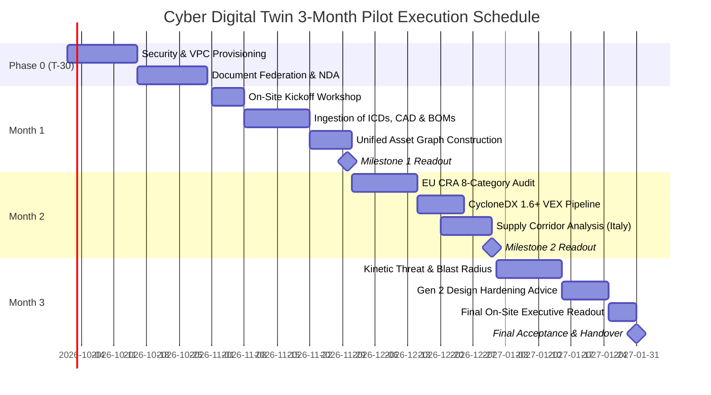

# STATEMENT OF WORK & PILOT PROJECT PROPOSAL

**PROJECT TITLE:** Cyber Digital Twin Pilot Engagement for Satellite Constellation & Ground Infrastructure  
**CUSTOMER:** Amazon Project Kuiper & AWS Ground Station  
**SERVICE PROVIDER:** Eigenia / OXOT B.V.  
**ENGAGEMENT VALUE:** $275,000 USD (Fixed-Fee Deliverable Model)  
**DURATION:** Three (3) Calendar Months + 30-Day Setup Period  
**TARGET START:** Q4 2026 / Pre-Kickoff T-30 Days

---

## 1. Engagement Overview & Objectives

Amazon Project Kuiper is deploying a large-scale Low Earth Orbit (LEO) satellite constellation supported by a worldwide network of dedicated telemetry, tracking, and control (TT&C) gateway ground stations. As operations scale globally, Amazon faces three distinct operational challenges:

1. **Cross-Border Statutory Compliance**: The European Cyber Resilience Act (Regulation (EU) 2024/2847) and national cybersecurity perimeters (such as Italy’s *Perimetro di Sicurezza Nazionale Cibernetica*) mandate strict component provenance, hardware roots of trust, and automated vulnerability disclosures for all infrastructure connected within the European market.
2. **Kinetic-Cyber Risk Propagation**: Terrestrial ground stations and satellites interact across physical, RF, electrical, and digital boundaries. A vulnerability in an antenna motor controller, thermal cooling subsystem, or baseband processor can cause kinetic failures or ground-station lockouts that software-only scanners cannot model.
3. **Gen 2 Satellite Cost Avoidance**: Redesigning satellite bus avionics, power distribution, or payload subsystems after environmental qualification or flight hardware fabrication costs millions of dollars per iteration. Identifying multi-BOM conflicts and single-point-of-failure blast radiuses during the design phase avoids severe qualification delays.

This Statement of Work (SOW) defines the delivery of a **Cyber Digital Twin Pilot Project** deploying Eigenia’s Three-Schema Multi-Graph Engine. Supported by a formal research grant from the Dutch government, the platform unifies engineering specifications, physical CAD drawings, interface control documents, and multi-tier bills of materials into an authoritative digital twin.

---

## 2. In-Scope Target Assets

The pilot models three representative assets:

| Asset Designation | Asset Type | Key Subsystems & Boundaries in Scope |
| :--- | :--- | :--- |
| **Asset 1: Ground Station** | Primary Gateway Earth Station (Representative Site) | Dish antenna reflector & feedhorn assembly, dual-axis tracking drive motors & controllers, cryogenic Low-Noise Amplifiers (LNAs), baseband modems, edge server rack, facility power/UPS, physical perimeter access, and Purdue Levels 0–3 network boundaries. |
| **Asset 2: Gen 1 Satellite** | Flight Vehicle Archetype (In-Orbit Baseline) | On-board flight computer (OBC), Telemetry, Tracking & Command (TT&C) transponders, power distribution and battery conditioning, reaction wheels & star trackers, thermal control loops, and deployed flight firmware. |
| **Asset 3: Gen 2 Satellite** | Next-Generation Satellite Bus (Design-Phase) | Advanced phased-array payload feed, inter-satellite optical link (ISL) controllers, updated avionics bus architecture, radiation-hardened microprocessor selection, and multi-tier supply chain component provenance. |

---

## 3. Work Breakdown Structure (WBS) & 3-Month Execution Schedule

### Phase 0: Pre-Kickoff Infrastructure & Governance (T-30 Days)
* Finalize mutual aerospace non-disclosure agreements (NDAs) and technical data classification.
* Provision an isolated Amazon EC2 GPU-accelerated instance within a dedicated AWS Virtual Private Cloud (VPC).
* Establish data transfer protocols for native engineering files (ICDs, BOMs, CAD exports).
* Conduct pre-kickoff technical alignment call with Kuiper and AWS Ground Station leads.

### Month 1: Kickoff, Ingestion & Authoritative Asset Graph
* Conduct on-site joint kickoff session with Amazon engineering, operations, and compliance teams.
* Ingest unstructured and structured engineering artifacts:
  - High-level and low-level design documents (HLD/LLD)
  - Interface Control Documents (ICDs)
  - Piping & Instrumentation Diagrams (P&IDs) and structural CAD files (DEXPI/STEP/DXF)
  - Single-line electrical and RF loop diagrams (IEC 61970 SIM format)
  - Vendor software, firmware, and hardware bills of materials
  - Failure Modes and Effects Analysis (FMEA) hazard logs and cell reliability data.
* Construct the baseline **Authoritative Labeled Property Graph (LPG)** connecting physical, electrical, and computational nodes with complete data provenance.
* **Milestone 1 Deliverable**: Baseline Asset Graph Inspection & Initial Boundary Mapping Report.

### Month 2: Statutory Compliance & Supply Corridor Analysis
* Execute automated compliance checks across all **8 mandatory EU Cyber Resilience Act (CRA) categories** for both ground station and satellite hardware.
* Build the automated **CycloneDX 1.6+ Multi-BOM pipeline**:
  - Software BOM (SBOM) + Hardware BOM (HBOM) + Cryptographic BOM (CBOM).
  - Continuous Vulnerability Exploitability eXchange (VEX) integration with real-time CISA KEV and EPSS velocity feeds.
* Conduct a detailed **Supply Corridor Jurisdictional Analysis**:
  - Map component IP origin (US, Taiwan, Japan, EU) against destination deployment (using an AWS Ground Station in Italy as the statutory reference).
  - Verify compliance against Italian National Cybersecurity Perimeter requirements (*Perimetro di Sicurezza Nazionale Cibernetica*) and EU CRA technical documentation mandates.
* **Milestone 2 Deliverable**: CRA Compliance Gap Analysis & Cross-Border Supply Corridor Dossier.

### Month 3: Kinetic Risk Simulation & Gen 2 Design Optimization
* Execute consequence-driven risk propagation simulations:
  - Model cyber attack pathways that cascade into kinetic failures (e.g., dish drive runaway, transmitter overheating, power bus brownout, flight computer thruster lockout).
  - Quantify blast radiuses and single-point-of-failure propagation.
* Formulate proactive **Gen 2 Satellite Design Recommendations**:
  - Identify non-compliant components, obsolete cryptographic primitives, and unmitigated cascade paths prior to final hardware tape-out.
  - Propose concrete architectural mitigations (Purdue boundary isolation, hardware root-of-trust placement, redundant power telemetry conduits).
* Conduct final on-site executive readout workshop with Amazon leadership.
* **Milestone 3 Deliverable**: Final Consequence Simulation Report, Gen 2 Architectural Hardening Recommendations, and Complete Digital Twin Data Handover.

---

## 4. Key Deliverables & Contractual Acceptance Criteria

| # | Deliverable | Description | Formal Acceptance Criteria |
| :-: | :--- | :--- | :--- |
| **D1** | **Authoritative Asset Graph** | Full multi-graph database representing the Ground Station, Gen 1, and Gen 2 assets. | Ingests 100% of provided design artifacts with verifiable physical-electrical-computational cross-links and zero broken relationships. |
| **D2** | **EU CRA Statutory Gap Audit** | Comprehensive compliance report covering all 8 mandatory essential requirements. | Verifies all hardware against Regulation (EU) 2024/2847 and produces auditable technical documentation checklists for CE marking. |
| **D3** | **CycloneDX 1.6+ Multi-BOM & VEX Engine** | Unified SBOM, HBOM, and CBOM repository with automated vulnerability mapping. | Correlates 100% of active CVEs with VEX exploitability status, filtering out non-exploitable vulnerabilities without manual triaging. |
| **D4** | **Supply Corridor Jurisdictional Dossier** | Trade corridor friction analysis for international component movements. | Identifies all regulatory touchpoints between US/Asian component origin and Italian ground station deployment. |
| **D5** | **Gen 2 Design Optimization Recommendations** | Architectural hardening brief for next-generation satellite bus. | Identifies high-risk single-point-of-failure pathways and presents at least 3 high-yield design revisions to reduce qualification rework. |
| **D6** | **Executive Readout Workshop & Handover** | Formal readout presentation and digital twin software handover. | Delivery of executive slide deck, technical data files, and successful completion of the on-site sign-off review. |

---

## 5. Governance & RACI Responsibility Matrix

| Engagement Activity | Eigenia / OXOT | Amazon Kuiper Engineering | AWS Ground Station Ops | Amazon Compliance & Legal |
| :--- | :---: | :---: | :---: | :---: |
| **AWS In-VPC Environment Setup** | Consulted | Accountable | Responsible | Informed |
| **Provision of ICDs, CAD & BOMs** | Informed | Responsible | Responsible | Consulted |
| **Multi-Graph Ingestion & Tuning** | Accountable / Responsible | Consulted | Consulted | Informed |
| **EU CRA Gap Analysis Execution** | Accountable / Responsible | Consulted | Consulted | Responsible |
| **Kinetic Blast Radius Simulation** | Accountable / Responsible | Consulted | Consulted | Informed |
| **Gen 2 Design Recommendations** | Accountable / Responsible | Responsible | Consulted | Informed |
| **Readout Attendance & Sign-off** | Responsible | Accountable | Accountable | Accountable |

*Legend: **R** = Responsible for doing; **A** = Accountable / Final approver; **C** = Consulted; **I** = Informed.*

---

## 6. Security, Data Sovereignty & Infrastructure

1. **In-VPC Isolation**: The pilot software installs exclusively within an Amazon-owned AWS VPC.
2. **Compute Requirements**: One (1) Amazon EC2 instance with GPU acceleration (recommended: `g5.2xlarge` or `g5.4xlarge`, 8 vCPUs, 32GB RAM, NVIDIA A10G 24GB VRAM) running Ubuntu LTS with standard Docker runtime.
3. **Data Egress**: Outbound network connections from the host instance are disabled. No telemetry, customer artifacts, or intermediate inference states will be transmitted to external servers.
4. **Data Destruction & Retention**: At engagement conclusion, Amazon retains full ownership of the graph database and exported models. Eigenia will destroy any local working artifacts per contractual protocol.

---

## 7. Commercial Terms & Payment Milestone Schedule

The engagement is delivered on a **fixed-price milestone basis of $275,000 USD**, invoiced against completed deliverables:

| Milestone | Trigger Event | Invoiced Amount | Payment Terms |
| :--- | :--- | :---: | :---: |
| **Milestone 1** | Contract Execution & AWS In-VPC Environment Provisioning (Phase 0) | **$68,750 (25%)** | Net 30 days |
| **Milestone 2** | Completion of Ingestion & Authoritative Asset Graph Delivery (Month 1) | **$68,750 (25%)** | Net 30 days |
| **Milestone 3** | Delivery of EU CRA Compliance Gap Analysis & Multi-BOM Engine (Month 2) | **$68,750 (25%)** | Net 30 days |
| **Milestone 4** | Final Executive Readout Workshop & Gen 2 Design Handover (Month 3) | **$68,750 (25%)** | Net 30 days |
| **Total** | | **$275,000 USD** | |

---

## 8. Acceptance & Sign-Off Authorization

IN WITNESS WHEREOF, the parties hereto have executed this Pilot Project Statement of Work as of the date set forth below.

**For Amazon (Project Kuiper / AWS Ground Station):**

Signature: _________________________________________  
Name: Michelle _____________________________________  
Title: ____________________________________________  
Date: _____________________________________________  

**For Eigenia / OXOT B.V.:**

Signature: _________________________________________  
Name: Jim McKenney _________________________________  
Title: Founder & Principal Systems Architect _______  
Date: September 14, 2026 __________________________  
