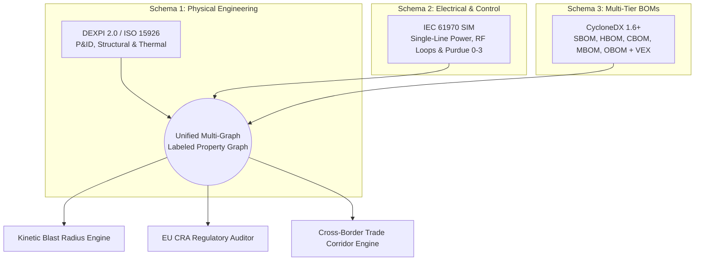

# TECHNICAL SPECIFICATION: MULTI-GRAPH INGESTION, CRA COMPLIANCE & JURISDICTIONAL CORRIDORS

**DOCUMENT REF:** EIG-SPEC-AMZ-2026-01  
**PROJECT:** Cyber Digital Twin Pilot for Amazon Project Kuiper & AWS Ground Station  
**AUTHOR:** Jim McKenney, Principal Systems Architect  
**DATE:** September 14, 2026  
**STATUS:** Draft Pre-Publish Technical Annex

---

## 1. The Three-Schema Multi-Graph Architecture

Conventional enterprise security platforms fail in aerospace and critical infrastructure because they treat computational assets in isolation from their physical and electrical operating environments. A satellite ground station or LEO space vehicle is a cyber-physical system where digital commands produce kinetic forces, thermal loads, and RF transmissions.

To provide deterministic risk evaluation, the Eigenia platform deploys a **Three-Schema Multi-Graph Architecture** that unifies three independent open engineering standards into an integrated Labeled Property Graph (LPG) backed by a W3C RDF OWL semantic ontology.



### 1.1 Schema 1: Physical Engineering (DEXPI 2.0 / ISO 15926)
* **Scope**: Physical layout, equipment housings, structural mounting, antenna dish hydraulics/gearboxes, cryogenic cooling lines, heat pipes, and thermal dissipation radiators.
* **Semantics**: Expressed via DEXPI 2.0 XML representations conforming to ISO 15926 equipment taxonomies. Every mechanical component carries physical attributes: mass, operating temperature envelope, thermal conductivity, and mechanical failure limits.
* **Kinetic Coupling**: Enables the engine to calculate whether an unmitigated software lockup in a coolant pump or tracking drive results in physical component degradation or mechanical destruction.

### 1.2 Schema 2: Electrical & Control Topology (IEC 61970 CIM/SIM)
* **Scope**: Power distribution, UPS battery banks, motor drive circuits, RF transmission lines, waveguide switches, sensor feedback loops, and Purdue Model network boundaries (Levels 0–3).
* **Semantics**: Built on the IEC 61970 Common Information Model (CIM) with industrial automation extensions. Nodes represent busbars, circuit breakers, frequency converters, programmable logic controllers (PLCs), baseband modems, and serial-to-Ethernet bridge devices.
* **Control Boundaries**: Maps network conduits between control networks and physical actuators, identifying paths where cyber manipulation crosses into power or RF manipulation.

### 1.3 Schema 3: Multi-BOM Computational Assets (CycloneDX 1.6+ with VEX)
* **Scope**: All active software, embedded firmware, cryptographic keys, hardware chips, operating protocols, and machine configurations.
* **Multi-BOM Formulation**:
  1. **Software Bill of Materials (SBOM)**: RTOS kernels, Linux operating environments, baseband signal processing libraries, microcode, and third-party open-source packages.
  2. **Hardware Bill of Materials (HBOM)**: FPGA part numbers, microcontroller dies, ASIC versions, PCB revisions, and hardware security modules (HSMs).
  3. **Cryptographic Bill of Materials (CBOM)**: Cipher suites, public key infrastructure (PKI) certificates, key lengths, elliptic curves, quantum-resilient algorithm readiness, and hardware root of trust (RoT) bindings.
  4. **Machine Bill of Materials (MBOM)**: Actuator stroke limits, antenna slew rates, amplifier gain curves, and calibration matrices.
  5. **Operations Bill of Materials (OBOM)**: Maintenance procedures, credential rotation cadences, and operator dispatch runbooks.
* **VEX Integration**: Continuous Vulnerability Exploitability eXchange (VEX) automation matching known CVEs against real-time network reachability and Purdue isolation, eliminating false alarms.

---

## 2. Ingestion Pipeline & Artifact Federation

The platform ingests heterogeneous aerospace engineering documentation directly into the multi-graph without requiring Amazon engineers to manually reformat data:

```
[Native Engineering Artifacts]
  ├── ICDs (Interface Control Documents)        ──> Regex & NLP Tabular Parser
  ├── Mechanical Drawings (STEP / DXF / P&ID)   ──> DEXPI XML Model Transformer
  ├── Electrical Schematics (Single-Line/DWG)   ──> IEC 61970 CIM Topology Builder
  ├── Software Repositories & Binary Images     ──> CycloneDX Syft / Trivy Extractor
  ├── FMEA & Hazard Analysis Spreadsheets       ──> Probabilistic Failure Graph Nodes
  └── Cell Reliability & Thermal Spreadsheets   ──> Operational Parameter Decorator
                           │
                           ▼
              [Unified In-Memory LPG Graph]
                           │
            ┌──────────────┴──────────────┐
            ▼                             ▼
   [In-VPC GPU Simulation]     [W3C RDF/OWL Semantic Facade]
```

1. **Interface Control Documents (ICDs)**: Tabular parsing extracts physical pinouts, signal voltage thresholds, baud rates, and message packet structures, binding software communication protocols directly to physical wiring pins.
2. **Failure Modes and Effects Analysis (FMEA)**: Hazard logs and failure probability spreadsheets are converted into conditional state-transition probabilities within the graph.
3. **Data Provenance**: Every vertex and edge in the graph retains an immutable cryptographic SHA-256 fingerprint referencing the original source document, author, page number, and ingestion timestamp.

---

## 3. The 8 Mandatory EU Cyber Resilience Act (CRA) Categories

Under Regulation (EU) 2024/2847 and Commission Implementing Regulation (EU) 2025/2392, satellite ground stations and related communications hardware operated or commercialized within the EU must fulfill mandatory essential requirements. The pilot evaluates assets across all eight statutory categories:

| Category | Statutory Requirement (Annex I Part I & II) | Evaluation Method in Cyber Digital Twin | Satellite & Ground Station Verification |
| :--- | :--- | :--- | :--- |
| **1. Secure by Default** | Products delivered with secure default configuration, automated password enforcement, and minimal exposed attack surface. | Graph traversal verifies no factory default credentials exist in modems, RTUs, or bus controllers; audits open ports across Purdue interfaces. | Confirms ground station edge routers and satellite bus microcontrollers have unused interfaces physically or logically disabled. |
| **2. Vulnerability Handling** | Documented vulnerability handling policies, automated reporting readiness (Art. 14), and coordinated disclosure workflows. | Validates machine-readable VEX generation and checks adherence to the 24-hour early warning and 72-hour incident notification clocks. | Ensures security teams receive automated alerts when a new upstream dependency CVE is published. |
| **3. Attack Surface Minimization** | Prevention of unauthorized access; network and logical segmentation of safety-critical functions. | Evaluates conduit isolation between telemetry/tracking networks and public/corporate cloud uplinks using graph reachability algorithms. | Proves that RF payload modems cannot bridge into satellite attitude and orbital control systems (AOCS). |
| **4. Cryptographic Integrity** | State-of-the-art cryptography for data in transit and at rest; secure key generation and storage. | Inspects the Cryptographic BOM (CBOM) to identify weak ciphers (e.g., SHA-1, 1024-bit RSA) and checks for Hardware Root of Trust (RoT) binding. | Verifies all command uplink channels use authenticated encryption with keys protected in space-qualified or tamper-resistant HSMs. |
| **5. DoS & Kinetic Resilience** | Resilience against denial-of-service, signal saturation, and physical resource exhaustion attacks. | Simulates command flooding and buffer overflow attacks across baseband processors, tracking motor drives, and thermal control loops. | Tests whether ground station antenna steering controllers degrade gracefully during command denial scenarios. |
| **6. Supply Chain Integrity** | Complete software, firmware, and hardware provenance; verification of component vendor security practices. | Cross-references HBOM and SBOM component part numbers against national sanction lists, counterfeit alerts, and end-of-life notices. | Flags unverified third-party microcontrollers or open-source software libraries lacking verifiable maintainer provenance. |
| **7. Tamper-Evident Logging** | Recording and monitoring of operational events, command execution, and administrative configuration changes. | Audits syslog configurations, telemetry historian storage, and immutable event hashing across Purdue Levels 1–3. | Verifies ground station satellite pass logs and telecommand sequences cannot be overwritten or deleted post-execution. |
| **8. Patching & OTA Resilience** | Security updates delivered securely via signed Over-The-Air (OTA) firmware updates with rollback protection. | Evaluates firmware update state machines; verifies cryptographic signatures on binary payloads and flash memory dual-banking. | Proves that an interrupted or corrupted firmware update to an in-orbit satellite flight computer automatically rolls back safely. |

---

## 4. Supply Corridor Jurisdictional Case Study: Italy Ground Station

### 4.1 The Regulatory Scenario
Amazon manufactures and sources advanced ground station subassemblies internationally:
* Cryogenic low-noise amplifiers (LNAs) and phased-array feeds fabricated in the United States and Taiwan.
* Baseband signal processing modems assembled in North America.
* Deployment destination: A dedicated AWS Ground Station facility located in **Italy** to support Mediterranean and European satellite passes.

### 4.2 The Multi-Jurisdictional Regulatory Friction
When this equipment enters Italy, it intersects three distinct legal frameworks:

1. **EU Cyber Resilience Act (Regulation (EU) 2024/2847)**:
   * Categorizes ground station baseband modems and edge routers as **Important Class I or Class II** products.
   * Mandates a complete technical construction file, CE marking, and notified body conformity assessment prior to commercial operation.
2. **Italian National Cybersecurity Perimeter (*Perimetro di Sicurezza Nazionale Cibernetica* - D.L. 105/2019)**:
   * Requires operators of critical national infrastructure (including telecommunications gateways) to notify the Italian National Cybersecurity Agency (ACN).
   * High-tech hardware and software components sourced from non-EU origins are subject to technical testing and screening by the CVCN (*Centro di Valutazione e Certificazione Nazionale*).
   * Deployment without prior clearance risks statutory suspension and criminal liability.
3. **Italian Golden Power Legislation (D.L. 21/2012 and subsequent amendments)**:
   * Grants the Italian Presidency special powers over strategic communications and aerospace assets, including the ability to veto foreign component acquisitions or impose specific technological security requirements.

### 4.3 How the Cyber Digital Twin Solves the Corridor Friction
The platform automates the entire supply corridor clearance process:
* **Automated Technical File Generation**: The multi-graph compiles the complete technical construction file (DEXPI mechanical drawings, CIM electrical diagrams, CycloneDX SBOM/HBOM/CBOM, and FMEA safety logs) required by EU notified bodies and Italian ACN inspectors.
* **Component Origin Tracing**: The graph traces every subcomponent back to its foundry and software commit, isolating components of non-EU origin and demonstrating that Hardware Root of Trust and encryption mechanisms prevent unauthorized foreign access.
* **Result**: Eliminates 3 to 6 months of customs and regulatory delays, allowing Amazon to commission international ground station facilities on schedule with zero statutory non-compliance risk.
