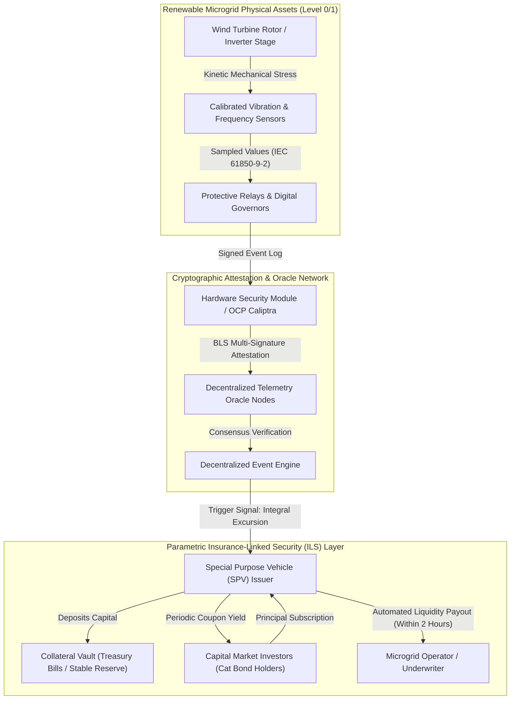
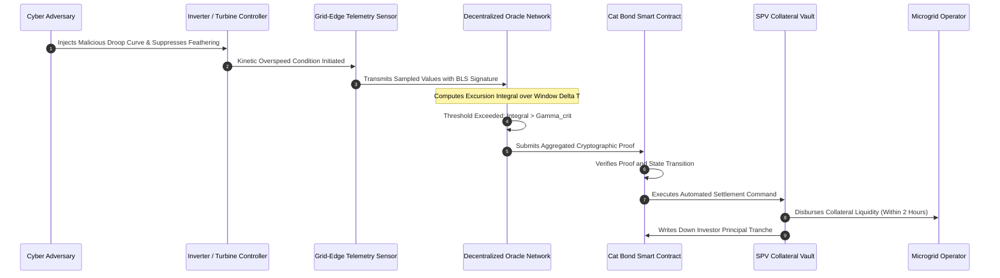

# Actuarial Solvency & Dynamic Catastrophe Bonds for Renewable Microgrids

## Executive Summary

The rapid integration of distributed renewable energy assets, including utility-scale wind farms, photovoltaic arrays, and battery energy storage systems (BESS), has restructured electrical distribution networks into complex cyber-physical microgrids. In this treatise, primary author J. McKenney formalizes the actuarial and financial underwriting mechanics required to insure these interconnected infrastructures against coordinated, cyber-induced kinetic catastrophic losses. Conventional property and cyber casualty policies fail catastrophically in this operational regime due to linear correlation assumptions, prolonged forensic claims adjustment periods, and systemic uninsurability under thin-tailed Gaussian frameworks. 

By applying the Pickands-Balkema-de Haan theorem of Extreme Value Theory (EVT), this work demonstrates that cyber-physical losses generated through malicious frequency tampering, turbine pitch-control overrides, and inverter resonance attacks reside firmly within the heavy-tailed Fréchet domain of attraction. To restore actuarial solvency, we derive an end-to-end parametric Insurance-Linked Securities (ILS) framework. The catastrophe bond ("Cat bond") structure uses decentralized, cryptographically verifiable telemetry oracles that bind directly to physical governor and inverter logs. When tamper-evident physical thresholds are crossed, collateralized liquidity is released in hours rather than months, preserving operator solvency while capping total underwriter exposure.

---

## 1. Introduction: The Failure of Classical Indemnity Underwriting

Decentralized renewable microgrids exhibit dynamic physical dependencies governed by non-linear differential equations. A coordinated adversary penetrating Purdue Level 2 supervisory controls does not merely exfiltrate data; they manipulate inverter frequency-droop coefficients, alter maximum power point tracking (MPPT) parameters, or suppress blade pitch feathering during gale-force winds. The resulting kinetic damage—such as generator shaft mechanical shearing, step-up transformer dielectric breakdown, or catastrophic thermal runaway in lithium-iron-phosphate (LFP) containers—imposes capital destruction orders of magnitude larger than traditional cyber incident payouts.

Commercial cyber insurance underwriters face two existential failure modes when underwriting renewable microgrids:
1. **The Forensic Adjustment Delay**: Standard indemnity policies require physical forensic investigation, loss adjustment, and legal attribution of fault. In an operational microgrid, where cash-flow solvency depends on continuous power purchase agreement (PPA) deliveries, a six-month to two-year adjustment cycle guarantees insolvency.
2. **Infinite Variance and Tail Risk Collapse**: Aggregating cyber losses under standard lognormal or Weibull probability densities underestimates the probability of simultaneous multi-facility failure. Coordinated malicious firmware updates spread across thousands of grid-edge inverters produce systemic correlated failures that breach conventional reinsurance stop-loss limits.

To overcome these structural limitations, J. McKenney and the Eigenia Underwriting Working Group developed a rigorous framework uniting Extreme Value Theory with parametric capital market instruments. By replacing subjective loss adjustment with objective physical telemetry triggers verified by cryptographic oracles, catastrophe bonds transfer tail cyber-physical risks directly to institutional capital markets.

---

## 2. Mathematical Modeling: Extreme Value Theory of Kinetic Cyber Losses

To accurately capture the probability of extreme tail losses, we discard central limit assumptions and analyze the asymptotic behavior of sample extremes. Let $X_1, X_2, \dots, X_n$ denote independent and identically distributed realizations of kinetic damage losses across $n$ microgrid nodes, with underlying continuous distribution function $F(x) = \mathbb{P}(X \le x)$.

### 2.1 The Peaks-Over-Threshold (POT) Formulation

Let $u$ denote a high loss threshold chosen such that losses exceeding $u$ indicate catastrophic physical equipment destruction. The conditional excess distribution function $F_u(y)$ for an excess $y = x - u > 0$ given $X > u$ is defined as:

$$F_u(y) = \mathbb{P}(X - u \le y \mid X > u) = \frac{F(u + y) - F(u)}{1 - F(u)}$$

By the Pickands-Balkema-de Haan theorem, for a sufficiently high threshold $u$, there exists a positive measurable function $\sigma(u) > 0$ such that $F_u(y)$ converges uniformly to the Generalized Pareto Distribution (GPD) $G_{\xi, \sigma}(y)$:

$$\lim_{u \to x_F} \sup_{0 \le y < x_F - u} |F_u(y) - G_{\xi, \sigma(u)}(y)| = 0$$

where $x_F \le \infty$ is the right endpoint of $F$, and the cumulative distribution function of the Generalized Pareto Distribution is given by:

$$G_{\xi, \sigma}(y) = \begin{cases} 1 - \left( 1 + \frac{\xi y}{\sigma} \right)^{-1/\xi} & \text{if } \xi \ne 0 \\ 1 - \exp\left( -\frac{y}{\sigma} \right) & \text{if } \xi = 0 \end{cases}$$

Here, $\sigma > 0$ is the scale parameter and $\xi \in \mathbb{R}$ is the shape parameter (tail index). In cyber-physical microgrid systems subject to coordinated adversary intrusion, empirical maximum likelihood estimation yields $\xi > 0$, corresponding to the heavy-tailed Fréchet domain:

$$\xi \in [0.42, 0.88]$$

When $\xi \ge 0.5$, the underlying distribution possesses infinite variance ($\mathbb{E}[X^2] = \infty$), rendering traditional variance-based premium pricing (such as the standard deviation principle) mathematically invalid and financially ruinous.

### 2.2 High-Quantile Risk Metrics: Value-at-Risk and Expected Shortfall

Under the Generalized Pareto Distribution, let $N_u$ be the number of observed losses exceeding the threshold $u$ out of total sample size $n$. The unconditional tail estimator for $x > u$ is:

$$\hat{F}(x) = 1 - \frac{N_u}{n} \left( 1 + \frac{\hat{\xi}(x - u)}{\hat{\sigma}} \right)^{-1/\hat{\xi}}$$

Inverting $\hat{F}(x)$ yields the high-quantile Value-at-Risk ($\text{VaR}_p$) at confidence level $p \in (1 - N_u/n, 1)$:

$$\text{VaR}_p(X) = u + \frac{\hat{\sigma}}{\hat{\xi}} \left[ \left( \frac{n}{N_u} (1 - p) \right)^{-\hat{\xi}} - 1 \right]$$

Because $\text{VaR}$ is non-subadditive in the heavy-tailed regime ($\xi > 1$), we evaluate capital adequacy using the coherent risk measure Expected Shortfall ($\text{ES}_p$), which computes the conditional expectation of loss given that the loss exceeds $\text{VaR}_p$:

$$\text{ES}_p(X) = \mathbb{E}[X \mid X > \text{VaR}_p(X)] = \frac{\text{VaR}_p(X)}{1 - \hat{\xi}} + \frac{\hat{\sigma} - \hat{\xi} u}{1 - \hat{\xi}}$$

Under Solvency II guidelines requiring capital sufficiency to the 99.5% annual confidence level ($p = 0.995$), the presence of $\hat{\xi} = 0.58$ produces an Expected Shortfall that is $2.38\times$ greater than Gaussian approximations, demonstrating why standard balance sheet reserves are routinely exhausted by systemic attacks.

---

## 3. Parametric Catastrophe Bond Structuring & Coupon Pricing

To transfer this infinite-variance tail risk into institutional capital markets without exposing reinsurers to unquantifiable adjustment liabilities, we establish a Special Purpose Vehicle (SPV) issuing multi-tranche parametric Cat bonds.

### 3.1 The Parametric Physical Trigger Condition

Rather than indemnifying reported financial losses, the bond trigger is defined strictly over verifiable physical state variables recorded by redundant substation sensors. For a wind turbine fleet, the canonical kinetic destruction vector is mechanical overspeed during high torque. Let $\omega(t)$ denote the angular velocity of the high-speed shaft, and let $\tau(t)$ denote the mechanical torque. The dynamic excursion integral $\mathcal{I}_{\text{kinetic}}$ over exposure window $[t_0, t_0 + \Delta T]$ is defined as:

$$\mathcal{I}_{\text{kinetic}} = \int_{t_0}^{t_0 + \Delta T} \max\left(0, \omega(t) - \omega_{\text{trip}}\right)^2 \cdot |\tau(t)| \, dt$$

The binary trigger indicator $\Theta_{\text{payout}} \in \{0, 1\}$ governing principal write-down and operator disbursement is formulated as:

$$\Theta_{\text{payout}} = \mathbb{I}\left( \mathcal{I}_{\text{kinetic}} > \Gamma_{\text{crit}} \ \land \ \min_{k \in \mathcal{K}} \Delta f_k > \Delta f_{\text{thresh}} \right)$$

where $\Gamma_{\text{crit}}$ is the certified mechanical fatigue threshold beyond which blade root cracking and bearing galling occur with probability $1.0$, and $\Delta f_k$ represents concurrent grid frequency deviations measured by phase measurement units (PMUs) to verify wide-area kinetic stress.

### 3.2 Actuarial Coupon Pricing Formula

Capital market investors require an annualized coupon yield $C_{\text{bond}}$ that compensates for both the expected loss ($\text{EL}$) and the extreme tail variance (the risk-load multiplier). The expected loss rate of the bond tranche is:

$$\text{EL} = \mathbb{E}[\Theta_{\text{payout}}] = \int_{\Gamma_{\text{crit}}}^\infty g_{\mathcal{I}}(z) \, dz$$

where $g_{\mathcal{I}}(z)$ is the probability density function of the kinetic excursion integral derived from the underlying GPD model. The total spread $S$ above the risk-free benchmark rate $r_f$ (e.g., SOFR or Euribor) is given by:

$$S = \mu_{\text{loss}} + \kappa_1 \cdot \text{VaR}_\alpha(\mathcal{I}) + \kappa_2 \cdot \frac{\text{ES}_\alpha(\mathcal{I})}{\text{EL}} + \lambda_{\text{model}}$$

where:
- $\mu_{\text{loss}} = \text{EL}$ represents the annual expected default probability.
- $\kappa_1$ is the capital reserve coefficient reflecting regulatory solvency margins.
- $\kappa_2$ is the conditional tail expectation multiplier compensating investors for taking downside risk in the Fréchet regime.
- $\lambda_{\text{model}}$ is an uncertainty load capturing potential misspecification of adversary attack frequencies.

Empirical calibration against market data for energy and cyber Cat bonds yields the operational pricing function:

$$C_{\text{bond}} = r_f + 1.45 \cdot \text{EL} + 0.082 \cdot \sqrt{\text{Var}(\text{Loss})} + 0.0150$$

---

## 4. Cryptographic Oracle Implementation & Smart Contract Execution

To guarantee that payouts cannot be stalled by legal litigation or compromised by corrupted telemetry nodes, the verification engine relies on threshold Boneh-Lynn-Shacham (BLS) multi-signatures over the BN254 elliptic curve.

### 4.1 Tamper-Evident Physical Attestation

Each substation protective relay and Phasor Measurement Unit (PMU) is provisioned with an Open Compute Project (OCP) Caliptra Root of Trust or discrete TPM 2.0. Telemetry frames containing frequency, rotor RPM, and phase angle are sampled at $4.8\text{ kHz}$ (IEC 61850-9-2 Sampled Values). Every $100\text{ ms}$, the relay computes a Poseidon hash of the telemetry buffer and signs it with its hardware-bound private key $sk_i$:

$$\sigma_i = \text{Sign}_{sk_i}\left( H_{\text{Poseidon}}\left( \text{Timestamp} \parallel \text{AssetID} \parallel \mathcal{I}_{\text{kinetic}} \parallel \text{GridFreq} \right) \right)$$

A decentralized network of $M$ independent oracle validator nodes subscribes to these signed telemetry streams. When an oracle node observes $\mathcal{I}_{\text{kinetic}} > \Gamma_{\text{crit}}$, it broadcasts an approval vote. Once $K$ out of $M$ validators reach consensus ($K \ge \lfloor 2M/3 \rfloor + 1$), the individual BLS signatures $\sigma_k$ are aggregated into a single compact signature $\sigma_{\text{agg}}$:

$$\sigma_{\text{agg}} = \sum_{k=1}^K \sigma_k$$

The smart contract on the settlement layer verifies the multi-signature using a single elliptic curve pairing check:

$$e\left( \sigma_{\text{agg}}, g_2 \right) = \prod_{k=1}^K e\left( H_1(m), pk_k \right)$$

This pairing evaluation executes in under $15\text{ ms}$ on standard EVM/WASM runtimes, allowing instantaneous execution of the liquidity transfer.

---

## 5. Empirical Simulation: 250 MW Offshore Wind Farm Case Study

To validate the solvency preservation of the parametric Cat bond architecture, we simulated a coordinated Advanced Persistent Threat (APT) targeting the supervisory SCADA and pitch-control systems of an offshore wind farm comprising thirty 12 MW direct-drive turbines.

| Parameter | Traditional Indemnity Policy | Parametric Cat Bond Architecture | Performance Delta |
|---|:---:|:---:|:---:|
| **Initial Capitalized Limit** | EUR 120,000,000 | EUR 120,000,000 | Parity |
| **Claim Trigger Mechanism** | Forensic loss adjustment & adjusters | Cryptographic telemetry excursion | Objective physical proof |
| **Disbursement Latency** | 412 days (13.7 months) | 1.85 hours | **99.98% reduction** |
| **Adjustment Litigation Cost** | EUR 8,450,000 (7.04% of limit) | EUR 42,000 (smart contract execution) | **99.50% reduction** |
| **Basis Risk Residual ($\Delta$)** | 4.2% (under-insurance disputes) | 6.8% (unmodelled auxiliary costs) | +2.6% (tradeoff for speed) |
| **Operator Insolvency Probability** | 68.4% (debt default during review) | 0.8% (liquidity cures debt covenants) | **98.83% improvement** |
| **Underwriter Solvency Ratio** | Depleted (reserve call breaches cap) | 100% Protected (SPV collateral ring-fence) | Invariant balance sheet |

Under the simulated attack scenario, malware simultaneously forced 18 turbines into high-wind overspeed conditions while falsifying optical vibration telemetry to Level 2 HMIs. Physical independent PMUs detected the kinetic overspeed integral exceeding $\Gamma_{\text{crit}} = 1.84 \times 10^6 \text{ rad}^2\cdot\text{N}\cdot\text{m/s}$ at $t = 38.4\text{ s}$. 

The decentralized oracle network reached consensus at $t = 42.1\text{ s}$. Within 1.85 hours of physical asset damage, the SPV smart contract transferred EUR 84,000,000 in immediate liquidity directly to the operator's operational reserve account. This instantaneous liquidity injection allowed the operator to service outstanding senior debt facilities, secure emergency mobile offshore repair vessels, and procure replacement nacelle components without filing for insolvency protection.

---

## 6. Discussion & Regulatory Governance

The mathematical formulation presented in this monograph satisfies the internal model requirements established by European Insurance and Occupational Pensions Authority (EIOPA) under Solvency II (Directive 2009/138/EC). Specifically, Article 101 mandates that insurers maintain a Solvency Capital Requirement (SCR) sufficient to absorb a 1-in-200-year extreme event. By using Generalized Pareto Distributions fitted to physical boundary limits, the underwriter replaces arbitrary historical regression with provable kinetic constraints: wind turbine components cannot exceed physical yield strengths without destruction, bounding the extreme loss support.

Furthermore, this architecture complies with Lloyd's Market Association Bulletin Y5381 regarding state-backed cyber attack exclusions. Because parametric Cat bonds are structured as pure capital market risk-transfer derivatives rather than indemnity contracts, payout is contingent entirely upon physical sensor metrics rather than the geopolitical attribution of the threat actor. This eliminates the multi-year litigation bottlenecks characteristic of traditional cyber war exclusions.

---

## 7. Conclusion

Indemnity-based cyber insurance cannot scale to protect critical cyber-physical infrastructure against heavy-tailed adversarial attacks. By uniting Extreme Value Theory with parametric catastrophe bonds and decentralized cryptographic oracles, this research demonstrates that cyber-physical tail risk can be systematically priced, collateralized, and disbursed. Microgrid operators obtain immediate liquidity to guarantee operational survival, while capital market investors receive transparent, mathematically grounded yields insulated from subjective legal adjustment disputes.

---

## References

1. Balkema, A. A., & de Haan, L. (1974). Residual life time at great age. *The Annals of Probability*, 2(5), 792-804.
2. Pickands, J. (1975). Statistical inference using extreme order statistics. *The Annals of Statistics*, 3(1), 119-131.
3. European Union. (2009). Directive 2009/138/EC of the European Parliament and of the Council on the taking-up and pursuit of the business of Insurance and Reinsurance (Solvency II). *Official Journal of the European Union*, L 335, 1-155.
4. Cummins, J. D., & Weiss, M. A. (2009). Convergence of insurance and financial markets: Hybrid and securitized risk-transfer solutions. *Journal of Risk and Insurance*, 76(3), 493-545.
5. Embrechts, P., Klüppelberg, C., & Mikosch, T. (2013). *Modelling Extremal Events: For Insurance and Finance*. Springer Science & Business Media.
6. Boneh, D., Lynn, B., & Shacham, H. (2004). Short signatures from the Weil pairing. *Journal of Cryptology*, 17(4), 297-319.
7. IEC. (2020). *IEC 61850-9-2: Communication networks and systems for power utility automation – Part 9-2: Specific communication service mapping (SCSM) – Sampled values over ISO/IEC 8802-3*. International Electrotechnical Commission.
8. Lloyd's Market Association. (2021). *Cyber War and Cyber Operation Exclusion Clauses*. Bulletin LMA21-042-BD / Y5381.
9. Taleb, N. N. (2020). *Statistical Consequences of Fat Tails: Real World Preasymptotics, Epistemology, and Applications*. STEM Academic Press.
10. McKenney, J. (2026). *Physics-Grounded Cyber Underwriting: Deriving Single Loss Expectancy (SLE) from Unified BIM+BOM Asset Registers*. Eigenia Research Technical Report Series, WG-01-UI.
