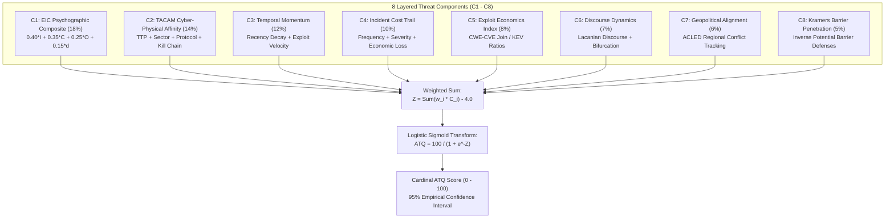
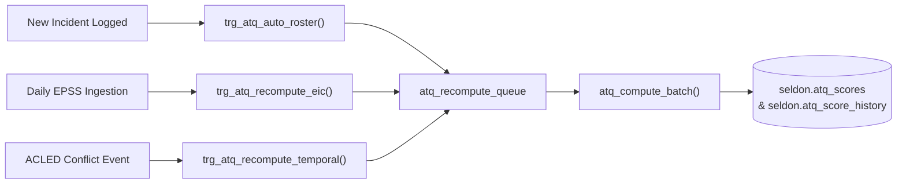

# The Actor Threat Quotient: Production Mathematical Foundations
## Eight-Layer Sigmoid Transform, Relational Trigger Architectures, and Empirical Confidence Bands

### Executive Abstract

In critical infrastructure security, qualitative assessments fail to survive board scrutiny. Traditional security operations frequently rank threat actors using brand recognition or nominal categorical labels. When decision-makers are asked to define how much more dangerous one adversary is compared to another, conversations often collapse into qualitative adjectives such as "highly sophisticated" or "well-resourced," obscuring operational variance and paralyzing capital allocation.

The **Actor Threat Quotient (ATQ)** solves this measurement challenge by establishing an actuarial-grade mathematical framework. Executing in production as a continuous materialized calculation (`seldon.atq_scores`), the ATQ delivers a dynamic composite score normalized on the interval $[0, 100]$ that quantifies the real-time operational danger an adversary presents to a specific facility topology.

---

### 1. The Production Formula: Sigmoid Transform

The ATQ rejects linear additive scoring. Linear models suffer from severe value distortion and fail to reflect the scaling physics of threat weaponization. Instead, the database engine aggregates twelve auditable threat indicators into **eight core components ($C_1$ to $C_8$)** representing layers L0 through L7 of the digital twin.

These components are synthesized through a **weighted logistic sigmoid transform**:

$$Z = 1.8 C_1 + 1.4 C_2 + 1.2 C_3 + 1.0 C_4 + 0.8 C_5 + 0.7 C_6 + 0.6 C_7 + 0.5 C_8 - 4.0$$

$$\text{ATQ} = \frac{100}{1 + e^{-Z}}$$

#### Centering Physics & Saturation Bounds
* **The $-4.0$ Intercept:** Centers the logistic curve. An adversary exhibiting a median weighted component sum ($\approx 4.0$) generates an ATQ of **50.0**.
* **The Asymptotic Ceiling:** A state-sponsored adversary approaching complete theoretical weaponization (all components $C_i = 1.0$, yielding $Z = +4.0$) reaches an upper bound of **98.2**.
* **95% Confidence Intervals:** Seldon computes statistical bounds based on data completeness:
  $$\text{Confidence} = \frac{\text{Non-Zero Components}}{8}$$
  $$\sigma = \max\left(2.0, \ \text{ATQ} \times (1 - \text{Confidence}) \times 0.3\right)$$
  Adversaries with extensive forensic attribution maintain narrow uncertainty margins ($\approx \pm 3.9$ points), while emerging groups exhibit wider confidence bands.

---

### 2. Deconstruction of the Eight Core Components

Every point in an adversary's ATQ score originates from explicit database functions executing against structured relational tables:

#### $C_1$: EIC Composite (L6 Psychographic Domain) — Weight 1.8
$$C_1 = \min\left(1.0, \ 0.40 \times \text{Intent} + 0.35 \times \text{Capability} + 0.25 \times \text{Opportunity} + 0.15 \times d_{\text{factor}}\right)$$
Measures baseline motivation and technical capability, calibrated by psychometric evaluation ($d_{\text{factor}}$) to account for irrational or disruptive escalation postures.

#### $C_2$: TACAM Affinity (L1–L2 Cyber-Physical Domain) — Weight 1.4
$$C_2 = \frac{\text{technique\_breadth} + \text{sector\_reach} + \text{protocol\_reach} + \text{kill\_chain\_completeness}}{4}$$
Quantifies physical alignment with industrial control networks. Assesses MITRE ATT&CK for ICS technique coverage across 14 tactics, targeting score across 17 CISA infrastructure sectors, and compatibility across 12 industrial fieldbus protocols (Modbus, OPC-UA, DNP3, PROFINET).

#### $C_3$: Temporal Momentum (L7 Temporal Domain) — Weight 1.2
$$C_3 = 0.35 R_{\text{campaign}} + 0.25 V_{\text{EPSS}} + 0.20 V_{\text{technique}} + 0.20 R_{\text{incident}}$$
Applies exponential half-life decay to historical campaigns ($t_{1/2} = 90\text{ days}$) and incident recency ($t_{1/2} = 180\text{ days}$) [1]. Penalizes inactive adversaries while weighting groups with accelerating vulnerability exploitation velocity ($V_{\text{EPSS}}$).

#### $C_4$: Incident Evidence (L5 Economic Domain) — Weight 1.0
$$C_4 = 0.40 F + 0.30 S + 0.30 K$$
Aggregates verifiable real-world losses across the prior 24 months: attack frequency ($F$), severity level ($S$), and cumulative financial claims cost ($K$).

#### $C_5$: Exploit Economics Index (L5/L7 Synthesis) — Weight 0.8
$$C_5 = \min\left(1.0, \ 0.60 \times \text{EEI} + 0.40 \times \text{EPSS}_{\text{avg}}\right)$$
Calculates the operational cost of compromise by joining targeted Common Weakness Enumerations (CWEs) against active CISA KEV listings [2]. Determines whether an adversary requires costly zero-day exploits or relies on commoditized tooling.

#### $C_6$: Discourse Dynamics (L6 Psychographic Domain) — Weight 0.7
$$C_6 = \min\left(1.0, \ D_{\text{base}} + B_{\text{bifurcation}} + M_{\text{stability}}\right)$$
Monitors public communiqués, extortion dialogues, and manifestos, parsing language into structured discourse states and flagging critical state bifurcations prior to operational release.

#### $C_7$: Geopolitical Pressure (L4 Geopolitical Domain) — Weight 0.6
$$C_7 = \min\left(1.0, \ 0.40 T_{\text{origin}} + 0.30 T_{\text{target}} + 0.30 C_{\text{conflict}}\right)$$
Integrates active conflict data from ACLED and trade sanction indicators [4], correlating kinetic regional disputes with threat actor activation.

#### $C_8$: Kramers Barrier Penetration (L0–L2 Physics Domain) — Weight 0.5
$$C_8 = \max\left(0, \ 1.0 - \frac{\bar{h} \times f_{\text{adj}}}{h_{\max}}\right)$$
Calculates adversary capability to breach potential barriers in physical network topologies, adapting Kramers escape theory [3] from statistical physics into topological cyber defense.

---

### 3. Saturation Limits: Resolving the Ceiling Effect

Earlier V1 scoring frameworks exhibited severe ceiling compression: low saturation thresholds caused over 30 distinct state-sponsored groups to tie within an indistinguishable 2.9-point range.

| Model Generation | Scoring Paradigm | Top-Decile Spread | Primary Distortion |
|:---|:---|:---:|:---|
| **V1 Framework** | Coarse Additive Triad | $80.3 - 83.2$ ($\Delta = 2.9\text{ pts}$) | Severe ceiling saturation; state-sponsored actors indistinguishable |
| **V2 Formulation** | Twelve-Factor Sigmoid | $68.4 - 82.9$ ($\Delta = 14.5\text{ pts}$) | Broad discriminative spread separating active posture from dormant history |

The V2 recalibration raised saturation parameters against empirical distributions:
* **Incident Attribution Threshold:** Scaled from $\div 3 \to \div 20$ confirmed operations.
* **Product Targeting Range (CPE):** Scaled from $\div 15 \to \div 50$ distinct product families.
* **Technique Breadth:** Scaled from $\div 80 \to \div 120$ distinct sub-techniques.

Under V2, dormant historical actors experience natural score decay, while pre-positioned, operationally active groups (such as Volt Typhoon, ATQ 82.9) cleanly separate from baseline criminal syndicates.

---

### 4. Continuous Event-Driven Database Pipeline

The ATQ executes within PostgreSQL using asynchronous trigger pipelines to ensure scores reflect fresh intelligence without manual reporting cycles:

Database recalculations write immutable records to `seldon.atq_score_history`, allowing underwriting algorithms to calculate **Actor Drift**: the quantifiable rate at which an adversary's operational capability accelerates following geopolitical flashpoints.

---

### 5. Downstream Applications: Underwriting & Digital Twin Modeling

1. **Monte Carlo Random Walk Biasing:** When the digital twin simulates lateral propagation across plant conduits, edge traversal weights are scaled by active ATQ modifiers ($w' = w_{\text{base}} \times [0.3 + 1.2 \times \text{ATQ}/100]$).
2. **Deterministic Seldon Rating:** Internal vulnerabilities are crossed against external threat pressure, ensuring compliance ratings reflect adversaries actually targeting deployed hardware rather than generic checklists.
3. **Gordon-Loeb Budget Optimization:** By establishing empirical probabilities of compromise, ATQ calculations feed directly into Gordon-Loeb investment equations, establishing mathematically optimal expenditure boundaries for cyber risk mitigation [5].

---

## References & Empirical Citations

- [1] **First.org (2025)**: *Exploit Prediction Scoring System (EPSS) Specification and Trajectory Modeling*. Forum of Incident Response and Security Teams.
- [2] **CISA (2024)**: *Known Exploited Vulnerabilities (KEV) Catalog*. Cybersecurity and Infrastructure Security Agency.
- [3] **Kramers, H. A. (1940)**: "Brownian motion in a field of force and the diffusion model of chemical reactions." *Physica*, 7(4), 284–304.
- [4] **Armed Conflict Location & Event Data Project (ACLED) (2025)**: *Real-time Conflict Index and Event Analysis*.
- [5] **Gordon, L. A., & Loeb, M. P. (2002)**: "The economics of information security investment." *ACM Transactions on Information and System Security*, 5(4), 438–457.
