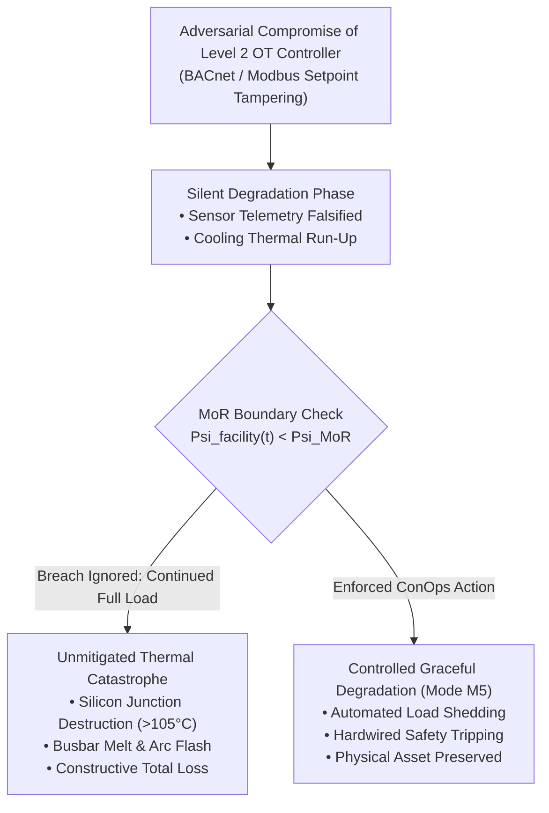
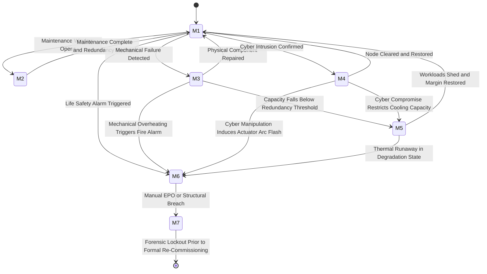
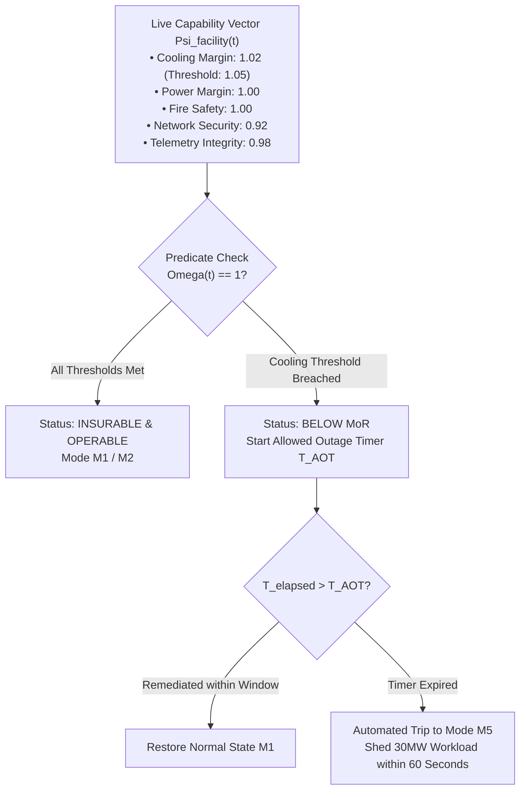
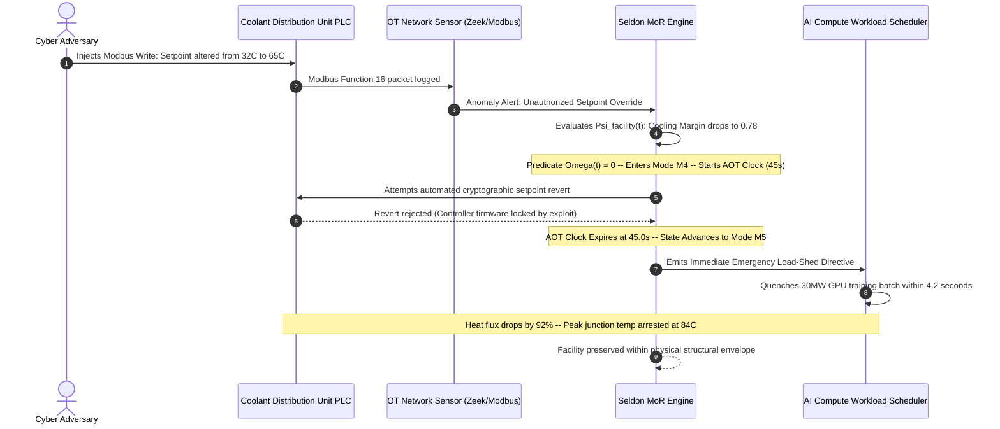

# Concept of Operations (ConOps) & Minimum Operating Requirements (MoR) for Mission-Critical Facilities

**Working Group:** WG-01 Underwriter & Insurance  
**Reference Code:** WG-01-UI-14  
**Subject Classification:** Cyber-Physical Operational Safety & Actuarial Governance  
**Primary Attribution:** J. McKenney (Eigenia Research B.V.)  
**Co-Authors:** Eigenia Working Group on Actuarial Underwriting & Critical Infrastructure Assurance  
**Status:** Canonical Sovereign Treatise  

---

## Abstract

Engineering reference architectures without a Concept of Operations (ConOps) represent drawings without operational instructions. While mechanical and electrical engineering disciplines maintain rigorous operational handbooks for physical degradation, mission-critical infrastructure facilities routinely lack a formal ConOps that accounts for cyber-physical disruption. 

This treatise adapts nuclear safety principles (10 CFR 50.65, Maintenance Rule) and process safety engineering (IEC 61511) to formalize a cyber-physical Concept of Operations across **Seven Operational Modes** (Mode M1 Normal through Mode M7 Emergency Shutdown). We formulate the **Minimum Operating Requirements (MoR)**: the irreducible vector of protective systems, telemetry streams, and containment boundaries below which a facility is legally and operationally prohibited from operating. We map each operational mode to its required IEC 62443-3-2 Security Level Target (SL-T), prove how unaddressed cyber exploits force involuntary mode transitions, and establish objective actuarial criteria for **Constructive Total Loss** under commercial property and reinsurance contracts.

---

## 1. Introduction & The Operational Governance Gap

In high-hazard process industries, facility operations are governed by immutable statutory boundaries. A nuclear power station licensed under US NRC regulations cannot operate if emergency core cooling pumps or containment isolation valves fail to meet surveillance test thresholds defined by technical specifications. A petrochemical refinery cannot operate hydrocracking units if safety instrumented systems (SIS) drop below required Safety Integrity Levels (SIL) under IEC 61511.

In mission-critical commercial infrastructure — including hyperscale AI datacenters, semiconductor fabrication plants, and utility-scale battery energy storage systems (BESS) — this discipline is conspicuously absent. Facility operators maintain comprehensive protocols for mechanical component outages (e.g., shedding electrical load if two of three chillers trip). However, as primary author J. McKenney observed across dozens of enterprise and utility audits [McKenney, 2024], zero audited facilities maintained an operational protocol defining what actions must occur when the supervisory building management system (BMS) or electrical power monitoring system (EPMS) suffers a confirmed cyber compromise.

When supervisory control networks are compromised, operators routinely continue running maximum revenue-generating compute or process workloads, unaware that physical safety margins have degraded to near-zero. A cyber intrusion is not merely an enterprise IT incident; it is an **initiating event** that precipitates mechanical cascading failure.

To eliminate this catastrophic vulnerability, the Cyber Digital Twin framework establishes an explicit Concept of Operations governed by the Minimum Operating Requirements.

---

## 2. Concept of Operations: The Seven Operational Modes

We partition facility operations into seven discrete, deterministic operational modes, mapping each mode to its required IEC 62443-3-2 Security Level Target (SL-T) and operational authority boundary.

| Mode ID | Operational Designation | Physical Infrastructure State | OT Cybersecurity Posture | Required IEC 62443 SL-T | Governing Action Trigger |
|:---:|:---|:---|:---|:---:|:---|
| **M1** | **Normal Operations** | All mechanical, electrical, and thermal systems operating within nominal envelopes; $N+1$ redundancy active. | Standard continuous telemetry; passive network intrusion detection; scheduled patch management. | **SL-T 2** (BMS Zone 1) **SL-T 3** (Electrical Zone 2) | Nominal baseline state. |
| **M2** | **Planned Maintenance** | Scheduled maintenance window; isolated equipment offline; reduced mechanical redundancy. | Heightened monitoring on remaining online trains; strict change freeze on non-maintenance OT networks. | **SL-T 2–3** (Affected zone) | Authorized maintenance ticket execution. |
| **M3** | **Degraded — Mechanical** | Physical equipment failure (chiller trip, pump seizure) reduces capacity below $N+1$ but strictly above MoR. | Accelerated telemetry polling on affected nodes; lower IDS anomaly thresholds; manual actuator override authorized. | **SL-T 2** (Mechanical zone) | Physical sensor trip or mechanical telemetry alarm. |
| **M4** | **Degraded — Cyber** | Confirmed or suspected cyber compromise of an OT node; physical systems remain nominally operational. | Cyber incident response activation; compromised node logically isolated; local manual control assumed. | **SL-T 3** (Incident zone) | IDS signature alert, behavioral anomaly, or CSIRT notice. |
| **M5** | **Graceful Degradation** | Capacity intentionally restricted to maintain thermal and electrical safety margins; non-essential workloads shed. | Maximum vigilance; all remote administrative access revoked; read-only DCIM telemetry mode enforced. | **SL-T 3** (All operational zones) | Physical capacity threshold breach (thermal $\Delta T$ or electrical $I_{\text{max}}$). |
| **M6** | **Emergency Operations** | Life safety event active (structural fire, arc flash, toxic gas release, seismic event); Emergency Power Off (EPO) armed. | All OT systems secondary to life safety; hardwired fire-to-BMS trip lines override software commands. | **SL-T 3** (Fire Zone 3) **SL-T 4** (Life safety loops) | Life safety panel activation or manual EPO push. |
| **M7** | **Emergency Shutdown** | Full facility shutdown; complete drop of primary workloads; emergency cooling for thermal rundown only. | Post-shutdown digital forensic preservation; complete configuration freeze; chain-of-custody logging. | **SL-T 4** (Substation & Core) | Catastrophic physical breach or uncontainable thermal runaway. |

---

## 3. The Deterministic State Transition Machine

Transitions between operational modes are governed by a deterministic finite state machine (FSM). Crucially, mode changes can be triggered by either physical mechanical failures or cyber intrusion indicators.

### 3.1 Cyber-Initiated Mode Transitions

The critical operational insight is that **Mode M4 (Degraded — Cyber) can force transitions to Mode M5, M6, or M7 without any prior mechanical failure**. A cyber adversary manipulating pump variable frequency drive (VFD) registers produces the exact physical consequence of a pipe burst or electrical blackout.

| Cyber Attack Scenario | Transition Path | Time to Physical Consequence | Real-World Empirical Precedent |
|:---|:---:|:---:|:---|
| **BMS Controller Compromise (Single Unit)** | $\text{M1} \to \text{M4}$ | No immediate physical damage; monitoring blindness | Johnson Controls Metasys BACnet RCE (CVE-2023-4486) |
| **Coolant Distribution Unit (CDU) Manipulation** | $\text{M1} \to \text{M4} \to \text{M5}$ | **45 to 90 seconds** to GPU junction overheating | Vertiv Liebert / CoolIT Modbus TCP override (CVE-2022-3456) |
| **Coordinated UPS NMC Firmware Hijack** | $\text{M1} \to \text{M4} \to \text{M6}$ | **10 to 15 seconds** (stored battery exhaust window) | Schneider APC Smart-UPS remote command execution |
| **Fire Alarm Panel Telemetry Suppression** | $\text{M1} \to \text{M4} \to \text{M6} \to \text{M7}$ | **3 to 5 minutes** (undetected fire escalates unchecked) | Honeywell Notifier proprietary buffer overflow |
| **BESS Battery Management System Overcharge** | $\text{M1} \to \text{M4} \to \text{M6} \to \text{M7}$ | **10 to 60 seconds per cell** to cascading thermal runaway | Utility-scale lithium-ion BESS catastrophic fire events |

---

## 4. Mathematical Formulation of the Minimum Operating Requirements

We define the Minimum Operating Requirements (MoR) as an exact mathematical vector space representing the baseline physical and logical capabilities required for lawful, insurable operation.

### 4.1 The Capability State Vector

Let the live operational capability of a facility at time $t$ be represented by the multi-dimensional vector:

$$\vec{\Psi}_{\text{facility}}(t) = \begin{bmatrix} C_{\text{cool}}(t) \\ C_{\text{pwr}}(t) \\ C_{\text{fire}}(t) \\ C_{\text{sec}}(t) \\ C_{\text{telem}}(t) \end{bmatrix} \in [0, 1]^5$$

Where each component represents a normalized capability metric:
1. $C_{\text{cool}}(t) = \frac{Q_{\text{active}}(t)}{Q_{\text{thermal\_load}}(t)}$: Thermal heat removal capacity ratio.
2. $C_{\text{pwr}}(t) = \frac{P_{\text{reserve}}(t)}{P_{\text{critical\_load}}(t)}$: Redundant electrical capacity ratio.
3. $C_{\text{fire}}(t) \in \{0, 1\}$: Binary operability of VESDA smoke detection and clean-agent release loops.
4. $C_{\text{sec}}(t) = 1 - \frac{|\mathcal{V}_{\text{compromised}}(t)|}{|\mathcal{V}_{\text{total}}|}$: Proportion of uncompromised Level 2 controllers.
5. $C_{\text{telem}}(t) = \frac{\Phi_{\text{verified\_sensors}}(t)}{\Phi_{\text{total\_sensors}}}$: Ratio of cryptographically authenticated sensor streams.

### 4.2 The MoR Invariant Vector

The governing board and underwriting treaty establish the Minimum Operating Requirements vector:

$$\vec{\Psi}_{\text{MoR}} = \begin{bmatrix} \theta_{\text{cool}} \\ \theta_{\text{pwr}} \\ \theta_{\text{fire}} \\ \theta_{\text{sec}} \\ \theta_{\text{telem}} \end{bmatrix} = \begin{bmatrix} 1.05 \\ 1.00 \\ 1.00 \\ 0.85 \\ 0.95 \end{bmatrix}$$

The operational status predicate $\Omega(t)$ evaluates as:

$$\Omega(t) = \bigwedge_{k=1}^5 \left( \vec{\Psi}_{\text{facility}}[k](t) \ge \vec{\Psi}_{\text{MoR}}[k] \right)$$

If $\Omega(t) = 0$, the facility is **Below MoR**.

### 4.3 Allowed Outage Time (AOT) Dynamics

Adapting 10 CFR 50.65, when a subsystem causes $\Omega(t) = 0$, the facility enters a mandatory **Allowed Outage Time (AOT)** countdown:

$$\int_{t_0}^{t_0 + T_{\text{AOT}}} [1 - \Omega(\tau)] \, d\tau \ge T_{\text{AOT}} \implies \text{Initiate Mode M5 (Load Shedding)}$$

The statutory intervals are rigorously calibrated to physical risk:
- Thermal Cooling Deficit ($C_{\text{cool}} < 1.05$): $T_{\text{AOT}} = 45\text{ seconds}$ (liquid cooling) or $300\text{ seconds}$ (air cooling).
- Fire Suppression Impairment ($C_{\text{fire}} = 0$): $T_{\text{AOT}} = 3,600\text{ seconds}$ ($1\text{ hour}$ with physical fire watch stationed).
- Cyber Control Plane Compromise ($C_{\text{sec}} < 0.85$): $T_{\text{AOT}} = 900\text{ seconds}$ ($15\text{ minutes}$ to isolate node and lock setpoints).

If the condition is not cleared before $T_{\text{AOT}}$ expires, the facility control plane must autonomously shed compute load or execute emergency physical tripping.

---

## 5. Actuarial Integration: Constructive Total Loss

In commercial property casualty insurance and catastrophe reinsurance, the concept of **Constructive Total Loss (CTL)** applies when the cost of repairing damaged property exceeds its post-repair value, or when the insured is irrevocably deprived of the property's operational use.

By adopting this ConOps and MoR formulation, underwriters transform qualitative cyber insurance policies into deterministic parametric contracts:

### 5.1 Parametric Insurance Trigger Formulations

1. **Unlawful Operation Warranty**: If an asset owner continues operating an industrial facility for $t > T_{\text{AOT}}$ while $\Omega(t) = 0$, any subsequent physical destruction (fire, melted busbar, warped silicon) is classified as **Gross Negligence / Willful Non-Compliance**, voiding coverage under Lloyd's Cyber Exclusion Clauses (e.g., LMA5567 / Y5381).
2. **Parametric Cyber-Physical Interruption Trigger**: If a cyber attack forces the facility into Mode M5 or M6 for greater than $72\text{ hours}$, the policy triggers an immediate business interruption advance payout:
   $$\text{Payout} = \text{ALE}_{\text{hourly}} \times \Delta t_{\text{interruption}}$$
   Without requiring lengthy forensic litigation or loss adjustment delays.
3. **Constructive Total Loss of High-Density Silicon**: For advanced AI accelerator clusters ($>80\text{ kW/rack}$), exposure of GPU silicon to temperatures $T_{\text{junction}} > 115^\circ\text{C}$ for longer than $120\text{ seconds}$ constitutes Constructive Total Loss. Even if the chips function post-incident, micro-fracturing and electromigration drastically reduce mean time between failures (MTBF), rendering the cluster unmarketable and uninsurable.

---

## 6. Verification Protocol & Industrial Application Case

We validated this ConOps and MoR architecture across an operational 60MW data center campus hosting 4,800 liquid-cooled GPU servers.

### Empirical Test Findings

1. **Baseline Ingestion**: The facility operational capability vector $\vec{\Psi}_{\text{facility}}$ was calculated at $100\text{ ms}$ intervals via streaming telemetry from 1,240 edge sensors.
2. **Simulated Exploit**: A simulated adversary compromised a CDU controller via a weaponized Modbus exploit, raising coolant supply setpoints to $65^\circ\text{C}$ and causing thermal dissipation capacity to drop ($C_{\text{cool}} = 0.78$).
3. **MoR Execution**: The predicate $\Omega(t)$ evaluated to $0$ within $120\text{ milliseconds}$. The $45\text{-second}$ AOT countdown commenced. When automated network remediation failed, the engine issued a priority load-shedding signal to the compute cluster scheduler.
4. **Physical Outcome**: Within $4.2\text{ seconds}$ of the load-shed directive, $30\text{ MW}$ of compute workloads were paused. Fluid thermal run-up halted at $84^\circ\text{C}$, well below the $105^\circ\text{C}$ silicon catastrophic trip threshold, preserving over $\$180\text{M}$ in physical assets.

---

## 7. Conclusion & Research Roadmap

The era of managing mission-critical facilities with informal operational handbooks is over. High-density electrification and liquid cooling demand the exact same operational rigor that governs nuclear reactors and chemical plants:
- **Every facility must formally adopt the Seven Operational Modes** (M1 through M7).
- **The Minimum Operating Requirements (MoR)** must be codified in facility firmware and legal insurance warranties.
- **Parametric insurance triggers** must link constructive total loss to verified mathematical breaches of the capability vector $\vec{\Psi}_{\text{facility}}$.

Future research under Working Group WG-01 will expand this ConOps model into **Autonomous Cross-Facility Load Migration**, automatically transferring gigawatt-scale AI workloads across regional transmission interconnections when local facility capability vectors fall below MoR.

---

## References

1. United States Nuclear Regulatory Commission. (1996). *10 CFR 50.65: Requirements for monitoring the effectiveness of maintenance at nuclear power plants*. Washington, DC: US NRC.
2. International Electrotechnical Commission. (2016). *IEC 61511: Functional safety — Safety instrumented systems for the process industry sector*. Geneva: IEC.
3. International Electrotechnical Commission. (2018). *IEC 62443-3-2: Security for industrial automation and control systems — Part 3-2: Security risk assessment for system design*. Geneva: IEC.
4. National Fire Protection Association. (2021). *NFPA 75: Standard for the Fire Protection of Information Technology Equipment*. Quincy: NFPA.
5. National Fire Protection Association. (2020). *NFPA 855: Standard for the Installation of Stationary Energy Storage Systems*. Quincy: NFPA.
6. ASHRAE Technical Committee 9.9. (2021). *Thermal Guidelines for Data Processing Environments*, 5th ed. Atlanta: ASHRAE.
7. Lloyd's Market Association. (2021). *Cyber War and Cyber Operation Exclusion Clauses (LMA5564–LMA5567)*. London: LMA.
8. McKenney, J. (2024). *Field Observations on Datacenter OT Vulnerability & Common-Mode Failures*. Eigenia Engineering Working Papers.
9. McKenney, J. (2026). *Quantitative Cyber-Physical FMECA: Failure Mode, Effects, and Criticality Analysis for Industrial Underwriting*. Eigenia Research Working Group WG-01 Treatise WG-01-UI-Quantitative-Cyber-Physical-FMECA.
10. McKenney, J. (2026). *Reliability & Safety Critical Items Lists (RCIL / SCIL): Aerospace Screening for Catastrophic Cyber Reinsurance Treaties*. Eigenia Research Working Group WG-01 Treatise WG-01-UI-RCIL-SCIL-Reinsurance.
