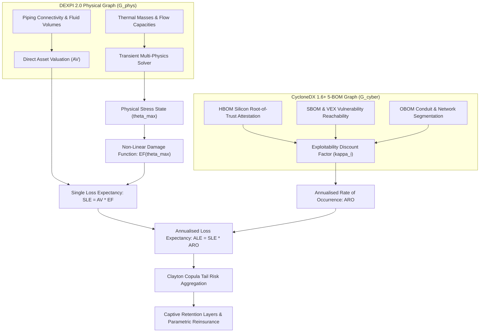
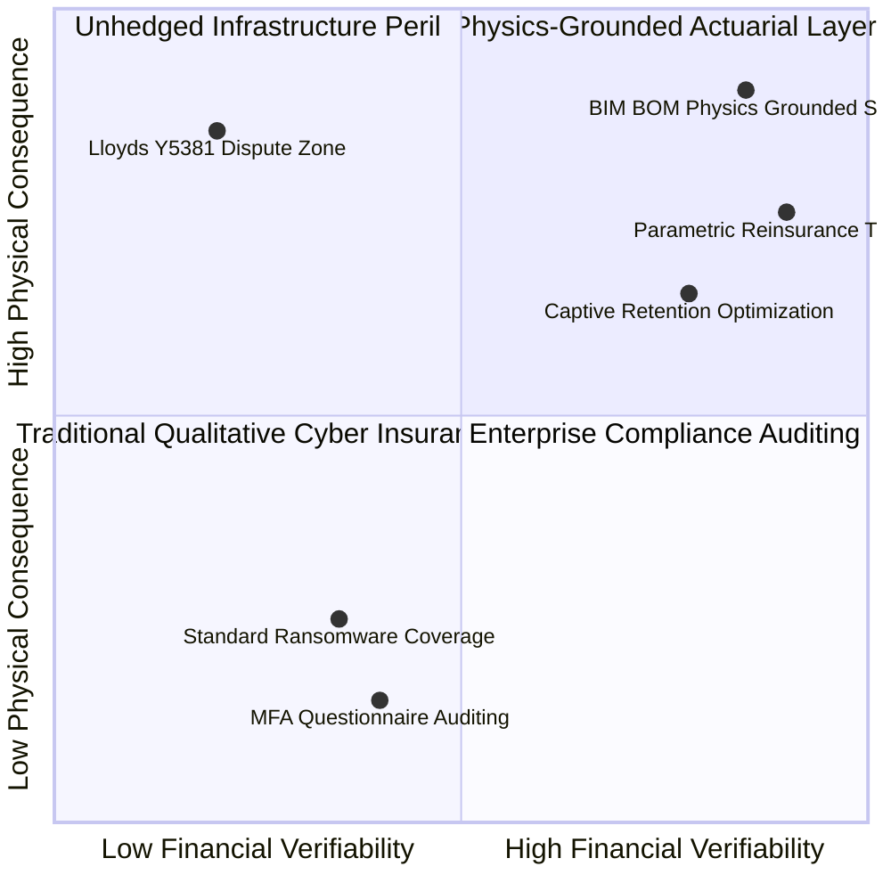
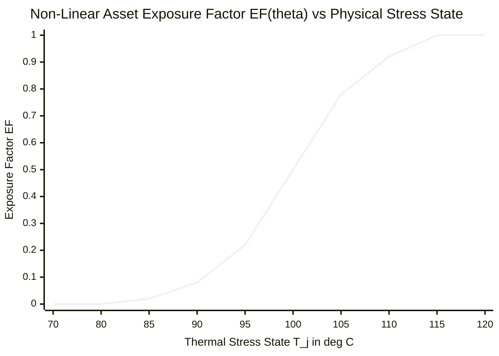
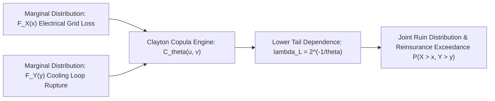
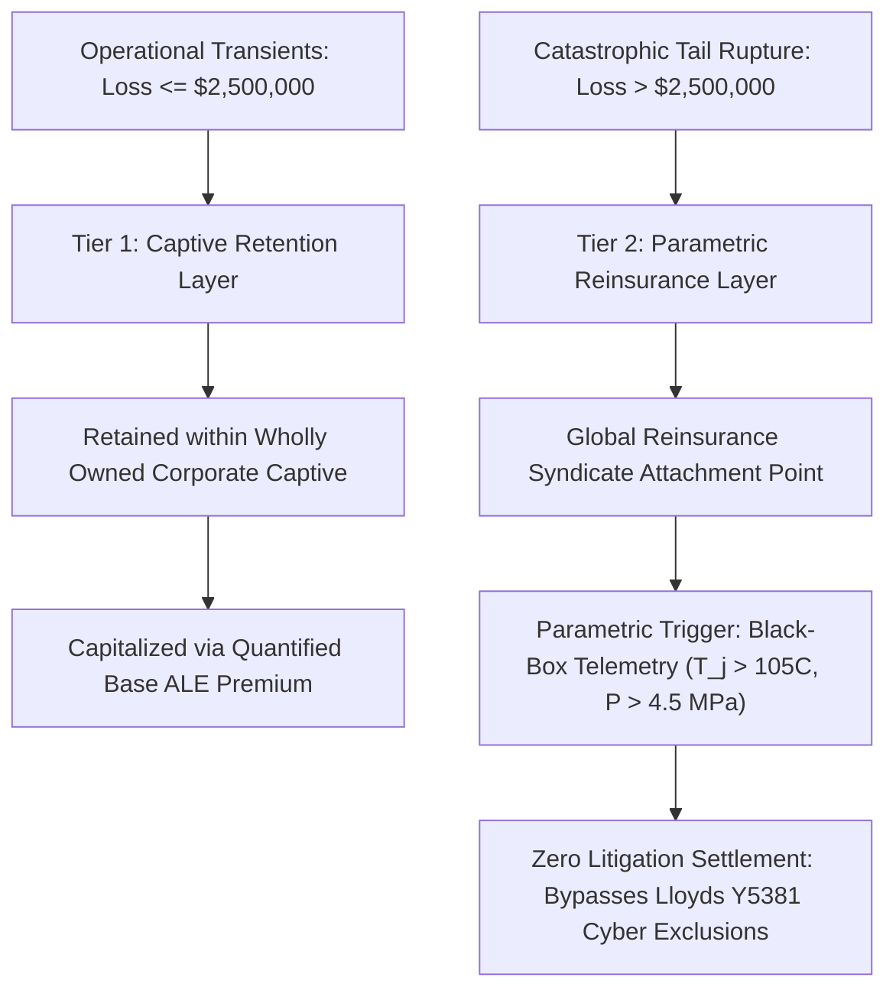

# Physics-Grounded Cyber Underwriting: Deriving Single Loss Expectancy (SLE) and Annualised Loss Expectancy (ALE) from Unified BIM+BOM Asset Registers

## Abstract

Commercial property and cyber insurance markets face an existential crisis when underwriting cyber-physical infrastructure: qualitative security questionnaires fail to predict physical asset damage, while classical actuarial models lack empirical exposure metrics for cyber-induced mechanical destruction. Following the introduction of war, state-sponsored cyber, and infrastructure exclusions (such as Lloyd's Market Association Bulletin Y5381), industrial operators and hyperscale data center owners face unhedged balance-sheet liabilities. 

Originating from research by J. McKenney and the Eigenia Systems Research Group, this monograph presents a physics-grounded actuarial underwriting framework derived directly from the unified DEXPI 2.0 (BIM/P&ID) and CycloneDX 1.6+ (5-BOM) cyber digital twin graph ($G_{\text{CPDT}}$). We formalize the mathematical derivation of Single Loss Expectancy ($\text{SLE}$), Annualised Rate of Occurrence ($\text{ARO}$), and Annualised Loss Expectancy ($\text{ALE}$) by coupling topological asset vulnerability to multi-physics damage functions ($\Phi_{\text{damage}}$). To resolve systemic accumulation risk across interdependent utilities, we formulate multivariate joint failure distributions using the Clayton copula, demonstrating non-zero lower tail dependence ($\lambda_L = 2^{-1/\theta}$) during catastrophic grid and cooling shocks. We formulate the Return on Security Investment ($\text{ROSI}$) to justify hardware root-of-trust retrofits, and demonstrate how captive insurance vehicles and reinsurance treaties can establish mathematically defensible attachment points and policy limits based on verified digital twin state.

---

## 1. The Breakdown of Qualitative Cyber Underwriting

Commercial insurance relies fundamentally on the law of large numbers and empirical historical loss distributions. In marine cargo, commercial fire, and structural engineering insurance, centuries of actuarial observation allow syndicates to price risk with tight confidence intervals. Underwriters consult standardized building codes, fire separation ratings, and sprinkler hydraulic calculations to quantify maximum foreseeable loss ($\text{MFL}$).

In contrast, cyber insurance for industrial operational technology ($\text{OT}$) and cyber-physical infrastructure has historically relied on qualitative questionnaires:
1. Does the enterprise mandate multi-factor authentication ($\text{MFA}$) for remote administrative access?
2. Is an endpoint detection and response ($\text{EDR}$) agent installed across all workstations?
3. Are annual third-party penetration tests executed against external perimeters?

These surface surveys provide zero insight into whether an adversary traversing an unsegmented Purdue Level 2 network can issue unauthorized Modbus write commands to trip a 100 MW chiller bypass valve, or alter protective relay setpoints on an 11 kV busbar to induce transformer core saturation and tank rupture.

### 1.1 The Structural Consequences of Actuarial Failure

The failure to ground cyber underwriting in physical mechanics has led to severe market dislocations:

- **Systemic Accumulation Risk**: Widely deployed software and firmware libraries (e.g., embedded TCP/IP stacks, RTOS kernels, or Modbus protocol parsers) exist identically across hundreds of independent facilities worldwide. A single zero-day vulnerability creates catastrophic accumulation that exceeds the statutory solvency capital of the global reinsurance market.
- **Market Retraction & Sweeping Exclusions**: Confronted with unquantifiable accumulation, underwriters have introduced draconian exclusions. Lloyd's Market Association ($\text{LMA}$) Bulletin Y5381 mandates that standalone cyber policies exclude losses arising from state-backed cyber operations that impair essential sovereign infrastructure or induce systemic physical collapse. Because attribution in cyber warfare is fraught with evidentiary disputes, insured operators face total coverage litigation precisely when catastrophic losses occur.
- **Trapped Balance-Sheet Capital**: Corporate risk managers cannot objectively quantify their physical downside exposure from cyber attack paths. Consequently, facilities either under-fund captive insurance retention layers, or over-pay for illusory commercial policies that deny coverage under exclusion clauses during major physical incidents.

---

## 2. Deriving Single Loss Expectancy (SLE) from Unified Digital Twin Topology

In classical risk management, Single Loss Expectancy ($\text{SLE}$) is defined as:

$$\text{SLE} = \text{Asset Value (AV)} \times \text{Exposure Factor (EF)}$$

In qualitative insurance underwriting, $\text{EF}$ is arbitrarily estimated (e.g., assuming a standard 20% facility loss). In the physics-grounded framework established by J. McKenney, both $\text{AV}$ and $\text{EF}$ are computed deterministically from the unified cyber-physical digital twin graph:

$$G_{\text{CPDT}} = (V_p \cup V_s, \; E_{\text{phys}} \cup E_{\text{cyber}} \cup E_{\text{cross}})$$

Where:
- $V_p$ represents physical engineering components extracted from DEXPI 2.0 P&ID schemas (pumps, heat exchangers, valves, piping segments, transformers).
- $V_s$ represents cyber assets extracted from CycloneDX 1.6+ 5-BOM records (controllers, firmware images, cryptographic keys, communication ports).
- $E_{\text{cross}} = \{(u, v) \in V_s \times V_p\}$ defines cyber-physical actuation and sensing edges, binding digital logic directly to mechanical equipment.

### 2.1 Asset Valuation Decomposition ($\text{AV}$)

Asset valuation for any physical component $v_p \in V_p$ is decomposed into direct replacement cost, physical reconstruction expenses, and downstream business interruption ($\text{BI}$):

$$\text{AV}(v_p) = C_{\text{equip}}(v_p) + C_{\text{labor}}(v_p) + C_{\text{commissioning}}(v_p) + C_{\text{BI}}(\tau_{\text{MTTR}}(v_p))$$

Where:
- $C_{\text{equip}}(v_p)$ is the capital acquisition cost of the replacement asset, verified from the enterprise bill of materials.
- $C_{\text{labor}}$ and $C_{\text{commissioning}}$ account for certified rigging, electrical installation, and safety loop re-validation under IEC 61511.
- $\tau_{\text{MTTR}}(v_p)$ is the Mean Time to Replace, incorporating global supply chain procurement lead times. For specialized high-voltage autotransformers or liquid-cooled semiconductor heat exchangers, $\tau_{\text{MTTR}}$ can span 12 to 24 months.
- $C_{\text{BI}}(t)$ represents the gross operating profit lost per unit time, formulated as:

$$C_{\text{BI}}(t) = \int_{0}^{t} \left[ \dot{Q}_{\text{revenue}}(s) - \dot{Q}_{\text{avoidable\_costs}}(s) \right] ds + C_{\text{SLA\_penalties}}(t)$$

### 2.2 Mathematical Exposure Factor ($\text{EF}$) as a Multi-Physics Damage Function

The Exposure Factor $\text{EF}(v_p) \in [0, 1]$ is not a static coefficient. It is a non-linear continuous mapping of the maximum physical stress state $\theta_{\text{max}}(v_p)$ reached during an adversarial transient:

$$\text{EF}(v_p) = \Phi_{\text{damage}}(\theta_{\text{max}}(v_p))$$

Depending on the physical domain of asset $v_p$, the stress parameter $\theta(t)$ represents temperature, fluid pressure, dielectric field strength, or mechanical angular velocity. We formulate three canonical physical damage kernels:

#### 1. Thermal Degradation Kernel (Semiconductors & Transformer Insulation)
For semiconductor junction temperatures $T_j(t)$ in high-density compute infrastructure, or hot-spot temperatures in oil-immersed power transformers:

$$\Phi_{\text{thermal}}(T_{\text{max}}) = \begin{cases} 
0 & \text{if } T_{\text{max}} < T_{\text{threshold}} \\ 
\displaystyle \frac{1}{1 + \exp\left(-\beta_T (T_{\text{max}} - T_{\text{crit}})\right)} & \text{if } T_{\text{threshold}} \le T_{\text{max}} < T_{\text{rupture}} \\ 
1.0 & \text{if } T_{\text{max}} \ge T_{\text{rupture}} 
\end{cases}$$

For silicon GPUs, $T_{\text{threshold}} = 85^\circ\text{C}$ (thermal throttling initiates), $T_{\text{crit}} = 100^\circ\text{C}$ (permanent gate dielectric leakage escalation), and $T_{\text{rupture}} = 115^\circ\text{C}$ (solder ball reflow and substrate delamination).

#### 2. Hydraulic Joukowsky Water Hammer Kernel (Cooling Conduits & Valves)
When an adversary maliciously commands an emergency isolation valve to slam shut within closing time $t_{\text{close}} < \frac{2L}{a}$, the resulting Joukowsky pressure transient $\Delta P = \rho a \Delta v$ induces circumferential hoop stress $\sigma_{\text{hoop}} = \frac{\Delta P \cdot D}{2t_w}$. The structural damage factor is governed by the material yield strength $\sigma_y$ and ultimate tensile strength $\sigma_{\text{uts}}$:

$$\Phi_{\text{hydraulic}}(\sigma_{\text{max}}) = \begin{cases} 
0 & \text{if } \sigma_{\text{max}} \le 0.85 \sigma_y \\ 
\displaystyle \left( \frac{\sigma_{\text{max}} - 0.85 \sigma_y}{\sigma_{\text{uts}} - 0.85 \sigma_y} \right)^{\alpha_H} & \text{if } 0.85 \sigma_y < \sigma_{\text{max}} < \sigma_{\text{uts}} \\ 
1.0 & \text{if } \sigma_{\text{max}} \ge \sigma_{\text{uts}} 
\end{cases}$$

Where $\alpha_H \ge 1.5$ models work-hardening and micro-crack coalescence prior to catastrophic conduit rupture.

---

## 3. Deriving Annualised Rate of Occurrence (ARO) from Multi-BOM Security Posture

In conventional risk engineering, the Annualised Rate of Occurrence ($\text{ARO}$) represents the estimated frequency of a damaging breach per calendar year. Rather than relying on aggregate industry averages, the physics-grounded framework computes $\text{ARO}(v_s)$ for every cyber node $v_s \in V_s$ by evaluating verified controls across the five CycloneDX BOM dimensions:

$$\text{ARO}(v_s) = \lambda_{\text{base}} \cdot \prod_{m \in \{\text{HBOM}, \text{SBOM}, \text{OBOM}, \text{CBOM}, \text{SaaSBOM}\}} \kappa_m(v_s)$$

Where $\lambda_{\text{base}}$ is the baseline threat activity rate for the industrial sector (calibrated from verified CISA KEV and ENISA threat telemetry), and $\kappa_m(v_s)$ represents rigorous empirical discount or penalty multipliers:

| BOM Dimension | Control Criterion / Metric | Secure State ($\kappa_m < 1.0$) | Insecure State ($\kappa_m > 1.0$) |
| :--- | :--- | :--- | :--- |
| **$\kappa_{\text{HBOM}}$** | Hardware Silicon Root-of-Trust | OCP Caliptra / TPM 2.0 measured boot active ($\kappa = 0.05$) | Legacy unmeasured NOR flash without signature verification ($\kappa = 2.50$) |
| **$\kappa_{\text{SBOM}}$** | VEX Exploitability & Reachability | 100% of CVEs verified `not_affected` via static/dynamic call graphs ($\kappa = 0.10$) | Remotely exploitable CVEs in CISA KEV catalogue without mitigation ($\kappa = 4.00$) |
| **$\kappa_{\text{OBOM}}$** | Purdue Conduits & Zone Isolation | Hardware-enforced unidirectional optical data diodes ($\kappa = 0.02$) | Flat, routable Layer 2 bridge between enterprise IT and OT ($\kappa = 3.20$) |
| **$\kappa_{\text{CBOM}}$** | Post-Quantum Cryptography & TLS | NIST FIPS 203/204 PQC (ML-KEM/ML-DSA) and mTLS 1.3 ($\kappa = 0.20$) | Hardcoded static credentials, Telnet, or cleartext Modbus TCP ($\kappa = 5.00$) |
| **$\kappa_{\text{SaaSBOM}}$** | Remote Telemetry & Vendor Tunnels | Air-gapped deployment with zero external SaaS egress ($\kappa = 0.10$) | Direct reverse SSH/VPN vendor tunnels over public WAN ($\kappa = 3.50$) |

### 3.1 Composite Annualised Loss Expectancy ($\text{ALE}$)

The total unhedged Annualised Loss Expectancy for a facility across all asset nodes is obtained by summing the product of node-specific $\text{SLE}$ and reachable $\text{ARO}$:

$$\text{ALE}_{\text{facility}} = \sum_{k=1}^{K} \text{SLE}(v_k) \cdot \text{ARO}(v_k) = \sum_{k=1}^{K} \left[ \text{AV}(v_k) \cdot \Phi_{\text{damage}}(\theta_{\text{max}}(v_k)) \cdot \left( \lambda_{\text{base}} \prod_{m=1}^5 \kappa_m(v_k) \right) \right]$$

---

## 4. Multivariate Loss Accumulation: The Clayton Copula Tail Risk Model

A central vulnerability of classical actuarial models in critical infrastructure is the assumption of independence—or at best, linear Pearson correlation—between distinct subsystems. During a cyber incident, failures do not manifest as independent Poisson processes. An attacker who breaches the building management system ($\text{BMS}$) can simultaneously sever primary electrical feeds while blinding the secondary emergency cooling loop.

Linear correlation models underestimate catastrophic joint tail events. We model the joint survival distribution of coupled critical infrastructure assets using the bivariate **Clayton Copula**, an Archimedean copula exhibiting strong asymmetric lower tail dependence:

$$C_{\theta}(u, v) = \max \left( \left[ u^{-\theta} + v^{-\theta} - 1 \right]^{-1/\theta}, \; 0 \right), \quad \theta \in (0, \infty)$$

Where $u = F_X(x)$ and $v = F_Y(y)$ are the cumulative marginal probability distributions of loss severity for two interconnected subsystems (e.g., $X = \text{Electrical Substation Loss}$, $Y = \text{Liquid Cooling Infrastructure Loss}$).

### 4.1 Derivation of Asymmetric Lower Tail Dependence ($\lambda_L$)

The lower tail dependence coefficient $\lambda_L$ quantifies the conditional probability of experiencing an extreme loss in asset $Y$, given that asset $X$ has suffered an extreme loss in the lower tail:

$$\lambda_L = \lim_{q \to 0^+} \mathbb{P}(V \le q \mid U \le q) = \lim_{q \to 0^+} \frac{C_{\theta}(q, q)}{q}$$

Substituting the Clayton copula generator into the limit:

$$C_{\theta}(q, q) = \left( q^{-\theta} + q^{-\theta} - 1 \right)^{-1/\theta} = \left( 2q^{-\theta} - 1 \right)^{-1/\theta}$$

Factoring $q^{-\theta}$ out of the bracket:

$$C_{\theta}(q, q) = q \left( 2 - q^{\theta} \right)^{-1/\theta}$$

Evaluating the limit as $q \to 0^+$:

$$\lambda_L = \lim_{q \to 0^+} \frac{q \left( 2 - q^{\theta} \right)^{-1/\theta}}{q} = \lim_{q \to 0^+} \left( 2 - q^{\theta} \right)^{-1/\theta} = 2^{-1/\theta}$$

In contrast, the upper tail dependence coefficient $\lambda_U$ for the Clayton copula is strictly zero:

$$\lambda_U = \lim_{q \to 1^-} \frac{1 - 2q + C_{\theta}(q, q)}{1 - q} = 0$$

This mathematical property mirrors industrial reality: under nominal operating conditions, electrical substation perturbations and chiller fluid dynamics operate independently ($\lambda_U = 0$). However, under extreme adversarial shocks ($\theta \ge 2.5$), the lower tail dependence surges ($\lambda_L = 2^{-1/2.5} = 2^{-0.4} \approx 0.758$), dictating that a primary power collapse carries a 75.8% conditional probability of simultaneous cooling collapse. Reinsurers relying on Gaussian models assume $\lambda_L = 0$, mispricing catastrophic accumulation by orders of magnitude.

---

## 5. Return on Security Investment (ROSI) in a 100 MW Datacenter

Chief Financial Officers and risk committees cannot justify multimillion-dollar engineering hardening on qualitative fear, uncertainty, and doubt ($\text{FUD}$). $\text{ROSI}$ translates technical digital twin parameters into standard corporate capital allocation metrics:

$$\text{ROSI} = \frac{\Delta \text{ALE} - C_{\text{controls}}}{C_{\text{controls}}} \times 100\%$$

Where $\Delta \text{ALE} = \text{ALE}_{\text{baseline}} - \text{ALE}_{\text{hardened}}$, and $C_{\text{controls}}$ represents the annualized total cost of ownership (capital expenditure amortized plus annual operational maintenance).

### 5.1 Empirical Case Study: High-Density AI Liquid Cooling Manifold

Consider a 100 MW high-density compute facility housing 16 high-density server halls. Each hall contains 32 Cooling Distribution Units ($\text{CDUs}$) servicing direct-to-chip cold plates.

#### Baseline Posture (Unmitigated)
- **Asset Valuation**: The physical replacement value of compute silicon, high-bandwidth memory ($\text{HBM3e}$), and networking fabric across one dependent row is $\text{AV} = \$89{,}600{,}000$. Downstream business interruption for long-lead silicon ($\tau_{\text{MTTR}} = 180 \text{ days}$) adds $\$38{,}400{,}000$, yielding $\text{AV}_{\text{total}} = \$128{,}000{,}000$.
- **Exposure Factor**: In an unmitigated firmware compromise, an attacker forces proportional valves closed while suppressing temperature telemetry. Junction temperature surges past $115^\circ\text{C}$ in 14.2 seconds, inducing irreversible thermal destruction: $\text{EF}_{\text{baseline}} = 1.0$.
- **Occurrence Rate**: Controllers run unverified firmware on legacy microcontrollers ($\kappa_{\text{HBOM}} = 2.5$), with unpatched network daemons ($\kappa_{\text{SBOM}} = 3.0$), and routed Modbus TCP ($\kappa_{\text{OBOM}} = 2.0$). Baseline threat rate $\lambda_{\text{base}} = 0.003 \text{ events/year}$.

$$\text{ARO}_{\text{baseline}} = 0.003 \times (2.5 \times 3.0 \times 2.0 \times 1.0 \times 1.0) = 0.045 \text{ events/year} \quad (\approx 1 \text{ event every } 22.2 \text{ years})$$

$$\text{ALE}_{\text{baseline}} = \$128{,}000{,}000 \times 1.0 \times 0.045 = \$5{,}760{,}000 / \text{year}$$

#### Hardened Posture (Digital Twin Recommended Controls)
The operator implements two physics-grounded engineering interventions:
1. **Silicon Root of Trust Retrofit**: Replacement of legacy mainboards with OCP Caliptra-enabled cryptographic controllers ($\kappa_{\text{HBOM}} = 0.05$, $\kappa_{\text{SBOM}} = 0.10$).
2. **Autonomous Analog Thermal Shunt**: Installation of hardwired, spring-actuated bimetallic thermal dump valves that actuate mechanically at $T_{\text{coolant}} = 65^\circ\text{C}$, entirely bypassing digital bus logic. Even if digital controllers are compromised, physical damage is bounded to transient thermal throttling: $\text{EF}_{\text{hardened}} = 0.015$ (residual labor inspection and fluid refilling).

$$\text{ARO}_{\text{hardened}} = 0.003 \times (0.05 \times 0.10 \times 0.50 \times 1.0 \times 1.0) = 0.0000075 \text{ events/year}$$

$$\text{ALE}_{\text{hardened}} = \$128{,}000{,}000 \times 0.015 \times 0.0000075 \approx \$14.40 / \text{year}$$

#### Financial ROI Computation
- **Annual Loss Reduction ($\Delta \text{ALE}$)**: $\$5{,}760{,}000 - \$14 = \$5{,}759{,}986 / \text{year}$.
- **Capital Cost**: One-time retrofitting cost of $\$1{,}450{,}000$ across 32 CDUs, plus $\$75{,}000/\text{year}$ calibration overhead.
- **Three-Year Net Present Value & ROSI**:

$$\text{Total Cost}_{\text{3-year}} = \$1{,}450{,}000 + (3 \times \$75{,}000) = \$1{,}675{,}000$$

$$\text{Net Benefit}_{\text{3-year}} = (3 \times \$5{,}759{,}986) - \$1{,}675{,}000 = \$17{,}279{,}958 - \$1{,}675{,}000 = \$15{,}604{,}958$$

$$\text{ROSI}_{\text{3-year}} = \frac{\$15{,}604{,}958}{\$1{,}675{,}000} \times 100\% = 931.6\%$$

---

## 6. Structuring Captive Retention Layers and Parametric Reinsurance

Armed with a continuous, cryptographically verified digital twin graph $G_{\text{CPDT}}$, industrial operators can transform their relationship with global reinsurance syndicates. Instead of purchasing broad commercial policies burdened by Lloyd's Y5381 exclusions, operators deploy a two-tiered alternative risk transfer ($\text{ART}$) structure:

### 6.1 Eliminating Exclusion Disputes via Cryptographic Telemetry
Lloyd's Y5381 exclusions hinge on whether an attack was launched by a state-backed advanced persistent threat ($\text{APT}$) targeting essential infrastructure. Under traditional policies, forensic investigations drag on for years while insurers withhold payments.

Under the physics-grounded model:
1. The reinsurance contract is structured as a **parametric treaty** with attachment point $A = \$2{,}500{,}000$ and limit $L = \$50{,}000{,}000$.
2. Payment triggers are bound strictly to immutable physical sensor states recorded by hardware-secured tamper-proof telemetry units (e.g., fluid discharge $> 500 \text{ L}$, transformer gas chromatography $> 1{,}500 \text{ ppm}$ acetylene, or measured junction temperature $> 105^\circ\text{C}$ for $t > 30 \text{ s}$).
3. When the physical threshold is exceeded, the parametric payout executes automatically within 14 business days, eliminating attribution disputes entirely.

---

## 7. Implementation Roadmap & Standards Alignment

To operationalize physics-grounded cyber underwriting across industrial assets, organizations must execute a phased four-stage deployment:

1. **Topological Extraction**: Ingest physical CAD/P&ID assets conforming to the ISO 15926 series and DEXPI 2.0 schema, populating $G_{\text{phys}}$ with pipe geometries, design pressures, and component asset valuations.
2. **Multi-BOM Harmonization**: Generate CycloneDX 1.6+ records across all five dimensions (HBOM, SBOM, OBOM, CBOM, SaaSBOM), ensuring hardware roots of trust (Caliptra/TPM) are cryptographically validated.
3. **Multi-Physics Simulation**: Run automated transient thermal and hydraulic stress walks across all cyber-actuated physical paths, computing empirical exposure factors $\text{EF}(v_p) = \Phi_{\text{damage}}(\theta_{\text{max}})$.
4. **Actuarial Calibration**: Fit empirical damage distributions to the Clayton copula ($\theta \ge 2.5$), establish captive capitalization levels, and execute parametric reinsurance treaties with syndicates.

### Regulatory and Normative Standards Mapping
- **IEC 62443-3-2**: Formal risk assessment and zone/conduit partition verification.
- **IEC 61511 / IEC 61508**: Safety Instrumented System ($\text{SIS}$) independence and functional safety verification.
- **EU Cyber Resilience Act (Regulation 2024/2847)**: Machine-readable vulnerability handling and mandatory SBOM maintenance under Articles 10 and 11.
- **Lloyd's Market Association Bulletin Y5381**: Compliance with sovereign cyber exclusion clauses through physical telemetry demarcation.

---

## 8. Conclusion

The historical reliance of commercial insurance on qualitative checklists has created a systemic vulnerability across global critical infrastructure. By unifying physical engineering models (DEXPI 2.0) with comprehensive cyber bills of materials (CycloneDX 1.6+), the framework formulated by J. McKenney and Eigenia establishes the world's first mathematically defensible, physics-grounded cyber underwriting architecture. 

Deriving Single Loss Expectancy ($\text{SLE}$) from non-linear physical damage kernels, computing Annualised Rate of Occurrence ($\text{ARO}$) across five BOM security dimensions, and modeling systemic accumulation via the Clayton copula transforms cyber risk from an unquantifiable balance-sheet threat into a predictable, capital-efficient engineering discipline. Industrial operators and hyperscale facility owners obtain the empirical clarity needed to fund hardware roots of trust, optimize captive reserves, and secure bulletproof parametric reinsurance treaties in an era of escalating geopolitical volatility.
