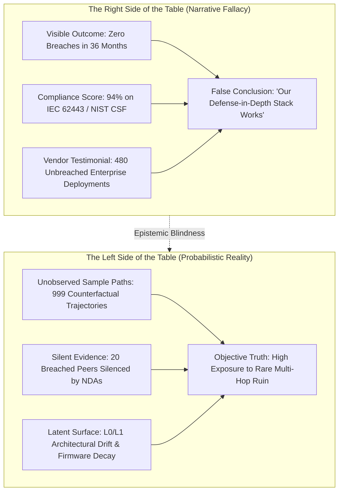
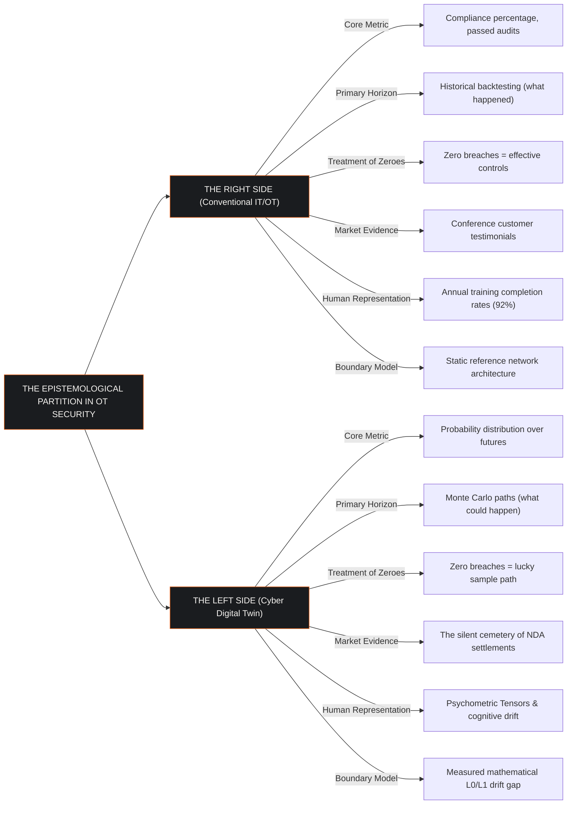
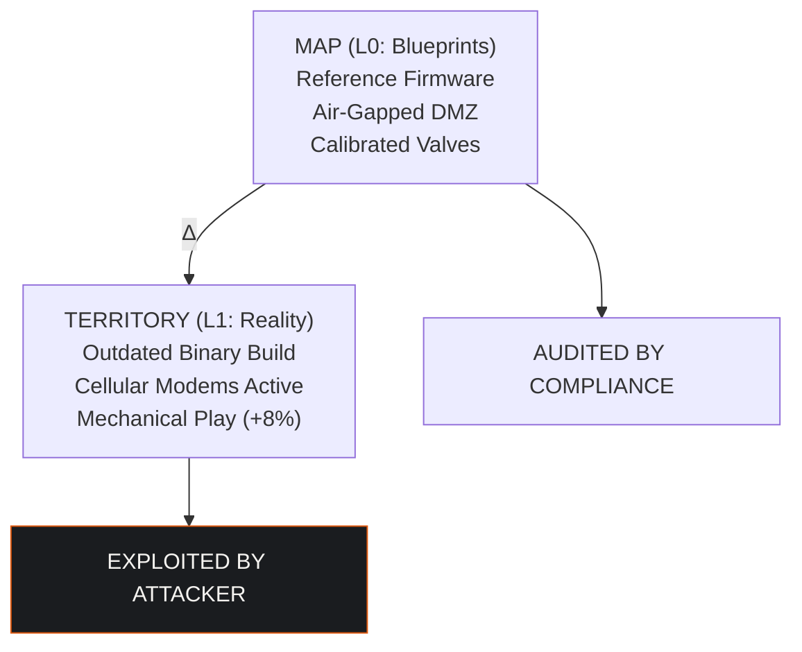
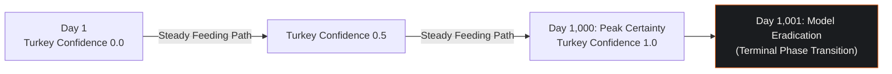
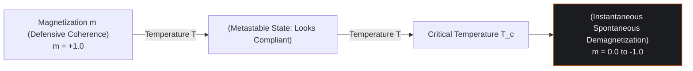
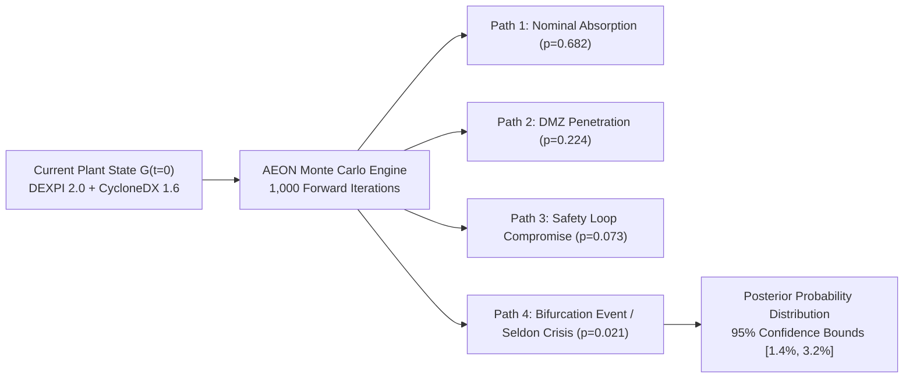
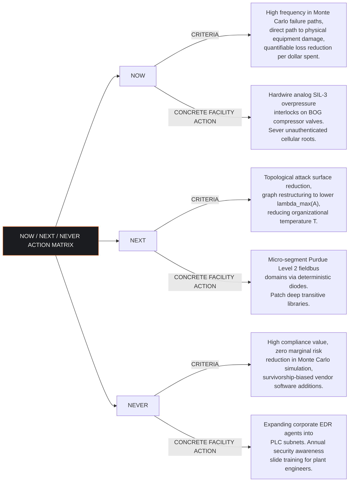

## 1. The Epistemological Fracture in Critical Infrastructure Defense

In 2001, Nassim Nicholas Taleb published *Fooled by Randomness*, demonstrating that financial risk managers systematically confuse luck with skill and mistake favorable historical outcomes for structural stability. Financial institutions evaluated traders by visible track records while remaining blind to the unobserved counterfactual worlds where identical strategies produced catastrophic insolvency.

The modern operational technology (OT) cybersecurity sector suffers from the identical epistemological failure.

Industrial operators evaluate security maturity through visible artifacts: passed compliance audits against IEC 62443 or NIST CSF, completed tabletop exercises, green monitoring dashboards, and uninterrupted operational track records. When an electrical utility, water treatment authority, or battery energy storage facility operates for three consecutive years without a major security incident, leadership treats that track record as empirical proof of defensive competence.

The absence of an incident is not proof of security. It indicates that the specific combination of adversary capability, geopolitical targeting, supply-chain zero-days, and internal operational drift has not yet traversed a viable attack path to the physical equipment. 

The facility sits on a single realized sample path inside an enormous probability space. Conventional security methods manage stories about risk. The Cyber Digital Twin (CDT) models the underlying probability distribution.

---

## 2. The Two Sides of the Table: Finance vs. Facilities

Taleb structures probability around an epistemological partition: the two sides of the table.

### 2.1 The Right Side of the Table
The Right Side is the deterministic, narrative-driven domain where humans prefer to live. In this space, causality is straightforward, historical performance guarantees future outcomes, and effort correlates with success.

In industrial cybersecurity, the Right Side consists of:
1. **Compliance Certifications**: Achieving third-party audit stamps that attest to policies, password lengths, and network diagrams.
2. **Vendor Case Studies**: Security vendors placing surviving customers on stage at conferences. If an endpoint security product protects 500 plants and 480 remain unbreached, the vendor celebrates those 480 as proof of product efficacy.
3. **Point-in-Time Penetration Tests**: Annual exercises that identify twelve medium-severity misconfigurations, resolve them, and issue a clean bill of health.

### 2.2 The Left Side of the Table
The Left Side is the probabilistic universe where physical and cybernetic systems actually fail. It is non-linear, heavy-tailed, and governed by extreme events that historical records do not contain.

In industrial cybersecurity, the Left Side consists of:
1. **The Full Attack Distribution**: Thousands of multi-hop attack graphs where an adversary leverages unpatched transitive libraries, undocumented maintenance ports, and operator stress to reach safety-critical instrumentation.
2. **The Silent Evidence**: The 20 facilities that deployed the identical vendor stack, suffered catastrophic compromise, quietly replaced the product, and signed non-disclosure agreements under insurer direction. Their failure is erased from the industry database.
3. **Combinatorial Exploitation**: Chains of individually benign configuration choices that, when executed in an unforeseen sequence, bypass all perimeter firewalls and induce irreversible equipment destruction.

---

## 3. Map vs. Territory: The L0/L1 Gap as Attack Surface

Taleb's central warning against model-induced risk is the confusion of the map with the territory.

In the Cyber Digital Twin, this distinction is formalized mathematically across the foundational architectural layers:

$$\Delta_{\text{drift}}(t) = \| \mathbf{G}_{\text{L1}}(t) - \mathbf{G}_{\text{L0}} \|_{\mathcal{F}}$$

Where:
* $\mathbf{G}_{\text{L0}}$ is the **Map** (Layer 0 Equipment Catalog): The Platonic ideal of the facility. It comprises vendor datasheets, engineering design blueprints, DEXPI 2.0 XML piping schematics, and clean reference firmware builds.
* $\mathbf{G}_{\text{L1}}(t)$ is the **Territory** (Layer 1 Customer Equipment): The physical assets operating in the plant. It encompasses actual serial numbers, operational wear, unauthorized technician patches, temporary maintenance bridges left active, and five years of configuration decay.
* $\Delta_{\text{drift}}(t)$ is the **Frobenius norm of architectural drift**: A continuous measurement of the gap between design and reality.

Every successful cyber attack against hardened critical infrastructure operates inside $\Delta_{\text{drift}}$. The compliance auditor verifies $\mathbf{G}_{\text{L0}}$ against the IEC 62443 standard and issues a certificate. The adversary scans the live subnet, identifies $\Delta_{\text{drift}}$, and exploits the unmapped territory.

---

## 4. The Turkey Problem in Critical Infrastructure: The Ising Phase Transition

Taleb popularized Bertrand Russell's turkey problem: a turkey is fed by the farmer for 1,000 consecutive days. With each feeding, the turkey's analytical model increases its confidence that the farmer is a benevolent protector. On day 1,001, the day before Thanksgiving, the model undergoes a revision with maximum prejudice.

In critical infrastructure, the turkey problem is not an allegory. It is a thermodynamic phase transition governed by the Ising mean-field formulation of organizational security culture:

$$\frac{dm(t)}{dt} = -m(t) + \tanh\left(\frac{J \cdot z \cdot m(t) + h}{T}\right)$$

Where:
* $m(t) \in [-1, 1]$ represents the coherent security posture (magnetization) of the operating organization. A value of $m \to +1$ denotes disciplined adherence to verification procedures and alarm triage.
* $J$ is the interpersonal coupling strength between control room operators and cybersecurity defenders.
* $z$ is the coordination coordination degree across shifts.
* $h$ is the external regulatory pressure field.
* $T$ is the operational temperature of the facility, driven by shift fatigue, alarm overload, budget cuts, and staff turnover.

As operational temperature $T$ increases toward the critical threshold $T_c = J \cdot z$, the system displays no gradual outward warning. The compliance score remains 94%. The vendor software runs uninterrupted. 

However, at $T \ge T_c$, the stable fixed point at $m > 0$ vanishes. The defensive coherence collapses spontaneously to zero. The organization remains outwardly identical, but its capacity to coordinate an effective defensive response during an anomalous event has vanished. 

The catastrophic failure appears sudden to the board of directors. The digital twin proves that the system had been drifting toward $T_c$ for twelve months.

---

## 5. The Monte Carlo Engine: Operationalizing Epistemic Honesty

The antidote to Right-Side deception is the computational exploration of the counterfactual state space. The Cyber Digital Twin AEON engine operationalizes Taleb's methodology by executing 1,000 forward Monte Carlo simulations against the multi-layer facility graph:

### 5.1 The Simulation Pipeline
1. **Initial Vector Ingestion**: At $t = 0$, extract the full physical and topological state vector $\mathbf{P}(0)$ across the seven architectural layers, incorporating measured L0/L1 drift and active threat intelligence.
2. **Adversary Campaign Generation**: Launch randomized multi-hop attack trajectories aligned with MITRE ATT&CK for ICS. Each trajectory introduces stochastic variations in attacker capability, weaponized zero-days, shift fatigue, and component wear.
3. **Seldon Crisis Detection**: Track system state trajectories $\mathbf{x}(t)$ against the saddle-node bifurcation model:
   $$\frac{dx}{dt} = \mu + x^2$$
   When the control parameter $\mu \to 0^{-}$, the stable operating fixed point and the unstable threshold annihilate. The distance to collapse compresses non-linearly as $\sqrt{|\mu|}$.
4. **Posterior Probability Output**: Replace static dashboards with verified probability distributions:
   $$\mathbb{P}(\text{Loss of Physical Containment}) = 2.1\% \quad \text{with } 95\% \text{ CI } [1.4\%, 3.2\%]$$

---

## 6. The NOW / NEXT / NEVER Capital Allocation Framework

Taleb advocates asymmetric positioning: eliminating catastrophic ruin while refusing to overpay for useless average-case optimizations. The Cyber Digital Twin translates Monte Carlo distributions into an operational investment framework:

---

## 7. Strategic Implication: From Narrative to Distribution

Engineering leadership and reinsurance syndicates must discard the illusion that an audit trail constitutes safety.

* Industrial security is not an administrative status; it is a probability distribution over non-linear dynamical systems.
* Relying on historical incident-free streaks is identical to celebrating an untested options book.
* The Cyber Digital Twin replaces administrative comfort with mathematical rigor, mapping the unobserved cemetery of silent evidence before the physical machinery pays the price.
