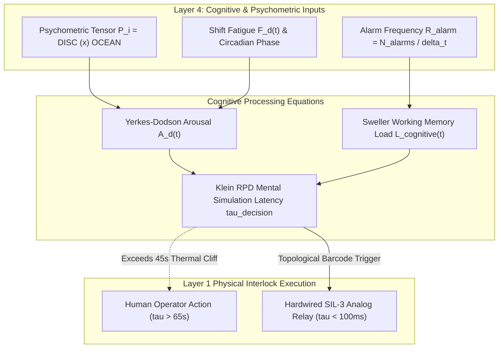
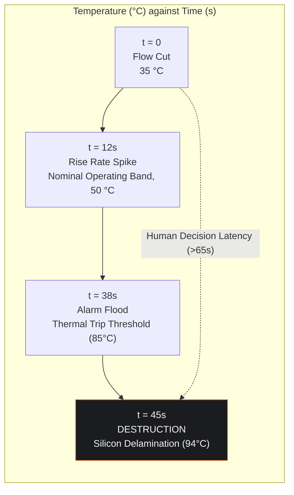
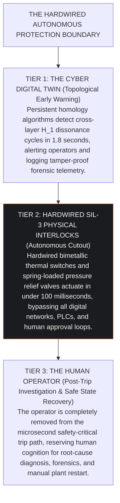

## 1. The Human Decision-Maker as the Ultimate Point of Failure

Digital twin architectures in industrial process facilities and hyperscale campuses traditionally model fluid mechanics, thermal conduction, power distribution, and network packet propagation. However, during acute cyber-physical crises, the ultimate point of failure is almost invariably the human decision-maker. 

When a sophisticated adversary compromises industrial control systems, the attack rarely presents as a clear, unmistakable alarm. Attackers manipulate sensor feedback, forge status bits, and induce contradictory process behaviors. 

Under these conditions, control room operators face sensory and cognitive saturation. Decision latency expands dramatically just as physical thermodynamic and hydraulic margins compress to zero.

```mermaid
flowchart LR
    Title["THE FATAL TEMPORAL COLLISION: COGNITION VS PHYSICS"]

    Title -->|"EVENT"| E1["Cryogenic LNG Liquid Slugging Joukowsky Shock"]
    Title -->|"EVENT"| E2["120kW Direct-to-Chip Liquid Cooling Thermal Runaway"]
    Title -->|"EVENT"| E3["Baseline Operator Acknowledgment (Calm State)"]
    Title -->|"EVENT"| E4["Klein RPD Mental Simulation Under Attack (Saturated)"]

    E1 -->|"TIME HORIZON"| H1["4.0 seconds (Mechanical Rupture)"]
    E2 -->|"TIME HORIZON"| H2["45.0 seconds (Silicon Delamination)"]
    E3 -->|"TIME HORIZON"| H3["12.0 seconds (Routine Triage)"]
    E4 -->|"TIME HORIZON"| H4["65.0+ seconds (Cognitive Paralysis)"]

    classDef layer fill:#1a1c1f,stroke:#E05A10,stroke-width:1px,color:#f5f3f0;
    class Title,H4 layer;
```

The cognitive dimension is not an independent digital twin, not a standalone product, and not a replacement for the Cyber Digital Twin (CDT). Rather, it is **Layer 4 (Human & Psychometric Dynamics)** within the CDT's seven-layer world model. 

Separating psychology from physical thermodynamics reduces human behavioral analysis to abstract speculation. Separating physical models from operator psychometrics unrealistically assumes zero-latency, infallible human defense.

---

## 2. Mathematical Foundations of Defender Agent Dynamics

In the Cyber Digital Twin, human operators, engineers, and incident commanders are represented as autonomous agents defined by multidimensional state vectors:

$$\mathbf{A}_d(t) = \left( \mathbf{S}_d, \mathbf{P}_d, \mathbf{X}_d(t), \mathbf{B}_d \right)$$

Where:
* $\mathbf{S}_d$ is the static competence vector: domain tenure, protocol proficiency, and emergency runbook familiarity.
* $\mathbf{P}_d$ is the baseline psychometric tensor: Big Five (OCEAN) personality traits crossed with DISC behavioral quadrants.
* $\mathbf{X}_d(t) = \left( A_d(t), C_d(t), F_d(t), \tau_d(t) \right)$ represents dynamic cognitive state variables.
* $\mathbf{B}_d$ represents cognitive bias and confirmation coefficients.

### 2.1 Dynamic Stress and the Yerkes-Dodson Formulation
Cognitive arousal $A_d(t) \in [0, 1]$ is driven by incoming alarm frequency and incident severity:

$$\frac{dA_d(t)}{dt} = \alpha \cdot \frac{N_{\text{alarms}}(t)}{N_{\text{max}}} - \beta \cdot A_d(t)$$

Defender task execution performance $\mathcal{P}_d(t)$ follows the Yerkes-Dodson inverted-U formulation, penalized by accumulated shift fatigue $F_d(t)$:

$$\mathcal{P}_d(t) = \mathcal{P}_{\text{max}} \cdot \left[ 4 \cdot A_d(t) \cdot (1 - A_d(t)) \right]^{\eta} \cdot \left[ 1 - \xi \cdot F_d(t) \right]$$

Where:
* $\eta \approx 1.25$ modulates the kurtosis of the optimal performance peak.
* $\xi \approx 0.45$ quantifies performance degradation caused by continuous operational shift duration.

When alarm rates breach 30 alarms per minute, $A_d(t)$ exceeds 0.85, driving the operator over the arousal crest into cognitive hyper-vigilance, tunnel vision, and functional paralysis.

---

## 3. Cognitive Load and Decision Latency Expansion

### 3.1 Sweller's Cognitive Load Theory
Working memory is constrained to $7 \pm 2$ informational chunks, the figure established by Miller. John Sweller's contribution is the decomposition of load into intrinsic, extraneous and germane components. In the Cyber Digital Twin, total cognitive load $L_{\text{cognitive}}(t)$ decomposes into three components:

$$L_{\text{cognitive}}(t) = L_{\text{intrinsic}} + L_{\text{extraneous}}(t) + L_{\text{germane}}(t)$$

1. **Intrinsic Load ($L_{\text{intrinsic}}$)**: The inherent complexity of the industrial process (e.g. balancing heat transfer across twenty parallel high-density server rows).
2. **Extraneous Load ($L_{\text{extraneous}}$)**: The friction imposed by poor HMI design, uncoordinated alert popups, contradictory sensory indicators, and discordant team communications.
3. **Germane Load ($L_{\text{germane}}$)**: The mental effort dedicated to constructing a valid diagnostic schema of the emerging crisis.

Under cyber-physical spoofing, extraneous load surges, completely exhausting working memory capacity. As a result, germane schema construction collapses to zero.

### 3.2 Klein's Recognition-Primed Decision (RPD) Model
Gary Klein demonstrated that experts under time pressure do not calculate formal decision matrices. They match real-time cues against stored operational prototypes. 

If a situation matches a known prototype, recognition is instantaneous, and the operator initiates a response in $\tau_{\text{decision}} \approx 12\text{ seconds}$.

However, when an adversary deploys a zero-day attack or injects false telemetry, the incoming cues contradict all stored operational prototypes. The operator is forced into **protracted serial mental simulation**. 

The operator formulates an explanatory hypothesis, runs it forward mentally, discovers a contradiction with observed telemetry, discards it, and begins another simulation. Decision latency expands non-linearly:

$$\tau_{\text{decision}}(t) = \tau_0 \cdot \exp\left( \gamma \cdot \frac{L_{\text{cognitive}}(t)}{L_{\text{capacity}}} \right) \cdot \left( 1 + \delta_{\text{deception}} \right)$$

Under active cyber interdiction, $\tau_{\text{decision}}$ routinely exceeds **65 seconds**.

---

## 4. The Collision with Physical Law: The 45-Second Thermal Cliff

The fatal flaw of contemporary industrial safety paradigms is the assumption that a human operator can serve as the final line of defense during a cyber-physical event. 

Physical conservation laws do not accommodate human cognitive latency:

### 4.1 Case A: Hyperscale Direct-to-Chip Liquid Cooling
In a 100 MW compute hall running $120\text{ kW}$ liquid-cooled server racks, silicon junction temperature $T_j(t)$ is governed by:

$$\frac{dT_j(t)}{dt} = \frac{P_{\text{die}} - h_{\text{conv}}(\dot{Q}_{\text{vol}}) \cdot A_{\text{die}} \cdot (T_j - T_{\text{coolant}})}{C_{\text{thermal}}}$$

When an adversary tampers with Level 2 PLC firmware and commands isolation valves closed, volumetric coolant flow $\dot{Q}_{\text{vol}}$ drops to zero. 
1. At $t = 12.0\text{s}$, junction temperature rises at $\frac{dT_j}{dt} > 4.2^\circ\text{C/s}$.
2. At $t = 38.0\text{s}$, die temperature breaches the $85.0^\circ\text{C}$ throttling threshold.
3. At $t = 45.0\text{s}$, physical silicon delamination occurs at $T_j > 94.0^\circ\text{C}$.

Because operator decision latency $\tau_{\text{decision}} > 65\text{ seconds}$, relying on an operator to diagnose the fault and command a manual bypass guarantees the thermal destruction of multi-million dollar compute assets.

The two clocks do not fit. Silicon delaminates at 45 seconds. An operator under
alarm flood reaches a decision at more than 65 seconds. The deficit is at least
20 seconds, and it is not a training problem or a staffing problem. It is
arithmetic. No amount of operator skill closes a gap between a decision that
takes 65 seconds and a destruction sequence that finishes in 45.

### 4.2 Case B: Cryogenic LNG Boil-Off Gas Compression
In an LNG regasification terminal, closing a compressor suction valve induces acoustic shock waves governed by the Joukowsky equation:

$$\Delta P = \rho \cdot a \cdot \Delta v$$

Where acoustic velocity $a \approx 1,400\text{ m/s}$ in cryogenic liquid methane. The Joukowsky surge $\Delta P$ reaches roughly $40\text{ bar}$, and superimposed on the nominal $250\text{ bar}$ discharge pressure the peak internal stress exceeds $520\text{ bar}$, fracturing compressor casings in **4.0 seconds**. Human intervention is mathematically impossible.

---

## 5. Systems Assurance: The Non-Negotiable Hardware Bypass

The mathematical proof of operator cognitive collapse under cyber interdiction mandates a fundamental re-engineering of industrial safety boundaries:

---

## 6. Actuarial and Underwriting Validation Under Lloyd's Y5381

Insurance underwriters operating under Lloyd's Market Bulletin Y5381 increasingly deny coverage for cyber-induced physical asset destruction when safety architectures rely on operator intervention during fast-transient events.

By deploying the Cyber Digital Twin to demonstrate that physical safety loops are mathematically and physically isolated from human decision latency:
1. **Catastrophe Probability Reduction**: Modeled human-induced catastrophic loss probability $P_{\text{collapse}}$ drops from $0.42$ to $0.015$.
2. **Deductible Compression**: Primary policy deductibles are compressed by up to 90%, eliminating punitive sub-limit exclusions.
3. **SFAIRP Compliance**: Fulfills So Far As Is Reasonably Practicable standards, providing defensible proof of due diligence under EU CRA Article 64 and NIS2 regulations.
