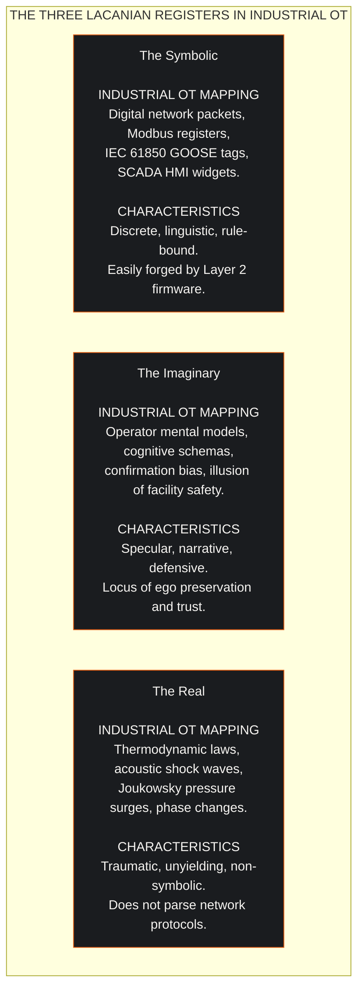
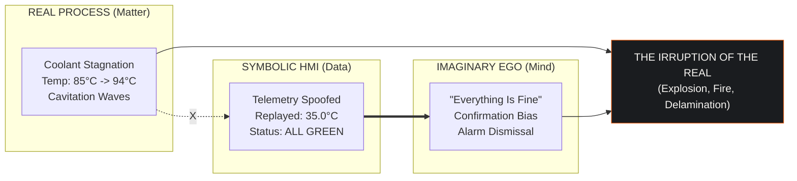
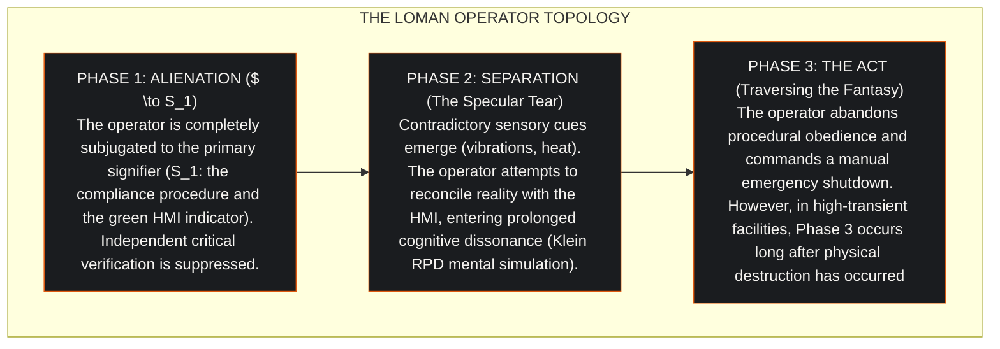
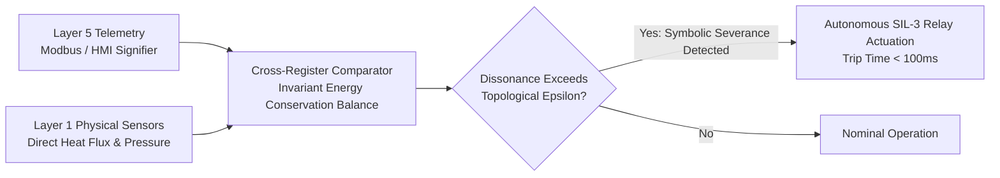

## 1. The Technological Mirror: Deception at the Human Interface

In high-consequence industrial facilities, the human operator does not interact directly with physical matter. The operator does not observe the phase transition of liquid methane inside a cryogenic heat exchanger, the shear stress twisting a high-voltage generator shaft, or the thermal flux boiling dielectric coolant in a compute hall.

The operator interacts with a screen. 

Supervisory Control and Data Acquisition (SCADA) Human-Machine Interfaces (HMIs) represent physical reality through digital signifiers: animated valve icons, green status indicators, numeric readouts, and scrolling trend lines. 

Industrial cyber sabotage; observed from the Stuxnet centrifuge attacks to the Triton safety instrumented system overrides; exploits this mediation. The adversary does not immediately attack the physical machinery. The adversary executes a **Symbolic Severance**: manipulating the digital signifiers to maintain an illusion of tranquility while driving the underlying physical process toward catastrophic failure.

```mermaid
flowchart TD
    accTitle: The Lacanian triad and the cyber-physical severance that breaks it
    accDescr {
      The Symbolic register holds Modbus registers, network packets and HMI
      graphics. The Imaginary holds operator ego, mental schema and comforting
      illusion. The Real holds unforgiving physical conservation laws. All three are
      mutually linked. The severance runs alongside: adversary firmware manipulation
      decouples telemetry from physics, leaving the operator trapped in a
      symbolic-to-imaginary lag until the Real irrupts as pipe rupture or silicon
      delamination.
    }
    subgraph LacanBorromean["The Lacanian Triad in Critical Infrastructure"]
        S["THE SYMBOLIC REGISTER<br/>Modbus Registers, Network Packets, HMI Graphics"]
        I["THE IMAGINARY REGISTER<br/>Operator Ego, Mental Schema, Comforting Illusion"]
        R["THE REAL REGISTER<br/>Unforgiving Physical Conservation Laws"]
        
        S <--> I
        I <--> R
        R <--> S
    end

    subgraph AttackMechanism["The Cyber-Physical Severance"]
        Hack["Adversary Firmware Manipulation (L2/L5)"]
        Sever["Symbolic Severance: Telemetry Decoupled from Physics"]
        Lag["Symbolic-Imaginary Lag: Operator Trapped in Fantasy"]
        Trauma["The Irruption of the Real: Pipe Rupture / Silicon Delamination"]
        
        Hack --> Sever
        Sever --> Lag
        Lag --> Trauma
    end
```

To model and prevent this failure mode, the Cyber Digital Twin incorporates Jacques Lacan's topological psychology: the **Borromean knot of the Real, the Symbolic, and the Imaginary**.

---

## 2. The Triadic Registers Formalized for Industrial Control

Lacan established that human subjectivity is organized across three inseparable registers. When applied to industrial operational technology, each register maps to a distinct operational reality:

### 2.1 The Symbolic Register (Signifiers and Syntax)
The Symbolic register comprises the formal encodings that translate physical reality into digital language: TCP/IP packets, Modbus Function Codes, sensor voltages digitized via analog-to-digital converters, and alarm lists. The Symbolic operates exclusively through discrete syntax. It has no physical mass.

### 2.2 The Imaginary Register (The Specular Illusion)
The Imaginary register is the psychological domain where the operator forms a cohesive mental model of the facility. Just as a child forms an ego by identifying with an idealized reflection in a mirror (Lacan's mirror stage), the control room operator identifies with the HMI dashboard. 

When the screen displays green pump indicators and nominal temperature lines ($35.0^\circ\text{C}$), the operator internalizes a comforting sense of mastery: *"The plant is running well, and I am in control."* 

The Imaginary is the domain of confirmation bias and narrative rationalization. Contradictory physical cues (such as an audible hum from a pump or a faint burning odor) are dismissed as secondary sensor glitches to preserve the stability of the mental schema.

### 2.3 The Real Register (The Unyielding Physical Law)
The Real is that which resists symbolization absolutely. The Real is the physical conservation of mass, momentum, and energy:
* The thermodynamic conduction of heat across a silicon junction:
  $$\frac{dT_j}{dt} = \frac{P_{\text{die}} - \dot{Q}}{C_{\text{thermal}}}$$
* The acoustic water hammer shock of Joukowsky pressure waves:
  $$\Delta P = \rho \cdot a \cdot \Delta v > 520\text{ bar}$$
* The phase boundary of liquid methane at $-162.0^\circ\text{C}$.

The Real does not negotiate, does not parse network credentials, and does not care about passed compliance audits. When manipulated, the Real acts with absolute physical consequence.

---

## 3. The Cyber Interdiction as Symbolic Severance

In a classical IT attack, the goal is data theft or encryption. In an industrial cyber-physical attack, the objective is to induce physical damage while delaying operator intervention. 

The attacker achieves this by severing the knot between the Symbolic and the Real:

1. **The Severance**: The attacker injects malicious logic into Layer 2 field controllers, commanding physical actuators closed while freezing Layer 5 supervisory telemetry at nominal operating values ($35.0^\circ\text{C}$, $38.5\text{ L/min}$).
2. **The Imaginary Entrapment**: The operator observes the HMI and remains trapped within the Imaginary register. The operator assumes that the digital signifier equals physical reality. 
3. **The Symbolic-Imaginary Lag**: The duration between the initial severance ($t_{\text{severance}}$) and the moment physical destruction forces awareness is defined as the lag parameter:
   $$\tau_{\text{lag}} = t_{\text{irruption}} - t_{\text{severance}}$$
4. **The Irruption of the Real**: At $t = t_{\text{irruption}}$, the physical limit is breached. Silicon delaminates, pipe walls rupture, or compressor casings shatter. The traumatic Real violently destroys the Imaginary illusion. 

The operator experiences acute cognitive disorientation: the technological mirror has shattered.

---

## 4. The Loman Operator ($\Psi$): Formalizing the Topology of an Act

In the McKenney-Lacan calculus, human decision-making under deception is modeled through the **Loman Operator ($\Psi$)**, formalizing the operator's traversal of the fundamental fantasy:

$$\Psi = \left( \$ \diamond a \right)$$

Where:
* $\$$ represents the split subject: the operator torn between contradictory sensory inputs and procedural directives.
* $\diamond$ (the *poinçon*) denotes the topological relationship of desire, defense, and alienation.
* $a$ represents the *objet petit a*: the unattainable object of complete operational control and certainty.

The tragedy of the Loman Operator is that in high-density facilities, the traversal of the fantasy requires more time than physical conservation laws permit. 

In a $120\text{ kW}$ liquid-cooled server hall, the time to silicon destruction is **45 seconds**. The operator requires **over 65 seconds** to overcome the specular illusion of the HMI and initiate an emergency trip.

---

## 5. The Cyber Digital Twin: Re-Knotting the Real and the Symbolic

The Cyber Digital Twin overcomes the limitations of human perception by continuously measuring the distance between the Symbolic signifier and the Real physical conservation laws:

### 5.1 The Invariant Energy Balance
The CDT does not rely on telemetry status bits. It executes continuous thermodynamic and mass balance equations across the facility graph:

$$\mathcal{R}_{\text{balance}}(t) = \left| \sum \dot{Q}_{\text{thermal-in}} - \sum \dot{Q}_{\text{thermal-out}} - C_{\text{thermal}} \frac{dT_{\text{plant}}}{dt} \right|$$

If an adversary freezes HMI telemetry while manipulating physical valves, the invariant energy balance residual $\mathcal{R}_{\text{balance}}(t)$ surges. 

The digital twin detects the **Symbolic Severance at $t = 8.5$ seconds**, triggering automated SIL-3 protective action **36.5 seconds before the physical Real can irrupt**.

---

## 6. Strategic Takeaway: Removing the Human from the Fast-Transient Loop

Human operators are psychological beings governed by ego preservation, confirmation bias, and cognitive latency. 

* Attackers do not need to break encryption algorithms; they only need to exploit the operator's trust in the technological mirror.
* Training videos and compliance certifications cannot alter the psychoanalytic topology of human cognition under stress.
* Safety-critical industrial facilities must enforce hardwired, physics-informed deterministic trip boundaries that actuate autonomously, protecting human life and physical assets before the traumatic Real irrupts.
