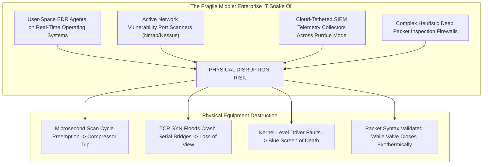
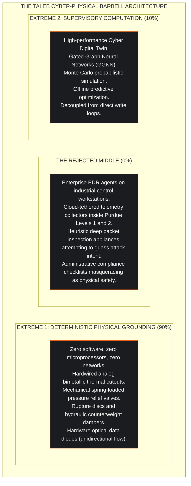
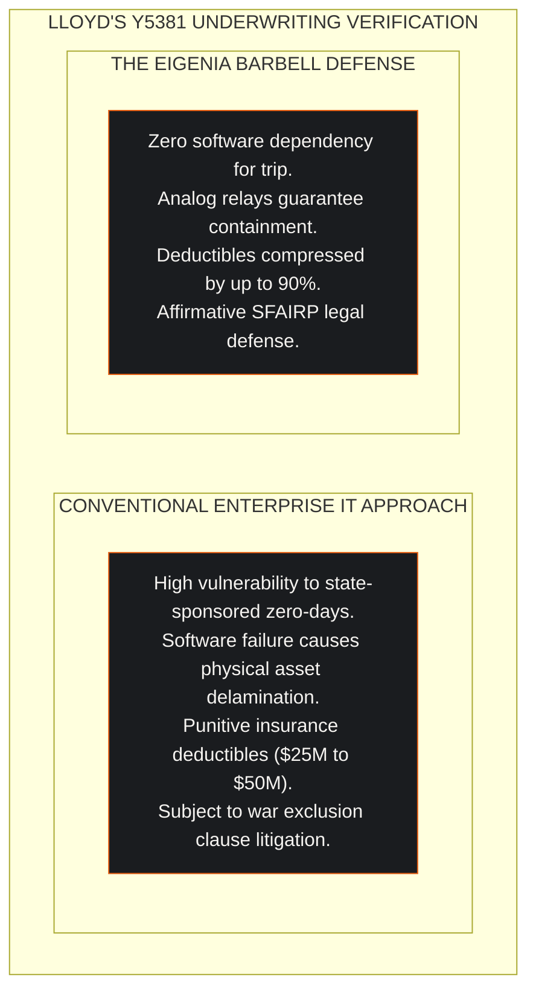

## 1. The Hazardous Incursion of Enterprise IT Tooling into OT

For two decades, the enterprise cybersecurity market has expanded into industrial operational technology (OT). Commercial vendors package corporate Endpoint Detection and Response (EDR) agents, next-generation firewalls, active vulnerability scanners, and cloud log forwarders, marketing them to operators of power grids, chemical refineries, rail networks, and hyperscale data centers.

This market expansion is an engineering disaster.

Enterprise IT tools were engineered for an environment where data confidentiality takes priority, compute cycles are abundant, and transient reboot delays are acceptable. Operational technology governs physical matter governed by thermodynamic conservation laws, hydraulic pressure boundaries, and microsecond deterministic execution loops.



When enterprise software products are deployed into industrial networks, they do not merely fail to prevent sophisticated attacks. They become active physical hazards.

---

## 2. Four Mechanisms of Software-Induced Equipment Ruin

The commercial security industry relies on software complexity. In critical infrastructure, software complexity introduces four concrete physical failure mechanisms:

### 2.1 Microsecond Jitter and Real-Time Loop Preemption
Programmable Logic Controllers (PLCs) and Remote Terminal Units (RTUs) run hard real-time operating systems (VxWorks, QNX, FreeRTOS). Their primary task is executing deterministic scan cycles: reading sensor inputs, executing control equations, and writing actuator outputs every $1.0\text{ to }10.0\text{ milliseconds}$.

When an endpoint monitoring agent or background logging daemon executes in user space, it contends for memory buses and CPU interrupts. Introducing a $15\text{-millisecond}$ thread scheduling delay into a synchronous fieldbus loop trips high-speed compressor protection relays, causing immediate uncommanded facility shutdowns.

### 2.2 Active Scanning and Fragile Legacy Stacks
Active vulnerability scanners transmit thousands of rapid TCP SYN packets, malformed UDP datagrams, and SNMP sweeps to discover open ports. 

Industrial Ethernet-to-serial converters, legacy Modbus RTU bridges, and safety logic controllers designed in the 1990s possess primitive network protocol stacks. A standard vulnerability scan exhausts the device's connection buffer, locking the microprocessor. 

The facility suffers an immediate **Loss of View and Loss of Control**, transforming a routine security scan into an accidental denial-of-service event.

### 2.3 Expanded Attack Surface and Kernel Privileges
Every software agent introduced into an industrial network requires administrative privileges and opens network sockets. 

Kernel-level drivers (demonstrated globally during the July 2024 CrowdStrike Falcon outage) create single points of failure capable of disabling entire facilities simultaneously. In addition, cloud-tethered log forwarders punch outbound holes through Purdue Model demilitarized zones (DMZs), establishing backdoors that bypass physical air-gaps.

### 2.4 Syntactic Validation vs. Thermodynamic Reality
Next-Generation Firewalls inspect protocol syntax:
```
INCOMING PACKET: [ Modbus TCP | Function Code 0x06 | Register 0x04A2 | Value 0x0000 ]
FIREWALL DECISION: PERMITTED (Syntactically legal command from authorized engineering IP)
PHYSICAL OUTCOME:  Coolant valve shut off; exothermic reactor reaches runaway explosion.
```
A firewall validates that the transaction conforms to protocol specifications. It cannot compute whether that command violates thermodynamic conservation laws.

---

## 3. Taleb's Barbell Strategy Applied to Critical Infrastructure

To resolve this crisis, we apply Nassim Nicholas Taleb's **Barbell Strategy**. 

In finance, the Barbell Strategy rejects the middle ground. An investor avoids "medium-risk" assets that appear stable while concealing catastrophic tail risk, placing 90% of capital in ultra-safe Treasury bills and 10% in asymmetric upside bets.



The cyber-physical barbell eliminates the fragile middle:

### 3.1 Extreme 1: Deterministic Physical Grounding
At the physical actuator boundary, security is achieved through zero-software physical law:
* **Mechanical Interlocks**: Rupture discs that burst at precisely $18.0\text{ bar}$, mechanical governor valves that shut off fuel flow during over-speed events, and spring-loaded counterweight dampers.
* **Analog Electrical Interlocks**: Bimetallic thermal switches that mechanically open when temperatures reach $85.0^\circ\text{C}$, hardwired directly into the main circuit breaker trip coil. 
* **Hardware Optical Diodes**: Transmitting data exclusively via a single light-emitting diode (LED) and photodetector, guaranteeing that bits physically cannot flow backward into the control network.

These mechanisms contain no firmware, no operating systems, and no network interfaces. They cannot be hacked, cannot experience memory leaks, and do not care about zero-day vulnerabilities.

### 3.2 Extreme 2: Supervisory Cyber Digital Twin Computation
Analytical complexity is confined entirely to a completely decoupled supervisory plane:
* The Cyber Digital Twin models the full seven-layer graph, ingesting read-only telemetry across the optical diode.
* The AEON Monte Carlo engine runs 1,000 forward simulations to predict failure distributions.
* AI optimization models suggest operational efficiency gains to human engineers without possessing direct write-access to physical actuators.

If the digital twin software crashes, the physical plant continues operating with zero disruption. If an adversary compromises the supervisory cloud environment, the hardwired analog interlocks prevent equipment destruction.

---

## 4. The Gordon-Loeb Capital Allocation Frontier

The Barbell Defense is financially provable through the **Gordon-Loeb Model for Cybersecurity Investment**. 

Gordon and Loeb demonstrated that the optimal expenditure $S^*(z)$ to protect an information asset with potential loss $L$ and breach probability $v$ is bounded:

$$S^*(z) \le \frac{1}{e} \cdot v \cdot L \approx 0.368 \cdot v \cdot L$$

A facility should never spend more than $36.8\%$ of the expected loss on digital defenses. 

```
Security Investment ($)
       ^
0.368 vL|                               * Gordon-Loeb Optimum S*(z)
       |                              /   \
       |                             /     \
       |                            /       \  Diminishing Returns Zone
       |                           /         \ (Software Vendor License Bloat)
   0.0 +--------------------------+-----------+--------> Control Complexity
       Zero Controls              Barbell     Enterprise EDR
                                  Defense     + Cloud SIEM
```

Traditional cybersecurity vendor stacks violate the Gordon-Loeb frontier:
1. They demand annual recurring software subscriptions that exceed $50\%$ of single loss expectancy.
2. Because the software introduces real-time jitter and single-point failure modes, the marginal investment actually **increases the probability of operational disruption ($v$)**.

By contrast, the Barbell Strategy allocates capital with extreme efficiency:
* **One-Time Capital Expenditure**: Hardwired SIL-3 analog interlocks and mechanical burst discs represent one-time engineering costs with twenty-year operating lifespans.
* **Targeted Digital Twin Investment**: Investing in the Cyber Digital Twin satisfies the Gordon-Loeb boundary by providing verifiable risk reduction without adding software fragility to the control loop.

---

## 5. Actuarial Defense Under Lloyd's Market Bulletin Y5381

Underwriting syndicates in the Lloyd's of London cyber insurance market have introduced strict physical attribution requirements under Market Bulletin Y5381 and LMA5564 clauses. Insurers reject claims for industrial business interruption when facilities rely on software controls that cannot withstand nation-state interdiction.



By proving that the facility's physical survival is decoupled from digital software integrity:
1. **Deductible Optimization**: Facilities secure primary policy deductibles compressed by up to 90%.
2. **Affirmative Physical Coverage**: Secures affirmative cyber-physical property damage and business interruption coverage under Lloyd's Y5381.
3. **Legal Defensibility**: Fulfills So Far As Is Reasonably Practicable (SFAIRP) legal standards, insulating directors and officers from personal liability under EU NIS2 and CRA Article 64.

---

## 6. Strategic Takeaway: Physics is the Only Real Zero Trust

The cybersecurity vendor community has redefined "Zero Trust" as an endless procurement list of software identity brokers, micro-segmentation agents, and cloud firewalls. 

In critical infrastructure, true Zero Trust means refusing to trust software to prevent physical destruction.

* Software is malleable, complex, and prone to catastrophic failure modes.
* Physics is immutable, deterministic, and incorruptible.
* By anchoring plant safety to hardwired physical interlocks while using the Cyber Digital Twin for predictive foresight, industrial operators establish unassailable operational resilience.
