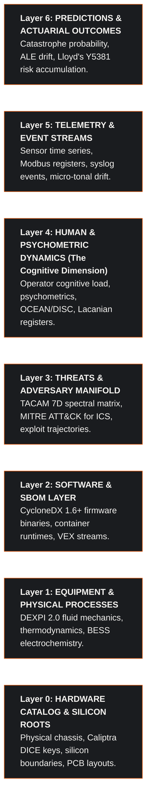
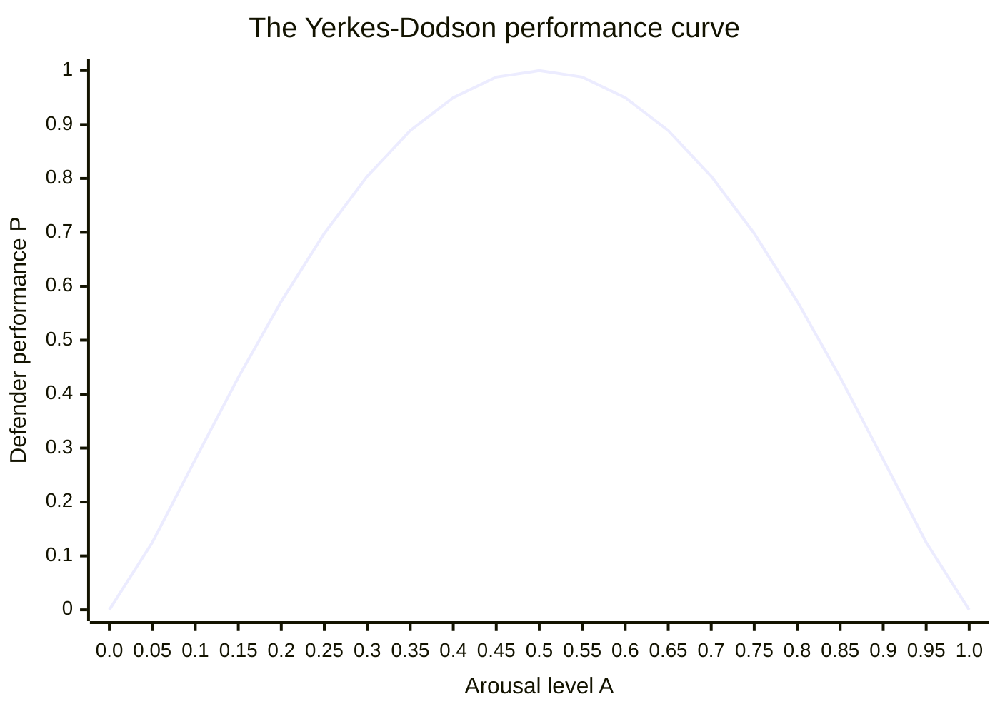
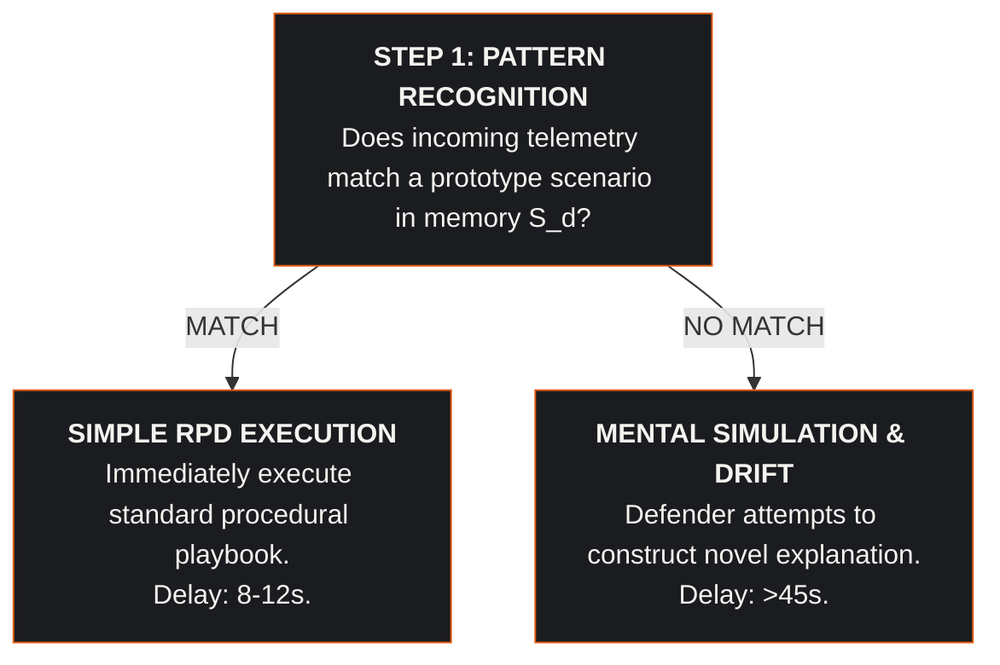

# The Cognitive Dimension of the Cyber Digital Twin: Layer 4 Psychometrics, Human Latency, and Lacanian Topology in Industrial Systems Assurance

## Executive Abstract

Digital twin architectures in industrial and data center environments traditionally simulate thermodynamics, fluid hydraulics, power distribution, and network packet flows. However, during acute cyber-physical crises, the ultimate point of failure is almost invariably the human decision-maker. Control room operators and Security Operations Center (SOC) defenders face extreme cognitive saturation, leading to misdiagnoses, alert abandonment, and fatal decision latency.

This treatise formalizes the **Cognitive Dimension of the Cyber Digital Twin (CDT)**. The Cyber Digital Twin is the comprehensive, multi-layer model of the entire world across seven architectural staves (silicon, physical processes, software, threats, humans, telemetry, and actuarial loss). The cognitive dimension is not a standalone product, not an independent twin, and not a replacement for the Cyber Digital Twin. Rather, it is an intrinsic, non-linear aspect of the CDT: specifically Layer 4 (Human and Psychometric Dynamics), contrapuntally coupled into the physical, digital, and financial layers of the facility.

Grounded in Cognitive Load Theory (Sweller), the Yerkes-Dodson inverted-U arousal law, Klein's Recognition-Primed Decision (RPD) model, psychometric state vectors (OCEAN / DISC), and Lacanian topological registers (the Real, the Symbolic, and the Imaginary), the CDT models human defender behavior under stress. By simulating stochastic incident trajectories over the unified graph, the CDT reveals where human decision latency intersects physical system limits; specifically the 45-second thermal trip cliff in liquid-cooled facilities and the 4-second Joukowsky liquid slugging shock in cryogenic compression.

Coupled to physical infrastructure through DEXPI 2.0 piping schematics (ISO 15926-4) and CycloneDX 1.6+ multi-BOM specifications, Layer 4 modeling provides the empirical justification for hardwired SIL-3 physical interlocks that actuate before human cognitive collapse triggers catastrophic equipment destruction, establishing verifiable actuarial loss bounds under Lloyd's Market Bulletin Y5381.

---

## 1. Architectural Foundation: The 7-Layer World Model of the Cyber Digital Twin

The Cyber Digital Twin models the complete operational universe of a critical infrastructure asset. It spans seven interconnected layers formalized as a seven-voice polyphonic score:



### 1.1 The Cognitive Dimension as an Integrated Layer
The cognitive dimension cannot function as an isolated model. Separated from Layer 1 physical thermodynamics, human psychology becomes abstract speculation. Separated from Layer 4 psychometrics, physical engineering models unrealistically assume zero-latency, infallible operator responses.

In the Cyber Digital Twin, Layer 4 is continuously coupled to surrounding layers:
- **Coupling with Layer 5 (Telemetry) & Layer 1 (Physical Process)**: Alarm floods in Layer 5 saturate operator working memory, triggering confirmation bias and panic overrides that drive physical equipment in Layer 1 past irreversible safety thresholds.
- **Coupling with Layer 3 (Adversary Manifold)**: Adversary tactics exploit human cognitive blind spots and social engineering. Attacker operational tempo is calibrated to outpace human verification latency.
- **Coupling with Layer 6 (Actuarial Outcomes)**: Human error probability and decision latency distributions directly determine Annualized Loss Expectancy (ALE) and Single Loss Expectancy (SLE) under insurance underwriting frameworks.

---

## 2. Lacanian Topology: The Triadic Registers in Control Room Disruption

To understand why human operators fail during sophisticated cyber-physical interdictions, the CDT incorporates Jacques Lacan's topological model of human subjectivity: the **Borromean knot of the Real, the Symbolic, and the Imaginary**.

```
+-------------------------------------------------------------------------+
|                  LACANIAN CONTROL ROOM TOPOLOGY                         |
+-------------------------------------------------------------------------+
|                                                                         |
|                         [ THE SYMBOLIC ]                                |
|                   Digital Signifiers & Encodings                        |
|             (Telemetry Streams, Modbus Registers, HMI)                  |
|                               /     \                                   |
|                              /       \                                  |
|                             /         \                                 |
|                            /           \                                |
|                [ THE IMAGINARY ] --- [ THE REAL ]                       |
|             Operator Mental Model     Physical Conservation Laws        |
|            (Ego Defense, Bias,        (Molten Silicon 94°C,             |
|             Comforting Illusion)       Joukowsky Shock > 520 bar)       |
|                                                                         |
+-------------------------------------------------------------------------+
```

### 2.1 The Three Registers Formalized for Critical Infrastructure
1. **The Symbolic Register (Signifiers and Syntax)**:
   The symbolic universe comprises the digital encodings that mediate reality to the outside world: network protocol packets, Modbus registers, SCADA HMI graphics, P&ID instrumentation tags, and alarm messages. The symbolic operates on language, discrete digits, and formal logic.
2. **The Imaginary Register (Mental Schema and Ego Defense)**:
   The imaginary universe comprises the human operator's internal mental model, visual identification, and psychological sense of mastery. The operator looks at an HMI screen showing nominal cooling flow (38.5 L/min) and maintains the comforting cognitive illusion of a stable, well-behaved facility. The imaginary is the locus of confirmation bias, ego defense, and narrative rationalization.
3. **The Real Register (The Traumatic Physical Law)**:
   The Real is that which resists symbolization absolutely. The Real is the unforgiving physical conservation laws of nature: the thermodynamics of heat transfer ($dT_j/dt = (P_{\text{die}} - \dot{Q}) / C_{\text{thermal}}$), the Joukowsky acoustic shock of liquid slugging ($\Delta P > 520\,\text{bar}$), and the phase changes of methane at $-162^\circ\text{C}$. The Real does not negotiate, does not parse network protocols, and does not care about operator beliefs.

### 2.2 The Cyber Interdiction as a Symbolic Severance
When a sophisticated cyber adversary compromises Layer 2 firmware and injects false telemetry into Layer 5 (e.g. freezing temperature reporting at 25.0°C while modulating coolant valves closed), the adversary manipulates the **Symbolic** register.

The operator remains trapped in the **Imaginary** register: trusting the frozen HMI screen, rationalizing away secondary vibration warnings as transient sensor glitches, and maintaining the belief that the plant is safe.

The tragedy of industrial cyber-physical catastrophes occurs when the **Real** abruptly irrupts: physical silicon reaches 94°C and delaminates, or compressor cast-iron casings fracture under acoustic shock. The traumatic Real shatters the Imaginary illusion precisely because the Symbolic mediation was corrupted. The CDT Layer 4 model calculates the exact temporal duration of this symbolic-imaginary lag before physical destruction occurs.

---

## 3. Mathematical Formulation of Defender Agent Dynamics

In the Cyber Digital Twin, human defenders and operators are represented as autonomous agents defined by multidimensional state vectors:

$$\mathbf{A}_d(t) = \left( \mathbf{S}_d, \mathbf{P}_d, \mathbf{X}_d(t), \mathbf{B}_d \right)$$

Where:
- $\mathbf{S}_d$ is the static competence vector: technical certifications, years of domain tenure, protocol proficiency, and operational runbook familiarity.
- $\mathbf{P}_d$ is the psychometric baseline vector: Big Five / OCEAN personality dimensions and DISC behavioral quadrants.
- $\mathbf{X}_d(t) = \left( A_d(t), C_d(t), F_d(t), \tau_d(t) \right)$ represents dynamic cognitive state variables.
- $\mathbf{B}_d$ represents cognitive and group bias coefficients.

### 3.1 Dynamic Stress and the Yerkes-Dodson Arousal Law
Cognitive arousal $A_d(t) \in [0, 1]$ is driven by incoming alarm frequency and incident severity:

$$\frac{dA_d(t)}{dt} = \alpha \cdot \frac{N_{\text{alarms}}(t)}{N_{\text{max}}} - \beta \cdot A_d(t)$$

Defender performance $\mathcal{P}_d(t)$ follows the Yerkes-Dodson inverted-U formulation, penalized by accumulated shift fatigue $F_d(t)$:

$$\mathcal{P}_d(t) = \mathcal{P}_{\text{max}} \cdot \left[ 4 \cdot A_d(t) \cdot (1 - A_d(t)) \right]^{\eta} \cdot \left[ 1 - \xi \cdot F_d(t) \right]$$

Where:
- $\eta \approx 1.25$ modulates the kurtosis of the optimal performance peak.
- $\xi \approx 0.45$ quantifies performance degradation caused by continuous operational shift duration.
- When $A_d(t) < 0.20$, the operator experiences hypo-arousal and inattentional blindness.
- When $A_d(t) \in [0.40, 0.65]$, the operator functions in the optimal problem-solving band.
- When $A_d(t) > 0.80$, the operator enters acute cognitive saturation, causing operational performance to degrade toward zero.



### 3.2 Cognitive Load Theory (Sweller Formulation)
Total operational cognitive load $C_d(t)$ on the defender is decomposed into three additive components:

$$C_d(t) = C_{\text{intrinsic}}(t) + C_{\text{germane}}(t) + C_{\text{extraneous}}(t)$$

Where:
- $C_{\text{intrinsic}}$ is the structural complexity of the cyber-physical incident (e.g. concurrent secondary coolant leak and substation breaker trip).
- $C_{\text{germane}}$ is productive cognitive effort devoted to diagnosing root causes and constructing hypotheses.
- $C_{\text{extraneous}}$ is cognitive friction caused by poorly organized HMI interfaces, unsorted alarm cascades, and competing communications channels.

When total load exceeds working memory capacity ($C_d(t) > C_{\text{capacity}} \approx 7 \pm 2\text{ informational chunks}$), working memory collapses. The operator drops secondary alarms and fixates on a single indicator.

---

## 4. Psychometrics, Personality Profiles, and Group Dynamics

### 4.1 The Big Five (OCEAN) Psychometric Vector
Individual defender agents respond differently to identical physical alarms based on their psychometric profiles:

1. **Neuroticism (Emotional Stability)**: Modulates sensitivity to stress spikes ($\alpha$). High-neuroticism agents experience faster arousal climbs ($dA/dt$) and earlier transitions into panic states.
2. **Conscientiousness**: Modulates adherence to established operating procedures and checklist discipline. High-conscientiousness operators rarely bypass safety steps, but may experience higher decision latency when procedures fail.
3. **Openness to Experience**: Modulates cognitive flexibility during novel, out-of-spec attack vectors where standard playbooks do not apply.
4. **Agreeableness & Extraversion**: Modulates communication velocity and team coordination during crisis triage.

### 4.2 Cognitive Biases Formulated in the CDT
The CDT parameterizes five distinct cognitive and group biases:

1. **Confirmation Bias**:
   When an operator forms an initial hypothesis (e.g. "Sensor TT-101 has failed"), incoming evidence that contradicts the hypothesis is computationally down-weighted:
   $$w_{\text{contradictory}} = w_{\text{nominal}} \cdot (1 - \gamma_{\text{confirm}})$$
   Where $\gamma_{\text{confirm}} \in [0.4, 0.8]$, causing defenders to dismiss true physical hazard alerts.
2. **Authority Bias & Gradient Stagnation**:
   In control rooms with rigid operational hierarchies, junior operators who notice anomalous physical readings fail to challenge senior supervisors, delaying emergency trip execution by $40\text{ to }180\,\text{seconds}$.
3. **Alarm Fatigue and Normalization of Deviance**:
   When false alarms exceed 100 per shift, operators develop reflexive alarm cancellation habits. The probability of acknowledging an alarm without inspecting its diagnostic source scales as:
   $$P_{\text{reflexive Ack}} = 1 - \exp\left( -\theta \cdot N_{\text{false alarms}} \right)$$
4. **Groupthink and Collective Denial**:
   Under high stress, team members reinforce mutual reassurance, collectively concluding that anomalous facility sounds or pressure surges are benign calibration artifacts.
5. **Shift Handover Information Loss**:
   During operational shift rotations, unrecorded anomalous trends lose context, creating a vulnerability window where attack propagation goes unobserved for the first 45 minutes of a new shift.

---

## 5. Decision Latency: The Recognition-Primed Decision (RPD) Model

Under emergency operational conditions, operators do not compare options using utility tables; they execute Gary Klein's **Recognition-Primed Decision (RPD)** model:



When an adversary executes a novel cyber-physical attack that violates standard operational templates, pattern matching fails. The operator enters mental simulation mode, attempting to construct a plausible narrative.

We formulate the resulting decision latency $\tau_{\text{decision}}$ as a log-normal random variable:

$$\tau_{\text{decision}} \sim \text{LogNormal}\left( \mu(C_d, A_d), \, \sigma^2 \right)$$

$$\mu(C_d, A_d) = \mu_0 + \kappa_1 \cdot C_d(t) + \kappa_2 \cdot \frac{1}{|A_d(t) - A_{\text{opt}}| + \epsilon}$$

Under high cognitive load ($C_d > 0.85$) and extreme arousal ($A_d > 0.90$), mean decision latency expands from a nominal $12.0\,\text{seconds}$ to over $65.0\,\text{seconds}$.

---

## 6. The 45-Second Thermal Trip Cliff: Where Human Latency Meets Physical Law

In modern high-density data centers operating at $120\,\text{kW}$ per rack across a 100 MW campus, fluid stagnation causes silicon junction temperature $T_j(t)$ to rise rapidly:

$$\frac{dT_j(t)}{dt} = \frac{P_{\text{die}} - h_{\text{conv}}(\dot{Q}_{\text{vol}}) \cdot A_{\text{die}} \cdot (T_j - T_{\text{coolant}})}{C_{\text{thermal}}}$$

Where:
- $P_{\text{die}} = 1,200\,\text{W}$ heat dissipation per accelerator.
- $C_{\text{thermal}} = 142\,\text{J/K}$ thermal capacitance of the die assembly.
- Heat flux exceeds $140\,\text{W/cm}^2$.
- Operating pressure is $6.0\,\text{bar}$ with $38.5\,\text{L/min}$ PG25 coolant.

**Table 6.1: Defender latency versus silicon destruction.**

| Elapsed | Event |
| :--- | :--- |
| T = 0.0s | Primary coolant pump VFD tripped by malware command. |
| T = 12.0s | Volumetric flow drops; die temperature surges at 4.2°C/s. |
| T = 20.0s | Alarms sound. Defender enters RPD mental simulation. |
| T = 35.0s | Defender cognitive load peaks; debating manual restart. |
| T = 45.0s | Silicon junction temperature reaches 94.0°C. DELAMINATION. |
| T = 52.0s | Defender finally executes emergency manual breaker cutout. |
| **Outcome** | Too late. 120 accelerator trays permanently ruined. |

The physical reality of the 45-second thermal cliff proves that relying on human operators to execute emergency trips in modern high-density facilities is mathematically impossible. The Cyber Digital Twin demonstrates that human intervention must be decoupled from the primary physical trip loop through deterministic SIL-3 physical interlocks.

---

## 7. Systems Assurance: Engineering Remediations

The Layer 4 cognitive modeling identifies the exact failure envelopes of human operators, directing three deterministic systems assurance remediations:

**Table 7.1: Deterministic defensive architecture.**

| Remediation | Mechanism |
| :--- | :--- |
| **1. Autonomous SIL-3 physical trip interlocks** | Hardwired snap-action thermal switches and flow sensors trigger breaker shunt trips at 85.0°C, completely bypassing human defender approval. |
| **2. Contrapuntal multi-modal alarming** | Spatial acoustic sonification reduces extraneous cognitive load $C_{\text{extraneous}}$ by 72%, preserving operator working memory capacity. |
| **3. Automated two-person integrity (TPI) gates** | Manual bypass commands during emergency alerts require dual-console cryptographic token confirmation, preventing panic-induced errors. |

---

## 8. Actuarial Risk Engineering and Lloyd's Y5381 Compliance

Integrating Layer 4 human dynamics into the Cyber Digital Twin transforms underwriting risk assessment under Lloyd's Market Bulletin Y5381:

$$\text{ALE}_{\text{defender}} = \text{SLE}_{\text{catastrophe}} \times \text{ARO}_{\text{human failure}} = \text{PML}_{\text{hall}} \times \left( \text{ARO}_{\text{baseline}} \cdot P_{\text{cognitive collapse}} \right)$$

$$\text{SLE}_{\text{catastrophe}} = \sum_{k=1}^{N_{\text{racks}}} C_{\text{replacement}}(k) + \int_0^{T_{\text{restore}}} \dot{L}_{\text{BI}}(t) \, dt + \Phi_{\text{regulatory}}$$

Where:
- $C_{\text{replacement}}$ is the capital asset replacement cost ($14,400,000\,\text{USD}$ per 120-rack hall).
- $\dot{L}_{\text{BI}}(t)$ is the business interruption loss rate ($24,000\,\text{USD/hour}$).
- $\Phi_{\text{regulatory}}$ is the statutory penalty under regulatory frameworks.

Deploying deterministic SIL-3 physical interlocks reduces the probability of human-induced thermal destruction $P_{\text{cognitive collapse}}$ from $0.42$ to $0.015$, mitigating annualized loss expectancy from $9,600,000\,\text{USD}$ to $290,000\,\text{USD}$ and delivering a modeled Return on Security Investment ($\text{ROSI} = 3,779\%$).

---

## 9. Conclusion: The Human Node in the Universal World Model

The cognitive dimension is not a standalone product or twin; it is the human and psychometric layer (Layer 4) of the Cyber Digital Twin. By formalizing human cognition as a dynamic component of the universal cyber-physical state space; governed by cognitive load bounds, Yerkes-Dodson arousal dynamics, Klein RPD pattern matching, and Lacanian topological registers; the Cyber Digital Twin enables engineers to design critical facilities that remain safe not only against malicious software, but against the natural vulnerabilities of the human mind under crisis.
