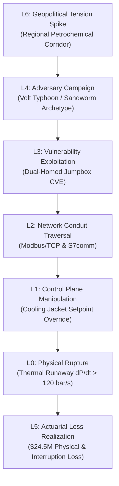

# The Cyber Digital Twin Seven-Layer Architecture
## Mathematical Formalization, Inter-Layer Transition Physics, and Quantitative Process Zone Hardening

### Executive Abstract

The Cyber Digital Twin (CDT) models critical infrastructure as a coupled dynamical system rather than an isolated network topology. By binding physical equipment thermodynamics, digital network conduits, firmware dependency graphs, operator cognitive states, and macroeconomic signals into a single multi-relational knowledge graph, the CDT calculates deterministic failure probabilities and actuarial losses before physical damage occurs.

The platform maintains two standards-aligned representations of its layered architecture to support both executive risk governance and low-level graph database traversal.

---

### 1. Platform Taxonomy: The L1–L7 Customer Model

The customer-facing model organizes facility operations into seven functional layers for risk governance, audit reporting, and executive decision-making:

* **L1 Facility (Physical Process):** Physical plant topology, piping, vessels, rotating machinery, and containment envelopes. Ingests computer-aided design artifacts, including DEXPI 2.0 and ISO 15926-4 Proteus XML exports.
* **L2 Systems & Networks:** Industrial control networks, routing tables, fieldbuses (Modbus, OPC-UA, DNP3, PROFINET), and CycloneDX 1.6+ software bills of materials (SBOMs) across PLCs, RTUs, and distributed control systems (DCS).
* **L3 Vulnerability Surface:** Active exposures across the software and hardware stack, continuously updated with 30-day Exploit Prediction Scoring System (EPSS) velocity vectors and CISA Known Exploited Vulnerabilities (KEV) catalogs without active scanning.
* **L4 Threat Intelligence:** Adversary registry profiling 389 state and criminal groups. Ingests the TACAM 7-dimensional spectral matrix (77,279 relational edges) and computes a cardinal Actor Threat Quotient ($\text{ATQ} \in [0, 100]$) measuring adversary tool weaponization and sector affinity.
* **L5 Actuarial Risk Synthesis:** Bottom-up physical vulnerability coupled with top-down adversarial pressure. Executes 50,000 Monte Carlo runs to produce Annual Loss Expectancy (ALE), Value at Risk ($\text{VaR}_{99.5}$), Loss Exceedance Curves, and Gordon-Loeb investment boundaries [2].
* **L6 Macroeconomic & Geopolitical Environment:** External risk drivers, including regional conflict datasets (ACLED), geopolitical tension indices, supply chain bottlenecks, and energy market stress indicators that alter adversary campaign frequency.
* **L7 Predictive Trajectory:** Forward-looking risk projections computed via self-exciting Hawkes point processes, identifying temporal clustering in campaign preparation up to 90 days before execution.

---

### 2. Database Ontological Schema: The L0–L7 Graph Engine

Under the hood of the Seldon graph engine, the Neo4j knowledge graph (comprising 3.2 million nodes and 85 million edges) splits physical assets from cyber assets into separate foundational layers, maintaining an eight-row registry:

| Graph Layer | Domain | Core Entities | Ingestion Standards |
|:---|:---|:---|:---|
| **L0** | Physical / Environmental | Buildings, reactors, pumps, heat exchangers, pipes | DEXPI 2.0 XML, ISO 15926-4, P&ID [4] |
| **L1** | Cyber / Network Perimeter | Firewalls, VLANs, jumpboxes, network interfaces | PCAP, NetBox, LLDP, ARP tables |
| **L2** | OT / ICS Control Plane | PLCs, RTUs, SIS safety logic, HMIs, DCS loops | CycloneDX 1.6, SPDX, CSAF 2.0 |
| **L3** | Organizational Governance | Suppliers, operators, contractors, policy frameworks | IEC 62443-2-1, NIS2 Article 21 [3] |
| **L4** | Geopolitical Drivers | State actors, sanctions, critical resource flows | ACLED, GPR Index, trade data |
| **L5** | Economic & Actuarial | ALE, single loss expectancy, insurance deductibles | Lloyd's Bull. Y5381, SEC 8-K [5] |
| **L6** | Psychographic Human Factors | Operator cognitive load, alert fatigue, stress response | Sweller CLT, Klein RPD Model [1] |
| **L7** | Temporal Dynamics | Hawkes arrival rates, EPSS velocity, degradation curves | Time-series materialized views |

---

### 3. Inter-Layer Causal Transition Dynamics

The core differentiator of the CDT architecture is that layers do not operate as isolated silos. Attack trajectories traverse between layers following calibrated Markov transition probabilities.

The causal chain links external tension directly to physical hardware failure and corporate capital impairment:

$$\text{Geopolitical Shock } (L_6/L_4) \longrightarrow \text{Adversary Campaign } (L_4/L_3) \longrightarrow \text{Conduit Traversal } (L_2) \longrightarrow \text{PLC Logic Manipulation } (L_2/L_1) \longrightarrow \text{Physical Rupture } (L_1/L_0) \longrightarrow \text{Actuarial Loss } (L_5)$$

The end-to-end traversal probability $\Pi$ across an attack path of length $k$ is given by:

$$\Pi = \prod_{m=0}^{k-1} P(L_{m+1} \mid L_m)$$

The system measures global network stability through two parameters:

1. **Spectral Radius ($\lambda_{\max}(A)$):** The maximum eigenvalue of the network adjacency matrix $A$. If $\lambda_{\max}(A) > 1.0$, the network is in a supercritical state where lateral malware propagation is self-sustaining. If $\lambda_{\max}(A) < 1.0$, outbreaks are strictly sub-epidemic and decay exponentially.
2. **Seldon Crisis Parameter ($\mu$):** The normal-form bifurcation parameter governing phase transitions in control stability:
   $$\frac{dx}{dt} = \mu + x^2$$
   When $\mu < 0$, the operational system resides within a stable basin of attraction. When $\mu > 0$, the equilibrium vanishes via a saddle-node bifurcation, resulting in a sudden transition to unconstrained physical damage.

---

### 4. Quantitative Process Zone Conduit Hardening (What-If Study)

To demonstrate the multi-layer causal engine, we evaluate a simulated attack on **Process Zone PZ-04 (Autoclave Polymerization Reactor & Mechatronic Exotherm Loop)** in a continuous chemical processing facility.



#### 4.1 Asset Baseline
* **Physical Asset (L0):** Autoclave Reactor `R-101`, Feed Compressor `C-102`, Primary Cooling Loop `CW-204`, Pneumatic Emergency Blowdown Valve `XV-101A/B`, Mechanical Rupture Disc `BD-101` (burst rating: 250 bar). Source: DEXPI 2.0 XML [4].
* **Control Systems (L2/L1):** Siemens S7-1500 PLC (v2.8 firmware) managing PID temperature loops; Schneider Electric Triconex Tricon SIL-3 Safety Instrumented System (SIS) managing high-pressure interlocks. Source: CycloneDX 1.6 SBOM.
* **Threat Actor (L4):** Advanced persistent threat actor with verified capability against industrial control protocols ($\text{ATQ} = 88.4$).

#### 4.2 Phase 1: Baseline Architecture (Flat OT / Permissive Conduits)
In the baseline state, enterprise IT communicates with OT Level 3 through a dual-homed jumpbox without hardware conduit enforcement or deep-packet inspection (DPI).

**Transition Probabilities:**
* $P(L_6 \to L_4) = 0.85$ (Geopolitical tension elevates targeting)
* $P(L_4 \to L_3) = 0.78$ (Actor tooling matches exposed facility footprint)
* $P(L_3 \to L_2) = 0.88$ (Jumpbox compromise and lateral pivot to OT subnet)
* $P(L_2 \to L_1) = 0.92$ (Unauthenticated Modbus/TCP write commands injected into PLC)
* $P(L_1 \to L_0) = 0.84$ (Cooling jacket setpoint suppression causes thermal runaway; disc ruptures)

$$\Pi_{\text{base}} = 0.85 \times 0.78 \times 0.88 \times 0.92 \times 0.84 = \mathbf{0.4504 \quad (45.04\%)}$$

**Topological and Stability Metrics:**
* Adjacency spectral radius: $\lambda_{\max}(A) = \mathbf{2.74} > 1.0$ (supercritical epidemic regime)
* Seldon Lyapunov parameter: $\mu = \mathbf{+0.34} > 0$ (unstable saddle-node bifurcation)

**Actuarial Baseline (50,000 Monte Carlo Iterations):**
* Single Loss Expectancy (SLE): **$24,500,000**
  * Capital equipment destruction (`R-101`, piping, catalyst bed): $14,000,000
  * Environmental remediation and regulatory penalties: $4,500,000
  * 45-day unrecoverable plant outage: $6,000,000
* Annual Rate of Occurrence (ARO): $0.4504 \times 1.2 = \mathbf{0.5405\text{ events/year}}$
* Annual Loss Expectancy ($\text{ALE}_{\text{base}}$):
  $$\text{ALE}_{\text{base}} = \$24,500,000 \times 0.5405 = \mathbf{\$13,242,250 / \text{year}}$$
* Value at Risk ($\text{VaR}_{99.5}$): **$24,500,000**

#### 4.3 Phase 2: Targeted Countermeasure Run (IEC 62443-3-2 Conduits & SIL-3 Interlocks)
The digital twin tests a virtual architectural intervention prior to capital expenditure:
1. **IEC 62443-3-2 Conduit Enforcement:** Unidirectional optical data diode for outbound telemetry; inline hardware DPI conduit restricting industrial traffic to read-only function codes (`FC 03`, `FC 04`) while dropping all write commands (`FC 05`, `FC 06`, `FC 16`) [3].
2. **Hardwired Physical Interlock:** Analogue pneumatic bypass from transmitter `PT-101` directly to blowdown valve `XV-101A`, bypassing software Ethernet layers entirely.
3. **Cryptographic Silicon Attestation:** Hardware root of trust (TPM 2.0 / Caliptra) verifying cold-boot firmware integrity.

**Recalibrated Transition Probabilities:**
* $P'(L_6 \to L_4) = 0.85$ (External geopolitical tension unchanged)
* $P'(L_4 \to L_3) = 0.78$ (External adversary tooling unchanged)
* $P'(L_3 \to L_2) = \mathbf{0.035}$ (Jumpbox isolated; management paths restricted to out-of-band VLAN)
* $P'(L_2 \to L_1) = \mathbf{0.0008}$ (Unauthorized writes dropped by physical DPI conduit)
* $P'(L_1 \to L_0) = \mathbf{0.012}$ (Analogue SIL-3 interlock depressurizes reactor within 400ms)

$$\Pi_{\text{post}} = 0.85 \times 0.78 \times 0.035 \times 0.0008 \times 0.012 = \mathbf{2.227 \times 10^{-7} \quad (0.000022\%)}$$

**Topological Transformation:**
* Adjacency spectral radius: $\lambda_{\max}(A) = \mathbf{0.29} \ll 1.0$ (sub-epidemic regime; cascades cannot propagate)
* Seldon Lyapunov parameter: $\mu = \mathbf{-0.78} < 0$ (strongly stable fixed-point attractor)

#### 4.4 Phase 3: Actuarial Comparison and Financial Return

| Risk & Financial Metric | Baseline (Flat OT Topology) | Hardened Conduits (IEC 62443-3-2) | Variance / Delta ($\Delta$) |
|:---|:---|:---|:---|
| **Spectral Radius $\lambda_{\max}(A)$** | $2.74$ *(Supercritical)* | $0.29$ *(Sub-epidemic)* | **$-89.4\%$** |
| **Seldon Bifurcation $\mu$** | $+0.34$ *(Unstable)* | $-0.78$ *(Stable Attractor)* | **Phase Transition to Safety** |
| **End-to-End Breach Probability ($\Pi$)** | $45.04\%$ | $0.000022\%$ | **$99.99995\%$ Reduction** |
| **Single Loss Expectancy (SLE)** | $\$24,500,000$ | $\$24,500,000$ | $\$0$ *(Physical consequence static)* |
| **Annual Rate of Occurrence (ARO)** | $0.5405$ events/yr | $0.00000027$ events/yr | **$-99.99995\%$** |
| **Annual Loss Expectancy (ALE)** | **$\$13,242,250 / \text{yr}$** | **$\$6.55 / \text{yr}$** | **$-\$13,242,243 / \text{yr}$ ($99.9999\%$)** |
| **Value at Risk ($\text{VaR}_{99.5}$)** | $\$24,500,000$ | **$\$0.00$** | **$-\$24,500,000$** |

**Capital Allocation Optimization (Gordon-Loeb Theorem):**
The Gordon-Loeb theorem bounds the rational cybersecurity investment budget $z^*$ as [2]:
$$z^* \le \frac{1}{e} \cdot v \cdot L \approx 0.3679 \times \Delta\text{ALE} = 0.3679 \times \$13,242,243 = \mathbf{\$4,871,821}$$

* **Total 3-Year Implementation Cost:** $\$615,000$ (Diode and DPI hardware $\$165,000$; SIL-3 pneumatic actuator retrofit $\$215,000$; engineering attestation $\$40,000$; annual maintenance and cryptographic audit $\$65,000/\text{year}$).
* **Return on Security Investment (ROSI):**
  $$\text{ROSI} = \frac{\Delta\text{ALE}_{3\text{yr}} - \text{Cost}}{\text{Cost}} = \frac{(\$13,242,243 \times 3) - \$615,000}{\$615,000} = \mathbf{6,359\%}$$
* **Underwriting Realization:** Eliminates catastrophic cyber exclusions under Lloyd's Market Association Bulletin Y5381 [5], compresses the plant deductible from $\$5,000,000 \to \$500,000$, and reduces operational interruption insurance premiums by $\$1,200,000/\text{year}$.

#### 4.5 Graph Database Engine Traversal Query
```cypher
// Seldon 7-Layer Multi-Relational Path Traversal Query
MATCH path = (geo:GeopoliticalFactor {zone: "Petrocorridor-EU"})
  -[:AMPLIFIES]-> (actor:ThreatActor {archetype: "Volt Typhoon / Sandworm"})
  -[:WEAPONIZES]-> (vuln:Vulnerability {cve: "CVE-2024-XXXX"})
  -[:CROSSES_BOUNDARY]-> (conduit:NetworkConduit {zone_from: "IT_L3", zone_to: "OT_L2"})
  -[:INJECTS_COMMAND]-> (plc:Controller {tag: "PLC-R101-S71500"})
  -[:DRIVES_TRANSIENT]-> (equip:PhysicalAsset {tag: "R-101", standard: "DEXPI-2.0"})
  -[:TRIGGERS_LOSS]-> (loss:EconomicImpact)

WITH path,
     reduce(p = 1.0, r in relationships(path) | p * r.transition_probability) AS cumulative_prob,
     loss.direct_damage + loss.business_interruption AS single_loss_expectancy

RETURN 
  [n in nodes(path) | labels(n)[0] + ":" + coalesce(n.tag, n.cve, n.name, n.archetype)] AS attack_chain,
  cumulative_prob AS traversal_probability,
  single_loss_expectancy AS sle,
  cumulative_prob * single_loss_expectancy * 1.2 AS annual_loss_expectancy;
```

---

### 5. Architectural Extensions & Operational Constraints

To address real-world deployment across legacy brownfield facilities, the CDT framework incorporates three operational constraints:

#### 5.1 The Physics-Cognitive Latency Asymmetry ($\tau_{\text{phys}} \ll \tau_{\text{human}}$)
Industrial safety is governed by physical time constants. In rapid runaway reactions, the physical excursion time constant satisfies:
$$\tau_{\text{phys}} \approx 12 - 45 \text{ seconds}$$

In contrast, human operators experiencing alarm flood in control rooms exhibit mean decision latencies governed by Gary Klein's Recognition-Primed Decision (RPD) model [1]:
$$\tau_{\text{human}} \approx 65 - 180 \text{ seconds}$$

Because $\tau_{\text{human}} > \tau_{\text{phys}}$, human intervention during an active control-plane attack is mathematically incapable of arresting catastrophic overpressurization. This latency gap proves why software-only security fails and why hardwired, un-routable SIL-3 physical trips are mandatory.

#### 5.2 Heuristic Reconstruction of Legacy Brownfield CAD
Operating industrial facilities frequently lack pristine DEXPI 2.0 XML exports, relying instead on legacy scanned piping and instrumentation diagrams (P&IDs). The CDT resolves this through computer vision and symbol graph extraction:
1. Optical character and glyph recognition extracts equipment tags, flow arrows, and valve types from scanned raster drawings.
2. The ingestion pipeline infers conduit boundaries and creates synthetic DEXPI 2.0 graph nodes with a confidence score $C \in [0, 1]$.
3. Missing parameter fields inherit conservative default physics values from standard process engineering reference manuals.

#### 5.3 Sovereign Air-Gapped Operation & Update Invariants
For nuclear facilities, defense infrastructure, and classified environments where cloud connectivity is prohibited, the CDT runs in Island Mode:
* The digital twin operates entirely on local, on-premise hardware without external network interfaces.
* Threat intelligence updates (TACAM) and vulnerability feeds are transferred periodically via physical, cryptographically signed tokens.
* The system enforces four operational invariants:
  1. Passive ingestion only: Zero packets sent to operational field networks.
  2. Write boundary isolation: No automated remote changes to PLC logic or safety interlocks.
  3. Deterministic replay: Graph simulations must produce identical state transitions from identical input seeds.
  4. Hardware attestation: Firmware images validated against silicon root of trust signatures on cold boot.

---

## References & Empirical Citations

- [1] **Klein, G. (1998)**: *Sources of Power: How People Make Decisions*. MIT Press.
- [2] **Gordon, L. A., & Loeb, M. P. (2002)**: "The economics of information security investment." *ACM Transactions on Information and System Security*, 5(4), 438–457.
- [3] **IEC 62443-3-2 (2020)**: *Security for industrial automation and control systems — Part 3-2: Security risk assessment for system design*. International Electrotechnical Commission.
- [4] **DEXPI e.V. (2025)**: *DEXPI 2.0 Specification: Process and Plant Model Integration*. Data Exchange in the Process Industry.
- [5] **Lloyd's Market Association (2021)**: *Cyber War and Cyber Operation Exclusion Clauses*. Bulletin Y5381.
