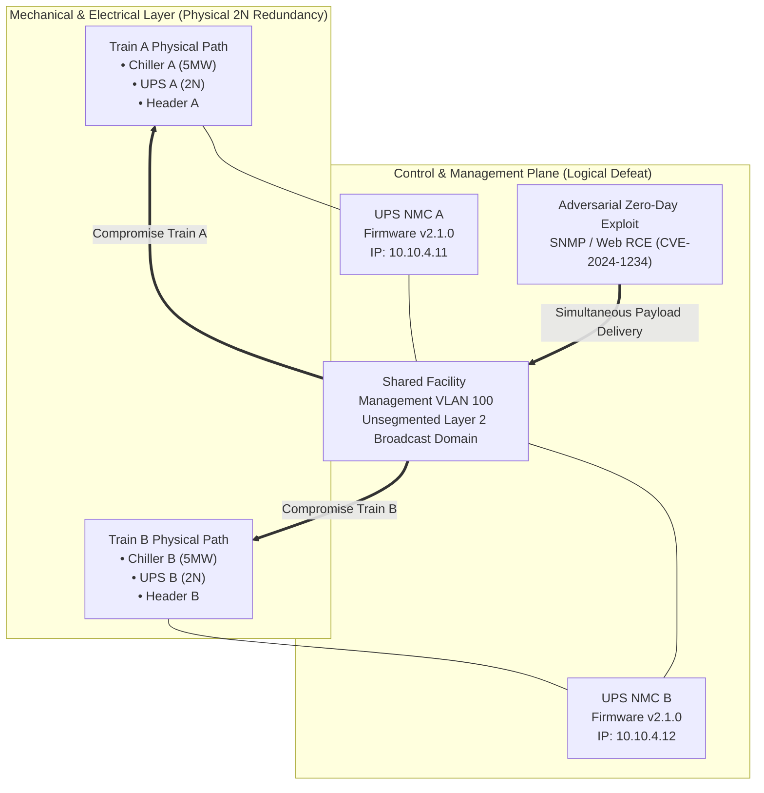
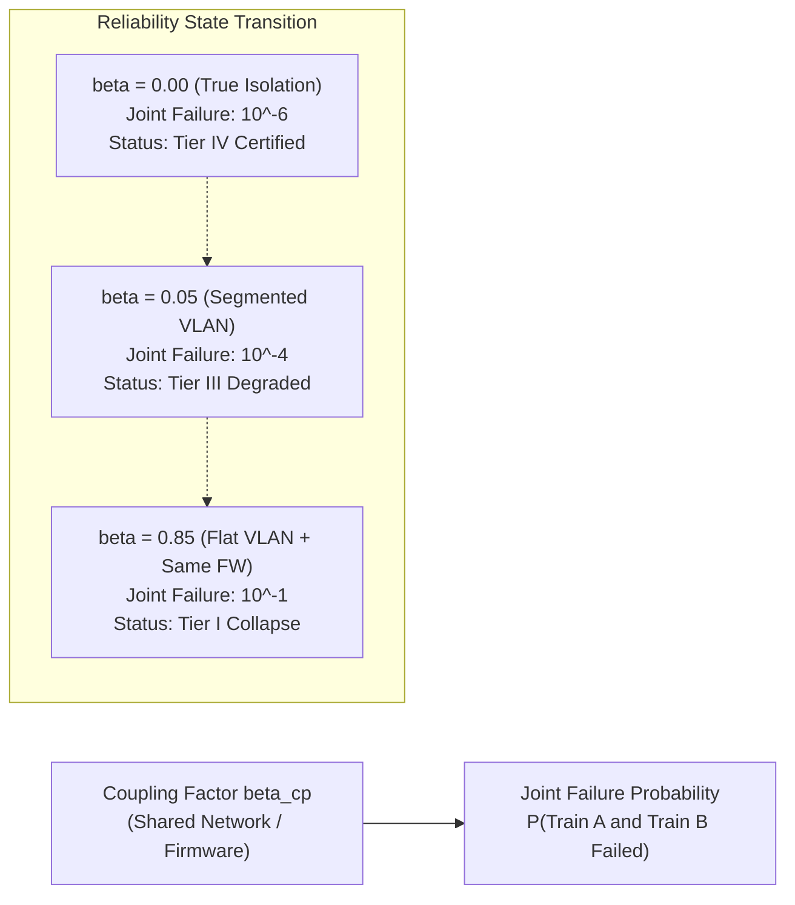
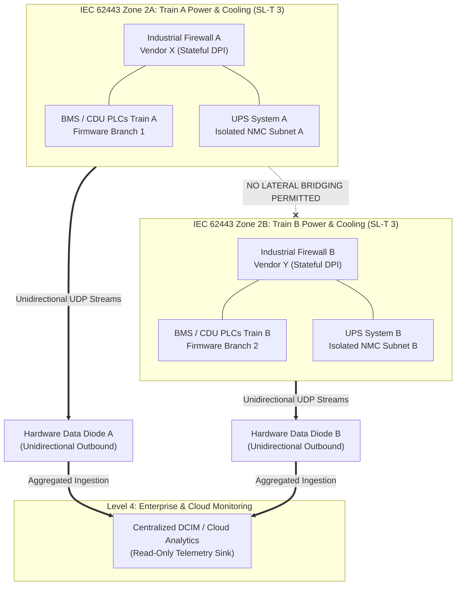
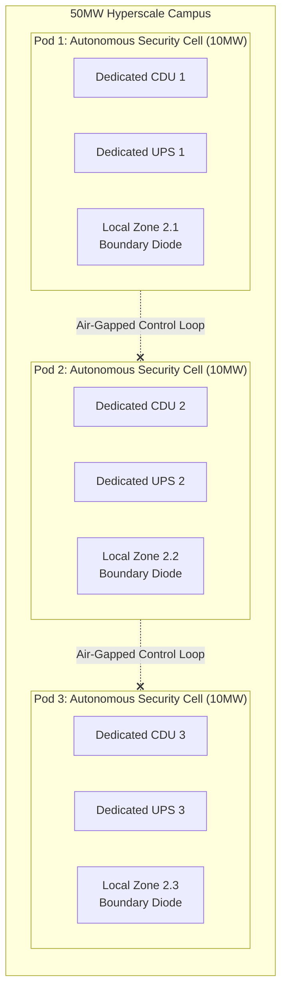

# Tier Classification, Redundancy Topologies & Common-Mode Failures in Industrial Digital Twins

**Working Group:** WG-02 Cyber Digital Twin  
**Reference Code:** WG-02-DT-16  
**Subject Classification:** Critical Infrastructure Reliability & Control Plane Fault Tolerance  
**Primary Attribution:** J. McKenney (Eigenia Research B.V.)  
**Co-Authors:** Eigenia Working Group on Cyber Digital Twins & Mechatronic Assurance  
**Status:** Canonical Sovereign Treatise  

---

## Abstract

Physical redundancy architectures specified by the Uptime Institute Tier system (Tier I through Tier IV) and the TIA-942 standard (Rated-1 through Rated-4) are designed to prevent mechanical and electrical interruptions through duplicated infrastructure paths ($N+1$, $2N$, $2N+1$). However, modern mechatronic infrastructure relies upon embedded network controllers — including uninterruptible power supply (UPS) Network Management Cards (NMCs), building management system (BMS) field controllers, and coolant distribution unit (CDU) programmable logic controllers (PLCs) — to balance operational loads. 

This treatise proves that classical physical redundancy is completely defeated when redundant trains share common logical conduits, identical firmware revisions, or shared administrative authentication domains. We formulate the **Common-Cause Cyber Failure Probability** ($P_{\text{CCF}}$), demonstrate the collapse of physical graph cut-sets under cyber-physical exploit vectors, identify the persistent component security assurance deficit across major datacenter original equipment manufacturers (OEMs), and define the requisite IEC 62443 zone and conduit topology necessary to guarantee genuine cyber-physical fault tolerance.

---

## 1. Introduction & The Structural Paradox

High-availability infrastructure engineering has historically operated under the premise of spatial and galvanic isolation. If a power transmission line, chiller compressor, or step-down transformer fails, an automated transfer switch (ATS) or static transfer switch (STS) transfers electrical and thermal loads to an isolated secondary path within milliseconds. Under classical mechanical reliability models, the probability of simultaneous failure across two isolated $2N$ trains $\mathcal{T}_A$ and $\mathcal{T}_B$ is assumed to be statistically independent:

$$P(\mathcal{T}_A \cap \mathcal{T}_B) = P(\mathcal{T}_A) \cdot P(\mathcal{T}_B)$$

For components exhibiting an annual failure probability of $q = 10^{-3}$, the joint failure probability evaluates to an exceptional $10^{-6}$, providing the quantitative justification for commercial "five-nines" ($99.999\%$) availability guarantees.

As primary author J. McKenney documented during forensic facility audits across European energy networks, rail signalling architectures, and hyperscale compute environments [McKenney, 2024], this statistical independence assumption is fundamentally invalidated in modern industrial facilities. While the high-voltage copper busbars and chilled water headers remain physically separated into Train A and Train B, their digital control loops are systematically aggregated onto common flat virtual local area networks (VLANs), communicate via unauthenticated industrial protocols (BACnet/IP, Modbus TCP, DNP3), and run identical, unpatched firmware images issued by single-source equipment vendors.

When an adversary delivers a remote code execution exploit targeting a vulnerability in the embedded network stack of an operational device, both trains are compromised concurrently. The mechanical redundancy remains immaculate, but the logical redundancy is zero. Physical Tier IV availability collapses into functional Tier I vulnerability in under 300 milliseconds.

---

## 2. Comparative Analysis of Classification Frameworks

To remediate this failure mode, engineers must first deconstruct the divergent methodologies governing industrial classification systems: the Uptime Institute Tier Standard, the ANSI/TIA-942 standard, and the European EN 50600 / ISO/IEC 22237 series.

### 2.1 Uptime Institute Tier Classification

Created over three decades ago, the Uptime Institute Tier system remains the preeminent international commercial benchmark. Crucially, Uptime operates on an **outcome-based methodology**: it specifies performance criteria (concurrent maintainability, fault tolerance) without prescribing technical implementations.

| Tier Level | Mechanical Availability | Redundancy Topology | Permitted Annual Downtime | Critical Cyber Vulnerability |
|:---|:---:|:---:|:---:|:---|
| **Tier I** | $99.671\%$ | $N$ (Basic capacity) | $28.8\text{ hours}$ | Direct single point of physical and cyber failure |
| **Tier II** | $99.749\%$ | $N+1$ (Redundant components) | $22.0\text{ hours}$ | Component failure manageable, but shared headers vulnerable |
| **Tier III** | $99.982\%$ | $N+1$ (Concurrently maintainable) | $1.6\text{ hours}$ | Maintenance paths share active SCADA telemetry networks |
| **Tier IV** | $99.995\%$ | $2N+1$ (Fault tolerant paths) | $0.4\text{ hours}$ | Redundant power and cooling trains share identical BMS/EPMS VLANs |

Because Uptime deliberately avoids mandating specific control technologies, asset owners frequently design facilities that achieve Tier IV mechanical certification while omitting basic network segmentation, cryptographic integrity checks, and out-of-band management isolation.

### 2.2 ANSI/TIA-942 Standard

ANSI/TIA-942 takes a **prescriptive methodology**, providing explicit engineering parameters across structural, architectural, electrical, mechanical, and telecommunications disciplines. TIA-942 defines four "Rated" tiers corresponding to Tiers I–IV.

While TIA-942 provides comprehensive requirements for physical security zones, architectural fire ratings (e.g., NFPA 75/76 clean agent suppression), and telecommunications entrance facilities, it exhibits a critical omission: **it contains zero requirements for OT cybersecurity**. There is no mandate for IEC 62443 zone separation, no constraint on industrial control protocol encryption, and no requirement for firmware diversity between redundant systems.

### 2.3 European Standard EN 50600 / ISO/IEC 22237

The European standard EN 50600 (internationalized as ISO/IEC 22237) introduces a modular framework comprising Availability Classes 1 through 4. Unlike Uptime, EN 50600 permits **decoupled subsystem classification**: a facility may be designed to Availability Class 4 for power distribution, Class 3 for environmental cooling, and Class 2 for telecommunications cabling.

This modularity enables targeted cyber-physical boundary enforcement. By isolating subsystems into distinct availability and security classes, engineers can apply rigorous security controls to high-consequence control loops without restructuring the entire facility campus.

---

## 3. Mathematical Formalization of Common-Cause Cyber Failure

To integrate cybersecurity into digital twin reliability modeling, we formulate the failure probability of dual-train infrastructure under coordinated cyber-physical stress.

### 3.1 The Classical Independent Model

Let a mission-critical facility depend upon two redundant operational trains, $\mathcal{T}_A$ and $\mathcal{T}_B$. Under classical non-coherent reliability analysis, the binary state indicators $X_A(t), X_B(t) \in \{0, 1\}$ describe system status ($0 = \text{operational}, 1 = \text{failed}$).

Assuming mechanical independence, the unreliability function $Q_{\text{sys}}(t)$ is expressed as:

$$Q_{\text{sys}}(t) = P(X_A(t) = 1 \land X_B(t) = 1) = q_A(t) \cdot q_B(t)$$

Where $q_k(t) = 1 - \exp(-\lambda_k t)$, and $\lambda_k$ represents the constant mechanical hazard rate. For $\lambda_A = \lambda_B = 10^{-4}\text{ failures/hour}$, the unreliability over an annual interval ($T = 8,760\text{ hours}$) evaluates to:

$$Q_{\text{sys}}(T) \approx (0.5835) \cdot (0.5835) = 0.3405$$

Incorporating active maintenance restoration rates ($\mu \gg \lambda$), instantaneous operational unreliability drops to negligible magnitudes ($< 10^{-5}$).

### 3.2 The Cyber-Physical Common-Cause Beta-Factor Model

We introduce the set of shared logical assets $\mathcal{C}_{\text{shared}} = \{c_1, c_2, \dots, c_m\}$, which includes shared network switches, centralized authentication controllers, shared timing/NTP servers, and identical firmware binaries $\rho \in \mathcal{F}_{\text{firmware}}$.

Let $P(\mathcal{E}_i)$ represent the probability that an adversary successfully discovers and weaponizes an exploit against shared logical asset $c_i$. The joint failure probability is governed by the **Cyber-Physical $\beta$-Factor Coupling Equation**:

$$P(\mathcal{T}_A = 1 \land \mathcal{T}_B = 1) = (1 - \beta_{\text{cp}}) \cdot q_A \cdot q_B + \beta_{\text{cp}} \cdot \left[ 1 - \prod_{c_i \in \mathcal{C}_{\text{shared}}} (1 - P(\mathcal{E}_i)) \right]$$

Where $\beta_{\text{cp}} \in [0, 1]$ is the cyber-physical coupling coefficient:

$$\beta_{\text{cp}} = 1 - \exp\left( -\sum_{k=1}^n w_k \cdot \chi_k \right)$$

Here, $\chi_k$ represents coupling parameters:
1. $\chi_1 \in \{0, 1\}$: Identical firmware build and version across redundant controllers.
2. $\chi_2 \in \{0, 1\}$: Shared flat layer-2 network broadcast domain without micro-segmentation.
3. $\chi_3 \in \{0, 1\}$: Shared administrative credentials or centralized authentication authority.
4. $\chi_4 \in \{0, 1\}$: Bidirectional telemetry synchronization between trains without cryptographic validation.

When $\beta_{\text{cp}} \to 1.0$, the joint failure probability converges to the cyber compromise probability of the weakest shared logical conduit:

$$\lim_{\beta_{\text{cp}} \to 1.0} P(\mathcal{T}_A = 1 \land \mathcal{T}_B = 1) = \max_{c_i} P(\mathcal{E}_i)$$

In empirical vulnerability evaluations, the probability of an unauthenticated remote code execution exploit succeeding against unsegmented legacy industrial firmware approaches unity ($P(\mathcal{E}) \approx 0.95$), completely nullifying multi-million dollar mechanical redundancy investments.

---

## 4. The ISASecure Component Certification Deficit

A primary obstacle to enforcing logical redundancy in critical infrastructure is the severe absence of certified industrial hardware. Under the IEC 62443 standard, component-level cybersecurity is evaluated under **IEC 62443-4-2** (Technical security requirements for IACS components) and verified via the **ISASecure Component Security Assurance (CSA)** scheme.

In our comprehensive empirical review of the global ISASecure registry [ISASecure, 2025], we analyzed certified devices across datacenter and industrial asset categories:

| Equipment Category | Representative Datacenter Products | ISASecure CSA Certified Products | Security Certification Deficit |
|:---|:---|:---:|:---:|
| **Industrial Perimeter Firewalls** | Moxa EDR-G9010, Phoenix Contact FL mGuard | 8 models certified (SL 2) | Low: Adequate certified options available |
| **Industrial Managed Switches** | Moxa TN-4900 Series, Cisco IE-3400 | 12 models certified (SL 2) | Low: Certified network infrastructure exists |
| **UPS Network Management Cards** | APC AP9641, Vertiv Unity-DP, Eaton Power Xpert | **0 certified** | **Severe: Zero major UPS NMCs certified** |
| **BMS Supervisory Controllers** | Schneider AS-P, Siemens PXC, JCI Metasys NAE | **0 certified** | **Severe: Proprietary BACnet stacks uncertified** |
| **Coolant Distribution Unit PLCs** | CoolIT, Motivair, Vertiv Liebert XDU Controllers | **0 certified** | **Severe: Embedded Modbus/CAN PLCs uncertified** |
| **EPMS Power Quality Meters** | Schneider PowerLogic ION9000, Siemens PAC4200 | **0 certified** | **Severe: Critical electrical metering uncertified** |

This component deficit forces engineering procurement, construction (EPC), and operational teams into a structural compromise: the mechanical components required to achieve Uptime Tier IV availability cannot be procured with verified IEC 62443-4-2 cybersecurity certifications. Asset owners must assume that all embedded network management cards are inherently insecure at the component layer and must engineer defensive architectures at the network and physical zoning layers.

---

## 5. Architectural Remediation: IEC 62443 Zone & Conduit Enforcement

To restore the validity of physical redundancy, the Cyber Digital Twin implements a strict **Zero-Trust Zone and Conduit Topology** aligned with IEC 62443-3-2.

### 5.1 The Four Invariant Rules of Cyber-Physical Redundancy

1. **Galvanic and Logical Isolation of Control Zones**: Train A control hardware (Zone 2A) and Train B control hardware (Zone 2B) must never terminate on common physical switching infrastructure. Inter-zone layer-2 bridging is strictly prohibited.
2. **Firmware and Architecture Diversity**: Wherever feasible, redundant trains must deploy diverse firmware branches or heterogeneous controller platforms. A zero-day vulnerability weaponized against Train A's controller architecture must not execute on Train B.
3. **Unidirectional Telemetry Egress**: Operational data flowing from Zone 2A and Zone 2B to enterprise DCIM or cloud predictive maintenance platforms must pass through hardware-enforced **optical data diodes**. No inbound routable conduits from enterprise networks into Level 2 control planes are permitted.
4. **Independent Administrative Domains**: Zone 2A and Zone 2B must maintain separate cryptographic root-of-trust authorities, local non-synchronized credential stores, and isolated out-of-band management networks. Centralized single-sign-on (SSO) bridging redundant trains is recognized as an immediate compliance violation.

---

## 6. Pod & Cell Architecture: The Hyperscale Scaling Pattern

In large-scale hyperscale facilities (50MW to 500MW campuses), implementing total plant-wide physical redundancy becomes economically and operationally prohibitive. Hyperscale operators resolve this challenge through **Pod and Cell Architecture** [McKenney, 2024].

Instead of attempting to maintain a single monolithic $2N$ plant across an entire facility, the infrastructure is partitioned into autonomous modular units:
- **Compute Pod**: A 5MW to 10MW hall containing isolated compute server rows.
- **Cooling Cell**: Dedicated CDUs and hydronic loops serving a single Pod.
- **Power Block**: Dedicated modular UPS and switchgear trains mapped 1:1 to the Pod.

By constraining the blast radius of any single cyber compromise to an individual Pod, the facility eliminates common-mode plant-wide collapse. If Pod 1's cooling controllers are subjected to a sophisticated ransomware attack, Pod 2 through Pod 5 continue operating at full load without operational cross-contamination.

---

## 7. Conclusion & Research Roadmap

Physical redundancy standards that omit control-plane cybersecurity provide an illusion of availability. As industrial facilities integrate high-density compute and automated hydronic controls, the boundary between mechanical safety and network security ceases to exist:
- **Tier IV mechanical design** must be matched by **Security Level Target 3/4 logical zoning** under IEC 62443.
- **Common-cause failure models** must incorporate the cyber coupling coefficient $\beta_{\text{cp}}$, penalizing flat network architectures in actuarial underwriting models.
- **Procurement specifications** must mandate ISASecure CSA component certifications, forcing OEMs to harden embedded network stacks.

Future research under Working Group WG-02 will integrate this common-mode failure model into real-time digital twin telemetry, dynamically computing the facility's live cut-set vulnerability as maintenance windows open and network anomalies appear.

---

## References

1. Uptime Institute. (2020). *Tier Standard: Topology*. New York: Uptime Institute Professional Services.
2. Telecommunications Industry Association. (2017). *ANSI/TIA-942-B: Telecommunications Infrastructure Standard for Data Centers*. Arlington: TIA.
3. International Electrotechnical Commission. (2018). *IEC 62443-3-2: Security for industrial automation and control systems — Part 3-2: Security risk assessment for system design*. Geneva: IEC.
4. International Electrotechnical Commission. (2018). *IEC 62443-4-2: Security for industrial automation and control systems — Part 4-2: Technical security requirements for IACS components*. Geneva: IEC.
5. European Committee for Electrotechnical Standardization. (2019). *EN 50600-2-2: Information technology — Data centre facilities and infrastructures — Part 2-2: Power distribution*. Brussels: CENELEC.
6. International Organization for Standardization. (2021). *ISO/IEC 22237-3: Information technology — Data centre facilities and infrastructures — Part 3: Power distribution*. Geneva: ISO.
7. ASHRAE Technical Committee 9.9. (2021). *Thermal Guidelines for Data Processing Environments*, 5th ed. Atlanta: ASHRAE.
8. ISASecure. (2025). *ISASecure Component Security Assurance (CSA) Certified Products Registry*. ISA Security Compliance Institute.
9. McKenney, J. (2024). *Field Observations on Datacenter OT Vulnerability & Common-Mode Failures*. Eigenia Engineering Working Papers.
10. McKenney, J. (2026). *The Seven-Layer Cyber Digital Twin: Mathematical Formalization & Inter-Layer Mechanics*. Eigenia Research Working Group WG-02 Treatise WG-02-DT-Seven-Layer-Architecture.
11. National Fire Protection Association. (2021). *NFPA 75: Standard for the Fire Protection of Information Technology Equipment*. Quincy: NFPA.
