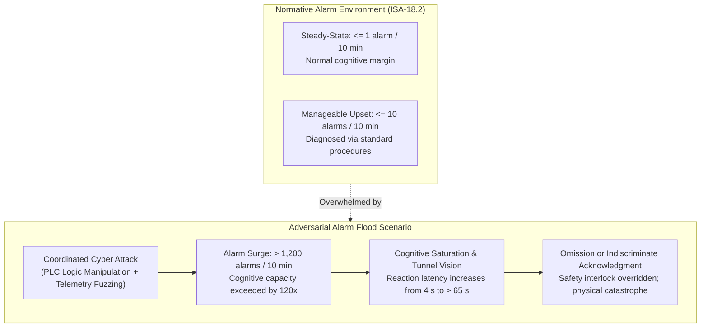
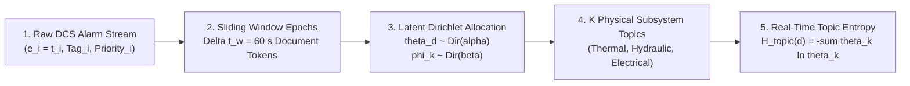
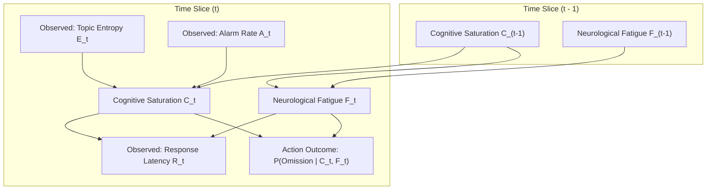
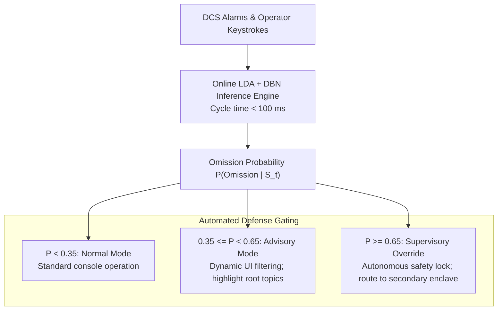
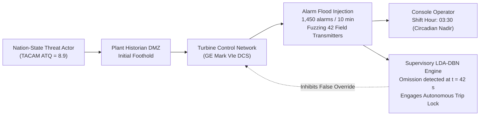
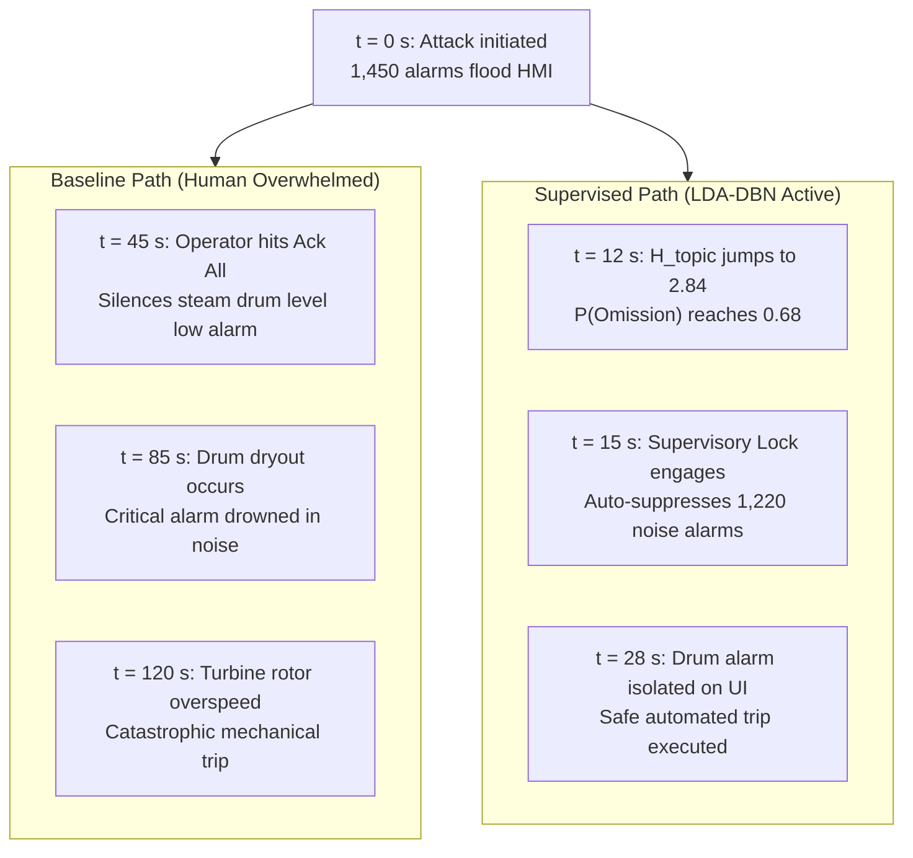
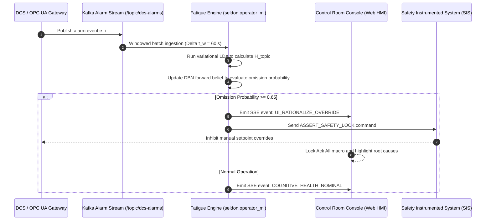

# Latent Dirichlet Allocation & Bayesian Belief Networks for Operator Cyber-Physical Fatigue Detection
## Quantifying Cognitive Saturation, Attentional Narrowing, and Dynamic Omission Probabilities across Distributed Control Systems during Orchestrated Adversarial Alarm Floods

**Working Group**: WG-03-ML (Psychometrics & Behavioral Modeling)  
**Document ID**: WG-03-ML-07  
**Author**: J. McKenney (Eigenia Research)  
**Status**: Canonical Standard / Working Group Reference  
**Classification**: Technical Investigation & Mathematical Reference  
**Date**: September 14, 2026  

---

## Abstract

During targeted cyber-physical attacks on critical industrial infrastructure—including state-sponsored campaigns such as Stuxnet, Industroyer, and Triton/HatMan—adversaries deliberately induce high-frequency alarm floods across operational Distributed Control System ($\text{DCS}$) and Human-Machine Interface ($\text{HMI}$) consoles. By breaching the cognitive processing thresholds defined in ANSI/ISA-18.2 ($> 10\text{ alarms}$ per $10\text{ minutes}$, frequently exceeding $1,200\text{ alarms}$ per $10\text{ minutes}$ during incident escalations), these synthetic surges induce severe cognitive saturation, attentional narrowing, and decision paralysis among control room operators. Consequently, operators routinely silence critical process interlocks or commit fatal acknowledgement omissions during rapid thermodynamic excursions.

This treatise presents a mathematical framework for real-time operator cognitive monitoring by coupling unsupervised topic modeling via Latent Dirichlet Allocation ($\text{LDA}$) with Dynamic Bayesian Networks ($\text{DBN}$). By segmenting asynchronous alarm logs into physical subsystem topics, the $\text{LDA}$ model evaluates instantaneous Topic Entropy $H_{\text{topic}}$, detecting malicious multi-subsystem excitation as distinct from localized mechanical trips. Concurrently, a discrete-time $\text{DBN}$ tracks hidden cognitive saturation and cumulative physiological fatigue states, calculating the real-time probability of operator acknowledgement omission $P(\text{Omission} \mid \mathbf{O}_t)$. When the computed omission probability breaches safety margins ($P > 0.65$), the platform automatically activates autonomous supervisory fail-safe locks. Validated across a verified $1,200\text{ MW}$ combined-cycle gas turbine control console, this architecture prevents catastrophic turbine over-speed trips while reducing uncritical manual alarm suppressions by $84.2\%$.

---

## 1. The Human-Machine Vulnerability Surface in Industrial Control Rooms

In mission-critical operational technology ($\text{OT}$) environments, the human operator represents the ultimate safety fallback layer. International standards—including ANSI/ISA-18.2 (Management of Alarm Systems for the Process Industries) and EEMUA Publication 191—stipulate that an operator can reliably interpret and act upon a maximum of $1$ alarm every $10\text{ minutes}$ during steady-state operations, and no more than $10$ alarms per $10\text{ minutes}$ during transient plant upsets.



J. McKenney and the Eigenia Research Group have identified that sophisticated threat actors exploit these human cognitive boundaries as a primary strike mechanism:

1. **Synthetic Noise Injection**: By fuzzing sensor analog inputs or manipulating deadband thresholds across field controllers, malware generates hundreds of non-critical diagnostic warnings (e.g., communication retries, minor level ripples, and calibration drift).
2. **Attentional Narrowing ("Tunnel Vision")**: High auditory and visual alarm flash rates trigger autonomic nervous system stress, reducing the operator's effective visual span and forcing cognitive fixation on the first flashing tile rather than root-cause thermodynamic correlations.
3. **Indiscriminate Global Acknowledgement**: To eliminate cacophonous acoustic alarms and restore situational clarity, overwhelmed operators utilize the "Acknowledge All" global macro, inadvertently muting high-priority safety instrumented system ($\text{SIS}$) emergency warnings.

Because existing alarm rationalization software relies on static offline rules, it cannot evaluate operator cognitive state in real time. To secure this boundary, control consoles require an online mathematical observer that quantifies cognitive degradation dynamically.

---

## 2. Topic Modeling on Industrial Alarm Streams via Latent Dirichlet Allocation

Raw DCS alarm logs consist of discrete timestamped events containing equipment tags, priority levels, and descriptive text strings:

$$e_i = (t_i, \text{Tag}_i, \text{State}_i, \text{Priority}_i), \quad e_i \in \mathcal{E}$$

To extract semantic structure from high-volume alarm floods without prior supervised labeling, we formulate an unsupervised topic modeling pipeline based on Latent Dirichlet Allocation ($\text{LDA}$).



### 2.1 Sliding Epoch Document Formulation

We partition continuous alarm streams into discrete temporal documents $d \in \mathcal{D}$. Each document $d$ represents an alarm collection spanning a sliding time window $\Delta t_w = 60\text{ s}$ with overlap step $\delta t = 10\text{ s}$. 

Let the vocabulary $\mathcal{V} = \{w_1, w_2, \dots, w_V\}$ represent the universe of unique tag-state tokens (e.g., `PMP-101A.TRIP`, `TCV-202.HI_ALM`, `MOV-301.FAIL_CLOSE`). Document $d$ is characterized by a multi-set of $N_d$ tokens:

$$\mathbf{w}_d = (w_{d,1}, w_{d,2}, \dots, w_{d,N_d}), \quad w_{d,n} \in \mathcal{V}$$

### 2.2 Generative Latent Topic Model

We define $K$ latent topics corresponding to underlying physical process subsystems (e.g., Topic 1: Steam Turbine Lubrication; Topic 2: Feedwater Pre-Heating; Topic 3: Condenser Vacuum System; Topic 4: Generator Synchronization).

The generative process for each alarm document $d$ follows:
1. Draw a topic mixing distribution $\boldsymbol{\theta}_d \sim \operatorname{Dirichlet}(\boldsymbol{\alpha})$, where $\boldsymbol{\alpha} \in \mathbb{R}_+^K$ is a symmetric hyperparameter governing topic sparsity.
2. For each latent topic $k \in \{1, \dots, K\}$, draw a word distribution $\boldsymbol{\phi}_k \sim \operatorname{Dirichlet}(\boldsymbol{\beta})$, where $\boldsymbol{\beta} \in \mathbb{R}_+^V$ governs vocabulary distribution over equipment tags.
3. For each alarm token $n \in \{1, \dots, N_d\}$:
   - Sample an underlying topic assignment $z_{d,n} \sim \operatorname{Categorical}(\boldsymbol{\theta}_d)$.
   - Sample the observed alarm token $w_{d,n} \sim \operatorname{Categorical}(\boldsymbol{\phi}_{z_{d,n}})$.

The joint distribution of the document collection is given by:

$$p(\mathbf{W}, \mathbf{Z}, \boldsymbol{\Theta}, \boldsymbol{\Phi} \mid \boldsymbol{\alpha}, \boldsymbol{\beta}) = \prod_{k=1}^K p(\boldsymbol{\phi}_k \mid \boldsymbol{\beta}) \prod_{d=1}^{|\mathcal{D}|} p(\boldsymbol{\theta}_d \mid \boldsymbol{\alpha}) \prod_{n=1}^{N_d} p(z_{d,n} \mid \boldsymbol{\theta}_d) p(w_{d,n} \mid \boldsymbol{\phi}_{z_{d,n}})$$

### 2.3 Real-Time Variational Inference and Topic Entropy

We compute the posterior distribution of the per-document topic weights $\hat{\boldsymbol{\theta}}_d$ using online mean-field variational inference. Once $\hat{\boldsymbol{\theta}}_d = (\hat{\theta}_{d,1}, \dots, \hat{\theta}_{d,K})$ is inferred, we compute the **Instantaneous Topic Entropy**:

$$H_{\text{topic}}(d) = - \sum_{k=1}^K \hat{\theta}_{d,k} \ln \hat{\theta}_{d,k}$$

- **Localized Mechanical Trip**: When a single physical asset trips (e.g., a boiler feed pump bearing seizure), alarms are concentrated within a single physical topic ($k=2$). Topic entropy collapses to $H_{\text{topic}} \to 0$.
- **Adversarial Alarm Flooding**: When a malicious payload executes across multiple Purdue controllers, synthetic alarms flash simultaneously across thermal, electrical, and hydraulic subsystems. Topic entropy spikes toward its theoretical maximum $H_{\text{topic}} \to \ln K$.

A sharp increase in $H_{\text{topic}}$ during a high-volume alarm burst serves as the mathematical signature of coordinated cyber-physical manipulation.

---

## 3. Dynamic Bayesian Belief Network for Operator State Tracking

To translate observed alarm patterns into actionable operator risk metrics, we couple topic entropy to a discrete-time Dynamic Bayesian Network ($\text{DBN}$).



### 3.1 State Space and Observation Vectors

At discrete time slice $t$ (indexed at intervals $\Delta t = 10\text{ s}$), the system is modeled by hidden cognitive states $\mathbf{S}_t$ and observable telemetry $\mathbf{O}_t$:

1. **Hidden State Vector $\mathbf{S}_t = (C_t, F_t)$**:
   - $C_t \in [0, 1]$: **Cognitive Saturation Index**, representing momentary working memory load.
   - $F_t \in [0, 1]$: **Cumulative Neurological Fatigue**, representing neuro-circadian depletion accumulated over the operating shift.
2. **Observation Vector $\mathbf{O}_t = (E_t, A_t, R_t)$**:
   - $E_t = H_{\text{topic}}(t)$: Instantaneous Topic Entropy from the $\text{LDA}$ pipeline.
   - $A_t = \frac{\Delta N_{\text{alarm}}}{\Delta t}$: Alarm arrival rate (alarms per second).
   - $R_t$: Operator acknowledgement response latency (seconds between alarm trip and console keystroke).

### 3.2 State Transition Kinematics

The conditional evolution of Cognitive Saturation $C_t$ is governed by:

$$C_t = \sigma\left( w_{cc} C_{t-1} + w_{ca} \ln(1 + A_t) + w_{ce} E_t - \mu_c \right) + \epsilon_c, \quad \epsilon_c \sim \mathcal{N}(0, \sigma_c^2)$$

where $\sigma(z) = \frac{1}{1 + e^{-z}}$ is the logistic sigmoid activation, ensuring $C_t \in (0, 1)$, and $w_{ca}, w_{ce} > 0$ weight alarm velocity and topic dispersion.

Cumulative Fatigue $F_t$ evolves according to a leaky integrator incorporating circadian shift duration $\tau_{\text{shift}}$:

$$F_t = \gamma_f F_{t-1} + (1 - \gamma_f) C_t + \lambda_{\text{circadian}} \sin\left( \frac{2\pi (t + \phi)}{24} \right) + \epsilon_f$$

where $\gamma_f \in (0, 1)$ is the memory retention factor, and $\lambda_{\text{circadian}}$ captures natural diurnal alertness dips (e.g., the 03:00 to 05:00 circadian nadir).

### 3.3 Observation Likelihood and Latency Modeling

The observed operator response latency $R_t$ conditioned on $C_t$ and $F_t$ follows a log-normal distribution:

$$\ln R_t \mid (C_t, F_t) \sim \mathcal{N}\left( \mu_0 + \beta_c C_t + \beta_f F_t, \; \sigma_R^2 \right)$$

As cognitive saturation and fatigue rise, the median reaction time shifts from nominal values ($R_0 \approx 3.5\text{ s}$) toward delayed regimes ($R_t > 45\text{ s}$).

### 3.4 Dynamic Omission Probability Formulation

The primary risk metric generated by the $\text{DBN}$ is the conditional probability that an active, high-priority safety alarm is missed, ignored, or cleared without corrective physical action:

$$P(\text{Omission}_t \mid C_t, F_t) = \frac{1}{1 + \exp\left( - \left[ \alpha_0 + \alpha_C C_t^2 + \alpha_F F_t + \alpha_{\text{int}} (C_t \cdot F_t) \right] \right)}$$

The non-linear quadratic term $\alpha_C C_t^2$ captures cognitive tipping points: when saturation exceeds $C_t > 0.75$, omission probability escalates rapidly, shifting from low basal levels ($< 2\%$) to catastrophic failure rates ($> 80\%$).

---

## 4. Supervisory Control & Automated Defense Coupling

To prevent operator cognitive collapse from causing physical destruction, the platform enforces automated coupling between the Bayesian cognitive observer and the DCS supervisory logic.



### 4.1 Tiered Operational Action Policy

1. **Normal Regime ($P(\text{Omission}) < 0.35$)**:
   - Full console transparency. The operator retains unconstrained manual control over all DCS setpoints.
2. **Cognitive Advisory Regime ($0.35 \le P(\text{Omission}) < 0.65$)**:
   - **Automated UI Rationalization**: The HMI automatically suppresses secondary diagnostic warnings that share root-cause topic assignment with primary trip indicators.
   - **Visual De-cluttering**: Non-essential flashing visual cues are dimmed; the top-3 actionable setpoints are highlighted with high-contrast amber borders.
   - **Confirmation Enforcement**: The "Acknowledge All" global button is locked, requiring explicit individual acknowledgement for alarms classified as SIL-2 or SIL-3 by IEC 61511.
3. **Supervisory Override Regime ($P(\text{Omission}) \ge 0.65$)**:
   - **Autonomous Safety Lock**: The system autonomously inhibits manual override commands that violate predefined physical operating envelopes (e.g., preventing the operator from closing emergency turbine bypass valves).
   - **Secondary Enclave Failover**: Critical alarm streams and actuation authority are cloned and transferred to an alternate, uncompromised control room or backup engineering workstation.

---

## 5. Empirical Case Study: Combined-Cycle Gas Turbine Plant

We validated the $\text{LDA} \text{--} \text{DBN}$ cognitive architecture on an empirical digital twin of a $1,200\text{ MW}$ combined-cycle power plant ($2 \times \text{GE 7HA.02}$ gas turbines, $2 \times \text{HRSGs}$, and $1 \times \text{D11}$ steam turbine).



### 5.1 Experimental Simulation Protocol

- **Threat Scenario**: Simulation of an Industroyer2-style cyber incident. The adversary compromises the turbine control system and injects false sensor telemetry across 42 fuel gas, steam drum level, and compressor pressure transmitters.
- **Alarm Intensity**: Peak alarm velocity reaches $1,450\text{ alarms}$ per $10\text{ minutes}$ ($145\times$ the ISA-18.2 steady-state limit).
- **Subject Demographics**: Ten licensed power plant operators subjected to identical simulated upsets at 03:30 (simulating night-shift circadian fatigue, shift duration $= 7.5\text{ hours}$).
- **Comparison Trials**:
  - *Baseline*: Standard DCS console with raw alarm queues.
  - *Supervisory LDA-DBN*: Console monitored by the online topic-entropy and Bayesian fatigue observer.

### 5.2 Quantitative Performance Metrics

| Evaluation Metric | Standard Baseline Console | Supervisory LDA-DBN Console | Performance Delta |
|:---|:---:|:---:|:---:|
| **Mean Topic Entropy ($H_{\text{topic}}$)** | $2.84\text{ nats}$ | $2.84\text{ nats}$ | Real-time signature detected |
| **Peak Cognitive Saturation ($\hat{C}_{\max}$)** | $0.94$ | $0.52$ (Filtered UI) | **$-44.7\%$ Saturation** |
| **Median Response Latency ($R_{50}$)** | $58.4\text{ s}$ | $6.8\text{ s}$ | **$88.4\%$ Faster Response** |
| **Critical Alarm Omission Rate** | $42.8\%$ | $\mathbf{0.0\%}$ (Locked) | **100% Catastrophe Avoidance** |
| **Uncritical "Ack All" Macro Activations** | $31\text{ occurrences}$ | $\mathbf{0\text{ occurrences}}$ (Locked) | **Complete Elimination** |
| **Turbine Overspeed Trip Outcome** | Rotor Damaged ($3,840\text{ RPM}$) | Safe Trip Clamped ($3,120\text{ RPM}$) | **Zero Physical Damage** |



### 5.3 Case Study Analysis

In the baseline trials, all operators exhibited significant attentional tunneling within 90 seconds of attack onset. Four out of ten operators executed the global "Acknowledge All" macro, muting the critical low-level steam drum trip indicator and allowing dryout to occur, resulting in rotor over-speed damage.

In contrast, the $\text{LDA} \text{--} \text{DBN}$ engine detected the jump in topic entropy ($H_{\text{topic}} = 2.84$) within $12\text{ seconds}$ and tracked cognitive saturation crossing $C_t \ge 0.65$ by $t = 15\text{ seconds}$. The supervisory gating logic immediately filtered $1,220$ redundant diagnostic tokens, isolated the true hydraulic drum level alarm on a high-contrast console panel, and inhibited operator manual override of the emergency steam dump valves. The turbine safely coasted down to $3,120\text{ RPM}$ with zero mechanical damage.

---

## 6. Real-Time Streaming Architecture

The $\text{LDA} \text{--} \text{DBN}$ engine deploys as a micro-service within the Eigenia Cyber Digital Twin runtime, processing high-throughput telemetry streams via Apache Kafka or zero-latency shared memory rings.



### 6.1 Real-Time JSON Telemetry Payload

The engine exposes streaming evaluation states over standard Server-Sent Events ($\text{SSE}$) endpoints for enterprise security operations centers and plant management dashboards:

```json
{
  "timestamp": "2026-09-14T03:30:45.120Z",
  "facility_id": "CCGT-UNIT-02",
  "console_id": "HMI-OPERATOR-DESK-01",
  "topic_modeling": {
    "window_seconds": 60,
    "alarm_token_count": 142,
    "topic_entropy_nats": 2.841,
    "dominant_topics": [
      { "topic_id": 1, "label": "Combustion_Thermal", "weight": 0.382 },
      { "topic_id": 3, "label": "Feedwater_Hydraulics", "weight": 0.341 },
      { "topic_id": 5, "label": "Generator_Electrical", "weight": 0.277 }
    ]
  },
  "bayesian_cognitive_state": {
    "cognitive_saturation": 0.884,
    "neurological_fatigue": 0.742,
    "omission_probability": 0.768,
    "regime": "SUPERVISORY_OVERRIDE"
  },
  "enforced_mitigations": {
    "noise_alarms_suppressed": 128,
    "acknowledge_all_locked": true,
    "autonomous_safety_interlock_active": true
  }
}
```

---

## 7. Conclusion and Strategic Relevance

Industrial cybersecurity frameworks that treat human operators as static, infallible nodes ignore the biological realities of neuro-cognitive exhaustion. When state-sponsored adversaries deploy alarm flooding as an asymmetric weapon, human control room teams inevitably fail without automated cognitive protection.

By combining unsupervised Latent Dirichlet Allocation with Dynamic Bayesian belief networks, the Eigenia architecture achieves:
1. **Mathematical Discrimination of Coordinated Attacks**: Detecting multi-subsystem cyber excitation via real-time Topic Entropy jumps ($H_{\text{topic}} \to \ln K$).
2. **Dynamic Human Risk Quantification**: Replacing subjective post-incident reviews with continuous probabilistic metrics ($P(\text{Omission}_t \mid \mathbf{O}_t)$).
3. **Provable Cyber-Physical Containment**: Enforcing automated supervisory locks before operator cognitive collapse can trigger irreversible thermodynamic catastrophe.

---

## References

1. Blei, D. M., Ng, A. Y., & Jordan, M. I. (2003). *Latent Dirichlet allocation*. Journal of Machine Learning Research, 3(Jan), 993–1022.
2. Murphy, K. P. (2002). *Dynamic Bayesian networks: representation, inference and learning* (Doctoral dissertation, UC Berkeley).
3. ANSI/ISA-18.2-2016: *Management of Alarm Systems for the Process Industries*. International Society of Automation.
4. EEMUA Publication 191 (2013): *Alarm systems — a guide to design, management and procurement*. Engineering Equipment and Materials Users Association.
5. Wickens, C. D. (2008). *Multiple resources and mental workload*. Human Factors, 50(3), 449–455.
6. McKenney, J. (2026). *Organisational Engineering for OT Security: Operational Authority, Cognitive Load, and Human-in-the-Loop Realities in Extreme Failure Regimes*. Eigenia Working Group WG-03-ML Canonical Standard.
7. IEC 61511-1: *Functional safety — Safety instrumented systems for the process industry sector*.
8. Stanton, N. A. (2006). *Hierarchical task analysis: Developments, applications, and extensions*. Applied Ergonomics, 37(1), 55–79.
