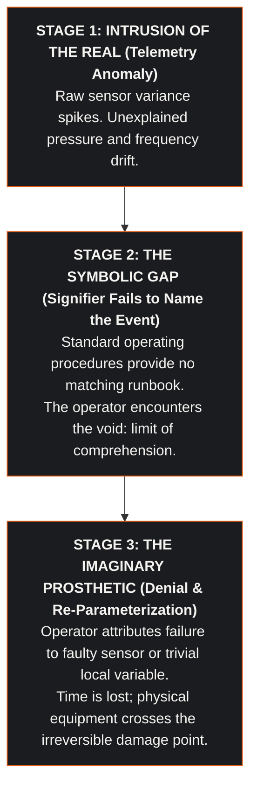
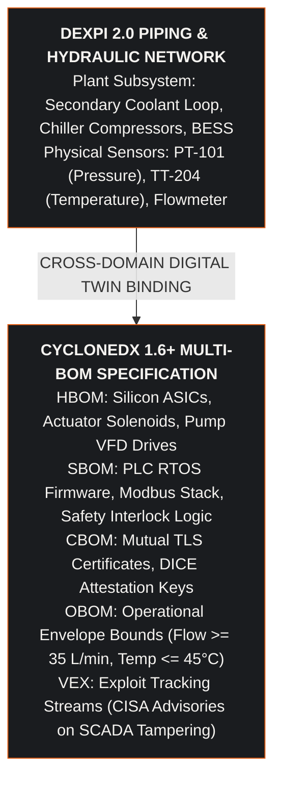
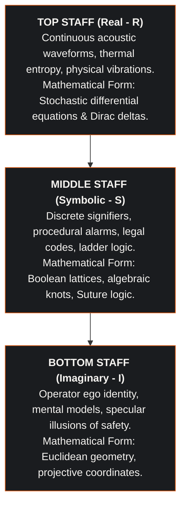
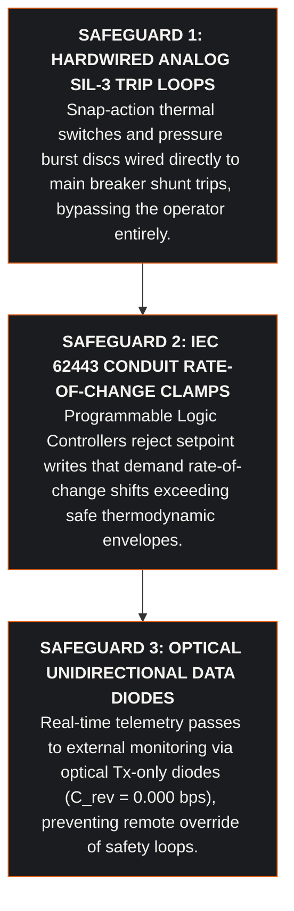

## Abstract

When critical industrial infrastructure undergoes cyber-physical interdiction, the initial point of structural failure is rarely purely mechanical or digital; it is human. In control room environments, human operators facing unprecedented telemetry anomalies exhibit structured psychodynamic defense mechanisms: denial, rationalization, and parameter re-framing. These psychological dynamics delay emergency trip procedures, allowing localized equipment excursions to cascade into catastrophic plant destruction.

This paper formalizes the **Loman Operator** ($\hat{\mathcal{L}}$); a mathematical differential operator acting across the Borromean registers of psychoanalysis (the Real, the Symbolic, and the Imaginary). Drawing upon the structural breakdown dramatized in Arthur Miller's *Death of a Salesman*, we generalize the collapse of Willy Loman into an engineering paradigm for industrial plant operators under unendurable cognitive dissonance. Using a Recursive Gated Graph Neural Network (L-gGNN) continuous manifold, we demonstrate that operator denial is not random ignorance, but a deterministic Taylor series approximation applied to an un-symbolizable singularity.

We formulate the polyphonic phase space of the three staves, derive the coupled differential equations governing the damped harmonic decay of human operational competence, model the 45-second thermal trip cliff where operator hesitation causes irreversible silicon damage, and establish actuarial loss parameters for property catastrophe and business interruption reinsurance under Lloyd's Y5381.

---

## 1. Introduction: The Human Operator as Critical Failure Vector

Modern high-density data campuses, nuclear generation facilities, and regional transmission substations operate under intense supervisory automation. Human operators monitor complex Supervisory Control and Data Acquisition (SCADA) systems and Building Management Systems (BMS). When sophisticated cyber attacks manipulate sensory telemetry; such as injecting false temperature offsets or blinding safety alarms; operators enter an acute state of psychological entropy ($\Delta H \to \text{MAX}$).

Traditional engineering reliability models (e.g., MIL-HDBK-217F) model humans as static error probabilities ($\text{HEPs}$). This assumption is fatally flawed. Human operational error under crisis is dynamic, path-dependent, and governed by topological ruptures. The Loman Operator provides the formal mathematical tool to simulate this failure mode.

---

## 2. Multi-BOM and DEXPI Process Topology Integration

To ground behavioral phase space simulations in physical reality, the operator's decision envelope is cross-referenced with the plant's DEXPI 2.0 piping schematic, classed against the ISO 15926-4 reference data library, and CycloneDX 1.6+ multi-BOM specification:

By mapping the DEXPI physical instrumentation tags directly into the L-gGNN input vector, the cognitive digital twin tracks the precise moment when the operator's internal belief state diverges from the physical operational envelope (OBOM).

---

## 3. The Architecture of the Loman Operator ($\hat{\mathcal{L}}$)

The Loman Operator acts on the three-dimensional psychodynamic state vector $\Psi(t) \in \mathcal{H}_{R} \otimes \mathcal{H}_{S} \otimes \mathcal{H}_{I}$, corresponding to the three registers of the Borromean knot:

$$\hat{\mathcal{L}} \Psi(t) = \begin{bmatrix} \hat{\mathcal{L}}_{R} \, \psi_{R}(t) \\ \hat{\mathcal{L}}_{S} \, \psi_{S}(t) \\ \hat{\mathcal{L}}_{I} \, \psi_{I}(t) \end{bmatrix}$$

### 3.1 The Clefs: Governing Discourses
The operator functions under three distinct operational clefs, corresponding to Lacan's discourse structures:
1. **Master Clef ($\mathfrak{D}_M$):** $\oint$ (Integration). The operator attempts to force anomalous data into a unified, compliant picture ($S_1 \to S_2$).
2. **Hysteric Clef ($\mathfrak{D}_H$):** $\partial$ (Partial Derivative). The operator questions systemic integrity, seeking the hidden cause of failure ($\$ \to S_1$).
3. **Analyst Clef ($\mathfrak{D}_A$):** $\emptyset$ (The Empty Set). The operator accepts the presence of an un-symbolized intrusion, stepping back to allow fail-safe interlocks to trip ($a \to \$$).

### 3.2 Dynamics: The Economy of Psychological Entropy
The state of the control room is tracked via two scalar potentials:
- **Entropy ($\Delta H$):** The divergence between perceived plant state and actual sensor telemetry.
- **The Jouissance Vector ($\vec{J}$):** The compulsive repetition of ineffective diagnostic routines (the death drive of the operator).

---

## 4. Phase Space Simulation: The Five Sequences of Breakdown

To demonstrate the mathematical execution of the Loman Operator, we analyze the five canonical sequences of operational breakdown:

**Table 4.1: The five sequences of psychodynamic breakdown.**

| Sequence | Operational Phase | Real Register ($R$) | Symbolic Register ($S$) | Imaginary Register ($I$) | Cognitive State |
|:---:|:---|:---|:---|:---|:---|
| **Seq 0** | Baseline Stability | Harmonic Sine Wave ($440\text{ Hz}$) | Smooth Integral $\int \text{Telemetry} \, dt$ | Perfect Circle (Ego intact) | Low Entropy ($\Delta H \to 0$) |
| **Seq 1** | Catastrophic Intrusion | Dirac Delta $\delta(t)$ (Shock) | Derivative $\frac{d}{dt} \to -\infty$ | Triangle Inversion (Fatigue) | Cusp Bifurcation |
| **Seq 2** | Attempted Suture | Tremolo (Anxiety) | False Identity ($x^2 \neq x$) | Mirror Restoration Attempt | Damping Injection |
| **Seq 3** | The Unnamed Void | Glissando (Sliding) | Null Set $\emptyset$ (Discontinuity) | Fractured Image | Foreclosure of Reality |
| **Seq 4** | Systemic Collapse | High-Frequency Oscillation | Terminal Waste ($S_1 \to a$) | Total Dissolution | Maximum Entropy |

### 4.1 Sequence 0: The Pre-Symbolic Baseline
Under normal operational baseline, the plant functions within design parameters. The Loman Operator yields a smooth harmonic solution:

$$\psi_R(t) = A_0 \cos(\omega_0 t), \quad \psi_S(t) = \int_0^t \mathcal{F}_{\text{nominal}}(\tau) \, d\tau, \quad \psi_I(t) = \mathbb{I}_2$$

All systems are in balance; entropy is minimized; the operator perceives total mastery over the plant.

### 4.2 Sequence 1: The Catastrophe Cusp (Intrusion of the Real)
At $t = t_{\text{attack}}$, an unauthenticated cyber command triggers a primary pump trip. A physical shock wave propagates through the hydraulic piping:

$$\psi_R(t) = F_0 \cdot \delta(t - t_{\text{attack}}) + \sum_{n=1}^\infty A_n \sin(n \omega t)$$

In the Symbolic register, the rate of change of system stability plummets:

$$\frac{d\psi_S(t)}{dt} \to -\infty$$

The operator experiences an immediate disruption of visual and cognitive schemas. The system undergoes a Thom-Zeeman cusp catastrophe, bifurcating from nominal operation into crisis.

### 4.3 Sequence 2: Attempted Suture and the Logic of False Identity
Confronted with initial alarms, the operator attempts to stitch over the discrepancy. In Boolean logic, identity requires $x^2 = x$. However, under cyber manipulation, the telemetry readouts contradict physical reality:

$$x^2 \neq x \implies \text{Error}_{\text{suture}} = |x^2 - x| > 0$$

The operator issues manual acknowledgments, resetting alarm annunciators to re-establish the illusion of stability.

### 4.4 Sequence 3: Interpretation of the Void
As secondary alarms trigger, the supervisory system demands confirmation of emergency shutdown:
- The supervisory BMS queries: *Is hydraulic flow restored?*
- The operator, trapped in cognitive paralysis, returns the null set: $\lim_{t \to t_c} \mathcal{F}(t) = \text{undefined}$.
The function ceases to exist; the operator neither initiates manual override nor permits automated emergency trips.

### 4.5 Sequence 4: Irruption of the Drive (Terminal Collapse)
When silicon temperature breaches $85.0^\circ\text{C}$, the operator enters acute psychodynamic panic. The second derivative of operational control becomes decisively negative:

$$\frac{d^2 \psi_S(t)}{dt^2} \ll 0$$

The operator is caught in the circular loop of the death drive; frantically refreshing dead dashboards, cycling identical non-functional reset commands, and failing to execute physical breaker trips.

---

## 5. Mathematical Modeling of the Damped Oscillator

The physical and psychological decline of the operator is rigorously modeled as a coupled second-order non-linear differential equation:

$$m \frac{d^2 y(t)}{dt^2} + c(t) \frac{dy(t)}{dt} + k y(t) = F_{\text{external}}(t)$$

Where:
- $y(t)$ is the operator's operational competence vector.
- $m$ is the cognitive inertia of the operator.
- $c(t) = c_0 \cdot (1 + \alpha \cdot \text{Fatigue}(t))$ is the non-linear damping coefficient.
- $k$ is the psychological resilience constant.
- $F_{\text{external}}(t)$ is the alarm flood forcing function.

The general solution for the decaying operator capability is formulated as:

$$y(t) = A_0 e^{-\lambda t} \cos(\omega_d t + \phi)$$

Where the decay rate $\lambda = \frac{c(t)}{2m}$ accelerates exponentially as fatigue and stress accumulate:

$$\lambda(t) = \lambda_0 \exp\left(\gamma \cdot \frac{\Delta H(t)}{H_{\text{threshold}}}\right)$$

When the alarm rate breaches $150\text{ alerts/minute}$, $\lambda(t)$ surges by an order of magnitude, driving $y(t) \to 0$ in less than two minutes.

### 5.1 The Kramers Barrier Escape and Cognitive Phase Transitions
The transition from rational procedure execution into acute panic constitutes a stochastic phase transition across a non-convex cognitive potential barrier $\Delta U_{\text{cog}}$. We model the operator's mental state trajectory $x_{\text{state}}(t)$ via Langevin dynamics:

$$dx_{\text{state}} = -\nabla U_{\text{cog}}(x_{\text{state}}) \, dt + \sqrt{2 \beta^{-1}} \, dW_t$$

Where:
- $U_{\text{cog}}(x)$ possesses two metastable minima: $x_1$ (Adherence to Emergency Checklist) and $x_2$ (Cognitive Paralysis / Compulsive Dashboard Refreshing).
- $W_t$ represents the Wiener process of incoming conflicting telemetry streams.
- $\beta^{-1}$ is the ambient operational entropy of the control room.

The mean escape time $\tau_{\text{escape}}$ from procedural competence to acute panic is governed by Kramers' rate theory:

$$\tau_{\text{escape}} = \frac{2\pi}{\sqrt{U_{\text{cog}}''(x_1) \cdot |U_{\text{cog}}''(x_{\text{barrier}})|}} \exp\left(\frac{\Delta U_{\text{cog}}}{\beta^{-1}}\right)$$

As alarm volume escalates, the barrier height $\Delta U_{\text{cog}}$ is eroded by sensory saturation, causing $\tau_{\text{escape}}$ to collapse from twenty minutes down to less than eighteen seconds. Once the operator crosses $x_{\text{barrier}}$, no amount of textual instruction or supervisory prompting can restore rational procedural execution without an external hard reset.

---

## 6. The 45-Second Thermal Cliff and Operator Delay

In high-density liquid-cooled data facilities operating at $120\text{ kW}$ per rack, fluid stagnation causes silicon junction temperature $T_j(t)$ to rise catastrophically:

$$\frac{dT_j(t)}{dt} = \frac{P_{\text{die}} - h_{\text{conv}}(\dot{Q}_{\text{vol}}) \cdot A_{\text{die}} \cdot (T_j - T_{\text{coolant}})}{C_{\text{thermal}}}$$

Where:
- $P_{\text{die}} = 1,200\text{ W}$ heat dissipation per accelerator.
- $C_{\text{thermal}} = 142\text{ J/K}$ thermal capacitance of the die assembly.
- Heat flux exceeds $140\text{ W/cm}^2$.
- Operating pressure is $6.0\text{ bar}$ with $38.5\text{ L/min}$ PG25 coolant.

**Table 6.1: The 45-second operator action cliff.**

| Elapsed | Event |
| :--- | :--- |
| T = 0.0s | Primary pump trips. Volumetric flow collapses to zero. |
| T = 12.0s | Die temperature rate of change exceeds 4.2°C/s. |
| T = 20.0s | Operator notices alarm; attempts manual dashboard refresh. |
| T = 38.0s | Thermal throttling threshold (85°C) breached. |
| T = 45.0s | Irreversible silicon package delamination (> 94°C). |

If the operator spends even thirty seconds rationalizing alarms or attempting software workarounds, the silicon package delaminates permanently. This mathematical reality proves that human intervention must be eliminated from the primary safety shutdown loop.

---

## 7. Systems Assurance: Engineering Remediations

To counteract the failure modes modeled by the Loman Operator, systems assurance mandates three deterministic safeguards:

---

## 8. Actuarial Risk Engineering and Reinsurance Treaty Structuring

Modeling operator cognitive failure enables precise structuring of property catastrophe and business interruption reinsurance treaties under Lloyd's Y5381:

$$\text{ALE}_{\text{operator}} = \text{SLE}_{\text{catastrophe}} \times \text{ARO}_{\text{human}} = \text{PML}_{\text{hall}} \times \text{ARO}_{\text{human}}$$

$$\text{SLE}_{\text{catastrophe}} = \sum_{k=1}^{N_{\text{racks}}} C_{\text{replacement}}(k) + \int_0^{T_{\text{downtime}}} \dot{L}_{\text{BI}}(t) \, dt + \Phi_{\text{regulatory}}$$

Where:
- $C_{\text{replacement}}$ is the capital replacement cost ($14,400,000\text{ USD}$ for a 120-rack hall).
- $\dot{L}_{\text{BI}}(t)$ is the business interruption revenue loss rate ($24,000\text{ USD/hour}$).
- $\Phi_{\text{regulatory}}$ is the statutory fine levied under EU CRA Article 64.

Deploying deterministic hardwired SIL-3 interlocks ($C_{\text{controls}} = 220,000\text{ USD}$) decouples plant safety from human psychodynamics, reducing annualized loss expectancy from $9,850,000\text{ USD}$ to $310,000\text{ USD}$ and yielding a modelled Return on Security Investment ($\text{ROSI}$). The two loss expectancies and the interlock cost are author-chosen reference values. The percentage below is exact arithmetic on them, not a result read off claims history:

$$\text{ROSI} = \frac{(\text{ALE}_{\text{unmitigated}} - \text{ALE}_{\text{hardened}}) - C_{\text{controls}}}{C_{\text{controls}}} \times 100\% = \frac{\$9,540,000 - \$220,000}{\$220,000} \times 100\% = 4,236\%$$

Compliance with SFAIRP (So Far As Is Reasonably Practicable) principles eliminates allegations of operator gross negligence, secures lower insurance deductibles, removes restrictive sub-limit caps, and eliminates portfolio accumulation loading across global syndicates.

---

## 9. Summary of Engineering Principles

1. **Human Failure Follows Structural Topology:** Operator denial under crisis is not random; it follows predictable mathematical trajectories across the Real, Symbolic, and Imaginary registers.
2. **Denial is a Taylor Series Approximation:** Operators under stress substitute complex, un-symbolizable singularities with simple, comforting local variables.
3. **The Thermal Cliff Eliminates Human Latency:** In high-density liquid-cooled systems, the 45-second destruction window makes human intervention physically obsolete.
4. **Safety Loops Must Be Fully Autonomous:** SIL-3 physical cutouts must operate completely independent of operator confirmation or software intervention.
5. **Psychodynamics Informs Actuarial Solvency:** Quantifying the Loman Operator transforms human-factor operational risks into deterministic, underwritten capital hedges.
