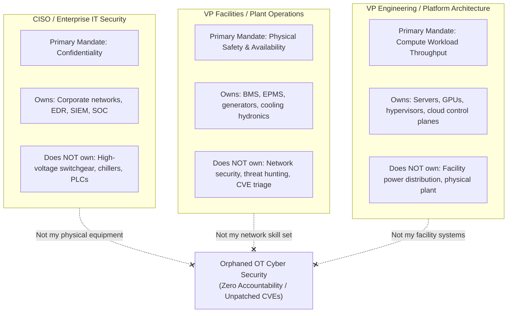
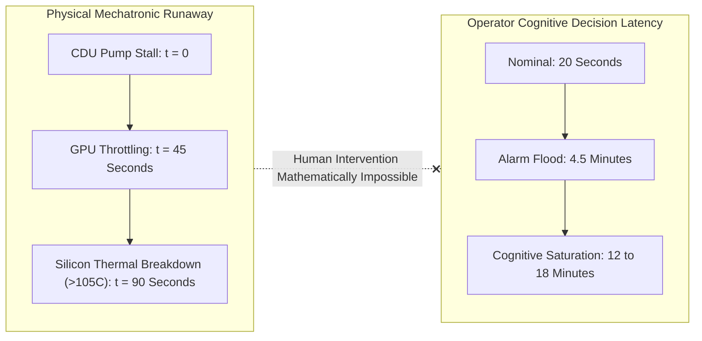
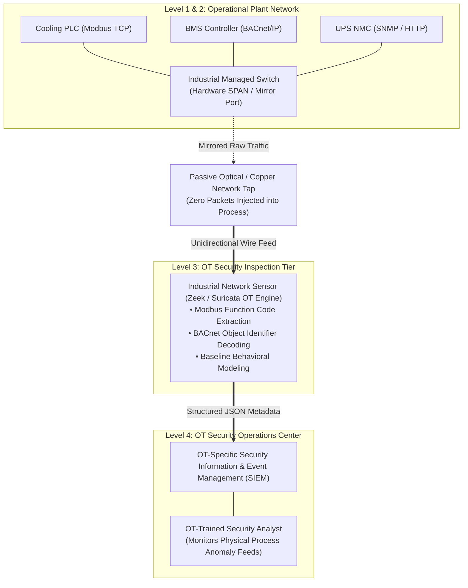
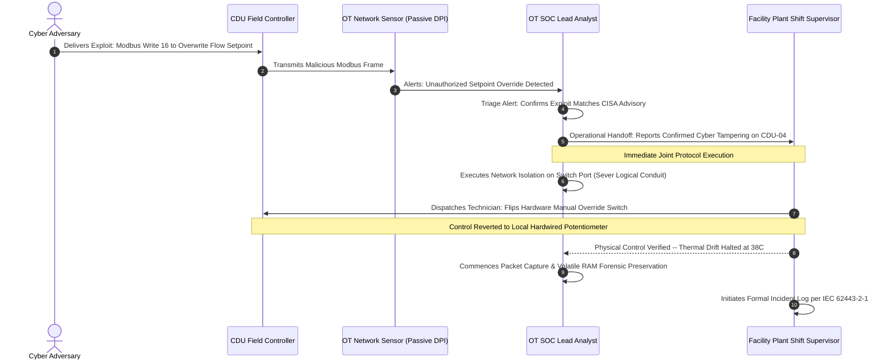
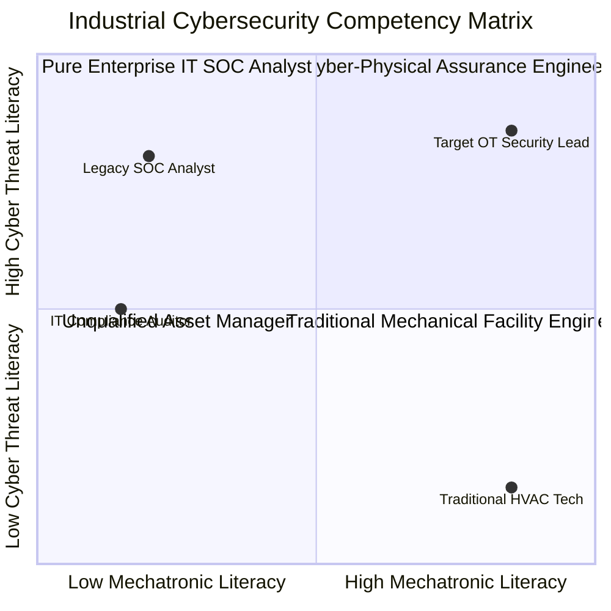

# Organisational Engineering for OT Security: Operational Authority, Cognitive Load & The People Problem

**Working Group:** WG-03 Behavioral Modeling & Human-in-the-Loop Assurance  
**Reference Code:** WG-03-ML-08  
**Subject Classification:** Human Reliability Engineering & Industrial Cyber Governance  
**Primary Attribution:** J. McKenney (Eigenia Research B.V.)  
**Co-Authors:** Eigenia Working Group on Behavioral Modeling & Mechatronic Governance  
**Status:** Canonical Sovereign Treatise  

---

## Abstract

Technical cybersecurity controls fail in production when organizational ownership is ambiguous or fragmented. In critical infrastructure and hyperscale facilities, operational technology (OT) routinely falls into an orphaned white space between three distinct corporate entities: the Chief Information Security Officer (CISO) who prioritizes data confidentiality, the Vice President of Facilities who prioritizes physical equipment safety and availability, and the Vice President of Engineering who prioritizes compute workloads. 

This treatise formalizes the organizational engineering required to eliminate this structural failure mode. We formulate the **Human Cognitive Reaction Time Model under Alarm Cascades**, proving mathematically why manual operator triage is guaranteed to fail during fast-moving cyber-physical attacks. We define an exhaustive **RACI Matrix** aligned to IEC 62443-2-1, establish an **OT Security Operations Center (OT SOC)** architectural framework incorporating deep protocol inspection for BACnet and Modbus, and design a **Cyber-Physical Incident Response Playbook** that guarantees deterministic handoffs between cybersecurity personnel and plant engineers.

---

## 1. Introduction: The Three-Kingdom Problem

Every operational technology cybersecurity audit conducted across energy utilities, rail transit networks, and high-density computing campuses inevitably arrives at the identical structural impasse. The fundamental impediment to resilience is rarely a deficit in control technology; it is an unaddressed ambiguity in operational authority. 

As primary author J. McKenney observed across extensive field assessments [McKenney, 2024], modern critical infrastructure is divided into three isolated corporate kingdoms:

In organizational white space, critical maintenance ceases to occur. A typical example documented during a commercial audit involved a high-severity remote code execution vulnerability in a facility's building management system. The vulnerability was reported to the CISO's team, who forwarded it to Facilities; Facilities forwarded it to the mechanical maintenance contractor; the contractor stated that network patching fell outside their scope and referred it back to IT. The vulnerability remained unpatched for fourteen consecutive months, providing an open conduit for cyber-physical sabotage.

---

## 2. Mathematical Formalization: Human Reaction Latency under Alarm Cascades

A common fallacy in industrial security governance is the assumption that human operators can act as an effective defensive backstop during an ongoing cyber intrusion. Under this assumption, when anomalous behavior occurs, the operator reviews the SCADA dashboard, diagnoses the anomaly, and manually engages bypass switches.

We mathematically prove that this assumption violates fundamental laws of cognitive human factors engineering.

### 2.1 The Hick-Hyman Cognitive Saturation Model

In an active cyber-physical event, an adversary manipulating setpoints or injecting false sensor data invariably triggers an **alarm flood** across supervisory dashboards. Under ISA-18.2 / IEC 62682 alarm management standards, an operator station enters an unmanageable flood condition when alarms exceed $10\text{ alarms per 10 minutes}$. During a coordinated cyber attack, incoming alarm rates surge to hundreds of events per minute.

We model operator cognitive reaction time $T_{\text{reaction}}$ by expanding the Hick-Hyman cognitive decision formulation to account for physiological stress and sensory saturation:

$$T_{\text{reaction}}(N_{\text{alarms}}, \mathcal{S}) = T_0 \cdot \left[ 1 + \gamma \cdot \log_2\left( 1 + \frac{N_{\text{alarms}}}{N_{\text{baseline}}} \right) \right] \cdot \exp(\mu \cdot \mathcal{S})$$

Where:
- $T_0$: Baseline cognitive decision latency under single-alarm nominal conditions ($T_0 \approx 15\text{ to }30\text{ seconds}$).
- $N_{\text{alarms}}$: Number of active, unacknowledged alarms presented on the HMI within time window $\Delta t$.
- $N_{\text{baseline}}$: Nominal cognitive processing threshold ($N_{\text{baseline}} \approx 3\text{ alarms}$).
- $\gamma$: Cognitive interference coefficient ($\gamma \approx 0.45$).
- $\mathcal{S} \in [0, 1]$: Operator physiological acute stress index.
- $\mu$: Stress sensitivity exponent ($\mu \approx 1.25$).

### 2.2 The Catastrophic Temporal Imbalance

When $N_{\text{alarms}}$ spikes to $150\text{ alarms/minute}$ during an adversarial attack, the logarithmic term inflates cognitive processing time. Compounded by acute stress ($\mathcal{S} \to 0.85$), operator reaction time evaluates to:

$$T_{\text{reaction}} \approx 25 \cdot \left[ 1 + 0.45 \cdot \log_2(1 + 50) \right] \cdot \exp(1.25 \cdot 0.85) \approx 25 \cdot (3.55) \cdot (2.89) \approx 256\text{ seconds } (\sim 4.3\text{ minutes})$$

In high-density liquid-cooled systems ($>80\text{ kW/rack}$), pump cavitation or coolant shutoff drives GPU junction temperatures past critical thermal limits in under $45\text{ seconds}$ ($T_{\text{catastrophe}} \le 90\text{ s}$). 

Because $T_{\text{reaction}} \gg T_{\text{catastrophe}}$, **human-in-the-loop manual intervention during an ongoing cyber-physical attack is mathematically impossible**. The organizational model must mandate that all safety interlocks operate autonomously at Level 1, while human organizational teams govern strategic containment and post-incident restoration.

---

## 3. The Definitive OT Cybersecurity RACI Matrix

To permanently resolve the Three-Kingdom problem, we establish an authoritative RACI Matrix (Responsible, Accountable, Consulted, Informed) aligned with **IEC 62443-2-1** across six core functional domains.

| Operational Lifecycle Function | CISO / IT Security | VP Facilities / Operations | VP Engineering / Compute | Lead OT Security Engineer | Mechanical Maintenance Contractor |
|:---|:---:|:---:|:---:|:---:|:---:|
| **OT Asset Discovery & Continuous Inventory** | **C** | **R** | **I** | **A** | **C** |
| **Vulnerability Scanning & CVE Triage** | **C** | **I** | **I** | **A / R** | **I** |
| **Firmware Patching & Change Management** | **C** | **A** | **C** | **R** | **R** |
| **Network Micro-Segmentation & Diode Maintenance** | **C** | **I** | **I** | **A / R** | **I** |
| **24/7 OT Protocol Traffic Monitoring (BMS/EPMS)** | **A** | **I** | **I** | **R** | **I** |
| **Physical Emergency Override & EPO Authorization** | **I** | **A / R** | **C** | **C** | **R** |

### 3.1 Division of Accountability: The Sovereign Principle

1. **The Lead OT Security Engineer** reports operationally to the CISO but maintains dedicated mechanical immersion with Plant Operations. This dual-reporting structure ensures that cybersecurity policies conform to physical plant realities.
2. **Plant Operations maintains absolute veto authority** over any active network scanning or automated remote patching that has not undergone hardware-in-the-loop (HIL) lab certification. A CISO team cannot unilaterally push firmware updates to live operational plant hardware.
3. **The CISO organization maintains absolute authority** over network conduit isolation. If an OT controller demonstrates anomalous beaconing to external IP addresses, the OT SOC is authorized to sever network conduits at the edge firewall without prior mechanical approval.

---

## 4. Architectural Blueprint: The OT Security Operations Center (OT SOC)

Traditional enterprise Security Operations Centers (IT SOCs) rely upon endpoint detection and response (EDR) agents and centralized SIEM log collection. This architecture fails in OT environments because embedded microcontrollers cannot run third-party software agents, and industrial serial protocols produce no syslog telemetry.

We formulate the **OT SOC Reference Architecture** utilizing passive network tap mirroring and deep packet inspection (DPI) of industrial automation protocols.

### 4.1 Protocol Inspection Requirements

1. **BACnet/IP Inspection**: The parser must decode BACnet Application Layer Protocol Data Units (APDUs), alerting on unauthorized `WriteProperty` services directed toward critical setpoint objects (e.g., `Object_Type: Analog_Value`, `Instance: 204` representing chiller chilled water supply temperature).
2. **Modbus TCP Inspection**: The sensor must track Modbus Function Codes, generating high-priority alerts on Function Code `05` (Write Single Coil), Function Code `06` (Write Single Register), and Function Code `16` (Write Multiple Registers) originating from non-engineering workstations.
3. **Baseline Communication Profiling**: The OT SOC must establish a strict whitelist matrix. Any device initiating a protocol connection outside its defined engineering baseline (e.g., a Liebert CDU attempting an outbound HTTPS handshake to an external internet host) triggers immediate automated port isolation.

---

## 5. Cyber-Physical Incident Response (CP-IR) Playbook

During an active cyber incident, confusion between IT and Facilities teams causes delays that result in physical plant destruction. We define the deterministic **Cyber-Physical Incident Response Playbook** for handling verified vulnerabilities and intrusions.

### 5.2 Phase-Gate Response Procedures

1. **Phase 1: Detection & Confirmation ($\le 5\text{ minutes}$)**:
   - OT SOC analyst validates alert against known normal engineering change windows.
   - If change ticket does not exist, incident is escalated to Severity 1 (Active Intrusion).
2. **Phase 2: Logical Containment ($\le 10\text{ minutes}$)**:
   - OT SOC issues an automated firewall rule severing the compromised device's IP address from the wider campus network.
   - Physical process continues operating via local loop fallback.
3. **Phase 3: Physical Verification & Manual Override ($\le 15\text{ minutes}$)**:
   - Plant technician arrives at the local control panel and engages the physical hardwired key-switch or manual potentiometer bypass.
   - Supervisory network commands are physically decoupled from actuator coils.
4. **Phase 4: Forensics & Safe Eradication ($\le 24\text{ hours}$)**:
   - Complete non-volatile flash memory and volatile memory dumps acquired for ENISA Article 14 / CSIRT reporting.
   - Device re-flashed with cryptographically signed, verified firmware from offline golden image storage.

---

## 6. IEC 62443-2-1 Competency Framework & Personnel Training

The human gap cannot be bridged by organizational charts alone; it requires cross-disciplinary engineering competencies. We formalize the **Dual-Domain Competency Matrix** required under IEC 62443-2-1:

### 6.1 Training Modules for Plant Engineers
- **Module OT-101**: TCP/IP fundamentals, subnetting, and VLAN tagging for mechanical technicians.
- **Module OT-102**: Threat modeling industrial fieldbuses (how an attacker manipulates BACnet without triggering an electrical trip).
- **Module OT-103**: Recognizing social engineering, rogue maintenance laptops, and compromised vendor USB keys.

### 6.2 Training Modules for SOC Analysts
- **Module SOC-201**: Fundamentals of thermodynamics, pump cavitation, and chilled water hydronics.
- **Module SOC-202**: Industrial protocol syntax (Modbus function codes, BACnet object properties, DNP3 unsolicited messages).
- **Module SOC-203**: Safety instrumented systems (SIS), SIL ratings, and the life-safety hazards of ungraceful equipment shutdowns.

---

## 7. Conclusion & Governance Roadmap

Resilience is not a feature that can be purchased in software; it is an organizational capability forged through clear accountability, disciplined engineering, and cross-domain literacy:
- **The Three-Kingdom Problem must be formally dismantled** by establishing an OT Security Lead reporting across both CISO and Operations.
- **Human reaction latency models prove** that fast-moving physical attacks must be countered by autonomous Level 1 interlocks, not manual operator triage.
- **The RACI matrix and CP-IR playbook** provide deterministic certainty, ensuring that when an alarm sounds, every stakeholder knows precisely who monitors, who isolates, and who commands.

Future research under Working Group WG-03 will expand this behavioral framework into **Operator Cognitive Stress Monitoring**, integrating eye-tracking and HMI interaction metrics into the Cyber Digital Twin to dynamically detect operator fatigue during complex plant crises.

---

## References

1. International Electrotechnical Commission. (2009). *IEC 62443-2-1: Industrial communication networks — Network and system security — Part 2-1: Establishing an industrial automation and control system security program*. Geneva: IEC.
2. International Electrotechnical Commission. (2018). *IEC 62443-2-4: Security for industrial automation and control systems — Part 2-4: Security program requirements for IACS service providers*. Geneva: IEC.
3. National Institute of Standards and Technology. (2023). *NIST SP 800-82r3: Guide to Operational Technology (OT) Security*. Gaithersburg: NIST.
4. International Society of Automation. (2016). *ANSI/ISA-18.2: Management of Alarm Systems for the Process Industries*. Research Triangle Park: ISA.
5. International Electrotechnical Commission. (2015). *IEC 62682: Management of alarm systems for the process industries*. Geneva: IEC.
6. Hick, W. E. (1952). *On the rate of gain of information*. Quarterly Journal of Experimental Psychology, 4(1), 11–26.
7. Hyman, R. (1953). *Stimulus information as a determinant of reaction time*. Journal of Experimental Psychology, 45(3), 188–196.
8. McKenney, J. (2024). *Field Observations on Datacenter OT Vulnerability & Common-Mode Failures*. Eigenia Engineering Working Papers.
9. McKenney, J. (2026). *Concept of Operations (ConOps) and Minimum Operating Requirements (MoR) for Mission-Critical Facilities*. Eigenia Research Working Group WG-01 Treatise WG-01-UI-Concept-of-Operations-Minimum-Operating-Requirements.
10. McKenney, J. (2026). *Tier Classification, Redundancy Topologies & Common-Mode Failures in Industrial Digital Twins*. Eigenia Research Working Group WG-02 Treatise WG-02-DT-Tier-Redundancy-Common-Mode-Failures.
