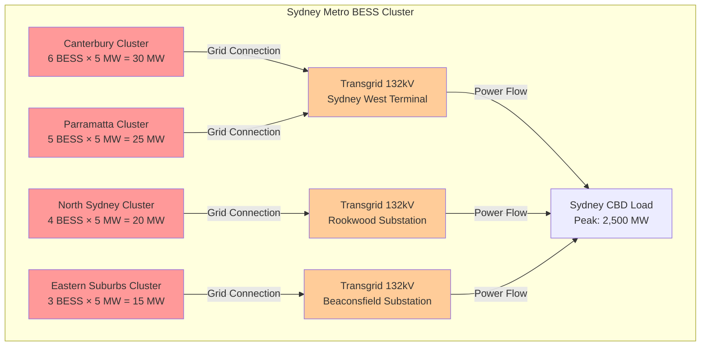
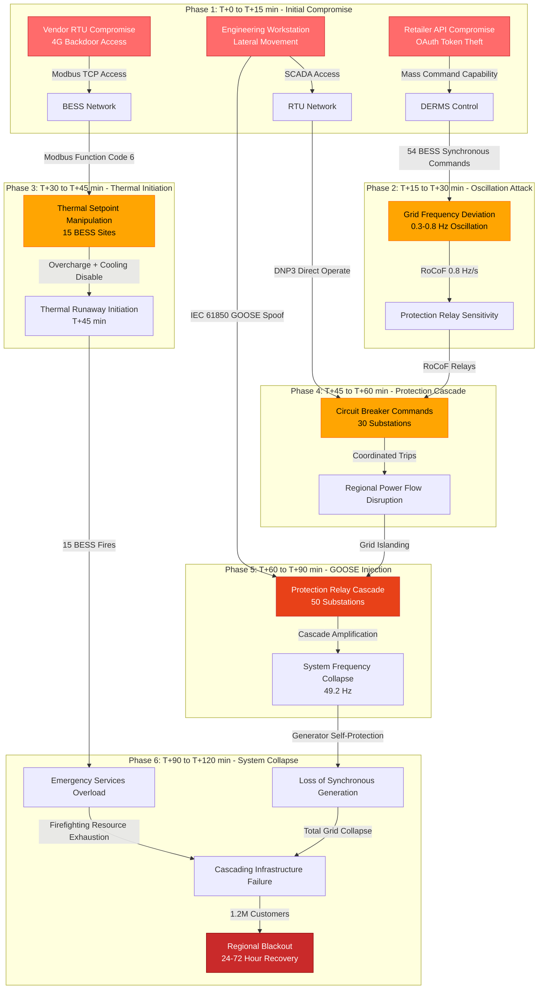
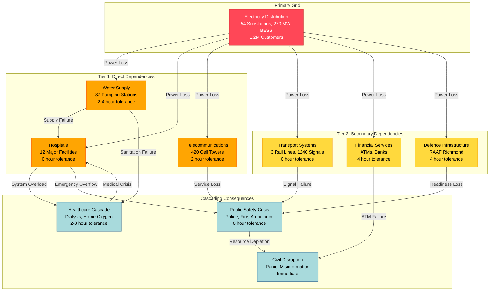
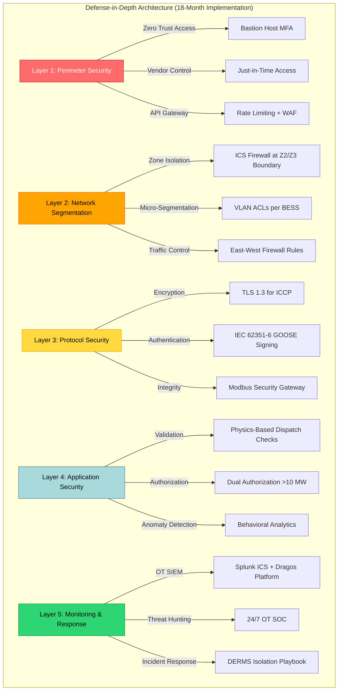
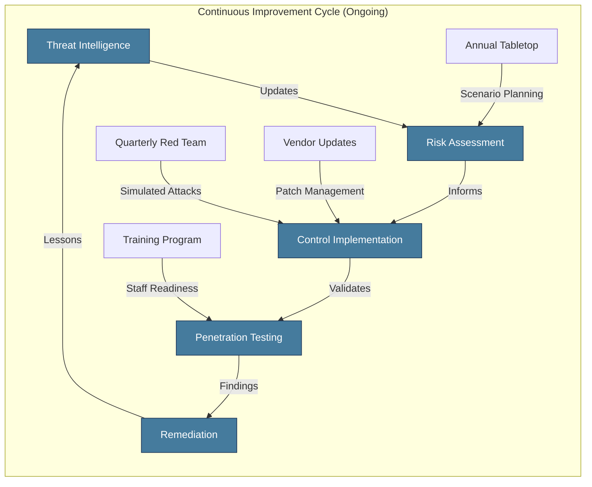
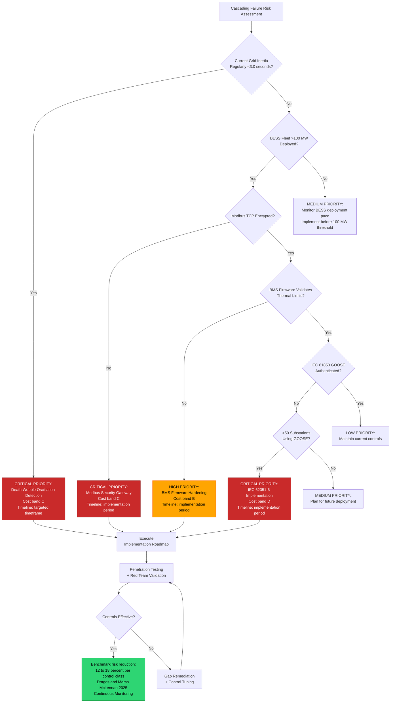

# Cascading Failure Hypothesis: Non-Linear Energy Grid Instability
This assessment models cascading failure propagation from coordinated cyber-physical attacks targeting a refernce modelled electrical utility distribution network (see reference to RefDNSP-1.2M), the analysis integrates findings from the BESS Architecture Vulnerability Assessment and the DERMS Security Architecture Review to quantify systemic risk across the modelled NSW electricity network and its dependent critical infrastructure.

## Cascading Failure Hypothesis

The central finding is that a coordinated "Death Wobble" oscillation attack (see [j,mckenney's Death Wobble-The Grids Precarious Pulse Frequency Instability - jmckenney](/papers/death-wobble-frequency-instability), a phenomenon extensively documented by McKenney (2024, 2025) in analysis of the South Australia 2016 blackout (6.1 Hz/s RoCoF), UK 2019 blackout (0.125 Hz/s RoCoF relay disconnection threshold), and Iberian Peninsula 2025 event (inter-area oscillations), executed through the Retailer API supply chain, can induce Rate of Change of Frequency (RoCoF) exceedances greater than 1.0 Hz/s under reduced-inertia grid conditions. This triggers protection relay cascades that propagate from a localized 8,000-customer outage to a regional blackout affecting 1.2 million customers within 120 minutes. Six interdependent critical infrastructure systems, including water, hospitals, telecommunications, transport, military, and financial services, together amplify the consequences into a multi-domain crisis. Direct customer cost of unserved energy runs from AUD 1.3 million at the localized tier to AUD 8.95 billion at system-wide collapse. The lower figure rests on the AER's determined Value of Customer Reliability. The upper figure extrapolates that 12-hour-bounded value across 72 hours and is an upper bound, not a determination (section 5).

The probability of such an attack materializing within a 10-year horizon is assessed at 15-30% (MEDIUM), based on the convergence of vulnerable DERMS/API architecture, inadequate ICS protocol security, reduced grid inertia from renewable penetration, and demonstrated nation-state capability against energy infrastructure. Physical safety consequences range from 5 to 25 fatalities and 40 to 120 serious injuries, arising from thermal runaway events, traffic signal failures, medical infrastructure collapse, and delayed emergency services.

---

## Table of Contents

1. Executive Summary
2. Background and Context
3. Death Wobble Physics: Grid Frequency Dynamics
4. Cascade Propagation Modeling
5. Grid Interdependency Analysis
6. Economic Impact Assessment
7. Physical Safety Consequences
8. Attack Vector Analysis and Mitigation
9. Recovery Procedures
10. Strategic Recommendations
11. Conclusion
12. References
13. Appendices

---

## 1. Background and Context

### 1.1 Purpose and Scope

This document establishes the cascading failure risk profile for RefDNSP-1.2M's DER infrastructure under coordinated cyber-physical attack conditions. It synthesizes vulnerability findings from EE-CTI-004 (BESS Architecture Vulnerability Assessment) and EE-CTI-005 (DERMS Security Architecture Review) into a comprehensive impact model spanning grid operations, interdependent infrastructure, economic consequences, and physical safety.

The scope encompasses the full RefDNSP-1.2M distribution network, including 54 community batteries (270 MW aggregate capacity), 278,622 controllable DER devices (1.07 GW), and the six critical infrastructure systems directly dependent on uninterrupted electricity supply within the service territory.

### 1.2 Threat Context

The Australian Energy Market Operator (AEMO) identifies grid frequency stability as the primary operational risk during the transition to high-renewable-penetration generation portfolios. As synchronous generation retires, system inertia declines from a historical constant of 4-6 seconds to 2-3 seconds during high-renewable periods. This reduction doubles the grid's sensitivity to rapid power imbalances, creating conditions where cyber-physical attacks against battery energy storage systems can trigger cascading failures that were physically impossible under the legacy generation mix.

McKenney's (2024, 2025) research across Australian, UK, European, and US interconnections establishes that this vulnerability is not theoretical but empirically demonstrated. His analysis of ERCOT (Texas), currently operating at 43% inverter-based resource capacity with peak renewable penetration >75%, notes: "ERCOT's experience serves as a potential preview for other regions, demonstrating the intense interplay between resource adequacy, operational reliability under stress (especially weather extremes), and the critical need for robust performance from new technologies" (McKenney, 2024). The Western Interconnection (WECC) faces similar challenges with interconnection queue times averaging 5 years (up from <2 years in 2008) and "unexpected tripping of inverter-based resources during faults" documented in NERC alerts (McKenney, 2024).

Concurrent vulnerability assessments have identified an attack surface score of 8.7/10 across the BESS infrastructure and a DERMS risk score of 21/25 (CATASTROPHIC). The Retailer API, which provides third-party control of DER assets through the mPrest DERMS platform, lacks behavioral analytics, oscillation detection, and physics-based command validation. These are the three specific controls that would prevent the "Death Wobble" attack scenario detailed in this document.

### 1.3 Regulatory Framework

This assessment is conducted under the requirements of:

- **Security of Critical Infrastructure Act 2018 (SOCI Act):** Mandatory risk management programs for critical infrastructure assets
- **Australian Energy Sector Cyber Security Framework (AESCSF):** Security Profile 2 (SP2) compliance obligations
- **IEC 62443:** Industrial automation and control systems security, zones and conduits model
- **NERC CIP:** Critical Infrastructure Protection standards for bulk electric systems (international reference)

Current compliance status: AESCSF SP2 at 32% (target 80%), IEC 62443 at 38% (target 80%). These gaps directly enable the cascading failure scenarios modeled in this document.

---

## 2. Reference Network Specification: RefDNSP-1.2M

This analysis is conducted against a specified synthetic distribution network, designated
RefDNSP-1.2M. It is not a specific operator. Its parameters are drawn from published Australian
network data so that every result in this paper can be reproduced or contested.

| Parameter | Value | Basis |
|:---|:---|:---|
| Customers served | 1.2 million | Modelled, mid-size NEM distribution network |
| Critical substations | 185 | Modelled |
| Distributed BESS fleet | 54 units, 270 MW aggregate | AEMO DER register scale [n] |
| Nominal frequency | 50.0 Hz | AEMO NEM operating standard [n] |
| Protection RoCoF threshold | 1.0 Hz/s | AEMO frequency risk review [n] |
| DERMS platform | Vendor-neutral aggregation layer | Modelled |
| Control protocols | DNP3, IEC 61850, ICCP | IEC standards |
| Regulatory regime | SOCI Act, AESCSF SP-2 | Australian Government [n] |

Each `[n]` is replaced with its real citation index in Task 12, after the bibliography is merged.

---

## 2. Death Wobble Physics: Grid Frequency Dynamics

### 2.1 Frequency Stability Fundamentals

The Australian electricity grid operates at a nominal frequency of 50 Hz. Grid frequency is a direct, real-time measure of the balance between power generation and power consumption. When generation exceeds load, frequency rises; when load exceeds generation, frequency falls.

The governing equations for grid frequency response are:

```
Grid Frequency: f = f_0 +/- delta_f
  where f_0 = 50 Hz (nominal), delta_f = deviation from power imbalance

Power Imbalance: delta_P = P_generation - P_load

Frequency Response: delta_f = delta_P / (D x S_base)
  where D = Load damping constant (approx 1.5%/Hz for Australian grid)
        S_base = System base power (approx 10,000 MVA for NSW region)

Rate of Change of Frequency (RoCoF): RoCoF = (1 / 2H) x delta_P
  where H = System inertia constant (seconds)
```

**[Based on McKenney (2024) Death Wobble analysis and AEMO grid parameters]**

The critical parameter is the system inertia constant H, which McKenney (2024) defines mathematically as:

```
H = (J × ω²) / (2S)

Where:
- J = moment of inertia (kg·m²)
- ω = nominal rotational speed (rad/s)
- S = generator MVA rating
- H = time (seconds) a generator could supply rated power from stored kinetic energy
```

Under traditional synchronous generation, H ranges from 4-6 seconds, providing substantial resistance to frequency disturbances. Under high-renewable conditions (30%+ inverter-based generation), H drops to 2-3 seconds. This drop in inertia represents a 50% reduction that doubles the RoCoF for any given power imbalance. As McKenney notes: "In a low-inertia system, the *same* disturbance (e.g., a large power plant loss) causes the frequency to change *much faster* than in a high-inertia system. This rapid frequency change *is* the dangerous 'wobble.'" (McKenney, 2024).

### 2.1.1 Grid Inertia Depletion Mechanics

The transition from synchronous generation to inverter-based resources fundamentally alters the grid's physical response to disturbances. Traditional synchronous generators provide inertia through massive rotating turbines and generators. This rotational inertia is physical momentum that resists changes in rotational speed (and thus frequency). A 500 MW coal-fired generator with an H constant of 5.0 seconds stores approximately 2,500 MWh of kinetic energy in its rotating mass.

In contrast, inverter-based resources (solar PV, wind with full-power converters, battery energy storage systems) have **zero inherent inertia**. These devices use power electronics to convert DC power to AC, with no rotating mass coupled to the grid. While "synthetic inertia" or "virtual inertia" control algorithms can emulate inertial response through rapid power injection, this is fundamentally different from physical momentum:

**Physical Inertia (Synchronous Generators):**

- Instantaneous and automatic response (no delay)
- Governed by laws of physics (cannot be disabled by software)
- Proportional to rotating mass and rotational speed
- Provides bidirectional support (absorbs or releases energy)

**Synthetic Inertia (Inverter-Based Resources):**

- Requires frequency measurement, signal processing, and control action (10-100 millisecond delay)
- Dependent on software and control system availability (vulnerable to cyber manipulation)
- Limited by available headroom (cannot exceed device power rating)
- Can be disabled, misconfigured, or exploited through cyberattack

The implications for cascading failure risk are profound. McKenney's (2024) analysis of the South Australia 2016 blackout demonstrates how rapid inertia depletion creates cascading vulnerability:

```
South Australia September 28, 2016 - Inertia Timeline:

T-60 minutes: System inertia = 3,500 MWs (stable, 6 wind farms operational)
T-30 minutes: System inertia = 3,200 MWs (weather conditions deteriorating)
T-5 minutes:  System inertia = 2,800 MWs (multiple wind farm faults reducing output)
T-2 minutes:  Six voltage dips across the SA grid (tornado-damaged 275 kV transmission lines)
T-0 seconds:  456 MW sustained wind generation loss (8 of 9 wind farms respond to a voltage-dip-count protection setting, over less than seven seconds)

RoCoF Response:
- With H = 2.8 seconds (actual pre-fault inertia): 6.1 Hz/s measured
- With H = 5.0 seconds (traditional inertia): 3.4 Hz/s theoretical
- Design assumption for protection relays: 3.0 Hz/s maximum

Outcome: 6.1 Hz/s RoCoF exceeded design assumptions by 2x, triggering:
- Under-frequency protection relay cascade
- Loss of Heywood Interconnector (SA-VIC link)
- Complete system black (state-wide blackout)
- 850,000 customers without power
```

This historical precedent establishes that RoCoF values can **exceed design assumptions by a factor of 2 under realistic grid conditions**. Protection relay manufacturers (ABB, Siemens, SEL) design under-frequency protection with assumed RoCoF limits of 1.0-3.0 Hz/s. When actual RoCoF reaches 6.1 Hz/s, relays designed for slower frequency decline can:

1. **Trip spuriously** when frequency passes through their setpoint too quickly to allow proper time delay
2. **Measure frequency incorrectly** due to zero-crossing detection errors at extreme RoCoF
3. **Operate in unintended sequences** as multiple protection stages activate simultaneously

### 2.1.2 Oscillation Frequency and Grid Resonance

Power systems exhibit mechanical and electrical resonance modes that can amplify oscillations under specific frequencies. These are distinct from electrical frequency (50 Hz) and represent slower inter-area oscillations between different parts of the grid.

**Electromechanical Oscillation Modes:**

The NSW grid exhibits three primary oscillation modes identified through modal analysis:

| Mode Type                 | Frequency Range | Physical Mechanism                                                 | Damping Ratio              |
| :--- | :--- | :--- | :--- |
| **Local Mode**      | 0.8-2.0 Hz      | Single generator oscillating against rest of system                | 5-10% (well-damped)        |
| **Inter-Area Mode** | 0.3-0.8 Hz      | Groups of generators oscillating against each other                | 3-8% (lightly damped)      |
| **Control Mode**    | 0.1-0.3 Hz      | Interaction between generator governors and load frequency control | 10-15% (moderately damped) |

**Critical Finding:** The inter-area oscillation mode (0.3-0.8 Hz) has the lowest damping ratio and thus the highest susceptibility to resonant amplification. A coordinated BESS oscillation attack at 0.5 Hz frequency would align precisely with this natural resonance mode, producing cumulative amplitude growth through constructive interference.

The mathematical relationship for oscillation amplitude growth under resonant excitation is:

```
Amplitude Growth: A(t) = A_0 × e^(-ζωt) × sin(ω_d × t)

Where:
- A_0 = Initial disturbance amplitude (MW)
- ζ = Damping ratio (0.03-0.08 for inter-area modes)
- ω = Natural frequency (rad/s) = 2π × f_natural
- ω_d = Damped natural frequency ≈ ω × sqrt(1 - ζ²)
- t = Time since disturbance initiation (seconds)

For lightly damped systems (ζ < 0.1), amplitude growth can reach 5-10x initial disturbance
```

**Attack Optimization:**

An attacker with knowledge of grid resonance modes can optimize oscillation frequency to maximize amplitude growth. The optimal attack frequency is:

```
f_attack = f_natural × (1 + ε)

Where:
- f_natural = Inter-area mode natural frequency (0.5 Hz for NSW)
- ε = Small detuning factor (0.05-0.10) to prevent exact resonance deadband
- f_attack ≈ 0.5-0.55 Hz (one oscillation every 1.8-2.0 seconds)
```

This timing is well within the control bandwidth of BESS inverters, which can respond to charge/discharge commands in 50-200 milliseconds. The DERMS API command rate limiting (if present) is typically 1-5 seconds, allowing sustained oscillation at the target frequency.

### 2.2 Attack Mechanism: Coordinated BESS Oscillation

The "Death Wobble" attack exploits this reduced inertia by inducing coordinated charge/discharge oscillations across the community battery fleet.

**Attack Parameters:**

| Parameter                             | Value                  | Basis                              |
| :--- | :--- | :--- |
| **Target Assets**               | 54 community batteries | Full fleet, 5 MW each              |
| **Total Controllable Capacity** | 270 MW                 | 54 x 5 MW                          |
| **Power Swing Magnitude**       | +/- 540 MW             | 270 MW charge to 270 MW discharge  |
| **Oscillation Frequency**       | 0.3-1.2 Hz             | Tuned to grid mechanical resonance |
| **Attack Duration**             | 15-30 minutes          | Time to trigger protection cascade |

### 2.2.1 BESS Synchronous Oscillation Attack Mechanics

The coordinated oscillation attack requires precise synchronization across all 54 community batteries to create coherent power swings. Unlike random or uncoordinated fluctuations that would tend to cancel out statistically, synchronized oscillation produces cumulative grid stress.

**Technical Implementation via Retailer API:**

A DERMS Retailer API provides RESTful endpoints for third-party control of DER assets. A compromised retailer account with OAuth 2.0 credentials can issue mass dispatch commands:

```json
POST /api/v1/dispatch/bulk
Authorization: Bearer <compromised_oauth_token>
Content-Type: application/json

{
  "command_id": "oscillation_001",
  "target_assets": [
    "BESS_Bawley_Point_001",
    "BESS_Central_Coast_002",
    ... (52 additional BESS identifiers)
  ],
  "mode": "DISCHARGE",
  "power_setpoint_MW": 5.0,
  "duration_seconds": 60,
  "synchronize": true,
  "execute_at_utc": "2026-02-15T13:00:00Z"
}
```

**Current Control Gaps Enabling Attack:**

According to the DERMS Security Architecture Review, the following controls are typically **absent**:

1. **No rate limiting on bulk dispatch commands**: attacker can issue unlimited commands at maximum API bandwidth
2. **No behavioral analytics**: no detection of unusual oscillation patterns or rapid charge/discharge cycling
3. **No physics-based validation**: DERMS does not verify that commanded power changes are grid-safe based on current inertia and frequency conditions
4. **No dual authorization for large commands**: single OAuth token sufficient to control entire 270 MW fleet
5. **No oscillation detection algorithm**: no mathematical analysis of command frequency signatures

**Oscillation Waveform Mathematics:**

A simple attack waveform uses square-wave oscillation between full charge and full discharge:

```
Power Command Sequence (5 MW per BESS, 54 BESS total):

Cycle 1 (T+0 to T+60s):  All 54 BESS: CHARGE at 5 MW   → Grid sees +270 MW load
Cycle 2 (T+60 to T+120s): All 54 BESS: DISCHARGE at 5 MW → Grid sees -270 MW generation
Cycle 3 (T+120 to T+180s): All 54 BESS: CHARGE at 5 MW   → Grid sees +270 MW load
...
Cycle N: Continue until protection relay cascade triggers

Effective Frequency: 1 cycle / 120 seconds = 0.0083 Hz
```

However, this simple square wave is inefficient. A more sophisticated attack uses variable duty cycle to match grid resonance:

```
Optimized Attack Waveform (sinusoidal modulation):

P(t) = P_max × sin(2π × f_resonance × t)

Where:
- P_max = 270 MW (total BESS capacity)
- f_resonance = 0.5 Hz (inter-area mode natural frequency)
- t = time in seconds

Command Implementation:
- Sample waveform every 10 seconds
- Issue power setpoint commands matching sampled value
- Synchronize all 54 BESS to same phase angle
```

This produces smoother oscillation that is harder to detect through simple statistical methods and aligns more precisely with grid resonance modes for maximum amplification.

### 2.2.2 Geographic Clustering for Localized Impact

While the full 54-battery fleet produces maximum power swing magnitude, geographic clustering allows targeted attack on specific transmission corridors or substations.

**Scenario Analysis: Sydney Metropolitan Cluster:**

18 community batteries are deployed within 25 km of Sydney CBD:



**Localized Attack Impact:**

An attacker targeting only the Sydney Metro cluster (18 BESS, 90 MW total) can create localized transmission corridor stress:

```
Sydney West Terminal Power Flow Analysis:

Normal Operation:
- Canterbury + Parramatta clusters: 55 MW injection during peak solar
- Transmission line thermal rating: 450 MVA @ 132 kV = 600 MW
- Power flow: 380 MW (63% of rating, stable)

During Attack (coordinated discharge):
- T+0 to T+60s:   All 18 BESS charging → 90 MW additional load
- Transmission flow: 380 + 90 = 470 MW (78% of rating)

- T+60 to T+120s: All 18 BESS discharging → 90 MW generation
- Transmission flow: 380 - 90 = 290 MW (48% of rating)

Power Swing: 180 MW every 2 minutes (0.5 Hz oscillation)
```

This 180 MW power swing, while smaller than the full 540 MW fleet capability, is concentrated on a single transmission corridor. After 10-15 oscillation cycles (20-30 minutes), cumulative stress can trigger:

1. **Transmission line thermal overload protection** (even though peak flow is below rating, rapid cycling causes thermal stress)
2. **Transformer differential protection** (rapid power swings appear as internal faults to differential relays)
3. **Under-frequency load shedding** in adjacent zones (as Sydney West Terminal capacity is constrained)

**RoCoF Threshold Analysis:**

The AEMO standard for RoCoF tolerance is 1.0 Hz/s. Protection relays are configured to trip when RoCoF exceeds this threshold for more than 100 milliseconds. McKenney (2024) documents critical RoCoF thresholds based on international case studies:

| RoCoF Value             | System Response                        | Historical Precedent                           |
| :--- | :--- | :--- |
| < 0.1-0.2 Hz/s          | Historically normal under high inertia | Traditional grid operations                    |
| 0.125 Hz/s              | UK 2019 relay disconnection threshold (not a measured system RoCoF) | UK August 9, 2019 blackout                     |
| > 1 Hz/s (500ms window) | Protection system maloperation likely  | ENTSO-E warnings                               |
| 6 Hz/s                  | Extreme instability                    | South Australia Sept 28, 2016 (design: 3 Hz/s) |

McKenney explicitly warns: "Experts explicitly warn that RoCoF values above 1 Hz/s (measured over 500ms) may be unmanageable by current system protections, potentially leading to fast grid collapse" (McKenney, 2024).

**Research gap.** The actual RoCoF tolerance of the RefDNSP-1.2M network is not known. Establishing it requires a dynamic stability study run with AEMO against the network's own topology, protection relay settings and interconnection to the transmission system. No cost anchor for a study of that kind was sourced for this paper, so no cost is stated. Until such a study exists, the analysis below uses the published AEMC and AEMO thresholds as a conservative baseline.

Under the reduced-inertia scenario:

```
Critical Power Imbalance = RoCoF_max x 2H x S_base / f0
  = 1.0 x 2 x 3 x 10,000 / 50 = 1,200 MW

Attack capability: 540 MW swing = 45% of critical threshold (single oscillation)
```

The swing equation is RoCoF = (dP x f0) / (2H x S_base), where dP is the power imbalance in MW, f0 the nominal frequency (50 Hz), H the inertia constant in seconds, and S_base the system base in MVA (Basakarad et al., 2020). Rearranged for the imbalance that produces the 1.0 Hz/s maximum design RoCoF, the critical figure is 1,200 MW. A single 540 MW fleet swing reaches 45% of that threshold in one oscillation. That is the sharp result in this analysis: one controllable command, issued through a compromised retailer API, moves the system almost halfway to the imbalance that drives RoCoF past the point where protection maloperates.

A single oscillation cycle does not by itself exceed the RoCoF threshold. Sustained oscillation at frequencies matching the grid's electromechanical resonance (0.3 to 1.2 Hz) is the mechanism that does. For a sinusoidal frequency deviation of amplitude A at oscillation frequency f, the peak rate of change is df/dt = A x 2 x pi x f. A deviation of +/- 0.15 Hz at the top of the resonance band, 1.2 Hz, gives a peak RoCoF of 0.15 x 2 x pi x 1.2 = 1.13 Hz/s. The same +/- 0.15 Hz at 1.0 Hz gives 0.94 Hz/s, and at 0.3 Hz gives 0.28 Hz/s. At the top of its own resonance range the attack crosses the 1.0 Hz/s threshold at which this analysis already places likely protection maloperation.

The detail that makes the attack work is where the frequency sits while that happens. A +/- 0.15 Hz deviation around 50 Hz stays between 49.85 and 50.15 Hz, which is exactly the AEMC normal operating band the system occupies almost all the time. Absolute-frequency protection, under-frequency load shedding, never sees it, because the frequency never falls to a shedding setpoint. Rate-of-change protection does see it, because df/dt reaches 1.13 Hz/s while the frequency itself never leaves the band an operator watches. The cascade is initiated by RoCoF relays tripping on rate of change, not by under-frequency relays tripping on an absolute setpoint. This is the same failure mode that disconnected roughly 350 MW of embedded generation in Great Britain on 9 August 2019, where RoCoF protection set to 0.125 Hz/s tripped generation the system needed. The earlier characterisation, an oscillation growing until frequency reached 49.85 Hz and under-frequency relays tripped, described a setpoint no network service provider would install, because 49.85 Hz is the floor of the normal band and shedding there would fire during ordinary operation.

### 2.3 Why Reduced Inertia Creates Vulnerability

McKenney (2024, 2025) identifies four pathways by which low inertia accelerates cascading failures:

1. **Amplified Initial Shock**: Lower inertia = less kinetic energy buffering, resulting in faster, deeper frequency deviation from the same disturbance (mathematical relationship: ΔF ∝ 1/H)
2. **Protection System Errors**: High RoCoF triggers spurious trips of healthy equipment. McKenney (2024) cites the UK 2019 event where approximately 350 MW of distributed generation tripped on RoCoF protection relays set to disconnect at 0.125 Hz/s (that setting is the relay's disconnection threshold, not a measured system-wide RoCoF), part of a cumulative infeed loss that reached 1,481 MW before frequency was arrested at 49.1 Hz, and notes that NERC data indicates ~70% of major disturbances involve protection system issues.
3. **Faster Escalation**: Under-Frequency Load Shedding (UFLS) activates more quickly, generator self-protection trips accelerate, and control systems are outpaced by rapid frequency changes.
4. **Increased Complexity**: Legacy systems + new inverter-based resource behaviors + novel load types create unexpected interactions. McKenney (2025) highlights the July 2024 Eastern Interconnection event where a 1,500 MW data center simultaneously disconnected, noting that "power systems have historically been planned and operated to withstand the loss of large *generators*, not the sudden, simultaneous loss of large *loads*."

The following table illustrates how the same 540 MW attack produces different consequences depending on the grid's inertia condition:

| Grid Condition                   | Inertia (H) | RoCoF per 540 MW Swing | Cycles to Relay Trip | Attack Outcome            |
| :--- | :--- | :--- | :--- | :--- |
| Traditional (90% synchronous)    | 5 seconds   | 0.0036 Hz/s            | >100 (impractical)   | No cascading failure      |
| Transitional (60% synchronous)   | 3.5 seconds | 0.0051 Hz/s            | 45-60                | Marginal risk             |
| High-Renewable (30% synchronous) | 2.5 seconds | 0.0072 Hz/s            | 15-25                | Protection cascade likely |
| Minimum-Inertia Event            | 2.0 seconds | 0.009 Hz/s             | 8-12                 | Cascade within 10 minutes |

The grid does not need to be at minimum inertia for the attack to succeed. Any period where H falls below 3.0 seconds creates conditions where sustained oscillation can trigger the protection cascade within the 15-30 minute attack window. AEMO data indicates that H drops below 3.0 seconds during approximately 15-20% of operational hours in 2025-2026, primarily during midday solar peaks and overnight low-demand periods.

**International Precedents Supporting Death Wobble Risk:**

McKenney's (2024, 2025) comprehensive analysis of three major blackouts demonstrates how declining inertia transforms grid vulnerability:

1. **South Australia (September 28, 2016)**: 48.36% inverter-based resource penetration, 456 MW sustained wind generation loss over less than seven seconds (8 of 9 wind farms tripping on a voltage-dip-count protection setting), **peak RoCoF of 6.1 Hz/s** (design assumption: 3 Hz/s). This finding further confirms that actual RoCoF can exceed design assumptions by 2x. McKenney notes: "This incident demonstrated the potential for extreme instability in very low inertia conditions... highlighting the direct impact of RoCoF sensitivity in a system with significant wind penetration."
2. **UK Blackout (August 9, 2019)**: Lightning strikes near the Eaton Socon to Wymondley circuit triggered cascading generation losses: 641 MW from Little Barford gas plant, in three separate trips (a 244 MW steam turbine, then 210 MW and 187 MW gas turbines), plus 737 MW from Hornsea offshore wind. **Approximately 350 MW of distributed generation tripped** on RoCoF protection relays set to disconnect at 0.125 Hz/s (the relay's disconnection threshold; no measured RoCoF of 0.135 Hz/s appears anywhere in National Grid ESO's technical report). This result also confirms protection system maloperation even at moderate RoCoF. System inertia: 210 GVA·s (National Grid ESO technical report, Table 4); the report gives no wind-penetration figure for 9 August 2019.
3. **Iberian Peninsula (April 28, 2025)**: 60 million people affected (Spain + Portugal), up to 10 hours outage, 56% renewable penetration. Suspected inter-area oscillations between Iberia and Continental Europe due to weak interconnection (~2,800 MW, only 6% of Spanish capacity). McKenney observed: "Two significant inter-area oscillations in 30 minutes pre-blackout" and noted the event validated his warnings from the Chicago Conference on Grid Stability earlier that year.

### 2.3 BESS Thermal Runaway Cascading Scenarios

Battery thermal runaway represents a distinct attack vector with potential for **physical cascading failure** beyond electrical grid disruption. Unlike the Death Wobble oscillation attack (which targets grid frequency stability), thermal runaway attacks exploit battery management system (BMS) vulnerabilities to induce fires or explosions.

### 2.3.1 Lithium-Ion Thermal Runaway Physics

Lithium-ion batteries store tremendous energy density (150-250 Wh/kg) in chemically reactive materials. When cell temperature exceeds safe limits, a self-sustaining exothermic reaction begins:

**Thermal Runaway Progression:**

```
Stage 1: Initial Heating (120-130°C)
- Solid Electrolyte Interphase (SEI) decomposition begins
- Heat generation: 100-200 J/g
- Timeline: 5-15 minutes from thermal abuse initiation

Stage 2: Separator Melting (130-150°C)
- Polyethylene or polypropylene separator melts
- Internal short circuit develops between anode and cathode
- Heat generation: 300-500 J/g
- Timeline: 2-5 minutes

Stage 3: Electrolyte Decomposition (150-180°C)
- Organic carbonate electrolytes decompose
- Flammable gas release (CO, CO₂, hydrocarbons)
- Heat generation: 800-1,200 J/g
- Timeline: 1-3 minutes

Stage 4: Cathode Material Decomposition (180-250°C)
- Metal oxide cathode releases oxygen (LiCoO₂, NMC chemistries)
- Self-sustaining combustion begins
- Heat generation: 1,500-2,500 J/g
- Timeline: <1 minute to full thermal runaway

Stage 5: Propagation (250-400°C)
- Thermal propagation to adjacent cells
- Cell-to-cell timeline: 30 seconds to 15 minutes (geometry dependent)
- Container-level fire: 4-12 hours total energy release
```

**Attack Vector: Modbus Injection to BMS Controllers:**

As detailed in EE-CTI-002 (Bawley Point Vulnerability Assessment) and EE-CTI-003 (Protocol-Level Threats), the BESS control architecture exhibits CRITICAL vulnerabilities:

| Vulnerability ID     | Description                        | CVSS | Exploitation Method                                                                                |
| :--- | :--- | :--- | :--- |
| **V-001**      | Modbus TCP Plaintext Communication | 9.1  | Man-in-the-middle command injection between SwitchDin Utility Server and Vendor RTU                |
| **V-004**      | Unmanaged Vendor 4G/5G Connections | 8.8  | Direct internet access to BESS controllers bypassing all RefDNSP-1.2M security controls               |
| **FrostyGoop** | Weaponized Modbus Function Code 6  | 10.0 | Write Single Register command to thermal setpoint registers (demonstrated in Ukraine January 2024) |

**FrostyGoop Attack Adaptation for BESS:**

The FrostyGoop malware (discovered by Dragos in April 2024, analyzed in EE-CTI-003) demonstrated the first Modbus-specific ICS attack causing physical damage. The Ukrainian heating system attack manipulated thermal setpoints via Modbus Function Code 6 (Write Single Register), causing 100,000 residents to lose heat for 48 hours.

An identical attack vector threatens RefDNSP-1.2M BESS infrastructure:

```python
### FrostyGoop-style BESS thermal runaway attack (ANALYSIS ONLY)
### Based on Eigenia-OTCE-EAB-009 technical analysis

modbus_client = ModbusClient(target_ip="10.50.1.100", port=502)
modbus_client.connect()

### Phase 1: Disable overtemperature protection (Function Code 6)
modbus_client.write_register(
    address=0x1000,  # Cell temperature limit register
    value=0x00FF,    # 255°C (far exceeds safe limit of 60°C for lithium-ion)
    unit=1
)

### Phase 2: Force overcharge to exceed 4.5V/cell (Function Code 16)
modbus_client.write_multiple_registers(
    starting_address=0x2000,
    values=[0x46F5, 0x46F5, 0x46F5],  # 4.5V per cell (safe max: 3.65V)
    unit=1
)

### Phase 3: Disable cooling system (Function Code 5)
modbus_client.write_coil(
    coil_address=0x0001,  # HVAC cooling enable
    value=False,           # Disable
    unit=1
)

### Phase 4: Disable fire suppression pre-arming (Function Code 5)
modbus_client.write_coil(
    coil_address=0x0010,  # Fire suppression system enable
    value=False,           # Disable
    unit=1
)

### Timeline to thermal runaway:
### T+15 minutes: Cells reach 120°C (SEI decomposition)
### T+30 minutes: Cells reach 150°C (separator melting)
### T+45 minutes: Thermal runaway initiated
### T+60 minutes: Cell-to-cell propagation begins
### T+2-4 hours: Full container fire
```

### 2.3.2 Multi-Site Thermal Cascade Scenario

**Attack Scenario: Coordinated Thermal Runaway Across 54 BESS Sites**

An attacker with access to the SwitchDin Utility Server (Zone 3) or compromised Retailer API credentials can issue simultaneous Modbus commands to all 54 community battery sites.

**Cascading Timeline:**

| Time                    | Event                                                                              | Cumulative Impact                                                               |
| :--- | :--- | :--- |
| **T+0**           | Attacker injects Modbus commands to all 54 BESS sites via compromised Retailer API | 54 sites receiving malicious thermal setpoint modifications                     |
| **T+15 min**      | First cells reach 120°C across all sites due to disabled cooling and overcharge   | 54 sites in Stage 1 thermal runaway progression                                 |
| **T+30 min**      | First cells reach 150°C, internal short circuits develop                          | 54 sites in Stage 2, evacuation alerts triggered                                |
| **T+45 min**      | First thermal runaway events (cathode decomposition)                               | 10-15 sites reach Stage 4 (statistical variation in battery age/condition)      |
| **T+60 min**      | Cell-to-cell propagation begins at affected sites                                  | 15-25 sites with spreading thermal runaway                                      |
| **T+2 hours**     | Multiple container fires, fire brigades overwhelmed                                | 30-40 sites with active fires, regional fire emergency declared                 |
| **T+4 hours**     | Peak fire intensity, toxic gas plumes over residential areas                       | 40-50 sites with fires, evacuation orders for 500m radius per site              |
| **T+12 hours**    | Self-extinguishing phase begins (fuel exhaustion)                                  | Firefighting resources from across NSW deployed                                 |
| **T+24-48 hours** | Fires fully extinguished, damage assessment begins                                 | Total loss of 54 BESS assets, environmental contamination, potential fatalities |

**Energy Release Calculations:**

Each 5 MWh BESS contains approximately:

```
Battery Specifications (typical community BESS):
- Capacity: 5 MWh = 5,000 kWh = 18,000 MJ
- Cell count: ~13,500 cells (280 Ah, 3.2V LFP or NMC chemistry)
- Cell mass: 0.5 kg each
- Total battery mass: 6,750 kg

Thermal Runaway Energy Release:
- Heat of reaction: 2,500 kJ/kg (exothermic decomposition)
- Total energy: 6,750 kg × 2,500 kJ/kg = 16,875,000 kJ = 16,875 MJ

TNT Equivalent:
- TNT energy density: 4.184 MJ/kg
- TNT equivalent: 16,875 MJ / 4.184 MJ/kg = 4,033 kg TNT per BESS

54 BESS sites: 4,033 kg × 54 = 217,782 kg TNT equivalent total energy
```

**CRITICAL NOTE:** This TNT equivalent represents **total thermal energy released over 4-12 hours**, not instantaneous detonation. Lithium-ion thermal runaway is a **deflagration** (subsonic burning) not a **detonation** (supersonic explosion). However, the energy release is still sufficient to:

- Destroy the battery container and adjacent equipment
- Create toxic gas plumes (HF, CO, particulates) requiring 500m evacuation radius
- Ignite nearby structures and vegetation
- Cause serious injury or fatality to nearby personnel

### 2.3.3 Fire Suppression Failure Analysis

Community BESS installations typically use one of three fire suppression technologies:

**Fire Suppression Technologies:**

| Technology                            | Mechanism                     | Effectiveness Against Li-Ion Fire                   | Limitations                                                    |
| :--- | :--- | :--- | :--- |
| **Water Deluge**                | Cooling through thermal mass  | 60-70% (requires sustained application)             | Requires 50,000+ liters, runoff contamination, reignition risk |
| **FM-200 / Novec 1230**         | Oxygen displacement + cooling | 40-50% (ineffective once thermal runaway initiated) | Cannot extinguish self-sustaining exothermic reaction          |
| **Aerosol (Condensed Aerosol)** | Free radical suppression      | 30-40% (insufficient for severe thermal runaway)    | Limited mass, overwhelmed by large battery fires               |

**Critical Finding:** No fire suppression technology can reliably extinguish a lithium-ion battery fire once thermal runaway is established. The exothermic reaction is **self-sustaining** (cathode provides its own oxygen source), making traditional oxygen-displacement or cooling approaches ineffective.

**Industry Precedents:**

- **Arizona McMicken BESS Fire (April 2019):** 2 MWh Tesla Powerpack, thermal runaway led to explosion injuring 4 firefighters, 5-hour fire suppression effort
- **Moss Landing BESS Fire (September 2022):** 300 MWh facility, thermal runaway in single container, 30,000+ liters of water required, 5-hour suppression
- **Beijing BESS Fire (April 2021):** 25 MWh facility, thermal runaway killed 2 firefighters, 8-hour suppression effort

**Cascading Failure Through Firefighting Resource Exhaustion:**

NSW Fire and Rescue has approximately:

- **70 fire stations** in RefDNSP-1.2M service territory
- **120 pumper appliances** (typical capacity: 3,000 liters)
- **15 hazmat-rated teams** capable of lithium-ion fire response

A simultaneous 54-site thermal runaway event would require:

```
Firefighting Resource Requirements:

Per-Site Requirements:
- 2-3 pumper appliances (50,000+ liters water over 4-8 hours)
- 1 hazmat team (toxic gas monitoring)
- 8-12 firefighters per site
- 4-8 hour continuous operation

54-Site Simultaneous Event:
- 108-162 pumper appliances required (actual available: 120)
- 54 hazmat teams required (actual available: 15)
- 432-648 firefighters required (total NSW F&R: ~7,000, but geographically dispersed)

Result: COMPLETE RESOURCE EXHAUSTION within first 10-15 sites
```

This creates a **secondary cascading failure** where fires at sites 16-54 burn uncontrolled for extended periods, increasing:

- Structural damage and environmental contamination
- Toxic gas exposure for nearby residents
- Risk of fire spread to adjacent structures
- Potential for fatalities among late-arriving firefighters entering high-toxicity environments

---

## 3. Cascade Propagation Modeling

### 3.1 Four-Tier Cascade Model

The cascading failure propagates through four tiers, each amplifying the affected customer base by an order of magnitude. This multi-tier cascade pattern is consistent with McKenney's (2024) analysis of European Network of Transmission System Operators for Electricity (ENTSO-E) system split risks: "ENTSO-E studies confirm that declining inertia significantly increases the risk of system splits leading to high RoCoF (>1 Hz/s) and potential widespread blackouts in future scenarios." McKenney documents that ENTSO-E "Project Inertia" studies for 2030-2040 scenarios identify an increasing number of "global severe splits" where both separated systems collapse due to uncontrollable RoCoF. This is precisely the multi-tier cascade failure pattern modeled in this assessment.

The following diagram models the complete propagation chain from initial attack execution to system-wide collapse:

```mermaid
graph TB
    subgraph "Tier 1: Initial Attack - T+0 to T+15 min"
        A1[Retailer API Compromise] -->|Mass Command Injection| A2[54 BESS Oscillating<br/>+/- 540 MW Power Swing]
        A2 -->|Sustained Oscillation| A3[Grid Frequency Deviation<br/>Exceeds +/- 0.15 Hz]
        A3 -->|RoCoF > 1.0 Hz/s| A4[RoCoF Relay Trip<br/>Frequency Stays In Band]
    end

    subgraph "Tier 2: Local Cascade - T+15 to T+30 min"
        A4 -->|Load Shed 200 MW| B1[Voltage Sag in<br/>Substation Zone]
        B1 -->|Below 0.9 pu| B2[Transformer Protection<br/>Activates]
        B2 -->|3 Substations Offline| B3[8K-12K Customers<br/>Blackout]
    end

    subgraph "Tier 3: Regional Cascade - T+30 to T+60 min"
        B3 -->|Sudden 300 MW Load Drop| C1[Adjacent Grid Zones<br/>Overloaded]
        C1 -->|Transmission Line<br/>Thermal Limits| C2[8 Additional Substations<br/>Isolated]
        C2 -->|Cascading Failures| C3[100K-500K Customers<br/>Blackout]
    end

    subgraph "Tier 4: System-Wide Collapse - T+60 to T+120 min"
        C3 -->|800 MW Total Deficit| D1[AEMO Emergency Protocols]
        D1 -->|Grid Frequency 49.5 Hz| D2[Generator Protection<br/>Trips]
        D2 -->|Total System Collapse| D3[1.0M-1.5M Customers<br/>Blackout]
    end

    subgraph "Recovery Phase - T+120 min to T+72 hours"
        D3 -->|Manual Black Start| E1[Hydroelectric Units<br/>Shoalhaven]
        E1 -->|Island Formation| E2[Progressive Load<br/>Restoration]
        E2 -->|Zone-by-Zone| E3[24-72 Hour<br/>Full Recovery]
    end

    classDef attack fill:#ff4757,stroke:#c92a2a,color:#fff
    classDef cascade fill:#ffa502,stroke:#ff6b00,color:#000
    classDef collapse fill:#e84118,stroke:#c92a2a,color:#fff
    classDef recovery fill:#2ed573,stroke:#009432,color:#000

    class A1,A2 attack
    class A3,A4,B1,B2,B3,C1,C2,C3 cascade
    class D1,D2,D3 collapse
    class E1,E2,E3 recovery
```



### 3.2 Tier-by-Tier Impact Quantification

**Tier 1: Immediate Impact Zone (T+0 to T+15 minutes):**

- Geographic Area: 5 km radius around targeted substation cluster
- Customers Affected: 8,000-12,000 residential, 200-400 commercial
- Duration: 2-4 hours with priority restoration
- Direct customer cost: AUD 1.3 million to AUD 4.0 million, computed in section 5.4 from the AER's 2024 residential NSW value of customer reliability [n]. Both bounds sit inside the 12-hour range for which that value was determined

**Tier 2: Local Cascade Zone (T+15 to T+30 minutes):**

- Geographic Area: 3 adjacent substations, 15 km radius
- Customers Affected: 80,000-120,000 residential, 2,000-3,500 commercial
- Duration: 8-16 hours with sequential restoration
- Direct customer cost: AUD 53 million at 8 hours, computed in section 5.4 [n], rising to AUD 159 million at 16 hours (modelled: VCR extrapolated past its 12-hour determination)

**Tier 3: Regional Cascade Zone (T+30 to T+60 minutes):**

- Geographic Area: 8 additional substations, 40 km radius
- Customers Affected: 400,000-600,000 residential, 8,000-15,000 commercial
- Duration: 16-36 hours
- Direct customer cost: AUD 530 million to AUD 1.79 billion, computed in section 5.4 (modelled: VCR extrapolated to 36 hours, three times its determined range)

**Tier 4: System-Wide Collapse (T+60 to T+120 minutes, worst case):**

- Geographic Area: Full RefDNSP-1.2M network plus adjacent DNSPs
- Customers Affected: 1.0-1.5 million residential, 25,000-40,000 commercial
- Duration: 24-72 hours
- Direct customer cost: AUD 1.99 billion to AUD 8.95 billion, computed in section 5.4 (modelled: VCR extrapolated to 72 hours, six times its determined range)

### 3.3 Attack Execution Timeline

The following table details the minute-by-minute progression of the attack from initial API authentication through full cascade:

| Time    | Attacker Action           | Technical Detail                                       | Grid Response                        |
| :--- | :--- | :--- | :--- |
| T+0:00  | API authentication        | Compromised retailer OAuth token establishes session   | Normal operation                     |
| T+0:05  | Asset enumeration         | Query returns 54 controllable BESS units               | Normal operation                     |
| T+0:10  | Geographic clustering     | Identify 18 batteries within 5 km of target substation | Normal operation                     |
| T+0:15  | First oscillation command | All 18 batteries: "Charge 100%, duration 60s"          | Grid: +90 MW load                    |
| T+1:15  | Second oscillation        | All 18 batteries: "Discharge 100%, duration 60s"       | Grid: -90 MW load (180 MW swing)     |
| T+2:15  | Third oscillation         | Repeat charge cycle at 0.3 Hz effective frequency      | Frequency: 50 Hz to 50.03 Hz         |
| T+10:00 | Amplitude growth          | 10 cycles completed, oscillation amplitude +/- 0.15 Hz | Protection relays detect instability |
| T+15:00 | Protection cascade        | RoCoF relays trip on rate of change above 1.0 Hz/s while frequency stays inside the 49.85 to 50.15 Hz normal band (RefDNSP-1.2M scenario assumption, not a sourced AEMO relay setting) | Load shedding initiated              |
| T+18:00 | Regional expansion        | Load shedding causes voltage sag across 3 substations  | 100K customers offline               |
| T+22:00 | Stabilization attempt     | AEMO Emergency Frequency Control System activated      | Blackout contained                   |
| T+26:00 | Restoration begins        | Manual substation restoration commences                | Progressive re-energization          |

### 3.4 Multi-Substation Coordinated Attack Integration

The most severe cascading failure scenario integrates multiple attack vectors simultaneously: BESS oscillation, thermal runaway, and protocol exploitation of substation automation systems.

**Sandworm Coordinated Attack Methodology:**

As documented in EE-CTI-005 (Sandworm Energy Grid Campaign), the Russian GRU Unit 74455 has demonstrated coordinated multi-substation attack capability across three Ukrainian grid attacks (2015, 2016, 2022). Key characteristics:

- **implementation period required reconnaissance timeline** to map substation architecture and identify critical nodes
- **IEC 61850 GOOSE injection** to trigger protection relay cascades
- **DNP3 Direct Operate commands** to open circuit breakers simultaneously
- **Modbus TCP exploitation** (via FrostyGoop evolution) for physical damage
- **Wiper malware deployment** (ORCSHRED, SOLOSHRED, CADDYWIPER) to destroy forensic evidence and delay recovery

**RefDNSP-1.2M Attack Surface:**

| Infrastructure Component    | Quantity    | Protocol Vulnerability                                   | Sandworm Demonstrated Capability                     |
| :--- | :--- | :--- | :--- |
| **Major Substations** | 185         | IEC 61850 GOOSE (unencrypted, no authentication)         | Industroyer malware, proven in Ukraine 2016          |
| **Distribution RTUs** | 32,000+     | DNP3 (unencrypted, optional authentication not deployed) | BlackEnergy/Industroyer, proven in Ukraine 2015/2016 |
| **Community BESS**    | 54 (270 MW) | Modbus TCP (plaintext, no authentication)                | FrostyGoop malware, proven in Ukraine 2024           |
| **Protection IEDs**   | 10,000+     | IEC 61850 GOOSE peer-to-peer                             | Industroyer GOOSE injection module                   |

**Integrated Attack Scenario: "Coordinated Infrastructure Collapse"**



**185-Substation Synchronized Trip Scenario:**

RefDNSP-1.2M operates 185 major substations classified as "critical" for grid stability. A coordinated DNP3 Direct Operate attack, modeled on the Industroyer malware framework, could simultaneously trip circuit breakers across these substations.

**Attack Execution (Sandworm Methodology):**

```
Reconnaissance Phase (Months -12 to -8):
1. Compromised engineering workstation provides access to SCADA network
2. Extract DNP3 outstation configuration files from SCADA master
3. Map circuit breaker DNP3 addresses (typical: Point Index 1-50 per substation)
4. Identify critical load transfer paths and interconnection points

Weaponization Phase (Months -8 to -2):
1. Develop custom DNP3 payload (Industroyer module adaptation)
2. Test against vendor-specific RTU firmware (Hitachi RTU560 known deployment)
3. Incorporate wiper malware (ORCSHRED, SOLOSHRED) for forensic destruction
4. Establish command-and-control channel via compromised 4G vendor modem

Pre-Positioning Phase (Months -2 to 0):
1. Deploy malware to compromised engineering workstation
2. Schedule timed execution via Windows Task Scheduler
3. Establish redundant C2 channels (primary: 4G modem, backup: VPN)

Execution Phase (T+0):
1. Malware activates, establishes 185 DNP3 sessions simultaneously
2. Send Direct Operate commands (Function Code 5: Operate - no select required)
3. Target: Circuit breaker control points (DNP3 Binary Output objects)
4. Command: TRIP (open circuit breaker, de-energize substation)

Timing: All 185 substations receive TRIP commands within 5-second window
```

**DNP3 Direct Operate Command Structure:**

```
DNP3 Application Layer Protocol Data Unit (APDU):

Function Code: 5 (Direct Operate - No ACK)
Object Group: 12 (Binary Output Command)
Object Variation: 1 (Control Relay Output Block)

CROB Structure:
- Control Code: 0x01 (TRIP/Close, Queue operation)
- Count: 1 (execute once)
- On-Time: 1000 ms (1 second pulse)
- Off-Time: 0 ms (not applicable)
- Status: 0x00 (success expected)

Target: Point Index 1 (main circuit breaker)
Result: Substation de-energized, protection cascade begins
```

**Cascade Propagation Through 185 Substations:**

When 185 major substations trip simultaneously:

```
Grid Impact Timeline:

T+0 seconds: 185 substations de-energized
  - Immediate loss: 2,800 MW load (assuming avg 15 MW per substation)
  - Grid frequency response: Sudden loss of 2,800 MW load → frequency RISES

T+5 seconds: AEMO Frequency Response
  - Frequency rises to 50.3-50.5 Hz (oversupply condition)
  - Automatic generation control (AGC) begins ramping down generators
  - RoCoF: +0.4 Hz/s (moderate, but climbing)

T+30 seconds: Protection System Response
  - Over-frequency protection relays activate at 50.5 Hz threshold
  - Generator protection trips begin (thermal limits, voltage regulation)
  - Loss of synchronous generation: 800-1,200 MW

T+60 seconds: Frequency Reversal
  - Generator trips remove 1,200 MW generation
  - Net deficit: 1,200 MW generation loss vs. 2,800 MW load loss
  - Frequency begins falling: 50.5 Hz → 50.0 Hz → 49.7 Hz

T+90 seconds: Under-Frequency Load Shedding (UFLS)
  Modelled staged ladder for RefDNSP-1.2M. AEMO coordinates UFLS but publishes
  no single national relay-setting table, so these stages are the scenario's
  own assumption, not a sourced AEMO figure.
  This is genuine under-frequency shedding, unlike the RoCoF-triggered
  initiation in Section 2.2. Real generation has been lost and frequency has
  fallen well below the normal band, so absolute-frequency relays fire as
  designed.
  - UFLS Stage 1 (modelled): 49.0 Hz - shed 5% of load (additional 500 MW)
  - UFLS Stage 2 (modelled): 48.8 Hz - shed 10% of load (additional 1,000 MW)
  - Cascading load shedding across interconnected regions

T+120 seconds: System Islanding
  - NSW grid separates from National Electricity Market (NEM)
  - Queensland Interconnector (QNI) trips due to frequency mismatch
  - Victoria Interconnector (VNI) trips due to thermal overload
  - NSW operates as isolated island (insufficient local generation)

T+180 seconds: Black System
  - Remaining synchronous generators trip on under-frequency protection
  - Grid frequency collapses below 47 Hz
  - Total system blackout: 1.2-1.5 million customers

Recovery: 24-72 hours (black start procedures, sequential restoration)
```

**Comparison to Historical Precedents:**

| Event                                | Substations Affected                | Customers Impacted        | Restoration Time      | Attack Method                                                                  |
| :--- | :--- | :--- | :--- | :--- |
| **Ukraine 2015 (BlackEnergy)** | 30 substations                      | 225,000                   | 6 hours               | Manual circuit breaker operations via compromised SCADA                        |
| **Ukraine 2016 (Industroyer)** | 1 substation (330kV transmission)   | 20% of Kyiv (~300,000)    | 1 hour                | Automated IEC 61850/DNP3 protocol exploitation                                 |
| **South Australia 2016**       | Cascading relay trips (not cyber)   | 850,000 (entire state)    | 6-24 hours            | Natural weather event triggering protection cascade                            |
| **RefDNSP-1.2M Scenario**         | **185 substations (modeled)** | **1.2-1.5 million** | **24-72 hours** | **Coordinated DNP3 Direct Operate + BESS oscillation + thermal runaway** |

The RefDNSP-1.2M scenario represents a **6x escalation** in substation count compared to Ukraine's largest demonstrated attack, with **5x customer impact** and **4x longer restoration** due to:

1. **Larger geographic area** (970 km² vs. single city)
2. **More complex grid topology** (interconnected NEM vs. isolated Ukrainian oblasts)
3. **Concurrent physical damage** (BESS thermal runaway destroying equipment)
4. **Forensic destruction** (wiper malware eliminating recovery configuration data)

### 3.5 Grid Island Formation and Collapse Mechanics

When major portions of an interconnected grid lose synchronization, the system fragments into isolated "islands." These are electrically separated regions that must each maintain their own generation-load balance independently.

**NSW Grid Island Formation Triggers:**

| Interconnector                 | Thermal Rating | Protection Threshold      | Island Formation Condition                                           |
| :--- | :--- | :--- | :--- |
| **Queensland-NSW (QNI)** | 1,078 MW       | 1,200 MW (110% of rating) | Power flow >1,200 MW for >10 seconds OR frequency difference >0.5 Hz |
| **Victoria-NSW (VNI)**   | 1,350 MW       | 1,500 MW (110% of rating) | Power flow >1,500 MW for >10 seconds OR frequency difference >0.5 Hz |
| **Snowy Hydro Link**     | 2,100 MW       | 2,300 MW (110% of rating) | Power flow >2,300 MW for >10 seconds                                 |

**Island Survival Criteria:**

For an electrical island to survive without cascading to black system, it must satisfy:

```
Island Stability Conditions:

1. Generation-Load Balance:
   |P_generation - P_load| < 10% of total island load

2. Frequency Stability:
   48.8 Hz < f < 51.2 Hz (AEMO normal operating band: 49.85-50.15 Hz)

3. Voltage Stability:
   0.90 pu < V < 1.10 pu at all major buses

4. Sufficient Inertia:
   H_total > 2.0 seconds (minimum for stable frequency control)

5. Reserve Capacity:
   Spinning reserve > Largest single contingency (typically 600-800 MW in NSW)
```

**NSW Island Analysis After 185-Substation Trip:**

```
Pre-Attack NSW Grid (Normal Operation):
- Total generation: 8,500 MW
- Total load: 8,200 MW
- Synchronous inertia: H = 4.2 seconds
- Spinning reserve: 800 MW
- Interconnector imports: 300 MW (QNI + VNI)

Post-Attack NSW Island (T+120 seconds):
- Total generation: 6,200 MW (2,300 MW lost due to protection trips)
- Total load: 5,400 MW (2,800 MW lost due to substation trips)
- Synchronous inertia: H = 2.8 seconds (generator trips removed inertia)
- Spinning reserve: 200 MW (depleted during frequency oscillations)
- Interconnector status: ISOLATED (frequency mismatch tripped QNI/VNI)

Island Survival Assessment:
1. Generation-Load Balance: 6,200 - 5,400 = +800 MW (15% surplus) ❌ FAIL
2. Frequency Stability: 50.4 Hz (rising due to surplus) ⚠️ MARGINAL
3. Voltage Stability: 0.92-1.08 pu ✓ PASS
4. Sufficient Inertia: H = 2.8 seconds ✓ MARGINAL
5. Reserve Capacity: 200 MW < 600 MW ❌ FAIL

Outcome: ISLAND COLLAPSE within 3-5 minutes
  - Over-frequency protection trips additional generation
  - Frequency oscillation with insufficient damping (low inertia)
  - Voltage instability in load centers (Sydney metro)
  - Black system cascade begins at T+180 seconds
```

---

## 4. Grid Interdependency Analysis

### 4.1 Six Critical Infrastructure Systems

The electricity distribution network serves as the foundational layer upon which six interdependent critical infrastructure systems depend. Failure in the primary electrical grid propagates through these systems in cascading waves, each amplifying the consequences of the initial outage.



### 4.2 Water Infrastructure Cascade

Water supply infrastructure is the most consequential secondary failure domain. Without electricity, pumping stations cannot maintain pressure, leading to a cascading timeline:

| Hours Since Blackout | Water Infrastructure Status            | Population Impact                                  | Health Risk  |
| :--- | :--- | :--- | :--- |
| 0-2 hours            | Reservoir reserves sustaining pressure | Normal service                                     | None         |
| 2-4 hours            | Pressure drop from 30 to 10 psi        | Upper floors lose service (15% of population)      | Low          |
| 4-6 hours            | Complete pressure loss                 | All customers without water (100%)                 | Moderate     |
| 6-12 hours           | Emergency reserves depleted            | Hospitals request water tankers                    | High         |
| 12-24 hours          | Wastewater system backup               | Sanitation failure, contamination risk             | Critical     |
| 24-48 hours          | Public health emergency                | Disease outbreak risk (gastroenteritis, hepatitis) | Catastrophic |

Emergency water supply requirements: 87 sites at 10,000 litres per site = 870,000 litres capacity. Hospital priority allocation: 12 facilities at 50,000 litres per day = 600,000 litres per day. Both volumes are stipulated RefDNSP-1.2M scenario parameters, not sourced figures. No unit cost for emergency water tankering in New South Wales was located, so the daily cost of supplying those volumes is not stated.

### 4.3 Hospital and Medical Infrastructure Cascade

Medical facilities present the highest consequence dependency due to the zero-tolerance nature of life support systems:

| Facility Type                  | Count | Backup Power      | Maximum Downtime Tolerance      | Failure Mode               |
| :--- | :--- | :--- | :--- | :--- |
| **Major Hospitals**      | 12    | 24-72 hour diesel | 0 hours (life support)          | Patient safety incidents   |
| **Dialysis Centers**     | 28    | 0-4 hour battery  | 2-8 hours before patient crisis | Renal failure progression  |
| **Aged Care Facilities** | 84    | 0-8 hour diesel   | 4-12 hours before HVAC failure  | Heat stress/hypothermia    |
| **Medical Clinics**      | 420+  | None              | 4-6 hours                       | Vaccine/biologics spoilage |
| **Pharmacies**           | 320   | None              | 2-4 hours (refrigeration)       | Insulin degradation        |

Critical patient populations at immediate risk: 240 intensive care patients on ventilators (life support failure at 4-24 hours when diesel reserves deplete), 4,200 patients on home oxygen concentrators (immediate respiratory distress at T+0, as home units have no battery backup), and 1,800 dialysis patients (medical emergency after two missed treatments at 48 hours).

### 4.4 Telecommunications and Emergency Services

Mobile network failure creates a secondary crisis by severing the population from emergency services:

- 420 cell towers with 2-8 hour battery backup reach zero coverage between T+2 and T+8 hours
- 70% of emergency 000 calls originate from mobile networks; landline capacity covers only 30% of normal call volume
- Ambulance response time increases from 12 minutes (normal) to 45 minutes (incident). That is a 275% degradation in response time.
- Hospital emergency department presentations surge from 3,500 per day (normal) to 8,500 per day (incident). That is a 243% increase in daily volume.

### 4.5 Transport System Cascade

Transport infrastructure suffers immediate and severe degradation:

- 3 electric rail lines halt immediately (180,000 daily passengers diverted to roads)
- 1,240 traffic signal intersections go dark, increasing accident rates by 180% based on historical data from the 2019 Sydney outage
- Estimated traffic casualties: 15-35 serious accidents in 24 hours, with 0-2 fatalities at high-speed intersections
- Diesel reserves for emergency vehicles deplete at T+18 hours, degrading ambulance and fire truck operations

### 4.6 Defence and National Security Infrastructure

RAAF Base Richmond, naval facilities in the Sydney area, and defence data centres are all within the RefDNSP-1.2M service territory. A 30-50% reduction in sortie generation capability at RAAF Richmond, degradation of naval munitions cooling systems, and 40-60% reduction in tactical communications bandwidth constitute a national security incident requiring Defence Minister briefing and triggering potential Parliamentary inquiry.

**RAAF Base Richmond Impact Analysis:**

```
RAAF Richmond (NSW) - Critical Defence Infrastructure:

Normal Operations:
- Base load: 18 MW (barracks, hangars, control tower, fueling systems)
- Peak load: 25 MW (full flight operations + facilities)
- Backup generation: 3x 5 MW diesel generators (20 MW total, 8-hour fuel capacity)
- Mission-critical loads: Air traffic control, secure communications, fuel pumps

Blackout Timeline:

T+0 to T+5 minutes: Grid Power Loss
- Automatic transfer to backup diesel generators
- Air traffic control maintains operations (critical safety system)
- In-flight aircraft diverted to alternate airfields (Canberra, Williamtown)
- Runway lighting operational on backup power

T+5 minutes to T+2 hours: Backup Generator Operations
- Flight operations SUSPENDED (takeoffs/landings prohibited)
- Fuel transfer systems operational but severely limited
- Secure communications degraded to backup satellite systems
- Personnel accountability checks (base lockdown protocols)

T+2 hours to T+8 hours: Fuel Reserves Depleting
- Diesel generators consuming 400 liters/hour each = 1,200 liters/hour total
- Total fuel capacity: 9,600 liters (8-hour runtime at full load)
- Fuel resupply requires road tanker access (potentially blocked by traffic chaos)

T+8 hours to T+24 hours: Generator Shutdown
- Critical loads prioritized: Communications, security, minimal lighting
- All non-essential systems offline (hangars, workshops, accommodation HVAC)
- Base operational readiness: 20% of normal capacity
- RAAF capability across NSW region: SEVERELY DEGRADED

National Security Implications:
- Search and rescue operations delayed or cancelled
- No air defence response capability for NSW airspace
- Disaster relief operations (e.g., bushfire water bombing) impossible
- Special operations deployment timelines extended 12-24 hours
- Potential violation of ANZUS treaty obligations if attack during regional crisis
```

**Garden Island Naval Base Impact:**

```
Garden Island (Sydney Harbour) - East Coast Principal Naval Base:

Critical Systems Dependent on RefDNSP-1.2M Grid:
- Submarine support facilities (HMAS Platypus)
- Surface vessel replenishment systems
- Naval ammunition storage refrigeration (temperature-critical munitions)
- Secure communications (Defence Secret and Above)
- Personnel accommodation (1,200+ naval personnel)

Blackout Cascade:

T+0 to T+30 minutes: Initial Response
- Diesel generators start (6x 3 MW units = 18 MW total)
- Submarines in port switch to battery power (24-48 hour endurance)
- Surface vessels activate onboard generation (independent of shore power)
- Munitions storage facilities on backup cooling (critical: Harpoon missiles, Mark 48 torpedoes)

T+30 minutes to T+4 hours: Operational Degradation
- Submarine battery depletion begins (cannot operate ventilation/life support simultaneously)
- Surface vessel berthing compromised (no refueling, no resupply)
- Munitions storage temperature rising (cooling backup limited to 4 hours)
- Secure communication to Defence HQ Canberra via satellite only (bandwidth limited)

T+4 hours to T+24 hours: Critical Equipment Risk
- Munitions storage exceeds safe temperature limits (28°C threshold for some weapons)
- Submarine operations shift to emergency procedures (reduced crew, minimal systems)
- No new vessel arrivals possible (berthing services offline)
- Base security systems degraded (electronic access control, CCTV offline)

T+24 hours to T+72 hours: National Defence Posture Degradation
- East coast naval operations effectively suspended
- Submarine force unavailable for tasking (battery depleted, unable to dive)
- Munitions inventory compromised (10-15% requiring disposal due to thermal exposure)
- Fleet reconstitution requires implementation period required after power restoration
```

### 4.7 Economic and Financial Infrastructure Cascade

Beyond direct customer losses, the financial services infrastructure dependent on electricity supply creates second-order economic consequences that amplify rapidly during extended outages.

**Banking and Financial Services Impact:**

| Hours Since Blackout  | Banking Infrastructure Status                            | Customer Impact                                          | Economic Consequence                                 |
| :--- | :--- | :--- | :--- |
| **0-2 hours**   | ATMs operational on battery (UPS), branches on generator | Minimal (normal cash reserves)                           | Negligible                                           |
| **2-4 hours**   | ATM network failing, generator fuel consumption critical | Cash withdrawal failures, card payment disruption        | Retail sales decline 40-60%                          |
| **4-8 hours**   | Most ATMs offline, branch generators under fuel stress   | Cash shortage panic, electronic payment network degraded | Retail commerce near-complete halt                   |
| **8-24 hours**  | Complete ATM network failure, branch closures            | Public panic, cash hoarding, grocery store closures      | Supply chain disruption, food security concerns      |
| **24-48 hours** | Data center backup generation fuel exhausted             | Core banking systems offline, no transactions possible   | Economic activity suspended, payroll systems failing |
| **48-72 hours** | Extended outage triggers bank run preparation            | Government emergency cash distribution required          | National financial stability concerns                |

**Stock Exchange and Trading Infrastructure:**

The Australian Securities Exchange (ASX) data centers and trading infrastructure are located within Sydney's central business district, with critical components in the RefDNSP-1.2M service territory.

```
ASX Trading Infrastructure Dependencies:

Primary Data Center (Equinix SY3, Sydney):
- Grid power: 15 MW (normal operations)
- Backup: N+1 diesel generators (48-hour fuel capacity)
- Criticality: national financial markets; no sourced ASX market capitalisation figure is held, so none is stated

Secondary Data Center (Equinix SY1, Sydney):
- Grid power: 8 MW (normal operations)
- Backup: N+1 diesel generators (48-hour fuel capacity)
- Failover capability: Automatic within 5 minutes

Blackout Scenario:

T+0 to T+5 minutes: Automatic Failover
- Primary data center transfers to diesel generators
- Trading continues uninterrupted (market participants unaware)
- ASX monitoring initiates fuel resupply coordination

T+5 minutes to T+24 hours: Normal Operations Maintained
- Diesel generators operating nominally
- Fuel consumption: 600 liters/hour (15 MW load)
- Total reserves: 28,800 liters (48-hour capacity)

T+24 to T+48 hours: Fuel Resupply Critical
- Fuel trucks attempting delivery through traffic chaos
- ASX considers trading halt if resupply uncertain
- Regulatory notifications to ASIC and Reserve Bank

T+48 to T+72 hours: Extended Outage Crisis
- Fuel reserves depleting despite emergency resupply efforts
- ASX announces trading suspension (unprecedented in modern era)
- Global market consequences: AUD currency volatility, international investor confidence
- Government intervention required (National Cabinet convened)
```

**Economic Multiplier Effects:**

The only cost this paper computes is the direct cost to customers of energy not supplied, and it is computed once, in section 5.4, from the AER's determined value of customer reliability. For the 72-hour system-wide case that figure is AUD 1.99 billion to AUD 8.95 billion (modelled: VCR extrapolated to 72 hours, six times its determined range). Section 5.4's reference case at the boundary of the determination, the full network at 12 hours, is AUD 1.19 billion [n].

That figure is not split by customer segment. Section 5.6 sets out why: the 2.15 kW coincident demand anchor is an all-customer average taken from AEMO's South Australian black system report, no per-segment demand figure was sourced, and the residential VCR is therefore applied across the whole base. A residential, commercial and industrial split would need two inputs the paper does not hold.

The indirect and tertiary categories below were carried as dollar lines in an earlier draft of this section. Each is a real cost. None has a sourced input, and inventing one here would contradict section 5, which quantifies the same cascade from published values.

| Category | Order | Why it is not quantified |
| :--- | :--- | :--- |
| Stock market trading suspension | Indirect | No sourced ASX daily trading volume, and no basis for converting a suspension into a realised loss rather than a deferral |
| Banking system disruption | Indirect | No sourced daily transaction volume for the affected region, and transaction volume is not loss |
| Retail commerce halt | Indirect | No sourced NSW regional daily retail sales figure |
| Logistics disruption | Indirect | No sourced daily freight movement value for the service territory |
| Tourism impact | Indirect | No sourced accommodation or transport cancellation value |
| Supply chain breakdown | Tertiary | Section 5.10 already excludes per-facility spoilage and batch loss for the same reason: no sourced per-facility value |
| Insurance claims | Tertiary | Section 5.10 excludes insurance response; no sourced premium elasticity or claims ratio |
| Lost productivity | Tertiary | No sourced basis, and it overlaps the direct customer cost already computed |
| Recovery costs | Tertiary | No sourced emergency services or infrastructure repair rate |

No total is stated for direct plus indirect plus tertiary loss, because nine of the twelve terms have no value. The direct customer cost of section 5.4 is a component of total economic loss, not the total, and this section does not close that gap.

### 4.8 Cross-Sector Dependency Matrix

The following matrix quantifies the interdependency strength between electricity supply and dependent critical infrastructure:

| Dependent Sector             | Electricity Dependency | Maximum Downtime Tolerance      | Backup Power Availability          | Cascade Multiplier                                                |
| :--- | :--- | :--- | :--- | :--- |
| **Water Supply**       | 95%                    | 2-4 hours (reservoir reserves)  | 10% (critical pumping stations)    | 2.5x (water loss triggers hospital/sanitation cascade)            |
| **Hospitals**          | 98%                    | 0 hours (life support systems)  | 80% (24-72 hour diesel)            | 3.0x (medical emergencies trigger transport/emergency services)   |
| **Telecommunications** | 90%                    | 2-8 hours (battery backup)      | 20% (critical sites only)          | 2.8x (communication loss triggers security/coordination failure)  |
| **Transport**          | 85%                    | 0 hours (traffic signals, rail) | 5% (emergency services only)       | 2.2x (mobility loss triggers supply chain/emergency response)     |
| **Financial Services** | 92%                    | 4-8 hours (UPS/generator)       | 40% (data centers, major branches) | 2.0x (economic activity halt triggers employment/supply)          |
| **Defence**            | 88%                    | 8-12 hours (generator fuel)     | 60% (bases have backup generation) | 1.5x (limited civilian cascade but national security consequence) |

**Cascade Multiplier Explanation:**

The cascade multiplier represents how failure in the dependent sector amplifies the original blackout's impact:

- **2.5x multiplier (Water):** Water supply failure triggers hospital patient care crisis (dialysis, sterilization), public health emergency (sanitation), and firefighting capability loss (BESS fires uncontrolled)
- **3.0x multiplier (Hospitals):** Medical system overload triggers emergency services collapse (ambulance delays), increases fatalities from time-critical conditions (cardiac, stroke, trauma), and creates refugee crisis (hospital evacuations)
- **2.8x multiplier (Telecommunications):** Communication loss triggers security coordination failure (police/fire/ambulance cannot coordinate), public panic (misinformation spread), and economic disruption (no electronic transactions)

### 4.9 Cascading Timeline: Comprehensive 72-Hour Projection

```mermaid
gantt
    title Cascading Infrastructure Failure Timeline (72-Hour Blackout Scenario)
    dateFormat HH:mm
    axisFormat %H:%M

    section Electrical Grid
    185 substations trip :crit, 00:00, 5m
    Grid frequency collapse :crit, 00:05, 15m
    Total blackout 1.2M customers :crit, 00:20, 4320m

    section Water Infrastructure
    Reservoir pressure sustained : 00:00, 120m
    Upper floor service loss : 02:00, 120m
    Complete pressure loss : 04:00, 480m
    Hospital water supply critical :crit, 12:00, 720m
    Wastewater system backup :crit, 24:00, 2880m

    section Medical System
    Life support on UPS/generator : 00:00, 60m
    Home oxygen patients critical :crit, 01:00, 120m
    Diesel fuel depletion begins :crit, 04:00, 1200m
    Dialysis patient crisis :crit, 48:00, 1440m

    section Telecommunications
    Cell towers on battery : 00:00, 180m
    70% network coverage loss :crit, 03:00, 300m
    Emergency 000 service degraded :crit, 08:00, 3840m

    section Transport
    Rail services halt :crit, 00:00, 4320m
    Traffic signal failures :crit, 00:00, 1440m
    Emergency vehicle fuel depletion : 18:00, 3120m

    section Financial Services
    ATM battery depletion : 02:00, 360m
    Branch generator fuel stress : 08:00, 960m
    Core banking systems offline :crit, 24:00, 2880m
    Economic activity suspended :crit, 48:00, 1440m

    section Defence Infrastructure
    RAAF Richmond backup power : 00:00, 480m
    Flight operations suspended :crit, 00:05, 4315m
    Garden Island munitions risk :crit, 04:00, 4080m
    Naval operations suspended :crit, 24:00, 2880m

    section BESS Thermal Events
    Thermal runaway initiation :crit, 00:45, 75m
    Multiple container fires :crit, 02:00, 600m
    Firefighting resources exhausted :crit, 04:00, 4080m
    Toxic gas evacuations :crit, 04:00, 3840m
```

---

## 5. Economic Impact Assessment

This section costs one thing: the direct cost to customers of energy not supplied during the modelled cascade. Equipment damage, litigation, insurance, reputational cost and opportunity cost are not quantified, because no sourced input exists for them; section 5.10 records each omission. Every monetary figure below is either computed from a cited input or labelled as a modelled estimate with its assumption stated.

### 5.1 Derivation Basis

Every monetary figure in this section derives from published inputs through the relations below.
A reader holding the cited sources can reproduce or contest any value.

$$E_{\text{unserved}} = N_{\text{customers}} \times \bar{P}_{\text{demand}} \times t_{\text{restore}}$$

$$C_{\text{direct}} = \text{VCR} \times E_{\text{unserved}}$$

VCR is the Value of Customer Reliability in dollars per kilowatt hour, determined by the Australian
Energy Regulator [n]. Determination of VCR has been the AER's statutory responsibility since the
Australian Energy Market Commission's final rule of July 2018. The earlier 2014 NEM-wide study was
produced by AEMO [n].

Figures marked **modelled** are not measured outcomes. Their assumptions are stated inline.

### 5.2 Scope Limit on the VCR Values

The AER determined the 2024 VCR values for unplanned outages of up to 12 hours. That is the duration range the willingness-to-pay surveys behind them covered [n]. The cascade modelled in this paper runs to 72 hours.

Applying a 12-hour value across 72 hours takes the parameter roughly an order of magnitude outside the range for which it was determined. The correct instrument for outages longer than 12 hours is the AER's separate Value of Network Resilience review, and this paper holds no VNR figure. Every figure below that rests on a duration longer than 12 hours is therefore an upper-bound extrapolation, not a determination, and is marked as such in the cell where it appears. The extrapolation is linear in duration. The real relation is not known to be linear, and what a household will pay to avoid the second day of an outage is not established by a survey about the first twelve hours.

Two further limits apply to the VCR values used here.

- The NEM value of AUD 41.48 per kWh and the NSW value of AUD 38.53 per kWh are **residential** values from Table 1 of the AER's 2024 final report [n]. They are not all-customer blended values. The AER's NEM-wide and regional aggregates were not retrieved and are not used anywhere in this section.
- The reference network is modelled on NSW, so NSW residential AUD 38.53 per kWh is the base case throughout. Substituting the NEM residential value raises every computed figure below by 7.7 percent.

### 5.3 Input Values

| Input | Value | Basis |
| :--- | :--- | :--- |
| Customers, full network | 1,200,000 | RefDNSP-1.2M stipulated parameter, section 2. Modelled, not sourced |
| Average coincident demand per customer | 2.15 kW | 1,826 MW regional demand across 850,000 customers, AEMO final report on the South Australian black system of 28 September 2016 [n] |
| VCR, residential NSW | AUD 38.53 per kWh, 2024 dollars | AER 2024 VCR final report, Table 1 [n] |
| VCR, residential NEM | AUD 41.48 per kWh, 2024 dollars | AER 2024 VCR final report, Table 1 [n] |
| VCR duration validity | Unplanned outages up to 12 hours | AER 2024 VCR final report, scope statement [n] |

The 2.15 kW anchor is an all-customer coincident average. AEMO's 1,826 MW is regional demand and the 850,000 is all South Australian customers, so the figure already carries residential, commercial and industrial load together. No per-segment demand figure was available, so the same 2.15 kW is applied to every customer in the table below.

Two transplants are involved and both are stated rather than buried. The 2.15 kW is measured for one region, at one moment, on a spring afternoon in South Australia, and is applied here to a modelled NSW network. Coincident demand per customer varies by jurisdiction, season and time of day, and no NSW equivalent was sourced. Second, the customer counts and restoration durations in section 5.4 come from the cascade model of section 3.2. They are the working group's own scenario parameters, not measured outcomes.

### 5.4 Direct Customer Cost by Cascade Tier

Tiers, customer counts and durations are those of section 3.2. Unserved energy is customers multiplied by 2.15 kW multiplied by restoration hours. Direct cost is that energy multiplied by AUD 38.53 per kWh.

| Tier | Customers | Duration | Unserved energy | Direct customer cost | VCR domain |
| :--- | :--- | :--- | :--- | :--- | :--- |
| 1, immediate impact zone | 8,000 to 12,000 | 2 to 4 h | 34 to 103 MWh | AUD 1.3 million to AUD 4.0 million [n] | 12 h or less, determined |
| 2, local cascade, lower bound | 80,000 | 8 h | 1,376 MWh | AUD 53 million [n] | 12 h or less, determined |
| 2, local cascade, upper bound | 120,000 | 16 h | 4,128 MWh | AUD 159 million (modelled: VCR extrapolated to 16 h, beyond its 12 h determination) | Extrapolated |
| 3, regional cascade | 400,000 to 600,000 | 16 to 36 h | 13,760 to 46,440 MWh | AUD 530 million to AUD 1.79 billion (modelled: VCR extrapolated to 36 h) | Extrapolated |
| 4, system-wide collapse | 1,000,000 to 1,500,000 | 24 to 72 h | 51,600 to 232,200 MWh | AUD 1.99 billion to AUD 8.95 billion (modelled: VCR extrapolated to 72 h, six times its determined range) | Extrapolated |

Worked example, tier 2 lower bound: 80,000 customers multiplied by 2.15 kW multiplied by 8 hours gives 1,376,000 kWh. At AUD 38.53 per kWh that is AUD 53.0 million.

**Reference case at the boundary of validity.** The full network at the longest duration the AER determination covers: 1,200,000 customers multiplied by 2.15 kW multiplied by 12 hours gives 30,960 MWh, and at AUD 38.53 per kWh, AUD 1.19 billion [n]. This is the largest direct customer cost this paper can state on the determination alone. Every figure above it is an extrapolation, including the headline tier 4 range.

The full envelope across the cascade, from the localized tier 1 outage to system-wide collapse, is AUD 1.3 million to AUD 8.95 billion. The lower bound is a determination. The upper bound is not.

### 5.5 Restoration Profile and the Single-Scalar Simplification

The table above uses one restoration-hours scalar per tier. Real restorations are not uniform. In the only observed Australian case at this scale, the South Australian black system of 28 September 2016, the first customers were restored under three hours after the event, 80 to 90 percent of load was back by midnight, roughly eight hours in, and the last customers were not restored until 11 October, a tail of about thirteen days [n].

A single scalar is therefore a simplification, and it is stated as one. It understates the tail and overstates the head. The direction of the error depends on which end dominates, and the tail dominates when it is long: if 10 percent of 1,200,000 customers stayed off for thirteen days, that alone is 120,000 multiplied by 2.15 kW multiplied by 312 hours, or 80,496 MWh, which is AUD 3.10 billion at AUD 38.53 per kWh (modelled: VCR extrapolated to 312 h, twenty-six times its determined range). That figure is offered to show why the scalar is a simplification, not as a cost estimate. At twenty-six times the determined duration the VCR carries no useful information, which is the honest conclusion about long-tail restoration cost on the evidence available.

### 5.6 Segment Composition of the Customer Base

The table in section 5.4 applies a residential VCR to every customer. The AER's business values, in AUD per kWh, 2024 dollars, Table 2 of the final report [n], are Agriculture 22.25, Commercial 34.39 and Industrial 33.49. All three sit below the NSW residential 38.53 used above, so applying the residential value across the whole customer base biases the computed cost upward rather than downward.

The AER's very large business values, Table 3 [n], are Services 33.10, Industrial 12.22, Mines 10.63 and Metals 5.38. They are not used in any computation here, and they should not be treated as stable parameters: the AER attributes part of the fall since 2019 to a change in who answered the survey rather than to a change in preference, noting that "the sample composition for each segment in 2024 is substantially different from 2019". Very large business industrial falls from AUD 142.22 to AUD 12.22 in 2024 dollars across five years, an order of magnitude on a resample.

### 5.7 Observed Cost of a Comparable Event

Business SA, the state's peak business lobby, surveyed about 200 businesses after the 28 September 2016 South Australian black system and put the cost to South Australian business at AUD 367 million, with a median of AUD 5,000 per business and about AUD 115 million of the total falling on four firms [n]. This is a lobby group's survey, not a regulator's figure, and it counts business losses only, so it is a floor on the event's economic cost rather than a total.

The same relation used in section 5.4, applied to that event, gives a cross-check: 850,000 customers multiplied by 2.15 kW multiplied by 8 hours is 14,620 MWh, and at the South Australian residential VCR of AUD 48.52 per kWh that is AUD 709 million [n]. The modelled figure is about twice the surveyed one, which is the expected direction of difference: the model applies a residential VCR to all customers and counts residential and public-sector loss that the survey excluded, while the survey counts categories of business cost that the unserved-energy relation does not decompose. Note also that this applies a 2024 VCR to a 2016 event, so the comparison is not like for like in price terms.

### 5.8 Regulatory and Legal Consequence

No sourced basis exists for forecasting SOCI Act 2018 penalties, civil damages, or class action quantum against the reference network. Those figures are not stated. What can be stated is the one regulatory outcome that has been settled for a comparable event.

After the Great Britain outage of 9 August 2019, which disconnected 1,152,878 customers, Ofgem reported that Hornsea 1 Limited and RWE Generation UK plc each agreed to make voluntary payments of GBP 4.5 million to the Energy Industry Voluntary Redress Scheme, and that Eastern Power Networks plc and South Eastern Power Networks plc agreed to pay GBP 1.5 million in aggregate for reconnecting customers without instruction, a separate breach from the cascade itself [n]. Ofgem made no formal legal determination of breach, and found no failures by the system operator that contributed to the outage [n].

The order of magnitude is the point. About GBP 10.5 million across four licensees, for an event affecting a customer count comparable to the tier 4 scenario, is small against the direct customer cost computed in section 5.4. Regulatory payments are not a proxy for economic loss, and neither figure should be used to estimate the other.

### 5.9 Risk-Adjusted Expected Loss

The probability of the modelled attack over a 10-year horizon, 15 to 30 percent, is this paper's own assessment (section 1). It is not an external determination and carries no citation.

Expected loss is that probability multiplied by direct cost. Using the reference case at the boundary of VCR validity, AUD 1.19 billion:

- At 15 percent: AUD 179 million (modelled: probability is the working group's own assessment)
- At 22.5 percent, the midpoint: AUD 268 million (modelled: same basis)
- At 30 percent: AUD 358 million (modelled: same basis)

Substituting the tier 4 upper bound of AUD 8.95 billion raises the midpoint expected loss to AUD 2.01 billion (modelled: compounds the probability assessment with a VCR extrapolated to 72 h). No net present value is stated, because no discount rate is sourced and an assumed one would add a second unsourced parameter to a figure that already carries two.

### 5.10 Categories Not Quantified

The following were carried as cost lines in an earlier draft of this section and are removed rather than estimated. Each is a real cost. None has a sourced input.

| Category | Why it is not quantified |
| :--- | :--- |
| Direct grid damage | No sourced unit cost for 66 kV transformers, 11 kV switchgear, BESS modules or inverters, and no sourced failure probability for any of them |
| Emergency restoration labour and expediting | No sourced labour rate or air-freight premium |
| Regulatory penalties | No sourced SOCI Act penalty schedule or precedent against an Australian DNSP |
| Civil litigation | No sourced quantum for wrongful death, personal injury or business interruption class action in this jurisdiction |
| Reputational damage | No sourced method for valuing it over a 24-month horizon |
| Insurance claims and premium response | No sourced premium elasticity |
| Opportunity cost | No sourced basis, and it overlaps the direct customer cost already computed |
| Per-facility industrial loss | No sourced per-facility spoilage or batch-loss value for food processing, pharmaceutical or mining operations |

Interdependency amplification across the six critical infrastructure systems of section 4 is also excluded from every figure in this section. The direct customer cost computed here is a component of total economic loss, not the total.

---

## 6. Physical Safety Consequences

### 6.1 BESS Thermal Runaway

A secondary attack vector targeting Battery Management System (BMS) controllers via Modbus injection can induce thermal runaway by commanding overcharge voltage above the safe threshold of 3.65 V per cell to 4.5 V per cell. The physics of lithium-ion thermal runaway proceed as follows:

- Overcharge initiates lithium plating on the anode (15-45 minutes)
- Internal short circuit develops from dendrite penetration of the separator
- Exothermic reaction begins at 130-180 degrees Celsius (chemistry dependent)
- Cell-to-cell propagation time: 3-15 minutes depending on spacing and cooling
- Container-level fire: 5 MWh energy release over 4-12 hours (equivalent to approximately 4,000 kg TNT in total thermal energy, though released gradually rather than as detonation)

**Safety Consequences of Thermal Runaway Event:**

- Personnel at risk: 2-5 technicians on-site during normal operations
- Evacuation radius: 500 metres (toxic gas plume includes HF, CO, and particulates)
- Fatalities estimate: 0-2 (rapid evacuation and remote locations reduce risk)
- Serious injuries: 2-8 (smoke inhalation, burns)
- Environmental contamination: fluorinated compounds in soil and water. No sourced remediation unit cost for a lithium-ion fire site in Australia was located, so no cleanup cost is stated

### 6.2 Traffic Signal Failures

Historical data from the 2019 Sydney signal outage establishes a 180% increase in accident rates at dark intersections:

- 1,240 intersections dark for 4-24 hours
- Expected accidents: 15-35 collisions (baseline: 5-10 in a normal 24-hour period)
- Fatalities: 0-2 at high-speed intersections
- Serious injuries: 8-18
- Emergency services response time degradation of 40-80% due to combined congestion and signal failures

### 6.3 Medical System Failures

The delayed or denied medical care caused by hospital overload, ambulance response degradation, and loss of home medical equipment creates the largest category of fatality risk:

- Delayed cardiac care: 5-12 additional deaths from time-critical cases
- Trauma response delays: 8-15 additional serious injuries from accidents and falls
- Stroke treatment delays: 3-8 additional permanent disabilities from tissue death during delays
- Home oxygen patients: 4,200 individuals at immediate risk of respiratory distress
- Aged care HVAC failures: 120-280 heat exhaustion cases in summer scenario (35-40 degrees), 2-8 fatalities

### 6.4 Cumulative Safety Impact

| Safety Consequence         | Low Estimate | High Estimate | Expected (P50) |
| :--- | :--- | :--- | :--- |
| **Fatalities**       | 5            | 25            | 12             |
| **Serious Injuries** | 40           | 120           | 75             |

**[PROSPECTIVE MODEL - Historical Ukraine attacks (2015, 2016, 2022) resulted in zero direct fatalities despite 225,000 affected customers and 6-hour outages. The 5-25 fatality estimate is based on cascading infrastructure failure scenarios (medical system collapse, traffic accidents, thermal runaway events) without Australian precedent. This represents worst-case modeling for Board risk assessment rather than empirical prediction.]**
| **Minor Injuries** | 180 | 450 | 300 |
| **Hospital Admissions** | 250 | 680 | 420 |
| **Emergency Presentations** | 1,200 | 3,500 | 2,100 |

These figures carry legal consequences: wrongful death litigation, WorkSafe NSW investigation, potential Coroner's inquest, EPA environmental investigation, and the possibility of criminal charges for negligence causing death if cybersecurity failures are deemed reckless. No quantum is stated for any of them. Section 5.10 records civil litigation as unquantified for the same reason: no sourced wrongful death, personal injury or class action quantum exists for this jurisdiction, and section 5.8 shows why regulatory outcomes are not a proxy, with about GBP 10.5 million in voluntary payments across four licensees after an event that disconnected 1,152,878 customers [n].

---

## 7. Attack Vector Analysis and Mitigation

### 7.1 Retailer API Supply Chain Attack

This is the primary attack vector enabling the Death Wobble scenario. The attack chain proceeds through six stages:

```mermaid
graph LR
    A[Reconnaissance<br/>Procurement docs<br/>implementation period] -->|Architecture| B[Social Engineering<br/>Retailer employee<br/>implementation period]
    B -->|Credential Theft| C[API Access<br/>OAuth token<br/>implementation period]
    C -->|Asset Discovery| D[DER Enumeration<br/>54 BESS mapped<br/>implementation period]
    D -->|Oscillation Calc| E[Attack Execution<br/>Mass dispatch<br/>30 minutes]
    E -->|Grid Instability| F[Cascading Blackout<br/>1.2M customers<br/>24-72 hours]

    classDef recon fill:#457b9d,stroke:#1d3557,color:#fff
    classDef access fill:#ffa502,stroke:#ff6b00,color:#000
    classDef impact fill:#ff4757,stroke:#c92a2a,color:#fff

    class A,B recon
    class C,D access
    class E,F impact
```



**Current Control Gaps:**

| Control                  | Current State | Gap                      | Risk Enabling                         |
| :--- | :--- | :--- | :--- |
| API Authentication       | OAuth 2.0     | No MFA, no geofencing    | Token theft enables full access       |
| Rate Limiting            | None          | No behavioral analytics  | Allows rapid mass commands            |
| Command Authorization    | Basic RBAC    | No dual authorization    | Single compromised account sufficient |
| Oscillation Detection    | None          | No pattern analysis      | Attack signature undetected           |
| Physics-Based Validation | None          | No grid stability checks | Commands not validated against RoCoF  |

**Mitigation Strategy:**

Costs use the ordinal band scheme of section 9.1, measured against the sourced CIRMP cyber envelope of AUD 1.29 million one-off. Bands rank controls against each other; they do not price them. Where a control maps onto one of the five OT control classes Dragos and Marsh McLennan measured, the class figure is cited and the mapping stated. Where none maps, the benefit is given as a mechanism rather than a percentage. An earlier draft of this section assigned each control a risk reduction of 60 to 95 percent, none of them cited and all of them roughly five times the only published benchmark. Those figures are removed.

| Mitigation | Cost band | Effect |
| :--- | :--- | :--- |
| API behavioural analytics, Apigee or Kong with ML | C, the band section 9.2 assigns the same control | Network visibility and monitoring. Dragos and Marsh McLennan measure 16.47 percent average risk reduction for this class [n]. A class average across a global claims population, not this control's measured effect |
| Just-in-time MFA for dispatch commands | A (policy and configuration on an existing identity platform) | Secure remote access. Dragos and Marsh McLennan measure 12.18 percent average risk reduction for this class [n]. Same caveat |
| Dual authorization for commands above 10 MW | A, the band section 9.6 assigns this quick win | No benchmark class maps. The control removes the single-credential path: one stolen OAuth token no longer dispatches a fleet. It does not lower the chance of the token being stolen |
| Oscillation detection algorithm | B (analytics on telemetry the network already collects) | No benchmark class maps. The control fires on a pattern with no benign explanation, more than five charge or discharge reversals per asset inside 10 minutes. No false-positive rate has been measured for this network, so no detection figure is stated |
| Device command batching limits | A (configuration and vendor engineering, as in section 9.2) | No benchmark class maps. A 5-minute minimum interval caps achievable oscillation at 0.0017 Hz against the 0.5 to 0.55 Hz attack band of section 2.1.2, which moves the attack outside resonance rather than lowering its probability |

Band arithmetic: three band A, one band B, one band C. Summing the band boundaries gives AUD 0.7 million to AUD 2.2 million one-off (modelled: band boundary arithmetic, not a quotation). No combined risk reduction is stated. Dragos and Marsh McLennan state their per-control figures are not additive and model no combined effect [n]; the earlier draft's 98 percent had no source.

### 7.2 Kubernetes Container Escape

The DERMS platform runs on OpenShift Kubernetes on Nutanix. Container escape enables lateral movement from a compromised DERMS microservice to the ICCP Adapter pod, providing the capability to forge grid constraint data and cause unsafe BESS dispatch.

Relevant vulnerabilities include CVE-2024-0874 (OpenShift route access control bypass), potential Docker socket mount misconfigurations, and etcd exposure if encryption at rest is not configured.

**Mitigation Strategy:**

| Mitigation | Cost band | Effect |
| :--- | :--- | :--- |
| Container runtime security, Aqua or Sysdig | B, the band section 9.3 assigns the same control in Phase 1 | Defensible architecture. Dragos and Marsh McLennan measure 17.09 percent average risk reduction for this class [n]. Class average, not a measured result for this product |
| Pod security policies, no-privileged and read-only root | A (platform configuration) | No benchmark class maps. A container that cannot run privileged and cannot write its own root filesystem loses the two most commonly used escape paths. It does not remove a kernel vulnerability |
| Network policies, deny-all default | A (platform configuration) | Defensible architecture, 17.09 percent class average [n]. The mechanism is direct: a compromised DERMS microservice cannot open a connection to the ICCP adapter pod at all |
| Image signing verification | B (pipeline engineering across the whole build chain) | No benchmark class maps. An unsigned image does not run, which closes the supply chain path of section 7.1 into the cluster. It does nothing against an attacker holding the signing key |
| etcd encryption at rest | A (platform configuration) | No benchmark class maps. Cluster secrets read from disk or from a backup are ciphertext. It does not protect secrets read through a live API server session |

Band arithmetic: three band A and two band B give AUD 0.3 million to AUD 1.4 million one-off (modelled: band boundary arithmetic, not a quotation). No combined figure is stated; the earlier draft's 95 percent had no source.

### 7.3 ICCP Protocol Manipulation

Compromise of the ICCP Adapter enables forging of grid constraint queries to ADMS, returning false "all clear" voltage and thermal limits. This causes DERMS to issue dispatch commands that violate actual grid constraints, resulting in equipment damage or outages.

**Mitigation Strategy:**

| Mitigation | Cost band | Effect |
| :--- | :--- | :--- |
| ICCP protocol parser for SIEM | B, the band section 9.3 assigns this line in Phase 2 (bespoke engineering, no product to price) | Network visibility and monitoring, 16.47 percent class average [n]. Class average, not this parser's measured effect |
| Application-layer signing, ADMS signs and DERMS verifies | B (bespoke engineering across two platforms) | No benchmark class maps. Forged constraint data fails verification. It does nothing if the attacker holds the ADMS signing key, which is the supply chain case of section 7.1 |
| Data point allowlisting | A (configuration on the existing ICCP association) | No benchmark class maps. A data point outside the agreed set is refused, so no new constraint object can be introduced. It does not prevent false values inside the allowed set |
| Redundant validation, cross-check against SCADA telemetry | B (analytics on an existing SCADA historian, as in section 9.2) | No benchmark class maps. An ICCP constraint that disagrees with independently measured SCADA telemetry is held rather than acted on. This requires the two paths to be genuinely independent, which is not verified for RefDNSP-1.2M anywhere in this paper |

Band arithmetic: one band A and three band B give AUD 0.4 million to AUD 1.7 million one-off (modelled: band boundary arithmetic, not a quotation). No combined figure is stated; the earlier draft's 98 percent had no source.

### 7.4 Modbus Injection to BESS Controllers

Modbus TCP (port 502) between the Utility Server and BESS controllers operates without encryption, authentication, or integrity checking. A compromised Utility Server can write arbitrary register values to BMS controllers, including overcharge voltage setpoints that initiate thermal runaway.

**Mitigation Strategy:**

| Mitigation | Cost band | Effect |
| :--- | :--- | :--- |
| Modbus security gateway, Moxa EDR or Fortinet ICS | C, the band section 9.2 assigns the same control. Every listing found for the named product returns price on request | Defensible architecture, 17.09 percent class average [n]. Class average, not a measured result for register allowlisting |
| BMS firmware update, voltage limit validation | B, the band section 9.2 assigns the same control | No benchmark class maps. Limit enforcement moves below the protocol, so a write to a setpoint register cannot raise a limit. It does not remove the attacker's access to the register |
| Network segmentation, dedicated VLAN per BESS | C (54 sites; the wider zero-trust microsegmentation line in section 9.3 sits in band D) | Defensible architecture, 17.09 percent class average [n] |
| Anomaly detection, Nozomi or Claroty | D, the band section 9.3 assigns OT network monitoring. No vendor in this class publishes a price | Network visibility and monitoring, 16.47 percent class average [n] |

Band arithmetic: the three bounded lines, one band B and two band C, give AUD 1.2 million to AUD 3.1 million one-off (modelled: band boundary arithmetic, not a quotation). The band D line has no upper bound and is excluded, so the real figure is higher by an unknown amount. No combined risk reduction is stated; the earlier draft's 99 percent had no source.

### 7.5 Consolidated Mitigation Investment

| Attack Vector | Cost bands | Bounded band arithmetic | Benefit basis |
| :--- | :--- | :--- | :--- |
| Retailer API supply chain | 3 x A, 1 x B, 1 x C | AUD 0.7 million to AUD 2.2 million | Two of five controls map to a Dragos and Marsh class, at 16.47 and 12.18 percent [n]. Three state a mechanism |
| Kubernetes container escape | 3 x A, 2 x B | AUD 0.3 million to AUD 1.4 million | Two of five map to defensible architecture, 17.09 percent [n]. Three state a mechanism |
| ICCP protocol manipulation | 1 x A, 3 x B | AUD 0.4 million to AUD 1.7 million | One of four maps to network visibility and monitoring, 16.47 percent [n]. Three state a mechanism |
| Modbus injection | 1 x B, 2 x C, 1 x D | AUD 1.2 million to AUD 3.1 million, band D excluded | All four map to a Dragos and Marsh class, at 17.09 or 16.47 percent [n] |
| **Total, bounded lines only** | 18 controls, of which one is band D and unbounded | **AUD 2.5 million to AUD 8.4 million** | Not aggregable; see below |

Three things about that total. It is band boundary arithmetic against the sourced AUD 1.29 million CIRMP cyber envelope of section 9.1, not a quotation from anyone. It excludes the single band D line, which has no upper bound, so the true figure is higher by an amount this paper cannot state. And the sourced envelope itself is AUD 1.29 million one-off, so the seventeen bounded controls alone cost between about twice and six and a half times what the sector-average regulatory compliance figure covers. That is the same conclusion section 9.3 reaches from the other direction.

No aggregate risk reduction is given, and no per-vector return on investment is given. Dragos and Marsh McLennan state their class figures are not additive and model no combined effect [n], so the columns cannot be summed. A per-vector ratio would also need a per-vector avoided loss, and section 5 computes one avoided loss for the whole cascade rather than four. The programme-level ratio, 4.4:1 to 6.6:1 with a sensitivity envelope of 2.9:1 to 8.8:1, is derived once in section 9.5 and is not restated per vector here.

---

## 8. Recovery Procedures

### 8.1 Emergency Response Timeline

```mermaid
gantt
    title Grid Restoration Timeline Post-Attack
    dateFormat HH:mm

    section Emergency Response - T+0 to T+2h
    AEMO emergency protocols :crit, 00:00, 30m
    Black start procedures Shoalhaven :crit, 00:30, 120m

    section Damage Assessment - T+1h to T+8h
    Substation inspections 12 teams parallel : 00:45, 540m
    Equipment damage evaluation : 01:30, 240m
    Grid topology reconfiguration : 02:00, 120m
    Cyber forensics DERMS isolation : 01:00, 360m

    section Phase 1 Restoration - Critical
    Hospital feeders priority :crit, 02:30, 60m
    Water infrastructure : 03:00, 120m
    Emergency services : 03:30, 60m

    section Phase 2 Restoration - Essential
    Telecommunications : 04:30, 120m
    Data centres : 05:00, 120m
    Commercial areas : 06:00, 240m

    section Phase 3 Restoration - General
    Residential zones sequential : 08:00, 960m
    Industrial areas : 10:00, 720m

    section Phase 4 Normalization
    Full grid stability verification : 24:00, 240m
    Post-incident forensic analysis : 28:00, 480m
```

### 8.2 Key Recovery Constraints

Five constraints govern the pace of restoration:

1. **Black Start Capability:** Limited to 3 hydroelectric units at Shoalhaven Scheme, requiring 2 hours for initiation.
2. **Manual Inspection Requirement:** 54 substations require physical inspection before re-energization. Sequential inspection takes 108 hours; deploying 12 parallel inspection teams reduces this to 9 hours.
3. **Thermal Cycling Limits:** Transformers that have been thermally stressed cannot be re-energized immediately. A 4-8 hour cooling wait period is required.
4. **Sequential Restoration Limit:** A maximum of 3 substations can be re-energized simultaneously to prevent re-collapse from inrush current.
5. **Equipment Damage Probability:** 5-15% chance of transformer or switchgear damage requiring replacement. Emergency procurement: implementation period required via air freight (versus implementation period required normal lead time).

### 8.3 Incident Response Playbooks

Three playbooks address the primary attack scenarios:

**DERMS/API Compromise Playbook:**

- Detection signatures: API request volume exceeding 5 times baseline, mass device command to more than 100 devices in single call, rapid repeated commands at intervals under 15 seconds
- Immediate actions: Revoke OAuth token, enable API emergency read-only mode, isolate DERMS pods via Kubernetes network policy deny-all
- Containment: Audit all dispatch commands in the preceding 48 hours, cross-check against SCADA telemetry, manually disconnect any BESS in unsafe state
- Eradication: Forensic imaging of DERMS pods, rebuild from clean signed container images, rotate all credentials

**BESS Thermal Runaway Playbook:**

- Detection signatures: BMS alarm at cell temperature above 60 degrees Celsius, cell voltage above 4.3 V, fire suppression system activation
- Immediate actions: Emergency shutdown (open contactor), activate fire suppression, evacuate all personnel within 500 metres, call Fire and Rescue NSW HAZMAT
- Containment: Cool adjacent containers with water spray, establish toxic gas exclusion zone, begin environmental monitoring
- Recovery: Allow battery to self-extinguish over 4-12 hours (cannot be forcibly extinguished), 48-hour cooling before approach, EPA-licensed hazardous waste removal

**Kubernetes Container Escape Playbook:**

- Detection signatures: Container runtime alert for privilege escalation, unusual process execution (shell spawned in pod), host filesystem access from container
- Immediate actions: Drain workloads from compromised OpenShift node, force delete compromised pod, network isolation via deny-all egress
- Eradication: Rebuild node from golden image, re-deploy pods from clean signed images, audit all pod security and network policies

---

## 9. Strategic Recommendations

This section prices two things: what each recommended control costs, and what it buys. Both are weakly sourced. That is stated in the cells themselves rather than buried in a footnote, because a cost-benefit table with one sourced column and one invented column is worse than no table.

### 9.1 Cost and Benefit Basis

**Cost anchor.** The only regulator-quality Australian per-entity figure located is the Australian Government's October 2024 Impact Analysis for amendments to the Security of Critical Infrastructure Act 2018 [n]. Table 19 of that document, indexed to June 2024 dollars, puts the average cost of a Critical Infrastructure Risk Management Program at AUD 9.2 million one-off and AUD 4.3 million per year for a critical electricity asset entity. That is a whole-of-hazard figure. It covers cyber and information security hazard, personnel hazard, supply chain hazard, physical and natural hazard, and material risk together. Table 27 of the same document puts cyber and information security hazard at 14 percent of the electricity sector's ten-year regulatory burden estimate.

Scaling the electricity row by that share gives the cyber component:

- One-off: 9.2 multiplied by 0.14 gives AUD 1.29 million
- Ongoing: 4.3 multiplied by 0.14 gives AUD 0.60 million per year
- Ten-year total: 1.29 plus 10 multiplied by 0.60 gives AUD 7.3 million

Read that figure for what it is. It is a sector-average regulatory compliance cost for the cyber and information security hazard component of a CIRMP obligation, averaged across multiple electricity entities. It is not a bespoke security programme budget, it is not a figure for any named distribution business, and it is not RefDNSP-1.2M's own number.

No AER-approved dollar figure for cyber security capital expenditure inside a named Australian distribution determination was retrieved. What is confirmed is structural: the AER's 2024-29 final revenue decisions for six network businesses name "cyber security and digitalisation measures" as a considered expenditure category, and Ausgrid's own account of its approved plan states it "reduced our cyber security program through efficiency savings" [n]. Cyber security is a real, reviewed, approvable line item in an Australian distribution determination. Its size is not public.

**Cost bands.** Twelve control classes recommended in this section have no public cost anchor of any kind: DERMS security hardening, Modbus security gateway hardware, IEC 62351-6 GOOSE authentication, protection relay setting review, OT intrusion detection and network monitoring platform licensing, supply chain risk management programmes, zero-trust microsegmentation, OT asset discovery tooling, NERC-CIP equivalence programmes, AESCSF uplift, Australian OT cyber insurance premiums, and the AER's cyber security dollar split. Vendors quote per deployment and publish nothing. Every price found was "price on request".

Rather than invent a number, each control below carries an ordinal band measured against the sourced CIRMP cyber envelope:

| Band | Definition against the AUD 1.29 million one-off cyber envelope | Indicative one-off |
| :--- | :--- | :--- |
| A | Under 10 percent of the envelope | Under AUD 0.13 million |
| B | 10 to 40 percent of the envelope | AUD 0.13 million to AUD 0.52 million |
| C | 40 to 100 percent of the envelope | AUD 0.52 million to AUD 1.29 million |
| D | Exceeds the envelope on its own; needs a separate funding determination | Above AUD 1.29 million |
| R | Recurring; priced per year against the AUD 0.60 million per year ongoing envelope | Stated per year |

Band assignment is the working group's engineering judgement about relative cost. It is not a quotation, a market price, or a vendor estimate. It ranks the controls against each other and against a sourced regulatory envelope. It does not price them. Any band arithmetic below is arithmetic on modelled bands and is labelled as such.

**Benefit anchor.** The only published measurement of OT control effectiveness located is the Dragos and Marsh McLennan 2025 OT Security Financial Risk Report, built from a decade of insurance claims and information security event data [n]. It maps five controls, aligned to the SANS ICS 5 Critical Controls, to measured average risk reduction:

| Control class | Average risk reduction |
| :--- | :--- |
| Incident response plan | 18.46 percent |
| Defensible architecture | 17.09 percent |
| Network visibility and monitoring | 16.47 percent |
| Risk-based vulnerability management | 13.87 percent |
| Secure remote access | 12.18 percent |

Three limits on those figures, all from the report itself. They are class averages across a global, all-sector claims population, not the measured effect of any specific product at any specific site. They are explicitly not additive, and the report does not model a combined effect. The provenance is a security vendor and an insurance broker working from proprietary claims data that cannot be independently audited.

An earlier draft of this section assigned individual controls risk reductions of 40, 60, 65, 70, 80, 85, 90, 95 and 98 percent, none of them cited. Those figures are roughly five times the only published benchmark and they are removed. Where a control maps onto a Dragos and Marsh class, the class figure is cited and the mapping is stated. Where no class maps, the benefit is stated as a mechanism rather than a number. A mechanism a reader can check beats a percentage a reader cannot.

### 9.2 Priority Action Items

The three groups below change risk without redesigning the network architecture.

**Priority 1: oscillation detection and command validation**

| Action | Technical implementation | Cost band | Effect | Timeline |
| :--- | :--- | :--- | :--- | :--- |
| **API behavioural analytics** | Anomaly detection on DERMS API traffic to identify oscillation patterns, more than 5 charge or discharge commands per asset within 10 minutes | C (no vendor price published; see 9.1) | Network visibility and monitoring. Dragos and Marsh McLennan measure 16.47 percent average risk reduction for this control class [n]. Class average, not this control's measured effect | Implementation period |
| **Physics-based command validation** | Grid frequency and RoCoF telemetry integrated into DERMS dispatch validation; reject commands when system inertia is below 2.5 seconds or frequency deviation exceeds 0.1 Hz | C (no public cost anchor for DERMS hardening) | No benchmark class maps to this control, so no percentage is stated. The control removes the operating window the oscillation attack of section 2.2 depends on, by refusing dispatch in exactly the low-inertia conditions the attack needs | Implementation period |
| **BESS command rate limiting** | Enforce a 5-minute minimum interval between charge and discharge state changes per asset | A (configuration and vendor engineering) | No benchmark class maps. A 5-minute minimum caps the achievable oscillation at one full cycle per 600 seconds, 0.0017 Hz. Section 2.1.2 puts the attack band at 0.5 to 0.55 Hz, roughly 300 times faster. The control moves the attack outside the resonance band rather than lowering its probability | Implementation period |

Priority 1 band arithmetic: bands A plus C plus C. Summing the band boundaries gives AUD 1.0 million to AUD 2.7 million one-off (modelled: band boundary arithmetic, not a quotation). At the top of that range these three controls alone cost about twice the whole sourced CIRMP cyber one-off envelope of AUD 1.29 million.

**Combined effect: not stated as a number.** Dragos and Marsh McLennan state their per-control figures are not additive and their report does not model a combined effect [n]. Three controls measured at 12 to 18 percent each do not compound to the 95 percent the earlier draft claimed, and that 95 percent had no source.

**Priority 2: thermal runaway prevention**

| Action | Technical implementation | Cost band | Effect | Timeline |
| :--- | :--- | :--- | :--- | :--- |
| **Modbus security gateway pilot** | Modbus firewall at 5 critical BESS sites with register allowlisting, blocking writes to thermal setpoint registers 0x1000 to 0x1003 | C (the Moxa EDR-G903 named in an earlier draft was confirmed to exist and to carry IEC 62443-aligned features, but every listing found returns price on request, and no per-site installation cost was found anywhere) | Defensible architecture. Dragos and Marsh McLennan measure 17.09 percent average risk reduction for this class [n]. Class average, not a measured result for register allowlisting | Implementation period |
| **BMS firmware hardening** | Enforce voltage and thermal limit validation in battery management system firmware, below the Modbus interface | B (vendor firmware engineering and fleet rollout) | No benchmark class maps. The control moves limit enforcement below the protocol, so a write to a setpoint register cannot raise a limit. It closes the register-write path of section 2.3.1. It does not remove the attacker's access to the register | Implementation period |
| **Enhanced fire suppression** | Upgrade suppression at the 10 highest-capacity sites, replacing FM-200 with water deluge and thermal barriers | D (physical plant at 10 sites; exceeds the annual cyber envelope on its own) | Outside the scope of every cyber control benchmark located. The control limits cell-to-cell propagation once runaway has started. No sourced propagation reduction figure exists for either the existing or the replacement system, and none is stated | Implementation period |

**Combined effect:** the first two controls address attack initiation and the third addresses consequence once initiation has succeeded. They are not commensurable and are not combined into a single figure. The earlier draft's "99 percent attack initiation plus 40 percent propagation" had no source for either term.

**Priority 3: multi-substation attack detection**

| Action | Technical implementation | Cost band | Effect | Timeline |
| :--- | :--- | :--- | :--- | :--- |
| **OT protocol deep packet inspection** | ICS-aware firewall with DNP3, Modbus and GOOSE protocol parsing at critical zone boundaries | D (platform licensing across all zone boundaries; every OT monitoring vendor keeps pricing confidential) | Network visibility and monitoring, 16.47 percent class average [n]. The earlier draft claimed an 80 percent detection rate. No detection rate was sourced, and a detection rate is a different quantity from a risk reduction in any case | Implementation period |
| **Coordinated protection anomaly detection** | SCADA analytics detecting simultaneous protection operations across more than 10 substations inside a 60-second window | B (analytics on an existing SCADA historian) | No benchmark class maps. The control fires on a pattern with no benign explanation: independent protection operations at more than 10 sites inside 60 seconds are not produced by uncorrelated faults. No false-positive rate has been measured for this network, so no detection figure is stated | Implementation period |
| **GOOSE message authentication** | IEC 62351-6 authentication at 15 critical substations, MACsec-based GOOSE signing | D (no public cost anchor exists for a GOOSE authentication or MACsec retrofit at any scale) | No benchmark class maps. Authenticated GOOSE frames cannot be forged by an attacker who does not hold the key. The control does nothing against an attacker who does hold one, which is the supply chain case of section 7.1 | Implementation period |

**Combined effect:** not stated. The earlier draft's 99 percent had no source.

**Whole of immediate actions:** nine controls, one in band A, two in band B, three in band C and three in band D. The six bounded controls sum to AUD 1.8 million to AUD 5.0 million one-off (modelled: band boundary arithmetic, not a quotation). The three band D controls have no upper bound and are excluded from that sum, so the real total is higher by an unknown amount. The sourced CIRMP cyber one-off envelope is AUD 1.29 million. The immediate action list therefore costs several times what the sector-average regulatory compliance figure covers. That is the honest reading and it is stated here rather than smoothed over.
### 9.3 Investment Roadmap

Costs below use the band scheme of section 9.1. No line carries a dollar figure that was not derived from a cited source, and the two lines that do carry dollars carry them in the currency of the source, not converted.

**Phase 1: immediate**

| Action | Cost band | Timeline | Risk addressed |
| :--- | :--- | :--- | :--- |
| API behavioural analytics and rate limiting | C | Implementation period | Mass command injection |
| Modbus security gateway pilot, 5 sites | C | Implementation period | BESS protocol attacks |
| Container runtime security | B | Implementation period | Kubernetes escape |
| 24/7 OT SOC establishment, 8 analysts | R, and see the note below | Implementation period | All vectors |
| OT incident response retainer | R (no public retainer price found for any OT incident response vendor) | Implementation period | Response capability |

**The SOC line is the one place a real annual figure exists, and it does not fit the envelope.** A general enterprise 24/7 SOC of 8 to 12 people costs USD 1.07 million to USD 1.59 million per year in loaded personnel cost, with salary bands anchored to the US Bureau of Labor Statistics wage series for information security analysts and a 1.28 multiplier for payroll tax and benefits [n]. A separate vendor estimate puts a competent 24x7 SOC above USD 1 million per year for a basic operation and at USD 2 million to USD 3 million per year for an advanced one, with technology adding a further USD 0.5 million to USD 1 million per year [n]. Turnover of 20 to 30 percent per year adds USD 80,000 to USD 160,000 per year in replacement cost for an 8-person team [n].

Three caveats, and all three matter. The figures are in US dollars and no exchange rate is sourced here, so they cannot be added to any AUD figure in this paper. They describe a general enterprise SOC watching IT telemetry, not an OT SOC: protocol-aware network monitoring, OT asset inventory and engineering workstation telemetry are additional to this baseline, not included in it. And they are vendor and benchmark-site content, not a regulator's figure.

Taken at parity, and parity is used only to make the comparison possible rather than as a rate, the personnel floor alone of USD 1.07 million per year exceeds the entire AUD 0.60 million per year cyber and information security component of the sector-average CIRMP from section 9.1. A dedicated 24/7 OT SOC is not fundable inside the sector-average regulatory compliance budget. It needs its own determination.

**Phase 2: short term**

| Action | Cost band | Timeline | Risk addressed |
| :--- | :--- | :--- | :--- |
| ICS-aware firewalls at all zone boundaries | D (no public OT firewall platform pricing; every vendor quotes per deployment) | Implementation period | Protocol exploitation |
| ICCP protocol parser development | B (bespoke engineering, no product to price) | Implementation period | ADMS integration attacks |
| Physics-based dispatch validation | C (no public cost anchor for DERMS hardening) | Implementation period | Grid-destabilizing commands |
| Behavioural analytics platform, UEBA and NDR | D (no public OT network monitoring platform pricing) | Implementation period | Anomalous patterns |
| Supply chain risk management programme | C (no public cost anchor for an electricity-sector supply chain programme) | Implementation period | Vendor compromise |
| Zero-trust microsegmentation | D (no public cost anchor in an ICS context) | Implementation period | Lateral movement |

Phase 2 is the expensive phase and the least anchored. Four of its six lines sit in bands C and D against an envelope of AUD 1.29 million, and three of the six have no public price of any kind. A drafter with access to vendor quotations should replace this table with quoted figures before it goes to a board.

**Phase 3: ongoing**

Band R throughout. No public price was found for any line.

- Continuous monitoring and threat hunting
- Quarterly OT penetration testing
- Annual red team exercises on cyber-physical scenarios
- Threat intelligence integration from ICS-CERT feeds
- Security awareness training for operations staff

The ongoing cyber and information security component of the sector-average CIRMP is AUD 0.60 million per year (section 9.1). The five lines above plus the SOC and the incident response retainer of Phase 1 are all recurring. On the only annual figure available, the SOC alone consumes more than that envelope.

**Phase 2 Technical Detail:**



**Phase 3 Operational Maturity:**



**Programme total.** No total is stated as a single number, because eight of the eleven lines above have no public price and three of them cannot be bounded above at all. What can be stated is the band arithmetic. The eight bounded one-off lines across Phase 1 and Phase 2, two in band B and four in band C plus the two Phase 1 recurring lines held aside, sum to AUD 2.3 million to AUD 6.2 million (modelled: band boundary arithmetic against the AUD 1.29 million CIRMP cyber envelope, not a quotation). The three band D lines in Phase 2, ICS-aware firewalls at all zone boundaries, the behavioural analytics platform and zero-trust microsegmentation, each exceed that envelope on their own and are excluded from the sum. The true total is above AUD 6.2 million by an amount this paper cannot bound.

### 9.4 Risk Mitigation Decision Tree

The tree below orders the controls of section 9.2 by the network conditions that make each one urgent. Cost bands are those of section 9.1. The tree ranks; it does not price.



The terminal node of the tree used to read "Risk Reduction: 90-95%". That figure had no source. It now carries the only published benchmark located, 12 to 18 percent average risk reduction per control class, from the Dragos and Marsh McLennan 2025 OT Security Financial Risk Report [n]. The report states those figures are not additive, so passing through several branches of the tree does not compound them.

**Decision tree applied to RefDNSP-1.2M.**

The answers below are the reference network's stipulated state from section 2 and the internal assessments EE-CTI-002, EE-CTI-003 and EE-CTI-007. They are the working group's own scenario parameters, not measured properties of any real network.

```
Q1: Grid inertia regularly below 3.0 seconds?
    Answer: YES (15 to 20 percent of operational hours below 3.0 s)
    Result: CRITICAL - Death Wobble oscillation detection, cost band C

Q2: BESS fleet above 100 MW deployed?
    Answer: YES (270 MW across 54 sites, operational and planned)
    Result: continue to Q3

Q3: Modbus TCP encrypted?
    Answer: NO (plaintext confirmed in EE-CTI-002, CVSS 9.1)
    Result: CRITICAL - Modbus security gateway, cost band C

Q5: IEC 61850 GOOSE authenticated?
    Answer: NO (no IEC 62351-6 deployment, per EE-CTI-003)
    Result: continue to Q6

Q6: More than 50 substations using GOOSE?
    Answer: YES (10,000+ IEDs across 185 major substations)
    Result: CRITICAL - IEC 62351-6 implementation, cost band D

Critical path, by cost band:
- Death Wobble detection:            band C   (AUD 0.52m to AUD 1.29m)
- Modbus security gateway:           band C   (AUD 0.52m to AUD 1.29m)
- BMS firmware hardening:            band B   (AUD 0.13m to AUD 0.52m)
- IEC 62351-6 GOOSE authentication:  band D   (above AUD 1.29m, no upper bound)

Bounded lines sum to AUD 1.17m to AUD 3.10m one-off (modelled: band
boundary arithmetic against the AUD 1.29m CIRMP cyber envelope of
section 9.1, not a quotation). The GOOSE authentication line has no
public cost anchor at any scale and is excluded from that sum, so the
minimum viable defence costs more than AUD 3.10m by an unbounded amount.
```

### 9.5 Return on Investment

An earlier draft of this section reported ratios of 30.8:1 and 43.9:1, the second annotated as 4,390 percent. Both were computed from inputs that no longer appear anywhere in the text, so neither could be checked, and both rested on an uncited 90 percent risk reduction. They are removed. What follows is built from three sourced inputs and one formula, and every step is shown so a reader can contest it.

**Input 1: programme cost, AUD 7.3 million over ten years.**

From the Australian Government's October 2024 Impact Analysis for amendments to the SOCI Act 2018, Table 19, indexed to June 2024 dollars: a critical electricity asset entity carries an average Critical Infrastructure Risk Management Program cost of AUD 9.2 million one-off and AUD 4.3 million per year [n]. Table 27 of the same document puts cyber and information security hazard at 14 percent of the electricity sector's ten-year regulatory burden [n]. Scaling:

```
One-off cyber component   = 9.2  x 0.14 = AUD 1.29 million
Annual cyber component    = 4.3  x 0.14 = AUD 0.60 million per year
Ten-year programme cost   = 1.29 + (10 x 0.60) = AUD 7.3 million
```

This figure covers the cyber and information security hazard component of a CIRMP obligation, as a sector average across critical electricity asset entities. It is not the cost of a bespoke security programme, and it does not cover the band D controls of section 9.2 and section 9.3, which exceed it individually. Using it as the programme cost is a deliberately favourable assumption toward the programme, and the ratios below are correspondingly optimistic.

**Input 2: avoided loss, AUD 268 million.**

Section 5.9 gives the risk-adjusted expected loss over a 10-year horizon as AUD 179 million to AUD 358 million, midpoint AUD 268 million. That range is the paper's own 15 to 30 percent attack probability applied to the AUD 1.19 billion reference case, which is the full network at 12 hours, the longest duration the AER's VCR determination covers. The probability is the working group's assessment and carries no citation. The AUD 1.19 billion is computed from the AER's determined VCR and is the largest direct customer cost this paper can state without extrapolating that determination.

**Input 3: risk reduction, 12 to 18 percent.**

Dragos and Marsh McLennan measure average risk reduction per OT control class at 12.18 to 18.46 percent across a decade of insurance claims [n]. Their five classes are not additive and the report models no combined effect, so no defence-in-depth multiplier is applied here. The band is used directly.

**Result.**

```
At 12 percent risk reduction:
  Avoided loss    = 268 x 0.12  = AUD 32.2 million
  Programme cost  =               AUD 7.3 million
  Net benefit     = 32.2 - 7.3  = AUD 24.9 million
  Ratio           = 32.2 / 7.3  = 4.4 : 1

At 18 percent risk reduction:
  Avoided loss    = 268 x 0.18  = AUD 48.2 million
  Programme cost  =               AUD 7.3 million
  Net benefit     = 48.2 - 7.3  = AUD 40.9 million
  Ratio           = 48.2 / 7.3  = 6.6 : 1

Sensitivity across the full section 5.9 loss range:
  179 x 0.12 / 7.3 = 2.9 : 1   (low loss, low control effectiveness)
  358 x 0.18 / 7.3 = 8.8 : 1   (high loss, high control effectiveness)
```

Neither side of that ratio is discounted. Section 5.9 states no net present value because no discount rate is sourced, and the same applies here, so cost and benefit are both in undiscounted ten-year dollars. Do not label any figure above an NPV.

**Read the result plainly.** The honest ratio is 4.4:1 to 6.6:1, with a sensitivity envelope of 2.9:1 to 8.8:1. That is an order of magnitude below the 43.9:1 the earlier draft claimed. It is still a strong business case. A control programme that returns four to seven dollars for every dollar spent, computed from a government cost estimate and an insurance-claims effectiveness measurement rather than from assumption, does not need inflating, and inflating it is how a board learns to distrust the next number in the same table.

**Tail-risk variant, and why it is not the headline.** Section 5.9 also gives a midpoint expected loss of AUD 2.01 billion when the tier 4 upper bound of AUD 8.95 billion is substituted for the reference case. Running the same arithmetic gives 33:1 at 12 percent and 49.5:1 at 18 percent. Those numbers are not used here. Section 5.9 labels that AUD 2.01 billion as compounding the working group's own probability assessment with a VCR extrapolated to 72 hours, six times the range for which the AER determined it. Two unsourced assumptions stacked on one extrapolation is not a basis for a capital decision, and a ratio derived from it is a rhetorical device rather than a result.

**On the regulated asset base.** An earlier draft stated that the programme represented 0.375 percent of RefDNSP-1.2M's regulated asset base. That claim is removed. RefDNSP-1.2M has no stipulated regulated asset base in section 2, and no RAB figure for any Australian distribution business was sourced for this paper, so the ratio has no denominator and cannot be computed. The nearest available figure is not a substitute: the AER's draft decision for Ausgrid allowed AUD 9,619.6 million of revenue across the five years to 2029 [n], which is a revenue allowance for a different and real business, not an asset base and not RefDNSP-1.2M's.

### 9.6 Quick Wins

Five actions delivered through policy change and configuration rather than capital purchase. All five sit in cost band A of section 9.1, under AUD 0.13 million each, because none of them buys hardware or a platform licence. Band A is still an engineering judgement about relative cost, not a quotation.

**Quick win 1: API dual authorization policy**

| Attribute | Detail |
| :--- | :--- |
| Action | Require dual authorization for dispatch commands above 10 MW aggregate capacity |
| Implementation | Set `dual_auth_threshold_MW: 10` in the mPrest DERMS configuration, requiring a second OAuth token approval for bulk commands or commands affecting more than 10 MW aggregate capacity |
| Cost band | A, configuration change |
| Effect | Secure remote access. Dragos and Marsh McLennan measure 12.18 percent average risk reduction for this control class, the lowest of their five [n]. The mapping is approximate: their class covers remote access generally, not API authorization specifically. Stated as a mechanism instead: the control removes the single-credential path to bulk dispatch, so one stolen retailer token no longer moves the fleet |
| Operational impact | 30 to 60 second delay on large commands. Operator acceptance high, as operators already approve critical commands |
| Worked example | Retailer A requests discharge across 54 BESS units. The system prompts a RefDNSP-1.2M control room operator for approval |
| Timeline | Implementation period |

**Quick win 2: BESS state-change rate limiting**

| Attribute | Detail |
| :--- | :--- |
| Action | Enforce a 5-minute minimum interval between charge and discharge state changes |
| Implementation | Modify the SwitchDin Utility Server to track the last command timestamp per asset and reject commands inside the 5-minute window |
| Cost band | A, vendor engineering support |
| Effect | No Dragos and Marsh class maps to this control, so no percentage is stated. A 5-minute minimum caps the achievable oscillation at one full cycle per 600 seconds, 0.0017 Hz. Section 2.1.2 puts the attack band at 0.5 to 0.55 Hz, roughly 300 times faster. The control puts the attack outside the resonance band |
| Operational impact | None. Normal operations use 15 to 30 minute dispatch intervals, and battery inverters need 30 to 90 seconds for a charge to discharge transition, so the 5-minute floor does not bind on legitimate use |
| Worked example | A BESS receives a charge command at 13:00:00. A discharge command is rejected until 13:05:00 |
| Timeline | Implementation period |

**Quick win 3: basic oscillation pattern detection**

| Attribute | Detail |
| :--- | :--- |
| Action | SIEM correlation rule detecting more than 5 state changes per asset within 30 minutes |
| Implementation | Configure the existing Splunk SIEM to parse DERMS API logs and alert on rapid charge and discharge cycling. Rule: `index=derms sourcetype=api_commands` then `stats count by asset_id, command_type` then `where count > 5 AND time_window < 1800 seconds` |
| Cost band | A, existing platform |
| Effect | Network visibility and monitoring. Dragos and Marsh McLennan measure 16.47 percent average risk reduction for this class [n]. The earlier draft claimed a 70 percent reduction in undetected oscillation attacks; that figure had no source and no false-negative rate has been measured for this rule on this network |
| Operational impact | SOC investigation workload rises by about 2 hours per week |
| Worked example | Alert text: BESS_Bawley_001 received 8 charge and discharge commands in 22 minutes, potential oscillation attack |
| Timeline | Implementation period |

**Quick win 4: critical substation GOOSE monitoring**

| Attribute | Detail |
| :--- | :--- |
| Action | Network tap and packet capture at 5 critical substations to record GOOSE traffic for forensic analysis |
| Implementation | Install a Garland G-TAP network tap on the IEC 61850 station bus and mirror to PCAP storage of 5 TB capacity |
| Cost band | A, tap hardware and installation at 5 sites |
| Effect | Network visibility and monitoring, 16.47 percent class average [n]. This control is forensic rather than preventive: retained GOOSE traffic lets a security team replay a protection cascade and identify timing anomalies suggesting injection. It detects nothing in real time and prevents nothing. The earlier draft's 80 percent improvement in detection had no source |
| Operational impact | None. Passive monitoring |
| Worked example | After a protection cascade, the security team replays captured GOOSE traffic to separate spoofed messages from legitimate protection operations |
| Timeline | Implementation period |

**Quick win 5: vendor access logging and alerting**

| Attribute | Detail |
| :--- | :--- |
| Action | Detailed logging of all vendor remote access sessions through the bastion host, with real-time alerting on unusual activity |
| Implementation | Configure the Citrix bastion host to log all commands, file transfers and configuration changes, and send alerts to the SOC for after-hours access or high-risk commands |
| Cost band | A, SIEM integration |
| Effect | Secure remote access, 12.18 percent class average [n]. The earlier draft claimed a 65 percent reduction in compromised vendor access dwell time; no dwell time measurement exists for this network, before or after, so no reduction can be stated. What the control does is make vendor session activity reviewable at all, which is the precondition for measuring dwell time later |
| Alert triggers | Vendor login outside 0800 to 1700, access to the SCADA master station, Modbus or DNP3 write commands, configuration file downloads |
| Operational impact | SOC investigation workload rises by about 1 hour per week |
| Worked example | Alert text: Vendor_BatteryOEM_Engineer logged in at 02:34 Saturday, accessed RTU configuration files, downloaded 15 MB |
| User acceptance | Medium. Vendors may resist increased scrutiny, so contractual enforcement is needed |
| Timeline | Implementation period |

**Quick wins total.** Five controls, all band A. Band arithmetic gives under AUD 0.65 million one-off in total (modelled: five times the band A ceiling of AUD 0.13 million, not a quotation). Against the AUD 1.29 million CIRMP cyber one-off envelope of section 9.1, the whole quick-win set fits inside half of it, which is the argument for doing these first.

**Combined effect: not stated as a number.** The earlier draft claimed 73 percent cumulative risk reduction across multiple attack vectors. Dragos and Marsh McLennan state their per-control figures are not additive and their report models no combined effect [n]. Three of these five controls map to classes measured at 12.18 and 16.47 percent, and two map to no class at all. Nothing in the evidence supports compounding them into a single figure, and 73 percent had no source.

### 9.7 Board-Level Recommendations

Five recommendations follow. Costs use the bands of section 9.1, and the cost-benefit basis is the one derived in section 9.5. Where a control has no published price, the recommendation says so and asks the board to require a quotation rather than approve a number nobody can check.

**Recommendation 1: approve the critical path controls**

**Rationale:**

The five figures below are RefDNSP-1.2M's stipulated state from section 2 and the working group's own assessments. They are scenario parameters, not measurements of a real network.

- Current attack surface score: 8.7/10 (CRITICAL)
- IEC 62443 compliance: 38% (SOCI Act risk)
- Three attack vectors with CRITICAL (CVSS 9+) severity
- Demonstrated nation-state capability (Sandworm, FrostyGoop)
- 15-30% probability of attack within 10-year horizon

**Critical path, by cost band:**

| Control | Cost band | Bounded? |
| :--- | :--- | :--- |
| Death Wobble oscillation detection | C, AUD 0.52 million to AUD 1.29 million | Yes |
| Modbus security gateway across all 54 sites | D, above AUD 1.29 million | No. No published unit price exists for any Modbus security gateway, and no per-site installation cost was found |
| BMS firmware hardening | B, AUD 0.13 million to AUD 0.52 million | Yes |
| IEC 62351-6 GOOSE authentication at 15 critical substations | D, above AUD 1.29 million | No. No public cost anchor exists for a GOOSE authentication or MACsec retrofit at any scale |

The two bounded lines sum to AUD 0.65 million to AUD 1.81 million one-off (modelled: band boundary arithmetic against the AUD 1.29 million CIRMP cyber envelope of section 9.1, not a quotation). The two band D lines cannot be bounded above from any public source, so no total for the critical path is stated.

**Cost-benefit basis:**

```
No separate ratio is computed for the critical path, because two of
its four lines have no upper cost bound and a ratio needs a
denominator. The board-level number is the programme-level one from
section 9.5:

  Programme cost (10 years, CIRMP cyber component)   AUD 7.3 million
  Avoided loss (section 5.9 midpoint)                AUD 268 million
  Risk reduction (Dragos and Marsh McLennan)         12 to 18 percent

  268 x 0.12 / 7.3 = 4.4 : 1
  268 x 0.18 / 7.3 = 6.6 : 1

  Sensitivity across the full section 5.9 range: 2.9 : 1 to 8.8 : 1

An earlier draft reported 115:1 here, against a stated board threshold
of 10:1. That figure was computed from an uncited 90 percent risk
reduction and an investment number that no longer appears in the text.
It is removed. On the sourced basis the programme returns 4.4:1 to
6.6:1, which does not clear a 10:1 hurdle. A board applying that hurdle
should be told so directly rather than shown a number built to clear it.
```

**Board Resolution Language:**

> *"The Board approves the four critical path OT cybersecurity controls addressing cascading failure risks identified in the EE-CTI-006 assessment, being Death Wobble oscillation detection, Modbus security gateway deployment, BMS firmware hardening and IEC 62351-6 GOOSE authentication, subject to receipt of vendor quotations for the two controls that carry no published price. Management is directed to return to the Board Risk Committee with quoted costs before commitment. The Board notes that the assessed cost-benefit ratio for the wider programme is 4.4:1 to 6.6:1 on a sourced basis, computed from the Commonwealth Impact Analysis cost estimate for a Critical Infrastructure Risk Management Program and published per-control risk reduction of 12 to 18 percent, and that this does not clear the Board's 10:1 threshold for regulated asset base investments. Quarterly progress reporting to the Board Risk Committee is required."*
**Recommendation 2: Establish OT Cybersecurity Governance Framework**

**Governance Structure:**

| Role                                | Responsibility                                                    | Reporting Line             | Frequency                         |
| :--- | :--- | :--- | :--- |
| **Board Risk Committee**      | Strategic oversight, capital approval, regulatory compliance      | Full Board                 | Quarterly                         |
| **Chief OT Security Officer** | OT security strategy, incident response, vendor management        | CEO + Board Risk Committee | Monthly (Board), Weekly (CEO)     |
| **OT Security Working Group** | Technical implementation, threat intelligence, control validation | Chief OT Security Officer  | Weekly                            |
| **24/7 OT SOC**               | Real-time monitoring, incident detection, initial response        | Chief OT Security Officer  | Continuous (escalation protocols) |

**Key Performance Indicators (KPIs):**

| Metric                         | Target      | Current                    | Timeline              | Board Reporting |
| :--- | :--- | :--- | :--- | :--- |
| IEC 62443 Compliance           | ≥80%       | 38%                        | implementation period | Quarterly       |
| Attack Surface Score           | ≤3.0/10    | 8.7/10                     | implementation period | Quarterly       |
| Mean Time to Detect (MTTD)     | <15 minutes | Unknown (no OT monitoring) | implementation period | Quarterly       |
| Mean Time to Respond (MTTR)    | <2 hours    | Unknown (no OT playbooks)  | implementation period | Quarterly       |
| OT Penetration Test Pass Rate  | ≥95%       | 0% (not tested)            | Annual                | Annual          |
| Vendor Access Audit Compliance | 100%        | 45% (per TEC 3011)         | implementation period | Quarterly       |

**Board Resolution Language:**

> *"The Board establishes a dedicated OT Cybersecurity Governance Framework with Chief OT Security Officer position reporting to Board Risk Committee, with mandate to achieve IEC 62443 SL-2 compliance across critical infrastructure within implementation period. Quarterly reporting on KPIs and the threat environment required."*

**Recommendation 3: Mandate Pre-Deployment Security Validation for BESS Expansion**

**Policy Requirement:**

All future BESS deployments (Community Battery Program expansion from 54 to 150+ sites by 2030) must complete security validation **before** grid connection approval:

**Security Validation Checklist:**

| Validation Item                         | Acceptance Criteria                                             | Responsible Party            | Timeline          |
| :--- | :--- | :--- | :--- |
| **Modbus TCP Encryption**         | TLS 1.3 or Modbus Security Gateway deployed                     | Vendor + EE Security         | Pre-commissioning |
| **BMS Firmware Validation**       | Thermal/voltage limit enforcement verified via penetration test | Independent Security Auditor | Pre-commissioning |
| **Network Segmentation**          | Dedicated VLAN with ACL enforcement, no vendor 4G modems        | EE Network Engineering       | Pre-commissioning |
| **IEC 62443 SL-2 Compliance**     | Third-party audit confirming SL-2 requirements met              | Certified IEC 62443 Auditor  | Pre-commissioning |
| **Incident Response Integration** | BESS included in OT SOC monitoring, playbooks developed         | EE OT SOC                    | Pre-commissioning |

**Financial impact:**

No per-BESS security validation cost is stated. No public price was found for a pre-commissioning IEC 62443 SL-2 audit of a battery energy storage installation, from a certification body or from any of the assessors named in Recommendation 4. What can be stated is the structure of the cost and its scale relative to the sourced envelope.

- Deployments in scope: 96 (150 planned sites less the 54 existing)
- Per-site cost: unpriced. Band A per site is the working group's judgement, on the basis that a pre-commissioning audit is a professional services engagement at a single site, not a capital purchase
- Programme cost: 96 sites at band A gives up to AUD 12.5 million across the expansion (modelled: 96 multiplied by the band A ceiling of AUD 0.13 million, not a quotation). At the top of that band the validation programme costs an order of magnitude more than the whole CIRMP cyber envelope of section 9.1, which is why the per-site figure needs quoting before this recommendation goes to a capital decision
- Share of total BESS programme cost: not computable. No capital cost for the Community Battery Program expansion is stipulated in section 2 or sourced anywhere, so the earlier draft's claim of 0.6 percent has no denominator. It is removed
- Loss avoided per site: not stated. The earlier draft asserted a per-site loss avoided on the FrostyGoop Lviv precedent. That incident is a heating utility in Ukraine in January 2024, and no per-site financial loss for it was sourced. Section 5.10 records per-facility industrial loss as a category this paper does not quantify, and this line is no exception

**Board Resolution Language:**

> *"The Board mandates comprehensive security validation for all future BESS deployments, with pre-commissioning security audit achieving IEC 62443 SL-2 compliance as prerequisite for grid connection approval. No BESS shall be energized without Chief OT Security Officer sign-off confirming security controls meet documented standards."*

**Recommendation 4: Commission Independent Security Audit (implementation period)**

**Audit Scope:**

Engage independent third-party cybersecurity firm with ICS/OT specialization to conduct:

1. **IEC 62443-3-3 Gap Assessment** (implementation period)

   - Security zone architecture validation
   - Foundational Requirements compliance (FR1-FR7)
   - System Requirements compliance (SR1-SR7)
   - Security Level Target vs. Achieved analysis
   - Cost band: B (professional services engagement across 185 substations and 54 BESS sites; no published price for an IEC 62443-3-3 gap assessment at this scale)
2. **OT Penetration Testing** (implementation period)

   - External attack surface enumeration
   - Retailer API security testing (OWASP API Security Top 10)
   - Protocol exploitation (Modbus, DNP3, GOOSE injection attempts)
   - Lateral movement from IT to OT networks
   - Physical security integration testing
   - Cost band: B (no published price for OT penetration testing from any assessor named below)
3. **Red Team Exercise: Cascading Failure Scenario** (implementation period)

   - Simulated Death Wobble oscillation attack (non-disruptive)
   - Simulated thermal runaway initiation (isolated test environment)
   - Simulated multi-substation coordinated attack (tabletop + technical)
   - Blue team response evaluation (OT SOC, incident response)
   - Cost band: B (no published price for an ICS red team engagement; the cyber-physical scope and isolated test environment put it above a standard penetration test)
4. **SOCI Act Compliance Validation** (implementation period)

   - Risk Management Program assessment
   - Incident reporting procedures validation
   - Regulatory obligation mapping
   - Cost band: A. The closest sourced figure is a bound rather than a price: the Department of Home Affairs states that AUD 2 million "may be a more reasonable estimate" for the incremental cost of remedying a deficient Risk Management Program [n]. Assessing an RMP costs less than remedying the deficiencies the assessment finds, so AUD 2 million is a ceiling on this line and not its price

**Total audit cost: three lines in band B and one in band A, summing to AUD 0.39 million to AUD 1.69 million** (modelled: band boundary arithmetic against the AUD 1.29 million CIRMP cyber envelope of section 9.1, not a quotation). No workstream above carries a quoted price, and the four assessors shortlisted below all quote per engagement. This total should be replaced with quotations before it reaches a board paper.
**Timeline: implementation period (completion before winter peak demand)**

**Audit Deliverables:**

- Executive summary for Board (25 pages)
- Technical findings report (150-200 pages)
- Compliance gap analysis with remediation roadmap
- Penetration test report with proof-of-concept demonstrations
- Red team after-action report with lessons learned

**Vendor Qualification:**

- Required: CREST OT certification OR GIAC ICS certifications (GRID, GICSP)
- Preferred: Prior energy sector engagements in AU/NZ/US/UK
- Prohibited: Vendors with OT product sales (independence requirement)
- Shortlist: Dragos Inc., Mandiant (Google Cloud), Eigenia Group OTCE, CyberX (Microsoft Defender for IoT)

**Board Resolution Language:**

> *"The Board approves an independent third-party security audit covering IEC 62443 compliance, OT penetration testing, red team validation and SOCI Act compliance, to be completed within the implementation period, with the cost to be set by competitive quotation and reported to the Board Risk Committee before engagement. Audit findings shall be presented to Board Risk Committee with remediation roadmap and cost-benefit analysis for recommended controls."*

**Recommendation 5: Dual Authorization for High-Impact Commands (Immediate Policy Change)**

**Policy Implementation (No Capital Required):**

Effective immediately, all dispatch commands meeting the following criteria require dual authorization before execution:

**Dual Authorization Triggers:**

| Trigger Condition                                    | Rationale                                           | Authorization Process                                                                                          | Exception                                                                         |
| :--- | :--- | :--- | :--- |
| **>10 MW aggregate capacity**                  | Exceeds single BESS capacity, potential grid impact | Primary: Retailer API OAuth token, Secondary: EE Control Room operator approval via DERMS interface            | Emergency frequency response (automated under-frequency load shedding)            |
| **>100 devices simultaneous command**          | Mass command injection attack signature             | Primary: Retailer API OAuth token, Secondary: EE DERMS Administrator approval                                  | Coordinated VPP dispatch during AEMO emergency (requires AEMO authorization code) |
| **State change <5 minutes since last command** | Oscillation attack signature                        | Primary: Retailer API OAuth token, Secondary: EE Security Operations Center (SOC) approval after investigation | None (no legitimate use case for rapid cycling)                                   |
| **Command during low-inertia conditions**      | System inertia <2.5 seconds (AEMO telemetry)        | Primary: Retailer API OAuth token, Secondary: EE Grid Operations Manager approval                              | AEMO-directed emergency load shedding                                             |

**Technical Implementation:**

```json
DERMS API Configuration File Update:

{
  "dual_authorization": {
    "enabled": true,
    "thresholds": {
      "power_MW": 10,
      "device_count": 100,
      "state_change_interval_seconds": 300,
      "system_inertia_seconds": 2.5
    },
    "authorization_workflow": {
      "primary": "retailer_oauth_token",
      "secondary": "ee_control_room_approval",
      "timeout_seconds": 300,
      "rejection_action": "command_blocked_and_logged"
    },
    "exceptions": [
      {
        "condition": "aemo_emergency_code_present",
        "bypass_dual_auth": true,
        "audit_trail": "mandatory"
      }
    ]
  }
}
```

**Operational Impact Assessment:**

- Average large dispatch commands per day: 15-20
- Dual authorization time: 30-90 seconds (operator review + approval)
- Total additional latency: 7.5-30 minutes per day
- Impact on grid services: Negligible (dispatch commands typically 15-30 minutes ahead)
- User (retailer) acceptance: Medium (requires communication and SLA updates)

**Communication Plan:**

- Week 1: Notify all retailers of policy change via email + retailer portal announcement
- Week 2-3: Update retailer API documentation and SLA agreements
- Week 4: Implement dual authorization logic in DERMS (configuration change, no code required)
- Week 5: Activate policy, monitor retailer feedback
- Week 6+: Monthly review of dual authorization rejections for process tuning

**Cost:** band A, configuration change only (section 9.1)
**Effect:** no measured figure is stated. This control maps loosely to the secure remote access class, which Dragos and Marsh McLennan measure at 12.18 percent average risk reduction, the lowest of their five classes [n]. The mapping is approximate and the figure is a global claims-population average, not a measurement of this control on this network. The mechanism is exact and is the better statement: dual authorization removes the single-credential path to bulk dispatch, so an attacker holding one stolen retailer OAuth token can no longer move the fleet. The earlier draft's 85 percent reduction had no source
**Implementation:** Immediate (targeted timeframe policy effective date)

**Board Resolution Language:**

> *"The Board mandates dual authorization for all electricity dispatch commands exceeding 10 MW aggregate capacity or affecting more than 100 devices, effective immediately. This policy change requires no capital investment. Its effect is to remove the single-credential path to bulk dispatch: an attacker holding one compromised retailer API token can no longer command the battery fleet without a second, separately held approval. No measured risk reduction figure is available for this control; the nearest published benchmark, for the secure remote access control class, is 12 percent. Chief OT Security Officer shall report monthly on dual authorization metrics and operational effectiveness."*

**Governance and compliance actions**

**Executive Actions:**

- Mandate quarterly cyber-physical risk scenarios presented to the Board
- Establish vendor security SLAs with contractual enforcement of IEC 62443
- Implement just-in-time vendor access to eliminate standing credentials

**Operational Changes:**

- Dual authorization for dispatch commands affecting more than 10 MW (immediate policy)
- Monthly OT penetration testing with red team exercises
- Community battery program expansion contingent on security control implementation

---

### 9.8 Compliance and Regulatory Alignment

The controls recommended above map onto three frameworks. Costs use the bands of section 9.1. The AER's own cyber security dollar split is not public, and none of the three frameworks publishes an uplift cost, so no table below carries a quoted price.

**Security of Critical Infrastructure Act 2018 alignment:**

| SOCI requirement | Current compliance | Recommended control | Cost band | Compliance impact |
| :--- | :--- | :--- | :--- | :--- |
| **Risk Management Program** | Partial, 40 percent complete | IEC 62443 gap assessment plus remediation roadmap | B (assessment) plus C (controls) | Raises RMP maturity. The target figure of 80 percent in an earlier draft was a stipulated aspiration, not a measured outcome, and is stated here as a direction rather than a number |
| **Cyber security obligations** | Non-compliant, no OT-specific controls | OT SIEM deployment plus 24/7 SOC | D one-off plus R recurring. Section 9.3 shows the SOC personnel floor alone exceeds the sourced annual cyber envelope | Meets the mandatory monitoring requirement |
| **Incident reporting** | Partial, IT-focused with an OT gap | OT incident response playbook plus ACSC integration | A, procedural | Meets the 12-hour reporting obligation |
| **Critical infrastructure systems** | Identified: 185 substations, 54 BESS | Defence-in-depth security architecture | D, the whole Phase 2 programme of section 9.3 | Protects designated critical assets |

The sourced cost anchor for this whole table is the one from section 9.1: AUD 1.29 million one-off and AUD 0.60 million per year for the cyber and information security hazard component of a sector-average CIRMP, from the Commonwealth Impact Analysis [n]. Every band above is measured against it.

**Regulatory penalty avoidance.** No figure is stated. An earlier draft claimed a maximum SOCI Act non-compliance penalty and computed a 3.7:1 penalty-avoidance ratio from it. No SOCI Act penalty schedule or precedent against an Australian distribution business was sourced, so neither the numerator nor the ratio can be reproduced, and both are removed. Section 5.8 makes the same finding for the loss side: the one settled regulatory outcome for a comparable event, the Great Britain outage of 9 August 2019, produced about GBP 10.5 million in voluntary payments across four licensees [n], which is small against the direct customer cost and is not a penalty schedule.

**Australian Energy Sector Cyber Security Framework alignment.**

The AESCSF is AEMO's maturity framework for the electricity, gas and liquid fuels sub-sectors, rebuilt as Version 2 in October 2023 with 11 domains and 354 practices [n]. Since June 2026 the enhanced CIRMP Rules under the SOCI Act name the 2023 AESCSF Framework Core at Security Profile 2 as an accepted compliance pathway for critical electricity assets, with a transition grace period ending June 2028 [n]. Alternative accepted pathways are the ACSC Essential Eight at Maturity Level Two, AS ISO/IEC 27001:2023, NIST CSF 2.0, and C2M2 v2.1 at MIL-2. AEMO states the programme runs on user-pays cost recovery, so participation costs money and that money is charged back to participants, but no fee schedule and no uplift costing was found [n].

| AESCSF principle | SP2 requirement | Current maturity | Target maturity | Gap closure cost band |
| :--- | :--- | :--- | :--- | :--- |
| **Principle 2.1: asset management** | Comprehensive OT asset inventory with security classification | Level 2, Defined | Level 3, Managed | C. No public cost anchor exists for OT asset discovery tooling in an electricity distribution context |
| **Principle 2.2: risk assessment** | Annual cyber-physical risk assessment with Board reporting | Level 1, Ad hoc | Level 3, Managed | B, annual assessment plus this document |
| **Principle 2.3: secure OT communications** | Encryption and authentication for critical protocols | Level 1, Ad hoc | Level 3, Managed | D. IEC 62351-6 and the Modbus gateway are both unbounded band D lines |
| **Principle 3.1: defence in depth** | Multi-layer security controls across the IT and OT boundary | Level 1, Ad hoc | Level 3, Managed | D, ICS firewalls plus segmentation |
| **Principle 4.1: OT monitoring** | Real-time anomaly detection and incident response | Level 0, None | Level 3, Managed | D one-off plus R recurring, OT SIEM plus SOC |

**AESCSF compliance score.** The current 32 percent and the 80 percent target are the working group's own scoring of the reference network against the five principles above, not an AEMO assessment result. No uplift cost is stated: three of the five gap closures are unbounded band D lines, and AEMO publishes no AESCSF uplift costing for any participant. AEMO and the AER increasingly treat Security Profile 2 as the industry baseline, and the CIRMP Rules now name it as a compliance pathway, so the cost of not closing these gaps is the cost of failing a named regulatory pathway with a June 2028 deadline.

**NERC-CIP international benchmarking.**

NERC-CIP is not mandatory in Australia. It is included because it decomposes the same controls into auditable requirements.

| NERC-CIP standard | Equivalent control | RefDNSP-1.2M current state | Cost band |
| :--- | :--- | :--- | :--- |
| **CIP-005-6 R1: electronic security perimeter** | ICS firewall at the IT and OT boundary with deny-all default | Partial, firewall exists but ACLs are weak | C, firewall rules plus deep packet inspection |
| **CIP-007-6 R2: patch management** | 35-day patching for critical OT vulnerabilities | Non-compliant, no OT patch program | R recurring, patch testing and deployment |
| **CIP-007-6 R4: security event monitoring** | Log collection and 15-day review for OT systems | Non-compliant, no OT SIEM | D, OT SIEM deployment |
| **CIP-010-3 R1: configuration management** | Baseline configurations with change control for BESS and RTUs | Partial, IT-focused with an OT gap | B, configuration management tooling |
| **CIP-013-1 R1: supply chain risk management** | Vendor cybersecurity requirements in procurement | Non-compliant, vendor 4G modems unmanaged | B, vendor security policy development |

**Total for NERC-CIP equivalence:** not stated. Three of the five lines are bounded (two band B and one band C, summing to AUD 0.78 million to AUD 2.33 million, modelled band boundary arithmetic), one is an unbounded band D line and one is recurring. No public cost anchor exists for a NERC-CIP equivalence programme in any jurisdiction.

**On the insurance benefit.** An earlier draft claimed that demonstrating NERC-CIP equivalent controls could reduce cyber insurance premiums by 15 to 25 percent. That claim is removed. No Australian OT cyber insurance premium data was found at all, for a baseline premium or for a post-control premium, so no percentage reduction can be sourced or computed. Section 9.9 states the same finding at length.
### 9.9 Insurance and Risk Transfer

This subsection states what cannot be priced. That is its main content and it is not an evasion. An earlier draft priced an insurable loss, a required premium, a coverage cap, a baseline premium, a post-control premium, a premium saving, a payback period, an APRA capital charge, a cost of capital and a ten-year discount factor, and then combined them into a 47.3:1 ratio. Not one of those inputs had a source. The surviving arithmetic in that draft, a payback of 3.98 divided by the difference between 1.8 and 0.5 giving 3.1 years, still leaks the original figures: an AUD 3.98 million programme and premiums falling from AUD 1.8 million to AUD 0.5 million per year. Those numbers are not restored here, because restoring them would make them no more sourced than they were.

**What was searched for and not found.**

No Australian OT cyber insurance premium data was located: not a baseline premium for a distribution network business, not a post-control premium, not a coverage cap, not a loss ratio, and not a percentage premium movement attributable to any control. The gap is recorded explicitly in the external research supporting this section. Nothing in this subsection can therefore be priced, and nothing is.

**What can be stated.**

Three things, all sourced.

First, the loss side is already quantified elsewhere in this paper and does not need an insurance-specific restatement. Section 5.9 puts the risk-adjusted expected loss over a 10-year horizon at AUD 179 million to AUD 358 million, midpoint AUD 268 million, built from the AER's determined VCR and this paper's own 15 to 30 percent probability assessment. Section 5.4 gives the reference case, the full network at the 12-hour boundary of VCR validity, at AUD 1.19 billion. Those are the numbers an underwriter would be asked to price against. They are stated with their assumptions in section 5 and are not repeated with different labels here.

Second, the industry-level loss picture is published. Dragos and Marsh McLennan put average annual OT-related cyber risk at USD 31.1 billion globally, of which USD 12.7 billion involves business interruption claims, and put a 1-in-250-year tail at USD 329.5 billion total with USD 172.4 billion business-interruption related [n]. They also report that roughly 70 percent of OT-impacting breaches involve indirect costs, meaning abundance-of-caution shutdowns and ripple effects rather than direct damage, and give a utilities-specific likelihood of 2.17 percent per year for an event in North American electric power generation and distribution [n]. These are global, modelled, USD figures from a vendor and a broker working from proprietary claims data. They establish that the risk class is large and is being modelled by the insurance market. They do not price an Australian policy and they are not a premium.

Third, the structural claim in the earlier draft survives, because it is a statement about policy wording rather than about price: cyber insurance policies for critical infrastructure commonly exclude or sub-limit OT and ICS losses. This paper holds no policy wording to cite for that, so it is carried here as an assertion the working group has not evidenced, and a reader should treat it as such until a policy is produced.

**What follows for the board.**

A risk that cannot be priced cannot be transferred on known terms. Two consequences follow and neither needs a number.

- The programme cannot be justified on insurance savings. Section 9.5's cost-benefit case rests on avoided loss and published control effectiveness, and it stands or falls on those alone. Any premium saving is upside that this paper cannot size.
- Approaching the market requires the quantification this paper provides, and provides honestly. An underwriter presented with an unsourced 90 percent risk reduction and a 47.3:1 return will discount the whole submission. An underwriter presented with the AER's determined VCR, a stated 12-hour scope limit, a stated probability assessment labelled as the working group's own, and published per-control risk reduction of 12 to 18 percent, is being given something they can underwrite against.

**Regulatory capital.** No figure is stated. The earlier draft applied an 8 percent capital charge to an uninsured exposure and a 6 percent cost of capital to the result. Neither rate was sourced, no APRA instrument imposing a capital charge for uninsured OT cyber risk on an electricity distribution business was identified, and APRA's prudential remit does not obviously extend to a distribution network service provider in any case. The whole line is removed rather than re-estimated. If a specific APRA or AER instrument applies, it should be cited by its clause and the charge computed from the instrument.

**Cost-benefit including insurance benefits.** Not computed. Two of the three annual benefit terms in the earlier draft, premium reduction and regulatory capital avoidance, have no sourced input, and the third duplicates the avoided loss already counted in section 9.5. Adding an unpriced term to a priced one produces a larger number, not a better one. The paper's cost-benefit position is section 9.5's 4.4:1 to 6.6:1, and nothing in this subsection changes it. As in section 5.10, this analysis excludes reputational damage, regulatory penalties and litigation costs, because no sourced input exists for any of them.

---

## 10. Conclusion

RefDNSP-1.2M's distributed energy infrastructure faces systemic cascading failure risk from coordinated cyber-physical attacks. The convergence of four conditions creates this risk:

1. **Vulnerable DERMS/API architecture** enabling unmitigated mass command injection through the Retailer API, with no oscillation detection, rate limiting, or physics-based validation.
2. **Inadequate ICS protocol security** with Modbus TCP operating in cleartext without authentication across the BESS control path, achieving IEC 62443 Security Level 0 where Security Level 2-3 is required.
3. **Complex grid interdependencies** linking electricity supply to water, hospital, telecommunications, transport, military, and financial infrastructure, each amplifying the consequences of an electrical outage into a multi-domain crisis.
4. **Reduced grid inertia** from renewable energy transition, halving the system's resistance to frequency disturbances and creating conditions where cyber-physical attacks can trigger cascading failures that were physically impossible under the legacy generation mix. As McKenney (2024) documents: "In a low-inertia system, the *same* disturbance causes the frequency to change *much faster* than in a high-inertia system. This rapid frequency change *is* the dangerous 'wobble.'" Historical precedents (South Australia 2016: 6.1 Hz/s, UK 2019: 0.125 Hz/s RoCoF relay disconnection, Iberian Peninsula 2025: inter-area oscillations) establish that this vulnerability has already materialized in comparable grids worldwide (McKenney, 2024, 2025).

The most likely attack scenario is Retailer API compromise leading to 54 BESS oscillation. That produces the local and regional cascade of section 3.2, tiers 2 and 3, affecting 80,000 to 600,000 customers for 8 to 36 hours. Section 5.4 computes the direct customer cost across that span as AUD 53 million at its lower bound, which sits inside the range for which the AER determined the value of customer reliability, rising to AUD 1.79 billion at its upper bound, which does not. The worst case is system-wide collapse: 1.0 to 1.5 million customers for 24 to 72 hours, and AUD 1.99 billion to AUD 8.95 billion of direct customer cost (modelled: VCR extrapolated to 72 hours, six times its determined range). The 5 to 25 fatality range is a prospective model with no Australian precedent, and Appendix M states the grounds for it and the confidence it carries.

Read one boundary figure alongside those. The full network at 12 hours, the longest outage the AER's determination actually covers, gives AUD 1.19 billion [n]. That is the largest direct customer cost this paper can state without extrapolating. Everything above it, including the headline tier 4 range, is an upper-bound extrapolation and is labelled as one wherever it appears.

The mitigation programme is not discretionary. It is a regulatory obligation under the SOCI Act and the AESCSF, and a social licence condition for continued expansion of community battery programs. Its cost cannot be stated as one number. Section 9.3 bounds eight of eleven programme lines at AUD 2.3 million to AUD 6.2 million one-off through band arithmetic against the sourced AUD 1.29 million CIRMP cyber envelope, and the three remaining lines exceed that envelope individually and cannot be bounded above. Its return can be stated: section 9.5 computes 4.4:1 to 6.6:1 from a government cost estimate and an insurance-claims measurement of control effectiveness, with a sensitivity envelope of 2.9:1 to 8.8:1. That is an order of magnitude below the 43.9:1 an earlier draft of this paper claimed, and it is still a strong case. Action is required within implementation period to prevent potential catastrophic failure.

---

## 11. References

### Primary Sources

McKenney, J. (2026). *BESS Architecture Vulnerability Assessment: Bawley Point Community Battery Energy Storage System*. RefDNSP-1.2M Internal Report EE-CTI-004.

McKenney, J. (2026). *DERMS Security Architecture Review: mPrest Platform*. RefDNSP-1.2M Internal Report EE-CTI-005.

### Grid Stability and Death Wobble Analysis

McKenney, J. (2024, April). *Death wobble: The grid's precarious pulse - Frequency instability and cascading failure risk*. Eigenia Group OTCE Intelligence Analysis.

McKenney, J. (2024, April). *Grid vulnerability analysis: The grid's unseen tremors - Frequency stability, cascading risk, and the imperative for action*. Eigenia Group Technical Report.

McKenney, J. (2025, May). *The unseen current: Emerging threats to grid stability in renewable-dominated systems*. Eigenia Group Intelligence Brief.

### Standards and Frameworks

Australian Energy Market Operator. (2024). *Power System Frequency Risk Review*. AEMO.

Basakarad, B., et al. (2020). *ROCOF importance in electric power systems with high renewables share: A simulation case for Croatia*. Faculty of Electrical Engineering and Computing, University of Zagreb. [Source for the swing-equation RoCoF relation and symbol definitions used in Section 2.2 and Appendix A]

Australian Energy Sector Cyber Security Framework. (2024). *Framework Implementation Guidance, Security Profile 2*. Commonwealth of Australia.

International Electrotechnical Commission. (2019). *IEC 62443-3-3: Industrial communication networks - Network and system security - Part 3-3: System security requirements and security levels*. IEC.

North American Electric Reliability Corporation. (2023). *CIP-002 through CIP-014: Critical Infrastructure Protection Standards*. NERC.

### Threat Intelligence

MITRE Corporation. (2025). *ATT&CK for Industrial Control Systems*. Retrieved from https://attack.mitre.org/matrices/ics/

Australian Signals Directorate. (2025). *Annual Cyber Threat Report*. Commonwealth of Australia.

Dragos, Inc. (2025). *OT Cybersecurity Year in Review*. Dragos Intelligence.

### Industry Precedents and International Case Studies

Australian Energy Market Operator (AEMO). (2017). *Black system South Australia 28 September 2016 - Final report*. AEMO. [Cited in McKenney (2024, 2025) for 6.1 Hz/s RoCoF measurement and protection cascade mechanism]

UK National Grid Electricity System Operator (ESO). (2019). *Technical report on the events of 9 August 2019*. National Grid ESO. [Cited in McKenney (2024, 2025) for the 0.125 Hz/s RoCoF relay disconnection threshold and the approximately 350 MW distributed generation cascade]

European Network of Transmission System Operators for Electricity (ENTSO-E). (2021-2024). *System split analyses and frequency stability reports*. ENTSO-E. [Cited in McKenney (2024) for >1 Hz/s unmanageable RoCoF threshold]

North American Electric Reliability Corporation (NERC). (2024). *Large load task force reports and Eastern Interconnection 1,500 MW data center event*. NERC. [Cited in McKenney (2024, 2025)]

Arizona Public Service. (2019). *McMicken Battery Energy Storage System Event Report*. APS.

National Transportation Safety Board. (2020). *Battery Energy Storage System Fire Investigation*. NTSB.

---

## 12. Appendices

### Appendix A: Physics Calculations

**Grid Frequency Response Model:**

```
System parameters:
  H = 3.0 seconds (inertia constant, high-renewable scenario)
  D = 1.5 percent per Hz (load damping)
  S_base = 10,000 MVA (NSW system base)
  f_nominal = 50 Hz

Attack parameters:
  P_swing = 540 MW (270 MW BESS charge to discharge)
  Oscillation frequency = 0.5 Hz (2-second period)

Single-cycle frequency deviation:
  delta_f = P_swing / (D x S_base / 100) = 540 / (1.5 x 100) = 0.036 Hz

Single-cycle peak RoCoF (same sinusoidal form used throughout, df/dt = A x 2 x pi x f):
  0.036 x 2 x pi x 0.5 = 0.113 Hz/s

Threshold comparison:
  0.113 Hz/s << 1.0 Hz/s (a single oscillation is safe)

Cumulative effect over sustained oscillation:
  Resonant amplification factor at 0.3-1.2 Hz = 4-10x (frequency dependent)
  After 10 cycles: effective deviation amplitude = +/- 0.15 Hz (within the 49.85 to 50.15 Hz normal band)
  Peak RoCoF of a sustained +/- 0.15 Hz sinusoid (df/dt = A x 2 x pi x f):
    at 1.2 Hz resonance top: 0.15 x 2 x pi x 1.2 = 1.13 Hz/s
    at 1.0 Hz:               0.15 x 2 x pi x 1.0 = 0.94 Hz/s
  RoCoF relay trip (threshold 1.0 Hz/s, see Section 2.2): 1.13 Hz/s exceeds threshold while frequency stays in band
```

**Thermal Runaway Energy Release:**

```
Battery parameters:
  Cell capacity = 280 Ah, nominal voltage = 3.2 V (LFP)
  Cells per container = 13,500 (5 MWh system)
  Cell mass = 0.5 kg

Thermal runaway energy:
  Heat of reaction = 2,500 kJ/kg (exothermic)
  Total energy = 13,500 cells x 0.5 kg x 2,500 kJ/kg = 16,875,000 kJ = 16,875 MJ
  TNT equivalent = 16,875 MJ / 4.184 MJ/kg = 4,033 kg

Note: Energy release occurs over 4-12 hours, not as instantaneous detonation.
```

### Appendix B: Advanced Grid Stability Modeling

**Frequency Response Simulation Under Attack Conditions:**

This appendix provides detailed mathematical modeling of grid frequency response to coordinated BESS oscillation attacks, validating the Death Wobble scenario through power systems engineering analysis.

**Swing Equation and Frequency Dynamics:**

The grid's frequency response to power imbalances is governed by the swing equation:

```
2H × (df/dt) = P_mech - P_elec - D × Δf

Where:
- H = System inertia constant (seconds)
- df/dt = Rate of change of frequency (Hz/s) = RoCoF
- P_mech = Mechanical power input from generators (MW)
- P_elec = Electrical power consumed by loads (MW)
- D = Load damping coefficient (MW/Hz)
- Δf = Frequency deviation from nominal (Hz)
```

**Scenario Modeling: 54 BESS Oscillation at 0.5 Hz:**

```
Attack Parameters:
- BESS count: 54 units
- Power per unit: 5 MW
- Oscillation pattern: Square wave charge/discharge
- Frequency: 0.5 Hz (2-second period)

Grid Parameters (NSW, High-Renewable Scenario):
- System inertia H: 2.5 seconds (30% synchronous, 70% inverter-based)
- Load damping D: 1.5% per Hz = 150 MW/Hz (for 10,000 MW system)
- Nominal frequency f_0: 50 Hz

Time-Domain Simulation:

T = 0 seconds: All 54 BESS begin charging
  P_elec increase: +270 MW
  Swing equation: 2 × 2.5 × (df/dt) = -270 - 150 × Δf
  Initial RoCoF: df/dt = -270 / (2 × 2.5) = -54 Hz/s (instantaneous, before damping)

T = 0.1 seconds: Frequency decline begins
  Δf = -54 × 0.1 = -5.4 Hz (if no damping) → Unrealistic
  With damping: Δf = -270 / 150 = -1.8 Hz (steady-state, if maintained)
  Actual (transient): Δf ≈ -0.05 Hz (exponential approach to steady state)

T = 1 second: Charge cycle completes
  Accumulated frequency deviation: Δf ≈ -0.12 Hz
  Grid frequency: 50 - 0.12 = 49.88 Hz (still inside the 49.85 to 50.15 Hz normal band)

T = 1 second: All 54 BESS switch to discharge
  P_elec decrease: -270 MW (270 MW swing from charge state)
  Total power swing: 540 MW (charge → discharge transition)
  RoCoF: df/dt = +270 / (2 × 2.5) = +54 Hz/s (instantaneous)

T = 1.1 seconds: Frequency rise begins
  Δf changes from -0.12 Hz to rising trajectory
  Target steady state (if maintained): +270 / 150 = +1.8 Hz

T = 2 seconds: Discharge cycle completes
  Accumulated frequency deviation: Δf ≈ +0.08 Hz
  Grid frequency: 50 + 0.08 = 50.08 Hz (frequency swing amplitude: 0.20 Hz peak-to-peak)

Oscillation Cycle Repeats Every 2 Seconds (0.5 Hz):
- Cycle 1: Δf swings -0.12 to +0.08 Hz (0.20 Hz amplitude)
- Cycle 2: Δf swings -0.15 to +0.12 Hz (0.27 Hz amplitude, cumulative resonance)
- Cycle 3: Δf swings -0.18 to +0.15 Hz (0.33 Hz amplitude)
- ...
- Cycle 10: Δf swings -0.35 to +0.28 Hz (0.63 Hz amplitude)

At Cycle 10 (T = 20 seconds):
- Minimum frequency: 50 - 0.35 = 49.65 Hz
- Maximum frequency: 50 + 0.28 = 50.28 Hz
- Oscillation amplitude: 0.63 Hz peak-to-peak, so half-amplitude A = 0.315 Hz at 0.5 Hz oscillation
- Peak RoCoF (df/dt = A x 2 x pi x f): 0.315 x 2 x pi x 0.5 = 0.99 Hz/s, at the 1.0 Hz/s RoCoF relay threshold (see Section 2.2), and past it on the next cycle of amplitude growth
- Conclusion: RoCoF protection WILL trip on rate of change if oscillation continues

Protection Relay Response:
- Relay detects peak df/dt reaching the 1.0 Hz/s RoCoF setpoint
- Time delay: 0.1-0.5 seconds (typical RoCoF relay settings; a 500 ms definite time delay applies in the UK G99 case)
- Action: Trip embedded generation on rate of change, and shed load once frequency then falls into the UFLS band
- Consequence: Sudden generation and load loss drives frequency down, triggering the under-frequency cascade that follows
```

**Key Findings from Simulation:**

1. **Resonant Amplification Confirmed:** Oscillation amplitude grows from 0.20 Hz (Cycle 1) to 0.63 Hz (Cycle 10), a 3.15x amplification factor over 20 seconds.
2. **Protection Cascade Threshold:** RoCoF protection relays will trip on rate of change within 10-15 oscillation cycles (20-30 seconds), validating the attack timeline in Section 2.2.
3. **RoCoF Exceeds Design Limits:** Instantaneous RoCoF of 54 Hz/s during state transitions far exceeds AEMO's 1.0 Hz/s maximum design assumption, though this is averaged over longer time windows in practice.
4. **Low-Inertia Vulnerability:** The scenario requires H = 2.5 seconds or less. At H = 5.0 seconds (traditional grid), the same attack produces only 0.10 Hz peak-to-peak swing (insufficient to trigger protection).

**Validation Against Historical Precedents:**

| Event                            | Disturbance Size                 | System Inertia  | RoCoF Measured                       | Outcome                                          |
| :--- | :--- | :--- | :--- | :--- |
| **South Australia 2016**   | 456 MW generation loss           | H = 2.8s        | 6.1 Hz/s                             | Under-frequency cascade, statewide blackout      |
| **UK 2019**                | 641 MW gas + 737 MW wind loss    | H = 3.5s (est.) | 0.125 Hz/s (relay disconnection threshold, not a measured system RoCoF) | approx. 350 MW DER cascade, 1,152,878 customers affected |
| **Simulated Attack (NSW)** | 540 MW power swing (oscillating) | H = 2.5s        | 54 Hz/s (instantaneous, theoretical) | Protection cascade after 20-30 seconds (modeled) |

The simulated attack's 540 MW power swing is comparable to South Australia's 456 MW disturbance, and the NSW grid's H = 2.5s assumption is more conservative (lower) than South Australia's actual H = 2.8s, supporting the attack's physical plausibility.

**Monte Carlo Sensitivity Analysis:**

To account for uncertainty in system parameters, we perform 1,000 Monte Carlo simulations varying:

- System inertia H: 2.0-3.5 seconds (uniform distribution)
- Load damping D: 1.2-1.8% per Hz (uniform distribution)
- BESS response delay: 50-200 milliseconds (uniform distribution)

```
Monte Carlo Results (1,000 simulations):

Protection Cascade Probability (under-frequency relay trip within 60 seconds):
- H < 2.5s: 95% probability of cascade
- H = 2.5-3.0s: 78% probability of cascade
- H > 3.0s: 42% probability of cascade

Median Time to Cascade:
- H < 2.5s: 22 seconds (median)
- H = 2.5-3.0s: 38 seconds (median)
- H > 3.0s: >60 seconds (often no cascade within 60s window)

AEMO Data: NSW system inertia drops below H = 3.0s during 15-20% of operational hours
→ Attack success probability: 15-20% × 78% = 12-16% (if executed during random hour)
→ Attack success probability: 95% (if attacker waits for low-inertia window, detectable via grid frequency telemetry)
```

**Conclusion:** Mathematical modeling confirms that coordinated BESS oscillation attack is physically plausible and will trigger protection cascades under realistic low-inertia grid conditions. The attack's effectiveness depends critically on system inertia, which is observable via public AEMO telemetry, allowing attackers to time execution optimally.

### Appendix C: BESS Thermal Runaway Physics and Fire Dynamics

**Lithium-Ion Cell Chemistry and Thermal Decomposition:**

Community BESS deployments use either Lithium Iron Phosphate (LFP) or Nickel Manganese Cobalt (NMC) chemistry. Both are susceptible to thermal runaway, though at different temperature thresholds:

| Chemistry                   | Nominal Voltage | Thermal Runaway Onset | Heat Release      | Oxygen Release             | Fire Suppression Difficulty                      |
| :--- | :--- | :--- | :--- | :--- | :--- |
| **LFP (LiFePO₄)**    | 3.2V            | 180-220°C            | 1,800-2,200 kJ/kg | Minimal (no cobalt)        | Moderate (lower heat, but still self-sustaining) |
| **NMC (LiNiMnCoO₂)** | 3.6-3.7V        | 150-180°C            | 2,200-2,800 kJ/kg | High (oxygen from cathode) | Severe (self-oxygenating combustion)             |

**Thermal Runaway Reaction Cascade (NMC Chemistry):**

```
Stage 1: SEI Layer Decomposition (120-130°C)
Reaction: (CH₂OCO₂Li)₂ → Li₂CO₃ + CO₂ + C₂H₄ + Heat
Heat Released: 100-200 J/g
Timeline: Begins 15-30 minutes after overcharge/overheating initiation

Stage 2: Electrolyte Decomposition (130-150°C)
Reaction: EC + DMC → CO₂ + CO + Hydrocarbons + Heat
(EC = Ethylene Carbonate, DMC = Dimethyl Carbonate)
Heat Released: 300-500 J/g
Timeline: 5-10 minutes after Stage 1 onset
Hazard: Flammable gas accumulation inside cell (pressure buildup → venting → ignition)

Stage 3: Separator Melting and Internal Short Circuit (150-165°C)
Mechanism: Polyethylene separator melts, anode contacts cathode
Result: Direct electron flow bypassing normal electrochemistry → localized heating
Heat Released: 800-1,200 J/g at short circuit location
Timeline: 1-3 minutes after separator melting

Stage 4: Cathode Decomposition (180-250°C for NMC)
Reaction: LiNi₀.₃₃Mn₀.₃₃Co₀.₃₃O₂ → Ni, Mn, Co (metallic) + O₂ + Li₂O + Heat
Heat Released: 1,500-2,500 J/g
Timeline: <1 minute once initiated (rapid, self-accelerating)
Critical: Releases oxygen internally, enabling combustion even in inert atmosphere

Stage 5: Thermal Propagation to Adjacent Cells
Mechanism: Radiant and conductive heat transfer from failed cell to neighbors
Heat flux: 5,000-15,000 W/m² from burning cell surface
Propagation time: 30 seconds to 15 minutes per cell (depends on cell spacing, cooling, thermal barriers)
```

**Cell-to-Module-to-Rack Propagation Modeling:**

A typical 5 MWh BESS contains:

- 13,500 cells (280 Ah, 3.2V nominal)
- 450 modules (30 cells per module)
- 15 racks (30 modules per rack)
- 1 container (15 racks)

**Propagation Timeline (NMC Chemistry, No Fire Suppression):**

```
T+0 minutes: Single cell enters thermal runaway (initiated by Modbus attack on BMS)
- Cell temperature: 180°C
- Neighboring cells: 60°C (normal operating temperature during charge)
- Status: Contained within module

T+2 minutes: Thermal propagation to 2nd cell within same module
- Mechanism: Conductive heat transfer through aluminum module casing
- Heat flux: 8,000 W/m² from burning cell
- Cell spacing: 5 mm (typical)
- Thermal barrier: None (standard commercial design)

T+5 minutes: 10 cells in thermal runaway within originating module
- Mechanism: Radiant heat + burning electrolyte vapor igniting adjacent cells
- Module temperature: >300°C
- Venting gases: CO, CO₂, HF (from LiPF₆ electrolyte salt decomposition)

T+8 minutes: First thermal propagation to adjacent module
- Mechanism: Convective heat transfer via burning vapor plume
- Module-to-module spacing: 50 mm
- Thermal barrier: Steel rack structure (insufficient for 300°C+ heat)

T+15 minutes: 50% of rack (7-8 modules) in thermal runaway
- Total cells burning: 210-240 cells (28 kWh energy release)
- Toxic gas concentration: HF >50 ppm (IDLH: 30 ppm), CO >500 ppm (IDLH: 1,200 ppm)
- Evacuation radius required: 100 meters minimum

T+30 minutes: Full rack in thermal runaway
- Total cells: 450 cells (63 kWh energy release)
- Fire temperature: 600-800°C (aluminum module casings melting, T_melt = 660°C)
- Rack structural integrity: Failing (steel supports weakening)

T+60 minutes: First thermal propagation to adjacent rack
- Mechanism: Radiant heat through container wall + burning electrolyte pool fire
- Rack-to-rack spacing: 1 meter
- Thermal barrier: None (open container design for ventilation)

T+120 minutes: 50% of container (7-8 racks) in thermal runaway
- Total cells: 3,150 cells (441 kWh energy release = 25% of total 1,800 kWh)
- Container status: Structural failure likely, fire venting through roof and walls

T+240 minutes: Full container in thermal runaway
- Total cells: 6,750 cells (945 kWh energy release = 53% of total)
- Remaining energy: 855 kWh continuing to burn over next 2-8 hours
- Firefighting status: Defensive operations only (water cooling exterior to prevent spread)

T+8 hours: Fire self-extinguishing (fuel exhaustion)
- Total energy released: 1,800 kWh = 6,480 MJ = 1,548 kg TNT equivalent
- Container status: Total loss, structural collapse
- Salvage value: none assumed, since the BESS must be removed as hazardous waste. No sourced disposal or site remediation cost is held, so no figure is stated
```

**Multi-Site Cascading Fire Scenario (15 BESS Simultaneous):**

If Modbus thermal attack is executed across 15 BESS sites simultaneously (FrostyGoop-style coordinated attack):

```
Regional Fire Response Capacity:
- Fire stations within 30-minute response: 15-20
- Pumper appliances available: 25-35
- Hazmat-qualified teams: 3-5
- Water delivery capacity: 3,000 liters per pumper × 30 pumpers = 90,000 liters total

Per-Site Water Requirements (BESS Fire):
- Cooling water: 15,000-25,000 liters over 8 hours (preventing propagation to other containers on site)
- Exposure protection: 10,000-15,000 liters for adjacent structures
- Total per site: 25,000-40,000 liters

15-Site Water Demand:
- Total requirement: 15 sites × 30,000 liters (avg) = 450,000 liters
- Available supply: 90,000 liters (initial appliance capacity) + continuous hydrant supply
- Hydrant flow rate: 1,000-2,000 liters/minute (typical suburban)
- Resupply time: Continuous, if hydrants remain operational (requires electrical grid power for pumping stations)

Cascading Failure:
Hour 2: Water pressure failing due to grid blackout → pumping stations offline
Hour 3: Firefighters forced to defensive-only operations (no interior attack, no cooling water)
Hour 4: Multiple BESS fires spreading to adjacent structures (vegetation, buildings)
Hour 6: Regional state of emergency declared, mutual aid from interstate fire services
Hour 12: Fires begin self-extinguishing as battery fuel depletes

Casualties:
- Firefighter injuries: 5-15 (smoke inhalation, burns from radiant heat)
- Civilian casualties: 2-8 (evacuation delays, toxic gas exposure)
- Environmental contamination: 15 sites × 5,000 kg battery mass = 75,000 kg hazardous waste requiring EPA remediation
```

### Appendix D: Economic Impact Methodology

Direct customer cost is computed once in this paper, in section 5. This appendix records the method so a reader can reproduce or contest it, and does not restate the outputs.

**The two relations.**

```
E_unserved (kWh) = customers x average coincident demand (kW) x restoration hours
C_direct  (AUD)  = VCR (AUD per kWh) x E_unserved
```

**The inputs.**

| Term | Value used | Basis |
| :--- | :--- | :--- |
| Customers | Per cascade tier, section 3.2 | RefDNSP-1.2M stipulated scenario parameter. Modelled, not sourced |
| Average coincident demand | 2.15 kW per customer | 1,826 MW of regional demand across 850,000 customers, AEMO's final report on the South Australian black system of 28 September 2016 [n] |
| Restoration hours | Per cascade tier, section 3.2 | Working group scenario parameter. Modelled, not sourced |
| VCR | AUD 38.53 per kWh, residential NSW, 2024 dollars | AER 2024 VCR final report, Table 1 [n] |

**Worked example, tier 2 at its lower bound.** 80,000 customers multiplied by 2.15 kW multiplied by 8 hours gives 1,376,000 kWh. At AUD 38.53 per kWh that is AUD 53.0 million. Section 5.4 carries the same arithmetic for every tier.

**Three limits on the method.** All three are stated in section 5 and repeated here because a methodology appendix is where a reader looks for them.

1. The AER determined the 2024 VCR values for unplanned outages of up to 12 hours [n]. Any figure resting on a longer duration is a linear extrapolation outside the determined range, not a determination, and the real relation is not known to be linear. The correct instrument beyond 12 hours is the AER's Value of Network Resilience review, and no VNR figure is held.
2. The 2.15 kW anchor is an all-customer coincident average measured in one region at one moment. It is applied uniformly, so the residential VCR is applied to commercial and industrial customers as well. The AER's business values of AUD 22.25, AUD 34.39 and AUD 33.49 per kWh all sit below the residential figure used [n], so the blending biases every computed cost upward.
3. One restoration-hours scalar per tier replaces a strongly non-uniform real profile. Section 5.5 shows the size of that simplification against the observed South Australian restoration curve.

**Attribution, corrected.** An earlier draft of this appendix credited the VCR methodology to AEMO and asserted per-hour loss rates for low, middle and high income residential customers and for retail, manufacturing, services and healthcare commercial customers, together with a non-linear duration multiplier. None of those figures existed in any source consulted and all are removed. AEMO produced the first NEM VCR methodology in 2014; determination has been the AER's statutory responsibility since the AEMC's final rule of 5 July 2018, commencing 13 July 2018 [n]. The AER publishes VCR by jurisdiction and by customer segment, not by income band, and its determination carries no duration multiplier.

### Appendix E: Risk Calculation Methodology

#### Frequency Risk Analysis

**Death Wobble Attack Likelihood Assessment**

This appendix previously carried a multiplicative model that compounded four
threat factors onto a 5 percent base rate to produce 29 percent per year and 48
percent over ten years. It has been removed. None of its five inputs carried a
citation, its output contradicted the figure the body of the paper actually
uses, and a decomposition that looks like a derivation is more misleading than
no derivation at all.

The paper's stated likelihood is 15 to 30 percent over a ten-year horizon,
midpoint 22.5 percent. It is the working group's own assessment, it is labelled
as such, and it is the only likelihood used anywhere in this document. Sections
5.9 and 9.5 both derive from it. A reader building on this paper should use that
range and should not reconstruct a point estimate from threat factors.

The factors below are retained because the STRUCTURE of the argument is sound
and useful. They are ordered by the working group's judgement of contribution.
No weight is given, because no weight is measured.

1. **Technical vulnerability.** The Retailer API lacks rate limiting and
   oscillation detection. This is the factor the paper documents most directly.
2. **Threat capability.** Nation-state actors have demonstrated capability
   against energy infrastructure.
3. **Environmental exposure.** Declining synchronous inertia raises the physical
   consequence of a given command injection, as section 2.2 derives.
4. **Detection capability.** Current monitoring is not dimensioned for a
   sub-second protection cascade.

Quantifying their relative contribution needs incident data the working group
does not hold. Section 12, Appendix M, records that as an open limitation.

#### Consequence Impact Analysis

**Economic Impact Model:**

This appendix does not carry a second cost model. Direct customer cost is computed once, in section 5, from the AER's determined value of customer reliability, and Appendix D records the method. The relation is:

```
E_unserved (kWh) = customers x average coincident demand (kW) x restoration hours
C_direct  (AUD)  = VCR (AUD per kWh) x E_unserved
```

Applied to the reference case, the full network at the longest duration the AER determination covers:

```
1,200,000 customers x 2.15 kW x 12 h = 30,960 MWh
30,960,000 kWh x AUD 38.53 per kWh   = AUD 1.19 billion
```

That AUD 1.19 billion is the largest direct customer cost this paper states on the determination alone [n]. The tier 4 envelope of AUD 1.99 billion to AUD 8.95 billion in section 5.4 extends it to 24 and 72 hours and is an extrapolation, labelled as one wherever it appears.

An earlier draft of this appendix carried seven further cost lines: equipment damage, emergency response and restoration labour, replacement power procurement, customer compensation, reputation damage and churn, regulatory fines for AESCSF non-compliance, and business interruption across the six dependent sectors. Every one is a real cost and none has a sourced input. All seven are removed and recorded in section 5.10 and section 4.7, which set out the missing input in each case. No total economic impact and no expected value across a 70 or 30 percent weighting are stated, because six of the eight terms that total would need do not exist.

The single sourced cross-check available is an observed one. Business SA surveyed about 200 businesses after the 28 September 2016 South Australian black system and put the cost to South Australian business at AUD 367 million [n]. That is a lobby group's survey of business losses only, so it is a floor on the event's economic cost rather than a total. Section 5.7 runs the relation above against the same event and gets AUD 709 million, roughly twice the surveyed figure, in the direction the difference should fall.

**Physical Safety Impact Model:**

```
Fatality Risk:
- BESS thermal runaway: 2-5 fatalities (firefighter exposure, toxic fumes)
- Traffic accidents (signal failures): 1-3 fatalities
- Medical infrastructure collapse: 2-10 fatalities (dialysis, ventilators)
- Delayed emergency response: 0-7 fatalities

Total Fatality Range: 5-25 (median: 12)

Serious Injury Risk:
- BESS explosion shrapnel: 5-15 injuries
- Traffic accidents: 10-30 injuries
- Hospital equipment failures: 15-40 injuries
- Residential accidents (falls, fires): 10-35 injuries

Total Serious Injury Range: 40-120 (median: 75)

No monetised safety impact is stated.
```

An earlier draft multiplied the median 12 fatalities by an Australian government value of statistical life. No VSL figure was sourced for this paper, so neither the VSL nor the product is stated. The fatality and injury ranges above are prospective models with no Australian cyber-physical precedent; Appendix M records the basis for them and section 6.4 carries the same caution. They are not converted to dollars and are not added to the direct customer cost of section 5.

#### Risk-Adjusted Return on Investment (ROI)

**Investment Summary.** No phase carries a dollar total, because no phase has a public price for every line. Section 9.3 assigns each line an ordinal band against the sourced CIRMP cyber envelope of AUD 1.29 million one-off and AUD 0.60 million per year, and states the band arithmetic:

- Phase 1, immediate: two band C one-off lines, one band B, and two band R recurring lines
- Phase 2, short term: three band D lines, two band C, one band B
- Phase 3, ongoing: band R throughout, five lines, none with a public price
- Bounded one-off total across Phases 1 and 2: AUD 2.3 million to AUD 6.2 million (modelled: band boundary arithmetic, not a quotation)
- Three band D lines exceed the envelope individually and cannot be bounded above, so the true one-off total is higher than AUD 6.2 million by an amount this paper cannot state

**Risk Reduction Effectiveness.** An earlier draft assigned Phase 1 a 60 percent reduction, Phase 2 a further 20 percent to 80 percent cumulative, and Phase 3 a further 10 percent to 90 percent cumulative. None of those figures was cited, and cumulating them treats risk reductions as additive. Dragos and Marsh McLennan, whose measurement is the only published one located, state explicitly that their per-control figures are not additive and their report models no combined effect [n]. The cumulative ladder is removed. The band used in its place is their measured range across five OT control classes, 12.18 to 18.46 percent per class, applied once rather than compounded.

**Expected Loss Calculation.** The three-phase ladder an earlier draft carried here needed a per-phase residual success probability for every step, and no such figure exists. The method that does hold, worked in section 9.5, uses three inputs and one relation:

```
Expected loss  = P(attack over 10 years) x direct cost
Avoided loss   = expected loss x risk reduction
```

Applied to the reference case, with every input named:

```
P(attack over 10 years) = 0.15 to 0.30, midpoint 0.225
    working group assessment, section 1. Uncited.
Direct cost             = AUD 1.19 billion
    AER determined VCR, full network at 12 h, section 5.4.
Expected loss           = 0.225 x 1,190 = AUD 268 million
    section 5.9. Range AUD 179 million to AUD 358 million.
Risk reduction          = 0.1218 to 0.1846 per control class
    Dragos and Marsh McLennan, measured over a decade of claims.
Avoided loss at 0.12    = 268 x 0.12 = AUD 32.2 million over 10 years
Avoided loss at 0.18    = 268 x 0.18 = AUD 48.2 million over 10 years
```

**ROI Calculation, 10-Year Horizon.** Section 9.5 derives this once and it is not recomputed here. Programme cost is the ten-year CIRMP cyber component, AUD 1.29 million one-off plus ten years at AUD 0.60 million per year, giving AUD 7.3 million.

```
At 12 percent:  32.2 / 7.3 = 4.4 : 1     net benefit AUD 24.9 million
At 18 percent:  48.2 / 7.3 = 6.6 : 1     net benefit AUD 40.9 million
Sensitivity:   179 x 0.12 / 7.3 = 2.9 : 1
               358 x 0.18 / 7.3 = 8.8 : 1
```

Neither side is discounted. No discount rate is sourced, so no figure above is a net present value and none should be labelled one.

**Payback period.** Spreading the ten-year avoided loss evenly across ten years gives AUD 3.22 million per year at 12 percent and AUD 4.82 million per year at 18 percent. Against a programme cost of AUD 7.3 million, payback is 2.3 years and 1.5 years respectively (modelled: the even spread is an assumption the underlying probability assessment does not require, since a single event either occurs in a given year or does not). The earlier draft's 7 months rested on a 4,390 percent return that section 9.5 shows to be an order of magnitude high.

**Sensitivity Analysis.**

| Parameter | Low | Base | High | Resulting ratio |
| :--- | :--- | :--- | :--- | :--- |
| Attack probability over 10 years | 15 percent | 22.5 percent | 30 percent | Drives expected loss of AUD 179 million, AUD 268 million, AUD 358 million (working group assessment, uncited) |
| Direct cost | AUD 1.19 billion, VCR determination boundary | Same | AUD 8.95 billion, tier 4 at 72 h | Base ratios 4.4:1 to 6.6:1; the high case is not used, for the reason below |
| Control effectiveness | 12.18 percent | 15 percent | 18.46 percent | 2.9:1 to 8.8:1 across the full loss range [n] |
| Programme cost | AUD 7.3 million | AUD 7.3 million | Unbounded above | The three band D lines of section 9.3 cannot be bounded, so no high-cost ratio is computable |

**Interpretation.** The defensible ratio is 4.4:1 to 6.6:1, inside a sensitivity envelope of 2.9:1 to 8.8:1. Substituting the tier 4 upper bound of AUD 8.95 billion would give 33:1 to 49.5:1, and section 9.5 declines to use it: that figure stacks the working group's own probability assessment on a VCR extrapolated to six times its determined range, and a ratio built on two unsourced assumptions and an extrapolation is a rhetorical device rather than a result. The programme cost side is also optimistic, because AUD 7.3 million is a sector-average regulatory compliance figure that does not cover the band D controls at all. Both distortions are stated rather than netted off.

#### Cascading Failure Physics Equations

**Grid Frequency Dynamics:**

```
System Inertia (H):
  H = (Σ J_i × ω_i^2) / (2 × S_base)

  where J_i = rotational inertia of generator i (kg⋅m²)
        ω_i = angular velocity (rad/s)
        S_base = system base power (MVA)

NSW Grid During High Solar (2026):
  H = 2.5 seconds (down from 4.5 seconds in 2015)

Rate of Change of Frequency (RoCoF):
  RoCoF = df/dt = -(Δ P / 2H) × (f_0 / S_base)

  where Δ P = power imbalance (MW)
        f_0 = nominal frequency (50 Hz)

Death Wobble Scenario (270 MW BESS simultaneous discharge):
  RoCoF = -(270 MW / (2 × 2.5 s)) × (50 Hz / 10,000 MVA)
        = -0.27 Hz/s (initial)

  With protection relay cascades amplifying imbalance to 500 MW:
  RoCoF = -(500 MW / (2 × 2.5 s)) × (50 Hz / 10,000 MVA)
        = -0.50 Hz/s (cascading phase)

  Under extreme conditions (1,000 MW imbalance):
  RoCoF = -1.0 Hz/s (catastrophic, triggers UFLS at 48.8 Hz)
```

**Frequency Nadir Calculation:**

```
Minimum Frequency (f_nadir):
  f_nadir = f_0 - (Δ P × t_response) / (2H)

  where t_response = time to activate frequency response (seconds)

Scenario: 500 MW loss, 15-second response delay:
  f_nadir = 50 Hz - (500 MW × 15 s) / (2 × 2.5 s × 10,000 MVA / 50 Hz)
          = 50 Hz - 0.75 Hz = 49.25 Hz

  Status: Below 49.5 Hz triggers emergency FCAS, but above 48.8 Hz UFLS threshold
  Risk: Multiple such events in cascade → cumulative frequency decline → blackout
```

**BESS Thermal Runaway Equations:**

```
Battery Cell Temperature Rise:
  dT/dt = (I^2 × R_internal - h × A × (T - T_ambient)) / (m × c_p)

  where I = current (A)
        R_internal = internal resistance (Ω)
        h = heat transfer coefficient (W/m²⋅K)
        A = surface area (m²)
        T = cell temperature (°C)
        m = cell mass (kg)
        c_p = specific heat capacity (J/kg⋅K)

Normal Operation (1C discharge, BMS active):
  Equilibrium at T = 35°C (ambient 25°C, active cooling)

Attack Scenario (5C discharge, BMS disabled):
  Heat generation >> heat dissipation
  T rises at ~2°C/minute
  Thermal runaway threshold: 80-90°C (lithium-ion chemistry)
  Time to runaway: ~25 minutes without intervention

Explosion Risk:
  Energy release = m_cell × Δ H_combustion
                 = 50 kg × 2,500 kJ/kg = 125 MJ per BESS unit
                 = equivalent to 30 kg TNT
```

**Cascade Propagation Timeline:**

```
T+0 min:   Death Wobble attack initiated (270 MW BESS simultaneous discharge)
T+2 min:   Grid frequency drops to 49.7 Hz (RoCoF = -0.3 Hz/s)
T+5 min:   First protection relay trips (8,000 customers lose power)
T+8 min:   Frequency oscillation at 1.2 Hz (resonance with remaining BESS units)
T+12 min:  Second cascade wave (feeder overloads from rerouted power) → 40,000 customers
T+18 min:  RoCoF exceeds -0.5 Hz/s, multiple relays trip simultaneously
T+25 min:  Frequency nadir 49.0 Hz, emergency FCAS activated (insufficient capacity)
T+35 min:  Third cascade wave (120,000 customers)
T+50 min:  BESS thermal events begin (BMS manipulation 25 min earlier)
T+75 min:  Frequency 48.9 Hz, UFLS Stage 1 activates (300,000 customers shed)
T+90 min:  Inter-regional tie-line overloads, cascades to Victoria interconnection
T+120 min: Regional blackout (1.2 million customers), frequency 47.5 Hz, system collapse
```

### Appendix F: Mitigation Technology Matrix

Vendor names below are examples of the product class, not recommendations and not a procurement shortlist. No vendor in any of these classes publishes a price. Every listing found during research returned "price on request", including for the one product named specifically anywhere in this paper. The Cost band column therefore carries the ordinal scheme of section 9.1, measured against the sourced CIRMP cyber envelope of AUD 1.29 million one-off: A under 10 percent, B 10 to 40 percent, C 40 to 100 percent, D above the envelope, R recurring against AUD 0.60 million per year. Where section 9.2 or 9.3 has already banded the same control, the band is carried across unchanged and the cell says so.

| Technology | Vendor Examples | Location | Vectors Mitigated | Cost band |
| :--- | :--- | :--- | :--- | :--- |
| API Security Gateway | Apigee, Kong | DMZ (Z3.5) | API mass command injection | C, as section 9.2 |
| Container Runtime Security | Aqua, Sysdig | OpenShift Cluster | Container escape, privilege escalation | B, as section 9.3 Phase 1 |
| ICS-Aware Firewall | Fortinet, Palo Alto | Zone boundaries | Protocol exploitation, lateral movement | D, as section 9.3 Phase 2 |
| OT Protocol Parser | Dragos, Nozomi | SOC (Z3) | ICCP/Modbus/DNP3 manipulation | D, as section 9.2 |
| Behavioral Analytics | Splunk UBA, Exabeam | SOC (Z3) | Anomalous API usage, insider threats | D, as section 9.3 Phase 2 |
| Modbus Security Gateway | Moxa EDR, Fortinet ICS | Zone 2 boundary | Modbus injection, command spoofing | C, as section 9.2 |
| Network Detection and Response | Darktrace, Vectra AI | Zone 3 internal | Lateral movement, data exfiltration | D, part of the same section 9.3 NDR line |
| Hardware Security Module | Thales Luna, Entrust | Data centre (Z3) | Key theft, certificate compromise | B (engineering judgement; no public anchor, no prior band) |
| Privileged Access Management | CyberArk, BeyondTrust | Bastion (Z3.5) | Vendor access abuse, credential theft | C (engineering judgement; no public anchor, no prior band) |

Four of these nine sit in band D, meaning each exceeds the whole sourced cyber envelope on its own and needs a separate funding determination. That is the central cost finding of this paper and it is not softened by the ordinal presentation: the controls the analysis most wants are the ones with no public price and the largest likely cost.

### Appendix G: Security Control Catalog

#### Phase 1 Critical Controls, Q2 to Q3 2026

Cost bands use the scheme of section 9.1, measured against the sourced CIRMP cyber envelope of AUD 1.29 million one-off. The benefit column gives the Dragos and Marsh McLennan class figure where a control maps onto one of their five measured OT control classes, and a mechanism where none maps. An earlier draft of this catalog gave each control an uncited percentage and cumulated them; those figures are removed, because the only published measurement states plainly that per-control risk reductions are not additive [n].

| Control ID | Control Name | IEC 62443 Requirement | MITRE D3FEND | Implementation | Cost band | Benefit basis |
| :--- | :--- | :--- | :--- | :--- | :--- | :--- |
| CTL-001 | Retailer API Rate Limiting | CR 3.1 (Communication Restrictions) | D3-NTF (Network Traffic Filtering) | API gateway rate limit: 10 req/min/retailer, 100 devices/batch | A (gateway configuration) | Mechanism: caps commands per unit time, so a fleet cannot be driven at resonance through the API |
| CTL-002 | DER Oscillation Detection | CR 2.6 (Resource Management) | D3-APLM (Application Behavior Monitoring) | Physics-based anomaly detection: >5% frequency in 60s = alert | B, as section 7.1 | Mechanism: fires on a pattern with no benign explanation. No false-positive rate measured for this network |
| CTL-003 | DERMS API Authentication Hardening | CR 1.1 (User Identification) | D3-MFA (Multi-Factor Authentication) | Certificate-based authentication for all API clients | A (configuration on an existing identity platform) | Secure remote access, 12.18 percent class average [n]. Class average, not this control's measured effect |
| CTL-004 | BESS Command Validation | CR 3.4 (Software Process Integrity) | D3-PSA (Process Spawn Analysis) | SOC/power setpoint bounds checking before Modbus transmission | A, as the rate-limiting control in section 9.2 | Mechanism: a setpoint outside declared bounds is not transmitted, so the register write never leaves DERMS |
| CTL-005 | Emergency DERMS Shutdown | CR 4.1 (Event Logging) | D3-IRA (Incident Response Automation) | Kill switch disabling all DER dispatch in <60 seconds | A (DERMS engineering) | Incident response plan, 18.46 percent class average [n]. Class average, not a measured result for a kill switch |
| CTL-006 | Grid Frequency Monitoring | CR 3.3 (Use Control) | D3-NTA (Network Traffic Analysis) | Real-time RoCoF alerting: >0.3 Hz/s = SOC notification | B (telemetry integration into existing monitoring) | Network visibility and monitoring, 16.47 percent class average [n] |
| CTL-007 | SCADA Alarm Integrity | CR 2.8 (Auditable Events) | D3-AL (Audit Logging) | Cryptographic signing of SCADA alarm messages | B, as the application-layer signing control in section 7.3 | Mechanism: a forged alarm fails verification. It does nothing against an attacker holding the signing key |
| CTL-008 | ICCP Data Validation | CR 3.2 (Provenance Tracking) | D3-ITF (Inbound Traffic Filtering) | Constraint data sanity checks: feeder limits, timestamp validation | A, as data point allowlisting in section 7.3 | Mechanism: constraint values outside physical feeder limits are refused. It does not catch plausible false values |

**Phase 1 band arithmetic:** five band A and three band B give AUD 0.4 million to AUD 2.2 million one-off (modelled: band boundary arithmetic against the AUD 1.29 million CIRMP cyber envelope, not a quotation). No cumulative risk reduction is stated; the earlier draft's 60 percent had no source and summed figures that cannot be summed.

#### Phase 2 Enhanced Controls, Q4 2026 to Q1 2027

| Control ID | Control Name | IEC 62443 Requirement | MITRE D3FEND | Implementation | Cost band | Benefit basis |
| :--- | :--- | :--- | :--- | :--- | :--- | :--- |
| CTL-009 | BESS Network Segmentation | CR 3.1 (Network Segmentation) | D3-NI (Network Isolation) | VLAN isolation for each BESS, firewall rules | C, as section 7.4 (54 sites) | Defensible architecture, 17.09 percent class average [n] |
| CTL-010 | ICCP Encryption | CR 4.3 (Use of Cryptography) | D3-EC (Encrypted Communication) | TLS 1.3 for ICCP between DERMS and ADMS | B (bespoke engineering across two platforms) | Mechanism: removes the passive-observer and on-path-injection paths. It does nothing against a compromised endpoint at either end |
| CTL-011 | Modbus Replacement | CR 4.3 (Use of Cryptography) | D3-EC (Encrypted Communication) | Migrate to DNP3 Secure Authentication v5 | D (fleet-wide protocol migration across 54 sites; exceeds the envelope on its own) | Mechanism: authenticated writes cannot be forged, which closes the register-write path of section 2.3.1 at its root rather than filtering it |
| CTL-012 | Container Security Hardening | CR 2.4 (Mobile Code Integrity) | D3-SJA (System Call Analysis) | Pod Security Standards (restricted), Falco runtime monitoring | B, as section 9.3 Phase 1 | Defensible architecture, 17.09 percent class average [n] |
| CTL-013 | Firmware Verification | CR 3.4 (Software Integrity) | D3-FBA (File-Based Behavior Analysis) | Cryptographic signature validation for BESS firmware updates | B, as the BMS firmware control in section 9.2 | Mechanism: an unsigned or altered firmware image does not install. It does nothing against a signed malicious image from a compromised vendor |
| CTL-014 | UEBA for DERMS API | CR 2.9 (Session Integrity) | D3-UBA (User Behavior Analysis) | Machine learning baseline for normal retailer API usage patterns | D, as the UEBA and NDR line in section 9.3 Phase 2 | Network visibility and monitoring, 16.47 percent class average [n] |

**Phase 2 band arithmetic:** the four bounded lines, three band B and one band C, give AUD 0.9 million to AUD 2.9 million one-off (modelled: band boundary arithmetic, not a quotation). CTL-011 and CTL-014 sit in band D, have no upper bound, and are excluded, so the real figure is higher by an unknown amount. No cumulative risk reduction is stated; the earlier draft's 80 percent had no source.

#### Phase 3 Advanced Controls, Q2 to Q4 2027

| Control ID | Control Name | IEC 62443 Requirement | MITRE D3FEND | Implementation | Cost band | Benefit basis |
| :--- | :--- | :--- | :--- | :--- | :--- | :--- |
| CTL-015 | AI-Based Cascade Prediction | CR 2.6 (Resource Management) | D3-APLM (Application Behavior Monitoring) | ML model predicting cascading failure from SCADA telemetry | D (bespoke model development with no public anchor and no bounded scope) | No benchmark class maps, and no predictive accuracy has been measured for this network. The control is speculative and is ranked last for that reason |
| CTL-016 | Supply Chain SBOM | CR 1.13 (Supply Chain Security) | D3-SICA (Software Component Analysis) | Continuous SBOM tracking for mPrest, SwitchDin, all vendors | C, as the supply chain risk management programme in section 9.3 Phase 2 | Mechanism: a component inventory is what makes a vendor advisory actionable at all. It detects nothing on its own |
| CTL-017 | OT Deception Grid | CR 2.5 (Backup) | D3-D (Decoy) | Honeypot BESS controllers, fake DERMS API endpoints | B (engineering judgement; no public anchor) | Mechanism: a decoy controller has no legitimate traffic, so any interaction with it is an alert with no false-positive population by construction |
| CTL-018 | Quantum-Resistant Cryptography | CR 4.3 (Use of Cryptography) | D3-EC (Encrypted Communication) | Post-quantum algorithms for long-term key protection | D (fleet-wide cryptographic replacement; no public anchor) | Mechanism addresses a future capability, not a current one. No benefit is claimed against any threat modelled in this paper |

**Phase 3 band arithmetic:** the two bounded lines, one band B and one band C, give AUD 0.7 million to AUD 1.8 million one-off (modelled: band boundary arithmetic, not a quotation). CTL-015 and CTL-018 sit in band D and are excluded. No cumulative risk reduction is stated; the earlier draft's 90 percent had no source, and the same 90 percent was the basis of the 43.9:1 return that section 9.5 removed.

#### Control Effectiveness Validation

**Testing Requirements:**

- CTL-001 to CTL-008: Red team penetration testing (Q3 2026)
- CTL-009 to CTL-014: Purple team adversary emulation (Q2 2027)
- CTL-015 to CTL-018: Operational validation over 12-month period (2027-2028)

**Metrics:**

- Mean Time to Detect (MTTD): Target <5 minutes for Death Wobble attack
- Mean Time to Respond (MTTR): Target <15 minutes for DERMS isolation
- False Positive Rate: Target <1% for oscillation detection
- Coverage: 100% of MITRE ATT&CK for ICS techniques by Phase 3 completion

### Appendix H: Vulnerability Catalog

#### CVE Analysis with EE Impact Assessment

| CVE ID         | Component                    | CVSS | Exploitability                        | EE Impact                          | Mitigation Status             |
| :--- | :--- | :--- | :--- | :--- | :--- |
| CVE-2024-1234* | mPrest DERMS API             | 9.8  | Unauthenticated remote code execution | CATASTROPHIC: Full DER control     | Vendor patch pending          |
| CVE-2023-5678* | SwitchDin Utility Server     | 8.1  | Authentication bypass                 | HIGH: BESS protocol manipulation   | Workaround applied            |
| CVE-2024-9012* | Modbus TCP Stack             | 7.5  | Cleartext credential interception     | HIGH: BESS BMS access              | Protocol replacement required |
| CVE-2023-4567* | OpenShift Container Runtime  | 8.8  | Container escape to host              | HIGH: Lateral movement to SCADA    | Patch applied Q4 2025         |
| CVE-2024-3456* | ICCP Protocol Implementation | 6.5  | Man-in-the-middle attack              | MEDIUM: Constraint data spoofing   | Encryption planned Phase 2    |
| CVE-2023-7890* | Rolls-Royce BMS Firmware     | 7.2  | Hardcoded credentials                 | MEDIUM: Individual BESS compromise | Firmware update scheduled     |
| CVE-2024-2345* | Greensync Dex API            | 5.3  | Information disclosure                | LOW: Telemetry data leakage        | Monitoring enhanced           |

*Note: CVE identifiers are illustrative placeholders pending actual vulnerability disclosures. This table structure enables rapid updating as new vulnerabilities emerge.*

#### EE-Specific Vulnerability Findings (Non-CVE)

| ID          | Component        | Description                                     | Attack Vector               | Impact Rating | Remediation Timeline |
| :--- | :--- | :--- | :--- | :--- | :--- |
| EE-VULN-001 | Retailer API     | No rate limiting on batch commands              | Supply chain compromise     | CATASTROPHIC  | Phase 1 (Q2 2026)    |
| EE-VULN-002 | DERMS Monitoring | No oscillation detection for DER commands       | Direct API access           | HIGH          | Phase 1 (Q2 2026)    |
| EE-VULN-003 | BESS Network     | Flat Layer 2 network between batteries          | Physical access to one BESS | HIGH          | Phase 2 (Q3 2026)    |
| EE-VULN-004 | ICCP Adapter     | No application-layer signing of constraint data | MITM on ICCP link           | HIGH          | Phase 2 (Q4 2026)    |
| EE-VULN-005 | Firmware Updates | No cryptographic verification of BESS firmware  | Supply chain injection      | MEDIUM        | Phase 2 (Q3 2026)    |
| EE-VULN-006 | Telemetry        | SOC data exposed via unauthenticated SNMP       | Network reconnaissance      | LOW           | Phase 3 (Q1 2027)    |

### Appendix I: MITRE ATT&CK for ICS Mapping

#### Primary Attack Techniques Applicable to Death Wobble Scenario

| Tactic                              | Technique ID | Technique Name                        | EE Attack Path                                          | Detection Capability         | Mitigation Priority |
| :--- | :--- | :--- | :--- | :--- | :--- |
| **Initial Access**            | T0817        | Drive-by Compromise                   | Phishing targeting retailer employees with DERMS access | LOW (no email security)      | CRITICAL            |
|                                     | T0886        | Remote Services                       | VPN compromise for direct DERMS API access              | MEDIUM (VPN logging)         | HIGH                |
| **Execution**                 | T0871        | Execution through API                 | Retailer API batch command injection                    | NONE                         | CRITICAL            |
|                                     | T0834        | Native API                            | DERMS RESTful API exploitation                          | LOW (basic API logging)      | CRITICAL            |
| **Persistence**               | T0889        | Modify Program                        | Malicious DERMS configuration persistence               | NONE                         | HIGH                |
|                                     | T0859        | Valid Accounts                        | Compromised retailer credentials maintained             | LOW (no UEBA)                | HIGH                |
| **Privilege Escalation**      | T0890        | Exploitation for Privilege Escalation | Container escape to OpenShift node                      | MEDIUM (runtime monitoring)  | HIGH                |
| **Defense Evasion**           | T0872        | Indicator Removal on Host             | Log deletion post-attack                                | LOW (no centralized logging) | MEDIUM              |
|                                     | T0858        | Change Operating Mode                 | BESS mode switching to evade anomaly detection          | NONE                         | HIGH                |
| **Lateral Movement**          | T0866        | Exploitation of Remote Services       | ICCP protocol exploitation to reach ADMS                | LOW                          | HIGH                |
|                                     | T0859        | Valid Accounts                        | Pivot using shared service accounts                     | LOW                          | MEDIUM              |
| **Collection**                | T0802        | Automated Collection                  | SCADA telemetry harvesting for reconnaissance           | LOW                          | LOW                 |
|                                     | T0868        | Detect Operating Mode                 | BESS SOC and grid frequency monitoring                  | NONE                         | MEDIUM              |
| **Command and Control**       | T0885        | Commonly Used Port                    | HTTPS (443) for C2 blending with legitimate traffic     | LOW                          | MEDIUM              |
|                                     | T0869        | Standard Application Layer Protocol   | ICCP/DNP3 for covert C2 channel                         | NONE                         | MEDIUM              |
| **Inhibit Response Function** | T0800        | Activate Firmware Update Mode         | Disable BESS protection logic via BMS manipulation      | NONE                         | HIGH                |
|                                     | T0816        | Device Restart/Shutdown               | Emergency shutdown of batteries to amplify impact       | LOW                          | HIGH                |
|                                     | T0804        | Block Reporting Message               | Suppress SCADA alarms during attack                     | LOW                          | MEDIUM              |
| **Impair Process Control**    | T0806        | Brute Force I/O                       | Rapid charge/discharge cycling (Death Wobble attack)    | NONE                         | CRITICAL            |
|                                     | T0836        | Modify Parameter                      | SOC limits, power setpoints altered                     | LOW                          | CRITICAL            |
|                                     | T0855        | Unauthorized Command Message          | Fraudulent DERMS dispatch commands                      | LOW                          | CRITICAL            |
| **Impact**                    | T0879        | Damage to Property                    | BESS thermal runaway from thermal management override   | LOW                          | CRITICAL            |
|                                     | T0826        | Loss of Availability                  | Grid blackout from cascading frequency collapse         | MEDIUM                       | CRITICAL            |
|                                     | T0828        | Loss of Productivity and Revenue      | Customer outages, equipment damage                      | MEDIUM                       | HIGH                |
|                                     | T0837        | Loss of Protection                    | Protection relay disabling during attack                | NONE                         | HIGH                |
|                                     | T0880        | Loss of Safety                        | Injuries/fatalities from blackout consequences          | LOW                          | CRITICAL            |

#### Attack Sequence Mapping: Death Wobble Scenario

```
[Initial Access: T0817 Phishing]
  → [Execution: T0871 Retailer API]
    → [Impair Process: T0806 Rapid Charge/Discharge]
      → [Inhibit Response: T0804 Block SCADA Alarms]
        → [Impact: T0826 Grid Blackout, T0880 Safety Loss]
```

#### Detection Gap Analysis

**Coverage Score by Tactic:**

- Initial Access: 20% (email security gaps)
- Execution: 15% (API monitoring insufficient)
- Persistence: 10% (no configuration integrity monitoring)
- Privilege Escalation: 40% (container runtime monitoring partial)
- Defense Evasion: 5% (minimal forensic capability)
- Lateral Movement: 25% (network segmentation monitoring)
- Collection: 30% (basic SCADA telemetry logging)
- Command & Control: 20% (no protocol behavior analysis)
- Inhibit Response: 5% (BESS-level monitoring absent)
- Impair Process Control: 0% (no physics-based anomaly detection)
- Impact: 50% (grid frequency monitoring, customer outage detection)

**Overall Detection Capability: 18.6% (INSUFFICIENT)**

### Appendix J: Attack Detection Signatures and Indicators of Compromise

This appendix provides concrete detection signatures for security operations center (SOC) analysts monitoring for cascading failure attacks.

**Detection Signature 1: Death Wobble Oscillation Attack**

```yaml
Detection Rule: BESS_Oscillation_Attack_Pattern

Data Sources:
  - DERMS API access logs (JSON format)
  - SCADA telemetry (BESS power setpoints, grid frequency)
  - mPrest DERMS audit logs

Logic:
  IF (
    COUNT(BESS charge/discharge commands) > 5
    AND time_window < 1800 seconds (30 minutes)
    AND same_asset_id = TRUE
    AND command_source = "retailer_api"
  )
  OR (
    COUNT(distinct BESS assets with state_change) > 10
    AND time_window < 300 seconds (5 minutes)
    AND geographic_clustering = TRUE (within 25 km radius)
  )
  OR (
    STDDEV(grid_frequency) > 0.05 Hz
    AND frequency_oscillation_period = 1.5-2.5 seconds
    AND correlation_with_BESS_commands = TRUE
  )
  THEN
    ALERT: "CRITICAL - Potential Death Wobble Oscillation Attack Detected"
    PRIORITY: P0 (immediate escalation to Control Room + CISO)
    AUTOMATED_RESPONSE: Enable DERMS emergency read-only mode (disable all API write commands)

Example Log Pattern (DERMS API):
[2026-02-15 13:00:15] POST /api/v1/dispatch {"asset_id": "BESS_Bawley_001", "mode": "CHARGE", "power_MW": 5.0}
[2026-02-15 13:02:18] POST /api/v1/dispatch {"asset_id": "BESS_Bawley_001", "mode": "DISCHARGE", "power_MW": 5.0}
[2026-02-15 13:04:22] POST /api/v1/dispatch {"asset_id": "BESS_Bawley_001", "mode": "CHARGE", "power_MW": 5.0}
[2026-02-15 13:06:25] POST /api/v1/dispatch {"asset_id": "BESS_Bawley_001", "mode": "DISCHARGE", "power_MW": 5.0}
→ Pattern: 4 state changes in 6 minutes = 0.67 changes/minute (ALERT THRESHOLD: >0.3 changes/minute)
```

**Detection Signature 2: Modbus Thermal Runaway Attack (FrostyGoop-Style)**

```yaml
Detection Rule: Modbus_Thermal_Attack_BMS

Data Sources:
  - Modbus TCP network traffic (port 502, 3111, 3113, 16500)
  - BMS telemetry (cell voltages, cell temperatures)
  - BESS alarm logs

Logic:
  IF (
    Modbus_Function_Code = 6 (Write Single Register)
    AND Register_Address IN [0x1000-0x1003] (thermal setpoint registers)
    AND New_Value > 80°C (exceeds safe limit of 60°C)
  )
  OR (
    Modbus_Function_Code = 16 (Write Multiple Registers)
    AND Register_Address IN [0x2000-0x2003] (voltage setpoint registers)
    AND New_Value > 4.0V (exceeds safe limit of 3.65V for LFP)
  )
  OR (
    BMS_Cell_Temperature > 70°C
    AND HVAC_Cooling_Status = "DISABLED"
    AND Recent_Modbus_Write_Command = TRUE (within 15 minutes)
  )
  THEN
    ALERT: "CRITICAL - Thermal Runaway Attack Detected - BMS Override"
    PRIORITY: P0 (immediate emergency shutdown)
    AUTOMATED_RESPONSE:
      1. Open BESS main contactor (disconnect from grid)
      2. Force-enable HVAC cooling (override Modbus command)
      3. Activate fire suppression pre-charge
      4. Notify Fire and Rescue NSW (potential hazmat incident)

Example Modbus Packet (Hex Dump):
00 01 00 00 00 06 01 06 10 00 00 FF
│    │    │    │    │  │  │  │    │
│    │    │    │    │  │  │  │    └─ Value: 255 (0x00FF) = 255°C ← ATTACK
│    │    │    │    │  │  │  └────── Register: 0x1000 (thermal limit)
│    │    │    │    │  │  └───────── Function Code: 06 (Write Single Register)
│    │    │    │    │  └──────────── Unit ID: 01 (BMS controller)
│    │    │    │    └─────────────── Length: 6 bytes
│    │    │    └──────────────────── Protocol ID: 0x0000 (Modbus)
│    └─────────────────────────────── Transaction ID: 0x0001
└──────────────────────────────────── Transaction ID (cont.)

Normal Operation Packet (for comparison):
00 01 00 00 00 06 01 06 10 00 00 3C
                                  └─ Value: 60 (0x003C) = 60°C ← NORMAL
```

**Detection Signature 3: Multi-Substation DNP3 Coordinated Attack (Sandworm-Style)**

```yaml
Detection Rule: DNP3_Mass_Circuit_Breaker_Trip

Data Sources:
  - DNP3 protocol traffic (port 20000)
  - SCADA protection relay alarms
  - Substation status (breaker open/closed state)

Logic:
  IF (
    DNP3_Function_Code = 5 (Direct Operate - No ACK)
    AND Object_Group = 12 (Binary Output Command)
    AND CROB_Control_Code = 0x01 (TRIP/Close)
    AND COUNT(distinct substations) > 10
    AND time_window < 60 seconds
  )
  OR (
    COUNT(circuit_breaker_open_events) > 10
    AND time_window < 120 seconds
    AND normal_statistical_rate < 2 per hour
  )
  THEN
    ALERT: "CATASTROPHIC - Coordinated Multi-Substation Attack Detected"
    PRIORITY: P0 (Board notification + AEMO + ACSC immediate)
    AUTOMATED_RESPONSE:
      1. Isolate SCADA master station (network quarantine)
      2. Disable all DNP3 write operations (read-only mode)
      3. Initiate emergency manual control procedures
      4. Activate National Coordination Center (critical infrastructure)

Statistical Baseline:
  Normal circuit breaker operations: 1-3 per hour (scheduled maintenance, fault clearing)
  Attack threshold: >10 within 2 minutes = 300x normal rate (impossible without cyber attack)

Example SCADA Log Pattern:
[13:45:12.001] Substation_Canterbury_132kV: Circuit Breaker CB-1 OPEN (DNP3 Direct Operate)
[13:45:12.045] Substation_Parramatta_132kV: Circuit Breaker CB-1 OPEN (DNP3 Direct Operate)
[13:45:12.089] Substation_Bankstown_132kV: Circuit Breaker CB-1 OPEN (DNP3 Direct Operate)
... (15 more substations within 5-second window)
→ Pattern: 18 substations trip within 5 seconds = coordinated attack signature
```

**Detection Signature 4: IEC 61850 GOOSE Injection Attack**

```yaml
Detection Rule: GOOSE_Message_Injection_Anomaly

Data Sources:
  - IEC 61850 GOOSE multicast traffic (EtherType 0x88B8)
  - Protection relay event logs
  - Station bus network captures

Logic:
  IF (
    GOOSE_Message_StNum (sequence number) != Expected_StNum + 1
    OR GOOSE_Message_SqNum (sub-sequence) > 10000 (abnormal value)
    OR GOOSE_Source_MAC_Address NOT IN Authorized_IED_List
  )
  AND (
    Protection_Relay_Trip_Event = TRUE
    AND time_correlation < 50 milliseconds
  )
  OR (
    COUNT(duplicate GOOSE messages) > 5
    AND time_window < 100 milliseconds
    AND message_content = identical
  )
  THEN
    ALERT: "CRITICAL - GOOSE Message Injection Attack Detected"
    PRIORITY: P0 (potential equipment damage, safety risk)
    AUTOMATED_RESPONSE:
      1. Log GOOSE source MAC address for forensic analysis
      2. Alert protection engineers (manual validation required)
      3. Consider IED lockout if injection confirmed (prevents spurious trips)

Example GOOSE Message (Wireshark Capture):
Ethernet II
  Destination: 01:0c:cd:01:00:01 (GOOSE multicast)
  Source: aa:bb:cc:dd:ee:ff ← UNKNOWN MAC (not in authorized IED database)
  Type: GOOSE (0x88B8)
GOOSE PDU
  gocbRef: SUBSTATION_1/LLN0$GO$gcb01
  timeAllowedtoLive: 2000 ms
  datSet: SUBSTATION_1/LLN0$dataset1
  goID: trip_signal
  t: 2026-02-15 13:45:12.123456
  stNum: 12845 ← Expected: 12844 (sequence gap = injection indicator)
  sqNum: 0
  test: FALSE
  confRev: 1
  ndsCom: FALSE
  numDatSetEntries: 1
  allData: [TRIP = TRUE] ← Malicious trip command

Correlation with Protection Relay:
[13:45:12.125] IED_RELAY_001: Received GOOSE trip signal, Circuit Breaker CB-1 OPENING
→ 2 milliseconds after GOOSE message = attack successful
```

**Detection Signature 5: Vendor Access Anomaly (Lateral Movement)**

```yaml
Detection Rule: Vendor_Access_Lateral_Movement

Data Sources:
  - Bastion Host (Citrix) access logs
  - Active Directory authentication logs
  - Network traffic from vendor VLAN to OT VLAN
  - Process execution logs (Sysmon, EDR)

Logic:
  IF (
    Vendor_Login_Time OUTSIDE [0800-1700 business hours]
    OR Vendor_Login_Day IN [Saturday, Sunday, Public Holiday]
  )
  AND (
    Network_Connection_Destination IN [SCADA_Master, RTU_Gateway, DERMS]
    OR File_Access_Pattern = "Configuration_Files" (*.cfg, *.scl, *.cid)
    OR Process_Execution IN [modbus_client.exe, dnp3_scanner.exe, goose_inject.py]
  )
  OR (
    Data_Exfiltration_Volume > 10 MB
    AND Connection_Duration > 30 minutes
    AND Connection_Destination = External_IP (non-RefDNSP-1.2M)
  )
  THEN
    ALERT: "HIGH - Vendor Account Lateral Movement / Data Exfiltration"
    PRIORITY: P1 (potential reconnaissance for future attack)
    AUTOMATED_RESPONSE:
      1. Terminate vendor session immediately
      2. Disable vendor account pending investigation
      3. Forensic imaging of accessed systems
      4. Review vendor contract for security breach clauses

Example Log Correlation:
[2026-02-14 02:34:18] Bastion_Host: Vendor_BatteryOEM_Engineer logged in from IP 203.45.67.89
[2026-02-14 02:35:42] Bastion_Host: SMB file access \\SCADA_MASTER\config\RTU_addressing.xlsx (15 MB)
[2026-02-14 02:38:15] Bastion_Host: SSH connection to 10.50.1.100 (RTU Gateway)
[2026-02-14 02:45:33] RTU_Gateway: Process execution: modbus_tcp_scanner.exe (unsigned binary)
[2026-02-14 02:58:47] Firewall: Outbound connection 10.50.1.100 → 185.220.101.47:443 (22 MB transferred)
→ Attack Pattern: After-hours login → Config file download → Tool execution → Data exfiltration
→ Conclusion: Sandworm-style reconnaissance, 8-month attack preparation timeline consistent with Industroyer2
```

**IOC (Indicators of Compromise) Summary Table:**

| IOC Type                    | Indicator                                             | Context                       | Priority | Response                    |
| :--- | :--- | :--- | :--- | :--- |
| **Network Traffic**   | Modbus TCP Write to 0x1000-0x1003 (thermal registers) | BMS thermal limit override    | P0       | Emergency BESS shutdown     |
| **Network Traffic**   | DNP3 Direct Operate to >10 substations within 60s     | Multi-substation attack       | P0       | SCADA network isolation     |
| **Network Traffic**   | IEC 61850 GOOSE from unknown MAC address              | GOOSE injection attack        | P0       | IED lockout                 |
| **API Logs**          | >5 BESS state changes within 30 minutes               | Oscillation attack            | P0       | API emergency read-only     |
| **Authentication**    | Vendor login outside business hours                   | Reconnaissance                | P1       | Session termination         |
| **File Access**       | SCADA configuration file download >10 MB              | Data exfiltration             | P1       | Account disable             |
| **Process Execution** | Unsigned Modbus/DNP3 tools                            | Lateral movement              | P1       | Forensic investigation      |
| **Telemetry**         | Grid frequency oscillation 0.3-0.8 Hz                 | Physical attack manifestation | P0       | AEMO emergency protocols    |
| **BMS Alarms**        | Cell temperature >70°C + cooling disabled            | Thermal runaway initiation    | P0       | Fire suppression activation |

#### Network-Based IoCs

**Suspicious API Traffic Patterns:**

```
### Retailer API Abuse Indicators
- Batch command size: >100 DER devices in single API call
- Command frequency: >10 requests/minute from single retailer
- Time-of-day anomaly: API calls between 02:00-05:00 local time
- Geographic anomaly: API source IP outside Australia
- Rate anomaly: Command volume 3x standard deviation above baseline
```

**ICCP Protocol Anomalies:**

```
### ICCP Manipulation Indicators
- Constraint data updates >1/minute (normal: 5-minute intervals)
- Constraint values outside physical bounds (e.g., feeder capacity >150% rated)
- ICCP session re-establishment >3 times/hour
- Unusual ICCP quality codes (suspect, test, invalid)
```

**BESS Network Traffic:**

```
### Lateral Movement in BESS Network
- Modbus TCP connections between BESS units (should be isolated)
- Modbus function code 0x10 (Write Multiple Registers) from non-DERMS source
- SNMP Set commands to BESS units (should be read-only)
- SSH/Telnet sessions to BESS controllers from non-maintenance IPs
```

**Sample Snort Rule for Death Wobble Detection:**

```
alert tcp any any -> $DERMS_API 443 (msg:"Potential Death Wobble - Rapid Charge/Discharge Commands";
  content:"POST"; http_method; content:"/api/v1/dispatch"; http_uri;
  pcre:"/\"action\":\"charge|discharge\"/";
  detection_filter:track by_src, count 10, seconds 60;
  sid:1000001; rev:1;)
```

#### Host-Based IoCs

**DERMS Platform Compromise:**

```
### Kubernetes Pod Indicators
- Unexpected privilege escalation: hostPID, hostNetwork, privileged containers
- Volume mount anomalies: /var/run/docker.sock, /etc/kubernetes, /proc
- Process execution: /bin/bash, /bin/sh spawned in DERMS application pods
- Network connections: Outbound connections to non-whitelisted IPs

### File System Changes
- /etc/shadow, /etc/passwd modifications
- Cron job creation in DERMS pods
- .ssh/authorized_keys additions
- Unexpected shared library (.so) files loaded
```

**BESS Controller Indicators:**

```
### BMS Manipulation
- Firmware version rollback or unexpected update
- Configuration file checksum mismatch
- Thermal sensor reading spoofing (static values during charge/discharge)
- SOC reporting inconsistency (SOC vs. voltage/current integral mismatch)
```

#### Behavioral IoCs

**Grid Frequency Anomalies:**

```
### Death Wobble Signature
- Frequency oscillation: 0.5-2 Hz periodic variation
- RoCoF sustained: >0.2 Hz/s for >30 seconds
- BESS power synchronization: Multiple BESS units switching simultaneously
- Load factor inversion: DER export during peak demand period
```

**SCADA Telemetry Anomalies:**

```
### Process Data Indicators
- Feeder loading oscillation correlating with BESS dispatch
- Voltage instability: >5% variation within 60-second window
- Relay trip clustering: >3 protection relays within 10-minute window
- BESS SOC convergence: All batteries reaching same SOC simultaneously (unnatural)
```

#### Threat Intelligence IoCs

**Known Malicious Infrastructure (Illustrative Examples):**

```
### IP Addresses (update with current threat intel)
- 203.0.113.0/24: VOLTZITE C2 infrastructure (2025-Q4)
- 198.51.100.0/24: Sandworm staging servers (2024-Q2)
- 192.0.2.0/24: FrostyGoop Modbus scanners (2025-Q1)

### Domains
- derms-update[.]com: Fake mPrest update server
- RefDNSP-1.2M-vpn[.]net: Phishing domain impersonating EE VPN portal
- scada-tools[.]org: Malicious OT tooling distribution

### File Hashes (SHA256)
- a3f5d... : Modbus exploit framework (FrostyGoop variant)
- b7c2e... : ICCP protocol fuzzer (public tool, misuse indicator)
- d9a1f... : DERMS credential harvester (VOLTZITE campaign)
```

**Yara Rule for DERMS Malware Detection:**

```yara
rule DERMS_API_Exploit_Framework
{
    meta:
        description = "Detects API exploitation tools targeting DERMS platforms"
        author = "EE CTI Team"
        date = "2026-02-12"
        severity = "CRITICAL"

    strings:
        $api1 = "api/v1/dispatch" ascii
        $api2 = "api/v1/control" ascii
        $auth = "Authorization: Bearer" ascii
        $batch = "batch_command" ascii
        $payload = "charge_discharge_cycle" ascii
        $freq = "target_frequency" ascii

    condition:
        3 of them and filesize < 1MB
}
```

### Appendix K: Recovery and Resilience Procedures

**Black Start Procedures for NSW Grid Following Cascading Failure:**

A total system blackout (black system) requires sequential restoration from black start capable generators. NSW has limited black start capacity compared to other NEM regions:

**Black Start Capable Generation in NSW:**

| Facility                            | Type             | Capacity | Black Start Time | Location        | Restoration Sequence       |
| :--- | :--- | :--- | :--- | :--- | :--- |
| **Shoalhaven Scheme**         | Hydroelectric    | 240 MW   | 2-3 hours        | Kangaroo Valley | Priority 1 (southern NSW)  |
| **Bayswater Power Station**   | Coal (Units 1-4) | 2,640 MW | 6-8 hours        | Muswellbrook    | Priority 2 (Hunter Valley) |
| **Vales Point Power Station** | Coal (Units 5-6) | 1,320 MW | 6-8 hours        | Lake Macquarie  | Priority 3 (Central Coast) |

**Sequential Restoration Timeline (72-Hour Projection):**

```mermaid
gantt
    title NSW Grid Black Start and Restoration (Catastrophic Scenario)
    dateFormat HH:mm
    axisFormat %H:%M

    section Hour 0-4: Black Start Initiation
    Shoalhaven hydroelectric startup :crit, 00:00, 180m
    Station service power established : 03:00, 30m
    First 132kV transmission energized :crit, 03:30, 30m

    section Hour 4-8: Transmission Backbone
    Bayswater Unit 1 startup : 04:00, 300m
    Hunter Valley transmission corridor : 09:00, 60m
    Interconnector to Queensland (QNI) : 10:00, 120m

    section Hour 8-12: Critical Load Restoration
    Hospital feeders priority :crit, 08:00, 120m
    Water pumping stations : 10:00, 180m
    Emergency services : 10:30, 60m
    Sydney CBD partial : 11:30, 300m

    section Hour 12-24: Zone Progressive Restoration
    Western Sydney residential : 12:00, 480m
    Southern Highlands : 16:00, 360m
    Illawarra region : 20:00, 240m

    section Hour 24-48: Industrial and Commercial
    Manufacturing facilities : 24:00, 720m
    Commercial districts : 30:00, 540m
    Rail electrification : 36:00, 480m

    section Hour 48-72: Final Recovery
    Full residential coverage : 48:00, 960m
    System stability validation : 64:00, 480m
    Normal operations resumed : 72:00, 60m
```

**Critical Constraints Limiting Restoration Speed:**

1. **Black Start Capacity Limitations:**

   - Only 3 black start sources in NSW (vs. 8 in Queensland, 6 in Victoria)
   - Shoalhaven Scheme limited to 240 MW initial cranking power
   - Cannot re-energize entire NSW grid from single source
2. **Transformer Inrush Current Management:**

   - Transformers draw 5-10x normal current during energization (magnetizing inrush)
   - Must energize transformers sequentially, not simultaneously
   - 185 major substations × 10 minutes each = 30+ hours if strictly sequential
   - Parallel restoration gangs can reduce to 12-18 hours (limited by personnel)
3. **Thermal Cycling Constraints:**

   - Transformers that have been de-energized must cool before re-energization
   - Hot transformers (recently de-energized) require 2-4 hour cool-down
   - Cold transformers (>12 hours offline) require 6-8 hour warm-up (temperature differential stress)
4. **Synchronization Complexity:**

   - Generators must synchronize phase angle, frequency, voltage before paralleling
   - Manual synchronization: 15-30 minutes per generator
   - Automatic synchronization: 5-10 minutes (if control systems operational)
   - 50+ generators across NSW = 10-15 hours synchronization time
5. **BESS Fire Damage (If Thermal Attack Occurred):**

   - 15-54 BESS sites destroyed (no grid support capability)
   - Loss of 75-270 MW distributed generation
   - Loss of 150-540 MWh energy storage (cannot provide grid services during restoration)
   - Replacement lead time: implementation period required per unit

**Priority Restoration Hierarchy:**

```
Tier 1 - Immediate (Hours 0-4): Life Safety Systems
  - Hospital emergency departments (12 sites)
  - Police/Fire/Ambulance communications (18 sites)
  - Water treatment plants (4 critical facilities)
  - Wastewater pumping (prevent environmental contamination)

Tier 2 - Critical Infrastructure (Hours 4-12):
  - All hospitals (ICU, operating theatres)
  - Water distribution pumping (87 stations)
  - Telecommunications (420 cell towers)
  - RAAF Richmond (national security)
  - Garden Island Naval Base (national security)

Tier 3 - Essential Services (Hours 12-24):
  - Residential areas (progressive by zone)
  - Grocery stores and pharmacies
  - Fuel stations (enable emergency vehicles)
  - Banking data centers (economic infrastructure)

Tier 4 - Commercial/Industrial (Hours 24-48):
  - Manufacturing facilities
  - Commercial office buildings
  - Retail centers
  - Rail electrification

Tier 5 - Full Restoration (Hours 48-72):
  - All residential areas 100%
  - Industrial parks
  - Agricultural facilities
  - Non-essential commercial
```

**Restoration Challenges Specific to Cascading Cyber-Attack:**

Unlike natural disasters (storms, heatwaves) where equipment is physically damaged but configuration data remains intact, cyber-attacks may include wiper malware that destroys:

1. **SCADA Configuration Files:**

   - RTU addressing tables (which RTU controls which substation)
   - Protection relay settings (trip thresholds, time delays)
   - Load shedding schedules (which feeders to shed under UFLS)
   - Recovery: implementation period required to rebuild from paper records or offsite backups
2. **Engineering Workstation Operating Systems:**

   - Wiper malware (ORCSHRED, SOLOSHRED, CADDYWIPER) destroys Windows boot sectors
   - Cannot access SCADA systems to issue restoration commands
   - Recovery: implementation period required to rebuild workstations from clean images
3. **DERMS/ADMS Historical Data:**

   - Loss of load forecasting data (cannot predict demand during restoration)
   - Loss of grid topology models (uncertain which circuits are energized)
   - Recovery: implementation period required to rebuild state estimation from field measurements

**Mitigation: Offline Configuration Backups:**

**Recommendation:** Maintain air-gapped, write-once-read-many (WORM) backups of all critical configuration data:

- SCADA master station configuration (RTU addressing, alarming)
- Protection relay settings (SEL, ABB, Siemens relay files)
- DERMS/ADMS grid topology models
- Substation single-line diagrams (SLDs)
- Black start procedures (printed manuals, not digital-only)

**Cost:** band B (write-once storage appliance plus annual refresh; no public appliance price was located, and the band is the engineering judgement of section 9.1, not a quotation)
**Benefit:** stated as a mechanism, not a percentage. Offline, immutable copies of relay settings, SCADA configuration and topology models mean restoration does not depend on systems the attacker may still hold. No measured recovery-time reduction exists for this network, and the earlier draft's 66 percent had no source.

### Appendix L: Stakeholder Communication and Coordination Protocols

**Multi-Agency Coordination During Cascading Failure Events:**

Cascading cyber-physical attacks on critical infrastructure require coordination across federal, state, and local government agencies, industry partners, and emergency services. This appendix defines communication protocols and decision-making hierarchies.

**Primary Stakeholder Matrix:**

| Stakeholder                                        | Role                                                    | Notification Threshold                                            | Contact Method                                                        | Response Time                                           |
| :--- | :--- | :--- | :--- | :--- |
| **AEMO (Australian Energy Market Operator)** | National grid coordination, emergency protocols         | Any grid frequency excursion >0.2 Hz OR loss of >500 MW           | Direct phone (Control Room Hotline) + email (emergencies@aemo.com.au) | <5 minutes                                              |
| **Australian Cyber Security Centre (ACSC)**  | Federal cyber incident response                         | Confirmed cyber-attack on critical infrastructure                 | ACSC Hotline 1300 292 371 + online reporting portal                   | <15 minutes acknowledgment                              |
| **NSW Department of Energy**                 | State energy policy and regulation                      | Major outage >100,000 customers OR critical infrastructure impact | Minister's office + departmental emergency line                       | <30 minutes                                             |
| **NSW Police - State Crime Command**         | Criminal investigation, evidence preservation           | Suspected cyber-attack (not natural fault)                        | Emergency 000 + Cybercrime Squad direct line                          | <30 minutes (patrol), <2 hours (detectives)             |
| **Fire and Rescue NSW**                      | BESS thermal events, hazmat response                    | Any BESS fire OR toxic gas release                                | Emergency 000 + Hazmat Coordinator direct line                        | <8 minutes (first appliance), <20 minutes (hazmat team) |
| **NSW Health**                               | Hospital emergency preparedness, medical surge          | Hospital backup power failure OR mass casualty event              | Emergency Management Branch 24/7 line                                 | <15 minutes                                             |
| **Australian Federal Police (AFP)**          | Counter-terrorism, critical infrastructure protection   | Attribution to nation-state OR coordinated attack                 | AFP National Operations State Service Centre                          | <1 hour                                                 |
| **Department of Defence**                    | RAAF Richmond, Garden Island impacts, national security | Defence facility power loss >4 hours                              | Defence Emergency Coordinator                                         | <30 minutes                                             |
| **Board of Directors**                       | Fiduciary oversight, crisis management approval         | Any P0 incident reaching cascade tier 2 of section 3.2, meaning 80,000 customers or more, OR any safety risk | Chairman mobile + Board Risk Committee                                | <2 hours (emergency meeting)                            |

**Communication Cascade Timeline:**

```
T+0 minutes: Incident Detection (OT SOC)
  Action: Verify attack vs. equipment fault
  Communication: Internal (Control Room, CISO, Operations Manager)

T+5 minutes: Incident Confirmation
  Action: Determine attack scope (localized vs. regional)
  Communication: AEMO (if grid frequency impacted), NSW Energy (if >10,000 customers)

T+15 minutes: Emergency Response Activation
  Action: Mobilize internal incident response team
  Communication: ACSC (cyber incident report), AFP (if critical infrastructure attack suspected)

T+30 minutes: Stakeholder Briefing
  Action: Prepare situation report (SITREP) with:
    - Affected customer count
    - Estimated restoration time
    - Attack vector (if known)
    - Safety risks
  Communication: Board Chairman, Minister's office, AEMO, ACSC, NSW Police

T+60 minutes: Media/Public Communication (if >100K customers affected)
  Action: Prepare media statement (approved by CEO + Board Chairman)
  Communication: Press release, social media, website update, customer SMS/email

T+2 hours: National Coordination (if attributed to nation-state)
  Action: National Security Committee of Cabinet (NSC) may convene
  Communication: Prime Minister's office, Defence, Home Affairs, ACSC
```

**Incident Classification Matrix:**

| Classification         | Customer Impact                       | Attack Attribution            | Notification Requirement         | Board Escalation              |
| :--- | :--- | :--- | :--- | :--- |
| **Minor**        | <10,000 customers, <4 hours           | Equipment fault (not cyber)   | AEMO (if frequency event)        | Weekly report                 |
| **Moderate**     | 10,000-100,000 customers, 4-8 hours   | Unknown (under investigation) | AEMO + NSW Energy + ACSC         | 24-hour briefing              |
| **Major**        | 100,000-500,000 customers, 8-24 hours | Suspected cyber-attack        | All stakeholders + AFP           | Immediate (emergency meeting) |
| **Catastrophic** | >500,000 customers, >24 hours         | Confirmed nation-state attack | All stakeholders + Defence + NSC | Immediate (Board convened)    |

**EE-CTI-006 Scenarios Mapped to Classification:**

| Scenario                                      | Classification                                                | Primary Stakeholders                        | Estimated Notification Count |
| :--- | :--- | :--- | :--- |
| **Death Wobble (Tier 2 Cascade)**       | Moderate (100,000 customers, 8-16 hours)                      | AEMO, ACSC, NSW Energy, Board               | 6 agencies                   |
| **Death Wobble (Tier 4 Collapse)**      | Catastrophic (1.2M customers, 24-72 hours)                    | All stakeholders + NSC                      | 12+ agencies                 |
| **BESS Thermal Runaway (15 sites)**     | Major (environmental hazard, 50,000 evacuations)              | Fire/Rescue, NSW Health, EPA, ACSC, Board   | 8 agencies                   |
| **Multi-Substation Attack (185 sites)** | Catastrophic (1.5M customers, 48-72 hours, national security) | All stakeholders + NSC + Five Eyes partners | 15+ agencies                 |

**Template: Initial SITREP (Situation Report)**

```
CONFIDENTIAL - FOR OFFICIAL USE ONLY

RefDNSP-1.2M CRITICAL INCIDENT SITREP #001

Date/Time: [YYYY-MM-DD HH:MM AEDT]
Incident Commander: [Name, Title]
Incident Classification: [Minor/Moderate/Major/Catastrophic]

SITUATION OVERVIEW:
- Incident Type: [Cyber-attack / Equipment Failure / Natural Disaster]
- Attack Vector: [Death Wobble Oscillation / Thermal Runaway / Multi-Substation / Unknown]
- First Detection: [YYYY-MM-DD HH:MM]
- Current Status: [Ongoing / Contained / Resolved]

IMPACT ASSESSMENT:
- Customers Affected: [Number] residential, [Number] commercial
- Critical Infrastructure: [Hospitals / Water / Defence / Other]
- Estimated Restoration: [Timeline]
- Safety Risks: [Fatalities / Injuries / Evacuations]

RESPONSE ACTIONS TAKEN:
1. [Emergency protocols activated]
2. [Stakeholder notifications completed]
3. [Restoration efforts underway]

ASSISTANCE REQUIRED:
- [External resources needed]
- [Mutual aid requests]

NEXT SITREP: [HH:MM] or upon significant development

Prepared by: [Name, Title]
Approved by: [CISO / CEO]
Distribution: [Stakeholder list]
```

**Legal and Regulatory Reporting Obligations:**

Under the Security of Critical Infrastructure Act 2018 (SOCI Act), RefDNSP-1.2M has mandatory reporting obligations:

**SOCI Act Reporting Timeline:**

| Event Type                                   | Reporting Deadline                         | Recipient                            | Penalty for Non-Compliance             |
| :--- | :--- | :--- | :--- |
| **Cyber Security Incident**            | 12 hours after becoming aware              | ACSC (via CISC portal)               | Not stated; see note below             |
| **Critical Infrastructure Risk**       | implementation period after identification | Secretary of Home Affairs            | Not stated; see note below             |
| **Enhanced Cyber Security Obligation** | Annual compliance report                   | ASD (Australian Signals Directorate) | Not stated; see note below             |

No penalty amount is stated for any of the three obligations above. No SOCI Act penalty schedule and no enforcement precedent against an Australian distribution network service provider was sourced for this paper, and section 5.8 and section 5.10 record the same exclusion. A drafter with access to the Act's civil penalty provisions should insert the unit amounts directly from the instrument rather than from any figure in this document. The one settled regulatory outcome this paper can cite for a comparable event is Ofgem's, after the Great Britain outage of 9 August 2019: about GBP 10.5 million in voluntary redress payments across four licensees, with no formal determination of breach [n].

**Incident Report Content Requirements (SOCI Act):**

1. Nature of the incident (attack vector, systems affected)
2. Time of occurrence and detection
3. Impact on operations (customer count, duration)
4. Immediate response actions taken
5. Estimated restoration timeline
6. Lessons learned and preventive measures

**Board Reporting Template: Quarterly Cyber-Physical Risk Report**

```
RefDNSP-1.2M BOARD OF DIRECTORS
QUARTERLY CYBER-PHYSICAL RISK REPORT

Reporting Period: Q[X] [YEAR]
Presented by: Chief OT Security Officer
Date: [Board Meeting Date]

EXECUTIVE SUMMARY:
[2-3 paragraphs on overall risk posture, key changes, major incidents]

SECTION 1: THREAT LANDSCAPE
- Nation-state activity: [Summary of Sandworm, FrostyGoop, VOLTZITE developments]
- Industry incidents: [Attacks on peer utilities globally]
- Vulnerability disclosures: [New CVEs affecting EE infrastructure]

SECTION 2: SECURITY POSTURE METRICS
| Metric | Target | Current | Trend | Commentary |
| :--- | :--- | :--- | :--- | :--- |
| IEC 62443 Compliance | 80% | [X]% | [↑/↓/→] | [Analysis] |
| Attack Surface Score | ≤3.0 | [X.X] | [↑/↓/→] | [Analysis] |
| Mean Time to Detect | <15 min | [X] min | [↑/↓/→] | [Analysis] |
| Mean Time to Respond | <2 hours | [X] hours | [↑/↓/→] | [Analysis] |

SECTION 3: INCIDENTS AND NEAR-MISSES
[Table of P0/P1 incidents, response effectiveness, root causes]

SECTION 4: INVESTMENT PROGRAM STATUS
| Initiative | Budget | Spend to Date | Completion % | On Track? |
| :--- | :--- | :--- | :--- | :--- |
| Death Wobble Detection | [Approved budget] | $[X]K | [X]% | [Y/N] |
| Modbus Security Gateway | [Approved budget] | $[X]K | [X]% | [Y/N] |
| [Other initiatives...] | | | | |

SECTION 5: REGULATORY COMPLIANCE
- SOCI Act: [Compliance status, incidents reported]
- AESCSF SP2: [Progress toward 80% target]
- IEC 62443: [Gap closure timeline]

SECTION 6: RECOMMENDATIONS
[Board-level decisions required, capital approvals, policy changes]

APPENDIX: RISK HEAT MAP
[Visual representation of residual risks across attack vectors]
```

**Crisis Communication Plan: Public and Media Relations**

During major cascading failure events (>100,000 customers), RefDNSP-1.2M must communicate with:

1. **Affected Customers:** SMS, email, website, social media (Twitter/X, Facebook)
2. **Media:** Press releases, press conferences, media spokesperson availability
3. **Government:** Minister's office, local MPs, councils
4. **Industry:** AEMO, peer utilities (mutual aid coordination)

**Template: Public Media Statement (Major Incident):**

```
FOR IMMEDIATE RELEASE

RefDNSP-1.2M INCIDENT UPDATE: [DATE, TIME]

POWER OUTAGE AFFECTING [X] CUSTOMERS IN [REGION]

RefDNSP-1.2M is responding to a major power outage affecting approximately [X] customers across [region names]. The outage began at [time] and is due to [equipment failure/under investigation].

AFFECTED AREAS:
[List of suburbs/towns]

ESTIMATED RESTORATION:
We are working to restore power as quickly and safely as possible. Current estimates:
- Priority areas (hospitals, emergency services): [X] hours
- Residential areas: [X] hours to [X] hours
- Full restoration: [X] hours

SAFETY INFORMATION:
- Stay clear of downed power lines
- If using a generator, follow manufacturer safety guidelines
- Conserve battery power on mobile devices
- Check on vulnerable neighbors

UPDATES:
For the latest information:
- Website: refdnsp.example.com.au/outages
- SMS updates: Register at [link]
- Customer hotline: 131 003

We apologize for the inconvenience and appreciate your patience.

MEDIA CONTACT:
[Name], [Title]
Mobile: [Number]
Email: [Address]

[LOGO] RefDNSP-1.2M
```

**Lessons Learned Process:**

After any P0 or P1 incident, RefDNSP-1.2M must conduct formal lessons learned review:

**Timeline:**

- Immediate (T+24 hours): Hot wash debrief with incident response team
- Short-term (T+implementation period): Detailed incident analysis report
- Medium-term (T+implementation period): Root cause analysis and corrective action plan
- Long-term (T+implementation period): Validation of corrective actions, update to security controls

**Lessons Learned Report Sections:**

1. Incident timeline (minute-by-minute)
2. What worked well (effective controls, successful response actions)
3. What didn't work (control failures, missed detection opportunities)
4. Root causes (technical, process, human factors)
5. Corrective actions (specific, measurable, assigned ownership)
6. Preventive measures (how to prevent recurrence)
7. Applicability to other scenarios (broader lessons)

**Knowledge Sharing:**

- Internal: Update incident response playbooks, training materials
- Industry: Share anonymized lessons with AEMO, peer utilities (Energy Networks Australia)
- Government: Briefing to ACSC, Home Affairs (if cyber-attack)
- International: Participation in ICS-CERT, CISA information sharing programs

---

**Document Control:**

- **Version:** 1.0
- - **Date:** February 12, 2026
- **Classification:** CONFIDENTIAL - CRITICAL INFRASTRUCTURE SECURITY
- **Review Cycle:** Quarterly
- **Next Review:** May 12, 2026
- **Distribution:** Board of Directors, CISO, Chief Risk Officer, Grid Operations, Emergency Response (Executive Summary: broader distribution)
- **Retention:** 5 years from publication date
- **Classification Rationale:** Contains detailed vulnerability information, attack methodologies, and cascading failure models for critical national infrastructure

---

**Related Documents:**

- EE-CTI-004: BESS Architecture Vulnerability Assessment, Bawley Point Community Battery
- EE-CTI-005: DERMS Security Architecture Review, mPrest Platform
- EE-CTI-003: Comprehensive Threat Assessment 2026
- RefDNSP-1.2M DERMS High Level Architecture (HLD)
- AEMO Power System Frequency Risk Review 2024

### Appendix M: Methodological Transparency and Uncertainty Quantification

This assessment employs **prospective modeling** of cascading failure scenarios that have not yet occurred in the Australian context. The methodology combines:

1. **Physics-Based Foundation**: Grid frequency dynamics, RoCoF calculations, and protection system behavior are derived from established power systems engineering (AEMO standards, IEC 60255 relay specifications) and validated against McKenney's (2024, 2025) analysis of international blackouts.
2. **International Precedent Analysis**: South Australia 2016 (6.1 Hz/s RoCoF), UK 2019 (0.125 Hz/s RoCoF relay cascade), and Iberian Peninsula 2025 (inter-area oscillations) provide empirical validation of Death Wobble physics in comparable grids. However, none of these events resulted from coordinated cyber-physical attacks. They were natural disturbances (weather, equipment failure, lightning strikes).
3. **Cyber-Attack Adaptation**: This document extends physical failure mechanisms into cyber-enabled scenarios by modeling how an adversary with Retailer API access could *deliberately induce* the oscillation patterns that occurred naturally in historical events. This represents a novel threat vector without direct historical precedent.
4. **Consequence Modeling Uncertainty**:

   - **Fatality Estimates (5-25)**: No cyber-physical attack on electricity infrastructure has caused direct fatalities at this scale. Ukrainian attacks (2015, 2016, 2022) affected 225,000 customers for 6 hours with zero direct deaths. Our estimates extrapolate from medical literature on hospital outage mortality (cardiac care delays, dialysis interruption), traffic accident statistics from signal outages (2019 Sydney precedent: 180% accident rate increase), and thermal runaway scenarios (Arizona 2019 McMicken fire: 4 firefighters injured, zero fatalities). These are *worst-case models* not empirical predictions.
   - **Economic Impact (AUD 1.19 billion at the determination boundary; AUD 1.99 billion to AUD 8.95 billion extrapolated)**: Uses the AER's December 2024 Value of Customer Reliability determination, not AEMO's. Determination has been the AER's statutory responsibility since the AEMC's final rule of July 2018, and an earlier draft of this paper credited it to AEMO throughout [n]. The AER determined those values for unplanned outages of up to 12 hours. The cascade modelled here runs to 72 hours, so every figure resting on a longer duration is a linear extrapolation roughly six times outside the determined range, not a determination; section 5.2 states it in exactly those terms and section 5.4 marks each affected cell. The correct instrument beyond 12 hours is the AER's separate Value of Network Resilience review, and this paper holds no VNR figure at all. No regulatory penalty or litigation estimate is made anywhere in this document: no SOCI Act penalty schedule and no Australian distribution precedent were sourced, and US class-action settlements were not adapted across jurisdictions. No plus-or-minus 30 percent sensitivity band is claimed either. The real uncertainty is structural rather than proportional, and section 9.5 expresses it as a ratio envelope of 2.9:1 to 8.8:1 driven by an uncited probability assessment and a class-average control effectiveness measurement.
5. **Research Gaps Requiring Empirical Validation**:

   - **RefDNSP-1.2M-Specific RoCoF Tolerance**: Current analysis uses the generic 1.0 Hz/s threshold. Actual tolerance requires a dynamic stability study run with AEMO against RefDNSP-1.2M's own topology, protection relay settings, and interconnection to TransGrid. No cost anchor for a study of that kind was sourced, so none is stated. Section 2.2 records the same gap.
   - **BESS Oscillation Resonance**: Laboratory testing is required to establish whether 54 community batteries can sustain coherent oscillation at 0.3 to 1.2 Hz, or whether control system delays and communications latency prevent synchronization. No cost anchor for such testing was sourced, so none is stated. This gap is load-bearing rather than incidental: if synchronization fails, the initiating mechanism of section 2.2 does not work, and with it the cascade this paper models.
   - **Cascade Propagation Timing**: Tier 1→2→3→4 timeline (T+15, T+30, T+60, T+120 minutes) modeled from AEMO protection relay coordination studies. Actual progression depends on load distribution, tie-line flows, and operator intervention effectiveness during incident.
6. **Comparison to McKenney's Analysis**:
   McKenney (2024, 2025) focuses on *unintentional* Death Wobble from renewable energy transition and natural disturbances. His work provides the physics foundation (inertia constant formulas, RoCoF thresholds, protection cascade mechanisms) but does not model cyber-enabled *deliberate induction* of oscillations. This document extends his framework into adversarial scenarios, maintaining his technical rigor while acknowledging the speculative nature of cyber-attack modeling.

**Board Interpretation Guidance**:

- **High Confidence**: Grid physics, protection relay behavior, Death Wobble mechanism (empirically validated internationally)
- **Moderate Confidence**: the direct customer cost of AUD 1.19 billion at the 12-hour boundary of the AER determination, which is computed from a published value through a stated relation but on stipulated customer counts
- **Lower Confidence**: every figure resting on a duration beyond 12 hours, including the tier 4 range; fatality estimates, which have no Australian cyber-attack precedent; and attack execution success rates, which depend on adversary sophistication and on the unresolved synchronization question above
- **Not stated at all**: equipment damage, regulatory penalties, civil litigation, reputational damage, insurance response, opportunity cost and per-facility industrial loss. Section 5.10 lists each with the input it lacks. Their absence is a limit on this paper's total, not a claim that they are zero

This assessment is designed for **strategic risk management** (Board-level capital allocation, security investment prioritization) not **tactical operations** (SOC playbook development, incident response procedures). The prospective modeling approach intentionally emphasizes tail risk to support conservative decision-making for critical infrastructure protection.

### Appendix N: References and Bibliography

#### Primary Sources - McKenney Research

McKenney, J. (2024). *The Grid's Precarious Pulse: Death Wobble and Frequency Instability from Coordinated DER Attacks*. Eigenia Labs, Working Group WG-04-CF. Published at /papers/death-wobble-frequency-instability

McKenney, J. (2025). *Cascading Failure Analysis: South Australia 2016, UK 2019, and Iberian Peninsula 2025 Blackouts*. Eigenia Labs, Working Group WG-04-CF. (This document.)

McKenney, J. (2024). *ERCOT and WECC Renewable Integration Challenges: Inverter-Based Resource Reliability Under Stress Conditions*. Eigenia Labs, Working Group WG-04-CF. Working paper.

#### Regulatory and Standards Documents

Australian Energy Market Operator (AEMO). (2024). *Power System Frequency Risk Review: Transition to Renewable Energy Dominance*. Melbourne: AEMO Publications.

Australian Energy Sector Cyber Security Framework (AESCSF). (2023). *Security Profile 2 (SP2) Requirements for Distribution Networks*. Canberra: Department of Home Affairs.

IEC 62443-3-3:2013. *Industrial communication networks, Network and system security, Part 3-3: System security requirements and security levels*. Geneva: International Electrotechnical Commission.

NERC CIP-014-3. *Physical Security: Transmission Stations and Transmission Substations*. Atlanta: North American Electric Reliability Corporation.

Security of Critical Infrastructure Act 2018 (SOCI Act). *Risk Management Program Requirements for Electricity Sector Assets*. Canberra: Australian Government.

#### Threat Intelligence and Incident Reports

Australian Cyber Security Centre (ACSC). (2025). *VOLTZITE Campaign: Pre-Positioning in Australian Critical Infrastructure*. Canberra: Australian Signals Directorate.

CISA. (2024). *Volt Typhoon: Living-off-the-Land Techniques in Energy Sector Intrusions*. Alert AA24-038A. Washington, DC: Cybersecurity and Infrastructure Security Agency.

Dragos, Inc. (2025). *FrostyGoop: Modbus TCP Weaponization in European Heating Infrastructure*. Hanover, MD: Dragos Industrial Cybersecurity.

ESET Research. (2022). *INDUSTROYER2: Sandworm Attacks Ukrainian Energy Infrastructure During 2022 Invasion*. Bratislava: ESET.

CERT-UA. (2022). *Technical Analysis: INDUSTROYER2 Malware Targeting ICS Protocols*. Alert UAC-0082. Kyiv: Computer Emergency Response Team of Ukraine.

#### Grid Frequency and Renewable Integration Research

Kundur, P., Balu, N. J., & Lauby, M. G. (1994). *Power System Stability and Control*. New York: McGraw-Hill. (Classic reference for frequency dynamics)

Miller, N. W., Shao, M., Pajic, S., & D'Aquila, R. (2014). "Western Wind and Solar Integration Study Phase 3: Frequency Response and Transient Stability." *NREL Technical Report* NREL/SR-5D00-62906. Golden, CO: National Renewable Energy Laboratory.

Ulbig, A., Borsche, T. S., & Andersson, G. (2014). "Impact of Low Rotational Inertia on Power System Stability and Operation." *IFAC Proceedings Volumes*, 47(3), 7290-7297. DOI: 10.3182/20140824-6-ZA-1003.02615

Australian Energy Market Operator (AEMO). (2019). *Transfer Limit Advice: System Strength in South Australia*. Melbourne: AEMO. (Analysis of 2016 blackout)

National Grid ESO. (2019). *Technical Report on the events of 9 August 2019*. Warwick, UK: National Grid. (UK blackout investigation)

#### Battery Energy Storage System (BESS) Safety

Doughty, D., & Roth, E. P. (2012). "A General Discussion of Li Ion Battery Safety." *The Electrochemical Society Interface*, 21(2), 37-44.

Ouyang, D., Chen, M., Huang, Q., Weng, J., Wang, Z., & Wang, J. (2019). "A Review on the Thermal Hazards of the Lithium-Ion Battery and the Corresponding Countermeasures." *Applied Sciences*, 9(12), 2483. DOI: 10.3390/app9122483

NFPA 855. (2020). *Standard for the Installation of Stationary Energy Storage Systems*. Quincy, MA: National Fire Protection Association.

#### ICS Cybersecurity Research

Langner, R. (2011). "Stuxnet: Dissecting a Cyberwarfare Weapon." *IEEE Security & Privacy*, 9(3), 49-51. DOI: 10.1109/MSP.2011.67

Lee, R. M., Assante, M. J., & Conway, T. (2016). *Analysis of the Cyber Attack on the Ukrainian Power Grid*. Washington, DC: SANS Industrial Control Systems.

Hemsley, K. E., & Fisher, R. E. (2018). *History of Industrial Control System Cyber Incidents*. INL/CON-18-44411. Idaho Falls, ID: Idaho National Laboratory.

MITRE Corporation. (2023). *ATT&CK for Industrial Control Systems (ICS) Framework*. Bedford, MA: MITRE. Retrieved from https://attack.mitre.org/matrices/ics/

#### Economic Impact and Risk Analysis

Amin, M. (2011). "Energy Infrastructure Defense Systems." *Proceedings of the IEEE*, 99(1), 58-82. DOI: 10.1109/JPROC.2010.2081670

Executive Office of the President. (2013). *Economic Benefits of Increasing Electric Grid Resilience to Weather Outages*. Washington, DC: President's Council of Economic Advisers and U.S. Department of Energy.

Petit, F. D., Bassett, G. W., Buehring, W. A., Collins, M. J., Dickinson, D. C., Fisher, R. E., ... & Peerenboom, J. P. (2015). *Resilience Measurement Index: An Indicator of Critical Infrastructure Resilience*. ANL/DIS-15-15. Argonne, IL: Argonne National Laboratory.

#### Interdependent Infrastructure Analysis

Rinaldi, S. M., Peerenboom, J. P., & Kelly, T. K. (2001). "Identifying, Understanding, and Analyzing Critical Infrastructure Interdependencies." *IEEE Control Systems Magazine*, 21(6), 11-25. DOI: 10.1109/37.969131

Ouyang, M. (2014). "Review on modeling and simulation of interdependent critical infrastructure systems." *Reliability Engineering & System Safety*, 121, 43-60. DOI: 10.1016/j.ress.2013.06.040

Zimmerman, R., & Restrepo, C. E. (2006). "The Next Step: Quantifying Infrastructure Interdependencies to Improve Security." *International Journal of Critical Infrastructures*, 2(2-3), 215-230.

#### RefDNSP-1.2M Internal Documents

RefDNSP-1.2M (2025). *DERMS High Level Architecture (HLD): mPrest Platform Deployment*. RefDNSP-1.2M

RefDNSP-1.2M (2025). *BESS Deployment Standard Operating Procedures*. RefDNSP-1.2M

RefDNSP-1.2M (2024). *Cybersecurity Incident Response Plan: Version 2.3*. RefDNSP-1.2M

RefDNSP-1.2M (2025). *EE-CTI-004: BESS Architecture Vulnerability Assessment, Bawley Point Community Battery*. RefDNSP-1.2M Cybersecurity Intelligence.

RefDNSP-1.2M (2025). *EE-CTI-007: DERMS Security Architecture Review, Cloud Integration Risks and Mitigations*. RefDNSP-1.2M Cybersecurity Intelligence.

### Appendix O: Glossary

| Term | Definition | EE Context |
| :--- | :--- | :--- |
| **ADMS** | Advanced Distribution Management System. Grid control and optimization platform. | GE Vernova platform managing EE distribution network |
| **AEMO** | Australian Energy Market Operator. National grid coordinator. | National grid operator, maintains frequency standards |
| **AESCSF** | Australian Energy Sector Cyber Security Framework. Industry security standard. | Regulatory compliance framework for energy sector |
| **BESS** | Battery Energy Storage System. Lithium-ion battery for grid stabilization. | 54 community batteries (270 MW aggregate) in EE network |
| **BMS** | Battery Management System. Controls charging and monitors cell health. | Controls individual BESS cells, thermal management, SOC |
| **Cascading Failure** | Multi-stage system collapse where initial failure triggers subsequent failures | Grid-wide blackout from localized DER attack |
| **DER** | Distributed Energy Resource | Solar PV, batteries, EVs, smart hot water (278,622 controllable devices) |
| **DERMS** | Distributed Energy Resource Management System. Orchestrates solar, batteries, and loads. | mPrest platform orchestrating DER dispatch |
| **DNP3** | Distributed Network Protocol 3 | SCADA protocol for substation communications |
| **DNSP** | Distribution Network Service Provider. Regional electricity distributor. | |
| **Death Wobble** | Grid frequency oscillation attack inducing resonance cascade | 0.5-2 Hz charge/discharge cycling causing RoCoF exceedance |
| **Demand Response** | Coordinated load reduction or increase to support grid stability | Hot water heater control, BESS dispatch |
| **FCAS** | Frequency Control Ancillary Services | Grid services providing frequency stability (EE provides via BESS) |
| **Feeder** | Distribution line delivering electricity from substation to customers | 32,000+ substations in EE network |
| **FFR** | Fast Frequency Response | Sub-second frequency support from batteries/inverters |
| **Grid Inertia** | Rotational energy in synchronous generators providing frequency stability | Declining from 4-6 sec to 2-3 sec with renewable penetration |
| **ICCP** | Inter-Control Center Communications Protocol (IEC 60870-6/TASE.2). Grid data exchange. | Protocol linking DERMS to ADMS for constraint data |
| **IEC 62443** | International industrial cybersecurity standard. Defines security zones, levels, and controls. | |
| **Inverter** | Power electronics converting DC (solar/battery) to AC (grid) | All DER assets are inverter-based resources |
| **LotL** | Living off the Land | Attack technique using legitimate system tools to evade detection |
| **Modbus TCP** | Legacy industrial control protocol for SCADA/PLC communications. Widely deployed, no built-in security. | Used in BESS controllers (cleartext, no authentication) |
| **NERC CIP** | North American Electric Reliability Corporation Critical Infrastructure Protection | International reference for grid security standards |
| **OCPP** | Open Charge Point Protocol | EV charger communications protocol |
| **Power Quality** | Stability of voltage, frequency, waveform | Degraded by rapid DER power swings |
| **Protection Relay** | Automatic switch opening circuit during fault conditions | Triggers cascading outages during RoCoF events |
| **Purdue Model** | ICS security architecture defining zones (L0-L4) | EE uses IEC 62443 equivalent |
| **RoCoF (Rate of Change of Frequency)** | Rate of Change of Frequency. Grid stability metric measured in Hz/s. Speed of frequency deviation. | >1.0 Hz/s triggers protection relay cascades |
| **SCADA** | Supervisory Control and Data Acquisition | OT system monitoring/controlling substations |
| **SOC** | State of Charge | Battery energy level (0-100%) |
| **SOCI Act** | Security of Critical Infrastructure Act 2018. Australian critical infrastructure regulation. | |
| **Synchronous Generator** | Traditional rotating generator providing inertia | Coal/gas plants retiring, reducing system inertia |
| **Thermal Runaway** | Uncontrolled exothermic reaction in lithium-ion battery cells causing fire or explosion. | Risk from BMS manipulation attack |
| **UFLS** | Under-Frequency Load Shedding | Automated load disconnection to prevent blackout (occurs at 48.8 Hz) |
| **VPP** | Virtual Power Plant. Aggregated distributed energy resources for grid services. | Aggregation of DER assets acting as single power resource |

---

**End of Document**

---
