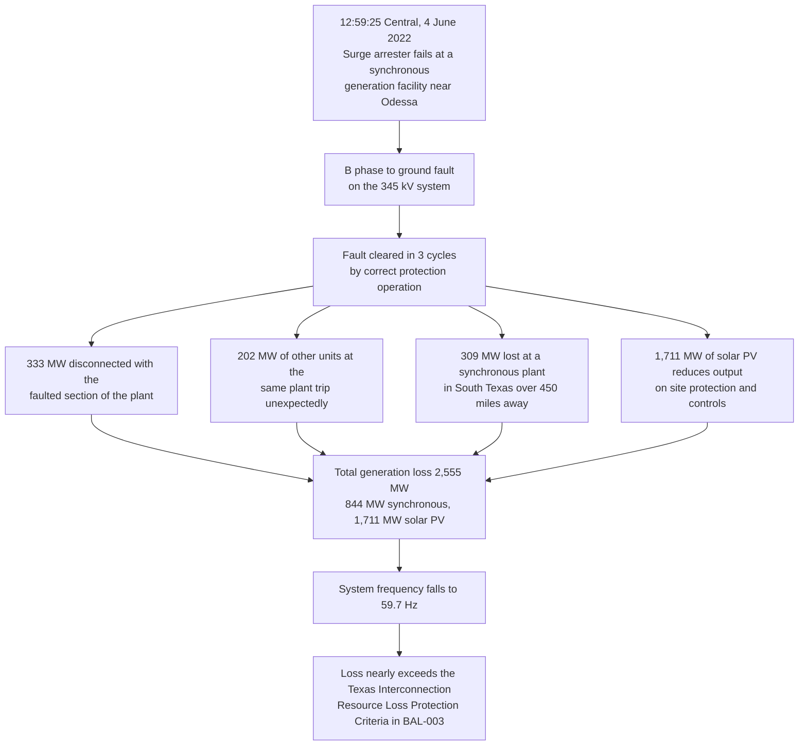

| Working group | Document type | Primary sources cited | Classification |
| :--- | :--- | :--- | :--- |
| WG-04-CF Cascading Failures | Eigenia Labs working paper | ERCOT, NERC, Texas RE, WECC, LBNL, AEMC, National Grid ESO | Open, non-normative |

## 1. Scope, and three corrections issued with it

This is Eigenia Labs working-group output, written by J. McKenney. It presents original framing, arithmetic and engineering judgement under one byline. It is not the source of record for any empirical fact about a real grid. Every statement here about what ERCOT operated at, what NERC reported, what WECC staff found or what LBNL measured carries a bracket citation to the primary document on the line where the claim appears. The list is in section 8.

The title names two regions and the evidence is not evenly split between them. Almost everything quantitative here is ERCOT, from ERCOT's own publications and from two joint NERC and Texas RE disturbance reports. The Western Interconnection appears through two NERC disturbance reports on events in southern California, one of them a joint NERC and WECC staff report, and through a national interconnection queue statistic that is not a WECC statistic. This working group holds no WECC operating limit, no WECC inertia floor and no WECC-specific queue duration. Section 6 says that at length rather than padding around it.

Three claims about ERCOT and WECC circulate inside this working group's own earlier output. All three are corrected here rather than repeated.

**An inverter-based capacity share for ERCOT.** A figure in the low forties is quoted as ERCOT's installed inverter-based resource share. It matches no ERCOT primary source at any date checked. This paper publishes no capacity share for ERCOT. Section 2.4 gives the two dated ERCOT figures that bracket it and section 7 records the finding.

**Peak renewable penetration above 75 percent.** This one is real, dated and exact. ERCOT set a combined wind and solar penetration record of 75.67% on 29 March 2024 at 2:13 p.m., with 34,958 MW of renewable generation at that instant [6]. It is one instant. It is not a capacity share, it is not a sustained operating condition, and it is separated from the November 2021 capacity mix by more than two years. Pairing an instantaneous energy record with an installed-capacity share, as though a grid were simultaneously in both states, is a common and serious error and it is made in this working group's own text.

**Interconnection queue duration.** The often quoted figure of about five years, up from under two years in 2008, is verbatim from Lawrence Berkeley National Laboratory's *Queued Up* series and it is a national United States figure covering all seven ISOs and RTOs plus non-ISO utilities [8]. LBNL publishes no WECC-only queue duration. Attributing it to WECC is wrong and is corrected in section 6.

One further sentence is attributed to this work and is not made here. That sentence calls ERCOT's experience "a potential preview for other regions" on resource adequacy and weather-extreme stress. No body in this evidence base says that. What NERC does say, in the 2022 Odessa report, is narrower and is about inverter performance only [2]. Section 7 states the gap and the sentence should come out of the citing paper.

## 2. ERCOT as a measured system

### 2.1 Critical inertia, defined by the operator

ERCOT defines Critical Inertia as "the minimum inertia level at which a system can be reliably operated with current frequency control practices" [5]. That is a stated definition from ERCOT's own methodology paper, not an interpretation.

The derivation is worth following because it shows what the number is made of. ERCOT sizes the contingency at 2,750 MW, the loss of its two largest units [5]. It then asks how long frequency may take to fall from 59.7 Hz to 59.3 Hz, the first-stage under-frequency load shed trigger, and requires at least 0.416 seconds for Load Resources to respond in time [5]. A regression across 13 dynamic simulation cases put the inertia meeting that criterion at 94 GW.s, and ERCOT states: "Based on this analysis, and with a safety margin, ERCOT has identified its Critical Inertia to be 100 GW*s" [5].

### 2.2 A consistency check on the published number

The following is the working group's own arithmetic, not ERCOT's. The theoretical maximum rate of change of frequency immediately after a disturbance is

$$\mathrm{RoCoF}_{\max} = \frac{P_k \, f_n}{2 \sum_{i \neq k} H_i S_i}$$

with $P_k$ the lost infeed in MW, $f_n$ the nominal frequency and $\sum H_i S_i$ the system inertia in MW.s.

At 60 Hz, a 2,750 MW loss and 94,000 MW.s of inertia gives 0.878 Hz/s, so a fall of 0.4 Hz takes 0.456 seconds. ERCOT's simulated answer at the same inertia is 0.416 seconds [5]. The first-order estimate is about 10% optimistic.

The gap closes if the tripped units take their own inertia out of the denominator, which they do, because ERCOT's contingency is two large synchronous machines. Recovering 0.416 seconds requires roughly 8,200 MW.s to leave with them, which is inside the plausible range for 2,750 MW of synchronous plant. That reconciliation is a plausibility argument and nothing more. It does not reproduce ERCOT's method, which used dynamic simulation, and where the two differ ERCOT's published number governs.

### 2.3 The alarm scheme, and the number that is not the limit

**100 GW.s is the System Operating Limit** [5]. The 105 GW.s figure that circulates in secondary commentary is a different thing entirely. ERCOT's control-room rule states that "when system inertia drops below 105,000 MW*s, the ERCOT Control Room will take actions to restore system inertia to levels at or above 105,000 MW*s" [5]. That is a restoration trigger, set deliberately above the limit so that the operator acts before reaching it.

The four-level alarm scheme sits around both numbers [5]:

| Band | System inertia |
| :--- | :--- |
| Green | at or above 120,000 MW.s |
| Yellow | 110,000 to 119,999 MW.s |
| Orange | 100,001 to 109,999 MW.s |
| Red | at or below 100,000 MW.s |

Reporting 105 GW.s as ERCOT's critical inertia converts a cushion into a boundary and deletes the 5 GW.s of margin the cushion exists to hold. Section 5 returns to this, because it is not an isolated mistake.

The lowest inertia ERCOT had recorded as of that paper was 130 GW.s, on 27 October 2017 [5]. That is 30 GW.s above the limit and 25 GW.s above the restoration trigger. On the published record, ERCOT has not approached its own critical inertia.

### 2.4 Capacity mix and the penetration record

ERCOT's own Fact Sheet gives two dated capacity snapshots. As of November 2021, wind at 24.8%, solar at 3.8% and storage at 0.2% totalled 28.8% of installed generating capacity. As of August 2026, wind at 22.4%, solar at 19.7% and storage at 2.9% totalled 45.0% [7].

Those are installed-capacity shares. The penetration record of 75.67% on 29 March 2024 is an instantaneous energy share [6]. The two quantities answer different questions and move on different timescales. An installed-capacity share is an upper bound on what could be produced and changes only when plant is built or retired. An instantaneous penetration share is what was produced in one moment and changes with wind, sun and load across a single day. Neither number implies the other.

ERCOT's current Fact Sheet lists newer separate wind and solar penetration records and does not restate the combined figure [7], so the 75.67% record may since have been superseded. Section 7 records that as an open item.

## 3. Four disturbances, 2016 to 2022

Four events in eight years, in two interconnections, with the same underlying behaviour and a rising loss each time. Each is documented in a NERC report with exact figures. This section states what tripped and why.

### 3.1 Blue Cut Fire, 16 August 2016

The Blue Cut Fire in southern California's Cajon Pass caused faults on transmission lines in a corridor carrying solar PV output, and about 1,200 MW of solar PV generation was lost [4].

The cause has two parts. Inverters set to trip instantaneously on a simultaneous reading of frequency outside the normal range tripped on an inaccurate perception of system frequency during the fault [4]. Separately, inverters using momentary cessation, a designed behaviour in which the inverter stops injecting current while terminal voltage is outside an acceptable range, returned to pre-disturbance output too slowly, which produced the recommendation that output restoration be delayed by no more than five seconds [4].

**Sourcing note.** This event is the weakest-sourced of the four in this paper. The NERC disturbance report PDF could not be retrieved. The event, the 1,200 MW figure and the two causes are carried here from two independent secondary sources plus a cross-reference by name in NERC's later Canyon 2 Fire report [3], [4]. It is labelled secondary in the bibliography and should be treated accordingly.

### 3.2 Canyon 2 Fire, 9 October 2017

The Canyon 2 Fire caused two transmission faults near the Serrano substation east of Los Angeles. The first was a normally cleared phase-to-phase fault on a 220 kV line at 12:12:16 Pacific time, which cleared in 2.85 cycles and cost 682 MW. The second was a normally cleared phase-to-phase fault on a 500 kV line at 12:14:30, which cleared in 2.86 cycles and cost 937 MW [3].

NERC attributes the loss precisely: "the majority of inverter tripping was caused by sub-cycle transient overvoltages and instantaneous protective action at the inverters to disconnect them from the grid. A significant amount of inverters also entered momentary cessation during and following the fault events" [3]. The 500 kV fault drove the Western Interconnection to a frequency nadir of 59.878 Hz about 3.3 seconds after the fault, with recovery to nominal in roughly 100 seconds [3].

Two details in this report matter more than the megawatts.

First, the earlier recommendations worked. NERC states that "no frequency-related tripping occurred during either of the two Canyon 2 Fire fault events" and credits the inverter manufacturer's and generator owners' response to the Blue Cut report with having remediated the frequency-related issues [3]. A specification defect was identified, a change was made, and the next event confirmed the change held. That is the strongest evidence in this paper that these failures are fixable by specification.

Second, the failure mode simply moved. Frequency tripping was gone. Sub-cycle transient overvoltage tripping and momentary cessation were not, and they carried the whole 1,619 MW.

### 3.3 Odessa, 9 May 2021

At 11:21 a.m. Central, a single-line-to-ground fault occurred on a generator step-up transformer at a combined-cycle plant near Odessa, Texas, caused by a failed surge arrester at the combustion turbine during startup for testing [1]. The fault cleared in three cycles.

Total generation loss was 1,340 MW: 192 MW of combined-cycle plant, 1,112 MW of solar PV and 36 MW of wind [1]. The pre-disturbance mix was 34% wind, 9% solar PV and 56% synchronous generation [1].

The sentence that carries the argument of this paper is NERC's, and it is unambiguous:

> "None of the affected inverter-based resources were tripped consequentially by the fault itself. Rather, all reductions were due to inverter-level or feeder-level tripping or control system behavior within the resources." [1]

Read that against what the protection system did. A fault occurred on one transformer. It was cleared correctly, in three cycles. Nothing about the cleared fault required any of the 1,112 MW of solar PV to come off. It came off anyway, because of settings and controls inside each plant.

### 3.4 Odessa, 4 June 2022

At 12:59:25 p.m. Central, a surge arrester failed at a synchronous generation facility in Odessa, causing a B-phase-to-ground fault on the 345 kV system [2]. The fault cleared in three cycles, disconnecting the part of the plant carrying 333 MW. Other units at the same plant tripped unexpectedly for a further 202 MW, and a separate synchronous facility in South Texas more than 450 miles away lost 309 MW, for 844 MW of synchronous generation in total. On top of that, 1,711 MW of inverter-based resources at many different facilities reduced output because of the protection and controls at each site. Total loss was 2,555 MW and system frequency fell to 59.7 Hz [2].

The pre-disturbance mix was 73.5% synchronous, 10.4% wind and 15.8% solar PV [2].

NERC calls the event "a perfect illustration of the need for immediate industry action" and records that the combined loss "nearly exceeded the Texas Interconnection Resource Loss Protection Criteria" defined in BAL-003 [2].

The 450-mile separation is the detail to sit with. A three-cycle fault on one 345 kV line in west Texas removed 309 MW of synchronous generation from a plant far outside any reasonable electrical neighbourhood of the fault. Distance from the fault stopped being a defence.

### 3.5 The four events side by side

| Event | Date | Fault clearing | Inverter-based loss | Total loss |
| :--- | :--- | :--- | :--- | :--- |
| Blue Cut Fire [4] | 16 Aug 2016 | not stated in this evidence | about 1,200 MW solar PV | about 1,200 MW |
| Canyon 2 Fire [3] | 9 Oct 2017 | 2.85 and 2.86 cycles | 682 MW and 937 MW solar PV | 1,619 MW |
| Odessa [1] | 9 May 2021 | 3 cycles | 1,112 MW solar PV, 36 MW wind | 1,340 MW |
| Odessa [2] | 4 Jun 2022 | 3 cycles | 1,711 MW solar PV | 2,555 MW |

Inverter-based loss rises from about 1,200 MW to 1,711 MW across the series. Total loss rises from about 1,200 MW to 2,555 MW. Fault clearing stays at roughly three cycles throughout, which is normal, correct transmission protection performance.

## 4. Ride-through as a specification problem

### 4.1 The fault never reached the resources that disconnected

In all four events the transmission protection did its job. Faults were normally cleared in about three cycles. NERC states outright for the 2021 Odessa event that none of the affected inverter-based resources tripped consequentially by the fault [1], and attributes the Canyon 2 losses to sub-cycle transient overvoltages and instantaneous protective action inside the inverters [3].

That places the failure in a specific location. It is not in the fault, not in the transmission protection, and not in the physics of the power system. It is in what each inverter was configured to do when it saw a short, correctly cleared transient. Every one of those settings was chosen by someone. Every one can be changed.

### 4.2 These were not low-inertia events

This point deserves emphasis because the opposite is widely assumed, including in this working group's earlier text.

The 2021 Odessa event occurred with 56% of ERCOT generation synchronous [1]. The 2022 event occurred with 73.5% synchronous [2]. The larger loss, the one that nearly exceeded the BAL-003 criteria, happened at the higher synchronous share. The two data points run against the low-inertia reading rather than supporting it.

ERCOT's inertia during either event is not given in this evidence, so no GW.s figure is asserted. What can be said is bounded and is enough: neither event is presented by NERC as an inertia problem, and the synchronous fractions do not suggest one. These are ride-through and protection-settings events that would have unfolded much the same way at higher inertia, because the mechanism, an inverter reacting to a sub-cycle disturbance at its own terminals, does not depend on the system inertia.

The frequency evidence agrees. Canyon 2 reached a nadir of 59.878 Hz [3], a shallow excursion. Odessa 2022 reached 59.7 Hz [2], which is where ERCOT's own timing criterion starts and still well short of the 59.3 Hz first-stage load shed trigger discussed in section 2.1. In none of the four did frequency reach a load-shed trigger.

### 4.3 What changed in the standards

The response arrived as specification, which is consistent with where the problem sits.

NERC issued a Level 2 Industry Recommendation alert on inverter-based resource performance issues on 14 March 2023, scoped to bulk electric system solar PV and encouraged for battery storage, citing the 2021 and 2022 Odessa disturbances as its background [10]. This working group did not open that alert in full and quotes no text from it.

NERC Reliability Standard PRC-029-1 was approved on 8 October 2024 [11]. Requirement R3 obliges each generator owner to ensure every inverter-based resource rides through frequency excursions where "the absolute rate of change of frequency (RoCoF) magnitude is less than or equal to 5 Hz/second, unless a documented hardware limitation exists" [11].

The most relevant clause is in the footnote that defines the measurement. RoCoF "is calculated as the average rate of change for multiple calculated system frequencies for a time period of greater than or equal to 0.1 second", and "is not calculated during the fault occurrence and clearance" [11].

That second sentence removes from the calculation exactly the window that caused the tripping in these events. Blue Cut's inverters tripped on an inaccurate perception of frequency during the fault [4]. Canyon 2's tripped on sub-cycle transient overvoltages during the fault events [3]. The standard now says the fault window is not where you measure the rate of change of frequency. A defect observed in 2016 is written out of the measurement definition in a 2024 mandatory standard.

### 4.4 What follows for asset owners

Working group synthesis, stated as such and not attributable to NERC, ERCOT or WECC.

The distance between these four events and a controllable outcome is a settings review, not a capital programme. The quantities that determined the loss in each case were an instantaneous overvoltage pickup, a frequency element with no ride-through delay, a momentary cessation recovery ramp and a feeder-level protection setting. None of them is expensive to change. All of them are invisible on a single-line diagram and none appears in a nameplate rating, which is why they are routinely absent from the asset register and from the risk model.

The consequence for anyone assessing a site is direct. A solar or storage plant is not characterised by its MW rating for this failure mode. It is characterised by its inverter protection settings, its firmware version and its momentary cessation behaviour. Two plants with identical ratings can behave completely differently on the same three-cycle fault, and the four events above are the proof.

## 5. Settings, limits and measurements

Section 2.3 corrected a figure that circulates as ERCOT's critical inertia and is actually a control-room restoration trigger. That is the third occurrence of the same error in this working group's evidence base, which makes it a pattern worth naming.

| Number | How it is often reported | What the primary source says |
| :--- | :--- | :--- |
| 105 GW.s | ERCOT's critical inertia limit | Control-room restoration trigger. The System Operating Limit is 100 GW.s [5] |
| 0.125 Hz/s | The RoCoF measured in Great Britain on 9 August 2019 | A relay disconnection threshold. The report gives no measured system-wide RoCoF [12] |
| 49.85 Hz | An under-frequency load shedding trip point | The bottom of the NEM normal operating frequency band [13] |

All three run in the same direction. A value an engineer chose for operational convenience gets reported as a value an instrument produced. The consequence is always the same: the margin between the setting and the real limit disappears from the analysis, and that margin is the entire reason the setting exists. Anyone quoting 105 GW.s as ERCOT's limit has silently spent 5 GW.s of headroom that ERCOT deliberately reserved.

This paper adds two further failure modes for a number, both of which it found in the citing text.

**The orphan figure.** A capacity share for ERCOT that matches no ERCOT document at any date checked. It has no source to be misread, so no correction can be made to it. The only available action is to strike it. Section 7 records it.

**The composite state.** Two real, correctly sourced, individually accurate numbers welded into one sentence describing an operating condition that never existed. An instantaneous penetration record from March 2024 and an installed-capacity share from a different year are both true and are not simultaneously true. This is the most dangerous of the three, because every component survives fact-checking and the composite is still false.

The test to apply before arguing from any grid number is short. Is it a setting someone chose, a measurement an instrument produced, or a limit derived from a study? Does it have a date? Is anything else in the same sentence from the same instant?

## 6. What WECC's position actually is

This section is short because the evidence is thin, and saying so is more useful than padding it.

### 6.1 What the working group holds

Two of the four disturbances in section 3 occurred in the Western Interconnection, and the Canyon 2 Fire report is a joint NERC and WECC staff report [3]. That is the WECC-specific evidence in this paper. It is about inverter performance during faults, and it is good evidence for that.

The report also gives CAISO's own solar PV penetration, including distribution-connected solar: a 47.3% peak on 4 May 2017, and 34.3% at the time of the 9 October 2017 disturbance [3]. CAISO is one balancing authority inside WECC, not WECC, and those figures are from 2017.

### 6.2 The queue figure, corrected

LBNL's *Queued Up: 2024 Edition* states that "the typical project built in 2023 took nearly 5 years from the interconnection request to commercial operations, compared to 3 years in 2015 and <2 years in 2008" [8]. The same wording appears with the year updated in the previous edition.

That is a **national** United States figure. LBNL's methodology covers all seven ISOs and RTOs together with non-ISO utilities, representing an estimated 85% of United States electricity load [8]. Regional breakdowns in the editions retrieved are by ISO or RTO, plus a non-ISO West category which is part of WECC's footprint and not the whole of it, and the West is reported by queue volume rather than by queue duration [8].

LBNL publishes no WECC-only queue duration in the editions retrieved for this paper. The figure should be quoted as national or dropped. Attributing it to WECC gives a national finding a regional authority it does not have.

The 2025 edition reports a further increase, to 55 months for projects reaching commercial operation in 2024 [9]. That is carried from a secondary summary of the LBNL report, not from the LBNL PDF itself, and is labelled secondary in the bibliography.

### 6.3 What is not here

No WECC inertia floor. No WECC critical inertia or system operating limit of any kind. No WECC-wide inverter-based capacity share. No WECC-specific queue duration. No WECC frequency operating standard.

A reader wanting the Western Interconnection's operating envelope in the form section 2 gives for ERCOT will not find it in this paper, because this working group does not have it. The honest description of this document is an ERCOT paper with two Western Interconnection disturbance reports attached, and the title should be read that way.

## 7. What this working group cannot establish

This is not a disclaimer. It lists claims a reader might expect this paper to make, and should notice that it does not.

**ERCOT's inverter-based capacity share.** A figure of 43% circulates and matches no ERCOT primary source at any of the dates checked, covering 2021, 2023, 2024 and 2026. ERCOT's own Fact Sheet brackets it at 28.8% in November 2021 and 45.0% in August 2026 [7]. This paper states no capacity share, and the figure should be struck wherever it appears in this working group's output rather than carried forward with a hedge.

**Whether ERCOT's penetration record still stands.** The 75.67% combined record of 29 March 2024 [6] may have been superseded. ERCOT's current Fact Sheet lists newer separate wind and solar records and does not restate the combined figure [7]. Re-verify against ERCOT's current Renewable Integration Report before quoting it as current.

**Whether ERCOT's critical inertia is still 100 GW.s.** The System Operating Limit is quoted from ERCOT's April 2018 paper [5]. Whether it has since been revised was not checked. It is the only ERCOT-published derivation of the figure this working group holds.

**ERCOT as a preview or leading indicator for other regions.** Not claimed here. No body in this evidence, NERC, ERCOT, FERC, WECC or DOE, describes ERCOT as previewing outcomes for other interconnections on resource adequacy or weather-extreme stress. NERC's supported statement is narrower and is about inverter performance: solar PV and inverter-based resource penetration "continues to grow rapidly in the ERCOT footprint and in many areas of North America", and those performance issues must be "proactively and immediately addressed" [2]. That is a shared and growing risk across North America, which is a different claim from ERCOT leading it. The sentence attributed to this work in the citing paper should be removed or restated as working-group opinion.

**Extreme instability in very low inertia conditions.** A sentence attributed to this work describes an incident as demonstrating the potential for extreme instability in very low inertia conditions. None of the four events here supports it. Section 4.2 gives the reason: the two Odessa events occurred at 56% and 73.5% synchronous generation, and the larger loss came at the higher synchronous share. No ERCOT inertia value for either event appears in this evidence. That sentence is not supported by this paper.

**A WECC-specific interconnection queue duration.** None exists in the LBNL editions retrieved [8]. See section 6.2.

**The Blue Cut Fire report as a primary source.** The NERC PDF could not be retrieved across two attempts. The 1,200 MW figure and the causes rest on two independent secondary sources plus a named cross-reference in NERC's Canyon 2 report [3], [4]. It is the one event here without a primary-source-verified quotation.

**The text of the March 2023 NERC alert.** Located, with its date, level and scope confirmed [10], but not opened in full. No language from the alert is quoted anywhere in this paper. Any quotation attributed to a NERC alert in this working group's output needs the alert document fetched and quoted directly.

**The second 2021 Odessa event.** A smaller event on 26 June 2021 is analysed in Appendix C of the same NERC report [1] and was not extracted for this paper. Nothing here describes it.

**Customer impact, cost and duration.** None of the four disturbance reports used here is quoted for a customer count, an outage duration or a cost, and none is estimated. All four were generation-loss events with no reported load shed.

## 8. Bibliography

[1] NERC and Texas RE, *Odessa Disturbance, Texas Events: May 9, 2021 and June 26, 2021*, joint staff report, September 2021.

[2] NERC and Texas RE, *2022 Odessa Disturbance, Texas Event: June 4, 2022*, joint staff report, December 2022.

[3] NERC and WECC, *900 MW Fault Induced Solar Photovoltaic Resource Interruption Disturbance Report, Southern California Event: October 9, 2017*, joint staff report, February 2018.

[4] Blue Cut Fire, 16 August 2016. **Secondary sources only.** Troutman Sanders Washington Energy Report, 2017; T&D World. The NERC disturbance report could not be retrieved; corroborated by a named cross-reference in [3].

[5] ERCOT, *Inertia: Basic Concepts and Impacts on the ERCOT Grid*, public paper v0, 4 April 2018.

[6] ERCOT, *ERCOT Monthly*, April 2024 edition, issued 30 April 2024, covering March 2024.

[7] ERCOT, *Fact Sheet*, capacity mix as of November 2021 and as of August 2026.

[8] Lawrence Berkeley National Laboratory, *Queued Up: 2024 Edition, Characteristics of Power Plants Seeking Transmission Interconnection As of the End of 2023*, April 2024.

[9] Lawrence Berkeley National Laboratory, *Queued Up: 2025 Edition*, December 2025, data to end of 2024. **Secondary.** Carried from a published summary of that edition, January 2026; the LBNL report was not opened directly.

[10] NERC, Alert R-2023-03-14-01, *Level 2 Industry Recommendation: Inverter-Based Resource Performance Issues*, 14 March 2023. Cited for date, level and scope only; not quoted.

[11] NERC, *Reliability Standard PRC-029-1, Frequency and Voltage Ride-through Requirements for Inverter-based Resources*, approved 8 October 2024.

[12] National Grid ESO, *Technical Report on the events of 9 August 2019*, 6 September 2019.

[13] AEMC Reliability Panel, *A Frequency Operating Standard*, effective 1 January 2020.
