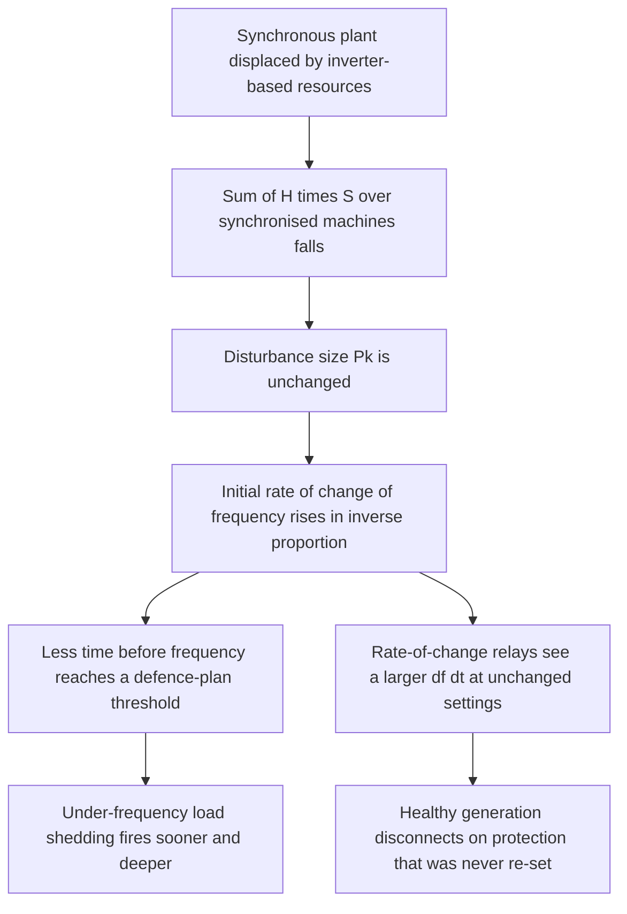
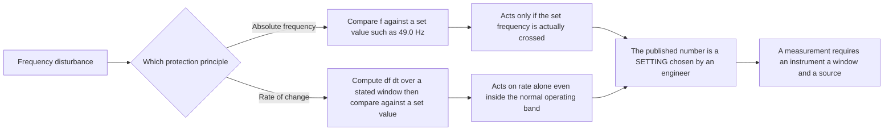

Grid frequency is the one operating variable every synchronous machine on a network shares in real time, and it is losing its physical damping fastest as synchronous plant is displaced by power electronics. This paper derives the relation between system inertia and the rate of change of frequency, then states which protection numbers in circulation are settings engineers chose and which are measurements instruments produced.

That distinction is the reason the paper exists. Several widely repeated figures about frequency events, including numbers in this working group's own earlier output, are relay settings quoted as though a power system had been observed reaching them. Where a figure cannot be supported from a primary source, this paper says so.

## 1. Frequency as the grid's vital sign

An alternating-current power system has no storage of consequence between generation and load. Every watt consumed is produced in the same instant. The only thing absorbing a mismatch is the kinetic energy already spinning in the system's synchronous machines, and the price of that absorption is a change in their speed. Speed and electrical frequency are the same quantity in a synchronous machine, so frequency is a direct, network-wide reading of the supply and demand balance: it falls when demand exceeds generation and rises when generation exceeds demand.

That makes frequency unusual among grid measurements. Voltage is local. Power flow is per circuit. Frequency, within one synchronous area, is close to common, so one number tells an operator whether the whole area is in balance. Nearly every automatic last-resort action in a power system is triggered by frequency or its derivative.

The bands are published. In Australia's National Electricity Market the AEMC Reliability Panel's Frequency Operating Standard, effective 1 January 2020, sets four nested ranges for the mainland: a normal operating frequency band of 49.85 to 50.15 Hz, a normal operating frequency excursion band of 49.75 to 50.25 Hz, an operational frequency tolerance band of 49.0 to 51.0 Hz, and an extreme frequency excursion tolerance limit of 47.0 to 52.0 Hz [2]. After a generation or load event, frequency must return to the normal band within five minutes [2].

Two things follow. First, the innermost band is where the system sits almost all the time by design; it is not an alarm state and it is not a trip point. Second, the standard sets no national under-frequency load shedding value. In the NEM those schemes are set by individual Network Service Providers under AEMO coordination, and no consolidated national table of set points was located for this paper. Any statement that "the under-frequency relays trip at 49.85 Hz" describes a system that would shed load continuously during ordinary operation. No grid in service is built that way.

## 2. Inertia: what it is, how it is measured, what supplies it

Inertia in a power system is not a metaphor. It is rotational kinetic energy stored in machines electromagnetically coupled to the network and turning in step. AEMO's Inertia Requirements Methodology quotes the National Electricity Rules definition: the "contribution to the capability of the power system to resist changes in frequency by means of an inertial response from a generating unit, network element or other equipment that is electro-magnetically coupled with the power system and synchronised to the frequency of the power system" [1].

The quantity is energy, and AEMO's glossary gives the unit as the megawatt-second [1]. EirGrid publishes it in megavolt-ampere seconds, obtained in real time by "summing the inertial contribution, Unit MVA rating x H constant, of all on-line synchronous units" [3]. That sum is an inventory of what is synchronised, not a model output.

The per-machine term is the inertia constant $H$, the stored kinetic energy at rated speed divided by rated apparent power:

$$H = \frac{E_{\text{kin}}}{S} = \frac{J \omega_{m,0}^{2}}{2 S}$$

where $J$ is the polar moment of inertia in kg m squared, $\omega_{m,0}$ is rated mechanical angular velocity in rad/s, and $S$ is rated apparent power in MVA. The units of $H$ are seconds: it is the time the machine could supply its own rated output from stored kinetic energy alone.

What supplies inertia is a narrow list. AEMO describes synchronous plant as "typically heavy, weighing in the tens and hundreds of tonnes," and states that because such machines "spin synchronously with the power system, they inherently slow down a change in power system frequency immediately after an imbalance between supply and demand" [1]. That mechanism is not controllable, dispatchable or optional. It is a consequence of the machine being connected and turning.

Operators set floors on the total. EirGrid's published all-island operational limits, current as of March 2024, include a minimum synchronous area inertia of 23,000 MVA.s, a maximum rate of change of frequency of plus or minus 1.0 Hz/s, nadir and zenith limits of 49.0 Hz and 51.0 Hz, a system non-synchronous penetration limit of 75 percent, and a minimum of seven large synchronous units synchronised [3]. Those figures are Ireland and Northern Ireland's, not transferable elsewhere.

AEMO sets two thresholds per inertia sub-network: a "minimum threshold level of inertia" for a satisfactory operating state when the sub-network is islanded, and a higher "secure operating level of inertia" [1]. The per-region megawatt-second values sit in that document's appendices, were not retrieved for this paper, and are therefore not quoted here.

## 3. The swing equation and the RoCoF relation

Take one synchronous machine. Its rotor accelerates when mechanical input power exceeds electrical output power. Written as a power balance on the stored kinetic energy, in electrical frequency rather than mechanical angle, that is the swing equation:

$$\frac{2 H S}{f_{n}} \cdot \frac{df}{dt} = P_{m} - P_{e}$$

where $f_{n}$ is nominal frequency in Hz, $f$ is instantaneous frequency in Hz, $P_{m}$ is mechanical input power in MW, and $P_{e}$ is electrical output power in MW. The left side is the rate at which kinetic energy is withdrawn or added. The right side is the imbalance forcing it.

Now take a system. At the first instant after a disturbance, before any governor or fast frequency response has acted, the machines still synchronised share the imbalance in proportion to their stored energy. Summing the left side over those machines and setting the right side to the disturbance size gives the theoretical maximum rate of change of frequency. Basakarad and colleagues, writing with the Croatian transmission system operator as a co-author affiliation, state it as:

$$\left. \frac{df}{dt} \right|_{t=0^{+}} = \frac{P_{k} \, f_{n}}{2 \sum_{i \neq k} H_{i} S_{i}}$$

where "$f_n$ is the nominal frequency in Hz, $P_k$ is the size of disturbance in MW, $H_i$ is the inertia constant of the ith generator in s, $S_i$ is the nominal power of the ith generator in MVA," and $P_k$ "represents the disconnection of either a generator or load" [7]. The index condition $i \neq k$ matters: the tripped unit's own inertia leaves the sum at the moment it disconnects.

### 3.1 What the relation says about low inertia

This working group's 2024 commentary put the consequence informally:

> In a low-inertia system, the *same* disturbance (e.g., a large power plant loss) causes the frequency to change *much faster* than in a high-inertia system. This rapid frequency change *is* the dangerous "wobble."

That is a correct reading of the relation above, and it can be derived rather than asserted. Hold $P_{k}$ and $f_{n}$ fixed. The initial rate of change of frequency is then inversely proportional to the sum of $H_{i} S_{i}$ over the machines still connected. Halve that sum and the initial rate doubles, for a disturbance of identical size. Nothing about the disturbance has changed. Only the denominator has.

The claim is not that low-inertia systems suffer larger disturbances. They suffer the same disturbances at a higher rate of change, which is a narrower statement, and it is the one the physics supports.

### 3.2 A worked case on published figures

EirGrid states its design logic in one sentence: "The current inertia floor allows us to maintain the theoretical RoCoF below 0.6 Hz/s for loss of the largest generation infeed, which is approx. 450 MW / 4000 MVA.s" [3]. The floor is 23,000 MVA.s and the largest infeed is 450 MW [3]. Reading the paired 4,000 MVA.s as the inertia of the unit carrying that infeed, which leaves the sum when it trips, is this paper's inference, and the result below is what tests it:

$$\left. \frac{df}{dt} \right|_{t=0^{+}} = \frac{450 \times 50}{2 \times (23{,}000 - 4{,}000)} = \frac{22{,}500}{38{,}000} = 0.59 \ \text{Hz/s}$$

That reproduces EirGrid's stated "below 0.6 Hz/s" to two decimals, which is the check on the inference above. The arithmetic is this paper's; the inputs and the 0.6 Hz/s result are EirGrid's [3].

Now halve the remaining inertia to 9,500 MVA.s and repeat the same 450 MW loss:

$$\left. \frac{df}{dt} \right|_{t=0^{+}} = \frac{22{,}500}{19{,}000} = 1.18 \ \text{Hz/s}$$

The rate doubles, as the relation requires, and it crosses EirGrid's own published operating limit of plus or minus 1.0 Hz/s [3]. That crossing is the point. An inertia floor is not a preference. It is the value at which the largest credible loss still produces a rate of change the system's protection and control were designed for.

AEMO publishes the same relation as a planning table of rate against time to fall from 50 Hz to 49 Hz: 4 Hz/s reaches 49 Hz in 0.25 s, 2 Hz/s in 0.5 s, 1 Hz/s in 1 s, 0.5 Hz/s in 2 s [1]. That is a linear extrapolation of the initial rate. Real frequency does not fall linearly, because governor and fast frequency response act inside that window, so the table bounds the time available rather than forecasting the fall.

## 4. What inverter-based resources contribute, and what replaces it

AEMO is unambiguous about the mechanism. "Asynchronous generation technologies, such as modern wind turbines, solar inverters and batteries, are connected to the power system via a power electronic interface and do not bring any inertia naturally to the power system because they are electrically decoupled from the power system," and so "are currently limited in their ability to reduce a change in power system frequency immediately after an imbalance between supply and demand" [1].

The word doing the work is "decoupled". There is no shaft, so no stored rotational energy to give up involuntarily. Whatever an inverter contributes to frequency support, it contributes because software told it to.

What substitutes is a service, not a physical property. AEMO defines fast frequency response as "the delivery of a rapid active power increase or decrease by generation or load in a timeframe of two seconds or less, to correct a supply-demand imbalance and assist in managing power system frequency" [8]. EirGrid's own service timing places it starting "from 150 ms" after a disturbance [3]. Those are two grids and two service definitions, not one number.

AEMO's 2024 technical note on grid-forming batteries separates synthetic inertia from fast frequency response by mechanism, not by speed alone. "Unlike synchronous inertial response, which is the inertial response from stored kinetic energy in the rotating mass of a machine that is electro-magnetically coupled to the power system, synthetic inertial response from a GFM BESS is dependent on the control system logic, inverter design and configuration" [8]. A grid-forming inverter can be made to behave like inertia across a bounded range. It is not inertia, and its contribution is a design parameter that can be changed, mis-set, or lost with a firmware update.

The reliability response has been to widen what inverter-based plant must tolerate rather than to require it to supply inertia. NERC's PRC-029-1, approved 8 October 2024, requires in R3 that each inverter-based resource "meets or exceeds Ride-through requirements during a frequency excursion event whereby the System frequency remains within the must Ride-through zone according to Attachment 2 and the absolute rate of change of frequency (RoCoF) magnitude is less than or equal to 5 Hz/second, unless a documented hardware limitation exists" [4]. That is a North American standard for inverter-based resources specifically, not a requirement on synchronous generators, and not in force in Australia or Great Britain [4].

## 5. Settings and measurements are not the same number

A protection setting is a number an engineer entered into a relay; it states the value at which a device will act. A measurement is a number an instrument produced from an event that happened. Reporting the first as the second inverts cause and effect: it converts a design decision into an observed physical extreme, and it makes the narrative unfalsifiable, because the "measured" value can never disagree with the relay that produced it. Three rules follow.

**A relay threshold tells you what the relay would do, not what the system did.** When a report states that embedded generation disconnected on relays set to 0.125 Hz/s, the correct reading is that the computed rate at those relays exceeded 0.125 Hz/s for long enough to satisfy the relay's timing. It is not a statement that the system-wide rate of change of frequency was 0.125 Hz/s, and it is not a licence to quote a nearby number as a measurement.

**A rate of change of frequency figure without a measurement window is not a measurement.** Every standard that sets a RoCoF value also sets the interval over which it is computed. NERC defines its own: "Rate of change of frequency (RoCoF) is calculated as the average rate of change for multiple calculated system frequencies for a time period of greater than or equal to 0.1 second. RoCoF is not calculated during the fault occurrence and clearance" [4]. The G99 population in Great Britain runs 1 Hz/s with a 500 millisecond definite time delay [5]. The access standards applied to South Australian wind farms in 2016 paired each rate with a duration: "outside the range of -4 Hz to 4 Hz per second for more than 0.25 seconds" for the automatic standard, and "-1 Hz to 1 Hz per second for more than one second" for the minimum [9]. Basakarad and colleagues give the reason a measured value sits below the theoretical maximum: "frequency measurement inevitably involves a signal filtering process," and the result depends heavily on window length [7]. Two engineers quoting different windows are not disagreeing about the grid. They are reporting different quantities.

**Absolute-frequency and rate-of-change protection answer different questions.** Under-frequency load shedding compares $f$ against a set value and acts when it is crossed. Rate-of-change protection computes $df/dt$ over a window and acts on that, whatever the absolute frequency happens to be. A disturbance can satisfy one and not the other. A small oscillation at sufficient rate produces a large $df/dt$ while the frequency never leaves the normal band, which is the case absolute-frequency monitoring is blind to.

### 5.1 Thresholds actually in service

| System | Instrument | Quantity | Value | Status |
| :--- | :--- | :--- | :--- | :--- |
| Great Britain, legacy plant | Most sensitive RoCoF protection on the system | Rate of change, little to no minimum duration | 0.125 Hz/s | In service [6] |
| Great Britain, G99 population | Loss of mains, generation under 50 MW | Rate of change, 500 ms definite time delay | 1 Hz/s | Retrofit deadline 31 August 2022 [5] |
| Ireland and Northern Ireland | All-island operational limits | Maximum rate of change; inertia floor | 1.0 Hz/s; 23,000 MVA.s | In force March 2024 [3] |
| NEM | NER automatic access standard | Rate outside minus 4 to 4 Hz/s for more than 0.25 s | 4 Hz/s | Applied to SA wind farms 2016 [9] |
| NEM | NER minimum access standard | Rate outside minus 1 to 1 Hz/s for more than 1 s | 1 Hz/s | Applied to SA wind farms 2016 [9] |
| North America | NERC PRC-029-1 R3, inverter-based resources | Absolute rate, averaged over at least 0.1 s | 5 Hz/s | Approved 8 October 2024 [4] |
| NEM | AEMC Frequency Operating Standard | Absolute frequency bands in Hz, none a relay setting | 49.85 to 50.15 normal; 49.0 to 51.0 operational; 47.0 to 52.0 extreme | Effective 1 January 2020 [2] |

Two entries need their qualifiers stated rather than buried.

Great Britain does not run a single RoCoF threshold. The 1 Hz/s setting with a 500 millisecond definite time delay applies to generation covered by Engineering Recommendation G99 and to the retrospective compliance programme for existing generation under 50 MW, deadline 31 August 2022 [5]. The system operator's own policy states the other half: "The most sensitive RoCoF protection on the GB system is set at 0.125Hz/s, with little to no minimum duration threshold. There are further tranches of RoCoF relays at other thresholds" [6]. Both are true at once, and a flat claim that "the UK threshold is 1 Hz/s" misdescribes the system.

The NEM has no single system-wide tolerance either. The two figures in the table are access standards applied to specific connected plant under the National Electricity Rules, not one uniform value [9]. Their durations, 0.25 s at 4 Hz/s and 1 s at 1 Hz/s, match AEMO's planning table exactly [1], [9]. Both were built from the same relation.

### 5.2 The 1 Hz/s over 500 ms claim, restated

An earlier statement circulating under this working group's name reads:

> Experts explicitly warn that RoCoF values above 1 Hz/s (measured over 500ms) may be unmanageable by current system protections, potentially leading to fast grid collapse

That sentence should not be quoted in this form. Part of it is defensible and part is not, and it gives the reader no way to tell them apart.

What is traceable: 1 Hz/s over 500 milliseconds is a real, in-service boundary in more than one jurisdiction. It is the G99 loss of mains setting for the covered Great Britain population, 1 Hz/s with a definite time delay of 0.5 s [5]. The AEMC states the corresponding ride-through obligation in the same terms: "generation is required to ride through RoCoF events provided the RoCoF does not exceed 1 Hz/s over a 500 ms period. However, National Grid ESO notes that some legacy wind farms have lower RoCoF ride through capability" [6]. It is also EirGrid's published maximum operational RoCoF [3].

What is not traceable: the attribution to unnamed "experts", and the leap from exceeding a design boundary to "unmanageable" and "fast grid collapse". No source consulted here supports either. The AEMC's own sentence points the other way, recording that capability below the boundary is uneven across legacy plant. That describes a distribution of equipment, not a prediction of collapse.

The defensible restatement, and the sentence that should be cited in place of the one above:

> Above 1 Hz/s measured over 500 milliseconds, a disturbance exceeds the rate-of-change boundary that Great Britain's G99 population and Ireland's all-island system are specified against [3], [5], [6]. Plant is then operating outside the envelope it was designed and tested for, and the AEMC records that some legacy wind farms have lower ride-through capability than the boundary itself [6]. What follows from exceeding it is not established by any source consulted here, and should not be asserted as collapse.

That is weaker and true. The alternative reads as an established finding and is not one.

## 6. What the record shows

### 6.1 South Australia, 28 September 2016

AEMO's final report, published March 2017, gives the chain. "Two tornadoes almost simultaneously damaged a single circuit 275 kilovolt (kV) transmission line and a double circuit 275 kV transmission line, some 170 km apart. The damage to these three transmission lines caused them to trip, and a sequence of faults in quick succession resulted in six voltage dips on the SA grid over a two-minute period" [13].

What happened next is the part worth reading twice. "Nine wind farms in the mid-north of SA exhibited a sustained reduction in power as a protection feature activated. For eight of these wind farms, the protection settings of their wind turbines allowed them to withstand a pre-set number of voltage dips within a two-minute period... A sustained generation reduction of 456 megawatts (MW) occurred over a period of less than seven seconds" [13]. Roughly 700 milliseconds later, flow on the Heywood interconnector reached the level that activated a special protection scheme and tripped it [13]. The imbalance at collapse was "in the order of 1,000 MW, for a regional demand of 1,826 MW," and some 850,000 South Australian customers lost supply [13].

AEMO's own conclusion is the one that matters for this working group: "Wind turbines successfully rode through grid disturbances. It was the action of a control setting responding to multiple disturbances that led to the Black System" [13]. The plant did not fail. A voltage-dip-count setting did what it was configured to do, and the configuration was wrong for the event.

Three figures commonly attached to this event are not used here. The 445 MW generation loss is superseded interim reporting; AEMO's final figure is 456 MW [13]. No count of transmission towers appears in the final report; Section 2.4, Table 6, Section 3.1.4 and Appendix V were read for this paper, and Table 6 says only "Damaged towers bypassed" [13]. And the 6.1 Hz/s RoCoF figure widely attributed to AEMO for this event was not located in it; see Section 7.

### 6.2 Great Britain, 9 August 2019

National Grid ESO's technical report, filed with Ofgem on 6 September 2019, gives the sequence to the tenth of a second [10].

| Time | Event | Cumulative infeed loss |
| :--- | :--- | :--- |
| 16:52:26 | Frequency 50.0 Hz; ESO securing against a 1,000 MW loss of infeed | 0 |
| 16:52:33 | Three lightning strikes near the Eaton Socon to Wymondley circuit; about 150 MW of embedded generation trips on vector-shift protection | 150 MW |
| 16:52:33.531 to .835 | Hornsea deloads from 799 MW and stabilises at 62 MW | 887 MW |
| 16:52:34 | Little Barford steam turbine trips 244 MW instantaneously | 1,131 MW |
| 16:52:34 | About 350 MW of embedded generation trips on RoCoF protection | 1,481 MW |
| 16:52:58 | Frequency fall arrested at 49.1 Hz by frequency response products | 1,481 MW |
| 16:53:31 | Little Barford GT1A trips 210 MW; frequency falls to 48.8 Hz | 1,691 MW |
| 16:53:49.398 | Low frequency demand disconnection fires at 48.8 Hz, shedding 931 MW across 1,152,878 customers | 1,691 MW |
| 16:53:58 | Little Barford GT1B trips 187 MW, subsumed by the shed demand | 1,878 MW |
| 16:57:15 | Frequency returns to 50 Hz | |

All figures and timestamps are from the ESO technical report [10]. The transmission protection "operated correctly to clear the lightning strike," and Orsted's own investigation found the Hornsea turbine controllers "reacted incorrectly due to an insufficiently damped electrical resonance in the sub-synchronous frequency range" [10].

The 16:52:34 RoCoF trip is the row this paper exists to get right. The report defines the relay: "These relays disconnect the generators if the RoCoF is greater than 0.125Hz/s, disconnecting them from the system safely" [10]. That 0.125 Hz/s is the relay's trip threshold. The report publishes no measured system-wide rate of change of frequency for the event, and any figure presented as one has no basis in it.

The protection worked. The vector-shift relays, the RoCoF relays and the demand disconnection scheme all operated as specified, and the price of that correct operation was 1.15 million customers disconnected to save the wider transmission system [10]. Ofgem's finding on the system operator is explicit: "We have not identified any failures by the ESO to meet its requirements which contributed to the outage" [11].

The counter-case is the trains. Approximately 60 Class 700 and Class 717 trains shut down when frequency dropped, 30 of them needing a technician on site to reset, though the specification required continued operation down to 48.5 Hz [10]. That is a specification failure, not a designed trip, and the ESO report does not conflate the two.

System inertia on 9 August is given in the report's Table 4 as 210 GVA.s [10]. No wind penetration percentage for that day appears in the report, and none is quoted here.

### 6.3 Continental Europe, 8 January 2021

ENTSO-E's expert panel final report is the one event in this set where a rate of change of frequency is reported as a derived measurement with its method stated. After separation at 14:05:08 the North-West area fell "with a RoCoF of 60 mHz/s, deduced from the frequency measured at the centre of inertia," to a minimum of 49.746 Hz, while the South-East area rose at 300 mHz/s to 50.6 Hz [12]. That is what a properly reported rate looks like: a value, an instrument concept, and a stated derivation.

It should not be cited for outage scale. The loads shed in France and Italy were industrial customers on standing interruptibility contracts, and ENTSO-E concludes the incident "had no major influence on the security of supply of European consumers" [12].

## 7. What this paper cannot establish

The following are open. Each has at some point been quoted as settled.

**The 6.1 Hz/s South Australia RoCoF figure.** AEMO's final report was opened directly and the figure was not located in the retrievable text; it circulates in secondary commentary. It must not be attributed to AEMO, or presented as a measurement, until someone quotes the report's own RoCoF passage. If a figure is needed, derive it from the swing equation using the confirmed 456 MW loss and a sourced pre-event inertia value, and label it a derivation.

**The South Australia transmission tower count.** Confirmed absent from the primary source rather than merely unretrieved [13]. The "23 towers" figure in press coverage has no basis in the report, and a tower count would be causally misleading anyway: AEMO's chain runs from tornado damage to three lines, to six voltage dips, to the wind farm protection response.

**A measured system-wide RoCoF for Great Britain, 9 August 2019.** Not published; the ESO report gives the 0.125 Hz/s relay setting only [10].

**Wind penetration on 9 August 2019.** No figure appears in the ESO report. The 210 GVA.s inertia figure is sourced; the penetration percentage quoted beside it is not [10].

**A NEM-wide under-frequency load shedding setting.** None was located; schemes are set per Network Service Provider under AEMO coordination [2]. The one staged schedule found in this research is Germany's, not the NEM's, Great Britain's or ERCOT's.

**Per-region NEM inertia levels in megawatt-seconds.** In the appendices of AEMO's methodology, not extracted [1].

**ERCOT's critical inertia level.** Secondary sources disagree between 100 GWs and 105 GWs, and neither was confirmed against ERCOT's own document.

**An AEMO figure in milliseconds for synthetic inertia or fast frequency response delivery.** AEMO defines the outer bound as two seconds or less [8]. No AEMO-stated lower bound comparable to EirGrid's 150 ms was found, and the two must not be merged.

**Whether exceeding 1 Hz/s over 500 ms leads to collapse.** See Section 5.2. The boundary is real and sourced. What happens past it is not established by anything consulted here.

One further limitation is structural. Every quantitative statement here comes from a system operator, a regulator, a standards body or a peer-reviewed source, and each is cited. The framing, the derivations in Section 3, the reconstruction of EirGrid's design case, and the setting-versus-measurement argument in Section 5 are this working group's own synthesis. They are engineering judgement, not findings from an external body, and should not be cited as though a named institution had published them.

## 8. References

[1] AEMO, *Inertia Requirements Methodology*, final, version 1.0, effective 1 July 2018.

[2] AEMC Reliability Panel, *A Frequency Operating Standard*, effective 1 January 2020.

[3] EirGrid, *Inertia Management on the Power Systems of Ireland and Northern Ireland*, G-PST, March 2024.

[4] NERC, *PRC-029-1: Frequency and Voltage Ride-through Requirements for Inverter-based Resources*, approved 8 October 2024.

[5] Energy Networks Association, *Engineering Recommendation G99*, Issue 2, 2025; UK Power Networks, *Loss of Mains Protection Requirements*.

[6] National Grid ESO / NESO, *Frequency Risk and Control Policy*; AEMC, *System Rate of Change of Frequency*, November 2022.

[7] N. Basakarad et al., *ROCOF Importance in Electric Power Systems with High Renewables Share*, University of Zagreb with HOPS, 2020.

[8] AEMO, *Fast Frequency Response in the NEM*, working paper, 2017; AEMO, *Quantifying Synthetic Inertia of a Grid-forming BESS*, technical note, September 2024.

[9] AEMO, letter to ESCOSA, *Inquiry into Wind Farm and Inverter Generation*, December 2016.

[10] National Grid ESO, *Technical Report on the events of 9 August 2019*, filed with Ofgem, 6 September 2019.

[11] Ofgem, *9 August 2019 Power Outage Report*, 3 January 2020.

[12] ENTSO-E ICS Investigation Expert Panel, *Continental Europe Synchronous Area Separation on 08 January 2021*, version 2.0, October 2021.

[13] AEMO, *Black System South Australia 28 September 2016*, final report, March 2017.
