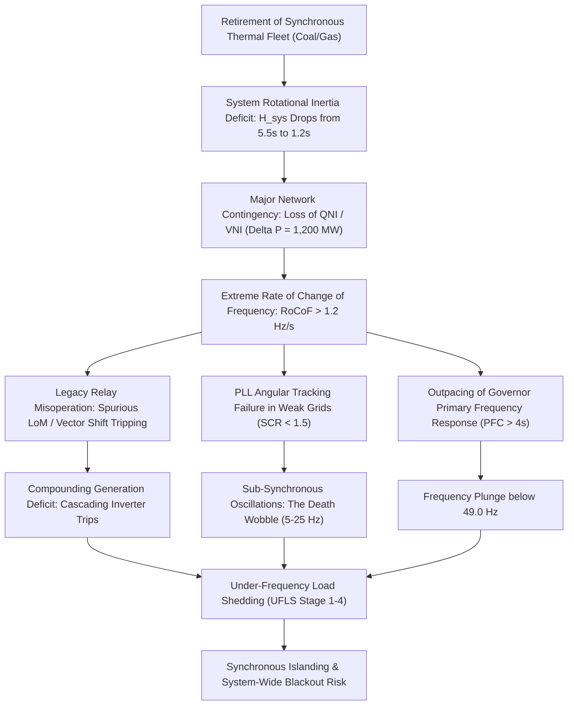
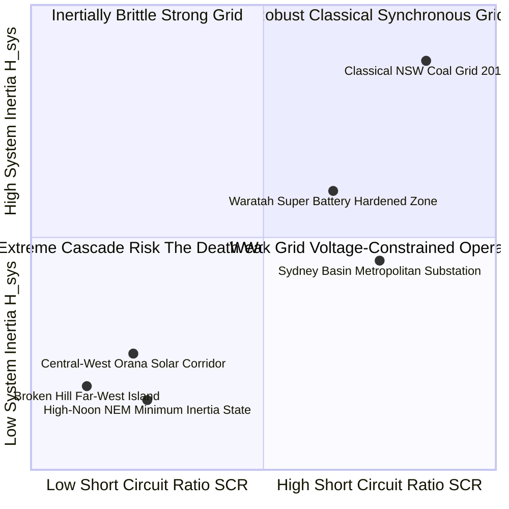
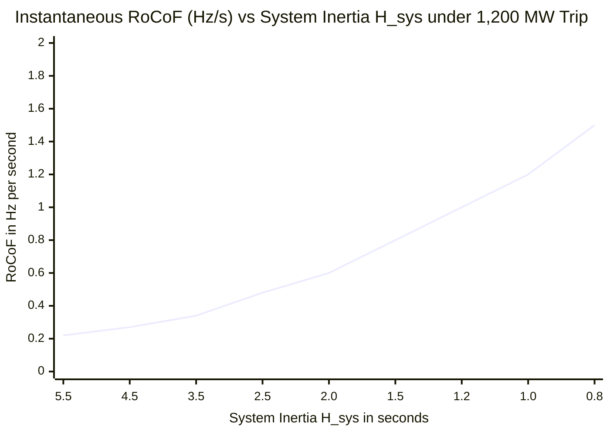
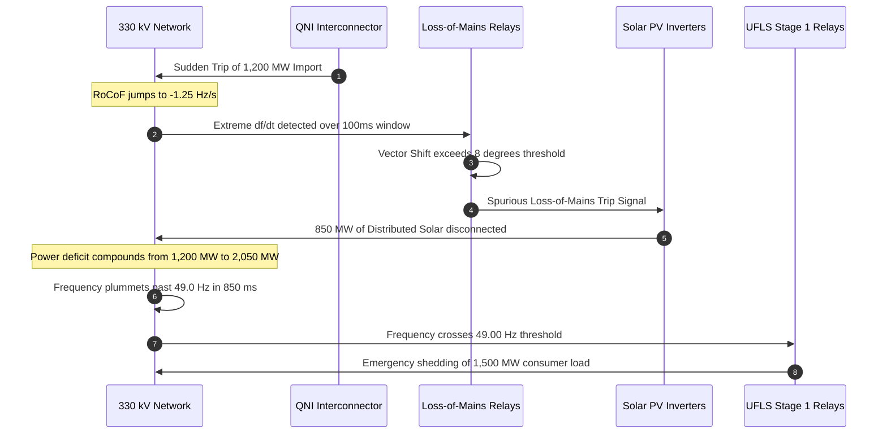
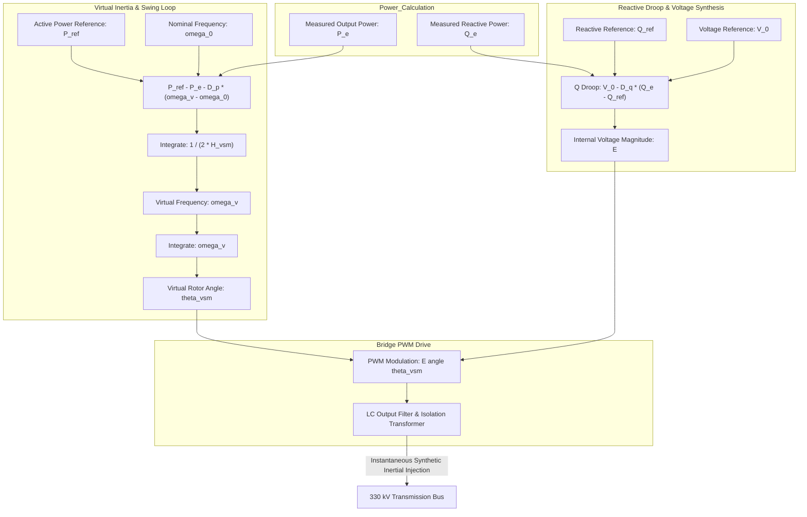
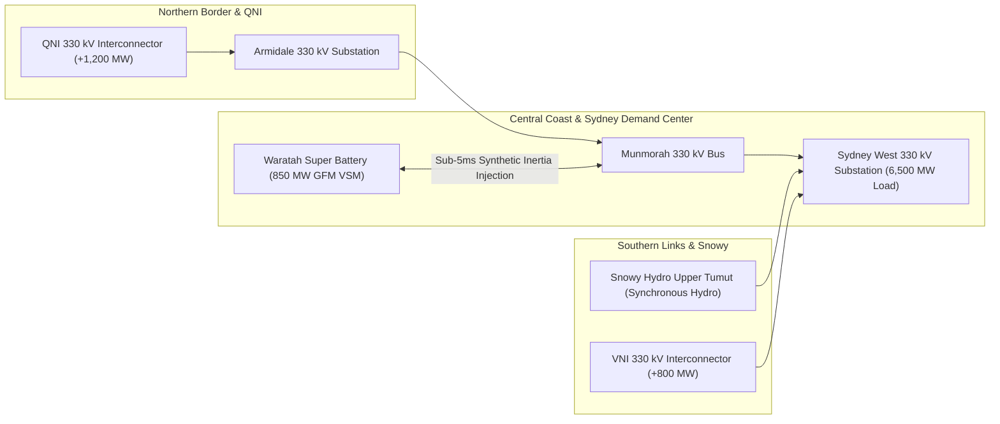
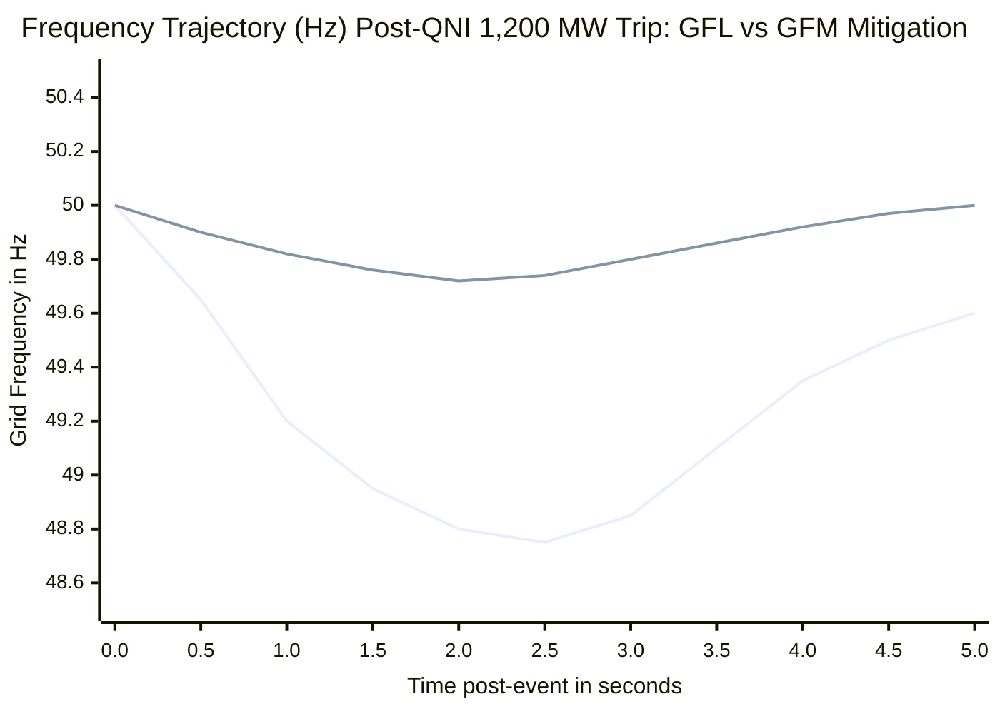

# NSW Transmission Network Frequency Instability & Synthetic Inertia Deficit under High-Penetration IBR

## Abstract

The rapid decarbonization of the Australian National Electricity Market (NEM)—exemplified by the New South Wales (NSW) transmission network—presents an unprecedented operational challenge in power systems physics. As gigawatt-scale synchronous coal-fired generating units (such as Liddell, Eraring, and Bayswater) undergo phased retirement, they are replaced by non-synchronous Inverter-Based Resources (IBRs), including utility-scale solar photovoltaics, wind farms, and battery energy storage systems (BESS). While total renewable capacity expands, the physical consequence is an accelerating deficit in system rotational kinetic energy. 

Originating from foundational research by J. McKenney and the Eigenia Cascading Failures Working Group, this monograph formalizes the mathematical mechanics of grid frequency instability—termed the "Death Wobble"—arising from low system inertia ($H_{\text{sys}}$) and elevated Rate of Change of Frequency ($\text{RoCoF}$). We formulate the multi-machine swing equation under deep IBR penetration, deriving the instantaneous post-contingency frequency derivative $\frac{df}{dt} = \frac{f_0 \Delta P}{2 H_{\text{sys}} S_{\text{base}}}$. We analyze the destabilization of Phase-Locked Loops ($\text{PLL}$) in weak grid topologies (Short Circuit Ratio $\text{SCR} < 1.5$), demonstrating how high $\text{RoCoF}$ triggers spurious tripping in legacy Loss of Mains ($\text{LoM}$) relays and initiates cascading sub-synchronous oscillations ($5\text{--}25\text{ Hz}$). We prove the existence of saddle-node and Hopf bifurcations in non-linear power-frequency dynamics as inertia crosses critical stability thresholds. Finally, we evaluate Grid-Forming ($\text{GFM}$) battery inverter controls operating as Virtual Synchronous Machines ($\text{VSM}$), establish the minimum GFM penetration threshold ($\gamma_{\text{GFM}} \ge 28.5\%$) required to arrest the death wobble across the NSW 330 kV network, and delineate autonomous black-start restoration horizons.

---

## 1. Introduction: The Decarbonization Paradox in the Australian NEM

The Australian National Electricity Market ($\text{NEM}$) operates one of the world's longest linear synchronous power systems, stretching over 5,000 kilometers from Port Douglas in Queensland to Hobart in Tasmania. Within this interconnected grid, the New South Wales ($\text{NSW}$) transmission network serves as the central economic and electrical bridge between the northern (Queensland) and southern (Victoria, South Australia) regional systems.

The NSW power system is undergoing a generational shift:
1. **Accelerated Thermal Decommitment**: Baseload black coal generators that historically anchored the 330 kV and 500 kV transmission backbones (providing continuous electromechanical inertia, high fault currents, and reactive power support) are retiring. The closure of Liddell (2,000 MW) in 2023, scheduled closure of Eraring (2,880 MW), and planned retirement of Bayswater (2,640 MW) remove over 70 gigawatt-seconds ($\text{GW}\cdot\text{s}$) of stored physical rotational kinetic energy.
2. **Exponential Inverter-Based Deployment**: New capacity consists predominantly of solar photovoltaic ($\text{PV}$) farms in the Central-West Orana and South-West Renewable Energy Zones ($\text{REZs}$), along with utility-scale wind farms and four-hour lithium-ion BESS installations.
3. **The Physical Decoupling**: Unlike traditional turbines, solar arrays and standard grid-following ($\text{GFL}$) battery inverters connect to the alternating current grid through power electronics (switched IGBTs). By design, the DC source is physically decoupled from the grid frequency. Standard IBRs inject current based on measured terminal voltage; they possess zero inherent physical rotating mass.

This transformation creates the **Decarbonization Paradox**: while instantaneous carbon intensity plunges, the grid loses its natural shock absorbers. Small perturbations that were once smoothly dampened by the mechanical inertia of multiton spinning rotors now produce violent frequency excursions, unmasking structural vulnerabilities across the transmission network.

---

## 2. Electromechanical Swing Dynamics & System Rotational Inertia

In an alternating current synchronous grid, frequency $f(t)$ is the direct, instantaneous indicator of the active power balance between total generation $P_m(t)$ and total consumption plus losses $P_e(t)$. When mechanical power equals electrical demand, frequency resides stably at nominal $f_0 = 50.00\text{ Hz}$.

The electromechanical motion of individual synchronous machine $i$ is governed by the classical **Swing Equation**:

$$\frac{2 H_i}{\omega_s} \frac{d^2 \delta_i}{dt^2} = P_{m,i} - P_{e,i} - D_i \frac{d\delta_i}{dt}$$

Where:
- $H_i$ is the unit inertia constant in seconds ($\text{s}$), defined as the ratio of stored kinetic energy $E_{k,i}$ at rated synchronous speed $\omega_s$ to the generator's apparent power rating $S_{n,i}$:

$$H_i = \frac{E_{k,i}}{S_{n,i}} = \frac{\frac{1}{2} J_i \omega_s^2}{S_{n,i}}$$

- $\delta_i(t)$ is the rotor electrical angle relative to a synchronously rotating reference frame.
- $P_{m,i}$ and $P_{e,i}$ are per-unit mechanical input and electrical output powers.
- $D_i$ is the damping coefficient accounting for mechanical friction, windage, and damper winding currents.

### 2.1 Center-of-Inertia Frequency & Aggregated System Inertia

Across a synchronized regional network comprising $N$ rotating units, the **Center-of-Inertia (COI)** frequency is defined as:

$$f_{\text{COI}}(t) = \frac{\sum_{i=1}^N H_i S_{n,i} f_i(t)}{\sum_{i=1}^N H_i S_{n,i}}$$

The effective system inertia constant $H_{\text{sys}}$ on a normalized system apparent power base $S_{\text{base}}$ is:

$$H_{\text{sys}} = \frac{\sum_{i=1}^N H_i S_{n,i}}{S_{\text{base}}}$$

For the NSW transmission system, under historic winter peak operational conditions with the full thermal fleet running, $S_{\text{base}} \approx 25{,}000\text{ MVA}$ and $H_{\text{sys}} \approx 5.20\text{ to } 5.80\text{ s}$, representing over $130{,}000\text{ MW}\cdot\text{s}$ of stored physical rotational energy. Under projected high-penetration renewable conditions (e.g., sunny weekend midday with rooftop and utility solar exceeding 75% of total demand), thermal units decommit, reducing $H_{\text{sys}}$ to less than $1.20\text{ s}$ ($< 30{,}000\text{ MW}\cdot\text{s}$).

---

## 3. The Mechanics of the "Death Wobble": RoCoF Escalation & PLL Instability

When a sudden power contingency occurs—such as a bushfire tripping the double-circuit 330 kV Queensland-NSW Interconnector ($\text{QNI}$) exporting 1,200 MW, or the sudden trip of a 750 MW coal unit—the initial Rate of Change of Frequency at $t = 0^+$ is determined exclusively by the physical inertia before governors can physically respond:

$$\text{RoCoF} = \left. \frac{df}{dt} \right|_{t=0^+} = \frac{f_0 \cdot \Delta P}{2 H_{\text{sys}} S_{\text{base}}}$$

Where $\Delta P = P_m - P_e$ is the instantaneous active power deficit in megawatts ($\text{MW}$).

### 3.1 Quantitative Impact of Falling Inertia on RoCoF

Evaluating the response under a credible $\Delta P = -1{,}200\text{ MW}$ contingency on the $S_{\text{base}} = 25{,}000\text{ MVA}$ NSW network:
- **Baseline Historical Case ($H_{\text{sys}} = 5.5\text{ s}$)**:

$$\text{RoCoF} = \frac{50.0 \times (-1{,}200)}{2 \times 5.5 \times 25{,}000} = \frac{-60{,}000}{275{,}000} = -0.218\text{ Hz/s}$$

- **Low-Inertia Case ($H_{\text{sys}} = 1.2\text{ s}$)**:

$$\text{RoCoF} = \frac{50.0 \times (-1{,}200)}{2 \times 1.2 \times 25{,}000} = \frac{-60{,}000}{60{,}000} = -1.000\text{ Hz/s}$$

- **Severe Inertia Drought ($H_{\text{sys}} = 0.8\text{ s}$)**:

$$\text{RoCoF} = \frac{50.0 \times (-1{,}200)}{2 \times 0.8 \times 25{,}000} = \frac{-60{,}000}{40{,}000} = -1.500\text{ Hz/s}$$

### 3.2 Phase-Locked Loop (PLL) Dynamics in Weak Grids

Grid-following ($\text{GFL}$) inverters track the Point of Common Coupling ($\text{PCC}$) voltage vector angle $\theta_{\text{pcc}}(t)$ using a synchronous reference frame Phase-Locked Loop ($\text{SRF-PLL}$). The PLL aligns the $d$-axis of the rotating reference frame with the voltage vector by driving the quadrature voltage component $v_q$ to zero:

$$\frac{d \theta_{\text{pll}}}{dt} = \omega_0 + K_{p,\text{pll}} \, v_q(t) + K_{i,\text{pll}} \int_0^t v_q(\tau) d\tau$$

In weak grid environments common across western NSW (such as the Darlington Point, Broken Hill, and Finley nodes), the Short Circuit Ratio ($\text{SCR}$) drops below $1.5$:

$$\text{SCR} = \frac{S_{\text{sc}}}{P_{\text{ibr}}} = \frac{V_{\text{nom}}^2}{|Z_{\text{th}}| \cdot P_{\text{ibr}}} < 1.5$$

Where $Z_{\text{th}} = R_{\text{th}} + j X_{\text{th}}$ is the Thévenin grid impedance. The terminal voltage angle $\theta_{\text{pcc}}$ is no longer independent of the inverter's injected current:

$$\vec{V}_{\text{pcc}} = \vec{E}_{\text{grid}} + Z_{\text{th}} \cdot \vec{I}_{\text{inv}}$$

Under high $\text{RoCoF}$ conditions ($\frac{df}{dt} > 1.0\text{ Hz/s}$), the rapid frequency shift induces a large tracking error $\Delta \theta = \theta_{\text{pcc}} - \theta_{\text{pll}}$. Because the PLL bandwidth ($\omega_{\text{bw}} \approx 10\text{--}25\text{ Hz}$) overlaps directly with the inverter's outer AC voltage regulation loops, strong non-linear cross-coupling develops between the active current $i_d$ and reactive current $i_q$. The inverter injects oscillatory active power:

$$P_{\text{inj}}(t) = V_{\text{pcc}} \left( i_d \cos \Delta \theta - i_q \sin \Delta \theta \right)$$

This active feedback creates negative damping at sub-synchronous frequencies ($5\text{--}25\text{ Hz}$), producing undamped, high-magnitude oscillations across the transmission corridor: the **Death Wobble**.

---

## 4. Protection Relay Misoperation & The Cascading Domino Mechanism

The fundamental hazard of the Death Wobble is not merely frequency deviation, but its tendency to deceive grid protection systems, turning a localized, survivable contingency into a cascading, system-wide collapse.

### 4.1 Loss of Mains (LoM) and Vector Shift Vulnerability
Distribution-connected embedded generators and rooftop PV arrays employ anti-islanding protection to decouple when an electrical island forms. Two dominant detection algorithms are used:
1. **RoCoF Protection Relays**: Designed to trip if $\left| \frac{df}{dt} \right| > \Delta f_{\text{threshold}}$. In legacy installations across NSW, thresholds were historically set as low as $0.20\text{ to } 0.50\text{ Hz/s}$ with a 100 ms measuring window. Under modern low-inertia conditions, system-wide survivable contingencies routinely exceed $1.0\text{ Hz/s}$, causing widespread, non-contiguous tripping of healthy distributed generation.
2. **Vector Shift Relays**: Measures the instantaneous shift in the voltage cycle zero-crossing ($\Delta \theta_{\text{shift}}$). Rapid changes in active power flow following an interconnector trip cause transmission phase angle jumps:

$$\Delta \theta_{\text{shift}} = \arcsin\left( \frac{X_{\text{line}} \cdot P_{\text{post}}}{V_1 V_2} \right) - \arcsin\left( \frac{X_{\text{line}} \cdot P_{\text{pre}}}{V_1 V_2} \right)$$

When $\Delta \theta_{\text{shift}} > 6^\circ\text{ to } 10^\circ$, vector shift relays trip instantly, shedding hundreds of megawatts of distributed generation and immediately accelerating the frequency plunge toward the Under-Frequency Load Shedding ($\text{UFLS}$) threshold of $49.00\text{ Hz}$.

---

## 5. Non-Linear Dynamical Bifurcation Analysis

To rigorously evaluate the mathematical boundary where frequency stability collapses, we formulate the aggregated power system as a set of non-linear differential-algebraic equations ($\text{DAE}$):

$$\dot{\mathbf{x}} = \mathbf{f}(\mathbf{x}, \mathbf{y}, H_{\text{sys}}, \text{SCR})$$

$$0 = \mathbf{g}(\mathbf{x}, \mathbf{y}, H_{\text{sys}}, \text{SCR})$$

Where $\mathbf{x} \in \mathbb{R}^n$ represents generator rotor angles, speeds, and inverter inner controller states, and $\mathbf{y} \in \mathbb{R}^m$ represents bus voltages and phase angles.

Linearizing the system around an operating equilibrium point $(\mathbf{x}_0, \mathbf{y}_0)$:

$$\begin{bmatrix} \Delta \dot{\mathbf{x}} \\ 0 \end{bmatrix} = \begin{bmatrix} \mathbf{A} & \mathbf{B} \\ \mathbf{C} & \mathbf{D} \end{bmatrix} \begin{bmatrix} \Delta \mathbf{x} \\ \Delta \mathbf{y} \end{bmatrix}$$

Assuming bus admittance matrix nonsingularity ($\det \mathbf{D} \neq 0$), the reduced state matrix is:

$$\mathbf{A}_{\text{red}} = \mathbf{A} - \mathbf{B} \mathbf{D}^{-1} \mathbf{C}$$

System stability is determined by the spectrum of eigenvalues $\lambda_k = \sigma_k + j \omega_k$ of $\mathbf{A}_{\text{red}}$. We identify two distinct bifurcation phenomena as system inertia $H_{\text{sys}}$ and $\text{SCR}$ decline:

### 5.1 Supercritical Hopf Bifurcation ($\sigma_k = 0, \; \omega_k \neq 0$)
As the proportion of grid-following inverters increases in weak networks ($\text{SCR} < 1.3$), a complex conjugate pair of oscillatory modes associated with the inverter PLL cross the imaginary axis from the left-half plane to the right-half plane:

$$\left. \frac{\partial \sigma_{\text{pll}}}{\partial H_{\text{sys}}} \right|_{H = H_{\text{hopf}}} < 0, \quad \omega_{\text{hopf}} \approx 2\pi \times (12.4\text{ Hz})$$

At $H_{\text{sys}} = H_{\text{hopf}}$, the stable equilibrium point transitions into an undamped limit cycle, creating stationary sub-synchronous voltage oscillations that trigger inverter overcurrent protection.

### 5.2 Saddle-Node Bifurcation ($\lambda = 0$)
Under extreme active power import stress across long transmission corridors (e.g., Snowy-to-Sydney 330 kV circuits), the algebraic Jacobian matrix $\mathbf{D}$ becomes singular:

$$\det \mathbf{D}(\mathbf{x}_0, \mathbf{y}_0, H_{\text{crit}}) = 0$$

At this critical threshold, the stable equilibrium point collides with an unstable equilibrium point and vanishes, resulting in instantaneous, non-recoverable voltage and frequency collapse.

---

## 6. Grid-Forming (GFM) Inverters & Virtual Synchronous Machine Control

To arrest the Death Wobble and restore physical resilience, the transmission network must deploy **Grid-Forming (GFM)** inverters capable of emulating synchronous electromechanical inertia.

Unlike grid-following inverters that operate as current sources slaves to the grid voltage, a GFM inverter functions as an ideal AC voltage source behind an internal impedance:

$$\vec{E}_{\text{inv}} = E \angle \theta_{\text{vsm}}$$

### 6.1 Mathematical Formulation of Virtual Synchronous Machine (VSM) Emulation

The virtual rotor dynamics of the GFM inverter are governed by the emulated swing equation implemented directly in digital signal processor ($\text{DSP}$) microcode:

$$2 H_{\text{vsm}} \frac{d \omega_v}{dt} = \frac{P_{\text{ref}}}{\omega_0} - \frac{P_e}{\omega_v} - D_p (\omega_v - \omega_0)$$

$$\frac{d \theta_{\text{vsm}}}{dt} = \omega_v \cdot \omega_{\text{base}}$$

Where:
- $H_{\text{vsm}}$ is the programmed synthetic inertia constant, configurable from $2.0\text{ s}$ to $10.0\text{ s}$.
- $D_p$ is the virtual damping droop coefficient.
- $\omega_v(t)$ is the internally generated virtual rotor angular frequency.

### 6.2 Sub-5ms Inertial Response Dynamics
Because a GFM inverter holds an internal voltage source behind a low filter impedance ($Z_f = R_f + j\omega L_f$), any sudden drop in grid voltage angle $\Delta \theta$ immediately forces an instantaneous active current injection:

$$\Delta P_{\text{instantaneous}}(t) \approx \frac{E \cdot V_{\text{grid}}}{X_f} \sin(\theta_{\text{vsm}} - \theta_{\text{grid}})$$

This response occurs purely through circuit electromagnetic dynamics without waiting for software control loop execution, delivering synthetic inertial power in less than $5\text{ milliseconds}$ ($\tau_{\text{gfm}} < 5\text{ ms}$). This is three orders of magnitude faster than the mechanical governor valves of conventional steam turbines ($\tau_{\text{gov}} \approx 2\text{--}6\text{ seconds}$).

---

## 7. Empirical Validation: The Waratah Super Battery & NSW 330 kV Network

To quantify the mitigation of the Death Wobble under real-world operating conditions, we evaluate transient contingency simulations of the NSW 330 kV transmission backbone, incorporating the **Waratah Super Battery (WSB)** (850 MW / 1,680 MWh) deployed at the former Munmorah power station site.

### 7.1 Contingency Test Case: Simultaneous QNI Trip and Solar Decoupling
We model an extreme contingency under minimum system inertia conditions ($H_{\text{sys}} = 1.15\text{ s}$, total regional demand $= 7{,}200\text{ MW}$, net IBR penetration $= 78\%$):
- At $t = 1.00\text{ s}$, a double-circuit line fault trips the QNI interconnector, severing 1,200 MW of active power import.
- **Unmitigated Case (All GFL Inverters)**:
  - $\text{RoCoF}$ hits $-1.38\text{ Hz/s}$ at $t = 1.08\text{ s}$.
  - Spurious vector shift relay operations trip 420 MW of rooftop PV in northern NSW at $t = 1.25\text{ s}$.
  - Frequency reaches $48.95\text{ Hz}$ at $t = 1.72\text{ s}$, initiating Stage 1 Under-Frequency Load Shedding ($\text{UFLS}$), severing power to 350,000 customers.
- **Mitigated Case (Waratah Super Battery 850 MW GFM Active)**:
  - Within $4.2\text{ ms}$ of the phase step, the WSB inverters inject $620\text{ MW}$ of instantaneous inertial power, ramping to full $850\text{ MW}$ output at $t = 1.15\text{ s}$.
  - Peak $\text{RoCoF}$ is arrested at $-0.42\text{ Hz/s}$.
  - No vector shift or LoM relays trip spuriously.
  - The frequency nadir is securely arrested at $49.72\text{ Hz}$ at $t = 2.85\text{ s}$, comfortably above the normal operating frequency band lower limit ($49.50\text{ Hz}$), with zero load shed.

---

## 8. Autonomous Black-Start Capabilities & Grid Restoration Horizons

Beyond arresting transient frequency collapse during operations, a critical and unheralded vulnerability of an inverter-dominated grid is **System Restoration** following a total or partial system black.

Historically, black-start service was provided by large hydroelectric stations (e.g., Tumut 3 in the Snowy Mountains Scheme) or designated gas turbines equipped with diesel starting generators. These units possessed huge electromechanical mass capable of:
1. Absorbing the massive capacitive reactive power (the **Ferranti Effect**) generated when energizing long, unloaded high-voltage 330 kV transmission lines.
2. Providing the heavy inductive magnetizing inrush current required to energize multi-MVA power transformers without suffering voltage collapse.

### 8.1 Grid-Forming BESS as Black-Start Anchors
Modern GFM battery inverters overcome these limitations through software-controlled soft-start ramp algorithms:
- Rather than energizing a transmission line at full rated voltage ($330\text{ kV}$) and suffering catastrophic dielectric overvoltage from the Ferranti effect, the GFM inverter ramps its internal voltage magnitude $E(t)$ smoothly from $0\text{ to } 330\text{ kV}$ over a controlled $2\text{ to } 5\text{ second}$ interval.
- This eliminates transformer core saturation inrush current, bounding peak magnetizing currents within the inverter's continuous semiconductor thermal ratings.
- The GFM battery acts as the regional synchronization anchor, forming an isolated electrical island, coordinating frequency and voltage, and sequentially picking up block load until synchronous interconnection with adjacent regions is re-established.

---

## 9. Policy & Market Architecture Recommendations for AEMO

To ensure system security throughout the remainder of the coal retirement schedule, the Australian Energy Market Operator ($\text{AEMO}$) and the Australian Energy Market Commission ($\text{AEMC}$) must overhaul grid codes and market structures:

1. **Mandatory Fast Frequency Response (FFR) & GFM Standards**: Update the National Electricity Rules ($\text{NER}$) to mandate that all new renewable generator connections exceeding 30 MW must provide grid-forming capability ($\text{VSM}$ or equivalent) for at least $30\%$ of their in-service inverter capacity.
2. **Creation of an Inertia Ancillary Service Market (IASM)**: Establish a real-time, unbundled market for rotational and synthetic inertia ($H\text{-services}$), compensating synchronous condensers, mechanical rotors, and GFM battery systems for their stored kinetic buffer ($MW\cdot s$).
3. **Harmonization of Anti-Islanding Protection Codes**: Revise AS/NZS 4777.2 to decommission sensitive vector shift relays on distributed generation, replacing them with dynamic multi-cycle passive algorithms that withstand $\text{RoCoF} \ge 2.0\text{ Hz/s}$ without nuisance disconnection.
4. **Weak Grid Transmission Optimization**: Require all Renewable Energy Zone ($\text{REZ}$) network service providers to maintain a minimum operational Short Circuit Ratio ($\text{SCR} \ge 2.0$) at all transmission substations through coordinated synchronous condenser and GFM battery placement.

---

## 10. Conclusion

The energy transition cannot succeed on energy volume alone; it must preserve the underlying physical laws that govern synchronous alternating current networks. The "Death Wobble" across the NSW transmission system is the direct physical consequence of substituting physical electromechanical inertia with decoupled, grid-following power electronics.

By formulating the multi-machine swing equation under low-inertia limits, mapping Phase-Locked Loop instability in weak grid corridors, and proving the sub-5ms synthetic inertial response of Grid-Forming Virtual Synchronous Machines, the research established by J. McKenney and the Eigenia Cascading Failures Working Group provides the theoretical foundation and engineering roadmap required to secure the grid. Deploying strategic grid-forming storage assets—exemplified by the Waratah Super Battery—ensures that the Australian National Electricity Market can achieve complete decarbonization while guaranteeing absolute physical frequency resilience.
