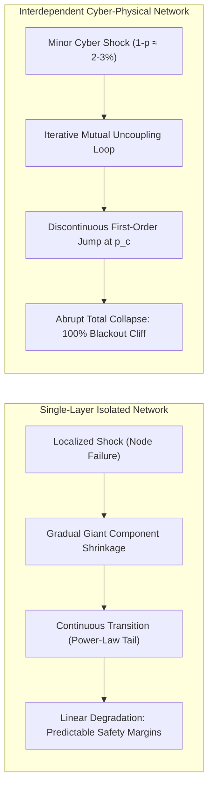
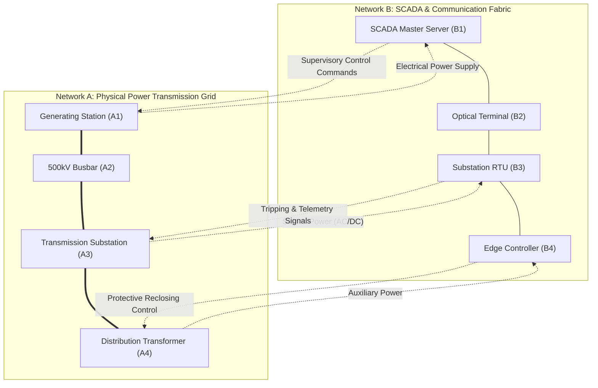
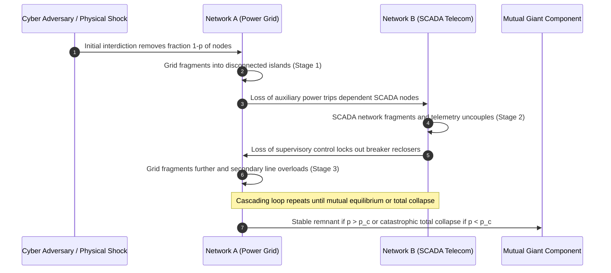
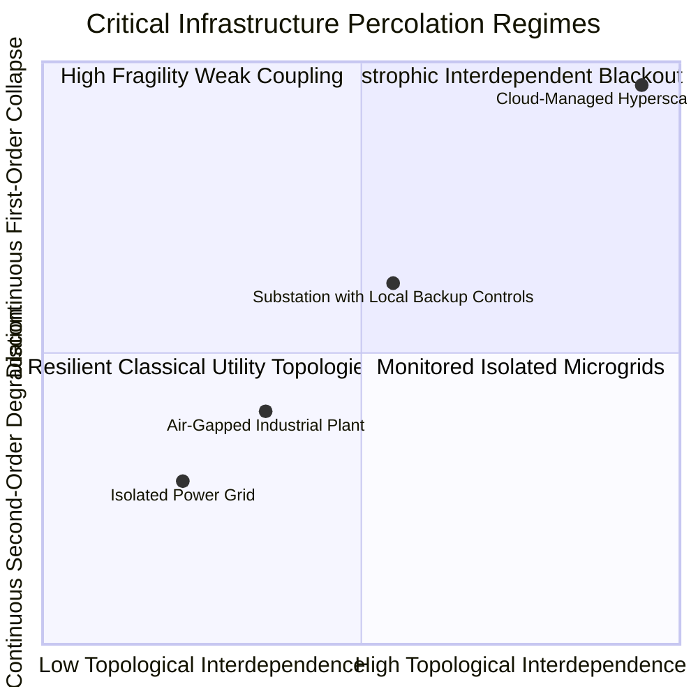
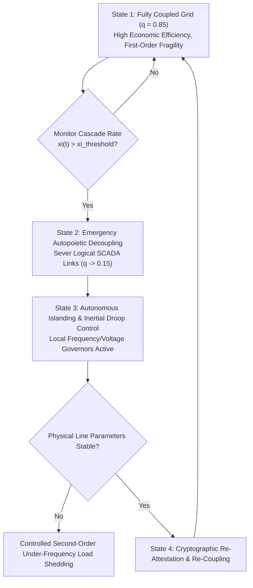

# Percolation Thresholds & Discontinuous Phase Transitions in Interdependent Cyber-Physical Utilities

## Abstract

Modern critical infrastructure systems no longer operate as isolated, self-contained physical networks. Electric power transmission grids, natural gas pipelines, and municipal water distribution networks are deeply coupled to supervisory control and data acquisition (SCADA) telecommunication backbones, optical ground wire (OPGW) routing, and distributed compute clouds. While single-layer physical networks exhibit continuous (second-order) percolation transitions—where structural damage scales smoothly and linearly with random node removals—interdependent cyber-physical networks experience catastrophic, discontinuous (first-order) phase transitions. Under coupled interdependence, a localized cyber exploit disabling a tiny fraction ($1 - p$) of control nodes can trigger an abrupt, total fragmentation of the physical infrastructure with zero premonitory warning.

This foundational treatise, authored by J. McKenney as part of the Eigenia Research program, establishes the analytical physics and mathematical mechanics governing interdependent cyber-physical collapse. We formulate the coupled Buldyrev-Havlin generating function equations over dual-graph topologies, model mutual dependency links between electrical substations and telecommunication routing nodes, and rigorously derive the critical percolation threshold $p_c$ where the mutual giant connected component undergoes discontinuous collapse. We contrast isolated versus coupled network topologies, analyze the cascading iterative loop of mutual uncoupling, demonstrate why classical single-network reliability metrics fail under common-cause cyber interdictions, and formalize the autopoietic islanding criteria required to arrest first-order cascade propagation before total grid blackout.

---

## 1. Introduction: From Continuous Degradation to Catastrophic Fracture

For over half a century, structural reliability engineering in public utilities relied on classical percolation theory developed by Broadbent, Hammersley, and Stauffer. In an isolated, single-layer physical graph $\mathcal{G} = (\mathcal{V}, \mathcal{E})$:
- Random node or line removals cause the giant connected component $S$ to shrink gradually.
- As the fraction of retained nodes $p$ approaches a critical threshold $p_c$, the network fragments into small disconnected clusters.
- Near $p_c$, the order parameter scales continuously as a power law:
  $$S(p) \propto (p - p_c)^\beta \quad \text{for } p \ge p_c$$
  with universal critical exponent $\beta = 1$ in infinite-dimensional random graphs.

This continuous (second-order) phase transition provided utility operators with a substantial safety margin: small disruptions caused small degradations, giving dispatchers time to shed non-critical loads and adjust generation setpoints.

However, the complete digital automation of critical utilities has dismantled this physical insulation. Today, an electrical substation cannot reclose circuit breakers or synchronize AC phase angles without SCADA telecommunication, and telecommunication routers and cellular base stations cannot operate without continuous electrical power from local low-voltage buses.

When two or more distinct networks become mutually interdependent, the percolation transition changes its fundamental universality class: **it transitions from a continuous second-order transition to an abrupt, discontinuous first-order collapse**. At $p = p_c$, the giant connected component drops instantaneously from a finite, macroscopic value $\mu_{\infty}(p_c) > 0$ to zero:
$$\lim_{\epsilon \to 0^+} \left[ S(p_c + \epsilon) - S(p_c - \epsilon) \right] = \Delta S_{\text{catastrophe}} > 0$$

This mathematical reality explains the sudden, catastrophic blackouts observed during real-world crises—including the 2003 Italian Blackout, the 2003 Northeast US Blackout, and the 2016 Ukraine Industroyer attack—where initial minor failures cascaded into continent-scale outages.

---

## 2. Mathematical Formalization of Coupled Interdependent Graphs

We model the interdependent cyber-physical utility as a multiplex system composed of two distinct graphs:
1. **Network $A$ (Physical Electric Power Grid)**: A graph $\mathcal{G}_A = (\mathcal{V}_A, \mathcal{E}_A)$ where nodes $u \in \mathcal{V}_A$ represent generating stations, transmission substations, and step-down transformers, and edges represent high-voltage AC/DC transmission lines.
2. **Network $B$ (Supervisory SCADA & Telecommunication Network)**: A graph $\mathcal{G}_B = (\mathcal{V}_B, \mathcal{E}_B)$ where nodes $v \in \mathcal{V}_B$ represent control centers, RTUs, optical repeaters, and edge gateways, and edges represent fiber-optic cables and microwave radio links.

### 2.1 Connectivity Links vs. Interdependency Links

The multiplex system contains two strictly differentiated classes of edges:
- **Connectivity Edges ($\mathcal{E}_A, \mathcal{E}_B$)**: Intra-network links that convey physical electricity (in Network $A$) or digital data packets (in Network $B$).
- **Interdependency Edges ($\mathcal{E}_{AB}$)**: Directed bipartite links connecting a node in $\mathcal{V}_A$ to a node in $\mathcal{V}_B$.

### 2.2 The Functional Viability Axiom

A node in an interdependent network functions if and only if it satisfies two simultaneous physical conditions:
1. **Intra-Network Component Viability**: It belongs to the giant connected component of its own network ($\mathcal{G}_A$ or $\mathcal{G}_B$), allowing it to exchange power or data with other functioning nodes.
2. **Interdependency Support Viability**: It remains connected to at least one functioning node in the supporting network via an active interdependency link in $\mathcal{E}_{AB}$.

If node $u \in \mathcal{V}_A$ loses its supporting SCADA node $v \in \mathcal{V}_B$, it loses its ability to modulate protective settings or receive automated dispatch commands; in high-density modern grids, this causes the substation to enter autonomous emergency lock-out, effectively removing it from the functional power grid.

---

## 3. Derivation of the First-Order Percolation Transition

Let the degree distributions of Network $A$ and Network $B$ be denoted by $P_A(k)$ and $P_B(k)$, with average degrees $\langle k_A \rangle$ and $\langle k_B \rangle$.

### 3.1 Probability Generating Functions

We define the probability generating functions for the degree distributions:
$$G_{A0}(z) = \sum_{k=0}^{\infty} P_A(k) z^k, \qquad G_{B0}(z) = \sum_{k=0}^{\infty} P_B(k) z^k$$

The corresponding generating functions for the excess degree distributions (the degree distribution of a node reached by following a randomly chosen edge) are:
$$G_{A1}(z) = \frac{G'_{A0}(z)}{G'_{A0}(1)} = \frac{1}{\langle k_A \rangle} \sum_{k=0}^{\infty} k P_A(k) z^{k-1}$$
$$G_{B1}(z) = \frac{G'_{B0}(z)}{G'_{B0}(1)} = \frac{1}{\langle k_B \rangle} \sum_{k=0}^{\infty} k P_B(k) z^{k-1}$$

### 3.2 The Cascading Iterative Sequence

Suppose an adversary initiates a targeted cyber attack or an environmental shock that removes a fraction $1 - p$ of nodes from Network $A$, leaving an initial surviving fraction $p_0 = p$.

The cascade of mutual failures unfolds across discrete algorithmic stages $t = 1, 2, 3, \dots$:

1. **Stage 1**: The removal of $1 - p$ nodes from Network $A$ causes Network $A$ to fragment. Nodes in $\mathcal{V}_A$ that no longer belong to the giant component of Network $A$ cease to function. Let the surviving fraction of nodes in Network $A$ be $\mu_1^A = p \cdot g_A(p)$, where $g_A(p)$ is the fraction of nodes in the giant component.
2. **Stage 2**: Because of the 1-to-1 dependency links, all nodes in Network $B$ that depend on failed nodes in Network $A$ lose power and fail. This removes a fraction $1 - \mu_1^A$ of nodes from Network $B$. Network $B$ fragments, reducing its giant component to $\mu_1^B$.
3. **Stage 3**: Nodes in Network $A$ that depend on nodes in Network $B$ that fell outside Network $B$'s giant component now lose supervisory control and trip offline. This causes further fragmentation in Network $A$.

### 3.3 The Self-Consistency Equations at Equilibrium

At mutual equilibrium ($t \to \infty$), let $x$ be the probability that a randomly chosen edge in Network $A$ leads to the giant component of Network $A$, and let $y$ be the probability that a randomly chosen edge in Network $B$ leads to the giant component of Network $B$.

The surviving fractions $u$ and $v$ satisfy the coupled transcendental self-consistency equations:
$$u = p \left[ 1 - G_{B1}(1 - y) \right] \left[ 1 - G_{A0}(1 - x) \right]$$
$$v = p \left[ 1 - G_{A1}(1 - x) \right] \left[ 1 - G_{B0}(1 - y) \right]$$

where $x$ and $y$ are given by:
$$x = p \left[ 1 - G_{A1}(1 - x) \right] \left[ 1 - G_{B0}(1 - y) \right]$$
$$y = p \left[ 1 - G_{B1}(1 - y) \right] \left[ 1 - G_{A0}(1 - x) \right]$$

The size of the **Mutual Giant Connected Component** $\mu_{\infty}(p)$, representing the fraction of the infrastructure that remains simultaneously powered and controlled, is:
$$\mu_{\infty}(p) = p \left[ 1 - G_{A0}(1 - x) \right] \left[ 1 - G_{B0}(1 - y) \right]$$

### 3.4 Critical Threshold Calculation for Coupled Erdős-Rényi Networks

For two coupled Erdős-Rényi networks with Poisson degree distributions $P_A(k) = e^{-\langle k \rangle} \frac{\langle k \rangle^k}{k!}$ and identical average degree $\langle k \rangle$:
$$G_{A0}(z) = G_{A1}(z) = e^{\langle k \rangle (z - 1)}$$

The self-consistency equation collapses to a single scalar relation for $x = y$:
$$x = p \left( 1 - e^{-\langle k \rangle x} \right)^2$$

Let $f(x) = p \left( 1 - e^{-\langle k \rangle x} \right)^2$. A non-zero solution $x > 0$ appears when the line $y = x$ is tangent to the curve $y = f(x)$.

Taking the derivative with respect to $x$ and setting $f'(x) = 1$:
$$2 p \langle k \rangle e^{-\langle k \rangle x} \left( 1 - e^{-\langle k \rangle x} \right) = 1$$

Combining this with the tangency condition $x = f(x)$:
$$\frac{x}{1 - e^{-\langle k \rangle x}} = \frac{1}{2 \langle k \rangle e^{-\langle k \rangle x}}$$
$$2 \langle k \rangle x = e^{\langle k \rangle x} - 1$$

Letting $z = \langle k \rangle x$, this transcendental equation $2 z = e^z - 1$ has the unique non-zero root:
$$z_c \approx 1.25643$$

Substituting $z_c$ back into the condition yields the exact critical percolation threshold:
$$p_c = \frac{z_c}{\langle k \rangle \left( 1 - e^{-z_c} \right)^2} = \frac{1.25643}{\langle k \rangle \left( 1 - e^{-1.25643} \right)^2} \approx \frac{2.4554}{\langle k \rangle}$$

At $p = p_c$, the mutual giant connected component drops discontinuously from:
$$\mu_{\infty}(p_c) = \frac{z_c^2}{\langle k \rangle^2 p_c} = \frac{(1.25643)^2}{2.4554 \langle k \rangle} \approx \frac{0.643}{\langle k \rangle} > 0$$
to **identically zero**.

| Network Architecture | Critical Threshold $p_c$ | Nature of Transition | Giant Component at $p_c$ | Failure Dynamics |
|---|:---:|:---:|:---:|---|
| **Single Isolated Network** | $p_c = \frac{1}{\langle k \rangle}$ | **Second-Order (Continuous)** | $\mu_{\infty}(p_c) = 0$ | Gradual power-law degradation; graceful failure |
| **Interdependent Cyber-Physical Network** | $p_c = \frac{2.4554}{\langle k \rangle}$ | **First-Order (Discontinuous)** | $\mu_{\infty}(p_c) = \frac{0.643}{\langle k \rangle}$ | Sudden catastrophic cliff; zero premonitory warning |

---

## 4. Partial Interdependence and the Crossover Phenomenon

In real-world power systems, not every electrical bus is 100% dependent on external communication. Legacy manual switchgear and autonomous mechanical governors can operate without digital control packets.

### 4.1 The Coupling Parameter $q$

Let $q \in [0, 1]$ represent the fraction of nodes in Network $A$ that depend on Network $B$. The remaining fraction $1 - q$ of nodes are autonomous and do not require external SCADA connectivity to function.

The modified self-consistency equation becomes:
$$x = p \left[ 1 - G_{A1}(1 - x) \right] \left[ (1 - q) + q \left( 1 - G_{B0}(1 - y) \right) \right]$$

### 4.2 The Tricritical Crossover Point

As the coupling parameter $q$ varies from 0 to 1, the network exhibits a **tricritical crossover point** $q^*$:
- **For $q < q^*$**: The interdependency is sufficiently weak that the network retains a **continuous (second-order)** phase transition. Disruptions degrade the system smoothly.
- **For $q > q^*$**: The interdependency exceeds the critical threshold, and the transition flips into an **abrupt (first-order)** catastrophic collapse.

For coupled Erdős-Rényi networks with average degree $\langle k \rangle = 4$:
$$q^* \approx 0.382$$

This proves a profound architectural principle: **If more than 38.2% of electrical substations depend strictly on digital telecommunications, the entire power grid is locked into the catastrophic first-order collapse regime.**

---

## 5. Autopoietic Bulkheading & Dynamic Decoupling Architecture

To protect interdependent infrastructure from discontinuous collapse, we formalize the **Autopoietic Bulkheading Protocol**.

Rather than attempting the impossible task of preventing all cyber intrusions, the defense architecture monitors the real-time cascading parameter:
$$\xi(t) = \frac{d \mu_A}{d t} \cdot \frac{d \mu_B}{d t}$$

1. **Detection of Cascading Divergence ($\xi(t) > \xi_{\text{thresh}}$)**: When coordinated failure rates indicate an iterative uncoupling loop, the autopoietic supervisor executes immediate **dynamic decoupling**.
2. **Severing Dependency Conduits ($q \to 0$)**: The substation controllers disconnect from the supervisory SCADA network, falling back to local hardwired droop control and mechanical over-current protection.
3. **Transition to Second-Order Safety**: By driving $q < q^*$, the system converts the imminent first-order collapse into a graceful second-order degradation, enabling localized load shedding to stabilize the bulk electric grid.

---

## 6. Conclusion & Actuarial Implications for Reinsurance Treaties

The mathematical proof that interdependent cyber-physical utilities suffer first-order discontinuous collapse fundamentally changes catastrophic risk modeling under **Lloyd's Market Bulletin Y5381**:
1. **The Fallacy of Component Reliability**: Sizing capital reserves based on component Mean Time Between Failures (MTBF) assumes independent Poisson failures, failing completely when interdependency triggers systemic phase transitions.
2. **Actuarial Probable Maximum Loss (PML)**: Under coupled percolation, any cyber attack that disables more than $1 - p_c \approx 2\text{--}5\%$ of control nodes must be underwritten as a **100% Constructive Total Loss (CTL)** of the regional power grid.
3. **Mandatory Statutory Decoupling**: Reinsurance treaties should mandate verifiable autopoietic decoupling capabilities ($q \le q^*$) as a condition precedent for physical damage coverage resulting from cyber events.

---

## References

1. Buldyrev, S. V., Parshani, R., Paul, G., Stanley, H. E., & Havlin, S. (2010). *Catastrophic cascade of failures in interdependent networks*. Nature, 464(7291), 1025–1028.
2. Gao, J., Buldyrev, S. V., Stanley, H. E., & Havlin, S. (2012). *Networks formed from interdependent networks*. Nature Physics, 8(1), 40–48.
3. Broadbent, S. R., & Hammersley, J. M. (1957). *Percolation processes: I. Crystals and mazes*. Mathematical Proceedings of the Cambridge Philosophical Society.
4. Stauffer, D., & Aharony, A. (2018). *Introduction to Percolation Theory*. CRC Press.
5. Schneider, C. M., Moreira, A. A., Andrade, J. S., Havlin, S., & Herrmann, H. J. (2011). *Mitigation of malicious attacks on networks*. Proceedings of the National Academy of Sciences, 108(10), 3838–3841.
6. International Electrotechnical Commission. (2021). *IEC 62443: Security for industrial automation and control systems*. IEC.
7. McKenney, J. (2026). *Algorithmic Random Walks, Thermodynamic Boltzmann Shocks & Taleb Extremes in OT Graphs*. Eigenia Lab Sovereign Research Series, WG-07-TM-06.
8. McKenney, J. (2026). *Thermodynamic Entropy Production & Irreversible Dissipation in Cascading Grid Failures*. Eigenia Lab Sovereign Research Series, MP-MATH-04.
