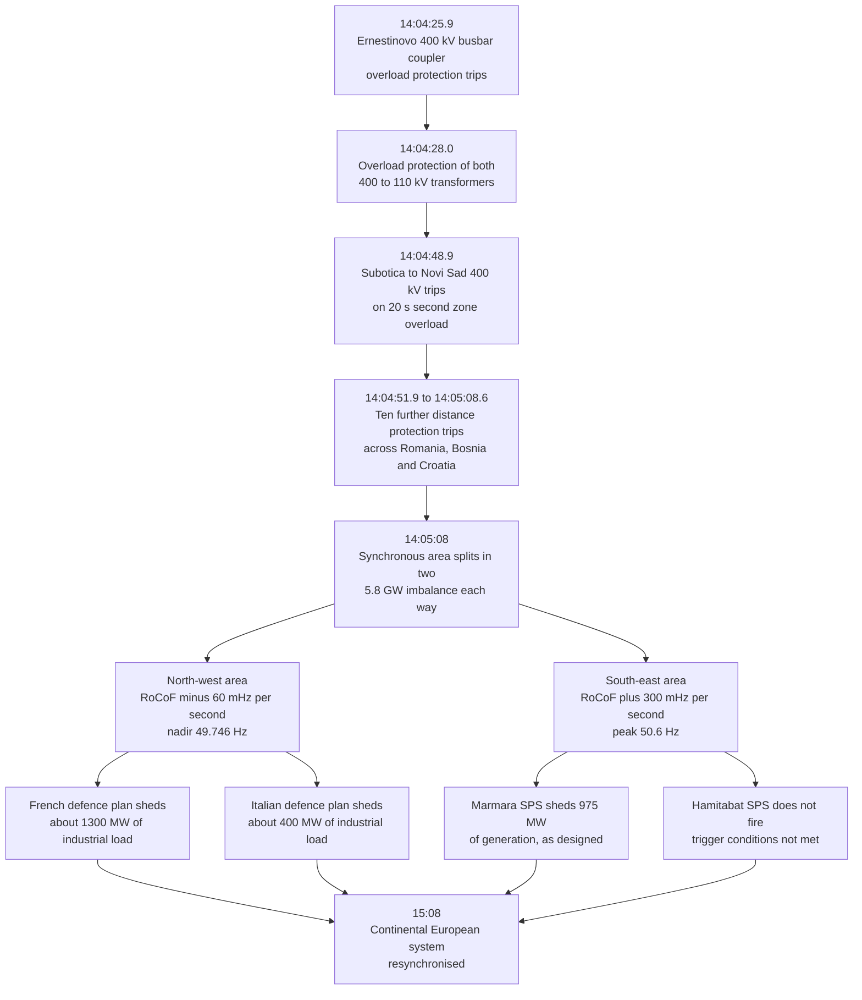

| Working group | Document type | Primary sources cited | Classification |
| :--- | :--- | :--- | :--- |
| WG-04-CF Cascading Failures | Eigenia Labs working paper | AEMO, AEMC, EirGrid, ERCOT, NERC, ENTSO-E, National Grid ESO, Ofgem | Open, non-normative |

## 1. What this paper is, and what it is not

Project Inertia is Eigenia Labs' inertia research track, written by J. McKenney and published by Eigenia Labs as working-group output.

It is **not the ENTSO-E workstream of the same name**. Eigenia Labs has no affiliation with ENTSO-E, and nothing here is ENTSO-E output, position or endorsement. The collision is real and this paragraph exists because of it.

Where this paper reports something ENTSO-E found, measured or published, it cites ENTSO-E's own document on the line where the claim appears. There is exactly one such document in its evidence: the ICS Investigation Expert Panel final report on the Continental Europe synchronous area separation of 8 January 2021 [10], on which section 4 is built. This paper reports no ENTSO-E inertia study, because none is in its evidence base; section 7 says so again.

Everything else is labelled where it appears. A **cited fact** states what a system operator measured, published or set, and carries a bracket citation to the primary document. **Working group synthesis** is framing, arithmetic on published numbers, and projection; section 6 is entirely synthesis and says so inside each claim.

The rule the Eigenia corpus runs on: a paper may present original judgement under its author's name, and may not be the source of record for an empirical fact about someone else's system. If a number here describes a real grid, its citation points at the operator, not at another Eigenia paper.

## 2. Inertia defined and measured

### 2.1 The definition operators use

AEMO takes its definition from the National Electricity Rules: inertia is the "contribution to the capability of the power system to resist changes in frequency by means of an inertial response from a generating unit, network element or other equipment that is electro-magnetically coupled with the power system and synchronised to the frequency of the power system" [1].

Two conditions do the work: electromagnetically coupled, and synchronised. A machine that satisfies both contributes inertia whether or not anyone asked it to.

AEMO states the consequence: asynchronous technologies "such as modern wind turbines, solar inverters and batteries, are connected to the power system via a power electronic interface and do not bring any inertia naturally to the power system because they are electrically decoupled" [1]. Synchronous machines, "typically heavy, weighing in the tens and hundreds of tonnes", instead "inherently slow down a change in power system frequency immediately after an imbalance" [1].

### 2.2 The units, and why they are not cosmetic

AEMO's glossary gives the unit as MWs, megawatt-second [1]. ERCOT publishes in GW.s [14]. EirGrid publishes in MVA.s and states its method in the same breath: "Inertia is monitored in real time by summing the inertial contribution (Unit MVA rating x H constant) of all on-line synchronous units" [3].

That clause is the most operationally loaded sentence in this evidence. EirGrid's real-time inertia number counts on-line synchronous units and nothing else. A grid-forming battery delivering fast active power is not in the sum. Any argument that inverter fleets are quietly replacing retiring inertia has to contend with a live operator measurement that structurally cannot see them.

### 2.3 The relation

The theoretical maximum rate of change of frequency immediately following a disturbance is given by Basakarad et al. [7] as

$$\mathrm{RoCoF}_{\max} = \left.\frac{df}{dt}\right|_{t=0^{+}} = \frac{P_k \, f_n}{2 \sum_{i \neq k} H_i S_i}$$

where $f_n$ is nominal frequency in Hz, $P_k$ the disturbance in MW, $H_i$ the inertia constant of the $i$th generator in seconds, and $S_i$ its nominal power in MVA. The sum excludes the tripped element $k$: if what trips is itself synchronous, its inertia leaves the denominator as its power leaves the numerator, and the system is hit twice.

Measured RoCoF is usually lower than this maximum, because "frequency measurement inevitably involves a signal filtering process", and it depends heavily on the measurement window length [7]. A RoCoF figure without its window is not comparable.

### 2.4 What fast response is, and is not

AEMO defines fast frequency response as delivery of a rapid active power change "in a timeframe of two seconds or less, to correct a supply-demand imbalance" [8]. EirGrid's service timing diagram places its FFR product starting from 150 ms after the disturbance, ahead of primary operating reserve [3].

AEMO separates synthetic inertia from FFR by mechanism, not speed: "synthetic inertial response from a GFM BESS is dependent on the control system logic, inverter design and configuration" [8], where synchronous inertial response comes from kinetic energy in a coupled rotating mass. One is present whether the controller is healthy; the other only while it behaves. No AEMO millisecond figure for synthetic inertia delivery appears in this evidence, and EirGrid's 150 ms is a different grid and service.

## 3. The operating envelope today

### 3.1 AEMO and the NEM

AEMO calculates two thresholds for each inertia sub-network: a minimum threshold level, the inertia needed to hold "a satisfactory operating state when the inertia sub-network is islanded", and a secure operating level, the inertia needed for "a secure operating state" under the same condition [1]. Two numbers, two operating states, one system. Quoting one as "the" inertia requirement discards the distinction the methodology exists to make.

AEMO publishes the physical time budget a given RoCoF buys, measured as the time to fall from 50 Hz to 49 Hz [1]:

| RoCoF (Hz/s) | Time to reach 49 Hz (seconds) |
| :--- | :--- |
| 4 | 0.25 |
| 2 | 0.5 |
| 1 | 1 |
| 0.5 | 2 |

Those durations are not arbitrary. AEMO's December 2016 letter to the Essential Services Commission of South Australia gives the two National Electricity Rules ride-through standards: the automatic standard, RoCoF outside minus 4 Hz/s to 4 Hz/s "for more than 0.25 seconds", and the minimum standard, minus 1 Hz/s to 1 Hz/s "for more than one second" [9]. They apply to specific connected plant, not as one NEM-wide tolerance.

The frequency bands come from the AEMC Reliability Panel's Frequency Operating Standard, effective 1 January 2020: normal band 49.85 to 50.15 Hz, normal excursion band 49.75 to 50.25 Hz, operational tolerance band 49.0 to 51.0 Hz, extreme excursion tolerance limit 47.0 to 52.0 Hz [2]. After a generation or load event, frequency must return to the normal band within 5 minutes [2].

This paper gives no NEM regional inertia figure in MWs. AEMO publishes per-region levels in appendices this working group did not open, and an unopened appendix is no licence to estimate.

### 3.2 EirGrid, an in-service floor

EirGrid publishes its current all-island operating requirements directly [3]:

| Parameter | Published value |
| :--- | :--- |
| Minimum synchronous area inertia | 23,000 MVA.s |
| Maximum rate of change of frequency | plus or minus 1.0 Hz/s |
| Frequency nadir and zenith limits | 49.0 Hz and 51.0 Hz |
| Minimum large synchronous units on line | 7, under trial |
| System non-synchronous penetration limit | 75% |

EirGrid also states the logic: "The current inertia floor allows us to maintain the theoretical RoCoF below 0.6 Hz/s for loss of the largest generation infeed (which is approx. 450 MW / 4000 MVA.s)" [3].

Check that against section 2.3. Reading the notation as a 450 MW infeed carrying about 4,000 MVA.s of its own inertia, the post-contingency sum is 23,000 minus 4,000, and at 50 Hz:

$$\mathrm{RoCoF}_{\max} = \frac{450 \times 50}{2 \times (23{,}000 - 4{,}000)} = \frac{22{,}500}{38{,}000} = 0.592\ \mathrm{Hz/s}$$

That is the working group's arithmetic, not EirGrid's. It lands 0.008 Hz/s under EirGrid's published "below 0.6 Hz/s", which supports the reading without confirming it; if the 4,000 MVA.s is something else, discard the check rather than defend it.

The floor also sits well inside the limit it protects. Holding 1.0 Hz/s for the same infeed needs 11,250 MVA.s post-contingency, about 15,250 MVA.s pre-contingency. EirGrid operates to 23,000. That gap is margin, and margin erodes first.

### 3.3 ERCOT, and the figure that keeps being misquoted

ERCOT defines Critical Inertia as "the minimum inertia level at which a system can be reliably operated with current frequency control practices" [14]. For a 2,750 MW loss, its two largest units, ERCOT derives that frequency must take at least 0.416 seconds to fall from 59.7 Hz to 59.3 Hz, the first-stage under-frequency load shed trigger, for load resources to respond in time. A regression across 13 dynamic simulation cases put critical inertia at 94 GW.s for that criterion, and ERCOT states: "Based on this analysis, and with a safety margin, ERCOT has identified its Critical Inertia to be 100 GW*s" [14].

**100 GW.s is the System Operating Limit.** The 105 GW.s figure circulating in secondary commentary is something else: ERCOT's control-room rule states that "when system inertia drops below 105,000 MW*s, the ERCOT Control Room will take actions to restore system inertia to levels at or above 105,000 MW*s" [14]. That is a restoration trigger set with margin above the limit. ERCOT's four-level alarm scheme sits around it: green at or above 120,000 MW.s, yellow 110,000 to 119,999, orange 100,001 to 109,999, red at or below 100,000 [14].

Reporting 105 GW.s as ERCOT's critical inertia converts an operational cushion into a physical boundary and deletes 5 GW.s of the margin the cushion exists to preserve.

ERCOT's lowest recorded inertia as of that paper was 130 GW.s, on 27 October 2017 [14]. ERCOT's published extreme instantaneous renewable condition is a combined wind and solar penetration record of 75.67%, set on 29 March 2024 at 2:13 p.m., with 34,958 MW of renewable generation at that instant [15]. That is one instant, not a sustained state, and not simultaneous with any capacity-share figure.

### 3.4 Ride-through requirements, and a retrofit that already happened

NERC's Reliability Standard PRC-029-1, approved 8 October 2024, requires each generator owner to ensure every inverter-based resource rides through frequency excursions where "the absolute rate of change of frequency (RoCoF) magnitude is less than or equal to 5 Hz/second, unless a documented hardware limitation exists" [4]. The standard defines its own measurement: RoCoF "is calculated as the average rate of change for multiple calculated system frequencies for a time period of greater than or equal to 0.1 second", and "is not calculated during the fault occurrence and clearance" [4].

In Great Britain the move from vector shift to RoCoF protection, and from 0.125 Hz/s to 1 Hz/s with a 500 ms definite time delay, is in service rather than proposed. G99's amendment log records implementation of the Authority's decision on DC0079 [5]. The retrofit applied "retrospectively to all generation <50MW", with compliance due "by 31 August 2022" [5].

It did not clear the older relays off the system. The GB system operator's frequency risk and control policy states that "the most sensitive RoCoF protection on the GB system is set at 0.125Hz/s, with little to no minimum duration threshold. There are further tranches of RoCoF relays at other thresholds" [6]. The AEMC records the same asymmetry: "National Grid ESO notes that some legacy wind farms have lower RoCoF ride through capability" [6].

So the accurate statement is narrow. New and retrofitted small generation in Great Britain must withstand 1 Hz/s for 500 ms, and the system still carries relays as sensitive as 0.125 Hz/s.

### 3.5 An operational setting is not a limit

Three numbers above are routinely reported as measured physical limits and are not. That is a pattern, not three coincidences.

| Number | What it is often called | What the primary source says |
| :--- | :--- | :--- |
| 105 GW.s | ERCOT's critical inertia | Control-room restoration trigger; the System Operating Limit is 100 GW.s [14] |
| 0.125 Hz/s | The RoCoF measured in GB on 9 August 2019 | A relay disconnection threshold; the report gives no measured system-wide RoCoF [11] |
| 49.85 Hz | An under-frequency load shedding trip point | The bottom of the NEM normal operating frequency band [2] |

Each error runs the same direction: a value an engineer chose for operational convenience is reported as a value someone measured. The margin between setting and real limit then vanishes from the analysis, and that margin is what the setting exists to protect. Ask which kind of number you hold before you argue from it.

## 4. System separation, 8 January 2021

The failure mode that matters at low inertia is not a large generator tripping. It is a synchronous area coming apart along a line nobody had drawn, with an imbalance sized by pre-event flow rather than unit rating. ENTSO-E's final report on the Continental Europe separation of 8 January 2021 is the highest-resolution primary account of that mode available here [10].

### 4.1 Pre-event condition

Flow "totalled approx. 5.8 GW across the separation line at the time when the initial event took place. However, this high load flow, particularly on the busbar coupler, was not forecasted correctly in the different respective security calculations" [10]. ENTSO-E attributes the cause to "large pan-European electric power flows and low stability margins", and states plainly that "the incident on 8 January revealed no issue in relation to generation adequacy or high shares of renewables having an impact" [10].

That statement is load-bearing and this paper does not soften it: the event shows what a separation does once it starts, not that renewables caused one.

### 4.2 The sequence

From the first protection operation at Ernestinovo to a divided synchronous area took 43 seconds, every step a protection device acting on its own local measurement; ten distance protection trips across Transelectrica, NOS BiH and HOPS are logged to tenths of a second in the report's sequence-of-events table [10]. At separation the north-west area carried a 5.8 GW deficit and the south-east the mirrored surplus. North-west frequency fell at "a RoCoF of 60 mHz/s (deduced from the frequency measured at the centre of inertia)" to 49.746 Hz, arrested by the automatic frequency-dependent French and Italian system defence plans, "approximately 1,300MW" and "approximately 400MW", both disconnecting industrial loads under standing contracts [10]. South-east frequency rose at 300 mHz/s to 50.6 Hz, and resynchronisation came at 15:08 CET [10].

### 4.3 What the numbers mean, and what they do not

Cited: the north-west RoCoF was 60 mHz/s, or 0.06 Hz/s, roughly a factor of 17 below the 1 Hz/s minimum access standard AEMO applies to connected plant [9], and below even the most sensitive legacy GB relay setting of 0.125 Hz/s [6]. Continental Europe is a very large synchronous area and 5.8 GW moved its frequency slowly.

Working group synthesis: that is why the separation mode deserves attention rather than dismissal. The imbalance was benign in RoCoF terms because the inertia behind it was enormous, and it was sized by scheduled cross-border flow rather than by the largest unit, flow ENTSO-E states was not correctly forecast [10]. An imbalance sized by commercial flow, landing on a synchronous area whose inertia is falling, is a different problem from one sized by the largest generator. Nothing here quantifies how that ratio moves over time; section 6 states the assumption rather than burying it.

One scope correction. ENTSO-E states that "only a very small number of private and industrial loads could not be supplied, meaning that overall the incident had no major influence on the security of supply of European consumers" [10]. The loads shed in France and Italy were large industrial customers on standing interruptible contracts, not the general public. Cite this event for its causal chain, not as a mass blackout.

## 5. Protection behaving correctly and making things worse

In each case below a protection system did what it was configured to do, on locally available information, and the aggregate outcome was worse than if it had done nothing. None is a malfunction. Three are quoted from primary reports that say so.

### 5.1 South Australia, 28 September 2016

Two tornadoes damaged a single circuit and a double circuit 275 kV transmission line "some 170 km apart", three lines in all, and "a sequence of faults in quick succession resulted in six voltage dips on the SA grid over a two-minute period at around 4.16 pm" [13].

This was not a ride-through failure. AEMO's final report states: "nine wind farms in the mid-north of SA exhibited a sustained reduction in power as a protection feature activated. For eight of these wind farms, the protection settings of their wind turbines allowed them to withstand a pre-set number of voltage dips within a two-minute period... A sustained generation reduction of 456 megawatts (MW) occurred over a period of less than seven seconds" [13].

AEMO draws the line where it belongs: "Wind turbines successfully rode through grid disturbances. It was the action of a control setting responding to multiple disturbances that led to the Black System" [13]. About 700 ms after the last wind farm reduced output, flow on the Heywood interconnector reached the level that activated a special protection scheme, which tripped it [13]. All supply to South Australia was lost at 4.18 pm, 87 seconds after the sequence began, affecting some 850,000 customers [13].

Eight machines counted dips correctly. The count was right. The threshold was configured. The system went black.

### 5.2 Great Britain, 9 August 2019

Three lightning strikes near the Eaton Socon to Wymondley circuit caused a single phase to earth fault at 16:52:33. National Grid ESO is unambiguous that transmission protection was not at fault: "the protection systems on the transmission system operated correctly to clear the lightning strike and the associated voltage disturbance was in line with what was expected" [11].

About 150 MW of embedded generation tripped on vector shift protection at that instant. Hornsea, generating 799 MW, deloaded to 62 MW between 16:52:33.531 and 16:52:33.835, a loss of 737 MW, and at 16:52:34 Little Barford's steam turbine tripped 244 MW independently [11].

The part that matters here: at 16:52:34, "approximately 350MW of embedded generation trips on RoCoF protection", taking cumulative infeed loss to 1,481 MW [11]. The report defines the relay: "these relays disconnect the generators if the RoCoF is greater than 0.125Hz/s, disconnecting them from the system safely" [11]. Those relays worked. Each measured a local rate of change, compared it to its setting, and opened. The combined effect added roughly 350 MW to a deficit already driving the frequency down.

Frequency was arrested at 49.1 Hz at 16:52:58, then Little Barford's GT1A tripped 210 MW at 16:53:31 and frequency fell to 48.8 Hz [11]. At 16:53:49.398 the low frequency demand disconnection scheme "was correctly triggered at 48.8Hz" and disconnected 1,152,878 customers and 931 MW [11]. Ofgem's finding on the system operator: it "have not identified any failures by the ESO to meet its requirements which contributed to the outage" [12].

The scheme that took a million customers off supply is the scheme that stopped the transmission system collapsing. Both are true, and the second is why the first is not a defect.

Worth separating, because the report separates it: about 60 Class 700 and Class 717 trains shut down, 30 needing a technician to physically reset. The operator "stated this was not how the train system had been specified to operate", since the specification says the trains "will continue to operate with supply frequency drops down to 48.5Hz" [11]. That is a specification failure, not a designed trip, and conflating the two makes designed protection look like malfunction.

### 5.3 Turkey, 8 January 2021

The cleanest example here, because both halves are in one report.

In the south-east area, as frequency rose to 50.6 Hz, an internal special protection scheme in the Marmara region "activated which prevented an overload on the important Bandirma-Bursa corridor by shedding 975 MW of power generation", 570 MW at Bandirma and 405 MW at Icdas [10]. A second Turkish scheme did not act, and ENTSO-E records why: "The Hamitabat SPS worked as designed and did not react as the conditions to trigger it were not met" [10].

One scheme fired and shed 975 MW into a system already 5.8 GW long. The other did not fire, and the report calls that correct too. Whether the aggregate was optimal is not a question either was built to answer, because neither can see it.

### 5.4 Inverter fleets, Odessa and Canyon 2

The inverter cases sit differently. NERC does not call the Odessa reductions correct behaviour; it calls them unexpected. It does establish that they came from settings and controls at each site rather than from the fault reaching the resource.

For the 9 May 2021 Odessa event, a single line to ground fault on a generator step-up transformer cleared in three cycles and 1,340 MW was lost: 192 MW of combined cycle plant, 1,112 MW of solar PV, 36 MW of wind [16]. NERC states: "None of the affected inverter-based resources were tripped consequentially by the fault itself. Rather, all reductions were due to inverter-level or feeder-level tripping or control system behavior within the resources" [16].

On 4 June 2022, a B phase to ground fault on the 345 kV system near Odessa, again cleared in three cycles, produced a total loss of 2,555 MW, of which 844 MW was synchronous generation and 1,711 MW solar PV, and frequency dropped to 59.7 Hz [17]. The combined loss "nearly exceeded the Texas Interconnection Resource Loss Protection Criteria" in BAL-003 [17].

The mechanism was documented earlier, in WECC territory. The Canyon 2 Fire of 9 October 2017 lost 682 MW on a 220 kV fault and 937 MW on a 500 kV fault near Serrano substation, with a Western Interconnection frequency nadir of 59.878 Hz; NERC attributes "the majority of inverter tripping" to "sub-cycle transient overvoltages and instantaneous protective action at the inverters" [18]. Blue Cut Fire, 16 August 2016, lost 1,200 MW of solar PV to erroneous frequency tripping and momentary cessation, a figure flagged here as secondary [18], [19].

### 5.5 The common structure

Across South Australia, Great Britain, Turkey and Odessa, every device acted on a locally correct measurement and none could see the aggregate. Dip counters count dips. RoCoF relays measure a local rate of change. Special protection schemes protect one corridor. Inverters protect their own semiconductors from a sub-cycle overvoltage. None of that is wrong, and the sum of it repeatedly turns a contained disturbance into a system event.

This is a coordination problem, not a component-quality problem. Better relays do not fix it, and neither does a stricter ride-through standard alone, though PRC-029-1 [4] and the G99 retrofit [5] both raise the floor. What changes the outcome is whether each device's setting was chosen with the aggregate in view, and the reports above give little evidence that it was.

## 6. Projection to 2030 and 2040

**Everything in this section is Eigenia Labs' own projection. None of it is a finding, none is attributable to any system operator, and no operator has endorsed it.** Each claim states its assumptions inline and what would falsify it. Any arithmetic shown uses published numbers and can be rerun.

This working group holds no inertia time series for any grid. It therefore does not forecast inertia levels; a paper that did so from this evidence base would be inventing data. It gives no year by which any named grid crosses a threshold, projects no future MWs or GW.s value, and attaches no probability to any claim. What can be projected is the shape of the envelope: what has to be true for a published floor to keep holding as its inputs move.

### 6.1 The inversion

Rearranging section 2.3 for the inertia needed to hold a chosen RoCoF ceiling gives

$$\sum_{i \neq k} H_i S_i = \frac{P_k \, f_n}{2 \, \mathrm{RoCoF}_{\mathrm{limit}}}$$

Evaluated at 50 Hz, assuming the lost infeed contributes no inertia of its own, as for an HVDC import:

| Largest single infeed $P_k$ | Inertia for a 1.0 Hz/s ceiling | Inertia for a 0.5 Hz/s ceiling |
| :--- | :--- | :--- |
| 450 MW | 11,250 MVA.s | 22,500 MVA.s |
| 750 MW | 18,750 MVA.s | 37,500 MVA.s |
| 1,000 MW | 25,000 MVA.s | 50,000 MVA.s |
| 1,500 MW | 37,500 MVA.s | 75,000 MVA.s |

Assumptions, stated so they can be attacked: single synchronous area; centre-of-inertia frequency; theoretical maximum RoCoF at $t = 0^{+}$; no credit for fast frequency response, governor action or load damping; the tripped infeed contributes no inertia. None of that is how an operator studies a contingency; the table is a scaling argument, not a study. At 60 Hz, multiply every figure by 1.2.

### 6.2 Projection to 2030

**Claim, Eigenia synthesis.** On synchronous areas the size of the all-island Irish system, the binding constraint through 2030 is growth in the largest single credible infeed, not the retirement rate of synchronous plant.

**Reasoning.** EirGrid holds 23,000 MVA.s against a largest infeed of about 450 MW [3]. From the table above, that floor at a 1.0 Hz/s ceiling covers an infeed of about 900 MW. Interconnector capacity, single-site industrial load and single-unit ratings all trend upward. Doubling the largest credible infeed consumes the entire distance between the published floor and the published limit without a single synchronous machine retiring.

This uses the table's assumption that the lost infeed carries no inertia; where it is synchronous, deduct its own inertia and the covered infeed falls.

**Falsifier.** An operator raising its published floor faster than its largest infeed grows, or publishing a largest-infeed figure that is flat.

**Second claim, Eigenia synthesis.** That projection depends on real-time inertia measurement continuing to count only synchronous machines.

**Reasoning.** EirGrid's stated method sums "Unit MVA rating x H constant of all on-line synchronous units" [3]; grid-forming inverters do not enter that sum today. AEMO describes synthetic inertial response as dependent on "control system logic, inverter design and configuration" [8], a different class of quantity from a rotating mass.

**Falsifier.** A system operator publishing a real-time inertia calculation that includes non-synchronous contributions, with a stated method. That change moves the denominator in section 6.1 and invalidates the claim above. It is a documentary test: read the operator's published method and see whether the sum changed.

### 6.3 Projection to 2040

**Claim, Eigenia synthesis.** As RoCoF ceilings rise toward the inverter ride-through envelope, the binding constraint migrates from the quantity of inertia to the time budget for protection and measurement.

**Reasoning, shown.** AEMO's table gives 0.25 seconds from 50 Hz to 49 Hz at 4 Hz/s [1]. PRC-029-1 requires RoCoF to be computed as an average "for a time period of greater than or equal to 0.1 second", and not during the fault [4]. At 4 Hz/s that minimum window consumes 40% of the budget before any device decides anything, and EirGrid's fastest published response product starts at 150 ms [3], 60% of it. They come from different jurisdictions and services and must not be added into one timeline.

**Falsifier.** A jurisdiction mandating a materially shorter RoCoF measurement window, or a sub-cycle measurement technique accepted into a published reliability standard on the strength of type testing, so that it no longer depends on a windowed average. Neither exists in this paper's evidence base today, which is why the claim stands; either would retire it.

**Third claim, Eigenia synthesis.** The dominant severe event by 2040 is a separation whose imbalance is sized by scheduled cross-region flow, not by the largest generating unit.

**Reasoning.** The 8 January 2021 separation split a 5.8 GW flow that ENTSO-E states "was not forecasted correctly in the different respective security calculations" [10]. Contrast the largest single-unit contingencies here: 450 MW for EirGrid [3] and 2,750 MW for ERCOT's two largest units [14]. Transfer volumes across seams are set by markets and generation siting; unit contingencies by plant ratings. No mechanism ties the first to the second.

**Falsifier.** Operators publishing separation-imbalance statistics that stay flat or fall while transfer volumes rise. This working group holds no such data, which is the point of stating the falsifier.

## 7. What this working group cannot establish

This is not a disclaimer. It lists things a reader might expect this paper to say and should notice that it does not.

**ENTSO-E inertia studies.** None are reported here. The only ENTSO-E document in this evidence is the 8 January 2021 separation report [10]. A claim of the form "ENTSO-E studies show that declining inertia increases system split risk" is not supported by this evidence and needs its own ENTSO-E citation wherever it appears.

**NEM regional inertia.** AEMO publishes minimum threshold and secure operating levels per region in appendices [1] this working group did not open. No NEM regional MWs figure appears here.

**Whether ERCOT's limit still stands.** The 100 GW.s figure is from ERCOT's April 2018 paper [14]; whether the System Operating Limit has since been revised was not checked.

**Whether ERCOT's penetration record still stands.** The 75.67% record of 29 March 2024 [15] may have been superseded; ERCOT's current fact sheet lists newer separate wind and solar records and does not restate it.

**ERCOT as a preview for other regions.** Not claimed here. No body in this evidence calls ERCOT a leading indicator for other interconnections on resource adequacy or weather stress. NERC's supported statement is narrower, about inverter performance: solar PV penetration "continues to grow rapidly in the ERCOT footprint and in many areas of North America" and those issues must be "proactively and immediately addressed" [17].

**ERCOT's inverter-based capacity share.** A figure of 43% circulates and matches no ERCOT primary source at any date checked; ERCOT's own fact sheets bracket it at 28.8% in November 2021 and 45.0% in August 2026. This paper states no capacity share.

**The GB RoCoF measured on 9 August 2019.** No measured system-wide value appears in the ESO report [11]; 0.125 Hz/s is a relay threshold. No wind penetration percentage for that day appears either, so none is given.

**South Australia transmission towers.** No count of damaged or fallen towers appears anywhere in AEMO's final report; Table 6 records three circuits noted "damaged towers bypassed" and no number [13]. That is a confirmed absence in the primary source, not a retrieval gap.

**Customer impact of the 8 January 2021 separation.** ENTSO-E gives MW of load and generation and no customer count anywhere in the report [10]. None is estimated here.

## 8. Bibliography

[1] AEMO, *Inertia Requirements and Shortfalls*, 1 July 2018.

[2] AEMC Reliability Panel, *A Frequency Operating Standard*, 1 January 2020.

[3] EirGrid, *Inertia Management on the Power Systems of Ireland and Northern Ireland*, March 2024.

[4] NERC, *Reliability Standard PRC-029-1*, 8 October 2024.

[5] Energy Networks Association, *Engineering Recommendation G99* Issue 2, DC0079; UK Power Networks, *Loss of Mains protection requirements*.

[6] NESO, *Frequency Risk and Control Policy*; AEMC, *System Rate of Change of Frequency*, 2022.

[7] N. Basakarad et al., *ROCOF importance in electric power systems with high renewables share*, 2020.

[8] AEMO, *Fast Frequency Response in the NEM*, 2017; *Quantifying Synthetic Inertia of a Grid-forming BESS*, 2024.

[9] AEMO, letter to ESCOSA, *Inquiry into Wind Farm and Inverter Generation*, December 2016.

[10] ENTSO-E, *Continental Europe Synchronous Area Separation on 08 January 2021*, final report, 15 July 2021, v2.0.

[11] National Grid ESO, *Technical Report on the events of 9 August 2019*, 6 September 2019.

[12] Ofgem, *9 August 2019 power outage report*, 3 January 2020.

[13] AEMO, *Black System South Australia 28 September 2016*, final report, March 2017.

[14] ERCOT, *Inertia: Basic Concepts and Impacts on the ERCOT Grid*, 4 April 2018.

[15] ERCOT, *ERCOT Monthly*, April 2024 edition.

[16] NERC and Texas RE, *Odessa Disturbance*, September 2021.

[17] NERC and Texas RE, *2022 Odessa Disturbance*, December 2022.

[18] NERC and WECC, *900 MW Fault Induced Solar Photovoltaic Resource Interruption Disturbance Report*, February 2018.

[19] Blue Cut Fire, 16 August 2016: Troutman Sanders Washington Energy Report, 2017; T&D World.

[20] Lawrence Berkeley National Laboratory, *Queued Up: 2024 Edition*, April 2024.
