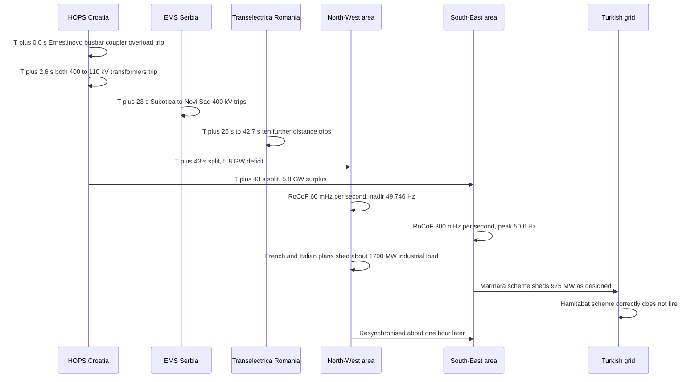

## 1. Scope, and what this paper does not claim

This is Eigenia Labs working-group output. It presents original framing, arithmetic and engineering judgement under one byline. It is not the source of record for any empirical fact about a real grid. Every statement here about what an operator measured, what a standard requires, or what happened during an incident carries a bracket citation to the primary document. The list is in section 8. Where a number is the working group's own derivation rather than a published measurement, the text says so on the line where the number appears.

That distinction is the point of the paper, not an administrative note attached to it. Grid stability arguments fail in a particular way: a protection setting gets reported as a measured value, or a figure from secondary commentary gets attributed to a primary report. The working group has found both patterns in its own corpus, and section 6 names the ones still open.

Two events anchor most public discussion of inverter-dominated grid risk. South Australia, 28 September 2016, where a sustained generation reduction of 456 MW occurred over a period of less than seven seconds and some 850,000 customers lost supply [1]. Great Britain, 9 August 2019, where cumulative infeed loss reached 1,878 MW and 931 MW of demand was automatically disconnected [2]. Both are treated as exceptional, and both were investigated to a standard most incidents never receive.

This paper asks a narrower question. What changes when they stop being exceptional? Not whether inverter-based generation is safe, which is the wrong question, but what happens to the operating envelope and to protection design as synchronous inertia falls. The answer argued here is that the dominant failure mode shifts from loss of infeed toward system separation, and that the hardest problem in separation is not equipment that fails. It is equipment that works.

A companion working-group paper, *The Grid's Unseen Tremors*, is in preparation and develops the inertia-to-RoCoF relation further. It is not quoted here.

---

## 2. The operating envelope contracts before the system does

### 2.1 The relation, and what it fixes

The theoretical maximum rate of change of frequency immediately following a disturbance is given by Basakarad et al. as

$$\left.\frac{df}{dt}\right|_{t=0^+} = \frac{P_k \, f_n}{2 \sum_{i \neq k} H_i S_i}$$

where $f_n$ is nominal frequency in Hz, $P_k$ is the disturbance in MW, $H_i$ is the inertia constant of the $i$th generator in seconds and $S_i$ its nominal power in MVA [4]. The summation excludes the disturbed unit, because a tripped generator stops contributing inertia at the instant it stops contributing power.

Two consequences follow from the algebra alone, with no empirical content and so no citation required. RoCoF is inversely proportional to the inertia sum: halve $\sum H_i S_i$ and the same $P_k$ produces twice the rate of change. And the relation is instantaneous, describing the first moment after the disturbance, before governor action, before fast frequency response, before anything with a control loop has observed what happened.

AEMO defines inertia through the National Electricity Rules as a contribution to resisting frequency change "by means of an inertial response from a generating unit, network element or other equipment that is electro-magnetically coupled with the power system and synchronised to the frequency of the power system" [5]. The coupling requirement is the operative clause. AEMO states that asynchronous technologies "are connected to the power system via a power electronic interface and do not bring any inertia naturally to the power system because they are electrically decoupled" [5]. That is not a criticism of inverters. It is a statement about what the swing equation sums over.

### 2.2 How fast the margin closes

AEMO publishes the time available at a given RoCoF for frequency to fall from 50 Hz to 49 Hz [5]:

| RoCoF (Hz/s) | Time to reach 49 Hz (seconds) |
|---|---|
| 4 | 0.25 |
| 2 | 0.5 |
| 1 | 1 |
| 0.5 | 2 |

AEMO's own definition of fast frequency response sets its outer bound at "a rapid active power increase or decrease by generation or load in a timeframe of two seconds or less" [6]. EirGrid's service timing places fast frequency response starting "from 150 ms" after the disturbance [7]. Put those together. At 0.5 Hz/s the fastest available product has most of the two-second interval to act in. At 4 Hz/s it has none of it, because frequency crosses 49 Hz in a quarter of a second, before a two-second product has delivered anything.

That is what falling inertia does to the operating envelope. It compresses the interval between a disturbance and the point where automatic protection, rather than an operator or a market product, decides the outcome.

### 2.3 What an inertia floor actually buys

EirGrid publishes its operational limits for the Ireland and Northern Ireland synchronous area: minimum synchronous area inertia of 23,000 MVA.s, maximum RoCoF of plus or minus 1.0 Hz/s, nadir and zenith limits of 49.0 Hz and 51.0 Hz, a minimum of seven large synchronous units synchronised, and a system non-synchronous penetration limit of 75 percent [7]. EirGrid states its reasoning directly: "The current inertia floor allows us to maintain the theoretical RoCoF below 0.6 Hz/s for loss of the largest generation infeed (which is approx. 450 MW / 4000 MVA.s)" [7].

The working group's own arithmetic reproduces that figure and is stated here as a derivation, not as an EirGrid calculation. Take the floor of 23,000 MVA.s, remove the lost unit's own 4,000 MVA.s, and apply the relation from section 2.1 at 50 Hz:

$$\frac{df}{dt} = \frac{450 \times 50}{2 \times 19{,}000} = 0.59 \text{ Hz/s}$$

That lands immediately under EirGrid's stated 0.6 Hz/s, which is a useful check that the published numbers describe one coherent policy rather than three separate assertions.

The same arithmetic shows what a relaxed floor costs. Cut the post-contingency pool to two thirds, roughly 12,700 MVA.s, and the theoretical RoCoF rises to about 0.89 Hz/s for the same contingency. That is the working group's own extrapolation on EirGrid's published parameters, not an EirGrid projection. It approaches EirGrid's plus or minus 1.0 Hz/s limit for a contingency that today sits comfortably inside it. No new failure mode appears. The margin runs out.

### 2.4 The thresholds are not one number

Any statement of the form "the RoCoF limit is X Hz/s" needs three qualifiers before it means anything: which jurisdiction, which population of plant, over what measurement window.

NERC's PRC-029-1 requires each inverter-based resource to ride through excursions where "the absolute rate of change of frequency (RoCoF) magnitude is less than or equal to 5 Hz/second, unless a documented hardware limitation exists," calculated as "the average rate of change for multiple calculated system frequencies for a time period of greater than or equal to 0.1 second," excluding the fault [8]. Great Britain's Engineering Recommendation G99 route disallowed vector shift protection and moved loss-of-mains RoCoF protection to 1 Hz/s with a 500 millisecond definite time delay, applied retrospectively to generation under 50 MW with a compliance deadline of 31 August 2022 [9]. In Australia, AEMO's advice to ESCOSA sets out two standards for connected generation: an automatic access standard at 4 Hz/s for more than 0.25 seconds, and a minimum access standard at 1 Hz/s for more than one second [10].

None of these is the same number, and none is a measured system quantity. Great Britain's own system operator states that "the most sensitive RoCoF protection on the GB system is set at 0.125Hz/s, with little to no minimum duration threshold. There are further tranches of RoCoF relays at other thresholds" [11]. A completed retrofit programme produced a mixed population, not a uniform system.

Basakarad et al. add the caveat that turns this from a physics problem into an engineering one: measured RoCoF is usually lower than the theoretical maximum because "frequency measurement inevitably involves a signal filtering process," and depends heavily on the length of the measurement window [4]. A RoCoF figure quoted without its window is not a number. It is an opinion with a unit attached.

---

## 3. Protection that works as designed and produces a worse outcome

This is the part of the problem that does not improve with more compliance.

### 3.1 Three protection schemes, all correct

On 8 January 2021 the Continental European synchronous area separated into two asynchronous areas 43 seconds after a busbar coupler trip at Ernestinovo substation in Croatia [12]. The South-East area was left with a 5.8 GW surplus and its frequency rose at a RoCoF of 300 mHz/s to a peak of 50.6 Hz [12]. In Turkey, synchronously connected via Bulgaria and Greece, a special protection scheme in the Marmara region "activated which prevented an overload on the important Bandirma-Bursa corridor by shedding 975 MW of power generation," 570 MW at Bandirma and 405 MW at Icdas [12]. A second Turkish scheme did not activate. ENTSO-E records the reason in plain terms: "The Hamitabat SPS worked as designed and did not react as the conditions to trigger it were not met" [12].

Both statements describe correct operation. One scheme fired and shed 975 MW; the other did not fire and shed nothing. It is unusual for a primary report to state explicitly that a scheme was right not to act, and the pairing removes the easy reading that protection is simply trigger-happy. Both were configured against local criteria, evaluated local conditions, and reached the right local answer.

In Great Britain on 9 August 2019, approximately 150 MW of embedded generation tripped on vector shift protection at the instant of a lightning strike, and approximately 350 MW then tripped on RoCoF protection, taking cumulative infeed loss from 1,131 MW to 1,481 MW [2]. National Grid ESO defines the relay behaviour: "These relays disconnect the generators if the RoCoF is greater than 0.125Hz/s, disconnecting them from the system safely" [2]. On the transmission side, "the protection systems on the transmission system operated correctly to clear the lightning strike" [2].

Loss-of-mains protection exists for a reason unrelated to system frequency. It detects that a distributed generator has been left energising an unintentional island, a hazard to anyone working on that circuit. The relay did its job. Its job deepened the deficit.

In South Australia on 28 September 2016, AEMO found that "nine wind farms in the mid-north of SA exhibited a sustained reduction in power as a protection feature activated," the settings on eight of them allowing the turbines "to withstand a pre-set number of voltage dips within a two-minute period" [1]. AEMO's conclusion is the one that matters: "Wind turbines successfully rode through grid disturbances. It was the action of a control setting responding to multiple disturbances that led to the Black System" [1]. Not a ride-through failure. A voltage-dip-count setting doing exactly what it was configured to do.

### 3.2 What the three cases have in common

In each case the protection was configured by an asset owner, against criteria local to that asset, on information available at that asset. In each case it gave the correct local answer. In each case the sum of correct local answers was worse than it would have been had one of them been wrong.

The 2021 event contains the cleanest demonstration, because it ran the same relay logic on both sides of a split at once. ENTSO-E classifies a category of disconnections triggered purely by frequency deviating outside the normal plus or minus 200 mHz band, remote from the separation line. On the surplus side these removed 3,292 MW of generation: Bulgaria 187 MW, Greece 1,350 MW, Serbia 600 MW, Turkey 1,155 MW [12]. On the deficit side, the same class of behaviour tripped 348 MW in Romania [12].

The relays were identical in intent. Their contribution was opposite in sign. On the surplus side, shedding generation reduced the imbalance; on the deficit side it deepened the imbalance. Nothing in any relay setting encoded which side of a future separation line the plant would stand on, because that information does not exist until the separation happens. This is not a tuning error that better settings would fix. It is a structural property of decentralised protection under a failure mode that partitions the system.

### 3.3 Designed shedding is not a failure, and should stop being reported as one

The end of the Great Britain event states plainly what correct protection costs. "The Low Frequency Demand Disconnection (LFDD) scheme was correctly triggered at 48.8Hz and automatically disconnected c.1.1m customers (c. 1GW)" [2]. Table 7 gives the exact figures: 1,152,878 customers, 931 MW [2]. Ofgem's investigation reached the matching conclusion about the system operator: "We have not identified any failures by the ESO to meet its requirements which contributed to the outage" [3].

Over a million customers lost supply and the regulator found no failure by the operator. Both are true. The scheme traded a defined quantity of demand for the survival of the wider transmission system, which is what it exists to do.

The ESO report separates this from a case where something genuinely did not work as specified. Approximately 60 Class 700 and Class 717 trains shut down when frequency dropped, 30 needing a technician to physically reset them, producing 23 train evacuations and 371 cancellations [2]. The operator "stated this was not how the train system had been specified to operate," since the specification requires operation down to 48.5 Hz [2]. That is a specification failure with an owner and a fix.

The two categories need different responses. A specification failure is closed by the asset owner. A composition failure cannot be closed by any single asset owner, because every participant was compliant. Great Britain's move to 1 Hz/s with a 500 ms delay is a system-level correction imposed on a local setting [9], and even after the 31 August 2022 deadline the system still carries more sensitive legacy tranches [11]. That is what it takes, and how long it takes, to change one number across one population of plant in one jurisdiction.

---

## 4. System separation as the emerging failure mode

### 4.1 What actually happened on 8 January 2021

ENTSO-E attributes the event to "large pan-European electric power flows and low stability margins," and records that the flow pattern "totalled approx. 5.8 GW across the separation line at the time when the initial event took place. However, this high load flow, particularly on the busbar coupler, was not forecasted correctly in the different respective security calculations" [12]. The report is equally direct about what the event was not: "the incident on 8 January revealed no issue in relation to generation adequacy or high shares of renewables having an impact" [12]. This paper uses the event for cascade mechanics and takes ENTSO-E at its word on causation. Nothing below claims renewable penetration caused the 2021 separation. It did not.

The customer impact must be described accurately as well. The loads disconnected in France, approximately 1,300 MW, and Italy, approximately 400 MW, were large industrial customers under standing contracts to be shed automatically at a frequency threshold [12]. ENTSO-E concludes that "only a very small number of private and industrial loads could not be supplied, meaning that overall the incident had no major influence on the security of supply of European consumers" [12]. This was not a mass blackout, and no customer count appears anywhere in the report. For outage scale, use Great Britain 2019 or South Australia 2016. This event is valuable for one thing: a millisecond-resolution causal chain across four transmission system operators, published by the people who own the measurements.

### 4.2 The same imbalance, two very different systems

ENTSO-E reports that the North-West area, carrying the 5.8 GW deficit, fell with "a RoCoF of 60 mHz/s (deduced from the frequency measured at the centre of inertia)" to a minimum of 49.746 Hz, while the South-East area, carrying the mirrored 5.8 GW surplus, rose at 300 mHz/s to a peak of 50.6 Hz [12].

Those two published numbers carry the argument. Same imbalance. Same instant. Five times the rate of change on one side.

Inverting the relation from section 2.1 gives the effective inertia each area retained. This is the working group's own derivation from ENTSO-E's published figures, not a quantity ENTSO-E states:

$$\sum H_i S_i = \frac{P_k \, f_n}{2 \, \left| df/dt \right|}$$

For the North-West area, 5,800 MW times 50 Hz divided by twice 0.060 Hz/s gives roughly 2,400 GVA.s. For the South-East area, the same numerator over twice 0.300 Hz/s gives roughly 480 GVA.s. The ratio is the inverse of the RoCoF ratio, which is what the relation requires; the reason to do the arithmetic is the absolute scale. A separation does not divide a system into two smaller versions of itself. It divides it into fragments with very different capacity to absorb the imbalance each inherits, and the fragment boundary is drawn by protection operating in sequence over 43 seconds, not by any planning decision.

Two caveats belong on that derivation. ENTSO-E's 60 mHz/s is deduced from frequency at the centre of inertia rather than measured directly, so the inversion inherits whatever window and filtering that deduction used [4], [12]. And the results are effective inertia at that instant, including load damping and any contribution from plant that later tripped, not a plant inventory.

### 4.3 Where the trajectory points

Now hold the separation constant and reduce the inertia on each side. The working group's position, stated as judgement rather than as a measured result, is that three things change together.

The time budget shrinks in proportion. AEMO's relation gives 16.7 seconds to fall from 50 Hz to 49 Hz at 60 mHz/s and 3.3 seconds at 300 mHz/s [5]. Had the deficit side held South-East levels of effective inertia, the French and Italian defence plans would have had a few seconds rather than tens of seconds. That is arithmetic on published figures, ignoring governor response and load damping, so treat it as an order-of-magnitude framing rather than a simulation.

The number of plants sitting near a protection threshold rises. Frequency-triggered disconnection outside plus or minus 200 mHz removed 3,292 MW in the surplus area and 348 MW in the deficit area [12]. Those decisions depend on how far and how fast frequency moves, and both increase as inertia falls.

The separation line becomes harder to anticipate. A faster cascade gives a security calculation less relevance, because its assumptions are invalidated by protection operating inside its own time step, and the 2021 flow pattern was already not forecast correctly [12].

None of this is a prediction with a date on it. It is where the published parameters point, and it is falsifiable. If a future separation at lower inertia produced a slower excursion than 2021, the argument would be wrong.

---

## 5. Cross-border and inter-area coupling

The 2021 cascade crossed four transmission system operators in 43 seconds, and its consequences reached Turkey on one side, France and Italy on the other [12]. No single operator saw the whole of it while it was happening. The coupling mechanism is worth stating precisely, because it is usually described loosely. Greece lost 1,350 MW of generation and Turkey lost 1,155 MW [12]. Neither loss involved any electrical contact with Ernestinovo other than shared frequency. Frequency is the one state variable that is global to a synchronous area and observable at every connection point in it. That is what makes it useful for decentralised protection, and exactly what makes decentralised protection compose badly. Every relay watches the same signal and reacts independently, with no knowledge of how many others are about to react to the same excursion.

Interconnection capacity does not change this. It sets the size of the imbalance that appears when the interconnection stops carrying it. The 5.8 GW flowing across the eventual separation line was the imbalance the moment that line ceased to exist [12].

The regulatory boundary also sits in the wrong place for this failure mode. Ofgem's conclusion on the Great Britain event concerned a single operator in a single jurisdiction, and it was that the operator met its requirements [3]. Hornsea 1 Limited and RWE Generation UK plc each made voluntary payments of GBP 4.5 million to the Energy Industry Voluntary Redress Scheme, and two distribution network operators paid GBP 1.5 million in aggregate for a separate breach involving premature reconnection [3]. Each determination is about one party's compliance with its own obligations. None is about the composition, which in 2021 crossed four operators and several regulators inside 43 seconds with no framework holding the sum to account.

---

## 6. What the working group is tracking and cannot establish

This is not a limitations note. It is the part of the paper that keeps the rest honest, and it is longer than a limitations note because several items here have already been asserted elsewhere without support.

### 6.1 The Iberian Peninsula event of 28 April 2025

The working group has no sourced account of this event. No final report from the Spanish or Portuguese system operators, and no ENTSO-E investigation report, was available at the time of writing. Nothing in this paper's evidence base covers it.

This paper therefore does not state that event's cause, its renewable penetration level, the number or character of any oscillations preceding it, the customer count, or the outage duration. Any figure attributed to Eigenia working-group analysis on those points, including the claim of two significant inter-area oscillations in the 30 minutes before the blackout, is not established here and must not be cited to this paper. The working group holds that claim open: neither confirmed nor refuted.

What would need to be established, from a primary investigation report, before the event can be used in this line of argument at all:

1. The measured system frequency trace and the RoCoF derived from it, with the measurement window stated.
2. The system inertia present at the time of the event, in the units the operator measures it in.
3. Whether the event was a separation, and if so where the separation line ran and what imbalance appeared on each side.
4. The sequence of protection operations, with timestamps, and which of them operated to specification.
5. Whether inter-area oscillations preceded the event, at what frequency and amplitude, and whether they were observed in real time or reconstructed afterwards.
6. The instantaneous share of non-synchronous generation, distinguished from the daily or annual average, which is the figure usually quoted and rarely the relevant one.

Items 1 and 6 are where secondary commentary most often goes wrong.

### 6.2 ENTSO-E inertia studies and the phrase "global severe splits"

An earlier Eigenia working-group document attributes to ENTSO-E a body of work described as "Project Inertia" studies for 2030 to 2040 scenarios, identifying an increasing number of "global severe splits" in which both separated systems collapse under uncontrollable RoCoF.

The working group cannot support that attribution. No ENTSO-E document under that name, and no ENTSO-E use of that phrase, appears in any primary source it holds. The ENTSO-E material it does hold in full is the Expert Panel final report on the Continental Europe separation of 8 January 2021, a post-event investigation and not a forward scenario study [12]. Those are different documents with different evidentiary weight, and one cannot stand in for the other.

Until an ENTSO-E scenario study is located, read in the original and filed, the claim is unsupported and should be struck from any document asserting it. Sections 3 and 4 restate the underlying argument on the 2021 separation report instead, which is directly on point and which the working group can quote: a real separation, a 5.8 GW imbalance, published RoCoF figures for both areas, and protection schemes that fired and correctly did not fire.

One further caution, because the naming collision is live. A separate Eigenia working-group paper titled *Project Inertia* is in preparation. It is Eigenia output. It is not ENTSO-E's workstream, it does not become an ENTSO-E source by sharing a name with one, and nothing in it may be cited as the origin of an ENTSO-E finding.

### 6.3 Numbers this paper deliberately does not use

The South Australia RoCoF of 6.1 Hz/s, widely repeated in secondary commentary and attributed to AEMO's final report, could not be located in that report's retrievable text. It is not used here and should not be published as an AEMO figure until someone opens the report's own frequency performance section and quotes it directly.

The South Australia transmission tower count is confirmed absent from AEMO's final report rather than merely unretrieved. Sections 2.4 and 3.1.4, Table 6 and Appendix V were read in full; Table 6 says only "Damaged towers bypassed" against three of six faulted circuits [1]. The figure of 23 towers circulating in press coverage has no basis in the report.

No measured system-wide RoCoF value exists in the public record for Great Britain on 9 August 2019. The 0.125 Hz/s figure that dominates that discussion is the relay disconnection threshold, stated as such by National Grid ESO [2]. Reporting it as a measured system RoCoF is the same error class as reporting the edge of a normal operating band as a load shedding trip point. Nor does any wind penetration percentage for that day appear in the ESO report; the 210 GVA.s inertia figure is sourced, from Table 4 [2], and the penetration figure usually quoted alongside it is not.

ERCOT's critical inertia level is contested between secondary sources, one giving 100 GWs and an academic paper citing ERCOT giving 105 GWs, and neither was confirmed against ERCOT's own text. No ERCOT figure appears here.

There is no single national under-frequency load shedding relay setting for the National Electricity Market. AEMO coordinates the scheme but individual network service providers set thresholds and stages for their own networks, and the AEMC's Frequency Operating Standard publishes frequency bands, not relay set points [13]. The normal operating band of 49.85 to 50.15 Hz is where the system sits almost all the time [13]. It is not a trip point. Treating it as one produces a model no operator would build.

---

## 7. Implications for operators and regulators

Seven positions follow. They are the working group's own recommendations and carry no authority beyond the sources they rest on.

**Publish an inertia floor in the units you measure.** EirGrid publishes 23,000 MVA.s and monitors inertia in real time "by summing the inertial contribution (Unit MVA rating x H constant) of all on-line synchronous units" [7]. An unpublished floor cannot be argued with, and an unmeasured one cannot be enforced.

**Never quote a RoCoF figure without its measurement window.** NERC averages over at least 0.1 second and excludes the fault [8]. G99 protection uses a 500 ms definite time delay [9]. Great Britain's most sensitive legacy relays have "little to no minimum duration threshold" [11]. The same physical event yields materially different values under those three conventions [4].

**Separate protection settings from measured values, in writing, every time.** Several errors this working group found in its own corpus were a threshold reported as a measurement. That converts a design parameter into evidence about system behaviour.

**Inventory protection settings by tranche and own that inventory at system level.** Great Britain finished its retrofit for generation under 50 MW on 31 August 2022 and still runs multiple tranches [9], [11]. An operator claiming a uniform setting should produce the count behind the claim.

**Plan for separation, not only for loss of the largest infeed.** On 9 August 2019 the ESO was "securing for a loss of power infeed of 1000MW" and lost 1,878 MW across four events inside 92 seconds [2]. The 2021 separation produced 5.8 GW on each side [12]. The largest single contingency is the wrong sizing basis for a failure mode that partitions the network.

**Fix the forecast, not only the response.** The 5.8 GW flow "was not forecasted correctly in the different respective security calculations" [12]. A defence plan tuned to an imbalance the security calculation never saw is tuned to the wrong number, and response speed does not compensate.

**Report designed load shedding as a designed outcome.** LFDD was "correctly triggered at 48.8Hz" and disconnected 1,152,878 customers [2]; Ofgem found no failure by the system operator [3]. Both are true and neither is comfortable. A scheme described only as a failure will be weakened by people who believe it failed.

---

## 8. References

[1] AEMO, *Black System South Australia 28 September 2016*, final report, March 2017.

[2] National Grid ESO, *Technical Report on the events of 9 August 2019*, 6 September 2019.

[3] Ofgem, *9 August 2019 power outage report*, 3 January 2020.

[4] N. Basakarad et al., *ROCOF importance in electric power systems with high renewables share: A simulation case for Croatia*, University of Zagreb with HOPS, 2020.

[5] AEMO, *Inertia Requirements and Shortfalls*, Inertia Requirements Methodology v1.0, effective 1 July 2018.

[6] AEMO, *Fast Frequency Response in the NEM*, working paper, 2017; and *Quantifying Synthetic Inertia of a Grid-forming Battery Energy Storage System*, September 2024.

[7] EirGrid, *Inertia Management on the Power Systems of Ireland and Northern Ireland*, G-PST Future of Inertia Summit, March 2024.

[8] NERC, *PRC-029-1, Frequency and Voltage Ride-through Requirements for Inverter-based Resources*, approved 8 October 2024.

[9] Energy Networks Association, *Engineering Recommendation G99*, Issue 2, 10 March 2025, DC0079 amendment history; with UK Power Networks, *Loss of Mains protection requirements*, for the 31 August 2022 retrofit deadline.

[10] AEMO, letter to ESCOSA, *Inquiry into Wind Farm and Inverter Generation, initial advice*, December 2016.

[11] NESO, *Security and Quality of Supply Standards, Frequency Risk and Control Policy*; with AEMC, *The Power of Commitment: System Rate of Change of Frequency*, November 2022.

[12] ENTSO-E, *Continental Europe Synchronous Area Separation on 08 January 2021*, ICS Investigation Expert Panel final report, 15 July 2021, v2.0 October 2021.

[13] AEMC Reliability Panel, *A Frequency Operating Standard*, effective 1 January 2020.
