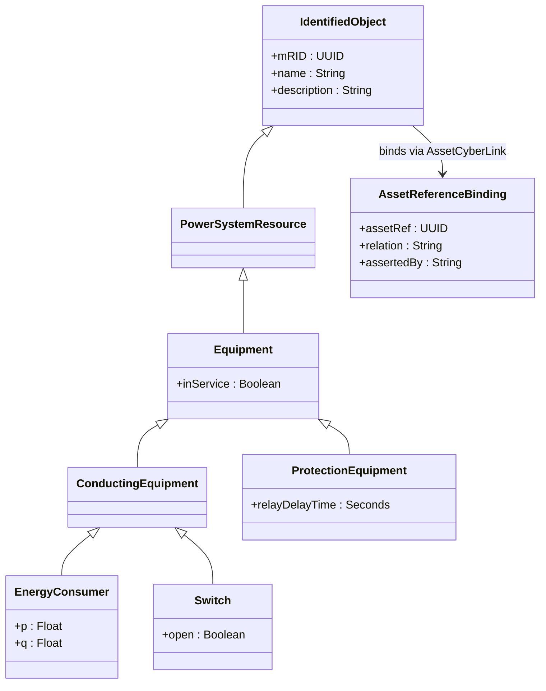

# Cyber-Physical Asset Identity Profile for IEC 61970 CIM

## 1. Executive Summary & Scope

This specification (Designation P2, the CIM profile of the three-schema programme) establishes the normative definition of the Cyber-Physical Asset Identity profile (CPAI) for IEC 61970 CIM. P1 defines a join across three identity systems and states four boundary requirements at the CIM edge, R-27 through R-30 [1]. It does not define the profile those requirements presuppose. This document defines it, satisfying requirements R-27 to R-30 under RFC 2119 normative language [6] and offered under the Creative Commons Attribution 4.0 International licence (CC BY 4.0) [7] for formal submission to IEC TC 57. P3 records R-27 as one of four requirements carrying no mechanical validation rule, for the single reason that P2 did not yet exist [2]. Publishing this document removes that omission.

The profile defined here is a subset of IEC 61970-301 [3] admitted for one purpose: binding a CIM object to an asset reference under Schema G_CPDT (Graph of Cyber-Physical Digital Twins) so that a consequence question asked of a plant asset can reach the electrical network feeding it, and back.

First, a distinction the reader must hold, because getting it wrong makes every later section unreadable.

**IEC 61850 is a communications standard. IEC 61970 is an information model.** The IEC 61850 series is titled *Communication networks and systems for power utility automation* [4]. It governs how devices inside a substation talk: GOOSE on the station bus, MMS to the client, sampled values from the merging unit, and the SCL configuration language describing the arrangement. IEC 61970-301 is titled *Energy management system application program interface (EMS-API), Part 301: Common information model (CIM) base* [3]. It governs what the network *is*: which breaker sits in which bay, which transformer feeds which voltage level, which conductor runs between two connectivity nodes. One is a wire protocol and an attack surface; the other is a model of plant.

This corpus carries the first and not the second. IEC 61850 appears twenty times across seven documents, and every use is about traffic: GOOSE injection at 0x88B8, MMS over unauthenticated links, sampled-value spoofing of a synchrocheck relay, IEC 61850 stacks in an inverter bill of materials. IEC 61970 appears in exactly two documents, both papers of this programme, and in both it is named as a thing to be profiled later. The corpus knows the substation as a network to be attacked and not yet as a model to be reasoned over. That gap is what this document closes.

The conflation matters practically. An analyst reading "we have IEC 61850 coverage" as "we have the electrical model" will look for a feeder relationship in an SCL file and not find one, because SCL describes intelligent electronic devices and their data, not the topology of the circuit they protect. The two standards are the subject of a formal reconciliation effort, IEC TS 62361-102:2018, *Power systems management and associated information exchange, Interoperability in the long term, Part 102: CIM, IEC 61850 harmonization* [5]. A Technical Specification devoted to reconciling them is the clearest available evidence that they are not the same thing.

The key words MUST, MUST NOT, SHOULD, SHOULD NOT and MAY are to be interpreted as described in RFC 2119 [6]. This document is offered under the Creative Commons Attribution 4.0 International licence [7], matching P1 and P3, so a receiving body can merge any of the three without a licence conflict.

### 1.1 The word profile has three referents here, and they are kept apart

Three mechanisms in this programme are called a profile. Confusing them would be easy and fatal to a reader's understanding, so this document fixes the usage.

**The DEXPI Profile.** DEXPI e.V.'s mechanism for defining explicit constraints on classes and properties, which P1 names as the carrier of the DEXPI leg [8]. Always written with DEXPI attached, always capitalised.

**A CGMES profile.** One of the exchange profiles of the Common Grid Model Exchange Standard, such as Equipment or Steady State Hypothesis. Always written with CGMES attached.

**CPAI.** The CIM profile this document defines. After this section it is named CPAI and nothing else.

The bare word "profile" appears here only in the general sense of the technique, never as the name of any of the three.

### 1.2 What this document does not do

It does not add to the CIM. R-27 forbids it and the constraint is honoured absolutely: CPAI declares no class, attribute or association in the CIM namespace. Every name it uses is one IEC 61970-301 already carries.

It does not define the join. The form of an assertion, the five relations, the asserting authority and the as-built basis are P1's and unchanged here.

It does not define validation rules; those belong in P3's numbering, which is why this document numbers its own C-1 upward rather than continuing R-35. It supplies no machine-readable schema either, and section 8 records that as the largest gap between this document and an adoptable submission.

## 2. Why a profile is necessary

R-27 forbids adding classes to the CIM UML. That closes off extension. Given a fixed model that cannot be extended, exactly one design move remains, which is to say which part of it applies. That is what a profile is.

The pressure comes from size. IEC 61970-301 edition 7.0 carries a model whose content version is recorded as IEC61970CIM17v38 [3], organised into packages covering core structure, wires, topology, generation, measurement, load models, protection, direct current and more. Saying "the CIM leg uses CIM" commits a producer to none of it and all of it at once, and a commitment with no boundary is not a specification.

The cost falls unevenly, and that is the argument deciding the shape of section 4. P1 section 7.1 names both ends of it [1].

A plant engineer recording that a pump is fed from a particular circuit needs to name one object and one identifier. If the profile demands a full topology model with connectivity nodes, terminals, base voltages, impedances and a solved state, that engineer produces no CIM leg at all, and the leg is decorative wherever it appears.

An analyst asking what trips when a protection relay is compromised needs more than a conducting equipment object. Protection is modelled by its own class, associated to the switch it operates. A profile admitting only `ConductingEquipment` can say a breaker exists and cannot say what is meant to operate it, which is the question a cyber-physical analysis asks.

The profile is drawn between those two failures: it admits what answers an identity or consequence question and refuses what answers only an electrical engineering question. Section 4 applies that test class by class.

## 3. CGMES as precedent

Profiling the CIM down to a stated purpose has been solved once already, at scale, and adopted by the IEC. That precedent is the model CPAI follows.

The Common Grid Model Exchange Standard was developed by ENTSO-E to let transmission system operators exchange grid models for capacity calculation and system operation. The IEC first published it as the Technical Specifications IEC TS 61970-600-1:2017 and IEC TS 61970-600-2:2017. Those were cancelled and replaced by IEC 61970-600-1:2021 and IEC 61970-600-2:2021, both first editions, both published on 4 June 2021, and both **International Standards rather than Technical Specifications** [9], [10].

That last point corrects a citation. P1 reference [11] designates the 2021 editions as Technical Specifications [1]. That was true of the 2017 editions and is not true of the 2021 ones, which the IEC catalogue records as International Standards that cancel and replace them. P1 and P3 carry the same wording and both should be corrected. The correction does not disturb any requirement in either document; it changes a designation, not an argument.

Three properties of CGMES are worth taking, and one is worth leaving.

**Take the stated purpose.** CGMES does not profile the CIM in general; it profiles it for a named business need, part 600-1 being titled *Structure and rules* and part 600-2 *Exchange profiles specification* [9], [10]. Every inclusion traces to a business service. CPAI adopts the same discipline in section 4.

**Take the decomposition.** CGMES is not one profile but a set, conventionally the Equipment, Steady State Hypothesis, Topology, State Variables, Diagram Layout, Geographical Location, Dynamics and Short Circuit profiles, each a defined slice of the model. A producer supplies the ones it can. CPAI applies the same idea as the degradation levels of section 7.

**Take the machine-readable expression.** ENTSO-E publishes the CGMES application profiles as RDFS vocabulary artefacts with SHACL constraint files [11]. That is the correct form for CPAI too, and its absence is stated as a limitation rather than glossed. Those artefacts describe the CIM RDF XML serialization of IEC 61970-552 [12], whose meta-model is the CIM RDF Schema of IEC 61970-501 [13].

**Leave the subject matter.** CGMES exists to exchange a network so another party can solve it, and its centre of gravity is impedance, injection, tap position and load flow result. CPAI exists to bind identity. It needs the network's shape and none of its numbers, which section 6 makes explicit.

## 4. Profile Classes and Associations

This section evaluates each class and association under the CPAI profile, stating the precise criteria for inclusion or exclusion.

### 4.1 The profile, class by class

Every class named below was checked against a published HTML rendering of the CIM ontology [14] and, where that was silent, against a generated CIM class reference [15]. That is verification against a secondary source, not against the published IEC 61970-301 UML, which is a paid standard the authors do not hold. Two names could not be settled and are marked; the profile relies on neither. A reviewer at IEC TC 57 holds the authoritative model and can confirm every name here in an afternoon, which is one of the things this submission asks for.

The right-hand column states the question a twin can answer because the class is admitted, or the reason it is refused. A row without such a question would be a subset entry, not a profile entry.

| Class | Superclass | In or out | Question it answers, or reason for exclusion |
|:---|:---|:---|:---|
| `IdentifiedObject` | root, carries `mRID`, `name`, `description`, `aliasName` | in | What is the stable identifier of the object this assertion binds to? R-28 binds the asset reference to an `IdentifiedObject`, so admitting it is not optional. |
| `PowerSystemResource` | `IdentifiedObject` | in | Which objects may carry a join assertion at all? It is the least specific class whose instances are things an operator would call plant, so it bounds the attachment rule without enumerating every concrete class. |
| `Equipment` | `PowerSystemResource` | in | Is this a physical device rather than a container or an organisational entity? The distinction decides whether a `partOf` relation is meaningful. |
| `ConductingEquipment` | `Equipment` | in | Does this object carry current, so that losing it is an electrical loss rather than an administrative one? |
| `ConnectivityNodeContainer` | `PowerSystemResource` | in | Inheritance closure only, because `EquipmentContainer` derives from it. It carries no assertion of its own. |
| `EquipmentContainer` | `ConnectivityNodeContainer` | in | What electrical enclosure does the asset sit inside? It makes `partOf` traversable upward. |
| `Substation` | `EquipmentContainer` | in | Which building or switchyard is the asset in? Physical consequence is usually reported at this granularity, because it is the unit that gets isolated. |
| `VoltageLevel` | `EquipmentContainer` | in | At what system voltage does the asset sit? An 11 kV feeder and a 400 V board carry indistinguishable tags and differ in consequence by orders of magnitude. |
| `Bay` | `EquipmentContainer` | in | Which switchgear cubicle contains the asset? This is the granularity at which an intelligent electronic device is installed, so it is where a firmware bill of materials lands. |
| `Line` | `EquipmentContainer` | in | What carries supply between two substations? Needed so an asset fed from outside its own substation is not orphaned. |
| `Terminal` | `ACDCTerminal` | in | At which point does the asset connect to the network? Without it a `supplies` relation cannot be checked against topology. |
| `ConnectivityNode` | `IdentifiedObject` | in | Which other equipment shares this electrical point? It turns one `supplies` assertion into a computable downstream set rather than a single edge. |
| `Switch` | `ConductingEquipment` | in | What device can open the circuit? Admitted also for inheritance closure of `ProtectedSwitch` and `Breaker`. |
| `ProtectedSwitch` | `Switch` | in | Which switch is operable by protection rather than thrown by hand? This separates a device an attacker can command remotely from one they cannot. |
| `Breaker` | `ProtectedSwitch` | in | What removes supply from the asset? The highest-value class here, because a compromised breaker is how a software event becomes a physical one. |
| `Conductor` | `ConductingEquipment` | in | What physical run carries the supply? Admitted for inheritance closure of `ACLineSegment` and because length bounds a fire argument. |
| `ACLineSegment` | `Conductor` | in | Which specific cable or overhead line feeds the asset? |
| `PowerTransformer` | `ConductingEquipment` | in | What steps voltage between the asset and its source? A transformer is both a consequence boundary and a monitored device carrying firmware. |
| `EnergyConsumer` | `ConductingEquipment` | in | How does the network model represent the load the plant asset actually is? This class most often stands on the electrical side of an `identity` relation to a DEXPI object. |
| `BaseVoltage` | `IdentifiedObject` | in | What nominal voltage applies? Admitted because `VoltageLevel` is not interpretable without it. |
| `ProtectionEquipment` | `Equipment` | in | What device is meant to trip on a fault, and does it appear in a bill of materials? P1 section 7.1 names this as the reason a `ConductingEquipment`-only profile is too thin. |
| `TopologicalNode` | `IdentifiedObject` | out | A bus derived from current switch positions, changing as the network is switched. R-2 requires an asset reference minted once and never reused, and binding one to a state-dependent object breaks that in normal operation. |
| `Measurement` and its subclasses | `IdentifiedObject`, measurement package [15] | out | A measurement is a value, not an asset. The `monitors` relation is carried by the monitoring device's own leg, where its firmware lives. Admitting this package models one relationship twice with no rule for reconciling the two. |
| `GeographicalRegion`, `SubGeographicalRegion` | `IdentifiedObject` | out | Geography in the CIM is a market and system operator boundary construct. `Substation` already localises the asset for every question the join asks. |
| `Asset` and the asset information classes | IEC 61968 asset model | out | R-27 scopes CPAI to IEC 61970-301 and these sit elsewhere. A second reason holds without the scoping: binding the join to a class already called `Asset` puts two identity systems in one file, the merge P1 exists to avoid. |
| State variables and steady-state hypothesis classes | CGMES profiles | out | A solution to a network is not a network. No join question needs a solved power flow, and requiring one puts a CIM leg out of reach of any producer who is not a system operator. |
| Dynamics classes | CGMES profile | out | Machine and controller dynamics answer stability questions on a timescale the join does not reach. |
| Direct current and converter classes | wires package | out | No join question distinguishes an AC from a DC supply path today. A candidate for later revision, not a permanent refusal. |
| Market classes | IEC 62325 model | out | Settlement and bidding are outside every question the join asks. |
| `Feeder` | not established | deferred | See 4.2. The name could not be verified and the profile does not rely on it. |
| `PowerTransformerEnd` | transformer end class, unconfirmed | out | No join question reaches a specific winding. Recorded so a later revision starts from a note rather than a rediscovery. |

### 4.2 The two names that need confirmation

**`Feeder`.** IEC 61970-301 edition 7.0 lists "Feeder modelling" among its additions [3]. Secondary material describes equipment as associated with an equipment container such as a feeder or a bay. That is enough to know the concept was added and not enough to know the class name, its superclass, or whether it is confined to distribution. CPAI therefore does not admit it. The cost is real, because a feeder is the object an operator names when asked what supplies a pump. A reviewer holding the edition 7.0 UML can close this in one sentence, and the profile SHOULD admit `Feeder` once the name is confirmed.

**`PowerTransformerEnd`.** It appears as the class associating a transformer to its windings [14], which is where a winding's own voltage and tap live. Its exact superclass was not confirmed. Nothing in CPAI depends on it.

### 4.3 Associations in scope

Classes alone give objects with no way to walk between them. CPAI admits the following associations, each because a traversal in section 7 depends on it. The pairs were read from the same ontology rendering [14]; the exact role names as printed in the IEC 61970-301 UML MUST be taken from the published standard before CPAI is issued as a schema.

| Association | Why it is needed |
|:---|:---|
| `Equipment` to `EquipmentContainer` | The upward walk from a device to the enclosure that contains it. Without it `partOf` has no CIM-side counterpart. |
| `Terminal` to `ConductingEquipment` | Attaches a connection point to the thing connected. |
| `Terminal` to `ConnectivityNode` | Joins two pieces of equipment at a shared electrical point, which is the whole basis of downstream computation. |
| `VoltageLevel` to `Substation` | Places a voltage level inside a station. |
| `Bay` to `VoltageLevel` | Places a cubicle inside a voltage level. |
| `VoltageLevel` to `BaseVoltage` | Makes the voltage level's nominal voltage readable. |
| `ProtectionEquipment` to `ProtectedSwitch` | States which relay operates which switch, the association answering what trips. |
| `ProtectionEquipment` to `ConductingEquipment` | States what the relay is protecting. |

The ontology rendering shows `Bay` associated both to `VoltageLevel` and to `Substation` [14]. CPAI treats the chain as substation, voltage level, bay, and a consumer MUST NOT assume the two paths are interchangeable without checking the model it holds.

### 4.4 Normative requirements of the profile

These extend P1 and do not renumber it. P1 owns R-1 to R-35, P3 owns V-nn, CPAI owns C-nn.

C-1. A CPAI document MUST NOT declare any class, attribute or association in the CIM namespace. This is R-27 at the point it would be violated.

C-2. A join assertion MUST attach to an instance of a class admitted by section 4.1, and that class MUST be a descendant of `IdentifiedObject`. This is how R-28 is met.

C-3. The join fields MUST be carried as properties in a namespace outside the CIM namespace, attached to the instance in the model graph. A producer MUST NOT overload a CIM attribute such as `name`, `description` or `aliasName` to carry one, because that puts a foreign identifier in a CIM identity field and violates R-9.

C-4. The recorded `mRID` MUST equal the value in the source model, byte for byte. This is R-28 and R-11 restated.

C-5. A CPAI document MUST state the model authority set within which the `mRID` is unique, as an absolute URI, and that value MUST equal the one the export itself declares. This is R-29.

C-6. A CPAI document MUST remain valid against the CIM schema of its base profile with all join properties present. This is R-10 at the CIM leg.

C-7. A conformance claim MUST name the CIM model content version and the base profile the document was produced against. An unversioned CPAI claim is not meaningful, which matches R-34.

C-8. A consumer MUST NOT infer containment, supply or protection from `mRID` values or from naming conventions. It MUST traverse only the associations of section 4.3 that the document actually declares.

C-9. A consumer MUST accept a CIM leg carrying only the binding of section 5 and none of the topology of section 4.3, MUST report the completeness level of section 7, and MUST NOT reject the leg for the absence of classes the producer did not supply.

C-10. An implementation claiming CPAI conformance MUST also state its P1 roles and legs under R-34. CPAI conformance alone says nothing about whether it can produce or consume a join.

## 5. The `mRID` as join key, and its properties

R-28 requires the CIM leg to bind to an `IdentifiedObject` and record that object's `mRID` unchanged. `mRID` is the master resource identifier, an attribute of `IdentifiedObject` alongside `name`, `description` and `aliasName` [14]. It is the CIM's own identity and the join borrows it rather than replacing it. Four properties govern its use, and each constrains a consumer.

**It is opaque.** An `mRID` is conventionally a UUID and carries no meaning in its characters. Nothing about a plant, a voltage or a function reads out of it, and a consumer pattern-matching on `mRID` values is inventing structure, which C-8 forbids.

**It is machine-minted and stable within its scope.** A network model tool assigns it and keeps it across exports of the same model. That stability is what makes it usable as a key, and it is real within one authority.

**It is unique within a model authority set, not globally.** The CIM divides an interconnection model into disjoint sets of objects so different parties can take responsibility for different parts, each set having a model authority. CGMES carries the declaration in the model header as `md:Model.modelingAuthoritySet` [16]. An `mRID` quoted without that scope is not resolvable, which is why R-29 requires the scope to travel with the value. C-5 restates it and adds that the stated value must match the export's own declaration, because a hand-typed authority disagreeing with the file is worse than none.

**It is not stable across tools.** Two exports of one physical circuit from two network model tools normally carry different `mRID` values. P1 states this and offers no reconciliation mechanism [1]. P3's round trip RT-3 expects exactly this divergence and passes only when the validator reports it and the consumer declines to guess [2]. CPAI does not change that. It adds the requirement that the authority set is always present, so a consumer holding two exports sees two authorities rather than one contradicting itself.

The consequence is a rule about what the CIM leg is for. It binds an asset reference into one named authority's view of the network. It is not a global address for a circuit, and a twin treating it as one merges two utilities' models into a topology that exists nowhere.

## 6. What the profile deliberately excludes

Section 4.1 gives the reason for each exclusion in one line. This section states the principle behind them, because a reviewer will want to know whether the exclusions were reasoned or merely convenient.

The principle is that CPAI admits shape and refuses quantity.

A join needs to know that a breaker sits between a transformer and a bay, and that a terminal connects a pump's supply to a connectivity node shared with three other loads. Those are questions about arrangement, answerable from class membership and association traversal, and none needs a number. A power flow needs impedance, admittance, rating, tap position, injection and a solved voltage at every node. Those are questions about behaviour. They are the substance of CGMES and are correctly excluded here, because a producer who must supply them will supply no CIM leg at all, and the join gains nothing when they arrive.

Two exclusions deserve more than a line.

**The measurement package.** Refusing it looks wrong at first, because the join has a `monitors` relation and the CIM has measurement classes. That relation is asserted by the monitoring device, in the device's own leg, where its firmware and package URL sit. That is where an analyst needs it, because the question is whether a compromised monitor can falsify a reading. Admitting CIM measurement objects would put a second representation of one relationship in another file with no rule for reconciling the two, and P1 R-14 shows what this programme thinks of unreconciled duplicate claims.

**The asset management classes.** Refusing them looks perverse in a paper about asset identity. The scoping reason decides it, since R-27 confines CPAI to IEC 61970-301 and those classes sit with the IEC 61968 series. The design reason holds anyway. The CIM's `Asset` is the utility's record of a physical thing it owns, associated to the `PowerSystemResource` that thing realises; the join's asset reference identifies a binding across three schemas. Putting one inside the other builds a file in which two identity systems both claim to name the asset, with no rule for choosing. Keeping them apart costs a hop and preserves what makes the approach work: no file ever holds a foreign identifier.

## 7. Degradation: what a thin leg still supports

P1 section 7.1 states the requirement plainly: the profile must degrade rather than fail, because a join working only when every leg is rich is not a general mechanism [1]. A later applied paper in this programme uses a deliberately weak CIM case to test this.

CPAI degrades by completeness level. The levels are cumulative. A producer supplies the highest it can; a consumer reports the level received and answers the questions that level supports, which is what C-9 requires.

| Level | What the CIM leg carries | What becomes answerable |
|:---|:---|:---|
| L0 | no CIM leg at all | Nothing electrical. The join runs on the DEXPI 2.0 and CycloneDX 1.6 legs [18] and still answers which firmware sits inside which tagged equipment, the tag carrying its ISO 15926-4 class [19]. |
| L1 | one admitted `IdentifiedObject` instance, its `mRID`, its authority set and a relation | Whether the asset is electrically connected to something in a named authority's network model, who asserted it, and on what basis. |
| L2 | L1 plus `Terminal` and `ConnectivityNode` | What else shares the asset's electrical point. A single `supplies` assertion becomes a downstream set instead of one edge. |
| L3 | L2 plus `Bay`, `VoltageLevel`, `Substation` and `BaseVoltage` | Where the asset physically sits and at what voltage, so consequence is reported by station and cubicle rather than by object. |
| L4 | L3 plus `Breaker`, `ProtectedSwitch` and `ProtectionEquipment` | What removes supply, what is meant to trip, and whether those devices appear in a bill of materials. This is the level at which a cyber event traces to a physical action. |

Three rules make the levels work rather than decorate the document.

**The level is declared, not inferred.** A producer states it in its conformance statement under C-7. A consumer guessing the level from what it happens to find will misreport a truncated export as a thin one.

**Refusal is forbidden.** C-9 makes rejecting an L1 leg non-conformant. This prevents a validator that demands topology, gets none, and reports the asset as having no electrical context when it has an authority and an identifier, which is the difference between knowing a little and knowing nothing.

**Silence is not absence.** An L1 leg does not assert that the asset has no breaker; it asserts nothing about breakers. A consumer MUST NOT read a missing class as a negative fact. This is the specific way a degrading profile goes wrong when nobody writes the rule down.

L1 is the level this programme expects to see most often, because a plant engineer can produce it from a single line diagram and one conversation with the network team. It is also the level at which the join already pays for itself. Knowing which authority owns the circuit feeding a compromised asset is the first thing an incident responder needs and the hardest thing to find at three in the morning.

## 8. Limitations

Each of the following is something this profile cannot do. They are stated because a reviewer will find them anyway and an implementer who meets one after deployment will conclude the work was oversold.

**An `mRID` is stable within one model authority set and one export, and not across tools.** Section 5 sets this out and CPAI does not fix it. Two vendors' exports of one circuit carry different values. The profile's contribution is to make the scope explicit enough that a consumer can tell it has a problem rather than silently merging two models.

**A CIM profile does not establish that the electrical model matches the installed switchgear.** CPAI binds an asset reference to an object in a network model. Whether that model describes the plant as built is a site verification question sitting outside IEC 61970-301 entirely. A join over a model predating a substation rebuild gives precise, confident answers about a circuit that no longer exists.

**Nothing here is verified against a real CIM export.** The authors hold no CGMES or CIM RDF XML file to test against. Every requirement in section 4.4 is reasoned from the model's published structure, not from an implementation that produced and consumed one. Until an export goes through it, C-1 to C-10 are proposals.

**Class names were verified against a secondary rendering, not the published UML.** The inheritance and semantics in section 4.1 come from a published HTML rendering of the CIM ontology [14] and a generated class reference [15]. Those are good sources and they are not the standard. `Feeder` and `PowerTransformerEnd` are marked as needing confirmation and relied on nowhere. A wrong name elsewhere in section 4.1 is a defect in this document rather than in the approach, correctable by substitution.

**The profile has no machine-readable form.** CGMES ships RDFS vocabulary and SHACL constraints [11]. CPAI ships a table. That is the largest single difference between this document and something IEC TC 57 could adopt, and closing it is the next unit of work. A validator cannot be written against prose, so P3 cannot yet turn its R-27 entry from a human procedure into a mechanical rule; it can only narrow it.

**Whether a CIM validator tolerates foreign properties is untested.** C-3 places the join fields in a namespace outside the CIM namespace, attached to instances in the model graph. That is the standard way to add data to an RDF graph without touching the vocabulary, and it is not the same as knowing a CGMES conformity tool will pass a file carrying them. Tools apply their own rules about unexpected content. This needs testing against a real validator before the approach is claimed to work.

**Two exclusions are weaker than they look.** `Feeder` is refused because CPAI cannot admit a class it cannot name, so producers will carry the same information in whatever `EquipmentContainer` subclass their tool uses and consumers will see inconsistent container types for one real relationship [3]. Direct current classes are refused because no join question distinguishes an AC from a DC supply path, and battery storage, high voltage DC links and DC distribution inside modern facilities weaken that each year. Both are flagged rather than buried.

**Whether this profile survives IEC TC 57's own process is unknown.** IEC 61970 sits with the TC 57 working group responsible for software interfaces for grid operation and planning, and the CIM is maintained jointly with the CIM Users Group [17]. Neither timetable nor outcome is under the authors' control, and the same holds for the DEXPI Profile submission and the CycloneDX namespace registration P1 depends on [8]. This document must stand as research whether or not any of the three is accepted, which is why every requirement here is testable by a reader who never sees it adopted.

**A citation defect found while writing this document, since corrected.** P1 and P3 originally designated the 2021 CGMES editions as Technical Specifications [1], [2]. The IEC catalogue records IEC 61970-600-1:2021 and IEC 61970-600-2:2021 as first-edition International Standards, published 4 June 2021, cancelling and replacing the 2017 Technical Specifications [9], [10]. Both papers were amended on 7 September 2026 to carry the verified designation. The finding is recorded here rather than removed, because the error originated in the brief given to this document's author and a reader tracing the three papers should be able to see where it was caught.

## 9. References

1. **McKenney, J.** *The Three-Identity Join: DEXPI 2.0, CycloneDX 1.6 and IEC 61970 CIM.* P1 of the three-schema programme, Eigenia working group WG-05-CAD, 2026.
2. **McKenney, J.** *Conformance Suite and Reference Implementation.* P3 of the three-schema programme, Eigenia working group WG-05-CAD, 2026.
3. **International Electrotechnical Commission.** *IEC 61970-301:2020: Energy management system application program interface (EMS-API), Part 301: Common information model (CIM) base.* Edition 7.0, 26 June 2020, model content version IEC61970CIM17v38, listing feeder modelling among its additions. https://webstore.iec.ch/en/publication/62698 (accessed 7 September 2026).
4. **International Electrotechnical Commission.** *IEC 61850: Communication networks and systems for power utility automation.* Series title, all parts. https://webstore.iec.ch/en/publication/6028 (accessed 7 September 2026).
5. **International Electrotechnical Commission.** *IEC TS 62361-102:2018: Power systems management and associated information exchange, Interoperability in the long term, Part 102: CIM, IEC 61850 harmonization.* Technical Specification, 30 April 2018. https://webstore.iec.ch/en/publication/27417 (accessed 7 September 2026).
6. **Bradner, S.** *Key words for use in RFCs to Indicate Requirement Levels.* RFC 2119, BCP 14, Internet Engineering Task Force, March 1997.
7. **Creative Commons.** *Attribution 4.0 International (CC BY 4.0) Legal Code.* Creative Commons Corporation, 2013.
8. **DEXPI e.V.** *DEXPI August 2026 Update.* dexpi.org, August 2026. States that the Specification Teams are developing the DEXPI Profile, which extends the DEXPI specification with a mechanism for defining explicit constraints on classes and properties. https://dexpi.org/dexpi-august-2026-update/ (accessed 7 September 2026).
9. **International Electrotechnical Commission.** *IEC 61970-600-1:2021: Energy management system application program interface (EMS-API), Part 600-1: Common Grid Model Exchange Standard (CGMES), Structure and rules.* International Standard, edition 1.0, 4 June 2021, cancelling and replacing IEC TS 61970-600-1:2017. https://webstore.iec.ch/en/publication/63866 (accessed 7 September 2026).
10. **International Electrotechnical Commission.** *IEC 61970-600-2:2021: Energy management system application program interface (EMS-API), Part 600-2: Common Grid Model Exchange Standard (CGMES), Exchange profiles specification.* International Standard, edition 1.0, 4 June 2021, cancelling and replacing IEC TS 61970-600-2:2017. https://webstore.iec.ch/en/publication/63867 (accessed 7 September 2026).
11. **ENTSO-E.** *Application Profiles Library.* Machine-understandable artefacts, RDFS and SHACL, for the Common Grid Model Exchange Standard and the Network Code CGMES extensions. https://github.com/entsoe/application-profiles-library (accessed 7 September 2026).
12. **International Electrotechnical Commission.** *IEC 61970-552:2016: Energy management system application program interface (EMS-API), Part 552: CIMXML Model exchange format.* Edition 2.0. https://webstore.iec.ch/en/publication/25939 (accessed 7 September 2026).
13. **International Electrotechnical Commission.** *IEC 61970-501:2006: Energy management system application program interface (EMS-API), Part 501: Common Information Model Resource Description Framework (CIM RDF) schema.* Edition 1.0. https://webstore.iec.ch/en/publication/6215 (accessed 7 September 2026).
14. **TNO.** *IEC CIM Ontology Documentation.* Published HTML rendering of the IEC Common Information Model class hierarchy, used here to verify class names, direct superclasses, definitions and associations. https://ontology.tno.nl/IEC_CIM/ (accessed 7 September 2026). A secondary rendering, not the published IEC 61970-301 UML.
15. **Institute for Automation of Complex Power Systems, RWTH Aachen.** *libcimpp generated CIM class reference, IEC61970 16v29a and IEC61968 12v08.* Used to verify the measurement package hierarchy. https://cim.fein-aachen.org/libcimpp/ (accessed 7 September 2026).
16. **ENTSO-E.** *CGMES File Header Guidelines.* Specifies CGMES model header content, including the `md:Model.modelingAuthoritySet` element naming the entity responsible for a set of model objects. https://eepublicdownloads.entsoe.eu/clean-documents/CIM_documents/Grid_Model_CIM/ (accessed 7 September 2026).
17. **CIM Users Group.** *CIM Modeling Guide.* UCA International Users Group. Describes shared maintenance of the unified CIM UML across the IEC TC 57 working groups for IEC 61970, IEC 61968 and IEC 62325. https://cim-mg.ucaiug.io/ (accessed 7 September 2026).
18. **Ecma International.** *CycloneDX Bill of Materials Specification.* ECMA-424, 1st edition, June 2024, defining CycloneDX 1.6. Cited to fix the version the sibling leg of the join targets.
19. **International Organization for Standardization.** *ISO 15926-4: Industrial automation systems and integration, Integration of life-cycle data for process plants including oil and gas production facilities, Part 4: Initial reference data.* International Standard. Cited to fix the reference data library the DEXPI leg targets.
