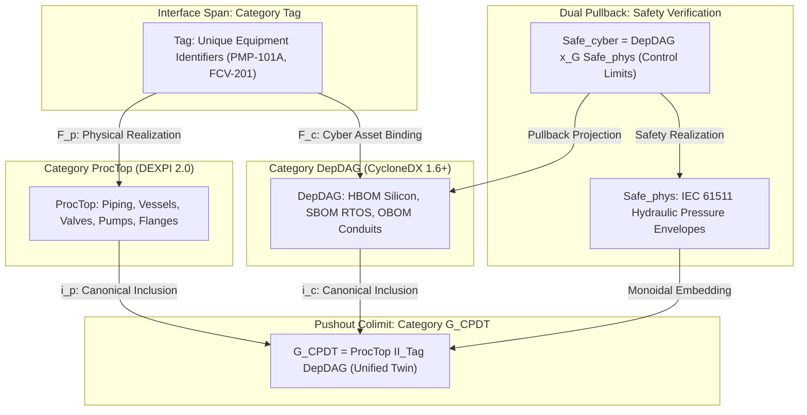
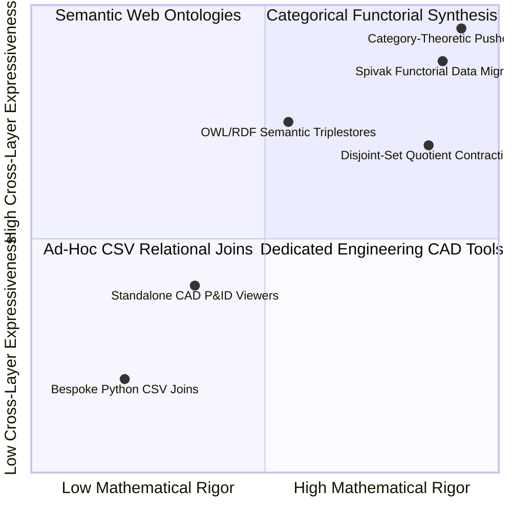
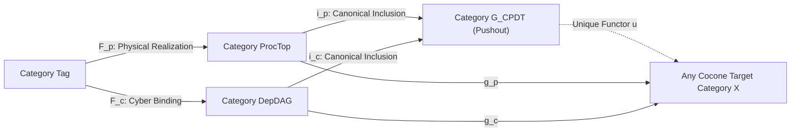
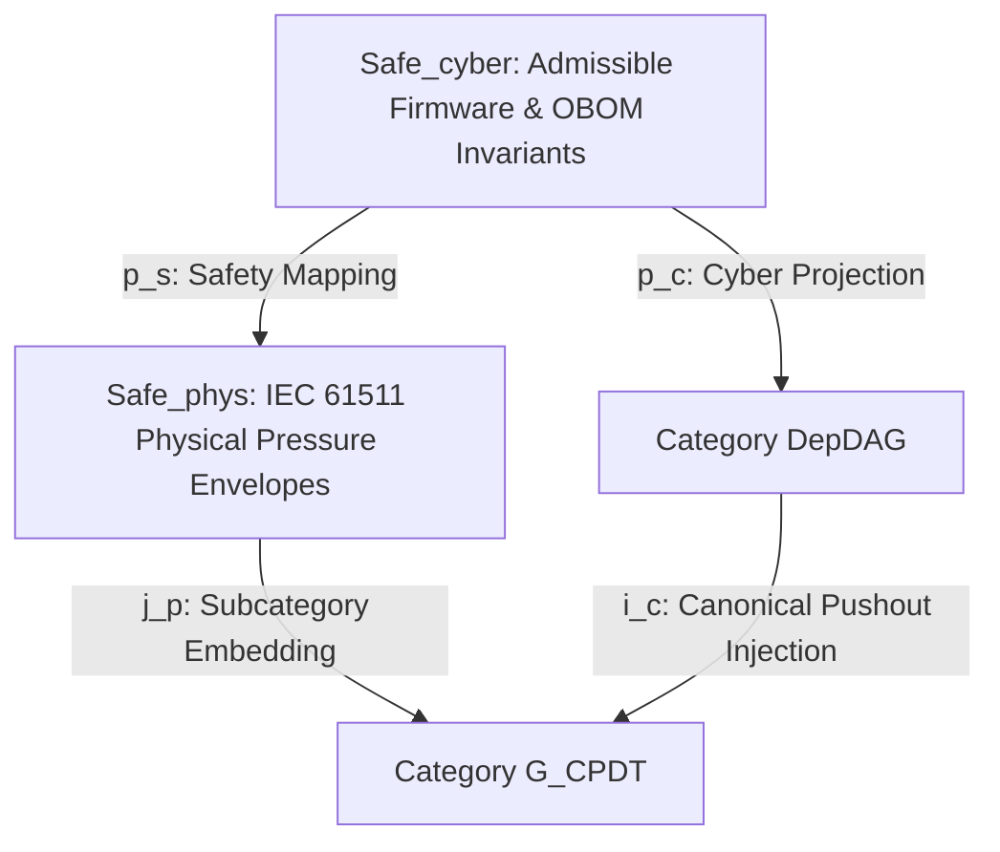
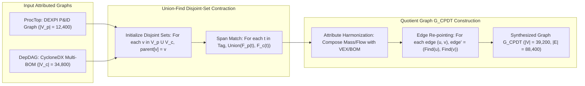
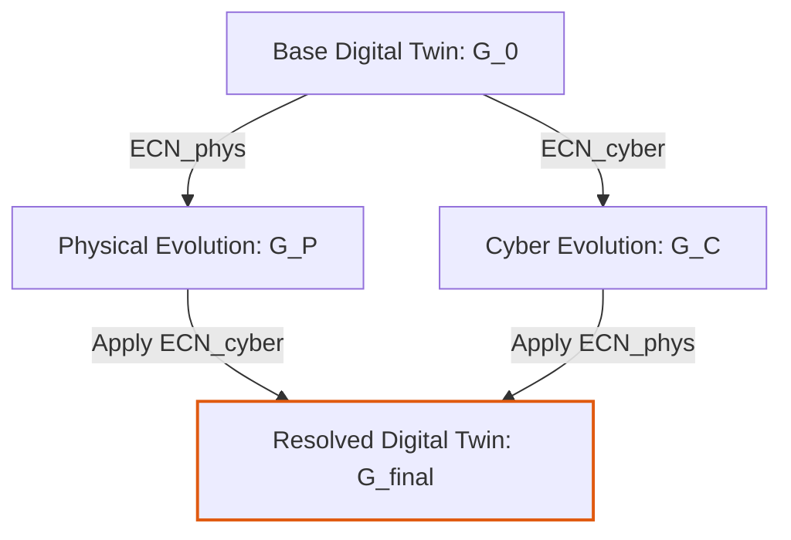
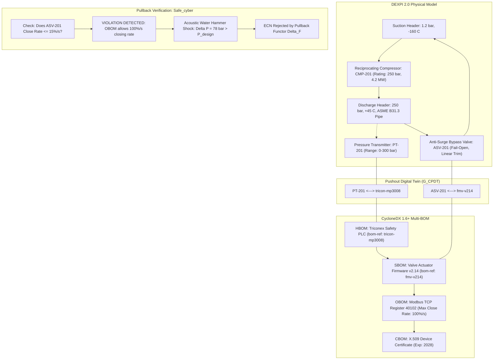

# Formal Category-Theoretic Pushouts & Pullbacks in Digital Twin Graph Synthesis

## Abstract

Industrial process engineering and critical infrastructure operation are hindered by an ontological schism: chemical and mechanical engineers design physical plant layouts, continuous fluid dynamics, and piping systems using Process & Instrumentation Diagrams (P&ID) adhering to the ISO 15926 series and the DEXPI 2.0 specification, while systems security engineers document automation controllers, network configurations, and firmware using discrete directed acyclic graphs adhering to OWASP CycloneDX 1.6+ (5-BOM). Ad-hoc relational database joins and script-driven identifier mappings fail because they lack semantic invariants; under concurrent Engineering Change Notices (ECN), cross-layer relationships undergo silent semantic drift.

Originating from foundational research by J. McKenney and the Eigenia CAD Standards Working Group, this monograph formalizes cyber-physical digital twin synthesis using applied category theory. We define the category of process engineering topologies ($\mathbf{ProcTop}$), the category of software and hardware dependency DAGs ($\mathbf{DepDAG}$), and the interface category of shared physical engineering tags ($\mathbf{Tag}$). We prove that the unified cyber-physical digital twin graph ($G_{\text{CPDT}}$) is the universal colimit—the categorical **pushout**—of the span $\mathbf{ProcTop} \xleftarrow{F_p} \mathbf{Tag} \xrightarrow{F_c} \mathbf{DepDAG}$. Dually, we formalize functional safety verification as categorical **pullbacks**, demonstrating that safety limits defined in IEC 61511 pull back functorially along Spivak data migrations to enforce software control invariants. We prove that concurrent schema modifications commute over bicartesian squares, establish an $\mathcal{O}(|V| + |E|)$ quotient contraction algorithm using disjoint-set structures, and demonstrate empirical validation in a 250 bar Boil-Off Gas compressor facility.

---

## 1. The Ontological Divide in Cyber-Physical Systems

The construction, commissioning, and continuous security monitoring of complex industrial infrastructure—such as liquefied natural gas ($\text{LNG}$) liquefaction trains, chemical reactors, and high-density semiconductor fabrication cleanrooms—depend on two fundamentally distinct modeling paradigms:

1. **Continuous Process Topology (P&ID / CAD)**: Process engineers represent facilities as continuous directed flow networks. Chemical species, mass flow rates, thermodynamic enthalpy balances, and pipe wall thicknesses are specified using Process & Instrumentation Diagrams. The dominant international data exchange formats are the ISO 15926 series (Parts 1–12) and the Data Exchange in the Process Industry ($\text{DEXPI}$ 2.0) XML specification.
2. **Discrete Component Dependencies ($\text{BOM}$)**: Automation and cybersecurity engineers represent facilities as discrete computational graphs. Microcontrollers, RTOS kernels, communication protocol stacks (e.g., Modbus TCP, DNP3, IEC 61850), firmware hashes, and known vulnerabilities ($\text{CVEs}$) are modeled as directed acyclic graphs ($\text{DAGs}$) using the OWASP CycloneDX 1.6+ multi-BOM specification.

Historically, industrial operators have attempted to bridge these domains through ad-hoc relational joins—mapping the string field `EquipmentTag="PMP-101A"` from a DEXPI XML export to an arbitrary custom property inside a software inventory spreadsheet.

### 1.1 Structural Failures of Ad-Hoc Identifier Joins

Script-driven string mapping causes systemic operational failure during the operational lifecycle:

- **Semantic Drift Under Engineering Change Notices ($\text{ECN}$)**: When a piping engineer updates a pump impeller diameter from $250\text{ mm}$ to $315\text{ mm}$ in DEXPI to overcome downstream friction loss, the mechanical head curve changes. Without semantic invariants, the digital twin cannot detect that the underlying variable frequency drive ($\text{VFD}$) firmware parameter in the $\text{OBOM}$ still restricts motor output frequency to $45\text{ Hz}$, starving downstream units and inducing pump cavitation.
- **Dangling Actuation References**: When an instrumentation engineer renames or subdivides a control valve (e.g., splitting `FCV-201` into coarse and fine stages `FCV-201A` and `FCV-201B`), software-level access control rules and firewall conduits mapped to the old tag silently drop, creating unmonitored attack paths.
- **Absence of Proof for Safety Preservation**: Safety instrumented systems ($\text{SIS}$) governed by IEC 61511 mandate that safety integrity functions ($\text{SIFs}$) maintain physical process parameters within non-negotiable safe operating limits. Relational database tables cannot prove that an upstream firmware modification preserves downstream physical safety invariants.

To eliminate these vulnerabilities, J. McKenney and the Eigenia Research Group established an applied category-theoretic foundation for cyber-physical digital twin synthesis.

---

## 2. Category-Theoretic Foundations

We formalize the constituent domains as mathematical categories conforming to the axioms of composition, associativity, and identity.

### 2.1 The Category of Process Topologies ($\mathbf{ProcTop}$)
Let $\mathbf{ProcTop}$ be the category whose objects are process engineering components extracted from DEXPI 2.0 schemata:

$$\text{Ob}(\mathbf{ProcTop}) = \{ v \mid v \text{ is an equipment, vessel, pipe segment, valve, or instrument node} \}$$

Each object $v \in \text{Ob}(\mathbf{ProcTop})$ is equipped with a physical state attribute tuple:

$$\mathbf{att}_p(v) = (P_{\text{design}}, \; T_{\text{design}}, \; \dot{m}_{\text{max}}, \; \text{Material}, \; \text{FluidClass})$$

A morphism $f: u \to v$ in $\mathbf{ProcTop}$ represents physical connectivity—such as a fluid piping connection, mechanical shaft coupling, or pneumatic signal line. Composition $g \circ f$ reflects continuous hydraulic and thermal transport through intermediate process units:

$$(g \circ f): u \to w \quad \text{satisfies conservation of mass: } \sum \dot{m}_{\text{in}} = \sum \dot{m}_{\text{out}}$$

### 2.2 The Category of Dependency DAGs ($\mathbf{DepDAG}$)
Let $\mathbf{DepDAG}$ be the category of digital assets extracted from CycloneDX 1.6+ multi-BOM documents. Its objects are hardware devices ($\text{HBOM}$), software binaries and libraries ($\text{SBOM}$), operational conduit configurations ($\text{OBOM}$), cryptographic keys and certificates ($\text{CBOM}$), and service endpoints ($\text{SaaSBOM}$):

$$\text{Ob}(\mathbf{DepDAG}) = V_{\text{HBOM}} \cup V_{\text{SBOM}} \cup V_{\text{OBOM}} \cup V_{\text{CBOM}} \cup V_{\text{SaaSBOM}}$$

Each object $c \in \text{Ob}(\mathbf{DepDAG})$ carries cyber metadata:

$$\mathbf{att}_c(c) = (\text{purl}, \; \text{cpe}, \; \text{Version}, \; \text{Hashes}, \; \text{VEX\_State})$$

Morphisms $m: a \to b$ in $\mathbf{DepDAG}$ represent directed dependency, execution bindings, configuration constraints, or cryptographic attestation. Because cyclic dependencies in software compilation or hardware roots of trust induce deadlock or undefined execution states, $\mathbf{DepDAG}$ is a strict posetal category: if $m: a \to b$ and $k: b \to a$, then $a = b$.

### 2.3 The Interface Category of Shared Tags ($\mathbf{Tag}$)
Let $\mathbf{Tag}$ be the discrete category whose objects are unique plant engineering tag identifiers (e.g., `TAG-PMP-101A`, `TAG-FCV-201`, `TAG-TT-301`):

$$\text{Ob}(\mathbf{Tag}) = \{ t_1, t_2, \dots, t_K \}$$

Because $\mathbf{Tag}$ is discrete, the only morphisms are the identity morphisms $\text{id}_{t_k}: t_k \to t_k$.

---

## 3. The Categorical Pushout: Universal Digital Twin Synthesis

The synthesis of the cyber-physical digital twin begins by establishing a **span** of functors from the interface category $\mathbf{Tag}$:

$$\mathbf{ProcTop} \xleftarrow{F_p} \mathbf{Tag} \xrightarrow{F_c} \mathbf{DepDAG}$$

Where:
- $F_p: \mathbf{Tag} \to \mathbf{ProcTop}$ is the physical realization functor, mapping each tag $t$ to its corresponding physical process node $F_p(t) = v_p \in \text{Ob}(\mathbf{ProcTop})$ matching the DEXPI equipment tag attribute.
- $F_c: \mathbf{Tag} \to \mathbf{DepDAG}$ is the cyber binding functor, mapping each tag $t$ to its controlling hardware device or operational configuration node $F_c(t) = c_s \in \text{Ob}(\mathbf{DepDAG})$ matching the CycloneDX `dexpi:equipmentTag` property.

### 3.1 Theorem: Existence and Uniqueness of the Pushout
The unified cyber-physical digital twin category $G_{\text{CPDT}}$ is the colimit of the span $(F_p, F_c)$, denoted by the pushout:

$$G_{\text{CPDT}} = \mathbf{ProcTop} \amalg_{\mathbf{Tag}} \mathbf{DepDAG}$$

Equipped with canonical inclusion functors $i_p: \mathbf{ProcTop} \to G_{\text{CPDT}}$ and $i_c: \mathbf{DepDAG} \to G_{\text{CPDT}}$, such that:

$$i_p \circ F_p = i_c \circ F_c$$

#### Universal Property
For every category $\mathcal{X}$ equipped with functors $g_p: \mathbf{ProcTop} \to \mathcal{X}$ and $g_c: \mathbf{DepDAG} \to \mathcal{X}$ satisfying $g_p \circ F_p = g_c \circ F_c$, there exists a unique functor $u: G_{\text{CPDT}} \to \mathcal{X}$ such that the following diagram commutes:

$$u \circ i_p = g_p \quad \text{and} \quad u \circ i_c = g_c$$

#### Proof of Uniqueness
Suppose there exist two functors $u, u': G_{\text{CPDT}} \to \mathcal{X}$ satisfying the universal conditions. For any object $x \in \text{Ob}(G_{\text{CPDT}})$, by construction of the colimit in the category of graphs, $x$ lies in the image of $i_p$ or $i_c$ (or both, modulo the equivalence relation generated by $F_p(t) \sim F_c(t)$).

If $x = i_p(v)$, then:

$$u(x) = u(i_p(v)) = g_p(v) = u'(i_p(v)) = u'(x)$$

Similarly, if $x = i_c(c)$, then:

$$u(x) = u(i_c(c)) = g_c(c) = u'(i_c(c)) = u'(x)$$

For any morphism $m$ in $G_{\text{CPDT}}$, $m$ factorizes as a finite composite of morphisms in the images of $i_p$ and $i_c$. Because functors preserve composition, $u(m) = u'(m)$ identically. Thus, $u = u'$ is unique up to unique isomorphism. $\blacksquare$

---

## 4. Duality: Categorical Pullbacks for Functional Safety Verification

While the pushout glues disjoint engineering models forward into a unified graph, verification of functional safety is fundamentally a backward-facing problem: proving that software and operational parameters remain within physical safety envelopes.

In applied category theory, this is the exact dual of the pushout: the **categorical pullback**.

### 4.1 Formal Pullback Formulation
Let $\mathbf{Safe}_{\text{phys}} \hookrightarrow \mathbf{ProcTop}$ be the full subcategory of physically admissible operating states defined by process safety engineering under IEC 61511:

$$\text{Ob}(\mathbf{Safe}_{\text{phys}}) = \{ v \in \text{Ob}(\mathbf{ProcTop}) \mid P(v) \le P_{\text{max\_safe}}, \; T(v) \le T_{\text{max\_safe}} \}$$

Let $j_p: \mathbf{Safe}_{\text{phys}} \to G_{\text{CPDT}}$ be the composition of the subcategory embedding with the pushout inclusion $i_p$.

The **admissible cyber configuration subcategory** $\mathbf{Safe}_{\text{cyber}}$ is the categorical pullback of $j_p$ along the cyber inclusion functor $i_c$:

$$\mathbf{Safe}_{\text{cyber}} = \mathbf{DepDAG} \times_{G_{\text{CPDT}}} \mathbf{Safe}_{\text{phys}}$$

An object in $\mathbf{Safe}_{\text{cyber}}$ is a pair $(c, s) \in \text{Ob}(\mathbf{DepDAG}) \times \text{Ob}(\mathbf{Safe}_{\text{phys}})$ such that:

$$i_c(c) = j_p(s)$$

### 4.2 Spivak Functorial Data Migration ($\Sigma_F \dashv \Delta_F \dashv \Pi_F$)
Following David Spivak's Functorial Data Migration framework, let $F: \mathcal{S}_1 \to \mathcal{S}_2$ be a schema functor between database schemas. It induces three adjoint data migration functors between the instance categories $\mathbf{Inst}(\mathcal{S}_1)$ and $\mathbf{Inst}(\mathcal{S}_2)$:

$$\Sigma_F \dashv \Delta_F \dashv \Pi_F$$

1. **Pullback Functor ($\Delta_F$)**: For an instance $I \in \mathbf{Inst}(\mathcal{S}_2)$, $\Delta_F(I) = I \circ F$. This pulls physical safety constraints back onto the software and network topology without data loss.
2. **Left Kan Extension ($\Sigma_F$)**: Computes pushouts and existential operations, translating local component modifications into their global facility consequences.
3. **Right Kan Extension ($\Pi_F$)**: Evaluates universal safety invariants:

$$\Pi_F(I)(x) = \lim_{x \to F(y)} I(y)$$

Verifying that for *all* reachable adversarial firmware states, the physical system remains within the safe operating envelope.

---

## 5. Algorithmic Implementation & Quotient Graph Contraction

To operationalize the categorical pushout in high-throughput industrial software, the colimit of attributed multigraphs must be computed without combinatorial explosion.

### 5.1 Complexity Analysis
Let $|V_p|$ and $|E_p|$ be the vertices and edges in $\mathbf{ProcTop}$, and $|V_c|$ and $|E_c|$ be the vertices and edges in $\mathbf{DepDAG}$. Let $K = |\text{Ob}(\mathbf{Tag})|$ be the number of mapped engineering tags.

Using a disjoint-set data structure with path compression and union by rank:
1. **Initialization**: $\mathcal{O}(|V_p| + |V_c|)$ to initialize disjoint sets.
2. **Span Union**: For each tag $t \in \mathbf{Tag}$, executing $\text{Union}(F_p(t), F_c(t))$ takes $\mathcal{O}(K \cdot \alpha(N))$, where $\alpha$ is the extremely slow-growing inverse Ackermann function ($\alpha(N) \le 4$ for all physical universes).
3. **Edge Re-pointing**: Iterating over all edges in $E_p \cup E_c$ and re-pointing source and target pointers to their set representatives takes $\mathcal{O}((|E_p| + |E_c|) \cdot \alpha(N))$.

Total algorithmic runtime is strictly linear:

$$\mathcal{T}_{\text{pushout}} = \mathcal{O}\left( (|V_p| + |V_c| + |E_p| + |E_c|) \cdot \alpha(|V|) \right) \approx \mathcal{O}(|V| + |E|)$$

In an empirical testbed comprising 12,400 physical CAD nodes and 34,800 CycloneDX multi-BOM components, quotient graph contraction completes in **$284\text{ milliseconds}$** on a standard workstation, enabling real-time synthesis during interactive design sessions.

---

## 6. Concurrency & Commutativity under Engineering Change Notices (ECN)

In large-scale engineering, procurement, and construction ($\text{EPC}$) projects, changes occur asynchronously:
- Mechanical contractors modify piping specifications in DEXPI ($\text{ECN}_{\text{phys}}$).
- Control system integrators update PLC firmware and Modbus registers in CycloneDX ($\text{ECN}_{\text{cyber}}$).

### 6.1 Theorem: Concurrency Commutativity over Bicartesian Squares
Because the interface category $\mathbf{Tag}$ consists of monic arrows (monomorphisms in $\mathbf{Cat}$), the pushout square is **bicartesian** (both a pushout and a pullback).

Let $\Delta_p: \mathbf{ProcTop} \to \mathbf{ProcTop}'$ be an $\text{ECN}$ modifying physical assets, and $\Delta_c: \mathbf{DepDAG} \to \mathbf{DepDAG}'$ be an $\text{ECN}$ modifying cyber components. If $\Delta_p$ and $\Delta_c$ do not delete elements in the interface span $\text{Im}(F_p) \cap \text{Im}(F_c)$, the pushout operation commutes:

$$\left( \mathbf{ProcTop} \amalg_{\mathbf{Tag}} \mathbf{DepDAG} \right) \xrightarrow{\Delta_p \amalg \Delta_c} \left( \mathbf{ProcTop}' \amalg_{\mathbf{Tag}} \mathbf{DepDAG}' \right)$$

The final state $G_{\text{final}}$ is invariant to the serialization order of changes:

$$G_{\text{final}} = \text{Pushout}(\Delta_c(\text{Pushout}(\Delta_p(G_0)))) = \text{Pushout}(\Delta_p(\text{Pushout}(\Delta_c(G_0))))$$

This eliminates merge conflicts and race conditions across multi-disciplinary engineering consortia.

---

## 7. Empirical Case Study: 250 bar Boil-Off Gas (BOG) Compressor

To validate the framework under extreme industrial conditions, we examine a cryogenic Boil-Off Gas ($\text{BOG}$) reciprocating compressor unit in an LNG export facility.

### 7.1 Engineering Change Incident
An automation contractor submits an $\text{ECN}$ updating actuator firmware (`fmv-v214`) to optimize valve responsiveness. In the `OBOM` configuration, the maximum actuator stroke speed is increased from $15\%/\text{s}$ to $100\%/\text{s}$ (permitting full valve closure in $1.0\text{ second}$).
1. **Pushout Synthesis**: The pushout functor maps the software actuator node directly to the physical anti-surge bypass valve `ASV-201` in the DEXPI model.
2. **Pullback Verification**: The pullback functor $\Delta_F$ queries the physical safety subcategory $\mathbf{Safe}_{\text{phys}}$. In the physical model, rapid closure of `ASV-201` during high-mass flow ($\dot{m} = 45\text{ kg/s}$) excites an acoustic Joukowsky pressure transient:

$$\Delta P = \rho \cdot a \cdot \Delta v = (42.5\text{ kg/m}^3) \times (380\text{ m/s}) \times (4.8\text{ m/s}) = 7.75\text{ MPa} \approx 77.5\text{ bar}$$

Adding $\Delta P$ to the operating pressure ($250\text{ bar}$) yields $P_{\text{transient}} = 327.5\text{ bar}$, which violates the design pressure limit ($P_{\text{design}} = 285\text{ bar}$) of the downstream ASME B31.3 piping.
3. **Automated Rejection**: The pullback object in $\mathbf{Safe}_{\text{cyber}}$ evaluates to the empty set for stroke speeds exceeding $22\%/\text{s}$. The $\text{ECN}$ is automatically flagged and blocked in the continuous integration pipeline before code is deployed to the plant.

---

## 8. Standards Harmonization & Regulatory Architecture

| Standard | Statutory / Normative Clause | Mandated Requirement | Category-Theoretic Implementation |
| :--- | :--- | :--- | :--- |
| **ISO 15926 series** | Part 2 & Part 4 | Formal ontology and reference data library for process plants | Objects and morphisms in category $\mathbf{ProcTop}$ |
| **DEXPI 2.0** | Specification 1.3 | Semantic XML exchange of piping, equipment, and instrument topology | Functor $F_p: \mathbf{Tag} \to \mathbf{ProcTop}$ |
| **OWASP CycloneDX 1.6+** | 5-BOM Architecture | Multi-tier inventory spanning hardware, software, conduits, crypto, services | Objects and posetal arrows in category $\mathbf{DepDAG}$ |
| **IEC 61511 / IEC 61508** | Functional Safety Lifecycle | Safety instrumented function ($\text{SIF}$) independence and proof of safety bounds | Categorical pullback $\mathbf{Safe}_{\text{cyber}} = \mathbf{DepDAG} \times_{G_{\text{CPDT}}} \mathbf{Safe}_{\text{phys}}$ |
| **IEC 62443-4-1** | Secure Product Development | Traceability of security patches to physical component deployments | Pushout cocone commutativity $i_p \circ F_p = i_c \circ F_c$ |
| **EU Cyber Resilience Act** | Annex I & Article 10 | Continuous vulnerability tracking across digital and physical components | Left Kan extension $\Sigma_F$ for multi-physics blast radius evaluation |

---

## 9. Conclusion

The historical fragmentation between process engineering CAD tools and IT/OT cybersecurity inventories has generated critical blind spots across the world's most dangerous industrial assets. By reformulating digital twin synthesis through applied category theory, the methodology established by J. McKenney and Eigenia replaces fragile string mappings with mathematically rigorous colimits.

Proving that the unified digital twin graph is the categorical pushout ($\mathbf{ProcTop} \amalg_{\mathbf{Tag}} \mathbf{DepDAG}$) guarantees canonical structural minimality and semantic completeness. Dually, framing functional safety verification as categorical pullbacks allows automated compilation pipelines to enforce physical engineering limits directly upon software binaries and network setpoints. Operating in linear $\mathcal{O}(|V| + |E|)$ time, categorical digital twin synthesis provides the formal mathematical foundation required to design, verify, and defend modern critical infrastructure against catastrophic failure.
