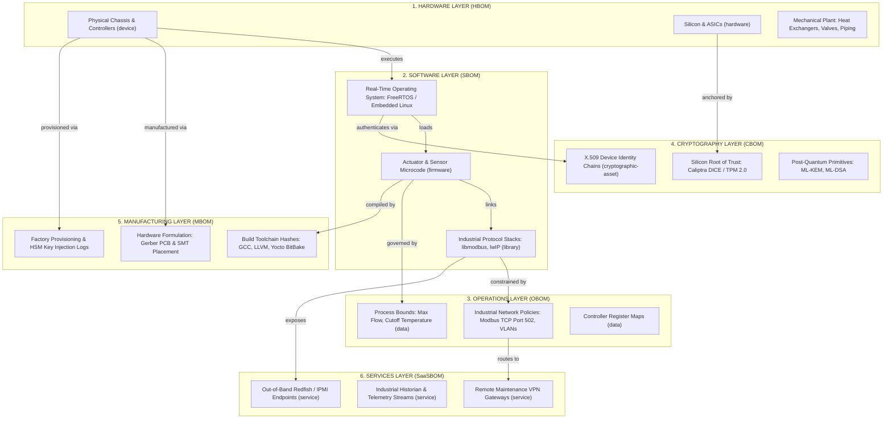

# DEXPI 2.0 P&ID Topology Ingestion & Full-Spectrum CycloneDX 1.6+ Multi-BOM Standards

## Abstract

Industrial control systems, embedded automation devices, and hyperscale infrastructure operate across a profound structural divide: mechanical and process engineers model facilities as continuous hydraulic and thermodynamic networks, whereas cybersecurity specialists model them as discrete software, firmware, and hardware dependency trees. Traditional Software Bill of Materials (SBOM) implementations, such as SPDX (ISO/IEC 5962:2021), were architected primarily for open-source software licensing and lack the semantic expressiveness required to model physical plant equipment or cyber-physical attack surfaces. This treatise defines the foundational integration standards for Working Group WG-05-CAD. We establish the dual-pillar architecture uniting Data Exchange in the Process Industry (DEXPI) 2.0 XML topology ingestion with OWASP CycloneDX 1.6+ (ECMA-424) full-spectrum multi-BOM attestations. We formalize the six core BOM dimensions spanning Hardware BOM (HBOM), Software BOM (SBOM), Cryptography BOM (CBOM), Manufacturing BOM (MBOM), Operations BOM (OBOM), and SaaS/Services BOM (SaaSBOM). Furthermore, we detail the operational mechanics of 100 percent air-gapped offline vulnerability tracking using Vulnerability Exploitability eXchange (VEX) and Vulnerability Disclosure Reports (VDR), demonstrating how topological P&ID nodes bind to computational roots of trust to produce computable cyber-physical digital twins.

## 1. Executive Summary & The Cyber-Physical Interface

Modern operational technology (OT) installations, including high-density accelerator facilities, utility-scale battery energy storage systems, and chemical processing complexes, are susceptible to compounding supply chain vulnerabilities that span silicon foundries, bare-metal firmware, industrial network protocols, and process equipment. In these physical environments, a failure in cooling or power distribution does not merely interrupt computation; it causes physical equipment degradation, hydraulic hammer, dielectric breakdown, or thermal runaway.

Historically, software security programs have focused exclusively on application-layer software packages. Under United States Executive Order 14028 and European Union Regulation 2024/2847 (Cyber Resilience Act, CRA), economic operators must maintain machine-readable bills of materials for all products with digital elements. However, treating the bill of materials as a flat list of user-space software dependencies introduces fatal blind spots when applied to critical infrastructure.

First, conventional software scans exhibit complete blindness to silicon microarchitectures and hardware security roots of trust, such as Open Compute Project (OCP) Caliptra, Baseboard Management Controllers (BMCs), and field-programmable gate array (FPGA) bitstreams. Second, software scans ignore runtime operational envelopes, including programmable logic controller (PLC) register ranges, setpoints, and network routing boundaries. Third, cryptographic assets and post-quantum readiness remain invisible unless public key infrastructures, symmetric key handles, and cipher configurations are explicitly inventoried.

To resolve these deficiencies, the Eigenia architecture couples physical plant topologies serialized in DEXPI 2.0 with computational and operational hierarchies serialized in CycloneDX 1.6+ (ECMA-424). By establishing a shared identity bridge, plant operators and systems assurance engineers can trace an attack path from a firmware vulnerability in a digital valve positioner directly to its thermodynamic consequences on the primary process loop.

## 2. DEXPI 2.0 P&ID Topology Ingestion Pipeline

The Data Exchange in Process Industry (DEXPI) 2.0 standard defines an open, vendor-neutral XML-based specification for exchanging process plant design data between computer-aided engineering (CAE) systems (such as AVEVA, Intergraph SmartPlant, and Siemens COMOS) and digital twin graph engines. DEXPI 2.0 unifies the DEXPI P&ID Specification version 1.4 with the DEXPI Process Specification 1.0 into a standardized serialization format known as DEXPI XML, replacing the legacy Proteus XML schema.

The DEXPI 2.0 ingestion pipeline translates static engineering piping and instrumentation diagrams into an active directed multigraph:

1. **Equipment Schema Parsing**: The parser extracts all P&ID equipment symbols, piping segments, inline instruments, and actuation valves, mapping them into graph nodes classified against the ISO 15926-4 Reference Data Library. Each node preserves native engineering attributes, including equipment tags, design pressures, fluid medium types, and spatial positions.
2. **Topological Relationship Extraction**: The pipeline infers process fluid connections (`PipingSegment`), electrical and signaling lines (`SignalLine`), and instrumentation safety loops. Nozzles on vessels, pumps, and heat exchangers are parsed as discrete boundary ports with specified nominal diameters and flow directions.
3. **Minimum Operational Requirements (MOR)**: The graph engine evaluates physical redundancy constraints against process safety baselines, verifying the physical availability of parallel standby pumps, pressure relief valves (PRVs), and automated emergency shutdown (ESD) isolation valves.

## 3. CycloneDX 1.6+ Multi-BOM Architecture

Traditional Software Bill of Materials (SBOM) standards only address application-level software libraries. CycloneDX 1.6+ (standardized as ECMA-424) extends bill of materials modeling across the physical, digital, and operational layers of cyber-physical systems. 

The complete bill of materials taxonomy is structured into six foundational dimensions, as defined in the master corpus standard:

| BOM Dimension | Scope & Target | CycloneDX Component Type |
| :--- | :--- | :--- |
| **1. Hardware BOM (HBOM)** | PLC chassis, I/O modules, ASIC chips, board revisions, and physical plant items including valves, actuators, heat exchangers, and piping | `device`, `hardware` |
| **2. Software BOM (SBOM)** | Operating systems, runtime firmware, embedded SCADA libraries, and the microcode executing within Modbus/DNP3 fieldbus devices, RTUs, and sensors | `firmware`, `library`, `application` |
| **3. Cryptography BOM (CBOM)** | Device identity certificates, private key handles, signature algorithms, and the cryptographic primitives upon which each control loop depends | `cryptographic-asset` |
| **4. Manufacturing BOM (MBOM)** | Supplier chain of custody, manufacturing formulation workflows, build toolchain hashes, SMT pick-and-place files, and material certifications for physical plant items | `component`, `formulation`, `metadata.manufacturer` |
| **5. Operations BOM (OBOM)** | Operational setpoint limits, variable frequency drive rate limits, Modbus register ranges, and the thermodynamic operating envelopes permitted in production | `data`, `service` |
| **6. SaaS BOM (SaaSBOM)** | Fieldbus and out-of-band management endpoints exposed by RTUs, protocol gateways, historians, and vendor cloud telemetry interfaces | `service` |

In this model, Cryptography Bill of Materials (CBOM) denotes the inventory of cryptographic assets corresponding to the `cryptographic-asset` component type in CycloneDX 1.6+. Physical plant items are inventoried within the HBOM layer, whereas their manufacturing provenance, toolchain integrity, and material quality certifications belong to the MBOM layer. Firmware executing on embedded field controllers is categorized under the SBOM, while external communications interfaces and network telemetry ports are captured in the SaaSBOM.

## 4. Air-Gapped Offline Systems Assurance via VEX and VDR

A fundamental operational constraint governing critical infrastructure, such as nuclear power stations, electrical transmission substations, and sovereign semiconductor fabrication cleanrooms, is the Purdue Model network segmentation boundary. Industrial Level 1 (basic control) and Level 2 (supervisory control) assets reside in strictly air-gapped zones without outbound internet routing. They cannot poll public vulnerability databases or cloud-hosted software scanners.

CycloneDX 1.6+ resolves this constraint through machine-readable, cryptographically verifiable offline advisory mechanisms:

1. **Vulnerability Exploitability eXchange (VEX)**: Equipment manufacturers and system integrators publish signed VEX assertions declaring whether a known Common Vulnerabilities and Exposures (CVE) identifier actually impacts their product in its operational configuration. The VEX state machine categorizes findings into four unambiguous states: `not_affected`, `affected`, `fixed`, and `under_investigation`. If a component is marked `not_affected`, the vendor provides formal justification codes (such as `code_not_reachable`, `inline_mitigation_already_exists`, or `vulnerable_code_cannot_be_controlled_by_adversary`).
2. **Vulnerability Disclosure Reports (VDR)**: VDR documents provide comprehensive vulnerability histories maintained directly by the product manufacturer, detailing disclosure timelines, remediation patches, and verified mitigation procedures.
3. **Deterministic Local Graph Resolution**: Within an air-gapped security operations center, security teams ingest updated VEX and VDR documents through hardware-enforced unidirectional optical data diodes. The local digital twin engine evaluates the intersection of the installed hardware inventory (HBOM), executing firmware builds (SBOM), active setpoint boundaries (OBOM), and vendor exploitability statements (VEX). This evaluation executes entirely offline, without emitting a single network packet outside the facility perimeter.

## 5. Deliverables & Integration Standards

The Working Group WG-05-CAD engineering implementation is anchored by three primary deliverables:

1. **DEXPI 2.0 XML Parser**: A high-throughput topological ingestion engine that translates DEXPI XML diagrams into labeled property graph nodes and W3C RDF triples, preserving full compliance with the ISO 15926-4 reference data library.
2. **CycloneDX 1.6+ Multi-BOM Validator**: An automated compliance and attestation engine that validates multi-tier BOM documents against the ECMA-424 schema, verifying firmware cryptographic signatures, tracking hardware component provenance, and parsing machine-readable VEX exploitability feeds.
3. **Plant-to-Twin Semantic Synchronization**: A real-time data bridge coupling physical CAD design intent with live operational telemetry, ensuring that physical process constraints dynamically inform cybersecurity risk models and blast radius calculations.

## 6. References

1. **Bradner, S.** *Key words for use in RFCs to Indicate Requirement Levels.* RFC 2119, BCP 14, Internet Engineering Task Force, March 1997.
2. **DEXPI e.V.** *DEXPI 2.0 Specification: Process and Plant Model Specification.* Released 10 October 2025, DEXPI Plant SIG, Process SIG, and Specification Steering Team. Published on GitLab under CC BY 4.0.
3. **Ecma International.** *CycloneDX Bill of Materials Specification.* Standard ECMA-424, 1st edition, June 2024, defining CycloneDX v1.6. Ecma International Technical Committee 54 (TC54), Geneva.
4. **International Organization for Standardization.** *ISO 15926-4: Industrial automation systems and integration, Integration of life-cycle data for process plants including oil and gas production facilities, Part 4: Initial reference data.* International Standard.
5. **International Organization for Standardization and International Electrotechnical Commission.** *ISO/IEC 5962:2021: Information technology, SPDX Specification V2.2.1.* International Standard, 2021.
6. **National Institute of Standards and Technology.** *Cybersecurity Supply Chain Risk Management Practices for Systems and Organizations.* NIST Special Publication 800-161, Revision 1, May 2022.
7. **European Parliament and Council.** *Regulation (EU) 2024/2847 of 23 October 2024 on horizontal cybersecurity requirements for products with digital elements (Cyber Resilience Act).* Official Journal of the European Union, L 2024/2847, November 2024.
8. **Davis, K., Peabody, B., and Leach, P.** *Universally Unique IDentifiers (UUIDs).* RFC 9562, Internet Engineering Task Force, May 2024. Obsoletes RFC 4122.